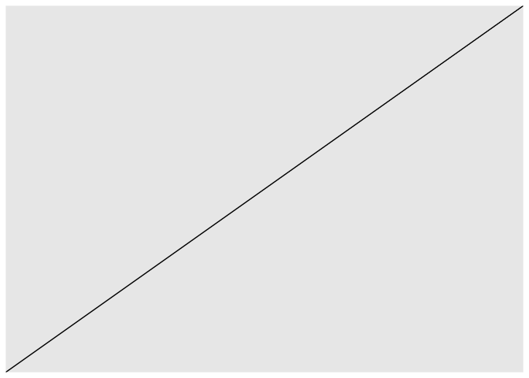
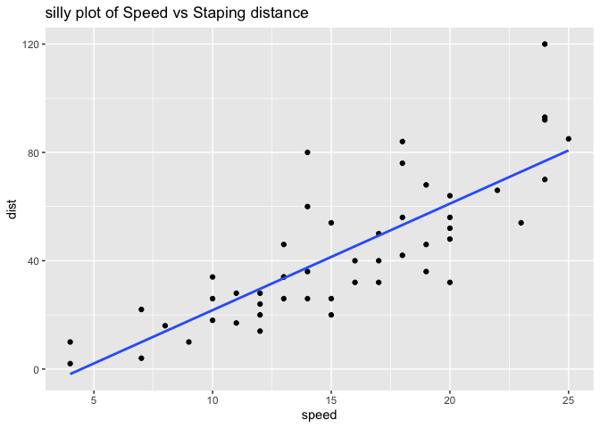
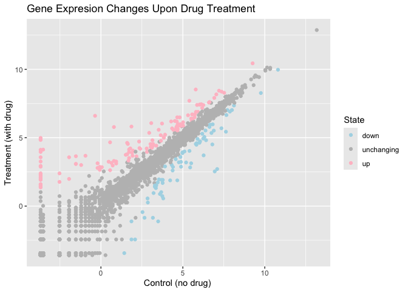
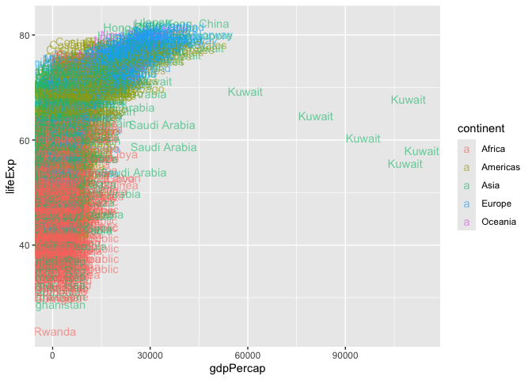
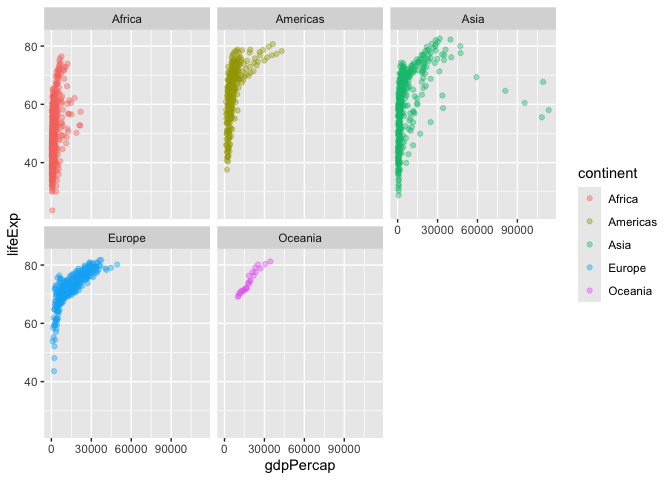

# Class 5: Data Viz with ggplot
Jiayi Zhou (PID:A17856751)

Today we are exploring the ggplot package and how to make nice figures
in R. There are lots of ways to make figures and plot in R. These
include: - so called “base R” - and and on package like ggplot2 Here is
a simple “base” R plot.

``` r
head(cars)
```

      speed dist
    1     4    2
    2     4   10
    3     7    4
    4     7   22
    5     8   16
    6     9   10

``` r
plot(cars)
```


Let’s see how we can plot this with **ggplot2**… 1st I need to install
this add-on package. For this we use the install.packages() function -
**WE DO THIS IN THE CONSOLE, NOT our report**

``` r
library(ggplot2)
```

    Warning: package 'ggplot2' was built under R version 4.5.2

``` r
ggplot(cars)
```


``` r
library(ggplot2)
```

Every ggplot is composed of at least 3 layers: - **data** (i.e. a
data.frame with the columns of data to your plot features
(i.e. aesthitics) - aesthistics **aes()** that map the columns of data
to your plot features(i.e. aesthitics) - geoms like **geom_point()**
that srt how the plot appears

``` r
ggplot(cars) +
aes(x=speed, y=dist) +
geom_abline()
```



For simple “canned” graphs base R is quicker but as things get more
custom and eloborate then gg plot wins out… Lets add more layers to our
ggplot Add a line showing the relationship between x and y Add a title
Add a custom axis labels “Speed (MPH)” and “Distance (ft)” Changing the
theme…

``` r
ggplot(cars) +
aes(x=speed,y=dist) +
geom_point() +
geom_smooth(method="lm", se=FALSE) +
labs(title = "silly plot of Speed vs Staping distance")
```

    `geom_smooth()` using formula = 'y ~ x'


``` r
ggplot(cars) +
aes(x=speed,y=dist) +
geom_point() +
geom_smooth(method="lm", se=FALSE) +
labs(title = "silly plot of Speed vs Staping distance")
```

    `geom_smooth()` using formula = 'y ~ x'



``` r
x = "Speed (MPH)"
y = "Distance (ft)" +
theme_bw()
```

## Going further

Read some gene expression data

``` r
url <- "https://bioboot.github.io/bimm143_S20/class-material/up_down_expression.txt"
genes <- read.delim(url)
head(genes)
```

            Gene Condition1 Condition2      State
    1      A4GNT -3.6808610 -3.4401355 unchanging
    2       AAAS  4.5479580  4.3864126 unchanging
    3      AASDH  3.7190695  3.4787276 unchanging
    4       AATF  5.0784720  5.0151916 unchanging
    5       AATK  0.4711421  0.5598642 unchanging
    6 AB015752.4 -3.6808610 -3.5921390 unchanging

> Q1. How many genes are in this wee dataset?

``` r
nrow(genes)
```

    [1] 5196

> Q2. How many “up” regulated genes are there?

``` r
sum( genes$State == "up" )
```

    [1] 127

A useful function for counting up occurances of thing in a vector is the
table() function.

``` r
table( genes$State )
```


          down unchanging         up 
            72       4997        127 

``` r
p <- ggplot(genes) +
aes(x=Condition1, y=Condition2, col=State) +
geom_point()
p +
scale_colour_manual(values=c("lightblue","gray", "pink")) +
labs(title="Gene Expresion Changes Upon Drug Treatment",
x="Control (no drug) ",
y="Treatment (with drug)")
```



## More plotting example

``` r
# File location online
url <- "https://raw.githubusercontent.com/jennybc/gapminder/master/inst/extdata/gapminder.tsv"
gapminder <- read.delim(url)
```

Lets have a wee peak

``` r
head( gapminder, 3)
```

          country continent year lifeExp      pop gdpPercap
    1 Afghanistan      Asia 1952  28.801  8425333  779.4453
    2 Afghanistan      Asia 1957  30.332  9240934  820.8530
    3 Afghanistan      Asia 1962  31.997 10267083  853.1007

> Q4. How many different country values are in this datset?

``` r
nrow(gapminder)
```

    [1] 1704

``` r
length( table(gapminder$country) )
```

    [1] 142

> Q5. How many different continent values are in the dataset.

``` r
unique(gapminder$continent)
```

    [1] "Asia"     "Europe"   "Africa"   "Americas" "Oceania" 

``` r
ggplot(gapminder) +
aes(gdpPercap, lifeExp, color=continent, label=country) +
geom_text(alpha=0.6)
```



I can use the **ggrepel** package to make more sensible labels here.

``` r
library(ggrepel)
```

I want a separate panel per continent.

``` r
ggplot(gapminder) +
aes(gdpPercap, lifeExp, color=continent, label=country) +
geom_point(alpha=0.4) +
facet_wrap(~continent)
```



> Q6. What are the main advantages of ggplot over base R.

Summary 1. **Beautiful, publication-quality figures**: ggplot makes it
easier to create visually appealing and professional plots, which are
often needed for reports and publications. Base R plots are quick but
can be tricky to refine and polish for final presentation
[\[2\]](https://drive.google.com/file/d/1BYSWJLROqxA1YpuDhJkzUolhiZqiOOKg/view?usp=drivesdk),
[\[3\]](https://drive.google.com/file/d/1tFqKg9_nhVMmKYfiM1CQKDS2PmPwLh8n/view?usp=drivesdk).

2.  **Layered grammar of graphics**: ggplot uses a “layer-by-layer”
    approach, letting you build up plots by adding data, aesthetics, and
    geometries. This makes complex plots easier to construct and modify,
    compared to base R where each plot type often has its own
    peculiarities and arguments
    [\[2\]](https://drive.google.com/file/d/1BYSWJLROqxA1YpuDhJkzUolhiZqiOOKg/view?usp=drivesdk),
    [\[3\]](https://drive.google.com/file/d/1tFqKg9_nhVMmKYfiM1CQKDS2PmPwLh8n/view?usp=drivesdk),
    [\[4\]](https://drive.google.com/file/d/1FDBbIi2Rlw2In9mClB7Mub8oUPgx6y8h/view?usp=drivesdk).

3.  **Sensible defaults**: ggplot provides good-looking default
    settings, so your plots look nice even without much customization.
    Base R gives you full control but often requires more effort to make
    plots look good
    [\[2\]](https://drive.google.com/file/d/1BYSWJLROqxA1YpuDhJkzUolhiZqiOOKg/view?usp=drivesdk).

4.  **Consistency and flexibility**: ggplot uses the same building
    blocks for different plot types, making it easier to learn and apply
    across various visualizations. In base R, different plot types may
    require different functions and arguments
    [\[2\]](https://drive.google.com/file/d/1BYSWJLROqxA1YpuDhJkzUolhiZqiOOKg/view?usp=drivesdk),
    [\[3\]](https://drive.google.com/file/d/1tFqKg9_nhVMmKYfiM1CQKDS2PmPwLh8n/view?usp=drivesdk).

5.  **Easier to combine and customize plots**: ggplot makes it
    straightforward to combine multiple plots, add legends, and adjust
    layouts. In base R, combining plots and customizing layouts can be
    fiddly and require manual adjustments
    [\[2\]](https://drive.google.com/file/d/1BYSWJLROqxA1YpuDhJkzUolhiZqiOOKg/view?usp=drivesdk).
