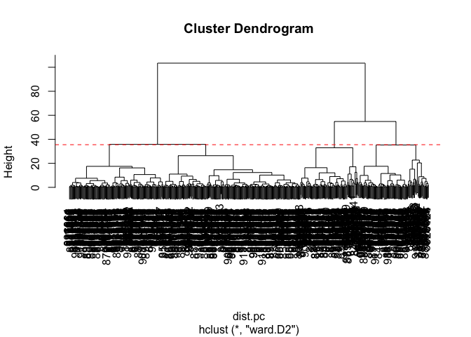
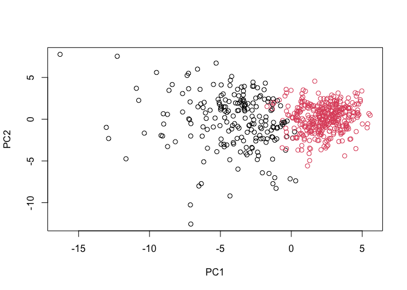

# Class 8: Breast Cancer Analysis Mini Project
Jiayi Zhou (PID:A17856751)

- [Background](#background)
- [Data import](#data-import)
- [Data Exploration](#data-exploration)
- [Principal Component Analysis](#principal-component-analysis)
  - [PCA Score Plot](#pca-score-plot)
- [PCA Scree Plot](#pca-scree-plot)
  - [Communicating PCA results](#communicating-pca-results)
- [Hierarchical clustering](#hierarchical-clustering)
- [Combing methods (PCA and
  Clustering)](#combing-methods-pca-and-clustering)
- [7. Prediction](#7-prediction)

## Background

The goal of this mini-project is to explore a complete analysis using
the unsupervised learning techniques covered in our last class.

The data itself comes from the Wisconsin Breast Cancer Diagnostic Data
Set first reported by K. P. Benne and O. L. Mangasarian: “Robust Linear
Programming Discrimination of Two Linearly Inseparable Sets”.

Values in this data set describe characteristics of the cell nuclei
present in digitized images of a fine needle aspiration (FNA) of a
breast mass.

## Data import

Data was downloaded from the class website as a CSV file.

``` r
wisc.df <- read.csv("WisconsinCancer.csv", row.names=1)
head(wisc.df)
```

             diagnosis radius_mean texture_mean perimeter_mean area_mean
    842302           M       17.99        10.38         122.80    1001.0
    842517           M       20.57        17.77         132.90    1326.0
    84300903         M       19.69        21.25         130.00    1203.0
    84348301         M       11.42        20.38          77.58     386.1
    84358402         M       20.29        14.34         135.10    1297.0
    843786           M       12.45        15.70          82.57     477.1
             smoothness_mean compactness_mean concavity_mean concave.points_mean
    842302           0.11840          0.27760         0.3001             0.14710
    842517           0.08474          0.07864         0.0869             0.07017
    84300903         0.10960          0.15990         0.1974             0.12790
    84348301         0.14250          0.28390         0.2414             0.10520
    84358402         0.10030          0.13280         0.1980             0.10430
    843786           0.12780          0.17000         0.1578             0.08089
             symmetry_mean fractal_dimension_mean radius_se texture_se perimeter_se
    842302          0.2419                0.07871    1.0950     0.9053        8.589
    842517          0.1812                0.05667    0.5435     0.7339        3.398
    84300903        0.2069                0.05999    0.7456     0.7869        4.585
    84348301        0.2597                0.09744    0.4956     1.1560        3.445
    84358402        0.1809                0.05883    0.7572     0.7813        5.438
    843786          0.2087                0.07613    0.3345     0.8902        2.217
             area_se smoothness_se compactness_se concavity_se concave.points_se
    842302    153.40      0.006399        0.04904      0.05373           0.01587
    842517     74.08      0.005225        0.01308      0.01860           0.01340
    84300903   94.03      0.006150        0.04006      0.03832           0.02058
    84348301   27.23      0.009110        0.07458      0.05661           0.01867
    84358402   94.44      0.011490        0.02461      0.05688           0.01885
    843786     27.19      0.007510        0.03345      0.03672           0.01137
             symmetry_se fractal_dimension_se radius_worst texture_worst
    842302       0.03003             0.006193        25.38         17.33
    842517       0.01389             0.003532        24.99         23.41
    84300903     0.02250             0.004571        23.57         25.53
    84348301     0.05963             0.009208        14.91         26.50
    84358402     0.01756             0.005115        22.54         16.67
    843786       0.02165             0.005082        15.47         23.75
             perimeter_worst area_worst smoothness_worst compactness_worst
    842302            184.60     2019.0           0.1622            0.6656
    842517            158.80     1956.0           0.1238            0.1866
    84300903          152.50     1709.0           0.1444            0.4245
    84348301           98.87      567.7           0.2098            0.8663
    84358402          152.20     1575.0           0.1374            0.2050
    843786            103.40      741.6           0.1791            0.5249
             concavity_worst concave.points_worst symmetry_worst
    842302            0.7119               0.2654         0.4601
    842517            0.2416               0.1860         0.2750
    84300903          0.4504               0.2430         0.3613
    84348301          0.6869               0.2575         0.6638
    84358402          0.4000               0.1625         0.2364
    843786            0.5355               0.1741         0.3985
             fractal_dimension_worst
    842302                   0.11890
    842517                   0.08902
    84300903                 0.08758
    84348301                 0.17300
    84358402                 0.07678
    843786                   0.12440

Remove the diagnosis from data for subsequent analysis

``` r
wisc.data <- wisc.df[,-1]
dim(wisc.data)
```

    [1] 569  30

The first column `diagnosis` is the expert opinion on the sample
(i.e. patient FNA).

``` r
head(wisc.df$diagnosis)
```

    [1] "M" "M" "M" "M" "M" "M"

``` r
head(wisc.df[,-1])
```

             radius_mean texture_mean perimeter_mean area_mean smoothness_mean
    842302         17.99        10.38         122.80    1001.0         0.11840
    842517         20.57        17.77         132.90    1326.0         0.08474
    84300903       19.69        21.25         130.00    1203.0         0.10960
    84348301       11.42        20.38          77.58     386.1         0.14250
    84358402       20.29        14.34         135.10    1297.0         0.10030
    843786         12.45        15.70          82.57     477.1         0.12780
             compactness_mean concavity_mean concave.points_mean symmetry_mean
    842302            0.27760         0.3001             0.14710        0.2419
    842517            0.07864         0.0869             0.07017        0.1812
    84300903          0.15990         0.1974             0.12790        0.2069
    84348301          0.28390         0.2414             0.10520        0.2597
    84358402          0.13280         0.1980             0.10430        0.1809
    843786            0.17000         0.1578             0.08089        0.2087
             fractal_dimension_mean radius_se texture_se perimeter_se area_se
    842302                  0.07871    1.0950     0.9053        8.589  153.40
    842517                  0.05667    0.5435     0.7339        3.398   74.08
    84300903                0.05999    0.7456     0.7869        4.585   94.03
    84348301                0.09744    0.4956     1.1560        3.445   27.23
    84358402                0.05883    0.7572     0.7813        5.438   94.44
    843786                  0.07613    0.3345     0.8902        2.217   27.19
             smoothness_se compactness_se concavity_se concave.points_se
    842302        0.006399        0.04904      0.05373           0.01587
    842517        0.005225        0.01308      0.01860           0.01340
    84300903      0.006150        0.04006      0.03832           0.02058
    84348301      0.009110        0.07458      0.05661           0.01867
    84358402      0.011490        0.02461      0.05688           0.01885
    843786        0.007510        0.03345      0.03672           0.01137
             symmetry_se fractal_dimension_se radius_worst texture_worst
    842302       0.03003             0.006193        25.38         17.33
    842517       0.01389             0.003532        24.99         23.41
    84300903     0.02250             0.004571        23.57         25.53
    84348301     0.05963             0.009208        14.91         26.50
    84358402     0.01756             0.005115        22.54         16.67
    843786       0.02165             0.005082        15.47         23.75
             perimeter_worst area_worst smoothness_worst compactness_worst
    842302            184.60     2019.0           0.1622            0.6656
    842517            158.80     1956.0           0.1238            0.1866
    84300903          152.50     1709.0           0.1444            0.4245
    84348301           98.87      567.7           0.2098            0.8663
    84358402          152.20     1575.0           0.1374            0.2050
    843786            103.40      741.6           0.1791            0.5249
             concavity_worst concave.points_worst symmetry_worst
    842302            0.7119               0.2654         0.4601
    842517            0.2416               0.1860         0.2750
    84300903          0.4504               0.2430         0.3613
    84348301          0.6869               0.2575         0.6638
    84358402          0.4000               0.1625         0.2364
    843786            0.5355               0.1741         0.3985
             fractal_dimension_worst
    842302                   0.11890
    842517                   0.08902
    84300903                 0.08758
    84348301                 0.17300
    84358402                 0.07678
    843786                   0.12440

Remove the diagnosis from data for subsequent analysis

``` r
wisc.data <- wisc.df[,-1]
dim(wisc.data)
```

    [1] 569  30

Store the diagnosis as a vector for use lator when we compare our
results to those from experts in the field.

``` r
diagnosis <- factor(wisc.df$diagnosis)
```

## Data Exploration

> Q1. How many observations are in the dataset?

There are 569 obsrvations/pateinets in the dataset.

> Q2. How many of the observations have a malignant diagnosis?

``` r
table(wisc.df$diagnosis)
```


      B   M 
    357 212 

212 samples are malignant (M).

> Q3. How many variables/features in the data are suffixed with \_mean?

``` r
#colnames(wisc.data)
length(grep("_mean", colnames(wisc.data)))
```

    [1] 10

10 features end with \_mean.

## Principal Component Analysis

The `prcomp()` function to do PCA has a `scale-FLASE` default. In
general we nearly always want to set this to TRUE so our analysis is not
dominated by columns/variables in our dataset that have high standard
deviation and mean when compared to others just because the units of
measurements are on different unit/scales.

``` r
wisc.pr <- prcomp(wisc.data, scale=TRUE)
summary(wisc.pr)
```

    Importance of components:
                              PC1    PC2     PC3     PC4     PC5     PC6     PC7
    Standard deviation     3.6444 2.3857 1.67867 1.40735 1.28403 1.09880 0.82172
    Proportion of Variance 0.4427 0.1897 0.09393 0.06602 0.05496 0.04025 0.02251
    Cumulative Proportion  0.4427 0.6324 0.72636 0.79239 0.84734 0.88759 0.91010
                               PC8    PC9    PC10   PC11    PC12    PC13    PC14
    Standard deviation     0.69037 0.6457 0.59219 0.5421 0.51104 0.49128 0.39624
    Proportion of Variance 0.01589 0.0139 0.01169 0.0098 0.00871 0.00805 0.00523
    Cumulative Proportion  0.92598 0.9399 0.95157 0.9614 0.97007 0.97812 0.98335
                              PC15    PC16    PC17    PC18    PC19    PC20   PC21
    Standard deviation     0.30681 0.28260 0.24372 0.22939 0.22244 0.17652 0.1731
    Proportion of Variance 0.00314 0.00266 0.00198 0.00175 0.00165 0.00104 0.0010
    Cumulative Proportion  0.98649 0.98915 0.99113 0.99288 0.99453 0.99557 0.9966
                              PC22    PC23   PC24    PC25    PC26    PC27    PC28
    Standard deviation     0.16565 0.15602 0.1344 0.12442 0.09043 0.08307 0.03987
    Proportion of Variance 0.00091 0.00081 0.0006 0.00052 0.00027 0.00023 0.00005
    Cumulative Proportion  0.99749 0.99830 0.9989 0.99942 0.99969 0.99992 0.99997
                              PC29    PC30
    Standard deviation     0.02736 0.01153
    Proportion of Variance 0.00002 0.00000
    Cumulative Proportion  1.00000 1.00000

> Q4. From your results, what proportion of the original variance is
> captured by the first principal components (PC1)?

PC1 Proportion of Variance = 0.4427, which is 44.27%. So 44.27% of the
variance is captured by PC1.

> Q5. How many principal components (PCs) are required to describe at
> least 70% of the original variance in the data?

After PC3 0.72636 (≥ 0.70), the first point that meets the target. So 3
PCs.

> Q6. How many principal components (PCs) are required to describe at
> least 90% of the original variance in the data?

After PC7 0.91010 (≥ 0.90), the first point that meets the target. So 7
PCs.

> Q7. What stands out to you about this plot? Is it easy or difficult to
> understand? Why?

The biplot is difficult to interpret because the rownames clutter the
plot, making trends and groupings hard to see in this high-dimensional
dataset.

### PCA Score Plot

The main PC result figure is called a “score plot” or “PC plot” or
“ordination plot”…

``` r
library(ggplot2)
```

    Warning: package 'ggplot2' was built under R version 4.5.2

``` r
ggplot(wisc.pr$x) +
  aes(PC1, PC2, col=diagnosis) +
  geom_point()
```


> Q8. Generate a similar plot for principal components 1 and 3. What do
> you notice about these plots?

``` r
# Repeat for components 1 and 3
plot(wisc.pr$x[, c(1, 3)], col = diagnosis, xlab = "PC1", ylab = "PC3")
```


The PC1 vs PC3 plot shows less distinct separation between malignant and
benign samples compared to PC1 vs PC2, because principal component 3
explains less variance than principal component 2, making the groupings
less clear.

## PCA Scree Plot

``` r
pr.var <- wisc.pr$sdev^2
head(pr.var)
```

    [1] 13.281608  5.691355  2.817949  1.980640  1.648731  1.207357

``` r
# Variance explained by each principal component: pve
pve <- pr.var / sum(pr.var)

# Plot variance explained for each principal component
plot(pve, xlab = "Principal Component",
     ylab = "Proportion of Variance Explained",
     ylim = c(0, 1), type = "o")
```


``` r
barplot(pve, ylab = "Percent of Variance Explained",
        names.arg = paste0("PC", 1:length(pve)), las = 2, axes = FALSE)
axis(2, at = pve, labels = round(pve, 2) * 100)
```


There are quite a few CRAN packages that are helpful for PCA. This
includes the factoextra package. Feel free to explore this package. For
example:

``` r
library(factoextra)
```

    Welcome! Want to learn more? See two factoextra-related books at https://goo.gl/ve3WBa

``` r
fviz_eig(wisc.pr, addlabels = TRUE)
```

    Warning in geom_bar(stat = "identity", fill = barfill, color = barcolor, :
    Ignoring empty aesthetic: `width`.


### Communicating PCA results

> Q9. For the first principal component, what is the component of the
> loading vector (i.e. wisc.pr\$rotation\[,1\]) for the feature
> concave.points_mean?

``` r
wisc.pr$rotation["concave.points_mean","PC1"]
```

    [1] -0.2608538

Loading of concave.points_mean on PC1 is −0.2608538.

> Q10. What is the minimum number of principal components required to
> explain 80% of the variance of the data?

We need 5 PCs to capture more than 80% variance.

``` r
summary(wisc.pr)
```

    Importance of components:
                              PC1    PC2     PC3     PC4     PC5     PC6     PC7
    Standard deviation     3.6444 2.3857 1.67867 1.40735 1.28403 1.09880 0.82172
    Proportion of Variance 0.4427 0.1897 0.09393 0.06602 0.05496 0.04025 0.02251
    Cumulative Proportion  0.4427 0.6324 0.72636 0.79239 0.84734 0.88759 0.91010
                               PC8    PC9    PC10   PC11    PC12    PC13    PC14
    Standard deviation     0.69037 0.6457 0.59219 0.5421 0.51104 0.49128 0.39624
    Proportion of Variance 0.01589 0.0139 0.01169 0.0098 0.00871 0.00805 0.00523
    Cumulative Proportion  0.92598 0.9399 0.95157 0.9614 0.97007 0.97812 0.98335
                              PC15    PC16    PC17    PC18    PC19    PC20   PC21
    Standard deviation     0.30681 0.28260 0.24372 0.22939 0.22244 0.17652 0.1731
    Proportion of Variance 0.00314 0.00266 0.00198 0.00175 0.00165 0.00104 0.0010
    Cumulative Proportion  0.98649 0.98915 0.99113 0.99288 0.99453 0.99557 0.9966
                              PC22    PC23   PC24    PC25    PC26    PC27    PC28
    Standard deviation     0.16565 0.15602 0.1344 0.12442 0.09043 0.08307 0.03987
    Proportion of Variance 0.00091 0.00081 0.0006 0.00052 0.00027 0.00023 0.00005
    Cumulative Proportion  0.99749 0.99830 0.9989 0.99942 0.99969 0.99992 0.99997
                              PC29    PC30
    Standard deviation     0.02736 0.01153
    Proportion of Variance 0.00002 0.00000
    Cumulative Proportion  1.00000 1.00000

## Hierarchical clustering

Just clustering the original data is not very informative or helpful.

``` r
data.scaled <- scale(wisc.data)
data.dist <- dist(data.scaled)
wisc.hclust <- hclust(data.dist)
```

View the clustering dendrogram result

``` r
plot(wisc.hclust)
```


``` r
wisc.hclust.clusters <- cutree(wisc.hclust, k=4)
table(wisc.hclust.clusters)
```

    wisc.hclust.clusters
      1   2   3   4 
    177   7 383   2 

``` r
table(wisc.hclust.clusters, diagnosis)
```

                        diagnosis
    wisc.hclust.clusters   B   M
                       1  12 165
                       2   2   5
                       3 343  40
                       4   0   2

## Combing methods (PCA and Clustering)

Clustering the origional data was not very productive. The PCA results
looked promising. Here we combine these methods by clustering from our
PCA results. In other words “clustering in PC space”…

> Q11. Using the plot() and abline() functions, what is the height at
> which the clustering model has 4 clusters?

``` r
## Take the first 3 PCs
dist.pc <- dist(wisc.pr$x[,1:3])
wisc.pr.hclust <- hclust(dist.pc, method="ward.D2")
```

View the tree…

``` r
N <- length(wisc.pr.hclust$height)
h_cut <- mean(wisc.pr.hclust$height[c(N-3, N-2)])

plot(wisc.pr.hclust)
abline(h = h_cut, col = "red", lty = 2)
```



> Q12. Can you find a better cluster vs diagnoses match by cutting into
> a different number of clusters between 2 and 10?

``` r
for (k in 2:10) {
  cat("\n# k =", k, "\n")
  print(table(cutree(wisc.hclust, k), diagnosis))
  cat("Accuracy:",
      round(sum(apply(table(cutree(wisc.hclust, k), diagnosis), 1, max)) / length(diagnosis), 4),
      "\n")
}
```


    # k = 2 
       diagnosis
          B   M
      1 357 210
      2   0   2
    Accuracy: 0.6309 

    # k = 3 
       diagnosis
          B   M
      1 355 205
      2   2   5
      3   0   2
    Accuracy: 0.6362 

    # k = 4 
       diagnosis
          B   M
      1  12 165
      2   2   5
      3 343  40
      4   0   2
    Accuracy: 0.9051 

    # k = 5 
       diagnosis
          B   M
      1  12 165
      2   0   5
      3 343  40
      4   2   0
      5   0   2
    Accuracy: 0.9086 

    # k = 6 
       diagnosis
          B   M
      1  12 165
      2   0   5
      3 331  39
      4   2   0
      5  12   1
      6   0   2
    Accuracy: 0.9086 

    # k = 7 
       diagnosis
          B   M
      1  12 165
      2   0   3
      3 331  39
      4   2   0
      5  12   1
      6   0   2
      7   0   2
    Accuracy: 0.9086 

    # k = 8 
       diagnosis
          B   M
      1  12  86
      2   0  79
      3   0   3
      4 331  39
      5   2   0
      6  12   1
      7   0   2
      8   0   2
    Accuracy: 0.9086 

    # k = 9 
       diagnosis
          B   M
      1  12  86
      2   0  79
      3   0   3
      4 331  39
      5   2   0
      6  12   0
      7   0   2
      8   0   2
      9   0   1
    Accuracy: 0.9104 

    # k = 10 
        diagnosis
           B   M
      1   12  86
      2    0  59
      3    0   3
      4  331  39
      5    0  20
      6    2   0
      7   12   0
      8    0   2
      9    0   2
      10   0   1
    Accuracy: 0.9104 

The best match occurs at k = 9and k = 10.

> Q13. Which method gives your favorite results for the same data.dist
> dataset? Explain your reasoning.

The Ward.D2 method gives the best results because it minimizes the total
within-cluster variance at each merging step, rather than focusing only
on distances between points, leading to tighter groupings ideal for this
dataset.

To get our clustering membership vector (i.e. our main clustering
result) we “cut” the tree at a desired height or to yield a desired
number of “k” groups.

``` r
grps <- cutree(wisc.pr.hclust, k=2)
table(grps)
```

    grps
      1   2 
    203 366 

How does this clustering gps compare to the expert diagnosis

``` r
table(grps, diagnosis)
```

        diagnosis
    grps   B   M
       1  24 179
       2 333  33

``` r
plot(wisc.pr$x[,1:2], col=grps)
```



``` r
plot(wisc.pr$x[,1:2], col=diagnosis)
```


> Q15. How well does the newly created model with four clusters separate
> out the two diagnoses?

``` r
wisc.pr.hclust <- hclust(dist(wisc.pr$x[, 1:7]), method = "ward.D2")
wisc.pr.hclust.clusters <- cutree(wisc.pr.hclust, k = 2)
table(wisc.pr.hclust.clusters, diagnosis)
```

                           diagnosis
    wisc.pr.hclust.clusters   B   M
                          1  28 188
                          2 329  24

> Q16. How well do the k-means and hierarchical clustering models you
> created in previous sections (i.e. before PCA) do in terms of
> separating the diagnoses? Again, use the table() function to compare
> the output of each model (wisc.km\$cluster and wisc.hclust.clusters)
> with the vector containing the actual diagnoses.

``` r
set.seed(1234); wisc.km <- kmeans(scale(wisc.data), centers = 2, nstart = 20)
wisc.hclust.clusters <- cutree(wisc.hclust, k = 4)
table(wisc.km$cluster, diagnosis)
```

       diagnosis
          B   M
      1  14 175
      2 343  37

``` r
table(wisc.hclust.clusters, diagnosis)
```

                        diagnosis
    wisc.hclust.clusters   B   M
                       1  12 165
                       2   2   5
                       3 343  40
                       4   0   2

Sensitivity: TP/(TP+FN) Specificity: TN/(TN+FN)

> Q17. Which of your analysis procedures resulted in a clustering model
> with the best specificity? How about sensitivity?

Best specificity: k-means and hierarchical. Best sensitivity: PCA and
Ward.D2.

## 7. Prediction

We can use our PCA model for prediction with new input patient samples.

``` r
#url <- "new_samples.csv"
url <- "https://tinyurl.com/new-samples-CSV"
new <- read.csv(url)
npc <- predict(wisc.pr, newdata=new)
npc
```

               PC1       PC2        PC3        PC4       PC5        PC6        PC7
    [1,]  2.576616 -3.135913  1.3990492 -0.7631950  2.781648 -0.8150185 -0.3959098
    [2,] -4.754928 -3.009033 -0.1660946 -0.6052952 -1.140698 -1.2189945  0.8193031
                PC8       PC9       PC10      PC11      PC12      PC13     PC14
    [1,] -0.2307350 0.1029569 -0.9272861 0.3411457  0.375921 0.1610764 1.187882
    [2,] -0.3307423 0.5281896 -0.4855301 0.7173233 -1.185917 0.5893856 0.303029
              PC15       PC16        PC17        PC18        PC19       PC20
    [1,] 0.3216974 -0.1743616 -0.07875393 -0.11207028 -0.08802955 -0.2495216
    [2,] 0.1299153  0.1448061 -0.40509706  0.06565549  0.25591230 -0.4289500
               PC21       PC22       PC23       PC24        PC25         PC26
    [1,]  0.1228233 0.09358453 0.08347651  0.1223396  0.02124121  0.078884581
    [2,] -0.1224776 0.01732146 0.06316631 -0.2338618 -0.20755948 -0.009833238
                 PC27        PC28         PC29         PC30
    [1,]  0.220199544 -0.02946023 -0.015620933  0.005269029
    [2,] -0.001134152  0.09638361  0.002795349 -0.019015820

``` r
g <- relevel(factor(grps), ref = "2")
plot(wisc.pr$x[,1:2], col=g)
points(npc[,1], npc[,2], col="blue", pch=16, cex=3)
text(npc[,1], npc[,2], c(1,2), col="white")
```


> Q18. Which of these new patients should we prioritize for follow up
> based on your results?

Prioritize New Patient 1 for follow-up. Malignant cases sit at higher
PC1 (larger, more irregular nuclei). Patient 1 has PC1 ≈ +2.58, while
Patient 2 has PC1 ≈ −4.75.
