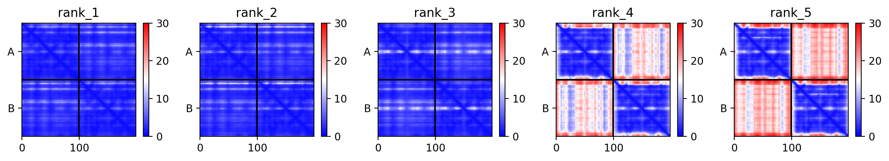
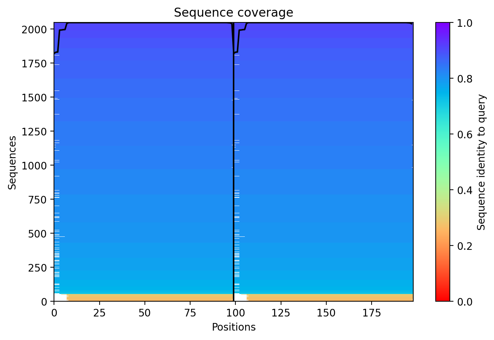
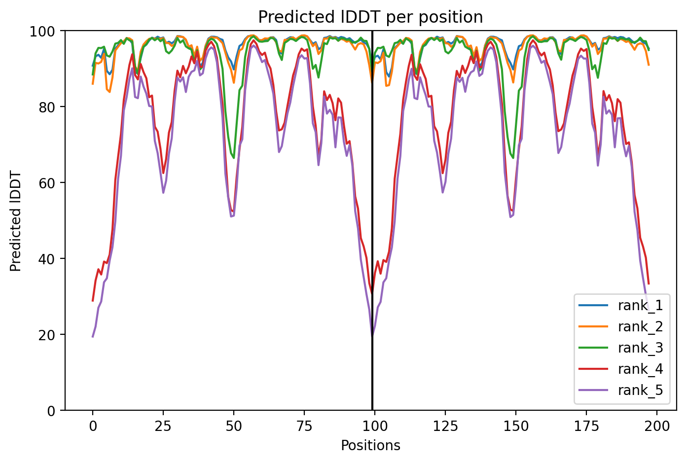
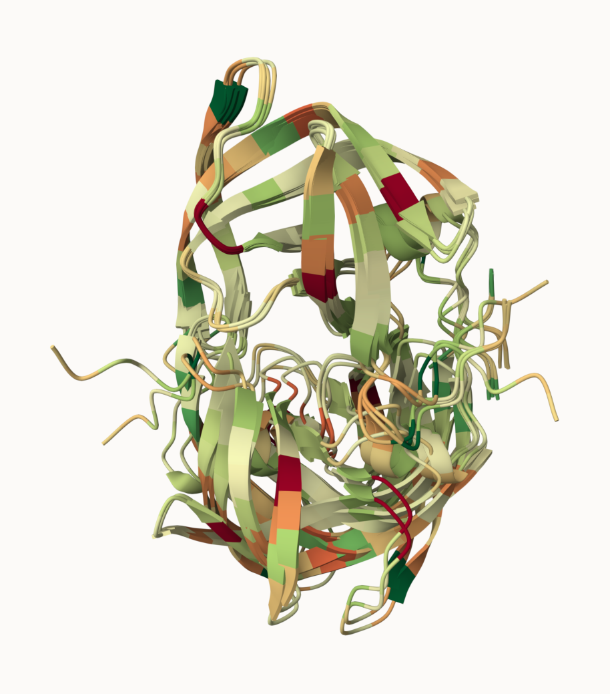
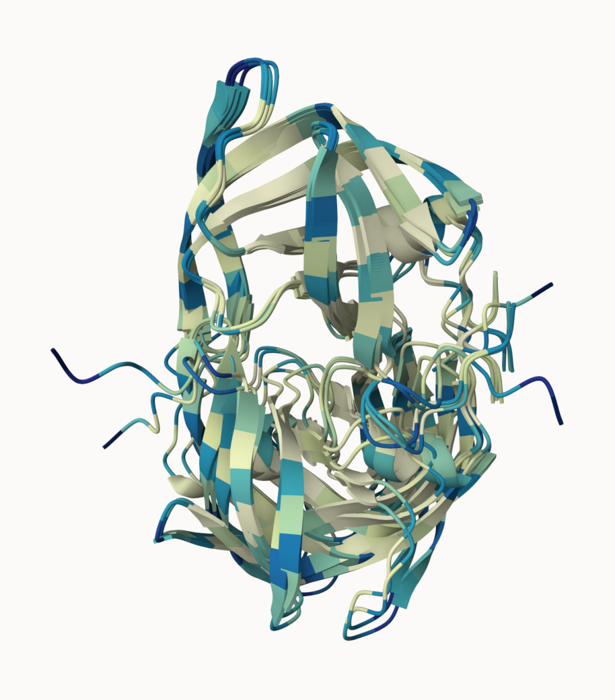
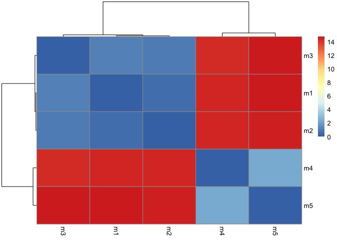
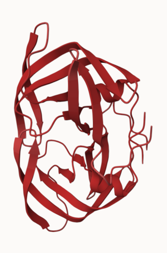
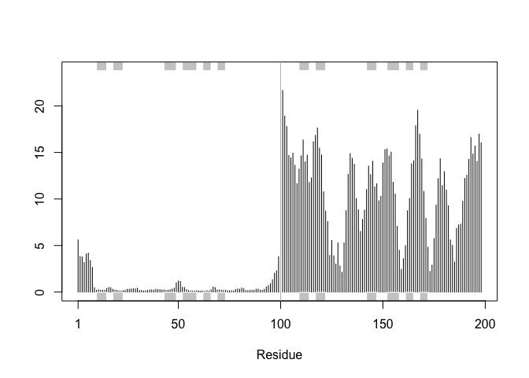
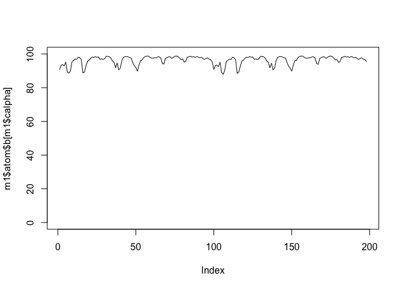

# Class 11: Structural Bioinoformatics pt2
Jiayi Zhou (PID:A17856751）

- [AlphaFold Data Base (AFDB)](#alphafold-data-base-afdb)
- [Generating your own structure
  predictions](#generating-your-own-structure-predictions)
- [Custom analysis of resulting models in
  R](#custom-analysis-of-resulting-models-in-r)
- [Predicted Alignment Error for
  domains](#predicted-alignment-error-for-domains)
- [Residue conservation from alignment
  file](#residue-conservation-from-alignment-file)

## AlphaFold Data Base (AFDB)

The EBI maintains the largest database of AlphaFold structure prediction
models at: https://alphafold.ebi.ac.uk

From last class (before Halloween) we saw that PDB has 244,290 (Oct
2025)

The total number of protein sequences in UniProtKB is 199,579,901.

> Key Point: This is a tiny fraction of sequence space that has
> structural coverage (0.12%)

``` r
244290/199579901*100
```

    [1] 0.1224021

AFDB is attempting to address this gap…

there are two “Quality Scores” from Alphafold, one for residues
(i.e. each amino acid) called **pLDDT** score. The other **PAE** score
measures the confidence in the relative position of two residues (i.e. a
score for every pair of residues).

## Generating your own structure predictions

Figure of 5 generated HIV_PR models



Figure of sequence coverage



Figure of Predicted IDDT per position


\## Visualization of the models and their estimated reliability

Fitted and pLDDT colored Nras structure models.


Coloring the Residue property of Secondary Structure


Coloring the Residue property of Hydrophobicity

 Coloring the Residue property of
Accessible surface Area



## Custom analysis of resulting models in R

Now we read the results of the more complicated HIV-Pr dimer AlphaFold2
models into R using `Bio3D package`.

To move our AlphaFold results directory into our RStudio project
directory…

``` r
results_dir <- "hivprdimer_23119/" 

pdb_files <- list.files(path=results_dir,
                        pattern="*.pdb",
                        full.names = TRUE)
```

Print out our PDB file names

``` r
basename(pdb_files)
```

    [1] "HIVPRDimer_23119_unrelaxed_rank_001_alphafold2_multimer_v3_model_4_seed_000.pdb"
    [2] "HIVPRDimer_23119_unrelaxed_rank_002_alphafold2_multimer_v3_model_1_seed_000.pdb"
    [3] "HIVPRDimer_23119_unrelaxed_rank_003_alphafold2_multimer_v3_model_5_seed_000.pdb"
    [4] "HIVPRDimer_23119_unrelaxed_rank_004_alphafold2_multimer_v3_model_2_seed_000.pdb"
    [5] "HIVPRDimer_23119_unrelaxed_rank_005_alphafold2_multimer_v3_model_3_seed_000.pdb"

``` r
library(bio3d)

pdbs <- pdbaln(pdb_files, fit=TRUE, exefile="msa")
```

    Reading PDB files:
    hivprdimer_23119//HIVPRDimer_23119_unrelaxed_rank_001_alphafold2_multimer_v3_model_4_seed_000.pdb
    hivprdimer_23119//HIVPRDimer_23119_unrelaxed_rank_002_alphafold2_multimer_v3_model_1_seed_000.pdb
    hivprdimer_23119//HIVPRDimer_23119_unrelaxed_rank_003_alphafold2_multimer_v3_model_5_seed_000.pdb
    hivprdimer_23119//HIVPRDimer_23119_unrelaxed_rank_004_alphafold2_multimer_v3_model_2_seed_000.pdb
    hivprdimer_23119//HIVPRDimer_23119_unrelaxed_rank_005_alphafold2_multimer_v3_model_3_seed_000.pdb
    .....

    Extracting sequences

    pdb/seq: 1   name: hivprdimer_23119//HIVPRDimer_23119_unrelaxed_rank_001_alphafold2_multimer_v3_model_4_seed_000.pdb 
    pdb/seq: 2   name: hivprdimer_23119//HIVPRDimer_23119_unrelaxed_rank_002_alphafold2_multimer_v3_model_1_seed_000.pdb 
    pdb/seq: 3   name: hivprdimer_23119//HIVPRDimer_23119_unrelaxed_rank_003_alphafold2_multimer_v3_model_5_seed_000.pdb 
    pdb/seq: 4   name: hivprdimer_23119//HIVPRDimer_23119_unrelaxed_rank_004_alphafold2_multimer_v3_model_2_seed_000.pdb 
    pdb/seq: 5   name: hivprdimer_23119//HIVPRDimer_23119_unrelaxed_rank_005_alphafold2_multimer_v3_model_3_seed_000.pdb 

To use the `rmsd()` function to calculate the RMSD between all pairs
models…

``` r
rd <- rmsd(pdbs, fit=T)
```

    Warning in rmsd(pdbs, fit = T): No indices provided, using the 198 non NA positions

``` r
range(rd)
```

    [1]  0.000 14.754

Draw a heatmap of these RMSD matrix values

``` r
library(pheatmap)

colnames(rd) <- paste0("m",1:5)
rownames(rd) <- paste0("m",1:5)
pheatmap(rd)
```



Models 1 and 2 are most similar to each other, while 4 and 5 resemble
each other and are closer to 3 than to 1 or 2.

``` r
pdb <- read.pdb("1hsg")
```

      Note: Accessing on-line PDB file

``` r
plotb3(pdbs$b[1,], typ="l", lwd=2, sse=pdb)
points(pdbs$b[2,], typ="l", col="red")
points(pdbs$b[3,], typ="l", col="blue")
points(pdbs$b[4,], typ="l", col="darkgreen")
points(pdbs$b[5,], typ="l", col="orange")
abline(v=100, col="gray")
```


``` r
core <- core.find(pdbs)
```

     core size 197 of 198  vol = 9885.822 
     core size 196 of 198  vol = 6896.71 
     core size 195 of 198  vol = 1337.847 
     core size 194 of 198  vol = 1040.67 
     core size 193 of 198  vol = 951.857 
     core size 192 of 198  vol = 899.083 
     core size 191 of 198  vol = 834.732 
     core size 190 of 198  vol = 771.338 
     core size 189 of 198  vol = 733.065 
     core size 188 of 198  vol = 697.28 
     core size 187 of 198  vol = 659.742 
     core size 186 of 198  vol = 625.273 
     core size 185 of 198  vol = 589.541 
     core size 184 of 198  vol = 568.253 
     core size 183 of 198  vol = 545.015 
     core size 182 of 198  vol = 512.889 
     core size 181 of 198  vol = 490.723 
     core size 180 of 198  vol = 470.266 
     core size 179 of 198  vol = 450.731 
     core size 178 of 198  vol = 434.735 
     core size 177 of 198  vol = 420.337 
     core size 176 of 198  vol = 406.658 
     core size 175 of 198  vol = 393.334 
     core size 174 of 198  vol = 382.395 
     core size 173 of 198  vol = 372.858 
     core size 172 of 198  vol = 356.994 
     core size 171 of 198  vol = 346.567 
     core size 170 of 198  vol = 337.446 
     core size 169 of 198  vol = 326.659 
     core size 168 of 198  vol = 314.95 
     core size 167 of 198  vol = 304.127 
     core size 166 of 198  vol = 294.552 
     core size 165 of 198  vol = 285.648 
     core size 164 of 198  vol = 278.884 
     core size 163 of 198  vol = 266.765 
     core size 162 of 198  vol = 258.994 
     core size 161 of 198  vol = 247.723 
     core size 160 of 198  vol = 239.84 
     core size 159 of 198  vol = 234.963 
     core size 158 of 198  vol = 230.062 
     core size 157 of 198  vol = 221.985 
     core size 156 of 198  vol = 215.62 
     core size 155 of 198  vol = 206.793 
     core size 154 of 198  vol = 196.984 
     core size 153 of 198  vol = 188.539 
     core size 152 of 198  vol = 182.262 
     core size 151 of 198  vol = 176.954 
     core size 150 of 198  vol = 170.712 
     core size 149 of 198  vol = 166.119 
     core size 148 of 198  vol = 159.796 
     core size 147 of 198  vol = 153.767 
     core size 146 of 198  vol = 149.092 
     core size 145 of 198  vol = 143.657 
     core size 144 of 198  vol = 137.138 
     core size 143 of 198  vol = 132.517 
     core size 142 of 198  vol = 127.231 
     core size 141 of 198  vol = 121.574 
     core size 140 of 198  vol = 116.775 
     core size 139 of 198  vol = 112.57 
     core size 138 of 198  vol = 108.17 
     core size 137 of 198  vol = 105.133 
     core size 136 of 198  vol = 101.249 
     core size 135 of 198  vol = 97.374 
     core size 134 of 198  vol = 92.974 
     core size 133 of 198  vol = 88.184 
     core size 132 of 198  vol = 84.029 
     core size 131 of 198  vol = 81.898 
     core size 130 of 198  vol = 78.019 
     core size 129 of 198  vol = 75.272 
     core size 128 of 198  vol = 73.052 
     core size 127 of 198  vol = 70.695 
     core size 126 of 198  vol = 68.975 
     core size 125 of 198  vol = 66.694 
     core size 124 of 198  vol = 64.394 
     core size 123 of 198  vol = 62.092 
     core size 122 of 198  vol = 59.045 
     core size 121 of 198  vol = 56.629 
     core size 120 of 198  vol = 54.016 
     core size 119 of 198  vol = 51.806 
     core size 118 of 198  vol = 49.652 
     core size 117 of 198  vol = 48.193 
     core size 116 of 198  vol = 46.648 
     core size 115 of 198  vol = 44.752 
     core size 114 of 198  vol = 43.292 
     core size 113 of 198  vol = 41.093 
     core size 112 of 198  vol = 39.147 
     core size 111 of 198  vol = 36.472 
     core size 110 of 198  vol = 34.117 
     core size 109 of 198  vol = 31.47 
     core size 108 of 198  vol = 29.448 
     core size 107 of 198  vol = 27.325 
     core size 106 of 198  vol = 25.822 
     core size 105 of 198  vol = 24.15 
     core size 104 of 198  vol = 22.648 
     core size 103 of 198  vol = 21.069 
     core size 102 of 198  vol = 19.953 
     core size 101 of 198  vol = 18.3 
     core size 100 of 198  vol = 15.723 
     core size 99 of 198  vol = 14.841 
     core size 98 of 198  vol = 11.646 
     core size 97 of 198  vol = 9.434 
     core size 96 of 198  vol = 7.354 
     core size 95 of 198  vol = 6.179 
     core size 94 of 198  vol = 5.666 
     core size 93 of 198  vol = 4.705 
     core size 92 of 198  vol = 3.665 
     core size 91 of 198  vol = 2.77 
     core size 90 of 198  vol = 2.151 
     core size 89 of 198  vol = 1.715 
     core size 88 of 198  vol = 1.15 
     core size 87 of 198  vol = 0.874 
     core size 86 of 198  vol = 0.685 
     core size 85 of 198  vol = 0.528 
     core size 84 of 198  vol = 0.37 
     FINISHED: Min vol ( 0.5 ) reached

``` r
core.inds <- print(core, vol=0.5)
```

    # 85 positions (cumulative volume <= 0.5 Angstrom^3) 
      start end length
    1     9  49     41
    2    52  95     44

``` r
xyz <- pdbfit(pdbs, core.inds, outpath="corefit_structures")
```

We can also plot the pLDDT values across all models

``` r
pdb <- read.pdb("1hsg")
```

      Note: Accessing on-line PDB file

    Warning in get.pdb(file, path = tempdir(), verbose = FALSE):
    /var/folders/hw/mb7lcvrd0v17c4nnmhd27vr40000gn/T//RtmpBaKZL4/1hsg.pdb exists.
    Skipping download

``` r
plotb3(pdbs$b[1,], typ="l", lwd=2, sse=pdb)
points(pdbs$b[2,], typ="l", col="red")
points(pdbs$b[3,], typ="l", col="blue")
points(pdbs$b[4,], typ="l", col="darkgreen")
points(pdbs$b[5,], typ="l", col="orange")
abline(v=100, col="gray")
```


To enhance the alignment of our models, we can identify the most stable
“rigid core” shared among them using the `core.find()` function:

``` r
core <- core.find(pdbs)
```

     core size 197 of 198  vol = 9885.822 
     core size 196 of 198  vol = 6896.71 
     core size 195 of 198  vol = 1337.847 
     core size 194 of 198  vol = 1040.67 
     core size 193 of 198  vol = 951.857 
     core size 192 of 198  vol = 899.083 
     core size 191 of 198  vol = 834.732 
     core size 190 of 198  vol = 771.338 
     core size 189 of 198  vol = 733.065 
     core size 188 of 198  vol = 697.28 
     core size 187 of 198  vol = 659.742 
     core size 186 of 198  vol = 625.273 
     core size 185 of 198  vol = 589.541 
     core size 184 of 198  vol = 568.253 
     core size 183 of 198  vol = 545.015 
     core size 182 of 198  vol = 512.889 
     core size 181 of 198  vol = 490.723 
     core size 180 of 198  vol = 470.266 
     core size 179 of 198  vol = 450.731 
     core size 178 of 198  vol = 434.735 
     core size 177 of 198  vol = 420.337 
     core size 176 of 198  vol = 406.658 
     core size 175 of 198  vol = 393.334 
     core size 174 of 198  vol = 382.395 
     core size 173 of 198  vol = 372.858 
     core size 172 of 198  vol = 356.994 
     core size 171 of 198  vol = 346.567 
     core size 170 of 198  vol = 337.446 
     core size 169 of 198  vol = 326.659 
     core size 168 of 198  vol = 314.95 
     core size 167 of 198  vol = 304.127 
     core size 166 of 198  vol = 294.552 
     core size 165 of 198  vol = 285.648 
     core size 164 of 198  vol = 278.884 
     core size 163 of 198  vol = 266.765 
     core size 162 of 198  vol = 258.994 
     core size 161 of 198  vol = 247.723 
     core size 160 of 198  vol = 239.84 
     core size 159 of 198  vol = 234.963 
     core size 158 of 198  vol = 230.062 
     core size 157 of 198  vol = 221.985 
     core size 156 of 198  vol = 215.62 
     core size 155 of 198  vol = 206.793 
     core size 154 of 198  vol = 196.984 
     core size 153 of 198  vol = 188.539 
     core size 152 of 198  vol = 182.262 
     core size 151 of 198  vol = 176.954 
     core size 150 of 198  vol = 170.712 
     core size 149 of 198  vol = 166.119 
     core size 148 of 198  vol = 159.796 
     core size 147 of 198  vol = 153.767 
     core size 146 of 198  vol = 149.092 
     core size 145 of 198  vol = 143.657 
     core size 144 of 198  vol = 137.138 
     core size 143 of 198  vol = 132.517 
     core size 142 of 198  vol = 127.231 
     core size 141 of 198  vol = 121.574 
     core size 140 of 198  vol = 116.775 
     core size 139 of 198  vol = 112.57 
     core size 138 of 198  vol = 108.17 
     core size 137 of 198  vol = 105.133 
     core size 136 of 198  vol = 101.249 
     core size 135 of 198  vol = 97.374 
     core size 134 of 198  vol = 92.974 
     core size 133 of 198  vol = 88.184 
     core size 132 of 198  vol = 84.029 
     core size 131 of 198  vol = 81.898 
     core size 130 of 198  vol = 78.019 
     core size 129 of 198  vol = 75.272 
     core size 128 of 198  vol = 73.052 
     core size 127 of 198  vol = 70.695 
     core size 126 of 198  vol = 68.975 
     core size 125 of 198  vol = 66.694 
     core size 124 of 198  vol = 64.394 
     core size 123 of 198  vol = 62.092 
     core size 122 of 198  vol = 59.045 
     core size 121 of 198  vol = 56.629 
     core size 120 of 198  vol = 54.016 
     core size 119 of 198  vol = 51.806 
     core size 118 of 198  vol = 49.652 
     core size 117 of 198  vol = 48.193 
     core size 116 of 198  vol = 46.648 
     core size 115 of 198  vol = 44.752 
     core size 114 of 198  vol = 43.292 
     core size 113 of 198  vol = 41.093 
     core size 112 of 198  vol = 39.147 
     core size 111 of 198  vol = 36.472 
     core size 110 of 198  vol = 34.117 
     core size 109 of 198  vol = 31.47 
     core size 108 of 198  vol = 29.448 
     core size 107 of 198  vol = 27.325 
     core size 106 of 198  vol = 25.822 
     core size 105 of 198  vol = 24.15 
     core size 104 of 198  vol = 22.648 
     core size 103 of 198  vol = 21.069 
     core size 102 of 198  vol = 19.953 
     core size 101 of 198  vol = 18.3 
     core size 100 of 198  vol = 15.723 
     core size 99 of 198  vol = 14.841 
     core size 98 of 198  vol = 11.646 
     core size 97 of 198  vol = 9.434 
     core size 96 of 198  vol = 7.354 
     core size 95 of 198  vol = 6.179 
     core size 94 of 198  vol = 5.666 
     core size 93 of 198  vol = 4.705 
     core size 92 of 198  vol = 3.665 
     core size 91 of 198  vol = 2.77 
     core size 90 of 198  vol = 2.151 
     core size 89 of 198  vol = 1.715 
     core size 88 of 198  vol = 1.15 
     core size 87 of 198  vol = 0.874 
     core size 86 of 198  vol = 0.685 
     core size 85 of 198  vol = 0.528 
     core size 84 of 198  vol = 0.37 
     FINISHED: Min vol ( 0.5 ) reached

The resulting core atom positions then serve as a reference for a
refined superposition, after which we can save the fitted structures to
`corefit_structures`:

``` r
core.inds <- print(core, vol=0.5)
```

    # 85 positions (cumulative volume <= 0.5 Angstrom^3) 
      start end length
    1     9  49     41
    2    52  95     44

``` r
xyz <- pdbfit(pdbs, core.inds, outpath="corefit_structures")
```

We can now visualize these structures in Mol\* and apply coloring based
on the Atom Property **Uncertainty/Disorder**, corresponding to the
**B-factor** column that stores the **pLDDT** scores.

/Users/jennyzhou/Downloads/M1_CONSERV.PDB-2.png



Examine the RMSF between positions of the structure.

``` r
rf <- rmsf(xyz)

plotb3(rf, sse=pdb)
abline(v=100, col="gray", ylab="RMSF")
```



``` r
library(bio3d)

m1 <- read.pdb(pdb_files[1])
m1
```


     Call:  read.pdb(file = pdb_files[1])

       Total Models#: 1
         Total Atoms#: 1514,  XYZs#: 4542  Chains#: 2  (values: A B)

         Protein Atoms#: 1514  (residues/Calpha atoms#: 198)
         Nucleic acid Atoms#: 0  (residues/phosphate atoms#: 0)

         Non-protein/nucleic Atoms#: 0  (residues: 0)
         Non-protein/nucleic resid values: [ none ]

       Protein sequence:
          PQITLWQRPLVTIKIGGQLKEALLDTGADDTVLEEMSLPGRWKPKMIGGIGGFIKVRQYD
          QILIEICGHKAIGTVLVGPTPVNIIGRNLLTQIGCTLNFPQITLWQRPLVTIKIGGQLKE
          ALLDTGADDTVLEEMSLPGRWKPKMIGGIGGFIKVRQYDQILIEICGHKAIGTVLVGPTP
          VNIIGRNLLTQIGCTLNF

    + attr: atom, xyz, calpha, call

``` r
head(m1$atom)
```

      type eleno elety  alt resid chain resno insert      x      y      z o     b
    1 ATOM     1     N <NA>   PRO     A     1   <NA> 16.922 -3.898 -6.254 1 90.81
    2 ATOM     2    CA <NA>   PRO     A     1   <NA> 16.891 -2.467 -6.562 1 90.81
    3 ATOM     3     C <NA>   PRO     A     1   <NA> 16.406 -1.617 -5.395 1 90.81
    4 ATOM     4    CB <NA>   PRO     A     1   <NA> 15.930 -2.373 -7.746 1 90.81
    5 ATOM     5     O <NA>   PRO     A     1   <NA> 15.820 -2.146 -4.445 1 90.81
    6 ATOM     6    CG <NA>   PRO     A     1   <NA> 15.031 -3.559 -7.598 1 90.81
      segid elesy charge
    1  <NA>     N   <NA>
    2  <NA>     C   <NA>
    3  <NA>     C   <NA>
    4  <NA>     C   <NA>
    5  <NA>     O   <NA>
    6  <NA>     C   <NA>

``` r
library(bio3d)

m1 <- read.pdb(pdb_files[1])
m1
```


     Call:  read.pdb(file = pdb_files[1])

       Total Models#: 1
         Total Atoms#: 1514,  XYZs#: 4542  Chains#: 2  (values: A B)

         Protein Atoms#: 1514  (residues/Calpha atoms#: 198)
         Nucleic acid Atoms#: 0  (residues/phosphate atoms#: 0)

         Non-protein/nucleic Atoms#: 0  (residues: 0)
         Non-protein/nucleic resid values: [ none ]

       Protein sequence:
          PQITLWQRPLVTIKIGGQLKEALLDTGADDTVLEEMSLPGRWKPKMIGGIGGFIKVRQYD
          QILIEICGHKAIGTVLVGPTPVNIIGRNLLTQIGCTLNFPQITLWQRPLVTIKIGGQLKE
          ALLDTGADDTVLEEMSLPGRWKPKMIGGIGGFIKVRQYDQILIEICGHKAIGTVLVGPTP
          VNIIGRNLLTQIGCTLNF

    + attr: atom, xyz, calpha, call

``` r
m1$atom$b
```

       [1] 90.81 90.81 90.81 90.81 90.81 90.81 90.81 93.25 93.25 93.25 93.25 93.25
      [13] 93.25 93.25 93.25 93.25 93.69 93.69 93.69 93.69 93.69 93.69 93.69 93.69
      [25] 92.88 92.88 92.88 92.88 92.88 92.88 92.88 95.25 95.25 95.25 95.25 95.25
      [37] 95.25 95.25 95.25 89.44 89.44 89.44 89.44 89.44 89.44 89.44 89.44 89.44
      [49] 89.44 89.44 89.44 89.44 89.44 88.56 88.56 88.56 88.56 88.56 88.56 88.56
      [61] 88.56 88.56 89.75 89.75 89.75 89.75 89.75 89.75 89.75 89.75 89.75 89.75
      [73] 89.75 95.25 95.25 95.25 95.25 95.25 95.25 95.25 96.19 96.19 96.19 96.19
      [85] 96.19 96.19 96.19 96.19 97.00 97.00 97.00 97.00 97.00 97.00 97.00 96.75
      [97] 96.75 96.75 96.75 96.75 96.75 96.75 98.12 98.12 98.12 98.12 98.12 98.12
     [109] 98.12 98.12 97.75 97.75 97.75 97.75 97.75 97.75 97.75 97.75 97.75 96.69
     [121] 96.69 96.69 96.69 96.69 96.69 96.69 96.69 88.69 88.69 88.69 88.69 89.38
     [133] 89.38 89.38 89.38 92.81 92.81 92.81 92.81 92.81 92.81 92.81 92.81 92.81
     [145] 95.75 95.75 95.75 95.75 95.75 95.75 95.75 95.75 96.38 96.38 96.38 96.38
     [157] 96.38 96.38 96.38 96.38 96.38 97.44 97.44 97.44 97.44 97.44 97.44 97.44
     [169] 97.44 97.44 98.19 98.19 98.19 98.19 98.19 97.94 97.94 97.94 97.94 97.94
     [181] 97.94 97.94 97.94 98.44 98.44 98.44 98.44 98.44 98.44 98.44 98.44 98.00
     [193] 98.00 98.00 98.00 98.00 98.00 98.00 98.00 98.25 98.25 98.25 98.25 98.25
     [205] 98.25 98.25 96.75 96.75 96.75 96.75 97.12 97.12 97.12 97.12 97.12 96.69
     [217] 96.69 96.69 96.69 96.69 96.69 96.69 96.69 97.25 97.25 97.25 97.25 97.25
     [229] 97.25 97.25 97.25 98.62 98.62 98.62 98.62 98.62 98.62 98.62 98.56 98.56
     [241] 98.56 98.56 98.56 98.56 98.56 98.31 98.31 98.31 98.31 98.31 98.31 98.31
     [253] 98.31 97.56 97.56 97.56 97.56 97.56 97.56 97.56 97.56 97.56 95.81 95.81
     [265] 95.81 95.81 95.81 95.81 95.81 95.81 95.81 95.06 95.06 95.06 95.06 95.06
     [277] 95.06 95.06 95.06 91.81 91.81 91.81 91.81 91.81 91.81 94.69 94.69 94.69
     [289] 94.69 94.69 94.69 94.69 94.69 90.50 90.50 90.50 90.50 90.50 90.50 90.50
     [301] 91.56 91.56 91.56 91.56 96.06 96.06 96.06 96.06 96.06 96.06 96.06 96.06
     [313] 96.06 96.06 96.06 97.94 97.94 97.94 97.94 97.94 97.94 97.94 97.94 97.94
     [325] 97.94 97.94 97.94 97.94 97.94 98.44 98.44 98.44 98.44 98.44 98.44 98.44
     [337] 98.44 98.44 98.44 98.44 98.44 98.44 98.44 98.44 98.44 98.31 98.31 98.31
     [349] 98.31 98.31 98.31 98.31 98.31 98.31 97.88 97.88 97.88 97.88 97.88 97.88
     [361] 97.88 97.88 97.62 97.62 97.62 97.62 97.62 97.62 97.62 97.62 94.88 94.88
     [373] 94.88 94.88 93.00 93.00 93.00 93.00 91.94 91.94 91.94 91.94 91.94 91.94
     [385] 91.94 91.94 89.81 89.81 89.81 89.81 93.31 93.31 93.31 93.31 96.00 96.00
     [397] 96.00 96.00 96.00 96.00 96.00 96.00 96.00 96.00 96.00 96.50 96.50 96.50
     [409] 96.50 96.50 96.50 96.50 96.50 97.81 97.81 97.81 97.81 97.81 97.81 97.81
     [421] 97.81 97.81 98.56 98.56 98.56 98.56 98.56 98.56 98.56 98.69 98.69 98.69
     [433] 98.69 98.69 98.69 98.69 98.69 98.69 98.69 98.69 98.75 98.75 98.75 98.75
     [445] 98.75 98.75 98.75 98.75 98.75 98.06 98.06 98.06 98.06 98.06 98.06 98.06
     [457] 98.06 98.06 98.06 98.06 98.06 97.56 97.56 97.56 97.56 97.56 97.56 97.56
     [469] 97.56 97.44 97.44 97.44 97.44 97.44 97.44 97.44 97.44 97.44 97.75 97.75
     [481] 97.75 97.75 97.75 97.75 97.75 97.75 97.75 97.75 97.75 97.75 97.75 97.75
     [493] 97.75 97.75 98.25 98.25 98.25 98.25 98.25 98.25 98.25 98.25 98.31 98.31
     [505] 98.31 98.31 98.31 98.31 98.31 98.31 98.31 97.56 97.56 97.56 97.56 97.56
     [517] 97.56 97.56 97.56 94.38 94.38 94.38 94.38 94.38 94.38 94.00 94.00 94.00
     [529] 94.00 97.44 97.44 97.44 97.44 97.44 97.44 97.44 97.44 97.44 97.44 97.88
     [541] 97.88 97.88 97.88 97.88 97.88 97.88 97.88 97.88 98.31 98.31 98.31 98.31
     [553] 98.31 98.25 98.25 98.25 98.25 98.25 98.25 98.25 98.25 97.38 97.38 97.38
     [565] 97.38 98.06 98.06 98.06 98.06 98.06 98.06 98.06 98.62 98.62 98.62 98.62
     [577] 98.62 98.62 98.62 98.75 98.75 98.75 98.75 98.75 98.75 98.75 98.75 98.50
     [589] 98.50 98.50 98.50 98.50 98.50 98.50 97.56 97.56 97.56 97.56 96.56 96.56
     [601] 96.56 96.56 96.56 96.56 96.56 97.00 97.00 97.00 97.00 97.00 97.00 97.00
     [613] 95.12 95.12 95.12 95.12 95.12 95.12 95.12 95.62 95.62 95.62 95.62 95.62
     [625] 95.62 95.62 98.12 98.12 98.12 98.12 98.12 98.12 98.12 98.12 98.25 98.25
     [637] 98.25 98.25 98.25 98.25 98.25 98.25 98.62 98.62 98.62 98.62 98.62 98.62
     [649] 98.62 98.62 98.19 98.19 98.19 98.19 98.38 98.38 98.38 98.38 98.38 98.38
     [661] 98.38 98.38 98.38 98.38 98.38 98.00 98.00 98.00 98.00 98.00 98.00 98.00
     [673] 98.00 98.38 98.38 98.38 98.38 98.38 98.38 98.38 98.38 98.19 98.19 98.19
     [685] 98.19 98.19 98.19 98.19 98.19 97.75 97.75 97.75 97.75 97.75 97.75 97.75
     [697] 98.06 98.06 98.06 98.06 98.06 98.06 98.06 98.06 98.06 97.38 97.38 97.38
     [709] 97.38 97.38 97.38 97.38 97.38 96.81 96.81 96.81 96.81 97.31 97.31 97.31
     [721] 97.31 97.31 97.31 97.69 97.69 97.69 97.69 97.69 97.69 97.69 96.94 96.94
     [733] 96.94 96.94 96.94 96.94 96.94 96.94 96.56 96.56 96.56 96.56 96.56 96.56
     [745] 96.56 96.56 95.31 95.31 95.31 95.31 95.31 95.31 95.31 95.31 95.31 95.31
     [757] 95.31 90.81 90.81 90.81 90.81 90.81 90.81 90.81 93.12 93.12 93.12 93.12
     [769] 93.12 93.12 93.12 93.12 93.12 93.44 93.44 93.44 93.44 93.44 93.44 93.44
     [781] 93.44 92.50 92.50 92.50 92.50 92.50 92.50 92.50 95.12 95.12 95.12 95.12
     [793] 95.12 95.12 95.12 95.12 89.12 89.12 89.12 89.12 89.12 89.12 89.12 89.12
     [805] 89.12 89.12 89.12 89.12 89.12 89.12 87.94 87.94 87.94 87.94 87.94 87.94
     [817] 87.94 87.94 87.94 90.25 90.25 90.25 90.25 90.25 90.25 90.25 90.25 90.25
     [829] 90.25 90.25 95.44 95.44 95.44 95.44 95.44 95.44 95.44 96.19 96.19 96.19
     [841] 96.19 96.19 96.19 96.19 96.19 96.94 96.94 96.94 96.94 96.94 96.94 96.94
     [853] 96.69 96.69 96.69 96.69 96.69 96.69 96.69 98.12 98.12 98.12 98.12 98.12
     [865] 98.12 98.12 98.12 97.69 97.69 97.69 97.69 97.69 97.69 97.69 97.69 97.69
     [877] 96.62 96.62 96.62 96.62 96.62 96.62 96.62 96.62 88.50 88.50 88.50 88.50
     [889] 89.25 89.25 89.25 89.25 92.75 92.75 92.75 92.75 92.75 92.75 92.75 92.75
     [901] 92.75 95.81 95.81 95.81 95.81 95.81 95.81 95.81 95.81 96.31 96.31 96.31
     [913] 96.31 96.31 96.31 96.31 96.31 96.31 97.44 97.44 97.44 97.44 97.44 97.44
     [925] 97.44 97.44 97.44 98.12 98.12 98.12 98.12 98.12 97.88 97.88 97.88 97.88
     [937] 97.88 97.88 97.88 97.88 98.44 98.44 98.44 98.44 98.44 98.44 98.44 98.44
     [949] 98.06 98.06 98.06 98.06 98.06 98.06 98.06 98.06 98.25 98.25 98.25 98.25
     [961] 98.25 98.25 98.25 96.75 96.75 96.75 96.75 97.06 97.06 97.06 97.06 97.06
     [973] 96.62 96.62 96.62 96.62 96.62 96.62 96.62 96.62 97.19 97.19 97.19 97.19
     [985] 97.19 97.19 97.19 97.19 98.62 98.62 98.62 98.62 98.62 98.62 98.62 98.50
     [997] 98.50 98.50 98.50 98.50 98.50 98.50 98.31 98.31 98.31 98.31 98.31 98.31
    [1009] 98.31 98.31 97.50 97.50 97.50 97.50 97.50 97.50 97.50 97.50 97.50 95.81
    [1021] 95.81 95.81 95.81 95.81 95.81 95.81 95.81 95.81 95.00 95.00 95.00 95.00
    [1033] 95.00 95.00 95.00 95.00 91.81 91.81 91.81 91.81 91.81 91.81 94.62 94.62
    [1045] 94.62 94.62 94.62 94.62 94.62 94.62 90.50 90.50 90.50 90.50 90.50 90.50
    [1057] 90.50 91.62 91.62 91.62 91.62 96.06 96.06 96.06 96.06 96.06 96.06 96.06
    [1069] 96.06 96.06 96.06 96.06 97.94 97.94 97.94 97.94 97.94 97.94 97.94 97.94
    [1081] 97.94 97.94 97.94 97.94 97.94 97.94 98.44 98.44 98.44 98.44 98.44 98.44
    [1093] 98.44 98.44 98.44 98.44 98.44 98.44 98.44 98.44 98.44 98.44 98.25 98.25
    [1105] 98.25 98.25 98.25 98.25 98.25 98.25 98.25 97.81 97.81 97.81 97.81 97.81
    [1117] 97.81 97.81 97.81 97.50 97.50 97.50 97.50 97.50 97.50 97.50 97.50 94.88
    [1129] 94.88 94.88 94.88 92.81 92.81 92.81 92.81 91.56 91.56 91.56 91.56 91.56
    [1141] 91.56 91.56 91.56 89.81 89.81 89.81 89.81 93.38 93.38 93.38 93.38 95.94
    [1153] 95.94 95.94 95.94 95.94 95.94 95.94 95.94 95.94 95.94 95.94 96.25 96.25
    [1165] 96.25 96.25 96.25 96.25 96.25 96.25 97.75 97.75 97.75 97.75 97.75 97.75
    [1177] 97.75 97.75 97.75 98.50 98.50 98.50 98.50 98.50 98.50 98.50 98.69 98.69
    [1189] 98.69 98.69 98.69 98.69 98.69 98.69 98.69 98.69 98.69 98.75 98.75 98.75
    [1201] 98.75 98.75 98.75 98.75 98.75 98.75 98.00 98.00 98.00 98.00 98.00 98.00
    [1213] 98.00 98.00 98.00 98.00 98.00 98.00 97.56 97.56 97.56 97.56 97.56 97.56
    [1225] 97.56 97.56 97.44 97.44 97.44 97.44 97.44 97.44 97.44 97.44 97.44 97.69
    [1237] 97.69 97.69 97.69 97.69 97.69 97.69 97.69 97.75 97.75 97.75 97.75 97.75
    [1249] 97.75 97.75 97.75 98.25 98.25 98.25 98.25 98.25 98.25 98.25 98.25 98.31
    [1261] 98.31 98.31 98.31 98.31 98.31 98.31 98.31 98.31 97.56 97.56 97.56 97.56
    [1273] 97.56 97.56 97.56 97.56 94.31 94.31 94.31 94.31 94.31 94.31 93.88 93.88
    [1285] 93.88 93.88 97.44 97.44 97.44 97.44 97.44 97.44 97.44 97.44 97.44 97.44
    [1297] 97.81 97.81 97.81 97.81 97.81 97.81 97.81 97.81 97.81 98.31 98.31 98.31
    [1309] 98.31 98.31 98.25 98.25 98.25 98.25 98.25 98.25 98.25 98.25 97.38 97.38
    [1321] 97.38 97.38 98.06 98.06 98.06 98.06 98.06 98.06 98.06 98.62 98.62 98.62
    [1333] 98.62 98.62 98.62 98.62 98.75 98.75 98.75 98.75 98.75 98.75 98.75 98.75
    [1345] 98.44 98.44 98.44 98.44 98.44 98.44 98.44 97.50 97.50 97.50 97.50 96.38
    [1357] 96.38 96.38 96.38 96.38 96.38 96.38 96.81 96.81 96.81 96.81 96.81 96.81
    [1369] 96.81 95.00 95.00 95.00 95.00 95.00 95.00 95.00 95.50 95.50 95.50 95.50
    [1381] 95.50 95.50 95.50 98.06 98.06 98.06 98.06 98.06 98.06 98.06 98.06 98.19
    [1393] 98.19 98.19 98.19 98.19 98.19 98.19 98.19 98.56 98.56 98.56 98.56 98.56
    [1405] 98.56 98.56 98.56 98.19 98.19 98.19 98.19 98.38 98.38 98.38 98.38 98.38
    [1417] 98.38 98.38 98.38 98.38 98.38 98.38 98.06 98.06 98.06 98.06 98.06 98.06
    [1429] 98.06 98.06 98.38 98.38 98.38 98.38 98.38 98.38 98.38 98.38 98.25 98.25
    [1441] 98.25 98.25 98.25 98.25 98.25 98.25 97.75 97.75 97.75 97.75 97.75 97.75
    [1453] 97.75 98.06 98.06 98.06 98.06 98.06 98.06 98.06 98.06 98.06 97.38 97.38
    [1465] 97.38 97.38 97.38 97.38 97.38 97.38 96.75 96.75 96.75 96.75 97.38 97.38
    [1477] 97.38 97.38 97.38 97.38 97.75 97.75 97.75 97.75 97.75 97.75 97.75 96.94
    [1489] 96.94 96.94 96.94 96.94 96.94 96.94 96.94 96.62 96.62 96.62 96.62 96.62
    [1501] 96.62 96.62 96.62 95.38 95.38 95.38 95.38 95.38 95.38 95.38 95.38 95.38
    [1513] 95.38 95.38

``` r
plot( m1$atom$b[m1$calpha],typ="l", ylim=c(0,100))
```



## Predicted Alignment Error for domains

AlphaFold also provides a *Predicted Aligned Error (PAE)* output, stored
in per-model JSON files. PAE measures the expected positional error
between residues, independent of the 3D structure.

In R, we can read these files with jsonlite

``` r
library(jsonlite)

pae_files <- list.files(path=results_dir,
                        pattern=".*model.*\\.json",
                        full.names = TRUE)
```

for example

``` r
pae1 <- jsonlite::read_json(pae_files[1], simplifyVector = TRUE)
pae5 <- jsonlite::read_json(pae_files[5], simplifyVector = TRUE)
attributes(pae1)
```

    $names
    [1] "plddt"   "max_pae" "pae"     "ptm"     "iptm"   

``` r
head(pae1$plddt) 
```

    [1] 90.81 93.25 93.69 92.88 95.25 89.44

Each file contains per-residue pLDDT, max_pae, and full pae matrices.
Lower PAE values indicate higher confidence. For example:

``` r
pae1$max_pae  #(better)
```

    [1] 12.84375

``` r
pae5$max_pae  # (worse)
```

    [1] 29.59375

We can visualize the residue-to-residue PAE matrices with Bio3D:

``` r
plot.dmat(pae1$pae, 
          xlab="Residue Position (i)",
          ylab="Residue Position (j)")
```


``` r
plot.dmat(pae5$pae, 
          xlab="Residue Position (i)",
          ylab="Residue Position (j)",
          grid.col = "black",
          zlim=c(0,30))
```


Using the same z-range across models allows direct comparison

``` r
plot.dmat(pae1$pae, 
          xlab="Residue Position (i)",
          ylab="Residue Position (j)",
          grid.col = "black",
          zlim=c(0,30))
```


## Residue conservation from alignment file

``` r
aln_file <- list.files(path=results_dir,
                       pattern=".a3m$",
                        full.names = TRUE)
aln_file
```

    [1] "hivprdimer_23119//HIVPRDimer_23119.a3m"

``` r
aln <- read.fasta(aln_file[1], to.upper = TRUE)
```

    [1] " ** Duplicated sequence id's: 101 **"
    [2] " ** Duplicated sequence id's: 101 **"

How many sequences are in this alignment

``` r
dim(aln$ali)
```

    [1] 5397  132

The alignment contains 5,397 sequences and 132 positions.

We can score residue conservation in the alignment with the `conserv()`
function.

``` r
sim <- conserv(aln)

plotb3(sim[1:99], sse=trim.pdb(pdb, chain="A"),
       ylab="Conservation Score")
```


Highly conserved active-site residues (D25–A28) are evident. A consensus
sequence at a 0.9 cutoff confirms these conserved motifs:

``` r
con <- consensus(aln, cutoff = 0.9)
con$seq
```

      [1] "-" "-" "-" "-" "-" "-" "-" "-" "-" "-" "-" "-" "-" "-" "-" "-" "-" "-"
     [19] "-" "-" "-" "-" "-" "-" "D" "T" "G" "A" "-" "-" "-" "-" "-" "-" "-" "-"
     [37] "-" "-" "-" "-" "-" "-" "-" "-" "-" "-" "-" "-" "-" "-" "-" "-" "-" "-"
     [55] "-" "-" "-" "-" "-" "-" "-" "-" "-" "-" "-" "-" "-" "-" "-" "-" "-" "-"
     [73] "-" "-" "-" "-" "-" "-" "-" "-" "-" "-" "-" "-" "-" "-" "-" "-" "-" "-"
     [91] "-" "-" "-" "-" "-" "-" "-" "-" "-" "-" "-" "-" "-" "-" "-" "-" "-" "-"
    [109] "-" "-" "-" "-" "-" "-" "-" "-" "-" "-" "-" "-" "-" "-" "-" "-" "-" "-"
    [127] "-" "-" "-" "-" "-" "-"

To visualize conservation, we mapped these scores to the **Occupancy**
column of a PDB file:

``` r
m1.pdb <- read.pdb(pdb_files[1])
occ <- vec2resno(c(sim[1:99], sim[1:99]), m1.pdb$atom$resno)
write.pdb(m1.pdb, o=occ, file="m1_conserv.pdb")
```

``` r
getwd()
```

    [1] "/Users/jennyzhou/Desktop/BIMM 143/github/bimm143_github/Class 11"

``` r
list.files()
```

     [1] "Accessible_Surface_Area.png"                       
     [2] "aln.fa"                                            
     [3] "Class 11_files"                                    
     [4] "Class 11.html"                                     
     [5] "Class 11.md"                                       
     [6] "Class 11.qmd"                                      
     [7] "Class 11.rmarkdown"                                
     [8] "Class 11.Rproj"                                    
     [9] "Class-11_files"                                    
    [10] "Class-11.pdf"                                      
    [11] "Class-11.rmarkdown"                                
    [12] "corefit_structures"                                
    [13] "Fitted_and_pLDDT_colored_Nras_structure models.png"
    [14] "HIVPRDimer_23119"                                  
    [15] "HIVPRDimer_23119_coverage.png"                     
    [16] "HIVPRDimer_23119_pae.png"                          
    [17] "HIVPRDimer_23119_plddt.png"                        
    [18] "Hydrophobicity.png"                                
    [19] "m1_conserv.pdb"                                    
    [20] "M1_CONSERV.PDB-2.png"                              
    [21] "M1_CONSERV.PDB.png"                                
    [22] "Secondary_structure.png"                           


