# Class 14: RNASeq mini project
Jiayi Zhou (PID: A17856751)

- [Background](#background)
- [Data Import](#data-import)
- [Remove zero count genes](#remove-zero-count-genes)
- [DESeq analysis](#deseq-analysis)
- [Data Visualization](#data-visualization)
- [Add annotation](#add-annotation)
- [Pathway Analysis](#pathway-analysis)
- [GO terms](#go-terms)
- [Reactome Analysis](#reactome-analysis)
- [Save our results](#save-our-results)

## Background

Here we work through a complete RNASeq analysis project. The input data
comes from a knock-down experiment of a HOX gene.

## Data Import

Reading the `counts` and `metadata` csv files

``` r
counts <- read.csv("GSE37704_featurecounts.csv")
metadata <- read.csv("GSE37704_metadata.csv")
```

Check on data structure

``` r
head(counts)
```

              ensgene length SRR493366 SRR493367 SRR493368 SRR493369 SRR493370
    1 ENSG00000186092    918         0         0         0         0         0
    2 ENSG00000279928    718         0         0         0         0         0
    3 ENSG00000279457   1982        23        28        29        29        28
    4 ENSG00000278566    939         0         0         0         0         0
    5 ENSG00000273547    939         0         0         0         0         0
    6 ENSG00000187634   3214       124       123       205       207       212
      SRR493371
    1         0
    2         0
    3        46
    4         0
    5         0
    6       258

``` r
metadata
```

             id     condition
    1 SRR493366 control_sirna
    2 SRR493367 control_sirna
    3 SRR493368 control_sirna
    4 SRR493369      hoxa1_kd
    5 SRR493370      hoxa1_kd
    6 SRR493371      hoxa1_kd

Some book-keeping is required as there looks to be a mis-match betweem
metadata rows and counts columns

``` r
ncol(counts)
```

    [1] 8

``` r
nrow(metadata)
```

    [1] 6

Looks like we need to get rid of the first “length” column of our
`counts` object.

``` r
cleancounts <- counts[ , -c(1, 2)]
```

``` r
colnames(cleancounts)
```

    [1] "SRR493366" "SRR493367" "SRR493368" "SRR493369" "SRR493370" "SRR493371"

``` r
metadata$id
```

    [1] "SRR493366" "SRR493367" "SRR493368" "SRR493369" "SRR493370" "SRR493371"

``` r
all(colnames(cleancounts) == metadata$id)
```

    [1] TRUE

## Remove zero count genes

There are lots of genes with zero counts. We can remove these from

``` r
head(cleancounts)
```

      SRR493366 SRR493367 SRR493368 SRR493369 SRR493370 SRR493371
    1         0         0         0         0         0         0
    2         0         0         0         0         0         0
    3        23        28        29        29        28        46
    4         0         0         0         0         0         0
    5         0         0         0         0         0         0
    6       124       123       205       207       212       258

``` r
to.keep.inds <- rowSums(cleancounts) > 0
nonzero_counts <- cleancounts[to.keep.inds, ]
```

## DESeq analysis

Load the package

``` r
library(DESeq2)
```

    Warning: package 'DESeq2' was built under R version 4.5.2

    Loading required package: S4Vectors

    Loading required package: stats4

    Loading required package: BiocGenerics

    Loading required package: generics


    Attaching package: 'generics'

    The following objects are masked from 'package:base':

        as.difftime, as.factor, as.ordered, intersect, is.element, setdiff,
        setequal, union


    Attaching package: 'BiocGenerics'

    The following objects are masked from 'package:stats':

        IQR, mad, sd, var, xtabs

    The following objects are masked from 'package:base':

        anyDuplicated, aperm, append, as.data.frame, basename, cbind,
        colnames, dirname, do.call, duplicated, eval, evalq, Filter, Find,
        get, grep, grepl, is.unsorted, lapply, Map, mapply, match, mget,
        order, paste, pmax, pmax.int, pmin, pmin.int, Position, rank,
        rbind, Reduce, rownames, sapply, saveRDS, table, tapply, unique,
        unsplit, which.max, which.min


    Attaching package: 'S4Vectors'

    The following object is masked from 'package:utils':

        findMatches

    The following objects are masked from 'package:base':

        expand.grid, I, unname

    Loading required package: IRanges

    Loading required package: GenomicRanges

    Loading required package: Seqinfo

    Loading required package: SummarizedExperiment

    Loading required package: MatrixGenerics

    Loading required package: matrixStats


    Attaching package: 'MatrixGenerics'

    The following objects are masked from 'package:matrixStats':

        colAlls, colAnyNAs, colAnys, colAvgsPerRowSet, colCollapse,
        colCounts, colCummaxs, colCummins, colCumprods, colCumsums,
        colDiffs, colIQRDiffs, colIQRs, colLogSumExps, colMadDiffs,
        colMads, colMaxs, colMeans2, colMedians, colMins, colOrderStats,
        colProds, colQuantiles, colRanges, colRanks, colSdDiffs, colSds,
        colSums2, colTabulates, colVarDiffs, colVars, colWeightedMads,
        colWeightedMeans, colWeightedMedians, colWeightedSds,
        colWeightedVars, rowAlls, rowAnyNAs, rowAnys, rowAvgsPerColSet,
        rowCollapse, rowCounts, rowCummaxs, rowCummins, rowCumprods,
        rowCumsums, rowDiffs, rowIQRDiffs, rowIQRs, rowLogSumExps,
        rowMadDiffs, rowMads, rowMaxs, rowMeans2, rowMedians, rowMins,
        rowOrderStats, rowProds, rowQuantiles, rowRanges, rowRanks,
        rowSdDiffs, rowSds, rowSums2, rowTabulates, rowVarDiffs, rowVars,
        rowWeightedMads, rowWeightedMeans, rowWeightedMedians,
        rowWeightedSds, rowWeightedVars

    Loading required package: Biobase

    Welcome to Bioconductor

        Vignettes contain introductory material; view with
        'browseVignettes()'. To cite Bioconductor, see
        'citation("Biobase")', and for packages 'citation("pkgname")'.


    Attaching package: 'Biobase'

    The following object is masked from 'package:MatrixGenerics':

        rowMedians

    The following objects are masked from 'package:matrixStats':

        anyMissing, rowMedians

Set up DESeq object

``` r
dds <- DESeqDataSetFromMatrix(
  countData = nonzero_counts,
  colData   = metadata,
  design    = ~ condition
)
```

    Warning in DESeqDataSet(se, design = design, ignoreRank): some variables in
    design formula are characters, converting to factors

Run DESeq

``` r
dds <- DESeq(dds)
```

    estimating size factors

    estimating dispersions

    gene-wise dispersion estimates

    mean-dispersion relationship

    final dispersion estimates

    fitting model and testing

Get results

``` r
res <- results(dds)
head(res)
```

    log2 fold change (MLE): condition hoxa1 kd vs control sirna 
    Wald test p-value: condition hoxa1 kd vs control sirna 
    DataFrame with 6 rows and 6 columns
        baseMean log2FoldChange     lfcSE       stat      pvalue        padj
       <numeric>      <numeric> <numeric>  <numeric>   <numeric>   <numeric>
    3    29.9136      0.1792571 0.3248215   0.551863 5.81042e-01 6.86555e-01
    6   183.2296      0.4264571 0.1402658   3.040350 2.36304e-03 5.15718e-03
    7  1651.1881     -0.6927205 0.0548465 -12.630156 1.43993e-36 1.76553e-35
    8   209.6379      0.7297556 0.1318599   5.534326 3.12428e-08 1.13413e-07
    9    47.2551      0.0405765 0.2718928   0.149237 8.81366e-01 9.19031e-01
    10   11.9798      0.5428105 0.5215598   1.040744 2.97994e-01 4.03379e-01

## Data Visualization

Volcano plot

``` r
library(ggplot2)
```

    Warning: package 'ggplot2' was built under R version 4.5.2

``` r
ggplot(res) +
  aes(log2FoldChange, -log(padj)) +
  geom_point()
```

    Warning: Removed 1237 rows containing missing values or values outside the scale range
    (`geom_point()`).

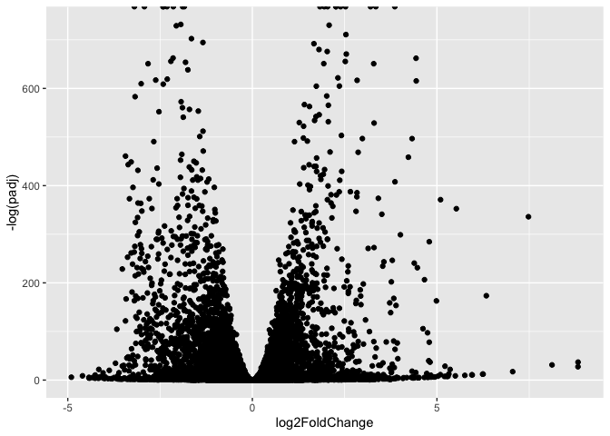

Add threshold lines for fold-change and P-values and color our subset of
genes that make these throshold cut-off in the plot.

``` r
library(ggplot2)

res_df <- as.data.frame(res)
res_df$padj[is.na(res_df$padj)] <- 1

ggplot(res_df, aes(x = log2FoldChange, y = -log10(padj))) +
  geom_point() +
  geom_vline(xintercept = c(-1, 1), linetype = "dashed", color = "red") +
  geom_hline(yintercept = -log10(0.05), linetype = "dashed", color = "red")
```

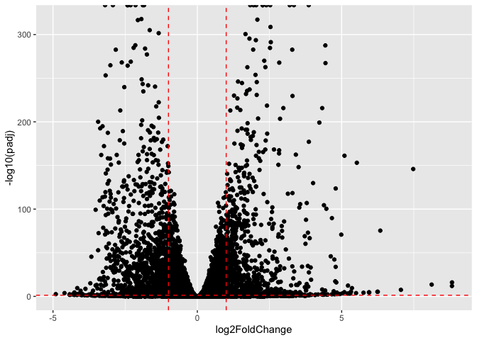

Improve this plot by completing the below code, which adds color and
axis labels.

``` r
# Make a color vector for all genes
mycols <- rep("gray", nrow(res))

# Color red for |log2FC| > 2
mycols[ abs(res$log2FoldChange) > 2 ] <- "red"

# Color blue for padj < 0.01 AND |log2FC| > 2
inds <- (res$padj < 0.01) & (abs(res$log2FoldChange) > 2)
mycols[inds] <- "blue"

# Volcano plot
plot(res$log2FoldChange,
     -log(res$padj),
     col = mycols,
     xlab = "Log2(FoldChange)",
     ylab = "-Log(P-value)")
```


## Add annotation

Add gene symbols and entrez ids

``` r
library(AnnotationDbi)
library(org.Hs.eg.db)
```

``` r
head(
  mapIds(x = org.Hs.eg.db,
         keys = row.names(res),
         column = "SYMBOL",
         keytype = "ENTREZID",
         multiVals = "first"),
  10
)
```

    'select()' returned 1:1 mapping between keys and columns

             3          6          7          8          9         10         11 
            NA         NA         NA         NA     "NAT1"     "NAT2"     "NATP" 
            12         13         14 
    "SERPINA3"    "AADAC"     "AAMP" 

``` r
res$symbol <- mapIds(
  x = org.Hs.eg.db,
  keys = row.names(res),
  keytype = "ENTREZID",
  column = "SYMBOL",
  multiVals = "first"
)
```

    'select()' returned 1:1 mapping between keys and columns

``` r
res$entrez <- mapIds(
  x = org.Hs.eg.db,
  keys = row.names(res),
  keytype = "ENTREZID",
  column = "ENTREZID",
  multiVals = "first"
)
```

## Pathway Analysis

run gage analysis

``` r
library(pathview)
```

``` r
library(gage)
library(gageData)

data(kegg.sets.hs)
data(sigmet.idx.hs)

kegg.sets.hs = kegg.sets.hs[sigmet.idx.hs]

head(kegg.sets.hs, 3)
```

    $`hsa00232 Caffeine metabolism`
    [1] "10"   "1544" "1548" "1549" "1553" "7498" "9"   

    $`hsa00983 Drug metabolism - other enzymes`
     [1] "10"     "1066"   "10720"  "10941"  "151531" "1548"   "1549"   "1551"  
     [9] "1553"   "1576"   "1577"   "1806"   "1807"   "1890"   "221223" "2990"  
    [17] "3251"   "3614"   "3615"   "3704"   "51733"  "54490"  "54575"  "54576" 
    [25] "54577"  "54578"  "54579"  "54600"  "54657"  "54658"  "54659"  "54963" 
    [33] "574537" "64816"  "7083"   "7084"   "7172"   "7363"   "7364"   "7365"  
    [41] "7366"   "7367"   "7371"   "7372"   "7378"   "7498"   "79799"  "83549" 
    [49] "8824"   "8833"   "9"      "978"   

    $`hsa00230 Purine metabolism`
      [1] "100"    "10201"  "10606"  "10621"  "10622"  "10623"  "107"    "10714" 
      [9] "108"    "10846"  "109"    "111"    "11128"  "11164"  "112"    "113"   
     [17] "114"    "115"    "122481" "122622" "124583" "132"    "158"    "159"   
     [25] "1633"   "171568" "1716"   "196883" "203"    "204"    "205"    "221823"
     [33] "2272"   "22978"  "23649"  "246721" "25885"  "2618"   "26289"  "270"   
     [41] "271"    "27115"  "272"    "2766"   "2977"   "2982"   "2983"   "2984"  
     [49] "2986"   "2987"   "29922"  "3000"   "30833"  "30834"  "318"    "3251"  
     [57] "353"    "3614"   "3615"   "3704"   "377841" "471"    "4830"   "4831"  
     [65] "4832"   "4833"   "4860"   "4881"   "4882"   "4907"   "50484"  "50940" 
     [73] "51082"  "51251"  "51292"  "5136"   "5137"   "5138"   "5139"   "5140"  
     [81] "5141"   "5142"   "5143"   "5144"   "5145"   "5146"   "5147"   "5148"  
     [89] "5149"   "5150"   "5151"   "5152"   "5153"   "5158"   "5167"   "5169"  
     [97] "51728"  "5198"   "5236"   "5313"   "5315"   "53343"  "54107"  "5422"  
    [105] "5424"   "5425"   "5426"   "5427"   "5430"   "5431"   "5432"   "5433"  
    [113] "5434"   "5435"   "5436"   "5437"   "5438"   "5439"   "5440"   "5441"  
    [121] "5471"   "548644" "55276"  "5557"   "5558"   "55703"  "55811"  "55821" 
    [129] "5631"   "5634"   "56655"  "56953"  "56985"  "57804"  "58497"  "6240"  
    [137] "6241"   "64425"  "646625" "654364" "661"    "7498"   "8382"   "84172" 
    [145] "84265"  "84284"  "84618"  "8622"   "8654"   "87178"  "8833"   "9060"  
    [153] "9061"   "93034"  "953"    "9533"   "954"    "955"    "956"    "957"   
    [161] "9583"   "9615"  

We need a named vector as input for gage

``` r
Foldchanges = res$log2FoldChange
names(Foldchanges) = res$entrez
head(Foldchanges)
```

              3           6           7           8           9          10 
     0.17925708  0.42645712 -0.69272046  0.72975561  0.04057653  0.54281049 

Now, let’s run the gage pathway analysis.

``` r
keggres = gage(Foldchanges, gsets=kegg.sets.hs)
```

Look at the object returned from gage().

``` r
attributes(keggres)
```

    $names
    [1] "greater" "less"    "stats"  

Look at the first few down (less) pathways

``` r
head(keggres$less)
```

                                             p.geomean stat.mean      p.val
    hsa03030 DNA replication                0.01885846 -2.173571 0.01885846
    hsa03430 Mismatch repair                0.04579401 -1.743605 0.04579401
    hsa03410 Base excision repair           0.05908254 -1.598886 0.05908254
    hsa04120 Ubiquitin mediated proteolysis 0.06440557 -1.528736 0.06440557
    hsa00360 Phenylalanine metabolism       0.11126857 -1.250743 0.11126857
    hsa04510 Focal adhesion                 0.12267443 -1.164165 0.12267443
                                                q.val set.size       exp1
    hsa03030 DNA replication                0.8745476       17 0.01885846
    hsa03430 Mismatch repair                0.8745476       16 0.04579401
    hsa03410 Base excision repair           0.8745476       20 0.05908254
    hsa04120 Ubiquitin mediated proteolysis 0.8745476       65 0.06440557
    hsa00360 Phenylalanine metabolism       0.8745476       14 0.11126857
    hsa04510 Focal adhesion                 0.8745476      142 0.12267443

Each *keggres$less* and *keggres$greater* object is a data matrix whose
rows are gene sets ranked by p-value. The top down-regulated (“less”)
pathway is **Cell cycle (hsa04110)**.

Now we use `pathview()` to visualize a KEGG pathway with our RNA-Seq
expression data overlaid. We manually provide the pathway ID—in this
case **hsa04110** from the “Cell cycle” pathway identified above.

``` r
pathview(gene.data=Foldchanges, pathway.id="hsa04110")
```

    'select()' returned 1:1 mapping between keys and columns

    Info: Working in directory /Users/jennyzhou/Desktop/BIMM 143/github/bimm143_github/Class 14

    Info: Writing image file hsa04110.pathview.png

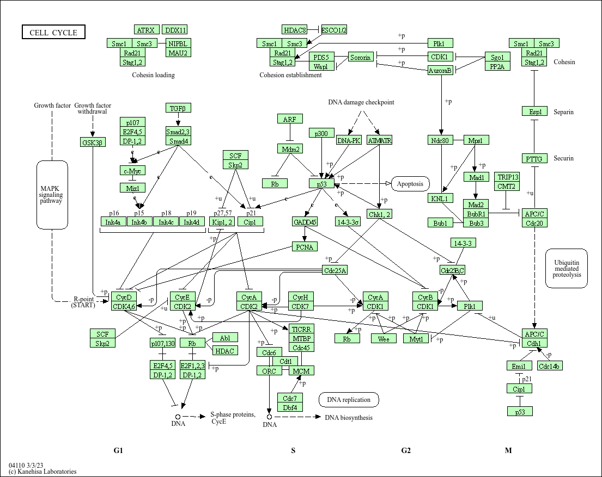

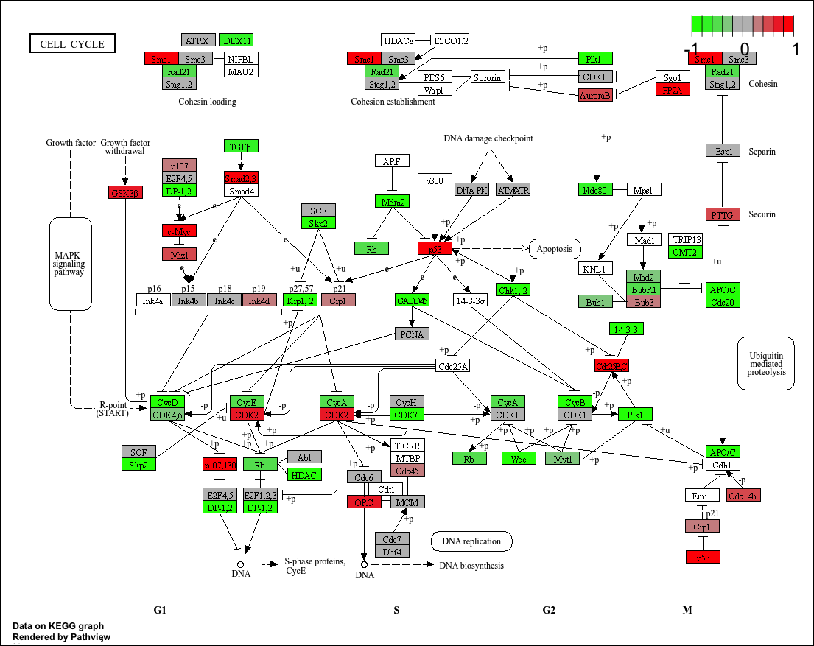

A different PDF based output of the same data

``` r
pathview(gene.data=Foldchanges, pathway.id="hsa04110", kegg.native=FALSE)
```

    'select()' returned 1:1 mapping between keys and columns

    Warning: reconcile groups sharing member nodes!

         [,1] [,2] 
    [1,] "9"  "300"
    [2,] "9"  "306"

    Info: Working in directory /Users/jennyzhou/Desktop/BIMM 143/github/bimm143_github/Class 14

    Info: Writing image file hsa04110.pathview.pdf

Now we extract the top five up-regulated pathways and pull out their
KEGG pathway IDs for use with `pathview()`.

``` r
keggrespathways <- rownames(keggres$greater)[1:5]

keggresids = substr(keggrespathways, start=1, stop=8)
keggresids
```

    [1] "hsa04962" "hsa02010" "hsa04360" "hsa04974" "hsa00970"

Lets pass these IDs in keggresids to the *pathview()* function to draw
plots for all the top 5 pathways.

``` r
pathview(gene.data=Foldchanges, pathway.id=keggresids, species="hsa")
```

    'select()' returned 1:1 mapping between keys and columns

    Info: Working in directory /Users/jennyzhou/Desktop/BIMM 143/github/bimm143_github/Class 14

    Info: Writing image file hsa04962.pathview.png

    'select()' returned 1:1 mapping between keys and columns

    Info: Working in directory /Users/jennyzhou/Desktop/BIMM 143/github/bimm143_github/Class 14

    Info: Writing image file hsa02010.pathview.png

    'select()' returned 1:1 mapping between keys and columns

    Info: Working in directory /Users/jennyzhou/Desktop/BIMM 143/github/bimm143_github/Class 14

    Info: Writing image file hsa04360.pathview.png

    'select()' returned 1:1 mapping between keys and columns

    Info: Working in directory /Users/jennyzhou/Desktop/BIMM 143/github/bimm143_github/Class 14

    Info: Writing image file hsa04974.pathview.png

    'select()' returned 1:1 mapping between keys and columns

    Info: Working in directory /Users/jennyzhou/Desktop/BIMM 143/github/bimm143_github/Class 14

    Info: Writing image file hsa00970.pathview.png

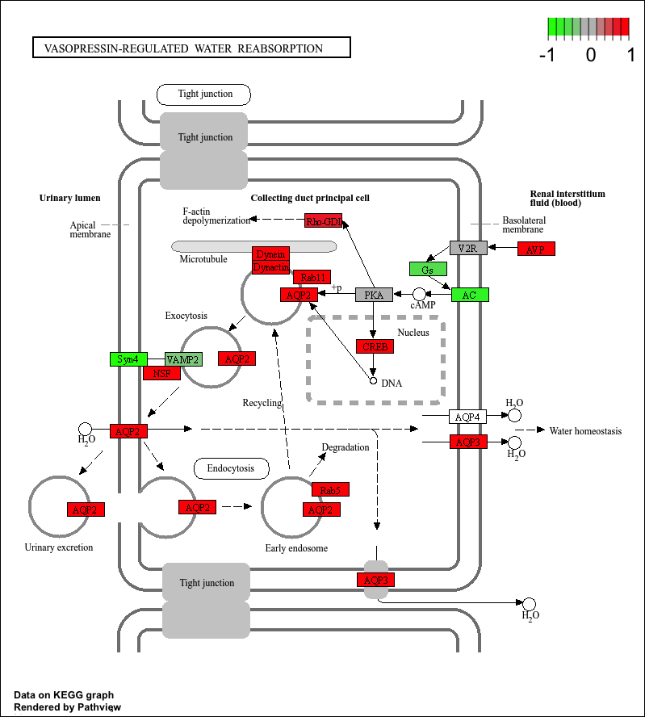 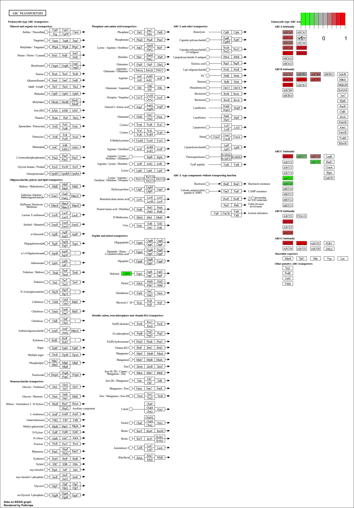
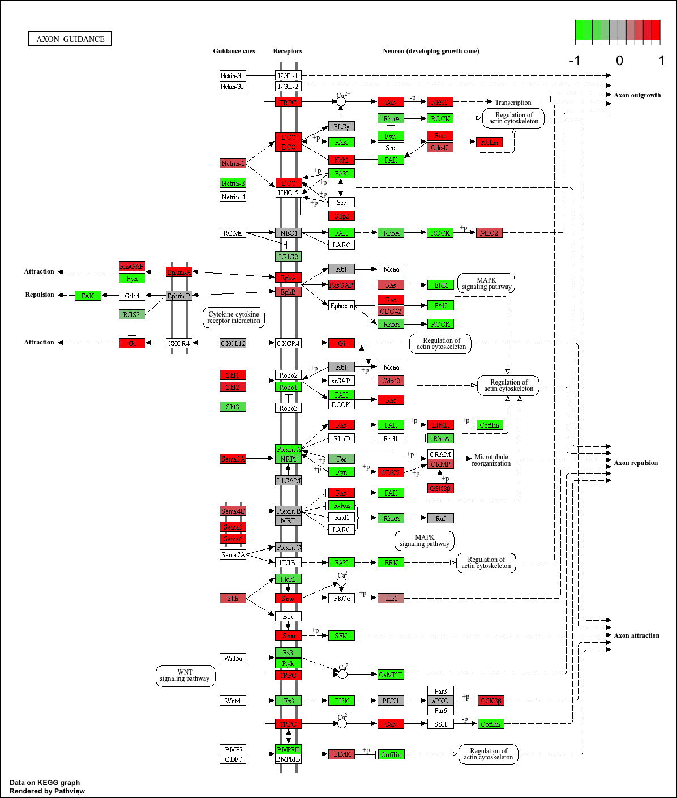

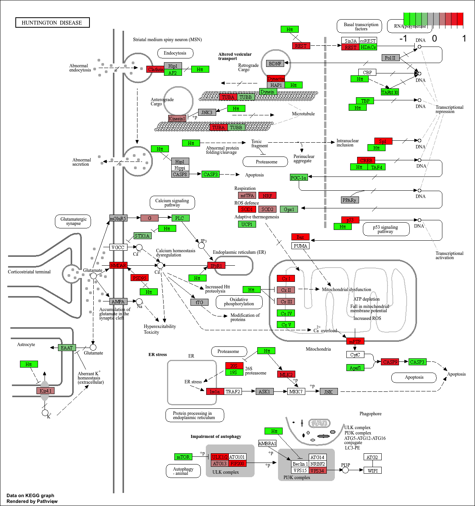 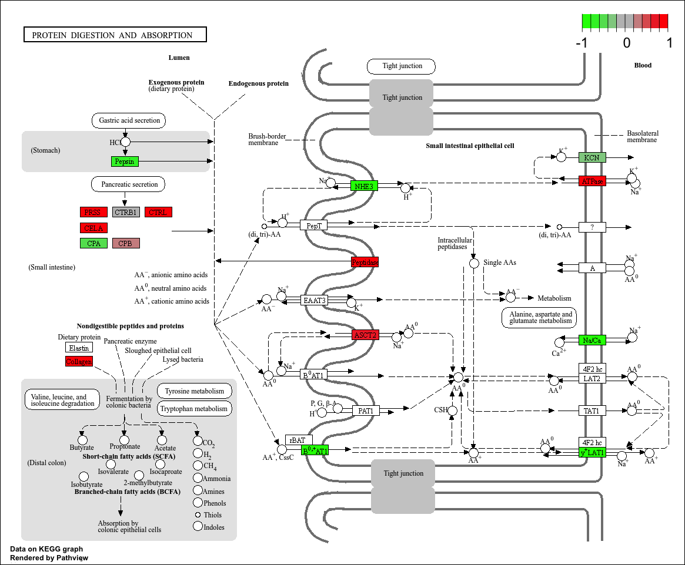

> Q. Can you do the same procedure as above to plot the pathview figures
> for the top 5 down-reguled pathways?

``` r
# Get the names of the top 5 "less/down" pathways
keggrespathways.down <- rownames(keggres$less)[1:5]

# Extract the 8-character KEGG IDs (e.g. "hsa04110")
keggresids.down <- substr(keggrespathways.down, start = 1, stop = 8)
keggresids.down
```

    [1] "hsa03030" "hsa03430" "hsa03410" "hsa04120" "hsa00360"

``` r
# Draw pathview figures for the top 5 down-regulated pathways
pathview(gene.data = Foldchanges,
        pathway.id = keggresids.down,
        species = "hsa")
```

    'select()' returned 1:1 mapping between keys and columns

    Info: Working in directory /Users/jennyzhou/Desktop/BIMM 143/github/bimm143_github/Class 14

    Info: Writing image file hsa03030.pathview.png

    'select()' returned 1:1 mapping between keys and columns

    Info: Working in directory /Users/jennyzhou/Desktop/BIMM 143/github/bimm143_github/Class 14

    Info: Writing image file hsa03430.pathview.png

    'select()' returned 1:1 mapping between keys and columns

    Info: Working in directory /Users/jennyzhou/Desktop/BIMM 143/github/bimm143_github/Class 14

    Info: Writing image file hsa03410.pathview.png

    'select()' returned 1:1 mapping between keys and columns

    Info: Working in directory /Users/jennyzhou/Desktop/BIMM 143/github/bimm143_github/Class 14

    Info: Writing image file hsa04120.pathview.png

    'select()' returned 1:1 mapping between keys and columns

    Info: Working in directory /Users/jennyzhou/Desktop/BIMM 143/github/bimm143_github/Class 14

    Info: Writing image file hsa00360.pathview.png

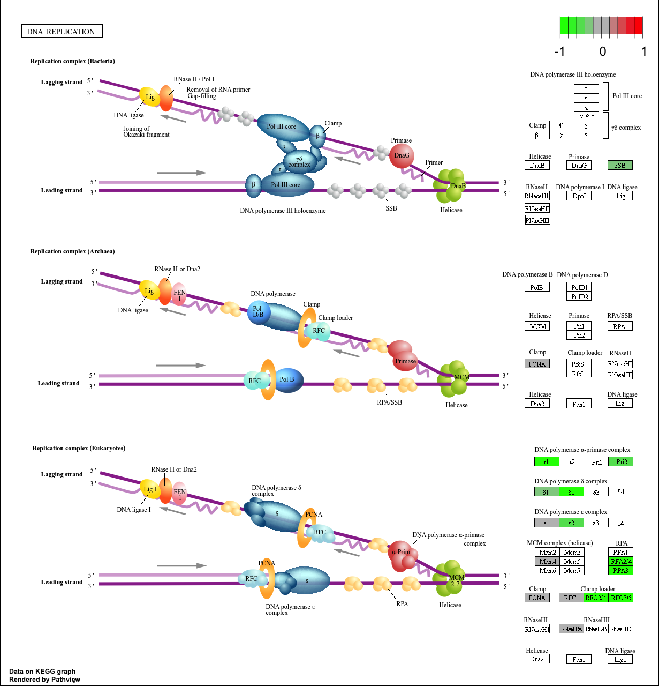 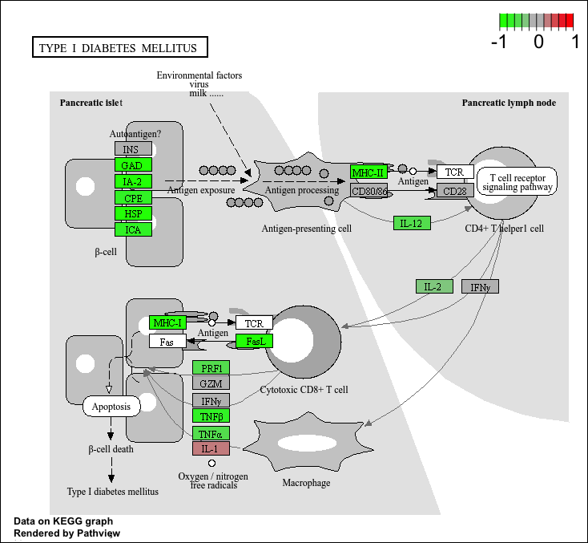

## GO terms

Same analysis but using GO genesets rather than KEGG

``` r
data(go.sets.hs)
data(go.subs.hs)

# Focus on Biological Process subset of GO
gobpsets = go.sets.hs[go.subs.hs$BP]

gobpres = gage(Foldchanges, gsets=gobpsets, same.dir=TRUE)
```

``` r
head(gobpres$less)
```

                                                         p.geomean stat.mean
    GO:0030823 regulation of cGMP metabolic process    0.002716208 -3.086595
    GO:0030826 regulation of cGMP biosynthetic process 0.006476850 -2.728670
    GO:0006182 cGMP biosynthetic process               0.009829755 -2.448640
    GO:0046068 cGMP metabolic process                  0.010028138 -2.409060
    GO:0034329 cell junction assembly                  0.013213017 -2.235413
    GO:0018205 peptidyl-lysine modification            0.014979994 -2.192053
                                                             p.val     q.val
    GO:0030823 regulation of cGMP metabolic process    0.002716208 0.8422634
    GO:0030826 regulation of cGMP biosynthetic process 0.006476850 0.8422634
    GO:0006182 cGMP biosynthetic process               0.009829755 0.8422634
    GO:0046068 cGMP metabolic process                  0.010028138 0.8422634
    GO:0034329 cell junction assembly                  0.013213017 0.8422634
    GO:0018205 peptidyl-lysine modification            0.014979994 0.8422634
                                                       set.size        exp1
    GO:0030823 regulation of cGMP metabolic process          12 0.002716208
    GO:0030826 regulation of cGMP biosynthetic process       11 0.006476850
    GO:0006182 cGMP biosynthetic process                     18 0.009829755
    GO:0046068 cGMP metabolic process                        24 0.010028138
    GO:0034329 cell junction assembly                       108 0.013213017
    GO:0018205 peptidyl-lysine modification                  74 0.014979994

``` r
lapply(gobpres, head)
```

    $greater
                                                            p.geomean stat.mean
    GO:0007586 digestion                                  0.007434165  2.462828
    GO:0044243 multicellular organismal catabolic process 0.009972396  2.437602
    GO:0007620 copulation                                 0.012658279  2.339581
    GO:0000187 activation of MAPK activity                0.015463270  2.176715
    GO:0006275 regulation of DNA replication              0.024352186  1.994989
    GO:0030574 collagen catabolic process                 0.025208044  2.038387
                                                                p.val     q.val
    GO:0007586 digestion                                  0.007434165 0.9434944
    GO:0044243 multicellular organismal catabolic process 0.009972396 0.9434944
    GO:0007620 copulation                                 0.012658279 0.9434944
    GO:0000187 activation of MAPK activity                0.015463270 0.9434944
    GO:0006275 regulation of DNA replication              0.024352186 0.9434944
    GO:0030574 collagen catabolic process                 0.025208044 0.9434944
                                                          set.size        exp1
    GO:0007586 digestion                                        80 0.007434165
    GO:0044243 multicellular organismal catabolic process       20 0.009972396
    GO:0007620 copulation                                       18 0.012658279
    GO:0000187 activation of MAPK activity                      84 0.015463270
    GO:0006275 regulation of DNA replication                    54 0.024352186
    GO:0030574 collagen catabolic process                       16 0.025208044

    $less
                                                         p.geomean stat.mean
    GO:0030823 regulation of cGMP metabolic process    0.002716208 -3.086595
    GO:0030826 regulation of cGMP biosynthetic process 0.006476850 -2.728670
    GO:0006182 cGMP biosynthetic process               0.009829755 -2.448640
    GO:0046068 cGMP metabolic process                  0.010028138 -2.409060
    GO:0034329 cell junction assembly                  0.013213017 -2.235413
    GO:0018205 peptidyl-lysine modification            0.014979994 -2.192053
                                                             p.val     q.val
    GO:0030823 regulation of cGMP metabolic process    0.002716208 0.8422634
    GO:0030826 regulation of cGMP biosynthetic process 0.006476850 0.8422634
    GO:0006182 cGMP biosynthetic process               0.009829755 0.8422634
    GO:0046068 cGMP metabolic process                  0.010028138 0.8422634
    GO:0034329 cell junction assembly                  0.013213017 0.8422634
    GO:0018205 peptidyl-lysine modification            0.014979994 0.8422634
                                                       set.size        exp1
    GO:0030823 regulation of cGMP metabolic process          12 0.002716208
    GO:0030826 regulation of cGMP biosynthetic process       11 0.006476850
    GO:0006182 cGMP biosynthetic process                     18 0.009829755
    GO:0046068 cGMP metabolic process                        24 0.010028138
    GO:0034329 cell junction assembly                       108 0.013213017
    GO:0018205 peptidyl-lysine modification                  74 0.014979994

    $stats
                                                          stat.mean     exp1
    GO:0007586 digestion                                   2.462828 2.462828
    GO:0044243 multicellular organismal catabolic process  2.437602 2.437602
    GO:0007620 copulation                                  2.339581 2.339581
    GO:0000187 activation of MAPK activity                 2.176715 2.176715
    GO:0006275 regulation of DNA replication               1.994989 1.994989
    GO:0030574 collagen catabolic process                  2.038387 2.038387

## Reactome Analysis

Lots of folks like the reactome web interface. YOu can also run this as
an R function but lets look at the website first <http://reactome.org/>

Using the set of significant genes (FDR \< 0.05) from our differential
expression results, we first export them as a plain text file for
Reactome over-representation and pathway-topology analysis in R.

``` r
sig_genes <- res[res$padj <= 0.05 & !is.na(res$padj), "symbol"]
print(paste("Total number of significant genes:", length(sig_genes)))
```

    [1] "Total number of significant genes: 8147"

``` r
write.table(sig_genes, file="significant_genes.txt",
            row.names = FALSE, col.names=FALSE, quote=FALSE)
```

## Save our results

``` r
write.csv(res, file="myresults.csv")
```
