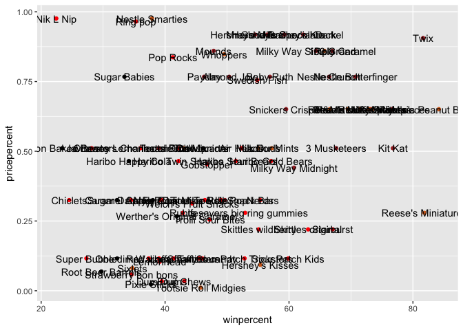
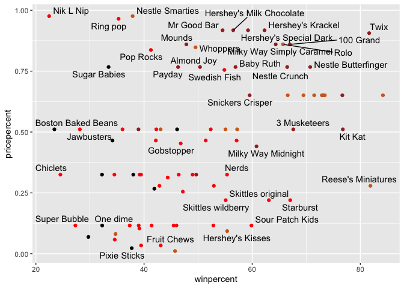
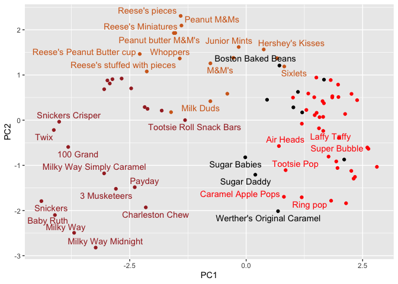
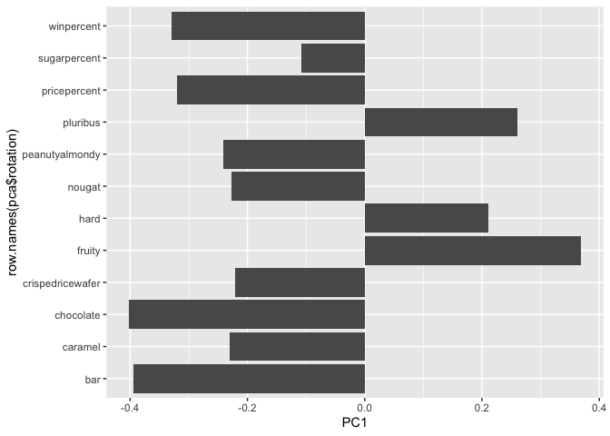

# Class 10: Halloween Mini Project
Jiayi Zhou (PID:A17856751)

- [Data Import](#data-import)
  - [Quick Overview of the dataset](#quick-overview-of-the-dataset)
  - [Winpercent and Pricepercent](#winpercent-and-pricepercent)
  - [Exploring the correlation
    structure](#exploring-the-correlation-structure)
  - [Principle Componenet Analysis](#principle-componenet-analysis)

As it is nearly Halloween and the half way point in the quarter let’s do
a mini project to help us figure out the best candy!

Our come from the 538 website and is available as a CSV file:

# Data Import

``` r
candy <- read.csv("candy-data.csv", row.names = 1)
head(candy)
```

                 chocolate fruity caramel peanutyalmondy nougat crispedricewafer
    100 Grand            1      0       1              0      0                1
    3 Musketeers         1      0       0              0      1                0
    One dime             0      0       0              0      0                0
    One quarter          0      0       0              0      0                0
    Air Heads            0      1       0              0      0                0
    Almond Joy           1      0       0              1      0                0
                 hard bar pluribus sugarpercent pricepercent winpercent
    100 Grand       0   1        0        0.732        0.860   66.97173
    3 Musketeers    0   1        0        0.604        0.511   67.60294
    One dime        0   0        0        0.011        0.116   32.26109
    One quarter     0   0        0        0.011        0.511   46.11650
    Air Heads       0   0        0        0.906        0.511   52.34146
    Almond Joy      0   1        0        0.465        0.767   50.34755

``` r
flextable::flextable(head(candy, 10))
```


> Q1. How many different candy types are in this dataset?

``` r
nrow(candy)
```

    [1] 85

``` r
library(tidyverse)
```

    Warning: package 'ggplot2' was built under R version 4.5.2

    Warning: package 'readr' was built under R version 4.5.2

    ── Attaching core tidyverse packages ──────────────────────── tidyverse 2.0.0 ──
    ✔ dplyr     1.1.4     ✔ readr     2.1.6
    ✔ forcats   1.0.1     ✔ stringr   1.6.0
    ✔ ggplot2   4.0.1     ✔ tibble    3.3.0
    ✔ lubridate 1.9.4     ✔ tidyr     1.3.1
    ✔ purrr     1.2.0     
    ── Conflicts ────────────────────────────────────────── tidyverse_conflicts() ──
    ✖ dplyr::filter() masks stats::filter()
    ✖ dplyr::lag()    masks stats::lag()
    ℹ Use the conflicted package (<http://conflicted.r-lib.org/>) to force all conflicts to become errors

``` r
candy %>%
  nrow()
```

    [1] 85

> Q2. How many fruity candy types are in the dataset?

``` r
sum(candy$fruity)
```

    [1] 38

> Q3. What is your favorite candy in the dataset and what is it’s
> winpercent value?

My favorite winpercent

``` r
candy["Hershey's Milk Chocolate", ]$winpercent
```

    [1] 56.4905

``` r
library(dplyr)

candy |>
  filter(rownames(candy) == "Hershey's Milk Chocolate") |>
  select(winpercent)
```

                             winpercent
    Hershey's Milk Chocolate    56.4905

> Q4. What is the winpercent value for “Kit Kat”?

``` r
candy |>
  filter(rownames(candy) == "Kit Kat") |>
  select(winpercent)
```

            winpercent
    Kit Kat    76.7686

> Q5. What is the winpercent value for “Tootsie Roll Snack Bars”?

``` r
candy |>
  filter(rownames(candy) == "Tootsie Roll Snack Bars") |>
  select(winpercent)
```

                            winpercent
    Tootsie Roll Snack Bars    49.6535

## Quick Overview of the dataset

``` r
library("skimr")
skimr::skim(candy)
```

|                                                  |       |
|:-------------------------------------------------|:------|
| Name                                             | candy |
| Number of rows                                   | 85    |
| Number of columns                                | 12    |
| \_\_\_\_\_\_\_\_\_\_\_\_\_\_\_\_\_\_\_\_\_\_\_   |       |
| Column type frequency:                           |       |
| numeric                                          | 12    |
| \_\_\_\_\_\_\_\_\_\_\_\_\_\_\_\_\_\_\_\_\_\_\_\_ |       |
| Group variables                                  | None  |

Data summary

**Variable type: numeric**

| skim_variable | n_missing | complete_rate | mean | sd | p0 | p25 | p50 | p75 | p100 | hist |
|:---|---:|---:|---:|---:|---:|---:|---:|---:|---:|:---|
| chocolate | 0 | 1 | 0.44 | 0.50 | 0.00 | 0.00 | 0.00 | 1.00 | 1.00 | ▇▁▁▁▆ |
| fruity | 0 | 1 | 0.45 | 0.50 | 0.00 | 0.00 | 0.00 | 1.00 | 1.00 | ▇▁▁▁▆ |
| caramel | 0 | 1 | 0.16 | 0.37 | 0.00 | 0.00 | 0.00 | 0.00 | 1.00 | ▇▁▁▁▂ |
| peanutyalmondy | 0 | 1 | 0.16 | 0.37 | 0.00 | 0.00 | 0.00 | 0.00 | 1.00 | ▇▁▁▁▂ |
| nougat | 0 | 1 | 0.08 | 0.28 | 0.00 | 0.00 | 0.00 | 0.00 | 1.00 | ▇▁▁▁▁ |
| crispedricewafer | 0 | 1 | 0.08 | 0.28 | 0.00 | 0.00 | 0.00 | 0.00 | 1.00 | ▇▁▁▁▁ |
| hard | 0 | 1 | 0.18 | 0.38 | 0.00 | 0.00 | 0.00 | 0.00 | 1.00 | ▇▁▁▁▂ |
| bar | 0 | 1 | 0.25 | 0.43 | 0.00 | 0.00 | 0.00 | 0.00 | 1.00 | ▇▁▁▁▂ |
| pluribus | 0 | 1 | 0.52 | 0.50 | 0.00 | 0.00 | 1.00 | 1.00 | 1.00 | ▇▁▁▁▇ |
| sugarpercent | 0 | 1 | 0.48 | 0.28 | 0.01 | 0.22 | 0.47 | 0.73 | 0.99 | ▇▇▇▇▆ |
| pricepercent | 0 | 1 | 0.47 | 0.29 | 0.01 | 0.26 | 0.47 | 0.65 | 0.98 | ▇▇▇▇▆ |
| winpercent | 0 | 1 | 50.32 | 14.71 | 22.45 | 39.14 | 47.83 | 59.86 | 84.18 | ▃▇▆▅▂ |

> Q6. Is there any variable/column that looks to be on a different scale
> to the majority of the other columns in the dataset?

The winpercent is on 0-100 scale and the rest are 0-1 scale.

> Q7. What do you think a zero and one represent for the
> candy\$chocolate column?

That the candy does not contain chocolate.

> Q8. Plot a histogram of winpercent values

``` r
library(ggplot2)

ggplot(candy) +
  aes(winpercent) +
  geom_histogram(bins=20)
```


``` r
library(ggplot2)

ggplot(candy) +
  aes(winpercent) +
  geom_density()
```


> Q9. Is the distribution of winpercent values symmetrical?

Based on the summary statistics, the mean (50.32) is greater than the
median (47.83), and the maximum (84.18) is much farther from the median
than the minimum (22.45). The distribution is not symmetrical; it is
right-skewed (positively skewed)

> Q10. Is the center of the distribution above or below 50%?

``` r
mean(candy$winpercent)
```

    [1] 50.31676

``` r
summary(candy$winpercent)
```

       Min. 1st Qu.  Median    Mean 3rd Qu.    Max. 
      22.45   39.14   47.83   50.32   59.86   84.18 

The median winpercent is 47.83, which is below 50%. Therefore, the
center of the distribution is below 50%

> Q11. On average is chocolate candy higher or lower ranked than fruit
> candy?

Chocolate is higher ranked on average.

``` r
# 1. Find all chocolate candy in the dataset.
# 2, Find their winpercent values
# Calculate the mean of these values

# 4-6. Do the same for fruity candy
# 7. Compare mean winpercents of chocolate vs fruity
# 8. Pick the highest as the winner

choc.inds <- candy$chocolate==1
choc.win <- candy[choc.inds,]$winpercent
choc.win <- mean(choc.win)
choc.win
```

    [1] 60.92153

``` r
mean(candy[candy$chocolate==1,]$winpercent)
```

    [1] 60.92153

``` r
mean(candy[candy$fruity==1,]$winpercent)
```

    [1] 44.11974

``` r
fruit.ind <- candy$fruity==1
fruit.win <- candy[fruit.ind,]$winpercent
fruit.mean <- mean(fruit.win)

choc.ind <- candy$chocolate==1
choc.win <- candy[choc.ind,]$winpercent
choc.mean <- mean(choc.win)
```

``` r
candy |> 
  filter(chocolate == 1) |> 
  select(winpercent)
```

                                winpercent
    100 Grand                     66.97173
    3 Musketeers                  67.60294
    Almond Joy                    50.34755
    Baby Ruth                     56.91455
    Charleston Chew               38.97504
    Hershey's Kisses              55.37545
    Hershey's Krackel             62.28448
    Hershey's Milk Chocolate      56.49050
    Hershey's Special Dark        59.23612
    Junior Mints                  57.21925
    Kit Kat                       76.76860
    Peanut butter M&M's           71.46505
    M&M's                         66.57458
    Milk Duds                     55.06407
    Milky Way                     73.09956
    Milky Way Midnight            60.80070
    Milky Way Simply Caramel      64.35334
    Mounds                        47.82975
    Mr Good Bar                   54.52645
    Nestle Butterfinger           70.73564
    Nestle Crunch                 66.47068
    Peanut M&Ms                   69.48379
    Reese's Miniatures            81.86626
    Reese's Peanut Butter cup     84.18029
    Reese's pieces                73.43499
    Reese's stuffed with pieces   72.88790
    Rolo                          65.71629
    Sixlets                       34.72200
    Nestle Smarties               37.88719
    Snickers                      76.67378
    Snickers Crisper              59.52925
    Tootsie Pop                   48.98265
    Tootsie Roll Juniors          43.06890
    Tootsie Roll Midgies          45.73675
    Tootsie Roll Snack Bars       49.65350
    Twix                          81.64291
    Whoppers                      49.52411

> Q12. Is this difference statistically significant?

Yes, the difference is statistically significant.

``` r
t.test(choc.win, fruit.win)
```


        Welch Two Sample t-test

    data:  choc.win and fruit.win
    t = 6.2582, df = 68.882, p-value = 2.871e-08
    alternative hypothesis: true difference in means is not equal to 0
    95 percent confidence interval:
     11.44563 22.15795
    sample estimates:
    mean of x mean of y 
     60.92153  44.11974 

> Q13. What are the five least liked candy types in this set?

``` r
candy |>
  arrange(winpercent) |>
  head(5)
```

                       chocolate fruity caramel peanutyalmondy nougat
    Nik L Nip                  0      1       0              0      0
    Boston Baked Beans         0      0       0              1      0
    Chiclets                   0      1       0              0      0
    Super Bubble               0      1       0              0      0
    Jawbusters                 0      1       0              0      0
                       crispedricewafer hard bar pluribus sugarpercent pricepercent
    Nik L Nip                         0    0   0        1        0.197        0.976
    Boston Baked Beans                0    0   0        1        0.313        0.511
    Chiclets                          0    0   0        1        0.046        0.325
    Super Bubble                      0    0   0        0        0.162        0.116
    Jawbusters                        0    1   0        1        0.093        0.511
                       winpercent
    Nik L Nip            22.44534
    Boston Baked Beans   23.41782
    Chiclets             24.52499
    Super Bubble         27.30386
    Jawbusters           28.12744

``` r
x <- c(5,1,10,4)
sort(x)
```

    [1]  1  4  5 10

``` r
#sort(x)
#(candy$wonpercent)
```

``` r
ord.ind <- order(candy$winpercent)
head(candy[ord.ind,],5)
```

                       chocolate fruity caramel peanutyalmondy nougat
    Nik L Nip                  0      1       0              0      0
    Boston Baked Beans         0      0       0              1      0
    Chiclets                   0      1       0              0      0
    Super Bubble               0      1       0              0      0
    Jawbusters                 0      1       0              0      0
                       crispedricewafer hard bar pluribus sugarpercent pricepercent
    Nik L Nip                         0    0   0        1        0.197        0.976
    Boston Baked Beans                0    0   0        1        0.313        0.511
    Chiclets                          0    0   0        1        0.046        0.325
    Super Bubble                      0    0   0        0        0.162        0.116
    Jawbusters                        0    1   0        1        0.093        0.511
                       winpercent
    Nik L Nip            22.44534
    Boston Baked Beans   23.41782
    Chiclets             24.52499
    Super Bubble         27.30386
    Jawbusters           28.12744

> Q14. What are the top 5 all time favorite candy types out of this set?

``` r
candy |>
  arrange(-winpercent) |>
  head(5)
```

                              chocolate fruity caramel peanutyalmondy nougat
    Reese's Peanut Butter cup         1      0       0              1      0
    Reese's Miniatures                1      0       0              1      0
    Twix                              1      0       1              0      0
    Kit Kat                           1      0       0              0      0
    Snickers                          1      0       1              1      1
                              crispedricewafer hard bar pluribus sugarpercent
    Reese's Peanut Butter cup                0    0   0        0        0.720
    Reese's Miniatures                       0    0   0        0        0.034
    Twix                                     1    0   1        0        0.546
    Kit Kat                                  1    0   1        0        0.313
    Snickers                                 0    0   1        0        0.546
                              pricepercent winpercent
    Reese's Peanut Butter cup        0.651   84.18029
    Reese's Miniatures               0.279   81.86626
    Twix                             0.906   81.64291
    Kit Kat                          0.511   76.76860
    Snickers                         0.651   76.67378

> Q15. Make a first barplot of candy ranking based on winpercent values.

``` r
ggplot(candy) +
  aes(winpercent, rownames(candy)) + 
  geom_col()
```


> Q16. This is quite ugly, use the reorder() function to get the bars
> sorted by winpercent?

``` r
ggplot(candy) +
  aes(x=winpercent, 
      y=reorder(rownames(candy), winpercent)) + 
  geom_col()
```


Add some colors based on the “type of candy”

``` r
my_cols=rep("black", nrow(candy))
my_cols[as.logical(candy$chocolate)] = "chocolate"
my_cols[as.logical(candy$fruity)] = "pink"
my_cols[as.logical(candy$bar)] = "brown"
my_cols
```

     [1] "brown"     "brown"     "black"     "black"     "pink"      "brown"    
     [7] "brown"     "black"     "black"     "pink"      "brown"     "pink"     
    [13] "pink"      "pink"      "pink"      "pink"      "pink"      "pink"     
    [19] "pink"      "black"     "pink"      "pink"      "chocolate" "brown"    
    [25] "brown"     "brown"     "pink"      "chocolate" "brown"     "pink"     
    [31] "pink"      "pink"      "chocolate" "chocolate" "pink"      "chocolate"
    [37] "brown"     "brown"     "brown"     "brown"     "brown"     "pink"     
    [43] "brown"     "brown"     "pink"      "pink"      "brown"     "chocolate"
    [49] "black"     "pink"      "pink"      "chocolate" "chocolate" "chocolate"
    [55] "chocolate" "pink"      "chocolate" "black"     "pink"      "chocolate"
    [61] "pink"      "pink"      "chocolate" "pink"      "brown"     "brown"    
    [67] "pink"      "pink"      "pink"      "pink"      "black"     "black"    
    [73] "pink"      "pink"      "pink"      "chocolate" "chocolate" "brown"    
    [79] "pink"      "brown"     "pink"      "pink"      "pink"      "black"    
    [85] "chocolate"

``` r
ggplot(candy) +
  aes(x=winpercent, 
      y=reorder(rownames(candy), winpercent)) + 
  geom_col(fill=my_cols)
```


Now, for the first time, using this plot we can answer questions like:

> Q17. What is the worst ranked chocolate candy?

``` r
candy |> 
  dplyr::filter(chocolate == 1) |> 
  dplyr::slice_min(winpercent, n = 1, with_ties = FALSE)
```

            chocolate fruity caramel peanutyalmondy nougat crispedricewafer hard
    Sixlets         1      0       0              0      0                0    0
            bar pluribus sugarpercent pricepercent winpercent
    Sixlets   0        1         0.22        0.081     34.722

Sixlets.

> Q18. What is the best ranked fruity candy?

``` r
candy |> 
  dplyr::filter(fruity == 1) |> 
  dplyr::slice_max(winpercent, n = 1, with_ties = FALSE)
```

              chocolate fruity caramel peanutyalmondy nougat crispedricewafer hard
    Starburst         0      1       0              0      0                0    0
              bar pluribus sugarpercent pricepercent winpercent
    Starburst   0        1        0.151         0.22   67.03763

Starburst.

## Winpercent and Pricepercent

A plot with both variables/columns winpercent and pricepercent

``` r
my_cols[as.logical(candy$fruity)] = "red"

ggplot(candy) +
  aes(x=winpercent, y=pricepercent, label=row.names(candy)) +
  geom_point(col=my_cols) +
  geom_text()
```



``` r
library(ggrepel)

ggplot(candy) +
  aes(x=winpercent, y=pricepercent, label=row.names(candy)) +
  geom_point(col=my_cols) +
  geom_text_repel(max.overlaps = 7)
```

    Warning: ggrepel: 45 unlabeled data points (too many overlaps). Consider
    increasing max.overlaps



> Q19. Which candy type is the highest ranked in terms of winpercent for
> the least money - i.e. offers the most bang for your buck?

``` r
candy |>
  dplyr::mutate(type = dplyr::case_when(chocolate == 1 & bar == 1 ~ "chocolate bar",
                                        chocolate == 1 & bar == 0 ~ "chocolate other",
                                        fruity == 1 ~ "fruity",
                                        TRUE ~ "other")) |>
  dplyr::group_by(type) |>
  dplyr::summarise(mean_win = mean(winpercent, na.rm = TRUE),
                   mean_price = mean(pricepercent, na.rm = TRUE), .groups = "drop") |>
  dplyr::mutate(score = dplyr::min_rank(mean_price) + dplyr::min_rank(dplyr::desc(mean_win))) |>
  dplyr::slice_min(score, n = 1, with_ties = FALSE)
```

    # A tibble: 1 × 4
      type   mean_win mean_price score
      <chr>     <dbl>      <dbl> <int>
    1 fruity     44.0      0.333     4

Fruity type is the highest ranked in terms of winpercent for the least
money.

``` r
candy |> 
  dplyr::mutate(score = dplyr::min_rank(pricepercent) +
                  dplyr::min_rank(dplyr::desc(winpercent))) |> 
  dplyr::slice_min(score, n = 1, with_ties = FALSE)
```

                       chocolate fruity caramel peanutyalmondy nougat
    Reese's Miniatures         1      0       0              1      0
                       crispedricewafer hard bar pluribus sugarpercent pricepercent
    Reese's Miniatures                0    0   0        0        0.034        0.279
                       winpercent score
    Reese's Miniatures   81.86626    26

Reese’s Miniatures is the highest single candy ranked in terms of
winpercent for the least money

> Q20. What are the top 5 most expensive candy types in the dataset and
> of these which is the least popular?

``` r
candy |>
  arrange(-pricepercent) |>
  head(5)
```

                             chocolate fruity caramel peanutyalmondy nougat
    Nik L Nip                        0      1       0              0      0
    Nestle Smarties                  1      0       0              0      0
    Ring pop                         0      1       0              0      0
    Hershey's Krackel                1      0       0              0      0
    Hershey's Milk Chocolate         1      0       0              0      0
                             crispedricewafer hard bar pluribus sugarpercent
    Nik L Nip                               0    0   0        1        0.197
    Nestle Smarties                         0    0   0        1        0.267
    Ring pop                                0    1   0        0        0.732
    Hershey's Krackel                       1    0   1        0        0.430
    Hershey's Milk Chocolate                0    0   1        0        0.430
                             pricepercent winpercent
    Nik L Nip                       0.976   22.44534
    Nestle Smarties                 0.976   37.88719
    Ring pop                        0.965   35.29076
    Hershey's Krackel               0.918   62.28448
    Hershey's Milk Chocolate        0.918   56.49050

``` r
candy |>
  arrange(-pricepercent) |>
  head(5)|> 
  dplyr::slice_min(winpercent, n = 1, with_ties = FALSE)
```

              chocolate fruity caramel peanutyalmondy nougat crispedricewafer hard
    Nik L Nip         0      1       0              0      0                0    0
              bar pluribus sugarpercent pricepercent winpercent
    Nik L Nip   0        1        0.197        0.976   22.44534

Nik L Nip, Ring Pop, Nestlé Smarties, Hershey’s Krackel, Hershey’s Milk
Chocolate. Among these, the least popular (lowest winpercent) is Nik L
Nip.

## Exploring the correlation structure

Now that we’ve explored the dataset a little, we’ll see how the
variables interact with one another. We’ll use correlation and view the
results with the corrplot package to plot a correlation matrix.

``` r
library(corrplot)
```

    corrplot 0.95 loaded

``` r
cij <- cor(candy)
corrplot(cij)
```


``` r
cij
```

                      chocolate      fruity     caramel peanutyalmondy      nougat
    chocolate         1.0000000 -0.74172106  0.24987535     0.37782357  0.25489183
    fruity           -0.7417211  1.00000000 -0.33548538    -0.39928014 -0.26936712
    caramel           0.2498753 -0.33548538  1.00000000     0.05935614  0.32849280
    peanutyalmondy    0.3778236 -0.39928014  0.05935614     1.00000000  0.21311310
    nougat            0.2548918 -0.26936712  0.32849280     0.21311310  1.00000000
    crispedricewafer  0.3412098 -0.26936712  0.21311310    -0.01764631 -0.08974359
    hard             -0.3441769  0.39067750 -0.12235513    -0.20555661 -0.13867505
    bar               0.5974211 -0.51506558  0.33396002     0.26041960  0.52297636
    pluribus         -0.3396752  0.29972522 -0.26958501    -0.20610932 -0.31033884
    sugarpercent      0.1041691 -0.03439296  0.22193335     0.08788927  0.12308135
    pricepercent      0.5046754 -0.43096853  0.25432709     0.30915323  0.15319643
    winpercent        0.6365167 -0.38093814  0.21341630     0.40619220  0.19937530
                     crispedricewafer        hard         bar    pluribus
    chocolate              0.34120978 -0.34417691  0.59742114 -0.33967519
    fruity                -0.26936712  0.39067750 -0.51506558  0.29972522
    caramel                0.21311310 -0.12235513  0.33396002 -0.26958501
    peanutyalmondy        -0.01764631 -0.20555661  0.26041960 -0.20610932
    nougat                -0.08974359 -0.13867505  0.52297636 -0.31033884
    crispedricewafer       1.00000000 -0.13867505  0.42375093 -0.22469338
    hard                  -0.13867505  1.00000000 -0.26516504  0.01453172
    bar                    0.42375093 -0.26516504  1.00000000 -0.59340892
    pluribus              -0.22469338  0.01453172 -0.59340892  1.00000000
    sugarpercent           0.06994969  0.09180975  0.09998516  0.04552282
    pricepercent           0.32826539 -0.24436534  0.51840654 -0.22079363
    winpercent             0.32467965 -0.31038158  0.42992933 -0.24744787
                     sugarpercent pricepercent winpercent
    chocolate          0.10416906    0.5046754  0.6365167
    fruity            -0.03439296   -0.4309685 -0.3809381
    caramel            0.22193335    0.2543271  0.2134163
    peanutyalmondy     0.08788927    0.3091532  0.4061922
    nougat             0.12308135    0.1531964  0.1993753
    crispedricewafer   0.06994969    0.3282654  0.3246797
    hard               0.09180975   -0.2443653 -0.3103816
    bar                0.09998516    0.5184065  0.4299293
    pluribus           0.04552282   -0.2207936 -0.2474479
    sugarpercent       1.00000000    0.3297064  0.2291507
    pricepercent       0.32970639    1.0000000  0.3453254
    winpercent         0.22915066    0.3453254  1.0000000

> Q22. Examining this plot what two variables are anti-correlated
> (i.e. have minus values)?

Chocolaty and Fruity, bar and pluribus. etc.

> Q23. Similarly, what two variables are most positively correlated?

Chocolaty and bar, fruity and hard, etc.

## Principle Componenet Analysis

The function to use is called `prcomp()` with an optional `scale=T/F`
argument.

``` r
pca <- prcomp(candy, scale=TRUE)
summary(pca)
```

    Importance of components:
                              PC1    PC2    PC3     PC4    PC5     PC6     PC7
    Standard deviation     2.0788 1.1378 1.1092 1.07533 0.9518 0.81923 0.81530
    Proportion of Variance 0.3601 0.1079 0.1025 0.09636 0.0755 0.05593 0.05539
    Cumulative Proportion  0.3601 0.4680 0.5705 0.66688 0.7424 0.79830 0.85369
                               PC8     PC9    PC10    PC11    PC12
    Standard deviation     0.74530 0.67824 0.62349 0.43974 0.39760
    Proportion of Variance 0.04629 0.03833 0.03239 0.01611 0.01317
    Cumulative Proportion  0.89998 0.93832 0.97071 0.98683 1.00000

Our main PCA result figure

``` r
ggplot(pca$x, aes(PC1, PC2)) + 
  geom_point(col=my_cols) + 
  geom_text_repel(aes(label = rownames(pca$x)), col = my_cols, max.overlaps = 5)
```

    Warning: ggrepel: 51 unlabeled data points (too many overlaps). Consider
    increasing max.overlaps



Interactive plots that can be zoomed on and “brushed” over can be made
with the **plotly** package, It’s output is interactive and will not
render to pdf :-(

``` r
#install.packages("plotly")
library(plotly)
```


    Attaching package: 'plotly'

    The following object is masked from 'package:ggplot2':

        last_plot

    The following object is masked from 'package:stats':

        filter

    The following object is masked from 'package:graphics':

        layout

``` r
#plotly(p)
```

We should also examine the variable “loadings” or contributions of the
original variables to the new PCs

``` r
ggplot(pca$rotation)+
  aes(PC1, row.names(pca$rotation))+
  geom_col()
```



> Q24. What original variables are picked up strongly by PC1 in the
> positive direction? Do these make sense to you?

fruity, pluribus, and hard load strongly positive on PC1.

PC1 is separating non-chocolate/fruit-style, hard, multipack candies on
the positive side from chocolate/bar/price/winpercent features on the
negative side—matching the known opposition between chocolate and fruity
and the similarity between chocolate and bar.
