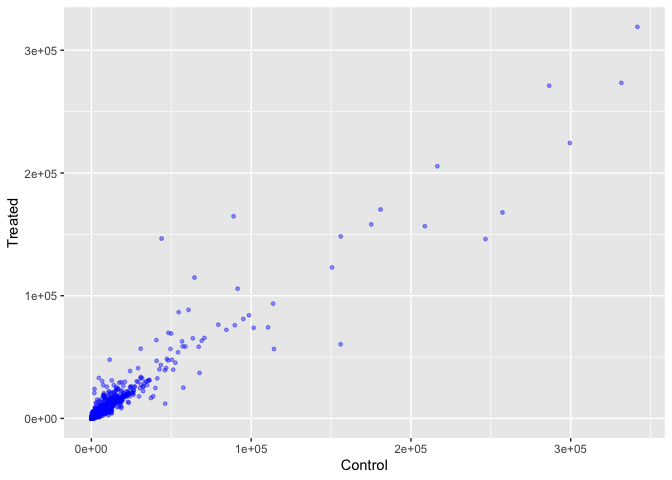
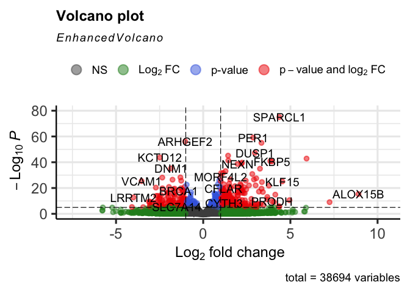

# Class 12 RNAseq analysis
Jiayi Zhou (PID: A17856751)

- [Background](#background)
- [Data import](#data-import)
- [Toy differential gene expression](#toy-differential-gene-expression)
- [DESeq2 analysis](#deseq2-analysis)
- [Adding Annotation Data](#adding-annotation-data)
- [Volcano Plot](#volcano-plot)
- [Save our results](#save-our-results)
- [Add gene annotation](#add-gene-annotation)
- [Pathway analysis](#pathway-analysis)
- [Save our main results](#save-our-main-results)

## Background

Today we will analyze some RNASeq data from Himes et at. on the effects
of a common steroid (dexamethasone) on airway smooth muscle cells (ASM
cells).

Are starting points is the “counts” data and “metadata” that contain the
count values for each gene in their different experiments (i.e. cell
lines with or without the drug).

## Data import

``` r
# Complete the missing code
counts <- read.csv("airway_scaledcounts.csv", row.names=1)
metadata <-  read.csv("airway_metadata.csv")
```

Let’s have a wee peak at these objects:

``` r
head(counts)
```

                    SRR1039508 SRR1039509 SRR1039512 SRR1039513 SRR1039516
    ENSG00000000003        723        486        904        445       1170
    ENSG00000000005          0          0          0          0          0
    ENSG00000000419        467        523        616        371        582
    ENSG00000000457        347        258        364        237        318
    ENSG00000000460         96         81         73         66        118
    ENSG00000000938          0          0          1          0          2
                    SRR1039517 SRR1039520 SRR1039521
    ENSG00000000003       1097        806        604
    ENSG00000000005          0          0          0
    ENSG00000000419        781        417        509
    ENSG00000000457        447        330        324
    ENSG00000000460         94        102         74
    ENSG00000000938          0          0          0

> Q1.1. How many genes are in this dataset?

38,694 genes.

``` r
nrow(counts)
```

    [1] 38694

> Q1.2. How many different experiments (columns in counts(metadata) are
> there?

8 different experiments.

``` r
ncol(counts)
```

    [1] 8

``` r
metadata
```

              id     dex celltype     geo_id
    1 SRR1039508 control   N61311 GSM1275862
    2 SRR1039509 treated   N61311 GSM1275863
    3 SRR1039512 control  N052611 GSM1275866
    4 SRR1039513 treated  N052611 GSM1275867
    5 SRR1039516 control  N080611 GSM1275870
    6 SRR1039517 treated  N080611 GSM1275871
    7 SRR1039520 control  N061011 GSM1275874
    8 SRR1039521 treated  N061011 GSM1275875

> Q2. How many ‘control’ cell lines do we have?

4 ‘control’ cell lines.

``` r
sum(metadata$dex == "control")
```

    [1] 4

## Toy differential gene expression

To start our analysis let’s calculate the mean counts for all genes in
the “control experiments.

1.  Extract all “control” columns from the `counts` object
2.  Calculate the mean for all rows (i.e. genes) of these “control”
    columns 3-4. Do the same for “treated”.
3.  Compare these `control.mean` and `treated.mean` values.

> Q3. How would you make the above code in either approach more robust?
> Is there a function that could help here?

To make the code more robust, use rowMeans() instead of dividing by a
fixed number so the calculation automatically adjusts to any number of
samples.

``` r
#Step 1. Extracted all the "control" columns
control.inds <- metadata$dex == "control"
control.counts <- counts[,control.inds]
head(counts[,control.inds])
```

                    SRR1039508 SRR1039512 SRR1039516 SRR1039520
    ENSG00000000003        723        904       1170        806
    ENSG00000000005          0          0          0          0
    ENSG00000000419        467        616        582        417
    ENSG00000000457        347        364        318        330
    ENSG00000000460         96         73        118        102
    ENSG00000000938          0          1          2          0

``` r
#Step 2, mean of all control columns.
control.means <- rowMeans(control.counts)
head(control.means)
```

    ENSG00000000003 ENSG00000000005 ENSG00000000419 ENSG00000000457 ENSG00000000460 
             900.75            0.00          520.50          339.75           97.25 
    ENSG00000000938 
               0.75 

> Q4. Follow the same procedure for the treated samples (i.e. calculate
> the mean per gene across drug treated samples and assign to a labeled
> vector called treated.mean)

For the treated samples, select columns where `dex == "treated"` and
calculate their per-gene averages using `rowMeans()` to create the
`treated.means` vector.

``` r
#Step 3. Extracted all the "treated" columns
treated.inds <- metadata$dex == "treated"
treated.counts <- counts[,treated.inds]
head(counts[,treated.inds])
```

                    SRR1039509 SRR1039513 SRR1039517 SRR1039521
    ENSG00000000003        486        445       1097        604
    ENSG00000000005          0          0          0          0
    ENSG00000000419        523        371        781        509
    ENSG00000000457        258        237        447        324
    ENSG00000000460         81         66         94         74
    ENSG00000000938          0          0          0          0

``` r
#Step 4, mean of all treated columns.
treated.means <- rowMeans(treated.counts)
head(treated.means)
```

    ENSG00000000003 ENSG00000000005 ENSG00000000419 ENSG00000000457 ENSG00000000460 
             658.00            0.00          546.00          316.50           78.75 
    ENSG00000000938 
               0.00 

Store these together for ease of bookkeeping as `meancounts`

``` r
meancounts <- data.frame(control.means, treated.means)
head(meancounts)
```

                    control.means treated.means
    ENSG00000000003        900.75        658.00
    ENSG00000000005          0.00          0.00
    ENSG00000000419        520.50        546.00
    ENSG00000000457        339.75        316.50
    ENSG00000000460         97.25         78.75
    ENSG00000000938          0.75          0.00

``` r
colSums(meancounts)
```

    control.means treated.means 
         23005324      22196524 

> Q5 (a). Create a scatter plot showing the mean of the treated samples
> against the mean of the control samples. Your plot should look
> something like the following.

Make a plot of control vs treated mean values

``` r
plot(meancounts, xlab="Control", ylab="Treated")
```


> Q5 (b).You could also use the ggplot2 package to make this figure
> producing the plot below. What geom\_?() function would you use for
> this plot?

use the geom_point() function.

``` r
library(ggplot2)
```

    Warning: package 'ggplot2' was built under R version 4.5.2

``` r
ggplot(meancounts, aes(x = control.means, y = treated.means)) +
  geom_point(color = "blue", alpha = 0.4, size = 1) +
  labs(x = "Control", y = "Treated")
```



Make this a log log plot.

> Q6. Try plotting both axes on a log scale. What is the argument to
> plot() that allows you to do this?

Use the `log = "xy"` argument in `plot()`.

``` r
plot(meancounts, log = "xy", xlab = "log Control", ylab = "log Treated")
```

    Warning in xy.coords(x, y, xlabel, ylabel, log): 15032 x values <= 0 omitted
    from logarithmic plot

    Warning in xy.coords(x, y, xlabel, ylabel, log): 15281 y values <= 0 omitted
    from logarithmic plot


We often talk metrics like “log2 fold-change”

``` r
# treated/control
# 0=no change, positive=up regulated, negative=down regulated
log2(10/10)
```

    [1] 0

``` r
log2(10/20) # half the amount
```

    [1] -1

``` r
log2(20/20) # double the amount
```

    [1] 0

Let’s calculate the log2 fold change for our treated over control mean
counts.

``` r
meancounts$log2fc <- log2(meancounts$treated.means/meancounts$control.means)
head(meancounts)
```

                    control.means treated.means      log2fc
    ENSG00000000003        900.75        658.00 -0.45303916
    ENSG00000000005          0.00          0.00         NaN
    ENSG00000000419        520.50        546.00  0.06900279
    ENSG00000000457        339.75        316.50 -0.10226805
    ENSG00000000460         97.25         78.75 -0.30441833
    ENSG00000000938          0.75          0.00        -Inf

``` r
zero.vals <- which(meancounts[,1:2]==0, arr.ind=TRUE)

to.rm <- unique(zero.vals[,1])
mycounts <- meancounts[-to.rm,]
head(mycounts)
```

                    control.means treated.means      log2fc
    ENSG00000000003        900.75        658.00 -0.45303916
    ENSG00000000419        520.50        546.00  0.06900279
    ENSG00000000457        339.75        316.50 -0.10226805
    ENSG00000000460         97.25         78.75 -0.30441833
    ENSG00000000971       5219.00       6687.50  0.35769358
    ENSG00000001036       2327.00       1785.75 -0.38194109

> Q7. What is the purpose of the arr.ind argument in the which()
> function call above? Why would we then take the first column of the
> output and need to call the unique() function?

The `arr.ind = TRUE` argument makes `which()` return both row and column
indices of zero values, and taking the first column with `unique()`
ensures we only keep each gene’s row index once even if it has multiple
zeros.

A common “rule of thumb” is a log2 fold change cutoff of +2 and -2 to
call genes “Up regulated” or “Down regulated”.

> Q8. Using the up.ind vector above can you determine how many up
> regulated genes we have at the greater than 2 fc level?

The number of up-regulated genes is sum(up.ind) Number of “up” genes at
+2 threshold

``` r
sum(meancounts$log2fc >= +2, na.rm=T)
```

    [1] 1910

> Q9. Using the down.ind vector above can you determine how many down
> regulated genes we have at the greater than 2 fc level?

The number of down-regulated genes is sum(down.ind)

Number of “down” genes at -2 threshold

``` r
sum(meancounts$log2fc >= -2, na.rm=T)
```

    [1] 23046

> Q10. Do you trust these results? Why or why not?

No, these results are based on fold change without normalization or
statistical significance testing (e.g., DESeq2 p-values).

## DESeq2 analysis

Let’s do this analysis properly and keep our inner stats nerd happy -
i.e. are the differences we see between drug and no drug significant
given the replicate experiments.

``` r
library(DESeq2)
```

    Warning: package 'DESeq2' was built under R version 4.5.2

For DESeq analysis we need three things

- count values (`contData`)
- metadata telling us about the columns in `countdata` (coldata)
- design od the experiment (i.e.what do you want to compute)

Our first function from DESeq2 will set up the input required for
analysis by storing all these 3 things together,

``` r
dds <- DESeqDataSetFromMatrix(countData = counts,
                              colData = metadata,
                              design = ~dex)
```

    converting counts to integer mode

    Warning in DESeqDataSet(se, design = design, ignoreRank): some variables in
    design formula are characters, converting to factors

The main function in DESeq2 that runs the analysis is caled `DESeq2`

``` r
dds <- DESeq(dds)
```

    estimating size factors

    estimating dispersions

    gene-wise dispersion estimates

    mean-dispersion relationship

    final dispersion estimates

    fitting model and testing

``` r
res <- results(dds)
head(res)
```

    log2 fold change (MLE): dex treated vs control 
    Wald test p-value: dex treated vs control 
    DataFrame with 6 rows and 6 columns
                      baseMean log2FoldChange     lfcSE      stat    pvalue
                     <numeric>      <numeric> <numeric> <numeric> <numeric>
    ENSG00000000003 747.194195      -0.350703  0.168242 -2.084514 0.0371134
    ENSG00000000005   0.000000             NA        NA        NA        NA
    ENSG00000000419 520.134160       0.206107  0.101042  2.039828 0.0413675
    ENSG00000000457 322.664844       0.024527  0.145134  0.168996 0.8658000
    ENSG00000000460  87.682625      -0.147143  0.256995 -0.572550 0.5669497
    ENSG00000000938   0.319167      -1.732289  3.493601 -0.495846 0.6200029
                         padj
                    <numeric>
    ENSG00000000003  0.163017
    ENSG00000000005        NA
    ENSG00000000419  0.175937
    ENSG00000000457  0.961682
    ENSG00000000460  0.815805
    ENSG00000000938        NA

``` r
summary(res)
```


    out of 25258 with nonzero total read count
    adjusted p-value < 0.1
    LFC > 0 (up)       : 1564, 6.2%
    LFC < 0 (down)     : 1188, 4.7%
    outliers [1]       : 142, 0.56%
    low counts [2]     : 9971, 39%
    (mean count < 10)
    [1] see 'cooksCutoff' argument of ?results
    [2] see 'independentFiltering' argument of ?results

``` r
res05 <- results(dds, alpha=0.05)
summary(res05)
```


    out of 25258 with nonzero total read count
    adjusted p-value < 0.05
    LFC > 0 (up)       : 1237, 4.9%
    LFC < 0 (down)     : 933, 3.7%
    outliers [1]       : 142, 0.56%
    low counts [2]     : 9033, 36%
    (mean count < 6)
    [1] see 'cooksCutoff' argument of ?results
    [2] see 'independentFiltering' argument of ?results

``` r
36000*0.05
```

    [1] 1800

## Adding Annotation Data

``` r
library("AnnotationDbi")
library("org.Hs.eg.db")
```

``` r
columns(org.Hs.eg.db)
```

     [1] "ACCNUM"       "ALIAS"        "ENSEMBL"      "ENSEMBLPROT"  "ENSEMBLTRANS"
     [6] "ENTREZID"     "ENZYME"       "EVIDENCE"     "EVIDENCEALL"  "GENENAME"    
    [11] "GENETYPE"     "GO"           "GOALL"        "IPI"          "MAP"         
    [16] "OMIM"         "ONTOLOGY"     "ONTOLOGYALL"  "PATH"         "PFAM"        
    [21] "PMID"         "PROSITE"      "REFSEQ"       "SYMBOL"       "UCSCKG"      
    [26] "UNIPROT"     

``` r
res$symbol <- mapIds(org.Hs.eg.db,
                     keys=row.names(res), # Our genenames
                     keytype="ENSEMBL",        # The format of our genenames
                     column="SYMBOL",          # The new format we want to add
                     multiVals="first")
```

    'select()' returned 1:many mapping between keys and columns

``` r
head(res)
```

    log2 fold change (MLE): dex treated vs control 
    Wald test p-value: dex treated vs control 
    DataFrame with 6 rows and 7 columns
                      baseMean log2FoldChange     lfcSE      stat    pvalue
                     <numeric>      <numeric> <numeric> <numeric> <numeric>
    ENSG00000000003 747.194195      -0.350703  0.168242 -2.084514 0.0371134
    ENSG00000000005   0.000000             NA        NA        NA        NA
    ENSG00000000419 520.134160       0.206107  0.101042  2.039828 0.0413675
    ENSG00000000457 322.664844       0.024527  0.145134  0.168996 0.8658000
    ENSG00000000460  87.682625      -0.147143  0.256995 -0.572550 0.5669497
    ENSG00000000938   0.319167      -1.732289  3.493601 -0.495846 0.6200029
                         padj      symbol
                    <numeric> <character>
    ENSG00000000003  0.163017      TSPAN6
    ENSG00000000005        NA        TNMD
    ENSG00000000419  0.175937        DPM1
    ENSG00000000457  0.961682       SCYL3
    ENSG00000000460  0.815805       FIRRM
    ENSG00000000938        NA         FGR

> Q11. Run the mapIds() function two more times to add the Entrez ID and
> UniProt accession and GENENAME as new columns called
> res$entrez, res$uniprot and res\$genename.

``` r
res$entrez <- mapIds(org.Hs.eg.db,
                     keys=row.names(res),
                     column="ENTREZID",
                     keytype="ENSEMBL",
                     multiVals="first")
```

    'select()' returned 1:many mapping between keys and columns

``` r
res$uniprot <- mapIds(org.Hs.eg.db,
                     keys=row.names(res),
                     column="UNIPROT",
                     keytype="ENSEMBL",
                     multiVals="first")
```

    'select()' returned 1:many mapping between keys and columns

``` r
res$genename <- mapIds(org.Hs.eg.db,
                     keys=row.names(res),
                     column="GENENAME",
                     keytype="ENSEMBL",
                     multiVals="first")
```

    'select()' returned 1:many mapping between keys and columns

``` r
head(res)
```

    log2 fold change (MLE): dex treated vs control 
    Wald test p-value: dex treated vs control 
    DataFrame with 6 rows and 10 columns
                      baseMean log2FoldChange     lfcSE      stat    pvalue
                     <numeric>      <numeric> <numeric> <numeric> <numeric>
    ENSG00000000003 747.194195      -0.350703  0.168242 -2.084514 0.0371134
    ENSG00000000005   0.000000             NA        NA        NA        NA
    ENSG00000000419 520.134160       0.206107  0.101042  2.039828 0.0413675
    ENSG00000000457 322.664844       0.024527  0.145134  0.168996 0.8658000
    ENSG00000000460  87.682625      -0.147143  0.256995 -0.572550 0.5669497
    ENSG00000000938   0.319167      -1.732289  3.493601 -0.495846 0.6200029
                         padj      symbol      entrez     uniprot
                    <numeric> <character> <character> <character>
    ENSG00000000003  0.163017      TSPAN6        7105  A0A087WYV6
    ENSG00000000005        NA        TNMD       64102      Q9H2S6
    ENSG00000000419  0.175937        DPM1        8813      H0Y368
    ENSG00000000457  0.961682       SCYL3       57147      X6RHX1
    ENSG00000000460  0.815805       FIRRM       55732      A6NFP1
    ENSG00000000938        NA         FGR        2268      B7Z6W7
                                  genename
                               <character>
    ENSG00000000003          tetraspanin 6
    ENSG00000000005            tenomodulin
    ENSG00000000419 dolichyl-phosphate m..
    ENSG00000000457 SCY1 like pseudokina..
    ENSG00000000460 FIGNL1 interacting r..
    ENSG00000000938 FGR proto-oncogene, ..

``` r
ord <- order( res$padj )
#View(res[ord,])
head(res[ord,])
```

    log2 fold change (MLE): dex treated vs control 
    Wald test p-value: dex treated vs control 
    DataFrame with 6 rows and 10 columns
                     baseMean log2FoldChange     lfcSE      stat      pvalue
                    <numeric>      <numeric> <numeric> <numeric>   <numeric>
    ENSG00000152583   954.771        4.36836 0.2371306   18.4217 8.79214e-76
    ENSG00000179094   743.253        2.86389 0.1755659   16.3123 8.06568e-60
    ENSG00000116584  2277.913       -1.03470 0.0650826  -15.8983 6.51317e-57
    ENSG00000189221  2383.754        3.34154 0.2124091   15.7316 9.17960e-56
    ENSG00000120129  3440.704        2.96521 0.2036978   14.5569 5.27883e-48
    ENSG00000148175 13493.920        1.42717 0.1003811   14.2175 7.13625e-46
                           padj      symbol      entrez     uniprot
                      <numeric> <character> <character> <character>
    ENSG00000152583 1.33157e-71     SPARCL1        8404      B4E2Z0
    ENSG00000179094 6.10774e-56        PER1        5187      A2I2P6
    ENSG00000116584 3.28806e-53     ARHGEF2        9181  A0A8Q3SIN5
    ENSG00000189221 3.47563e-52        MAOA        4128      B4DF46
    ENSG00000120129 1.59896e-44       DUSP1        1843      B4DRR4
    ENSG00000148175 1.80131e-42        STOM        2040      F8VSL7
                                  genename
                               <character>
    ENSG00000152583           SPARC like 1
    ENSG00000179094 period circadian reg..
    ENSG00000116584 Rho/Rac guanine nucl..
    ENSG00000189221    monoamine oxidase A
    ENSG00000120129 dual specificity pho..
    ENSG00000148175               stomatin

``` r
write.csv(res[ord,], "deseq_results.csv")
```

## Volcano Plot

This is a common summary result figure from these types of experiments
and plot the log2 fold-change vs the adjusted p-value.

``` r
plot(res$log2FoldChange, -log(res$padj))
abline(v=c(-2,2), col="red")
abline(h=-log(0.04), col="red")
```


``` r
log(0.1)
```

    [1] -2.302585

``` r
log(0.000001)
```

    [1] -13.81551

``` r
# Setup our custom point color vector 
mycols <- rep("gray", nrow(res))
mycols[ abs(res$log2FoldChange) > 2 ]  <- "red" 

inds <- (res$padj < 0.01) & (abs(res$log2FoldChange) > 2 )
mycols[ inds ] <- "blue"

# Volcano plot with custom colors 
plot( res$log2FoldChange,  -log(res$padj), 
 col=mycols, ylab="-Log(P-value)", xlab="Log2(FoldChange)" )

# Cut-off lines
abline(v=c(-2,2), col="gray", lty=2)
abline(h=-log(0.1), col="gray", lty=2)
```


``` r
BiocManager::install("EnhancedVolcano")
```

    Bioconductor version 3.22 (BiocManager 1.30.27), R 4.5.1 (2025-06-13)

    Warning: package(s) not installed when version(s) same as or greater than current; use
      `force = TRUE` to re-install: 'EnhancedVolcano'

    Old packages: 'broom', 'doBy', 'htmltools', 'lme4', 'officer', 'pak',
      'S4Arrays', 'shiny', 'SparseArray', 'xml2'

``` r
library(EnhancedVolcano)
```

    Loading required package: ggrepel

``` r
x <- as.data.frame(res)

EnhancedVolcano(x,
    lab = x$symbol,
    x = 'log2FoldChange',
    y = 'pvalue')
```

    Warning: Using `size` aesthetic for lines was deprecated in ggplot2 3.4.0.
    ℹ Please use `linewidth` instead.
    ℹ The deprecated feature was likely used in the EnhancedVolcano package.
      Please report the issue to the authors.

    Warning: The `size` argument of `element_line()` is deprecated as of ggplot2 3.4.0.
    ℹ Please use the `linewidth` argument instead.
    ℹ The deprecated feature was likely used in the EnhancedVolcano package.
      Please report the issue to the authors.



## Save our results

``` r
write.csv(res, file="my_results.csv")
```

## Add gene annotation

To help make sense of our results and continue them to other folks we
need to add some more annotation to our main `res` object.

We will use two bioconductor packages to first map IDs to different
formats including the classic gene “symbol” gene name.

I will install these with the following commands:
`BiocManager::install("AnnotationDbi")`
`BiocManager::install("org.Hs.eg.db")`

``` r
library(AnnotationDbi)
library(org.Hs.eg.db)
```

Let’s see what is in `org.Hs.eg.db` with the `columns()` function:

``` r
columns(org.Hs.eg.db)
```

     [1] "ACCNUM"       "ALIAS"        "ENSEMBL"      "ENSEMBLPROT"  "ENSEMBLTRANS"
     [6] "ENTREZID"     "ENZYME"       "EVIDENCE"     "EVIDENCEALL"  "GENENAME"    
    [11] "GENETYPE"     "GO"           "GOALL"        "IPI"          "MAP"         
    [16] "OMIM"         "ONTOLOGY"     "ONTOLOGYALL"  "PATH"         "PFAM"        
    [21] "PMID"         "PROSITE"      "REFSEQ"       "SYMBOL"       "UCSCKG"      
    [26] "UNIPROT"     

We can translate or “map” IDs between any of these 26 database using the
`mapIds()` function.

``` r
res$symbol <- mapIds(keys = row.names(res), # our current IDs
       keytype = "ENSEMBL",                 # the format of our IDs
       x = org.Hs.eg.db,                    # where to get mappings from
       column = "SYMBOL")                   # the format/DB to map to
```

    'select()' returned 1:many mapping between keys and columns

``` r
head(res)
```

    log2 fold change (MLE): dex treated vs control 
    Wald test p-value: dex treated vs control 
    DataFrame with 6 rows and 10 columns
                      baseMean log2FoldChange     lfcSE      stat    pvalue
                     <numeric>      <numeric> <numeric> <numeric> <numeric>
    ENSG00000000003 747.194195      -0.350703  0.168242 -2.084514 0.0371134
    ENSG00000000005   0.000000             NA        NA        NA        NA
    ENSG00000000419 520.134160       0.206107  0.101042  2.039828 0.0413675
    ENSG00000000457 322.664844       0.024527  0.145134  0.168996 0.8658000
    ENSG00000000460  87.682625      -0.147143  0.256995 -0.572550 0.5669497
    ENSG00000000938   0.319167      -1.732289  3.493601 -0.495846 0.6200029
                         padj      symbol      entrez     uniprot
                    <numeric> <character> <character> <character>
    ENSG00000000003  0.163017      TSPAN6        7105  A0A087WYV6
    ENSG00000000005        NA        TNMD       64102      Q9H2S6
    ENSG00000000419  0.175937        DPM1        8813      H0Y368
    ENSG00000000457  0.961682       SCYL3       57147      X6RHX1
    ENSG00000000460  0.815805       FIRRM       55732      A6NFP1
    ENSG00000000938        NA         FGR        2268      B7Z6W7
                                  genename
                               <character>
    ENSG00000000003          tetraspanin 6
    ENSG00000000005            tenomodulin
    ENSG00000000419 dolichyl-phosphate m..
    ENSG00000000457 SCY1 like pseudokina..
    ENSG00000000460 FIGNL1 interacting r..
    ENSG00000000938 FGR proto-oncogene, ..

Add the mapping for “GENENAME” and “ENTREZID” and store as
`res$genename` and `res$entrez`

``` r
res$entrez <- mapIds(keys = row.names(res), # our current IDs
       keytype = "ENSEMBL",                 # the format of our IDs
       x = org.Hs.eg.db,                    # where to get mappings from
       column = "ENTREZID")                 # the format/DB to map to
```

    'select()' returned 1:many mapping between keys and columns

``` r
res$genename <- mapIds(keys = row.names(res), # our current IDs
       keytype = "ENSEMBL",                 # the format of our IDs
       x = org.Hs.eg.db,                    # where to get mappings from
       column = "GENENAME") 
```

    'select()' returned 1:many mapping between keys and columns

``` r
head(res)
```

    log2 fold change (MLE): dex treated vs control 
    Wald test p-value: dex treated vs control 
    DataFrame with 6 rows and 10 columns
                      baseMean log2FoldChange     lfcSE      stat    pvalue
                     <numeric>      <numeric> <numeric> <numeric> <numeric>
    ENSG00000000003 747.194195      -0.350703  0.168242 -2.084514 0.0371134
    ENSG00000000005   0.000000             NA        NA        NA        NA
    ENSG00000000419 520.134160       0.206107  0.101042  2.039828 0.0413675
    ENSG00000000457 322.664844       0.024527  0.145134  0.168996 0.8658000
    ENSG00000000460  87.682625      -0.147143  0.256995 -0.572550 0.5669497
    ENSG00000000938   0.319167      -1.732289  3.493601 -0.495846 0.6200029
                         padj      symbol      entrez     uniprot
                    <numeric> <character> <character> <character>
    ENSG00000000003  0.163017      TSPAN6        7105  A0A087WYV6
    ENSG00000000005        NA        TNMD       64102      Q9H2S6
    ENSG00000000419  0.175937        DPM1        8813      H0Y368
    ENSG00000000457  0.961682       SCYL3       57147      X6RHX1
    ENSG00000000460  0.815805       FIRRM       55732      A6NFP1
    ENSG00000000938        NA         FGR        2268      B7Z6W7
                                  genename
                               <character>
    ENSG00000000003          tetraspanin 6
    ENSG00000000005            tenomodulin
    ENSG00000000419 dolichyl-phosphate m..
    ENSG00000000457 SCY1 like pseudokina..
    ENSG00000000460 FIGNL1 interacting r..
    ENSG00000000938 FGR proto-oncogene, ..

## Pathway analysis

There are lots of bioconductor packages to do this type of analysis. For
now let’s just try one called **gage** again we need to install this if
we don’t have it already.

``` r
library(gage)
library(gageData)
library(pathview)
```

To use **gage** I need two things

- a named vector of fold-change calues for our DEGs (our geneset of
  interest)
- a set of pathways or genesets to use for annotation

``` r
c("barry"=5,"lisa"=10)
```

    barry  lisa 
        5    10 

``` r
names(x) <- c("low", "high")
x
```

                             low          high       <NA>          <NA>
    ENSG00000000003 7.471942e+02 -3.507030e-01 0.16824208 -2.084514e+00
    ENSG00000000005 0.000000e+00            NA         NA            NA
    ENSG00000000419 5.201342e+02  2.061073e-01 0.10104150  2.039828e+00
    ENSG00000000457 3.226648e+02  2.452701e-02 0.14513386  1.689958e-01
    ENSG00000000460 8.768263e+01 -1.471426e-01 0.25699544 -5.725496e-01
    ENSG00000000938 3.191666e-01 -1.732289e+00 3.49360098 -4.958463e-01
    ENSG00000000971 5.760148e+03  4.592819e-01 0.23431786  1.960081e+00
    ENSG00000001036 2.025392e+03 -2.282438e-01 0.12499899 -1.825965e+00
    ENSG00000001084 6.521733e+02 -2.530308e-01 0.20257635 -1.249064e+00
    ENSG00000001167 4.116844e+02 -5.337334e-01 0.22879218 -2.332831e+00
    ENSG00000001460 2.013366e+02 -1.235577e-01 0.16110148 -7.669556e-01
    ENSG00000001461 2.918777e+03  2.101560e-03 0.28871570  7.278993e-03
    ENSG00000001497 5.395017e+02 -5.732092e-02 0.10932855 -5.242996e-01
    ENSG00000001561 1.159144e+02  2.868170e-01 0.71601400  4.005746e-01
    ENSG00000001617 6.042975e+02 -1.922028e-01 0.19868955 -9.673525e-01
    ENSG00000001626 9.672415e+00 -2.863937e-01 0.58621353 -4.885485e-01
    ENSG00000001629 1.826758e+03 -2.460912e-01 0.19039375 -1.292538e+00
    ENSG00000001630 9.796084e+02 -1.797534e-01 0.12137132 -1.481021e+00
    ENSG00000001631 8.487238e+02 -7.125492e-02 0.15364789 -4.637546e-01
    ENSG00000002016 2.037358e+02 -4.115826e-01 0.22845070 -1.801625e+00
    ENSG00000002079 3.064849e+00  1.061131e+00 1.77215404  5.987803e-01
    ENSG00000002330 6.886676e+02  1.032510e-02 0.09640872  1.070971e-01
    ENSG00000002549 1.229985e+03  1.643007e-01 0.17739415  9.261901e-01
    ENSG00000002586 8.367267e+03  7.928942e-02 0.13163558  6.023404e-01
    ENSG00000002587 1.959533e+00  3.990671e-01 1.15871211  3.444058e-01
    ENSG00000002726 1.535317e+00  8.049352e-01 1.80328136  4.463725e-01
    ENSG00000002745 7.285619e+00 -6.167565e-01 1.02004744 -6.046351e-01
    ENSG00000002746 1.261300e+02  1.936813e-01 0.30834967  6.281221e-01
    ENSG00000002822 3.511523e+02 -5.738893e-02 0.15002411 -3.825314e-01
    ENSG00000002834 8.609183e+03  4.168750e-01 0.10828988  3.849621e+00
    ENSG00000002919 2.515001e+02  3.419728e-01 0.14432532  2.369458e+00
    ENSG00000002933 5.464414e+02  4.044665e-01 1.40062631  2.887755e-01
    ENSG00000003056 1.837968e+03 -7.701994e-03 0.10037983 -7.672851e-02
    ENSG00000003096 4.140753e+02 -9.645787e-01 0.19173837 -5.030703e+00
    ENSG00000003137 1.065064e+02 -1.030776e+00 0.58310120 -1.767748e+00
    ENSG00000003147 9.331886e+00  2.549138e-01 0.57045309  4.468619e-01
    ENSG00000003249 1.222421e+02 -3.684979e-01 0.35331983 -1.042958e+00
    ENSG00000003393 8.608598e+02  5.489205e-02 0.16683138  3.290272e-01
    ENSG00000003400 9.537116e+01 -1.783988e-01 0.35460535 -5.030910e-01
    ENSG00000003402 3.368723e+03  1.162500e+00 0.12613296  9.216462e+00
    ENSG00000003436 5.053341e+03 -3.254436e-01 0.19941429 -1.631997e+00
    ENSG00000003509 3.028351e+02 -1.008956e-01 0.12508114 -8.066412e-01
    ENSG00000003756 2.957874e+03 -1.837677e-01 0.08049487 -2.282975e+00
    ENSG00000003987 3.026736e+01  7.546840e-01 0.35078785  2.151397e+00
    ENSG00000003989 3.953984e+01  5.869317e-01 0.73030909  8.036757e-01
    ENSG00000004059 1.684322e+03  3.796899e-01 0.11418622  3.325181e+00
    ENSG00000004139 3.126434e+02 -8.077704e-02 0.20498894 -3.940556e-01
    ENSG00000004142 1.468182e+03  1.522880e-01 0.12736909  1.195643e+00
    ENSG00000004399 3.661965e+03 -5.194727e-02 0.21722848 -2.391365e-01
    ENSG00000004455 1.236906e+03 -9.185676e-02 0.16457507 -5.581450e-01
    ENSG00000004468 5.599360e+00  2.415845e-01 0.81410899  2.967472e-01
    ENSG00000004478 6.124697e+02 -3.038333e-03 0.16656548 -1.824107e-02
    ENSG00000004487 1.255800e+03 -3.341060e-01 0.09602713 -3.479287e+00
    ENSG00000004534 1.306149e+03 -3.035313e-01 0.15895628 -1.909527e+00
    ENSG00000004660 7.986542e+01 -6.451762e-01 0.37810434 -1.706344e+00
    ENSG00000004700 1.510208e+03  4.095532e-01 0.11915479  3.437153e+00
    ENSG00000004766 4.952126e+02 -1.143570e-01 0.12993065 -8.801389e-01
    ENSG00000004776 1.252035e+04 -1.545422e-01 0.24561187 -6.292132e-01
    ENSG00000004777 1.043955e+02 -4.714329e-01 0.40943122 -1.151434e+00
    ENSG00000004779 3.663403e+02  1.099033e-01 0.13651851  8.050430e-01
    ENSG00000004799 9.355593e+02  2.559675e+00 0.91103141  2.809646e+00
    ENSG00000004809 1.409944e+00  5.281822e-02 1.54285855  3.423400e-02
    ENSG00000004838 1.634345e+01 -9.239379e-01 0.41146541 -2.245481e+00
    ENSG00000004846 2.207329e+01 -1.589952e+00 0.64941193 -2.448295e+00
    ENSG00000004848 1.388017e-01  8.946997e-01 3.53381154  2.531826e-01
    ENSG00000004864 1.523067e+02  5.597354e-02 0.27460790  2.038308e-01
    ENSG00000004866 5.238843e+02 -6.140816e-01 0.21208918 -2.895393e+00
    ENSG00000004897 1.680018e+03 -1.618647e-01 0.10071829 -1.607104e+00
    ENSG00000004939 8.673571e+00 -6.095474e-01 0.56702653 -1.074989e+00
    ENSG00000004948 0.000000e+00            NA         NA            NA
    ENSG00000004961 4.359632e+02 -1.663624e-01 0.14177747 -1.173405e+00
    ENSG00000004975 1.003165e+03 -3.467479e-01 0.16259638 -2.132569e+00
    ENSG00000005001 0.000000e+00            NA         NA            NA
    ENSG00000005007 2.286277e+03  2.212874e-01 0.09418911  2.349395e+00
    ENSG00000005020 7.528197e+02  7.330294e-02 0.15089900  4.857749e-01
    ENSG00000005022 1.300367e+03 -7.718319e-02 0.11683724 -6.606043e-01
    ENSG00000005059 2.157444e+02  2.233337e-01 0.25731094  8.679528e-01
    ENSG00000005073 4.249823e-01 -1.079306e+00 2.57996150 -4.183418e-01
    ENSG00000005075 6.146566e+02  9.877741e-02 0.16070142  6.146642e-01
    ENSG00000005100 5.023275e+02  3.144319e-01 0.13083905  2.403196e+00
    ENSG00000005102 4.422626e-01 -2.193116e+00 3.46383757 -6.331464e-01
    ENSG00000005108 1.250696e+01  9.318273e-01 0.62386842  1.493628e+00
    ENSG00000005156 2.842016e+02 -3.854730e-01 0.20430302 -1.886771e+00
    ENSG00000005175 3.474249e+02 -1.991431e-01 0.28869584 -6.898026e-01
    ENSG00000005187 2.679250e+01 -3.275090e-01 0.41242784 -7.941001e-01
    ENSG00000005189 7.903002e+01 -4.398274e-01 0.27106071 -1.622616e+00
    ENSG00000005194 4.587509e+02  1.280017e-01 0.16108237  7.946353e-01
    ENSG00000005206 6.874282e+02  1.013186e-01 0.13939534  7.268438e-01
    ENSG00000005238 7.057332e+02 -2.058234e-01 0.11531792 -1.784835e+00
    ENSG00000005243 9.939896e+02 -1.065690e-01 0.18524767 -5.752784e-01
    ENSG00000005249 3.013369e+02  6.602817e-01 0.22558494  2.926976e+00
    ENSG00000005302 4.699354e+02  1.902867e-01 0.15904337  1.196446e+00
    ENSG00000005339 2.604140e+03 -1.044013e-01 0.13577288 -7.689407e-01
    ENSG00000005379 1.589614e+02  1.209417e-01 0.28487038  4.245499e-01
    ENSG00000005381 7.124085e+00  1.170191e+00 1.30318498  8.979470e-01
    ENSG00000005421 1.065463e-01 -5.479728e-01 3.53381154 -1.550657e-01
    ENSG00000005436 3.029673e+02  1.569585e-01 0.13919727  1.127597e+00
    ENSG00000005448 2.342445e+02  2.801559e-01 0.15829099  1.769879e+00
    ENSG00000005469 4.222325e+02 -2.739937e-01 0.24391852 -1.123300e+00
    ENSG00000005471 3.328396e+01 -1.229168e+00 0.50949784 -2.412509e+00
    ENSG00000005483 1.867573e+03  1.380367e-02 0.13102462  1.053517e-01
    ENSG00000005486 8.564459e+02 -1.517835e-01 0.18951490 -8.009054e-01
    ENSG00000005513 4.190251e+00 -6.647366e-01 1.01926333 -6.521735e-01
    ENSG00000005700 5.794496e+02 -8.752130e-02 0.13287132 -6.586922e-01
    ENSG00000005801 2.208193e+02 -2.454595e-01 0.22106204 -1.110365e+00
    ENSG00000005810 2.862990e+03 -6.271632e-02 0.12042884 -5.207749e-01
    ENSG00000005812 1.499030e+03  4.085973e-01 0.17164090  2.380536e+00
    ENSG00000005844 3.219515e+00 -9.388209e-01 1.14106009 -8.227620e-01
    ENSG00000005882 1.066407e+03 -1.279212e-01 0.14562639 -8.784206e-01
    ENSG00000005884 1.294276e+03  3.335346e-01 0.27638591  1.206771e+00
    ENSG00000005889 8.001155e+02  1.629350e-02 0.22773742  7.154513e-02
    ENSG00000005893 5.133581e+03  4.307508e-02 0.08265370  5.211513e-01
    ENSG00000005961 1.028825e+01 -6.198260e-01 0.63716204 -9.727918e-01
    ENSG00000005981 6.436960e+00 -6.296606e-01 0.79146165 -7.955668e-01
    ENSG00000006007 2.603735e+03  1.807669e-01 0.14693567  1.230245e+00
    ENSG00000006015 3.869088e+02 -5.317531e-02 0.32022525 -1.660560e-01
    ENSG00000006016 1.604523e+02  1.921302e-01 0.49296149  3.897469e-01
    ENSG00000006025 1.604634e+02 -6.525544e-01 0.31511780 -2.070827e+00
    ENSG00000006042 3.151110e+03  9.041088e-03 0.09817575  9.209084e-02
    ENSG00000006047 6.738803e-01 -2.883068e-01 2.10981455 -1.366503e-01
    ENSG00000006059 0.000000e+00            NA         NA            NA
    ENSG00000006062 2.582688e+02 -5.841877e-01 0.27325027 -2.137922e+00
    ENSG00000006071 0.000000e+00            NA         NA            NA
    ENSG00000006116 4.506847e-01 -1.015575e+00 3.11273788 -3.262642e-01
    ENSG00000006118 4.589854e+02 -5.498880e-01 0.22108771 -2.487194e+00
    ENSG00000006125 6.730779e+03  8.025782e-02 0.10852063  7.395628e-01
    ENSG00000006128 6.612807e-01  1.962477e+00 3.45793653  5.675283e-01
    ENSG00000006194 5.516352e+02  1.116907e-01 0.10257649  1.088853e+00
    ENSG00000006210 1.588410e+01  9.502809e-01 0.61315385  1.549825e+00
    ENSG00000006282 1.394309e+03 -1.069815e-01 0.16855661 -6.346919e-01
    ENSG00000006283 6.136423e+01 -1.173476e+00 0.46121630 -2.544307e+00
    ENSG00000006327 5.872592e+02 -1.461047e-01 0.32131900 -4.547029e-01
    ENSG00000006377 1.862932e-01  8.946997e-01 3.53381154  2.531826e-01
    ENSG00000006432 6.995032e+00 -2.185705e-01 0.73515448 -2.973123e-01
    ENSG00000006451 1.108164e+03 -5.691794e-01 0.21067356 -2.701713e+00
    ENSG00000006453 2.129288e+02 -2.737793e-01 0.15762415 -1.736912e+00
    ENSG00000006459 4.108858e+02  5.601732e-03 0.31243311  1.792938e-02
    ENSG00000006468 2.101792e+02  4.861182e-02 0.40616023  1.196863e-01
    ENSG00000006530 2.778875e+02  3.315634e-02 0.20142748  1.646069e-01
    ENSG00000006534 1.145462e+03  4.279165e-01 0.26283303  1.628093e+00
    ENSG00000006555 4.767083e+00 -6.105749e-01 0.81145974 -7.524402e-01
    ENSG00000006576 1.076374e+03 -4.165878e-01 0.19587162 -2.126841e+00
    ENSG00000006606 4.014544e+00 -4.339514e-01 0.89931851 -4.825336e-01
    ENSG00000006607 9.579919e+02  5.958619e-01 0.15504930  3.843048e+00
    ENSG00000006611 0.000000e+00            NA         NA            NA
    ENSG00000006625 1.773044e+02 -1.087191e-01 0.25133610 -4.325645e-01
    ENSG00000006634 9.284294e+01 -4.483483e-01 0.29781312 -1.505468e+00
    ENSG00000006638 6.409291e+01 -4.852530e-01 0.29398058 -1.650630e+00
    ENSG00000006652 1.086508e+03 -5.099405e-02 0.21867403 -2.331967e-01
    ENSG00000006659 1.437785e+00 -4.858001e-01 1.54315218 -3.148102e-01
    ENSG00000006695 1.815415e+02  1.961253e-01 0.20279200  9.671256e-01
    ENSG00000006704 2.916074e+02 -4.137239e-02 0.23541896 -1.757394e-01
    ENSG00000006712 1.114822e+03 -2.389320e-01 0.12978954 -1.840919e+00
    ENSG00000006715 2.208492e+03 -1.396043e-01 0.13420120 -1.040261e+00
    ENSG00000006740 4.337970e+01 -1.996811e-02 0.37970656 -5.258826e-02
    ENSG00000006744 9.389004e+02  2.517167e-01 0.15381283  1.636513e+00
    ENSG00000006747 2.773605e+01  2.034239e-01 0.48746877  4.173065e-01
    ENSG00000006756 5.454143e+02 -1.479025e-02 0.15885904 -9.310300e-02
    ENSG00000006757 1.689590e+02 -1.572303e-02 0.15405917 -1.020584e-01
    ENSG00000006788 1.120240e+01  2.955196e+00 1.06560131  2.773266e+00
    ENSG00000006831 1.095781e+03  2.438688e-01 0.09318955  2.616911e+00
    ENSG00000006837 7.536756e+01 -1.481910e-01 0.31340782 -4.728377e-01
    ENSG00000007001 2.003237e+00 -2.843368e-01 1.40160649 -2.028649e-01
    ENSG00000007038 8.873810e-01  6.079372e-01 1.95093900  3.116126e-01
    ENSG00000007047 8.138329e+02 -3.771953e-02 0.17511511 -2.153985e-01
    ENSG00000007062 2.456267e+00 -5.524548e-01 1.02517399 -5.388888e-01
    ENSG00000007080 6.629551e+02  2.442439e-01 0.15881983  1.537868e+00
    ENSG00000007129 0.000000e+00            NA         NA            NA
    ENSG00000007168 3.974858e+03  5.156596e-02 0.10362912  4.976011e-01
    ENSG00000007171 1.482517e+00 -5.383576e-01 1.78161285 -3.021743e-01
    ENSG00000007174 2.701672e+00  3.837678e-01 1.02553759  3.742113e-01
    ENSG00000007202 6.545037e+03  2.440300e-02 0.09201340  2.652113e-01
    ENSG00000007216 0.000000e+00            NA         NA            NA
    ENSG00000007237 4.251122e+02 -8.957749e-01 0.96066907 -9.324490e-01
    ENSG00000007255 1.304520e+02  2.703063e-01 0.24207784  1.116609e+00
    ENSG00000007264 2.943259e+00  1.300314e-01 0.93455236  1.391376e-01
    ENSG00000007306 0.000000e+00            NA         NA            NA
    ENSG00000007312 2.077333e+00  6.273492e-01 1.53114289  4.097261e-01
    ENSG00000007314 7.799542e-01 -6.844119e-01 2.03050849 -3.370643e-01
    ENSG00000007341 2.816754e+02  2.155431e-01 0.24129707  8.932687e-01
    ENSG00000007350 0.000000e+00            NA         NA            NA
    ENSG00000007372 4.045403e+01  2.048258e-01 0.51586822  3.970506e-01
    ENSG00000007376 2.584610e+02  1.203421e-01 0.19997927  6.017730e-01
    ENSG00000007384 1.823388e+03  8.681164e-02 0.15063548  5.763027e-01
    ENSG00000007392 6.868731e+02 -1.038536e-01 0.11014826 -9.428527e-01
    ENSG00000007402 2.379639e+01  7.395357e-01 0.51912601  1.424578e+00
    ENSG00000007516 1.120108e+01 -2.116469e-01 0.70713286 -2.993029e-01
    ENSG00000007520 5.805605e+02  7.143399e-02 0.15064966  4.741729e-01
    ENSG00000007541 6.535463e+02  2.217481e-01 0.16469274  1.346435e+00
    ENSG00000007545 6.227685e+02  1.667684e-01 0.15763693  1.057927e+00
    ENSG00000007866 1.620522e+03  5.539344e-01 0.15682930  3.532085e+00
    ENSG00000007908 0.000000e+00            NA         NA            NA
    ENSG00000007923 9.774395e+02 -3.842900e-02 0.14771925 -2.601489e-01
    ENSG00000007933 8.778057e+02  3.139961e-01 0.97877238  3.208060e-01
    ENSG00000007944 3.452867e+02 -4.897896e-01 0.15231327 -3.215672e+00
    ENSG00000007952 1.016875e+01  8.091294e-01 0.57394543  1.409767e+00
    ENSG00000007968 3.958491e+00  1.626728e-01 0.81970778  1.984522e-01
    ENSG00000008018 1.517718e+03  4.784824e-02 0.11092749  4.313470e-01
    ENSG00000008056 1.771670e+01  6.760110e-01 0.45809092  1.475714e+00
    ENSG00000008083 3.050724e+02  4.874603e-01 0.15192208  3.208621e+00
    ENSG00000008086 3.725371e+02 -1.729351e-01 0.18903470 -9.148327e-01
    ENSG00000008118 6.947919e+00 -8.613065e-01 0.79787751 -1.079497e+00
    ENSG00000008128 5.638133e+02  1.333688e-01 0.36862660  3.617992e-01
    ENSG00000008130 1.713632e+03  8.301412e-01 0.15138173  5.483761e+00
    ENSG00000008196 1.084162e+00 -1.403158e+00 2.31094735 -6.071787e-01
    ENSG00000008197 0.000000e+00            NA         NA            NA
    ENSG00000008226 8.162701e+00 -1.717297e-02 0.77400826 -2.218706e-02
    ENSG00000008256 3.740924e+03  1.196835e+00 0.20737758  5.771285e+00
    ENSG00000008277 1.931063e+01 -2.410868e-02 0.47450363 -5.080822e-02
    ENSG00000008282 1.985332e+03  2.868641e-01 0.13965806  2.054046e+00
    ENSG00000008283 5.265599e+02  4.612067e-02 0.14083642  3.274769e-01
    ENSG00000008294 2.928308e+03 -1.667987e-01 0.13559104 -1.230160e+00
    ENSG00000008300 9.628312e+01  5.266172e-01 0.30273044  1.739558e+00
    ENSG00000008311 7.149263e+02  1.137825e+00 0.18923886  6.012638e+00
    ENSG00000008323 1.100320e+01  4.054482e-01 0.58399993  6.942607e-01
    ENSG00000008324 1.226405e+02  5.703160e-01 0.25327998  2.251721e+00
    ENSG00000008382 1.588907e+02  1.324247e-01 0.20561592  6.440394e-01
    ENSG00000008394 3.683627e+03  4.051439e-03 0.37773513  1.072561e-02
    ENSG00000008405 2.861251e+02  8.629772e-02 0.18746215  4.603474e-01
    ENSG00000008438 1.716017e+00  2.695718e+00 1.61965081  1.664382e+00
    ENSG00000008441 1.103180e+04 -3.126926e-01 0.14461424 -2.162253e+00
    ENSG00000008513 1.583371e+03 -5.621395e-01 0.22585750 -2.488912e+00
    ENSG00000008516 2.390191e+01 -1.782563e-01 0.48669017 -3.662624e-01
    ENSG00000008517 1.196076e+02 -9.003357e-01 0.41564975 -2.166092e+00
    ENSG00000008710 5.182009e+03  4.045398e-01 0.14596916  2.771406e+00
    ENSG00000008735 1.971006e+01  3.784644e-01 0.43214658  8.757778e-01
    ENSG00000008838 1.158526e+03 -2.572961e-02 0.12474639 -2.062554e-01
    ENSG00000008853 8.455716e+02  3.642741e-01 0.17790067  2.047627e+00
    ENSG00000008869 7.155624e+02  1.028131e-01 0.11235637  9.150629e-01
    ENSG00000008952 5.171567e+03  8.295611e-02 0.14149131  5.862983e-01
    ENSG00000008988 1.095931e+04 -2.900543e-02 0.14360855 -2.019757e-01
    ENSG00000009307 1.590241e+04 -1.963461e-02 0.10248534 -1.915845e-01
    ENSG00000009335 2.127180e+03  1.971935e-01 0.09318823  2.116078e+00
    ENSG00000009413 8.391069e+03  9.692876e-01 0.15065324  6.433898e+00
    ENSG00000009694 1.012572e+01  1.263202e+00 1.21709461  1.037883e+00
    ENSG00000009709 0.000000e+00            NA         NA            NA
    ENSG00000009724 3.899883e+01 -4.477102e-01 0.27749084 -1.613423e+00
    ENSG00000009765 1.071748e+01  1.603133e+00 0.94162254  1.702522e+00
    ENSG00000009780 1.768435e+02  4.268212e-01 0.18870698  2.261820e+00
    ENSG00000009790 5.598237e+00  3.273177e-01 0.70971863  4.611936e-01
    ENSG00000009830 4.295611e+02  1.173867e-01 0.14267004  8.227844e-01
    ENSG00000009844 8.671462e+02 -1.014317e-01 0.12731876 -7.966751e-01
    ENSG00000009950 6.899428e+00  6.142524e-01 0.93041458  6.601921e-01
    ENSG00000009954 2.947570e+03 -2.336558e-02 0.08332680 -2.804090e-01
    ENSG00000010017 2.202061e+03  7.168726e-01 0.15680746  4.571674e+00
    ENSG00000010030 1.679789e+01 -6.817471e-01 0.46642619 -1.461640e+00
    ENSG00000010072 1.757360e+02 -1.791711e-01 0.19367265 -9.251236e-01
    ENSG00000010165 9.159045e+02 -9.296401e-02 0.15991618 -5.813296e-01
    ENSG00000010219 2.368454e+02 -2.589997e-01 0.14849563 -1.744157e+00
    ENSG00000010244 2.702513e+03  6.278792e-02 0.17495329  3.588839e-01
    ENSG00000010256 1.811674e+03  4.715296e-01 0.10434805  4.518816e+00
    ENSG00000010270 7.744963e+02 -1.492588e-03 0.13510968 -1.104723e-02
    ENSG00000010278 3.819407e+03  5.706012e-01 0.20651435  2.763010e+00
    ENSG00000010282 0.000000e+00            NA         NA            NA
    ENSG00000010292 1.249330e+03  3.455429e-02 0.12324725  2.803656e-01
    ENSG00000010295 1.215357e+03 -4.314132e-02 0.26905076 -1.603464e-01
    ENSG00000010310 2.052833e+01 -5.276792e-01 0.37156352 -1.420159e+00
    ENSG00000010318 7.547793e+01  1.831984e-01 0.31583773  5.800395e-01
    ENSG00000010319 1.239063e+00  2.118170e+00 2.26774668  9.340418e-01
    ENSG00000010322 2.572275e+03 -2.593802e-01 0.10801075 -2.401429e+00
    ENSG00000010327 1.062931e+00 -1.618691e+00 2.30227359 -7.030838e-01
    ENSG00000010361 2.462099e+02  1.495597e-01 0.22957960  6.514503e-01
    ENSG00000010379 1.067612e+00 -1.345440e+00 2.79921949 -4.806483e-01
    ENSG00000010404 2.898705e+03  1.727289e-01 0.16711971  1.033564e+00
    ENSG00000010438 1.830579e+01  9.969033e-02 0.65844125  1.514035e-01
    ENSG00000010539 1.438680e+02  4.601970e-02 0.17389094  2.646469e-01
    ENSG00000010610 5.840954e+01 -2.825551e-01 0.61691976 -4.580095e-01
    ENSG00000010626 1.486096e+02 -2.881781e-01 0.17877184 -1.611988e+00
    ENSG00000010671 4.093775e-01 -1.012817e+00 3.49346056 -2.899179e-01
    ENSG00000010704 4.653926e+02 -2.615406e-01 0.16369051 -1.597775e+00
    ENSG00000010803 7.641997e+02  2.884530e-02 0.10340982  2.789416e-01
    ENSG00000010810 1.686565e+03 -1.116547e-02 0.19218078 -5.809881e-02
    ENSG00000010818 1.512045e+03 -3.887244e-01 0.14821253 -2.622750e+00
    ENSG00000010932 2.892579e+01  5.770867e-01 0.97483658  5.919830e-01
    ENSG00000011007 1.354042e+03  1.574871e-01 0.10256617  1.535469e+00
    ENSG00000011009 4.683674e+02  1.007919e-01 0.14086488  7.155217e-01
    ENSG00000011021 6.822270e+02 -1.876890e-02 0.17551082 -1.069387e-01
    ENSG00000011028 1.688549e+04 -2.378235e-01 0.13157265 -1.807545e+00
    ENSG00000011052 2.295452e+02 -5.099448e-01 0.24197317 -2.107444e+00
    ENSG00000011083 3.989134e-01 -5.091328e-01 3.22178874 -1.580280e-01
    ENSG00000011105 3.595369e+03  2.249143e-01 0.19516889  1.152408e+00
    ENSG00000011114 6.102339e+02  7.299491e-02 0.16639821  4.386760e-01
    ENSG00000011132 2.192485e+02  4.011046e-02 0.16130226  2.486664e-01
    ENSG00000011143 1.600100e+02 -3.001124e-01 0.18921927 -1.586056e+00
    ENSG00000011198 1.155153e+03  1.096911e+00 0.20252293  5.416230e+00
    ENSG00000011201 4.410596e-01 -1.131902e+00 3.15576860 -3.586771e-01
    ENSG00000011243 7.700806e+02 -1.906181e-01 0.11265655 -1.692028e+00
    ENSG00000011258 3.704620e+02 -3.161406e-01 0.15352636 -2.059194e+00
    ENSG00000011260 4.092214e+02  2.039669e-01 0.17663801  1.154717e+00
    ENSG00000011275 1.712458e+03 -1.477994e-02 0.09650281 -1.531555e-01
    ENSG00000011295 4.208790e+02  1.224919e-01 0.11232611  1.090503e+00
    ENSG00000011304 3.616591e+03  3.571862e-01 0.12475973  2.862993e+00
    ENSG00000011332 1.763042e+01  6.566603e-01 0.60127450  1.092114e+00
    ENSG00000011347 1.511367e+02 -8.653323e-01 0.27323447 -3.166995e+00
    ENSG00000011376 4.284697e+02  3.579181e-03 0.16914718  2.116016e-02
    ENSG00000011405 1.544017e+03  2.852833e-01 0.20469547  1.393696e+00
    ENSG00000011422 3.881879e+02  6.998999e-02 0.14889734  4.700553e-01
    ENSG00000011426 2.435937e+02 -2.467519e-01 0.21568720 -1.144027e+00
    ENSG00000011451 1.476903e+03  8.868718e-02 0.12608376  7.033989e-01
    ENSG00000011454 2.339908e+03  4.077168e-01 0.17079999  2.387101e+00
    ENSG00000011465 2.996844e+05 -1.161128e-01 0.26365893 -4.403902e-01
    ENSG00000011478 1.481797e+02  7.417450e-01 0.17646355  4.203390e+00
    ENSG00000011485 1.024182e+03  5.416510e-01 0.13637417  3.971801e+00
    ENSG00000011523 8.421152e+02  1.620870e-01 0.12086692  1.341037e+00
    ENSG00000011566 1.413925e+03  8.132916e-01 0.21128111  3.849334e+00
    ENSG00000011590 3.128464e+00 -4.225513e-01 1.53490743 -2.752944e-01
    ENSG00000011600 1.793509e+00  1.541192e-01 1.75952330  8.759144e-02
    ENSG00000011638 8.665659e+02  1.587543e-01 0.19641573  8.082564e-01
    ENSG00000011677 1.395062e+00  2.343223e+00 1.53808848  1.523464e+00
    ENSG00000012048 2.411176e+02 -1.403527e+00 0.15891920 -8.831699e+00
    ENSG00000012061 1.120943e+03 -7.669312e-02 0.17128985 -4.477388e-01
    ENSG00000012124 2.305560e+00 -1.365997e+00 1.60418163 -8.515228e-01
    ENSG00000012171 1.278920e+03 -6.951359e-01 0.20898267 -3.326285e+00
    ENSG00000012174 7.382336e+02  1.022909e-01 0.09641572  1.060936e+00
    ENSG00000012211 1.260188e+02  2.105663e-01 0.19991820  1.053262e+00
    ENSG00000012223 1.134102e+00  1.349419e+00 2.66669422  5.060268e-01
    ENSG00000012232 1.281449e+03  1.146274e-01 0.13051036  8.783009e-01
    ENSG00000012504 1.315182e-01  8.946997e-01 3.53381154  2.531826e-01
    ENSG00000012660 2.397976e+03  4.312805e-01 0.15610904  2.762688e+00
    ENSG00000012779 1.388017e-01  8.946997e-01 3.53381154  2.531826e-01
    ENSG00000012817 6.641217e+02 -1.205331e-01 1.31391842 -9.173560e-02
    ENSG00000012822 6.180196e+03  4.317126e-01 0.14253572  3.028803e+00
    ENSG00000012963 3.406136e+02 -3.496257e-02 0.18034559 -1.938643e-01
    ENSG00000012983 2.046182e+03 -1.188039e-01 0.13752519 -8.638703e-01
    ENSG00000013016 1.940005e+03  5.354837e-01 0.30731480  1.742460e+00
    ENSG00000013275 4.733758e+02  2.013135e-01 0.14986428  1.343305e+00
    ENSG00000013288 3.187859e+03  9.054021e-02 0.14486858  6.249817e-01
    ENSG00000013293 2.405007e+02 -1.509329e+00 0.32814574 -4.599568e+00
    ENSG00000013297 3.473517e+03 -1.649573e+00 0.27318747 -6.038245e+00
    ENSG00000013306 9.904393e+02  1.780576e-02 0.13761691  1.293864e-01
    ENSG00000013364 8.437894e+03  1.295008e-01 0.12938237  1.000915e+00
    ENSG00000013374 1.474781e+03  5.550908e-02 0.16663780  3.331122e-01
    ENSG00000013375 1.369737e+03 -3.562805e-01 0.13761838 -2.588902e+00
    ENSG00000013392 2.317041e+02 -2.643994e-01 0.18954941 -1.394884e+00
    ENSG00000013441 2.696830e+03  3.497655e-01 0.15156767  2.307653e+00
    ENSG00000013503 2.917856e+02 -1.545777e-01 0.21679151 -7.130248e-01
    ENSG00000013523 3.740929e+02 -3.835032e-01 0.11761839 -3.260571e+00
    ENSG00000013561 9.504924e+02  3.013571e-01 0.12233563  2.463364e+00
    ENSG00000013563 5.458152e+02  1.668261e-03 0.25744940  6.479959e-03
    ENSG00000013573 2.315450e+02 -2.782654e-01 0.20113595 -1.383469e+00
    ENSG00000013583 1.470551e+03  3.970370e-01 0.13141044  3.021350e+00
    ENSG00000013588 6.103610e+02 -1.524137e-01 0.23299208 -6.541584e-01
    ENSG00000013619 1.109245e+03  3.700322e-01 0.14355098  2.577706e+00
    ENSG00000013725 8.149753e+00  7.421946e-02 0.69162280  1.073120e-01
    ENSG00000013810 9.470240e+01  2.849216e-01 0.29078211  9.798458e-01
    ENSG00000014123 8.822448e+02 -9.985695e-02 0.09634685 -1.036432e+00
    ENSG00000014138 1.680187e+02 -4.073902e-01 0.25640597 -1.588848e+00
    ENSG00000014164 4.409232e+02  4.613884e-02 0.26592835  1.735010e-01
    ENSG00000014216 3.510335e+03  2.969084e-01 0.07673892  3.869072e+00
    ENSG00000014257 1.739807e+01 -7.439348e-01 0.44719498 -1.663558e+00
    ENSG00000014641 1.493490e+03 -6.084890e-02 0.10722459 -5.674901e-01
    ENSG00000014824 1.332603e+03  2.159939e-01 0.14768728  1.462508e+00
    ENSG00000014914 5.645215e+02 -3.127074e-01 0.22078130 -1.416367e+00
    ENSG00000014919 6.134178e+02 -1.719612e-01 0.12706921 -1.353288e+00
    ENSG00000015133 3.933989e+00  1.028154e+00 1.02299226  1.005045e+00
    ENSG00000015153 2.498631e+02  1.333526e-01 0.20916642  6.375429e-01
    ENSG00000015171 2.183180e+03 -7.292474e-02 0.10160684 -7.177149e-01
    ENSG00000015285 5.955689e+00 -1.821496e-01 0.96119303 -1.895037e-01
    ENSG00000015413 1.617258e+00  2.631677e+00 1.65384496  1.591248e+00
    ENSG00000015475 3.313702e+02 -5.977019e-02 0.23574108 -2.535417e-01
    ENSG00000015479 5.019822e+03 -3.407282e-01 0.14702297 -2.317517e+00
    ENSG00000015520 1.700221e+01 -2.461179e+00 0.78636889 -3.129802e+00
    ENSG00000015532 6.735880e+02  4.087028e-02 0.10450366  3.910894e-01
    ENSG00000015568 1.456798e+02 -3.880423e-01 0.51114528 -7.591624e-01
    ENSG00000015592 1.432437e+00  2.328805e+00 1.56761006  1.485577e+00
    ENSG00000015676 1.607998e+03 -2.754121e-02 0.09752312 -2.824069e-01
    ENSG00000016082 1.060739e-01 -5.479728e-01 3.53381154 -1.550657e-01
    ENSG00000016391 1.058180e+02 -1.274525e+00 0.46314151 -2.751912e+00
    ENSG00000016402 1.035847e+01 -1.320170e+00 0.69681508 -1.894577e+00
    ENSG00000016490 4.111320e-01 -6.717679e-01 3.51984350 -1.908517e-01
    ENSG00000016602 1.226236e-01 -5.479728e-01 3.53381154 -1.550657e-01
    ENSG00000016864 1.582099e+03  5.250715e-02 0.15682794  3.348074e-01
    ENSG00000017260 2.855670e+03 -2.061427e-01 0.12342226 -1.670223e+00
    ENSG00000017427 8.280433e+02 -1.625173e-01 0.40520273 -4.010766e-01
    ENSG00000017483 4.468493e+02 -8.914492e-01 0.29233626 -3.049397e+00
    ENSG00000017797 3.378614e+03  5.460508e-01 0.10655139  5.124765e+00
    ENSG00000018189 9.706968e+02 -2.382242e-01 0.12519818 -1.902776e+00
    ENSG00000018236 5.191422e+01 -3.321391e-01 0.44816376 -7.411109e-01
    ENSG00000018280 1.675971e+01  1.607875e-01 0.43149087  3.726324e-01
    ENSG00000018408 2.818503e+03  1.161719e-01 0.13205725  8.797088e-01
    ENSG00000018510 8.122477e+02  6.536151e-02 0.18288078  3.573996e-01
    ENSG00000018607 1.361651e-01 -5.479728e-01 3.53381154 -1.550657e-01
    ENSG00000018610 2.792967e+02 -1.692822e-01 0.12164484 -1.391610e+00
    ENSG00000018625 7.221561e+02 -1.009691e+00 1.07242421 -9.415034e-01
    ENSG00000018699 2.725641e+02  7.958249e-02 0.19017237  4.184756e-01
    ENSG00000018869 6.088084e+01  7.006272e-02 0.30380489  2.306175e-01
    ENSG00000019102 6.675629e+00  6.942120e-01 1.20475903  5.762248e-01
    ENSG00000019144 3.527985e+03  3.861907e-01 0.13124434  2.942532e+00
    ENSG00000019169 2.776034e-01  1.754724e+00 3.51383760  4.993753e-01
    ENSG00000019186 1.391949e+01 -3.872968e+00 1.12553908 -3.440989e+00
    ENSG00000019485 3.117647e+02  4.705696e-01 0.22086023  2.130622e+00
    ENSG00000019505 1.321184e+00  4.456294e-01 1.52050265  2.930803e-01
    ENSG00000019549 3.044819e+03  1.930917e-01 0.32531079  5.935607e-01
    ENSG00000019582 4.527064e+01 -4.617565e-01 0.55999825 -8.245678e-01
    ENSG00000019991 1.233360e+03 -1.021604e+00 0.26196153 -3.899824e+00
    ENSG00000019995 2.150376e+03  9.839994e-01 0.11118232  8.850323e+00
    ENSG00000020129 1.075846e+03 -4.469445e-01 0.16709234 -2.674835e+00
    ENSG00000020181 9.700281e+03 -3.093825e-01 0.14247389 -2.171503e+00
    ENSG00000020219 2.427115e-01 -1.272943e+00 3.52673698 -3.609407e-01
    ENSG00000020256 3.204653e+02 -3.027166e-01 0.13149963 -2.302034e+00
    ENSG00000020426 2.375598e+02  6.159435e-02 0.20616283  2.987656e-01
    ENSG00000020577 3.148941e+03  1.212231e+00 0.16418166  7.383473e+00
    ENSG00000020633 1.007535e+02  4.768706e-01 1.19377569  3.994641e-01
    ENSG00000020922 5.350252e+02  1.628426e-01 0.14897734  1.093070e+00
    ENSG00000021300 1.580599e+01 -5.709248e-01 0.48684662 -1.172699e+00
    ENSG00000021355 6.224150e+02  4.766909e-01 0.14950793  3.188399e+00
    ENSG00000021461 3.024954e+00  3.358232e-02 0.91869183  3.655450e-02
    ENSG00000021488 3.366453e+00 -4.274729e-01 0.95910424 -4.457001e-01
    ENSG00000021574 5.061022e+02  4.558737e-02 0.10824910  4.211340e-01
    ENSG00000021645 4.115368e+01  1.643286e+00 0.63465914  2.589241e+00
    ENSG00000021762 1.390615e+03  4.848481e-01 0.21102151  2.297624e+00
    ENSG00000021776 1.353963e+03  1.966088e-01 0.12508330  1.571823e+00
    ENSG00000021826 3.256502e+02 -2.798911e-01 0.18460801 -1.516137e+00
    ENSG00000021852 0.000000e+00            NA         NA            NA
    ENSG00000022267 1.049910e+04  4.908606e-01 0.19918566  2.464337e+00
    ENSG00000022277 2.060877e+03  7.762646e-02 0.11467849  6.769051e-01
    ENSG00000022355 0.000000e+00            NA         NA            NA
    ENSG00000022556 3.188762e+00 -6.707662e-01 0.90811515 -7.386356e-01
    ENSG00000022567 1.540247e+02  1.127237e-01 0.17967586  6.273727e-01
    ENSG00000022840 2.723238e+03  1.556650e-01 0.06958531  2.237038e+00
    ENSG00000022976 1.743470e+02 -1.263212e-01 0.17690958 -7.140441e-01
    ENSG00000023041 6.705132e+02  1.750412e-01 0.10076070  1.737198e+00
    ENSG00000023171 9.394527e+01 -7.244389e-01 0.57485357 -1.260215e+00
    ENSG00000023191 2.430869e+03  1.261118e-01 0.18824882  6.699207e-01
    ENSG00000023228 1.769337e+03  1.593064e-01 0.09593959  1.660487e+00
    ENSG00000023287 2.835174e+03  1.724148e-01 0.12733278  1.354049e+00
    ENSG00000023318 1.413905e+03  2.402659e-01 0.08452193  2.842646e+00
    ENSG00000023330 9.693184e+02 -2.519484e-01 0.15838000 -1.590784e+00
    ENSG00000023445 5.934647e+01  1.066099e-01 0.33797046  3.154415e-01
    ENSG00000023516 1.886953e+03 -3.661415e-02 0.08859649 -4.132686e-01
    ENSG00000023572 9.657742e+01  2.572681e-01 0.21996206  1.169602e+00
    ENSG00000023608 3.966264e+02  6.582144e-01 0.22702781  2.899268e+00
    ENSG00000023697 4.841087e+02  2.374355e-01 0.10907944  2.176721e+00
    ENSG00000023734 2.013347e+03  2.878617e-01 0.11207509  2.568472e+00
    ENSG00000023839 1.948790e+01  7.063115e-01 0.56302004  1.254505e+00
    ENSG00000023892 5.886784e+00  5.651429e-02 0.80266063  7.040869e-02
    ENSG00000023902 7.127171e+02  4.172264e-01 0.18666728  2.235134e+00
    ENSG00000023909 1.934522e+03  1.256851e+00 0.19255506  6.527227e+00
    ENSG00000024048 1.348734e+03  1.609959e-01 0.10472259  1.537356e+00
    ENSG00000024422 1.158695e+04  2.196235e-01 0.11534141  1.904116e+00
    ENSG00000024526 2.092850e+01 -1.728247e-01 0.55692941 -3.103171e-01
    ENSG00000024862 2.259508e+02  1.744560e-01 0.20219611  8.628057e-01
    ENSG00000025039 9.130055e+00  2.998380e-01 0.68643177  4.368068e-01
    ENSG00000025156 2.530140e+02 -2.269110e-01 0.15113159 -1.501413e+00
    ENSG00000025293 1.512702e+03  8.342305e-03 0.13897304  6.002822e-02
    ENSG00000025423 1.662787e+02 -2.188379e+00 0.47924237 -4.566331e+00
    ENSG00000025434 4.004566e+02  1.943286e-01 0.20996423  9.255321e-01
    ENSG00000025708 2.001119e+02  1.477571e+00 0.31196426  4.736348e+00
    ENSG00000025770 3.420093e+02 -1.382368e-01 0.18094196 -7.639843e-01
    ENSG00000025772 7.681051e+02 -5.009343e-01 0.22557911 -2.220659e+00
    ENSG00000025796 3.557988e+03 -3.745137e-02 0.16075044 -2.329784e-01
    ENSG00000025800 2.135923e+03  1.517374e-01 0.10523144  1.441940e+00
    ENSG00000026025 9.107456e+04 -4.021972e-01 0.15369030 -2.616933e+00
    ENSG00000026036 1.907614e+02 -6.791067e-01 0.41647273 -1.630615e+00
    ENSG00000026103 1.114435e+03 -2.001691e-02 0.15098056 -1.325794e-01
    ENSG00000026297 2.205187e+02 -3.671618e-01 0.13675330 -2.684848e+00
    ENSG00000026508 2.261959e+04 -2.368099e-01 0.20499360 -1.155206e+00
    ENSG00000026559 2.460262e+01 -6.684463e-01 0.61754097 -1.082432e+00
    ENSG00000026652 3.573504e+02 -3.084428e-01 0.33174365 -9.297623e-01
    ENSG00000026751 1.513664e+00  1.780532e+00 1.58733978  1.121708e+00
    ENSG00000026950 6.953078e+02 -8.209472e-01 0.17605782 -4.662941e+00
    ENSG00000027001 5.782030e+02 -4.139406e-01 0.20010416 -2.068626e+00
    ENSG00000027075 9.737121e+01  6.527804e-01 0.43365877  1.505286e+00
    ENSG00000027644 5.315287e-01 -1.479106e+00 2.43771231 -6.067601e-01
    ENSG00000027697 1.452211e+03  4.225162e-01 0.14379372  2.938349e+00
    ENSG00000027847 4.376835e+02 -7.612002e-03 0.12171297 -6.254060e-02
    ENSG00000027869 3.184360e-01 -5.489691e-01 3.42570532 -1.602500e-01
    ENSG00000028116 2.717213e+02  1.177815e-01 0.15928160  7.394543e-01
    ENSG00000028137 5.268707e+02  8.381483e-01 0.22303276  3.757961e+00
    ENSG00000028203 1.206256e+03 -9.797224e-03 0.19533961 -5.015482e-02
    ENSG00000028277 4.922226e+01 -1.967265e+00 0.77880741 -2.525996e+00
    ENSG00000028310 5.786685e+02  2.203936e-02 0.13355994  1.650148e-01
    ENSG00000028528 3.501687e+03  3.098179e-03 0.11416284  2.713824e-02
    ENSG00000028839 4.789661e+02 -1.532667e-01 0.14228556 -1.077177e+00
    ENSG00000029153 3.351847e+02 -8.875034e-02 0.17098173 -5.190633e-01
    ENSG00000029363 3.282658e+03 -1.508708e-01 0.14227627 -1.060407e+00
    ENSG00000029364 1.407295e+03 -1.171420e-01 0.11421811 -1.025600e+00
    ENSG00000029534 9.463301e+01 -5.309442e-02 0.46043512 -1.153136e-01
    ENSG00000029559 6.201079e-01 -1.737533e+00 3.45044251 -5.035681e-01
    ENSG00000029639 1.151232e+02  7.636624e-02 0.18604830  4.104646e-01
    ENSG00000029725 1.913913e+03  4.706970e-03 0.14513300  3.243212e-02
    ENSG00000029993 6.026668e+02 -3.940820e-01 0.22694309 -1.736480e+00
    ENSG00000030066 9.276458e+02 -1.042260e-02 0.09597866 -1.085929e-01
    ENSG00000030110 1.822752e+02  1.589287e-01 0.14987889  1.060381e+00
    ENSG00000030304 3.009106e+01 -7.626253e-02 0.53408600 -1.427907e-01
    ENSG00000030419 2.305236e+02  3.839190e-01 0.26592271  1.443724e+00
    ENSG00000030582 1.095174e+04 -1.813633e-01 0.12209917 -1.485377e+00
    ENSG00000031003 1.401652e+03 -1.070252e-02 0.15027253 -7.122072e-02
    ENSG00000031081 3.388649e+02 -7.668532e-01 0.22877225 -3.352038e+00
    ENSG00000031691 8.404740e+01  1.119339e-01 0.29403077  3.806877e-01
    ENSG00000031698 2.854402e+03 -5.177183e-01 0.10882164 -4.757494e+00
    ENSG00000031823 1.567982e+03 -5.475134e-01 0.13048287 -4.196056e+00
    ENSG00000032219 6.589984e+02 -1.028418e-01 0.16179914 -6.356143e-01
    ENSG00000032389 2.098843e+02  2.251772e-02 0.22478979  1.001724e-01
    ENSG00000032444 1.489189e+03  1.597879e-01 0.13813526  1.156749e+00
    ENSG00000032742 2.282886e+02 -7.086359e-01 0.13645248 -5.193280e+00
    ENSG00000033011 5.244099e+02 -2.220545e-02 0.09679272 -2.294123e-01
    ENSG00000033030 3.972045e+02  7.772233e-02 0.14310778  5.431034e-01
    ENSG00000033050 1.282456e+03  3.341317e-01 0.14935037  2.237234e+00
    ENSG00000033100 2.381505e+03  7.783683e-02 0.12178250  6.391463e-01
    ENSG00000033122 7.936589e+00 -6.160921e-01 0.70258689 -8.768910e-01
    ENSG00000033170 1.520889e+03 -2.850166e-01 0.15620648 -1.824615e+00
    ENSG00000033178 9.433035e+02 -3.967618e-01 0.22774668 -1.742119e+00
    ENSG00000033327 1.308445e+03  4.052944e-01 0.15022224  2.697966e+00
    ENSG00000033627 9.908380e+02  5.118905e-01 0.20326577  2.518331e+00
    ENSG00000033800 1.034890e+03  9.385629e-02 0.12244487  7.665187e-01
    ENSG00000033867 2.356633e+03 -1.021873e+00 0.16602868 -6.154798e+00
    ENSG00000034053 3.327039e+01  2.156723e-01 0.61539125  3.504638e-01
    ENSG00000034152 1.149184e+03  7.376282e-01 0.22334691  3.302612e+00
    ENSG00000034239 8.555668e+00 -4.736869e-01 0.79386160 -5.966870e-01
    ENSG00000034510 1.298289e+04 -1.267855e-01 0.14238631 -8.904331e-01
    ENSG00000034533 1.235552e+02 -6.770334e-01 0.19391655 -3.491365e+00
    ENSG00000034677 8.511291e+02  1.480423e-01 0.16017870  9.242323e-01
    ENSG00000034693 3.243921e+02 -5.448826e-01 0.20741062 -2.627072e+00
    ENSG00000034713 1.398574e+03  3.733525e-01 0.09788830  3.814067e+00
    ENSG00000034971 4.594718e+02  1.254580e-01 0.90596854  1.384794e-01
    ENSG00000035115 4.696420e+02 -5.345108e-01 0.12382982 -4.316495e+00
    ENSG00000035141 3.799566e+02  2.471149e-01 0.15095544  1.637006e+00
    ENSG00000035403 1.700431e+04  8.788410e-01 0.20409068  4.306130e+00
    ENSG00000035499 1.275422e+01 -8.814240e-01 0.60069607 -1.467338e+00
    ENSG00000035664 7.474448e+02  1.567786e+00 0.49615309  3.159883e+00
    ENSG00000035681 1.044927e+03 -3.375235e-01 0.12421157 -2.717327e+00
    ENSG00000035687 8.932836e+02 -1.476156e-01 0.13833856 -1.067060e+00
    ENSG00000035720 0.000000e+00            NA         NA            NA
    ENSG00000035862 5.753094e+04  1.445987e-01 0.13565394  1.065938e+00
    ENSG00000035928 1.045868e+03 -3.084835e-02 0.12719386 -2.425302e-01
    ENSG00000036054 1.250318e+03  2.189159e-01 0.10527793  2.079409e+00
    ENSG00000036257 1.737122e+03 -1.695734e-02 0.14044390 -1.207410e-01
    ENSG00000036448 5.009829e+00  4.208860e-01 1.06705483  3.944371e-01
    ENSG00000036473 1.065463e-01 -5.479728e-01 3.53381154 -1.550657e-01
    ENSG00000036530 4.397765e+01 -2.295640e-01 0.44344310 -5.176853e-01
    ENSG00000036549 8.540999e+02 -2.004010e-02 0.12204454 -1.642032e-01
    ENSG00000036565 3.517486e+00  5.867801e-01 0.95003416  6.176411e-01
    ENSG00000036672 1.677667e+01  5.307339e-01 0.57348140  9.254596e-01
    ENSG00000036828 0.000000e+00            NA         NA            NA
    ENSG00000037042 4.276650e+02 -1.292840e-01 0.11795020 -1.096090e+00
    ENSG00000037241 2.992866e+02  3.347218e-01 0.17794399  1.881051e+00
    ENSG00000037280 1.033626e+01  5.186655e-02 0.65772009  7.885810e-02
    ENSG00000037474 7.701962e+02  1.114259e-01 0.18148123  6.139803e-01
    ENSG00000037637 6.250891e+02  2.699707e-01 0.11071576  2.438413e+00
    ENSG00000037749 4.670031e+02  2.284859e-01 0.14415145  1.585041e+00
    ENSG00000037757 3.482105e+02  1.198618e-01 0.30426117  3.939439e-01
    ENSG00000037897 8.480229e+01 -6.065490e-01 0.35037827 -1.731126e+00
    ENSG00000037965 2.180793e+01 -1.866001e-01 0.88389168 -2.111119e-01
    ENSG00000038002 6.025972e+02 -3.381295e-01 0.17249981 -1.960173e+00
    ENSG00000038210 3.615382e+02  1.088803e-01 0.21710712  5.015048e-01
    ENSG00000038219 2.386285e+03  4.428067e-02 0.13914655  3.182305e-01
    ENSG00000038274 1.719980e+03  5.388807e-01 0.13888898  3.879939e+00
    ENSG00000038295 9.622106e+00 -6.460626e-01 0.99550286 -6.489812e-01
    ENSG00000038358 1.031496e+03  6.961045e-02 0.13262654  5.248606e-01
    ENSG00000038382 6.118998e+03 -1.295989e-01 0.12658730 -1.023791e+00
    ENSG00000038427 9.363206e+03 -3.062401e-01 0.13323214 -2.298545e+00
    ENSG00000038532 6.530042e+02 -3.049003e-01 0.15122914 -2.016148e+00
    ENSG00000038945 1.497694e+02 -8.111705e-01 0.56373997 -1.438909e+00
    ENSG00000039068 7.889778e+00 -5.173475e-01 0.80418127 -6.433221e-01
    ENSG00000039123 1.342436e+03 -1.901114e-01 0.10186703 -1.866271e+00
    ENSG00000039139 2.225872e+02 -8.555522e-02 0.35012281 -2.443578e-01
    ENSG00000039319 1.094004e+03 -1.716017e-01 0.15580071 -1.101418e+00
    ENSG00000039523 1.788877e+03  1.651793e-01 0.13145434  1.256553e+00
    ENSG00000039537 2.379663e+01  1.977351e+00 0.60961598  3.243600e+00
    ENSG00000039560 5.192577e+03  4.793244e-01 0.20878222  2.295811e+00
    ENSG00000039600 3.896339e+00  5.453980e-01 0.88483354  6.163849e-01
    ENSG00000039650 3.314539e+02 -1.584211e-01 0.24382297 -6.497381e-01
    ENSG00000039987 2.397843e+00 -2.158439e-01 1.06492580 -2.026844e-01
    ENSG00000040199 3.359721e+02  3.044945e-01 0.20171059  1.509562e+00
    ENSG00000040275 2.206551e+02 -3.921060e-01 0.20024571 -1.958124e+00
    ENSG00000040341 7.149584e+02 -1.470287e-01 0.17671860 -8.319931e-01
    ENSG00000040487 2.383759e+02  2.714296e-01 0.16776194  1.617945e+00
    ENSG00000040531 5.412263e+02  6.513763e-02 0.16938954  3.845434e-01
    ENSG00000040608 1.489322e+00 -1.723709e+00 1.49043931 -1.156511e+00
    ENSG00000040633 8.085263e+02 -2.237827e-01 0.16953649 -1.319968e+00
    ENSG00000040731 7.361954e+01 -1.812795e+00 0.65875598 -2.751846e+00
    ENSG00000040933 7.108160e+02 -2.027566e-02 0.13170794 -1.539441e-01
    ENSG00000041353 6.575358e+01 -1.706901e+00 0.90033353 -1.895854e+00
    ENSG00000041357 1.248393e+03 -3.671082e-02 0.14206980 -2.583999e-01
    ENSG00000041515 5.009557e+00  1.716167e+00 0.77093564  2.226084e+00
    ENSG00000041802 5.674320e+02  1.228947e-01 0.13284791  9.250779e-01
    ENSG00000041880 3.740362e+02  5.188443e-02 0.17907620  2.897338e-01
    ENSG00000041982 3.758966e+03 -7.397309e-01 0.57196927 -1.293305e+00
    ENSG00000041988 1.916610e+02 -6.017276e-02 0.12898388 -4.665138e-01
    ENSG00000042062 1.481201e+03  2.072350e-01 0.24059895  8.613296e-01
    ENSG00000042088 2.031716e+02 -4.661318e-01 0.18441409 -2.527637e+00
    ENSG00000042286 5.998100e+02  7.134371e-01 0.09725792  7.335517e+00
    ENSG00000042304 4.932683e+00  1.186858e+00 0.78327606  1.515249e+00
    ENSG00000042317 2.105432e+02 -2.517253e-01 0.22940349 -1.097304e+00
    ENSG00000042429 4.247812e+02  2.471238e-01 0.18309391  1.349711e+00
    ENSG00000042445 1.383942e+03 -1.273788e-02 0.12060240 -1.056188e-01
    ENSG00000042493 1.000916e+03  1.283355e-03 0.25350731  5.062398e-03
    ENSG00000042753 1.188843e+03  2.522347e-01 0.10623847  2.374231e+00
    ENSG00000042781 3.750034e+00 -5.523155e-01 0.97489788 -5.665368e-01
    ENSG00000042813 0.000000e+00            NA         NA            NA
    ENSG00000042832 3.587233e+01  1.918158e-01 0.48662770  3.941736e-01
    ENSG00000042980 1.595442e+01  9.370632e-01 0.73508729  1.274765e+00
    ENSG00000043039 1.196864e+00  2.167139e-01 1.85953589  1.165419e-01
    ENSG00000043093 6.783064e+02  8.245907e-03 0.13333461  6.184371e-02
    ENSG00000043143 1.551934e+03  2.960149e-01 0.12389105  2.389316e+00
    ENSG00000043355 0.000000e+00            NA         NA            NA
    ENSG00000043462 0.000000e+00            NA         NA            NA
    ENSG00000043514 2.336538e+02 -1.586695e-01 0.17021206 -9.321872e-01
    ENSG00000043591 1.445031e+00  1.019569e+00 1.56193784  6.527592e-01
    ENSG00000044012 0.000000e+00            NA         NA            NA
    ENSG00000044090 1.230240e+03 -4.287072e-01 0.09733224 -4.404575e+00
    ENSG00000044115 7.971093e+03  4.126661e-02 0.11789642  3.500243e-01
    ENSG00000044446 4.328067e+02  2.374395e-01 0.16336016  1.453472e+00
    ENSG00000044459 4.990825e+02 -2.641387e-01 0.19509880 -1.353872e+00
    ENSG00000044524 5.007011e+01  2.129495e-02 0.51888597  4.103975e-02
    ENSG00000044574 1.547620e+04  1.268072e-01 0.34137537  3.714598e-01
    ENSG00000046604 3.334726e+01 -5.847063e-01 1.13700887 -5.142495e-01
    ENSG00000046647 3.391255e+02  1.006420e-01 0.17526589  5.742245e-01
    ENSG00000046651 5.541141e+02 -8.596646e-03 0.33489075 -2.567000e-02
    ENSG00000046653 1.108598e+03  2.717821e+00 0.77153358  3.522621e+00
    ENSG00000046774 5.700420e-01 -4.647542e-01 2.13126371 -2.180651e-01
    ENSG00000046889 4.201709e+01 -1.039672e+00 0.56030888 -1.855534e+00
    ENSG00000047056 5.409301e+02  3.004145e-01 0.13057315  2.300737e+00
    ENSG00000047188 7.198214e+02  1.697936e-01 0.18210243  9.324069e-01
    ENSG00000047230 3.210988e+02 -2.037433e-02 0.19329012 -1.054080e-01
    ENSG00000047249 8.522948e+02  6.901840e-02 0.12485831  5.527738e-01
    ENSG00000047315 2.394600e+03 -3.583186e-03 0.10411340 -3.441618e-02
    ENSG00000047346 7.477135e+02 -2.633044e-02 0.21173181 -1.243575e-01
    ENSG00000047365 5.152644e+01 -4.779401e-01 0.71843361 -6.652531e-01
    ENSG00000047410 4.708487e+03 -5.905313e-02 0.06656612 -8.871350e-01
    ENSG00000047457 1.870559e+01  3.448054e-01 0.69103940  4.989663e-01
    ENSG00000047578 8.377048e+02 -5.556970e-02 0.15199837 -3.655940e-01
    ENSG00000047579 2.407576e+02  1.409851e-01 0.16250844  8.675556e-01
    ENSG00000047597 1.070412e+00  1.009325e+00 1.89406757  5.328873e-01
    ENSG00000047617 1.127595e+01  8.012430e-01 0.50292840  1.593155e+00
    ENSG00000047621 3.960663e+02 -5.939611e-01 0.18220949 -3.259771e+00
    ENSG00000047634 4.432430e+02  2.297147e-01 0.14908597  1.540820e+00
    ENSG00000047644 1.558169e+03  3.480883e-01 0.14119244  2.465347e+00
    ENSG00000047648 4.581499e+02 -1.075394e-04 0.28273066 -3.803597e-04
    ENSG00000047662 7.286978e+00  5.269890e-01 0.82106676  6.418345e-01
    ENSG00000047849 1.640112e+04  1.727445e-01 0.07829358  2.206369e+00
    ENSG00000047932 1.519164e+03 -1.795666e-01 0.06978650 -2.573085e+00
    ENSG00000047936 1.478464e+00 -4.134562e-02 1.80516729 -2.290404e-02
    ENSG00000048028 5.423817e+02  2.023026e-01 0.18695786  1.082076e+00
    ENSG00000048052 3.797497e+02 -5.159974e-01 0.22580011 -2.285196e+00
    ENSG00000048140 9.096440e+02  2.450906e-01 0.12441241  1.969985e+00
    ENSG00000048162 1.908748e+02  4.592702e-01 0.19734564  2.327238e+00
    ENSG00000048342 8.358595e+02 -3.134165e-01 0.11886038 -2.636846e+00
    ENSG00000048392 1.425185e+03 -3.861939e-02 0.12727411 -3.034348e-01
    ENSG00000048405 3.647351e+02  3.546651e-01 0.13188049  2.689291e+00
    ENSG00000048462 4.221885e-01 -2.548676e-02 3.23798176 -7.871188e-03
    ENSG00000048471 2.158735e+03  4.976136e-01 0.23721999  2.097688e+00
    ENSG00000048540 6.011875e+01  1.060950e+00 0.47077337  2.253632e+00
    ENSG00000048544 7.216965e+02 -3.840461e-02 0.13370007 -2.872445e-01
    ENSG00000048545 4.901556e+00 -1.621390e+00 1.08008840 -1.501164e+00
    ENSG00000048649 1.602065e+03 -2.953894e-02 0.15050931 -1.962599e-01
    ENSG00000048707 3.383375e+03  8.907820e-01 0.24933787  3.572590e+00
    ENSG00000048740 5.672824e+03  8.498113e-01 0.19792287  4.293649e+00
    ENSG00000048828 4.191716e+03  7.361998e-02 0.12897862  5.707922e-01
    ENSG00000048991 5.261194e+02 -3.296371e-01 0.12720036 -2.591480e+00
    ENSG00000049089 6.933061e+01 -9.321434e-01 0.22444605 -4.153084e+00
    ENSG00000049130 2.943912e+03 -5.395589e-02 0.25266178 -2.135499e-01
    ENSG00000049167 1.627927e+02 -2.821709e-01 0.20460049 -1.379131e+00
    ENSG00000049192 1.573781e+02 -2.186203e-01 0.41229583 -5.302511e-01
    ENSG00000049239 6.117608e+03  3.802279e-01 0.15981260  2.379211e+00
    ENSG00000049245 3.367801e+03  1.598840e-01 0.10009894  1.597260e+00
    ENSG00000049246 2.415032e+02 -1.930100e+00 0.29723454 -6.493525e+00
    ENSG00000049247 6.219978e-01 -1.746784e+00 2.93384933 -5.953896e-01
    ENSG00000049249 2.498489e+01  5.481301e-02 0.33840458  1.619748e-01
    ENSG00000049283 1.177457e+01 -1.037224e+00 0.50050398 -2.072359e+00
    ENSG00000049323 2.041009e+04  7.151341e-01 0.09389945  7.615957e+00
    ENSG00000049449 5.987510e+03 -7.583373e-02 0.14241168 -5.324966e-01
    ENSG00000049540 7.659823e+03  9.450997e-01 0.37590632  2.514189e+00
    ENSG00000049541 1.366314e+02 -3.866168e-01 0.19136508 -2.020310e+00
    ENSG00000049618 1.736723e+03 -1.472474e-01 0.16290854 -9.038655e-01
    ENSG00000049656 1.208732e+03  3.648211e-01 0.11053421  3.300526e+00
    ENSG00000049759 1.363729e+03 -1.099597e+00 0.20099175 -5.470856e+00
    ENSG00000049768 3.059056e+00  1.010159e+00 0.93227369  1.083543e+00
    ENSG00000049769 9.040116e+01 -2.286580e-01 0.29433656 -7.768590e-01
    ENSG00000049860 4.487924e+03  3.868635e-02 0.15846986  2.441243e-01
    ENSG00000049883 3.539694e+02 -1.757338e-01 0.16875601 -1.041349e+00
    ENSG00000050030 8.973850e-02  8.946997e-01 3.53381154  2.531826e-01
    ENSG00000050130 1.001114e+03  3.775089e-02 0.14523471  2.599302e-01
    ENSG00000050165 1.765351e+04  2.574008e-01 0.19568609  1.315376e+00
    ENSG00000050327 3.505043e+02  4.116909e-02 0.43664949  9.428406e-02
    ENSG00000050344 2.361963e+02  3.127165e-01 0.27503397  1.137010e+00
    ENSG00000050393 5.597613e+02  2.559185e-01 0.14567430  1.756785e+00
    ENSG00000050405 8.596663e+03 -1.798341e-01 0.23694480 -7.589704e-01
    ENSG00000050426 9.208823e+02 -1.029685e-01 0.12403962 -8.301261e-01
    ENSG00000050438 1.165062e+02 -9.729138e-03 0.30831001 -3.155635e-02
    ENSG00000050555 8.538001e+01  5.848724e-02 0.61245843  9.549585e-02
    ENSG00000050628 3.405162e+02 -1.445242e-01 0.20553301 -7.031678e-01
    ENSG00000050730 7.035056e+00 -6.993959e-01 0.71291156 -9.810417e-01
    ENSG00000050748 8.877376e+02 -1.164461e-01 0.09300635 -1.252023e+00
    ENSG00000050767 7.691800e-01  3.163411e+00 2.63541150  1.200348e+00
    ENSG00000050820 1.182169e+03  1.613440e-01 0.17327177  9.311615e-01
    ENSG00000051009 4.338411e+02  1.174338e-01 0.10991744  1.068382e+00
    ENSG00000051108 2.297881e+03  6.890881e-01 0.12887428  5.346979e+00
    ENSG00000051128 9.584678e+02 -2.284299e-01 0.14443835 -1.581505e+00
    ENSG00000051180 4.444989e+01  9.536099e-01 0.44382972  2.148594e+00
    ENSG00000051341 2.542007e+01 -5.895314e-01 0.54542425 -1.080868e+00
    ENSG00000051382 3.604788e+02  2.892048e-01 0.18111996  1.596758e+00
    ENSG00000051523 6.973064e+02  3.779392e-01 0.18967724  1.992539e+00
    ENSG00000051596 1.689653e+02  1.065186e-01 0.20461242  5.205872e-01
    ENSG00000051620 1.213823e+03  5.056555e-01 0.14191709  3.563035e+00
    ENSG00000051825 2.329013e+02 -3.738484e-01 0.14784539 -2.528644e+00
    ENSG00000052126 1.467941e+03 -2.786003e-01 0.13577095 -2.051988e+00
    ENSG00000052344 1.171994e+00 -2.632406e+00 2.11249982 -1.246109e+00
    ENSG00000052723 7.242877e+02  3.126192e-01 0.13405904  2.331952e+00
    ENSG00000052749 3.454220e+02 -1.632002e-01 0.18796405 -8.682521e-01
    ENSG00000052795 5.701241e+02  1.718729e-01 0.22903889  7.504091e-01
    ENSG00000052802 3.108900e+02 -9.007344e-02 0.20276916 -4.442167e-01
    ENSG00000052841 2.318913e+03 -2.341036e-01 0.11945004 -1.959845e+00
    ENSG00000052850 1.398377e+01 -1.516680e+00 1.69760058 -8.934257e-01
    ENSG00000053108 3.215612e+00 -3.772914e-01 1.55580095 -2.425062e-01
    ENSG00000053254 3.962023e+03  4.445705e-01 0.15105379  2.943127e+00
    ENSG00000053328 9.764610e+00 -1.102548e+00 0.83548419 -1.319652e+00
    ENSG00000053371 9.110920e+02  7.167486e-02 0.11753033  6.098414e-01
    ENSG00000053372 3.530545e+02  1.898190e-01 0.13716683  1.383855e+00
    ENSG00000053438 4.093837e+01 -2.720499e-01 0.53195137 -5.114187e-01
    ENSG00000053501 2.955457e+02 -1.441345e-01 0.12842438 -1.122330e+00
    ENSG00000053524 4.971601e+01  5.302085e-01 0.42670776  1.242557e+00
    ENSG00000053702 3.603038e+01 -5.006903e-01 0.34268615 -1.461075e+00
    ENSG00000053747 1.279315e+03  1.253146e+00 0.27962382  4.481541e+00
    ENSG00000053770 6.834334e+02  4.413963e-02 0.12558842  3.514626e-01
    ENSG00000053900 5.414362e+02  2.781827e-02 0.14972062  1.858012e-01
    ENSG00000053918 2.130927e-01 -1.231274e+00 3.52871919 -3.489294e-01
    ENSG00000054116 7.273237e+02  9.652776e-02 0.08687211  1.111148e+00
    ENSG00000054118 2.794221e+03 -9.517830e-02 0.08257590 -1.152616e+00
    ENSG00000054148 8.651169e+02 -1.953156e-01 0.27023761 -7.227551e-01
    ENSG00000054179 1.500485e+00 -3.134503e+00 1.67726326 -1.868820e+00
    ENSG00000054219 5.088620e+01  1.149146e+00 0.55091096  2.085902e+00
    ENSG00000054267 1.117709e+03 -1.693073e-01 0.12462643 -1.358518e+00
    ENSG00000054277 3.988153e+02  7.187920e-01 0.20693137  3.473577e+00
    ENSG00000054282 2.382109e+02 -1.476533e-02 0.36070420 -4.093475e-02
    ENSG00000054356 1.904875e+01 -1.042651e+00 0.63902066 -1.631640e+00
    ENSG00000054392 4.917492e+01 -1.618631e-01 0.23915711 -6.768065e-01
    ENSG00000054523 1.619839e+03  1.542646e-01 0.08761945  1.760621e+00
    ENSG00000054598 4.857564e+02 -1.422828e-01 0.23659800 -6.013696e-01
    ENSG00000054611 6.050684e+02  5.021689e-03 0.09347606  5.372166e-02
    ENSG00000054654 1.731863e+03  5.744961e-02 0.24207386  2.373226e-01
    ENSG00000054690 1.812054e+01 -1.007433e+00 0.77774215 -1.295330e+00
    ENSG00000054793 3.230536e+03  2.012652e-01 0.19229904  1.046626e+00
    ENSG00000054796 1.065463e-01 -5.479728e-01 3.53381154 -1.550657e-01
    ENSG00000054803 0.000000e+00            NA         NA            NA
    ENSG00000054938 9.016623e+01 -1.256789e+00 0.36732608 -3.421454e+00
    ENSG00000054965 1.799700e+03 -3.636592e-01 0.10489717 -3.466816e+00
    ENSG00000054967 1.858662e+01  3.557773e-01 0.47859547  7.433779e-01
    ENSG00000054983 6.831810e+02  1.728648e-01 0.12455932  1.387811e+00
    ENSG00000055044 5.220024e+02  2.063365e-01 0.13084790  1.576919e+00
    ENSG00000055070 3.721199e+03  2.401141e-01 0.13317310  1.803022e+00
    ENSG00000055118 1.515001e+01 -1.073547e+00 1.11465449 -9.631205e-01
    ENSG00000055130 1.316767e+03  2.912516e-01 0.10493536  2.775534e+00
    ENSG00000055147 5.232467e+02  4.111254e-02 0.11892772  3.456935e-01
    ENSG00000055163 2.812014e+02 -8.166869e-01 0.23401576 -3.489880e+00
    ENSG00000055208 1.667381e+03  9.225042e-02 0.10549251  8.744737e-01
    ENSG00000055211 2.371182e+03  2.903265e-01 0.15135906  1.918131e+00
    ENSG00000055332 1.953656e+03 -2.444162e-01 0.14820310 -1.649198e+00
    ENSG00000055483 8.335807e+02  1.037184e-01 0.14315082  7.245391e-01
    ENSG00000055609 2.029662e+03 -1.837144e-01 0.17872732 -1.027903e+00
    ENSG00000055732 1.045049e+02 -3.221470e-01 0.30505511 -1.056029e+00
    ENSG00000055813 6.672997e+01 -1.353710e+00 0.72331902 -1.871525e+00
    ENSG00000055917 2.283136e+03  1.350349e-01 0.10461214  1.290815e+00
    ENSG00000055950 6.785839e+02 -1.061505e-01 0.14921491 -7.113935e-01
    ENSG00000055955 1.835309e+01 -1.169654e-02 0.57963020 -2.017932e-02
    ENSG00000055957 1.761718e+00  4.343649e+00 2.12245808  2.046518e+00
    ENSG00000056050 3.090541e+02 -1.528654e-01 0.16944733 -9.021413e-01
    ENSG00000056097 3.013900e+03  1.455224e-01 0.12854894  1.132039e+00
    ENSG00000056277 1.548813e+02 -4.028934e-01 0.27254909 -1.478242e+00
    ENSG00000056291 2.723303e-01 -1.393099e+00 3.51984433 -3.957842e-01
    ENSG00000056487 0.000000e+00            NA         NA            NA
    ENSG00000056558 2.176038e+02  2.934201e-01 0.25302835  1.159633e+00
    ENSG00000056586 1.389867e+03  2.748266e-01 0.10874335  2.527295e+00
    ENSG00000056736 7.823377e+01 -9.100056e-01 0.29883510 -3.045176e+00
    ENSG00000056972 5.203553e+02  3.020899e-01 0.15239675  1.982259e+00
    ENSG00000056998 2.714872e+02  3.518789e-01 0.16772723  2.097924e+00
    ENSG00000057019 2.546836e+03 -1.690316e-01 0.19095614 -8.851853e-01
    ENSG00000057149 0.000000e+00            NA         NA            NA
    ENSG00000057252 1.249412e+03  6.517566e-01 0.19106367  3.411201e+00
    ENSG00000057294 1.649742e+01  7.620754e-01 0.66979112  1.137781e+00
    ENSG00000057468 3.450797e+00 -7.801793e-01 1.07014829 -7.290385e-01
    ENSG00000057593 5.974966e+00 -8.584794e-02 0.75701913 -1.134026e-01
    ENSG00000057608 3.338409e+03 -1.236033e-02 0.07508041 -1.646278e-01
    ENSG00000057657 2.041843e+02  8.346539e-01 0.27112752  3.078455e+00
    ENSG00000057663 5.738484e+02  3.738255e-01 0.12780921  2.924871e+00
    ENSG00000057704 2.485327e+01  6.822557e-01 0.70846859  9.630007e-01
    ENSG00000057757 4.999628e+02 -4.190208e-02 0.12556474 -3.337090e-01
    ENSG00000057935 8.295864e+02 -3.339613e-01 0.15955323 -2.093102e+00
    ENSG00000058056 4.439529e+02  1.260430e-01 0.23145324  5.445724e-01
    ENSG00000058063 1.722688e+03  2.630364e-01 0.18822322  1.397470e+00
    ENSG00000058085 7.437147e+01  9.200195e-01 0.24224826  3.797838e+00
    ENSG00000058091 1.347184e+03 -7.308134e-02 0.14055170 -5.199605e-01
    ENSG00000058262 1.063870e+04 -2.863175e-01 0.09312023 -3.074707e+00
    ENSG00000058272 1.793828e+03  2.619490e-01 0.14326333  1.828444e+00
    ENSG00000058335 3.631889e+00  3.582200e-01 1.20556179  2.971394e-01
    ENSG00000058404 2.871231e+00 -1.431491e+00 1.47129875 -9.729436e-01
    ENSG00000058453 6.181545e+02  9.884303e-02 0.22146472  4.463150e-01
    ENSG00000058600 4.973402e+02  9.722578e-02 0.14296141  6.800841e-01
    ENSG00000058668 1.106964e+04 -4.841165e-02 0.16302437 -2.969596e-01
    ENSG00000058673 4.144750e+03 -8.213128e-04 0.10452973 -7.857218e-03
    ENSG00000058729 3.813396e+02 -3.347706e-01 0.14992134 -2.232975e+00
    ENSG00000058799 4.598139e+02  4.301937e-01 0.17123363  2.512320e+00
    ENSG00000058804 2.558452e+02 -3.272361e-02 0.12798361 -2.556859e-01
    ENSG00000058866 4.337888e+00 -1.338982e+00 1.02870491 -1.301619e+00
    ENSG00000059122 1.253959e+03 -2.138967e-03 0.25459292 -8.401519e-03
    ENSG00000059145 5.936088e+02  2.999854e-01 0.16029845  1.871418e+00
    ENSG00000059377 1.653705e+01  1.999065e-01 0.60353219  3.312276e-01
    ENSG00000059378 2.467223e+02  3.180030e-02 0.19126991  1.662588e-01
    ENSG00000059573 1.436397e+03 -3.818663e-01 0.15998068 -2.386953e+00
    ENSG00000059588 3.516512e+02 -3.060804e-01 0.18647914 -1.641365e+00
    ENSG00000059691 3.414541e+02 -1.714710e-01 0.14547475 -1.178700e+00
    ENSG00000059728 1.925652e+02 -6.312163e-02 0.21259559 -2.969094e-01
    ENSG00000059758 8.275560e+02 -4.617646e-01 0.13393144 -3.447768e+00
    ENSG00000059769 2.989876e+02  1.501415e-01 0.21339239  7.035933e-01
    ENSG00000059804 1.189934e+03  2.462730e-02 0.19181649  1.283899e-01
    ENSG00000059915 1.504585e+02 -3.261746e-01 0.25151933 -1.296817e+00
    ENSG00000060069 4.724683e+02  2.332485e-01 0.13786276  1.691889e+00
    ENSG00000060138 4.860560e+03  4.619716e-01 0.12667215  3.646987e+00
    ENSG00000060140 2.211637e+00  1.171886e-01 1.94261181  6.032528e-02
    ENSG00000060237 5.443081e+03 -1.128719e-01 0.16341517 -6.907062e-01
    ENSG00000060303 0.000000e+00            NA         NA            NA
    ENSG00000060339 1.600373e+03  1.848629e-03 0.15160924  1.219338e-02
    ENSG00000060491 9.512373e+02  1.173525e-01 0.11567835  1.014473e+00
    ENSG00000060558 2.126202e-01 -1.229421e+00 3.52880843 -3.483955e-01
    ENSG00000060566 1.060739e-01 -5.479728e-01 3.53381154 -1.550657e-01
    ENSG00000060642 3.103387e+02  3.730311e-01 0.18612366  2.004211e+00
    ENSG00000060656 4.049564e+02  9.862559e-02 0.27844891  3.541964e-01
    ENSG00000060688 4.662454e+02  1.275548e-02 0.10736881  1.188006e-01
    ENSG00000060709 3.441384e-01 -5.086492e-01 3.35188994 -1.517500e-01
    ENSG00000060718 3.353461e+02  2.214518e+00 0.42566115  5.202538e+00
    ENSG00000060749 1.043596e+03 -2.858469e-02 0.17498745 -1.633528e-01
    ENSG00000060762 3.039045e+02  4.651255e-01 0.18599267  2.500773e+00
    ENSG00000060971 7.425038e+02  4.868537e-02 0.14376445  3.386468e-01
    ENSG00000060982 2.569576e+03 -7.519921e-02 0.24259344 -3.099804e-01
    ENSG00000061273 3.199210e+03  6.242136e-01 0.14696842  4.247263e+00
    ENSG00000061337 6.976725e+01 -9.511140e-01 0.24987165 -3.806410e+00
    ENSG00000061455 9.528784e+02 -3.397744e-01 0.24445811 -1.389908e+00
    ENSG00000061492 0.000000e+00            NA         NA            NA
    ENSG00000061656 9.199049e+01  5.380958e-01 0.29743111  1.809144e+00
    ENSG00000061676 5.774369e+03  3.257323e-01 0.11051341  2.947446e+00
    ENSG00000061794 5.782208e+02  2.875425e-01 0.12099038  2.376573e+00
    ENSG00000061918 1.640221e+03 -1.380322e-02 0.28947276 -4.768400e-02
    ENSG00000061936 8.092072e+02 -4.437281e-02 0.10050120 -4.415152e-01
    ENSG00000061938 5.107046e+02 -2.461217e-01 0.20100073 -1.224482e+00
    ENSG00000061987 1.348446e+03 -1.901288e-01 0.12656212 -1.502257e+00
    ENSG00000062038 6.376869e+00 -5.461341e-01 0.88495530 -6.171318e-01
    ENSG00000062096 1.534651e+00  2.758311e-01 1.32777199  2.077398e-01
    ENSG00000062194 1.074039e+03 -1.602000e-01 0.07527574 -2.128176e+00
    ENSG00000062282 2.827852e+01 -4.027382e-01 0.55743395 -7.224860e-01
    ENSG00000062370 1.607712e+02 -5.350431e-02 0.21057863 -2.540823e-01
    ENSG00000062485 1.855525e+03 -6.408460e-02 0.10619672 -6.034517e-01
    ENSG00000062524 1.980921e+00  7.443772e-02 1.44723102  5.143458e-02
    ENSG00000062582 6.252342e+02 -8.670167e-02 0.15184284 -5.709961e-01
    ENSG00000062598 1.216404e+03  1.817920e-01 0.13157212  1.381691e+00
    ENSG00000062650 1.141611e+03  1.887003e-01 0.09897026  1.906636e+00
    ENSG00000062716 3.141675e+03  4.828847e-01 0.08888719  5.432557e+00
    ENSG00000062725 1.774069e+03 -5.939713e-02 0.14642658 -4.056444e-01
    ENSG00000062822 1.411703e+02 -2.585163e-01 0.30777890 -8.399417e-01
    ENSG00000063015 2.506176e+00  6.688388e-02 1.36124684  4.913428e-02
    ENSG00000063046 1.328779e+04 -5.205380e-02 0.07533994 -6.909190e-01
    ENSG00000063127 2.827722e+01 -4.330365e-01 0.55106250 -7.858210e-01
    ENSG00000063169 2.736904e+02  2.984697e-01 0.22839167  1.306833e+00
    ENSG00000063176 3.013000e+02  9.467955e-02 0.20553392  4.606517e-01
    ENSG00000063177 8.028031e+03 -6.286424e-02 0.16348497 -3.845261e-01
    ENSG00000063180 1.164619e+02 -5.630032e-01 0.35493948 -1.586195e+00
    ENSG00000063241 3.672064e+02 -4.557343e-02 0.17470143 -2.608647e-01
    ENSG00000063244 1.998651e+03 -1.311127e-01 0.11557048 -1.134482e+00
    ENSG00000063245 2.381003e+03  1.867781e-01 0.12461810  1.498804e+00
    ENSG00000063322 1.351292e+03 -1.249879e-01 0.10387796 -1.203218e+00
    ENSG00000063438 6.604358e+02 -4.276656e-01 0.27871553 -1.534416e+00
    ENSG00000063515 0.000000e+00            NA         NA            NA
    ENSG00000063587 6.073315e+02  3.657546e-01 0.12899946  2.835319e+00
    ENSG00000063601 7.203787e+02 -2.017226e-02 0.10779017 -1.871438e-01
    ENSG00000063660 4.549719e+03 -4.159055e-01 0.13958383 -2.979611e+00
    ENSG00000063761 1.077364e+02 -1.537283e-01 0.21140200 -7.271848e-01
    ENSG00000063854 3.649914e+02  8.693721e-02 0.15185341  5.725074e-01
    ENSG00000063978 1.170167e+03  1.618438e-02 0.10229709  1.582096e-01
    ENSG00000064012 3.361902e+02 -2.679344e-01 0.16215707 -1.652314e+00
    ENSG00000064042 4.120730e+02  9.845727e-02 0.26174289  3.761603e-01
    ENSG00000064102 3.869685e+02  1.767023e-02 0.19174412  9.215526e-02
    ENSG00000064115 1.485994e+03  9.806170e-01 0.16130908  6.079119e+00
    ENSG00000064195 0.000000e+00            NA         NA            NA
    ENSG00000064199 1.960850e+02  1.099996e-01 0.22210587  4.952575e-01
    ENSG00000064201 1.714270e+01 -2.071453e+00 0.49451664 -4.188844e+00
    ENSG00000064205 1.937295e+03 -8.233224e-01 0.42140020 -1.953778e+00
    ENSG00000064218 0.000000e+00            NA         NA            NA
    ENSG00000064225 3.710393e+01 -4.977101e-01 0.42025126 -1.184316e+00
    ENSG00000064270 6.982069e+00 -3.662314e-02 0.74260119 -4.931737e-02
    ENSG00000064300 1.862252e+00  8.356501e-01 1.64460495  5.081160e-01
    ENSG00000064309 4.004605e+02 -1.490928e+00 0.34244038 -4.353833e+00
    ENSG00000064313 8.008724e+02  8.862691e-02 0.14408623  6.150963e-01
    ENSG00000064393 2.644133e+03  6.067302e-01 0.16645035  3.645112e+00
    ENSG00000064419 1.326872e+03 -6.666548e-02 0.07599728 -8.772088e-01
    ENSG00000064489 9.943543e+01 -8.810127e-02 0.18289137 -4.817137e-01
    ENSG00000064490 3.636289e+02  6.250618e-02 0.15075199  4.146292e-01
    ENSG00000064545 3.051502e+02 -1.664094e-02 0.16057046 -1.036363e-01
    ENSG00000064547 3.857888e+01 -9.680993e-02 0.35035365 -2.763206e-01
    ENSG00000064601 9.475044e+03 -2.679800e-01 0.11865468 -2.258486e+00
    ENSG00000064607 1.574577e+03 -9.907827e-02 0.11869949 -8.346984e-01
    ENSG00000064651 5.098096e+02  4.408875e-02 0.23621370  1.866477e-01
    ENSG00000064652 2.697888e+02  2.638242e-01 0.17991648  1.466371e+00
    ENSG00000064655 1.170645e+02  5.041587e-01 0.45527218  1.107379e+00
    ENSG00000064666 9.555093e+03  7.862060e-01 0.16070582  4.892206e+00
    ENSG00000064687 1.516345e+02 -6.061326e-01 0.31031839 -1.953260e+00
    ENSG00000064692 5.876312e+01 -1.658167e+00 0.71844017 -2.308009e+00
    ENSG00000064703 3.379782e+02  3.776104e-01 0.15004349  2.516673e+00
    ENSG00000064726 2.077739e+03  1.340073e-01 0.13240038  1.012137e+00
    ENSG00000064763 2.986625e+02  4.445728e-01 0.26813840  1.657998e+00
    ENSG00000064787 7.802413e+00 -1.429328e+00 0.76392006 -1.871044e+00
    ENSG00000064835 1.315182e-01  8.946997e-01 3.53381154  2.531826e-01
    ENSG00000064886 1.305640e+03 -2.058416e-02 0.22203938 -9.270500e-02
    ENSG00000064932 5.396610e+02 -4.044668e-02 0.29367158 -1.377276e-01
    ENSG00000064933 4.746772e+02  5.771453e-01 0.13821360  4.175749e+00
    ENSG00000064961 1.180656e+03  2.505544e-01 0.09815013  2.552767e+00
    ENSG00000064989 4.091361e+01  3.677581e-02 0.42868079  8.578832e-02
    ENSG00000064995 2.665952e+02  8.201152e-02 0.14446968  5.676729e-01
    ENSG00000064999 7.040681e+02  1.796489e-01 0.12243289  1.467325e+00
    ENSG00000065000 3.964894e+03 -9.249050e-02 0.10503360 -8.805801e-01
    ENSG00000065029 4.451613e+02 -3.797988e-02 0.13984048 -2.715943e-01
    ENSG00000065054 8.767944e+02 -1.026374e-01 0.26293767 -3.903487e-01
    ENSG00000065057 1.175346e+02 -5.608614e-02 0.20551725 -2.729024e-01
    ENSG00000065060 3.884607e+02 -1.023292e-01 0.10478050 -9.766049e-01
    ENSG00000065135 1.924767e+03  1.058567e-01 0.11147695  9.495833e-01
    ENSG00000065150 4.322688e+03 -1.447143e-01 0.13073510 -1.106928e+00
    ENSG00000065154 2.892679e+03  7.731039e-02 0.12240276  6.316066e-01
    ENSG00000065183 5.273659e+02  9.804880e-02 0.16998273  5.768163e-01
    ENSG00000065243 1.408511e+03  2.995341e-02 0.13510893  2.216983e-01
    ENSG00000065268 2.796689e+02  2.855641e-01 0.23899351  1.194861e+00
    ENSG00000065308 1.007947e+04  2.186110e-01 0.06590363  3.317131e+00
    ENSG00000065320 4.310717e+03  5.280576e-01 0.33545361  1.574160e+00
    ENSG00000065325 4.968104e+00  4.459113e-01 1.66563026  2.677133e-01
    ENSG00000065328 1.087244e+01  2.209897e-01 0.64955746  3.402158e-01
    ENSG00000065357 9.670880e+02 -9.239462e-04 0.09037383 -1.022360e-02
    ENSG00000065361 2.671505e+01  7.112944e-02 0.55508930  1.281405e-01
    ENSG00000065371 3.511638e-01  8.190090e-01 3.31760021  2.468679e-01
    ENSG00000065413 2.347659e+02 -6.548510e-01 0.34072391 -1.921940e+00
    ENSG00000065427 1.903900e+03  9.086171e-02 0.13884281  6.544214e-01
    ENSG00000065457 2.532718e+02 -1.310437e-01 0.16393893 -7.993446e-01
    ENSG00000065485 7.450278e+02 -2.184370e-01 0.14843846 -1.471566e+00
    ENSG00000065491 3.208998e+02 -3.775516e-01 0.13182041 -2.864136e+00
    ENSG00000065518 7.435642e+02 -2.188833e-01 0.12365995 -1.770042e+00
    ENSG00000065526 1.489235e+03  7.295514e-01 0.17017604  4.287039e+00
    ENSG00000065534 1.974719e+04  1.992873e-01 0.17305344  1.151594e+00
    ENSG00000065548 9.284572e+02 -6.751129e-02 0.13264793 -5.089510e-01
    ENSG00000065559 6.195784e+02  1.337876e-01 0.12116119  1.104211e+00
    ENSG00000065600 9.158879e+01 -3.608776e-01 0.22967911 -1.571225e+00
    ENSG00000065609 4.993890e-01 -1.191262e+00 3.48084537 -3.422336e-01
    ENSG00000065613 1.710804e+03 -5.603709e-02 0.11927721 -4.698055e-01
    ENSG00000065615 3.822247e+02  2.748800e-01 0.17066063  1.610682e+00
    ENSG00000065618 2.873465e+00 -1.903952e+00 1.30559059 -1.458307e+00
    ENSG00000065621 9.199912e+01  6.673665e-02 0.44010315  1.516386e-01
    ENSG00000065665 1.422577e+02 -4.924169e-01 0.16050603 -3.067903e+00
    ENSG00000065675 9.675265e-01  1.606856e+00 2.26677033  7.088748e-01
    ENSG00000065717 2.463563e+02  7.557802e-01 0.34239932  2.207306e+00
    ENSG00000065802 1.226749e+03  2.978498e-01 0.17909638  1.663070e+00
    ENSG00000065809 2.322281e+03 -1.101060e+00 0.21434627 -5.136830e+00
    ENSG00000065833 6.830123e+02 -6.370373e-01 0.19957090 -3.192035e+00
    ENSG00000065882 8.124285e+02  3.952900e-01 0.14206520  2.782455e+00
    ENSG00000065883 1.198693e+03  2.567275e-01 0.10245870  2.505668e+00
    ENSG00000065911 6.982863e+02  1.892058e-01 0.29452948  6.424003e-01
    ENSG00000065923 1.089707e+03 -2.980370e-01 0.31941801 -9.330627e-01
    ENSG00000065970 7.608779e+02  3.343143e-02 0.10849369  3.081417e-01
    ENSG00000065978 1.039999e+04 -5.561238e-02 0.10324096 -5.386659e-01
    ENSG00000065989 7.217336e+02  2.214927e-01 0.12444262  1.779878e+00
    ENSG00000066027 7.374666e+02  2.441809e-01 0.13870061  1.760489e+00
    ENSG00000066032 3.046614e+00  1.023151e+00 1.11577444  9.169877e-01
    ENSG00000066044 1.086334e+03  5.970046e-02 0.08175544  7.302322e-01
    ENSG00000066056 7.837876e+00  9.003883e-01 0.87431249  1.029824e+00
    ENSG00000066084 9.800108e+02 -2.268588e-01 0.16295484 -1.392157e+00
    ENSG00000066117 8.318376e+02  1.358248e-01 0.16377503  8.293378e-01
    ENSG00000066135 1.047360e+03 -2.941092e-01 0.10727640 -2.741602e+00
    ENSG00000066136 4.288055e+02 -2.536348e-01 0.12082794 -2.099141e+00
    ENSG00000066185 1.638257e+01 -7.223042e-01 0.47715088 -1.513786e+00
    ENSG00000066230 1.369794e+02 -1.755334e-01 0.41819708 -4.197384e-01
    ENSG00000066248 2.648728e+00 -2.037333e-01 1.06643509 -1.910414e-01
    ENSG00000066279 1.240641e+02 -6.531687e-01 0.34382072 -1.899736e+00
    ENSG00000066294 6.760786e+00 -4.827946e-01 0.62736158 -7.695636e-01
    ENSG00000066322 1.037617e+03  4.951594e-01 0.08154291  6.072378e+00
    ENSG00000066336 9.985743e-01 -5.742311e-01 1.69017688 -3.397462e-01
    ENSG00000066379 1.809365e+01 -2.133957e-01 0.42506722 -5.020280e-01
    ENSG00000066382 2.011287e+01 -5.336594e-01 1.02568611 -5.202951e-01
    ENSG00000066405 2.569087e+01 -3.075589e-01 0.36208210 -8.494176e-01
    ENSG00000066422 5.442049e+02 -2.601948e-01 0.11650401 -2.233354e+00
    ENSG00000066427 6.642422e+02 -5.010217e-02 0.27401841 -1.828424e-01
    ENSG00000066455 1.379338e+03  3.265970e-02 0.11269218  2.898133e-01
    ENSG00000066468 3.218535e+01 -2.040191e+00 0.71873370 -2.838591e+00
    ENSG00000066557 3.121212e+02 -6.977062e-03 0.14705839 -4.744416e-02
    ENSG00000066583 2.948490e+02 -2.719496e-02 0.24848979 -1.094410e-01
    ENSG00000066629 2.890694e+03  1.217101e-01 0.19227981  6.329845e-01
    ENSG00000066651 2.250479e+02 -9.637472e-02 0.20896234 -4.612062e-01
    ENSG00000066654 7.571874e+02 -3.050302e-02 0.09091088 -3.355266e-01
    ENSG00000066697 8.119205e+02 -7.298767e-01 0.15113011 -4.829459e+00
    ENSG00000066735 3.165992e+00 -6.917798e-01 1.56058092 -4.432835e-01
    ENSG00000066739 1.397462e+03 -2.637168e-01 0.10859414 -2.428463e+00
    ENSG00000066777 1.623878e+03  1.461941e-01 0.11264261  1.297858e+00
    ENSG00000066813 1.746350e+01  2.267216e-01 0.58841880  3.853065e-01
    ENSG00000066827 2.268857e+02 -1.390826e-01 0.15770515 -8.819156e-01
    ENSG00000066855 3.120953e+02  1.187961e-01 0.12880897  9.222657e-01
    ENSG00000066923 1.935022e+02  3.406125e-02 0.13578671  2.508438e-01
    ENSG00000066926 4.933035e+02 -1.732720e-01 0.17583086 -9.854472e-01
    ENSG00000066933 1.131401e+03  1.717895e-01 0.14755967  1.164204e+00
    ENSG00000067048 9.688060e+02  1.084576e-01 1.59585847  6.796190e-02
    ENSG00000067057 2.204840e+03  5.328257e-02 0.30391863  1.753185e-01
    ENSG00000067064 3.995107e+02 -2.515236e-02 0.23547682 -1.068146e-01
    ENSG00000067066 2.137201e+03  1.141994e-02 0.14373751  7.944996e-02
    ENSG00000067082 3.251073e+03  1.003059e+00 0.15637369  6.414499e+00
    ENSG00000067113 1.761910e+03 -9.016361e-01 0.22273680 -4.047989e+00
    ENSG00000067141 1.093399e+03 -3.162479e-01 0.20875286 -1.514939e+00
    ENSG00000067167 1.408618e+04  5.983857e-01 0.22138645  2.702901e+00
    ENSG00000067177 5.003705e+02  8.963413e-01 0.25884019  3.462914e+00
    ENSG00000067182 3.916068e+03  4.018753e-02 0.12014170  3.345011e-01
    ENSG00000067191 1.619679e+02  2.198034e-01 0.21712226  1.012348e+00
    ENSG00000067208 7.237580e+02  8.035358e-02 0.09897538  8.118543e-01
    ENSG00000067221 3.529314e+02 -3.062588e-01 0.13638516 -2.245544e+00
    ENSG00000067225 2.185445e+04 -3.307555e-01 0.16294885 -2.029812e+00
    ENSG00000067248 1.214743e+03 -3.954252e-02 0.10434646 -3.789541e-01
    ENSG00000067334 8.773147e+02  1.413388e-01 0.14610342  9.673888e-01
    ENSG00000067365 3.630282e+02  1.148140e-01 0.20112423  5.708610e-01
    ENSG00000067369 2.102969e+03 -7.142457e-01 0.09778296 -7.304398e+00
    ENSG00000067445 6.627447e+02 -8.182316e-01 0.13880175 -5.894966e+00
    ENSG00000067533 2.714159e+02  1.281409e-01 0.31161593  4.112141e-01
    ENSG00000067560 9.490325e+03  1.408080e-01 0.12308395  1.144000e+00
    ENSG00000067596 1.085786e+03  8.380132e-02 0.08490853  9.869600e-01
    ENSG00000067601 1.342264e+01 -4.603361e-02 0.49367078 -9.324758e-02
    ENSG00000067606 1.563811e+01 -1.515246e-01 0.40869008 -3.707568e-01
    ENSG00000067646 3.056071e+02  4.816486e-01 1.99753016  2.411221e-01
    ENSG00000067704 2.825818e+03  1.456934e-01 0.08973694  1.623561e+00
    ENSG00000067715 1.431409e+01  3.730435e-01 0.79802162  4.674604e-01
    ENSG00000067798 6.422476e+02  1.400232e+00 0.36024461  3.886893e+00
    ENSG00000067829 7.861732e+02 -8.152951e-02 0.11038065 -7.386214e-01
    ENSG00000067836 1.987762e+02  4.398814e-02 0.22487986  1.956073e-01
    ENSG00000067840 1.568362e+01 -5.066285e-02 0.43931822 -1.153215e-01
    ENSG00000067842 2.865920e+00 -2.197781e+00 1.39338743 -1.577294e+00
    ENSG00000067900 2.681713e+03  5.174279e-01 0.12846424  4.027797e+00
    ENSG00000067955 5.920589e+02  3.274710e-01 0.11594368  2.824398e+00
    ENSG00000067992 6.296263e+01  3.727755e-01 0.27448916  1.358070e+00
    ENSG00000068001 6.537165e+02 -2.030212e-01 0.09485404 -2.140354e+00
    ENSG00000068024 5.595822e+02 -8.183599e-03 0.26434840 -3.095762e-02
    ENSG00000068028 7.584612e+02  4.594111e-01 0.17865780  2.571458e+00
    ENSG00000068078 1.132140e+01  9.834418e-01 0.64979177  1.513472e+00
    ENSG00000068079 3.870542e+02  3.317396e-01 0.14226154  2.331900e+00
    ENSG00000068097 3.917273e+02  2.113414e-02 0.15976225  1.322849e-01
    ENSG00000068120 8.700452e+02  2.525522e-01 0.08621559  2.929310e+00
    ENSG00000068137 3.989544e+02  9.265121e-02 0.19320286  4.795540e-01
    ENSG00000068305 1.768838e+03  5.368804e-01 0.15903450  3.375874e+00
    ENSG00000068308 1.436232e+03  1.794319e-01 0.08220989  2.182607e+00
    ENSG00000068323 2.160499e+03 -1.048723e-01 0.07709831 -1.360241e+00
    ENSG00000068354 2.903199e+02 -1.309821e-01 0.14615342 -8.961960e-01
    ENSG00000068366 3.760199e+03 -3.916823e-01 0.27360803 -1.431545e+00
    ENSG00000068383 1.410809e+03  1.297563e+00 0.31685502  4.095131e+00
    ENSG00000068394 3.324392e+02  3.300037e-02 0.11724279  2.814703e-01
    ENSG00000068400 6.093047e+02 -4.952852e-02 0.13013576 -3.805912e-01
    ENSG00000068438 3.937697e+02  3.250929e-02 0.15628955  2.080068e-01
    ENSG00000068489 9.706433e+01 -3.638323e-01 0.24486689 -1.485837e+00
    ENSG00000068615 2.541418e-01  1.733657e-01 3.53381154  4.905913e-02
    ENSG00000068650 1.006102e+03  2.629559e-02 0.13492743  1.948869e-01
    ENSG00000068654 1.185718e+03  1.887467e-01 0.15519441  1.216195e+00
    ENSG00000068697 8.342827e+03 -2.704194e-01 0.11600021 -2.331198e+00
    ENSG00000068724 1.031841e+03 -1.195427e-01 0.14613445 -8.180325e-01
    ENSG00000068745 8.030380e+02 -3.012618e-01 0.18152959 -1.659574e+00
    ENSG00000068781 1.165965e+02  8.120288e-01 0.51698054  1.570714e+00
    ENSG00000068784 2.772842e+02 -5.801746e-01 0.16604653 -3.494048e+00
    ENSG00000068796 5.784329e+02 -1.368519e-01 0.14924709 -9.169486e-01
    ENSG00000068831 9.280189e+01  1.736195e+00 0.25765426  6.738469e+00
    ENSG00000068878 1.553412e+03  2.859183e-01 0.14125664  2.024105e+00
    ENSG00000068885 1.569402e+03 -5.292391e-01 0.14694477 -3.601619e+00
    ENSG00000068903 5.791622e+02 -6.489286e-02 0.12734195 -5.095953e-01
    ENSG00000068912 1.919343e+03  1.532361e-01 0.10043278  1.525758e+00
    ENSG00000068971 4.775730e+02  6.171497e-02 0.15952855  3.868585e-01
    ENSG00000068976 2.798294e+01 -6.216066e-01 0.34825973 -1.784894e+00
    ENSG00000068985 0.000000e+00            NA         NA            NA
    ENSG00000069011 9.845920e+01 -3.955565e-01 0.78128646 -5.062887e-01
    ENSG00000069018 0.000000e+00            NA         NA            NA
    ENSG00000069020 8.358446e+02 -4.877380e-01 0.12956745 -3.764356e+00
    ENSG00000069122 6.751362e+00  8.195695e-01 2.12004877  3.865805e-01
    ENSG00000069188 2.534166e+01  9.522522e-01 0.81239031  1.172161e+00
    ENSG00000069206 0.000000e+00            NA         NA            NA
    ENSG00000069248 1.161608e+03  2.908231e-01 0.15440810  1.883470e+00
    ENSG00000069275 5.895440e+03 -3.278137e-01 0.17011760 -1.926983e+00
    ENSG00000069329 3.040008e+03 -2.314547e-01 0.13731641 -1.685558e+00
    ENSG00000069345 1.281398e+03  5.028081e-02 0.09437141  5.327971e-01
    ENSG00000069399 3.676153e+02 -4.554661e-01 0.22610817 -2.014373e+00
    ENSG00000069424 2.011668e+02  3.792424e-01 0.19789685  1.916364e+00
    ENSG00000069431 1.160205e+03  9.795558e-01 0.29102044  3.365935e+00
    ENSG00000069482 5.142436e+00 -9.405551e-01 0.79447661 -1.183868e+00
    ENSG00000069493 1.313465e+02  2.970687e-01 0.27256289  1.089909e+00
    ENSG00000069509 1.568624e+02  1.660487e-01 0.16754356  9.910777e-01
    ENSG00000069535 3.946038e+02  1.169389e+00 0.37971659  3.079637e+00
    ENSG00000069667 5.691390e+02  3.553227e-01 0.27917542  1.272758e+00
    ENSG00000069696 3.185614e+00 -3.244948e-01 0.94385604 -3.437970e-01
    ENSG00000069702 3.920188e+03  5.694230e-02 0.18925225  3.008805e-01
    ENSG00000069712 1.741383e+02  1.592603e-01 0.21152532  7.529137e-01
    ENSG00000069764 2.168256e+00  1.243906e-01 1.09692564  1.133993e-01
    ENSG00000069812 8.525618e+00  1.940415e-01 0.91333379  2.124541e-01
    ENSG00000069849 1.721358e+03  7.441288e-02 0.20915230  3.557832e-01
    ENSG00000069869 1.400736e+03  2.993210e-02 0.16188626  1.848958e-01
    ENSG00000069943 2.933758e+02 -6.156136e-02 0.18673443 -3.296733e-01
    ENSG00000069956 9.117974e+02 -1.452121e-01 0.11859224 -1.224465e+00
    ENSG00000069966 7.766624e+02 -6.828935e-02 0.13363151 -5.110273e-01
    ENSG00000069974 6.895817e+02  2.433066e-01 0.17254084  1.410139e+00
    ENSG00000069998 4.525198e+02  7.198401e-01 0.27680134  2.600566e+00
    ENSG00000070010 7.969956e+02  1.739825e-01 0.17866462  9.737935e-01
    ENSG00000070018 9.413126e+02 -3.766459e-01 0.26570799 -1.417518e+00
    ENSG00000070019 3.179722e+00 -2.306609e-01 0.94009668 -2.453587e-01
    ENSG00000070031 1.149279e+00  4.993849e-01 1.39774249  3.572796e-01
    ENSG00000070047 3.678802e+02  6.094793e-01 2.01217255  3.028961e-01
    ENSG00000070061 9.631119e+02 -2.173901e-01 0.14014250 -1.551207e+00
    ENSG00000070081 1.652139e+03 -4.847172e-01 0.10517296 -4.608763e+00
    ENSG00000070087 2.488087e+03 -3.527882e-01 0.09538395 -3.698612e+00
    ENSG00000070159 8.831405e+01  2.926823e-01 0.40712991  7.188917e-01
    ENSG00000070182 4.181096e+00  1.068994e+00 1.24568079  8.581604e-01
    ENSG00000070190 1.906450e+00  2.836466e+00 1.47509486  1.922904e+00
    ENSG00000070193 1.334695e+02 -1.334369e+00 0.54269838 -2.458767e+00
    ENSG00000070214 3.603549e+03  2.512116e-01 0.14328062  1.753284e+00
    ENSG00000070269 4.714849e+02 -2.461527e-01 0.16582126 -1.484446e+00
    ENSG00000070366 1.512684e+03 -3.252663e-01 0.15138433 -2.148613e+00
    ENSG00000070367 1.539127e+03 -4.192965e-02 0.12710362 -3.298856e-01
    ENSG00000070371 2.169871e+02  4.129064e-01 0.23105457  1.787051e+00
    ENSG00000070388 1.077478e+01  2.503668e+00 0.63562216  3.938925e+00
    ENSG00000070404 1.824482e+03  1.729023e+00 0.31752138  5.445376e+00
    ENSG00000070413 2.397665e+03  6.635591e-02 0.14335707  4.628716e-01
    ENSG00000070423 3.161581e+02  3.378109e-01 0.15920109  2.121913e+00
    ENSG00000070444 8.483044e+02  1.630540e-01 0.19575795  8.329367e-01
    ENSG00000070476 3.760388e+02  3.443660e-01 0.16068517  2.143110e+00
    ENSG00000070495 2.910834e+02  3.464489e-01 0.20601227  1.681691e+00
    ENSG00000070501 1.168808e+02 -3.209970e-01 0.19465042 -1.649095e+00
    ENSG00000070526 6.099526e-01 -5.711500e-01 2.45356656 -2.327836e-01
    ENSG00000070540 4.742957e+03  9.040934e-01 0.19542352  4.626328e+00
    ENSG00000070601 2.882924e+00  6.023483e-01 0.98982792  6.085384e-01
    ENSG00000070610 8.036713e+02  3.094891e-01 0.10197739  3.034879e+00
    ENSG00000070614 8.004139e+03  2.395984e-01 0.17850820  1.342227e+00
    ENSG00000070669 4.269071e+02 -1.020411e+00 0.15500683 -6.583008e+00
    ENSG00000070718 3.985686e+02 -4.729868e-01 0.17753074 -2.664253e+00
    ENSG00000070729 2.319198e+00 -1.176022e+00 1.11495265 -1.054773e+00
    ENSG00000070731 4.466527e+02  9.536347e-02 0.18086547  5.272619e-01
    ENSG00000070748 0.000000e+00            NA         NA            NA
    ENSG00000070756 1.932765e+04 -1.342207e-02 0.10289383 -1.304458e-01
    ENSG00000070759 1.013792e+02 -3.840549e-01 0.24700206 -1.554865e+00
    ENSG00000070761 3.232037e+02 -1.431991e-01 0.15846461 -9.036660e-01
    ENSG00000070770 1.357763e+03 -1.040134e-01 0.10317825 -1.008094e+00
    ENSG00000070778 1.544223e+03  7.316721e-02 0.11712778  6.246786e-01
    ENSG00000070785 2.849455e+02 -8.732347e-02 0.14772788 -5.911103e-01
    ENSG00000070808 2.558855e+01 -1.717120e+00 0.40376145 -4.252809e+00
    ENSG00000070814 7.340083e+02 -2.220966e-01 0.19890982 -1.116569e+00
    ENSG00000070831 3.508518e+03  4.157083e-02 0.10508738  3.955835e-01
    ENSG00000070882 1.137436e+03 -1.122369e+00 0.27054538 -4.148544e+00
    ENSG00000070886 0.000000e+00            NA         NA            NA
    ENSG00000070915 1.217885e+00  3.105558e-01 1.90465277  1.630511e-01
    ENSG00000070950 1.924536e+02  4.162974e-02 0.28817445  1.444602e-01
    ENSG00000070961 1.647556e+03  5.141572e-01 0.18508380  2.777969e+00
    ENSG00000070985 2.676833e-01  1.733657e-01 3.53381154  4.905913e-02
    ENSG00000071051 5.508293e+02  1.017064e-01 0.10725929  9.482294e-01
    ENSG00000071054 1.232084e+04 -1.288339e-01 0.07444403 -1.730614e+00
    ENSG00000071073 1.117006e+01 -8.939894e-01 0.82636647 -1.081832e+00
    ENSG00000071082 1.097788e+04  3.547527e-02 0.15877416  2.234323e-01
    ENSG00000071127 9.848713e+03  7.279315e-01 0.19772695  3.681499e+00
    ENSG00000071189 1.215095e+03 -2.272641e-01 0.15890717 -1.430169e+00
    ENSG00000071203 0.000000e+00            NA         NA            NA
    ENSG00000071205 8.965291e+02  4.838820e-01 0.17636769  2.743598e+00
    ENSG00000071242 1.125113e+04  9.012787e-01 0.17768675  5.072290e+00
    ENSG00000071243 1.444867e+02 -6.449858e-03 0.16051769 -4.018160e-02
    ENSG00000071246 3.449179e+02 -1.505698e-01 0.17993550 -8.367988e-01
    ENSG00000071282 4.091280e+03  1.595689e+00 0.22996138  6.938945e+00
    ENSG00000071462 7.288433e+02 -1.190051e-01 0.12912636 -9.216176e-01
    ENSG00000071537 5.599693e+03  1.755881e-01 0.18161736  9.668022e-01
    ENSG00000071539 5.415266e+01 -3.284265e-01 0.30923701 -1.062054e+00
    ENSG00000071553 1.671556e+03  5.405733e-02 0.15224886  3.550590e-01
    ENSG00000071564 1.236773e+03 -4.672330e-01 0.15501658 -3.014084e+00
    ENSG00000071575 3.743906e+02 -3.347393e-01 0.27446070 -1.219626e+00
    ENSG00000071626 1.030824e+03  2.496461e-01 0.10952935  2.279262e+00
    ENSG00000071655 1.342553e+03 -1.037980e-01 0.11438267 -9.074623e-01
    ENSG00000071677 0.000000e+00            NA         NA            NA
    ENSG00000071794 8.543326e+02 -3.247443e-01 0.13403349 -2.422860e+00
    ENSG00000071859 1.424240e+03  2.839060e-01 0.13936742  2.037104e+00
    ENSG00000071889 7.344638e+02  2.195543e-01 0.11061851  1.984788e+00
    ENSG00000071894 1.640596e+03  7.432487e-02 0.23199309  3.203754e-01
    ENSG00000071909 2.180338e+01 -2.379784e-01 0.55394775 -4.296044e-01
    ENSG00000071967 3.098924e+04  2.238211e-01 0.18118256  1.235335e+00
    ENSG00000071991 2.037246e+00 -2.027021e-01 1.49500270 -1.355865e-01
    ENSG00000071994 6.525938e+02  1.299477e-01 0.12665236  1.026018e+00
    ENSG00000072041 5.451757e+01 -1.494227e-02 0.65229994 -2.290705e-02
    ENSG00000072042 8.896410e+02  7.666263e-02 0.11707524  6.548151e-01
    ENSG00000072062 1.619351e+03 -1.006911e-01 0.08617473 -1.168453e+00
    ENSG00000072071 4.298071e+02 -3.298561e-01 0.24970005 -1.321009e+00
    ENSG00000072080 1.008768e+01 -3.986886e-01 0.51683347 -7.714064e-01
    ENSG00000072110 1.285011e+04  4.580032e-01 0.19704617  2.324345e+00
    ENSG00000072121 1.060091e+03 -5.202336e-01 0.14232608 -3.655223e+00
    ENSG00000072133 2.716438e+02 -4.211916e-01 0.34264615 -1.229232e+00
    ENSG00000072134 1.158814e+03  3.733925e-01 0.14646006  2.549449e+00
    ENSG00000072135 4.029853e+02  4.003557e-01 0.18363498  2.180171e+00
    ENSG00000072163 6.734853e+02  1.294803e+00 0.34715754  3.729729e+00
    ENSG00000072182 1.045626e+00 -2.567831e+00 1.82070953 -1.410347e+00
    ENSG00000072195 1.199835e+03 -3.434980e-01 0.17287982 -1.986918e+00
    ENSG00000072201 2.379416e+02  3.476111e-01 0.29610541  1.173944e+00
    ENSG00000072210 9.562391e+02 -1.069321e+00 0.16940037 -6.312387e+00
    ENSG00000072274 4.396657e+03  2.491638e-01 0.17401886  1.431821e+00
    ENSG00000072310 1.587094e+03 -7.954325e-01 0.28938981 -2.748654e+00
    ENSG00000072315 3.174503e+00 -1.629332e+00 1.38814003 -1.173752e+00
    ENSG00000072364 3.499262e+03 -5.281930e-02 0.14106035 -3.744447e-01
    ENSG00000072401 5.765461e+02  1.763521e-01 0.12757671  1.382322e+00
    ENSG00000072415 8.145379e+02 -2.331305e-01 0.09792499 -2.380704e+00
    ENSG00000072422 7.769639e+02  1.461034e-01 0.14755544  9.901591e-01
    ENSG00000072501 1.238206e+03 -2.313195e-01 0.18544593 -1.247369e+00
    ENSG00000072506 4.857156e+02  2.544876e-01 0.14940895  1.703295e+00
    ENSG00000072518 4.084097e+02 -7.413723e-02 0.12763895 -5.808355e-01
    ENSG00000072571 4.045810e+01  1.311375e+00 0.37704580  3.478025e+00
    ENSG00000072609 5.175975e+02 -2.831937e-02 0.18010362 -1.572393e-01
    ENSG00000072657 1.434002e+03 -1.310994e-01 0.29977726 -4.373226e-01
    ENSG00000072682 4.022320e+03 -3.110608e-01 0.14020008 -2.218692e+00
    ENSG00000072694 1.318739e+00 -1.935837e+00 1.59137547 -1.216455e+00
    ENSG00000072736 5.733414e+02  9.322416e-02 0.14052893  6.633805e-01
    ENSG00000072756 3.044344e+02  3.697954e-02 0.19729603  1.874317e-01
    ENSG00000072778 3.370547e+03  1.556794e-02 0.18278589  8.517034e-02
    ENSG00000072786 7.386969e+02  2.650763e-01 0.11719929  2.261756e+00
    ENSG00000072803 1.641955e+03 -9.675903e-02 0.08670963 -1.115897e+00
    ENSG00000072818 6.207127e+01  9.445603e-03 0.38149772  2.475927e-02
    ENSG00000072832 5.375110e+02 -1.721181e-01 0.10082764 -1.707053e+00
    ENSG00000072840 2.961501e+03 -1.397639e-01 0.13464852 -1.037990e+00
    ENSG00000072849 6.543099e+02 -6.867310e-03 0.13505903 -5.084673e-02
    ENSG00000072858 6.747036e+00 -3.557145e-02 0.70949736 -5.013613e-02
    ENSG00000072864 1.672994e+02  2.885984e-01 0.21240012  1.358749e+00
    ENSG00000072952 5.654144e+03  4.617275e-01 0.29728364  1.553155e+00
    ENSG00000072954 7.124710e+01 -1.387478e-01 0.23601381 -5.878799e-01
    ENSG00000072958 2.239045e+03  1.101847e+00 0.12325169  8.939814e+00
    ENSG00000073008 1.619494e+03 -3.950316e-01 0.35639092 -1.108422e+00
    ENSG00000073050 4.398031e+02 -1.721334e-01 0.16946808 -1.015728e+00
    ENSG00000073060 3.115402e+02 -4.777895e-01 0.29040944 -1.645227e+00
    ENSG00000073067 1.429111e+00  6.837041e-02 1.69956826  4.022811e-02
    ENSG00000073111 1.661357e+02 -6.865246e-01 0.17420694 -3.940857e+00
    ENSG00000073146 8.643088e+01 -9.627453e-01 0.28973673 -3.322828e+00
    ENSG00000073150 6.606282e+01 -4.064685e-01 0.39332799 -1.033409e+00
    ENSG00000073169 4.812098e+02  5.286448e-01 0.15282428  3.459168e+00
    ENSG00000073282 1.793697e+00 -5.559920e-01 2.01618367 -2.757646e-01
    ENSG00000073331 5.729619e+02 -4.556164e-01 0.15447265 -2.949496e+00
    ENSG00000073350 3.660756e+00 -3.455284e-01 1.04834495 -3.295942e-01
    ENSG00000073417 6.713877e+02  1.063682e-02 0.13993710  7.601145e-02
    ENSG00000073464 5.862260e+02  3.855461e-01 0.24377550  1.581562e+00
    ENSG00000073536 3.438742e+02 -3.677409e-01 0.25373821 -1.449292e+00
    ENSG00000073578 2.191924e+03  6.302775e-03 0.11307644  5.573907e-02
    ENSG00000073584 2.979454e+03 -2.720464e-01 0.12097241 -2.248830e+00
    ENSG00000073598 1.987380e+00 -3.981196e-02 1.43119061 -2.781737e-02
    ENSG00000073605 1.878142e+02 -2.834651e-01 0.20922134 -1.354858e+00
    ENSG00000073614 1.620901e+03 -2.573593e-02 0.12760415 -2.016857e-01
    ENSG00000073670 3.499779e+01 -4.085839e-01 0.36635462 -1.115269e+00
    ENSG00000073711 7.591881e+02 -3.370755e-01 0.15647864 -2.154131e+00
    ENSG00000073712 3.869603e+03  6.143451e-01 0.12038989  5.102963e+00
    ENSG00000073734 0.000000e+00            NA         NA            NA
    ENSG00000073737 4.988601e-01  2.543422e+00 2.95981594  8.593176e-01
    ENSG00000073754 4.544439e-01  1.239173e+00 3.08417213  4.017847e-01
    ENSG00000073756 7.281193e+01 -1.290367e+00 0.44419624 -2.904948e+00
    ENSG00000073792 2.530974e+03  8.975580e-01 0.16575248  5.415050e+00
    ENSG00000073803 2.802102e+02  7.676018e-02 0.15072809  5.092626e-01
    ENSG00000073849 2.887906e+01 -3.682418e-02 0.58779965 -6.264751e-02
    ENSG00000073861 0.000000e+00            NA         NA            NA
    ENSG00000073905 1.315182e-01  8.946997e-01 3.53381154  2.531826e-01
    ENSG00000073910 1.503437e+03  6.701708e-01 0.32941172  2.034447e+00
    ENSG00000073921 3.870608e+03  1.953156e-01 0.12933998  1.510095e+00
    ENSG00000073969 4.961916e+02 -3.746907e-02 0.24196316 -1.548545e-01
    ENSG00000074047 3.681986e+02 -4.744482e-01 0.26485148 -1.791375e+00
    ENSG00000074054 1.631252e+03  1.258414e-01 0.12327677  1.020804e+00
    ENSG00000074071 5.475170e+02  6.486250e-02 0.16935290  3.830020e-01
    ENSG00000074181 9.094416e+02  7.161803e-01 0.27248584  2.628321e+00
    ENSG00000074201 1.092283e+03 -2.268322e-01 0.07855608 -2.887520e+00
    ENSG00000074211 1.563207e+01  1.526950e+00 0.68785224  2.219881e+00
    ENSG00000074219 5.727686e+02 -7.722376e-01 0.14850080 -5.200225e+00
    ENSG00000074266 2.336763e+02 -4.061678e-02 0.17583690 -2.309912e-01
    ENSG00000074276 5.212451e+00 -1.004207e+00 0.89325859 -1.124207e+00
    ENSG00000074317 1.014056e+00  2.681133e+00 2.14457451  1.250194e+00
    ENSG00000074319 1.082065e+03  2.743617e-01 0.14540167  1.886923e+00
    ENSG00000074356 1.055838e+03  1.694316e-02 0.17450085  9.709499e-02
    ENSG00000074370 7.114008e+01 -3.253000e-02 0.51717704 -6.289916e-02
    ENSG00000074410 2.941257e+03 -8.305743e-01 0.36633461 -2.267256e+00
    ENSG00000074416 4.348724e+03  4.781073e-01 0.19101964  2.502922e+00
    ENSG00000074527 4.129626e+03  9.371874e-01 0.43175242  2.170659e+00
    ENSG00000074582 3.342650e+02  6.672335e-02 0.24233921  2.753304e-01
    ENSG00000074590 4.152402e+02  1.176814e+00 0.24472752  4.808670e+00
    ENSG00000074603 1.317648e+03  8.197416e-02 0.10795592  7.593299e-01
    ENSG00000074621 4.881092e+02  7.951613e-02 0.15640885  5.083864e-01
    ENSG00000074657 3.003747e+03 -6.076646e-02 0.14746469 -4.120746e-01
    ENSG00000074660 1.570108e+01  1.142512e+00 0.46088636  2.478945e+00
    ENSG00000074695 3.792870e+03 -2.378831e-01 0.10180825 -2.336580e+00
    ENSG00000074696 2.058819e+03 -1.732802e-01 0.10390184 -1.667730e+00
    ENSG00000074706 2.916953e+01 -2.077259e-01 0.56784031 -3.658175e-01
    ENSG00000074755 1.874631e+03  8.702035e-02 0.10201867  8.529846e-01
    ENSG00000074771 0.000000e+00            NA         NA            NA
    ENSG00000074800 1.415795e+04  3.141220e-01 0.27057774  1.160931e+00
    ENSG00000074803 1.221757e+01 -1.099297e+00 1.32645512 -8.287480e-01
    ENSG00000074842 1.517030e+03  1.973125e-01 0.11939471  1.652607e+00
    ENSG00000074855 1.616978e+02 -3.730541e-01 0.25831102 -1.444205e+00
    ENSG00000074935 2.731115e+02 -6.624850e-01 0.15538988 -4.263373e+00
    ENSG00000074964 7.500281e+02  9.791691e-02 0.10488990  9.335209e-01
    ENSG00000074966 3.894602e+00 -5.408272e-01 1.08695712 -4.975607e-01
    ENSG00000075035 5.469813e-01  2.771170e-01 2.53584345  1.092800e-01
    ENSG00000075043 0.000000e+00            NA         NA            NA
    ENSG00000075073 6.955249e+00 -6.601530e-01 0.64724411 -1.019944e+00
    ENSG00000075089 2.793108e+02 -5.565335e-02 0.18535808 -3.002477e-01
    ENSG00000075131 8.222290e+01 -6.173889e-01 0.36274073 -1.702012e+00
    ENSG00000075142 1.478080e+03  4.151457e-01 0.10002757  4.150313e+00
    ENSG00000075151 3.388443e+03 -1.999922e-01 0.17122322 -1.168020e+00
    ENSG00000075188 4.477773e+02 -2.194264e-01 0.16845861 -1.302554e+00
    ENSG00000075213 7.328008e+02 -1.270971e+00 0.22889120 -5.552728e+00
    ENSG00000075218 1.736674e+01  2.472358e-01 0.54821623  4.509822e-01
    ENSG00000075223 3.144562e+03 -2.632762e-01 0.28601254 -9.205056e-01
    ENSG00000075234 5.010120e+02  3.000434e-01 0.21441766  1.399341e+00
    ENSG00000075239 1.161933e+03  1.913964e-01 0.19291998  9.921027e-01
    ENSG00000075240 5.686477e+02 -1.005514e+00 0.20105877 -5.001097e+00
    ENSG00000075275 9.267357e+00 -1.400629e+00 0.99892209 -1.402140e+00
    ENSG00000075290 1.142653e+00 -2.567616e+00 1.75438324 -1.463543e+00
    ENSG00000075292 1.964049e+03  6.109777e-02 0.12017974  5.083866e-01
    ENSG00000075303 2.307359e+02 -2.990753e-01 0.22090003 -1.353894e+00
    ENSG00000075336 2.847440e+02 -1.787512e-01 0.13504703 -1.323622e+00
    ENSG00000075340 4.237473e+00 -2.508759e+00 1.16563721 -2.152264e+00
    ENSG00000075388 0.000000e+00            NA         NA            NA
    ENSG00000075391 9.436254e+02  3.800488e-01 0.17294647  2.197494e+00
    ENSG00000075399 6.348698e+02  6.911454e-02 0.17807328  3.881241e-01
    ENSG00000075407 9.557330e+02 -3.863988e-02 0.18521169 -2.086255e-01
    ENSG00000075413 1.204070e+03 -5.955983e-02 0.10158352 -5.863139e-01
    ENSG00000075415 6.680809e+03  2.370410e-01 0.09725510  2.437312e+00
    ENSG00000075420 5.868852e+03  6.420266e-01 0.16775508  3.827167e+00
    ENSG00000075426 3.143977e+03  2.771850e-01 0.12350013  2.244410e+00
    ENSG00000075429 1.388017e-01  8.946997e-01 3.53381154  2.531826e-01
    ENSG00000075461 0.000000e+00            NA         NA            NA
    ENSG00000075539 1.146030e+03  4.046855e-01 0.13435347  3.012096e+00
    ENSG00000075568 1.882241e+03 -1.976681e-01 0.11801383 -1.674957e+00
    ENSG00000075618 2.640652e+03 -4.224178e-01 0.26364094 -1.602247e+00
    ENSG00000075624 8.675327e+04  9.226831e-01 0.19475562  4.737646e+00
    ENSG00000075643 2.291775e+02  9.225607e-02 0.27443497  3.361673e-01
    ENSG00000075651 8.002743e+02 -4.747310e-01 0.23543537 -2.016396e+00
    ENSG00000075673 1.226236e-01 -5.479728e-01 3.53381154 -1.550657e-01
    ENSG00000075702 2.372434e+01 -2.447736e-01 0.37975093 -6.445636e-01
    ENSG00000075711 1.289549e+03  4.894319e-02 0.10427397  4.693711e-01
    ENSG00000075785 8.242334e+03 -4.350968e-02 0.18725092 -2.323603e-01
    ENSG00000075790 9.754181e+02  2.034957e-01 0.15433068  1.318570e+00
    ENSG00000075826 3.613254e+02  2.033923e-02 0.21694417  9.375328e-02
    ENSG00000075856 9.185783e+02 -6.090994e-02 0.09330007 -6.528391e-01
    ENSG00000075884 8.617391e+00  4.013804e-02 0.71317158  5.628104e-02
    ENSG00000075886 5.788640e+00 -4.247458e-01 1.14416525 -3.712277e-01
    ENSG00000075891 0.000000e+00            NA         NA            NA
    ENSG00000075914 4.293074e+02  1.466544e-01 0.13741912  1.067205e+00
    ENSG00000075945 8.860473e+02 -2.726645e-01 0.13857408 -1.967645e+00
    ENSG00000075975 9.600170e+02  5.208954e-01 0.15263807  3.412618e+00
    ENSG00000076003 5.309843e+02 -5.493346e-02 0.23612518 -2.326455e-01
    ENSG00000076043 1.823736e+03  1.719884e-02 0.11993357  1.434030e-01
    ENSG00000076053 5.618330e+02 -1.286735e-01 0.16388154 -7.851614e-01
    ENSG00000076067 1.662344e+03 -1.507146e-01 0.19017909 -7.924880e-01
    ENSG00000076108 2.047686e+03  5.257697e-02 0.12999503  4.044537e-01
    ENSG00000076201 1.355548e+03  1.912331e-02 0.11521575  1.659783e-01
    ENSG00000076242 5.500191e+02 -3.488517e-01 0.12740605 -2.738110e+00
    ENSG00000076248 3.157419e+02 -2.487229e-01 0.11247214 -2.211418e+00
    ENSG00000076258 1.184905e+02 -1.042625e-01 0.32690607 -3.189372e-01
    ENSG00000076321 8.017576e+02 -1.880491e-01 0.10755627 -1.748379e+00
    ENSG00000076344 2.934963e+02  3.473688e-01 0.28846877  1.204182e+00
    ENSG00000076351 1.598319e+02  2.295460e-01 0.22340328  1.027496e+00
    ENSG00000076356 2.460934e+02 -6.404184e-01 0.29176804 -2.194957e+00
    ENSG00000076382 6.908871e+01  6.318999e-02 0.30890716  2.045598e-01
    ENSG00000076513 6.780421e+03  6.679266e-01 0.12776225  5.227887e+00
    ENSG00000076554 2.454403e+00  4.837818e-01 1.21681471  3.975805e-01
    ENSG00000076555 4.049648e+02  1.610535e-01 0.37778756  4.263070e-01
    ENSG00000076604 3.086644e+02 -6.738514e-01 0.20328066 -3.314882e+00
    ENSG00000076641 2.971209e+02 -2.149869e-01 0.35616765 -6.036115e-01
    ENSG00000076650 1.641552e+02 -3.645156e-01 0.27366840 -1.331961e+00
    ENSG00000076662 1.443417e+02  4.797846e-01 0.26590213  1.804365e+00
    ENSG00000076685 2.063619e+03  4.536149e-01 0.15356782  2.953841e+00
    ENSG00000076706 8.013595e+01  1.269643e+00 0.70418552  1.802996e+00
    ENSG00000076716 4.690008e+02  9.815351e-01 0.26564903  3.694857e+00
    ENSG00000076770 1.302070e+02 -5.379824e-01 0.20555618 -2.617203e+00
    ENSG00000076826 1.388017e-01  8.946997e-01 3.53381154  2.531826e-01
    ENSG00000076864 8.963324e+00  7.539127e-02 0.65596918  1.149311e-01
    ENSG00000076924 7.582802e+02  1.778255e-02 0.14408056  1.234209e-01
    ENSG00000076928 1.213735e+03  2.616359e-01 0.13985396  1.870780e+00
    ENSG00000076944 7.095250e+01  1.455782e-01 0.54634652  2.664577e-01
    ENSG00000076984 7.654579e+02  3.381544e-02 0.12577506  2.688565e-01
    ENSG00000077009 1.361651e-01 -5.479728e-01 3.53381154 -1.550657e-01
    ENSG00000077044 1.187640e+02  1.292797e-01 0.17564794  7.360158e-01
    ENSG00000077063 3.464583e+02 -1.073745e+00 0.28516304 -3.765371e+00
    ENSG00000077080 0.000000e+00            NA         NA            NA
    ENSG00000077092 2.791893e+02 -3.809776e-01 0.38075275 -1.000590e+00
    ENSG00000077097 3.338243e+03 -8.323634e-02 0.09232803 -9.015284e-01
    ENSG00000077147 5.068154e+03  1.383088e-01 0.11832991  1.168841e+00
    ENSG00000077150 5.840146e+02  2.379561e-01 0.11321141  2.101874e+00
    ENSG00000077152 4.694015e+01 -3.001760e-01 0.29095768 -1.031683e+00
    ENSG00000077157 1.859288e+03  7.788942e-01 0.59299036  1.313502e+00
    ENSG00000077232 3.661781e+03 -6.880887e-03 0.14170760 -4.855694e-02
    ENSG00000077235 2.384053e+03 -3.345384e-01 0.09321652 -3.588831e+00
    ENSG00000077238 4.799421e+02  3.038410e-01 0.23309493  1.303508e+00
    ENSG00000077254 2.760441e+03  8.076884e-01 0.10692672  7.553663e+00
    ENSG00000077264 8.685285e+01 -1.301769e+00 0.50601142 -2.572608e+00
    ENSG00000077274 1.617980e+00 -1.917057e-01 1.34569337 -1.424587e-01
    ENSG00000077279 2.170720e+00 -5.665513e-01 1.14997780 -4.926628e-01
    ENSG00000077312 4.210578e+02 -3.694674e-01 0.13458263 -2.745283e+00
    ENSG00000077327 1.862932e-01  8.946997e-01 3.53381154  2.531826e-01
    ENSG00000077348 6.659833e+01  2.146342e-01 0.25625304  8.375870e-01
    ENSG00000077380 2.998560e+03 -7.195923e-02 0.12572713 -5.723445e-01
    ENSG00000077420 4.151472e+02 -1.738818e-01 0.27606329 -6.298621e-01
    ENSG00000077454 5.942229e+02 -9.141942e-02 0.15819863 -5.778775e-01
    ENSG00000077458 3.519415e+02  8.649437e-02 0.20592949  4.200193e-01
    ENSG00000077463 2.030586e+02  4.450902e-02 0.20108642  2.213427e-01
    ENSG00000077498 7.113266e-01 -1.944138e+00 2.82447476 -6.883185e-01
    ENSG00000077514 3.903400e+02 -2.143889e-01 0.12048823 -1.779335e+00
    ENSG00000077522 1.163520e+01  2.267441e+00 1.33506493  1.698375e+00
    ENSG00000077549 5.049691e+03  3.059194e-01 0.11167153  2.739457e+00
    ENSG00000077585 6.821168e+02  4.422463e-01 0.13784068  3.208388e+00
    ENSG00000077616 3.623525e+01 -1.128010e+00 0.56423018 -1.999202e+00
    ENSG00000077684 1.762183e+03  1.189583e+00 0.11870542  1.002131e+01
    ENSG00000077713 5.864067e+02  4.488653e-01 0.16809324  2.670335e+00
    ENSG00000077721 1.493936e+03  8.570339e-02 0.11011377  7.783168e-01
    ENSG00000077782 1.595501e+04  3.318816e-02 0.09819001  3.379993e-01
    ENSG00000077800 4.613532e+00  1.054967e-01 0.81055260  1.301540e-01
    ENSG00000077935 3.117837e+00 -5.992167e-01 1.05139238 -5.699268e-01
    ENSG00000077942 1.635185e+05  1.237077e-02 0.09774570  1.265608e-01
    ENSG00000077943 4.757321e+02  1.049571e+00 0.33029675  3.177659e+00
    ENSG00000077984 1.060739e-01 -5.479728e-01 3.53381154 -1.550657e-01
    ENSG00000078018 1.777836e+03  9.103568e-01 0.83943937  1.084482e+00
    ENSG00000078043 6.317020e+02 -1.199396e-01 0.12667345 -9.468408e-01
    ENSG00000078053 3.590851e+02  1.080461e+00 0.19503256  5.539902e+00
    ENSG00000078061 8.939518e+02  1.119891e-01 0.08347627  1.341568e+00
    ENSG00000078070 5.630319e+02  5.300390e-01 0.17574568  3.015943e+00
    ENSG00000078081 1.440950e+01 -4.624007e-01 0.91796776 -5.037221e-01
    ENSG00000078098 3.194101e+03  6.742029e-02 0.22243254  3.031045e-01
    ENSG00000078114 1.281418e+01 -2.748623e-01 1.07360531 -2.560180e-01
    ENSG00000078124 3.274095e+02  8.686528e-01 0.20832515  4.169697e+00
    ENSG00000078140 9.910943e+02  1.184161e-01 0.12832883  9.227555e-01
    ENSG00000078142 1.109377e+03  3.505465e-01 0.14411898  2.432341e+00
    ENSG00000078177 4.567141e+02  4.556009e-01 0.15006939  3.035935e+00
    ENSG00000078237 3.517711e+02 -2.129313e-01 0.29020498 -7.337272e-01
    ENSG00000078246 1.321307e+03  5.613154e-03 0.09838150  5.705497e-02
    ENSG00000078269 1.102962e+03 -5.251612e-01 0.18192715 -2.886657e+00
    ENSG00000078295 3.534841e+01  2.566996e-01 0.78094598  3.287035e-01
    ENSG00000078304 2.301658e+03 -4.414339e-02 0.08312474 -5.310500e-01
    ENSG00000078319 5.536005e+01  1.159151e-01 0.24476083  4.735853e-01
    ENSG00000078328 0.000000e+00            NA         NA            NA
    ENSG00000078369 7.177746e+03  9.795930e-02 0.12304820  7.961051e-01
    ENSG00000078399 0.000000e+00            NA         NA            NA
    ENSG00000078401 1.768165e+01  1.490995e-01 0.48632024  3.065870e-01
    ENSG00000078403 6.562266e+02 -6.393238e-02 0.16570041 -3.858312e-01
    ENSG00000078487 1.789494e+02  4.605207e-02 0.22380187  2.057716e-01
    ENSG00000078549 1.326136e+00 -2.103680e+00 1.81316646 -1.160224e+00
    ENSG00000078579 9.483396e-01  2.007245e-01 1.89848165  1.057290e-01
    ENSG00000078589 0.000000e+00            NA         NA            NA
    ENSG00000078596 6.052151e+00  4.073674e-01 1.29865590  3.136839e-01
    ENSG00000078618 3.417435e+03  1.351385e-01 0.07682891  1.758953e+00
    ENSG00000078668 1.149251e+03  2.190395e-02 0.08974514  2.440684e-01
    ENSG00000078674 2.913289e+03 -3.667946e-01 0.07032231 -5.215907e+00
    ENSG00000078687 4.512198e+02 -3.450525e-01 0.18384564 -1.876860e+00
    ENSG00000078699 5.085782e+02 -5.926610e-01 0.14483441 -4.091990e+00
    ENSG00000078725 3.046887e+01 -1.005954e+00 0.44688425 -2.251040e+00
    ENSG00000078747 1.536494e+03  1.464540e-01 0.12469172  1.174528e+00
    ENSG00000078795 6.508129e+00  8.979797e-01 0.69152826  1.298544e+00
    ENSG00000078804 8.416001e+02  6.139641e-01 0.18363834  3.343333e+00
    ENSG00000078808 4.823243e+03  1.048051e-01 0.11116920  9.427526e-01
    ENSG00000078814 3.826018e+01  4.263194e-01 0.35736966  1.192937e+00
    ENSG00000078898 0.000000e+00            NA         NA            NA
    ENSG00000078900 1.201297e+01 -1.392525e-02 0.48266270 -2.885090e-02
    ENSG00000078902 1.125925e+03  2.116583e-02 0.12956759  1.633574e-01
    ENSG00000078967 3.146685e+02 -3.619438e-01 0.14816847 -2.442786e+00
    ENSG00000079101 1.661833e+01 -1.283386e+00 0.70010055 -1.833146e+00
    ENSG00000079102 9.588799e+02 -3.577932e-01 0.15490825 -2.309710e+00
    ENSG00000079112 8.333900e+00 -9.530655e-01 0.63077465 -1.510945e+00
    ENSG00000079134 3.522556e+02 -3.768204e-01 0.13179983 -2.859036e+00
    ENSG00000079150 6.713026e+02 -3.498506e-01 0.16047261 -2.180126e+00
    ENSG00000079156 2.846217e+01 -5.863516e-01 0.44979891 -1.303586e+00
    ENSG00000079215 6.655680e+01 -2.122103e-01 0.42968120 -4.938784e-01
    ENSG00000079246 5.086547e+03  1.656580e-01 0.10574936  1.566515e+00
    ENSG00000079257 1.754654e+03 -9.686700e-01 0.46365569 -2.089201e+00
    ENSG00000079263 6.871489e+00 -2.627462e-01 0.85249434 -3.082087e-01
    ENSG00000079277 5.542398e+02  3.981443e-04 0.14253370  2.793334e-03
    ENSG00000079308 7.589589e+03 -2.682124e-01 0.11928260 -2.248546e+00
    ENSG00000079313 4.063876e+02  3.384064e-01 0.17161841  1.971854e+00
    ENSG00000079332 3.450499e+03  3.318573e-01 0.11954126  2.776090e+00
    ENSG00000079335 6.467101e+01 -4.167564e-01 0.28516483 -1.461458e+00
    ENSG00000079337 1.050853e+02 -5.095784e-01 0.34240337 -1.488240e+00
    ENSG00000079385 6.364960e+00 -4.199659e-01 1.08183056 -3.881993e-01
    ENSG00000079387 4.181158e+02 -2.428444e-03 0.14586804 -1.664822e-02
    ENSG00000079393 3.825780e-01  8.194090e-01 3.24054103  2.528618e-01
    ENSG00000079432 2.082929e+03 -4.723934e-01 0.10364215 -4.557927e+00
    ENSG00000079435 4.244474e+01  5.113207e-01 0.29288102  1.745831e+00
    ENSG00000079459 9.683347e+02  2.599116e-02 0.12374740  2.100340e-01
    ENSG00000079462 8.304466e+01 -1.131037e+00 0.19574954 -5.777978e+00
    ENSG00000079482 3.375035e+02 -3.985300e-02 0.12276353 -3.246322e-01
    ENSG00000079557 0.000000e+00            NA         NA            NA
    ENSG00000079616 1.845822e+02 -2.882639e-02 0.17588755 -1.638910e-01
    ENSG00000079689 0.000000e+00            NA         NA            NA
    ENSG00000079691 1.515598e+03  1.170118e+00 0.18758897  6.237671e+00
    ENSG00000079739 1.449707e+03  2.131518e-01 0.16819680  1.267276e+00
    ENSG00000079785 1.854250e+03  7.580353e-02 0.10896266  6.956835e-01
    ENSG00000079805 2.339954e+03  8.602280e-02 0.06681940  1.287393e+00
    ENSG00000079819 7.360013e+03 -4.026495e-01 0.15553203 -2.588853e+00
    ENSG00000079841 4.232403e+01  8.854793e-01 0.70088036  1.263381e+00
    ENSG00000079931 5.802267e+03 -3.120628e-01 0.17680014 -1.765060e+00
    ENSG00000079950 1.395303e+03  2.924286e-01 0.14059815  2.079889e+00
    ENSG00000079974 4.979305e+02 -4.379827e-02 0.17290874 -2.533028e-01
    ENSG00000079999 1.587779e+03  7.646651e-02 0.13736279  5.566756e-01
    ENSG00000080007 2.511706e+01 -9.752209e-01 0.77023317 -1.266137e+00
    ENSG00000080031 2.965161e+01 -8.630492e-01 0.72456856 -1.191122e+00
    ENSG00000080166 5.687037e+00 -4.428549e-01 0.74374763 -5.954370e-01
    ENSG00000080189 7.588175e+02  6.864280e-02 0.14483085  4.739515e-01
    ENSG00000080200 1.676415e+03 -6.436153e-01 0.12428045 -5.178733e+00
    ENSG00000080224 4.915766e-01  2.525309e+00 2.96743361  8.510077e-01
    ENSG00000080293 3.647054e-01  8.191852e-01 3.28293341  2.495284e-01
    ENSG00000080298 1.283348e+02 -2.453384e-01 0.20423306 -1.201267e+00
    ENSG00000080345 1.298918e+03  1.066021e-01 0.13116436  8.127368e-01
    ENSG00000080371 1.132222e+03  1.960285e-01 0.12044881  1.627484e+00
    ENSG00000080493 2.962776e+02 -8.257339e-01 0.25148578 -3.283422e+00
    ENSG00000080503 3.505190e+03 -5.579465e-03 0.17710570 -3.150359e-02
    ENSG00000080511 9.722218e-01 -1.254916e+00 1.91725798 -6.545369e-01
    ENSG00000080546 7.357810e+02 -3.098393e-01 0.09439499 -3.282371e+00
    ENSG00000080561 1.534172e+02  3.696420e-02 0.18545703  1.993141e-01
    ENSG00000080572 8.706105e-01 -1.125744e+00 1.96371976 -5.732713e-01
    ENSG00000080573 3.387665e+02  9.010537e-01 0.32367825  2.783794e+00
    ENSG00000080603 2.387055e+03 -7.823542e-02 0.11059154 -7.074268e-01
    ENSG00000080608 4.539783e+02  1.373000e-01 0.18024949  7.617218e-01
    ENSG00000080618 2.286975e-01 -1.270362e+00 3.52685840 -3.601964e-01
    ENSG00000080644 3.319775e-01 -5.489482e-01 3.38877182 -1.619903e-01
    ENSG00000080709 7.467400e+00  3.035766e-01 0.61106152  4.968020e-01
    ENSG00000080802 5.649510e+02 -9.867675e-02 0.12250319 -8.055035e-01
    ENSG00000080815 1.800451e+03  5.037492e-01 0.13672888  3.684293e+00
    ENSG00000080819 5.122141e+02  3.689039e-02 0.17280552  2.134793e-01
    ENSG00000080822 1.023227e+03  4.653604e-01 0.11096751  4.193664e+00
    ENSG00000080823 1.293322e+02 -5.916054e-01 0.19789228 -2.989532e+00
    ENSG00000080824 1.508823e+04 -3.870531e-01 0.13985271 -2.767577e+00
    ENSG00000080839 1.504401e+02  4.662070e-02 0.37741647  1.235259e-01
    ENSG00000080845 2.199977e+03 -2.156526e-01 0.07550889 -2.855990e+00
    ENSG00000080854 4.993890e-01 -1.191262e+00 3.48084537 -3.422336e-01
    ENSG00000080910 0.000000e+00            NA         NA            NA
    ENSG00000080947 1.415952e+02 -6.866273e-01 0.25630982 -2.678896e+00
    ENSG00000080986 4.649064e+01  2.750213e-01 0.37919818  7.252706e-01
    ENSG00000081014 5.069203e+02 -2.577585e-02 0.14629853 -1.761867e-01
    ENSG00000081019 3.628565e+02  4.470405e-02 0.13808874  3.237342e-01
    ENSG00000081026 3.058299e+02 -2.888762e-01 0.12796934 -2.257386e+00
    ENSG00000081041 2.096030e+00 -1.109326e+00 1.40818005 -7.877729e-01
    ENSG00000081051 4.086835e+00 -8.074615e-01 0.97151854 -8.311334e-01
    ENSG00000081052 2.094212e+02  2.006707e+00 0.42645733  4.705529e+00
    ENSG00000081059 6.203155e+01 -2.842350e-01 0.36021676 -7.890665e-01
    ENSG00000081087 1.173837e+03  4.250523e-01 0.14191326  2.995155e+00
    ENSG00000081138 5.041380e+00 -1.885901e-01 0.82079014 -2.297665e-01
    ENSG00000081148 9.543890e+00 -4.396887e-01 0.56531386 -7.777781e-01
    ENSG00000081154 2.747004e+03 -1.291261e-01 0.09142214 -1.412416e+00
    ENSG00000081177 4.552923e+02  1.516527e-01 0.20552126  7.378933e-01
    ENSG00000081181 1.563290e+01  3.805103e-01 0.52552651  7.240554e-01
    ENSG00000081189 1.348537e+02 -5.219327e-01 0.19761497 -2.641160e+00
    ENSG00000081237 9.470577e+00 -1.503944e-02 0.52869169 -2.844652e-02
    ENSG00000081248 8.973850e-02  8.946997e-01 3.53381154  2.531826e-01
    ENSG00000081277 3.021006e-01  6.955465e-01 3.52545350  1.972928e-01
    ENSG00000081307 8.538469e+02 -3.097009e-01 0.13795951 -2.244868e+00
    ENSG00000081320 1.481817e+03  9.897869e-01 0.30958116  3.197180e+00
    ENSG00000081377 2.348272e+03  8.157785e-01 0.15984542  5.103546e+00
    ENSG00000081386 2.963017e+02 -2.432820e-01 0.17848378 -1.363048e+00
    ENSG00000081479 5.160196e+00 -1.377097e+00 0.88472615 -1.556524e+00
    ENSG00000081665 1.664552e+02 -5.785951e-01 0.34679082 -1.668427e+00
    ENSG00000081692 2.683055e+02 -4.128395e-01 0.15174368 -2.720637e+00
    ENSG00000081721 2.199346e+02 -3.080423e-01 0.15947261 -1.931632e+00
    ENSG00000081760 3.895588e+02 -9.360012e-02 0.15007746 -6.236788e-01
    ENSG00000081791 1.024733e+03 -1.206991e-01 0.10342722 -1.166996e+00
    ENSG00000081800 1.958124e-01  1.733657e-01 3.53381154  4.905913e-02
    ENSG00000081803 1.192420e+03  1.500434e+00 0.72579087  2.067310e+00
    ENSG00000081818 1.893269e+01  2.060800e-01 0.65486136  3.146926e-01
    ENSG00000081842 7.278646e+00  5.350859e-01 0.73455308  7.284509e-01
    ENSG00000081853 3.505484e+02 -1.207470e-01 0.44219592 -2.730622e-01
    ENSG00000081870 2.412563e+02  3.235608e-01 0.12402497  2.608836e+00
    ENSG00000081913 2.411037e+02 -8.732831e-02 0.33182053 -2.631794e-01
    ENSG00000081923 1.528106e+03  1.320885e-01 0.17238818  7.662273e-01
    ENSG00000081985 3.268503e+00  1.361690e+00 1.14353178  1.190775e+00
    ENSG00000082014 8.372933e+02  9.530684e-02 0.10498604  9.078049e-01
    ENSG00000082068 6.134478e+02  1.059350e-01 0.14207241  7.456406e-01
    ENSG00000082074 5.794624e+00 -3.352075e-01 0.84629975 -3.960861e-01
    ENSG00000082126 2.342895e+01  1.180365e+00 0.47156342  2.503089e+00
    ENSG00000082146 1.109003e+03  9.216317e-01 0.18130667  5.083275e+00
    ENSG00000082153 5.780264e+03  2.528382e-01 0.10581159  2.389513e+00
    ENSG00000082175 9.535968e+00  4.258447e-01 1.02924854  4.137433e-01
    ENSG00000082196 2.326008e+01 -4.560212e-01 0.53828310 -8.471773e-01
    ENSG00000082212 4.924052e+02 -1.188555e-01 0.12508865 -9.501704e-01
    ENSG00000082213 4.225001e+02  3.729313e-02 0.17093597  2.181702e-01
    ENSG00000082258 6.819270e+02  6.775264e-02 0.11008199  6.154743e-01
    ENSG00000082269 2.165577e+02 -4.904898e-01 0.21731423 -2.257053e+00
    ENSG00000082293 5.874212e+00 -2.879173e-02 0.72728182 -3.958813e-02
    ENSG00000082397 5.296572e+02 -2.511835e-01 0.85229311 -2.947150e-01
    ENSG00000082438 8.323377e+02 -2.478517e-01 0.24234062 -1.022741e+00
    ENSG00000082458 3.992712e+02 -8.047867e-01 0.18013311 -4.467733e+00
    ENSG00000082482 4.563951e+01 -6.411557e-01 0.44491104 -1.441087e+00
    ENSG00000082497 6.382467e+00 -2.217246e-01 0.79674954 -2.782865e-01
    ENSG00000082512 4.477579e+02  2.696565e-01 0.15260423  1.767031e+00
    ENSG00000082515 2.323507e+02  4.615835e-02 0.18254970  2.528536e-01
    ENSG00000082516 4.588379e+02  1.944007e-01 0.12913228  1.505439e+00
    ENSG00000082556 6.644275e-01 -1.041300e+00 2.39857621 -4.341327e-01
    ENSG00000082641 1.178814e+04  2.007046e-01 0.13288467  1.510367e+00
    ENSG00000082684 3.989134e-01 -5.091328e-01 3.22178874 -1.580280e-01
    ENSG00000082701 1.465458e+03 -1.045360e-01 0.14086835 -7.420828e-01
    ENSG00000082781 7.148340e+03  1.125880e-02 0.13837026  8.136722e-02
    ENSG00000082805 1.045555e+03  6.986411e-02 0.16653971  4.195042e-01
    ENSG00000082898 2.659874e+03 -2.448067e-01 0.10601428 -2.309186e+00
    ENSG00000082996 1.080627e+03  2.981447e-01 0.14706857  2.027249e+00
    ENSG00000083067 1.609503e+01 -4.828737e-01 0.57042664 -8.465132e-01
    ENSG00000083093 2.101133e+02 -2.130629e-01 0.15604580 -1.365387e+00
    ENSG00000083097 5.283777e+02 -5.411337e-01 0.14639297 -3.696446e+00
    ENSG00000083099 5.649832e+02 -2.650448e-01 0.15559535 -1.703423e+00
    ENSG00000083123 3.459175e+02  4.627717e-01 0.21399862  2.162498e+00
    ENSG00000083168 1.306142e+03 -3.628057e-01 0.12776637 -2.839602e+00
    ENSG00000083223 1.508806e+03  1.140982e+00 0.20056968  5.688706e+00
    ENSG00000083290 1.549361e+03  1.221161e+00 0.19311161  6.323600e+00
    ENSG00000083307 5.154514e-01 -1.426787e+00 3.04028674 -4.692935e-01
    ENSG00000083312 4.761237e+03 -1.463841e-02 0.15586548 -9.391697e-02
    ENSG00000083444 6.342969e+03 -8.797772e-02 0.12623667 -6.969269e-01
    ENSG00000083454 1.306993e+01  8.691119e-01 0.53315570  1.630128e+00
    ENSG00000083457 2.576237e+02  3.314841e-01 0.17016657  1.947998e+00
    ENSG00000083520 1.120747e+03  3.182437e-01 0.10669503  2.982742e+00
    ENSG00000083535 3.362423e+02  1.254437e-01 0.16563005  7.573726e-01
    ENSG00000083544 2.672760e+02 -2.158630e-01 0.15919192 -1.355992e+00
    ENSG00000083635 1.236365e+02 -1.336799e-01 0.21294007 -6.277816e-01
    ENSG00000083642 8.830882e+02 -1.852237e-01 0.10797307 -1.715462e+00
    ENSG00000083720 9.408550e+02  6.992143e-01 0.19475945  3.590143e+00
    ENSG00000083750 4.796751e+02  6.637209e-02 0.18620337  3.564494e-01
    ENSG00000083782 8.190280e-01 -2.103717e+00 2.71466960 -7.749439e-01
    ENSG00000083799 1.140711e+03 -2.376104e-01 0.09684327 -2.453556e+00
    ENSG00000083807 9.987542e+01  1.713600e-01 0.29423509  5.823915e-01
    ENSG00000083812 2.194543e+02 -1.928830e-01 0.17274462 -1.116579e+00
    ENSG00000083814 1.554640e+02 -1.577614e-01 0.23313949 -6.766825e-01
    ENSG00000083817 9.843420e+01 -3.967511e-01 0.20695112 -1.917124e+00
    ENSG00000083828 5.342534e+01 -2.851451e-01 0.25116945 -1.135270e+00
    ENSG00000083838 2.056159e+02 -1.023350e-01 0.14459307 -7.077448e-01
    ENSG00000083844 3.845195e+02  2.217433e-01 0.18138457  1.222504e+00
    ENSG00000083845 8.336495e+03 -1.980687e-02 0.19113721 -1.036264e-01
    ENSG00000083857 8.116350e+03 -1.667368e-01 0.25495006 -6.539979e-01
    ENSG00000083896 5.903045e+02 -8.369844e-02 0.11582707 -7.226156e-01
    ENSG00000083937 8.163669e+02  9.246898e-02 0.16648217  5.554287e-01
    ENSG00000084070 4.818429e+02 -1.290207e-01 0.17619288 -7.322694e-01
    ENSG00000084072 5.337067e+02 -3.032537e-02 0.10258655 -2.956077e-01
    ENSG00000084073 1.863129e+03  1.639830e-01 0.11097032  1.477719e+00
    ENSG00000084090 3.687607e+03  1.222085e+00 0.17460364  6.999197e+00
    ENSG00000084092 5.555180e+02 -1.302741e-01 0.14188958 -9.181374e-01
    ENSG00000084093 9.259148e+02  9.276701e-02 0.11706459  7.924430e-01
    ENSG00000084110 3.615033e+00 -9.623503e-01 1.85462045 -5.188934e-01
    ENSG00000084112 2.690872e+03  1.190608e-01 0.21226006  5.609193e-01
    ENSG00000084207 3.473290e+03 -6.189131e-02 0.13953258 -4.435617e-01
    ENSG00000084234 2.593854e+04  7.790526e-02 0.15141952  5.144994e-01
    ENSG00000084444 2.640722e+02  5.207266e-01 0.15745095  3.307230e+00
    ENSG00000084453 4.366829e+00 -4.853808e-01 0.89357668 -5.431888e-01
    ENSG00000084463 1.253602e+03  1.081446e-01 0.13184003  8.202712e-01
    ENSG00000084623 2.599229e+03 -3.161483e-02 0.11740758 -2.692742e-01
    ENSG00000084628 3.349679e+00 -6.926275e-04 0.91777237 -7.546834e-04
    ENSG00000084636 3.158430e+03 -5.280105e-01 0.23894164 -2.209788e+00
    ENSG00000084652 3.861898e+03  4.298342e-01 0.11477932  3.744875e+00
    ENSG00000084674 2.053211e+02  1.316000e+00 0.55307463  2.379426e+00
    ENSG00000084676 1.199039e+03 -2.439740e-03 0.15822289 -1.541964e-02
    ENSG00000084693 6.210239e+02 -1.255086e-01 0.15216750 -8.248058e-01
    ENSG00000084710 2.601255e+01 -2.117648e+00 0.51359811 -4.123161e+00
    ENSG00000084731 6.655759e+02 -2.694456e-02 0.14123517 -1.907780e-01
    ENSG00000084733 2.509882e+03 -1.613123e-01 0.13253109 -1.217166e+00
    ENSG00000084734 5.363991e+00  4.153457e-02 0.80262865  5.174818e-02
    ENSG00000084754 4.704879e+03  2.424051e-01 0.09559087  2.535860e+00
    ENSG00000084764 3.133928e+02 -7.302463e-01 0.17124167 -4.264419e+00
    ENSG00000084774 1.084972e+03  2.130869e-01 0.14480879  1.471505e+00
    ENSG00000085063 1.097735e+04  1.024638e-01 0.10870342  9.425993e-01
    ENSG00000085117 2.256115e+03  1.231860e+00 0.27093930  4.546626e+00
    ENSG00000085185 4.468181e+02  6.022183e-02 0.21348166  2.820937e-01
    ENSG00000085224 3.153943e+03 -4.315598e-01 0.18630721 -2.316388e+00
    ENSG00000085231 8.379183e+01 -3.980682e-02 0.22457205 -1.772564e-01
    ENSG00000085265 2.020684e+01  1.057542e+00 0.48258803  2.191397e+00
    ENSG00000085274 3.928411e+02 -2.074152e-01 0.14950493 -1.387347e+00
    ENSG00000085276 1.360252e+03 -1.351838e-01 0.11293948 -1.196958e+00
    ENSG00000085365 1.072704e+03 -1.070947e-01 0.11224852 -9.540858e-01
    ENSG00000085377 6.404194e+02  5.418646e-01 0.10244322  5.289414e+00
    ENSG00000085382 3.287531e+02 -1.788951e-01 0.17925673 -9.979825e-01
    ENSG00000085415 3.933815e+02  7.156408e-01 0.16843770  4.248697e+00
    ENSG00000085433 5.603049e+02  1.053054e-01 0.12336387  8.536165e-01
    ENSG00000085449 1.780691e+03  3.214828e-02 0.10597591  3.033546e-01
    ENSG00000085465 4.958667e+01  8.132841e-01 0.37765432  2.153515e+00
    ENSG00000085491 9.191779e+02  2.356146e-01 0.10408233  2.263733e+00
    ENSG00000085511 7.768020e+02 -4.860766e-01 0.23859954 -2.037207e+00
    ENSG00000085514 3.110674e+01  1.750208e-01 0.54243038  3.226605e-01
    ENSG00000085552 2.854135e+00 -3.225966e+00 1.35911179 -2.373584e+00
    ENSG00000085563 1.030641e+02 -7.274376e-01 0.29243370 -2.487530e+00
    ENSG00000085644 3.216251e+02 -2.951125e-01 0.17709013 -1.666454e+00
    ENSG00000085662 2.472185e+03 -4.820835e-01 0.31314918 -1.539469e+00
    ENSG00000085719 2.763919e+03  4.359593e-01 0.11226614  3.883266e+00
    ENSG00000085721 3.667328e+02  2.097950e-01 0.13632922  1.538885e+00
    ENSG00000085733 9.505859e+03  6.745242e-02 0.06416251  1.051275e+00
    ENSG00000085741 5.869955e+00 -5.664518e-01 0.75092575 -7.543380e-01
    ENSG00000085760 5.155375e+02  9.464548e-02 0.09783383  9.674105e-01
    ENSG00000085788 1.124986e+03  2.608042e-01 0.17005671  1.533631e+00
    ENSG00000085831 1.064231e+01  2.629861e-01 0.57323818  4.587729e-01
    ENSG00000085832 2.056248e+03  8.325198e-02 0.14106276  5.901769e-01
    ENSG00000085840 9.443673e+00 -2.177541e-01 0.56992851 -3.820726e-01
    ENSG00000085871 1.274666e+02 -6.048251e-02 0.23175737 -2.609734e-01
    ENSG00000085872 7.699219e+02 -3.908207e-02 0.11150654 -3.504913e-01
    ENSG00000085978 2.873605e+02  3.364970e-01 0.15282203  2.201888e+00
    ENSG00000085982 1.090602e+03 -2.478096e-01 0.09568445 -2.589863e+00
    ENSG00000085998 1.096827e+03  1.548427e-01 0.13950421  1.109950e+00
    ENSG00000085999 8.398876e+00 -1.221513e+00 0.74843507 -1.632089e+00
    ENSG00000086015 1.792847e+03 -3.249604e-01 0.11242506 -2.890462e+00
    ENSG00000086061 3.639737e+03 -2.766125e-01 0.12037948 -2.297837e+00
    ENSG00000086062 3.238144e+03 -5.816622e-01 0.11885558 -4.893856e+00
    ENSG00000086065 1.354794e+03  4.207946e-02 0.11779733  3.572191e-01
    ENSG00000086102 1.135065e+03 -3.273486e-01 0.09662355 -3.387876e+00
    ENSG00000086159 2.598982e+00  1.100311e+00 1.46700733  7.500381e-01
    ENSG00000086189 4.933816e+02  3.212771e-01 0.17669109  1.818298e+00
    ENSG00000086200 5.303152e+02 -1.366472e-01 0.15141115 -9.024913e-01
    ENSG00000086205 3.345569e+00 -5.028478e-01 0.97838301 -5.139580e-01
    ENSG00000086232 2.138900e+03  1.401617e-01 0.07743061  1.810159e+00
    ENSG00000086288 0.000000e+00            NA         NA            NA
    ENSG00000086289 1.127229e+03  1.345444e-01 0.32372434  4.156140e-01
    ENSG00000086300 2.738557e+00 -1.684176e-01 1.13598734 -1.482566e-01
    ENSG00000086475 8.016839e+02 -1.094093e-01 0.13133402 -8.330615e-01
    ENSG00000086504 5.817086e+02 -1.518934e-01 0.13863315 -1.095650e+00
    ENSG00000086506 6.712437e-01 -1.583937e+00 2.34295474 -6.760423e-01
    ENSG00000086544 9.662568e+02  5.991608e-01 0.24908976  2.405401e+00
    ENSG00000086548 1.862932e-01  8.946997e-01 3.53381154  2.531826e-01
    ENSG00000086570 1.598631e+01 -6.925934e-02 0.45628449 -1.517898e-01
    ENSG00000086589 5.124939e+02 -7.751725e-02 0.12964464 -5.979210e-01
    ENSG00000086598 5.226289e+03  5.272752e-02 0.11420535  4.616905e-01
    ENSG00000086619 1.331680e+02  2.352102e-01 0.25038335  9.394005e-01
    ENSG00000086666 1.037775e+03 -7.193170e-02 0.07964118 -9.031973e-01
    ENSG00000086696 5.511377e+01 -1.728728e-01 0.78934047 -2.190091e-01
    ENSG00000086712 5.711812e+02  2.177331e-02 0.22055423  9.872088e-02
    ENSG00000086717 2.926117e+00  2.390885e+00 1.19965345  1.992980e+00
    ENSG00000086730 3.670990e+01  1.403456e-02 0.30655318  4.578181e-02
    ENSG00000086758 8.324436e+03 -1.514735e-02 0.08336348 -1.817025e-01
    ENSG00000086827 3.194683e+02 -6.977692e-02 0.10651619 -6.550827e-01
    ENSG00000086848 5.983198e+02  3.573787e-01 0.22948500  1.557307e+00
    ENSG00000086967 2.334635e+00 -2.887316e+00 1.78665715 -1.616044e+00
    ENSG00000086991 3.968186e+01  3.794974e-02 0.44648263  8.499712e-02
    ENSG00000087008 3.374679e+02 -1.859806e-01 0.18737821 -9.925414e-01
    ENSG00000087053 7.276935e+02  6.636663e-02 0.13497996  4.916777e-01
    ENSG00000087074 1.564526e+03  2.373664e-02 0.13026550  1.822174e-01
    ENSG00000087076 2.510739e+02 -5.534750e-01 0.18824983 -2.940109e+00
    ENSG00000087077 1.710234e+03 -3.170494e-01 0.17125560 -1.851323e+00
    ENSG00000087085 6.330472e+00 -3.957616e-02 0.73483499 -5.385720e-02
    ENSG00000087086 1.876544e+05 -6.261175e-01 0.17370186 -3.604553e+00
    ENSG00000087087 1.629477e+03  8.259227e-02 0.15573276  5.303462e-01
    ENSG00000087088 1.473087e+03 -5.376459e-02 0.21325300 -2.521165e-01
    ENSG00000087095 2.065563e+02  5.469152e-02 0.15428155  3.544917e-01
    ENSG00000087111 1.122647e+03  1.727862e-01 0.14439583  1.196615e+00
    ENSG00000087116 4.504925e+03  6.711843e-01 0.12507327  5.366329e+00
    ENSG00000087128 1.388017e-01  8.946997e-01 3.53381154  2.531826e-01
    ENSG00000087152 1.105858e+03  2.279495e-01 0.14458318  1.576598e+00
    ENSG00000087157 7.220456e+02  1.525838e-01 0.14327062  1.065004e+00
    ENSG00000087191 1.637468e+03  4.831402e-01 0.15714047  3.074575e+00
    ENSG00000087206 4.401601e+02 -1.420155e-01 0.12096678 -1.174004e+00
    ENSG00000087237 4.779792e+00 -7.105295e-01 0.77235028 -9.199576e-01
    ENSG00000087245 1.312783e+05 -1.963195e-01 0.13305255 -1.475503e+00
    ENSG00000087250 1.303311e+00  3.526092e-01 1.30830942  2.695151e-01
    ENSG00000087253 8.316794e+02 -3.137939e-01 0.17074665 -1.837775e+00
    ENSG00000087258 5.446816e+00 -9.446393e-01 1.12384362 -8.405434e-01
    ENSG00000087263 6.902992e+02  1.148631e-01 0.17951346  6.398579e-01
    ENSG00000087266 4.370480e+02 -9.294432e-01 0.17414209 -5.337269e+00
    ENSG00000087269 8.502087e+02  2.215924e-01 0.10183788  2.175933e+00
    ENSG00000087274 7.445437e+03  1.743927e-01 0.08992658  1.939278e+00
    ENSG00000087299 1.299710e+02 -1.712284e-01 0.29204312 -5.863119e-01
    ENSG00000087301 2.786926e+02  3.784649e-01 0.22976540  1.647180e+00
    ENSG00000087302 1.902707e+03  2.342020e-02 0.12201387  1.919470e-01
    ENSG00000087303 7.475605e+03  5.211581e-01 0.30365019  1.716311e+00
    ENSG00000087338 3.262114e+02  5.340229e-01 0.17698298  3.017369e+00
    ENSG00000087365 4.341886e+03  8.823589e-02 0.08166907  1.080408e+00
    ENSG00000087448 1.029529e+03  1.033004e+00 0.14272814  7.237564e+00
    ENSG00000087460 1.532774e+04 -8.194393e-02 0.15706121 -5.217324e-01
    ENSG00000087470 1.144785e+03  2.354533e-01 0.09330585  2.523457e+00
    ENSG00000087494 6.084788e+01  6.958610e-01 0.52762837  1.318847e+00
    ENSG00000087495 4.112388e+00  3.354748e-01 1.07281022  3.127065e-01
    ENSG00000087502 1.134662e+03 -1.974998e-02 0.16655164 -1.185817e-01
    ENSG00000087510 9.464112e+00  9.587431e-01 0.71698605  1.337185e+00
    ENSG00000087586 1.756486e+02 -2.278155e-01 0.32364824 -7.038984e-01
    ENSG00000087589 4.125875e+02  4.187553e-01 0.29419655  1.423386e+00
    ENSG00000087842 1.998679e+02 -6.325970e-01 0.38907993 -1.625879e+00
    ENSG00000087884 2.946028e+02  3.600669e-01 0.13580659  2.651321e+00
    ENSG00000087903 2.330189e+02 -5.534084e-01 0.22489325 -2.460760e+00
    ENSG00000087995 2.517551e+02 -3.655990e-03 0.13564579 -2.695247e-02
    ENSG00000088002 5.450225e+00 -1.001195e+00 0.85684497 -1.168467e+00
    ENSG00000088035 1.716624e+02 -7.739729e-02 0.19440666 -3.981206e-01
    ENSG00000088038 7.948503e+02  2.490429e-01 0.17753827  1.402756e+00
    ENSG00000088053 3.511638e-01  8.190090e-01 3.31760021  2.468679e-01
    ENSG00000088179 2.999403e+02 -5.500409e-01 0.22510179 -2.443521e+00
    ENSG00000088205 1.037372e+03  2.656195e-02 0.11207911  2.369929e-01
    ENSG00000088247 2.671495e+03 -3.926641e-03 0.12759603 -3.077401e-02
    ENSG00000088256 1.826997e+03  2.318617e-01 0.10407888  2.227749e+00
    ENSG00000088280 8.858055e+02 -6.725329e-02 0.15429079 -4.358866e-01
    ENSG00000088298 6.429639e+02  3.073865e-02 0.14654024  2.097625e-01
    ENSG00000088305 5.273788e+01 -6.571448e-01 0.34933207 -1.881146e+00
    ENSG00000088320 3.298371e+00  2.602820e+00 1.37684190  1.890427e+00
    ENSG00000088325 2.590989e+02 -8.156559e-01 0.22850817 -3.569482e+00
    ENSG00000088340 1.391088e+02  2.387849e-01 0.31680558  7.537268e-01
    ENSG00000088356 2.233274e+02  1.003916e-01 0.12442634  8.068359e-01
    ENSG00000088367 1.373608e+03 -1.898560e-01 0.17038447 -1.114280e+00
    ENSG00000088386 5.395557e+00  2.169383e-01 0.71172999  3.048042e-01
    ENSG00000088387 4.440052e+02  3.021251e-01 0.28394008  1.064045e+00
    ENSG00000088448 1.427043e+03 -4.507422e-01 0.22856357 -1.972065e+00
    ENSG00000088451 1.140814e+02  1.743877e-01 0.21943154  7.947249e-01
    ENSG00000088538 3.122888e+01 -5.273582e-01 0.37158746 -1.419203e+00
    ENSG00000088543 5.106166e+02  5.525132e-02 0.12329825  4.481111e-01
    ENSG00000088682 5.079949e+02 -1.664827e-01 0.16360183 -1.017609e+00
    ENSG00000088726 2.749602e+00 -9.044674e-01 1.15868688 -7.805970e-01
    ENSG00000088727 6.681162e+01  2.584344e-01 0.27830464  9.286026e-01
    ENSG00000088756 7.487400e+02 -1.493164e+00 0.43888740 -3.402157e+00
    ENSG00000088766 4.049719e+02  6.580015e-01 0.13800978  4.767789e+00
    ENSG00000088782 0.000000e+00            NA         NA            NA
    ENSG00000088808 1.395986e+02 -3.514272e-01 0.29040404 -1.210132e+00
    ENSG00000088812 3.026160e+03  4.802935e-02 0.12988428  3.697857e-01
    ENSG00000088826 2.623038e+02 -8.033007e-01 0.22533539 -3.564911e+00
    ENSG00000088827 2.749609e+00  1.025969e-01 1.00131158  1.024625e-01
    ENSG00000088832 4.142555e+03  1.319404e-01 0.08908155  1.481119e+00
    ENSG00000088833 9.962023e+02 -2.368898e-01 0.08255931 -2.869329e+00
    ENSG00000088836 6.651317e+01  3.296104e-01 0.33572131  9.817977e-01
    ENSG00000088854 1.564563e+03  3.298745e-01 0.09337421  3.532823e+00
    ENSG00000088876 3.565991e+02  3.829817e-01 0.13368392  2.864830e+00
    ENSG00000088881 7.810381e+01 -1.366603e-01 0.39170101 -3.488894e-01
    ENSG00000088882 6.161286e+01 -7.167900e-01 0.46549753 -1.539836e+00
    ENSG00000088888 2.939452e+03  6.177318e-01 0.09577363  6.449916e+00
    ENSG00000088899 2.306199e+02 -9.279019e-03 0.19229797 -4.825334e-02
    ENSG00000088926 0.000000e+00            NA         NA            NA
    ENSG00000088930 2.723237e+03 -5.691652e-02 0.08955441 -6.355524e-01
    ENSG00000088970 6.547036e+02 -1.561161e-01 0.20507030 -7.612810e-01
    ENSG00000088986 2.213772e+03 -2.530298e-02 0.16926317 -1.494890e-01
    ENSG00000088992 1.963292e+00  3.305291e-01 1.72364498  1.917617e-01
    ENSG00000089006 2.373662e+03  3.901625e-01 0.13052777  2.989115e+00
    ENSG00000089009 1.566857e+04 -6.207653e-02 0.13097560 -4.739549e-01
    ENSG00000089012 0.000000e+00            NA         NA            NA
    ENSG00000089022 5.099712e+02  1.542701e-01 0.12968179  1.189605e+00
    ENSG00000089041 1.534455e+02 -1.637372e+00 0.32505143 -5.037270e+00
    ENSG00000089048 4.097443e+02  1.791349e-01 0.16784695  1.067251e+00
    ENSG00000089050 3.463262e+02 -4.925524e-01 0.15242522 -3.231437e+00
    ENSG00000089053 2.201704e+03  2.345319e-02 0.10109000  2.320031e-01
    ENSG00000089057 8.696246e+02 -2.983527e-01 0.13299229 -2.243383e+00
    ENSG00000089060 9.281365e+02  5.062518e-01 0.18738172  2.701714e+00
    ENSG00000089063 2.494649e+03  2.279106e-02 0.18318185  1.244177e-01
    ENSG00000089091 4.110897e+01 -2.095182e-01 0.30145583 -6.950211e-01
    ENSG00000089094 5.252517e+02 -9.008680e-02 0.14640033 -6.153456e-01
    ENSG00000089101 2.953074e+00  3.119140e-01 1.06636329  2.925026e-01
    ENSG00000089116 0.000000e+00            NA         NA            NA
    ENSG00000089123 1.366982e+02  7.647760e-01 0.16409810  4.660481e+00
    ENSG00000089127 2.165432e+01 -8.316505e-01 0.63034719 -1.319353e+00
    ENSG00000089154 2.649790e+03  4.526435e-02 0.16729120  2.705722e-01
    ENSG00000089157 4.085508e+04  6.015048e-02 0.26591029  2.262059e-01
    ENSG00000089159 4.130306e+03 -1.959867e-01 0.16312315 -1.201465e+00
    ENSG00000089163 2.275549e+01 -5.282474e-01 0.41801496 -1.263704e+00
    ENSG00000089169 7.520866e+00  4.634951e-02 0.74129185  6.252531e-02
    ENSG00000089177 5.287499e+02 -4.747329e-02 0.19060165 -2.490707e-01
    ENSG00000089195 1.817832e+02  1.905855e-01 0.18080213  1.054111e+00
    ENSG00000089199 5.179453e+00  2.869998e-01 0.74890586  3.832255e-01
    ENSG00000089220 3.804665e+03  1.364108e-01 0.10062474  1.355639e+00
    ENSG00000089225 6.868938e+02 -3.286566e-01 0.17551271 -1.872552e+00
    ENSG00000089234 5.459351e+02  2.611255e-02 0.14909386  1.751417e-01
    ENSG00000089248 2.029073e+03 -1.738221e-01 0.07405983 -2.347050e+00
    ENSG00000089250 1.904652e+01  3.465825e-01 0.41858739  8.279813e-01
    ENSG00000089280 2.253615e+03  1.409442e-01 0.18500613  7.618352e-01
    ENSG00000089289 1.196398e+03  1.151489e-01 0.11038376  1.043169e+00
    ENSG00000089327 9.020540e+02 -2.460921e-01 0.16406399 -1.499976e+00
    ENSG00000089335 6.064514e+02 -2.665764e-01 0.15246401 -1.748454e+00
    ENSG00000089351 7.773729e+02 -1.745171e-01 0.16546216 -1.054725e+00
    ENSG00000089356 1.392610e+00  1.106533e+00 1.78094348  6.213185e-01
    ENSG00000089472 2.913471e+03 -2.537550e-01 0.19664035 -1.290452e+00
    ENSG00000089486 4.762204e+02  5.689147e-02 0.18378319  3.095575e-01
    ENSG00000089505 2.731169e+01 -3.988820e-01 0.32433517 -1.229845e+00
    ENSG00000089558 6.575449e-01  7.785823e-01 2.10801951  3.693430e-01
    ENSG00000089597 9.350110e+03  1.480194e-01 0.11242007  1.316663e+00
    ENSG00000089639 1.484412e+02 -1.551367e-01 0.17503950 -8.862954e-01
    ENSG00000089682 2.539401e+02 -1.685375e-01 0.15819254 -1.065395e+00
    ENSG00000089685 4.788062e+01  2.146250e-01 0.38245909  5.611712e-01
    ENSG00000089692 5.005820e+00  1.078059e-01 0.84340981  1.278215e-01
    ENSG00000089693 2.411667e+03 -9.014596e-02 0.15097572 -5.970891e-01
    ENSG00000089723 4.563021e+01 -6.560806e-01 0.30147122 -2.176263e+00
    ENSG00000089737 2.332578e+02  3.320768e-02 0.48028651  6.914139e-02
    ENSG00000089775 2.916837e+02  8.626085e-03 0.13771110  6.263900e-02
    ENSG00000089818 4.752636e+02 -6.904990e-02 0.11565312 -5.970431e-01
    ENSG00000089820 2.867368e+01 -3.551417e-01 0.50614949 -7.016538e-01
    ENSG00000089847 5.651293e+01 -4.530682e-02 0.34285444 -1.321459e-01
    ENSG00000089876 5.853500e+02 -4.366645e-02 0.15523837 -2.812864e-01
    ENSG00000089902 4.860652e+02 -1.650861e-01 0.15066797 -1.095695e+00
    ENSG00000089916 1.179313e+03  5.978787e-02 0.13407633  4.459241e-01
    ENSG00000090006 2.844645e+04 -1.943442e-01 0.10307008 -1.885554e+00
    ENSG00000090013 7.312188e+02 -2.294063e-01 0.15962738 -1.437136e+00
    ENSG00000090020 1.131659e+03 -2.477587e-01 0.12560937 -1.972454e+00
    ENSG00000090054 1.652167e+03 -4.949132e-02 0.10034837 -4.931951e-01
    ENSG00000090060 3.395708e+03  9.300955e-02 0.11507706  8.082371e-01
    ENSG00000090061 8.091481e+02  2.175102e-01 0.13700002  1.587665e+00
    ENSG00000090097 9.332437e+02 -3.055339e-01 0.12627664 -2.419560e+00
    ENSG00000090104 1.315182e-01  8.946997e-01 3.53381154  2.531826e-01
    ENSG00000090238 9.902482e+02  4.231087e-01 0.12324805  3.432985e+00
    ENSG00000090263 3.890512e+02 -1.307037e-01 0.12232882 -1.068462e+00
    ENSG00000090266 5.842324e+02  1.115813e-01 0.16543758  6.744615e-01
    ENSG00000090273 1.110669e+03  2.361410e-01 0.10357868  2.279823e+00
    ENSG00000090316 1.241094e+03 -3.268487e-02 0.10160890 -3.216733e-01
    ENSG00000090339 3.043713e+02  3.455115e-01 0.33555707  1.029665e+00
    ENSG00000090372 1.293540e+03  1.345366e-01 0.11168567  1.204600e+00
    ENSG00000090376 6.467608e+02  8.352775e-01 0.26426602  3.160745e+00
    ENSG00000090382 9.533040e-01  2.550440e+00 2.11448222  1.206177e+00
    ENSG00000090402 0.000000e+00            NA         NA            NA
    ENSG00000090432 7.320766e+02  2.115788e-01 0.15497022  1.365287e+00
    ENSG00000090447 1.439257e+02 -2.119895e-01 0.18009015 -1.177130e+00
    ENSG00000090470 5.743804e+02  1.440340e-01 0.23342232  6.170532e-01
    ENSG00000090487 1.923705e+03  8.578829e-02 0.09565140  8.968849e-01
    ENSG00000090512 1.226236e-01 -5.479728e-01 3.53381154 -1.550657e-01
    ENSG00000090520 8.746062e+02  1.077302e-01 0.21810353  4.939407e-01
    ENSG00000090530 9.584994e+01 -3.432649e-01 0.26360745 -1.302182e+00
    ENSG00000090534 2.029174e+01 -4.172807e-01 0.67115281 -6.217372e-01
    ENSG00000090539 2.510747e+02  3.570380e-02 0.26373581  1.353771e-01
    ENSG00000090554 2.203759e+02 -3.187877e-01 0.18744606 -1.700690e+00
    ENSG00000090565 1.000322e+03  4.777305e-01 0.14060121  3.397769e+00
    ENSG00000090581 1.334435e+03 -1.779046e-01 0.11697231 -1.520912e+00
    ENSG00000090612 4.891417e+02 -2.177612e-01 0.22243133 -9.790043e-01
    ENSG00000090615 2.339567e+03  9.571570e-02 0.13590705  7.042733e-01
    ENSG00000090621 4.197792e+03 -4.648024e-02 0.17881201 -2.599392e-01
    ENSG00000090659 1.822862e+00  1.787857e-01 1.39658831  1.280160e-01
    ENSG00000090661 1.823644e+02 -3.610831e-01 0.85766660 -4.210064e-01
    ENSG00000090674 5.828248e+02  2.501802e-01 0.14166448  1.766005e+00
    ENSG00000090686 1.803682e+03  1.888469e-01 0.12511351  1.509404e+00
    ENSG00000090776 5.451486e+02 -6.066289e-01 0.26243149 -2.311571e+00
    ENSG00000090857 1.700497e+03 -1.425379e-02 0.24145522 -5.903283e-02
    ENSG00000090861 2.946350e+03 -5.735012e-01 0.14791253 -3.877300e+00
    ENSG00000090863 5.851526e+03 -1.265250e-01 0.12269339 -1.031229e+00
    ENSG00000090889 2.975939e+01 -4.046872e-01 0.39164801 -1.033293e+00
    ENSG00000090905 2.951936e+03  7.176575e-02 0.09290114  7.724959e-01
    ENSG00000090924 1.209437e+03  1.409846e-01 0.26747689  5.270909e-01
    ENSG00000090932 2.315109e+00 -9.075758e-01 1.08432340 -8.369974e-01
    ENSG00000090971 3.117745e+02  1.818112e-01 0.16275576  1.117080e+00
    ENSG00000090975 5.621784e+02  2.514371e-01 0.27890884  9.015027e-01
    ENSG00000090989 1.453870e+03 -4.390271e-03 0.12696571 -3.457840e-02
    ENSG00000091009 5.906236e+02  1.535895e-01 0.14859767  1.033593e+00
    ENSG00000091010 2.453481e-01  1.733657e-01 3.53381154  4.905913e-02
    ENSG00000091039 4.906212e+03 -2.331894e-01 0.22866303 -1.019795e+00
    ENSG00000091073 1.775644e+02 -4.157364e-02 0.19538205 -2.127813e-01
    ENSG00000091106 9.152588e+00  3.978561e-02 0.73326401  5.425823e-02
    ENSG00000091127 1.759097e+02  5.655657e-01 0.30439671  1.857989e+00
    ENSG00000091128 1.031337e+01  1.533513e+00 0.64752619  2.368264e+00
    ENSG00000091129 1.944602e+02 -2.028104e-01 0.94883699 -2.137463e-01
    ENSG00000091136 3.151861e+04  8.338753e-01 0.13447306  6.201058e+00
    ENSG00000091137 1.112228e+01  2.791961e-01 0.65535200  4.260246e-01
    ENSG00000091138 0.000000e+00            NA         NA            NA
    ENSG00000091140 8.571236e+02  2.957735e-02 0.09717699  3.043658e-01
    ENSG00000091157 5.357340e+02  1.320212e-01 0.19292191  6.843246e-01
    ENSG00000091164 1.234626e+03 -3.198290e-01 0.08490330 -3.766980e+00
    ENSG00000091181 1.695730e+00 -3.731002e-01 1.32038217 -2.825699e-01
    ENSG00000091262 5.342096e+01 -1.227929e+00 0.35180180 -3.490401e+00
    ENSG00000091317 2.266219e+03  6.382834e-01 0.10922505  5.843746e+00
    ENSG00000091409 3.291735e+02  5.617360e-01 0.45989144  1.221454e+00
    ENSG00000091428 4.062055e+01 -8.606483e-01 0.49631306 -1.734083e+00
    ENSG00000091436 4.825636e+03 -7.440253e-02 0.10732356 -6.932544e-01
    ENSG00000091482 1.862932e-01  8.946997e-01 3.53381154  2.531826e-01
    ENSG00000091483 9.524921e+02  3.762020e-01 0.14757361  2.549250e+00
    ENSG00000091490 1.649457e+03 -5.332939e-01 0.29142934 -1.829925e+00
    ENSG00000091513 3.405045e+01 -3.069909e-02 0.52713638 -5.823746e-02
    ENSG00000091527 4.909371e+03  7.309887e-01 0.11103462  6.583431e+00
    ENSG00000091536 5.415560e+01 -4.593878e-02 0.31311303 -1.467163e-01
    ENSG00000091542 1.626965e+03 -2.036662e-02 0.10339293 -1.969827e-01
    ENSG00000091583 1.944263e+00  1.143855e+00 1.26634164  9.032754e-01
    ENSG00000091592 1.551914e+03 -5.432780e-01 0.15062365 -3.606857e+00
    ENSG00000091622 3.345589e+01 -3.835007e-01 0.41077132 -9.336113e-01
    ENSG00000091640 7.903897e+02  1.433457e-01 0.17491465  8.195177e-01
    ENSG00000091651 8.079686e+01 -2.300944e-01 0.21638423 -1.063360e+00
    ENSG00000091656 8.592428e+02 -2.227696e-01 0.24778663 -8.990380e-01
    ENSG00000091664 0.000000e+00            NA         NA            NA
    ENSG00000091704 4.727464e+00 -4.771114e-01 1.04138828 -4.581494e-01
    ENSG00000091732 2.546047e+02 -4.033798e-02 0.13999693 -2.881348e-01
    ENSG00000091831 3.659580e+01 -1.083384e+00 0.51255623 -2.113689e+00
    ENSG00000091844 8.801885e+01 -7.052651e-01 0.40866211 -1.725790e+00
    ENSG00000091879 8.297488e+00 -1.773913e-01 0.65891886 -2.692157e-01
    ENSG00000091947 4.165582e+02 -1.144182e-01 0.14180502 -8.068701e-01
    ENSG00000091972 5.516290e+01 -5.190966e-01 0.54012902 -9.610604e-01
    ENSG00000091986 1.766957e+05  1.036693e-01 0.32585491  3.181456e-01
    ENSG00000092009 1.831365e+00 -3.668032e-01 1.37758902 -2.662646e-01
    ENSG00000092010 1.472206e+03 -1.053289e-01 0.09661584 -1.090183e+00
    ENSG00000092020 3.991299e+02  8.724820e-02 0.21885704  3.986538e-01
    ENSG00000092036 4.482353e+02  1.616882e-01 0.17281782  9.355991e-01
    ENSG00000092051 7.926388e-01 -3.031815e+00 2.61709810 -1.158465e+00
    ENSG00000092054 0.000000e+00            NA         NA            NA
    ENSG00000092067 8.973850e-02  8.946997e-01 3.53381154  2.531826e-01
    ENSG00000092068 1.865197e+03  7.949430e-01 0.31576292  2.517531e+00
    ENSG00000092094 3.039919e+02 -3.668607e-01 0.11485205 -3.194202e+00
    ENSG00000092096 3.960847e+02 -2.226187e-01 0.21347253 -1.042845e+00
    ENSG00000092098 6.580829e+02 -9.109453e-02 0.12066485 -7.549384e-01
    ENSG00000092108 1.085938e+03  6.170853e-02 0.11890337  5.189805e-01
    ENSG00000092140 3.276969e+02  1.083657e-01 0.15354608  7.057534e-01
    ENSG00000092148 6.289326e+03 -7.814370e-02 0.20156369 -3.876874e-01
    ENSG00000092199 5.094634e+03  3.213266e-02 0.08741423  3.675907e-01
    ENSG00000092200 5.315441e+00 -4.972793e-01 0.71151045 -6.989066e-01
    ENSG00000092201 2.465237e+03 -2.101190e-02 0.07292721 -2.881216e-01
    ENSG00000092203 1.563317e+03 -2.070219e-02 0.13148774 -1.574458e-01
    ENSG00000092208 8.265248e+01 -3.476896e-02 0.23638533 -1.470859e-01
    ENSG00000092295 1.513004e+01 -3.535443e-01 0.58724223 -6.020417e-01
    ENSG00000092330 7.558737e+02 -1.379365e-01 0.10355842 -1.331968e+00
    ENSG00000092345 6.054629e-01 -1.561798e+00 2.94591323 -5.301576e-01
    ENSG00000092377 8.973850e-02  8.946997e-01 3.53381154  2.531826e-01
    ENSG00000092421 5.118866e+01  5.627956e-02 0.45823685  1.228176e-01
    ENSG00000092439 2.020716e+03  1.809800e-01 0.14217322  1.272954e+00
    ENSG00000092445 4.801780e+02 -4.174282e-01 0.19703952 -2.118500e+00
    ENSG00000092470 9.305565e+01 -3.619950e-01 0.21629803 -1.673594e+00
    ENSG00000092529 2.154157e+02  6.203854e-01 0.24347794  2.548015e+00
    ENSG00000092531 1.211605e+03  6.659677e-02 0.19474698  3.419656e-01
    ENSG00000092607 2.872019e+00 -2.329298e-01 1.03779492 -2.244468e-01
    ENSG00000092621 1.241446e+03 -1.416187e+00 0.28004798 -5.056943e+00
    ENSG00000092758 4.716618e+00  1.148977e-01 0.77650072  1.479686e-01
    ENSG00000092820 1.597104e+03  5.882130e-02 0.19754225  2.977657e-01
    ENSG00000092841 1.246177e+04  6.163890e-01 0.17502802  3.521659e+00
    ENSG00000092847 1.013086e+03 -4.115440e-01 0.10777497 -3.818549e+00
    ENSG00000092850 3.064946e+00  7.849380e-01 1.08280702  7.249103e-01
    ENSG00000092853 4.220738e+01 -1.412857e+00 0.43779594 -3.227205e+00
    ENSG00000092871 4.398429e+02  1.491506e-01 0.16411514  9.088170e-01
    ENSG00000092929 4.866499e+01  7.311058e-01 0.50886989  1.436724e+00
    ENSG00000092931 4.147495e+02 -2.267249e-01 0.22496373 -1.007829e+00
    ENSG00000092964 3.768195e+03 -2.606409e-01 0.14353623 -1.815854e+00
    ENSG00000092969 2.166731e+02 -1.837226e+00 0.32536901 -5.646591e+00
    ENSG00000092978 2.694358e+02 -1.074093e-01 0.16373987 -6.559754e-01
    ENSG00000093000 1.415971e+03  3.114495e-01 0.13208727  2.357907e+00
    ENSG00000093009 1.086092e+01  1.305104e-01 0.87658620  1.488848e-01
    ENSG00000093010 2.860988e+03  2.566825e-01 0.12454757  2.060920e+00
    ENSG00000093072 6.220244e+02 -4.333923e-01 0.19608153 -2.210266e+00
    ENSG00000093134 1.340814e+01 -5.914060e-01 0.64094967 -9.227027e-01
    ENSG00000093144 1.547107e+03  7.929904e-01 0.12030092  6.591724e+00
    ENSG00000093167 2.143348e+03  6.933375e-01 0.09945584  6.971311e+00
    ENSG00000093183 1.409815e+03  4.283882e-01 0.17129014  2.500951e+00
    ENSG00000093217 7.692759e+01 -1.142809e+00 0.34020913 -3.359138e+00
    ENSG00000094631 5.105899e+02 -1.643563e-01 0.14926684 -1.101091e+00
    ENSG00000094661 0.000000e+00            NA         NA            NA
    ENSG00000094755 2.534670e+01 -1.733503e-02 0.44015266 -3.938414e-02
    ENSG00000094796 0.000000e+00            NA         NA            NA
    ENSG00000094804 3.388616e+01 -9.469600e-03 0.35331835 -2.680189e-02
    ENSG00000094841 1.503720e+02  7.294489e-02 0.18104422  4.029120e-01
    ENSG00000094880 5.867983e+02 -1.085838e-01 0.12906619 -8.413035e-01
    ENSG00000094914 7.419446e+02 -8.393162e-03 0.12794120 -6.560171e-02
    ENSG00000094916 2.231846e+03 -6.868937e-01 0.12401912 -5.538611e+00
    ENSG00000094963 2.442477e+03  6.583774e-01 0.57841103  1.138252e+00
    ENSG00000094975 7.712986e+02 -7.865972e-02 0.13668211 -5.754939e-01
    ENSG00000095002 4.011140e+02 -4.171924e-01 0.20772041 -2.008432e+00
    ENSG00000095015 3.289419e+02 -3.113650e-01 0.22150531 -1.405678e+00
    ENSG00000095059 4.926271e+02  1.618356e-01 0.11274137  1.435459e+00
    ENSG00000095066 2.290523e+02 -9.646284e-02 0.28247565 -3.414908e-01
    ENSG00000095110 7.864010e-01 -2.046669e+00 2.28165913 -8.970093e-01
    ENSG00000095139 4.359066e+03  2.323670e-01 0.07870066  2.952542e+00
    ENSG00000095203 9.517967e+01 -1.708470e-01 0.40120585 -4.258338e-01
    ENSG00000095209 2.004968e+02 -5.214697e-01 0.22182642 -2.350801e+00
    ENSG00000095261 9.799327e+02 -2.092427e-01 0.11239099 -1.861739e+00
    ENSG00000095303 1.539564e+03  7.491630e-01 0.33753955  2.219482e+00
    ENSG00000095319 1.039174e+03 -3.084250e-01 0.14361233 -2.147622e+00
    ENSG00000095321 1.627635e+03  2.151782e-01 0.10448039  2.059508e+00
    ENSG00000095370 4.629200e+00  4.023919e-02 1.18559335  3.394013e-02
    ENSG00000095380 5.613509e+02  4.476759e-01 0.13159247  3.401987e+00
    ENSG00000095383 2.787602e+02  5.288654e-01 0.22221058  2.380019e+00
    ENSG00000095397 1.177135e+02 -6.833763e-01 0.26468174 -2.581879e+00
    ENSG00000095464 4.746815e+00  1.036465e+00 0.99320076  1.043561e+00
    ENSG00000095485 2.507714e+02  3.098719e-01 0.20022551  1.547614e+00
    ENSG00000095539 1.692047e+02  7.881462e-03 0.23415360  3.365937e-02
    ENSG00000095564 1.595332e+03  1.835594e-01 0.11877292  1.545465e+00
    ENSG00000095574 3.789367e+02  7.660932e-02 0.14821281  5.168873e-01
    ENSG00000095585 2.507982e+01 -2.706207e+00 0.68633547 -3.942980e+00
    ENSG00000095587 7.699399e+00  2.751059e-01 0.75468696  3.645298e-01
    ENSG00000095596 6.365574e-01  2.904759e+00 3.44749356  8.425712e-01
    ENSG00000095627 1.557367e+00  3.328766e-01 1.47533685  2.256275e-01
    ENSG00000095637 4.870348e+01  1.514757e+00 0.40838542  3.709136e+00
    ENSG00000095713 0.000000e+00            NA         NA            NA
    ENSG00000095739 1.128157e+02  3.945368e-01 0.39924692  9.882025e-01
    ENSG00000095752 5.724156e+01  2.666425e-01 0.41184898  6.474279e-01
    ENSG00000095777 1.065463e-01 -5.479728e-01 3.53381154 -1.550657e-01
    ENSG00000095787 2.465407e+03  1.099482e-01 0.13275975  8.281740e-01
    ENSG00000095794 2.394756e+02 -1.691307e-01 0.15941838 -1.060923e+00
    ENSG00000095906 5.003531e+02  5.940686e-02 0.17181869  3.457532e-01
    ENSG00000095917 0.000000e+00            NA         NA            NA
    ENSG00000095932 3.347714e-01 -1.791913e+00 3.48921116 -5.135583e-01
    ENSG00000095951 4.793238e+02 -4.765897e-01 0.19282264 -2.471648e+00
    ENSG00000095970 1.256412e+00 -2.019282e+00 2.18374105 -9.246893e-01
    ENSG00000095981 0.000000e+00            NA         NA            NA
    ENSG00000096006 1.315182e-01  8.946997e-01 3.53381154  2.531826e-01
    ENSG00000096060 2.630230e+03  3.945052e+00 0.29289603  1.346912e+01
    ENSG00000096063 7.810576e+02  2.259650e-01 0.12850989  1.758347e+00
    ENSG00000096070 1.008620e+03  3.392118e-03 0.14469590  2.344308e-02
    ENSG00000096080 2.688755e+02 -4.766697e-02 0.11545386 -4.128660e-01
    ENSG00000096088 1.862932e-01  8.946997e-01 3.53381154  2.531826e-01
    ENSG00000096092 4.206978e+02  4.352751e-01 0.21329325  2.040736e+00
    ENSG00000096093 6.670891e+02 -3.978197e-02 0.13110106 -3.034451e-01
    ENSG00000096150 4.139697e+03  4.929011e-03 0.23251562  2.119862e-02
    ENSG00000096155 1.645222e+02 -3.373682e-01 1.12920225 -2.987669e-01
    ENSG00000096171 1.000434e+02  3.054184e-01 0.44129853  6.920902e-01
    ENSG00000096264 0.000000e+00            NA         NA            NA
    ENSG00000096384 1.044804e+04 -3.538287e-01 0.06076015 -5.823367e+00
    ENSG00000096395 5.773256e-01 -4.646588e-01 2.12586866 -2.185736e-01
    ENSG00000096401 1.041925e+03  1.892187e-01 0.09559452  1.979388e+00
    ENSG00000096433 2.559158e+03  1.863212e-01 0.17936244  1.038797e+00
    ENSG00000096654 1.584817e+02 -6.369339e-01 0.16344569 -3.896915e+00
    ENSG00000096696 1.460806e+02  9.638453e-01 0.91996657  1.047696e+00
    ENSG00000096717 5.253044e+02  2.142050e-01 0.12525597  1.710138e+00
    ENSG00000096746 1.651429e+03 -6.587530e-02 0.12521842 -5.260831e-01
    ENSG00000096872 2.881342e+02 -4.106282e-02 0.16408429 -2.502544e-01
    ENSG00000096968 7.086109e+02  6.715493e-01 0.19196087  3.498366e+00
    ENSG00000096996 1.095612e+01 -1.222005e-01 0.57157707 -2.137953e-01
    ENSG00000097007 5.943047e+03 -1.014531e-01 0.12353828 -8.212278e-01
    ENSG00000097021 5.229447e+02 -3.459902e-02 0.10824627 -3.196325e-01
    ENSG00000097033 3.255305e+03  2.878791e-01 0.14564669  1.976558e+00
    ENSG00000097046 5.299700e+01 -9.564029e-02 0.46153053 -2.072242e-01
    ENSG00000097096 2.023622e+02  1.224032e+00 0.24301913  5.036771e+00
    ENSG00000099139 4.101284e+02 -4.025612e-01 0.15445966 -2.606254e+00
    ENSG00000099194 1.441844e+03 -1.981388e+00 0.41432831 -4.782168e+00
    ENSG00000099203 3.745152e+02 -1.732774e-01 0.12584875 -1.376871e+00
    ENSG00000099204 8.527382e+02  1.432677e+00 0.20455561  7.003852e+00
    ENSG00000099219 5.966723e+02  3.525604e-01 0.14378566  2.451986e+00
    ENSG00000099246 1.638310e+03  3.874344e-02 0.09705967  3.991714e-01
    ENSG00000099250 6.752230e+03 -1.445202e-01 0.21302144 -6.784305e-01
    ENSG00000099251 2.034955e+01 -2.972995e-01 0.54148848 -5.490413e-01
    ENSG00000099256 3.778016e+02 -4.395819e-01 0.14659999 -2.998512e+00
    ENSG00000099260 1.242991e+02 -7.126062e-01 0.36634447 -1.945181e+00
    ENSG00000099282 8.043314e-01 -2.150753e+00 2.23711382 -9.613963e-01
    ENSG00000099284 3.968724e+02 -2.834795e-01 0.26353608 -1.075676e+00
    ENSG00000099290 5.022201e+03  1.616176e-01 0.14727537  1.097384e+00
    ENSG00000099308 4.330205e+02  3.405956e-01 0.14573485  2.337091e+00
    ENSG00000099326 4.129969e+02 -3.312268e-01 0.13952556 -2.373951e+00
    ENSG00000099330 1.750785e+02  3.912818e-01 0.18132797  2.157868e+00
    ENSG00000099331 2.723180e+03 -3.480670e-02 0.17159067 -2.028473e-01
    ENSG00000099337 9.033095e+02  2.395621e+00 0.36148273  6.627207e+00
    ENSG00000099338 1.973094e+01  4.555878e-01 0.55439852  8.217695e-01
    ENSG00000099341 1.825227e+03  3.147463e-01 0.09405122  3.346542e+00
    ENSG00000099364 3.198795e+02  9.549501e-04 0.22926886  4.165197e-03
    ENSG00000099365 8.985197e+01 -9.300971e-01 0.26165573 -3.554660e+00
    ENSG00000099377 3.734109e+02  1.788748e-01 0.24796978  7.213571e-01
    ENSG00000099381 5.619399e+02  3.990650e-02 0.11783257  3.386712e-01
    ENSG00000099385 5.538944e+02  7.837417e-02 0.10295538  7.612440e-01
    ENSG00000099399 0.000000e+00            NA         NA            NA
    ENSG00000099617 1.060739e-01 -5.479728e-01 3.53381154 -1.550657e-01
    ENSG00000099622 2.849347e+03 -2.979967e-01 0.09733942 -3.061418e+00
    ENSG00000099624 5.760997e+02  1.483238e-01 0.17585502  8.434437e-01
    ENSG00000099625 7.602638e+01  2.019208e-01 0.25028622  8.067596e-01
    ENSG00000099715 2.786553e+00 -1.909848e+00 1.11548503 -1.712123e+00
    ENSG00000099721 0.000000e+00            NA         NA            NA
    ENSG00000099725 2.691404e+02 -7.385427e-01 1.25902557 -5.865987e-01
    ENSG00000099769 2.901991e+00  3.356806e-01 1.05818827  3.172220e-01
    ENSG00000099783 2.795782e+03  1.938631e-01 0.17799362  1.089158e+00
    ENSG00000099785 4.461256e+02  5.191537e-01 0.18568367  2.795904e+00
    ENSG00000099795 6.163124e+02 -1.036298e-02 0.15501047 -6.685343e-02
    ENSG00000099797 6.949421e+02 -2.611343e-02 0.10489266 -2.489539e-01
    ENSG00000099800 4.832997e+02  1.790387e-01 0.19312531  9.270599e-01
    ENSG00000099804 6.217322e+02 -2.096404e-02 0.13370991 -1.567875e-01
    ENSG00000099810 6.637235e+02  1.743859e-01 0.13180999  1.323010e+00
    ENSG00000099812 2.721383e+00 -8.934707e-02 1.10447240 -8.089570e-02
    ENSG00000099814 8.946534e+02 -2.808661e-02 0.15056500 -1.865414e-01
    ENSG00000099817 2.726171e+03 -8.680427e-02 0.09078738 -9.561271e-01
    ENSG00000099821 5.095939e+02  3.414681e-01 0.19881161  1.717546e+00
    ENSG00000099822 4.697828e+01  5.717909e-01 0.28595673  1.999572e+00
    ENSG00000099834 2.159967e+00 -7.575379e-01 1.24818024 -6.069139e-01
    ENSG00000099840 3.988175e+01  1.174057e+00 0.33501290  3.504513e+00
    ENSG00000099849 4.160319e+01  1.343815e+00 0.33201312  4.047477e+00
    ENSG00000099860 3.736097e+02  1.415924e+00 0.16772043  8.442171e+00
    ENSG00000099864 2.041353e+03  7.422751e-02 0.62574424  1.186228e-01
    ENSG00000099866 9.871480e+00  1.643127e-01 0.56899874  2.887751e-01
    ENSG00000099875 1.577326e+03  3.338471e-01 0.18293523  1.824947e+00
    ENSG00000099889 2.021866e+02 -4.073287e-01 0.23584218 -1.727124e+00
    ENSG00000099899 4.947397e+02 -2.156317e-01 0.14478674 -1.489306e+00
    ENSG00000099901 5.573364e+02 -3.921828e-02 0.13152809 -2.981742e-01
    ENSG00000099904 1.105511e+03  3.190717e-01 0.11653335  2.738029e+00
    ENSG00000099910 4.813113e+02 -1.430489e-01 0.12184075 -1.174065e+00
    ENSG00000099917 1.880167e+03  8.316836e-02 0.08265458  1.006216e+00
    ENSG00000099937 5.198424e-01  3.052829e-01 3.09554594  9.862004e-02
    ENSG00000099940 9.935711e+02 -2.423460e-01 0.14301596 -1.694538e+00
    ENSG00000099942 1.455537e+03  6.065629e-02 0.10008455  6.060505e-01
    ENSG00000099949 1.583145e+03  2.254478e-01 0.16855739  1.337513e+00
    ENSG00000099953 1.371680e+02 -5.513273e-01 0.20020450 -2.753821e+00
    ENSG00000099954 5.056982e+00  1.189472e-01 0.78255716  1.519980e-01
    ENSG00000099956 4.524428e+02 -3.187230e-01 0.19216829 -1.658562e+00
    ENSG00000099957 7.009465e+01 -2.109121e-01 0.55079846 -3.829207e-01
    ENSG00000099958 1.296360e+00 -7.966205e-01 1.58550412 -5.024399e-01
    ENSG00000099960 1.165192e+01 -3.799395e-01 0.60296436 -6.301193e-01
    ENSG00000099968 1.379700e+03 -2.713283e-02 0.17009786 -1.595131e-01
    ENSG00000099974 2.839124e+01  4.987201e-01 0.32649956  1.527475e+00
    ENSG00000099977 2.478282e+02  3.394053e-01 0.18472140  1.837390e+00
    ENSG00000099984 1.401167e+01  6.605133e-01 1.22380367  5.397217e-01
    ENSG00000099985 1.361651e-01 -5.479728e-01 3.53381154 -1.550657e-01
    ENSG00000099991 1.717187e+03  6.950703e-01 0.17953774  3.871444e+00
    ENSG00000099992 3.734195e+02  3.382490e-01 0.17747248  1.905924e+00
    ENSG00000099994 7.000900e+01  6.492148e-01 0.77475331  8.379632e-01
    ENSG00000099995 2.004526e+03  8.878035e-02 0.11073539  8.017342e-01
    ENSG00000099998 5.288089e+02  2.309401e+00 0.86796717  2.660701e+00
    ENSG00000099999 3.055859e+02 -1.003994e-01 0.12111378 -8.289680e-01
    ENSG00000100003 2.439387e+02  6.222879e-01 0.27175534  2.289883e+00
    ENSG00000100012 1.694821e+00 -2.751809e-01 1.20748142 -2.278966e-01
    ENSG00000100014 2.449276e+03  3.420606e-01 0.14038750  2.436546e+00
    ENSG00000100023 9.019095e+02 -1.141728e-01 0.11877895 -9.612211e-01
    ENSG00000100024 9.794240e+00  3.291855e-01 0.77187713  4.264740e-01
    ENSG00000100027 1.082449e+02  4.529544e-01 0.35157482  1.288358e+00
    ENSG00000100028 7.764651e+02 -1.427512e-01 0.16230665 -8.795154e-01
    ENSG00000100029 1.164074e+03  9.812453e-02 0.12269866  7.997196e-01
    ENSG00000100030 3.202104e+03  1.438096e-02 0.10576216  1.359745e-01
    ENSG00000100031 5.549635e+01  2.379162e-01 0.46142558  5.156113e-01
    ENSG00000100033 5.502150e+01  3.943508e+00 0.62411662  6.318544e+00
    ENSG00000100034 1.145350e+03 -2.956831e-01 0.16257412 -1.818759e+00
    ENSG00000100036 1.012114e+02  4.104928e-01 0.24871114  1.650480e+00
    ENSG00000100038 3.731559e+02  2.176730e-01 0.21879057  9.948922e-01
    ENSG00000100053 0.000000e+00            NA         NA            NA
    ENSG00000100055 2.864463e+00 -1.722716e+00 1.13114351 -1.522986e+00
    ENSG00000100056 3.382881e+02  7.999259e-02 0.11363925  7.039169e-01
    ENSG00000100058 2.011498e+02 -6.606348e-02 0.33930795 -1.947007e-01
    ENSG00000100060 0.000000e+00            NA         NA            NA
    ENSG00000100065 7.504587e+01 -3.482047e-01 0.26311719 -1.323382e+00
    ENSG00000100068 3.329225e+01 -1.770046e-02 0.56801286 -3.116208e-02
    ENSG00000100075 1.163622e+03  2.907923e-01 0.13448306  2.162297e+00
    ENSG00000100077 9.646023e+01 -3.492049e-01 0.37718555 -9.258173e-01
    ENSG00000100078 5.941334e-01 -1.512458e+00 2.38580200 -6.339413e-01
    ENSG00000100079 1.220658e+01  1.403503e-01 0.51547418  2.722741e-01
    ENSG00000100083 7.214160e+02 -1.250682e-01 0.12269382 -1.019352e+00
    ENSG00000100084 8.929492e+02  1.219519e-01 0.08949193  1.362714e+00
    ENSG00000100092 1.530034e+02 -6.453530e-01 0.18831335 -3.427017e+00
    ENSG00000100095 8.973850e-02  8.946997e-01 3.53381154  2.531826e-01
    ENSG00000100097 1.726327e+04 -1.603619e-01 0.09692197 -1.654546e+00
    ENSG00000100099 6.455964e+02 -4.461573e-01 0.12134322 -3.676821e+00
    ENSG00000100100 2.564775e+03  5.584495e-02 0.21116385  2.644626e-01
    ENSG00000100101 0.000000e+00            NA         NA            NA
    ENSG00000100104 2.744664e+02  3.449234e-02 0.20377930  1.692632e-01
    ENSG00000100105 3.873070e+02 -2.241490e-01 0.14973143 -1.497007e+00
    ENSG00000100106 5.238382e+03 -4.520597e-01 0.17364283 -2.603389e+00
    ENSG00000100109 7.077954e+02  8.220671e-02 0.12868211  6.388356e-01
    ENSG00000100116 1.230364e+02  6.464542e-01 0.17152264  3.768915e+00
    ENSG00000100121 1.842001e+00  8.533505e-01 1.34856659  6.327834e-01
    ENSG00000100122 8.248407e-01 -1.139188e+00 2.33312575 -4.882669e-01
    ENSG00000100124 2.400935e+02  2.517857e-01 0.14489907  1.737663e+00
    ENSG00000100129 7.029742e+03 -1.139599e-02 0.16820255 -6.775162e-02
    ENSG00000100138 1.166370e+03  6.892545e-02 0.14984055  4.599919e-01
    ENSG00000100139 7.074331e+02 -8.451310e-02 0.23095150 -3.659344e-01
    ENSG00000100142 4.379420e+02  2.510054e-01 0.13097702  1.916408e+00
    ENSG00000100146 7.193936e-01 -6.435224e-01 2.35606093 -2.731349e-01
    ENSG00000100147 3.931360e+01 -3.958518e-01 0.28420128 -1.392857e+00
    ENSG00000100150 2.265803e+02 -3.708813e-01 0.35784128 -1.036441e+00
    ENSG00000100151 7.944243e+01  2.667349e-02 0.30878997  8.638070e-02
    ENSG00000100154 2.015195e+03 -8.479588e-01 0.17231602 -4.920952e+00
    ENSG00000100156 3.292920e+00  6.112064e-01 1.13035817  5.407193e-01
    ENSG00000100162 9.393995e+00 -9.287999e-01 0.71943463 -1.291014e+00
    ENSG00000100167 1.826619e+01 -1.384969e+00 0.69586029 -1.990297e+00
    ENSG00000100170 1.594125e+00 -9.721189e-01 1.62364965 -5.987245e-01
    ENSG00000100191 0.000000e+00            NA         NA            NA
    ENSG00000100196 1.430774e+03  1.675438e-01 0.07874984  2.127545e+00
    ENSG00000100197 7.365511e+00 -9.043960e-01 1.27977801 -7.066819e-01
    ENSG00000100201 1.208688e+04  4.333897e-02 0.08972428  4.830238e-01
    ENSG00000100206 4.595883e+01  1.627428e+00 0.47815076  3.403587e+00
    ENSG00000100207 1.077736e+02 -2.457941e-01 0.17868590 -1.375565e+00
    ENSG00000100209 1.869867e+02 -3.903977e-01 0.14131141 -2.762676e+00
    ENSG00000100211 4.761569e+02 -1.587149e-01 0.14197065 -1.117941e+00
    ENSG00000100216 7.609291e+02 -3.609885e-03 0.16008917 -2.254921e-02
    ENSG00000100218 7.940926e-01 -2.904712e-01 1.96163817 -1.480758e-01
    ENSG00000100219 1.152478e+03 -7.483512e-02 0.15070819 -4.965564e-01
    ENSG00000100220 1.114810e+03 -6.861623e-02 0.10081099 -6.806423e-01
    ENSG00000100221 1.227559e+03  3.386815e-01 0.15660384  2.162664e+00
    ENSG00000100225 1.673172e+03  1.678422e-02 0.10659448  1.574587e-01
    ENSG00000100226 9.488868e+02  1.033253e-01 0.13705346  7.539051e-01
    ENSG00000100227 1.667232e+03 -7.414855e-02 0.09412774 -7.877439e-01
    ENSG00000100228 1.564870e+02 -6.814861e-02 0.23190800 -2.938606e-01
    ENSG00000100234 5.183670e+04 -6.450494e-01 0.20510855 -3.144917e+00
    ENSG00000100239 1.208395e+03  9.355404e-02 0.09823921  9.523085e-01
    ENSG00000100241 3.115441e+03  1.635725e-01 0.07330192  2.231490e+00
    ENSG00000100242 3.905313e+03  1.702115e+00 0.25199111  6.754661e+00
    ENSG00000100243 1.356972e+04  2.421370e-01 0.12206908  1.983606e+00
    ENSG00000100246 2.531072e+02 -1.102463e-01 0.15263632 -7.222809e-01
    ENSG00000100249 2.483433e+00 -1.164266e+00 1.11451495 -1.044640e+00
    ENSG00000100253 1.253031e+00  6.863546e-01 1.55207469  4.422175e-01
    ENSG00000100258 1.464035e+03  7.877946e-03 0.11075769  7.112775e-02
    ENSG00000100263 2.974962e+02 -7.658418e-02 0.15460998 -4.953379e-01
    ENSG00000100266 1.011087e+03  5.493950e-01 0.12330411  4.455610e+00
    ENSG00000100271 2.536859e+02 -2.420766e-01 0.13352139 -1.813017e+00
    ENSG00000100276 5.970185e-01  1.838985e+00 2.90755189  6.324859e-01
    ENSG00000100280 1.239641e+03 -1.430973e-01 0.13404878 -1.067502e+00
    ENSG00000100281 6.391030e+02 -1.241117e-02 0.11223163 -1.105853e-01
    ENSG00000100284 9.866476e+02  1.405671e-01 0.18987339  7.403200e-01
    ENSG00000100285 3.511240e+01  2.954260e-01 0.96133924  3.073067e-01
    ENSG00000100288 5.141303e+02 -2.464016e-01 0.12722230 -1.936780e+00
    ENSG00000100290 2.212567e-01  1.539409e+00 3.52295593  4.369652e-01
    ENSG00000100292 2.424339e+03 -1.313928e+00 0.26967666 -4.872235e+00
    ENSG00000100294 1.876280e+02  2.696315e-01 0.16104508  1.674261e+00
    ENSG00000100296 8.213092e+02  2.764982e-01 0.42117710  6.564893e-01
    ENSG00000100297 2.302973e+02  1.824050e-01 0.20552477  8.875088e-01
    ENSG00000100298 1.284688e+00 -6.661350e-01 1.52843730 -4.358275e-01
    ENSG00000100299 9.324980e+02  4.354409e-02 0.15103853  2.882979e-01
    ENSG00000100300 1.886725e+03  2.106567e-01 0.16104498  1.308061e+00
    ENSG00000100302 3.590244e+01 -1.989540e+00 0.48732819 -4.082546e+00
    ENSG00000100304 5.695665e+02  4.956653e-01 0.25508547  1.943134e+00
    ENSG00000100307 8.114143e+02  1.896680e-01 0.17539789  1.081358e+00
    ENSG00000100311 2.121478e-01 -1.227566e+00 3.52889788 -3.478609e-01
    ENSG00000100312 1.226236e-01 -5.479728e-01 3.53381154 -1.550657e-01
    ENSG00000100314 3.819487e+00 -1.111449e-01 0.97900583 -1.135283e-01
    ENSG00000100316 3.152350e+04 -4.790770e-02 0.19558647 -2.449438e-01
    ENSG00000100319 2.492015e+02 -1.432934e-01 0.13883145 -1.032139e+00
    ENSG00000100320 5.407339e+03 -4.135796e-01 0.10019195 -4.127872e+00
    ENSG00000100321 6.623342e+02 -1.987847e-01 0.14626649 -1.359058e+00
    ENSG00000100324 6.083002e+02 -1.327712e-01 0.14137398 -9.391488e-01
    ENSG00000100325 8.982351e+02 -2.105570e-01 0.10178840 -2.068576e+00
    ENSG00000100330 1.615658e+03 -1.618735e-01 0.12399698 -1.305463e+00
    ENSG00000100335 1.012811e+03  1.530719e-01 0.10954169  1.397385e+00
    ENSG00000100336 1.693434e+02 -1.219775e-01 0.33911243 -3.596964e-01
    ENSG00000100341 1.458641e+01 -6.567033e-01 1.08554321 -6.049536e-01
    ENSG00000100342 1.001993e+03 -1.719416e-01 0.29071285 -5.914482e-01
    ENSG00000100344 1.056909e+02  2.267409e-01 0.54644018  4.149419e-01
    ENSG00000100345 4.185499e+04  2.847023e-01 0.18131930  1.570171e+00
    ENSG00000100346 1.468157e+00 -6.492213e-01 1.55979535 -4.162221e-01
    ENSG00000100347 8.030481e+02  8.252051e-02 0.16772232  4.920067e-01
    ENSG00000100348 1.142596e+03 -6.828410e-02 0.12087603 -5.649102e-01
    ENSG00000100350 5.760442e+02 -5.861609e-01 0.20862311 -2.809664e+00
    ENSG00000100351 1.388017e-01  8.946997e-01 3.53381154  2.531826e-01
    ENSG00000100353 3.550427e+03  6.192158e-03 0.09712903  6.375188e-02
    ENSG00000100354 9.735619e+02 -2.764483e-01 0.21264067 -1.300073e+00
    ENSG00000100359 7.092732e+02  2.081456e-01 0.17147107  1.213882e+00
    ENSG00000100360 5.852543e+02 -2.511556e-01 0.10248906 -2.450560e+00
    ENSG00000100362 0.000000e+00            NA         NA            NA
    ENSG00000100364 1.951091e+03 -3.928075e-01 0.22000270 -1.785467e+00
    ENSG00000100365 1.862932e-01  8.946997e-01 3.53381154  2.531826e-01
    ENSG00000100368 0.000000e+00            NA         NA            NA
    ENSG00000100372 2.365777e+02  1.127862e-01 0.15068757  7.484770e-01
    ENSG00000100373 1.794770e-01  1.416882e+00 3.52545357  4.019006e-01
    ENSG00000100376 7.176923e+02 -6.151696e-01 0.38432593 -1.600645e+00
    ENSG00000100379 2.945946e+02  7.485962e-02 0.17230536  4.344590e-01
    ENSG00000100380 6.325858e+03 -3.030307e-01 0.07401818 -4.094004e+00
    ENSG00000100385 6.422017e+00  4.770411e-01 0.84242170  5.662735e-01
    ENSG00000100387 6.283367e+02  2.275130e-01 0.21383518  1.063964e+00
    ENSG00000100393 2.481809e+03  1.845364e-01 0.08370119  2.204704e+00
    ENSG00000100395 4.759138e+02 -4.622729e-01 0.14697351 -3.145280e+00
    ENSG00000100399 2.538022e+01 -9.742179e-01 0.42360600 -2.299821e+00
    ENSG00000100401 2.008250e+03  3.892863e-01 0.14388976  2.705449e+00
    ENSG00000100403 4.041906e+03  6.009106e-02 0.15665081  3.835988e-01
    ENSG00000100410 2.606246e+02  8.350495e-02 0.14122253  5.913005e-01
    ENSG00000100412 1.729591e+03  1.022499e-01 0.10391262  9.839987e-01
    ENSG00000100413 9.004582e+02 -9.422819e-02 0.15832156 -5.951697e-01
    ENSG00000100416 3.470145e+02  2.145760e-01 0.15715553  1.365373e+00
    ENSG00000100417 7.902699e+02  2.532730e-01 0.10500177  2.412083e+00
    ENSG00000100418 6.176826e+02  3.620072e-01 0.12270424  2.950242e+00
    ENSG00000100422 1.626354e+03  1.079902e-01 0.16457330  6.561830e-01
    ENSG00000100425 7.109065e+02 -2.076812e-02 0.10607964 -1.957786e-01
    ENSG00000100426 2.934656e+02  1.239575e-01 0.16692144  7.426096e-01
    ENSG00000100427 1.414800e+01 -7.195934e-01 0.77340818 -9.304186e-01
    ENSG00000100429 3.390056e+02  1.509358e-01 0.19640222  7.685035e-01
    ENSG00000100433 2.873785e+00 -3.788833e-01 1.06943144 -3.542848e-01
    ENSG00000100439 2.061220e+03 -2.686446e-01 0.10193965 -2.635330e+00
    ENSG00000100441 1.740678e+03  1.479791e-01 0.10936542  1.353070e+00
    ENSG00000100442 6.884139e+02  1.100495e-01 0.15406328  7.143135e-01
    ENSG00000100445 4.561494e+02  3.770017e-02 0.16627413  2.267350e-01
    ENSG00000100448 0.000000e+00            NA         NA            NA
    ENSG00000100450 0.000000e+00            NA         NA            NA
    ENSG00000100453 1.862932e-01  8.946997e-01 3.53381154  2.531826e-01
    ENSG00000100461 9.794138e+02 -2.388913e-01 0.10092694 -2.366973e+00
    ENSG00000100462 7.846383e+02  1.071480e-02 0.12718681  8.424457e-02
    ENSG00000100473 5.387413e+00  7.098825e-01 0.85391592  8.313260e-01
    ENSG00000100478 9.744088e+01  1.597291e-01 0.20471904  7.802355e-01
    ENSG00000100479 2.193773e+01 -4.318466e-01 0.38824640 -1.112300e+00
    ENSG00000100483 7.187843e+01  1.689127e-02 0.27822663  6.071047e-02
    ENSG00000100485 9.395758e+02  5.447083e-01 0.15795957  3.448403e+00
    ENSG00000100490 2.334471e+02  2.172657e-01 0.25277204  8.595322e-01
    ENSG00000100503 1.608920e+03 -8.798739e-02 0.13176961 -6.677366e-01
    ENSG00000100504 1.110964e+03  1.003644e-01 0.11762589  8.532509e-01
    ENSG00000100505 5.838415e+01 -2.860997e-01 0.67385565 -4.245713e-01
    ENSG00000100519 8.194171e+02 -9.937671e-02 0.10834567 -9.172190e-01
    ENSG00000100522 8.436135e+02  3.084995e-01 0.09210216  3.349537e+00
    ENSG00000100523 1.049670e+03 -3.036002e-01 0.12998920 -2.335580e+00
    ENSG00000100526 5.622187e+01  2.723023e-01 0.23060187  1.180833e+00
    ENSG00000100528 2.256834e+03  3.721240e-01 0.13864671  2.683973e+00
    ENSG00000100532 1.926672e+02  2.125107e-01 0.17963764  1.182997e+00
    ENSG00000100554 9.115690e+02  2.320594e-01 0.11309912  2.051823e+00
    ENSG00000100557 3.472870e+00 -7.460109e-01 0.95140689 -7.841134e-01
    ENSG00000100558 5.622004e+00 -5.999397e-02 0.68362431 -8.775868e-02
    ENSG00000100564 1.861338e+02  1.046499e-01 0.16704838  6.264647e-01
    ENSG00000100565 1.862932e-01  8.946997e-01 3.53381154  2.531826e-01
    ENSG00000100567 8.679214e+02  7.175519e-02 0.14952214  4.798967e-01
    ENSG00000100568 2.216148e+03 -3.675282e-02 0.08466506 -4.340967e-01
    ENSG00000100575 2.686322e+02 -2.255445e-01 0.18117222 -1.244917e+00
    ENSG00000100577 2.035051e+02 -3.506449e-01 0.12868824 -2.724763e+00
    ENSG00000100578 3.323595e+02 -2.964410e-01 0.16315037 -1.816981e+00
    ENSG00000100580 3.930976e+02  2.857564e-01 0.13410981  2.130764e+00
    ENSG00000100583 1.674794e+01 -1.786459e-01 0.45121908 -3.959183e-01
    ENSG00000100591 1.116406e+03  9.638948e-02 0.22816716  4.224511e-01
    ENSG00000100592 7.716324e+02 -1.032264e+00 0.20163907 -5.119364e+00
    ENSG00000100593 2.173151e+00 -8.350422e-01 1.41847427 -5.886904e-01
    ENSG00000100596 8.743979e+02  8.096051e-02 0.10395546  7.788000e-01
    ENSG00000100599 6.238897e+02 -3.314799e-01 0.15398665 -2.152653e+00
    ENSG00000100600 1.118943e+03  4.528811e-01 0.13717320  3.301528e+00
    ENSG00000100601 1.577328e+02  4.319310e-01 0.20289650  2.128824e+00
    ENSG00000100603 1.138909e+03  7.571873e-02 0.09503712  7.967279e-01
    ENSG00000100604 2.286975e-01 -1.270362e+00 3.52685840 -3.601964e-01
    ENSG00000100605 3.111745e+02  4.220421e-01 0.24015072  1.757405e+00
    ENSG00000100612 8.167810e+02  1.832653e-01 0.11196023  1.636878e+00
    ENSG00000100614 1.283489e+03  2.152239e-01 0.13315275  1.616368e+00
    ENSG00000100625 5.782818e+02 -3.901281e-01 0.23827611 -1.637294e+00
    ENSG00000100626 5.390653e+02 -8.897506e-01 0.14954287 -5.949803e+00
    ENSG00000100628 2.782811e+01  1.087630e+00 0.68727607  1.582523e+00
    ENSG00000100629 6.669773e+01  2.566261e-01 0.38805663  6.613109e-01
    ENSG00000100632 1.045020e+03 -1.361012e-01 0.14439899 -9.425359e-01
    ENSG00000100644 7.231589e+03  4.877309e-01 0.23666746  2.060828e+00
    ENSG00000100647 8.504332e+02  6.780173e-01 0.16609621  4.082076e+00
    ENSG00000100650 5.013835e+03 -2.818653e-02 0.09811393 -2.872837e-01
    ENSG00000100652 1.388017e-01  8.946997e-01 3.53381154  2.531826e-01
    ENSG00000100664 4.453088e+03 -1.619507e-01 0.15415461 -1.050573e+00
    ENSG00000100665 0.000000e+00            NA         NA            NA
    ENSG00000100678 3.750559e+00  9.600439e-01 2.49182635  3.852772e-01
    ENSG00000100697 1.569865e+03  1.054708e-01 0.10996662  9.591169e-01
    ENSG00000100711 1.277150e+03 -1.292762e-01 0.18934112 -6.827686e-01
    ENSG00000100714 1.069406e+03  3.800766e-01 0.14278062  2.661962e+00
    ENSG00000100721 1.563022e+00 -4.013223e-01 1.68269600 -2.384996e-01
    ENSG00000100722 1.222738e+03 -5.147996e-02 0.09148577 -5.627100e-01
    ENSG00000100726 3.495398e+02  1.085007e-01 0.16451609  6.595140e-01
    ENSG00000100731 2.411132e+03 -2.307253e-01 0.17226318 -1.339377e+00
    ENSG00000100739 2.076222e+02 -1.856179e+00 0.33701057 -5.507775e+00
    ENSG00000100744 4.126091e+02 -2.642668e-02 0.19398092 -1.362334e-01
    ENSG00000100749 8.097988e+01  9.178939e-02 0.19483693  4.711088e-01
    ENSG00000100764 1.058557e+03 -4.503964e-03 0.09540906 -4.720688e-02
    ENSG00000100767 2.740898e+02  9.803860e-01 0.34172953  2.868895e+00
    ENSG00000100784 1.801906e+02 -1.816040e+00 0.29569275 -6.141646e+00
    ENSG00000100796 1.084479e+03 -1.691898e-01 0.14440716 -1.171616e+00
    ENSG00000100802 1.615516e+02 -4.787930e-01 0.19456697 -2.460813e+00
    ENSG00000100804 1.669632e+03 -6.853290e-03 0.10676219 -6.419211e-02
    ENSG00000100811 2.375951e+03 -7.694483e-02 0.09860332 -7.803472e-01
    ENSG00000100813 4.349066e+03 -4.852484e-01 0.08393265 -5.781401e+00
    ENSG00000100814 5.248351e+02  2.574150e-02 0.14368897  1.791473e-01
    ENSG00000100815 1.445706e+03 -9.402904e-02 0.15039374 -6.252191e-01
    ENSG00000100823 1.692908e+03 -2.681729e-01 0.17700746 -1.515038e+00
    ENSG00000100836 1.967741e+03 -9.660188e-02 0.10228164 -9.444694e-01
    ENSG00000100842 2.687030e+02 -5.839160e-01 0.24184130 -2.414460e+00
    ENSG00000100852 1.840593e+03  5.646667e-02 0.12575156  4.490336e-01
    ENSG00000100865 4.456562e+02 -7.906390e-02 0.14904503 -5.304699e-01
    ENSG00000100867 1.774164e+01  1.215804e+00 0.91575239  1.327656e+00
    ENSG00000100883 9.246214e+02  1.078511e-01 0.10550849  1.022203e+00
    ENSG00000100884 0.000000e+00            NA         NA            NA
    ENSG00000100888 1.698025e+03 -7.603348e-02 0.13696996 -5.551106e-01
    ENSG00000100889 3.637282e+02 -2.094059e-01 0.19887797 -1.052936e+00
    ENSG00000100890 4.439267e+02  2.924446e-01 0.19255113  1.518789e+00
    ENSG00000100897 1.063864e+03  1.747437e-01 0.09776264  1.787428e+00
    ENSG00000100902 1.033493e+03  1.334880e-01 0.11884452  1.123215e+00
    ENSG00000100906 5.688978e+02  8.566326e-01 0.20811478  4.116155e+00
    ENSG00000100908 8.981655e+01  1.749968e-02 0.32137770  5.445207e-02
    ENSG00000100911 6.614768e+02 -3.773228e-01 0.16419580 -2.298005e+00
    ENSG00000100916 2.122015e+02  4.628461e-01 0.17615376  2.627512e+00
    ENSG00000100918 3.669182e+01 -9.873322e-02 0.37745536 -2.615759e-01
    ENSG00000100926 1.276522e+03  1.069177e-01 0.13853428  7.717783e-01
    ENSG00000100934 3.887246e+03 -3.493783e-02 0.14274868 -2.447506e-01
    ENSG00000100938 1.097047e+03  1.416562e-01 0.12856606  1.101816e+00
    ENSG00000100941 1.735703e+03 -5.112967e-03 0.08420012 -6.072399e-02
    ENSG00000100949 2.938345e+02 -9.705453e-02 0.11769926 -8.245976e-01
    ENSG00000100968 3.772854e+03 -4.195610e-01 0.18779379 -2.234158e+00
    ENSG00000100979 6.690494e+03 -2.929464e-01 0.18703070 -1.566301e+00
    ENSG00000100982 5.337175e+02  1.244005e-03 0.12519517  9.936523e-03
    ENSG00000100983 6.047155e+02 -3.131123e-01 0.15097176 -2.073979e+00
    ENSG00000100985 0.000000e+00            NA         NA            NA
    ENSG00000100987 2.332906e+00 -5.816403e-01 1.13618350 -5.119246e-01
    ENSG00000100991 2.296704e+03  1.329907e-02 0.08292349  1.603776e-01
    ENSG00000100994 3.076649e+03  6.325105e-01 0.10439817  6.058636e+00
    ENSG00000100997 1.258537e+03  3.320881e-01 0.12564600  2.643046e+00
    ENSG00000101000 2.584776e+02 -3.111901e-01 0.19477452 -1.597694e+00
    ENSG00000101003 3.752605e+01 -2.448332e-02 0.37507919 -6.527507e-02
    ENSG00000101004 4.437344e+02 -5.104744e-01 0.17474415 -2.921268e+00
    ENSG00000101017 1.025468e+02  8.159355e-01 0.46545616  1.752980e+00
    ENSG00000101019 7.232591e+02 -1.081481e-01 0.12560185 -8.610388e-01
    ENSG00000101040 5.563507e+02 -1.801393e-01 0.18418311 -9.780446e-01
    ENSG00000101049 1.285340e+01 -1.575351e+00 0.62574537 -2.517558e+00
    ENSG00000101052 7.794629e+02 -9.815802e-02 0.08626283 -1.137895e+00
    ENSG00000101057 6.829988e+00 -1.469916e-01 0.76168847 -1.929813e-01
    ENSG00000101074 4.986436e-01 -4.881412e-01 3.09355388 -1.577930e-01
    ENSG00000101076 3.965039e+00  1.881378e-01 0.91936730  2.046384e-01
    ENSG00000101079 8.615590e+02 -5.111796e-01 0.20200867 -2.530484e+00
    ENSG00000101082 3.435517e+00  7.985446e-01 1.01551642  7.863433e-01
    ENSG00000101084 6.366463e+02  5.079192e-01 0.13374792  3.797586e+00
    ENSG00000101096 3.904723e+00 -1.098028e+00 0.89878568 -1.221679e+00
    ENSG00000101098 1.913497e+01 -3.187056e-01 0.65175725 -4.889944e-01
    ENSG00000101104 3.547307e+02 -1.686960e-01 0.25096906 -6.721787e-01
    ENSG00000101109 8.288720e+02 -1.291841e-01 0.13018344 -9.923233e-01
    ENSG00000101115 1.751319e+01 -1.120749e+00 0.65554539 -1.709644e+00
    ENSG00000101126 1.652318e+03 -3.337198e-01 0.07576772 -4.404512e+00
    ENSG00000101132 3.889977e+02 -5.562621e-02 0.17748698 -3.134101e-01
    ENSG00000101134 3.285951e+02 -9.111473e-01 0.33082686 -2.754151e+00
    ENSG00000101138 6.047691e+02 -9.617665e-02 0.17050276 -5.640768e-01
    ENSG00000101144 5.965119e-01  6.694889e-01 2.45228338  2.730063e-01
    ENSG00000101146 4.580559e+02 -2.681825e-02 0.13758667 -1.949189e-01
    ENSG00000101150 3.804670e+03  3.252762e-01 0.08457796  3.845874e+00
    ENSG00000101152 1.940845e+03  1.861992e-01 0.07931516  2.347586e+00
    ENSG00000101158 8.426662e+02 -2.239139e-02 0.13038987 -1.717265e-01
    ENSG00000101160 2.241410e+03  1.564714e-01 0.13994427  1.118098e+00
    ENSG00000101161 1.946151e+03  8.927222e-02 0.08716494  1.024176e+00
    ENSG00000101162 6.652545e+00  2.398199e-01 1.24423774  1.927445e-01
    ENSG00000101166 6.526834e+02 -1.202907e-02 0.15906736 -7.562247e-02
    ENSG00000101180 1.388017e-01  8.946997e-01 3.53381154  2.531826e-01
    ENSG00000101181 4.030340e+02  1.541129e-02 0.13154189  1.171588e-01
    ENSG00000101182 1.620561e+03  3.049846e-01 0.12328532  2.473812e+00
    ENSG00000101187 1.036886e+01 -1.222692e+00 0.61038901 -2.003135e+00
    ENSG00000101188 4.553317e-01 -2.231074e+00 3.04201546 -7.334197e-01
    ENSG00000101189 3.872922e+02  2.393126e-01 0.13785894  1.735924e+00
    ENSG00000101190 4.672634e+02  1.609167e-01 0.13286041  1.211171e+00
    ENSG00000101191 1.527998e+03 -5.645060e-02 0.09761885 -5.782756e-01
    ENSG00000101193 7.622126e+02  7.452101e-02 0.16928363  4.402139e-01
    ENSG00000101194 7.065379e+01 -1.288908e-01 0.34479800 -3.738154e-01
    ENSG00000101197 4.982339e-01 -1.325718e+00 3.47229140 -3.817992e-01
    ENSG00000101198 2.923671e-01  1.733657e-01 3.53381154  4.905913e-02
    ENSG00000101199 1.567600e+03 -3.405502e-02 0.12660315 -2.689903e-01
    ENSG00000101200 1.388017e-01  8.946997e-01 3.53381154  2.531826e-01
    ENSG00000101203 9.894554e-01  8.714266e-01 1.91646170  4.547060e-01
    ENSG00000101204 0.000000e+00            NA         NA            NA
    ENSG00000101210 2.167882e+01 -1.837110e-01 0.74821899 -2.455310e-01
    ENSG00000101213 7.620955e+00 -1.607011e-01 0.61819387 -2.599526e-01
    ENSG00000101216 3.303354e+02 -2.309759e-02 0.12464833 -1.853020e-01
    ENSG00000101220 5.177098e+02  1.750943e-01 0.18436600  9.497106e-01
    ENSG00000101222 5.353948e+00  1.492076e-01 0.87169355  1.711698e-01
    ENSG00000101224 2.567021e+03 -6.708932e-01 0.20469467 -3.277532e+00
    ENSG00000101230 5.131393e+01  8.886988e-01 0.60412459  1.471052e+00
    ENSG00000101236 2.589927e+03  4.703028e-01 0.22597905  2.081179e+00
    ENSG00000101246 4.020186e+02 -3.502781e-01 0.13581932 -2.579000e+00
    ENSG00000101247 1.293787e+02  6.248583e-03 0.18220869  3.429355e-02
    ENSG00000101251 1.255731e+00  3.936096e-01 2.19090530  1.796561e-01
    ENSG00000101255 2.879525e+02 -1.051985e+00 0.30588083 -3.439198e+00
    ENSG00000101265 1.647557e+03 -1.063839e+00 0.40337860 -2.637321e+00
    ENSG00000101266 1.842420e+03 -1.414403e-01 0.12441436 -1.136849e+00
    ENSG00000101276 3.591174e+00  1.019352e+00 0.85796538  1.188104e+00
    ENSG00000101278 1.777079e+00 -2.475591e+00 1.44050742 -1.718555e+00
    ENSG00000101280 5.121729e+00  2.568800e-01 0.81450144  3.153832e-01
    ENSG00000101282 1.002371e+00 -1.584005e+00 1.97729456 -8.010972e-01
    ENSG00000101290 2.135739e+03  6.338621e-01 0.17363104  3.650627e+00
    ENSG00000101292 0.000000e+00            NA         NA            NA
    ENSG00000101294 2.608011e+03  6.313948e-02 0.07781262  8.114298e-01
    ENSG00000101298 2.802434e+02 -2.537753e-01 0.16748701 -1.515194e+00
    ENSG00000101306 1.315182e-01  8.946997e-01 3.53381154  2.531826e-01
    ENSG00000101307 2.119950e+01 -7.188131e-01 0.69340233 -1.036646e+00
    ENSG00000101310 4.988454e+02 -5.738014e-02 0.15003155 -3.824538e-01
    ENSG00000101311 5.468552e+01 -2.643254e-01 0.39271578 -6.730704e-01
    ENSG00000101323 0.000000e+00            NA         NA            NA
    ENSG00000101327 0.000000e+00            NA         NA            NA
    ENSG00000101331 0.000000e+00            NA         NA            NA
    ENSG00000101333 6.191686e+02  6.531794e-01 0.33422849  1.954290e+00
    ENSG00000101335 1.666522e+04  5.207596e-01 0.24737588  2.105135e+00
    ENSG00000101336 4.846924e-01 -1.277000e+00 3.10819822 -4.108490e-01
    ENSG00000101337 1.978942e+03 -3.872389e-02 0.08253371 -4.691888e-01
    ENSG00000101342 5.370314e+01  4.134268e+00 0.51709917  7.995117e+00
    ENSG00000101343 7.125201e+02  2.681559e-01 0.11224125  2.389103e+00
    ENSG00000101346 2.238814e+03 -5.718167e-02 0.10833673 -5.278143e-01
    ENSG00000101347 1.413499e+04  3.850414e+00 0.28488504  1.351568e+01
    ENSG00000101349 0.000000e+00            NA         NA            NA
    ENSG00000101350 2.335251e+03  1.580693e-01 0.07653705  2.065265e+00
    ENSG00000101353 6.040755e+01 -4.001387e-01 0.33770351 -1.184882e+00
    ENSG00000101361 1.095076e+03  2.229881e-01 0.16636018  1.340393e+00
    ENSG00000101363 1.029354e+03  2.326567e-01 0.11123405  2.091596e+00
    ENSG00000101365 7.783632e+02  1.036402e-01 0.11735360  8.831447e-01
    ENSG00000101367 1.795154e+03  2.807244e-01 0.09664003  2.904846e+00
    ENSG00000101384 1.244857e+03 -5.836708e-01 0.13679079 -4.266887e+00
    ENSG00000101391 2.501993e+02  1.764464e-01 0.17016396  1.036920e+00
    ENSG00000101400 4.212830e+02  2.627463e-01 0.18638976  1.409660e+00
    ENSG00000101405 8.291994e-01  3.228209e+00 2.70479140  1.193515e+00
    ENSG00000101407 3.639108e+02 -1.456942e-01 0.11820717 -1.232533e+00
    ENSG00000101412 3.886662e+01  2.740238e-01 0.37567856  7.294103e-01
    ENSG00000101413 5.979225e+02  3.061353e-02 0.11139390  2.748223e-01
    ENSG00000101417 2.912953e+02 -5.895582e-01 0.14143450 -4.168418e+00
    ENSG00000101421 2.252127e+03  1.017790e-01 0.10070489  1.010666e+00
    ENSG00000101425 1.289365e+01 -3.185786e-01 0.48644726 -6.549088e-01
    ENSG00000101435 0.000000e+00            NA         NA            NA
    ENSG00000101438 0.000000e+00            NA         NA            NA
    ENSG00000101439 4.068415e+03  3.686747e-01 0.11790740  3.126815e+00
    ENSG00000101440 9.425598e-01 -2.397951e+00 1.86340053 -1.286868e+00
    ENSG00000101441 0.000000e+00            NA         NA            NA
    ENSG00000101442 8.448500e+01 -2.624749e-02 0.21574466 -1.216600e-01
    ENSG00000101443 0.000000e+00            NA         NA            NA
    ENSG00000101444 1.339026e+03  9.518910e-02 0.18272136  5.209522e-01
    ENSG00000101445 3.018863e-01 -5.062260e-01 3.52889772 -1.434516e-01
    ENSG00000101446 0.000000e+00            NA         NA            NA
    ENSG00000101447 1.647445e+02  1.313235e+00 1.04838291  1.252629e+00
    ENSG00000101448 1.107160e+01 -5.292015e-01 0.62006048 -8.534676e-01
    ENSG00000101452 3.348971e+02  2.938770e-01 0.17373201  1.691553e+00
    ENSG00000101457 3.376911e+02 -2.883304e-01 0.15694673 -1.837122e+00
    ENSG00000101460 4.780262e+02  6.075821e-01 0.13845519  4.388294e+00
    ENSG00000101463 2.541418e-01  1.733657e-01 3.53381154  4.905913e-02
    ENSG00000101464 2.449812e+02 -1.093307e-01 0.15720050 -6.954856e-01
    ENSG00000101470 2.123221e+01 -8.933381e-01 0.45805141 -1.950301e+00
    ENSG00000101473 4.007274e+02 -1.370683e-01 0.11218528 -1.221803e+00
    ENSG00000101474 2.564583e+03  2.851298e-01 0.09782710  2.914629e+00
    ENSG00000101489 5.343334e+00 -8.223602e-01 0.89166418 -9.222756e-01
    ENSG00000101493 9.873395e+02 -2.339169e-02 0.15610358 -1.498472e-01
    ENSG00000101542 2.080239e+00 -1.205275e+00 1.40042141 -8.606518e-01
    ENSG00000101544 4.963579e+02 -4.041263e-02 0.16993616 -2.378106e-01
    ENSG00000101546 2.353559e+02 -8.062057e-02 0.15628420 -5.158588e-01
    ENSG00000101557 1.325156e+03  1.547397e-01 0.10676320  1.449373e+00
    ENSG00000101558 2.573657e+03  4.010290e-01 0.10511252  3.815235e+00
    ENSG00000101574 1.941235e+02  5.247079e-01 0.29717830  1.765633e+00
    ENSG00000101577 1.331525e+03 -1.632643e-01 0.17484451 -9.337686e-01
    ENSG00000101596 1.803968e+03 -1.167238e-01 0.12109238 -9.639237e-01
    ENSG00000101605 1.135319e+02  5.270940e-01 0.45746414  1.152208e+00
    ENSG00000101608 5.385861e+03  8.830348e-01 0.18117955  4.873811e+00
    ENSG00000101624 1.008450e+02 -2.612783e-01 0.26107602 -1.000775e+00
    ENSG00000101638 1.606122e+01  1.078407e+00 0.90760150  1.188195e+00
    ENSG00000101639 6.829333e+02  1.029426e-02 0.11168733  9.217030e-02
    ENSG00000101654 1.145770e+03 -8.585509e-02 0.10471995 -8.198542e-01
    ENSG00000101665 2.571582e+02  3.101317e-01 0.14121177  2.196217e+00
    ENSG00000101670 2.088010e+01 -4.114796e-01 0.36173250 -1.137525e+00
    ENSG00000101680 1.648492e+02  1.986064e-02 0.27532395  7.213553e-02
    ENSG00000101695 2.383446e+01  4.590026e-01 0.51092260  8.983800e-01
    ENSG00000101745 1.473859e+03  1.553648e-01 0.13096452  1.186312e+00
    ENSG00000101746 4.081745e-01 -2.339126e-02 3.26394658 -7.166556e-03
    ENSG00000101751 6.207682e+02  1.151760e-01 0.15266871  7.544181e-01
    ENSG00000101752 1.630860e+03  8.613085e-02 0.13932603  6.181964e-01
    ENSG00000101773 4.616575e+02  1.636508e-01 0.13534934  1.209099e+00
    ENSG00000101782 1.428594e+03  4.890404e-01 0.14519440  3.368177e+00
    ENSG00000101811 1.951038e+02  4.231050e-02 0.17830618  2.372913e-01
    ENSG00000101812 9.048074e+00 -8.151665e-01 0.67610111 -1.205687e+00
    ENSG00000101825 4.737757e+03 -1.330862e+00 0.26814115 -4.963288e+00
    ENSG00000101842 5.247989e+00 -8.342661e-01 0.80272974 -1.039286e+00
    ENSG00000101843 6.207452e+02 -4.296287e-01 0.12156563 -3.534129e+00
    ENSG00000101844 2.019682e+02 -2.202713e-01 0.21961864 -1.002972e+00
    ENSG00000101846 2.284406e+03  2.768527e-01 0.33020528  8.384261e-01
    ENSG00000101849 7.127399e+02 -8.244524e-02 0.17558652 -4.695420e-01
    ENSG00000101850 0.000000e+00            NA         NA            NA
    ENSG00000101856 3.575821e+03 -1.814911e-01 0.12186728 -1.489252e+00
    ENSG00000101868 2.308687e+02 -1.001656e-01 0.19588675 -5.113445e-01
    ENSG00000101871 2.740187e+03 -4.719026e-01 0.21213117 -2.224579e+00
    ENSG00000101882 3.962341e+02 -3.111958e-02 0.10300841 -3.021072e-01
    ENSG00000101883 4.038485e-01 -6.717679e-01 3.51984350 -1.908517e-01
    ENSG00000101888 2.247076e+02 -1.174349e-01 0.16331341 -7.190768e-01
    ENSG00000101890 0.000000e+00            NA         NA            NA
    ENSG00000101892 3.773273e+00 -5.293819e-01 0.84816140 -6.241523e-01
    ENSG00000101898 1.176505e+01 -5.509345e-01 0.52788640 -1.043661e+00
    ENSG00000101901 4.564762e+02  3.581375e-01 0.14244067  2.514293e+00
    ENSG00000101911 5.094628e+02  2.815935e-01 0.15657083  1.798505e+00
    ENSG00000101916 3.186941e-01 -1.730421e+00 3.49374139 -4.952916e-01
    ENSG00000101928 1.018582e+03  4.446987e-01 0.17729963  2.508176e+00
    ENSG00000101935 2.779526e+02  8.004864e-03 0.23634008  3.387011e-02
    ENSG00000101938 1.945861e+02  1.102006e+00 0.38572347  2.856986e+00
    ENSG00000101940 1.207455e+03  2.267512e-01 0.14964937  1.515217e+00
    ENSG00000101945 5.862378e+01 -5.195482e-02 0.25306776 -2.053000e-01
    ENSG00000101951 0.000000e+00            NA         NA            NA
    ENSG00000101955 4.382946e+03  9.497580e-01 0.19365495  4.904383e+00
    ENSG00000101958 4.814748e+00 -9.014948e-01 0.95943831 -9.396069e-01
    ENSG00000101966 9.348371e+02  2.923399e-02 0.15867515  1.842380e-01
    ENSG00000101972 2.135636e+03  1.073488e-01 0.10252233  1.047077e+00
    ENSG00000101974 1.402307e+03  5.417399e-01 0.10261141  5.279529e+00
    ENSG00000101977 6.843802e+00  2.155789e+00 0.78062566  2.761617e+00
    ENSG00000101981 0.000000e+00            NA         NA            NA
    ENSG00000101986 4.671066e+02  1.240446e-01 0.19291459  6.430024e-01
    ENSG00000101997 2.356699e+02  1.717398e-02 0.13455190  1.276383e-01
    ENSG00000102001 2.681419e+00  8.206409e-01 1.98112145  4.142305e-01
    ENSG00000102003 2.702272e+01  1.339396e-01 0.39482237  3.392401e-01
    ENSG00000102007 1.014326e+03  4.897679e-01 0.14611878  3.351848e+00
    ENSG00000102010 1.226236e-01 -5.479728e-01 3.53381154 -1.550657e-01
    ENSG00000102021 4.290047e-01 -5.512698e-01 3.16275388 -1.743006e-01
    ENSG00000102024 7.250250e+03  2.300211e-01 0.20017139  1.149121e+00
    ENSG00000102030 6.400446e+02  6.760984e-02 0.14534104  4.651806e-01
    ENSG00000102032 2.360576e+01  4.660318e-01 0.53615804  8.692061e-01
    ENSG00000102034 5.263075e+02 -1.941593e-01 0.18664303 -1.040271e+00
    ENSG00000102038 2.931364e+03 -8.470246e-02 0.08206148 -1.032183e+00
    ENSG00000102043 7.355046e+00 -7.381398e-01 0.63662199 -1.159463e+00
    ENSG00000102048 5.897285e+00 -2.043313e-02 0.93565078 -2.183841e-02
    ENSG00000102053 8.812947e+01 -2.909888e-01 0.20649588 -1.409175e+00
    ENSG00000102054 1.946851e+03  1.357017e-01 0.09940786  1.365100e+00
    ENSG00000102055 0.000000e+00            NA         NA            NA
    ENSG00000102057 1.753652e+02 -5.294931e-02 0.25944935 -2.040834e-01
    ENSG00000102076 0.000000e+00            NA         NA            NA
    ENSG00000102078 1.235109e+02  1.097397e-01 0.15479682  7.089272e-01
    ENSG00000102081 6.987667e+02 -1.371381e-01 0.08929611 -1.535768e+00
    ENSG00000102096 5.361744e+01  2.936100e-01 0.34399664  8.535259e-01
    ENSG00000102098 5.104082e+01 -4.546443e-01 0.27539849 -1.650860e+00
    ENSG00000102100 3.574657e+02  3.637971e-01 0.11780695  3.088079e+00
    ENSG00000102103 4.500340e+02 -1.429677e-01 0.14847522 -9.629058e-01
    ENSG00000102104 8.973850e-02  8.946997e-01 3.53381154  2.531826e-01
    ENSG00000102109 6.938465e+00 -2.789990e-01 1.80217893 -1.548120e-01
    ENSG00000102119 9.043061e+02  2.412488e-01 0.09037101  2.669538e+00
    ENSG00000102125 3.377275e+02  3.080035e-01 0.17929114  1.717896e+00
    ENSG00000102128 3.855336e+00  1.042502e+00 0.89479029  1.165079e+00
    ENSG00000102144 7.932925e+03  4.637022e-01 0.26875996  1.725340e+00
    ENSG00000102145 0.000000e+00            NA         NA            NA
    ENSG00000102158 2.328488e+03 -1.300699e-01 0.16156079 -8.050833e-01
    ENSG00000102172 1.209709e+03 -6.541028e-02 0.19284750 -3.391814e-01
    ENSG00000102174 2.250239e+02 -5.522957e-01 0.59223878 -9.325557e-01
    ENSG00000102178 5.918066e+02  2.018858e-01 0.12181212  1.657354e+00
    ENSG00000102181 3.199585e+03  1.424618e-02 0.09013356  1.580563e-01
    ENSG00000102189 2.861714e+03 -2.315960e-01 0.15146736 -1.529016e+00
    ENSG00000102195 0.000000e+00            NA         NA            NA
    ENSG00000102218 4.314365e+02  5.327960e-01 0.14375488  3.706281e+00
    ENSG00000102221 2.288699e+02 -7.633467e-01 0.21673637 -3.522005e+00
    ENSG00000102225 1.617615e+03  4.446464e-02 0.07904237  5.625419e-01
    ENSG00000102226 1.468335e+03 -2.106232e-01 0.07368154 -2.858562e+00
    ENSG00000102230 3.752199e+00  1.338540e-01 0.92188946  1.451953e-01
    ENSG00000102239 8.973850e-02  8.946997e-01 3.53381154  2.531826e-01
    ENSG00000102241 1.375403e+03 -2.148262e-01 0.09640455 -2.228382e+00
    ENSG00000102243 0.000000e+00            NA         NA            NA
    ENSG00000102245 1.018860e+00  2.141641e-01 1.92744234  1.111131e-01
    ENSG00000102265 1.595800e+04 -3.082312e-01 0.20601200 -1.496181e+00
    ENSG00000102271 2.059867e+00 -6.257691e-01 1.25472021 -4.987320e-01
    ENSG00000102287 1.737222e+02 -5.367251e-01 0.42033733 -1.276891e+00
    ENSG00000102290 3.066535e+00 -1.489403e-02 0.94383438 -1.578034e-02
    ENSG00000102302 5.269149e+02 -3.148755e-01 0.13675725 -2.302441e+00
    ENSG00000102309 2.338999e+02 -1.473174e-01 0.18783357 -7.842975e-01
    ENSG00000102312 2.014536e+02  1.226672e-01 0.17689909  6.934304e-01
    ENSG00000102313 0.000000e+00            NA         NA            NA
    ENSG00000102316 3.093906e+03 -3.920401e-01 0.12506367 -3.134724e+00
    ENSG00000102317 3.495706e+03  3.569154e-01 0.16738243  2.132335e+00
    ENSG00000102349 1.053915e+02  2.135373e-01 0.42168700  5.063881e-01
    ENSG00000102359 9.326952e+02  6.661467e-02 0.24885232  2.676876e-01
    ENSG00000102362 3.632283e+02  4.197041e-01 0.31913344  1.315137e+00
    ENSG00000102383 1.902153e+01 -9.004032e-01 0.46948121 -1.917868e+00
    ENSG00000102384 4.920943e+01 -1.545973e-01 0.26037591 -5.937467e-01
    ENSG00000102385 1.105641e+02 -1.000521e+00 0.26119173 -3.830600e+00
    ENSG00000102387 1.183303e+01 -2.856722e-01 0.62703338 -4.555932e-01
    ENSG00000102390 3.516510e+02 -2.711169e-01 0.12134243 -2.234313e+00
    ENSG00000102393 2.834192e+02 -5.399367e-02 0.11478248 -4.704000e-01
    ENSG00000102401 2.942135e+03 -3.333576e-01 0.10792243 -3.088863e+00
    ENSG00000102409 3.007953e+02 -2.169905e-01 0.12302587 -1.763779e+00
    ENSG00000102445 3.212407e+02 -7.532478e-01 0.51167508 -1.472121e+00
    ENSG00000102452 1.143435e+02  6.546077e-01 0.42641415  1.535145e+00
    ENSG00000102466 3.145676e+02  6.365495e-01 0.34364581  1.852342e+00
    ENSG00000102468 1.433519e+01 -1.512154e+00 0.65866680 -2.295780e+00
    ENSG00000102471 5.857199e+02 -2.090929e-02 0.13113891 -1.594439e-01
    ENSG00000102524 6.132086e+01 -1.096857e+00 0.27302317 -4.017449e+00
    ENSG00000102531 2.310024e+03 -1.580833e-01 0.13434339 -1.176711e+00
    ENSG00000102539 6.697007e-01  1.037831e+00 2.35650028  4.404119e-01
    ENSG00000102543 1.934679e+02  1.692657e-01 0.22276818  7.598289e-01
    ENSG00000102547 6.037871e+02  5.033063e-01 0.15387332  3.270913e+00
    ENSG00000102554 1.725555e+02  2.763810e+00 0.52912608  5.223349e+00
    ENSG00000102572 1.384953e+03  2.338132e-01 0.12820775  1.823706e+00
    ENSG00000102575 3.807528e+01 -1.488257e+00 0.64280883 -2.315241e+00
    ENSG00000102580 2.156887e+03  4.217593e-01 0.12117230  3.480658e+00
    ENSG00000102595 9.041158e+02  1.107194e-01 0.14189192  7.803078e-01
    ENSG00000102606 1.447941e+03  1.585097e-01 0.15216717  1.041681e+00
    ENSG00000102678 1.591614e+02 -4.325836e-01 0.54105464 -7.995192e-01
    ENSG00000102683 1.819767e+01  8.111252e-02 0.85028421  9.539459e-02
    ENSG00000102699 2.934941e+03  1.109456e-01 0.14656161  7.569896e-01
    ENSG00000102710 7.871446e+02 -2.216203e-01 0.13620680 -1.627087e+00
    ENSG00000102738 1.863765e+02 -1.034628e-01 0.16231872 -6.374054e-01
    ENSG00000102743 7.461738e+01 -3.348808e-01 0.34498902 -9.706999e-01
    ENSG00000102753 1.350903e+03  2.907014e-01 0.12586281  2.309669e+00
    ENSG00000102755 4.752255e+01  8.124202e-01 0.56175736  1.446212e+00
    ENSG00000102760 1.101902e+03  3.069523e+00 0.67001445  4.581279e+00
    ENSG00000102763 6.315127e+02 -1.229828e-01 0.13785524 -8.921153e-01
    ENSG00000102780 4.725909e+02  6.614722e-01 0.15270433  4.331719e+00
    ENSG00000102781 6.265745e+02  3.110431e-01 0.12536719  2.481056e+00
    ENSG00000102786 6.791935e+02  9.790027e-04 0.11355820  8.621154e-03
    ENSG00000102794 0.000000e+00            NA         NA            NA
    ENSG00000102796 1.058606e+02 -5.397744e-02 0.26119319 -2.066572e-01
    ENSG00000102802 1.581943e+03  6.447074e-01 0.27726247  2.325260e+00
    ENSG00000102804 5.382053e+03  1.150934e+00 0.14266959  8.067130e+00
    ENSG00000102805 1.064422e+03 -8.949968e-02 0.12586154 -7.110964e-01
    ENSG00000102837 3.191666e-01 -1.732289e+00 3.49360098 -4.958463e-01
    ENSG00000102854 1.283060e+00 -7.968606e-01 1.56681583 -5.085860e-01
    ENSG00000102858 1.229404e+03 -1.989548e-02 0.13727260 -1.449341e-01
    ENSG00000102870 9.309819e+02  8.866756e-02 0.10827026  8.189466e-01
    ENSG00000102871 3.079780e+02  7.174653e-02 0.17464768  4.108073e-01
    ENSG00000102878 1.723565e+02 -5.011498e-01 0.28343914 -1.768104e+00
    ENSG00000102879 1.045549e+01 -1.477925e+00 0.62367549 -2.369702e+00
    ENSG00000102882 2.437114e+03 -2.757743e-01 0.10032258 -2.748875e+00
    ENSG00000102886 7.501032e+01  2.323406e-01 0.33283546  6.980643e-01
    ENSG00000102890 1.515806e+01 -5.054045e-01 0.61916027 -8.162741e-01
    ENSG00000102891 0.000000e+00            NA         NA            NA
    ENSG00000102893 1.475127e+03 -5.867111e-02 0.08358396 -7.019422e-01
    ENSG00000102897 3.764090e+02  1.796679e-01 0.12968303  1.385439e+00
    ENSG00000102898 1.281164e+03  2.092729e-02 0.11773169  1.777541e-01
    ENSG00000102900 6.186175e+02  4.222543e-01 0.11056557  3.819040e+00
    ENSG00000102901 6.923422e+02  1.075302e-01 0.15662997  6.865239e-01
    ENSG00000102904 4.742003e+01 -1.535332e-01 0.24573499 -6.247918e-01
    ENSG00000102908 2.275774e+03 -1.504772e-01 0.19380366 -7.764415e-01
    ENSG00000102910 2.183831e+03 -1.151448e-01 0.09790986 -1.176028e+00
    ENSG00000102921 8.494925e+02 -1.872434e-01 0.17921180 -1.044816e+00
    ENSG00000102924 2.776034e-01  1.754724e+00 3.51383760  4.993753e-01
    ENSG00000102931 1.450495e+03  6.214811e-03 0.10567595  5.881008e-02
    ENSG00000102934 1.168304e+02  5.484434e-01 0.43430830  1.262798e+00
    ENSG00000102935 3.868705e+01 -1.299696e+00 0.39089575 -3.324917e+00
    ENSG00000102962 6.311420e+00 -1.548693e-01 0.65578016 -2.361604e-01
    ENSG00000102967 9.511484e+01 -1.716261e-01 0.20201990 -8.495503e-01
    ENSG00000102970 0.000000e+00            NA         NA            NA
    ENSG00000102974 7.040047e+02 -2.565177e-01 0.09908905 -2.588759e+00
    ENSG00000102977 2.237274e+02  3.253937e-02 0.14162307  2.297604e-01
    ENSG00000102978 9.286004e+02  1.614191e-01 0.13336172  1.210386e+00
    ENSG00000102981 2.794271e+01 -1.531323e-01 0.40878481 -3.746037e-01
    ENSG00000102984 9.405929e+01 -1.234647e+00 0.21015086 -5.875050e+00
    ENSG00000102996 1.680838e+02  1.268871e+00 0.30784902  4.121730e+00
    ENSG00000103005 6.421872e+02  3.512481e-01 0.12467510  2.817307e+00
    ENSG00000103018 9.761689e+02 -2.761024e-01 0.12955353 -2.131184e+00
    ENSG00000103021 1.561187e+02 -3.859802e-01 0.17705848 -2.179959e+00
    ENSG00000103023 3.725864e-01  1.912252e+00 3.50425252  5.456948e-01
    ENSG00000103024 2.518248e+02  1.174603e-01 0.21187506  5.543850e-01
    ENSG00000103034 1.798860e+02 -4.610283e-01 0.32983866 -1.397739e+00
    ENSG00000103035 1.253258e+03  2.693478e-01 0.09821547  2.742417e+00
    ENSG00000103037 1.705180e+02 -7.628447e-02 0.16527288 -4.615668e-01
    ENSG00000103042 6.951427e+02 -8.863045e-02 0.15532292 -5.706206e-01
    ENSG00000103043 9.457896e+02 -9.995041e-02 0.10109330 -9.886947e-01
    ENSG00000103044 1.533479e+01  9.472890e-02 0.48580162  1.949950e-01
    ENSG00000103047 2.247769e+02  8.394027e-03 0.26516061  3.165639e-02
    ENSG00000103051 1.494540e+03  7.547333e-03 0.16202941  4.658002e-02
    ENSG00000103056 4.674531e+01  1.208560e-01 0.38622517  3.129158e-01
    ENSG00000103061 5.970018e+02  1.868926e-01 0.16099157  1.160884e+00
    ENSG00000103064 1.735720e+03  1.375327e+00 0.16877271  8.148988e+00
    ENSG00000103066 9.580859e+02  3.017138e-01 0.21606109  1.396428e+00
    ENSG00000103067 3.230853e+00 -6.786748e-02 0.87861823 -7.724342e-02
    ENSG00000103089 0.000000e+00            NA         NA            NA
    ENSG00000103091 6.806337e+02  1.183788e-01 0.14689931  8.058501e-01
    ENSG00000103111 1.094910e+03  4.307368e-01 0.12893070  3.340840e+00
    ENSG00000103121 1.809488e+02  8.849235e-02 0.18749214  4.719790e-01
    ENSG00000103126 5.153870e+02  2.252016e-01 0.13137213  1.714226e+00
    ENSG00000103145 9.275005e+02 -3.765506e-01 0.18514805 -2.033781e+00
    ENSG00000103148 7.052529e+02 -4.967060e-02 0.19588747 -2.535670e-01
    ENSG00000103150 3.165390e+02  7.171235e-01 0.19474423  3.682386e+00
    ENSG00000103152 1.009086e+03  1.450449e-01 0.15082170  9.616977e-01
    ENSG00000103154 1.700998e+00  5.664734e-01 1.68338149  3.365092e-01
    ENSG00000103160 4.264111e+02 -1.904086e-01 0.13904416 -1.369411e+00
    ENSG00000103168 6.205400e+02  1.873552e-01 0.19481201  9.617231e-01
    ENSG00000103174 4.113577e+02 -1.602029e-01 0.14094596 -1.136627e+00
    ENSG00000103175 2.748508e+02  1.664182e+00 0.37711766  4.412898e+00
    ENSG00000103184 1.179079e+02  3.300692e-01 0.45671938  7.226959e-01
    ENSG00000103187 2.271523e+03  3.717983e-01 0.14442748  2.574290e+00
    ENSG00000103194 9.159584e+02  2.298269e-01 0.13315191  1.726051e+00
    ENSG00000103196 3.096159e+03  2.626034e+00 0.26745356  9.818655e+00
    ENSG00000103197 2.124059e+03 -1.234127e-01 0.13589158 -9.081700e-01
    ENSG00000103199 3.092521e+02  2.865315e-02 0.19709657  1.453762e-01
    ENSG00000103200 0.000000e+00            NA         NA            NA
    ENSG00000103202 1.581857e+03 -1.582045e-01 0.15170772 -1.042825e+00
    ENSG00000103222 2.437916e+03 -4.113995e-01 0.29083481 -1.414547e+00
    ENSG00000103226 4.157722e+01 -1.435329e-02 0.44724558 -3.209264e-02
    ENSG00000103227 2.986987e+02  1.887901e-01 0.18143511  1.040538e+00
    ENSG00000103241 1.680317e+03  1.444121e-01 0.16873658  8.558433e-01
    ENSG00000103245 3.087157e+02  8.305816e-02 0.14011207  5.927980e-01
    ENSG00000103248 2.945127e+02 -4.941558e-01 0.15641955 -3.159169e+00
    ENSG00000103249 1.931696e+03 -6.691591e-02 0.07565290 -8.845122e-01
    ENSG00000103253 8.509269e+01  4.511444e-01 0.26600353  1.696009e+00
    ENSG00000103254 1.068636e+02  2.502797e-01 0.21408963  1.169042e+00
    ENSG00000103257 4.499331e+02 -1.143825e+00 0.30999726 -3.689792e+00
    ENSG00000103260 3.179706e+02  2.654747e-01 0.28924633  9.178154e-01
    ENSG00000103264 1.226111e+03  1.486877e-02 0.16910545  8.792603e-02
    ENSG00000103266 1.257044e+03  1.037873e-01 0.12577257  8.251982e-01
    ENSG00000103269 3.900741e+01  9.725756e-02 0.34852877  2.790517e-01
    ENSG00000103274 1.998838e+02 -3.195861e-01 0.18588977 -1.719224e+00
    ENSG00000103275 2.278862e+03  1.696307e-02 0.08716942  1.945988e-01
    ENSG00000103310 3.836773e-01  1.033389e+00 3.51383736  2.940913e-01
    ENSG00000103313 9.425694e+00 -1.035303e-01 0.55578959 -1.862760e-01
    ENSG00000103316 1.308825e+01 -1.337536e+00 0.69007022 -1.938261e+00
    ENSG00000103319 1.257964e+03  2.797749e-01 0.23629367  1.184014e+00
    ENSG00000103326 5.770179e+02  2.638173e-01 0.13893140  1.898903e+00
    ENSG00000103335 3.720164e+03  7.200204e-02 0.12682068  5.677469e-01
    ENSG00000103342 2.435044e+03  1.217308e-01 0.10742200  1.133202e+00
    ENSG00000103343 1.802071e+02 -7.909937e-02 0.18596701 -4.253409e-01
    ENSG00000103351 6.771365e+02 -2.794905e-01 0.13041921 -2.143017e+00
    ENSG00000103353 2.073874e+03 -2.752084e-01 0.11760515 -2.340105e+00
    ENSG00000103355 0.000000e+00            NA         NA            NA
    ENSG00000103356 3.521062e+02 -1.550114e-01 0.21243799 -7.296782e-01
    ENSG00000103363 1.709685e+03  6.334295e-02 0.15534398  4.077593e-01
    ENSG00000103365 1.235154e+03 -6.209693e-01 0.16886756 -3.677257e+00
    ENSG00000103375 3.836773e-01  1.033389e+00 3.51383736  2.940913e-01
    ENSG00000103381 7.886476e+02  9.762255e-01 0.14320012  6.817211e+00
    ENSG00000103404 3.024849e+02  6.758303e-01 0.13158787  5.135961e+00
    ENSG00000103415 2.463865e+02  1.779469e-01 0.14193496  1.253721e+00
    ENSG00000103423 3.418798e+02 -1.083286e-01 0.15124552 -7.162436e-01
    ENSG00000103426 4.493363e+00  1.614276e+00 2.35841220  6.844756e-01
    ENSG00000103429 6.181303e+02  7.077751e-02 0.13401525  5.281303e-01
    ENSG00000103449 4.394457e+01  9.487669e-01 0.89228552  1.063300e+00
    ENSG00000103460 0.000000e+00            NA         NA            NA
    ENSG00000103472 3.399295e+01 -1.167862e-01 0.47020487 -2.483730e-01
    ENSG00000103479 2.612375e+03  3.134968e-01 0.16754616  1.871107e+00
    ENSG00000103485 8.769835e+02 -1.120508e+00 0.13042955 -8.590905e+00
    ENSG00000103489 9.755338e+02 -6.615487e-02 0.21543967 -3.070691e-01
    ENSG00000103490 1.969767e+02  1.898784e-01 0.24292779  7.816249e-01
    ENSG00000103494 2.768269e+02 -1.424731e-01 0.19393021 -7.346614e-01
    ENSG00000103495 1.277474e+03 -2.093457e-01 0.12142345 -1.724096e+00
    ENSG00000103496 6.445792e+02 -9.111837e-02 0.12446429 -7.320844e-01
    ENSG00000103502 3.348303e+03  8.397532e-01 0.08393128  1.000525e+01
    ENSG00000103507 8.784587e+02 -8.968340e-03 0.16141194 -5.556181e-02
    ENSG00000103510 4.547268e+02  2.288826e-02 0.12340940  1.854661e-01
    ENSG00000103512 2.480174e+02 -6.739639e-01 1.60494587 -4.199294e-01
    ENSG00000103522 1.069521e+01 -6.691176e-01 0.57783942 -1.157965e+00
    ENSG00000103528 9.353622e+00 -7.998712e-01 0.64530604 -1.239522e+00
    ENSG00000103534 4.356319e+00 -2.608702e-02 1.02298476 -2.550089e-02
    ENSG00000103540 3.667649e+02 -1.769103e-01 0.13023521 -1.358390e+00
    ENSG00000103544 1.629755e+03  5.983182e-02 0.10969670  5.454296e-01
    ENSG00000103546 1.060739e-01 -5.479728e-01 3.53381154 -1.550657e-01
    ENSG00000103549 1.759472e+03 -2.895943e-03 0.11349528 -2.551598e-02
    ENSG00000103550 3.041942e+02  3.699657e-02 0.16708748  2.214203e-01
    ENSG00000103569 0.000000e+00            NA         NA            NA
    ENSG00000103591 7.266742e+02 -1.730614e-01 0.12513117 -1.383040e+00
    ENSG00000103599 4.353292e+01 -1.880483e-01 0.26274828 -7.156977e-01
    ENSG00000103642 5.249386e+02  2.928019e-01 0.28169307  1.039436e+00
    ENSG00000103647 5.510542e+02 -1.252030e+00 0.27450720 -4.561009e+00
    ENSG00000103653 5.205352e+02 -6.037276e-02 0.13300914 -4.538994e-01
    ENSG00000103657 2.068154e+03  1.580524e-01 0.10507757  1.504150e+00
    ENSG00000103671 3.531087e+02  1.141089e-01 0.16498204  6.916445e-01
    ENSG00000103707 2.249589e+02  1.479746e-01 0.12492120  1.184544e+00
    ENSG00000103710 1.065029e+03 -1.015883e+00 0.26820976 -3.787645e+00
    ENSG00000103723 5.506002e+01  6.217661e-02 0.38229817  1.626390e-01
    ENSG00000103740 2.516166e+01 -2.677747e-01 0.49517820 -5.407643e-01
    ENSG00000103742 3.563202e+02 -2.104500e+00 0.44644289 -4.713929e+00
    ENSG00000103769 1.957364e+03  2.515188e-02 0.12554685  2.003386e-01
    ENSG00000103811 9.435683e+02  2.869428e-01 0.40050856  7.164461e-01
    ENSG00000103832 2.126202e-01 -1.229421e+00 3.52880843 -3.483955e-01
    ENSG00000103852 4.609788e+02 -1.652431e-01 0.16783544 -9.845540e-01
    ENSG00000103855 2.550024e+03 -3.102363e-01 0.14777512 -2.099381e+00
    ENSG00000103876 3.839886e+02 -5.162477e-01 0.13896854 -3.714853e+00
    ENSG00000103888 1.240297e+05  1.016072e+00 0.42947221  2.365862e+00
    ENSG00000103932 5.107489e+02  2.522550e-01 0.17660313  1.428372e+00
    ENSG00000103942 6.899293e+01 -4.577920e-02 0.31801046 -1.439550e-01
    ENSG00000103966 6.612454e+02  1.869118e-01 0.19324812  9.672116e-01
    ENSG00000103978 1.009482e+03  5.075876e-01 0.15679329  3.237305e+00
    ENSG00000103994 1.110569e+04  4.285192e-01 0.19441094  2.204193e+00
    ENSG00000103995 1.318630e+02 -7.222920e-01 0.27829782 -2.595392e+00
    ENSG00000104043 7.973516e+02 -3.952352e-01 0.24336848 -1.624020e+00
    ENSG00000104044 7.123659e-01  3.039008e+00 3.44186760  8.829531e-01
    ENSG00000104047 1.678161e+03 -4.632221e-01 0.11419782 -4.056313e+00
    ENSG00000104055 3.188227e+00 -9.648690e-01 1.18245847 -8.159855e-01
    ENSG00000104059 1.098949e+00  1.928680e+00 2.25930353  8.536613e-01
    ENSG00000104064 5.976959e+02 -1.308756e-02 0.11700770 -1.118521e-01
    ENSG00000104067 1.327588e+03  3.290932e-01 0.26160783  1.257964e+00
    ENSG00000104081 2.311073e+02 -6.196601e-01 0.30683455 -2.019525e+00
    ENSG00000104093 7.230210e+02 -5.055222e-01 0.12415659 -4.071650e+00
    ENSG00000104112 6.704116e+00 -3.173516e-01 0.77010989 -4.120861e-01
    ENSG00000104129 1.463562e+02 -3.167378e-02 0.16206702 -1.954363e-01
    ENSG00000104131 5.960964e+02  2.771169e-01 0.14319396  1.935255e+00
    ENSG00000104133 1.820357e+03  1.506272e-02 0.08505036  1.771036e-01
    ENSG00000104140 1.092229e+00  1.879804e+00 1.87748832  1.001234e+00
    ENSG00000104142 8.988790e+02  4.363657e-01 0.13861997  3.147928e+00
    ENSG00000104147 1.160022e+01 -9.453606e-02 0.54769996 -1.726056e-01
    ENSG00000104154 4.544204e+02  2.278540e-01 0.18211501  1.251155e+00
    ENSG00000104164 2.021839e+03 -7.698628e-02 0.08140461 -9.457238e-01
    ENSG00000104177 2.497198e+02 -2.382464e-01 0.26277487 -9.066560e-01
    ENSG00000104205 2.764389e+02  2.935502e-01 0.25199026  1.164927e+00
    ENSG00000104213 3.251345e+02  1.202723e-01 0.37718618  3.188672e-01
    ENSG00000104218 4.127830e+02 -2.294729e-01 0.16345445 -1.403895e+00
    ENSG00000104219 1.465222e+03  2.474014e-01 0.22660979  1.091751e+00
    ENSG00000104221 3.185500e+02  1.466427e-02 0.19325552  7.588023e-02
    ENSG00000104228 4.024509e+02  2.205025e-01 0.16916388  1.303484e+00
    ENSG00000104231 2.832803e+02 -2.344781e-01 0.12375812 -1.894648e+00
    ENSG00000104237 3.574218e-01  8.190862e-01 3.30227139  2.480372e-01
    ENSG00000104267 2.776034e-01  1.754724e+00 3.51383760  4.993753e-01
    ENSG00000104290 1.606363e+01  6.878846e-01 0.68626230  1.002364e+00
    ENSG00000104299 2.496374e+02  6.344122e-02 0.12718633  4.988053e-01
    ENSG00000104312 2.805012e+02 -2.471544e-01 0.15571009 -1.587273e+00
    ENSG00000104313 1.021886e+02 -9.753687e-01 0.24027566 -4.059374e+00
    ENSG00000104320 7.557496e+02 -3.363827e-01 0.13715779 -2.452524e+00
    ENSG00000104321 8.596600e+02 -4.966121e-01 0.25750985 -1.928517e+00
    ENSG00000104324 1.470349e+03 -1.193600e-01 0.16712222 -7.142077e-01
    ENSG00000104325 8.832413e+02 -9.485549e-02 0.13758445 -6.894347e-01
    ENSG00000104327 1.650451e+01  1.830709e-01 0.59943464  3.054059e-01
    ENSG00000104331 2.633833e+03  3.203863e-01 0.12353117  2.593567e+00
    ENSG00000104332 1.424298e+04  6.099001e-01 0.62992045  9.682176e-01
    ENSG00000104341 1.234708e+03 -1.113286e-01 0.15499915 -7.182527e-01
    ENSG00000104343 4.660349e+02  3.040941e-01 0.17213882  1.766563e+00
    ENSG00000104356 2.001891e+02  1.086938e-01 0.20713411  5.247509e-01
    ENSG00000104361 1.271149e+03 -3.718718e-01 0.22252677 -1.671133e+00
    ENSG00000104365 1.018492e+03  6.795183e-02 0.09857451  6.893449e-01
    ENSG00000104368 7.959617e+02 -1.610712e-01 0.22754237 -7.078736e-01
    ENSG00000104369 2.630364e-01  1.701040e+00 3.51732531  4.836174e-01
    ENSG00000104371 0.000000e+00            NA         NA            NA
    ENSG00000104375 6.918542e+02 -3.895166e-01 0.12954001 -3.006921e+00
    ENSG00000104381 1.273267e+02 -3.414726e-01 0.26874833 -1.270604e+00
    ENSG00000104388 2.848533e+03  2.788303e-01 0.11797265  2.363517e+00
    ENSG00000104408 5.399903e+03 -9.476700e-02 0.08598228 -1.102169e+00
    ENSG00000104412 5.644429e+02 -1.061474e-02 0.09992227 -1.062299e-01
    ENSG00000104413 1.361651e-01 -5.479728e-01 3.53381154 -1.550657e-01
    ENSG00000104415 4.545340e+02 -7.845228e-01 0.32025368 -2.449692e+00
    ENSG00000104419 3.436795e+03  2.061120e-01 0.24583782  8.384063e-01
    ENSG00000104427 3.715184e+02 -3.960578e-03 0.19619207 -2.018725e-02
    ENSG00000104432 1.553904e+01 -7.843278e-02 0.47448042 -1.653025e-01
    ENSG00000104435 2.282307e+00  9.583757e-01 1.49206448  6.423152e-01
    ENSG00000104442 5.848911e+02 -6.621162e-02 0.11515192 -5.749937e-01
    ENSG00000104447 4.379645e+02 -4.560212e-01 0.19693989 -2.315535e+00
    ENSG00000104450 4.438226e+01  7.823221e-02 0.28134286  2.780672e-01
    ENSG00000104472 5.898723e+02  2.363869e-01 0.12697445  1.861689e+00
    ENSG00000104490 3.623912e+01 -8.386591e-01 0.43504253 -1.927764e+00
    ENSG00000104497 2.103503e+02 -5.221624e-02 0.22296319 -2.341922e-01
    ENSG00000104499 0.000000e+00            NA         NA            NA
    ENSG00000104517 4.102320e+03  1.118921e-01 0.13453092  8.317207e-01
    ENSG00000104518 3.165698e+02  1.165501e-01 0.25080909  4.646966e-01
    ENSG00000104522 2.334542e+02 -9.833441e-02 0.15994094 -6.148170e-01
    ENSG00000104524 6.472345e+01  3.612646e-01 0.25326772  1.426414e+00
    ENSG00000104529 3.045505e+03  1.960575e-03 0.15830164  1.238506e-02
    ENSG00000104537 8.516966e+00  5.490057e-01 0.65183923  8.422410e-01
    ENSG00000104549 3.806780e+02  1.037844e-01 0.16480037  6.297581e-01
    ENSG00000104611 8.524643e+02 -5.521306e-01 0.25192876 -2.191614e+00
    ENSG00000104613 8.526759e+02  8.465122e-02 0.18130958  4.668878e-01
    ENSG00000104626 4.359072e+02 -4.849298e-02 0.16092415 -3.013406e-01
    ENSG00000104635 1.267428e+03  1.109382e-01 0.21369901  5.191331e-01
    ENSG00000104643 4.274775e+02  5.393598e-02 0.14245605  3.786149e-01
    ENSG00000104660 5.811830e+02 -1.173104e-01 0.24473478 -4.793367e-01
    ENSG00000104671 4.356670e+02  2.220115e-01 0.13459349  1.649497e+00
    ENSG00000104679 2.915785e+02 -1.457519e-01 0.19470773 -7.485677e-01
    ENSG00000104687 1.076042e+03  7.461964e-01 0.15720796  4.746556e+00
    ENSG00000104689 6.212335e+01  5.013877e-01 0.32244939  1.554934e+00
    ENSG00000104691 1.762555e+02  1.189450e-02 0.15781025  7.537214e-02
    ENSG00000104695 1.955632e+03  5.820407e-01 0.14863159  3.915996e+00
    ENSG00000104714 3.102833e+02  2.588943e-01 0.21383902  1.210697e+00
    ENSG00000104722 5.585175e+01  3.899915e-01 0.70936340  5.497767e-01
    ENSG00000104723 1.374024e+03 -2.106827e-01 0.16631060 -1.266802e+00
    ENSG00000104728 9.363021e+02  2.817693e-03 0.15067766  1.870014e-02
    ENSG00000104731 2.635328e+02 -7.378458e-02 0.21648024 -3.408375e-01
    ENSG00000104738 5.317759e+02 -5.991668e-01 0.19702722 -3.041036e+00
    ENSG00000104755 0.000000e+00            NA         NA            NA
    ENSG00000104756 1.773428e+03  7.500404e-01 0.09394909  7.983477e+00
    ENSG00000104760 0.000000e+00            NA         NA            NA
    ENSG00000104763 3.183977e+03  1.072244e-01 0.20775683  5.161052e-01
    ENSG00000104765 8.552654e+03  2.505388e-01 0.23404346  1.070480e+00
    ENSG00000104774 3.165001e+03  8.047401e-02 0.12630290  6.371509e-01
    ENSG00000104783 4.076191e+00 -3.192572e-01 0.94686045 -3.371745e-01
    ENSG00000104804 1.364990e+01 -2.102237e-01 0.82302229 -2.554290e-01
    ENSG00000104805 7.299149e+03  9.016199e-02 0.13862484  6.504029e-01
    ENSG00000104808 2.178531e+00  7.390494e-01 1.17406278  6.294803e-01
    ENSG00000104812 1.719627e+03  6.251211e-01 0.30862137  2.025528e+00
    ENSG00000104814 5.373349e+00 -1.061058e+00 0.77923507 -1.361667e+00
    ENSG00000104818 0.000000e+00            NA         NA            NA
    ENSG00000104823 7.163083e+02  3.305989e-01 0.13815559  2.392946e+00
    ENSG00000104824 1.515089e+03 -1.378568e-01 0.08167040 -1.687965e+00
    ENSG00000104825 2.141282e+02  4.024048e-01 0.14381847  2.798005e+00
    ENSG00000104826 3.989134e-01 -5.091328e-01 3.22178874 -1.580280e-01
    ENSG00000104827 1.060739e-01 -5.479728e-01 3.53381154 -1.550657e-01
    ENSG00000104833 1.086162e+00 -1.866690e-01 2.18984077 -8.524321e-02
    ENSG00000104835 7.850817e+01 -2.490709e-01 0.22695618 -1.097440e+00
    ENSG00000104848 7.869669e+00 -4.406632e-01 0.65595683 -6.717869e-01
    ENSG00000104852 4.122783e+03  1.846470e-01 0.13179743  1.400991e+00
    ENSG00000104853 2.041711e+03  1.516358e-01 0.07214097  2.101937e+00
    ENSG00000104856 1.339581e+02 -1.598901e-01 0.24072907 -6.641910e-01
    ENSG00000104859 4.090321e+02 -6.954131e-03 0.14776799 -4.706114e-02
    ENSG00000104863 3.449752e+01 -6.289445e-01 0.33813150 -1.860059e+00
    ENSG00000104866 5.805976e+02 -2.161252e-01 0.12422890 -1.739733e+00
    ENSG00000104870 2.821153e+03  8.023274e-02 0.08814015  9.102859e-01
    ENSG00000104872 5.888524e+02  1.602015e-01 0.11576632  1.383835e+00
    ENSG00000104879 1.636792e+00 -1.780159e-02 1.30281820 -1.366391e-02
    ENSG00000104880 8.316673e+02  1.633636e-01 0.13434568  1.215994e+00
    ENSG00000104881 1.730309e+02  5.851485e-01 0.21445341  2.728558e+00
    ENSG00000104883 3.697517e+01 -7.413332e-02 0.31639877 -2.343034e-01
    ENSG00000104884 4.279735e+02  4.475580e-02 0.18791309  2.381729e-01
    ENSG00000104885 3.740658e+02  2.320177e-01 0.17016530  1.363484e+00
    ENSG00000104886 5.148152e+02  4.463590e-01 0.14473407  3.083994e+00
    ENSG00000104888 2.234540e+01  1.358353e-02 0.37883273  3.585627e-02
    ENSG00000104889 7.754448e+01 -2.309674e-01 0.21926580 -1.053367e+00
    ENSG00000104892 7.606463e+00 -1.658650e-01 0.64412495 -2.575045e-01
    ENSG00000104894 2.649910e+01 -1.052900e+00 0.48023818 -2.192454e+00
    ENSG00000104897 5.744834e+02 -4.650624e-02 0.13684359 -3.398496e-01
    ENSG00000104899 1.469670e+01  8.508151e-01 0.55216899  1.540860e+00
    ENSG00000104901 3.821453e+00 -9.617031e-01 0.91582803 -1.050091e+00
    ENSG00000104903 6.799477e+00  8.811189e-01 0.78010270  1.129491e+00
    ENSG00000104904 1.019992e+04  1.579606e-01 0.08543521  1.848893e+00
    ENSG00000104907 4.133076e+02  1.746864e-01 0.22302699  7.832523e-01
    ENSG00000104915 5.685502e+02 -1.666211e-01 0.13168736 -1.265278e+00
    ENSG00000104918 0.000000e+00            NA         NA            NA
    ENSG00000104921 0.000000e+00            NA         NA            NA
    ENSG00000104936 2.004518e+03  8.715234e-01 0.17368762  5.017763e+00
    ENSG00000104938 1.561825e+00  1.069434e+00 1.80664548  5.919443e-01
    ENSG00000104941 1.060739e-01 -5.479728e-01 3.53381154 -1.550657e-01
    ENSG00000104946 1.247424e+03  1.308695e-01 0.15248069  8.582693e-01
    ENSG00000104951 8.353161e+00 -1.182505e+00 0.79677703 -1.484110e+00
    ENSG00000104953 1.198729e+01  5.761499e-01 0.61853648  9.314728e-01
    ENSG00000104957 4.008610e+02  2.583279e-01 0.11502406  2.245860e+00
    ENSG00000104960 1.790489e+03  1.544567e-02 0.11961926  1.291236e-01
    ENSG00000104964 5.695701e+03  4.467654e-01 0.08922186  5.007354e+00
    ENSG00000104967 9.949227e+00  1.590337e+00 0.92919828  1.711515e+00
    ENSG00000104969 1.020335e+03  9.592393e-02 0.09870135  9.718603e-01
    ENSG00000104970 4.041440e+00  1.500864e+00 1.42299569  1.054721e+00
    ENSG00000104972 0.000000e+00            NA         NA            NA
    ENSG00000104973 6.725397e+02  4.301455e-02 0.11265604  3.818220e-01
    ENSG00000104974 8.973850e-02  8.946997e-01 3.53381154  2.531826e-01
    ENSG00000104976 3.178607e+02  4.436572e-01 0.20481800  2.166104e+00
    ENSG00000104979 9.683697e+02 -2.565117e-03 0.16476589 -1.556825e-02
    ENSG00000104980 4.184528e+02  1.489902e-01 0.12977730  1.148045e+00
    ENSG00000104983 1.057724e+02  1.234254e-02 0.19921306  6.195649e-02
    ENSG00000104998 4.477578e+01 -3.226172e-01 0.48047161 -6.714594e-01
    ENSG00000105011 1.360976e+01  1.774304e-01 0.53403737  3.322435e-01
    ENSG00000105048 1.875219e+01 -2.256807e-01 0.76155083 -2.963436e-01
    ENSG00000105053 4.718186e+02  4.737282e-02 0.12036757  3.935680e-01
    ENSG00000105058 1.624031e+03  2.385580e-01 0.09143248  2.609117e+00
    ENSG00000105063 1.626851e+03  1.193383e-01 0.09806640  1.216913e+00
    ENSG00000105072 2.449376e+02 -2.646420e-02 0.20712005 -1.277723e-01
    ENSG00000105085 1.634052e+02 -4.782758e-02 0.16413661 -2.913889e-01
    ENSG00000105088 5.584858e+01 -1.188845e+00 0.65930230 -1.803187e+00
    ENSG00000105122 1.461811e+00  3.687948e-01 2.03203900  1.814900e-01
    ENSG00000105127 6.023704e+02  2.524405e-01 0.14959331  1.687512e+00
    ENSG00000105131 1.145623e+00 -1.506741e-01 1.81529516 -8.300252e-02
    ENSG00000105135 7.439872e+02 -1.098722e-01 0.13710514 -8.013720e-01
    ENSG00000105136 2.310168e+02 -2.153299e-01 0.22947689 -9.383510e-01
    ENSG00000105137 1.424026e+03  5.020916e-01 0.10343757  4.854055e+00
    ENSG00000105141 4.755467e+00 -4.496191e-02 0.80215490 -5.605140e-02
    ENSG00000105143 2.030585e+01  5.623222e-02 0.37339045  1.505990e-01
    ENSG00000105146 3.874035e+01  2.142070e-01 0.99437452  2.154188e-01
    ENSG00000105171 4.461985e+02 -7.047430e-03 0.12270754 -5.743274e-02
    ENSG00000105173 5.321906e+01 -7.042665e-01 0.30532481 -2.306614e+00
    ENSG00000105176 1.354227e+03 -9.359518e-02 0.11751583 -7.964474e-01
    ENSG00000105185 7.060208e+02  2.926014e-01 0.14901457  1.963576e+00
    ENSG00000105186 5.527534e+02  4.857747e-01 0.11258757  4.314639e+00
    ENSG00000105193 8.179306e+03  5.041884e-03 0.23019513  2.190265e-02
    ENSG00000105197 6.536054e+02  1.120805e-01 0.13905596  8.060099e-01
    ENSG00000105198 0.000000e+00            NA         NA            NA
    ENSG00000105202 4.736035e+02  1.324100e-01 0.13748874  9.630609e-01
    ENSG00000105204 2.133246e+02 -4.221719e-01 0.14918261 -2.829900e+00
    ENSG00000105205 0.000000e+00            NA         NA            NA
    ENSG00000105219 4.220788e+00 -5.862840e-01 1.00855960 -5.813082e-01
    ENSG00000105220 3.556957e+03 -1.592821e-02 0.17297922 -9.208165e-02
    ENSG00000105221 2.818530e+03 -1.969743e-01 0.08367773 -2.353963e+00
    ENSG00000105223 6.023423e+03 -1.002973e-01 0.15477506 -6.480198e-01
    ENSG00000105227 2.140201e+02 -3.726946e-01 0.22783864 -1.635783e+00
    ENSG00000105229 2.609161e+02  2.076291e-01 0.23467157  8.847645e-01
    ENSG00000105245 2.498884e+03 -2.154503e-01 0.20160262 -1.068688e+00
    ENSG00000105246 1.284406e+00  2.089200e-01 1.83429429  1.138967e-01
    ENSG00000105248 1.796637e+02  8.319840e-02 0.14972939  5.556584e-01
    ENSG00000105251 0.000000e+00            NA         NA            NA
    ENSG00000105254 9.107168e+02  2.595470e-01 0.14326790  1.811620e+00
    ENSG00000105255 5.661838e+01 -1.676951e-01 0.39332798 -4.263494e-01
    ENSG00000105258 2.218041e+02 -1.524801e-02 0.15752161 -9.679951e-02
    ENSG00000105261 0.000000e+00            NA         NA            NA
    ENSG00000105270 2.814880e+03  7.740739e-02 0.15331282  5.048984e-01
    ENSG00000105278 4.517844e+00 -5.866454e-01 1.25938835 -4.658177e-01
    ENSG00000105281 5.659788e+03  4.257561e-01 0.08982243  4.739975e+00
    ENSG00000105287 4.578600e+02 -1.074147e-01 0.23127970 -4.644361e-01
    ENSG00000105289 4.547651e+00 -5.311212e-01 0.88436832 -6.005656e-01
    ENSG00000105290 8.947650e+01 -5.793463e-01 0.28884253 -2.005751e+00
    ENSG00000105298 5.330722e+02  1.456594e-01 0.10762410  1.353409e+00
    ENSG00000105321 3.632045e+02  8.402320e-02 0.16989251  4.945669e-01
    ENSG00000105323 5.255229e+03 -5.016894e-02 0.07915586 -6.337995e-01
    ENSG00000105325 7.773460e+02 -1.119528e-01 0.14031286 -7.978802e-01
    ENSG00000105327 3.053759e+02 -7.432572e-01 0.23305201 -3.189233e+00
    ENSG00000105329 1.878965e+03 -2.779664e-01 0.17782860 -1.563114e+00
    ENSG00000105339 5.574098e+02  4.582905e-01 0.15193231  3.016413e+00
    ENSG00000105341 5.841627e+02  1.327064e-01 0.11808686  1.123803e+00
    ENSG00000105352 0.000000e+00            NA         NA            NA
    ENSG00000105355 2.801842e+03  9.028326e-02 0.15677391  5.758819e-01
    ENSG00000105357 2.774649e+00 -3.497407e-01 1.02190771 -3.422429e-01
    ENSG00000105364 5.662547e+02  3.157103e-01 0.14419359  2.189489e+00
    ENSG00000105366 6.220103e+00 -5.438965e-02 0.67705671 -8.033249e-02
    ENSG00000105369 5.136935e+00 -1.533049e-01 0.78503849 -1.952833e-01
    ENSG00000105370 0.000000e+00            NA         NA            NA
    ENSG00000105371 3.510399e+01  1.798178e-01 0.31002568  5.800094e-01
    ENSG00000105372 1.562046e+04  3.832368e-02 0.22547455  1.699690e-01
    ENSG00000105373 3.713241e+03 -2.573039e-02 0.15712302 -1.637595e-01
    ENSG00000105374 8.973850e-02  8.946997e-01 3.53381154  2.531826e-01
    ENSG00000105376 7.332703e+01  4.658875e-01 0.47321864  9.845078e-01
    ENSG00000105379 6.847521e+02 -4.347735e-02 0.15787073 -2.753984e-01
    ENSG00000105383 1.016442e+00 -2.798111e-01 1.88590102 -1.483700e-01
    ENSG00000105388 1.869366e+00 -3.719397e-01 1.36251671 -2.729799e-01
    ENSG00000105392 1.476295e+01 -5.194743e-01 0.53682867 -9.676724e-01
    ENSG00000105393 1.014110e+03  5.579586e-02 0.13055135  4.273863e-01
    ENSG00000105397 1.067413e+03  7.829732e-02 0.15043508  5.204724e-01
    ENSG00000105398 3.962368e+00 -5.048771e-01 0.80980696 -6.234536e-01
    ENSG00000105401 2.492083e+03  9.022837e-02 0.10822777  8.336897e-01
    ENSG00000105402 1.977679e+03  3.648166e-01 0.09964682  3.661096e+00
    ENSG00000105404 1.803746e+03  3.447641e-01 0.14095323  2.445947e+00
    ENSG00000105409 4.518058e+00 -1.517505e+00 0.87790318 -1.728556e+00
    ENSG00000105419 9.304893e+02  6.473630e-01 0.14699003  4.404129e+00
    ENSG00000105426 3.727038e+03  5.135133e-01 0.25895018  1.983058e+00
    ENSG00000105427 9.180968e-01 -8.108288e-01 1.89012731 -4.289811e-01
    ENSG00000105428 0.000000e+00            NA         NA            NA
    ENSG00000105429 4.099997e+03  5.471876e-02 0.09748135  5.613254e-01
    ENSG00000105438 3.057535e+03  1.607884e-02 0.11416415  1.408397e-01
    ENSG00000105443 9.961590e+02 -4.441870e-02 0.17300987 -2.567408e-01
    ENSG00000105447 4.072983e+02  2.109819e-01 0.19275992  1.094532e+00
    ENSG00000105464 1.283168e+01 -1.426564e-02 0.60978615 -2.339450e-02
    ENSG00000105467 0.000000e+00            NA         NA            NA
    ENSG00000105472 8.127189e+02  3.350097e-02 0.19298476  1.735939e-01
    ENSG00000105479 6.108684e+00 -1.653216e+00 0.91179576 -1.813143e+00
    ENSG00000105483 4.276752e+02 -2.304883e-01 0.19910766 -1.157606e+00
    ENSG00000105486 1.695266e+02 -1.115456e+00 0.27091758 -4.117327e+00
    ENSG00000105492 0.000000e+00            NA         NA            NA
    ENSG00000105497 2.605125e+02 -1.530160e-01 0.13888923 -1.101713e+00
    ENSG00000105499 1.559262e+02 -9.407010e-01 0.40902080 -2.299886e+00
    ENSG00000105501 3.178114e-01  1.750847e+00 3.51408558  4.982368e-01
    ENSG00000105507 1.060739e-01 -5.479728e-01 3.53381154 -1.550657e-01
    ENSG00000105509 1.661591e+00 -1.503701e+00 1.76278632 -8.530251e-01
    ENSG00000105514 2.963231e+02  4.537350e-01 0.22109663  2.052202e+00
    ENSG00000105516 1.035550e+02 -1.633197e+00 0.20514526 -7.961175e+00
    ENSG00000105518 4.379717e+02  1.141401e-01 0.12767313  8.940025e-01
    ENSG00000105519 2.047540e+02  1.193978e-01 0.26504102  4.504879e-01
    ENSG00000105520 9.495794e+02 -7.127808e-02 0.15021768 -4.744986e-01
    ENSG00000105523 2.151517e+00  1.786718e+00 1.61882464  1.103713e+00
    ENSG00000105538 5.833567e+01  3.196438e-01 0.57884639  5.522083e-01
    ENSG00000105549 0.000000e+00            NA         NA            NA
    ENSG00000105550 0.000000e+00            NA         NA            NA
    ENSG00000105552 5.017653e+02  7.448627e-01 0.17819909  4.179947e+00
    ENSG00000105556 3.177710e+02 -6.653634e-02 0.21306281 -3.122851e-01
    ENSG00000105559 1.221239e+03 -5.312850e-01 0.22612903 -2.349477e+00
    ENSG00000105568 6.180703e+03  1.678474e-01 0.06694628  2.507195e+00
    ENSG00000105576 2.568182e+03  7.304625e-02 0.14592357  5.005788e-01
    ENSG00000105583 1.127983e+03 -7.092311e-03 0.12049016 -5.886216e-02
    ENSG00000105605 5.047827e+01 -1.073539e-01 0.68695016 -1.562761e-01
    ENSG00000105607 1.913004e+02  4.262964e-01 0.16757114  2.543973e+00
    ENSG00000105609 2.332461e+00 -2.464084e-01 1.19040638 -2.069952e-01
    ENSG00000105610 0.000000e+00            NA         NA            NA
    ENSG00000105612 1.002414e+03  9.285640e-02 0.12919098  7.187530e-01
    ENSG00000105613 8.183551e+00 -3.329933e-02 0.59347898 -5.610869e-02
    ENSG00000105617 2.403951e+00  1.803910e-01 1.64580670  1.096065e-01
    ENSG00000105618 3.873099e+02 -7.778894e-03 0.14507057 -5.362145e-02
    ENSG00000105619 4.204137e+01  1.740285e-01 0.35697235  4.875124e-01
    ENSG00000105639 7.833081e+01  1.253336e-01 0.37658244  3.328184e-01
    ENSG00000105640 1.233435e+04  2.859325e-02 0.23403033  1.221775e-01
    ENSG00000105641 4.802481e+00  3.558738e-01 0.76602285  4.645734e-01
    ENSG00000105642 3.729496e+00 -1.520912e-01 0.84000670 -1.810596e-01
    ENSG00000105643 3.181819e+02  7.156333e-01 0.14000138  5.111616e+00
    ENSG00000105647 2.081408e+03 -4.292071e-01 0.16433200 -2.611829e+00
    ENSG00000105649 3.807412e+01 -3.628202e-01 0.32007757 -1.133538e+00
    ENSG00000105650 6.663128e+01 -9.939080e-01 0.54345686 -1.828863e+00
    ENSG00000105655 1.236893e+02 -5.963287e-01 0.32013460 -1.862744e+00
    ENSG00000105656 3.945234e+02  3.999048e-01 0.14761079  2.709184e+00
    ENSG00000105662 7.332071e+02 -6.366478e-02 0.12210177 -5.214075e-01
    ENSG00000105664 7.748941e+00  6.242457e-01 0.82186170  7.595508e-01
    ENSG00000105668 1.967585e+01 -8.276105e-02 0.57813892 -1.431508e-01
    ENSG00000105669 1.529445e+03  3.182694e-02 0.10654383  2.987216e-01
    ENSG00000105671 4.467047e+02  8.520657e-02 0.20617295  4.132771e-01
    ENSG00000105672 1.323380e+01  3.479445e-01 0.49093249  7.087421e-01
    ENSG00000105675 2.212567e-01  1.539409e+00 3.52295593  4.369652e-01
    ENSG00000105676 3.589317e+02 -6.207558e-02 0.15176429 -4.090263e-01
    ENSG00000105677 8.778477e+02  7.082973e-02 0.09514305  7.444551e-01
    ENSG00000105679 4.493344e+01  6.329238e-01 0.29536924  2.142822e+00
    ENSG00000105694 0.000000e+00            NA         NA            NA
    ENSG00000105695 0.000000e+00            NA         NA            NA
    ENSG00000105696 7.874574e+01  2.625926e-01 0.30386353  8.641794e-01
    ENSG00000105697 4.693037e+00 -4.176624e-01 0.93963129 -4.444960e-01
    ENSG00000105698 1.207419e+03  8.028953e-02 0.14375384  5.585209e-01
    ENSG00000105699 2.110481e+01 -3.618414e-02 0.38848955 -9.314057e-02
    ENSG00000105700 1.407694e+03  1.000719e-01 0.09793706  1.021798e+00
    ENSG00000105701 5.547523e+03  9.121572e-02 0.06527535  1.397399e+00
    ENSG00000105705 5.002096e+02 -3.412289e-02 0.13567203 -2.515101e-01
    ENSG00000105707 5.368829e+00  7.084686e-01 0.74607167  9.495986e-01
    ENSG00000105708 9.137069e+01 -2.320473e-01 0.22974717 -1.010012e+00
    ENSG00000105711 1.122598e+02 -1.389812e+00 0.24245246 -5.732305e+00
    ENSG00000105717 1.293044e+01 -1.954037e-01 0.49812916 -3.922752e-01
    ENSG00000105722 5.895877e+02  5.210748e-02 0.20831297  2.501404e-01
    ENSG00000105723 9.119517e+02  1.163827e-01 0.12604816  9.233189e-01
    ENSG00000105726 8.978990e+02  3.329362e-01 0.14976001  2.223132e+00
    ENSG00000105732 2.629556e+02 -2.275687e-01 0.17295661 -1.315756e+00
    ENSG00000105737 1.482938e+02 -4.742616e-01 0.28237062 -1.679571e+00
    ENSG00000105738 2.929311e+02 -1.713768e-01 0.33556925 -5.107048e-01
    ENSG00000105750 2.074068e+01 -1.466265e+00 0.47117905 -3.111906e+00
    ENSG00000105755 7.674269e+02 -4.528165e-01 0.23284503 -1.944712e+00
    ENSG00000105767 4.348505e+01 -3.502588e-01 0.46049264 -7.606176e-01
    ENSG00000105771 6.091834e+02 -3.644190e-01 0.12362817 -2.947702e+00
    ENSG00000105778 8.342986e+02  1.396953e-01 0.12603136  1.108417e+00
    ENSG00000105784 5.881388e+01 -7.329082e-01 0.36757587 -1.993896e+00
    ENSG00000105792 3.008683e+02  7.582020e-01 0.26651602  2.844865e+00
    ENSG00000105793 3.691093e+02 -2.239153e-02 0.16336975 -1.370604e-01
    ENSG00000105808 5.101930e+02  6.076915e-02 0.38293940  1.586913e-01
    ENSG00000105810 1.450901e+03 -6.669708e-01 0.22704738 -2.937584e+00
    ENSG00000105819 9.683964e+02  1.122796e-01 0.12364717  9.080641e-01
    ENSG00000105821 4.505065e+02  1.822758e-01 0.13200399  1.380835e+00
    ENSG00000105825 4.036239e+02 -1.726534e-01 1.31491827 -1.313035e-01
    ENSG00000105829 4.424314e+02 -1.857534e-02 0.22824587 -8.138302e-02
    ENSG00000105835 2.566881e+03  9.820535e-01 0.14191396  6.920062e+00
    ENSG00000105849 3.201064e+02  1.417914e-01 0.15891320  8.922571e-01
    ENSG00000105851 3.441384e-01 -5.086492e-01 3.35188994 -1.517500e-01
    ENSG00000105852 3.673419e-01  2.104490e+00 3.49377278  6.023545e-01
    ENSG00000105854 1.221476e+03  6.025837e-02 0.16621246  3.625382e-01
    ENSG00000105855 1.880379e+03 -4.997029e-01 0.14192930 -3.520787e+00
    ENSG00000105856 2.270194e+03 -2.425864e-02 0.13687981 -1.772258e-01
    ENSG00000105865 7.156012e+01 -1.971214e-01 0.24975703 -7.892528e-01
    ENSG00000105866 1.401384e+02 -1.499065e-02 0.28826296 -5.200339e-02
    ENSG00000105875 3.404819e+02 -6.106252e-02 0.33016602 -1.849449e-01
    ENSG00000105877 2.851032e+01  3.632584e-02 0.34137018  1.064119e-01
    ENSG00000105879 4.567333e+02  8.765245e-02 0.15583483  5.624702e-01
    ENSG00000105880 3.844803e+00 -7.138784e-02 1.19660855 -5.965847e-02
    ENSG00000105887 4.598027e+03  1.215113e-01 0.13174925  9.222919e-01
    ENSG00000105889 1.319219e+02  7.961840e-01 0.42662660  1.866232e+00
    ENSG00000105894 5.738092e+03 -6.244973e-01 0.28575254 -2.185448e+00
    ENSG00000105926 2.600814e+02 -3.109272e-01 0.19395872 -1.603059e+00
    ENSG00000105928 8.407331e+02  6.987726e-02 0.15103370  4.626600e-01
    ENSG00000105929 2.380645e-01  1.733657e-01 3.53381154  4.905913e-02
    ENSG00000105939 1.531684e+03  1.642338e-01 0.12209373  1.345145e+00
    ENSG00000105948 1.927256e+02  2.180731e-01 0.21655903  1.006992e+00
    ENSG00000105953 1.136798e+03 -4.526099e-02 0.12278669 -3.686148e-01
    ENSG00000105954 4.546011e-01 -1.172858e+00 2.56040918 -4.580744e-01
    ENSG00000105963 2.952068e+01  2.131597e+00 0.63926664  3.334441e+00
    ENSG00000105967 4.036722e+00 -1.861736e-01 1.40368148 -1.326324e-01
    ENSG00000105968 1.399356e+03 -4.433909e-02 0.13193938 -3.360566e-01
    ENSG00000105971 1.495866e+03  5.978365e-01 0.16150406  3.701681e+00
    ENSG00000105974 1.232110e+04  6.045646e-01 0.17638933  3.427444e+00
    ENSG00000105976 9.061217e+02  5.817152e-01 0.26147070  2.224782e+00
    ENSG00000105982 3.910427e+01 -2.621720e-01 0.34441951 -7.611997e-01
    ENSG00000105983 7.817765e+02 -1.201269e-01 0.16310707 -7.364910e-01
    ENSG00000105988 0.000000e+00            NA         NA            NA
    ENSG00000105989 3.174542e+02 -2.984108e+00 0.86853465 -3.435796e+00
    ENSG00000105991 2.646839e+01  2.001467e-01 0.36802064  5.438463e-01
    ENSG00000105993 2.166546e+03  2.780401e-01 0.12989424  2.140512e+00
    ENSG00000105996 6.027916e+01 -7.772815e-01 0.26397889 -2.944484e+00
    ENSG00000105997 1.829549e+02 -6.144357e-01 0.31961058 -1.922451e+00
    ENSG00000106003 1.676158e+01 -2.561735e+00 0.65430457 -3.915202e+00
    ENSG00000106004 1.423982e+02 -9.292978e-02 0.28846787 -3.221495e-01
    ENSG00000106006 4.968533e-01 -1.173819e+00 2.51061350 -4.675425e-01
    ENSG00000106009 4.507169e+02 -1.115098e-01 0.17387767 -6.413120e-01
    ENSG00000106012 7.849925e+02 -2.027405e-01 0.14646287 -1.384245e+00
    ENSG00000106013 7.681641e+00 -1.653899e-01 0.66328520 -2.493496e-01
    ENSG00000106018 8.354796e+00  1.411548e+00 0.64709187  2.181371e+00
    ENSG00000106025 2.898527e+01  4.122640e-02 0.39590376  1.041324e-01
    ENSG00000106028 5.125180e+02  2.744743e-03 0.12003200  2.286676e-02
    ENSG00000106031 2.380645e-01  1.733657e-01 3.53381154  4.905913e-02
    ENSG00000106034 2.430011e+03  1.098982e+00 0.32663352  3.364573e+00
    ENSG00000106038 0.000000e+00            NA         NA            NA
    ENSG00000106049 1.388952e+03 -1.952630e-01 0.16519475 -1.182017e+00
    ENSG00000106052 3.453529e+03  9.387733e-03 0.09410894  9.975389e-02
    ENSG00000106066 2.103222e+00 -6.939535e-01 1.37126676 -5.060675e-01
    ENSG00000106069 1.251098e+01 -4.469154e-01 0.59175531 -7.552369e-01
    ENSG00000106070 7.307351e+02  4.027814e-01 0.23235807  1.733451e+00
    ENSG00000106077 8.421576e+01 -3.908387e-01 0.25197298 -1.551114e+00
    ENSG00000106078 1.600072e+00 -4.128485e-02 1.35436284 -3.048286e-02
    ENSG00000106080 1.142144e+03 -1.653755e-01 0.14420678 -1.146794e+00
    ENSG00000106086 4.751376e+02  7.101333e-01 0.18051057  3.934026e+00
    ENSG00000106089 1.716797e+02 -6.487344e-02 0.24758455 -2.620254e-01
    ENSG00000106100 2.505206e+02  6.021565e-02 0.18786537  3.205255e-01
    ENSG00000106105 2.909446e+03 -2.748823e-01 0.09495077 -2.894999e+00
    ENSG00000106113 1.970979e+00  1.184057e+00 1.56810158  7.550896e-01
    ENSG00000106123 9.252175e+02  1.499607e+00 0.41069911  3.651351e+00
    ENSG00000106125 1.638272e+02  1.353111e-01 0.20319099  6.659305e-01
    ENSG00000106128 1.065463e-01 -5.479728e-01 3.53381154 -1.550657e-01
    ENSG00000106133 1.639924e+02 -1.885756e-01 0.22408011 -8.415545e-01
    ENSG00000106144 3.927791e+02 -6.883049e-02 0.22022173 -3.125508e-01
    ENSG00000106153 1.999458e+03  5.856800e-02 0.11450240  5.115002e-01
    ENSG00000106178 1.140952e+00  6.244263e-01 1.80741118  3.454810e-01
    ENSG00000106211 8.538630e+03  5.018251e-01 0.11787544  4.257249e+00
    ENSG00000106236 2.181104e+00  1.615218e+00 1.99579139  8.093121e-01
    ENSG00000106244 1.944152e+03 -3.546256e-02 0.11931452 -2.972192e-01
    ENSG00000106245 8.119595e+02  5.045855e-02 0.09260655  5.448702e-01
    ENSG00000106246 1.747965e+02 -9.772796e-02 0.19570227 -4.993706e-01
    ENSG00000106258 8.324583e+01 -4.243763e-02 0.23667309 -1.793091e-01
    ENSG00000106261 2.999529e+03 -3.360810e-01 0.15257256 -2.202762e+00
    ENSG00000106263 2.665575e+03  1.546193e-01 0.11994096  1.289128e+00
    ENSG00000106266 8.830076e+02 -9.611884e-02 0.17964137 -5.350596e-01
    ENSG00000106268 1.786867e+02  1.991937e-01 0.14990677  1.328784e+00
    ENSG00000106278 3.708656e+00  7.057642e-01 1.97224723  3.578477e-01
    ENSG00000106290 1.160141e+03  6.515858e-03 0.08964429  7.268570e-02
    ENSG00000106299 1.447593e+03  3.746691e-01 0.15230786  2.459946e+00
    ENSG00000106302 2.956813e+00  1.115569e+00 1.02498034  1.088380e+00
    ENSG00000106304 0.000000e+00            NA         NA            NA
    ENSG00000106305 2.220109e+02  2.462318e-01 0.14005230  1.758142e+00
    ENSG00000106327 8.964867e+00 -5.866593e-02 0.60501608 -9.696590e-02
    ENSG00000106328 1.388017e-01  8.946997e-01 3.53381154  2.531826e-01
    ENSG00000106330 3.047885e+02 -1.895571e-01 0.13729315 -1.380674e+00
    ENSG00000106331 0.000000e+00            NA         NA            NA
    ENSG00000106333 8.928539e+03 -6.434248e-01 0.14256068 -4.513340e+00
    ENSG00000106336 2.388990e+01 -5.348975e-01 0.38190186 -1.400615e+00
    ENSG00000106341 0.000000e+00            NA         NA            NA
    ENSG00000106344 5.371581e+02  2.716976e-01 0.21174831  1.283116e+00
    ENSG00000106346 2.408404e+02 -1.711497e-01 0.17380223 -9.847380e-01
    ENSG00000106348 8.508627e+02  4.221104e-01 0.17629439  2.394349e+00
    ENSG00000106351 1.535374e+02 -1.739210e-02 0.25925307 -6.708542e-02
    ENSG00000106355 3.102236e+02  2.431632e-01 0.13747351  1.768800e+00
    ENSG00000106366 6.510392e+03  7.500978e-01 0.31884624  2.352538e+00
    ENSG00000106367 9.155949e+02  7.177955e-03 0.09023285  7.954925e-02
    ENSG00000106384 7.516163e+00 -9.485883e-01 0.79199091 -1.197726e+00
    ENSG00000106392 5.912041e+02 -1.069062e-01 0.17917473 -5.966590e-01
    ENSG00000106397 1.794959e+03  3.265005e-01 0.11276338  2.895448e+00
    ENSG00000106399 1.138734e+02 -6.506364e-02 0.26326980 -2.471367e-01
    ENSG00000106400 8.204072e+02  1.126936e-01 0.14874996  7.576043e-01
    ENSG00000106404 1.753591e+02  1.298918e-01 0.26707790  4.863441e-01
    ENSG00000106410 0.000000e+00            NA         NA            NA
    ENSG00000106415 2.339814e+02  4.462690e-01 0.26207207  1.702848e+00
    ENSG00000106436 8.013761e-01 -2.739133e-01 1.75784573 -1.558233e-01
    ENSG00000106443 6.135475e+02 -2.814414e-01 0.12181109 -2.310474e+00
    ENSG00000106459 2.392836e+02 -1.781483e-01 0.20283004 -8.783133e-01
    ENSG00000106460 1.611659e+03 -7.815858e-02 0.14377345 -5.436232e-01
    ENSG00000106462 1.019301e+02 -8.275233e-01 0.26210254 -3.157250e+00
    ENSG00000106477 2.058263e+02 -4.655675e-01 0.19035776 -2.445750e+00
    ENSG00000106479 7.479884e+02 -4.491760e-02 0.16749710 -2.681694e-01
    ENSG00000106483 4.697249e+02 -8.512557e-01 1.12859100 -7.542642e-01
    ENSG00000106484 9.411320e+02 -1.975147e+00 0.39219248 -5.036167e+00
    ENSG00000106511 9.313616e+00  1.085988e+00 0.74099203  1.465586e+00
    ENSG00000106524 3.457272e+02 -7.299865e-01 0.13317521 -5.481399e+00
    ENSG00000106526 8.115689e+00 -7.542193e-02 0.80063028 -9.420320e-02
    ENSG00000106536 9.401778e-01  1.709593e-01 1.68078519  1.017139e-01
    ENSG00000106537 1.943349e+01 -4.519266e-01 0.60286673 -7.496293e-01
    ENSG00000106538 2.380507e+03 -3.797822e-01 0.34158463 -1.111825e+00
    ENSG00000106540 6.929657e-01 -3.058974e-01 2.96443691 -1.031890e-01
    ENSG00000106541 0.000000e+00            NA         NA            NA
    ENSG00000106546 1.830063e+03 -2.783319e-01 0.27479039 -1.012888e+00
    ENSG00000106554 7.327249e+02  2.475841e-02 0.11853558  2.088690e-01
    ENSG00000106560 1.057934e+01  3.096654e-01 0.54695281  5.661647e-01
    ENSG00000106565 8.675295e+02  3.413240e-01 1.44906463  2.355478e-01
    ENSG00000106571 8.156186e+02 -3.970066e-01 0.13604784 -2.918140e+00
    ENSG00000106588 9.291315e+02  8.024391e-02 0.19557685  4.102935e-01
    ENSG00000106591 5.773223e+02  2.389986e-01 0.12569934  1.901351e+00
    ENSG00000106603 4.186465e+02 -2.352492e-01 0.14622173 -1.608853e+00
    ENSG00000106605 4.808046e+02  1.061061e-01 0.16525035  6.420930e-01
    ENSG00000106608 6.377824e+02  2.043856e-02 0.11129623  1.836410e-01
    ENSG00000106609 3.036875e+03  1.589697e-01 0.09715962  1.636170e+00
    ENSG00000106610 8.555443e+01 -3.291472e-01 0.30665839 -1.073335e+00
    ENSG00000106615 2.235489e+03  9.991939e-01 0.14904492  6.703978e+00
    ENSG00000106617 1.034830e+03  1.567657e+00 0.29179901  5.372387e+00
    ENSG00000106624 1.190389e+04 -1.018283e-01 0.24355055 -4.180994e-01
    ENSG00000106628 9.889255e+02 -1.026775e-01 0.16859568 -6.090164e-01
    ENSG00000106631 4.093775e-01 -1.012817e+00 3.49346056 -2.899179e-01
    ENSG00000106633 2.942166e+01 -2.825493e-01 0.36781933 -7.681740e-01
    ENSG00000106635 6.428134e+02  1.606910e-01 0.12432781  1.292478e+00
    ENSG00000106636 2.114720e+03  3.396239e-02 0.09645442  3.521082e-01
    ENSG00000106638 6.746625e+02 -2.244436e-03 0.10236643 -2.192550e-02
    ENSG00000106648 0.000000e+00            NA         NA            NA
    ENSG00000106665 1.953235e+03 -1.851886e-01 0.18348555 -1.009282e+00
    ENSG00000106682 6.154803e+03  4.353303e-02 0.08830741  4.929714e-01
    ENSG00000106683 1.215642e+03 -2.828206e-01 0.18680399 -1.513997e+00
    ENSG00000106686 1.431805e+01 -2.501630e-01 0.45447711 -5.504413e-01
    ENSG00000106688 6.221558e+02  5.213266e-01 0.44795161  1.163801e+00
    ENSG00000106689 0.000000e+00            NA         NA            NA
    ENSG00000106692 1.172964e+03 -1.459785e-01 0.17536319 -8.324353e-01
    ENSG00000106701 1.304328e+02  2.406335e-01 0.21088983  1.141039e+00
    ENSG00000106714 1.822010e+01 -2.592958e-01 0.50483999 -5.136198e-01
    ENSG00000106723 1.935610e+03 -2.996848e-01 0.13624795 -2.199554e+00
    ENSG00000106733 2.458976e+02  1.471187e-01 0.20476867  7.184629e-01
    ENSG00000106771 2.269743e+03  1.781793e-01 0.11474292  1.552857e+00
    ENSG00000106772 5.611351e+03  7.211312e-01 0.18138870  3.975613e+00
    ENSG00000106780 1.366649e+03  3.251169e-01 0.12057924  2.696292e+00
    ENSG00000106785 2.141815e+02 -4.999153e-01 0.23800841 -2.100410e+00
    ENSG00000106789 1.456499e+01 -1.797951e-01 0.50951409 -3.528756e-01
    ENSG00000106799 3.584861e+03 -2.591973e-02 0.27312669 -9.490002e-02
    ENSG00000106803 8.232775e+02  1.126140e-01 0.14423784  7.807522e-01
    ENSG00000106804 2.440552e+02  8.217303e-03 0.28444164  2.888924e-02
    ENSG00000106809 2.597170e+03 -9.041891e-01 0.71798300 -1.259346e+00
    ENSG00000106819 2.120036e+03  4.098117e-01 0.65766690  6.231296e-01
    ENSG00000106823 9.271533e+02 -3.062328e-01 0.42267623 -7.245092e-01
    ENSG00000106829 8.364195e+02 -2.477510e-01 0.16966102 -1.460270e+00
    ENSG00000106852 0.000000e+00            NA         NA            NA
    ENSG00000106853 1.407672e+03 -6.937035e-02 0.26648138 -2.603197e-01
    ENSG00000106868 5.050752e+02  2.031783e-01 0.16414960  1.237763e+00
    ENSG00000106927 5.892609e+00  1.047404e-01 0.67890309  1.542788e-01
    ENSG00000106948 5.474792e+02 -9.103754e-01 0.22348503 -4.073541e+00
    ENSG00000106952 1.962848e-01  1.733657e-01 3.53381154  4.905913e-02
    ENSG00000106976 9.890468e+02 -1.850171e+00 0.14779728 -1.251830e+01
    ENSG00000106991 3.376036e+03 -3.915218e-01 0.12402582 -3.156776e+00
    ENSG00000106992 1.240477e+03 -2.974274e-01 0.14850877 -2.002760e+00
    ENSG00000106993 4.063912e+02  5.607555e-01 0.19027404  2.947094e+00
    ENSG00000107014 0.000000e+00            NA         NA            NA
    ENSG00000107018 0.000000e+00            NA         NA            NA
    ENSG00000107020 2.046435e+02  8.593790e-02 0.17135392  5.015228e-01
    ENSG00000107021 9.964099e+02 -6.258244e-02 0.13041717 -4.798635e-01
    ENSG00000107036 1.643091e+03  3.701490e-02 0.14158572  2.614310e-01
    ENSG00000107077 3.904702e+02 -2.440462e-01 0.18540808 -1.316265e+00
    ENSG00000107099 2.318796e+01  1.755728e-01 0.51237347  3.426657e-01
    ENSG00000107104 1.303148e+03  1.231726e+00 0.27064823  4.551021e+00
    ENSG00000107105 4.240587e+00 -6.341993e-01 0.95938720 -6.610462e-01
    ENSG00000107130 1.093962e+03 -5.066721e-01 0.15470507 -3.275084e+00
    ENSG00000107140 7.125329e+02  2.351004e-01 0.19139022  1.228383e+00
    ENSG00000107147 2.228534e+00  8.187270e-01 1.34284887  6.096941e-01
    ENSG00000107159 2.950855e+01 -1.268524e-01 0.63130027 -2.009383e-01
    ENSG00000107164 1.176836e+03 -4.685223e-02 0.11912009 -3.933193e-01
    ENSG00000107165 1.388017e-01  8.946997e-01 3.53381154  2.531826e-01
    ENSG00000107175 9.505651e+02 -3.114747e-02 0.08517434 -3.656907e-01
    ENSG00000107185 1.312158e+03 -1.893077e-02 0.11924525 -1.587549e-01
    ENSG00000107186 1.725346e+03 -1.417868e-01 0.21207759 -6.685609e-01
    ENSG00000107187 1.388017e-01  8.946997e-01 3.53381154  2.531826e-01
    ENSG00000107201 3.423017e+02 -1.012296e-01 0.17498188 -5.785149e-01
    ENSG00000107223 2.410696e+03 -4.529890e-02 0.09667280 -4.685796e-01
    ENSG00000107242 9.211343e-01  1.539282e+00 1.98575853  7.751609e-01
    ENSG00000107249 7.472771e+02  3.311553e-01 0.15537830  2.131284e+00
    ENSG00000107262 6.068530e+02  6.970681e-02 0.16630678  4.191459e-01
    ENSG00000107263 1.863597e+03  3.038248e-01 0.13530621  2.245460e+00
    ENSG00000107281 8.222000e+02  1.451175e-01 0.19441203  7.464430e-01
    ENSG00000107282 3.658516e+02 -1.217916e-01 0.19140976 -6.362875e-01
    ENSG00000107290 3.113044e+03  8.742843e-02 0.08646553  1.011136e+00
    ENSG00000107295 6.029271e-01 -1.551417e+00 2.06214896 -7.523303e-01
    ENSG00000107317 4.698216e+03 -2.253115e-01 0.28520059 -7.900105e-01
    ENSG00000107331 1.351186e+03 -1.264307e-01 0.23567302 -5.364668e-01
    ENSG00000107338 3.463173e+02 -9.308964e-01 0.14514492 -6.413565e+00
    ENSG00000107341 1.689234e+03  4.545486e-02 0.11564699  3.930484e-01
    ENSG00000107362 1.919803e+02  4.849721e-01 0.16461385  2.946120e+00
    ENSG00000107371 2.206514e+02  1.451887e-01 0.17311427  8.386869e-01
    ENSG00000107372 5.274521e+03  7.418647e-01 0.26496175  2.799894e+00
    ENSG00000107404 1.050388e+03  1.166689e-01 0.14745798  7.912010e-01
    ENSG00000107438 2.895016e+03  7.484891e-01 0.21398048  3.497932e+00
    ENSG00000107443 1.221581e+02 -6.882654e-02 0.19218270 -3.581308e-01
    ENSG00000107447 0.000000e+00            NA         NA            NA
    ENSG00000107485 1.117921e+00  2.022079e+00 2.59511326  7.791874e-01
    ENSG00000107518 1.938897e+01  8.577805e-02 0.51437000  1.667633e-01
    ENSG00000107521 1.945757e+03  5.775824e-02 0.08049898  7.175027e-01
    ENSG00000107537 7.299594e+02  4.455329e-02 0.11858869  3.756959e-01
    ENSG00000107551 6.275772e+02 -1.755087e-01 0.36451761 -4.814821e-01
    ENSG00000107554 9.348393e+02 -1.418770e-01 0.12126348 -1.169990e+00
    ENSG00000107560 7.011303e+02 -1.067235e-01 0.12008106 -8.887619e-01
    ENSG00000107562 2.782665e+04 -1.883421e+00 0.28114531 -6.699101e+00
    ENSG00000107566 1.672796e+03 -9.139019e-02 0.06858392 -1.332531e+00
    ENSG00000107581 8.999480e+03  1.914181e-01 0.09812224  1.950813e+00
    ENSG00000107593 3.757619e-01  1.064964e+00 3.51183976  3.032496e-01
    ENSG00000107611 4.769074e+01 -1.625721e+00 0.43681585 -3.721754e+00
    ENSG00000107614 1.143938e+02 -4.275977e-01 0.25990094 -1.645233e+00
    ENSG00000107625 9.026509e+02 -4.941288e-02 0.09737538 -5.074474e-01
    ENSG00000107643 4.989679e+02 -5.647841e-02 0.13814848 -4.088240e-01
    ENSG00000107651 1.293218e+03  1.317785e-01 0.21111487  6.242029e-01
    ENSG00000107669 5.959675e+02 -1.532527e-01 0.22087864 -6.938321e-01
    ENSG00000107672 1.891977e+02  3.603196e-01 0.19655814  1.833145e+00
    ENSG00000107679 6.986590e+02  3.689604e-01 0.14591086  2.528670e+00
    ENSG00000107719 2.469468e+01  4.870900e-01 0.67495572  7.216622e-01
    ENSG00000107731 5.649873e+02 -9.990025e-01 0.26426072 -3.780367e+00
    ENSG00000107736 9.942251e+00 -3.368715e-03 0.68840909 -4.893479e-03
    ENSG00000107738 4.761629e+03  3.260593e-01 0.28966592  1.125639e+00
    ENSG00000107742 7.422324e+00 -5.962352e-01 0.58094211 -1.026325e+00
    ENSG00000107745 1.648021e+03 -5.731229e-02 0.09699042 -5.909067e-01
    ENSG00000107758 1.596476e+03  1.204580e-01 0.10757550  1.119753e+00
    ENSG00000107771 1.225446e+03 -1.528669e-01 0.09480108 -1.612502e+00
    ENSG00000107779 1.025644e+03  4.760614e-02 0.20696786  2.300171e-01
    ENSG00000107789 6.020969e+02  2.055735e-01 0.12492401  1.645588e+00
    ENSG00000107796 5.782985e+03  1.100581e+00 0.27973527  3.934366e+00
    ENSG00000107798 1.289582e+03  1.395557e-01 0.17629091  7.916217e-01
    ENSG00000107807 2.285402e-01  1.539409e+00 3.52295593  4.369652e-01
    ENSG00000107815 1.274415e+02  1.721195e-01 0.25847122  6.659137e-01
    ENSG00000107816 3.002253e+03  1.850045e-01 0.17699467  1.045255e+00
    ENSG00000107819 2.031417e+03  2.078201e-01 0.21758544  9.551196e-01
    ENSG00000107821 4.771270e+02 -1.109061e+00 0.31440719 -3.527467e+00
    ENSG00000107829 5.084275e+02  2.291895e-01 0.17801223  1.287493e+00
    ENSG00000107831 8.287592e-01  2.921664e-01 2.03132914  1.438301e-01
    ENSG00000107833 2.234272e+02 -2.833734e-01 0.24227711 -1.169625e+00
    ENSG00000107854 2.351875e+03 -2.462354e-01 0.13364880 -1.842407e+00
    ENSG00000107859 2.421117e+00  7.345545e-01 1.07524389  6.831516e-01
    ENSG00000107862 2.525721e+03 -9.386010e-02 0.08314514 -1.128871e+00
    ENSG00000107863 5.137759e+03  3.636051e-02 0.09468938  3.839978e-01
    ENSG00000107864 4.333846e+01  3.280641e-02 0.38185899  8.591236e-02
    ENSG00000107872 1.332364e+02  2.036889e-01 0.24737566  8.233992e-01
    ENSG00000107874 8.669328e+02  4.012914e-02 0.13032538  3.079150e-01
    ENSG00000107882 7.465474e+02 -4.884256e-01 0.10783318 -4.529455e+00
    ENSG00000107890 3.028478e+02 -3.470957e-01 0.20192242 -1.718956e+00
    ENSG00000107897 7.105179e+02 -5.955043e-02 0.10875867 -5.475465e-01
    ENSG00000107902 2.327076e+02 -2.902863e-01 0.23038049 -1.260030e+00
    ENSG00000107929 1.275283e+03  5.837005e-01 0.17771808  3.284418e+00
    ENSG00000107937 8.310624e+02  5.004198e-01 0.19052616  2.626515e+00
    ENSG00000107938 3.692215e+02  1.204501e-01 0.16536099  7.284068e-01
    ENSG00000107949 4.803589e+02  1.675698e-01 0.12346221  1.357256e+00
    ENSG00000107951 2.789629e+02  2.495386e-01 0.18429154  1.354042e+00
    ENSG00000107954 1.140640e+01  4.506613e-01 0.76997337  5.852946e-01
    ENSG00000107957 8.741420e+03  2.124571e-01 0.12331120  1.722934e+00
    ENSG00000107959 1.672169e+03  1.501307e-01 0.14264963  1.052444e+00
    ENSG00000107960 2.607724e+02 -9.582215e-02 0.18601319 -5.151364e-01
    ENSG00000107968 5.184179e+02  1.045862e+00 0.16353505  6.395338e+00
    ENSG00000107984 4.704511e+02  3.030844e-01 0.27025516  1.121475e+00
    ENSG00000108001 2.002419e+02 -6.093565e-01 1.25418962 -4.858567e-01
    ENSG00000108010 6.836998e+02  8.981571e-02 0.12855559  6.986527e-01
    ENSG00000108018 1.862932e-01  8.946997e-01 3.53381154  2.531826e-01
    ENSG00000108021 1.319183e+03 -1.368045e-01 0.19874138 -6.883543e-01
    ENSG00000108039 1.215463e+03  1.233086e-01 0.12939812  9.529397e-01
    ENSG00000108055 1.504913e+03  4.866090e-02 0.10754452  4.524721e-01
    ENSG00000108061 1.278439e+03  2.508778e-01 0.08368962  2.997717e+00
    ENSG00000108064 3.938959e+02 -1.391669e-01 0.22009524 -6.323029e-01
    ENSG00000108091 1.484187e+03  8.825310e-02 0.11556739  7.636505e-01
    ENSG00000108094 8.308014e+02  1.664460e-02 0.10971861  1.517026e-01
    ENSG00000108100 1.937673e+03  6.704851e-02 0.10373828  6.463237e-01
    ENSG00000108106 2.595123e+02  1.270355e-01 0.22866644  5.555494e-01
    ENSG00000108107 1.001567e+04 -1.339920e-01 0.17167876 -7.804808e-01
    ENSG00000108175 3.671618e+03 -3.568085e-01 0.17789993 -2.005670e+00
    ENSG00000108176 1.867764e+01 -7.285759e-01 0.61449141 -1.185657e+00
    ENSG00000108179 5.775389e+02  2.223492e-01 0.18637061  1.193049e+00
    ENSG00000108187 1.954861e+02  7.163529e-02 0.16690848  4.291890e-01
    ENSG00000108219 8.372561e+02 -1.376908e-01 0.13067804 -1.053665e+00
    ENSG00000108231 3.134121e+01 -1.266900e+00 0.91795119 -1.380138e+00
    ENSG00000108239 7.185167e+02  1.013577e-01 0.22476857  4.509423e-01
    ENSG00000108242 9.616919e-01  2.535495e+00 2.71669237  9.333022e-01
    ENSG00000108244 1.226236e-01 -5.479728e-01 3.53381154 -1.550657e-01
    ENSG00000108255 5.450702e-01 -1.512182e+00 2.43195085 -6.217979e-01
    ENSG00000108256 2.516461e+03  8.401732e-02 0.15990921  5.254064e-01
    ENSG00000108262 1.200329e+03  5.549307e-01 0.14591530  3.803102e+00
    ENSG00000108298 1.804524e+04 -5.790452e-02 0.14657706 -3.950449e-01
    ENSG00000108306 5.376685e+02 -2.788243e-01 0.13202502 -2.111905e+00
    ENSG00000108309 2.341874e+01  7.952459e-01 0.52232323  1.522517e+00
    ENSG00000108312 2.329341e+03 -1.571885e-01 0.10080383 -1.559350e+00
    ENSG00000108342 4.086469e-01 -2.589089e-02 3.26345815 -7.933576e-03
    ENSG00000108344 1.766919e+03 -3.790769e-03 0.08501455 -4.458964e-02
    ENSG00000108349 1.947831e+03 -9.683201e-02 0.11329229 -8.547096e-01
    ENSG00000108352 5.596555e+01 -7.986436e-01 0.30135028 -2.650217e+00
    ENSG00000108370 3.345561e+01 -3.361738e-01 0.36581675 -9.189678e-01
    ENSG00000108375 1.803205e+01 -7.258105e-01 0.42135746 -1.722553e+00
    ENSG00000108379 1.992019e+01 -2.800150e+00 2.65265827 -1.055602e+00
    ENSG00000108381 3.442414e+02  2.421833e-01 0.32341903  7.488220e-01
    ENSG00000108384 1.733482e+02 -7.035244e-02 0.17752296 -3.963005e-01
    ENSG00000108387 2.802314e+01  1.549166e+00 0.57820506  2.679268e+00
    ENSG00000108389 9.278933e+02  1.568208e-01 0.13821722  1.134596e+00
    ENSG00000108395 8.748732e+02 -1.622463e-01 0.14343619 -1.131139e+00
    ENSG00000108405 5.901416e-01  1.929414e-01 3.04665038  6.332903e-02
    ENSG00000108406 1.569490e+03  3.349843e-02 0.08515509  3.933814e-01
    ENSG00000108417 0.000000e+00            NA         NA            NA
    ENSG00000108423 5.504428e+01 -4.218967e-01 0.29958065 -1.408291e+00
    ENSG00000108424 5.477812e+03  2.170255e-01 0.08521619  2.546764e+00
    ENSG00000108433 6.564033e+02 -8.337841e-02 0.16175196 -5.154708e-01
    ENSG00000108439 3.086432e+02  2.072603e-02 0.15149212  1.368126e-01
    ENSG00000108442 0.000000e+00            NA         NA            NA
    ENSG00000108443 7.869751e+02 -2.631256e-02 0.11695913 -2.249723e-01
    ENSG00000108448 1.547556e+02 -5.693659e-01 0.23713185 -2.401052e+00
    ENSG00000108452 3.648626e-01 -1.899533e+00 3.25860058 -5.829290e-01
    ENSG00000108465 1.497802e+03  1.516611e-01 0.10704456  1.416804e+00
    ENSG00000108468 1.468146e+03 -4.708086e-01 0.09466829 -4.973245e+00
    ENSG00000108469 3.720265e+02 -8.626866e-02 0.16771356 -5.143809e-01
    ENSG00000108474 1.739768e+02 -7.300271e-02 0.18968186 -3.848692e-01
    ENSG00000108479 1.967598e+02  2.333129e-01 0.18169105  1.284119e+00
    ENSG00000108506 2.627496e+02  1.912496e-01 0.15536365  1.230980e+00
    ENSG00000108509 1.155370e+03 -1.342426e-01 0.20616658 -6.511367e-01
    ENSG00000108510 1.732648e+03  3.088069e-01 0.15084399  2.047194e+00
    ENSG00000108511 1.058072e+02  3.018379e-01 0.64355817  4.690141e-01
    ENSG00000108515 8.344285e+01  3.553252e-01 0.24332878  1.460268e+00
    ENSG00000108516 0.000000e+00            NA         NA            NA
    ENSG00000108518 6.363442e+03  3.217856e-01 0.15356113  2.095488e+00
    ENSG00000108523 1.321925e+03  2.544430e-01 0.13791418  1.844937e+00
    ENSG00000108528 5.588478e+02 -8.556625e-02 0.13307505 -6.429924e-01
    ENSG00000108551 9.398203e+01  2.214791e+00 0.77562116  2.855506e+00
    ENSG00000108556 1.359783e+01  3.908349e-01 0.86815564  4.501899e-01
    ENSG00000108557 8.018234e+02 -1.876246e-01 0.14744652 -1.272493e+00
    ENSG00000108559 4.132959e+02  6.752525e-02 0.14953843  4.515578e-01
    ENSG00000108561 6.245540e+02  1.514019e-01 0.13029682  1.161977e+00
    ENSG00000108576 3.598283e+00 -6.626720e-01 1.00497587 -6.593909e-01
    ENSG00000108578 3.981366e+02 -1.405565e-01 0.14654024 -9.591669e-01
    ENSG00000108582 7.804399e+03  4.426277e-01 0.27497578  1.609697e+00
    ENSG00000108587 7.870071e+02 -2.277569e-01 0.15651743 -1.455153e+00
    ENSG00000108588 1.584697e+03  2.205757e-01 0.11899759  1.853615e+00
    ENSG00000108590 1.472804e+02  7.543873e-02 0.14683175  5.137767e-01
    ENSG00000108591 5.536687e+02  1.896134e-01 0.10431843  1.817640e+00
    ENSG00000108592 1.310334e+03  3.191975e-01 0.15666404  2.037465e+00
    ENSG00000108599 7.108878e+02  3.183078e-02 0.14059636  2.263983e-01
    ENSG00000108602 9.988963e+00 -2.454089e+00 0.80043464 -3.065945e+00
    ENSG00000108604 2.187268e+03  1.294532e+00 0.18508895  6.994107e+00
    ENSG00000108622 1.533115e+01 -4.831687e-01 0.58989376 -8.190774e-01
    ENSG00000108639 3.736730e+02  7.075823e-01 0.29289239  2.415844e+00
    ENSG00000108641 1.739783e+02 -5.665936e-01 0.22818307 -2.483066e+00
    ENSG00000108651 5.914334e+02  1.694009e-01 0.14297481  1.184830e+00
    ENSG00000108654 1.467563e+04  1.223522e-01 0.14135138  8.655887e-01
    ENSG00000108666 1.916043e+02  2.149029e-02 0.21829313  9.844695e-02
    ENSG00000108669 3.448330e+02 -2.182103e-01 0.23420238 -9.317170e-01
    ENSG00000108671 1.052551e+03  1.277493e-01 0.12769420  1.000431e+00
    ENSG00000108679 3.798508e+03 -1.792474e-02 0.25797410 -6.948272e-02
    ENSG00000108684 8.605768e+00 -1.829977e+00 0.63880000 -2.864711e+00
    ENSG00000108688 1.368664e+01 -2.208516e+00 1.06932020 -2.065346e+00
    ENSG00000108691 9.704111e+02 -1.615531e-01 0.84173329 -1.919291e-01
    ENSG00000108700 1.482305e+01 -3.690361e+00 1.13159743 -3.261196e+00
    ENSG00000108702 1.361651e-01 -5.479728e-01 3.53381154 -1.550657e-01
    ENSG00000108733 2.441691e+02 -2.985914e-01 0.12966134 -2.302856e+00
    ENSG00000108759 4.149907e-01 -5.488213e-01 3.18800617 -1.721519e-01
    ENSG00000108771 2.857743e+02  1.118448e-01 0.18356948  6.092775e-01
    ENSG00000108773 6.001168e+02  3.446165e-02 0.19491361  1.768047e-01
    ENSG00000108774 3.331677e+03  1.501573e-01 0.09175763  1.636456e+00
    ENSG00000108784 1.622561e+03  2.020397e-01 0.14898910  1.356070e+00
    ENSG00000108785 2.793256e+01 -1.319125e-01 0.35169516 -3.750761e-01
    ENSG00000108786 4.271353e+02  4.346643e-02 0.10225445  4.250811e-01
    ENSG00000108788 6.590135e+02  2.894453e-01 0.11773742  2.458397e+00
    ENSG00000108797 1.888704e+03 -6.230943e-01 0.14868620 -4.190667e+00
    ENSG00000108798 7.022171e-01 -7.820723e-01 2.91554300 -2.682424e-01
    ENSG00000108799 1.342298e+03  4.075093e-01 0.14146208  2.880696e+00
    ENSG00000108813 2.692649e+00  7.693898e-01 1.20697673  6.374520e-01
    ENSG00000108819 1.860498e+03 -1.708818e-01 0.13104517 -1.303992e+00
    ENSG00000108821 1.026243e+05 -1.277366e+00 0.13739094 -9.297309e+00
    ENSG00000108823 8.776479e+00  1.593812e-02 0.64975466  2.452944e-02
    ENSG00000108825 5.142584e+00  2.042976e-01 1.07582357  1.898988e-01
    ENSG00000108826 3.500585e+02 -1.956149e-01 0.15127654 -1.293095e+00
    ENSG00000108828 1.252065e+04 -5.921344e-01 0.17003435 -3.482440e+00
    ENSG00000108829 2.056890e+03  5.069659e-01 0.16200332  3.129355e+00
    ENSG00000108830 2.071115e+02 -2.149871e+00 0.30877573 -6.962565e+00
    ENSG00000108839 5.978006e+01 -4.349176e-01 0.36353778 -1.196348e+00
    ENSG00000108840 2.773760e+03  4.554410e-01 0.15213638  2.993636e+00
    ENSG00000108846 4.207835e+02  9.892795e-01 0.26640885  3.713388e+00
    ENSG00000108848 3.098926e+03 -6.095071e-03 0.09822836 -6.205002e-02
    ENSG00000108849 8.973850e-02  8.946997e-01 3.53381154  2.531826e-01
    ENSG00000108852 1.366650e+02 -5.605933e-01 0.27466676 -2.040994e+00
    ENSG00000108854 3.225994e+03 -3.175958e-01 0.19126327 -1.660517e+00
    ENSG00000108861 2.140536e+03  5.041091e-01 0.14619343  3.448234e+00
    ENSG00000108878 0.000000e+00            NA         NA            NA
    ENSG00000108883 1.050886e+03 -2.774032e-02 0.20816733 -1.332597e-01
    ENSG00000108924 5.656914e+01  1.490291e+00 0.50009493  2.980017e+00
    ENSG00000108932 5.786193e+01  1.263159e+00 0.87487710  1.443813e+00
    ENSG00000108946 9.506919e+03  1.526256e-01 0.13403767  1.138677e+00
    ENSG00000108947 8.912948e+01 -2.659596e-01 0.25597145 -1.039020e+00
    ENSG00000108950 1.128129e+03  1.107048e+00 0.20632301  5.365605e+00
    ENSG00000108953 3.228230e+03  1.229111e-01 0.11184725  1.098920e+00
    ENSG00000108958 0.000000e+00            NA         NA            NA
    ENSG00000108960 1.740198e+03  1.654343e+00 0.23019057  7.186841e+00
    ENSG00000108961 2.588253e+02  1.773891e-01 0.12675282  1.399488e+00
    ENSG00000108963 5.977339e+02  9.155968e-02 0.14130207  6.479713e-01
    ENSG00000108984 8.846926e+01 -2.777816e-01 0.54585475 -5.088930e-01
    ENSG00000109016 3.323311e+02  4.997206e-01 0.22271494  2.243768e+00
    ENSG00000109046 4.231895e+03  3.947188e-01 0.16084779  2.453990e+00
    ENSG00000109047 2.425959e+00 -1.006197e+00 1.16816429 -8.613492e-01
    ENSG00000109061 5.463516e-01  2.644885e+00 2.38142421  1.110632e+00
    ENSG00000109062 2.436405e+02  1.832628e-01 0.24515997  7.475234e-01
    ENSG00000109063 3.866332e+01  5.776905e-01 0.36324670  1.590353e+00
    ENSG00000109065 5.131875e+02  4.739510e-02 0.12675386  3.739144e-01
    ENSG00000109066 5.332324e+02  2.848874e-01 0.12666999  2.249052e+00
    ENSG00000109072 2.031668e+01 -5.427495e-01 0.42458155 -1.278316e+00
    ENSG00000109079 1.098866e+03  2.237020e-01 0.13330211  1.678158e+00
    ENSG00000109083 4.668739e+02 -2.140209e-02 0.13327301 -1.605884e-01
    ENSG00000109084 1.898254e+02  5.311215e-01 0.34799074  1.526252e+00
    ENSG00000109089 6.061630e+02  1.840333e-01 0.17344928  1.061021e+00
    ENSG00000109099 6.974397e+03 -2.560649e-01 0.10798954 -2.371201e+00
    ENSG00000109101 8.973850e-02  8.946997e-01 3.53381154  2.531826e-01
    ENSG00000109103 4.186306e+02 -3.051128e-01 0.21018653 -1.451629e+00
    ENSG00000109107 4.072861e+02 -3.468118e-01 0.21770599 -1.593028e+00
    ENSG00000109111 3.988179e+03  1.284092e-02 0.10373270  1.237886e-01
    ENSG00000109113 2.215894e+03 -3.871978e-02 0.06602141 -5.864731e-01
    ENSG00000109118 8.201715e+02 -1.124932e-01 0.11169981 -1.007102e+00
    ENSG00000109132 0.000000e+00            NA         NA            NA
    ENSG00000109133 7.380935e+02  8.160306e-02 0.12278262  6.646140e-01
    ENSG00000109158 6.095810e-01  6.717838e-01 2.44284459  2.750006e-01
    ENSG00000109163 4.323806e+00 -1.122332e+00 1.05428985 -1.064538e+00
    ENSG00000109171 1.005095e+03  1.498690e-01 0.16457730  9.106301e-01
    ENSG00000109180 1.805817e+03 -7.874179e-03 0.12676013 -6.211874e-02
    ENSG00000109181 0.000000e+00            NA         NA            NA
    ENSG00000109182 0.000000e+00            NA         NA            NA
    ENSG00000109184 1.186796e+03  3.007704e-01 0.14446119  2.082015e+00
    ENSG00000109189 6.623929e+02  6.535180e-01 0.17209050  3.797525e+00
    ENSG00000109193 1.366755e+00 -8.589584e-02 1.51297901 -5.677266e-02
    ENSG00000109205 0.000000e+00            NA         NA            NA
    ENSG00000109208 0.000000e+00            NA         NA            NA
    ENSG00000109220 2.583095e+02  3.883814e-01 0.18198057  2.134191e+00
    ENSG00000109255 0.000000e+00            NA         NA            NA
    ENSG00000109265 8.321911e+01 -1.529524e+00 0.47612259 -3.212458e+00
    ENSG00000109270 6.389192e+02  1.598743e-01 0.10867683  1.471098e+00
    ENSG00000109272 1.111122e+00 -1.050885e+00 2.24434231 -4.682372e-01
    ENSG00000109320 1.076852e+03 -2.393654e-01 0.11574000 -2.068130e+00
    ENSG00000109321 2.649280e+00 -9.944337e-01 1.55427568 -6.398052e-01
    ENSG00000109323 1.742685e+03 -2.493338e-01 0.17984912 -1.386350e+00
    ENSG00000109332 5.536308e+03  1.106640e-01 0.07455235  1.484379e+00
    ENSG00000109339 7.615571e+02 -7.617785e-01 0.18662404 -4.081888e+00
    ENSG00000109381 7.713891e+02 -3.922838e-02 0.11672746 -3.360681e-01
    ENSG00000109390 3.843123e+02 -4.116382e-02 0.14877956 -2.766766e-01
    ENSG00000109424 1.065463e-01 -5.479728e-01 3.53381154 -1.550657e-01
    ENSG00000109436 8.713605e+02 -5.235552e-02 0.09230258 -5.672162e-01
    ENSG00000109445 6.216268e+02  1.269954e-01 0.16894024  7.517179e-01
    ENSG00000109452 2.598020e+02  1.426709e-01 0.32927923  4.332824e-01
    ENSG00000109458 9.133159e+02 -3.307516e-01 0.16096538 -2.054800e+00
    ENSG00000109466 3.627146e+02 -1.314165e-01 0.16706472 -7.866204e-01
    ENSG00000109471 0.000000e+00            NA         NA            NA
    ENSG00000109472 8.762931e+03 -2.870790e-01 0.27694702 -1.036585e+00
    ENSG00000109475 5.711438e+03  8.806021e-02 0.18227488  4.831176e-01
    ENSG00000109501 1.996629e+03  5.231520e-01 0.18982999  2.755897e+00
    ENSG00000109511 1.067810e+00 -2.470079e+00 2.20432600 -1.120560e+00
    ENSG00000109519 3.278735e+02  3.381741e-01 0.21632727  1.563252e+00
    ENSG00000109534 1.308988e+02 -2.679435e-02 0.18876744 -1.419437e-01
    ENSG00000109536 1.894283e+02 -3.478396e-02 0.19413168 -1.791771e-01
    ENSG00000109572 1.742506e+03 -4.237072e-01 0.13080680 -3.239183e+00
    ENSG00000109576 1.317043e+02 -4.694407e-01 0.33287259 -1.410272e+00
    ENSG00000109586 4.566236e+02  2.192609e-01 0.12275164  1.786215e+00
    ENSG00000109606 2.474930e+03  1.160797e-01 0.10407471  1.115350e+00
    ENSG00000109610 4.559648e+03 -6.590226e-02 0.33158039 -1.987520e-01
    ENSG00000109618 2.366289e+02 -3.455600e-01 0.27000479 -1.279829e+00
    ENSG00000109625 1.227501e+03 -7.284166e-01 0.22132479 -3.291166e+00
    ENSG00000109654 1.322987e+03 -8.906177e-01 0.22259912 -4.000994e+00
    ENSG00000109667 1.323264e+02  2.984057e-01 0.22841608  1.306413e+00
    ENSG00000109670 3.892610e+02 -2.821540e-01 0.20730991 -1.361025e+00
    ENSG00000109674 4.901680e+01 -1.395266e+00 0.40234992 -3.467793e+00
    ENSG00000109680 6.063711e+02 -8.712510e-01 0.25970951 -3.354713e+00
    ENSG00000109684 1.121015e+01  8.710373e-01 0.52266371  1.666535e+00
    ENSG00000109685 8.465294e+02 -3.696637e-01 0.11622550 -3.180573e+00
    ENSG00000109686 5.986937e+03  7.291852e-01 0.13247991  5.504119e+00
    ENSG00000109689 1.160042e+03 -1.016987e+00 0.23523431 -4.323295e+00
    ENSG00000109705 7.987390e+00 -6.964552e-02 0.81736881 -8.520697e-02
    ENSG00000109736 1.061172e+03  5.379148e-01 0.11788424  4.563077e+00
    ENSG00000109738 3.543005e+02 -3.417055e-01 0.31765278 -1.075720e+00
    ENSG00000109743 4.100514e+02  2.434689e-01 0.32759530  7.432001e-01
    ENSG00000109756 1.518134e+03  8.915313e-02 0.21767897  4.095624e-01
    ENSG00000109758 3.659096e+00  2.484965e-01 0.98271655  2.528669e-01
    ENSG00000109762 4.422120e+02  3.725407e-01 0.16523378  2.254628e+00
    ENSG00000109771 3.857467e+01 -5.340129e-01 0.34043999 -1.568596e+00
    ENSG00000109775 3.736554e+02 -4.854819e-01 0.12056640 -4.026676e+00
    ENSG00000109787 1.470772e+03 -1.611208e-01 0.12233112 -1.317087e+00
    ENSG00000109790 1.601858e+03 -8.811716e-03 0.12757040 -6.907336e-02
    ENSG00000109794 1.157190e+02 -8.792927e-01 0.59046759 -1.489146e+00
    ENSG00000109805 7.960662e+01 -4.394883e-01 0.36382300 -1.207973e+00
    ENSG00000109814 1.779669e+03  2.563570e-01 0.17508760  1.464164e+00
    ENSG00000109819 1.484890e+02 -2.061277e-01 0.57283444 -3.598382e-01
    ENSG00000109832 6.840172e+00 -1.395028e-01 0.79675157 -1.750894e-01
    ENSG00000109846 1.770996e+03  5.358417e-01 0.22537985  2.377505e+00
    ENSG00000109851 2.212567e-01  1.539409e+00 3.52295593  4.369652e-01
    ENSG00000109854 4.929639e+02  1.240469e-01 0.43958087  2.821936e-01
    ENSG00000109861 4.209176e+03  1.052088e+00 0.24604875  4.275935e+00
    ENSG00000109881 6.758475e+01 -1.132974e+00 0.25454525 -4.450974e+00
    ENSG00000109906 4.395415e+02  5.927598e+00 0.42815816  1.384441e+01
    ENSG00000109911 1.395589e+02 -2.739302e-01 0.18253719 -1.500682e+00
    ENSG00000109917 4.773515e+02  2.755383e-01 0.18605216  1.480973e+00
    ENSG00000109919 1.250068e+03  3.281409e-01 0.09340058  3.513264e+00
    ENSG00000109920 1.292502e+03  7.592471e-02 0.10370861  7.320965e-01
    ENSG00000109927 3.892268e+01 -5.313471e-03 0.46461929 -1.143618e-02
    ENSG00000109929 4.472260e+02  5.204996e-02 0.16325091  3.188341e-01
    ENSG00000109943 1.744793e+00 -3.092193e-01 1.29743775 -2.383308e-01
    ENSG00000109944 1.453335e+02 -5.472501e-02 0.27952058 -1.957817e-01
    ENSG00000109956 2.908199e+00 -7.023552e-02 1.09590303 -6.408917e-02
    ENSG00000109971 1.993055e+04 -2.953984e-01 0.20245101 -1.459110e+00
    ENSG00000109991 1.483420e+00  6.423776e-01 1.34713404  4.768476e-01
    ENSG00000110002 9.378955e+02 -4.929510e-01 0.26061627 -1.891482e+00
    ENSG00000110011 4.224030e+02 -1.996564e-01 0.16247346 -1.228856e+00
    ENSG00000110013 1.705161e+03 -1.062535e-02 0.12520664 -8.486250e-02
    ENSG00000110025 3.323705e+02  2.402720e-01 0.15109250  1.590231e+00
    ENSG00000110031 1.084296e+02 -4.918428e-01 0.21301654 -2.308942e+00
    ENSG00000110042 7.614190e+02  2.709227e-01 0.27067261  1.000924e+00
    ENSG00000110046 7.931161e+02  2.152419e-01 0.11777288  1.827602e+00
    ENSG00000110047 2.054364e+03  3.283577e-01 0.12081436  2.717870e+00
    ENSG00000110048 1.585383e+03 -1.427092e-01 0.09950768 -1.434152e+00
    ENSG00000110057 3.359166e+02  6.317960e-01 0.16660592  3.792158e+00
    ENSG00000110060 1.528823e+02 -3.459788e-01 0.18990870 -1.821817e+00
    ENSG00000110063 2.327135e+02 -2.978187e-01 0.18053112 -1.649681e+00
    ENSG00000110066 5.881996e+02  6.317008e-02 0.12838818  4.920241e-01
    ENSG00000110074 2.453292e+02 -1.652947e-01 0.13466816 -1.227422e+00
    ENSG00000110075 1.437638e+03  1.333185e-01 0.08966728  1.486813e+00
    ENSG00000110076 4.776805e+00 -3.735436e-01 1.03490748 -3.609439e-01
    ENSG00000110077 1.951957e+00 -1.649775e+00 1.42536335 -1.157442e+00
    ENSG00000110079 0.000000e+00            NA         NA            NA
    ENSG00000110080 6.796556e+02  1.266897e-02 0.20005004  6.332902e-02
    ENSG00000110090 2.284631e+03  7.084798e-01 0.16936237  4.183218e+00
    ENSG00000110092 1.492101e+04  2.150239e-02 0.23368650  9.201383e-02
    ENSG00000110104 3.273173e+02  3.484285e-01 0.24984897  1.394557e+00
    ENSG00000110107 1.318155e+03 -1.526118e-01 0.11427039 -1.335533e+00
    ENSG00000110108 2.165745e+03  3.788405e-01 0.14251285  2.658290e+00
    ENSG00000110148 3.018863e-01 -5.062260e-01 3.52889772 -1.434516e-01
    ENSG00000110169 2.455778e+01  1.544911e-03 0.89326716  1.729506e-03
    ENSG00000110171 3.965604e+02  1.438830e-01 0.25503883  5.641613e-01
    ENSG00000110172 5.451095e+02  1.018426e-01 0.15626314  6.517376e-01
    ENSG00000110195 7.672435e+00 -2.713533e-01 0.65761124 -4.126348e-01
    ENSG00000110200 2.802731e+02  7.834463e-02 0.13634336  5.746127e-01
    ENSG00000110203 1.941609e+01 -1.367620e+00 0.52321476 -2.613879e+00
    ENSG00000110218 7.266123e+02  3.550720e-01 0.16655257  2.131891e+00
    ENSG00000110237 2.752412e+03  3.452159e-01 0.11222909  3.075993e+00
    ENSG00000110243 5.796470e-01 -1.470790e+00 2.95813985 -4.972009e-01
    ENSG00000110244 0.000000e+00            NA         NA            NA
    ENSG00000110245 0.000000e+00            NA         NA            NA
    ENSG00000110274 8.374771e+02 -2.643052e-02 0.11092406 -2.382758e-01
    ENSG00000110315 1.450049e+03  2.466467e-01 0.28687503  8.597707e-01
    ENSG00000110318 4.779521e+02 -2.786796e-02 0.17477292 -1.594524e-01
    ENSG00000110321 2.867452e+04 -4.303958e-02 0.07351612 -5.854441e-01
    ENSG00000110324 4.904944e-01 -2.329234e+00 3.45667598 -6.738364e-01
    ENSG00000110328 6.108503e+01 -3.994961e-01 0.25007258 -1.597521e+00
    ENSG00000110330 1.409224e+03  4.191021e-02 0.09845674  4.256713e-01
    ENSG00000110344 1.674526e+03  6.032544e-02 0.09814675  6.146453e-01
    ENSG00000110367 3.136703e+03  4.420587e-02 0.12393791  3.566776e-01
    ENSG00000110375 2.308245e+00 -1.734550e+00 1.27876134 -1.356430e+00
    ENSG00000110395 9.023821e+02  3.432805e-01 0.15248459  2.251247e+00
    ENSG00000110400 1.538947e+02 -9.311569e-01 0.19971977 -4.662317e+00
    ENSG00000110422 2.614232e+03  5.659571e-01 0.19402231  2.916969e+00
    ENSG00000110427 1.604111e+02 -2.201028e-01 0.47351318 -4.648293e-01
    ENSG00000110429 7.126854e+02  5.942850e-02 0.22321363  2.662404e-01
    ENSG00000110435 4.858699e+02 -2.268132e-01 0.13598706 -1.667903e+00
    ENSG00000110436 2.660469e+02 -3.437749e-01 0.21973918 -1.564468e+00
    ENSG00000110442 4.466222e+02 -4.332836e-01 0.12715395 -3.407551e+00
    ENSG00000110446 3.297127e+02  2.312536e-01 0.15082190  1.533289e+00
    ENSG00000110448 1.388017e-01  8.946997e-01 3.53381154  2.531826e-01
    ENSG00000110455 4.228204e+02 -9.343189e-02 0.26340551 -3.547074e-01
    ENSG00000110484 0.000000e+00            NA         NA            NA
    ENSG00000110492 1.567822e+03 -4.586387e-01 0.16455874 -2.787082e+00
    ENSG00000110497 6.744579e+02  1.080376e-01 0.08458362  1.277287e+00
    ENSG00000110514 7.075170e+02 -1.020517e-01 0.11135014 -9.164935e-01
    ENSG00000110536 4.177720e+02  9.075603e-02 0.13316482  6.815316e-01
    ENSG00000110583 4.049511e+02 -4.601899e-01 0.16906339 -2.721996e+00
    ENSG00000110619 7.505519e+02 -1.402265e-01 1.27248693 -1.101988e-01
    ENSG00000110628 1.357582e+02  5.808850e-01 0.20530775  2.829338e+00
    ENSG00000110651 1.664300e+04  1.928079e-04 0.10766498  1.790813e-03
    ENSG00000110660 5.090248e+01  2.923067e-01 0.50944829  5.737710e-01
    ENSG00000110665 1.030861e+00  4.263904e-01 1.84300079  2.313566e-01
    ENSG00000110675 5.335647e+00  1.543293e+00 0.81515450  1.893252e+00
    ENSG00000110680 3.018863e-01 -5.062260e-01 3.52889772 -1.434516e-01
    ENSG00000110693 1.128554e+01 -1.427343e-01 0.50958877 -2.800969e-01
    ENSG00000110696 2.735859e+03  2.658465e-02 0.10446218  2.544907e-01
    ENSG00000110697 6.910986e+02  2.809421e-01 0.21935398  1.280771e+00
    ENSG00000110700 5.715573e+03  1.010374e-02 0.15249531  6.625605e-02
    ENSG00000110711 6.553437e+02  9.343662e-02 0.12326885  7.579905e-01
    ENSG00000110713 2.369756e+03  2.934676e-01 0.16518911  1.776555e+00
    ENSG00000110717 4.812485e+02 -6.776919e-02 0.17255710 -3.927348e-01
    ENSG00000110719 1.000674e+03  4.370904e-01 0.13937649  3.136041e+00
    ENSG00000110721 1.736676e+02  4.109610e-01 0.21218555  1.936800e+00
    ENSG00000110723 3.774754e+02  1.931202e-01 0.17116191  1.128290e+00
    ENSG00000110756 9.906455e+02  1.490266e+00 0.14702882  1.013588e+01
    ENSG00000110768 1.359183e+03  3.796812e-01 0.09738488  3.898769e+00
    ENSG00000110777 2.196699e+01  1.977163e-01 0.40727334  4.854634e-01
    ENSG00000110786 7.722552e-01  2.160296e+00 1.93853650  1.114395e+00
    ENSG00000110799 2.106254e+01 -6.119737e-01 0.62575216 -9.779810e-01
    ENSG00000110801 7.321783e+02  1.789581e-01 0.14740690  1.214041e+00
    ENSG00000110811 1.483584e+03 -3.168944e-01 0.15529780 -2.040559e+00
    ENSG00000110841 1.618115e+03 -4.105206e-01 0.15576511 -2.635510e+00
    ENSG00000110844 2.989041e+02 -2.753071e-01 0.15777419 -1.744944e+00
    ENSG00000110848 0.000000e+00            NA         NA            NA
    ENSG00000110851 7.072673e+02  1.123681e-01 0.12994276  8.647505e-01
    ENSG00000110852 1.812702e+02  5.596982e-02 0.22978553  2.435742e-01
    ENSG00000110871 3.763615e+02 -1.638215e-01 0.12707181 -1.289204e+00
    ENSG00000110876 8.212477e+01 -5.120128e-01 0.36004885 -1.422065e+00
    ENSG00000110880 7.884993e+03  2.699524e-01 0.12663804  2.131685e+00
    ENSG00000110881 2.680910e+02 -5.538508e-01 0.24265527 -2.282459e+00
    ENSG00000110887 8.973850e-02  8.946997e-01 3.53381154  2.531826e-01
    ENSG00000110888 6.555728e+02 -2.142275e-01 0.22930535 -9.342454e-01
    ENSG00000110900 2.637087e+02 -1.490506e+00 0.29309535 -5.085395e+00
    ENSG00000110906 2.898385e+03  4.416057e-01 0.12831549  3.441562e+00
    ENSG00000110911 1.040141e+03  3.302754e-01 0.12121514  2.724704e+00
    ENSG00000110917 5.218578e+03  1.031122e-01 0.13916297  7.409457e-01
    ENSG00000110921 9.264704e+01 -5.642251e-01 0.30031257 -1.878793e+00
    ENSG00000110925 5.530567e+02 -2.595390e-02 0.12377728 -2.096823e-01
    ENSG00000110931 1.179113e+03  2.478701e-01 0.10016304  2.474666e+00
    ENSG00000110934 9.391362e-01 -2.669024e-01 2.26949772 -1.176042e-01
    ENSG00000110944 1.544634e+01  5.145306e-01 0.46511196  1.106251e+00
    ENSG00000110955 6.542160e+03  1.657565e-01 0.06477398  2.558998e+00
    ENSG00000110958 2.767122e+03  9.336468e-03 0.07192352  1.298111e-01
    ENSG00000110975 5.303694e-01 -2.458872e+00 3.45044270 -7.126250e-01
    ENSG00000110987 1.414128e+02  4.769838e-01 0.34021063  1.402025e+00
    ENSG00000111011 1.226681e+03 -4.855584e-02 0.14020417 -3.463224e-01
    ENSG00000111012 5.098545e+00  6.067318e-01 0.85521328  7.094509e-01
    ENSG00000111046 4.290047e-01 -5.512698e-01 3.16275388 -1.743006e-01
    ENSG00000111049 0.000000e+00            NA         NA            NA
    ENSG00000111052 4.583234e+02  1.005494e-01 0.27406822  3.668774e-01
    ENSG00000111057 4.984290e+01  8.544996e-01 1.04987350  8.139072e-01
    ENSG00000111058 7.696134e+02  1.127459e-01 0.16058240  7.021061e-01
    ENSG00000111077 3.950582e+03  3.425531e-01 0.12119741  2.826406e+00
    ENSG00000111087 1.814357e+01 -1.126331e+00 0.77257331 -1.457896e+00
    ENSG00000111110 2.023870e+01 -1.309415e+00 0.55360204 -2.365265e+00
    ENSG00000111142 1.738183e+03 -1.512684e-01 0.10805713 -1.399893e+00
    ENSG00000111144 1.522134e+03 -1.533245e-01 0.15224112 -1.007116e+00
    ENSG00000111145 1.878577e+03  1.072150e-01 0.11761481  9.115776e-01
    ENSG00000111181 5.551881e+00 -1.233927e-01 0.72059476 -1.712373e-01
    ENSG00000111186 1.225057e+03  1.679239e-02 0.12725631  1.319573e-01
    ENSG00000111196 1.366084e+02 -2.556037e-01 0.33985594 -7.520942e-01
    ENSG00000111199 1.533295e+02  5.162208e-01 0.22390851  2.305499e+00
    ENSG00000111203 3.020623e+02 -3.417893e-01 0.15687748 -2.178702e+00
    ENSG00000111206 1.967066e+02 -6.640576e-01 0.18431390 -3.602862e+00
    ENSG00000111215 1.429201e+01 -5.788274e-02 0.66330220 -8.726451e-02
    ENSG00000111218 1.801211e+00 -9.744515e-01 1.43305179 -6.799834e-01
    ENSG00000111224 2.546753e+02 -3.503414e-01 0.15059030 -2.326454e+00
    ENSG00000111229 2.438722e+03  3.114057e-01 0.10605559  2.936249e+00
    ENSG00000111231 2.517484e+02  7.028204e-01 0.16513835  4.255949e+00
    ENSG00000111237 8.521894e+02  1.855545e-01 0.12926302  1.435480e+00
    ENSG00000111241 0.000000e+00            NA         NA            NA
    ENSG00000111245 0.000000e+00            NA         NA            NA
    ENSG00000111247 2.430365e+01 -7.264117e-01 0.39338776 -1.846554e+00
    ENSG00000111249 0.000000e+00            NA         NA            NA
    ENSG00000111252 1.155756e+03  2.753908e-01 0.23153993  1.189388e+00
    ENSG00000111254 2.325631e+01 -1.258475e-01 0.51853415 -2.426986e-01
    ENSG00000111261 4.026350e+02 -1.208559e-01 0.33136998 -3.647160e-01
    ENSG00000111262 1.276932e+00 -6.828898e-01 1.79187732 -3.811030e-01
    ENSG00000111266 2.855036e+02 -1.933959e-01 0.15225386 -1.270220e+00
    ENSG00000111269 1.966259e+03  2.317336e-01 0.14832794  1.562306e+00
    ENSG00000111271 5.367045e+02 -1.208418e-01 0.10465496 -1.154668e+00
    ENSG00000111275 2.803401e+03  3.541039e-01 0.12811316  2.763993e+00
    ENSG00000111276 9.848331e+02 -4.092808e-02 0.14048884 -2.913262e-01
    ENSG00000111291 1.741291e+00  6.042092e-01 1.47449295  4.097742e-01
    ENSG00000111300 4.269918e+02 -3.902346e-02 0.18478603 -2.111819e-01
    ENSG00000111305 3.610994e+01  1.826584e-01 0.46536832  3.925028e-01
    ENSG00000111319 1.090735e+01  2.750932e-02 0.55105762  4.992095e-02
    ENSG00000111321 3.141297e+03  2.235277e-01 0.10819480  2.065974e+00
    ENSG00000111325 2.235418e+02 -2.630277e-01 0.14662218 -1.793915e+00
    ENSG00000111328 2.674361e+03 -4.660638e-02 0.12440004 -3.746492e-01
    ENSG00000111331 2.054798e+02 -6.879321e-01 0.25350052 -2.713731e+00
    ENSG00000111335 8.247119e+01 -1.041795e+00 0.23169852 -4.496338e+00
    ENSG00000111339 1.786118e+00  1.488876e+00 2.21250205  6.729378e-01
    ENSG00000111341 3.501167e+03  7.505188e-01 0.65104045  1.152799e+00
    ENSG00000111344 3.029647e+00  1.483184e+00 1.03445551  1.433782e+00
    ENSG00000111348 2.619355e+01  1.087308e+00 0.52828660  2.058179e+00
    ENSG00000111358 4.891303e+02  1.473199e-01 0.16160894  9.115829e-01
    ENSG00000111361 8.032872e+02  6.803174e-02 0.09941221  6.843399e-01
    ENSG00000111364 2.898687e+02 -2.678944e-02 0.18894727 -1.417826e-01
    ENSG00000111371 2.474945e+03  7.016764e-01 0.21035128  3.335736e+00
    ENSG00000111404 6.274536e-01  8.115938e-01 2.12367746  3.821644e-01
    ENSG00000111405 7.587950e+00  1.174250e-01 0.88445317  1.327656e-01
    ENSG00000111412 8.555454e+02  2.436149e-01 0.14785777  1.647630e+00
    ENSG00000111424 9.627918e+02 -1.620716e-01 0.17203011 -9.421118e-01
    ENSG00000111432 1.226236e-01 -5.479728e-01 3.53381154 -1.550657e-01
    ENSG00000111445 1.377054e+02 -1.613847e-01 0.18579404 -8.686216e-01
    ENSG00000111450 1.126897e+03  6.233597e-01 0.17609232  3.539959e+00
    ENSG00000111452 8.703564e+03  6.770954e-01 0.25621664  2.642668e+00
    ENSG00000111481 2.062851e+03 -2.520712e-01 0.08502238 -2.964763e+00
    ENSG00000111490 1.711784e+01 -1.331008e+00 0.49469465 -2.690564e+00
    ENSG00000111530 3.086425e+03  1.404317e-03 0.13598932  1.032667e-02
    ENSG00000111536 2.126202e-01 -1.229421e+00 3.52880843 -3.483955e-01
    ENSG00000111537 0.000000e+00            NA         NA            NA
    ENSG00000111540 3.859934e+03  2.422354e-01 0.12190570  1.987072e+00
    ENSG00000111554 1.963689e+02 -2.317025e-01 0.15806462 -1.465872e+00
    ENSG00000111581 5.534093e+02 -2.833298e-02 0.11114610 -2.549166e-01
    ENSG00000111596 1.014276e+03 -1.552449e-01 0.12856096 -1.207559e+00
    ENSG00000111602 1.833097e+02 -4.574131e-01 0.16569964 -2.760495e+00
    ENSG00000111605 1.267359e+03  6.381760e-02 0.08174181  7.807216e-01
    ENSG00000111615 8.518726e+02 -3.407476e-01 0.12056468 -2.826264e+00
    ENSG00000111639 1.049536e+03  8.641096e-02 0.08568430  1.008481e+00
    ENSG00000111640 4.659056e+04 -1.335024e-01 0.16447809 -8.116726e-01
    ENSG00000111641 3.930037e+02  3.500689e-01 0.16635170  2.104390e+00
    ENSG00000111642 5.207931e+03 -4.170566e-01 0.13204537 -3.158434e+00
    ENSG00000111644 5.928991e+00 -3.308055e-01 0.66995955 -4.937694e-01
    ENSG00000111647 7.103320e+02 -1.609286e-01 0.09916880 -1.622774e+00
    ENSG00000111652 1.823640e+03  4.036165e-02 0.11152020  3.619223e-01
    ENSG00000111653 5.024539e+02 -3.329513e-01 0.15566397 -2.138910e+00
    ENSG00000111664 4.999709e+01 -3.108415e-01 0.32794602 -9.478436e-01
    ENSG00000111665 4.796081e+01 -3.487555e-01 0.29233150 -1.193014e+00
    ENSG00000111666 1.083927e+03  2.161216e-01 0.18309051  1.180408e+00
    ENSG00000111667 1.648237e+03 -3.193684e-01 0.10581349 -3.018220e+00
    ENSG00000111669 7.399878e+03  1.359924e-01 0.30531083  4.454229e-01
    ENSG00000111670 3.222704e+03 -2.860529e-01 0.23718301 -1.206043e+00
    ENSG00000111671 1.210590e+02 -4.197909e-01 0.21666687 -1.937495e+00
    ENSG00000111674 1.229347e+03 -2.182747e-01 0.26780914 -8.150383e-01
    ENSG00000111676 4.991317e+03  1.503697e-01 0.10713431  1.403563e+00
    ENSG00000111678 9.053727e+02  1.051873e-01 0.17072250  6.161303e-01
    ENSG00000111679 2.005914e+00 -6.985225e-01 1.32757683 -5.261635e-01
    ENSG00000111684 9.572761e+02  4.880023e-01 0.13745034  3.550390e+00
    ENSG00000111696 3.062127e+02  8.199176e-01 0.36475485  2.247859e+00
    ENSG00000111700 0.000000e+00            NA         NA            NA
    ENSG00000111701 0.000000e+00            NA         NA            NA
    ENSG00000111704 1.149038e+01 -1.123906e+00 0.49587544 -2.266509e+00
    ENSG00000111707 7.432259e+02 -9.409084e-02 0.11566272 -8.134932e-01
    ENSG00000111711 7.997218e+02 -9.695049e-03 0.24252644 -3.997522e-02
    ENSG00000111713 1.191826e+00  1.169351e+00 1.88552126  6.201739e-01
    ENSG00000111716 5.841343e+03  1.165690e-01 0.12752180  9.141106e-01
    ENSG00000111725 5.281418e+02  1.664116e-01 0.14032196  1.185927e+00
    ENSG00000111726 5.295341e+02  2.885311e-01 0.14039322  2.055164e+00
    ENSG00000111727 8.067585e+02 -1.147717e-01 0.11174055 -1.027127e+00
    ENSG00000111728 2.050859e+02 -1.383945e+00 0.22907680 -6.041402e+00
    ENSG00000111729 7.458704e+00 -8.193076e-01 0.61438196 -1.333548e+00
    ENSG00000111731 7.432859e+02 -9.779157e-02 0.16566157 -5.903093e-01
    ENSG00000111732 6.400863e+00  4.786778e-01 0.65216958  7.339776e-01
    ENSG00000111737 1.135979e+03  3.265989e-01 0.13297782  2.456041e+00
    ENSG00000111752 8.628087e+02 -5.057382e-01 0.17034830 -2.968848e+00
    ENSG00000111775 1.416890e+03  7.625999e-02 0.12607095  6.048974e-01
    ENSG00000111780 4.269207e+00 -9.095594e-01 1.58418774 -5.741487e-01
    ENSG00000111783 1.035161e+00  3.132753e-01 1.68389554  1.860420e-01
    ENSG00000111785 2.907732e+02  1.264079e-01 0.13181230  9.589990e-01
    ENSG00000111786 1.391186e+03  2.363720e-01 0.11593186  2.038887e+00
    ENSG00000111788 2.152164e+01 -4.126277e-01 0.59865929 -6.892530e-01
    ENSG00000111790 5.921177e+02 -8.324801e-02 0.12667290 -6.571888e-01
    ENSG00000111796 3.441384e-01 -5.086492e-01 3.35188994 -1.517500e-01
    ENSG00000111799 4.419995e+04 -1.957959e-01 0.13783509 -1.420509e+00
    ENSG00000111801 7.289657e+02 -7.732004e-01 0.14084688 -5.489652e+00
    ENSG00000111802 7.221990e+02  9.323799e-02 0.17917562  5.203721e-01
    ENSG00000111816 2.887878e+02 -3.837908e-01 0.17678655 -2.170928e+00
    ENSG00000111817 4.603651e+03  2.084883e-01 0.11281176  1.848108e+00
    ENSG00000111832 8.828468e+02  7.894080e-02 0.14873748  5.307391e-01
    ENSG00000111834 6.448940e+00 -1.121506e+00 0.69874227 -1.605036e+00
    ENSG00000111837 6.920862e+00 -2.447882e-01 0.62773285 -3.899560e-01
    ENSG00000111843 1.528202e+03  1.947216e-01 0.12339719  1.578006e+00
    ENSG00000111845 1.912489e+02 -1.778212e-01 0.21359318 -8.325230e-01
    ENSG00000111846 4.676872e+01  9.732989e-01 0.39484024  2.465045e+00
    ENSG00000111850 1.149405e+02 -3.043109e-01 0.18687023 -1.628461e+00
    ENSG00000111859 1.858025e+03  1.617442e+00 0.28743870  5.627085e+00
    ENSG00000111860 3.974503e+02 -1.113032e-01 0.17468333 -6.371714e-01
    ENSG00000111863 9.032355e+00 -6.359307e-02 0.69073176 -9.206624e-02
    ENSG00000111875 2.843233e+02 -1.009893e-01 0.15893057 -6.354303e-01
    ENSG00000111877 1.688767e+02 -2.333683e-01 0.22279356 -1.047464e+00
    ENSG00000111879 1.087144e+01  1.042556e-01 0.57156555  1.824036e-01
    ENSG00000111880 3.223403e+02  2.404736e-01 0.14002838  1.717320e+00
    ENSG00000111885 5.780075e+03  8.263828e-01 0.19887004  4.155391e+00
    ENSG00000111886 4.449196e+00  8.016344e-01 1.00893210  7.945375e-01
    ENSG00000111897 1.079943e+04  2.855573e-01 0.14690510  1.943822e+00
    ENSG00000111906 6.482361e+02 -3.274572e-03 0.13922478 -2.352004e-02
    ENSG00000111907 2.426367e+02 -3.473310e-01 0.54974678 -6.318018e-01
    ENSG00000111911 3.912682e+02 -4.632794e-01 0.17777566 -2.605978e+00
    ENSG00000111912 1.374111e+03  4.584230e-01 0.23756592  1.929667e+00
    ENSG00000111913 8.628482e+01 -6.644520e-01 0.43777981 -1.517777e+00
    ENSG00000111961 3.203548e+03  1.018412e-01 0.15030584  6.775600e-01
    ENSG00000111962 7.508621e+02  2.246153e-01 0.13860025  1.620598e+00
    ENSG00000111971 2.795188e+00 -2.381872e-01 1.98822954 -1.197987e-01
    ENSG00000111981 6.959506e+01 -3.771755e-01 0.34295266 -1.099789e+00
    ENSG00000112029 8.927211e+01 -3.334727e-01 0.21752785 -1.533012e+00
    ENSG00000112031 5.782808e+02  2.487866e-01 0.12572385  1.978833e+00
    ENSG00000112033 1.066895e+03  2.304384e-01 0.10603361  2.173258e+00
    ENSG00000112038 4.466759e+00  4.400245e-01 0.94274450  4.667484e-01
    ENSG00000112039 1.244225e+02  3.032129e-01 0.16931582  1.790812e+00
    ENSG00000112041 4.159973e+00  4.385193e-01 1.05366719  4.161839e-01
    ENSG00000112053 9.651445e+00  8.789808e-01 0.70093748  1.254007e+00
    ENSG00000112062 1.286344e+03  2.386902e-01 0.10038852  2.377665e+00
    ENSG00000112077 0.000000e+00            NA         NA            NA
    ENSG00000112078 2.399721e+03  5.486542e-01 0.14573300  3.764791e+00
    ENSG00000112079 1.398304e+03  1.839044e-01 0.12194890  1.508045e+00
    ENSG00000112081 2.058848e+03  2.577746e-01 0.15858766  1.625439e+00
    ENSG00000112096 1.496797e+04  4.463047e-01 0.25568534  1.745523e+00
    ENSG00000112110 6.056133e+02  7.712104e-02 0.14875144  5.184558e-01
    ENSG00000112115 0.000000e+00            NA         NA            NA
    ENSG00000112116 0.000000e+00            NA         NA            NA
    ENSG00000112118 5.562323e+02 -2.050736e-02 0.13073082 -1.568670e-01
    ENSG00000112130 3.817747e+02  2.491293e-01 0.11035739  2.257477e+00
    ENSG00000112137 4.180574e+01 -6.059844e-01 0.39872164 -1.519818e+00
    ENSG00000112139 1.086533e+03 -3.650574e-01 0.34359738 -1.062457e+00
    ENSG00000112144 6.875237e+02  8.730252e-02 0.13523631  6.455553e-01
    ENSG00000112146 1.354989e+03  1.837433e-01 0.11646801  1.577629e+00
    ENSG00000112149 9.127118e+01 -7.005036e-01 0.40508144 -1.729291e+00
    ENSG00000112159 1.389464e+03  1.653319e-01 0.20179698  8.192982e-01
    ENSG00000112164 2.630364e-01  1.701040e+00 3.51732531  4.836174e-01
    ENSG00000112167 2.765249e+02  1.111225e-01 0.20857330  5.327743e-01
    ENSG00000112175 2.541418e-01  1.733657e-01 3.53381154  4.905913e-02
    ENSG00000112182 1.213561e+02  2.715265e-01 0.44929317  6.043414e-01
    ENSG00000112183 3.694819e+01 -7.434967e-01 0.49156782 -1.512501e+00
    ENSG00000112186 3.466793e+02 -2.671872e-01 0.26962095 -9.909734e-01
    ENSG00000112195 4.064850e-01  1.003521e+00 3.22287066  3.113748e-01
    ENSG00000112200 8.340161e+02 -1.471692e-01 0.16007346 -9.193854e-01
    ENSG00000112208 1.840989e+03 -2.435296e-01 0.16852834 -1.445036e+00
    ENSG00000112210 2.109251e+03 -3.796656e-02 0.20110268 -1.887919e-01
    ENSG00000112212 4.245099e-01 -1.072345e+00 3.17594987 -3.376455e-01
    ENSG00000112214 3.182787e-01  1.953338e+00 3.50190451  5.577931e-01
    ENSG00000112218 6.304618e+01  1.438615e+00 0.48058084  2.993492e+00
    ENSG00000112232 1.065463e-01 -5.479728e-01 3.53381154 -1.550657e-01
    ENSG00000112234 6.187721e+02  1.631339e-01 0.12456752  1.309602e+00
    ENSG00000112237 6.360355e+02  2.381029e-01 0.13349236  1.783645e+00
    ENSG00000112238 0.000000e+00            NA         NA            NA
    ENSG00000112242 3.387419e+02  9.035011e-02 0.14079664  6.417065e-01
    ENSG00000112245 1.743574e+03  1.462546e-01 0.19081234  7.664842e-01
    ENSG00000112246 2.436316e+00  1.395436e+00 1.20910056  1.154110e+00
    ENSG00000112249 2.076354e+03 -1.555892e-01 0.12638702 -1.231053e+00
    ENSG00000112273 0.000000e+00            NA         NA            NA
    ENSG00000112276 4.306664e+02  5.259566e-01 0.16538785  3.180140e+00
    ENSG00000112280 1.740777e+00  1.555655e+00 1.70165757  9.142001e-01
    ENSG00000112282 8.380147e+02 -2.091096e-02 0.08839994 -2.365495e-01
    ENSG00000112290 6.412991e+02  5.739721e-01 0.15471428  3.709885e+00
    ENSG00000112293 1.183290e+01 -2.722706e-01 0.61788406 -4.406501e-01
    ENSG00000112294 1.477010e+01 -8.301985e-02 0.43531894 -1.907104e-01
    ENSG00000112297 3.424267e+02  6.066754e-01 0.21560780  2.813792e+00
    ENSG00000112299 1.650777e+01 -4.865848e-01 0.47033165 -1.034557e+00
    ENSG00000112303 4.379055e+00 -2.826314e-01 1.20516483 -2.345168e-01
    ENSG00000112304 4.692301e+02 -3.960888e-01 0.21557526 -1.837357e+00
    ENSG00000112305 7.147693e+02 -1.578229e-01 0.09470947 -1.666390e+00
    ENSG00000112306 1.412374e+04  1.111158e-02 0.26358887  4.215496e-02
    ENSG00000112308 2.471274e+03 -1.699196e-01 0.08067944 -2.106108e+00
    ENSG00000112309 5.261243e+00  2.436805e-02 0.70641715  3.449526e-02
    ENSG00000112312 1.175007e+02  3.731992e-03 0.32344021  1.153843e-02
    ENSG00000112319 6.309753e+02 -4.795336e-01 0.20258301 -2.367097e+00
    ENSG00000112320 3.182975e+02 -9.830847e-01 0.26534539 -3.704925e+00
    ENSG00000112333 1.564520e+00 -8.386686e-01 1.44764793 -5.793319e-01
    ENSG00000112335 3.617342e+03  6.280693e-02 0.08606513  7.297605e-01
    ENSG00000112337 2.285402e-01  1.539409e+00 3.52295593  4.369652e-01
    ENSG00000112339 1.110861e+03 -1.212380e-01 0.13483848 -8.991353e-01
    ENSG00000112343 1.443997e+03  3.146614e-01 0.10975513  2.866941e+00
    ENSG00000112357 9.816839e+01 -1.496970e-01 0.18294430 -8.182653e-01
    ENSG00000112365 2.290224e+02  1.449187e-01 0.13615929  1.064332e+00
    ENSG00000112367 4.983294e+02 -1.307171e-01 0.15393671 -8.491615e-01
    ENSG00000112378 6.538263e+03 -1.340005e-02 0.16788840 -7.981522e-02
    ENSG00000112379 9.780121e+00  1.122373e-01 0.59470716  1.887271e-01
    ENSG00000112394 2.130810e+01  3.543576e-01 0.58025173  6.106963e-01
    ENSG00000112406 9.133410e+02  2.056800e-01 0.21771809  9.447081e-01
    ENSG00000112414 8.098465e+02  7.891854e-01 0.44801359  1.761521e+00
    ENSG00000112419 1.781710e+03  3.648773e-01 0.28685463  1.271994e+00
    ENSG00000112425 1.164194e+02 -4.338212e-03 0.23278688 -1.863598e-02
    ENSG00000112459 0.000000e+00            NA         NA            NA
    ENSG00000112461 0.000000e+00            NA         NA            NA
    ENSG00000112462 0.000000e+00            NA         NA            NA
    ENSG00000112473 5.255043e+02 -2.265047e-01 0.11598305 -1.952912e+00
    ENSG00000112474 1.119829e+01 -2.649934e-01 0.52288766 -5.067884e-01
    ENSG00000112486 1.187976e+00  5.950117e-01 1.49225590  3.987330e-01
    ENSG00000112493 3.950528e+02  1.959231e-01 0.77924204  2.514278e-01
    ENSG00000112494 0.000000e+00            NA         NA            NA
    ENSG00000112499 8.475739e-01  2.365786e+00 2.78337260  8.499711e-01
    ENSG00000112511 3.907328e+01  3.075150e-01 0.37433012  8.215074e-01
    ENSG00000112514 1.150208e+03 -2.235084e-01 0.08464776 -2.640452e+00
    ENSG00000112530 3.610576e+00 -2.298084e-01 0.90010752 -2.553122e-01
    ENSG00000112531 3.055587e+03  1.110750e-01 0.12700049  8.746030e-01
    ENSG00000112539 0.000000e+00            NA         NA            NA
    ENSG00000112541 1.926936e+01  2.239449e-01 0.70741526  3.165678e-01
    ENSG00000112559 2.967527e+00 -2.508430e+00 1.76979877 -1.417353e+00
    ENSG00000112561 8.690590e+01 -8.629563e-01 0.30888873 -2.793745e+00
    ENSG00000112562 4.025739e+00 -9.239036e-01 1.35938302 -6.796492e-01
    ENSG00000112576 6.466732e+02  1.081222e+00 0.13531836  7.990208e+00
    ENSG00000112578 1.728690e+02 -2.396862e-02 0.19432311 -1.233441e-01
    ENSG00000112584 5.504386e+02  2.250510e-02 0.13187447  1.706554e-01
    ENSG00000112592 2.144077e+02  6.719703e-02 0.19904382  3.375992e-01
    ENSG00000112599 6.419929e+00 -5.055178e-01 0.86167231 -5.866706e-01
    ENSG00000112619 1.444791e+02 -4.849318e-01 0.33552283 -1.445302e+00
    ENSG00000112624 5.138120e+02 -9.987570e-02 0.11737031 -8.509452e-01
    ENSG00000112640 1.204248e+03  4.817737e-02 0.11861906  4.061520e-01
    ENSG00000112651 2.373779e+02  1.914077e-02 0.14224272  1.345642e-01
    ENSG00000112655 7.914837e+03 -4.701232e-02 0.09681027 -4.856130e-01
    ENSG00000112658 1.320567e+03  9.568749e-01 0.14760497  6.482674e+00
    ENSG00000112659 6.941186e+02 -1.782126e-01 0.15884966 -1.121895e+00
    ENSG00000112667 1.669376e+02 -4.947616e-02 0.18132558 -2.728582e-01
    ENSG00000112679 7.557334e+02  4.509310e-01 0.19192703  2.349492e+00
    ENSG00000112685 8.968296e+02  1.972502e-02 0.15916809  1.239257e-01
    ENSG00000112695 6.753852e+02  2.285543e-01 0.27139826  8.421361e-01
    ENSG00000112697 6.379909e+03 -4.018413e-02 0.17610460 -2.281833e-01
    ENSG00000112699 3.333594e+02 -5.619866e-01 0.18115830 -3.102185e+00
    ENSG00000112701 1.625024e+03 -1.014278e-01 0.10778289 -9.410382e-01
    ENSG00000112706 1.160417e+01  3.307078e-01 0.54380484  6.081369e-01
    ENSG00000112715 1.988248e+03 -1.051704e+00 0.23086250 -4.555542e+00
    ENSG00000112739 1.658902e+03  6.861774e-02 0.10277513  6.676493e-01
    ENSG00000112742 1.903604e+01 -4.563295e-01 0.56135349 -8.129094e-01
    ENSG00000112759 6.771960e+02 -1.658521e-01 0.15615054 -1.062130e+00
    ENSG00000112761 4.057894e+00 -6.297906e-01 0.91616037 -6.874239e-01
    ENSG00000112763 5.474488e+02  1.104534e-01 0.10635738  1.038512e+00
    ENSG00000112769 1.882534e+04 -1.450853e-01 0.13770363 -1.053605e+00
    ENSG00000112773 5.259981e+02 -1.220925e+00 0.15913033 -7.672484e+00
    ENSG00000112782 0.000000e+00            NA         NA            NA
    ENSG00000112787 5.142355e+02  6.921374e-01 0.14954936  4.628154e+00
    ENSG00000112796 5.425430e+01 -6.361056e-01 0.64774153 -9.820361e-01
    ENSG00000112799 0.000000e+00            NA         NA            NA
    ENSG00000112812 2.085123e+00 -3.034805e-01 1.11439592 -2.723274e-01
    ENSG00000112818 0.000000e+00            NA         NA            NA
    ENSG00000112837 2.671198e+03 -1.636664e+00 0.17753619 -9.218762e+00
    ENSG00000112851 2.709487e+03  3.254733e-01 0.12980995  2.507307e+00
    ENSG00000112852 1.586982e+02 -5.646712e-03 0.25523619 -2.212348e-02
    ENSG00000112855 5.144106e+02  3.496095e-02 0.12864685  2.717591e-01
    ENSG00000112874 3.197993e+02  4.103719e-02 0.20190128  2.032538e-01
    ENSG00000112877 1.975156e+01 -9.773490e-01 0.43193253 -2.262735e+00
    ENSG00000112893 2.025338e+03  6.850633e-02 0.11257170  6.085572e-01
    ENSG00000112902 4.612525e+03 -2.690661e-01 0.36404580 -7.390996e-01
    ENSG00000112936 1.960888e+03  3.284640e+00 0.59113579  5.556490e+00
    ENSG00000112941 4.945563e+02 -5.278613e-02 0.10947176 -4.821894e-01
    ENSG00000112964 1.159465e+02 -9.372588e-03 0.40084357 -2.338216e-02
    ENSG00000112972 3.191309e+02 -3.950925e-01 0.14069710 -2.808107e+00
    ENSG00000112977 3.957024e+03 -1.163736e-01 0.09763985 -1.191866e+00
    ENSG00000112981 3.714920e+01 -1.488243e-01 0.42037390 -3.540285e-01
    ENSG00000112983 1.356631e+03 -1.044621e-01 0.12072448 -8.652937e-01
    ENSG00000112984 4.360017e+01 -2.697581e-01 0.46818084 -5.761836e-01
    ENSG00000112992 1.757943e+03 -1.104320e-01 0.15154223 -7.287213e-01
    ENSG00000112996 4.944191e+02 -9.583953e-02 0.13296479 -7.207888e-01
    ENSG00000113013 3.094595e+03 -1.927410e-01 0.13622955 -1.414825e+00
    ENSG00000113048 1.090530e+03 -8.251252e-02 0.11850788 -6.962619e-01
    ENSG00000113068 8.066830e+02  1.506237e-02 0.14402388  1.045824e-01
    ENSG00000113070 1.122498e+01 -7.140938e-01 0.49714266 -1.436396e+00
    ENSG00000113073 5.770104e-01 -2.570428e+00 2.88160984 -8.920113e-01
    ENSG00000113083 1.452641e+04  4.951978e-01 0.26292812  1.883396e+00
    ENSG00000113088 0.000000e+00            NA         NA            NA
    ENSG00000113100 5.868499e-01 -1.512418e+00 2.39232024 -6.321972e-01
    ENSG00000113108 3.505780e+02  6.963147e-02 0.15691552  4.437513e-01
    ENSG00000113119 1.479050e+02  4.917628e-01 0.20086154  2.448268e+00
    ENSG00000113140 3.137316e+04 -5.650966e-01 0.11571442 -4.883545e+00
    ENSG00000113141 1.988371e+03  7.084991e-02 0.11524044  6.148007e-01
    ENSG00000113161 3.814500e+02 -7.686354e-02 0.16181146 -4.750191e-01
    ENSG00000113163 1.741885e+03  3.463495e-01 0.18182247  1.904877e+00
    ENSG00000113194 1.634584e+03  5.723066e-02 0.08664492  6.605195e-01
    ENSG00000113196 1.388017e-01  8.946997e-01 3.53381154  2.531826e-01
    ENSG00000113205 2.786144e+01  5.147206e-01 0.62369067  8.252818e-01
    ENSG00000113209 3.021975e+01 -6.011765e-01 0.69069781 -8.703901e-01
    ENSG00000113211 1.646596e+01  2.184971e-01 0.43596488  5.011804e-01
    ENSG00000113212 6.092218e+01 -5.327737e-01 0.44540276 -1.196162e+00
    ENSG00000113231 4.233972e+01 -5.446765e-02 0.31290339 -1.740718e-01
    ENSG00000113240 6.432974e+02  1.265412e-01 0.17615312  7.183592e-01
    ENSG00000113248 2.335575e+01 -3.521796e-01 0.42113460 -8.362637e-01
    ENSG00000113249 9.407547e-01 -3.272429e+00 2.53472029 -1.291042e+00
    ENSG00000113262 8.599615e+00 -3.743522e-01 0.80819604 -4.631948e-01
    ENSG00000113263 1.726418e+01 -6.855244e-01 0.50040621 -1.369936e+00
    ENSG00000113269 1.274854e+03  1.199468e-02 0.25850390  4.640038e-02
    ENSG00000113272 2.365932e+02 -3.101305e-01 0.14974140 -2.071107e+00
    ENSG00000113273 1.697259e+03  9.473506e-02 0.21114829  4.486660e-01
    ENSG00000113282 1.633658e+03  7.998292e-02 0.10244329  7.807531e-01
    ENSG00000113296 4.049550e+01 -2.911083e-01 0.31260300 -9.312398e-01
    ENSG00000113300 6.013601e+02 -1.350913e-01 0.22021570 -6.134500e-01
    ENSG00000113302 3.069085e+00  1.402951e-01 0.98528590  1.423903e-01
    ENSG00000113303 4.249823e-01 -1.079306e+00 2.57996150 -4.183418e-01
    ENSG00000113312 6.939141e+02  8.698122e-02 0.12228581  7.112944e-01
    ENSG00000113318 3.959079e+02 -1.815667e-01 0.19946167 -9.102835e-01
    ENSG00000113319 4.553807e+02 -6.674861e-01 0.40124042 -1.663557e+00
    ENSG00000113327 4.555087e-01  2.410339e+00 3.47320448  6.939813e-01
    ENSG00000113328 5.144028e+03 -1.655723e-01 0.13962847 -1.185806e+00
    ENSG00000113356 1.489049e+02 -4.114273e-01 0.34949348 -1.177210e+00
    ENSG00000113360 1.229645e+03  1.623446e-01 0.15179464  1.069502e+00
    ENSG00000113361 2.364639e+03 -1.267111e+00 0.45821448 -2.765322e+00
    ENSG00000113368 5.127473e+01 -1.054024e+00 0.33019807 -3.192095e+00
    ENSG00000113369 1.039536e+03 -3.353914e-01 0.24403334 -1.374367e+00
    ENSG00000113384 3.010724e+03  2.939230e-01 0.13154510  2.234390e+00
    ENSG00000113387 2.251341e+03 -2.224560e-01 0.13773344 -1.615120e+00
    ENSG00000113389 4.582999e+03  9.859172e-01 0.31768942  3.103399e+00
    ENSG00000113391 1.046473e+03  1.386028e-01 0.11301746  1.226384e+00
    ENSG00000113396 1.155708e+01  1.488501e+00 0.88002363  1.691433e+00
    ENSG00000113407 1.432659e+03 -3.142731e-01 0.14307847 -2.196509e+00
    ENSG00000113430 4.164051e-01  2.267663e+00 3.48234977  6.511875e-01
    ENSG00000113441 1.341487e+03  5.647002e-01 0.16252497  3.474544e+00
    ENSG00000113448 3.971453e+02  6.955320e-01 0.86096939  8.078476e-01
    ENSG00000113456 1.042060e+03  7.950638e-01 0.10575063  7.518289e+00
    ENSG00000113460 5.043698e+02  9.347278e-01 0.19510081  4.790999e+00
    ENSG00000113492 0.000000e+00            NA         NA            NA
    ENSG00000113494 4.936820e+00 -3.267210e-01 1.05282089 -3.103291e-01
    ENSG00000113504 2.890697e+02  1.351453e-01 0.28796010  4.693196e-01
    ENSG00000113520 6.188471e-01  6.041941e-01 2.12377452  2.844907e-01
    ENSG00000113522 1.886268e+03  3.044284e-02 0.11003046  2.766764e-01
    ENSG00000113525 1.277353e+00 -2.901045e+00 2.19293011 -1.322908e+00
    ENSG00000113532 5.130424e+00  5.800991e-01 0.78649682  7.375733e-01
    ENSG00000113552 1.601943e+03 -6.257728e-01 0.12754444 -4.906312e+00
    ENSG00000113555 3.488553e+01 -4.340984e-01 0.68316115 -6.354261e-01
    ENSG00000113558 5.044880e+03 -7.847223e-03 0.10882376 -7.210947e-02
    ENSG00000113569 4.686159e+02  1.585803e-02 0.18174762  8.725303e-02
    ENSG00000113575 1.787530e+03 -1.528934e-02 0.17966548 -8.509895e-02
    ENSG00000113578 1.837107e+02  9.362792e-01 0.40867134  2.291032e+00
    ENSG00000113580 2.834965e+03 -9.557779e-01 0.18266775 -5.232330e+00
    ENSG00000113583 1.577287e+03  1.491411e-02 0.09723790  1.533776e-01
    ENSG00000113593 5.967741e+02 -1.424973e-01 0.14012749 -1.016912e+00
    ENSG00000113594 6.982253e+02  1.535618e-01 0.26685265  5.754555e-01
    ENSG00000113595 4.374347e+02  7.643375e-02 0.13601566  5.619482e-01
    ENSG00000113597 2.815643e+02 -4.914395e-01 0.14170246 -3.468108e+00
    ENSG00000113600 3.777836e+00  3.339943e-01 0.86603839  3.856576e-01
    ENSG00000113615 1.044854e+03  1.342054e-01 0.13058310  1.027739e+00
    ENSG00000113621 1.242397e+03  1.061609e-01 0.15600694  6.804882e-01
    ENSG00000113638 1.817679e+02 -3.349034e-01 0.16282482 -2.056832e+00
    ENSG00000113643 1.373602e+03 -1.072013e-01 0.11682134 -9.176518e-01
    ENSG00000113645 1.319825e+02  8.604914e-01 0.37649971  2.285503e+00
    ENSG00000113648 2.065746e+03  1.105616e-01 0.15476740  7.143724e-01
    ENSG00000113649 8.486716e+02 -7.449803e-02 0.13200671 -5.643503e-01
    ENSG00000113657 4.754060e+03 -5.755718e-01 0.10789315 -5.334646e+00
    ENSG00000113658 1.976933e+03 -1.410514e-01 0.13398109 -1.052771e+00
    ENSG00000113712 5.934532e+03 -1.221871e-03 0.12807294 -9.540428e-03
    ENSG00000113716 1.071862e+03 -1.530606e-02 0.12070008 -1.268107e-01
    ENSG00000113719 6.880157e+03  7.799039e-01 0.12233334  6.375236e+00
    ENSG00000113721 2.058582e+04  3.982573e-01 0.10922672  3.646153e+00
    ENSG00000113722 1.357982e+01 -4.197910e-01 0.46046449 -9.116686e-01
    ENSG00000113732 3.530169e+03  3.678295e-01 0.15193752  2.420926e+00
    ENSG00000113734 1.274005e+02 -2.444722e-01 0.17463513 -1.399902e+00
    ENSG00000113739 1.722113e+04  1.128908e+00 0.58126362  1.942162e+00
    ENSG00000113742 5.941139e+02  1.283212e-02 0.17802140  7.208189e-02
    ENSG00000113749 1.334679e+00 -1.843554e+00 3.27206113 -5.634230e-01
    ENSG00000113758 3.533793e+03 -1.784805e-01 0.17599774 -1.014107e+00
    ENSG00000113761 2.756089e+02  1.244715e-01 0.15364481  8.101252e-01
    ENSG00000113763 5.113881e-01  2.529526e+00 3.46620533  7.297682e-01
    ENSG00000113790 1.592847e+02  2.361432e-01 0.25178565  9.378738e-01
    ENSG00000113805 5.281444e+02 -6.798718e-02 0.30350057 -2.240100e-01
    ENSG00000113810 9.997101e+02 -5.475481e-01 0.16278194 -3.363691e+00
    ENSG00000113811 3.713111e+02  2.645389e-01 0.16582464  1.595293e+00
    ENSG00000113812 6.313980e+02 -2.542425e-01 0.10381936 -2.448893e+00
    ENSG00000113838 1.613742e+02  3.002325e-02 0.15788978  1.901532e-01
    ENSG00000113845 1.117109e+03  1.549866e-01 0.09656062  1.605070e+00
    ENSG00000113851 7.211332e+02  1.085672e-01 0.14604237  7.433952e-01
    ENSG00000113889 3.602157e-01 -5.489014e-01 3.31045737 -1.658083e-01
    ENSG00000113905 7.148568e+00 -1.090414e-02 0.76707971 -1.421513e-02
    ENSG00000113916 1.870619e+03  8.428549e-01 0.13537946  6.225870e+00
    ENSG00000113924 1.791917e+00 -1.033184e-01 1.35849806 -7.605339e-02
    ENSG00000113946 1.092922e+00  1.923590e+00 2.30648240  8.339929e-01
    ENSG00000113966 1.804919e+02 -2.234753e-01 0.23205288 -9.630363e-01
    ENSG00000113971 8.090640e+02  3.679372e-02 0.23890934  1.540071e-01
    ENSG00000114013 0.000000e+00            NA         NA            NA
    ENSG00000114019 3.733126e+03  8.983723e-01 0.15939882  5.636004e+00
    ENSG00000114021 7.033564e+02  4.532885e-01 0.09724255  4.661422e+00
    ENSG00000114023 7.271752e+02 -2.556258e-01 0.16139560 -1.583846e+00
    ENSG00000114026 3.737226e+02 -1.459069e-01 0.16485157 -8.850805e-01
    ENSG00000114030 1.408259e+03  3.198258e-02 0.13491705  2.370536e-01
    ENSG00000114054 3.809692e+02 -2.829287e-01 0.21289292 -1.328972e+00
    ENSG00000114062 1.514771e+03  1.011588e-01 0.14454676  6.998345e-01
    ENSG00000114098 9.860262e+02  1.035157e+00 0.15176250  6.820898e+00
    ENSG00000114107 2.379850e+02  1.682658e-01 0.20619297  8.160600e-01
    ENSG00000114113 8.561511e-01 -1.755567e-01 1.75216366 -1.001943e-01
    ENSG00000114115 2.219600e+01 -1.051348e+00 0.70072628 -1.500370e+00
    ENSG00000114120 2.087449e+03  1.057629e-01 0.12558386  8.421696e-01
    ENSG00000114124 2.073860e+00  1.459940e-01 1.17924052  1.238034e-01
    ENSG00000114125 7.238782e+02  1.982887e-01 0.12890976  1.538198e+00
    ENSG00000114126 1.424188e+03 -3.062132e-01 0.14834883 -2.064143e+00
    ENSG00000114127 1.637585e+03  4.560851e-03 0.16804804  2.714016e-02
    ENSG00000114166 6.724256e+02 -1.482578e-02 0.20623644 -7.188731e-02
    ENSG00000114200 5.912298e+01 -7.362771e-01 0.68088657 -1.081351e+00
    ENSG00000114204 0.000000e+00            NA         NA            NA
    ENSG00000114209 4.689892e+02  2.841076e-01 0.13037182  2.179211e+00
    ENSG00000114248 1.962848e-01  1.733657e-01 3.53381154  4.905913e-02
    ENSG00000114251 4.658428e+03 -2.801878e-01 0.62961929 -4.450115e-01
    ENSG00000114268 1.267197e+02 -3.202548e-01 0.42574178 -7.522278e-01
    ENSG00000114270 1.600165e+03  1.287446e+00 0.17815912  7.226382e+00
    ENSG00000114279 3.421801e+00 -3.072807e-02 1.38295628 -2.221912e-02
    ENSG00000114302 1.189703e+03 -7.919637e-02 0.09756502 -8.117292e-01
    ENSG00000114315 6.071017e-01 -2.635327e+00 2.81293114 -9.368615e-01
    ENSG00000114316 1.383641e+03  1.565087e-01 0.16447029  9.515926e-01
    ENSG00000114331 2.099015e+03 -2.805079e-01 0.12482925 -2.247133e+00
    ENSG00000114346 3.949197e+02 -1.884105e-02 0.14794907 -1.273482e-01
    ENSG00000114349 0.000000e+00            NA         NA            NA
    ENSG00000114353 6.816869e+03 -2.276566e-02 0.05872546 -3.876625e-01
    ENSG00000114354 2.091466e+03  9.347822e-02 0.09948611  9.396107e-01
    ENSG00000114374 1.023335e+03  2.404495e-02 1.57039940  1.531136e-02
    ENSG00000114378 1.698810e+01 -1.770678e-01 0.49361424 -3.587170e-01
    ENSG00000114383 3.391703e+02  3.032355e-01 0.12185513  2.488492e+00
    ENSG00000114388 2.508971e+02 -3.372712e-01 0.16320397 -2.066562e+00
    ENSG00000114391 6.500072e+03 -1.659105e-02 0.14307090 -1.159638e-01
    ENSG00000114395 1.600649e+02 -2.859275e-02 0.17327455 -1.650141e-01
    ENSG00000114405 1.207506e+02  2.651098e-01 0.24060696  1.101837e+00
    ENSG00000114416 3.000818e+03 -2.284870e-02 0.11454972 -1.994654e-01
    ENSG00000114423 6.718495e+02  3.755015e-01 0.20645161  1.818835e+00
    ENSG00000114439 2.482233e+03  2.641178e-01 0.16038487  1.646775e+00
    ENSG00000114446 8.376124e+02 -4.096845e-02 0.12132196 -3.376837e-01
    ENSG00000114450 2.051248e+03  9.490648e-01 0.15672611  6.055563e+00
    ENSG00000114455 4.021955e+00  2.001488e-01 0.82746544  2.418817e-01
    ENSG00000114473 2.454246e+02 -1.060479e-01 0.18127434 -5.850133e-01
    ENSG00000114480 3.619976e+03  3.702815e-01 0.31486598  1.175997e+00
    ENSG00000114487 0.000000e+00            NA         NA            NA
    ENSG00000114491 3.447415e+02 -8.556563e-03 0.17507229 -4.887446e-02
    ENSG00000114503 1.470888e+03 -4.312768e-02 0.12148205 -3.550128e-01
    ENSG00000114520 3.756616e+02  2.253404e-01 0.13354255  1.687405e+00
    ENSG00000114529 2.519064e+01 -2.827523e-03 0.45915917 -6.158046e-03
    ENSG00000114541 9.849779e+00 -1.269970e+00 0.59318574 -2.140931e+00
    ENSG00000114544 9.028062e+02  3.630809e-02 0.14165312  2.563169e-01
    ENSG00000114547 7.390923e-01 -1.906449e+00 1.97203020 -9.667445e-01
    ENSG00000114554 2.808926e+03 -6.171332e-02 0.22097566 -2.792766e-01
    ENSG00000114573 2.117247e+03 -4.111498e-01 0.22724360 -1.809291e+00
    ENSG00000114626 1.014575e+03  5.264763e-01 0.16341889  3.221637e+00
    ENSG00000114631 3.144047e+01 -4.896299e-01 0.39326264 -1.245046e+00
    ENSG00000114638 5.147208e-01 -5.392433e-01 2.52720452 -2.133754e-01
    ENSG00000114646 2.203928e+00 -9.706137e-01 1.64426320 -5.903031e-01
    ENSG00000114648 3.950174e+02  1.146355e-01 0.12970064  8.838467e-01
    ENSG00000114650 1.581257e+03  3.200340e-01 0.07020456  4.558592e+00
    ENSG00000114654 4.963808e-01 -1.172286e+00 2.51082117 -4.668936e-01
    ENSG00000114656 1.445996e+01 -8.488699e-02 0.46315389 -1.832803e-01
    ENSG00000114670 1.838504e+02 -1.108146e+00 0.20154530 -5.498247e+00
    ENSG00000114686 8.379892e+02 -4.446610e-02 0.12846296 -3.461395e-01
    ENSG00000114698 2.241541e+03  4.457077e-01 0.15634754  2.850750e+00
    ENSG00000114735 5.011192e+02 -3.873695e-01 0.13605439 -2.847167e+00
    ENSG00000114737 5.129126e+01  7.576487e-02 0.27368272  2.768347e-01
    ENSG00000114738 5.947748e+02 -1.691335e-01 0.11938344 -1.416725e+00
    ENSG00000114739 1.018823e+02  1.479181e-01 0.19865911  7.445823e-01
    ENSG00000114742 1.213037e+03 -6.222507e-02 0.15402987 -4.039805e-01
    ENSG00000114744 5.430995e+02  2.242235e-01 0.10838687  2.068733e+00
    ENSG00000114745 9.939355e+02  5.421438e-01 0.10302789  5.262107e+00
    ENSG00000114757 1.446181e+01 -1.743560e+00 0.61524783 -2.833915e+00
    ENSG00000114767 2.057626e+02  9.648452e-01 0.19441619  4.962782e+00
    ENSG00000114770 1.136851e+03  3.577859e-01 0.13511080  2.648093e+00
    ENSG00000114771 3.177523e+00  3.237042e-01 0.98539789  3.285010e-01
    ENSG00000114779 9.674316e+02  1.772019e-01 0.18104256  9.787858e-01
    ENSG00000114784 5.497565e+02 -5.972786e-03 0.13719150 -4.353612e-02
    ENSG00000114786 1.153477e+01 -1.230553e-01 0.64243853 -1.915441e-01
    ENSG00000114790 4.115017e+01  7.297652e-01 0.45733724  1.595683e+00
    ENSG00000114796 1.275137e+03  8.369206e-03 0.21637413  3.867933e-02
    ENSG00000114805 2.644503e+00  8.154876e-01 1.60764152  5.072571e-01
    ENSG00000114812 4.164051e-01  2.267663e+00 3.48234977  6.511875e-01
    ENSG00000114841 2.698007e+02 -1.789688e-01 0.27804118 -6.436772e-01
    ENSG00000114850 2.864241e+03  3.794097e-01 0.08849787  4.287219e+00
    ENSG00000114853 2.770852e+03  7.320526e-01 0.10857507  6.742364e+00
    ENSG00000114854 2.987496e+00  3.390954e-01 0.97430400  3.480386e-01
    ENSG00000114857 1.579610e+03 -1.937631e-01 0.09982523 -1.941023e+00
    ENSG00000114859 6.514246e+01 -3.446356e-01 0.29726814 -1.159343e+00
    ENSG00000114861 1.748622e+03 -3.812248e-01 0.10838090 -3.517454e+00
    ENSG00000114867 7.948627e+03  3.028449e-01 0.10049460  3.013544e+00
    ENSG00000114902 1.191517e+03  1.094252e-01 0.10448879  1.047244e+00
    ENSG00000114904 4.473978e+02 -2.325739e-01 0.20775105 -1.119483e+00
    ENSG00000114923 1.821304e+02 -9.701925e-02 0.37082008 -2.616343e-01
    ENSG00000114933 3.836436e+02  3.439411e-02 0.17368325  1.980278e-01
    ENSG00000114942 5.663295e+03 -3.592149e-02 0.14716347 -2.440924e-01
    ENSG00000114948 5.844980e+02  4.072194e-01 0.93551888  4.352872e-01
    ENSG00000114956 4.960170e+02  6.768263e-02 0.10998440  6.153839e-01
    ENSG00000114978 2.924857e+03  2.686989e-01 0.09877493  2.720315e+00
    ENSG00000114982 2.141601e+03  2.976914e-01 0.17503835  1.700721e+00
    ENSG00000114988 4.404217e+02  7.817106e-02 0.19142603  4.083617e-01
    ENSG00000114993 2.452012e+02 -2.644462e-01 0.16174256 -1.634982e+00
    ENSG00000114999 1.323879e+03  4.696246e-02 0.12495315  3.758405e-01
    ENSG00000115008 3.186941e-01 -1.730421e+00 3.49374139 -4.952916e-01
    ENSG00000115009 1.216992e+00  2.152906e+00 2.53201224  8.502746e-01
    ENSG00000115020 1.343087e+03  1.930714e-01 0.13485518  1.431694e+00
    ENSG00000115041 1.336644e+02  6.598691e-02 0.28898539  2.283400e-01
    ENSG00000115042 3.643250e+02 -1.416193e-01 0.11968070 -1.183309e+00
    ENSG00000115053 8.799765e+03 -2.530794e-02 0.13911104 -1.819262e-01
    ENSG00000115073 8.491948e+02  9.135931e-02 0.10982096  8.318931e-01
    ENSG00000115084 1.715214e+03  6.061103e-01 0.18012719  3.364902e+00
    ENSG00000115085 6.383331e-01 -2.724102e+00 3.43927860 -7.920563e-01
    ENSG00000115091 3.671457e+03  5.257359e-01 0.14624136  3.594988e+00
    ENSG00000115107 3.555581e+02 -8.383641e-02 0.73466629 -1.141150e-01
    ENSG00000115109 7.910861e+02  3.122827e-01 0.14138204  2.208786e+00
    ENSG00000115112 1.010944e+00  3.077900e-01 1.51191883  2.035757e-01
    ENSG00000115128 6.753127e+02 -5.609529e-03 0.12951131 -4.331305e-02
    ENSG00000115129 7.999385e+02 -3.143301e-01 0.11466951 -2.741183e+00
    ENSG00000115137 1.464091e+02 -4.781641e-01 0.22343309 -2.140078e+00
    ENSG00000115138 2.146900e+00 -1.730049e-01 1.21506106 -1.423837e-01
    ENSG00000115145 9.667382e+02 -9.058477e-03 0.12078966 -7.499381e-02
    ENSG00000115155 1.203982e+00  2.012261e+00 2.21770971  9.073599e-01
    ENSG00000115159 7.584583e+02  3.447320e-01 0.22482160  1.533358e+00
    ENSG00000115163 9.243109e+00  2.059126e-01 0.58542508  3.517318e-01
    ENSG00000115165 3.028312e-01 -5.099341e-01 3.52871903 -1.445097e-01
    ENSG00000115170 1.593195e+03 -6.109125e-02 0.09498446 -6.431710e-01
    ENSG00000115183 1.158983e+03 -4.429048e-01 0.16053446 -2.758939e+00
    ENSG00000115194 1.230533e+01  6.061799e-01 0.58988160  1.027630e+00
    ENSG00000115204 1.117074e+03 -1.009039e-01 0.09330322 -1.081462e+00
    ENSG00000115207 8.131731e+02 -8.574537e-02 0.11699815 -7.328780e-01
    ENSG00000115211 6.228685e+02  1.439876e-01 0.12138010  1.186254e+00
    ENSG00000115216 2.184715e+03  3.384975e-02 0.08292349  4.082046e-01
    ENSG00000115221 4.448502e+00 -4.545547e-01 1.59545106 -2.849067e-01
    ENSG00000115226 4.879840e+02  4.926702e-02 0.11521094  4.276245e-01
    ENSG00000115232 2.384200e+03  4.391094e-01 0.36780992  1.193849e+00
    ENSG00000115233 7.399421e+02  1.523733e-01 0.12305379  1.238266e+00
    ENSG00000115234 2.037827e+03  3.338048e-02 0.10201523  3.272107e-01
    ENSG00000115239 5.153382e+02  8.036504e-02 0.14807920  5.427166e-01
    ENSG00000115241 1.254088e+03  4.364163e-02 0.08925885  4.889334e-01
    ENSG00000115252 3.909649e+02  4.034591e-01 0.41608568  9.696538e-01
    ENSG00000115255 6.132888e+01  6.544525e-01 0.28077798  2.330854e+00
    ENSG00000115257 5.428092e+01 -1.505137e-01 0.33214358 -4.531585e-01
    ENSG00000115263 5.954148e-01  2.766360e+00 2.87570825  9.619752e-01
    ENSG00000115266 1.250788e+02  3.845800e-01 0.16350855  2.352048e+00
    ENSG00000115267 1.844364e+02 -4.087264e-01 0.26299963 -1.554095e+00
    ENSG00000115268 4.698524e+03 -3.354733e-02 0.11515101 -2.913334e-01
    ENSG00000115271 1.166745e+02  3.533606e-01 0.22691170  1.557260e+00
    ENSG00000115274 2.119922e+02 -4.654119e-02 0.18310280 -2.541807e-01
    ENSG00000115275 8.361567e+02  2.011223e-01 0.14504965  1.386575e+00
    ENSG00000115282 3.880151e+02 -9.241991e-02 0.15113908 -6.114892e-01
    ENSG00000115286 4.980656e+02 -1.544169e-01 0.16712033 -9.239863e-01
    ENSG00000115289 1.891221e+02 -2.982826e-01 0.19325024 -1.543504e+00
    ENSG00000115290 5.274401e+01  1.023933e+00 0.61659280  1.660631e+00
    ENSG00000115295 1.816431e+03  3.601480e-01 0.17543239  2.052916e+00
    ENSG00000115297 1.388017e-01  8.946997e-01 3.53381154  2.531826e-01
    ENSG00000115306 1.214660e+04  1.745147e-01 0.12350470  1.413021e+00
    ENSG00000115307 1.416191e+03  4.339256e-01 0.12931094  3.355676e+00
    ENSG00000115310 1.639844e+04  1.648049e-01 0.15080734  1.092818e+00
    ENSG00000115317 3.194071e+02  3.235813e-02 0.14974186  2.160927e-01
    ENSG00000115318 5.482122e+02 -1.132619e-01 0.25931480 -4.367738e-01
    ENSG00000115325 3.812066e+02  1.640133e-01 0.10731069  1.528397e+00
    ENSG00000115339 2.469111e+01  4.665452e-01 0.41213283  1.132026e+00
    ENSG00000115350 2.567171e+02  1.639403e-01 0.13833410  1.185104e+00
    ENSG00000115353 7.163980e-01 -1.956766e+00 2.88076635 -6.792521e-01
    ENSG00000115355 1.325683e+03 -1.528833e-01 0.24516409 -6.235958e-01
    ENSG00000115361 1.732456e+01  7.786387e-01 0.58526534  1.330403e+00
    ENSG00000115363 8.089223e+01 -1.342499e-01 0.25284224 -5.309632e-01
    ENSG00000115364 5.091440e+02 -1.282306e-01 0.12174182 -1.053300e+00
    ENSG00000115365 1.526819e+03 -2.085247e-02 0.12419053 -1.679070e-01
    ENSG00000115368 6.163930e+02 -6.246689e-02 0.09259995 -6.745889e-01
    ENSG00000115380 2.241306e+04  7.342531e-02 0.26535809  2.767028e-01
    ENSG00000115386 0.000000e+00            NA         NA            NA
    ENSG00000115392 1.579559e+02 -2.072147e-01 0.20223859 -1.024605e+00
    ENSG00000115414 3.292804e+05  8.786377e-02 0.26766864  3.282557e-01
    ENSG00000115415 7.561557e+03  4.057039e-01 0.26471316  1.532617e+00
    ENSG00000115419 4.336313e+03  1.051354e+00 0.17807406  5.904027e+00
    ENSG00000115421 3.698954e+02  4.716079e-02 0.17937156  2.629223e-01
    ENSG00000115423 8.053782e+00  9.946348e-02 0.98101394  1.013885e-01
    ENSG00000115425 1.152320e+02 -3.671201e-01 0.18356487 -1.999947e+00
    ENSG00000115446 6.280951e+02  1.678363e-01 0.12639798  1.327840e+00
    ENSG00000115457 1.930511e+03  2.077349e+00 0.86699889  2.396022e+00
    ENSG00000115459 3.896582e+02 -3.344369e-02 0.16179724 -2.067013e-01
    ENSG00000115461 1.763170e+05 -2.150481e-01 0.36257817 -5.931082e-01
    ENSG00000115464 3.614220e+03  1.064034e-01 0.14843942  7.168136e-01
    ENSG00000115468 8.679567e+00  2.106176e+00 1.17327310  1.795128e+00
    ENSG00000115474 1.734407e+00  2.711398e+00 1.89871076  1.428021e+00
    ENSG00000115484 1.890017e+03 -2.585879e-02 0.09509358 -2.719300e-01
    ENSG00000115486 1.091438e+03 -1.108589e-01 0.13129727 -8.443350e-01
    ENSG00000115488 0.000000e+00            NA         NA            NA
    ENSG00000115504 4.991765e+03 -2.955936e-01 0.14391698 -2.053917e+00
    ENSG00000115507 1.784863e+01 -5.462490e-01 1.25989964 -4.335655e-01
    ENSG00000115514 4.576302e+02  3.181424e-01 0.11709292  2.717008e+00
    ENSG00000115520 5.092700e+02  6.195062e-02 0.12240277  5.061211e-01
    ENSG00000115523 2.075829e+00  3.924116e-01 1.15088604  3.409648e-01
    ENSG00000115524 7.724907e+03 -6.216823e-02 0.08924136 -6.966302e-01
    ENSG00000115525 3.670093e+02 -1.404492e-01 0.15808229 -8.884564e-01
    ENSG00000115526 1.650577e+02 -3.063565e-01 0.16810777 -1.822382e+00
    ENSG00000115539 1.154904e+02  3.468249e-01 0.17718142  1.957457e+00
    ENSG00000115540 5.508660e+02  3.536888e-01 0.18840341  1.877295e+00
    ENSG00000115541 6.092006e+02 -2.467792e-01 0.15508531 -1.591248e+00
    ENSG00000115548 1.319583e+03  3.346041e-01 0.14760825  2.266839e+00
    ENSG00000115556 1.603441e+02 -2.872750e-01 0.22138762 -1.297611e+00
    ENSG00000115561 3.056763e+03 -1.424756e-01 0.09283533 -1.534713e+00
    ENSG00000115568 4.930393e+02  1.698732e-01 0.13564469  1.252340e+00
    ENSG00000115590 2.913476e+00  1.190933e+00 1.16108400  1.025708e+00
    ENSG00000115592 1.521835e+00 -1.613908e+00 1.51457255 -1.065586e+00
    ENSG00000115593 0.000000e+00            NA         NA            NA
    ENSG00000115594 1.196964e+04  2.326414e-01 0.15687361  1.482986e+00
    ENSG00000115596 0.000000e+00            NA         NA            NA
    ENSG00000115598 2.635440e+01 -5.033882e-01 0.42892370 -1.173608e+00
    ENSG00000115602 9.028195e+00  6.635501e-01 0.74045641  8.961366e-01
    ENSG00000115604 3.175974e+01 -1.002181e-01 0.63647594 -1.574578e-01
    ENSG00000115607 1.388017e-01  8.946997e-01 3.53381154  2.531826e-01
    ENSG00000115616 1.962848e-01  1.733657e-01 3.53381154  4.905913e-02
    ENSG00000115641 4.545916e+03  2.929526e-01 0.16708508  1.753314e+00
    ENSG00000115648 6.943219e+01 -5.711264e-01 0.61692615 -9.257613e-01
    ENSG00000115649 1.057546e+03  3.332106e-01 0.21583643  1.543811e+00
    ENSG00000115652 6.799256e+02  2.945885e-01 0.15715096  1.874558e+00
    ENSG00000115657 3.969751e+02 -5.690287e-02 0.30192287 -1.884682e-01
    ENSG00000115661 4.986721e+02  9.185002e-02 0.13414452  6.847094e-01
    ENSG00000115665 2.121478e-01 -1.227566e+00 3.52889788 -3.478609e-01
    ENSG00000115677 2.369568e+04 -1.093899e-01 0.07335993 -1.491140e+00
    ENSG00000115685 8.872919e+02 -1.079020e-01 0.11115421 -9.707414e-01
    ENSG00000115687 6.518298e+01  3.339415e-01 0.24392303  1.369045e+00
    ENSG00000115694 1.536869e+03  4.996398e-02 0.12823155  3.896388e-01
    ENSG00000115705 1.665104e+00  3.758861e-02 1.31222224  2.864500e-02
    ENSG00000115718 4.572377e-01  1.027712e-01 2.58642409  3.973484e-02
    ENSG00000115738 1.425999e+03  1.921344e-01 0.18011033  1.066759e+00
    ENSG00000115750 3.390432e+02 -1.131490e-01 0.20046687 -5.644275e-01
    ENSG00000115756 2.924788e+02  6.624507e-02 0.16346243  4.052618e-01
    ENSG00000115758 4.442275e+02  1.512264e-01 0.14671832  1.030726e+00
    ENSG00000115760 3.190651e+03  3.004005e-01 0.11611940  2.586997e+00
    ENSG00000115761 5.039699e+02  7.943329e-02 0.11757427  6.756010e-01
    ENSG00000115762 1.411154e+03  1.096614e-01 0.10927466  1.003539e+00
    ENSG00000115806 2.056455e+03 -1.817439e-01 0.11518284 -1.577873e+00
    ENSG00000115808 8.223741e+02 -5.251562e-02 0.13293697 -3.950415e-01
    ENSG00000115816 7.879722e+02  8.713714e-02 0.10994731  7.925355e-01
    ENSG00000115825 1.908792e+03 -1.509999e-02 0.12311652 -1.226480e-01
    ENSG00000115827 4.184526e+02 -6.408167e-02 0.16186476 -3.958964e-01
    ENSG00000115828 3.466775e+02  1.130846e+00 0.30928951  3.656270e+00
    ENSG00000115839 2.738187e+03 -2.934210e-02 0.07448973 -3.939080e-01
    ENSG00000115840 4.757782e+02  3.736468e-01 0.18114998  2.062638e+00
    ENSG00000115841 1.823722e+02  7.560076e-01 0.17053533  4.433144e+00
    ENSG00000115844 1.164358e+00  1.196815e+00 1.79722713  6.659231e-01
    ENSG00000115850 1.862932e-01  8.946997e-01 3.53381154  2.531826e-01
    ENSG00000115866 1.646281e+03  6.130069e-03 0.14692954  4.172114e-02
    ENSG00000115875 8.187595e+02 -2.910042e-02 0.12372298 -2.352062e-01
    ENSG00000115884 4.306032e+02 -9.732147e-01 0.21480936 -4.530597e+00
    ENSG00000115896 3.977801e+02  3.578074e-01 0.23750867  1.506502e+00
    ENSG00000115902 1.648678e+02 -2.488953e-01 0.30073331 -8.276279e-01
    ENSG00000115904 3.262467e+03  1.155143e-01 0.18054454  6.398103e-01
    ENSG00000115919 1.030390e+02 -1.395850e-01 0.30436383 -4.586122e-01
    ENSG00000115935 1.526947e+03  9.362478e-02 0.10375443  9.023690e-01
    ENSG00000115942 3.145304e+02 -9.450428e-02 0.16460015 -5.741445e-01
    ENSG00000115944 1.482826e+03 -4.426414e-02 0.12114111 -3.653932e-01
    ENSG00000115946 2.253522e+02  5.621367e-01 0.28443722  1.976312e+00
    ENSG00000115947 5.189439e+02 -1.122969e-01 0.16034151 -7.003607e-01
    ENSG00000115956 1.585419e+00 -8.540707e-01 1.45566656 -5.867214e-01
    ENSG00000115963 1.756607e+04 -7.509369e-01 0.15271781 -4.917153e+00
    ENSG00000115966 9.602703e+02 -5.045889e-02 0.09226431 -5.468951e-01
    ENSG00000115970 7.559995e+02  1.400016e-01 0.29270253  4.783067e-01
    ENSG00000115977 1.213839e+03 -3.902870e-02 0.10962673 -3.560145e-01
    ENSG00000115993 5.279446e+03  8.764747e-01 0.16934958  5.175535e+00
    ENSG00000115998 1.881854e+02 -4.178135e-01 0.16187695 -2.581056e+00
    ENSG00000116001 1.408014e+03 -6.523744e-01 0.12641489 -5.160582e+00
    ENSG00000116005 8.451837e+03  4.472174e-01 0.19029851  2.350083e+00
    ENSG00000116014 1.065463e-01 -5.479728e-01 3.53381154 -1.550657e-01
    ENSG00000116016 2.250990e+04 -6.746756e-01 0.19605182 -3.441313e+00
    ENSG00000116017 4.416972e+02  1.594403e-01 0.24730477  6.447117e-01
    ENSG00000116030 1.557413e+03 -6.533992e-02 0.09747497 -6.703252e-01
    ENSG00000116031 0.000000e+00            NA         NA            NA
    ENSG00000116032 5.614207e+01 -3.476206e-01 0.26859727 -1.294207e+00
    ENSG00000116035 1.411531e+01  5.622164e-01 0.45893325  1.225051e+00
    ENSG00000116039 1.731748e+01  2.854722e-01 0.54489611  5.239021e-01
    ENSG00000116044 6.578919e+03  6.461550e-02 0.17801551  3.629768e-01
    ENSG00000116062 1.074849e+03  1.905074e-01 0.09403736  2.025869e+00
    ENSG00000116095 4.206050e+02  3.327268e-01 0.20072954  1.657587e+00
    ENSG00000116096 3.317591e+02  2.733419e-01 0.14432357  1.893952e+00
    ENSG00000116106 2.875182e+02  1.308626e+00 0.40280557  3.248779e+00
    ENSG00000116117 2.252567e+03  5.610977e-01 0.23422799  2.395519e+00
    ENSG00000116120 4.363084e+02  7.295271e-02 0.14017819  5.204284e-01
    ENSG00000116127 3.860728e+02  1.431515e-02 0.24248031  5.903632e-02
    ENSG00000116128 4.916661e+02 -6.318012e-01 0.17094541 -3.695924e+00
    ENSG00000116132 5.567241e+03 -7.586881e-01 0.10432581 -7.272295e+00
    ENSG00000116133 5.171658e+03  8.814357e-01 0.34898595  2.525705e+00
    ENSG00000116138 6.396279e+02  2.612347e-01 0.20502413  1.274166e+00
    ENSG00000116141 5.689081e+01  7.515975e-01 0.64627862  1.162962e+00
    ENSG00000116147 8.945507e+00  1.135204e-02 0.68474261  1.657856e-02
    ENSG00000116151 7.466312e+01 -2.713855e-01 0.26050683 -1.041760e+00
    ENSG00000116157 2.190262e+02 -1.704695e-01 0.35932088 -4.744215e-01
    ENSG00000116161 7.377151e+02 -3.719191e-01 0.11601387 -3.205816e+00
    ENSG00000116171 3.048546e+03 -2.493246e-01 0.08517888 -2.927071e+00
    ENSG00000116176 1.060739e-01 -5.479728e-01 3.53381154 -1.550657e-01
    ENSG00000116183 6.599218e+01  1.224142e-01 0.65141101  1.879217e-01
    ENSG00000116191 2.485845e+03 -4.837248e-01 0.20802921 -2.325274e+00
    ENSG00000116194 2.462682e+02  2.127600e+00 0.45001531  4.727839e+00
    ENSG00000116198 5.963811e+02  1.952409e-01 0.17983974  1.085638e+00
    ENSG00000116199 1.824882e+03  2.908236e-01 0.16182950  1.797099e+00
    ENSG00000116205 4.689556e+02  9.246562e-02 0.16702346  5.536086e-01
    ENSG00000116209 4.352300e+03  1.188245e-01 0.12007811  9.895598e-01
    ENSG00000116212 5.723482e+02  2.925269e-01 0.10264369  2.849926e+00
    ENSG00000116213 3.129157e+02  1.604577e-01 0.21556811  7.443482e-01
    ENSG00000116218 0.000000e+00            NA         NA            NA
    ENSG00000116221 8.795970e+02  1.940752e-02 0.08954388  2.167376e-01
    ENSG00000116237 2.567685e+03  4.432189e-02 0.12508596  3.543315e-01
    ENSG00000116251 8.419666e+03 -1.146712e-01 0.14424010 -7.950023e-01
    ENSG00000116254 1.208923e+01  8.941341e-01 0.62491968  1.430798e+00
    ENSG00000116260 2.056774e+05  3.792112e-02 0.12359131  3.068267e-01
    ENSG00000116266 8.735510e+02  8.098275e-02 0.14519088  5.577675e-01
    ENSG00000116273 6.446972e+02  1.959074e-01 0.13852769  1.414211e+00
    ENSG00000116285 3.268632e+03  2.440220e+00 0.22939682  1.063755e+01
    ENSG00000116288 2.283248e+03  5.067087e-02 0.11404511  4.443055e-01
    ENSG00000116299 4.565070e+01 -1.219478e+00 0.45245654 -2.695238e+00
    ENSG00000116329 1.682565e+01 -3.402617e-01 0.43905072 -7.749942e-01
    ENSG00000116337 1.036312e+03 -3.045040e-01 0.16813509 -1.811068e+00
    ENSG00000116350 1.553411e+03  1.155560e-01 0.11502122  1.004650e+00
    ENSG00000116353 2.311641e+02 -1.559429e-03 0.19112276 -8.159305e-03
    ENSG00000116396 1.544847e+02  3.921970e-02 0.28405377  1.380714e-01
    ENSG00000116406 1.697469e+03  3.271045e-01 0.13402049  2.440705e+00
    ENSG00000116455 5.025527e+02  5.047578e-01 0.12235422  4.125381e+00
    ENSG00000116459 1.807962e+03  3.155716e-03 0.09444828  3.341210e-02
    ENSG00000116473 1.017712e+03  4.199685e-02 0.09705799  4.326985e-01
    ENSG00000116478 1.424992e+03  6.091652e-02 0.12894077  4.724380e-01
    ENSG00000116489 3.107611e+03  1.195012e-01 0.12527629  9.539016e-01
    ENSG00000116497 6.212621e+02  8.793951e-02 0.14759459  5.958180e-01
    ENSG00000116514 1.820431e+02 -3.488091e-01 0.19072567 -1.828852e+00
    ENSG00000116521 5.456433e+02  1.856660e-01 0.11531713  1.610047e+00
    ENSG00000116525 1.908719e+02  1.159726e-01 0.26458177  4.383242e-01
    ENSG00000116539 2.550222e+03 -2.423878e-01 0.15514902 -1.562290e+00
    ENSG00000116544 3.057841e+00 -1.256721e+00 0.98390683 -1.277276e+00
    ENSG00000116560 3.398531e+03  9.354367e-02 0.11971830  7.813649e-01
    ENSG00000116574 2.987813e+02 -4.344324e-02 0.93400959 -4.651263e-02
    ENSG00000116580 1.069467e+03 -3.593214e-02 0.12593033 -2.853335e-01
    ENSG00000116584 2.277913e+03 -1.034700e+00 0.06508256 -1.589828e+01
    ENSG00000116586 4.029931e+02 -6.601857e-02 0.10698045 -6.171087e-01
    ENSG00000116604 1.676291e+03  3.040809e-01 0.11131137  2.731805e+00
    ENSG00000116641 2.827277e+03 -2.475501e-02 0.16022223 -1.545042e-01
    ENSG00000116649 1.261850e+03  7.957738e-01 0.16056861  4.955973e+00
    ENSG00000116661 4.450011e+01  2.997562e-01 0.32069422  9.347103e-01
    ENSG00000116663 1.222669e+02  2.272599e-02 0.23960552  9.484754e-02
    ENSG00000116667 2.837461e+03  8.986131e-01 0.38948486  2.307184e+00
    ENSG00000116668 1.755759e+02 -2.022459e-01 0.20989151 -9.635734e-01
    ENSG00000116670 3.421541e+02  2.600782e-01 0.12834438  2.026409e+00
    ENSG00000116675 5.513485e+01  1.690294e+00 0.54929429  3.077209e+00
    ENSG00000116678 8.744386e+02  3.951634e-01 0.28471832  1.387910e+00
    ENSG00000116679 7.371506e+02 -6.932372e-01 0.18540601 -3.739022e+00
    ENSG00000116685 1.196449e+03  1.892016e-01 0.09654736  1.959677e+00
    ENSG00000116688 2.727431e+03 -1.405839e-01 0.08520248 -1.649998e+00
    ENSG00000116690 2.617562e+01  1.742322e+00 0.64340816  2.707958e+00
    ENSG00000116691 2.077083e+02  4.196472e-01 0.23980829  1.749928e+00
    ENSG00000116698 1.027354e+03 -9.295537e-02 0.13199801 -7.042179e-01
    ENSG00000116701 4.033912e+00 -3.782812e-01 0.90979862 -4.157856e-01
    ENSG00000116703 7.868368e-01 -2.120341e+00 2.23904874 -9.469827e-01
    ENSG00000116704 6.369694e+02  8.768805e-01 0.14932626  5.872246e+00
    ENSG00000116711 1.120509e+02 -2.484593e+00 0.41925463 -5.926214e+00
    ENSG00000116717 1.500261e+03  1.269527e-01 0.17854734  7.110308e-01
    ENSG00000116721 1.249215e+00  3.855409e+00 3.41677280  1.128377e+00
    ENSG00000116726 6.778304e-01  1.962477e+00 3.45793653  5.675283e-01
    ENSG00000116729 3.854487e+03 -2.261943e-01 0.25420174 -8.898219e-01
    ENSG00000116731 1.197039e+03  2.133953e-01 0.11447412  1.864136e+00
    ENSG00000116741 1.947120e+02  5.471582e-02 0.39543832  1.383675e-01
    ENSG00000116745 0.000000e+00            NA         NA            NA
    ENSG00000116747 8.658415e+02  2.530968e-01 0.15987055  1.583136e+00
    ENSG00000116748 0.000000e+00            NA         NA            NA
    ENSG00000116750 3.247444e+02 -3.608662e-02 0.14350844 -2.514599e-01
    ENSG00000116752 3.666021e+02 -2.085828e-01 0.11552334 -1.805547e+00
    ENSG00000116754 4.601636e+03  7.281004e-02 0.13743399  5.297819e-01
    ENSG00000116761 5.249069e+01  6.974664e-01 0.30887224  2.258106e+00
    ENSG00000116771 1.517614e+01  2.190777e-01 0.52240549  4.193632e-01
    ENSG00000116774 3.831332e+03  1.604578e-01 0.10445876  1.536087e+00
    ENSG00000116783 9.126998e+00 -6.122245e-01 0.86966607 -7.039765e-01
    ENSG00000116785 4.064922e+00 -3.876412e-01 0.81130435 -4.778000e-01
    ENSG00000116786 3.756990e+03  1.748191e-01 0.10843244  1.612240e+00
    ENSG00000116791 4.804079e+02 -2.273023e-01 0.21334629 -1.065415e+00
    ENSG00000116793 5.654103e+02  2.322971e-01 0.18440268  1.259728e+00
    ENSG00000116809 4.030474e+02 -1.027378e-01 0.19941982 -5.151834e-01
    ENSG00000116815 7.025268e+01  9.133029e-02 0.23860866  3.827619e-01
    ENSG00000116819 1.657400e+01 -5.295265e-01 0.46840637 -1.130485e+00
    ENSG00000116824 4.450819e-01 -6.350103e-01 3.15224072 -2.014473e-01
    ENSG00000116830 3.003721e+02 -6.764022e-01 0.24012626 -2.816861e+00
    ENSG00000116833 2.376928e+00 -3.543837e-01 1.24149060 -2.854502e-01
    ENSG00000116852 2.063969e+00  8.203761e-01 1.18426407  6.927308e-01
    ENSG00000116857 8.431019e+02 -2.472368e-01 0.17376895 -1.422791e+00
    ENSG00000116863 3.760130e+02  7.174308e-02 0.12969827  5.531538e-01
    ENSG00000116871 3.117808e+03  4.326851e-02 0.19647638  2.202225e-01
    ENSG00000116874 3.517001e+02 -2.169332e-01 0.21144962 -1.025933e+00
    ENSG00000116882 3.352438e-01 -1.794620e+00 3.31473076 -5.414074e-01
    ENSG00000116885 1.083841e+02 -3.713612e-01 0.20346961 -1.825143e+00
    ENSG00000116898 6.327240e+02  3.352580e-02 0.12580787  2.664841e-01
    ENSG00000116903 4.082873e+02  2.469569e-01 0.11905709  2.074273e+00
    ENSG00000116906 8.859246e+02  2.835221e-01 0.16263691  1.743283e+00
    ENSG00000116918 8.270085e+02  5.783215e-02 0.13021712  4.441209e-01
    ENSG00000116922 3.182312e+02  7.446068e-02 0.13766365  5.408884e-01
    ENSG00000116954 1.451022e+03  2.501368e-01 0.16388728  1.526273e+00
    ENSG00000116957 2.120146e+02 -1.314716e-01 0.19337444 -6.798807e-01
    ENSG00000116962 9.623146e+03  1.570864e+00 0.26068828  6.025832e+00
    ENSG00000116977 1.351583e+03  1.575129e-01 0.15355745  1.025758e+00
    ENSG00000116981 0.000000e+00            NA         NA            NA
    ENSG00000116983 1.962848e-01  1.733657e-01 3.53381154  4.905913e-02
    ENSG00000116984 1.886546e+03  1.874228e-02 0.25461680  7.360976e-02
    ENSG00000116985 1.395254e+01  4.145419e-01 0.52489995  7.897542e-01
    ENSG00000116990 3.850773e+00 -4.144958e-01 0.91751401 -4.517596e-01
    ENSG00000116991 1.319487e+02 -3.050098e+00 0.57909623 -5.266997e+00
    ENSG00000116996 0.000000e+00            NA         NA            NA
    ENSG00000117000 6.114211e+02  1.160194e-01 0.14221360  8.158111e-01
    ENSG00000117009 9.423168e+00 -1.569757e-01 0.61900786 -2.535925e-01
    ENSG00000117010 6.132321e+01  6.366496e-02 0.22374271  2.845454e-01
    ENSG00000117013 4.242332e+00  1.306756e+00 1.02462589  1.275350e+00
    ENSG00000117016 6.814006e+01  2.219949e-02 0.56089704  3.957854e-02
    ENSG00000117020 1.244930e+03  3.425759e-01 0.21409396  1.600120e+00
    ENSG00000117036 5.357922e+02  1.460331e-01 0.10143092  1.439729e+00
    ENSG00000117054 4.596565e+02  2.400035e-01 0.17715448  1.354770e+00
    ENSG00000117069 1.403613e+01 -1.534423e-01 0.58888605 -2.605636e-01
    ENSG00000117090 0.000000e+00            NA         NA            NA
    ENSG00000117091 0.000000e+00            NA         NA            NA
    ENSG00000117114 2.109241e+03 -2.468829e-01 0.29276604 -8.432771e-01
    ENSG00000117115 4.909771e+00 -3.230281e-01 0.99346873 -3.251518e-01
    ENSG00000117118 7.674217e+02  3.676423e-02 0.15478238  2.375220e-01
    ENSG00000117122 7.060314e+02 -7.158665e-01 0.17222702 -4.156528e+00
    ENSG00000117133 3.656133e+02  9.593162e-02 0.14108980  6.799331e-01
    ENSG00000117139 2.014140e+03 -1.260033e-01 0.13948033 -9.033772e-01
    ENSG00000117143 1.603241e+03  6.410942e-01 0.10758121  5.959165e+00
    ENSG00000117148 5.838177e+00 -2.557491e+00 1.67634110 -1.525639e+00
    ENSG00000117151 6.741401e+02  5.992914e-02 0.22587648  2.653182e-01
    ENSG00000117152 1.153436e+02 -1.176438e+00 0.46201905 -2.546297e+00
    ENSG00000117153 8.333460e+02 -4.219382e-02 0.09513614 -4.435099e-01
    ENSG00000117154 1.862932e-01  8.946997e-01 3.53381154  2.531826e-01
    ENSG00000117155 6.162287e+02 -5.034928e-01 0.25622730 -1.965024e+00
    ENSG00000117174 7.065172e+02  1.362591e-01 0.16375956  8.320678e-01
    ENSG00000117215 1.903164e+00  3.744669e-01 1.42463690  2.628507e-01
    ENSG00000117222 5.043585e+02 -2.515335e-01 0.10662971 -2.358944e+00
    ENSG00000117226 4.859732e+02 -5.035487e-01 0.87467132 -5.757005e-01
    ENSG00000117228 1.110643e+03  1.992537e-01 0.22000219  9.056896e-01
    ENSG00000117245 3.637401e+01  4.668413e-01 0.53409249  8.740833e-01
    ENSG00000117262 3.693551e+02 -7.740069e-02 0.14362563 -5.389058e-01
    ENSG00000117266 8.201329e+01 -7.353405e-01 0.52583678 -1.398420e+00
    ENSG00000117280 1.185461e+03  4.973893e-01 0.12894750  3.857301e+00
    ENSG00000117281 2.153319e+01  1.126039e-01 0.46319085  2.431048e-01
    ENSG00000117298 7.382492e+03  2.315530e-01 0.10874769  2.129269e+00
    ENSG00000117305 6.641834e+02 -4.691911e-02 0.09339666 -5.023639e-01
    ENSG00000117308 8.607948e+01 -1.521792e-02 0.30291762 -5.023782e-02
    ENSG00000117318 5.809326e+01  1.293859e-01 0.31621731  4.091675e-01
    ENSG00000117322 6.689246e+00 -2.268161e-01 0.75818238 -2.991577e-01
    ENSG00000117335 5.104155e+03 -3.792775e-04 0.16824269 -2.254347e-03
    ENSG00000117360 5.615038e+02  9.077455e-03 0.12262206  7.402791e-02
    ENSG00000117362 2.162187e+03  1.217989e-01 0.13829126  8.807421e-01
    ENSG00000117385 1.441492e+03 -3.094271e-01 0.14257492 -2.170277e+00
    ENSG00000117394 2.577246e+03  4.464486e-01 0.28962239  1.541485e+00
    ENSG00000117395 5.763694e+02  2.382985e-01 0.16142098  1.476255e+00
    ENSG00000117399 3.272052e+01 -1.694141e-01 0.44808031 -3.780886e-01
    ENSG00000117400 4.881795e-01  1.390055e-01 3.10280343  4.479996e-02
    ENSG00000117407 6.228583e+00 -4.427370e-02 0.82372340 -5.374826e-02
    ENSG00000117408 7.723840e+02  1.913855e-01 0.14298304  1.338519e+00
    ENSG00000117410 6.524865e+02  4.024767e-01 0.15897212  2.531744e+00
    ENSG00000117411 1.086551e+03 -2.606082e-01 0.12093998 -2.154856e+00
    ENSG00000117419 7.118717e+02  1.845786e-01 0.09525594  1.937712e+00
    ENSG00000117425 4.056845e+01 -2.868557e-01 0.39124454 -7.331877e-01
    ENSG00000117448 8.202678e+02 -1.417243e-01 0.13895358 -1.019940e+00
    ENSG00000117450 4.022597e+03 -4.721488e-03 0.13427299 -3.516335e-02
    ENSG00000117461 2.197154e+02 -1.561077e+00 0.35103796 -4.447032e+00
    ENSG00000117472 3.499139e+00 -9.683131e-01 1.06628215 -9.081209e-01
    ENSG00000117475 5.001116e+02  1.652894e-01 0.17668749  9.354902e-01
    ENSG00000117477 7.520241e+00 -3.034544e-01 0.65641651 -4.622895e-01
    ENSG00000117479 2.649912e+02  1.075743e+00 0.31679081  3.395753e+00
    ENSG00000117480 2.975924e+01  2.823614e-01 0.41048876  6.878662e-01
    ENSG00000117481 3.040429e+02 -1.460820e-02 0.14524750 -1.005746e-01
    ENSG00000117500 2.249760e+03  3.709121e-01 0.10924262  3.395305e+00
    ENSG00000117501 2.692155e-01  1.786299e+00 3.51183999  5.086504e-01
    ENSG00000117505 1.095923e+03  6.150916e-02 0.09495097  6.477992e-01
    ENSG00000117507 4.987221e+00 -7.309713e-01 0.92320362 -7.917769e-01
    ENSG00000117519 6.549882e+03  3.581801e-01 0.19299597  1.855894e+00
    ENSG00000117523 5.541129e+03 -3.083819e-01 0.12792536 -2.410639e+00
    ENSG00000117525 5.102218e+02  4.156081e-01 0.32557408  1.276539e+00
    ENSG00000117528 1.027066e+03 -3.382062e-02 0.12082288 -2.799190e-01
    ENSG00000117533 1.284467e+03 -4.970679e-02 0.10773746 -4.613696e-01
    ENSG00000117543 3.731214e+02 -2.173750e-01 0.16533269 -1.314773e+00
    ENSG00000117560 5.317868e-01 -2.462413e+00 3.45028000 -7.136850e-01
    ENSG00000117569 2.887375e+02 -4.124000e-01 0.18197142 -2.266290e+00
    ENSG00000117586 4.148594e+01  2.617711e-01 0.40002873  6.543808e-01
    ENSG00000117592 3.679018e+03  4.417440e-01 0.11578760  3.815124e+00
    ENSG00000117593 3.163552e+02  6.843291e-04 0.11651192  5.873469e-03
    ENSG00000117594 7.772217e+02  1.198438e+00 0.75714586  1.582837e+00
    ENSG00000117595 6.589722e+01  3.882421e-01 0.71596257  5.422659e-01
    ENSG00000117597 6.454731e+02  2.325048e-01 0.16271078  1.428945e+00
    ENSG00000117598 1.535533e+00 -9.290717e-01 1.36860862 -6.788440e-01
    ENSG00000117600 3.936852e+01 -2.024342e+00 0.60844641 -3.327067e+00
    ENSG00000117601 2.168452e+00  4.045620e-01 1.16700122  3.466681e-01
    ENSG00000117602 3.412610e+02  7.778895e-01 0.27820831  2.796069e+00
    ENSG00000117614 1.159141e+03  7.001834e-02 0.11553566  6.060323e-01
    ENSG00000117616 1.504015e+03  2.535538e-01 0.14727753  1.721606e+00
    ENSG00000117620 4.952064e+02  4.022057e-01 0.13841898  2.905712e+00
    ENSG00000117625 7.744777e+02 -1.899726e-01 0.10993332 -1.728071e+00
    ENSG00000117632 1.229932e+03 -8.914826e-02 0.19223083 -4.637563e-01
    ENSG00000117640 1.257756e+03 -8.522295e-02 0.07841825 -1.086775e+00
    ENSG00000117643 9.793280e+02 -4.244568e-01 0.25291238 -1.678276e+00
    ENSG00000117650 1.338468e+01 -3.039840e-01 0.54228151 -5.605649e-01
    ENSG00000117676 6.787140e+00  2.518083e-01 0.68875865  3.655973e-01
    ENSG00000117682 6.872891e+02  1.677027e-01 0.09921376  1.690317e+00
    ENSG00000117691 7.515362e+02 -2.199926e-02 0.12466066 -1.764732e-01
    ENSG00000117697 3.696940e+02 -2.522233e-01 0.11319853 -2.228150e+00
    ENSG00000117707 1.364438e+01 -5.611677e-01 0.83682576 -6.705908e-01
    ENSG00000117713 1.585258e+03 -2.175143e-02 0.10038641 -2.166771e-01
    ENSG00000117724 1.325119e+02 -4.469817e-01 0.21965187 -2.034955e+00
    ENSG00000117748 5.485874e+02 -2.049112e-01 0.31146438 -6.578960e-01
    ENSG00000117751 7.399774e+02  7.267254e-02 0.08849335  8.212204e-01
    ENSG00000117758 1.730787e+03  8.142491e-01 0.15246478  5.340572e+00
    ENSG00000117791 3.139594e+02  3.351487e-01 0.21549964  1.555217e+00
    ENSG00000117834 1.865538e+01  6.464235e-02 0.44571075  1.450321e-01
    ENSG00000117859 1.580712e+03  3.382351e-01 0.18375199  1.840716e+00
    ENSG00000117862 1.105263e+03  2.203735e-01 0.08792125  2.506487e+00
    ENSG00000117868 5.021731e+03  5.031983e-01 0.14074116  3.575346e+00
    ENSG00000117877 7.821815e+01  4.750897e-01 0.38461082  1.235248e+00
    ENSG00000117899 1.684263e+03  2.832466e-01 0.10958388  2.584747e+00
    ENSG00000117906 1.699116e+03  3.036594e-01 0.15408263  1.970757e+00
    ENSG00000117971 5.260163e+00 -3.904278e-01 0.93080985 -4.194495e-01
    ENSG00000117983 3.513211e+00 -5.170207e+00 2.69229236 -1.920374e+00
    ENSG00000117984 9.124713e+03 -4.574190e-02 0.06162837 -7.422215e-01
    ENSG00000118004 3.268020e+00 -1.443731e+00 1.04344267 -1.383623e+00
    ENSG00000118007 1.907218e+03  6.986462e-03 0.13392541  5.216682e-02
    ENSG00000118017 6.368138e+00 -4.712713e-01 1.30603904 -3.608402e-01
    ENSG00000118046 1.090267e+03 -7.113154e-02 0.09105562 -7.811878e-01
    ENSG00000118058 2.778814e+03 -2.596931e-01 0.14159020 -1.834118e+00
    ENSG00000118094 4.340008e+00  1.642194e+00 1.15796390  1.418174e+00
    ENSG00000118096 4.089026e+02 -1.719725e-01 0.12045256 -1.427720e+00
    ENSG00000118113 2.047440e+00 -4.945472e-01 1.55211572 -3.186278e-01
    ENSG00000118137 6.268612e-01 -2.703480e-01 2.96553540 -9.116329e-02
    ENSG00000118156 4.909895e+00 -7.804914e-01 1.11127964 -7.023358e-01
    ENSG00000118160 2.299487e+00  2.074035e+00 1.35882446  1.526345e+00
    ENSG00000118162 1.681357e+02  8.010415e-02 0.21728660  3.686567e-01
    ENSG00000118181 4.047721e+03 -2.383669e-02 0.14362830 -1.659610e-01
    ENSG00000118193 2.046843e+01 -5.244307e-02 0.46284199 -1.133066e-01
    ENSG00000118194 8.237591e+00  2.544637e+00 0.81807353  3.110523e+00
    ENSG00000118197 2.370270e+02  3.293622e-01 0.13682091  2.407251e+00
    ENSG00000118200 1.653624e+03  6.421418e-03 0.11523728  5.572344e-02
    ENSG00000118217 1.357515e+03  1.127169e-01 0.13906707  8.105217e-01
    ENSG00000118231 0.000000e+00            NA         NA            NA
    ENSG00000118242 9.047365e+01 -9.325463e-02 0.30766706 -3.031024e-01
    ENSG00000118245 0.000000e+00            NA         NA            NA
    ENSG00000118246 4.670708e+02  5.894772e-02 0.10488133  5.620421e-01
    ENSG00000118257 2.023017e+03  9.545073e-01 0.20651588  4.621956e+00
    ENSG00000118260 7.818405e+02 -5.533338e-01 0.18223722 -3.036338e+00
    ENSG00000118263 5.603850e+02  2.588114e-01 0.18340501  1.411147e+00
    ENSG00000118271 0.000000e+00            NA         NA            NA
    ENSG00000118276 5.457722e+01 -1.995648e-01 0.60410455 -3.303482e-01
    ENSG00000118292 1.938637e+02 -1.949937e-01 0.30494510 -6.394388e-01
    ENSG00000118298 1.161748e+01  3.833076e-01 0.52561281  7.292585e-01
    ENSG00000118307 1.059571e+01  2.058775e-01 0.61471598  3.349149e-01
    ENSG00000118308 1.593484e+00 -1.035139e+00 1.65157278 -6.267598e-01
    ENSG00000118322 1.312660e+01  2.111603e-01 0.60140013  3.511145e-01
    ENSG00000118363 1.205295e+03  1.778671e-01 0.13346209  1.332716e+00
    ENSG00000118369 4.285914e+02 -2.641654e-01 0.14010683 -1.885457e+00
    ENSG00000118402 1.061857e+02 -1.664587e-01 0.19750608 -8.428027e-01
    ENSG00000118407 1.898535e+02 -5.703562e-01 0.37236022 -1.531732e+00
    ENSG00000118412 4.030014e+02 -6.500133e-02 0.12422923 -5.232370e-01
    ENSG00000118418 5.733445e+02 -3.054214e-01 0.18543098 -1.647089e+00
    ENSG00000118420 4.681074e+01 -6.482284e-01 0.31834771 -2.036228e+00
    ENSG00000118432 3.527749e-01  2.062915e+00 3.49593231  5.900900e-01
    ENSG00000118434 0.000000e+00            NA         NA            NA
    ENSG00000118454 8.050491e+02  2.685576e-01 0.10589376  2.536104e+00
    ENSG00000118473 8.003463e+02 -4.941002e-02 0.44491613 -1.110547e-01
    ENSG00000118482 1.843634e+03 -1.244842e-01 0.12004984 -1.036938e+00
    ENSG00000118491 2.448756e-01  1.733657e-01 3.53381154  4.905913e-02
    ENSG00000118492 1.521282e+01  3.752043e-01 0.52972668  7.082979e-01
    ENSG00000118495 1.427583e+03 -1.702228e-01 0.15133994 -1.124771e+00
    ENSG00000118496 9.077908e+02  2.031105e-01 0.17174192  1.182650e+00
    ENSG00000118503 3.546487e+02  4.834306e-01 0.12558320  3.849484e+00
    ENSG00000118507 1.033195e+02  7.564868e-01 0.19336814  3.912158e+00
    ENSG00000118508 7.044885e+02 -3.381421e-01 0.18086424 -1.869591e+00
    ENSG00000118513 8.166071e-01 -8.413504e-01 2.28103712 -3.688456e-01
    ENSG00000118514 8.749193e+00 -6.643064e-01 0.71015760 -9.354352e-01
    ENSG00000118515 2.784076e+03  5.169626e-01 0.18609093  2.778011e+00
    ENSG00000118518 1.076738e+03 -6.561355e-03 0.17257900 -3.801943e-02
    ENSG00000118520 3.673419e-01  2.104490e+00 3.49377278  6.023545e-01
    ENSG00000118523 1.209638e+04  1.377363e+00 0.60077083  2.292660e+00
    ENSG00000118526 7.656285e+03  5.210634e-01 0.22758075  2.289576e+00
    ENSG00000118557 7.552895e+00  3.819984e-01 0.69921967  5.463210e-01
    ENSG00000118564 9.610167e+02  1.037991e-01 0.12509051  8.297916e-01
    ENSG00000118579 1.386231e+03  3.911929e-01 0.13207815  2.961829e+00
    ENSG00000118596 1.280344e+03  2.905005e-01 0.14729148  1.972283e+00
    ENSG00000118600 2.810699e+02  9.918887e-02 0.16812943  5.899555e-01
    ENSG00000118620 1.132175e+02  1.513411e-01 0.18457129  8.199600e-01
    ENSG00000118640 2.194045e+01 -7.267533e-01 0.53668130 -1.354162e+00
    ENSG00000118655 1.423819e+02  3.733057e-01 0.17418222  2.143191e+00
    ENSG00000118680 5.800425e+03  5.061439e-01 0.14475325  3.496598e+00
    ENSG00000118689 5.353975e+03  1.275402e+00 0.16075408  7.933870e+00
    ENSG00000118690 6.650690e+01  5.960775e-01 0.33642502  1.771799e+00
    ENSG00000118702 0.000000e+00            NA         NA            NA
    ENSG00000118705 5.327414e+03  7.203141e-02 0.09820285  7.334961e-01
    ENSG00000118707 2.481928e+02 -5.492892e-01 0.19044809 -2.884194e+00
    ENSG00000118729 1.253180e+01 -4.731994e+00 1.35570394 -3.490433e+00
    ENSG00000118733 0.000000e+00            NA         NA            NA
    ENSG00000118762 3.859841e+03  8.324772e-01 0.27056619  3.076797e+00
    ENSG00000118777 3.210461e+01  1.888060e-02 0.40775351  4.630395e-02
    ENSG00000118785 1.282243e+00  1.463247e+00 2.09278270  6.991873e-01
    ENSG00000118804 3.559010e+02  5.174551e-01 0.28737670  1.800616e+00
    ENSG00000118816 4.979372e+03  8.651598e-02 0.11379769  7.602613e-01
    ENSG00000118849 2.894355e+03  2.002152e-01 0.96968711  2.064740e-01
    ENSG00000118855 2.371507e+03 -1.257129e-01 0.25353238 -4.958454e-01
    ENSG00000118873 1.332593e+03 -1.233006e-01 0.10246188 -1.203380e+00
    ENSG00000118894 1.333666e+02 -7.007609e-02 0.23574479 -2.972541e-01
    ENSG00000118898 4.942434e+03  1.979623e-02 0.39347982  5.031066e-02
    ENSG00000118900 1.343562e+03  1.073407e-01 0.16847436  6.371339e-01
    ENSG00000118903 0.000000e+00            NA         NA            NA
    ENSG00000118922 8.077453e+02 -1.945697e-01 0.16172609 -1.203082e+00
    ENSG00000118939 3.282151e+02 -2.614490e-01 0.15584704 -1.677600e+00
    ENSG00000118946 4.252405e-01 -2.142422e+00 3.46667781 -6.180045e-01
    ENSG00000118960 1.026962e+03  3.079319e-01 0.12446698  2.474005e+00
    ENSG00000118961 3.245064e+02 -2.821832e-01 0.18396161 -1.533924e+00
    ENSG00000118965 4.907795e+02  8.139308e-02 0.14497904  5.614127e-01
    ENSG00000118971 3.160392e+03 -5.118544e-01 0.24677761 -2.074152e+00
    ENSG00000118972 1.346842e+01  1.547680e-02 0.50936454  3.038453e-02
    ENSG00000118976 2.860233e-01  6.955465e-01 3.52545350  1.972928e-01
    ENSG00000118985 6.157109e+03  1.867941e-01 0.22787567  8.197194e-01
    ENSG00000118990 4.007337e-01  2.257002e+00 3.48306869  6.479923e-01
    ENSG00000118997 9.545325e+01 -8.960801e-01 0.39367722 -2.276180e+00
    ENSG00000119004 6.808925e+02  1.363139e-02 0.14177329  9.614919e-02
    ENSG00000119013 4.125395e+02  1.114728e-01 0.17060463  6.533985e-01
    ENSG00000119041 6.816602e+02 -1.420379e-01 0.12803248 -1.109390e+00
    ENSG00000119042 3.175848e+02 -1.133201e-01 0.31211758 -3.630687e-01
    ENSG00000119048 1.353070e+03  3.012677e-01 0.15508079  1.942650e+00
    ENSG00000119121 1.180247e+01  2.936606e-02 0.82997113  3.538202e-02
    ENSG00000119125 9.359895e+00 -6.911877e-01 0.70133926 -9.855254e-01
    ENSG00000119138 1.717466e+03  2.127875e+00 0.21177435  1.004784e+01
    ENSG00000119139 5.612325e+03  1.990883e+00 0.25613130  7.772899e+00
    ENSG00000119147 1.329914e+00  1.095540e+00 2.17849700  5.028881e-01
    ENSG00000119185 1.773090e+03  1.773176e-01 0.24309329  7.294222e-01
    ENSG00000119203 6.509821e+02  1.282369e-01 0.13703019  9.358293e-01
    ENSG00000119227 1.756694e+02  4.125616e-01 0.28394459  1.452965e+00
    ENSG00000119231 7.007417e+02  1.622493e-02 0.18729296  8.662861e-02
    ENSG00000119242 2.612391e+02 -1.219854e-01 0.14542473 -8.388216e-01
    ENSG00000119280 2.828897e+03  5.151555e-01 0.29601918  1.740277e+00
    ENSG00000119283 6.039364e+00 -2.692253e-02 0.81001699 -3.323700e-02
    ENSG00000119285 1.427347e+03  1.778461e-01 0.11219938  1.585090e+00
    ENSG00000119314 6.914440e+02  4.581515e-02 0.15413336  2.972436e-01
    ENSG00000119318 8.831572e+03  4.318375e-01 0.26880481  1.606510e+00
    ENSG00000119321 1.262342e+03  3.656392e-02 0.10408295  3.512959e-01
    ENSG00000119326 1.639252e+03  2.869882e-01 0.28999621  9.896273e-01
    ENSG00000119328 2.893648e+02 -6.034047e-02 0.18974100 -3.180149e-01
    ENSG00000119333 3.470122e+02 -1.787597e-01 0.17049344 -1.048484e+00
    ENSG00000119335 4.143411e+03 -2.826590e-02 0.10699350 -2.641833e-01
    ENSG00000119383 1.810886e+03 -2.225786e-01 0.12540089 -1.774936e+00
    ENSG00000119392 6.579121e+02  3.384117e-01 0.12420067  2.724717e+00
    ENSG00000119396 1.819781e+03  1.033353e-02 0.09026708  1.144772e-01
    ENSG00000119397 2.565108e+02 -1.175002e-01 0.16192239 -7.256578e-01
    ENSG00000119401 7.334454e+02  9.180859e-02 0.11810551  7.773438e-01
    ENSG00000119402 2.003682e+03 -2.905109e-02 0.09595148 -3.027685e-01
    ENSG00000119403 6.754196e+02 -9.315932e-02 0.25605914 -3.638195e-01
    ENSG00000119408 2.489106e+03 -5.387188e-01 0.24594091 -2.190440e+00
    ENSG00000119411 1.723680e+00 -6.519832e-01 1.27298431 -5.121691e-01
    ENSG00000119414 1.050316e+03  7.684105e-02 0.14117084  5.443125e-01
    ENSG00000119421 3.988627e+02  1.382806e-01 0.13846391  9.986762e-01
    ENSG00000119431 1.215767e+02 -1.116223e-01 0.43368865 -2.573788e-01
    ENSG00000119440 0.000000e+00            NA         NA            NA
    ENSG00000119446 4.768949e+02  1.805921e-01 0.19092495  9.458803e-01
    ENSG00000119457 1.276249e+00 -8.231755e-01 1.70548187 -4.826645e-01
    ENSG00000119471 1.711573e+03  1.630097e-01 0.12454830  1.308807e+00
    ENSG00000119487 2.942306e+03  1.481171e-01 0.14523237  1.019863e+00
    ENSG00000119508 2.183877e+02  2.082586e+00 0.33955000  6.133372e+00
    ENSG00000119509 3.320824e+02 -7.212147e-02 0.16359636 -4.408501e-01
    ENSG00000119514 4.342854e+02 -1.128827e+00 0.40063618 -2.817586e+00
    ENSG00000119522 4.317259e+02 -2.454654e-01 0.15169166 -1.618186e+00
    ENSG00000119523 8.020288e+02  3.899645e-01 0.09508819  4.101082e+00
    ENSG00000119535 1.779471e+01  1.371772e+00 0.86056793  1.594031e+00
    ENSG00000119537 2.606171e+03  4.781667e-01 0.17186398  2.782239e+00
    ENSG00000119541 1.394246e+03  3.337924e-01 0.12085936  2.761825e+00
    ENSG00000119547 1.356996e+00 -1.411831e+00 1.71704829 -8.222431e-01
    ENSG00000119559 4.592047e+02  8.764795e-02 0.12508976  7.006804e-01
    ENSG00000119574 2.924350e+02  1.073144e-01 0.17366417  6.179421e-01
    ENSG00000119596 2.268196e+03 -1.959495e-02 0.10201529 -1.920786e-01
    ENSG00000119599 1.915941e+02 -3.285786e-01 0.19009865 -1.728464e+00
    ENSG00000119608 1.560637e+01  1.994672e-02 0.58469761  3.411459e-02
    ENSG00000119614 0.000000e+00            NA         NA            NA
    ENSG00000119616 8.924785e+02 -8.841232e-02 0.08169558 -1.082217e+00
    ENSG00000119630 7.209689e+02 -1.188542e+00 0.42412433 -2.802344e+00
    ENSG00000119632 3.157025e+02 -1.812361e-01 0.18339796 -9.882122e-01
    ENSG00000119636 1.750180e+02 -7.992744e-02 0.18235852 -4.382984e-01
    ENSG00000119638 3.848321e+03  6.963186e-02 0.10924166  6.374112e-01
    ENSG00000119640 1.335792e+02 -6.185507e-01 0.32524712 -1.901787e+00
    ENSG00000119650 3.025738e+02  1.952768e-01 0.14377625  1.358199e+00
    ENSG00000119655 4.030857e+03 -1.685094e-01 0.18502397 -9.107436e-01
    ENSG00000119660 0.000000e+00            NA         NA            NA
    ENSG00000119661 2.837221e+02  8.455096e-02 0.28506949  2.965977e-01
    ENSG00000119669 1.390650e+03 -4.958853e-02 0.12950891 -3.828967e-01
    ENSG00000119673 4.114041e+02  7.869822e-01 0.21450697  3.668795e+00
    ENSG00000119681 3.029012e+04 -2.335939e-01 0.14820903 -1.576111e+00
    ENSG00000119682 1.115133e+03 -3.010060e-02 0.13588760 -2.215110e-01
    ENSG00000119684 3.619419e+02 -6.215124e-02 0.20076737 -3.095684e-01
    ENSG00000119685 5.254460e+02  3.656619e-01 0.17157626  2.131192e+00
    ENSG00000119686 7.263500e+01  7.461751e-01 0.41215181  1.810437e+00
    ENSG00000119688 6.089374e+02 -1.465357e-01 0.18214352 -8.045070e-01
    ENSG00000119689 4.579779e+03  2.230265e-01 0.14462163  1.542138e+00
    ENSG00000119698 4.724392e+01  1.033514e-01 0.43991612  2.349344e-01
    ENSG00000119699 2.468820e+02  1.687524e-01 0.27531702  6.129384e-01
    ENSG00000119703 2.884293e+01 -8.042210e-01 0.32892975 -2.444963e+00
    ENSG00000119705 2.818080e+02  5.043935e-02 0.15816722  3.188989e-01
    ENSG00000119707 2.691987e+03 -8.228721e-02 0.11733069 -7.013273e-01
    ENSG00000119711 6.622769e+02  1.087362e+00 0.20529886  5.296483e+00
    ENSG00000119714 6.154815e+01 -3.102149e+00 0.50600206 -6.130705e+00
    ENSG00000119715 2.274279e+00  8.904018e-01 1.13996141  7.810807e-01
    ENSG00000119718 5.206246e+02 -4.516512e-01 0.19452175 -2.321854e+00
    ENSG00000119720 3.738401e+02 -8.406606e-02 0.17575186 -4.783225e-01
    ENSG00000119723 2.250691e+02 -1.378746e-01 0.15063758 -9.152736e-01
    ENSG00000119725 6.592077e+02 -6.870007e-03 0.12733701 -5.395138e-02
    ENSG00000119729 5.286333e+03  1.547818e-01 0.12917233  1.198258e+00
    ENSG00000119737 1.416074e+01 -9.102742e-02 0.52753278 -1.725531e-01
    ENSG00000119760 8.453083e+02 -9.390545e-02 0.09902380 -9.483119e-01
    ENSG00000119771 9.866356e+02  4.754919e-01 0.18760119  2.534589e+00
    ENSG00000119772 4.259730e+02 -3.141970e-01 0.12614800 -2.490701e+00
    ENSG00000119777 2.111443e+03  1.503330e-01 0.12949071  1.160956e+00
    ENSG00000119778 2.617006e+02 -2.685817e-02 0.17159751 -1.565184e-01
    ENSG00000119782 6.072279e+01  6.008473e-01 0.29653851  2.026203e+00
    ENSG00000119787 3.969194e+02  2.519732e-01 0.15757590  1.599059e+00
    ENSG00000119801 2.267832e+03  1.676033e-01 0.13907059  1.205167e+00
    ENSG00000119812 1.058269e+03  2.261435e-01 0.19448447  1.162784e+00
    ENSG00000119820 1.355371e+03  3.798831e-01 0.21374449  1.777277e+00
    ENSG00000119844 5.154108e+02 -6.612262e-02 0.15229216 -4.341827e-01
    ENSG00000119862 4.809591e+01  4.948279e-01 0.41273529  1.198899e+00
    ENSG00000119865 6.190857e+02  9.468278e-02 0.13071115  7.243665e-01
    ENSG00000119866 3.432416e+00 -3.338451e-01 0.88724208 -3.762729e-01
    ENSG00000119878 2.903347e+02  1.562074e-02 0.16890627  9.248169e-02
    ENSG00000119888 9.400205e-01  1.689395e+00 1.91050052  8.842685e-01
    ENSG00000119899 1.499335e+03  5.463506e-01 0.24437043  2.235748e+00
    ENSG00000119900 9.073642e+02  5.118602e-01 0.16856173  3.036633e+00
    ENSG00000119906 9.071391e+02 -2.613538e-01 0.15808910 -1.653206e+00
    ENSG00000119912 9.662964e+02 -2.045477e-01 0.14482178 -1.412409e+00
    ENSG00000119913 8.973850e-02  8.946997e-01 3.53381154  2.531826e-01
    ENSG00000119915 3.145512e+01  4.191168e-01 0.49435257  8.478094e-01
    ENSG00000119917 8.186248e+02 -1.754956e-02 0.25284011 -6.940972e-02
    ENSG00000119919 0.000000e+00            NA         NA            NA
    ENSG00000119922 3.809963e+02 -6.322447e-01 0.27359272 -2.310897e+00
    ENSG00000119927 3.837533e+02  9.672914e-02 0.13986021  6.916130e-01
    ENSG00000119929 1.650172e+02  9.432503e-02 0.20774903  4.540336e-01
    ENSG00000119938 3.635172e+03 -4.135396e-01 0.17522300 -2.360076e+00
    ENSG00000119943 2.268387e+02 -3.365249e-01 0.26452407 -1.272190e+00
    ENSG00000119946 6.232731e+01  4.772651e-01 0.34957113  1.365288e+00
    ENSG00000119950 1.601445e+03  1.420939e-01 0.12812329  1.109040e+00
    ENSG00000119953 6.198148e+02  1.726468e-01 0.12716267  1.357684e+00
    ENSG00000119965 1.803195e+02 -3.906634e-01 0.17987893 -2.171813e+00
    ENSG00000119969 9.217562e+01 -2.614983e-01 0.35756991 -7.313207e-01
    ENSG00000119973 7.982671e-01 -1.193142e+00 1.99996715 -5.965807e-01
    ENSG00000119977 2.174025e+03 -4.160789e-01 0.16368186 -2.541998e+00
    ENSG00000119979 1.545148e+03  3.155673e-01 0.10650976  2.962801e+00
    ENSG00000119986 6.919610e+02  1.342297e-01 0.15099814  8.889490e-01
    ENSG00000120008 2.078253e+03  2.078765e-01 0.10486701  1.982287e+00
    ENSG00000120029 6.146226e+02  8.103236e-02 0.09964548  8.132066e-01
    ENSG00000120049 2.927818e+01 -8.404458e-01 0.39237823 -2.141928e+00
    ENSG00000120051 1.705045e+01  4.546173e-01 0.51943401  8.752167e-01
    ENSG00000120053 3.502746e+02  8.474162e-03 0.15948281  5.313527e-02
    ENSG00000120054 0.000000e+00            NA         NA            NA
    ENSG00000120057 1.862932e-01  8.946997e-01 3.53381154  2.531826e-01
    ENSG00000120063 1.164768e+03  7.759981e-02 0.13888811  5.587218e-01
    ENSG00000120068 7.744765e+00 -2.779680e-01 1.24319583 -2.235915e-01
    ENSG00000120071 8.716872e+01 -2.921571e-01 0.50886948 -5.741298e-01
    ENSG00000120075 9.983793e+01 -6.804019e-02 0.59103006 -1.151214e-01
    ENSG00000120088 0.000000e+00            NA         NA            NA
    ENSG00000120093 1.129251e+03 -1.002753e-01 0.13187278 -7.603940e-01
    ENSG00000120094 0.000000e+00            NA         NA            NA
    ENSG00000120129 3.440704e+03  2.965211e+00 0.20369778  1.455691e+01
    ENSG00000120137 1.255771e+03 -2.563105e-01 0.26095963 -9.821845e-01
    ENSG00000120149 1.599791e+02 -9.994501e-01 0.57288204 -1.744600e+00
    ENSG00000120156 2.135650e+02 -3.505239e-01 0.26956962 -1.300309e+00
    ENSG00000120158 1.023895e+02 -4.235096e-02 0.18041144 -2.347465e-01
    ENSG00000120159 2.470303e+02 -3.223512e-01 0.15936535 -2.022718e+00
    ENSG00000120160 0.000000e+00            NA         NA            NA
    ENSG00000120162 5.654353e+01  2.001069e+00 0.42070117  4.756508e+00
    ENSG00000120210 4.307589e+00  1.002457e+00 0.78051889  1.284347e+00
    ENSG00000120211 9.605333e-01 -1.439418e+00 1.71831591 -8.376911e-01
    ENSG00000120215 1.273560e+01  9.094848e-01 0.54406172  1.671657e+00
    ENSG00000120217 1.147455e+02 -6.675810e-01 0.23669785 -2.820393e+00
    ENSG00000120235 0.000000e+00            NA         NA            NA
    ENSG00000120242 2.541418e-01  1.733657e-01 3.53381154  4.905913e-02
    ENSG00000120251 2.207706e+00  1.166702e+00 2.13619441  5.461590e-01
    ENSG00000120253 4.627970e+02 -4.846628e-02 0.11978881 -4.045977e-01
    ENSG00000120254 1.428751e+03 -5.499831e-01 0.23482051 -2.342143e+00
    ENSG00000120256 1.074822e+03 -2.544406e-01 0.17058584 -1.491569e+00
    ENSG00000120262 1.149925e+02  3.802473e-01 0.44108314  8.620763e-01
    ENSG00000120265 1.030545e+03  2.975357e-01 0.11759173  2.530243e+00
    ENSG00000120278 4.989040e+02 -3.116246e-01 0.28610096 -1.089212e+00
    ENSG00000120279 3.258268e+00 -8.278918e-01 1.07099613 -7.730110e-01
    ENSG00000120280 1.586637e+00  7.309747e-01 1.83900896  3.974830e-01
    ENSG00000120289 0.000000e+00            NA         NA            NA
    ENSG00000120306 5.161517e+02  2.683126e-01 0.16061435  1.670540e+00
    ENSG00000120314 5.916425e+02  5.324135e-02 0.10851913  4.906172e-01
    ENSG00000120318 3.034997e+02 -5.702767e-01 0.17928783 -3.180789e+00
    ENSG00000120322 3.314725e+01 -5.051749e-01 0.46325656 -1.090486e+00
    ENSG00000120324 7.501132e+01 -2.994660e-01 0.36136644 -8.287046e-01
    ENSG00000120327 1.118816e+02 -2.821012e-01 0.30732799 -9.179158e-01
    ENSG00000120328 1.585956e+01 -4.087967e-01 0.46424381 -8.805646e-01
    ENSG00000120329 1.388017e-01  8.946997e-01 3.53381154  2.531826e-01
    ENSG00000120332 6.579902e-01 -4.729411e-01 2.95575833 -1.600067e-01
    ENSG00000120333 4.200050e+02  5.722495e-02 0.14232134  4.020827e-01
    ENSG00000120334 1.028147e+02 -2.027212e-01 0.22325985 -9.080055e-01
    ENSG00000120337 1.705674e+00  1.764095e-03 1.46945001  1.200514e-03
    ENSG00000120341 2.337975e+02 -9.546219e-01 0.29406427 -3.246303e+00
    ENSG00000120370 3.354555e+02 -5.697738e-01 0.19132617 -2.978023e+00
    ENSG00000120436 0.000000e+00            NA         NA            NA
    ENSG00000120437 1.936116e+02  1.192308e-01 0.16252734  7.336044e-01
    ENSG00000120438 2.767534e+03  1.080386e-01 0.10359126  1.042932e+00
    ENSG00000120440 3.648626e-01 -1.899533e+00 3.25860058 -5.829290e-01
    ENSG00000120451 3.294658e+03  4.445366e-02 0.23592418  1.884235e-01
    ENSG00000120457 1.093084e+01 -5.248780e-01 0.52652335 -9.968750e-01
    ENSG00000120458 1.944109e+02 -1.665767e-01 0.16050723 -1.037815e+00
    ENSG00000120471 0.000000e+00            NA         NA            NA
    ENSG00000120498 7.932376e-01  1.276740e-01 2.03096604  6.286370e-02
    ENSG00000120500 8.094333e+00 -3.243520e-01 0.80605010 -4.023968e-01
    ENSG00000120509 5.582646e+02 -1.010970e-01 0.12642540 -7.996575e-01
    ENSG00000120519 1.243034e+02 -1.665062e-01 0.21907247 -7.600508e-01
    ENSG00000120526 2.488307e+02  6.820283e-01 0.12000997  5.683097e+00
    ENSG00000120533 6.876890e+02  9.893483e-02 0.10402915  9.510299e-01
    ENSG00000120539 2.272244e+02  7.024581e-02 0.18995492  3.698025e-01
    ENSG00000120549 4.948451e+01 -7.522075e-01 0.47566348 -1.581386e+00
    ENSG00000120555 1.376872e+00  1.129649e-02 1.38387562  8.162936e-03
    ENSG00000120563 0.000000e+00            NA         NA            NA
    ENSG00000120594 1.115380e+03  1.051358e+00 0.46400820  2.265819e+00
    ENSG00000120616 4.853581e+02 -2.214418e-01 0.10141805 -2.183455e+00
    ENSG00000120645 1.479567e+01 -6.551574e-03 0.86129235 -7.606678e-03
    ENSG00000120647 1.421231e+02 -1.415446e-01 0.20798712 -6.805449e-01
    ENSG00000120656 4.701054e+02 -1.407085e-01 0.13166275 -1.068704e+00
    ENSG00000120658 2.576649e+02  1.925640e-01 0.30259855  6.363678e-01
    ENSG00000120659 1.060739e-01 -5.479728e-01 3.53381154 -1.550657e-01
    ENSG00000120662 1.403887e+02  2.389660e-01 0.16494248  1.448784e+00
    ENSG00000120669 2.462030e+01 -4.924458e-01 0.67408478 -7.305398e-01
    ENSG00000120675 6.829763e+02  3.892170e-01 0.17658747  2.204103e+00
    ENSG00000120685 5.130140e+02  6.653862e-02 0.14415547  4.615754e-01
    ENSG00000120686 1.910418e+03  6.385513e-02 0.09545918  6.689261e-01
    ENSG00000120688 4.012637e+02  4.006076e-01 0.11474956  3.491147e+00
    ENSG00000120690 1.426822e+03  8.459172e-01 0.12950103  6.532127e+00
    ENSG00000120693 4.492721e+02 -1.718913e-01 0.31638197 -5.433030e-01
    ENSG00000120694 1.265599e+03 -1.685260e-01 0.14166468 -1.189612e+00
    ENSG00000120696 1.590405e+02 -4.626571e-01 0.14957582 -3.093128e+00
    ENSG00000120697 4.727182e+02  3.059203e-01 0.13074636  2.339800e+00
    ENSG00000120699 2.367349e+02  2.086703e-02 0.24627513  8.473056e-02
    ENSG00000120705 2.930856e+03  1.825182e-01 0.11253856  1.621828e+00
    ENSG00000120708 1.130659e+04 -3.538888e-01 0.42108642 -8.404185e-01
    ENSG00000120709 1.277981e+03 -5.563646e-02 0.10346057 -5.377552e-01
    ENSG00000120725 1.071958e+03 -1.077917e-01 0.14863862 -7.251932e-01
    ENSG00000120727 1.182050e+03  2.088025e-01 0.09167123  2.277731e+00
    ENSG00000120729 2.779950e+00  1.312712e-01 1.23912652  1.059385e-01
    ENSG00000120733 1.942240e+03  1.236389e-01 0.09231101  1.339373e+00
    ENSG00000120738 6.812099e+02 -8.158699e-01 0.37389484 -2.182084e+00
    ENSG00000120742 1.932643e+03 -7.497566e-02 0.14610984 -5.131459e-01
    ENSG00000120756 1.054535e+01 -1.440635e+00 0.52747741 -2.731179e+00
    ENSG00000120784 2.168167e+02  2.030594e-01 0.16456210  1.233938e+00
    ENSG00000120798 4.898498e+02 -2.258077e-02 0.17813183 -1.267644e-01
    ENSG00000120800 8.238913e+02  5.220249e-01 0.18804949  2.775998e+00
    ENSG00000120802 5.274657e+02 -5.723283e-01 0.14449396 -3.960915e+00
    ENSG00000120805 2.250137e+03 -3.013861e-01 0.10272549 -2.933898e+00
    ENSG00000120820 9.611851e+02 -4.145945e-01 0.18298852 -2.265686e+00
    ENSG00000120832 3.282997e+02  6.749846e-01 0.23500211  2.872249e+00
    ENSG00000120833 9.644058e+01 -2.584764e-01 0.25795713 -1.002013e+00
    ENSG00000120837 1.847899e+03  9.569064e-01 0.34081420  2.807707e+00
    ENSG00000120860 8.472602e+02 -6.991705e-02 0.12976580 -5.387942e-01
    ENSG00000120868 5.704893e+02  1.506934e-01 0.13808216  1.091332e+00
    ENSG00000120875 5.179182e+00 -1.845667e-01 0.89475910 -2.062753e-01
    ENSG00000120885 1.485615e+04 -1.470167e-01 0.20901417 -7.033817e-01
    ENSG00000120889 2.488846e+03 -3.396055e-01 0.16056585 -2.115055e+00
    ENSG00000120896 3.611693e+03  4.811047e-01 0.18071066  2.662293e+00
    ENSG00000120899 4.027154e+02  1.130599e+00 0.41649814  2.714536e+00
    ENSG00000120903 5.147208e-01 -5.392433e-01 2.52720452 -2.133754e-01
    ENSG00000120907 4.641316e+00  6.837222e-01 0.81797167  8.358752e-01
    ENSG00000120910 3.732774e+02  3.234608e-01 0.16554109  1.953961e+00
    ENSG00000120913 2.759056e+03  1.200188e-01 0.17297648  6.938447e-01
    ENSG00000120915 4.555897e+01 -6.399394e-01 0.41920437 -1.526557e+00
    ENSG00000120925 6.151989e+02  4.945077e-02 0.10783736  4.585680e-01
    ENSG00000120937 0.000000e+00            NA         NA            NA
    ENSG00000120942 2.915698e+02  6.735583e-01 0.16630116  4.050232e+00
    ENSG00000120948 2.588884e+03 -2.461650e-01 0.13896067 -1.771472e+00
    ENSG00000120949 1.141230e+00  1.130471e-01 1.87205157  6.038674e-02
    ENSG00000120952 6.940086e-01  3.006369e+00 3.44318881  8.731351e-01
    ENSG00000120963 7.359726e+02 -1.329207e-01 0.13388877 -9.927695e-01
    ENSG00000120992 4.590427e+02  1.464347e-01 0.16269691  9.000461e-01
    ENSG00000121005 1.085315e+01  1.826106e-01 1.26074489  1.448434e-01
    ENSG00000121022 9.005731e+02 -5.046007e-02 0.09399161 -5.368571e-01
    ENSG00000121039 7.825204e+03 -9.626457e-02 0.32768837 -2.937686e-01
    ENSG00000121053 1.899142e+00  7.593048e-02 1.16946924  6.492730e-02
    ENSG00000121057 4.080898e+02  1.954201e-02 0.19031410  1.026830e-01
    ENSG00000121058 2.698899e+02  5.262414e-02 0.14766247  3.563813e-01
    ENSG00000121060 1.698171e+03 -1.909207e-01 0.15750592 -1.212150e+00
    ENSG00000121064 2.697442e+03 -5.002357e-02 0.14412442 -3.470860e-01
    ENSG00000121067 9.200168e+02 -2.055436e-02 0.12715359 -1.616498e-01
    ENSG00000121068 3.217131e+03  3.099733e-01 0.14666611  2.113462e+00
    ENSG00000121073 4.910217e+02  1.224105e-01 0.18414044  6.647671e-01
    ENSG00000121075 6.723406e+02  5.486736e-02 0.34382077  1.595813e-01
    ENSG00000121089 2.704209e+00 -1.401180e+00 1.65908274 -8.445509e-01
    ENSG00000121101 6.179494e+00  5.756814e-01 1.07476071  5.356368e-01
    ENSG00000121104 1.723848e+02 -4.219820e-01 0.15703557 -2.687175e+00
    ENSG00000121152 1.228676e+01  3.149312e-01 0.48922175  6.437392e-01
    ENSG00000121207 2.565678e+01 -4.642127e-01 0.93228454 -4.979302e-01
    ENSG00000121210 4.455872e+02 -6.290710e-01 0.18545097 -3.392115e+00
    ENSG00000121211 4.587089e+00 -1.102692e-01 0.84360024 -1.307126e-01
    ENSG00000121236 1.716032e+02 -4.095727e-01 0.16598774 -2.467487e+00
    ENSG00000121270 7.173131e+00 -1.078183e-01 0.78988480 -1.364987e-01
    ENSG00000121274 3.348266e+02  1.988862e-01 0.14817123  1.342272e+00
    ENSG00000121281 2.404019e+02  1.092358e-01 0.31242841  3.496346e-01
    ENSG00000121289 5.887713e+02  8.017815e-02 0.14259222  5.622898e-01
    ENSG00000121297 8.772390e+02 -2.566335e-01 0.13788911 -1.861159e+00
    ENSG00000121310 9.040802e+02 -2.246423e-01 0.17424716 -1.289216e+00
    ENSG00000121314 0.000000e+00            NA         NA            NA
    ENSG00000121316 4.149654e+01 -3.080761e-01 0.32855985 -9.376560e-01
    ENSG00000121318 1.413565e+00 -5.674710e-01 1.41734408 -4.003763e-01
    ENSG00000121335 1.356395e+00 -1.677514e-01 1.75956560 -9.533685e-02
    ENSG00000121350 3.186714e+02  7.997571e-02 0.17830999  4.485206e-01
    ENSG00000121351 1.439735e+00 -3.452676e-01 1.34809296 -2.561156e-01
    ENSG00000121361 2.195721e+02  7.138069e-01 0.25527385  2.796240e+00
    ENSG00000121377 0.000000e+00            NA         NA            NA
    ENSG00000121380 1.242908e+00 -7.448845e-01 1.52305342 -4.890731e-01
    ENSG00000121381 0.000000e+00            NA         NA            NA
    ENSG00000121388 0.000000e+00            NA         NA            NA
    ENSG00000121390 6.414776e+02  6.036185e-02 0.13664745  4.417342e-01
    ENSG00000121406 1.577179e+02 -3.146515e-01 0.16556914 -1.900423e+00
    ENSG00000121410 1.835875e+02  3.125942e-01 0.40207022  7.774616e-01
    ENSG00000121413 7.379587e+02  2.248987e-02 0.14338084  1.568541e-01
    ENSG00000121417 1.936479e+02 -5.114193e-01 0.21578830 -2.370005e+00
    ENSG00000121440 2.736006e+03 -6.401784e-02 0.24784144 -2.583016e-01
    ENSG00000121446 2.660778e+00 -1.861571e-01 1.63328456 -1.139772e-01
    ENSG00000121454 8.229371e+01 -6.372583e-01 0.26846876 -2.373678e+00
    ENSG00000121481 3.433860e+02 -2.805852e-01 0.19386819 -1.447299e+00
    ENSG00000121486 5.289455e+02 -3.153264e-01 0.16842737 -1.872181e+00
    ENSG00000121542 3.168926e+02 -1.381798e-01 0.13805660 -1.000893e+00
    ENSG00000121552 6.701206e+01 -4.026949e-01 0.70554289 -5.707589e-01
    ENSG00000121570 1.503381e+01 -2.746504e-01 0.42829539 -6.412640e-01
    ENSG00000121577 1.858110e+01 -8.540206e-02 0.70066493 -1.218872e-01
    ENSG00000121578 5.207264e+02  2.453391e-01 0.16537103  1.483567e+00
    ENSG00000121579 2.568026e+03  4.053431e-02 0.17615088  2.301113e-01
    ENSG00000121594 8.836795e-01 -1.141998e+00 2.75593548 -4.143778e-01
    ENSG00000121621 3.335830e+01 -1.287978e+00 0.35082656 -3.671268e+00
    ENSG00000121634 0.000000e+00            NA         NA            NA
    ENSG00000121644 1.444699e+03  2.540798e-01 0.12375478  2.053091e+00
    ENSG00000121653 2.587528e+02 -4.947911e-01 0.28480259 -1.737312e+00
    ENSG00000121671 5.618689e+02 -2.762492e-01 0.16384368 -1.686054e+00
    ENSG00000121680 2.650058e+02  2.872148e-01 0.14349248  2.001602e+00
    ENSG00000121690 9.010403e+01 -6.498514e-01 0.21667206 -2.999240e+00
    ENSG00000121691 2.105155e+03  7.710985e-01 0.19379009  3.979040e+00
    ENSG00000121716 3.396584e+02  2.575509e-01 0.16946354  1.519801e+00
    ENSG00000121741 1.565833e+03  5.739204e-03 0.14095905  4.071540e-02
    ENSG00000121742 0.000000e+00            NA         NA            NA
    ENSG00000121743 1.116546e+02 -1.259356e+00 0.74673276 -1.686488e+00
    ENSG00000121749 1.032653e+03 -1.149397e-02 0.11735114 -9.794509e-02
    ENSG00000121753 5.150093e+02 -6.847569e-01 0.16754816 -4.086926e+00
    ENSG00000121764 2.703199e-01  1.728088e+00 3.51555352  4.915550e-01
    ENSG00000121766 5.318653e+02 -1.598309e-01 0.12693201 -1.259185e+00
    ENSG00000121769 8.305162e+01 -7.014937e-01 0.32900362 -2.132176e+00
    ENSG00000121774 1.969912e+03 -1.920470e-01 0.15741702 -1.219989e+00
    ENSG00000121775 2.491481e+02 -1.560541e-01 0.15823700 -9.862049e-01
    ENSG00000121797 0.000000e+00            NA         NA            NA
    ENSG00000121807 0.000000e+00            NA         NA            NA
    ENSG00000121851 5.609754e+02  2.525082e-01 0.14165410  1.782569e+00
    ENSG00000121853 0.000000e+00            NA         NA            NA
    ENSG00000121858 2.426339e+02 -9.278263e-01 0.34081702 -2.722359e+00
    ENSG00000121864 4.140847e+02 -3.855341e-02 0.12983315 -2.969458e-01
    ENSG00000121871 3.600584e-01  2.085826e+00 3.23947786  6.438773e-01
    ENSG00000121879 1.165414e+03  5.642162e-01 0.15227527  3.705239e+00
    ENSG00000121892 2.516850e+03  1.999372e-01 0.08879327  2.251716e+00
    ENSG00000121895 4.374398e+00 -1.441839e+00 0.92129646 -1.565010e+00
    ENSG00000121897 1.205566e+02 -2.376559e-01 0.19319956 -1.230106e+00
    ENSG00000121898 2.738763e+03 -1.297616e-02 0.41019556 -3.163408e-02
    ENSG00000121900 3.696283e+02 -2.970776e-01 0.21847703 -1.359766e+00
    ENSG00000121903 1.372118e+02  2.050757e-02 0.21282044  9.636093e-02
    ENSG00000121904 8.884435e+02  4.384445e-01 0.29906200  1.466065e+00
    ENSG00000121905 2.780401e+00 -6.898681e-01 0.98213419 -7.024173e-01
    ENSG00000121931 2.550875e+02  1.607279e-01 0.25505447  6.301710e-01
    ENSG00000121933 1.018132e+00 -6.083367e-01 1.72911393 -3.518199e-01
    ENSG00000121940 9.427062e+02  1.108674e-01 0.14739410  7.521835e-01
    ENSG00000121957 5.838091e+02  5.150768e-01 0.29582490  1.741154e+00
    ENSG00000121964 4.191351e+02  3.274911e-01 0.19004825  1.723200e+00
    ENSG00000121966 0.000000e+00            NA         NA            NA
    ENSG00000121988 1.152040e+02 -3.657808e-01 0.27126315 -1.348435e+00
    ENSG00000121989 2.396162e+02 -1.051739e-01 0.21485228 -4.895172e-01
    ENSG00000122008 6.726537e+02  1.108170e-01 0.09486186  1.168193e+00
    ENSG00000122012 2.837132e+00 -1.340984e+00 1.13827376 -1.178086e+00
    ENSG00000122025 1.361651e-01 -5.479728e-01 3.53381154 -1.550657e-01
    ENSG00000122026 8.732202e+03 -7.133980e-02 0.10982400 -6.495830e-01
    ENSG00000122033 4.376825e+02 -1.765552e-01 0.13358597 -1.321660e+00
    ENSG00000122034 7.245381e+02  9.790896e-02 0.11873915  8.245718e-01
    ENSG00000122035 9.247006e+02  2.258266e+00 0.40423749  5.586483e+00
    ENSG00000122042 1.114627e+03 -3.734749e-03 0.17921916 -2.083901e-02
    ENSG00000122068 1.289096e+03 -1.486225e-01 0.12104985 -1.227779e+00
    ENSG00000122085 4.883380e+02 -4.665683e-01 0.11144877 -4.186392e+00
    ENSG00000122121 3.799889e+02  2.394330e-01 0.47433839  5.047725e-01
    ENSG00000122122 1.065463e-01 -5.479728e-01 3.53381154 -1.550657e-01
    ENSG00000122126 1.275438e+03  7.264576e-02 0.08698782  8.351256e-01
    ENSG00000122133 1.314905e+00  1.230747e+00 1.77138402  6.947943e-01
    ENSG00000122136 0.000000e+00            NA         NA            NA
    ENSG00000122140 4.807435e+02 -2.803354e-02 0.13802687 -2.031021e-01
    ENSG00000122145 0.000000e+00            NA         NA            NA
    ENSG00000122176 1.500435e+04 -1.009585e-01 0.19446071 -5.191718e-01
    ENSG00000122180 4.566131e-01  2.375522e+00 3.09356955  7.678901e-01
    ENSG00000122188 5.649296e+00  4.224609e-01 0.80225079  5.265946e-01
    ENSG00000122194 1.481253e+01 -2.337147e-01 0.49285320 -4.742074e-01
    ENSG00000122203 2.537217e+03  1.419697e-01 0.14564218  9.747843e-01
    ENSG00000122218 7.088741e+03 -3.878932e-02 0.08099310 -4.789212e-01
    ENSG00000122223 0.000000e+00            NA         NA            NA
    ENSG00000122224 7.245845e+00  1.222202e-01 0.63819250  1.915100e-01
    ENSG00000122254 1.752646e+00  9.645911e-01 1.38881453  6.945428e-01
    ENSG00000122257 1.254034e+03  4.463879e-02 0.14962976  2.983283e-01
    ENSG00000122299 1.477799e+03  5.027005e-01 0.12332999  4.076060e+00
    ENSG00000122304 0.000000e+00            NA         NA            NA
    ENSG00000122335 9.740478e+02 -3.063446e-01 0.19562217 -1.566001e+00
    ENSG00000122359 7.948269e+03  3.619178e-01 0.14822945  2.441605e+00
    ENSG00000122367 1.308526e+01  6.669931e-01 0.48056910  1.387923e+00
    ENSG00000122375 0.000000e+00            NA         NA            NA
    ENSG00000122376 4.116620e+02  4.400735e-01 0.11368594  3.870958e+00
    ENSG00000122378 1.092179e+02  2.460358e-01 0.39637376  6.207166e-01
    ENSG00000122386 1.820894e+02 -2.165598e-01 0.23186015 -9.340103e-01
    ENSG00000122390 6.346795e+02 -2.805763e-01 0.11062451 -2.536294e+00
    ENSG00000122406 1.268272e+04  2.233099e-02 0.13078163  1.707502e-01
    ENSG00000122417 5.689046e+02 -2.468320e-01 0.15812825 -1.560961e+00
    ENSG00000122420 1.769328e+03 -7.066140e-01 0.24818328 -2.847146e+00
    ENSG00000122432 1.305063e+01  2.165567e-01 0.52641085  4.113835e-01
    ENSG00000122435 2.638276e+02 -2.105559e-01 0.19428836 -1.083729e+00
    ENSG00000122477 2.069966e+01  2.424613e-01 0.37460897  6.472384e-01
    ENSG00000122481 1.826946e+02  1.842976e-01 0.16149749  1.141179e+00
    ENSG00000122482 6.572421e+02  5.177006e-02 0.12837293  4.032786e-01
    ENSG00000122483 1.077159e+02  1.619607e-01 0.33221797  4.875133e-01
    ENSG00000122484 8.642496e+02  1.866123e-02 0.15267772  1.222263e-01
    ENSG00000122490 7.399589e+02  4.000114e-01 0.10803681  3.702548e+00
    ENSG00000122507 5.509255e+02 -3.641449e-01 0.13027565 -2.795188e+00
    ENSG00000122512 2.646319e+02 -1.801554e-01 0.12871817 -1.399612e+00
    ENSG00000122515 1.041462e+03 -2.796571e-02 0.13155136 -2.125840e-01
    ENSG00000122543 1.486275e+00 -9.574500e-01 1.39287919 -6.873891e-01
    ENSG00000122545 8.769402e+03  2.416555e-01 0.15739291  1.535365e+00
    ENSG00000122547 2.148075e+02 -1.177646e-01 0.23392187 -5.034357e-01
    ENSG00000122550 7.562806e+02 -7.497373e-02 0.10900648 -6.877915e-01
    ENSG00000122557 8.326125e+02  2.128480e-01 0.13207680  1.611547e+00
    ENSG00000122565 2.061454e+03  1.970271e-02 0.10983964  1.793770e-01
    ENSG00000122566 8.038644e+03  2.346012e-01 0.13678557  1.715102e+00
    ENSG00000122574 4.577824e+00  9.314496e-02 0.87408209  1.065632e-01
    ENSG00000122584 0.000000e+00            NA         NA            NA
    ENSG00000122585 0.000000e+00            NA         NA            NA
    ENSG00000122591 3.826998e+03  1.675852e-01 0.19318843  8.674701e-01
    ENSG00000122592 2.143676e+00  2.206876e+00 1.66149160  1.328250e+00
    ENSG00000122641 8.808339e+02  9.837221e-01 0.34997963  2.810798e+00
    ENSG00000122642 6.739986e+03 -6.691633e-03 0.19451608 -3.440144e-02
    ENSG00000122643 2.469019e+02  6.752967e-02 0.19666925  3.433667e-01
    ENSG00000122644 2.058718e+02  1.041141e-02 0.27961874  3.723429e-02
    ENSG00000122674 1.056485e+03  2.570661e-01 0.26073460  9.859303e-01
    ENSG00000122678 4.017232e+02  2.952910e-01 0.19854917  1.487244e+00
    ENSG00000122679 8.791901e+00 -3.045482e+00 1.28791209 -2.364666e+00
    ENSG00000122687 3.249458e+02 -8.623010e-02 0.15663937 -5.505008e-01
    ENSG00000122691 4.439845e+02 -1.836896e-01 0.17136060 -1.071948e+00
    ENSG00000122692 1.233931e+03 -7.334700e-03 0.09173070 -7.995905e-02
    ENSG00000122694 1.231773e+03 -2.074068e-01 0.19005981 -1.091271e+00
    ENSG00000122696 2.761624e+02  1.379603e-01 0.15503689  8.898546e-01
    ENSG00000122705 2.280770e+03 -1.050026e-01 0.08271411 -1.269464e+00
    ENSG00000122707 1.158511e+04 -2.463192e-01 0.23663004 -1.040947e+00
    ENSG00000122711 2.375921e-01  1.733657e-01 3.53381154  4.905913e-02
    ENSG00000122718 0.000000e+00            NA         NA            NA
    ENSG00000122728 1.076935e+00  4.950095e-01 1.64817025  3.003388e-01
    ENSG00000122729 3.070670e+03  3.829861e-02 0.17633970  2.171865e-01
    ENSG00000122733 1.124098e+01 -1.847810e+00 0.94199356 -1.961595e+00
    ENSG00000122735 1.231919e+00 -1.899689e+00 1.63026720 -1.165263e+00
    ENSG00000122741 1.036286e+03  9.758644e-02 0.13813938  7.064346e-01
    ENSG00000122756 5.472971e-01 -1.325718e+00 3.47229140 -3.817992e-01
    ENSG00000122778 2.620590e+02 -4.330125e-01 0.37463759 -1.155817e+00
    ENSG00000122779 2.768776e+02 -2.906887e-01 0.14067586 -2.066372e+00
    ENSG00000122783 6.767662e+02  2.456832e-01 0.24449237  1.004871e+00
    ENSG00000122786 2.300279e+04  7.385228e-01 0.18903258  3.906854e+00
    ENSG00000122787 2.486041e+00  1.694822e-02 1.05489419  1.606627e-02
    ENSG00000122824 9.159877e+00  6.039253e-01 0.85767145  7.041453e-01
    ENSG00000122852 0.000000e+00            NA         NA            NA
    ENSG00000122859 0.000000e+00            NA         NA            NA
    ENSG00000122861 8.392042e+02 -5.282553e-01 0.30147813 -1.752218e+00
    ENSG00000122862 2.110623e+02  1.830154e-01 0.42272621  4.329406e-01
    ENSG00000122863 1.057129e+03  8.570172e-01 0.22939808  3.735939e+00
    ENSG00000122870 3.962797e+03 -2.708944e-02 0.14109378 -1.919960e-01
    ENSG00000122872 1.958124e-01  1.733657e-01 3.53381154  4.905913e-02
    ENSG00000122873 2.346330e+02 -1.607962e-01 0.19686739 -8.167742e-01
    ENSG00000122877 1.688579e+01 -2.945695e+00 0.53614650 -5.494198e+00
    ENSG00000122882 4.599089e+02 -7.956021e-02 0.10803887 -7.364036e-01
    ENSG00000122884 2.677519e+03 -3.464496e-01 0.18133449 -1.910555e+00
    ENSG00000122912 3.217323e+02 -1.466314e-01 0.17580007 -8.340807e-01
    ENSG00000122952 7.487621e+01  3.446379e-02 0.22509940  1.531048e-01
    ENSG00000122958 1.356809e+03  1.124767e-01 0.09185955  1.224442e+00
    ENSG00000122965 6.650284e+02  1.783129e-01 0.12552374  1.420551e+00
    ENSG00000122966 3.043860e+02 -1.634867e+00 0.21474242 -7.613153e+00
    ENSG00000122970 5.777331e+02  5.749909e-01 0.14745246  3.899500e+00
    ENSG00000122971 5.300002e+02  9.830222e-01 0.28189302  3.487217e+00
    ENSG00000122986 8.945745e+01 -3.285047e-02 0.30577137 -1.074348e-01
    ENSG00000123009 1.862932e-01  8.946997e-01 3.53381154  2.531826e-01
    ENSG00000123064 8.043414e+02  3.411389e-02 0.15169708  2.248817e-01
    ENSG00000123066 3.347306e+03  1.960351e-01 0.14700317  1.333544e+00
    ENSG00000123080 4.723022e+02 -1.341540e-01 0.20173957 -6.649861e-01
    ENSG00000123091 2.460532e+03 -3.206607e-02 0.11411678 -2.809935e-01
    ENSG00000123094 1.308347e+03  7.348335e-01 0.22344880  3.288599e+00
    ENSG00000123095 1.016007e+02 -1.291243e-01 0.35974828 -3.589297e-01
    ENSG00000123096 7.467369e+02  2.311369e-01 0.25107590  9.205858e-01
    ENSG00000123104 2.361729e+02  9.774826e-01 0.30915442  3.161794e+00
    ENSG00000123106 4.275690e+02 -5.188890e-03 0.12626145 -4.109639e-02
    ENSG00000123119 8.665318e+01  2.856209e-01 0.26225629  1.089091e+00
    ENSG00000123124 8.763549e+02 -1.525476e-02 0.13922701 -1.095676e-01
    ENSG00000123130 9.160055e+02  3.833805e-01 0.11672038  3.284607e+00
    ENSG00000123131 1.520925e+03  4.177902e-03 0.12555204  3.327625e-02
    ENSG00000123136 3.601233e+02  2.204968e-01 0.22215889  9.925183e-01
    ENSG00000123143 2.773213e+03  1.246863e-01 0.18185579  6.856330e-01
    ENSG00000123144 1.513645e+03  1.732142e-01 0.09771380  1.772668e+00
    ENSG00000123146 6.988620e+02  3.497781e-01 0.37843000  9.242874e-01
    ENSG00000123154 1.461841e+02  4.862087e-01 0.16110742  3.017916e+00
    ENSG00000123159 1.211335e+03  2.463242e-01 0.10417934  2.364424e+00
    ENSG00000123165 0.000000e+00            NA         NA            NA
    ENSG00000123171 0.000000e+00            NA         NA            NA
    ENSG00000123178 1.923370e+02  5.927370e-01 0.18663965  3.175836e+00
    ENSG00000123179 3.556562e+02  5.247243e-01 0.15968841  3.285926e+00
    ENSG00000123191 9.821102e+01 -2.624381e-02 0.28008357 -9.369994e-02
    ENSG00000123200 2.968256e+03 -6.095373e-03 0.10643127 -5.727051e-02
    ENSG00000123201 1.862932e-01  8.946997e-01 3.53381154  2.531826e-01
    ENSG00000123213 5.361094e+02  7.324572e-01 0.14838742  4.936114e+00
    ENSG00000123219 4.628523e+01 -1.980122e-01 0.31178847 -6.350851e-01
    ENSG00000123240 5.058538e+03 -1.052901e-01 0.13597667 -7.743251e-01
    ENSG00000123243 1.388417e+04 -8.621323e-01 1.07924708 -7.988276e-01
    ENSG00000123268 4.272715e+02 -2.174342e-01 0.12399865 -1.753521e+00
    ENSG00000123297 2.888253e+02  1.943126e-01 0.15487071  1.254676e+00
    ENSG00000123307 0.000000e+00            NA         NA            NA
    ENSG00000123329 1.755926e+00  2.132444e-02 1.73716824  1.227540e-02
    ENSG00000123338 1.906286e+01 -1.007825e+00 1.18815129 -8.482295e-01
    ENSG00000123342 6.340306e+02  3.572264e-01 0.14617348  2.443852e+00
    ENSG00000123349 4.050289e+03 -4.196584e-02 0.13793907 -3.042346e-01
    ENSG00000123352 6.391008e+02 -5.614916e-01 0.13670713 -4.107259e+00
    ENSG00000123353 2.159266e+02  3.799597e-01 0.22663798  1.676505e+00
    ENSG00000123358 2.528807e+02  1.389525e+00 0.23485490  5.916524e+00
    ENSG00000123360 4.118980e+00 -9.430472e-01 1.20809116 -7.806093e-01
    ENSG00000123364 2.776034e-01  1.754724e+00 3.51383760  4.993753e-01
    ENSG00000123374 3.568110e+02  3.950773e-01 0.24509123  1.611960e+00
    ENSG00000123384 8.548036e+04 -1.226491e-01 0.11632830 -1.054336e+00
    ENSG00000123388 0.000000e+00            NA         NA            NA
    ENSG00000123395 5.990070e+02  2.767758e-01 0.10568458  2.618886e+00
    ENSG00000123405 1.267380e+01 -2.478235e+00 0.58614381 -4.228032e+00
    ENSG00000123407 0.000000e+00            NA         NA            NA
    ENSG00000123411 2.437792e+02 -5.717813e-01 0.14248579 -4.012900e+00
    ENSG00000123415 2.585350e+02 -8.309984e-02 0.15138779 -5.489203e-01
    ENSG00000123416 8.248079e+03 -7.674889e-01 0.24841943 -3.089488e+00
    ENSG00000123427 1.646037e+02  2.869648e-02 0.28080830  1.021924e-01
    ENSG00000123444 4.173361e+02 -9.065784e-02 0.14708302 -6.163719e-01
    ENSG00000123447 0.000000e+00            NA         NA            NA
    ENSG00000123453 3.693948e+01 -1.837125e-01 0.57193470 -3.212123e-01
    ENSG00000123454 2.099820e+00 -9.734111e-02 1.12094495 -8.683844e-02
    ENSG00000123472 7.860461e+02 -4.745470e-02 0.10703639 -4.433511e-01
    ENSG00000123473 1.175341e+02  1.554543e-01 0.27478382  5.657332e-01
    ENSG00000123485 3.145334e+01  9.918699e-01 0.36805483  2.694897e+00
    ENSG00000123496 2.320433e+02 -1.733913e-01 0.47497487 -3.650537e-01
    ENSG00000123500 2.601301e+01 -3.376506e-01 1.10734467 -3.049192e-01
    ENSG00000123505 5.456391e+02  1.705039e-01 0.14025868  1.215639e+00
    ENSG00000123545 1.452281e+02  2.370363e-01 0.24077705  9.844637e-01
    ENSG00000123552 2.537465e+02  4.796129e-02 0.20505920  2.338900e-01
    ENSG00000123560 8.912604e+00 -9.237987e-01 0.69883408 -1.321914e+00
    ENSG00000123561 0.000000e+00            NA         NA            NA
    ENSG00000123562 5.008553e+03  1.004545e+00 0.08903334  1.128280e+01
    ENSG00000123569 0.000000e+00            NA         NA            NA
    ENSG00000123570 5.891697e+01 -3.874154e-01 0.32665171 -1.186020e+00
    ENSG00000123572 1.061252e+02  1.326469e+00 0.59333970  2.235598e+00
    ENSG00000123575 6.733620e+02  2.192206e-01 0.12704510  1.725534e+00
    ENSG00000123576 0.000000e+00            NA         NA            NA
    ENSG00000123584 0.000000e+00            NA         NA            NA
    ENSG00000123594 0.000000e+00            NA         NA            NA
    ENSG00000123595 5.662488e+02  1.128472e-01 0.13477516  8.372999e-01
    ENSG00000123600 5.368820e+02 -2.174739e-01 0.18071590 -1.203402e+00
    ENSG00000123607 4.393840e+02  2.436816e-01 0.10862901  2.243246e+00
    ENSG00000123609 2.335822e+02 -3.592201e-01 0.16711744 -2.149507e+00
    ENSG00000123610 3.198991e+02 -2.429727e+00 0.48862533 -4.972577e+00
    ENSG00000123612 2.259655e+01 -1.606345e+00 0.47620259 -3.373238e+00
    ENSG00000123636 7.206084e+02 -3.712132e-01 0.13558485 -2.737866e+00
    ENSG00000123643 8.079668e+02  8.852652e-01 0.18936479  4.674920e+00
    ENSG00000123684 1.057342e+03  2.020249e-01 0.10894708  1.854340e+00
    ENSG00000123685 4.378150e+01  2.018292e+00 0.50697915  3.981016e+00
    ENSG00000123689 4.228706e+01 -2.688463e+00 0.51158212 -5.255193e+00
    ENSG00000123700 8.669479e+02 -1.730681e-01 0.24593986 -7.037010e-01
    ENSG00000123728 5.948292e+02 -4.457902e-03 0.12795843 -3.483868e-02
    ENSG00000123737 4.903898e+02  6.896720e-01 0.21773059  3.167548e+00
    ENSG00000123739 6.160415e+02 -3.684036e-01 0.18902326 -1.948986e+00
    ENSG00000123810 5.136960e+01 -2.470732e-01 0.28073458 -8.800954e-01
    ENSG00000123815 3.967661e+02 -1.609099e-01 0.16670222 -9.652536e-01
    ENSG00000123836 3.365097e+02 -4.133555e-03 0.14877400 -2.778412e-02
    ENSG00000123838 4.238265e+00  3.064534e-02 0.97249754  3.151200e-02
    ENSG00000123843 3.711613e+01  5.514707e-01 0.32685754  1.687190e+00
    ENSG00000123870 3.648644e+01  1.471602e-02 0.60550918  2.430354e-02
    ENSG00000123892 3.374888e+01 -1.707485e-02 0.51329894 -3.326493e-02
    ENSG00000123901 6.137432e+00 -2.759582e-01 0.71318985 -3.869351e-01
    ENSG00000123908 1.665210e+03  4.224517e-01 0.18674537  2.262180e+00
    ENSG00000123933 3.525060e+03 -2.487452e-01 0.17781043 -1.398935e+00
    ENSG00000123965 1.165436e+01  1.246637e-01 0.79496757  1.568161e-01
    ENSG00000123975 2.505743e+02  8.417179e-02 0.22012662  3.823790e-01
    ENSG00000123977 5.159131e+00  8.631612e-01 1.10034029  7.844493e-01
    ENSG00000123983 2.741065e+03 -3.224123e-01 0.22499552 -1.432972e+00
    ENSG00000123989 3.031710e+03  2.946388e-01 0.15655987  1.881956e+00
    ENSG00000123992 1.737965e+03 -3.988709e-02 0.14024299 -2.844142e-01
    ENSG00000123999 1.734572e+01  6.726024e-01 0.43718905  1.538470e+00
    ENSG00000124003 3.485272e-01 -6.384401e-01 3.36434358 -1.897666e-01
    ENSG00000124006 1.621408e+03  3.773135e-01 0.13543577  2.785922e+00
    ENSG00000124019 2.946910e+00  2.641603e-01 1.05489955  2.504127e-01
    ENSG00000124067 1.855651e+03  9.190722e-02 0.14508281  6.334811e-01
    ENSG00000124074 2.560342e+02  5.926034e-02 0.14140961  4.190687e-01
    ENSG00000124089 0.000000e+00            NA         NA            NA
    ENSG00000124091 5.134318e+00 -6.938087e-01 0.75641009 -9.172389e-01
    ENSG00000124092 1.091093e+01 -1.218558e-01 0.68173068 -1.787447e-01
    ENSG00000124097 5.476059e-01 -1.520287e+00 2.43132377 -6.252920e-01
    ENSG00000124098 2.784509e+03 -2.218306e-02 0.16245847 -1.365461e-01
    ENSG00000124102 2.453481e-01  1.733657e-01 3.53381154  4.905913e-02
    ENSG00000124103 2.619589e+00 -1.063577e+00 1.22677587 -8.669690e-01
    ENSG00000124104 1.085134e+03 -7.930795e-01 0.23420491 -3.386263e+00
    ENSG00000124107 1.349037e+01 -7.293814e-02 0.75675156 -9.638320e-02
    ENSG00000124116 1.457132e+01 -1.313764e-01 0.83827243 -1.567228e-01
    ENSG00000124120 8.878177e+02  1.759963e-01 0.13603455  1.293761e+00
    ENSG00000124126 2.060342e+02 -7.630538e-01 0.36838753 -2.071334e+00
    ENSG00000124134 2.660465e+01 -2.570008e+00 0.78526342 -3.272797e+00
    ENSG00000124140 9.518207e+00  4.121496e-01 0.57844330  7.125152e-01
    ENSG00000124143 0.000000e+00            NA         NA            NA
    ENSG00000124145 5.523074e+03 -3.826167e-01 0.18251330 -2.096377e+00
    ENSG00000124151 1.617040e+03  1.351223e+00 0.20302473  6.655462e+00
    ENSG00000124155 4.893536e+03 -5.323400e-02 0.09412193 -5.655855e-01
    ENSG00000124157 0.000000e+00            NA         NA            NA
    ENSG00000124159 2.233754e+00 -1.420587e+00 1.20301371 -1.180857e+00
    ENSG00000124160 6.841222e+02  1.165950e-02 0.13644113  8.545444e-02
    ENSG00000124164 1.241711e+03  2.325819e-01 0.13639149  1.705252e+00
    ENSG00000124171 2.513407e+01  6.676721e-01 0.47729849  1.398857e+00
    ENSG00000124172 2.420964e+03  1.051718e-01 0.17982340  5.848616e-01
    ENSG00000124177 1.513346e+03 -2.614978e-01 0.20422108 -1.280464e+00
    ENSG00000124181 1.554003e+03 -6.395986e-02 0.16414444 -3.896560e-01
    ENSG00000124191 2.192855e+02 -2.940020e-01 0.34900678 -8.423962e-01
    ENSG00000124193 2.731797e+03 -1.999482e-01 0.12973119 -1.541250e+00
    ENSG00000124194 1.550118e+00 -1.995469e+00 2.15980224 -9.239128e-01
    ENSG00000124196 0.000000e+00            NA         NA            NA
    ENSG00000124198 1.645925e+03  3.314621e-01 0.13435613  2.467041e+00
    ENSG00000124201 3.133549e+03  4.655167e-02 0.09463349  4.919154e-01
    ENSG00000124203 0.000000e+00            NA         NA            NA
    ENSG00000124205 2.630364e-01  1.701040e+00 3.51732531  4.836174e-01
    ENSG00000124207 1.270279e+03 -7.100324e-02 0.10545607 -6.732968e-01
    ENSG00000124208 2.340476e+02  3.373147e-01 0.30947552  1.089956e+00
    ENSG00000124209 1.218557e+03  4.721179e-02 0.09821246  4.807107e-01
    ENSG00000124212 9.969468e+03 -6.651987e-01 0.38964775 -1.707180e+00
    ENSG00000124214 2.943792e+03 -8.850946e-02 0.10187823 -8.687770e-01
    ENSG00000124215 8.049487e+00  1.416335e+00 0.78796770  1.797453e+00
    ENSG00000124216 6.585099e+01 -5.713776e-01 0.31938615 -1.788987e+00
    ENSG00000124217 1.967779e+02 -2.082915e-02 0.17124805 -1.216314e-01
    ENSG00000124222 1.758287e+03 -1.786392e-01 0.10527594 -1.696867e+00
    ENSG00000124224 2.346014e+02 -3.980517e-01 0.16420113 -2.424172e+00
    ENSG00000124225 1.483442e+02 -8.784902e-01 0.55492507 -1.583079e+00
    ENSG00000124226 1.582870e+03 -5.510998e-01 0.10635277 -5.181810e+00
    ENSG00000124227 0.000000e+00            NA         NA            NA
    ENSG00000124228 9.082146e+02  1.746464e-01 0.09424107  1.853187e+00
    ENSG00000124232 8.973850e-02  8.946997e-01 3.53381154  2.531826e-01
    ENSG00000124233 0.000000e+00            NA         NA            NA
    ENSG00000124237 0.000000e+00            NA         NA            NA
    ENSG00000124243 3.631383e+02 -2.723178e-01 0.17016411 -1.600324e+00
    ENSG00000124249 2.084474e+02 -1.341220e+00 0.50994900 -2.630106e+00
    ENSG00000124251 1.253605e+01  1.813112e-01 0.52527970  3.451707e-01
    ENSG00000124253 2.442436e+00  1.304339e+00 1.13547980  1.148711e+00
    ENSG00000124256 8.625753e+00  5.283783e-01 0.82255782  6.423601e-01
    ENSG00000124257 6.638586e+01 -3.649989e-01 0.22634373 -1.612587e+00
    ENSG00000124260 4.470231e+00  3.816788e-02 0.76349266  4.999116e-02
    ENSG00000124275 5.842466e+02  1.687645e-01 0.26184407  6.445228e-01
    ENSG00000124279 1.101139e+02 -1.338224e-01 0.21418452 -6.247998e-01
    ENSG00000124299 1.622027e+03 -1.206934e-01 0.10761454 -1.121535e+00
    ENSG00000124302 8.973850e-02  8.946997e-01 3.53381154  2.531826e-01
    ENSG00000124313 3.296462e+02  2.744921e-01 0.13758599  1.995059e+00
    ENSG00000124333 9.474323e+02  3.131797e-02 0.10554380  2.967296e-01
    ENSG00000124334 1.208043e+00  8.663469e-01 2.68468136  3.227001e-01
    ENSG00000124343 1.135730e+03  8.586986e-02 0.14482873  5.929063e-01
    ENSG00000124356 6.227273e+02 -5.240527e-02 0.11733679 -4.466227e-01
    ENSG00000124357 1.265577e+03 -2.944788e-01 0.13900502 -2.118476e+00
    ENSG00000124370 1.551603e+02 -3.979933e-01 0.17816634 -2.233830e+00
    ENSG00000124374 3.213178e+01  1.067841e+00 0.34192884  3.122990e+00
    ENSG00000124380 5.257862e+02  6.401668e-02 0.10507603  6.092414e-01
    ENSG00000124383 5.054141e+02 -1.587310e-01 0.12112627 -1.310459e+00
    ENSG00000124391 2.453481e-01  1.733657e-01 3.53381154  4.905913e-02
    ENSG00000124399 0.000000e+00            NA         NA            NA
    ENSG00000124406 3.126826e+01 -6.017974e-01 0.61469498 -9.790180e-01
    ENSG00000124422 5.111005e+03 -4.142919e-01 0.10471271 -3.956462e+00
    ENSG00000124429 4.411604e-01  1.383517e-01 2.60676232  5.307417e-02
    ENSG00000124440 2.210549e+02  1.971181e+00 0.51339628  3.839492e+00
    ENSG00000124444 1.678239e+02 -2.333702e-01 0.20802281 -1.121849e+00
    ENSG00000124449 4.738883e-01  1.385890e+00 3.08002621  4.499606e-01
    ENSG00000124459 2.623818e+02 -2.868700e-01 0.15176691 -1.890201e+00
    ENSG00000124466 2.016705e+01 -1.410367e+00 0.43580096 -3.236264e+00
    ENSG00000124467 6.754816e+00 -2.391120e-01 1.53691911 -1.555788e-01
    ENSG00000124469 3.919525e+00 -1.383554e+00 0.97246545 -1.422728e+00
    ENSG00000124479 2.121941e+00 -4.446742e+00 1.87061905 -2.377150e+00
    ENSG00000124486 5.490661e+03  3.837393e-01 0.15398357  2.492080e+00
    ENSG00000124490 0.000000e+00            NA         NA            NA
    ENSG00000124491 0.000000e+00            NA         NA            NA
    ENSG00000124493 5.410388e+00 -4.863701e-01 1.31511820 -3.698299e-01
    ENSG00000124496 4.840605e+02 -7.805260e-01 0.12728514 -6.132106e+00
    ENSG00000124507 3.318174e+00  4.579064e-01 1.48798543  3.077358e-01
    ENSG00000124508 2.344777e+02 -3.809771e-01 0.23754659 -1.603800e+00
    ENSG00000124523 2.141568e+02  8.524533e-02 0.15615422  5.459048e-01
    ENSG00000124532 3.308873e+02  2.293891e-02 0.11894014  1.928610e-01
    ENSG00000124535 7.707367e+02  1.583568e-01 0.09868646  1.604646e+00
    ENSG00000124541 4.793549e+02  1.297702e-02 0.14773586  8.783936e-02
    ENSG00000124549 1.463441e+02 -1.158780e-01 0.18770031 -6.173564e-01
    ENSG00000124557 8.004934e-01  2.235238e+00 1.94513477  1.149143e+00
    ENSG00000124562 6.869846e+02  3.865515e-02 0.15094218  2.560924e-01
    ENSG00000124564 1.315182e-01  8.946997e-01 3.53381154  2.531826e-01
    ENSG00000124568 0.000000e+00            NA         NA            NA
    ENSG00000124570 1.624698e+03 -1.873285e-01 0.12129383 -1.544419e+00
    ENSG00000124571 5.902556e+02 -6.877780e-03 0.15335783 -4.484792e-02
    ENSG00000124574 5.364455e+02  1.895866e-02 0.19913239  9.520632e-02
    ENSG00000124575 1.027100e+00  9.771280e-02 2.28417465  4.277816e-02
    ENSG00000124587 6.771406e+02  1.477888e-01 0.28334064  5.215941e-01
    ENSG00000124588 3.601350e+02 -1.754366e-01 0.15943092 -1.100392e+00
    ENSG00000124593 1.099712e+02  1.960630e-01 0.18566114  1.056026e+00
    ENSG00000124596 3.518058e+02  1.149544e-01 0.14893189  7.718587e-01
    ENSG00000124602 4.702395e+00 -3.775252e-01 0.91256072 -4.136987e-01
    ENSG00000124608 3.825276e+02 -7.200425e-01 0.22446594 -3.207803e+00
    ENSG00000124610 0.000000e+00            NA         NA            NA
    ENSG00000124613 1.235158e+02 -3.424624e-01 0.28076791 -1.219735e+00
    ENSG00000124614 8.718073e+03  2.151825e-02 0.22971056  9.367551e-02
    ENSG00000124615 5.284951e+02  5.077133e-01 0.20734515  2.448639e+00
    ENSG00000124635 3.697441e+01  2.240428e-01 0.35098978  6.383172e-01
    ENSG00000124641 3.610591e+02  2.485659e-02 0.16572509  1.499869e-01
    ENSG00000124657 3.825780e-01  8.194090e-01 3.24054103  2.528618e-01
    ENSG00000124659 4.810459e+02  2.420673e-01 0.16485077  1.468403e+00
    ENSG00000124664 1.388017e-01  8.946997e-01 3.53381154  2.531826e-01
    ENSG00000124678 1.822852e+00 -6.749302e-01 1.64640617 -4.099415e-01
    ENSG00000124688 2.825448e+02  2.093984e-01 0.14295031  1.464834e+00
    ENSG00000124701 8.402882e-01  5.611009e-01 1.94868525  2.879382e-01
    ENSG00000124702 1.042624e+03  6.285853e-01 0.09809914  6.407654e+00
    ENSG00000124713 5.388376e+00  6.582967e-02 0.69002280  9.540217e-02
    ENSG00000124721 6.414405e-01 -4.185858e-01 2.96336335 -1.412536e-01
    ENSG00000124731 1.069670e+00  1.755706e+00 2.61246889  6.720487e-01
    ENSG00000124733 7.833264e+02 -1.452536e-01 0.11727604 -1.238562e+00
    ENSG00000124743 2.703554e+00  7.220800e-02 1.09648079  6.585432e-02
    ENSG00000124749 1.071329e+02 -5.903251e-01 0.31572133 -1.869766e+00
    ENSG00000124762 8.083339e+03 -9.820957e-01 0.23446595 -4.188650e+00
    ENSG00000124766 1.291408e+03 -2.336548e+00 0.25161875 -9.286066e+00
    ENSG00000124767 1.580313e+03  1.537404e-01 0.11809447  1.301842e+00
    ENSG00000124772 1.675505e+01  1.460188e+00 0.52801594  2.765424e+00
    ENSG00000124780 3.949539e-01 -2.003288e+00 3.47499160 -5.764872e-01
    ENSG00000124782 6.205794e+02 -1.022041e-02 0.09359314 -1.092005e-01
    ENSG00000124783 2.877514e+03 -1.045292e-01 0.12024588 -8.692956e-01
    ENSG00000124784 3.188973e+02  3.235588e-02 0.15943292  2.029435e-01
    ENSG00000124785 1.121845e+01 -3.986785e-01 0.75138502 -5.305914e-01
    ENSG00000124786 6.648964e+02  1.654309e-01 0.14098703  1.173377e+00
    ENSG00000124787 6.149488e+01 -2.103092e-01 0.28566212 -7.362167e-01
    ENSG00000124788 1.398523e+03 -2.565820e-01 0.15612573 -1.643432e+00
    ENSG00000124789 1.136332e+03  5.482986e-02 0.09845710  5.568909e-01
    ENSG00000124795 2.796380e+03  1.537102e-01 0.15238295  1.008710e+00
    ENSG00000124802 1.433467e+02  2.269923e-01 0.21090731  1.076266e+00
    ENSG00000124812 0.000000e+00            NA         NA            NA
    ENSG00000124813 1.450062e+02 -1.627766e-02 0.34526371 -4.714559e-02
    ENSG00000124818 1.388017e-01  8.946997e-01 3.53381154  2.531826e-01
    ENSG00000124827 3.653351e-01 -1.901210e+00 3.25777852 -5.835910e-01
    ENSG00000124831 2.084867e+03  4.385942e-01 0.20331497  2.157216e+00
    ENSG00000124839 8.054486e+00  1.221350e+00 0.95632961  1.277123e+00
    ENSG00000124875 2.518884e+01  3.045839e-01 1.09486333  2.781936e-01
    ENSG00000124882 1.381910e+01  1.623578e-01 0.63925026  2.539816e-01
    ENSG00000124900 1.388017e-01  8.946997e-01 3.53381154  2.531826e-01
    ENSG00000124920 2.245198e+01  7.732801e-01 0.43842037  1.763787e+00
    ENSG00000124935 0.000000e+00            NA         NA            NA
    ENSG00000124939 0.000000e+00            NA         NA            NA
    ENSG00000124942 9.702104e+04  3.380420e-01 0.11910835  2.838105e+00
    ENSG00000125037 1.231697e+03  2.717737e-01 0.09731440  2.792739e+00
    ENSG00000125046 1.642823e+01 -8.266721e-01 0.52857207 -1.563972e+00
    ENSG00000125084 0.000000e+00            NA         NA            NA
    ENSG00000125089 6.967865e+00 -1.108998e-01 1.12147541 -9.888741e-02
    ENSG00000125107 3.911866e+03  2.528404e-02 0.14104156  1.792666e-01
    ENSG00000125122 4.225005e+01 -1.929315e-01 0.36989633 -5.215825e-01
    ENSG00000125124 1.063819e+03 -3.777183e-01 0.18359758 -2.057316e+00
    ENSG00000125144 1.825539e+01  2.524413e+00 1.33613767  1.889336e+00
    ENSG00000125148 3.695879e+03  2.198564e+00 0.16700758  1.316445e+01
    ENSG00000125149 3.361649e+02 -4.364148e-02 0.13436448 -3.247992e-01
    ENSG00000125166 8.027296e+02 -5.299343e-02 0.17617787 -3.007951e-01
    ENSG00000125170 4.570930e+02  1.691044e-01 0.22273236  7.592271e-01
    ENSG00000125207 0.000000e+00            NA         NA            NA
    ENSG00000125245 1.361651e-01 -5.479728e-01 3.53381154 -1.550657e-01
    ENSG00000125246 3.373126e+01  4.871738e-01 0.37262841  1.307398e+00
    ENSG00000125247 2.872145e+02 -5.235747e-01 0.26942309 -1.943318e+00
    ENSG00000125249 7.523260e+02 -2.017485e-03 0.20784964 -9.706464e-03
    ENSG00000125255 2.453481e-01  1.733657e-01 3.53381154  4.905913e-02
    ENSG00000125257 1.305505e+03  4.904213e-01 0.26279172  1.866198e+00
    ENSG00000125266 1.203052e+03  3.372396e-01 0.37305763  9.039879e-01
    ENSG00000125285 1.388017e-01  8.946997e-01 3.53381154  2.531826e-01
    ENSG00000125304 3.017815e+03  1.289197e-01 0.11078412  1.163702e+00
    ENSG00000125319 2.642639e+01 -1.293819e-01 0.48467894 -2.669434e-01
    ENSG00000125337 1.360131e+00  4.214693e-01 1.40397676  3.001968e-01
    ENSG00000125347 5.073943e+02 -5.097555e-01 0.21879152 -2.329869e+00
    ENSG00000125351 2.929756e+02  1.533931e-01 0.17212630  8.911663e-01
    ENSG00000125352 1.691798e+02  1.508587e-01 0.16084416  9.379187e-01
    ENSG00000125354 2.369649e+02 -2.051778e-01 0.25623409 -8.007437e-01
    ENSG00000125355 6.617544e+00 -3.082136e-01 0.74028808 -4.163428e-01
    ENSG00000125356 6.930435e+02  2.266703e-01 0.10419441  2.175456e+00
    ENSG00000125363 0.000000e+00            NA         NA            NA
    ENSG00000125375 5.008587e+02  3.671679e-01 0.17902037  2.050984e+00
    ENSG00000125378 2.724772e+03  1.483513e-01 0.25788878  5.752530e-01
    ENSG00000125384 2.820912e+02  2.878817e-01 0.27866573  1.033072e+00
    ENSG00000125385 0.000000e+00            NA         NA            NA
    ENSG00000125386 6.904067e+02 -1.926411e-03 0.11335906 -1.699389e-02
    ENSG00000125388 1.358294e+02 -1.669756e-01 0.18341569 -9.103668e-01
    ENSG00000125398 5.721802e+02 -1.238740e+00 0.36162620 -3.425472e+00
    ENSG00000125409 9.466438e+00 -8.393334e-01 0.95087149 -8.826991e-01
    ENSG00000125414 7.863549e-01  2.153649e+00 2.77586846  7.758469e-01
    ENSG00000125430 3.276313e+02  9.161444e-01 0.16092964  5.692826e+00
    ENSG00000125434 9.812093e+01 -6.994817e-02 0.22589857 -3.096441e-01
    ENSG00000125445 4.250789e+02  5.062059e-02 0.15850921  3.193542e-01
    ENSG00000125447 6.065748e+02  2.251991e-01 0.11536766  1.952013e+00
    ENSG00000125449 1.709503e+02  1.191338e-01 0.15905115  7.490281e-01
    ENSG00000125450 4.356027e+02  2.487958e-01 0.13326697  1.866898e+00
    ENSG00000125454 8.632123e+01  5.527108e-01 0.24250988  2.279127e+00
    ENSG00000125457 1.724516e+02  3.473098e-01 0.25552113  1.359221e+00
    ENSG00000125458 2.995300e+02  1.569194e-01 0.13792008  1.137756e+00
    ENSG00000125459 3.180014e+02 -2.257728e-01 0.19032853 -1.186227e+00
    ENSG00000125462 6.223309e+00  2.118285e-02 0.70394468  3.009163e-02
    ENSG00000125482 2.813664e+02 -2.180977e-01 0.16209854 -1.345463e+00
    ENSG00000125484 9.846843e+02 -6.673105e-02 0.11031146 -6.049331e-01
    ENSG00000125485 1.915571e+02  1.461960e-01 0.18500634  7.902215e-01
    ENSG00000125492 3.511638e-01  8.190090e-01 3.31760021  2.468679e-01
    ENSG00000125498 0.000000e+00            NA         NA            NA
    ENSG00000125503 2.642930e+03  6.799747e-01 0.08489586  8.009515e+00
    ENSG00000125505 8.178754e+02 -7.384246e-03 0.23772636 -3.106196e-02
    ENSG00000125508 1.949547e+00  6.272260e-01 1.30887615  4.792096e-01
    ENSG00000125510 5.412275e+01 -4.263469e-01 0.33592907 -1.269158e+00
    ENSG00000125520 9.965981e+02 -4.969578e-01 0.18031118 -2.756112e+00
    ENSG00000125522 0.000000e+00            NA         NA            NA
    ENSG00000125531 1.352118e+01 -5.441142e-01 0.52907199 -1.028431e+00
    ENSG00000125533 0.000000e+00            NA         NA            NA
    ENSG00000125534 2.148615e+03 -6.405148e-02 0.10918758 -5.866187e-01
    ENSG00000125538 8.483738e-01 -1.535783e+00 2.82278328 -5.440668e-01
    ENSG00000125551 2.635309e+01  4.521272e-01 0.40916646  1.104996e+00
    ENSG00000125571 0.000000e+00            NA         NA            NA
    ENSG00000125611 1.653193e+02 -1.320939e-01 0.19109998 -6.912292e-01
    ENSG00000125618 3.327019e+01 -4.348033e-01 1.08383518 -4.011710e-01
    ENSG00000125629 4.412657e+02  3.495914e-01 0.19266008  1.814550e+00
    ENSG00000125630 2.850789e+02  1.021502e-02 0.23610142  4.326539e-02
    ENSG00000125631 1.170959e+00  1.801016e-01 1.58811579  1.134058e-01
    ENSG00000125633 1.677155e+03 -2.453408e-01 0.10372096 -2.365393e+00
    ENSG00000125637 9.472388e+01 -4.643815e-01 0.26503059 -1.752181e+00
    ENSG00000125648 1.569460e+03 -2.933713e-02 0.12628095 -2.323163e-01
    ENSG00000125650 5.958808e+01  4.712344e-01 0.27263962  1.728415e+00
    ENSG00000125651 1.455247e+03 -1.319500e-01 0.09621343 -1.371430e+00
    ENSG00000125652 2.543146e+02  1.426514e-01 0.23331519  6.114107e-01
    ENSG00000125656 4.775871e+02  1.373712e-01 0.10735301  1.279621e+00
    ENSG00000125657 1.392642e+01 -1.631841e+00 0.52598902 -3.102425e+00
    ENSG00000125675 4.270406e+02 -6.224323e-01 0.17180153 -3.622973e+00
    ENSG00000125676 1.955684e+03  6.328610e-01 0.21075480  3.002831e+00
    ENSG00000125686 1.354769e+03  5.102250e-02 0.07199378  7.087070e-01
    ENSG00000125691 1.162139e+04 -3.925202e-03 0.13244749 -2.963591e-02
    ENSG00000125695 8.523707e-01 -3.138909e+00 3.42540194 -9.163623e-01
    ENSG00000125703 2.380126e+02 -5.452700e-02 0.25672055 -2.123983e-01
    ENSG00000125726 9.116544e-01  3.374796e+00 2.58230700  1.306892e+00
    ENSG00000125730 8.445143e+03  7.572957e-03 0.33043271  2.291830e-02
    ENSG00000125731 4.145888e+01 -3.006729e-02 0.35732954 -8.414444e-02
    ENSG00000125733 1.616778e+03  2.079566e-01 0.15941924  1.304464e+00
    ENSG00000125734 1.177620e+03 -9.300711e-02 0.16057092 -5.792276e-01
    ENSG00000125735 1.079940e+01 -5.613326e-01 0.66593905 -8.429189e-01
    ENSG00000125740 2.236789e+01  1.684072e-01 0.43643289  3.858720e-01
    ENSG00000125741 5.334274e+02  6.201485e-02 0.12012354  5.162589e-01
    ENSG00000125743 1.778758e+03 -2.066987e-02 0.11074863 -1.866377e-01
    ENSG00000125744 4.171183e+02  3.825199e-01 0.16112847  2.374006e+00
    ENSG00000125746 5.493038e+02  3.287801e-01 0.13446835  2.445037e+00
    ENSG00000125753 9.455816e+02  4.190796e-01 0.16469493  2.544581e+00
    ENSG00000125755 1.283159e+03  1.014891e-01 0.15722583  6.454988e-01
    ENSG00000125772 3.367129e+02 -3.810815e-01 0.28162955 -1.353131e+00
    ENSG00000125775 4.136222e+01  3.300156e-01 0.37918665  8.703250e-01
    ENSG00000125779 6.441034e+02  3.095652e-02 0.12695405  2.438404e-01
    ENSG00000125780 1.361651e-01 -5.479728e-01 3.53381154 -1.550657e-01
    ENSG00000125787 1.053354e+00 -9.190016e-01 1.62954505 -5.639621e-01
    ENSG00000125788 0.000000e+00            NA         NA            NA
    ENSG00000125798 0.000000e+00            NA         NA            NA
    ENSG00000125810 2.809202e+00 -5.232401e-01 1.40275079 -3.730100e-01
    ENSG00000125812 3.060509e+02  3.500483e-02 0.17063463  2.051450e-01
    ENSG00000125813 2.212567e-01  1.539409e+00 3.52295593  4.369652e-01
    ENSG00000125814 2.218015e+02  2.086563e-01 0.14216491  1.467706e+00
    ENSG00000125815 0.000000e+00            NA         NA            NA
    ENSG00000125816 0.000000e+00            NA         NA            NA
    ENSG00000125817 1.892243e+03  1.277928e-01 0.11555201  1.105933e+00
    ENSG00000125818 1.742118e+03  1.063353e-01 0.17097880  6.219208e-01
    ENSG00000125820 0.000000e+00            NA         NA            NA
    ENSG00000125821 5.167515e+02  1.129680e-01 0.10660097  1.059727e+00
    ENSG00000125823 1.430988e+00  4.190730e-01 1.81303743  2.311441e-01
    ENSG00000125826 1.419032e+03  2.675344e-03 0.08171543  3.273977e-02
    ENSG00000125827 1.979925e+03  1.347984e-01 0.21308421  6.326060e-01
    ENSG00000125831 0.000000e+00            NA         NA            NA
    ENSG00000125834 4.850421e+02 -1.899984e-01 0.12852877 -1.478256e+00
    ENSG00000125835 8.311078e+02  4.150321e-01 0.17672521  2.348460e+00
    ENSG00000125841 1.183746e+03 -1.458096e-01 0.08864469 -1.644877e+00
    ENSG00000125843 2.962262e+02 -1.928673e-01 0.14115624 -1.366339e+00
    ENSG00000125844 1.200893e+04  5.827414e-02 0.16890701  3.450072e-01
    ENSG00000125845 1.017296e+02 -4.312666e-01 0.42110042 -1.024142e+00
    ENSG00000125846 2.696434e+02 -5.675714e-03 0.16326903 -3.476295e-02
    ENSG00000125848 1.847256e+02 -2.470796e+00 0.35118053 -7.035685e+00
    ENSG00000125850 0.000000e+00            NA         NA            NA
    ENSG00000125851 1.366509e+03  1.910313e-01 0.70097341  2.725228e-01
    ENSG00000125861 0.000000e+00            NA         NA            NA
    ENSG00000125863 5.432414e+02 -2.853284e-02 0.14359587 -1.987024e-01
    ENSG00000125864 5.520923e+01  9.514838e-02 0.41366930  2.300107e-01
    ENSG00000125868 1.593794e+04  9.010211e-01 0.21316377  4.226896e+00
    ENSG00000125869 6.340781e-01 -2.317778e-01 2.42828662 -9.544911e-02
    ENSG00000125870 5.889170e+02  1.237738e-01 0.11116272  1.113447e+00
    ENSG00000125871 2.934877e+02  1.748634e-01 0.22766086  7.680874e-01
    ENSG00000125872 3.214209e+00  2.971892e+00 1.49582279  1.986794e+00
    ENSG00000125875 1.715552e+03  1.341225e-02 0.13548855  9.899177e-02
    ENSG00000125877 4.148588e+02  3.655938e-01 0.20018190  1.826308e+00
    ENSG00000125878 0.000000e+00            NA         NA            NA
    ENSG00000125879 0.000000e+00            NA         NA            NA
    ENSG00000125885 1.648746e+02  1.086028e-01 0.15678129  6.927023e-01
    ENSG00000125888 0.000000e+00            NA         NA            NA
    ENSG00000125895 1.967547e+00  9.816293e-02 1.27785274  7.681865e-02
    ENSG00000125898 7.642282e+01  1.953305e-01 0.38167688  5.117694e-01
    ENSG00000125900 0.000000e+00            NA         NA            NA
    ENSG00000125901 2.467533e+02  1.266025e-01 0.14893218  8.500681e-01
    ENSG00000125903 0.000000e+00            NA         NA            NA
    ENSG00000125910 2.422390e-01 -1.270362e+00 3.52685840 -3.601964e-01
    ENSG00000125912 1.225647e+03  1.791939e-01 0.12837998  1.395809e+00
    ENSG00000125931 1.269768e+00  1.352061e+00 1.85120918  7.303663e-01
    ENSG00000125944 8.996772e+02 -1.070324e-01 0.17563999 -6.093849e-01
    ENSG00000125945 3.823893e+02 -4.876160e-01 0.19779700 -2.465235e+00
    ENSG00000125952 1.134988e+03  1.031273e-01 0.13611672  7.576384e-01
    ENSG00000125954 6.106762e+01  9.322515e-02 0.36991405  2.520184e-01
    ENSG00000125962 2.002264e+02 -2.715345e-01 0.18681767 -1.453473e+00
    ENSG00000125965 4.576117e+02 -1.224413e+00 0.28454114 -4.303115e+00
    ENSG00000125966 6.667467e+01  4.537397e-01 0.43706623  1.038149e+00
    ENSG00000125967 2.148908e+02 -3.241579e-01 0.19640247 -1.650478e+00
    ENSG00000125968 5.142322e+01  7.136644e-01 0.37643376  1.895857e+00
    ENSG00000125970 2.091880e+03 -4.312628e-01 0.10475185 -4.116995e+00
    ENSG00000125971 1.436560e+03  1.390118e-01 0.12289657  1.131129e+00
    ENSG00000125975 0.000000e+00            NA         NA            NA
    ENSG00000125977 2.103983e+03  5.596031e-02 0.08069850  6.934492e-01
    ENSG00000125991 3.701886e+03 -9.974265e-02 0.12758398 -7.817803e-01
    ENSG00000125995 3.799722e+02  1.443516e-01 0.18361423  7.861676e-01
    ENSG00000125997 1.060739e-01 -5.479728e-01 3.53381154 -1.550657e-01
    ENSG00000125998 4.559863e+00 -2.110584e-01 0.93110785 -2.266745e-01
    ENSG00000125999 3.033254e+00 -3.687839e-01 0.92308693 -3.995115e-01
    ENSG00000126001 8.704710e+02 -2.694774e-01 0.16861205 -1.598210e+00
    ENSG00000126003 3.601599e+02  2.261371e-01 0.13842514  1.633642e+00
    ENSG00000126005 1.030192e+03  1.237766e-01 0.14546986  8.508747e-01
    ENSG00000126010 4.385515e+00 -1.290426e+00 0.83880888 -1.538402e+00
    ENSG00000126012 1.840690e+03  4.763875e-02 0.19509586  2.441812e-01
    ENSG00000126016 4.043984e+02 -2.498005e+00 0.33277478 -7.506593e+00
    ENSG00000126062 1.341136e+03  3.757433e-01 0.08527739  4.406130e+00
    ENSG00000126067 1.217063e+03 -1.022080e-01 0.10992229 -9.298202e-01
    ENSG00000126070 5.285302e+02 -7.486844e-02 0.26281181 -2.848747e-01
    ENSG00000126088 1.189137e+03 -2.482654e-01 0.13750589 -1.805490e+00
    ENSG00000126091 2.209434e+02 -1.795744e-01 0.13647334 -1.315820e+00
    ENSG00000126106 1.355733e+02  7.142746e-01 0.31459416  2.270464e+00
    ENSG00000126107 1.158592e+03 -8.653937e-02 0.10235171 -8.455098e-01
    ENSG00000126214 2.546627e+03  2.909777e-01 0.08426393  3.453170e+00
    ENSG00000126215 1.565018e+02  2.022267e-01 0.18490764  1.093663e+00
    ENSG00000126216 4.767528e+02 -1.363490e-01 0.11938836 -1.142063e+00
    ENSG00000126217 4.137885e+00 -1.349821e+00 1.26060106 -1.070776e+00
    ENSG00000126218 2.946418e+02  7.469377e-01 0.23178220  3.222584e+00
    ENSG00000126226 9.035746e+02  1.043942e-01 0.12804844  8.152713e-01
    ENSG00000126231 2.726728e+00  4.097773e-01 1.19386829  3.432349e-01
    ENSG00000126233 2.126202e-01 -1.229421e+00 3.52880843 -3.483955e-01
    ENSG00000126243 3.098613e+02  2.748089e-01 0.13227312  2.077586e+00
    ENSG00000126246 4.074700e+01  1.041528e+00 0.42543153  2.448168e+00
    ENSG00000126247 6.683689e+03  1.633685e-01 0.07325883  2.230017e+00
    ENSG00000126249 5.122486e+01 -2.606296e-02 0.26172665 -9.958084e-02
    ENSG00000126251 0.000000e+00            NA         NA            NA
    ENSG00000126254 9.248669e+02  2.529559e-01 0.13404367  1.887116e+00
    ENSG00000126259 0.000000e+00            NA         NA            NA
    ENSG00000126261 1.662868e+03  2.401161e-01 0.13342665  1.799611e+00
    ENSG00000126262 6.215628e+00  1.619877e+00 0.82271630  1.968937e+00
    ENSG00000126264 1.072060e+01  4.583364e-01 0.60969249  7.517501e-01
    ENSG00000126266 1.062906e+00 -3.446787e+00 1.94071785 -1.776037e+00
    ENSG00000126267 1.473704e+03  3.432136e-03 0.09987923  3.436286e-02
    ENSG00000126337 7.448721e-01  1.274538e+00 2.29953182  5.542600e-01
    ENSG00000126351 1.681955e+03  2.100944e-01 0.14024403  1.498063e+00
    ENSG00000126353 2.304098e+01  4.606608e-02 0.39946721  1.153188e-01
    ENSG00000126368 3.989961e+02 -4.074734e-01 0.21822365 -1.867228e+00
    ENSG00000126391 6.199961e+02  4.752129e-01 0.18666268  2.545838e+00
    ENSG00000126432 2.344248e+03  1.361198e-02 0.12299649  1.106697e-01
    ENSG00000126453 1.167438e+02  1.156944e-01 0.17858248  6.478488e-01
    ENSG00000126456 5.249503e+02 -1.602559e-01 0.11588292 -1.382912e+00
    ENSG00000126457 1.194539e+03 -7.437632e-02 0.13114226 -5.671423e-01
    ENSG00000126458 2.035871e+03  5.851734e-01 0.13873551  4.217907e+00
    ENSG00000126460 7.453136e+00  3.200370e-01 0.70341317  4.549772e-01
    ENSG00000126461 1.308850e+03  1.986361e-01 0.13154828  1.509986e+00
    ENSG00000126464 6.779508e+02  1.265998e-02 0.13717826  9.228855e-02
    ENSG00000126467 7.317959e+00 -1.700525e-01 0.66736480 -2.548120e-01
    ENSG00000126500 5.909650e+00 -5.768509e-01 0.72050126 -8.006244e-01
    ENSG00000126522 4.722571e+02  5.721209e-01 0.27905029  2.050243e+00
    ENSG00000126524 2.430567e+03  3.502427e-01 0.13452332  2.603584e+00
    ENSG00000126545 1.226236e-01 -5.479728e-01 3.53381154 -1.550657e-01
    ENSG00000126549 0.000000e+00            NA         NA            NA
    ENSG00000126550 1.227411e+01 -1.834631e-01 0.49524157 -3.704518e-01
    ENSG00000126561 8.162690e+02  7.061262e-01 0.13485287  5.236272e+00
    ENSG00000126562 3.057608e+01 -3.106589e-01 0.81436687 -3.814729e-01
    ENSG00000126581 1.478519e+03  2.028672e-01 0.08105082  2.502963e+00
    ENSG00000126583 2.062111e+00  9.647510e-01 1.37041301  7.039856e-01
    ENSG00000126602 6.323890e+02 -2.709004e-01 0.17749874 -1.526210e+00
    ENSG00000126603 2.950078e+02 -1.054048e-01 0.22392697 -4.707106e-01
    ENSG00000126653 7.272767e+02  4.251893e-04 0.13972193  3.043111e-03
    ENSG00000126698 1.745724e+03 -1.686327e-01 0.10181419 -1.656279e+00
    ENSG00000126705 5.988253e+02 -5.261234e-01 0.12003219 -4.383186e+00
    ENSG00000126709 5.708905e+02  1.591130e-01 0.23356972  6.812228e-01
    ENSG00000126733 1.272748e+00  3.948005e-01 1.60779354  2.455542e-01
    ENSG00000126746 9.004920e+02 -1.169670e-01 0.11606999 -1.007728e+00
    ENSG00000126749 3.297586e+02  3.218983e-01 0.26539124  1.212920e+00
    ENSG00000126752 3.178114e-01  1.750847e+00 3.51408558  4.982368e-01
    ENSG00000126756 7.035332e+02  1.649283e-01 0.12239679  1.347488e+00
    ENSG00000126759 6.916828e+00 -1.653186e-01 0.74756352 -2.211432e-01
    ENSG00000126767 6.501281e+02  4.138731e-01 0.12384960  3.341740e+00
    ENSG00000126768 2.066257e+02  4.544162e-02 0.16337471  2.781436e-01
    ENSG00000126773 1.526685e+03 -3.116169e-01 0.10177267 -3.061892e+00
    ENSG00000126775 8.840396e+02 -3.645045e-02 0.19656086 -1.854410e-01
    ENSG00000126777 7.333314e+03  3.868120e-01 0.22463163  1.721984e+00
    ENSG00000126778 4.807205e+02 -2.357417e-01 0.23274336 -1.012883e+00
    ENSG00000126785 7.086057e+02 -1.316398e+00 0.33459285 -3.934329e+00
    ENSG00000126787 1.925501e+01 -1.036306e-01 0.49688002 -2.085627e-01
    ENSG00000126790 5.047722e+02  2.413577e-01 0.11892980  2.029413e+00
    ENSG00000126803 4.700628e+02  2.556669e+00 0.51534923  4.961042e+00
    ENSG00000126804 7.535441e+02  2.134675e-01 0.12365662  1.726292e+00
    ENSG00000126814 4.433931e+02 -2.297873e-01 0.23852748 -9.633577e-01
    ENSG00000126821 5.879183e+02  3.165078e-01 0.13810273  2.291828e+00
    ENSG00000126822 2.579958e+02  4.400896e-02 0.24901167  1.767345e-01
    ENSG00000126838 2.537997e+00 -4.909733e-01 2.46840408 -1.989031e-01
    ENSG00000126856 1.040793e+01 -3.346640e-01 0.55574070 -6.021945e-01
    ENSG00000126858 5.291872e+02 -1.660203e-02 0.14413733 -1.151820e-01
    ENSG00000126860 4.905664e+01 -1.461640e+00 0.30509252 -4.790809e+00
    ENSG00000126861 3.122422e+02 -1.694565e+00 0.25820194 -6.562946e+00
    ENSG00000126870 5.107109e+02 -2.496577e-01 0.20994892 -1.189136e+00
    ENSG00000126878 8.812030e+01 -2.428135e+00 0.47287373 -5.134849e+00
    ENSG00000126882 1.936668e+01 -9.245060e-01 0.42410633 -2.179892e+00
    ENSG00000126883 1.142721e+03 -5.098383e-02 0.13530079 -3.768184e-01
    ENSG00000126890 0.000000e+00            NA         NA            NA
    ENSG00000126895 1.361651e-01 -5.479728e-01 3.53381154 -1.550657e-01
    ENSG00000126903 7.876340e+02  1.807838e-01 0.16984304  1.064417e+00
    ENSG00000126934 2.768143e+03  2.267582e-01 0.11367493  1.994796e+00
    ENSG00000126945 2.014217e+03 -2.650999e-02 0.09603277 -2.760515e-01
    ENSG00000126947 1.187024e+03 -2.496236e-01 0.20012923 -1.247312e+00
    ENSG00000126950 7.880088e+02 -1.627939e+00 0.31507063 -5.166900e+00
    ENSG00000126952 0.000000e+00            NA         NA            NA
    ENSG00000126953 7.887178e+01 -3.802870e-02 0.23939896 -1.588508e-01
    ENSG00000126970 1.859120e+02 -4.684513e-01 0.15687255 -2.986191e+00
    ENSG00000127022 1.444384e+04  3.641203e-02 0.15016047  2.424875e-01
    ENSG00000127054 1.089371e+03  9.376547e-02 0.09882192  9.488327e-01
    ENSG00000127074 2.213712e+00 -1.171093e+00 1.63857993 -7.146997e-01
    ENSG00000127080 1.630902e+02 -1.797613e-01 0.21894621 -8.210296e-01
    ENSG00000127081 7.672891e+01 -1.976975e-01 0.24565127 -8.047892e-01
    ENSG00000127083 3.061387e+02  1.802065e+00 0.52738188  3.417002e+00
    ENSG00000127084 2.121478e-01 -1.227566e+00 3.52889788 -3.478609e-01
    ENSG00000127124 2.081729e+01  3.711237e-01 0.41579663  8.925605e-01
    ENSG00000127125 5.158218e+02  5.254257e-02 0.10834950  4.849360e-01
    ENSG00000127129 1.361651e-01 -5.479728e-01 3.53381154 -1.550657e-01
    ENSG00000127152 1.060739e-01 -5.479728e-01 3.53381154 -1.550657e-01
    ENSG00000127184 2.167572e+03  6.572946e-03 0.18209814  3.609562e-02
    ENSG00000127191 1.461248e+02 -3.248017e-01 0.16496803 -1.968876e+00
    ENSG00000127220 3.191489e+02 -4.352801e-02 0.15282891 -2.848153e-01
    ENSG00000127241 8.090867e+03 -2.239887e-01 0.25498320 -8.784450e-01
    ENSG00000127249 6.647348e+00 -8.633129e-01 0.94254914 -9.159341e-01
    ENSG00000127252 1.219759e+00  1.270067e+00 1.62465739  7.817448e-01
    ENSG00000127311 1.173358e+02 -7.659395e-02 0.24132992 -3.173827e-01
    ENSG00000127314 3.493380e+03  3.073660e-01 0.13733624  2.238054e+00
    ENSG00000127318 0.000000e+00            NA         NA            NA
    ENSG00000127324 2.533514e+01  3.905376e+00 0.88601895  4.407779e+00
    ENSG00000127325 4.552545e+00  7.179025e-01 0.81302065  8.830065e-01
    ENSG00000127328 6.761895e+01  5.947065e-01 0.31475240  1.889442e+00
    ENSG00000127329 2.183296e+01 -6.930600e-01 0.52015222 -1.332418e+00
    ENSG00000127334 7.531214e+02 -2.656898e-02 0.21856469 -1.215612e-01
    ENSG00000127337 1.204805e+02 -2.004538e-01 0.20531055 -9.763442e-01
    ENSG00000127362 2.057636e+00  1.053223e+00 1.15813213  9.094148e-01
    ENSG00000127364 1.147056e+01 -6.771689e-01 0.62644571 -1.080970e+00
    ENSG00000127366 6.312121e+00 -7.576670e-01 0.68873601 -1.100083e+00
    ENSG00000127377 1.075288e+01  1.494748e-01 0.88971845  1.680023e-01
    ENSG00000127399 8.765318e+00 -1.559330e-01 0.58487992 -2.666068e-01
    ENSG00000127412 0.000000e+00            NA         NA            NA
    ENSG00000127415 5.304977e+02  7.138904e-02 0.18869427  3.783318e-01
    ENSG00000127418 6.305857e+02 -7.310437e-03 0.16845413 -4.339720e-02
    ENSG00000127419 3.917973e+02 -3.066760e-01 0.15520194 -1.975980e+00
    ENSG00000127423 9.053492e+00 -2.214666e-01 0.52096719 -4.251066e-01
    ENSG00000127445 6.614781e+02  2.238795e-01 0.09544094  2.345739e+00
    ENSG00000127452 4.538405e+02  1.670147e-02 0.13668173  1.221924e-01
    ENSG00000127463 1.463148e+03 -9.033195e-02 0.16257099 -5.556462e-01
    ENSG00000127472 1.549059e+01 -1.092707e-01 0.93556484 -1.167965e-01
    ENSG00000127481 8.274228e+03 -7.522559e-02 0.13416971 -5.606749e-01
    ENSG00000127483 4.798626e+03 -1.323368e-01 0.08963771 -1.476352e+00
    ENSG00000127507 1.237743e+01  2.797925e-01 0.45383069  6.165130e-01
    ENSG00000127511 1.258482e+03 -1.329996e-01 0.08456537 -1.572743e+00
    ENSG00000127515 0.000000e+00            NA         NA            NA
    ENSG00000127526 1.264061e+03  5.013298e-02 0.13331665  3.760444e-01
    ENSG00000127527 5.632681e+02 -2.200962e-01 0.10187670 -2.160417e+00
    ENSG00000127528 9.722045e+01 -6.579638e-01 0.34151107 -1.926625e+00
    ENSG00000127529 0.000000e+00            NA         NA            NA
    ENSG00000127530 0.000000e+00            NA         NA            NA
    ENSG00000127533 1.361157e+01 -5.110799e-01 0.59764615 -8.551546e-01
    ENSG00000127540 1.019427e+03  2.326823e-01 0.21357675  1.089455e+00
    ENSG00000127554 3.155345e+02 -9.843820e-02 0.13602762 -7.236633e-01
    ENSG00000127561 4.090898e+01  1.365826e+00 0.41582216  3.284640e+00
    ENSG00000127564 1.057440e+01  8.293040e-02 0.71501371  1.159843e-01
    ENSG00000127578 3.561945e+00  7.903722e-01 1.04467752  7.565705e-01
    ENSG00000127580 2.989511e+02 -1.289045e-01 0.13668751 -9.430602e-01
    ENSG00000127585 1.650343e+01  1.512472e+00 0.64946301  2.328804e+00
    ENSG00000127586 8.682343e+01 -5.205356e-01 0.30213800 -1.722841e+00
    ENSG00000127588 2.630364e-01  1.701040e+00 3.51732531  4.836174e-01
    ENSG00000127589 3.043626e+00 -3.553979e-01 1.00306395 -3.543123e-01
    ENSG00000127603 1.247725e+04  2.959365e-01 0.13604327  2.175312e+00
    ENSG00000127616 1.605290e+03  4.707678e-03 0.16540661  2.846124e-02
    ENSG00000127663 1.374797e+03  1.712854e-01 0.14254408  1.201631e+00
    ENSG00000127666 2.621536e+02  3.624187e-01 0.15362443  2.359122e+00
    ENSG00000127720 9.288994e+01 -1.194201e-01 0.21591800 -5.530809e-01
    ENSG00000127743 8.034596e-01  5.911724e-01 2.30440634  2.565400e-01
    ENSG00000127774 2.304769e+02  3.247331e-01 0.13785381  2.355634e+00
    ENSG00000127780 8.973850e-02  8.946997e-01 3.53381154  2.531826e-01
    ENSG00000127804 6.553473e+02 -3.238034e-01 0.18213677 -1.777804e+00
    ENSG00000127824 2.502562e+02 -1.693642e+00 0.21025847 -8.055045e+00
    ENSG00000127831 5.079120e-01  1.500934e+00 3.04683997  4.926200e-01
    ENSG00000127837 1.397216e+03  1.545072e-01 0.18452584  8.373201e-01
    ENSG00000127838 4.022269e+02  9.042983e-02 0.23862619  3.789602e-01
    ENSG00000127863 1.989934e+03 -7.350856e-01 0.34722583 -2.117025e+00
    ENSG00000127870 7.537896e+02  7.849252e-02 0.13733151  5.715551e-01
    ENSG00000127884 1.065189e+03 -1.503653e-01 0.09788899 -1.536080e+00
    ENSG00000127903 1.006833e+01 -7.193400e-03 0.64631158 -1.112993e-02
    ENSG00000127914 1.480634e+03  1.367426e-01 0.12428618  1.100224e+00
    ENSG00000127920 8.693979e+02  3.798616e-01 0.26512069  1.432787e+00
    ENSG00000127922 7.387548e+02  7.904215e-02 0.10512400  7.518945e-01
    ENSG00000127928 3.239888e+00  2.309162e-01 1.37424151  1.680318e-01
    ENSG00000127946 1.436852e+03  4.921224e-01 0.17193352  2.862283e+00
    ENSG00000127947 1.646709e+03  3.104281e-01 0.10071434  3.082264e+00
    ENSG00000127948 8.806210e+02  3.048595e-01 0.15853992  1.922920e+00
    ENSG00000127951 2.283975e+02 -8.290808e-01 0.93755191 -8.843038e-01
    ENSG00000127952 3.731767e+02 -1.977387e-01 0.14632066 -1.351407e+00
    ENSG00000127954 5.240733e+02  4.947298e+00 0.74208980  6.666711e+00
    ENSG00000127955 5.331378e+02  5.254771e-01 0.25364187  2.071728e+00
    ENSG00000127957 6.225648e+01 -7.343965e-02 0.22546880 -3.257198e-01
    ENSG00000127980 4.580828e+02  4.003966e-02 0.15285886  2.619388e-01
    ENSG00000127989 1.687742e+02  2.883847e-01 0.23817122  1.210829e+00
    ENSG00000127990 1.857459e+03  5.391242e-02 0.19663898  2.741696e-01
    ENSG00000127993 2.223197e+02  3.554882e-02 0.15178775  2.342009e-01
    ENSG00000127995 3.264604e+02 -4.044282e-02 0.14810920 -2.730608e-01
    ENSG00000128000 1.344645e+02 -9.926100e-03 0.19398705 -5.116888e-02
    ENSG00000128011 1.394266e+01 -3.715804e-01 0.43109375 -8.619481e-01
    ENSG00000128016 1.613673e+03  2.924320e-01 0.13956322  2.095337e+00
    ENSG00000128039 1.873538e+02  4.316411e-01 0.19052739  2.265507e+00
    ENSG00000128040 0.000000e+00            NA         NA            NA
    ENSG00000128045 1.220428e+02  3.968746e+00 1.03251597  3.843763e+00
    ENSG00000128050 1.064426e+03 -1.980373e-01 0.18116117 -1.093155e+00
    ENSG00000128052 3.222474e+00  2.271895e+00 1.18166621  1.922620e+00
    ENSG00000128059 1.866124e+02 -1.012585e-01 0.21844597 -4.635402e-01
    ENSG00000128159 1.146446e+03  2.808338e-01 0.14697325  1.910782e+00
    ENSG00000128165 6.139187e+01 -2.699480e+00 0.43943928 -6.143011e+00
    ENSG00000128185 6.393113e+02 -4.784000e-02 0.12285243 -3.894103e-01
    ENSG00000128191 6.721336e+02 -8.633100e-02 0.14936443 -5.779890e-01
    ENSG00000128203 4.347446e+01 -5.883855e-02 0.45154092 -1.303061e-01
    ENSG00000128218 4.093775e-01 -1.012817e+00 3.49346056 -2.899179e-01
    ENSG00000128228 1.341523e+02  6.283379e-01 0.39847486  1.576857e+00
    ENSG00000128242 5.675367e+00  6.013423e-01 0.79580271  7.556424e-01
    ENSG00000128245 1.357180e+03  3.762200e-03 0.13892570  2.708066e-02
    ENSG00000128250 1.459429e+00 -7.710500e-01 2.16530297 -3.560933e-01
    ENSG00000128253 0.000000e+00            NA         NA            NA
    ENSG00000128262 1.596298e+02  1.471826e+00 0.59717459  2.464650e+00
    ENSG00000128266 1.327134e+01  4.519949e-01 0.59781277  7.560811e-01
    ENSG00000128268 1.264629e+01  1.129520e-02 1.01302557  1.114997e-02
    ENSG00000128271 6.720737e+00  1.217904e+00 0.78187279  1.557676e+00
    ENSG00000128272 5.843287e+03 -2.223637e-01 0.12935819 -1.718976e+00
    ENSG00000128274 1.261590e+03  5.651638e-01 0.16806893  3.362690e+00
    ENSG00000128276 0.000000e+00            NA         NA            NA
    ENSG00000128283 1.632157e+03  7.828894e-02 0.12414492  6.306254e-01
    ENSG00000128284 4.570227e+02  3.910399e-01 0.28946116  1.350924e+00
    ENSG00000128285 6.052271e+00 -5.216030e+00 1.19994927 -4.346876e+00
    ENSG00000128294 3.431820e+02  5.503228e-02 0.21878381  2.515373e-01
    ENSG00000128298 2.580623e+01  4.444687e-01 0.55984367  7.939157e-01
    ENSG00000128309 6.049706e+02  9.599099e-01 0.18158151  5.286386e+00
    ENSG00000128310 0.000000e+00            NA         NA            NA
    ENSG00000128311 3.236231e+02  1.341590e+00 0.15903007  8.436075e+00
    ENSG00000128313 1.388017e-01  8.946997e-01 3.53381154  2.531826e-01
    ENSG00000128322 2.452472e-01 -1.352409e+00 3.52264096 -3.839191e-01
    ENSG00000128335 1.065931e+03  2.355851e-01 0.19990270  1.178499e+00
    ENSG00000128340 6.450414e+01 -4.954298e-01 0.38813838 -1.276426e+00
    ENSG00000128342 1.542763e+02 -2.330916e+00 0.35290585 -6.604923e+00
    ENSG00000128346 1.797037e+02  3.700205e-02 0.23920681  1.546864e-01
    ENSG00000128383 1.671698e+00 -1.114275e+00 1.23776933 -9.002284e-01
    ENSG00000128394 8.889643e+01 -4.271460e-01 0.22686550 -1.882816e+00
    ENSG00000128408 6.164990e+00 -3.176715e-01 1.01864274 -3.118576e-01
    ENSG00000128422 1.983662e+00 -1.433479e+00 1.44985777 -9.887030e-01
    ENSG00000128438 5.689842e+00 -5.105382e-02 1.12982693 -4.518729e-02
    ENSG00000128463 9.596647e+02 -4.547032e-02 0.10776261 -4.219490e-01
    ENSG00000128482 4.319790e+01  1.247809e+00 0.40073380  3.113809e+00
    ENSG00000128487 1.383746e+02 -7.377239e-01 0.37571203 -1.963536e+00
    ENSG00000128510 1.633545e+02 -2.228599e+00 0.53556102 -4.161241e+00
    ENSG00000128512 1.059501e+03  1.878717e-01 0.21157557  8.879648e-01
    ENSG00000128513 3.523699e+02  4.736752e-04 0.14427566  3.283127e-03
    ENSG00000128519 0.000000e+00            NA         NA            NA
    ENSG00000128524 1.248388e+03  9.845382e-02 0.14248810  6.909617e-01
    ENSG00000128534 3.267142e+02 -1.300095e-01 0.14311442 -9.084305e-01
    ENSG00000128536 7.735592e+01 -3.586436e-01 0.39366210 -9.110444e-01
    ENSG00000128563 5.120618e+02 -2.224274e-01 0.10203319 -2.179951e+00
    ENSG00000128564 2.907425e+00  1.975316e+00 1.70449908  1.158884e+00
    ENSG00000128567 1.150314e+01 -3.617268e-01 0.73553719 -4.917859e-01
    ENSG00000128573 4.806127e+02  1.620178e-02 0.17026755  9.515481e-02
    ENSG00000128578 7.218565e+01 -5.323799e-01 0.38656809 -1.377196e+00
    ENSG00000128581 4.035668e+02 -2.626527e-01 0.10252152 -2.561927e+00
    ENSG00000128585 1.884777e+03 -5.272231e-02 0.11808330 -4.464841e-01
    ENSG00000128590 5.728067e+02  1.840095e-01 0.09982392  1.843341e+00
    ENSG00000128591 1.206461e+04 -2.376679e-01 0.13572235 -1.751133e+00
    ENSG00000128594 2.226385e+01 -1.983568e+00 0.54382814 -3.647418e+00
    ENSG00000128595 2.534906e+04  6.863604e-02 0.17093547  4.015319e-01
    ENSG00000128596 3.411741e+02  3.823018e-01 0.20933682  1.826252e+00
    ENSG00000128602 2.946204e+02 -9.610463e-01 0.55532029 -1.730616e+00
    ENSG00000128604 2.283902e+00  7.094445e-01 1.58324993  4.480938e-01
    ENSG00000128606 1.254185e+03 -2.211739e+00 0.64649823 -3.421106e+00
    ENSG00000128607 8.387493e+02 -1.024926e-01 0.13093824 -7.827552e-01
    ENSG00000128609 9.125019e+02  1.582986e-01 0.14577314  1.085924e+00
    ENSG00000128610 5.113881e-01  2.529526e+00 3.46620533  7.297682e-01
    ENSG00000128617 6.628434e+01  4.501612e-01 0.29622647  1.519652e+00
    ENSG00000128626 1.250764e+02  2.981513e-01 0.19035605  1.566282e+00
    ENSG00000128641 2.337694e+03 -2.372196e-01 0.35294202 -6.721206e-01
    ENSG00000128645 0.000000e+00            NA         NA            NA
    ENSG00000128652 5.472971e-01 -1.325718e+00 3.47229140 -3.817992e-01
    ENSG00000128654 4.067060e+02 -8.489064e-02 0.18390673 -4.615962e-01
    ENSG00000128655 9.690606e+00  7.098816e-01 0.65667768  1.081020e+00
    ENSG00000128656 2.070487e+03 -5.036931e-01 0.30009380 -1.678452e+00
    ENSG00000128683 2.365422e+00  2.422775e-04 1.39129903  1.741376e-04
    ENSG00000128692 4.164051e-01  2.267663e+00 3.48234977  6.511875e-01
    ENSG00000128694 1.055809e+02 -4.907623e-01 0.19801988 -2.478349e+00
    ENSG00000128699 1.837307e+03  1.041451e+00 0.16415801  6.344197e+00
    ENSG00000128708 4.696062e+02 -1.439792e-01 0.11188782 -1.286817e+00
    ENSG00000128709 0.000000e+00            NA         NA            NA
    ENSG00000128710 0.000000e+00            NA         NA            NA
    ENSG00000128713 0.000000e+00            NA         NA            NA
    ENSG00000128714 0.000000e+00            NA         NA            NA
    ENSG00000128731 1.851813e+03  3.033432e-01 0.21640755  1.401722e+00
    ENSG00000128739 1.297993e+03 -1.255569e-01 0.10293586 -1.219758e+00
    ENSG00000128789 7.789000e+02  2.676335e-01 0.13878221  1.928442e+00
    ENSG00000128791 1.034553e+04  1.802232e-02 0.17663772  1.020298e-01
    ENSG00000128805 3.623900e+02 -6.516121e-01 0.22140451 -2.943084e+00
    ENSG00000128815 4.070049e+01  1.107416e+00 0.53453388  2.071742e+00
    ENSG00000128829 2.485520e+03 -5.937344e-02 0.16673929 -3.560855e-01
    ENSG00000128833 6.851734e+00 -1.727528e-02 0.92755288 -1.862458e-02
    ENSG00000128849 7.498081e+01  3.540135e-01 0.60986075  5.804826e-01
    ENSG00000128872 8.209161e+02  2.585108e-01 0.15646582  1.652187e+00
    ENSG00000128881 6.730988e+02 -1.653543e-01 0.14525507 -1.138372e+00
    ENSG00000128886 2.910172e+01 -5.462708e-01 0.40331476 -1.354453e+00
    ENSG00000128891 2.840405e+02 -3.593378e-02 0.14945445 -2.404330e-01
    ENSG00000128908 1.145917e+03  2.634391e-01 0.11233370  2.345147e+00
    ENSG00000128915 7.267403e+02  1.883643e-02 0.14476388  1.301183e-01
    ENSG00000128917 7.126523e+01  3.746458e+00 1.31224596  2.854997e+00
    ENSG00000128918 5.166209e+00 -6.073994e-01 0.85216549 -7.127717e-01
    ENSG00000128923 1.481507e+03  1.057915e+00 0.11615784  9.107565e+00
    ENSG00000128928 1.231838e+03  3.185260e-01 0.13631179  2.336746e+00
    ENSG00000128944 1.254193e+02  6.129442e-01 0.32770514  1.870414e+00
    ENSG00000128951 8.183536e+02  2.321221e-01 0.19203342  1.208759e+00
    ENSG00000128965 9.057852e+01 -4.782419e-01 0.62474814 -7.654956e-01
    ENSG00000128973 1.951249e+02 -1.011543e-02 0.18701238 -5.408961e-02
    ENSG00000128989 2.139769e+03  1.204417e-01 0.12820709  9.394310e-01
    ENSG00000129003 2.677051e+03  6.691861e-02 0.16890383  3.961936e-01
    ENSG00000129007 2.231097e+01  3.286092e-01 0.42137110  7.798570e-01
    ENSG00000129009 4.018854e+03 -2.113721e-01 0.30227677 -6.992668e-01
    ENSG00000129028 7.549140e+01 -2.667008e-01 0.36527206 -7.301428e-01
    ENSG00000129038 4.264633e+03 -5.228687e-01 0.09423272 -5.548696e+00
    ENSG00000129048 1.444970e+03 -1.443055e+00 0.31498552 -4.581337e+00
    ENSG00000129055 9.614690e+02 -1.976623e-01 0.12500850 -1.581191e+00
    ENSG00000129071 5.697592e+02  5.041139e-02 0.13615668  3.702454e-01
    ENSG00000129083 4.339809e+03  1.854375e-01 0.09101977  2.037333e+00
    ENSG00000129084 1.518056e+03  5.640073e-02 0.12210944  4.618867e-01
    ENSG00000129103 2.697415e+03  6.994579e-02 0.12221787  5.723041e-01
    ENSG00000129116 2.289946e+04  8.763325e-01 0.20311076  4.314555e+00
    ENSG00000129128 3.708195e+03  8.349370e-01 0.20550082  4.062938e+00
    ENSG00000129151 3.195355e+00 -7.205826e-01 0.96533862 -7.464558e-01
    ENSG00000129152 0.000000e+00            NA         NA            NA
    ENSG00000129158 1.742979e+02 -8.048528e-02 0.22712348 -3.543679e-01
    ENSG00000129159 2.457027e+00 -3.121364e+00 1.81474051 -1.720006e+00
    ENSG00000129167 9.480641e+00 -5.347453e-02 0.58037488 -9.213791e-02
    ENSG00000129170 1.226236e-01 -5.479728e-01 3.53381154 -1.550657e-01
    ENSG00000129173 3.208109e+00 -5.596365e-01 1.11142754 -5.035294e-01
    ENSG00000129187 1.979409e+03 -3.697176e-02 0.11130554 -3.321646e-01
    ENSG00000129194 2.202264e+01  1.115957e-02 0.69723311  1.600550e-02
    ENSG00000129195 1.292951e+01 -7.565790e-02 0.51982845 -1.455440e-01
    ENSG00000129197 4.493677e+02  5.256972e-02 0.12348779  4.257078e-01
    ENSG00000129204 1.272825e+02  2.809836e-01 0.16995245  1.653307e+00
    ENSG00000129214 2.737426e+01 -6.362870e-01 0.47935484 -1.327382e+00
    ENSG00000129219 7.144406e+02  1.064828e-01 0.12369570  8.608449e-01
    ENSG00000129221 9.132977e-01  1.501869e+00 1.98213540  7.577026e-01
    ENSG00000129226 1.633336e+03 -1.179683e-01 0.18404209 -6.409854e-01
    ENSG00000129235 3.601517e+02  3.723263e-01 0.17797912  2.091966e+00
    ENSG00000129244 5.340002e+00 -5.397387e-01 0.76263449 -7.077292e-01
    ENSG00000129245 7.860414e+02  2.722082e-01 0.12041947  2.260500e+00
    ENSG00000129250 7.770758e+03  3.736613e-01 0.18924395  1.974495e+00
    ENSG00000129255 6.602272e+02 -1.403930e-01 0.14939591 -9.397377e-01
    ENSG00000129292 1.448609e+03  5.233448e-04 0.14141621  3.700741e-03
    ENSG00000129295 4.984160e+01 -2.066226e-01 0.34233017 -6.035771e-01
    ENSG00000129315 6.884614e+02  5.907860e-02 0.13090548  4.513073e-01
    ENSG00000129317 5.348244e+02 -2.479810e-01 0.20695165 -1.198256e+00
    ENSG00000129347 4.882241e+02  4.242890e-02 0.11486280  3.693877e-01
    ENSG00000129351 2.891243e+03  2.771885e-02 0.12614877  2.197314e-01
    ENSG00000129353 4.016783e+03  5.592664e-01 0.18615984  3.004227e+00
    ENSG00000129354 6.621019e-01 -8.247234e-01 2.40885683 -3.423713e-01
    ENSG00000129355 7.847996e+01  5.735261e-01 0.36337012  1.578352e+00
    ENSG00000129422 5.297738e+02  9.357970e-02 0.16059721  5.826981e-01
    ENSG00000129437 1.294417e+00 -2.028106e-01 1.39956196 -1.449100e-01
    ENSG00000129450 8.973850e-02  8.946997e-01 3.53381154  2.531826e-01
    ENSG00000129451 2.994414e+00 -1.289547e+00 1.04641298 -1.232350e+00
    ENSG00000129455 0.000000e+00            NA         NA            NA
    ENSG00000129460 2.497118e+02  4.599252e-02 0.14097703  3.262412e-01
    ENSG00000129465 2.922859e+01  1.223087e-01 0.43843234  2.789682e-01
    ENSG00000129467 1.157402e+02 -1.261040e+00 0.26181291 -4.816569e+00
    ENSG00000129472 3.720083e+02  1.107055e-01 0.17036650  6.498080e-01
    ENSG00000129473 1.769313e+03  3.840246e-01 0.12859408  2.986332e+00
    ENSG00000129474 5.684020e+02 -3.025739e-01 0.24545889 -1.232687e+00
    ENSG00000129480 2.225253e+02  1.694635e-01 0.19258821  8.799267e-01
    ENSG00000129484 2.276262e+02 -7.956349e-01 0.15744313 -5.053475e+00
    ENSG00000129493 1.520689e+03  9.607125e-02 0.15355541  6.256455e-01
    ENSG00000129514 9.352510e+00 -8.211903e-01 0.76598921 -1.072065e+00
    ENSG00000129515 2.579712e+03 -1.193649e-03 0.08513881 -1.402003e-02
    ENSG00000129518 6.659535e+02  2.581761e-02 0.12767774  2.022092e-01
    ENSG00000129521 7.270191e+01 -1.186890e+00 0.57605504 -2.060375e+00
    ENSG00000129534 4.529575e+02  7.859837e-02 0.19205619  4.092467e-01
    ENSG00000129535 1.094061e+01  1.582874e-01 0.52439509  3.018475e-01
    ENSG00000129538 0.000000e+00            NA         NA            NA
    ENSG00000129559 1.673369e+03  1.771940e-01 0.11019954  1.607937e+00
    ENSG00000129562 1.587196e+03  1.598370e-01 0.11919339  1.340989e+00
    ENSG00000129566 9.734809e+02  3.314069e-01 0.24100954  1.375078e+00
    ENSG00000129595 9.531102e+01 -1.042395e-02 0.30113631 -3.461537e-02
    ENSG00000129596 9.502762e+01  1.126260e+00 0.71281083  1.580026e+00
    ENSG00000129625 3.094332e+03  1.638724e-01 0.11400829  1.437373e+00
    ENSG00000129636 2.031634e+03  1.463874e-01 0.11928376  1.227220e+00
    ENSG00000129646 5.855590e+01 -3.401824e-01 0.46869151 -7.258130e-01
    ENSG00000129654 1.315182e-01  8.946997e-01 3.53381154  2.531826e-01
    ENSG00000129657 1.343073e+03  3.998814e-02 0.14316418  2.793167e-01
    ENSG00000129667 6.368401e+01 -2.283126e-01 0.31578933 -7.229901e-01
    ENSG00000129673 1.373029e+00  1.027869e-01 1.73888022  5.911097e-02
    ENSG00000129675 8.013119e+02  1.245953e-02 0.13258747  9.397214e-02
    ENSG00000129680 8.364624e+02  1.910469e-01 0.15172835  1.259138e+00
    ENSG00000129682 3.811970e+02 -1.505707e+00 0.74200379 -2.029245e+00
    ENSG00000129691 7.104494e+02 -3.470118e-02 0.10317408 -3.363362e-01
    ENSG00000129696 1.650201e+02  5.643438e-02 0.18577982  3.037702e-01
    ENSG00000129744 0.000000e+00            NA         NA            NA
    ENSG00000129749 7.984422e+00  5.911047e-01 0.63851531  9.257487e-01
    ENSG00000129757 2.488151e+02  3.951944e-01 0.27334035  1.445796e+00
    ENSG00000129810 5.873917e+00  2.191589e-01 0.66055446  3.317802e-01
    ENSG00000129824 3.144341e+03 -9.720828e-02 1.96810593 -4.939179e-02
    ENSG00000129862 0.000000e+00            NA         NA            NA
    ENSG00000129864 0.000000e+00            NA         NA            NA
    ENSG00000129873 0.000000e+00            NA         NA            NA
    ENSG00000129910 7.568303e+00 -4.476237e-01 0.66696474 -6.711355e-01
    ENSG00000129911 1.830359e+02 -2.445439e-01 0.22700756 -1.077250e+00
    ENSG00000129925 1.915561e+03  3.090607e-01 0.13250874  2.332380e+00
    ENSG00000129932 1.586702e+02  2.896603e-01 0.18942975  1.529117e+00
    ENSG00000129933 1.166443e+03  1.886235e-01 0.10541331  1.789370e+00
    ENSG00000129946 2.991679e+02 -3.231141e-01 0.19469643 -1.659579e+00
    ENSG00000129951 2.645580e+01  9.120045e-02 0.47225898  1.931153e-01
    ENSG00000129965 3.124455e+00  1.359761e+00 1.31391358  1.034894e+00
    ENSG00000129968 1.074750e+03  1.154516e-01 0.15057441  7.667414e-01
    ENSG00000129988 1.311446e+01  9.283583e-01 0.86712012  1.070623e+00
    ENSG00000129990 1.713915e+01 -5.620259e-01 0.78695597 -7.141771e-01
    ENSG00000129991 4.873290e-01  2.943220e-02 2.57099549  1.144778e-02
    ENSG00000129993 3.050688e+00 -2.810815e+00 1.47088708 -1.910966e+00
    ENSG00000130005 3.740282e+02 -3.643308e-01 0.13999951 -2.602372e+00
    ENSG00000130021 3.254830e+02  1.215113e-01 0.28995461  4.190702e-01
    ENSG00000130023 2.018490e+02 -2.437129e-02 0.17338684 -1.405602e-01
    ENSG00000130024 1.376958e+03  1.977060e-01 0.14181502  1.394112e+00
    ENSG00000130032 5.755680e+01 -1.996638e+00 0.82741346 -2.413108e+00
    ENSG00000130035 3.582291e+00  5.931321e-01 1.61542786  3.671672e-01
    ENSG00000130037 1.864945e+01 -6.593319e-01 0.96965009 -6.799689e-01
    ENSG00000130038 5.594297e+01  1.199261e-01 0.44012077  2.724846e-01
    ENSG00000130045 3.203483e+01 -5.624035e-02 0.38775897 -1.450395e-01
    ENSG00000130052 1.878105e+02 -7.112468e-02 0.40127456 -1.772469e-01
    ENSG00000130054 0.000000e+00            NA         NA            NA
    ENSG00000130055 2.702399e+00 -1.189278e-01 0.99154409 -1.199420e-01
    ENSG00000130066 4.094028e+03  1.319538e+00 0.16682330  7.909792e+00
    ENSG00000130119 1.834759e+02  1.309871e-01 0.16481389  7.947579e-01
    ENSG00000130147 3.172232e+03 -1.312824e-02 0.22789913 -5.760550e-02
    ENSG00000130150 8.322601e+02  5.210627e-01 0.24123455  2.159984e+00
    ENSG00000130158 6.934925e+02 -3.820972e-02 0.17055571 -2.240307e-01
    ENSG00000130159 3.298496e+02  5.015434e-02 0.25743167  1.948259e-01
    ENSG00000130164 9.857976e+02  4.846580e-01 0.37874525  1.279641e+00
    ENSG00000130165 5.480376e+02 -4.503800e-03 0.11273190 -3.995142e-02
    ENSG00000130167 4.111320e-01 -6.717679e-01 3.51984350 -1.908517e-01
    ENSG00000130173 2.201818e+00 -2.662302e-01 1.42117979 -1.873304e-01
    ENSG00000130175 5.337604e+03  5.094065e-02 0.07631633  6.674934e-01
    ENSG00000130176 1.099470e+03  6.359019e-01 0.33484168  1.899112e+00
    ENSG00000130177 1.473038e+03  1.140234e-01 0.06954231  1.639626e+00
    ENSG00000130182 1.862932e-01  8.946997e-01 3.53381154  2.531826e-01
    ENSG00000130193 1.003811e+02 -3.473458e-01 0.21751044 -1.596915e+00
    ENSG00000130201 7.439283e+00  1.341927e-01 0.60107502  2.232545e-01
    ENSG00000130202 1.210325e+03  2.882258e-01 0.12178900  2.366600e+00
    ENSG00000130203 2.394142e+03 -2.162300e-01 0.38772157 -5.576941e-01
    ENSG00000130204 3.905261e+02  2.343993e-01 0.18814113  1.245869e+00
    ENSG00000130208 4.380709e+01 -5.270403e-01 0.69376130 -7.596853e-01
    ENSG00000130222 1.316457e+01 -1.532409e+00 0.81165888 -1.887996e+00
    ENSG00000130224 3.734500e+02  7.681691e-01 0.15943291  4.818134e+00
    ENSG00000130226 1.681964e+00  1.275354e+00 1.52101673  8.384876e-01
    ENSG00000130227 1.721209e+03 -3.832813e-01 0.11373712 -3.369887e+00
    ENSG00000130234 0.000000e+00            NA         NA            NA
    ENSG00000130244 1.815663e+02 -1.529997e-01 0.23544713 -6.498263e-01
    ENSG00000130254 1.146951e+03  1.336119e-01 0.15436842  8.655391e-01
    ENSG00000130255 4.651898e+03  3.289088e-02 0.21395196  1.537302e-01
    ENSG00000130270 7.495123e+01  5.505981e-02 0.38530190  1.429004e-01
    ENSG00000130283 6.362201e+00 -6.850329e-01 0.89151223 -7.683943e-01
    ENSG00000130287 2.230619e+00 -1.869253e+00 1.91582717 -9.756896e-01
    ENSG00000130294 1.160613e+00  2.892898e+00 2.18978579  1.321087e+00
    ENSG00000130299 1.295235e+02  7.216705e-02 0.15679898  4.602521e-01
    ENSG00000130300 1.065463e-01 -5.479728e-01 3.53381154 -1.550657e-01
    ENSG00000130303 7.782278e+01 -1.419131e-01 0.36766143 -3.859885e-01
    ENSG00000130304 5.754477e+02 -6.843124e-02 0.15873080 -4.311151e-01
    ENSG00000130305 1.940636e+02  9.704980e-03 0.21265861  4.563643e-02
    ENSG00000130307 7.387047e+00 -2.062501e-02 0.62404063 -3.305075e-02
    ENSG00000130309 1.764713e+03  2.212892e-01 0.09329405  2.371954e+00
    ENSG00000130311 6.431502e+02  3.921764e-01 0.12789142  3.066480e+00
    ENSG00000130312 4.376669e+02  2.196801e-01 0.12010699  1.829037e+00
    ENSG00000130313 9.383698e+02 -1.881034e-01 0.11811163 -1.592590e+00
    ENSG00000130332 3.133005e+02 -1.681923e-01 0.15287680 -1.100182e+00
    ENSG00000130338 5.643489e+02 -3.090110e-01 0.23703707 -1.303640e+00
    ENSG00000130340 4.635301e+03 -4.579547e-01 0.14747418 -3.105321e+00
    ENSG00000130347 5.967081e+01 -3.079082e-01 0.29055424 -1.059727e+00
    ENSG00000130348 2.763758e+02 -2.188898e-01 0.18741115 -1.167966e+00
    ENSG00000130349 1.911831e+02 -3.072624e-02 0.14311638 -2.146941e-01
    ENSG00000130363 3.351149e+02 -1.260806e-01 0.20566288 -6.130450e-01
    ENSG00000130368 7.163219e+00 -1.310611e-02 0.68002127 -1.927309e-02
    ENSG00000130377 5.427372e+00 -6.630264e-01 0.92424042 -7.173744e-01
    ENSG00000130382 1.768946e+03  3.675547e-01 0.15297121  2.402770e+00
    ENSG00000130383 1.315182e-01  8.946997e-01 3.53381154  2.531826e-01
    ENSG00000130385 0.000000e+00            NA         NA            NA
    ENSG00000130396 6.617667e+02 -5.596871e-02 0.14149640 -3.955487e-01
    ENSG00000130402 7.227131e+03  8.291138e-01 0.18648206  4.446078e+00
    ENSG00000130413 8.824592e+01 -1.864370e-01 0.42296275 -4.407883e-01
    ENSG00000130414 6.727641e+02  4.630754e-02 0.16788001  2.758371e-01
    ENSG00000130427 8.316246e-01 -2.126538e+00 1.88752823 -1.126626e+00
    ENSG00000130429 2.083605e+03  6.625808e-02 0.15723567  4.213934e-01
    ENSG00000130433 1.831377e+00  1.195592e+00 1.74302407  6.859299e-01
    ENSG00000130449 6.278252e+02 -8.771034e-02 0.20047732 -4.375076e-01
    ENSG00000130475 1.901610e+01 -2.774103e-01 0.58550689 -4.737951e-01
    ENSG00000130477 3.764273e+00 -2.924694e-01 1.03483705 -2.826236e-01
    ENSG00000130479 6.538048e+02  4.939021e-01 0.13669417  3.613190e+00
    ENSG00000130487 7.230056e+00 -2.910107e+00 1.01438288 -2.868845e+00
    ENSG00000130489 2.080710e+02  2.975199e-01 0.18185485  1.636029e+00
    ENSG00000130508 1.197688e+04  2.653983e-01 0.21396769  1.240366e+00
    ENSG00000130511 6.701711e+02 -3.407185e-01 0.14793837 -2.303111e+00
    ENSG00000130513 4.762219e+02 -1.965701e+00 0.30498963 -6.445140e+00
    ENSG00000130517 1.158163e+03 -4.905193e-01 0.17655677 -2.778252e+00
    ENSG00000130518 9.518535e+01 -6.955566e-01 0.39119890 -1.778013e+00
    ENSG00000130520 6.056596e+02  8.246306e-02 0.10864263  7.590304e-01
    ENSG00000130522 1.389918e+03 -2.732194e-01 0.16832643 -1.623152e+00
    ENSG00000130528 1.445256e+00  1.793526e+00 1.53837213  1.165859e+00
    ENSG00000130529 5.532321e+02  4.459084e-01 0.19861735  2.245063e+00
    ENSG00000130538 0.000000e+00            NA         NA            NA
    ENSG00000130540 3.106433e+01 -4.371803e-02 0.76150910 -5.740973e-02
    ENSG00000130544 1.400014e+02 -2.143486e-01 0.16366836 -1.309652e+00
    ENSG00000130545 2.021609e+00  7.388712e-02 1.67232309  4.418233e-02
    ENSG00000130558 2.093696e+02  2.319231e-01 0.42739961  5.426377e-01
    ENSG00000130559 5.623632e+02 -1.460920e-01 0.19723877 -7.406860e-01
    ENSG00000130560 4.845237e+02 -2.153100e-02 0.12407719 -1.735290e-01
    ENSG00000130561 9.681029e+00 -4.581005e-01 0.55479505 -8.257112e-01
    ENSG00000130584 2.121962e+02 -8.575877e-01 0.22406778 -3.827358e+00
    ENSG00000130589 7.157645e+02 -2.090413e-01 0.14972715 -1.396148e+00
    ENSG00000130590 4.649416e+01 -4.087560e-01 0.29954943 -1.364570e+00
    ENSG00000130592 2.149795e+01 -3.009146e-01 0.53058078 -5.671419e-01
    ENSG00000130595 6.626372e-01 -1.705909e+00 2.91243583 -5.857328e-01
    ENSG00000130598 0.000000e+00            NA         NA            NA
    ENSG00000130612 1.842325e+00 -1.872450e+00 1.41288182 -1.325270e+00
    ENSG00000130635 9.398832e+03 -5.328393e-01 0.15114496 -3.525353e+00
    ENSG00000130638 2.146038e+03  7.898287e-02 0.11371655  6.945592e-01
    ENSG00000130640 1.271081e+03  5.975274e-03 0.08352149  7.154175e-02
    ENSG00000130643 2.615475e+00 -1.117740e+00 1.32057074 -8.464071e-01
    ENSG00000130649 2.774994e+01 -3.836867e-01 0.41013124 -9.355219e-01
    ENSG00000130653 1.516838e+02  3.487612e-01 0.31783415  1.097306e+00
    ENSG00000130656 0.000000e+00            NA         NA            NA
    ENSG00000130669 4.119858e+02 -1.540614e-01 0.16981963 -9.072060e-01
    ENSG00000130675 0.000000e+00            NA         NA            NA
    ENSG00000130684 4.745693e+02 -8.413509e-02 0.13082232 -6.431249e-01
    ENSG00000130695 8.144852e+01 -2.167402e-01 0.30400587 -7.129475e-01
    ENSG00000130699 1.158041e+02  1.076866e-01 0.34099168  3.158042e-01
    ENSG00000130700 0.000000e+00            NA         NA            NA
    ENSG00000130701 2.776034e-01  1.754724e+00 3.51383760  4.993753e-01
    ENSG00000130702 1.184395e+03 -1.005421e-01 0.17988790 -5.589150e-01
    ENSG00000130703 6.672868e+02 -2.044079e-01 0.10576019 -1.932749e+00
    ENSG00000130706 1.376222e+03  1.802532e-01 0.07251410  2.485768e+00
    ENSG00000130707 1.184418e+03 -3.364162e-01 0.35886507 -9.374448e-01
    ENSG00000130711 1.862932e-01  8.946997e-01 3.53381154  2.531826e-01
    ENSG00000130713 1.909593e+02 -2.601151e-01 0.19698533 -1.320480e+00
    ENSG00000130714 6.724951e+02  5.960843e-02 0.12128225  4.914851e-01
    ENSG00000130717 6.063205e+02  8.407809e-02 0.12857929  6.539007e-01
    ENSG00000130720 2.270807e+02 -4.195135e-01 1.05988682 -3.958097e-01
    ENSG00000130723 5.436140e+03  1.679277e-01 0.10679453  1.572437e+00
    ENSG00000130724 1.294359e+03  3.209414e-02 0.12676712  2.531740e-01
    ENSG00000130725 6.743023e+02  3.548657e-02 0.10658204  3.329507e-01
    ENSG00000130726 2.968561e+03 -5.697208e-02 0.08446510 -6.745044e-01
    ENSG00000130731 4.356260e+02  6.805849e-03 0.15654027  4.347667e-02
    ENSG00000130733 6.894832e+02 -2.898857e-01 0.11508877 -2.518801e+00
    ENSG00000130734 1.111430e+02  1.866778e-01 0.22524477  8.287775e-01
    ENSG00000130741 2.330614e+03 -1.548564e-01 0.13092625 -1.182776e+00
    ENSG00000130748 3.883617e+01  2.759531e-01 0.36365636  7.588294e-01
    ENSG00000130749 6.652225e+02  6.682135e-02 0.12164617  5.493091e-01
    ENSG00000130751 1.107940e+01 -5.020509e-01 0.59613386 -8.421782e-01
    ENSG00000130755 4.423059e+00 -6.263066e-01 0.75812214 -8.261289e-01
    ENSG00000130758 1.930789e+02  7.803525e-02 0.24390472  3.199415e-01
    ENSG00000130762 1.182263e+00 -2.756147e+00 1.75886832 -1.567000e+00
    ENSG00000130764 7.294068e+02  2.953022e-02 0.15364411  1.921988e-01
    ENSG00000130766 8.479304e+02 -9.088733e-01 0.19878091 -4.572236e+00
    ENSG00000130768 1.046250e+00 -1.326303e+00 2.09160678 -6.341071e-01
    ENSG00000130770 6.890391e+02 -1.117502e-01 0.12247053 -9.124661e-01
    ENSG00000130772 2.390988e+02  2.332039e-01 0.11798643  1.976532e+00
    ENSG00000130775 8.872929e+01 -3.850441e-01 0.28209320 -1.364953e+00
    ENSG00000130779 5.442787e+03  2.462073e-01 0.13904788  1.770666e+00
    ENSG00000130783 1.087484e+01  3.557665e-01 0.51960375  6.846881e-01
    ENSG00000130787 3.131757e+02 -3.532564e-01 0.26392862 -1.338454e+00
    ENSG00000130803 5.701382e+02  1.138263e-01 0.11229009  1.013681e+00
    ENSG00000130810 2.531052e+02  6.128474e-01 0.26371063  2.323939e+00
    ENSG00000130811 2.062668e+03  2.138439e-01 0.09939037  2.151556e+00
    ENSG00000130812 7.478680e+00 -6.529628e-02 0.67179635 -9.719654e-02
    ENSG00000130813 6.731706e+02  5.648798e-03 0.10974303  5.147295e-02
    ENSG00000130816 1.789023e+03 -3.662202e-03 0.08766540 -4.177478e-02
    ENSG00000130818 5.285760e+02 -2.609630e-01 0.09831590 -2.654332e+00
    ENSG00000130821 1.004775e+03  1.179844e-01 0.16329965  7.225022e-01
    ENSG00000130822 1.148538e+01 -2.922695e-01 0.62776532 -4.655713e-01
    ENSG00000130826 4.847448e+02 -3.457717e-02 0.18089972 -1.911400e-01
    ENSG00000130827 1.567625e+03  7.656606e-02 0.15266268  5.015375e-01
    ENSG00000130829 2.126202e-01 -1.229421e+00 3.52880843 -3.483955e-01
    ENSG00000130830 2.946885e+02 -5.017074e-02 0.14506206 -3.458571e-01
    ENSG00000130844 2.828312e+02 -5.226196e-03 0.18529421 -2.820485e-02
    ENSG00000130856 3.266246e+02 -3.033561e-01 0.15443939 -1.964241e+00
    ENSG00000130876 2.212567e-01  1.539409e+00 3.52295593  4.369652e-01
    ENSG00000130881 9.347949e+02 -3.930064e-01 0.13474987 -2.916562e+00
    ENSG00000130921 3.504828e+02 -3.891443e-01 0.11795391 -3.299122e+00
    ENSG00000130935 4.762755e+02 -5.211236e-02 0.14940399 -3.488016e-01
    ENSG00000130939 2.315187e+03  4.433888e-02 0.12491685  3.549472e-01
    ENSG00000130940 1.379223e+01  8.207803e-01 1.00314281  8.182088e-01
    ENSG00000130943 2.648228e+01 -4.690265e-01 0.37832575 -1.239742e+00
    ENSG00000130948 4.526513e+00  1.133417e+00 0.83844358  1.351811e+00
    ENSG00000130950 1.060739e-01 -5.479728e-01 3.53381154 -1.550657e-01
    ENSG00000130956 1.352801e+03  6.211277e-01 0.21648354  2.869168e+00
    ENSG00000130957 5.779180e-01  6.737447e-01 2.98411344  2.257772e-01
    ENSG00000130958 5.000085e+02  3.630316e-01 0.13635313  2.662437e+00
    ENSG00000130962 8.856327e+02  3.761544e-01 0.22860376  1.645443e+00
    ENSG00000130985 6.245808e+03  6.358977e-02 0.09885279  6.432775e-01
    ENSG00000130988 1.263381e+02 -3.476975e-02 0.25779466 -1.348738e-01
    ENSG00000130997 5.782775e+01 -2.501931e-01 0.38014489 -6.581520e-01
    ENSG00000131002 6.960241e+02 -7.974751e-02 2.11236511 -3.775271e-02
    ENSG00000131013 6.850253e+02 -4.457833e-02 0.13355019 -3.337946e-01
    ENSG00000131015 1.491792e+01 -3.455878e-01 0.43845007 -7.882034e-01
    ENSG00000131016 4.017551e+04 -9.694773e-01 0.33649132 -2.881136e+00
    ENSG00000131018 3.292736e+03  1.178758e-01 0.11996434  9.825899e-01
    ENSG00000131019 3.643215e+01 -5.437203e-01 0.37205482 -1.461398e+00
    ENSG00000131023 7.354011e+02  3.420997e-02 0.16355684  2.091626e-01
    ENSG00000131037 1.059170e+01  8.074903e-01 0.57347534  1.408065e+00
    ENSG00000131042 0.000000e+00            NA         NA            NA
    ENSG00000131043 6.982892e+02  2.426814e-01 0.09405037  2.580334e+00
    ENSG00000131044 3.917979e+00 -7.541111e-01 0.89119089 -8.461836e-01
    ENSG00000131050 1.035781e+00 -6.050924e-01 2.28338818 -2.649976e-01
    ENSG00000131051 4.535250e+03 -6.386167e-02 0.12950471 -4.931224e-01
    ENSG00000131055 8.973850e-02  8.946997e-01 3.53381154  2.531826e-01
    ENSG00000131059 0.000000e+00            NA         NA            NA
    ENSG00000131061 8.244635e+01  7.554492e-02 0.19595654  3.855187e-01
    ENSG00000131067 6.252189e+02 -1.407246e-02 0.13456412 -1.045781e-01
    ENSG00000131068 0.000000e+00            NA         NA            NA
    ENSG00000131069 6.805997e+02  2.951722e-01 0.18225726  1.619536e+00
    ENSG00000131080 1.117370e+03 -9.259976e-01 0.18382765 -5.037314e+00
    ENSG00000131089 5.789901e+02 -3.751427e-01 0.14915278 -2.515158e+00
    ENSG00000131094 2.978856e+01 -3.669781e-01 0.56254822 -6.523495e-01
    ENSG00000131095 7.794811e+00  8.948153e-02 1.90363755  4.700555e-02
    ENSG00000131096 2.588866e+00 -5.810347e-01 1.15815869 -5.016884e-01
    ENSG00000131097 8.654173e-01 -2.239298e-01 1.75314452 -1.277304e-01
    ENSG00000131100 2.231745e+03  3.185227e-01 0.11227377  2.837018e+00
    ENSG00000131115 2.737932e+02 -3.206028e-01 0.13855464 -2.313909e+00
    ENSG00000131116 4.878977e+02 -9.982202e-02 0.14867560 -6.714082e-01
    ENSG00000131126 1.293241e+00 -2.012402e+00 1.79274730 -1.122524e+00
    ENSG00000131127 1.302720e+02 -2.669064e-01 0.20706661 -1.288988e+00
    ENSG00000131142 2.291699e-01 -1.272943e+00 3.52673698 -3.609407e-01
    ENSG00000131143 3.631409e+03 -2.938869e-02 0.09652310 -3.044732e-01
    ENSG00000131148 3.957012e+02  5.143659e-01 0.12962971  3.967963e+00
    ENSG00000131149 8.767950e+02 -4.330556e-01 0.25226453 -1.716672e+00
    ENSG00000131152 1.084681e+01  1.231055e-01 0.85329880  1.442701e-01
    ENSG00000131153 2.297902e+01 -5.337071e-01 0.43344420 -1.231317e+00
    ENSG00000131165 1.481369e+03  1.240235e-01 0.16627361  7.459002e-01
    ENSG00000131171 2.936420e+03 -7.838849e-03 0.11413411 -6.868103e-02
    ENSG00000131174 8.590389e+02 -2.313797e-01 0.18028493 -1.283411e+00
    ENSG00000131183 0.000000e+00            NA         NA            NA
    ENSG00000131187 7.913321e+00 -5.339542e-01 0.69581524 -7.673793e-01
    ENSG00000131188 3.149365e+01 -1.368097e-01 0.45638779 -2.997665e-01
    ENSG00000131196 1.386377e+02  6.897094e-02 0.19384589  3.558029e-01
    ENSG00000131203 3.840489e-01 -6.310699e-01 3.52264070 -1.791468e-01
    ENSG00000131233 6.739854e+00 -2.625383e-01 0.81939340 -3.204057e-01
    ENSG00000131236 7.167079e+03  5.453122e-01 0.10908245  4.999083e+00
    ENSG00000131238 7.431372e+02  1.443461e-01 0.14859903  9.713797e-01
    ENSG00000131242 5.139729e+01 -2.410198e+00 0.43605764 -5.527246e+00
    ENSG00000131263 1.186084e+03  2.010895e-01 0.07820833  2.571204e+00
    ENSG00000131264 0.000000e+00            NA         NA            NA
    ENSG00000131269 2.846869e+02 -2.093715e-01 0.11661831 -1.795357e+00
    ENSG00000131323 6.008441e+02 -4.565656e-01 0.12966154 -3.521211e+00
    ENSG00000131351 4.689137e+01  3.793821e-01 0.34369582  1.103831e+00
    ENSG00000131355 0.000000e+00            NA         NA            NA
    ENSG00000131368 5.199497e+02  3.350253e-02 0.11045833  3.033047e-01
    ENSG00000131370 1.431484e+03 -8.577983e-01 0.20788235 -4.126364e+00
    ENSG00000131373 2.197301e+02  5.587854e-02 0.15094787  3.701844e-01
    ENSG00000131374 3.315042e+03 -2.343626e-01 0.11022692 -2.126183e+00
    ENSG00000131375 7.467380e+02  1.037311e-01 0.12208500  8.496626e-01
    ENSG00000131378 1.587166e+03  1.442319e-01 0.21988647  6.559381e-01
    ENSG00000131379 4.021449e+00 -3.345587e-01 0.83950098 -3.985209e-01
    ENSG00000131381 9.181325e+02 -1.476622e-01 0.14406532 -1.024967e+00
    ENSG00000131386 1.396021e+04  1.560651e+00 0.28589334  5.458857e+00
    ENSG00000131389 7.383952e+02 -1.963996e+00 0.20587042 -9.539963e+00
    ENSG00000131398 2.114033e+00  1.468238e+00 1.64716230  8.913744e-01
    ENSG00000131400 9.208670e+00 -1.405480e-01 0.60199744 -2.334695e-01
    ENSG00000131401 2.760317e-01  1.539409e+00 3.52295593  4.369652e-01
    ENSG00000131408 1.596406e+03  3.556028e-01 0.12120167  2.933976e+00
    ENSG00000131409 1.708666e+01 -3.557177e-01 0.51153010 -6.953994e-01
    ENSG00000131435 3.264870e+02 -5.196397e-01 0.18032972 -2.881609e+00
    ENSG00000131437 3.854058e+02 -6.660722e-01 0.19415285 -3.430659e+00
    ENSG00000131446 5.557410e+03  8.526234e-01 0.13716828  6.215893e+00
    ENSG00000131459 1.036264e+03  1.354084e+00 0.28831305  4.696576e+00
    ENSG00000131462 4.832274e+02 -2.289533e-01 0.24006058 -9.537315e-01
    ENSG00000131467 1.712925e+03  3.647328e-01 0.11422660  3.193064e+00
    ENSG00000131469 7.837187e+03 -1.547674e-02 0.19491536 -7.940238e-02
    ENSG00000131470 7.195530e+01  2.422760e-01 0.27736853  8.734804e-01
    ENSG00000131471 3.148796e+02  2.332821e-01 0.73822435  3.160043e-01
    ENSG00000131473 3.672522e+03  1.304954e-01 0.14142625  9.227096e-01
    ENSG00000131475 5.237954e+02  1.062020e-01 0.09825404  1.080892e+00
    ENSG00000131477 8.290663e+00  2.613294e-01 0.57695519  4.529458e-01
    ENSG00000131480 2.342299e+01  6.070619e-01 0.39439776  1.539212e+00
    ENSG00000131482 9.161509e-01 -5.712958e-01 2.28464217 -2.500592e-01
    ENSG00000131495 5.205232e+02  1.654457e-01 0.12610123  1.312007e+00
    ENSG00000131503 1.299645e+03  3.618967e-02 0.11028035  3.281606e-01
    ENSG00000131504 1.772715e+03  3.764025e-01 0.15410638  2.442485e+00
    ENSG00000131507 2.965423e+03  4.074052e-01 0.13763282  2.960088e+00
    ENSG00000131508 1.170840e+03  2.355216e-01 0.12273100  1.919007e+00
    ENSG00000131558 2.329698e+03 -6.717084e-02 0.07968847 -8.429180e-01
    ENSG00000131584 1.092403e+03 -5.530808e-01 0.21490064 -2.573658e+00
    ENSG00000131591 1.293772e+02  5.352098e-03 0.21504018  2.488883e-02
    ENSG00000131620 1.288016e+03  2.726700e-01 0.75036762  3.633819e-01
    ENSG00000131626 1.455711e+03  2.183591e-01 0.14282339  1.528875e+00
    ENSG00000131634 3.954274e+02  7.688708e-01 0.29265589  2.627218e+00
    ENSG00000131650 1.533055e+00 -1.162856e+00 1.65926852 -7.008245e-01
    ENSG00000131652 2.184259e+02 -8.755473e-02 0.18580112 -4.712282e-01
    ENSG00000131653 2.845879e+03  6.824801e-02 0.14362593  4.751789e-01
    ENSG00000131668 6.287672e-01  1.840255e+00 2.90469755  6.335443e-01
    ENSG00000131669 4.894209e+02 -5.532089e-01 0.22954840 -2.409988e+00
    ENSG00000131686 9.828428e+00 -1.154674e-01 0.55953849 -2.063619e-01
    ENSG00000131697 2.164695e+02 -1.411511e-01 0.20407590 -6.916598e-01
    ENSG00000131711 6.602140e+03 -4.412023e-01 0.23147614 -1.906038e+00
    ENSG00000131721 1.862932e-01  8.946997e-01 3.53381154  2.531826e-01
    ENSG00000131724 1.725269e+03  1.257379e-03 0.23668163  5.312531e-03
    ENSG00000131725 5.480048e+02  2.336009e-01 0.12586618  1.855947e+00
    ENSG00000131730 1.658638e+01 -6.523340e-01 0.43746480 -1.491169e+00
    ENSG00000131732 6.044968e+02 -3.871479e-01 0.15481117 -2.500775e+00
    ENSG00000131737 0.000000e+00            NA         NA            NA
    ENSG00000131738 0.000000e+00            NA         NA            NA
    ENSG00000131746 4.426424e+00 -8.030304e-01 0.96643032 -8.309242e-01
    ENSG00000131747 2.798132e+02 -5.514538e-01 0.27172928 -2.029424e+00
    ENSG00000131748 7.611645e+02 -9.228125e-02 0.12843948 -7.184804e-01
    ENSG00000131759 8.308284e+02 -2.514155e-01 0.14916429 -1.685494e+00
    ENSG00000131771 8.966994e+01 -3.042287e+00 0.70591192 -4.309726e+00
    ENSG00000131773 1.804287e+02  5.604972e-02 0.24127054  2.323107e-01
    ENSG00000131778 7.088080e+02 -2.674676e-01 0.13405809 -1.995162e+00
    ENSG00000131779 5.359758e+02  2.248587e-01 0.12042914  1.867145e+00
    ENSG00000131781 1.002556e+02  1.328680e-01 0.18045670  7.362874e-01
    ENSG00000131788 8.097207e+02 -6.547286e-02 0.13735457 -4.766704e-01
    ENSG00000131791 9.605107e+02  6.219508e-02 0.12449806  4.995667e-01
    ENSG00000131797 9.458036e+01 -5.850604e-01 0.21734048 -2.691907e+00
    ENSG00000131808 0.000000e+00            NA         NA            NA
    ENSG00000131828 7.463628e+02  1.535088e-01 0.10806027  1.420585e+00
    ENSG00000131831 1.035620e+03  1.475954e+00 0.95764179  1.541238e+00
    ENSG00000131844 5.676880e+02  3.795637e-01 0.16018735  2.369498e+00
    ENSG00000131845 2.957380e+02 -1.340784e-01 0.11055727 -1.212751e+00
    ENSG00000131848 5.763078e+01 -2.297487e-01 0.25844056 -8.889808e-01
    ENSG00000131849 1.706561e+02 -6.249471e-02 0.21426173 -2.916746e-01
    ENSG00000131864 7.024285e-01  2.083987e+00 2.78382490  7.486058e-01
    ENSG00000131871 8.124247e+02  6.748960e-01 0.09082624  7.430628e+00
    ENSG00000131873 7.537759e+02  7.149796e-03 0.19935958  3.586382e-02
    ENSG00000131876 2.649755e+02 -8.721020e-02 0.20789549 -4.194906e-01
    ENSG00000131885 0.000000e+00            NA         NA            NA
    ENSG00000131899 1.247875e+03 -4.344719e-01 0.13110525 -3.313917e+00
    ENSG00000131910 5.304316e-01  3.152714e-01 2.55200405  1.235388e-01
    ENSG00000131914 6.098697e+00  9.934732e-02 0.68990585  1.440013e-01
    ENSG00000131931 1.713118e+02  1.205784e-01 0.14305218  8.428982e-01
    ENSG00000131941 1.154541e+02  3.451547e-01 0.29632947  1.164767e+00
    ENSG00000131943 6.847357e+02  2.931430e-01 0.16395962  1.787898e+00
    ENSG00000131944 8.901395e+01  1.766870e-01 0.22192209  7.961666e-01
    ENSG00000131951 1.187960e+00  3.021389e-01 3.36066543  8.990449e-02
    ENSG00000131966 1.285991e+03 -4.302274e-02 0.09356451 -4.598190e-01
    ENSG00000131969 2.419379e+01  2.857826e-01 0.44010763  6.493471e-01
    ENSG00000131979 8.600068e+01  1.599310e+00 0.29614796  5.400374e+00
    ENSG00000131981 4.777969e+03 -3.547586e-01 0.19078577 -1.859461e+00
    ENSG00000131982 0.000000e+00            NA         NA            NA
    ENSG00000132000 3.323089e+02  2.149732e-01 0.45505916  4.724073e-01
    ENSG00000132002 1.573591e+03 -3.899015e-01 0.13174625 -2.959488e+00
    ENSG00000132003 1.460158e+02  5.901009e-01 0.35642168  1.655626e+00
    ENSG00000132004 8.204183e+01 -1.570224e-01 0.19323740 -8.125883e-01
    ENSG00000132005 1.715911e+02 -6.754747e-02 0.27567506 -2.450257e-01
    ENSG00000132010 3.215242e+01 -2.276185e-01 0.31590255 -7.205340e-01
    ENSG00000132016 1.311674e+01 -6.432404e-01 0.57258485 -1.123397e+00
    ENSG00000132017 1.958179e+02 -5.879572e-02 0.17498352 -3.360072e-01
    ENSG00000132024 5.572088e+02 -9.396264e-03 0.13152866 -7.143891e-02
    ENSG00000132026 2.196157e+00  2.067516e-01 1.48096311  1.396062e-01
    ENSG00000132031 5.447893e+01  6.433589e-01 0.35871741  1.793498e+00
    ENSG00000132109 4.336911e+02 -2.002062e-01 0.14109541 -1.418942e+00
    ENSG00000132122 2.740195e+02  4.113964e-02 0.18148106  2.266883e-01
    ENSG00000132128 1.907945e+03 -1.425629e-03 0.08246762 -1.728714e-02
    ENSG00000132141 4.247301e+01  9.927417e-01 0.35844675  2.769565e+00
    ENSG00000132153 1.134613e+03  1.003072e-01 0.10889033  9.211767e-01
    ENSG00000132155 2.894665e+03  8.247311e-01 0.13079000  6.305766e+00
    ENSG00000132164 1.100474e+00 -1.053641e-01 1.61869076 -6.509219e-02
    ENSG00000132170 5.207181e+02  1.069041e+00 0.28721846  3.722049e+00
    ENSG00000132182 7.208357e+00 -9.842606e-01 0.85608523 -1.149723e+00
    ENSG00000132185 1.814050e+00 -5.172153e-01 1.30768837 -3.955188e-01
    ENSG00000132196 1.049937e+02  9.102716e-02 0.26299722  3.461145e-01
    ENSG00000132199 4.050127e+02 -4.803337e-01 0.23640190 -2.031852e+00
    ENSG00000132205 5.430432e+02 -2.220891e-01 0.15891703 -1.397516e+00
    ENSG00000132207 3.155756e+02  1.452745e-01 0.20854149  6.966217e-01
    ENSG00000132254 6.892690e+02 -2.123550e-01 0.14955495 -1.419913e+00
    ENSG00000132256 5.463222e+02 -5.786337e-01 0.16519096 -3.502817e+00
    ENSG00000132259 2.668439e+00 -5.618113e-01 1.02324151 -5.490505e-01
    ENSG00000132274 3.076063e+03 -1.818589e-01 0.11021775 -1.649996e+00
    ENSG00000132275 2.469558e+02 -1.606918e-01 0.20000085 -8.034558e-01
    ENSG00000132286 4.594300e+02  1.034036e-01 0.13386719  7.724343e-01
    ENSG00000132294 2.920864e+03 -1.101216e-02 0.12861693 -8.561986e-02
    ENSG00000132297 2.934387e+01 -7.343447e-02 0.40701056 -1.804240e-01
    ENSG00000132300 9.653821e+02 -1.177412e-01 0.11281083 -1.043705e+00
    ENSG00000132305 1.166665e+03  9.488551e-02 0.12391361  7.657392e-01
    ENSG00000132313 4.718883e+02  8.540773e-02 0.15138692  5.641685e-01
    ENSG00000132321 2.989021e+01 -1.439519e+00 0.46005204 -3.129035e+00
    ENSG00000132323 3.669901e+02  2.194523e-02 0.16752850  1.309940e-01
    ENSG00000132326 1.008713e+02 -9.621721e-01 0.39475689 -2.437379e+00
    ENSG00000132329 1.625450e+02 -4.686919e-02 0.59928985 -7.820788e-02
    ENSG00000132330 1.602051e+02  6.303677e-01 0.14826377  4.251664e+00
    ENSG00000132334 7.620361e+01  1.266954e+00 0.36261817  3.493907e+00
    ENSG00000132341 2.903094e+03  1.666469e-01 0.14553440  1.145069e+00
    ENSG00000132356 2.379482e+03  7.436121e-01 0.09777733  7.605159e+00
    ENSG00000132357 6.906903e+02  3.446867e-01 0.10432648  3.303924e+00
    ENSG00000132359 4.146872e+01  1.549615e-01 0.66456858  2.331761e-01
    ENSG00000132361 9.058122e+02  4.508191e-01 0.15943179  2.827661e+00
    ENSG00000132376 7.483577e+02  4.905176e-01 0.13541317  3.622378e+00
    ENSG00000132382 8.080782e+02  2.209465e-01 0.11343258  1.947823e+00
    ENSG00000132383 1.323706e+03 -1.140307e-01 0.20151422 -5.658692e-01
    ENSG00000132386 9.695042e+03 -1.490487e-01 0.13079324 -1.139575e+00
    ENSG00000132388 9.342827e+02 -1.469482e-01 0.11825387 -1.242650e+00
    ENSG00000132394 1.769979e+02 -1.308871e-01 0.16447501 -7.957875e-01
    ENSG00000132405 1.219177e+03 -2.122952e-01 0.09524838 -2.228859e+00
    ENSG00000132406 3.727782e+02  3.865755e-01 0.13131228  2.943940e+00
    ENSG00000132423 4.340183e+01  1.764838e-01 0.30329821  5.818821e-01
    ENSG00000132424 3.476335e+03 -1.864558e-01 0.10052886 -1.854749e+00
    ENSG00000132429 1.316233e+02  3.478654e-01 0.37731236  9.219559e-01
    ENSG00000132432 4.823509e+02  1.750712e-01 0.18459264  9.484193e-01
    ENSG00000132434 3.160143e+02 -2.921665e-01 0.19450939 -1.502069e+00
    ENSG00000132436 1.702805e+02 -4.872948e-01 0.23211076 -2.099406e+00
    ENSG00000132437 0.000000e+00            NA         NA            NA
    ENSG00000132446 0.000000e+00            NA         NA            NA
    ENSG00000132463 1.709716e+03  2.938595e-01 0.10355999  2.837578e+00
    ENSG00000132464 2.179274e+01 -1.303672e-01 0.84819032 -1.537005e-01
    ENSG00000132465 4.497110e+01 -1.983547e-01 0.62107201 -3.193747e-01
    ENSG00000132466 2.638024e+03  4.342491e-02 0.11936618  3.637958e-01
    ENSG00000132467 5.888652e+02  3.012165e-01 0.11663319  2.582597e+00
    ENSG00000132470 1.260419e+01 -2.821591e-01 0.58626157 -4.812854e-01
    ENSG00000132471 1.585275e+03  1.291451e-01 0.13940708  9.263887e-01
    ENSG00000132475 3.497289e+03 -2.296268e-01 0.09535630 -2.408092e+00
    ENSG00000132478 4.061269e+02 -1.593862e-01 0.24437645 -6.522160e-01
    ENSG00000132481 8.532362e+01 -7.431078e-02 0.29006318 -2.561882e-01
    ENSG00000132485 1.999119e+03 -5.507302e-02 0.11635546 -4.733171e-01
    ENSG00000132507 3.583033e+03  2.925731e-01 0.10496663  2.787296e+00
    ENSG00000132510 6.891714e+02 -6.140564e-01 0.19301056 -3.181465e+00
    ENSG00000132514 0.000000e+00            NA         NA            NA
    ENSG00000132517 5.122059e+00 -8.068493e-01 0.78075821 -1.033418e+00
    ENSG00000132518 5.109348e+00  2.586360e+00 1.39463651  1.854505e+00
    ENSG00000132522 6.970039e+02  1.269375e-01 0.14046343  9.037051e-01
    ENSG00000132530 5.540704e+02 -9.422937e-01 0.14114798 -6.675927e+00
    ENSG00000132535 4.867482e+02 -3.881986e-01 0.12206056 -3.180377e+00
    ENSG00000132541 4.328511e+02 -6.730013e-01 0.24546033 -2.741793e+00
    ENSG00000132549 2.973778e+03 -2.473411e-01 0.14516881 -1.703817e+00
    ENSG00000132554 6.258939e+01 -1.195813e-01 0.31140116 -3.840104e-01
    ENSG00000132561 3.327362e+03 -2.149294e-01 0.43504183 -4.940430e-01
    ENSG00000132563 3.936405e+02  1.449164e-01 0.26581433  5.451789e-01
    ENSG00000132570 8.276705e+01 -2.881391e-01 0.23796138 -1.210865e+00
    ENSG00000132581 7.754790e+02  1.379814e-01 0.11571069  1.192469e+00
    ENSG00000132589 2.015728e+03  5.269312e-01 0.12803720  4.115454e+00
    ENSG00000132591 5.232906e+02  1.319717e-01 0.14657105  9.003937e-01
    ENSG00000132600 5.773205e+02  3.094884e-01 0.17733963  1.745173e+00
    ENSG00000132603 2.872294e+02  5.073205e-01 0.19389805  2.616429e+00
    ENSG00000132604 4.770576e+02 -2.116737e-02 0.19931207 -1.062021e-01
    ENSG00000132612 1.245285e+03  3.295767e-01 0.08639334  3.814839e+00
    ENSG00000132613 3.383653e+03  7.184302e-01 0.25076965  2.864901e+00
    ENSG00000132622 6.659738e+01 -2.362530e+00 0.38944937 -6.066335e+00
    ENSG00000132623 1.048234e+02  7.259982e-02 0.33028410  2.198102e-01
    ENSG00000132631 0.000000e+00            NA         NA            NA
    ENSG00000132635 6.114242e+02 -8.391621e-02 0.13883868 -6.044152e-01
    ENSG00000132639 1.559385e+02 -3.971420e-01 0.64229980 -6.183126e-01
    ENSG00000132640 1.620264e+03  1.062915e-01 0.23041634  4.613020e-01
    ENSG00000132646 8.934535e+02 -6.339846e-01 0.16402166 -3.865249e+00
    ENSG00000132661 6.494819e+01 -3.290390e-01 0.23463461 -1.402346e+00
    ENSG00000132664 1.581536e+02  1.019985e-01 0.21165125  4.819179e-01
    ENSG00000132669 1.179853e+03  2.917539e-01 0.16242932  1.796190e+00
    ENSG00000132670 2.426808e+03  1.571373e-01 0.13414791  1.171373e+00
    ENSG00000132671 0.000000e+00            NA         NA            NA
    ENSG00000132676 1.208237e+03 -4.738574e-02 0.13224632 -3.583142e-01
    ENSG00000132677 3.492702e+00  1.675758e-01 0.90903431  1.843449e-01
    ENSG00000132680 6.926217e+02  6.380837e-02 0.09813946  6.501806e-01
    ENSG00000132681 6.009237e+00  1.011186e+00 1.03147137  9.803338e-01
    ENSG00000132688 7.427488e+02 -8.025104e-01 0.33271657 -2.411994e+00
    ENSG00000132692 3.871451e+00 -9.221864e-01 1.12320554 -8.210309e-01
    ENSG00000132693 5.306408e-01  1.571161e+00 2.97431199  5.282436e-01
    ENSG00000132694 1.298952e+03  5.877436e-02 0.07993225  7.353021e-01
    ENSG00000132698 1.226236e-01 -5.479728e-01 3.53381154 -1.550657e-01
    ENSG00000132702 7.801685e-01  1.558021e-01 1.82240635  8.549250e-02
    ENSG00000132703 0.000000e+00            NA         NA            NA
    ENSG00000132704 1.533811e+01  5.408244e-01 0.45190618  1.196763e+00
    ENSG00000132716 2.956684e+03  8.420435e-02 0.10325001  8.155384e-01
    ENSG00000132718 2.259310e+03  8.119528e-02 0.14486298  5.604971e-01
    ENSG00000132740 3.218151e+02  1.105951e+00 0.27830474  3.973884e+00
    ENSG00000132744 0.000000e+00            NA         NA            NA
    ENSG00000132746 2.614253e-01  1.733657e-01 3.53381154  4.905913e-02
    ENSG00000132749 9.300626e+00 -7.855696e-01 0.92422605 -8.499756e-01
    ENSG00000132763 1.219328e+02 -7.639243e-02 0.22860345 -3.341701e-01
    ENSG00000132768 1.669401e+02  2.979612e-01 0.21005563  1.418487e+00
    ENSG00000132773 9.790565e+01 -2.200421e-01 0.17393142 -1.265108e+00
    ENSG00000132780 9.291642e+02 -2.582354e-01 0.14083185 -1.833643e+00
    ENSG00000132781 1.235472e+02 -2.979235e-02 0.19316114 -1.542357e-01
    ENSG00000132792 5.232002e+02  1.293445e-01 0.15765149  8.204457e-01
    ENSG00000132793 2.112836e+02  7.265216e-01 0.32810360  2.214305e+00
    ENSG00000132801 1.074750e+02 -5.670392e-01 0.21131434 -2.683392e+00
    ENSG00000132819 1.640129e+02 -2.534601e-03 0.14855629 -1.706155e-02
    ENSG00000132821 2.527466e+01  2.236981e-01 0.59939807  3.732046e-01
    ENSG00000132823 8.676802e+02  3.782328e-01 0.15831226  2.389157e+00
    ENSG00000132824 6.964259e+03  3.878447e-01 0.13939490  2.782345e+00
    ENSG00000132825 1.571145e+02  4.306037e-01 0.19341328  2.226340e+00
    ENSG00000132837 1.308735e+02 -1.472073e-01 0.28735113 -5.122905e-01
    ENSG00000132840 4.449630e+02 -3.679165e-01 0.46452300 -7.920307e-01
    ENSG00000132842 1.865016e+03  1.769770e-01 0.10067432  1.757916e+00
    ENSG00000132846 3.411825e+02 -5.761650e-01 0.22244603 -2.590134e+00
    ENSG00000132849 2.376373e+02  1.274911e-01 0.16261720  7.839954e-01
    ENSG00000132854 5.525686e+00 -2.564046e+00 1.08384580 -2.365693e+00
    ENSG00000132855 1.027083e+00  1.870987e+00 2.28145892  8.200834e-01
    ENSG00000132872 0.000000e+00            NA         NA            NA
    ENSG00000132874 1.782475e+01  5.157084e-01 0.47236608  1.091756e+00
    ENSG00000132879 4.136780e+02 -2.311976e-02 0.14969562 -1.544451e-01
    ENSG00000132881 6.721265e+01  5.967511e-01 0.29173087  2.045554e+00
    ENSG00000132906 1.825780e+02  1.936965e-01 0.18687089  1.036526e+00
    ENSG00000132911 1.361651e-01 -5.479728e-01 3.53381154 -1.550657e-01
    ENSG00000132912 1.483381e+03 -7.412544e-02 0.11085795 -6.686524e-01
    ENSG00000132915 1.109974e+01 -9.815240e-02 0.58839718 -1.668132e-01
    ENSG00000132932 2.688309e+00 -7.188154e-01 1.21120000 -5.934737e-01
    ENSG00000132938 8.861415e-01 -1.254919e+00 1.97856209 -6.342581e-01
    ENSG00000132950 2.741941e+02 -2.826782e-01 0.12890666 -2.192891e+00
    ENSG00000132952 3.054184e+02 -3.669072e-02 0.12734296 -2.881252e-01
    ENSG00000132953 6.834123e+02  1.355926e-01 0.12910144  1.050280e+00
    ENSG00000132958 1.082212e+00 -1.669964e+00 1.65513981 -1.008956e+00
    ENSG00000132963 1.028348e+03  3.971511e-01 0.15803497  2.513058e+00
    ENSG00000132964 2.811404e+02  4.011423e-02 0.21619962  1.855426e-01
    ENSG00000132965 1.269111e+01  1.802779e+00 0.67187722  2.683197e+00
    ENSG00000132967 2.051758e+02 -2.442266e-01 0.31390200 -7.780347e-01
    ENSG00000132970 1.317169e+03  1.081409e+00 0.13074327  8.271238e+00
    ENSG00000132972 2.587887e-01 -1.361953e+00 3.52197862 -3.867012e-01
    ENSG00000132975 1.176263e+00 -9.566841e-01 1.70484450 -5.611562e-01
    ENSG00000133019 9.691547e-01 -9.342949e-01 2.80588957 -3.329764e-01
    ENSG00000133020 2.630364e-01  1.701040e+00 3.51732531  4.836174e-01
    ENSG00000133026 1.544337e+04  6.222548e-01 0.28050404  2.218345e+00
    ENSG00000133027 2.490024e+02  5.509508e-01 0.24643022  2.235728e+00
    ENSG00000133028 7.589643e+02  3.431908e-02 0.16576871  2.070299e-01
    ENSG00000133030 4.866707e+03 -2.386982e-02 0.13882479 -1.719420e-01
    ENSG00000133048 3.057665e+02 -5.792991e-02 0.95714076 -6.052392e-02
    ENSG00000133055 3.532132e+00  3.354302e-01 1.00578671  3.335003e-01
    ENSG00000133056 2.064867e+02 -4.712691e-01 0.53020060 -8.888505e-01
    ENSG00000133059 1.626712e+03 -4.234464e-01 0.13051388 -3.244455e+00
    ENSG00000133063 6.935224e+00  4.063301e-01 1.28066974  3.172794e-01
    ENSG00000133065 1.247497e+03  1.137703e-01 0.15882470  7.163261e-01
    ENSG00000133067 3.539819e+00  2.769030e-01 1.61987514  1.709410e-01
    ENSG00000133069 1.465887e+02 -1.073991e+00 0.21994375 -4.883027e+00
    ENSG00000133083 5.297103e+02 -2.795632e-01 0.77355541 -3.614003e-01
    ENSG00000133101 2.505461e+00  4.298178e-01 1.17084253  3.671013e-01
    ENSG00000133103 6.209057e+02 -6.310284e-01 0.14092426 -4.477784e+00
    ENSG00000133104 2.378246e+03  3.241860e-01 0.12999932  2.493752e+00
    ENSG00000133105 1.060739e-01 -5.479728e-01 3.53381154 -1.550657e-01
    ENSG00000133106 2.156750e+02  6.734677e-01 0.22054994  3.053584e+00
    ENSG00000133107 1.874965e+01 -3.246033e-01 0.78073033 -4.157688e-01
    ENSG00000133110 4.174359e+03 -1.271524e+00 0.81380079 -1.562451e+00
    ENSG00000133111 6.781633e+01 -5.048891e-01 0.34761439 -1.452440e+00
    ENSG00000133112 6.719602e+04  5.144560e-02 0.11500964  4.473156e-01
    ENSG00000133114 4.259802e+02 -1.796391e-01 0.14605971 -1.229902e+00
    ENSG00000133115 0.000000e+00            NA         NA            NA
    ENSG00000133116 6.480213e+00 -3.891253e-01 1.02852965 -3.783316e-01
    ENSG00000133119 7.400483e+01 -1.101740e-01 0.22296933 -4.941218e-01
    ENSG00000133121 1.034190e+03  7.081815e-01 0.17311733  4.090761e+00
    ENSG00000133124 1.388017e-01  8.946997e-01 3.53381154  2.531826e-01
    ENSG00000133131 1.092959e+03 -2.378378e-01 0.12047118 -1.974229e+00
    ENSG00000133134 1.843673e+00 -8.059829e-01 1.36116920 -5.921255e-01
    ENSG00000133135 3.287522e+01 -2.532137e-01 0.48040702 -5.270816e-01
    ENSG00000133136 0.000000e+00            NA         NA            NA
    ENSG00000133138 7.720864e+02 -2.084768e-01 0.17204001 -1.211792e+00
    ENSG00000133142 3.090518e+03  1.479872e+00 0.17940771  8.248655e+00
    ENSG00000133169 4.390277e+00  1.970437e+00 1.31209285  1.501751e+00
    ENSG00000133193 5.967492e+02  9.749120e-03 0.16881441  5.775052e-02
    ENSG00000133195 2.757458e+02 -3.426392e-02 0.27457947 -1.247869e-01
    ENSG00000133216 3.934817e+02 -1.813767e+00 0.40010426 -4.533237e+00
    ENSG00000133226 1.525149e+03 -1.153492e-01 0.10134641 -1.138167e+00
    ENSG00000133243 2.197008e+03  1.069340e-01 0.12250109  8.729230e-01
    ENSG00000133246 8.281189e+00 -5.762936e-02 0.83416070 -6.908665e-02
    ENSG00000133247 8.928487e+01 -2.906774e-01 0.20417550 -1.423665e+00
    ENSG00000133250 1.375084e+02 -1.503654e-02 0.26945573 -5.580337e-02
    ENSG00000133256 2.666023e+01 -3.826293e-01 0.54927911 -6.966027e-01
    ENSG00000133265 3.840283e+02  7.646311e-02 0.16568846  4.614872e-01
    ENSG00000133275 1.049395e+03  5.173253e-02 0.16469651  3.141082e-01
    ENSG00000133302 1.363021e+02  1.232244e-01 0.30065482  4.098533e-01
    ENSG00000133313 9.719815e+02  1.086830e-01 0.10093506  1.076762e+00
    ENSG00000133315 1.465925e+02  8.491598e-02 0.20956106  4.052088e-01
    ENSG00000133316 2.910530e+02  2.654548e-01 0.15863562  1.673362e+00
    ENSG00000133317 7.664126e-01 -6.559047e-01 2.03076969 -3.229833e-01
    ENSG00000133318 3.558425e+03  1.884272e-01 0.16421433  1.147447e+00
    ENSG00000133321 4.284316e+02 -4.823462e-01 0.31160026 -1.547965e+00
    ENSG00000133328 7.837184e-01  9.684289e-01 2.89121867  3.349553e-01
    ENSG00000133392 8.840551e+01  4.595094e-01 0.79524022  5.778246e-01
    ENSG00000133393 4.861316e+02  6.280682e-02 0.31953278  1.965583e-01
    ENSG00000133398 4.722032e+02  2.389521e-01 0.12090199  1.976412e+00
    ENSG00000133401 9.486389e+01  8.994786e-01 0.38160487  2.357094e+00
    ENSG00000133422 8.654899e+02  2.656711e-01 0.10502539  2.529589e+00
    ENSG00000133424 8.916584e+02 -3.352514e-01 0.21137876 -1.586022e+00
    ENSG00000133433 2.287704e+02  3.147321e-01 0.79674685  3.950214e-01
    ENSG00000133454 1.503434e+00  1.012427e+00 1.53258277  6.606019e-01
    ENSG00000133460 1.041602e+02 -4.520973e-01 0.19380037 -2.332799e+00
    ENSG00000133466 3.196590e+02 -4.711720e-01 0.22776373 -2.068688e+00
    ENSG00000133475 0.000000e+00            NA         NA            NA
    ENSG00000133477 1.190967e+01 -2.849911e-01 0.47410832 -6.011096e-01
    ENSG00000133488 8.137951e+00  5.761016e-01 0.79984481  7.202667e-01
    ENSG00000133519 3.742823e+00 -5.729302e-01 0.96056159 -5.964533e-01
    ENSG00000133561 5.307197e-01  1.477683e+00 3.48706909  4.237606e-01
    ENSG00000133574 0.000000e+00            NA         NA            NA
    ENSG00000133597 3.017846e+02  5.031520e-01 0.21513283  2.338797e+00
    ENSG00000133606 2.074341e+03  1.285395e-01 0.11207581  1.146897e+00
    ENSG00000133612 1.136063e+03  1.710632e-01 0.17222534  9.932525e-01
    ENSG00000133619 2.183218e+02 -3.798890e-01 0.19476230 -1.950526e+00
    ENSG00000133624 2.658463e+02 -6.038686e-02 0.15673408 -3.852823e-01
    ENSG00000133627 8.465150e+01  6.253790e-02 0.27727827  2.255420e-01
    ENSG00000133636 0.000000e+00            NA         NA            NA
    ENSG00000133639 1.443738e+03  5.034478e-01 0.10978463  4.585777e+00
    ENSG00000133640 6.682799e+00 -3.977625e-01 0.97328463 -4.086806e-01
    ENSG00000133641 3.050578e+02  4.320061e-01 0.18319692  2.358151e+00
    ENSG00000133657 4.539004e+03  1.264302e-01 0.17122165  7.384008e-01
    ENSG00000133661 7.249738e+00  8.552151e-02 0.98512968  8.681243e-02
    ENSG00000133665 4.855318e+00  3.291810e-01 0.96908177  3.396834e-01
    ENSG00000133678 2.915739e+02 -1.274535e-01 0.15782862 -8.075439e-01
    ENSG00000133687 5.737225e+03  4.979167e-01 0.33089929  1.504738e+00
    ENSG00000133703 7.832060e+02  2.546579e-02 0.12271547  2.075190e-01
    ENSG00000133704 1.395172e+03 -5.434740e-02 0.11590740 -4.688863e-01
    ENSG00000133706 1.875313e+03 -1.190935e-02 0.15215063 -7.827340e-02
    ENSG00000133710 3.021006e-01  6.955465e-01 3.52545350  1.972928e-01
    ENSG00000133731 2.978967e+02  3.096848e-01 0.16232539  1.907802e+00
    ENSG00000133739 1.787059e+02  5.870443e-02 0.19885698  2.952093e-01
    ENSG00000133740 8.889119e+01 -1.417302e-01 0.27764588 -5.104712e-01
    ENSG00000133742 1.997332e+00  3.661136e-01 1.72018160  2.128343e-01
    ENSG00000133773 2.709279e+02 -2.775584e-02 0.14387832 -1.929119e-01
    ENSG00000133789 3.724182e+03  5.945764e-01 0.17607573  3.376822e+00
    ENSG00000133794 2.803876e+02  4.842201e-01 0.22901870  2.114326e+00
    ENSG00000133800 7.106664e+00  7.079725e-01 0.65222244  1.085477e+00
    ENSG00000133805 8.021497e+02  6.482662e-01 0.28111453  2.306057e+00
    ENSG00000133808 5.437475e+00  1.923735e+00 0.86199830  2.231716e+00
    ENSG00000133812 4.028081e+03  8.516668e-01 0.29557353  2.881404e+00
    ENSG00000133816 2.052250e+03  1.055090e+00 0.28276148  3.731377e+00
    ENSG00000133818 3.012512e+03  6.033387e-01 0.19570420  3.082912e+00
    ENSG00000133835 2.540509e+03  1.254061e-01 0.15708316  7.983418e-01
    ENSG00000133858 2.278387e+03  4.002400e-01 0.12588163  3.179495e+00
    ENSG00000133863 4.076164e+00 -3.489455e-01 1.44256179 -2.418929e-01
    ENSG00000133872 2.915051e+03 -1.230979e-01 0.11955077 -1.029670e+00
    ENSG00000133874 1.190130e+02 -5.139661e-01 0.34524438 -1.488702e+00
    ENSG00000133878 2.635654e+00 -6.695124e-03 0.96094300 -6.967243e-03
    ENSG00000133884 1.083722e+03 -1.757806e-01 0.08314910 -2.114041e+00
    ENSG00000133895 6.725123e+02  1.276962e-01 0.13013319  9.812733e-01
    ENSG00000133935 3.660374e+02 -1.827605e-01 0.17588424 -1.039096e+00
    ENSG00000133937 2.575706e+00 -3.440532e-01 1.43241805 -2.401905e-01
    ENSG00000133943 5.457680e+02 -9.018942e-01 0.17384712 -5.187858e+00
    ENSG00000133958 7.801718e+00 -3.241681e-01 0.67765926 -4.783644e-01
    ENSG00000133961 1.657644e+03  1.499768e-01 0.14235570  1.053536e+00
    ENSG00000133962 4.430600e+00  1.110593e-01 0.99633457  1.114678e-01
    ENSG00000133980 1.417865e+00  2.359584e+00 1.55815204  1.514348e+00
    ENSG00000133983 3.986178e+02  1.838759e-01 0.17233398  1.066974e+00
    ENSG00000133985 3.994296e+00 -7.628909e-02 0.86675628 -8.801677e-02
    ENSG00000133997 3.334500e+02  5.564417e-02 0.12990050  4.283600e-01
    ENSG00000134001 1.051903e+03  2.751900e-01 0.17203228  1.599642e+00
    ENSG00000134007 2.855509e-01  6.955465e-01 3.52545350  1.972928e-01
    ENSG00000134013 3.149597e+03 -7.103339e-01 0.32292537 -2.199684e+00
    ENSG00000134014 5.745102e+02  7.883649e-02 0.14099438  5.591463e-01
    ENSG00000134020 1.517634e+01  9.517391e-01 0.51096229  1.862641e+00
    ENSG00000134028 4.082725e+00 -5.927284e-01 0.88034310 -6.732925e-01
    ENSG00000134030 1.058845e+03  2.508948e-01 0.15801541  1.587787e+00
    ENSG00000134042 1.204933e+01  9.163329e-01 0.69709380  1.314504e+00
    ENSG00000134046 1.430891e+03  5.735848e-01 0.11757205  4.878582e+00
    ENSG00000134049 5.786202e+02  2.735980e-01 0.13849982  1.975439e+00
    ENSG00000134056 2.888086e+02  6.039698e-01 0.13054100  4.626668e+00
    ENSG00000134057 1.149986e+02  2.754685e-01 0.25711904  1.071366e+00
    ENSG00000134058 4.300839e+01 -3.102588e-01 0.59850148 -5.183927e-01
    ENSG00000134061 2.633105e+00  2.310690e-04 1.35718972  1.702555e-04
    ENSG00000134070 4.856724e+01 -9.437280e-01 0.33572432 -2.811021e+00
    ENSG00000134072 3.570915e+02  3.165376e-02 0.15128669  2.092303e-01
    ENSG00000134077 7.111118e+02  7.125869e-02 0.18743725  3.801736e-01
    ENSG00000134086 6.258824e+02 -7.154742e-02 0.11120584 -6.433782e-01
    ENSG00000134107 3.345639e+02 -7.799026e-01 0.51299105 -1.520305e+00
    ENSG00000134108 2.366878e+03  2.276958e-01 0.09812383  2.320495e+00
    ENSG00000134109 1.239041e+03  2.875775e-01 0.15500610  1.855266e+00
    ENSG00000134115 1.258902e+00  6.364837e-01 1.82562718  3.486384e-01
    ENSG00000134121 1.286828e+02  1.156072e+00 0.70843845  1.631860e+00
    ENSG00000134138 7.372330e+02 -7.875247e-01 0.28564652 -2.756990e+00
    ENSG00000134146 8.664130e+01 -6.298136e-03 0.24340630 -2.587499e-02
    ENSG00000134152 3.494456e+02  1.450776e-01 0.12797748  1.133618e+00
    ENSG00000134153 1.002771e+03  1.991221e-01 0.16816369  1.184097e+00
    ENSG00000134160 1.617541e+00  2.624087e+00 2.23628043  1.173416e+00
    ENSG00000134183 1.474777e+00 -9.250699e-01 1.53009560 -6.045831e-01
    ENSG00000134184 2.156636e+00 -3.792702e-01 1.59478148 -2.378195e-01
    ENSG00000134186 1.125944e+03  9.780594e-02 0.12509885  7.818292e-01
    ENSG00000134193 0.000000e+00            NA         NA            NA
    ENSG00000134198 1.822692e+01 -2.309067e-01 0.86176591 -2.679460e-01
    ENSG00000134200 0.000000e+00            NA         NA            NA
    ENSG00000134201 4.069055e+02 -6.635583e-01 0.38326916 -1.731311e+00
    ENSG00000134202 9.928151e+02 -3.648127e-01 0.21900692 -1.665759e+00
    ENSG00000134207 1.065463e-01 -5.479728e-01 3.53381154 -1.550657e-01
    ENSG00000134215 2.015719e+00 -4.048334e-01 1.45088427 -2.790253e-01
    ENSG00000134216 4.385239e-01 -1.121240e+00 2.57041180 -4.362104e-01
    ENSG00000134222 8.207878e+01  2.339632e-01 0.29599610  7.904266e-01
    ENSG00000134240 0.000000e+00            NA         NA            NA
    ENSG00000134242 6.470967e+00  1.051170e+00 0.64789230  1.622446e+00
    ENSG00000134243 5.569874e+03  2.212731e+00 0.26369823  8.391149e+00
    ENSG00000134245 3.242491e+02  3.182974e-01 0.28387849  1.121245e+00
    ENSG00000134247 1.294392e+03 -7.926470e-01 0.27582173 -2.873766e+00
    ENSG00000134248 8.999076e+02  2.727376e-01 0.12897962  2.114579e+00
    ENSG00000134249 0.000000e+00            NA         NA            NA
    ENSG00000134250 1.024642e+04  1.530758e-01 0.13549549  1.129748e+00
    ENSG00000134253 1.449511e+02 -1.987006e+00 0.23588822 -8.423506e+00
    ENSG00000134255 1.009104e+03 -3.072188e-01 0.13234983 -2.321263e+00
    ENSG00000134256 6.277576e+00 -1.013729e-01 0.83335788 -1.216439e-01
    ENSG00000134258 1.881487e+00 -4.266499e+00 2.16103412 -1.974286e+00
    ENSG00000134259 4.499652e+01 -1.345215e+00 0.47801976 -2.814140e+00
    ENSG00000134262 1.995126e+02 -7.618466e-02 0.17703609 -4.303341e-01
    ENSG00000134265 4.799474e+02  3.977274e-01 0.12661465  3.141243e+00
    ENSG00000134278 8.484462e+02 -1.410773e-01 0.17559744 -8.034131e-01
    ENSG00000134283 9.036748e+02  1.972715e-01 0.11273033  1.749941e+00
    ENSG00000134285 3.309866e+02  2.730439e-01 0.19605805  1.392669e+00
    ENSG00000134287 3.151864e+03  1.761042e-01 0.09279102  1.897859e+00
    ENSG00000134291 5.537235e+02 -2.163612e-01 0.18950383 -1.141724e+00
    ENSG00000134294 2.062133e+04  1.101821e+00 0.19101549  5.768229e+00
    ENSG00000134297 3.333801e+01  4.355570e-02 0.37025419  1.176373e-01
    ENSG00000134308 6.901486e+03  4.101076e-02 0.08009511  5.120258e-01
    ENSG00000134313 3.440015e+03 -6.888226e-02 0.13414162 -5.135040e-01
    ENSG00000134317 5.631172e+01 -5.348253e-01 0.38540634 -1.387692e+00
    ENSG00000134318 4.532902e+03  7.824666e-01 0.10832509  7.223318e+00
    ENSG00000134321 9.323211e+00 -2.509459e+00 1.12864018 -2.223436e+00
    ENSG00000134323 0.000000e+00            NA         NA            NA
    ENSG00000134324 4.617433e+03  5.254286e-01 0.21543519  2.438917e+00
    ENSG00000134326 3.431004e+00 -7.347682e-01 0.99740202 -7.366821e-01
    ENSG00000134330 6.921830e+02  1.762175e-01 0.12269971  1.436169e+00
    ENSG00000134333 1.372266e+04  8.799866e-01 0.25417200  3.462170e+00
    ENSG00000134339 2.711171e+00  4.065221e-01 1.23549873  3.290348e-01
    ENSG00000134343 6.527844e+01  4.374867e-01 0.63676791  6.870426e-01
    ENSG00000134352 4.667684e+04  9.370059e-02 0.17121856  5.472572e-01
    ENSG00000134363 2.787310e+03 -1.489895e+00 0.32223947 -4.623563e+00
    ENSG00000134365 2.923671e-01  1.733657e-01 3.53381154  4.905913e-02
    ENSG00000134369 4.362572e+03 -8.378965e-03 0.20411083 -4.105106e-02
    ENSG00000134371 9.499889e+02  2.960361e-01 0.09783775  3.025786e+00
    ENSG00000134375 6.694460e+02  7.255874e-02 0.16826179  4.312253e-01
    ENSG00000134376 1.386380e+01 -1.350888e+00 0.61528047 -2.195564e+00
    ENSG00000134389 0.000000e+00            NA         NA            NA
    ENSG00000134398 6.625105e+00 -3.593070e-01 0.65534955 -5.482678e-01
    ENSG00000134419 8.297658e+03 -7.060162e-02 0.15882572 -4.445226e-01
    ENSG00000134438 0.000000e+00            NA         NA            NA
    ENSG00000134440 2.750515e+03  8.001320e-04 0.15214594  5.258977e-03
    ENSG00000134443 0.000000e+00            NA         NA            NA
    ENSG00000134444 6.433325e+02  3.506440e-01 0.10004345  3.504918e+00
    ENSG00000134452 1.859712e+03  9.012632e-02 0.09543203  9.444033e-01
    ENSG00000134453 1.299461e+03 -2.614480e-02 0.09222584 -2.834867e-01
    ENSG00000134460 3.605144e+00  5.316786e-02 1.04065649  5.109069e-02
    ENSG00000134461 1.207442e+02 -1.258054e-01 0.17765668 -7.081379e-01
    ENSG00000134463 5.608305e+01  3.948243e-01 0.52157406  7.569860e-01
    ENSG00000134470 5.326101e+02  2.636312e-01 0.29747557  8.862281e-01
    ENSG00000134480 3.763595e+02  1.672485e-01 0.19665137  8.504823e-01
    ENSG00000134489 5.468046e+00 -7.833552e-02 0.75307794 -1.040205e-01
    ENSG00000134490 1.320790e+02  3.940400e-01 0.18493468  2.130698e+00
    ENSG00000134504 2.030916e+02  2.843759e-01 0.27383494  1.038494e+00
    ENSG00000134508 1.308117e+03  6.430989e-01 0.21664026  2.968510e+00
    ENSG00000134516 1.622721e+02 -3.038801e-01 0.23284160 -1.305094e+00
    ENSG00000134531 5.891111e+03  9.130611e-01 0.16335928  5.589282e+00
    ENSG00000134532 1.473194e+02  3.950240e-01 0.19407244  2.035446e+00
    ENSG00000134533 1.068874e+01  9.979988e-01 0.58546326  1.704631e+00
    ENSG00000134538 0.000000e+00            NA         NA            NA
    ENSG00000134539 9.372319e+01 -8.681427e-01 0.52264689 -1.661050e+00
    ENSG00000134545 1.237005e+00 -8.880167e-01 1.52714689 -5.814874e-01
    ENSG00000134548 1.837777e+01 -1.360093e-01 0.43812585 -3.104344e-01
    ENSG00000134551 4.121968e-01  8.197739e-01 3.17498395  2.581978e-01
    ENSG00000134569 7.714372e+01 -9.418399e-01 0.34724435 -2.712326e+00
    ENSG00000134571 3.347714e-01 -1.791913e+00 3.48921116 -5.135583e-01
    ENSG00000134574 1.154472e+03 -3.365225e-01 0.24894262 -1.351808e+00
    ENSG00000134575 5.517827e+02  3.564467e-01 0.18234889  1.954751e+00
    ENSG00000134588 2.880851e+00 -1.122487e+00 1.49722677 -7.497111e-01
    ENSG00000134590 4.242203e+03  1.963968e-01 0.08194091  2.396810e+00
    ENSG00000134594 1.161104e+01 -9.787220e-01 0.55115045 -1.775780e+00
    ENSG00000134595 2.360649e+00 -1.389885e+00 1.41557084 -9.818550e-01
    ENSG00000134597 2.939229e+02 -1.296957e-01 0.16279205 -7.966956e-01
    ENSG00000134602 6.200185e+01  1.270472e-01 0.36932124  3.440020e-01
    ENSG00000134612 0.000000e+00            NA         NA            NA
    ENSG00000134627 1.082349e+02  2.507990e-01 0.34450345  7.280015e-01
    ENSG00000134640 0.000000e+00            NA         NA            NA
    ENSG00000134644 2.333956e+03 -8.826858e-03 0.10939008 -8.069158e-02
    ENSG00000134668 6.666698e+02  1.844231e-01 0.20141545  9.156353e-01
    ENSG00000134684 1.262509e+03 -7.239273e-01 0.13251326 -5.463056e+00
    ENSG00000134686 2.933642e+03  1.439490e+00 0.10584308  1.360023e+01
    ENSG00000134690 2.831643e+01  2.275473e-01 0.47887743  4.751681e-01
    ENSG00000134697 9.922660e+02  4.610865e-01 0.16203130  2.845663e+00
    ENSG00000134698 6.715734e+02  3.605628e-01 0.18649861  1.933327e+00
    ENSG00000134709 3.509782e+00  3.101010e+00 1.45001921  2.138599e+00
    ENSG00000134716 2.257534e+01 -4.346227e-01 0.80891258 -5.372926e-01
    ENSG00000134717 7.205687e+02  7.582942e-02 0.09395305  8.070991e-01
    ENSG00000134744 8.547492e+02 -1.833870e-01 0.10884663 -1.684820e+00
    ENSG00000134748 4.743814e+02 -4.594207e-02 0.13838074 -3.319976e-01
    ENSG00000134755 7.573882e+00 -1.000050e+00 0.93445641 -1.070194e+00
    ENSG00000134757 1.743411e+00 -2.689262e+00 1.58891315 -1.692517e+00
    ENSG00000134758 1.326057e+02 -5.027748e-01 0.27014311 -1.861142e+00
    ENSG00000134759 2.016903e+03 -1.136463e-01 0.09682380 -1.173743e+00
    ENSG00000134760 1.060739e-01 -5.479728e-01 3.53381154 -1.550657e-01
    ENSG00000134762 3.245693e+02  1.661695e+00 0.58216522  2.854336e+00
    ENSG00000134765 0.000000e+00            NA         NA            NA
    ENSG00000134769 3.243228e+02 -8.519936e-01 0.22999015 -3.704479e+00
    ENSG00000134775 2.927168e+03  1.276571e-01 0.24053897  5.307128e-01
    ENSG00000134779 2.411012e+03 -3.018429e-01 0.15013805 -2.010436e+00
    ENSG00000134780 1.439976e+02 -6.894790e-01 0.24467260 -2.817966e+00
    ENSG00000134802 1.261146e+03 -4.798675e-01 0.17550128 -2.734268e+00
    ENSG00000134809 1.749566e+02  8.262206e-02 0.26092629  3.166490e-01
    ENSG00000134812 0.000000e+00            NA         NA            NA
    ENSG00000134815 2.119690e+02 -1.244043e-01 0.19966892 -6.230529e-01
    ENSG00000134817 0.000000e+00            NA         NA            NA
    ENSG00000134824 1.903951e+03  1.250428e-01 0.30981372  4.036062e-01
    ENSG00000134825 7.955457e+02 -6.003463e-02 0.13902245 -4.318341e-01
    ENSG00000134827 0.000000e+00            NA         NA            NA
    ENSG00000134830 2.302124e+01 -1.730517e-01 0.34326864 -5.041289e-01
    ENSG00000134851 1.900595e+03  5.667698e-01 0.11958263  4.739566e+00
    ENSG00000134852 9.011310e+02 -8.959000e-02 0.11869937 -7.547639e-01
    ENSG00000134853 2.345435e+04  5.955180e-01 0.20619694  2.888103e+00
    ENSG00000134864 8.779396e+01  2.283014e-01 0.28502386  8.009904e-01
    ENSG00000134871 4.509491e+03  9.209797e-01 0.18780674  4.903869e+00
    ENSG00000134873 6.716833e-01  9.683929e-01 2.34757701  4.125074e-01
    ENSG00000134874 1.637953e+03 -4.301238e-01 0.14838943 -2.898615e+00
    ENSG00000134882 1.293505e+03  1.280842e-01 0.10271478  1.246989e+00
    ENSG00000134884 2.210924e+03 -2.906867e-02 0.12808139 -2.269547e-01
    ENSG00000134897 7.773670e+02  6.147028e-02 0.09511924  6.462444e-01
    ENSG00000134899 1.267816e+03  5.070811e-03 0.11017445  4.602529e-02
    ENSG00000134900 1.752799e+03  1.991649e-01 0.13256643  1.502378e+00
    ENSG00000134901 2.543468e+02 -2.124407e-01 0.13846011 -1.534310e+00
    ENSG00000134905 8.851956e+02  4.173768e-01 0.15376089  2.714453e+00
    ENSG00000134909 4.302569e+02 -4.594190e-01 0.21637952 -2.123209e+00
    ENSG00000134910 3.410321e+03  1.084129e-01 0.13669235  7.931160e-01
    ENSG00000134917 5.897091e+03  2.291783e-01 0.38629453  5.932734e-01
    ENSG00000134940 1.238916e+00  6.822801e-02 1.59551082  4.276249e-02
    ENSG00000134954 1.048958e+03  1.896250e-01 0.14375520  1.319082e+00
    ENSG00000134955 2.685149e+01 -6.032926e-01 0.45914829 -1.313938e+00
    ENSG00000134962 5.710536e+00 -5.033776e-01 0.77982960 -6.454969e-01
    ENSG00000134970 2.574135e+03  2.445253e-01 0.12284012  1.990598e+00
    ENSG00000134982 1.270458e+03  2.200226e-01 0.15366249  1.431856e+00
    ENSG00000134986 8.326384e+02 -5.372874e-01 0.17003112 -3.159936e+00
    ENSG00000134987 1.083464e+03 -7.786918e-01 0.17813767 -4.371292e+00
    ENSG00000134996 3.702724e+02  8.468176e-02 0.17158070  4.935389e-01
    ENSG00000135002 6.741294e+02  1.570463e-01 0.16252244  9.663054e-01
    ENSG00000135018 2.290631e+03  1.952584e-01 0.07887402  2.475573e+00
    ENSG00000135040 3.972502e+02 -1.348254e-01 0.12071085 -1.116929e+00
    ENSG00000135045 7.786877e+01 -2.564306e-01 0.26374421 -9.722701e-01
    ENSG00000135046 9.646183e+03  4.559731e-01 0.19406646  2.349572e+00
    ENSG00000135047 5.270641e+03  1.390243e-01 0.13884847  1.001266e+00
    ENSG00000135048 9.573378e+02  8.565337e-01 0.21209267  4.038488e+00
    ENSG00000135049 2.414203e+02  1.216494e-01 0.19166909  6.346844e-01
    ENSG00000135052 2.002635e+03 -3.526919e-01 0.14456439 -2.439687e+00
    ENSG00000135063 7.676083e-01  3.154319e+00 2.12794504  1.482331e+00
    ENSG00000135069 7.113675e+02 -1.251587e+00 0.29980734 -4.174638e+00
    ENSG00000135070 7.383215e+02  5.261062e-01 0.10691865  4.920622e+00
    ENSG00000135074 7.595885e+02  5.597109e-01 0.21566207  2.595315e+00
    ENSG00000135077 2.180140e+01  3.238147e-02 0.41070109  7.884437e-02
    ENSG00000135083 7.210519e+00 -6.749506e-01 0.79067356 -8.536401e-01
    ENSG00000135090 1.366792e+03  2.917947e-01 0.10837403  2.692478e+00
    ENSG00000135093 3.487171e+02 -5.425569e-01 0.12793356 -4.240928e+00
    ENSG00000135094 2.213470e+00 -2.568086e-01 1.16953499 -2.195818e-01
    ENSG00000135097 1.475213e+00  5.433708e-01 1.37758659  3.944368e-01
    ENSG00000135100 2.562499e+00  4.840208e-01 1.22068600  3.965154e-01
    ENSG00000135108 1.038616e+03 -2.163952e-01 0.12482978 -1.733522e+00
    ENSG00000135111 1.805025e+03 -4.598708e-01 0.15062276 -3.053130e+00
    ENSG00000135114 6.374006e+00 -1.241563e-01 0.73072122 -1.699092e-01
    ENSG00000135116 7.586708e+00 -6.861203e-01 0.96809260 -7.087342e-01
    ENSG00000135119 1.994805e+01 -3.291655e-01 0.41919647 -7.852298e-01
    ENSG00000135124 3.998697e+02 -5.122763e-02 0.18703894 -2.738875e-01
    ENSG00000135127 4.056594e+00  2.636179e-01 0.87253534  3.021287e-01
    ENSG00000135144 1.388017e-01  8.946997e-01 3.53381154  2.531826e-01
    ENSG00000135148 1.042750e+03  1.345043e-01 0.15240518  8.825444e-01
    ENSG00000135164 1.224687e+03  3.310259e-01 0.17663251  1.874094e+00
    ENSG00000135175 0.000000e+00            NA         NA            NA
    ENSG00000135185 3.264763e+02  3.612061e-01 0.20278662  1.781213e+00
    ENSG00000135205 1.057716e+02  3.281501e-01 0.23105438  1.420229e+00
    ENSG00000135211 2.807488e+02  2.810913e-01 0.25027484  1.123130e+00
    ENSG00000135218 5.119074e+01  5.743031e-01 0.47549146  1.207810e+00
    ENSG00000135220 0.000000e+00            NA         NA            NA
    ENSG00000135222 0.000000e+00            NA         NA            NA
    ENSG00000135226 0.000000e+00            NA         NA            NA
    ENSG00000135241 9.662976e+02  5.675801e-01 0.15155755  3.744981e+00
    ENSG00000135245 2.100833e+02  1.037965e-01 0.33343905  3.112909e-01
    ENSG00000135248 4.053222e+00  1.427863e+00 1.29693859  1.100949e+00
    ENSG00000135249 4.248941e+02  5.091101e-02 0.13772870  3.696471e-01
    ENSG00000135250 9.199059e+02 -2.571899e-01 0.12701602 -2.024862e+00
    ENSG00000135253 8.587089e+00 -1.067459e+00 0.66935037 -1.594769e+00
    ENSG00000135269 1.266300e+03 -1.454507e-01 0.25779975 -5.642004e-01
    ENSG00000135272 1.342315e+03  1.474243e-01 0.14709129  1.002264e+00
    ENSG00000135297 4.011863e+02 -3.431083e-01 0.21605129 -1.588087e+00
    ENSG00000135298 1.173264e+00 -5.816444e-01 1.78173981 -3.264474e-01
    ENSG00000135299 1.236283e+02 -2.746621e-01 0.34814647 -7.889269e-01
    ENSG00000135312 4.795106e+00  2.629520e+00 1.54544746  1.701462e+00
    ENSG00000135314 9.145861e+01 -4.034529e-01 0.22858489 -1.765002e+00
    ENSG00000135315 3.320856e+02 -3.325153e-01 0.15586510 -2.133353e+00
    ENSG00000135316 2.888089e+03  1.643151e-02 0.13514958  1.215802e-01
    ENSG00000135317 1.428108e+03  1.198253e-01 0.14833244  8.078158e-01
    ENSG00000135318 4.268538e+03 -8.222703e-01 0.25161095 -3.268023e+00
    ENSG00000135324 2.820992e+00  2.353958e-01 1.56089237  1.508085e-01
    ENSG00000135333 4.315404e-01 -6.310699e-01 3.52264070 -1.791468e-01
    ENSG00000135334 7.838491e+02 -3.075806e-02 0.10857047 -2.833004e-01
    ENSG00000135336 6.735543e+02  4.709449e-02 0.10482399  4.492720e-01
    ENSG00000135338 2.350940e+02 -6.518871e-02 0.14463228 -4.507203e-01
    ENSG00000135341 1.488054e+03 -5.951355e-03 0.12346412 -4.820311e-02
    ENSG00000135346 2.999174e+00  1.064553e+00 1.52287226  6.990426e-01
    ENSG00000135355 0.000000e+00            NA         NA            NA
    ENSG00000135362 1.093682e+02  1.186779e+00 0.26731129  4.439690e+00
    ENSG00000135363 3.394454e+00 -2.628105e-01 1.08706195 -2.417622e-01
    ENSG00000135365 1.359685e+03 -1.731552e-02 0.11455985 -1.511482e-01
    ENSG00000135372 7.855444e+02  2.117478e-01 0.10213685  2.073178e+00
    ENSG00000135373 5.202141e-01 -1.232859e+00 3.04177278 -4.053092e-01
    ENSG00000135374 1.089410e+00 -1.350097e+00 1.77991598 -7.585173e-01
    ENSG00000135378 2.748867e+01  7.865513e-01 0.45434054  1.731193e+00
    ENSG00000135387 5.900364e+03 -1.892480e-01 0.10722875 -1.764900e+00
    ENSG00000135390 1.812397e+03 -1.118964e-01 0.09696575 -1.153979e+00
    ENSG00000135392 9.353070e+02 -9.429555e-02 0.10945485 -8.615018e-01
    ENSG00000135404 2.275824e+04 -1.626164e-01 0.12318089 -1.320143e+00
    ENSG00000135406 6.203492e+00 -3.800290e-01 0.74328915 -5.112801e-01
    ENSG00000135407 9.339894e+01  2.384027e-01 0.24944293  9.557406e-01
    ENSG00000135409 0.000000e+00            NA         NA            NA
    ENSG00000135413 0.000000e+00            NA         NA            NA
    ENSG00000135414 6.923692e+02 -3.815203e-01 0.13766559 -2.771356e+00
    ENSG00000135423 4.507330e+00  3.824118e-02 0.74582442  5.127370e-02
    ENSG00000135424 2.219088e+03 -5.137771e-01 0.20591920 -2.495042e+00
    ENSG00000135426 4.858890e+00  3.000413e-02 0.74007452  4.054203e-02
    ENSG00000135436 1.144732e+01 -2.343591e-01 0.52332057 -4.478308e-01
    ENSG00000135437 2.545815e+02 -7.049355e-01 0.31589377 -2.231559e+00
    ENSG00000135439 2.352082e+02  1.922315e-01 0.23460595  8.193803e-01
    ENSG00000135441 6.605774e+02  5.795056e-02 0.16558441  3.499759e-01
    ENSG00000135443 0.000000e+00            NA         NA            NA
    ENSG00000135446 1.921534e+03 -7.223596e-01 0.18248727 -3.958411e+00
    ENSG00000135447 7.294107e-01  8.938437e-01 2.83079984  3.157566e-01
    ENSG00000135451 1.011476e+01  6.088894e-01 0.57271371  1.063165e+00
    ENSG00000135452 5.106145e+02  1.597969e-01 0.14022801  1.139550e+00
    ENSG00000135454 1.829325e+01  7.496993e-01 0.44457201  1.686339e+00
    ENSG00000135457 5.394372e+02 -1.100519e-01 0.12942810 -8.502938e-01
    ENSG00000135469 1.446338e+02  7.169979e-02 0.23264340  3.081961e-01
    ENSG00000135472 1.682121e+02 -1.662048e+00 0.45818929 -3.627426e+00
    ENSG00000135473 4.767175e+02  2.359914e-01 0.19590056  1.204649e+00
    ENSG00000135476 5.430599e+01  4.637128e-01 0.35727298  1.297923e+00
    ENSG00000135477 1.146895e+00 -5.498940e-01 1.59017521 -3.458071e-01
    ENSG00000135480 2.435631e+02  1.054284e+00 0.57319004  1.839327e+00
    ENSG00000135482 2.306178e+02 -2.254304e-01 0.16341974 -1.379456e+00
    ENSG00000135486 1.176823e+04  1.673036e-01 0.16417146  1.019079e+00
    ENSG00000135502 4.541813e+01  9.986207e-01 0.31030966  3.218142e+00
    ENSG00000135503 7.485749e+02  3.777518e-01 0.10701224  3.529987e+00
    ENSG00000135506 8.036845e+03 -3.588028e-02 0.11511239 -3.116978e-01
    ENSG00000135517 8.993995e-01 -2.338979e+00 2.19728423 -1.064486e+00
    ENSG00000135519 4.055029e+00 -9.030385e-01 1.31492593 -6.867600e-01
    ENSG00000135521 3.731250e+02  2.354846e-01 0.18004600  1.307914e+00
    ENSG00000135525 4.630307e+01 -1.353325e-02 0.41560465 -3.256279e-02
    ENSG00000135535 6.904241e+03 -7.014976e-02 0.08155422 -8.601610e-01
    ENSG00000135537 7.769207e+01 -1.161202e-01 0.26526154 -4.377576e-01
    ENSG00000135540 6.276113e+02  4.752402e-01 0.27298279  1.740916e+00
    ENSG00000135541 4.578449e+02 -4.916861e-01 0.21186076 -2.320798e+00
    ENSG00000135547 8.272928e-01  5.561405e-01 1.95260016  2.848205e-01
    ENSG00000135549 4.850727e+00 -1.237006e+00 0.86992745 -1.421965e+00
    ENSG00000135569 0.000000e+00            NA         NA            NA
    ENSG00000135577 3.193253e+00 -1.186228e+00 1.04282982 -1.137509e+00
    ENSG00000135587 9.449485e+01 -3.466747e-01 0.19438989 -1.783399e+00
    ENSG00000135596 1.348805e+03  4.399323e-01 0.11700701  3.759880e+00
    ENSG00000135597 4.050605e+02 -3.590245e-02 0.11721933 -3.062844e-01
    ENSG00000135604 2.184444e+01  2.512058e+00 0.62426316  4.024037e+00
    ENSG00000135605 2.544448e+01 -3.019201e-01 0.45523747 -6.632145e-01
    ENSG00000135617 1.704045e+02 -1.923268e-01 0.26009767 -7.394408e-01
    ENSG00000135622 2.897362e+02 -1.959283e-01 0.17783041 -1.101770e+00
    ENSG00000135624 2.486410e+03  1.103573e-01 0.08742927  1.262246e+00
    ENSG00000135625 0.000000e+00            NA         NA            NA
    ENSG00000135631 1.911228e+03  1.682139e-02 0.12118249  1.388104e-01
    ENSG00000135632 4.453442e+02 -8.719467e-02 0.15399694 -5.662104e-01
    ENSG00000135636 5.573978e+00  1.481723e-01 1.24586109  1.189316e-01
    ENSG00000135637 1.263531e+02 -1.228775e-01 0.29498862 -4.165501e-01
    ENSG00000135638 2.130927e-01 -1.231274e+00 3.52871919 -3.489294e-01
    ENSG00000135643 1.475527e+01 -4.863530e-01 0.48133440 -1.010426e+00
    ENSG00000135655 7.638090e+02 -6.172335e-03 0.15933102 -3.873907e-02
    ENSG00000135677 9.611396e+03 -1.644777e-01 0.16391405 -1.003439e+00
    ENSG00000135678 8.583847e+02  1.454345e+00 0.29312080  4.961589e+00
    ENSG00000135679 3.281033e+03 -6.713432e-01 0.16157890 -4.154894e+00
    ENSG00000135686 1.662715e+03  2.224166e-01 0.14331030  1.551993e+00
    ENSG00000135697 2.461323e+00 -2.473562e+00 1.21137023 -2.041953e+00
    ENSG00000135698 2.794239e+02  1.291710e-01 0.25451458  5.075190e-01
    ENSG00000135702 4.517552e+00 -7.965089e-01 1.03901191 -7.666023e-01
    ENSG00000135709 1.423407e+03 -2.446540e-01 0.30636475 -7.985708e-01
    ENSG00000135720 4.412649e+03 -3.005590e-03 0.08739066 -3.439258e-02
    ENSG00000135722 1.390512e+02 -5.519553e-02 0.22758230 -2.425300e-01
    ENSG00000135723 3.969720e+02 -6.266381e-01 0.25850619 -2.424074e+00
    ENSG00000135736 2.772226e+02 -1.218252e-01 0.14100498 -8.639777e-01
    ENSG00000135740 1.072015e+02 -3.775280e-01 0.19890442 -1.898037e+00
    ENSG00000135744 7.567566e+02 -8.670058e-01 0.92020228 -9.421905e-01
    ENSG00000135747 2.925497e+01 -6.870785e-01 0.31457869 -2.184123e+00
    ENSG00000135749 5.824987e+02 -4.190580e-01 0.14356222 -2.918999e+00
    ENSG00000135750 6.294129e+01  4.262896e-01 0.64696454  6.589072e-01
    ENSG00000135763 1.587977e+02  2.590801e-01 0.19628979  1.319886e+00
    ENSG00000135766 1.567903e+03  1.865087e-01 0.17574120  1.061269e+00
    ENSG00000135773 3.702683e+00 -5.846305e-01 1.31914265 -4.431897e-01
    ENSG00000135775 4.571090e+02 -1.009924e-01 0.17871120 -5.651153e-01
    ENSG00000135776 3.092042e+02  5.103727e-01 0.14170705  3.601604e+00
    ENSG00000135778 6.945292e+02 -3.708597e-01 0.22946195 -1.616214e+00
    ENSG00000135801 3.257550e+02  4.595210e-01 0.16577243  2.771999e+00
    ENSG00000135821 1.997340e+04  3.041394e+00 0.27599757  1.101964e+01
    ENSG00000135823 1.009808e+03  4.885178e-01 0.12802621  3.815764e+00
    ENSG00000135824 3.089168e-01  1.733657e-01 3.53381154  4.905913e-02
    ENSG00000135828 3.727059e+02  6.000600e-02 0.34516220  1.738487e-01
    ENSG00000135829 3.472793e+03  1.541169e-02 0.11283304  1.365885e-01
    ENSG00000135835 5.128801e+02 -1.523419e-02 0.20775185 -7.332876e-02
    ENSG00000135837 2.609795e+03  8.218908e-02 0.15178775  5.414737e-01
    ENSG00000135838 5.806683e+01  5.568217e-01 0.36400749  1.529699e+00
    ENSG00000135842 2.103584e+03 -6.807617e-01 0.33255267 -2.047079e+00
    ENSG00000135845 3.304434e+02  3.128769e-01 0.13382800  2.337903e+00
    ENSG00000135862 3.426138e+04  6.343048e-01 0.16446672  3.856737e+00
    ENSG00000135870 6.845438e+02  2.640733e-01 0.13277645  1.988857e+00
    ENSG00000135898 0.000000e+00            NA         NA            NA
    ENSG00000135899 5.263749e+02  3.939781e-01 0.15406874  2.557158e+00
    ENSG00000135900 3.489403e+02  8.631857e-02 0.11608094  7.436067e-01
    ENSG00000135902 0.000000e+00            NA         NA            NA
    ENSG00000135903 3.182787e-01  1.953338e+00 3.50190451  5.577931e-01
    ENSG00000135905 5.303914e+02  2.277709e-02 0.28654923  7.948751e-02
    ENSG00000135912 2.326437e+02  3.400974e-01 0.19892872  1.709645e+00
    ENSG00000135913 1.930233e+02  2.583561e-02 0.24596976  1.050357e-01
    ENSG00000135914 1.967875e+01 -4.913063e-01 0.55971791 -8.777749e-01
    ENSG00000135916 3.751773e+03 -4.409533e-02 0.12660079 -3.483022e-01
    ENSG00000135917 5.334999e+01  1.102673e+00 0.34008052  3.242387e+00
    ENSG00000135919 9.479323e+03 -6.474689e-01 0.34149345 -1.895992e+00
    ENSG00000135924 1.875668e+03 -2.903597e-01 0.10616608 -2.734957e+00
    ENSG00000135925 3.784042e-01 -1.946777e+00 3.47859745 -5.596442e-01
    ENSG00000135926 5.332399e+03  5.390082e-01 0.14012508  3.846622e+00
    ENSG00000135929 1.094125e+03 -4.824381e-02 0.17116537 -2.818550e-01
    ENSG00000135930 1.276566e+03  1.145031e-01 0.11877428  9.640393e-01
    ENSG00000135931 1.082843e+03  5.545492e-01 0.39806957  1.393096e+00
    ENSG00000135932 1.688332e+03  1.811506e-01 0.10598887  1.709147e+00
    ENSG00000135940 1.057716e+03  1.049229e-01 0.11805457  8.887659e-01
    ENSG00000135945 4.188118e+02 -2.908476e-02 0.14245113 -2.041736e-01
    ENSG00000135951 4.198008e+01  2.028130e-01 0.53742033  3.773825e-01
    ENSG00000135953 1.950363e+02 -1.041957e-01 0.21800217 -4.779573e-01
    ENSG00000135956 2.404993e+03  3.120932e-01 0.10146053  3.076006e+00
    ENSG00000135960 0.000000e+00            NA         NA            NA
    ENSG00000135966 7.014631e+02  1.512258e-01 0.12392590  1.220292e+00
    ENSG00000135968 1.389929e+03 -1.649100e-01 0.20986682 -7.857842e-01
    ENSG00000135972 2.966891e+02 -2.096357e-01 0.16724314 -1.253479e+00
    ENSG00000135973 7.348411e-01  1.122227e+00 2.38007101  4.715100e-01
    ENSG00000135974 5.348748e+02  3.799522e-02 0.12414312  3.060598e-01
    ENSG00000135976 2.743364e+02 -5.418982e-01 0.15909782 -3.406069e+00
    ENSG00000135999 6.114007e+02 -1.563842e-01 0.10380541 -1.506513e+00
    ENSG00000136002 3.150737e+01 -6.284939e-01 0.37554968 -1.673531e+00
    ENSG00000136003 2.671539e+03 -5.795861e-02 0.14165893 -4.091419e-01
    ENSG00000136010 2.166964e+03 -2.929280e-01 0.13843162 -2.116048e+00
    ENSG00000136011 1.334243e+01  1.129625e+00 0.87429324  1.292044e+00
    ENSG00000136014 2.307376e+02  4.083660e-01 0.16719524  2.442450e+00
    ENSG00000136021 1.175002e+03 -1.073234e-01 0.10484963 -1.023594e+00
    ENSG00000136026 4.221101e+03 -2.183120e-01 0.13821623 -1.579496e+00
    ENSG00000136040 4.578922e+03 -4.333113e-02 0.26177312 -1.655294e-01
    ENSG00000136044 2.484083e+03 -7.421296e-02 0.22506027 -3.297470e-01
    ENSG00000136045 9.045529e+02  1.110917e-01 0.10852046  1.023693e+00
    ENSG00000136048 6.003034e+03 -2.223149e-01 0.22155014 -1.003452e+00
    ENSG00000136051 2.108392e+03  2.731423e-01 0.12685542  2.153178e+00
    ENSG00000136052 3.496265e+02 -7.834357e-01 0.33360513 -2.348392e+00
    ENSG00000136059 1.544394e+02 -1.043779e-01 0.25750163 -4.053485e-01
    ENSG00000136068 2.104263e+03  4.978901e-01 0.14334790  3.473299e+00
    ENSG00000136098 2.367039e+02  2.768581e-01 0.34964923  7.918167e-01
    ENSG00000136099 0.000000e+00            NA         NA            NA
    ENSG00000136100 8.032477e+02  2.551260e-01 0.15627816  1.632512e+00
    ENSG00000136104 3.205826e+02 -1.635574e-01 0.19050216 -8.585592e-01
    ENSG00000136108 3.818347e+02 -2.517835e-01 0.16486892 -1.527174e+00
    ENSG00000136110 0.000000e+00            NA         NA            NA
    ENSG00000136111 6.966345e+02  4.485971e-01 0.15877812  2.825308e+00
    ENSG00000136114 1.164164e+02  2.688660e-01 0.39187590  6.860998e-01
    ENSG00000136122 6.327661e+01  2.705890e-01 0.23894953  1.132411e+00
    ENSG00000136141 5.172914e+02 -5.996623e-01 0.14305095 -4.191949e+00
    ENSG00000136143 6.852148e+02 -8.030643e-02 0.12084412 -6.645456e-01
    ENSG00000136144 8.915682e+02 -2.810795e-01 0.15904595 -1.767285e+00
    ENSG00000136146 6.683095e+02  1.713483e-01 0.12091667  1.417077e+00
    ENSG00000136147 4.863513e+02  1.697779e-01 0.11788275  1.440227e+00
    ENSG00000136149 1.639041e+01  5.148855e-01 0.47568859  1.082400e+00
    ENSG00000136152 5.903663e+02  4.901252e-02 0.11010929  4.451261e-01
    ENSG00000136153 3.770647e+03  3.324658e-01 0.31163649  1.066838e+00
    ENSG00000136155 0.000000e+00            NA         NA            NA
    ENSG00000136156 1.518705e+04  4.858006e-01 0.14008350  3.467936e+00
    ENSG00000136158 2.542038e+02  6.961712e-01 0.20709071  3.361673e+00
    ENSG00000136159 2.200208e+02 -4.922836e-02 0.17100547 -2.878760e-01
    ENSG00000136160 6.373239e+02  6.397939e-01 0.70097956  9.127141e-01
    ENSG00000136161 3.071970e+02  1.896739e-01 0.13877210  1.366801e+00
    ENSG00000136167 6.270413e+00 -4.986854e-01 1.31809586 -3.783377e-01
    ENSG00000136169 4.464504e+02 -2.300309e-02 0.11065492 -2.078813e-01
    ENSG00000136193 4.990094e+03  4.511224e-01 0.13965498  3.230263e+00
    ENSG00000136197 5.813206e+01  2.388504e-02 0.41937914  5.695334e-02
    ENSG00000136205 8.801642e+03 -2.534097e-02 0.20305475 -1.247987e-01
    ENSG00000136206 8.225035e+00 -9.128593e-01 0.75398486 -1.210713e+00
    ENSG00000136213 5.811274e+02  4.203548e-01 0.20034703  2.098133e+00
    ENSG00000136231 3.441662e+02  2.153295e-01 0.43236093  4.980318e-01
    ENSG00000136235 2.655046e+04 -3.993125e-01 0.08163271 -4.891574e+00
    ENSG00000136237 1.170508e+02  3.158137e+00 0.56870418  5.553215e+00
    ENSG00000136238 4.913944e+03  2.353792e-01 0.09923788  2.371869e+00
    ENSG00000136240 4.880601e+03 -1.076539e-02 0.10830415 -9.939961e-02
    ENSG00000136243 2.584404e+02  3.135313e-02 0.15111052  2.074848e-01
    ENSG00000136244 1.579555e+02 -7.507172e-01 0.44400725 -1.690777e+00
    ENSG00000136247 7.282165e+02  1.618125e-01 0.11148467  1.451433e+00
    ENSG00000136250 4.148334e-01  2.246846e+00 3.14711143  7.139391e-01
    ENSG00000136261 4.061365e+02 -5.175817e-01 0.22669400 -2.283173e+00
    ENSG00000136267 1.996683e+01 -1.625317e+00 0.89891385 -1.808089e+00
    ENSG00000136270 5.750803e+02  5.107222e-01 0.14577974  3.503383e+00
    ENSG00000136271 7.496917e+02  2.493932e-01 0.11901404  2.095494e+00
    ENSG00000136273 2.264416e+02  3.789475e-02 0.16799036  2.255769e-01
    ENSG00000136274 3.607341e+02 -2.625414e-01 0.11782280 -2.228274e+00
    ENSG00000136279 1.983399e+03 -3.254904e-02 0.15800761 -2.059967e-01
    ENSG00000136280 6.518400e+02  9.133110e-02 0.10327576  8.843420e-01
    ENSG00000136286 1.363038e+00  4.877125e-01 1.62140142  3.007969e-01
    ENSG00000136295 2.247446e+03 -7.150868e-01 0.22082001 -3.238324e+00
    ENSG00000136297 0.000000e+00            NA         NA            NA
    ENSG00000136305 1.928390e+01  6.498453e-02 0.69697707  9.323769e-02
    ENSG00000136319 2.619988e+02 -3.135015e-01 0.20877974 -1.501590e+00
    ENSG00000136327 1.862932e-01  8.946997e-01 3.53381154  2.531826e-01
    ENSG00000136352 0.000000e+00            NA         NA            NA
    ENSG00000136367 5.571850e+01 -4.278721e-01 0.37275017 -1.147879e+00
    ENSG00000136371 1.091877e+02  2.877679e-01 0.30173986  9.536954e-01
    ENSG00000136378 1.709866e+03  8.572171e-01 0.25773293  3.325990e+00
    ENSG00000136379 5.157660e+02  5.389067e-01 0.18816616  2.863994e+00
    ENSG00000136381 1.131443e+03  1.160492e-01 0.09346344  1.241654e+00
    ENSG00000136383 6.375991e+01  1.927185e+00 0.63418274  3.038849e+00
    ENSG00000136404 3.177457e+01  8.737614e-01 0.54809893  1.594167e+00
    ENSG00000136425 6.076704e+01 -3.551138e-01 0.34088211 -1.041750e+00
    ENSG00000136436 3.099742e+03  1.057249e+00 0.18950279  5.579070e+00
    ENSG00000136444 4.412166e+02 -2.620466e-01 0.21094427 -1.242255e+00
    ENSG00000136448 3.088381e+03 -3.502355e-02 0.09291344 -3.769482e-01
    ENSG00000136449 4.433558e+01  2.811416e-01 0.32232604  8.722275e-01
    ENSG00000136450 2.407667e+03  2.044331e-02 0.11669674  1.751832e-01
    ENSG00000136451 1.670837e+03  1.567922e-01 0.09493993  1.651488e+00
    ENSG00000136457 1.840445e+01  8.882276e-02 0.42734629  2.078473e-01
    ENSG00000136463 2.425030e+02 -6.035362e-02 0.13184661 -4.577563e-01
    ENSG00000136478 3.731860e+03  1.506560e+00 0.19741924  7.631271e+00
    ENSG00000136485 1.791517e+03  2.148834e-01 0.12095695  1.776528e+00
    ENSG00000136487 0.000000e+00            NA         NA            NA
    ENSG00000136488 2.259036e-01  1.733657e-01 3.53381154  4.905913e-02
    ENSG00000136490 6.544080e+01 -1.588620e-01 0.26024560 -6.104309e-01
    ENSG00000136492 8.785368e+01  4.611552e-02 0.35087688  1.314293e-01
    ENSG00000136504 7.462955e+02 -1.864565e-01 0.09855217 -1.891957e+00
    ENSG00000136514 5.518147e+01 -4.301582e-01 0.47868589 -8.986230e-01
    ENSG00000136518 4.710883e+02 -5.275812e-02 0.13143398 -4.014040e-01
    ENSG00000136521 8.498469e+02 -5.314693e-02 0.14297269 -3.717279e-01
    ENSG00000136522 3.300318e+02  1.611649e-01 0.16126398  9.993857e-01
    ENSG00000136527 1.329332e+03 -8.789496e-04 0.09387566 -9.362913e-03
    ENSG00000136531 2.688867e+02 -8.543316e-01 0.44365325 -1.925674e+00
    ENSG00000136535 1.949327e+00  2.198534e+00 2.07198616  1.061076e+00
    ENSG00000136536 1.800995e+03 -2.450413e-01 0.14264935 -1.717787e+00
    ENSG00000136541 1.913427e+00 -2.517894e+00 1.70911731 -1.473213e+00
    ENSG00000136542 2.600911e+03 -2.182397e-01 0.26769127 -8.152664e-01
    ENSG00000136546 5.044421e+03  1.396332e+00 0.39452009  3.539319e+00
    ENSG00000136560 1.181095e+03  5.557503e-01 0.10876186  5.109790e+00
    ENSG00000136573 2.692694e+00  4.526453e-01 1.03442546  4.375813e-01
    ENSG00000136574 0.000000e+00            NA         NA            NA
    ENSG00000136603 8.516963e+02 -1.350084e-01 0.16898936 -7.989163e-01
    ENSG00000136628 2.710045e+03 -3.226091e-01 0.13975645 -2.308367e+00
    ENSG00000136630 3.967152e+02  3.257652e-01 0.18240305  1.785964e+00
    ENSG00000136631 7.104943e+02 -1.295648e-01 0.14140984 -9.162363e-01
    ENSG00000136634 1.151075e+00 -1.573163e+00 1.88821617 -8.331480e-01
    ENSG00000136636 1.598064e+03 -2.621127e-01 0.12156860 -2.156089e+00
    ENSG00000136643 7.156971e+02 -2.641015e-01 0.09509288 -2.777301e+00
    ENSG00000136682 3.379476e+02  8.532121e-02 0.20384456  4.185602e-01
    ENSG00000136688 0.000000e+00            NA         NA            NA
    ENSG00000136689 1.248443e+00 -3.688707e+00 1.84428975 -2.000069e+00
    ENSG00000136694 0.000000e+00            NA         NA            NA
    ENSG00000136695 0.000000e+00            NA         NA            NA
    ENSG00000136696 0.000000e+00            NA         NA            NA
    ENSG00000136697 0.000000e+00            NA         NA            NA
    ENSG00000136698 0.000000e+00            NA         NA            NA
    ENSG00000136699 1.190876e+03  8.124503e-03 0.10916399  7.442475e-02
    ENSG00000136709 1.144392e+03  6.451336e-02 0.12697154  5.080931e-01
    ENSG00000136710 6.465399e+02 -7.854591e-02 0.11087458 -7.084213e-01
    ENSG00000136715 6.463954e+02 -2.270322e-01 0.14987691 -1.514791e+00
    ENSG00000136717 7.225019e+02 -4.484261e-01 0.24421635 -1.836184e+00
    ENSG00000136718 5.237109e+02  3.064644e-01 0.12327541  2.486014e+00
    ENSG00000136720 1.482784e+03  5.396960e-01 0.16144092  3.342994e+00
    ENSG00000136731 2.683234e+03 -5.666531e-02 0.13954555 -4.060704e-01
    ENSG00000136732 1.259857e+03 -3.157324e-01 0.17083876 -1.848131e+00
    ENSG00000136738 9.174603e+02 -1.704223e-01 0.14138474 -1.205379e+00
    ENSG00000136750 1.065463e-01 -5.479728e-01 3.53381154 -1.550657e-01
    ENSG00000136754 1.143816e+03  1.793641e-01 0.11902473  1.506948e+00
    ENSG00000136758 3.328269e+03  4.184828e-02 0.10209388  4.099000e-01
    ENSG00000136770 5.466390e+02 -9.305450e-02 0.11231831 -8.284891e-01
    ENSG00000136783 2.856960e+02  5.241180e-01 0.15170594  3.454829e+00
    ENSG00000136802 1.366725e+03 -4.516609e-02 0.10264529 -4.400210e-01
    ENSG00000136807 8.391832e+02  1.499651e-01 0.13699668  1.094662e+00
    ENSG00000136810 2.798704e+03  1.642828e-02 0.14981892  1.096543e-01
    ENSG00000136811 5.858397e+02  2.840729e-02 0.14958402  1.899086e-01
    ENSG00000136813 2.868066e+03  2.895717e-01 0.14413656  2.009009e+00
    ENSG00000136816 7.901186e+02  1.284704e-01 0.13727408  9.358681e-01
    ENSG00000136819 9.676229e+02  6.896481e-02 0.09921515  6.951036e-01
    ENSG00000136824 5.439839e+02 -1.275185e-01 0.13558969 -9.404736e-01
    ENSG00000136826 1.284399e+03 -7.092747e-01 0.30710756 -2.309532e+00
    ENSG00000136827 9.759510e+02  2.607013e-01 0.09933109  2.624569e+00
    ENSG00000136828 1.155779e+02 -6.492943e-01 0.29699431 -2.186218e+00
    ENSG00000136830 1.819015e+04  6.791286e-01 0.11872119  5.720365e+00
    ENSG00000136834 8.973850e-02  8.946997e-01 3.53381154  2.531826e-01
    ENSG00000136839 0.000000e+00            NA         NA            NA
    ENSG00000136840 3.928475e+02  3.456725e-01 0.20169810  1.713812e+00
    ENSG00000136842 1.564372e+02 -2.596322e-01 0.48947089 -5.304344e-01
    ENSG00000136848 1.594936e+03 -1.760415e-01 0.16771839 -1.049626e+00
    ENSG00000136854 1.409912e+03 -4.145037e-02 0.14773169 -2.805787e-01
    ENSG00000136856 1.459699e+02  3.243212e-02 0.21597763  1.501642e-01
    ENSG00000136859 6.504121e+03 -8.951771e-01 0.13806157 -6.483898e+00
    ENSG00000136861 1.697073e+03 -2.592967e-01 0.16487403 -1.572696e+00
    ENSG00000136866 6.383124e+01 -2.634034e-01 0.30063264 -8.761638e-01
    ENSG00000136867 1.612776e+02  5.582830e-01 0.23704668  2.355161e+00
    ENSG00000136868 1.061674e+03  4.380485e-01 0.14553401  3.009939e+00
    ENSG00000136869 2.837773e+02  7.300923e-01 0.40246977  1.814030e+00
    ENSG00000136870 3.357839e+02 -2.619733e-01 0.11770046 -2.225763e+00
    ENSG00000136872 2.866988e+00  2.668039e-02 0.89862562  2.969022e-02
    ENSG00000136874 3.783647e+02  1.024440e-01 0.19592286  5.228794e-01
    ENSG00000136875 4.977968e+02  4.183630e-03 0.11891188  3.518261e-02
    ENSG00000136877 1.049719e+03  6.851147e-01 0.10208317  6.711339e+00
    ENSG00000136878 5.403735e+02 -1.946773e-01 0.10913331 -1.783849e+00
    ENSG00000136881 5.218251e-01  1.683183e-01 3.10705342  5.417298e-02
    ENSG00000136883 8.900730e-01 -4.505895e-01 2.78660488 -1.616984e-01
    ENSG00000136888 1.080748e+03 -1.435700e-01 0.09820841 -1.461891e+00
    ENSG00000136891 6.280931e+02  6.944309e-03 0.12018899  5.777825e-02
    ENSG00000136895 5.420585e+01 -2.807928e-01 0.27395132 -1.024973e+00
    ENSG00000136897 2.630410e+02  1.698516e-01 0.15210614  1.116665e+00
    ENSG00000136908 3.934339e+02  1.858642e-01 0.12968430  1.433205e+00
    ENSG00000136918 6.075741e-01 -2.632475e+00 2.30221200 -1.143454e+00
    ENSG00000136925 4.811008e+02 -2.517123e-01 0.15885130 -1.584578e+00
    ENSG00000136928 1.442985e+02  6.742417e-01 0.55431830  1.216344e+00
    ENSG00000136929 2.345680e+00 -4.756835e-01 1.23750230 -3.843900e-01
    ENSG00000136930 1.729416e+03 -1.131007e-01 0.08951492 -1.263484e+00
    ENSG00000136931 0.000000e+00            NA         NA            NA
    ENSG00000136932 1.512953e+02 -1.568535e-01 0.21556483 -7.276396e-01
    ENSG00000136933 3.660077e+02  3.688337e-02 0.21469441  1.717947e-01
    ENSG00000136935 7.115865e+02 -1.220948e-01 0.13055767 -9.351789e-01
    ENSG00000136936 2.058981e+02 -1.688099e-01 0.19464143 -8.672868e-01
    ENSG00000136937 8.259429e+02 -1.213084e-01 0.15788813 -7.683188e-01
    ENSG00000136938 2.413190e+03  1.182937e-01 0.09468465  1.249344e+00
    ENSG00000136939 0.000000e+00            NA         NA            NA
    ENSG00000136940 4.562756e+02 -2.005267e-01 0.15763895 -1.272063e+00
    ENSG00000136942 4.900911e+03 -3.070065e-02 0.20006388 -1.534542e-01
    ENSG00000136943 6.122021e+00  1.049105e+00 0.73417711  1.428954e+00
    ENSG00000136944 2.297197e+00 -5.453459e-01 1.12096582 -4.864964e-01
    ENSG00000136950 3.654406e+02  4.295235e-02 0.11092549  3.872180e-01
    ENSG00000136960 4.677900e+02 -1.007304e+00 0.48660557 -2.070063e+00
    ENSG00000136982 7.963797e+01 -5.858569e-02 0.40552356 -1.444693e-01
    ENSG00000136986 1.561129e+03  2.905344e-01 0.12180521  2.385238e+00
    ENSG00000136997 7.499415e+02  8.637997e-01 0.12544967  6.885628e+00
    ENSG00000136999 4.469714e+02 -2.602832e+00 0.33691417 -7.725505e+00
    ENSG00000137033 8.651880e+02 -2.341380e-01 0.30911057 -7.574571e-01
    ENSG00000137038 3.452421e+02  1.074934e-01 0.13800473  7.789107e-01
    ENSG00000137040 4.704981e+02 -1.613928e-01 0.13399657 -1.204455e+00
    ENSG00000137054 4.229744e+02 -1.721460e-01 0.22340656 -7.705502e-01
    ENSG00000137055 6.272804e+02 -1.348148e-01 0.11294726 -1.193608e+00
    ENSG00000137070 4.653059e+02 -1.931750e-01 0.18257609 -1.058052e+00
    ENSG00000137073 7.544892e+02  3.745631e-02 0.15088282  2.482477e-01
    ENSG00000137074 4.130727e+02 -1.479756e-01 0.11785287 -1.255596e+00
    ENSG00000137075 9.135117e+02  1.884837e-01 0.15147470  1.244325e+00
    ENSG00000137076 2.005484e+04  6.381167e-01 0.07703646  8.283307e+00
    ENSG00000137077 8.973850e-02  8.946997e-01 3.53381154  2.531826e-01
    ENSG00000137078 1.579816e+00 -6.844605e-01 1.53734467 -4.452225e-01
    ENSG00000137080 0.000000e+00            NA         NA            NA
    ENSG00000137090 3.483129e-01 -1.840753e+00 3.48574393 -5.280803e-01
    ENSG00000137094 3.385925e+02 -2.605588e-01 0.24860896 -1.048067e+00
    ENSG00000137098 3.077380e+01 -7.929658e-01 0.36292042 -2.184958e+00
    ENSG00000137100 7.705384e+02 -1.197576e-01 0.13603556 -8.803405e-01
    ENSG00000137101 5.623935e+01 -9.662769e-02 0.29294304 -3.298515e-01
    ENSG00000137103 5.426974e+02  8.004810e-02 0.15711888  5.094748e-01
    ENSG00000137106 1.188695e+03  1.693384e-01 0.10415827  1.625780e+00
    ENSG00000137124 6.686009e+02  9.819285e-01 0.25341969  3.874713e+00
    ENSG00000137133 1.493151e+02 -6.649535e-02 0.30389328 -2.188115e-01
    ENSG00000137135 3.355686e+01 -7.866785e-02 0.35238029 -2.232470e-01
    ENSG00000137142 5.441824e-01  1.571846e+00 2.95439535  5.320366e-01
    ENSG00000137145 1.484067e+03  1.419584e-01 0.16932495  8.383783e-01
    ENSG00000137154 2.433931e+04 -4.021532e-02 0.18864417 -2.131808e-01
    ENSG00000137161 5.549676e+02  2.536581e-02 0.10903255  2.326443e-01
    ENSG00000137166 3.724156e+02  2.094754e-01 0.12034538  1.740619e+00
    ENSG00000137168 2.718723e+02 -3.695999e-02 0.26744445 -1.381969e-01
    ENSG00000137171 3.806727e+02 -2.643489e-01 0.12227863 -2.161857e+00
    ENSG00000137177 4.541347e+03  1.842279e-01 0.18440899  9.990182e-01
    ENSG00000137185 1.206278e+02 -2.433929e-01 0.21563445 -1.128729e+00
    ENSG00000137193 7.595752e+02 -8.491957e-01 0.24302365 -3.494293e+00
    ENSG00000137197 0.000000e+00            NA         NA            NA
    ENSG00000137198 2.032251e+02  2.659898e-01 0.28959515  9.184883e-01
    ENSG00000137200 1.251620e+03  8.357330e-02 0.08556077  9.767713e-01
    ENSG00000137203 7.307215e+01 -1.553693e+00 0.63499929 -2.446764e+00
    ENSG00000137204 1.226236e-01 -5.479728e-01 3.53381154 -1.550657e-01
    ENSG00000137207 2.269095e+03  9.926934e-02 0.06873851  1.444159e+00
    ENSG00000137210 6.327983e+02  5.320633e-02 0.10555704  5.040529e-01
    ENSG00000137216 8.773421e+02 -1.793570e-01 0.12614653 -1.421815e+00
    ENSG00000137218 7.694629e+01  1.011014e-01 0.25917276  3.900926e-01
    ENSG00000137221 6.399594e+02  1.331182e-01 0.10536183  1.263438e+00
    ENSG00000137225 1.255427e+00 -5.416356e-01 2.23504076 -2.423381e-01
    ENSG00000137251 0.000000e+00            NA         NA            NA
    ENSG00000137252 0.000000e+00            NA         NA            NA
    ENSG00000137261 8.110352e+00 -1.103549e+00 0.68067167 -1.621264e+00
    ENSG00000137265 2.339607e+02  1.105580e+00 0.52753801  2.095735e+00
    ENSG00000137266 2.153674e+02 -1.285227e+00 0.21322989 -6.027425e+00
    ENSG00000137267 3.999701e+02  2.186041e-01 0.28339546  7.713747e-01
    ENSG00000137269 1.213809e+02  4.572413e-01 0.17451611  2.620052e+00
    ENSG00000137270 2.475142e+00 -6.238595e-01 0.99102548 -6.295090e-01
    ENSG00000137273 2.282311e+03 -7.128463e-01 0.19668945 -3.624222e+00
    ENSG00000137274 1.740951e+02 -4.719249e-01 0.27100603 -1.741382e+00
    ENSG00000137275 9.791186e+02  5.335049e-02 0.10729845  4.972158e-01
    ENSG00000137285 3.889448e+01 -4.059235e-01 0.43786352 -9.270550e-01
    ENSG00000137288 3.846930e+02 -3.908781e-01 0.23250181 -1.681183e+00
    ENSG00000137309 3.146326e+03 -4.779697e-01 0.15035182 -3.179008e+00
    ENSG00000137310 1.458448e+01 -4.166563e-01 3.23751284 -1.286964e-01
    ENSG00000137312 4.500685e+02  2.854754e-01 0.12642419  2.258075e+00
    ENSG00000137313 1.439088e+02  1.001969e-01 1.01139076  9.906840e-02
    ENSG00000137321 0.000000e+00            NA         NA            NA
    ENSG00000137331 0.000000e+00            NA         NA            NA
    ENSG00000137332 5.636268e-01  1.711277e+00 2.91260870  5.875409e-01
    ENSG00000137337 2.006240e+01  5.446725e-01 0.46410651  1.173594e+00
    ENSG00000137338 1.629841e+02  3.601723e-02 0.15662891  2.299526e-01
    ENSG00000137343 2.389356e+01 -6.190600e-01 0.45439642 -1.362379e+00
    ENSG00000137345 0.000000e+00            NA         NA            NA
    ENSG00000137364 3.439952e+02 -3.782093e-01 0.15383298 -2.458571e+00
    ENSG00000137384 0.000000e+00            NA         NA            NA
    ENSG00000137392 0.000000e+00            NA         NA            NA
    ENSG00000137393 1.662803e+02  1.948420e+00 0.41333512  4.713898e+00
    ENSG00000137394 0.000000e+00            NA         NA            NA
    ENSG00000137397 0.000000e+00            NA         NA            NA
    ENSG00000137403 6.646323e+00 -8.254062e-01 0.89485446 -9.223915e-01
    ENSG00000137404 1.815638e+01 -5.271854e-01 0.40828371 -1.291223e+00
    ENSG00000137409 4.133666e+03 -7.550199e-02 0.05695293 -1.325691e+00
    ENSG00000137411 6.898421e+01  3.286159e-02 2.14416446  1.532606e-02
    ENSG00000137413 4.167852e+02 -4.471557e-02 0.13091447 -3.415632e-01
    ENSG00000137414 1.740700e+03  1.149015e-01 0.12929302  8.886904e-01
    ENSG00000137434 6.248130e+00 -4.466090e-01 0.81162003 -5.502685e-01
    ENSG00000137440 0.000000e+00            NA         NA            NA
    ENSG00000137441 0.000000e+00            NA         NA            NA
    ENSG00000137449 2.416598e+02  1.336365e-01 0.22842251  5.850409e-01
    ENSG00000137460 1.926134e+01 -2.440934e-01 0.45603606 -5.352502e-01
    ENSG00000137462 2.958058e+01 -3.793788e-01 0.47522504 -7.983141e-01
    ENSG00000137463 2.514819e+02  4.687237e-01 0.40358101  1.161412e+00
    ENSG00000137473 5.562862e-01 -1.424780e+00 2.97944248 -4.782034e-01
    ENSG00000137474 6.168003e+00  1.878446e+00 0.87114416  2.156298e+00
    ENSG00000137478 7.697340e+02  2.565225e-01 0.22809355  1.124637e+00
    ENSG00000137486 2.708760e+02 -1.981551e-01 0.42790453 -4.630824e-01
    ENSG00000137491 2.292218e+00 -2.569639e-01 1.22599907 -2.095955e-01
    ENSG00000137492 8.652221e+02  4.381356e-02 0.10592019  4.136469e-01
    ENSG00000137494 3.248697e+02 -8.492268e-02 0.16449103 -5.162755e-01
    ENSG00000137496 8.419877e+01 -3.424604e-01 0.27642272 -1.238901e+00
    ENSG00000137497 7.984390e+03 -2.561985e-01 0.09896884 -2.588678e+00
    ENSG00000137500 9.842485e+02 -1.666936e-01 0.09282835 -1.795718e+00
    ENSG00000137501 8.995422e+02 -6.221773e-01 0.44886173 -1.386123e+00
    ENSG00000137502 7.795961e+02 -3.460474e-01 0.15213674 -2.274581e+00
    ENSG00000137504 1.228618e+03  4.668700e-02 0.12969466  3.599762e-01
    ENSG00000137507 3.302342e+03 -1.196496e-01 0.25353436 -4.719267e-01
    ENSG00000137509 3.055827e+03  1.236000e-01 0.21687116  5.699234e-01
    ENSG00000137513 1.894139e+02 -1.424037e-01 0.15114062 -9.421933e-01
    ENSG00000137522 3.382401e+02 -1.566559e-01 0.13886205 -1.128141e+00
    ENSG00000137547 3.630539e+02  4.382640e-01 0.15402487  2.845411e+00
    ENSG00000137558 5.479233e-01  2.666399e+00 3.45882763  7.708968e-01
    ENSG00000137561 5.621538e+00  1.240320e+00 0.82140128  1.510004e+00
    ENSG00000137563 2.533217e+02  3.885093e-01 0.23937408  1.623021e+00
    ENSG00000137571 8.177237e+00  9.309478e-01 0.61630304  1.510536e+00
    ENSG00000137573 1.661390e+04  1.873141e-01 0.61260993  3.057641e-01
    ENSG00000137574 3.540794e+02 -2.195154e-02 0.14795421 -1.483671e-01
    ENSG00000137575 6.242239e+03 -2.606227e-01 0.10885988 -2.394112e+00
    ENSG00000137601 7.438860e+02 -1.459304e-01 0.10595125 -1.377335e+00
    ENSG00000137628 4.613332e+02 -6.227121e-02 0.15584309 -3.995763e-01
    ENSG00000137634 4.902236e-01  3.454076e-01 3.13947289  1.100209e-01
    ENSG00000137642 1.846017e+01 -5.169235e-01 0.59377825 -8.705666e-01
    ENSG00000137648 1.122177e+01  4.041161e-01 0.58429943  6.916250e-01
    ENSG00000137656 1.796883e+02 -2.650285e-01 0.15113662 -1.753569e+00
    ENSG00000137672 6.475030e+02  1.800389e+00 0.26991343  6.670247e+00
    ENSG00000137673 5.086584e+00  5.140433e+00 1.47211388  3.491872e+00
    ENSG00000137674 2.212567e-01  1.539409e+00 3.52295593  4.369652e-01
    ENSG00000137675 2.044977e+00 -1.604710e+00 1.22904235 -1.305659e+00
    ENSG00000137691 7.546336e+01 -1.586819e-02 0.28819728 -5.506018e-02
    ENSG00000137692 3.152249e+02  2.015082e-01 0.11362727  1.773414e+00
    ENSG00000137693 5.221145e+03  2.596389e-01 0.15062937  1.723694e+00
    ENSG00000137699 4.289495e+00  6.620205e-01 1.08205796  6.118161e-01
    ENSG00000137700 1.557039e+02 -1.454516e-01 0.17567164 -8.279743e-01
    ENSG00000137707 1.196067e+00  2.009667e+00 1.86843456  1.075589e+00
    ENSG00000137709 5.407492e+00  1.752745e-02 0.67509199  2.596305e-02
    ENSG00000137710 2.047787e+03 -1.347605e-01 0.13825554 -9.747203e-01
    ENSG00000137713 8.354317e+02 -3.619350e-01 0.25264407 -1.432588e+00
    ENSG00000137714 2.363286e+02  8.401316e-02 0.18708593  4.490619e-01
    ENSG00000137720 1.479575e+02 -1.001043e-01 0.24760353 -4.042929e-01
    ENSG00000137726 3.918927e+00 -1.049298e+00 1.45266886 -7.223240e-01
    ENSG00000137727 1.131277e+03 -4.367887e-01 0.18051132 -2.419730e+00
    ENSG00000137731 5.703421e-01  2.572850e-01 3.05553452  8.420294e-02
    ENSG00000137745 9.868858e-01 -7.403259e-01 1.92566420 -3.844522e-01
    ENSG00000137747 6.121029e+00 -5.653550e-01 0.64718463 -8.735606e-01
    ENSG00000137752 2.563886e+02 -4.708380e-01 0.26137870 -1.801363e+00
    ENSG00000137757 1.388017e-01  8.946997e-01 3.53381154  2.531826e-01
    ENSG00000137760 1.909366e+02  8.698327e-02 0.18248788  4.766523e-01
    ENSG00000137764 5.498483e+02  1.685636e-01 0.21911434  7.692950e-01
    ENSG00000137766 1.880423e+01 -4.069374e-02 0.47632763 -8.543224e-02
    ENSG00000137767 2.380766e+03  1.017308e+00 0.14829889  6.859848e+00
    ENSG00000137770 5.024598e+02 -1.896100e-01 0.14356716 -1.320706e+00
    ENSG00000137776 1.316163e+03  3.810282e-02 0.14580080  2.613348e-01
    ENSG00000137801 9.453091e+04  1.866924e+00 0.27157173  6.874516e+00
    ENSG00000137802 7.134115e+02  2.101205e-01 0.16851439  1.246899e+00
    ENSG00000137804 1.122503e+02 -1.833341e-01 0.19978048 -9.176776e-01
    ENSG00000137806 2.151262e+02  3.313884e-01 0.17461757  1.897795e+00
    ENSG00000137807 1.228005e+02  3.775756e-01 0.23792077  1.586980e+00
    ENSG00000137809 1.228146e+03 -1.676185e+00 0.72168566 -2.322597e+00
    ENSG00000137812 4.389802e+01 -1.173167e-01 0.45771484 -2.563096e-01
    ENSG00000137814 4.507392e+02 -7.717602e-02 0.13185215 -5.853224e-01
    ENSG00000137815 1.562939e+03 -1.547978e-01 0.11509337 -1.344976e+00
    ENSG00000137817 7.595026e+02 -4.539881e-05 0.10600315 -4.282780e-04
    ENSG00000137818 1.936465e+04  7.489418e-02 0.16591924  4.513893e-01
    ENSG00000137819 2.353152e+02  3.974168e-02 0.42995574  9.243202e-02
    ENSG00000137821 2.695419e+02 -6.124267e-01 0.17644117 -3.470997e+00
    ENSG00000137822 4.985850e+02 -1.106817e-01 0.15966327 -6.932197e-01
    ENSG00000137824 6.071117e+02  1.875120e-01 0.11297619  1.659748e+00
    ENSG00000137825 1.244429e+01 -3.332351e-01 0.59712504 -5.580658e-01
    ENSG00000137831 2.797152e+03 -4.108231e-01 0.16546392 -2.482856e+00
    ENSG00000137834 3.474271e+02 -4.145108e-02 0.19487865 -2.127020e-01
    ENSG00000137841 3.308281e+00 -1.712636e+00 1.01256928 -1.691377e+00
    ENSG00000137842 1.788054e+02  2.631674e-01 0.24443913  1.076617e+00
    ENSG00000137843 1.636273e+00 -4.927197e-01 1.49909076 -3.286790e-01
    ENSG00000137845 3.649040e+03 -1.739295e-02 0.09352752 -1.859661e-01
    ENSG00000137857 3.530897e+01  2.324070e-01 0.55566998  4.182465e-01
    ENSG00000137860 1.377871e+01 -2.653371e-01 0.77897671 -3.406227e-01
    ENSG00000137868 6.096398e+00 -2.323603e-01 0.93947528 -2.473298e-01
    ENSG00000137869 6.250282e+01  7.428102e-01 0.32588992  2.279328e+00
    ENSG00000137871 7.061442e+02 -1.001620e-01 0.12482398 -8.024257e-01
    ENSG00000137872 2.817985e+02 -1.073716e+00 0.20112461 -5.338561e+00
    ENSG00000137875 6.419130e-01 -4.201926e-01 2.96314617 -1.418062e-01
    ENSG00000137876 1.173401e+03  9.570596e-02 0.09506971  1.006692e+00
    ENSG00000137877 1.752715e+01  8.119638e-01 0.50209596  1.617149e+00
    ENSG00000137878 5.260727e-01  2.613110e+00 3.46161979  7.548806e-01
    ENSG00000137880 8.075924e+01  1.786116e+00 0.31292415  5.707823e+00
    ENSG00000137936 6.353261e+02  4.501622e-02 0.09618101  4.680364e-01
    ENSG00000137941 4.874537e+02 -7.399776e-02 0.13142800 -5.630289e-01
    ENSG00000137942 5.914110e+02  4.294262e-01 0.32402064  1.325305e+00
    ENSG00000137944 5.821840e+02  5.691363e-02 0.30119482  1.889595e-01
    ENSG00000137947 3.250775e+02  7.501862e-02 0.11282977  6.648832e-01
    ENSG00000137948 9.625775e-01 -1.265203e+00 2.26962164 -5.574510e-01
    ENSG00000137955 4.962540e+02  1.807016e-01 0.11448582  1.578375e+00
    ENSG00000137959 1.009306e+02  1.458287e+00 0.33169992  4.396404e+00
    ENSG00000137960 1.985473e+01  7.568685e-01 0.64249304  1.178018e+00
    ENSG00000137962 4.572424e+03  1.218898e+00 0.29043575  4.196789e+00
    ENSG00000137965 2.033866e+02 -1.034372e+00 0.23565324 -4.389381e+00
    ENSG00000137968 5.393846e+00 -8.415290e-01 0.85512788 -9.840972e-01
    ENSG00000137970 3.499813e+00  4.241077e-01 1.52948287  2.772883e-01
    ENSG00000137975 5.844604e+02 -5.720331e-01 0.45111529 -1.268042e+00
    ENSG00000137976 3.021006e-01  6.955465e-01 3.52545350  1.972928e-01
    ENSG00000137992 7.028554e+02  8.617500e-02 0.14501952  5.942304e-01
    ENSG00000137996 5.394763e+02  1.752270e-01 0.09991402  1.753778e+00
    ENSG00000138002 5.746551e+02 -1.815959e-01 0.13703025 -1.325225e+00
    ENSG00000138018 3.042249e+02 -5.601925e-02 0.15010100 -3.732103e-01
    ENSG00000138028 2.890682e+02  6.988084e-01 0.47957545  1.457140e+00
    ENSG00000138029 2.498922e+03  2.216281e-01 0.13843524  1.600951e+00
    ENSG00000138030 3.784283e+01  7.880517e-01 0.44961662  1.752719e+00
    ENSG00000138031 1.689136e+03  4.417866e-01 0.24282735  1.819345e+00
    ENSG00000138032 8.325240e+02  6.301496e-01 0.17485346  3.603873e+00
    ENSG00000138035 3.928932e+02  1.220379e-01 0.12373270  9.863029e-01
    ENSG00000138036 3.957285e+02  2.945424e-01 0.19099121  1.542178e+00
    ENSG00000138039 1.599151e+01  1.252840e+00 1.01643115  1.232587e+00
    ENSG00000138050 1.428910e+02 -2.167181e-01 0.26880880 -8.062166e-01
    ENSG00000138061 1.779403e+03  4.313313e-02 0.25618714  1.683657e-01
    ENSG00000138068 1.226236e-01 -5.479728e-01 3.53381154 -1.550657e-01
    ENSG00000138069 3.418782e+03  2.216226e-01 0.10188050  2.175319e+00
    ENSG00000138071 5.237654e+03  2.404006e-01 0.09810052  2.450553e+00
    ENSG00000138073 1.741203e+03  1.132815e+00 0.21642032  5.234330e+00
    ENSG00000138074 4.556405e+02  1.163840e+00 0.15801627  7.365314e+00
    ENSG00000138075 1.310219e+00  3.057856e+00 1.98523932  1.540296e+00
    ENSG00000138078 1.711695e+03 -7.210805e-01 0.09013176 -8.000294e+00
    ENSG00000138079 7.025748e+00 -6.486340e-01 0.63082437 -1.028232e+00
    ENSG00000138080 1.271291e+04  2.515303e-01 0.19482441  1.291062e+00
    ENSG00000138081 1.338624e+03 -2.358285e-02 0.10489354 -2.248265e-01
    ENSG00000138083 7.753021e-01  5.231660e-01 2.78290530  1.879927e-01
    ENSG00000138085 1.768742e+03  4.808130e-02 0.11465423  4.193592e-01
    ENSG00000138092 2.080988e+02 -4.052132e-01 0.17272574 -2.345992e+00
    ENSG00000138095 2.077699e+03 -9.203073e-02 0.11217295 -8.204361e-01
    ENSG00000138100 1.049862e+00 -1.583182e+00 1.96245555 -8.067352e-01
    ENSG00000138101 1.005766e+02 -2.932922e-01 0.19362913 -1.514711e+00
    ENSG00000138107 3.156406e+03  1.369091e-01 0.09558616  1.432311e+00
    ENSG00000138109 1.301238e+00 -6.888150e-01 1.58527117 -4.345093e-01
    ENSG00000138111 8.232114e+01 -6.371964e-02 0.21717478 -2.934026e-01
    ENSG00000138115 1.407049e+00 -9.200619e-02 1.54185136 -5.967254e-02
    ENSG00000138119 1.624372e+04  3.173108e-01 0.21855334  1.451869e+00
    ENSG00000138131 8.827377e+02 -6.633497e-02 0.24690244 -2.686687e-01
    ENSG00000138134 2.503334e+02 -2.210147e-01 0.47251919 -4.677370e-01
    ENSG00000138135 3.849518e+01 -1.583201e+00 0.40854182 -3.875248e+00
    ENSG00000138136 0.000000e+00            NA         NA            NA
    ENSG00000138138 5.262845e+02  1.562231e-01 0.11452939  1.364044e+00
    ENSG00000138152 3.156421e-01  6.955465e-01 3.52545350  1.972928e-01
    ENSG00000138160 1.739827e+02 -4.714656e-01 0.21667485 -2.175913e+00
    ENSG00000138161 2.222496e+01 -3.127535e-01 0.48430830 -6.457735e-01
    ENSG00000138162 1.648307e+02 -9.016340e-02 0.24838174 -3.630033e-01
    ENSG00000138166 4.065750e+02  1.354899e+00 0.25385975  5.337197e+00
    ENSG00000138172 1.189450e+03  1.204055e-01 0.18048163  6.671342e-01
    ENSG00000138175 5.355815e+02  6.404046e-02 0.10648133  6.014243e-01
    ENSG00000138180 4.655974e+01  3.340556e-02 0.33242490  1.004905e-01
    ENSG00000138182 1.736397e+02 -5.858368e-01 0.20806748 -2.815609e+00
    ENSG00000138185 8.836976e+02 -4.512873e-01 0.11178875 -4.036965e+00
    ENSG00000138190 3.508466e+02  1.286895e-01 0.23381775  5.503836e-01
    ENSG00000138193 3.696595e+02  7.132799e-01 0.30887734  2.309266e+00
    ENSG00000138207 8.100039e+00  5.446226e-01 0.78840038  6.907944e-01
    ENSG00000138231 2.584285e+02  3.426122e-02 0.17017136  2.013337e-01
    ENSG00000138246 4.136554e+03 -1.002648e-02 0.13099663 -7.654001e-02
    ENSG00000138271 6.530501e-01  6.104603e-03 2.37111474  2.574571e-03
    ENSG00000138279 2.251968e+03 -1.218279e-01 0.14257644 -8.544745e-01
    ENSG00000138286 7.152673e+02 -1.746119e-01 0.11825736 -1.476541e+00
    ENSG00000138303 4.621635e+02 -2.682445e-02 0.13559242 -1.978315e-01
    ENSG00000138308 2.121478e-01 -1.227566e+00 3.52889788 -3.478609e-01
    ENSG00000138311 1.845451e+02 -6.169411e-01 0.19682707 -3.134432e+00
    ENSG00000138315 5.631594e-01  1.635408e+00 2.47156462  6.616895e-01
    ENSG00000138316 7.889969e+02 -2.410814e+00 0.30517209 -7.899850e+00
    ENSG00000138326 1.095528e+04 -5.630594e-02 0.10150487 -5.547117e-01
    ENSG00000138336 7.961359e+01 -2.055837e-01 0.26719889 -7.694032e-01
    ENSG00000138346 6.380169e+01 -1.831189e-01 0.35456473 -5.164610e-01
    ENSG00000138347 1.452304e+01 -9.586353e-01 0.54769435 -1.750311e+00
    ENSG00000138356 4.417129e+03  1.444452e+00 0.28101323  5.140157e+00
    ENSG00000138363 1.139758e+03  1.207408e-01 0.12782281  9.445949e-01
    ENSG00000138375 6.272663e+02 -2.037602e-01 0.08922911 -2.283562e+00
    ENSG00000138376 1.000421e+02 -8.009354e-02 0.30439336 -2.631251e-01
    ENSG00000138378 1.308510e+01 -6.267629e-01 0.83397628 -7.515357e-01
    ENSG00000138379 1.355373e+02  1.550912e+00 1.08147437  1.434072e+00
    ENSG00000138380 2.449587e+02 -8.037038e-01 0.15119165 -5.315795e+00
    ENSG00000138381 1.043530e+03  1.396886e-01 0.19727448  7.080925e-01
    ENSG00000138382 3.878116e+02  4.376451e-01 0.15781539  2.773146e+00
    ENSG00000138385 2.450047e+03  8.825743e-01 0.19490699  4.528182e+00
    ENSG00000138386 6.045993e+02 -4.940603e-01 0.17007672 -2.904926e+00
    ENSG00000138395 1.094583e+02 -3.189390e-01 0.35433114 -9.001155e-01
    ENSG00000138398 1.309358e+03 -7.638021e-02 0.10916985 -6.996456e-01
    ENSG00000138399 1.709015e+02 -1.212550e-01 0.28164836 -4.305189e-01
    ENSG00000138400 2.746972e+01 -7.909542e-01 0.37371927 -2.116439e+00
    ENSG00000138411 4.688874e+01 -4.739578e-01 0.55785961 -8.496004e-01
    ENSG00000138413 1.556741e+03 -4.042681e-02 0.16421156 -2.461874e-01
    ENSG00000138430 9.612468e+02 -1.831258e-01 0.08932542 -2.050098e+00
    ENSG00000138433 7.814045e+02 -1.959576e-01 0.13925534 -1.407182e+00
    ENSG00000138434 3.408350e+03 -1.730561e-01 0.15615362 -1.108243e+00
    ENSG00000138435 2.435434e+00 -1.042665e+00 1.57941894 -6.601575e-01
    ENSG00000138439 1.542800e+02 -1.973800e-01 0.22219839 -8.883053e-01
    ENSG00000138442 4.148413e+02  3.927598e-02 0.16807827  2.336767e-01
    ENSG00000138443 1.249524e+03 -2.547009e-01 0.15236371 -1.671664e+00
    ENSG00000138448 5.744931e+03  4.996274e-02 0.18435154  2.710189e-01
    ENSG00000138449 6.982961e+03  3.117144e-01 0.30319318  1.028105e+00
    ENSG00000138459 9.058507e+02  3.187355e-01 0.10664630  2.988716e+00
    ENSG00000138463 3.553552e+02  2.492936e-01 0.16394898  1.520556e+00
    ENSG00000138468 3.300699e+02 -7.942005e-01 0.14945917 -5.313829e+00
    ENSG00000138472 0.000000e+00            NA         NA            NA
    ENSG00000138483 5.824598e+00  3.941181e+00 1.07087952  3.680322e+00
    ENSG00000138495 1.419369e+02  1.064265e-01 0.17664573  6.024855e-01
    ENSG00000138496 8.833801e+02 -4.726145e-01 0.22063375 -2.142077e+00
    ENSG00000138587 6.752874e+01 -6.640013e-01 0.22826067 -2.908960e+00
    ENSG00000138592 1.558824e+03  1.016459e-01 0.09422243  1.078786e+00
    ENSG00000138593 2.040449e+03 -1.325421e-01 0.13714930 -9.664071e-01
    ENSG00000138594 1.671785e+03 -1.578071e-01 0.11844260 -1.332351e+00
    ENSG00000138600 1.717753e+03  1.306059e-01 0.19751104  6.612589e-01
    ENSG00000138604 1.495351e+03  9.142271e-01 0.16066394  5.690307e+00
    ENSG00000138606 1.187774e+02 -3.364552e-01 0.37548186 -8.960623e-01
    ENSG00000138613 7.027483e+02  1.229503e-01 0.19075923  6.445315e-01
    ENSG00000138614 5.220542e+02  3.497278e-02 0.12793389  2.733660e-01
    ENSG00000138615 8.557554e+02  1.387411e+00 0.33164929  4.183368e+00
    ENSG00000138617 1.976299e+02 -2.318380e-01 0.16191258 -1.431872e+00
    ENSG00000138621 8.012969e+01  1.137293e-02 0.27698557  4.105965e-02
    ENSG00000138622 2.448756e-01  1.733657e-01 3.53381154  4.905913e-02
    ENSG00000138623 2.960256e+02  4.185230e-01 0.35393261  1.182493e+00
    ENSG00000138629 7.470092e+02  1.812418e-01 0.09695974  1.869247e+00
    ENSG00000138639 5.092384e+02 -8.543142e-02 0.23939911 -3.568577e-01
    ENSG00000138640 1.001480e+03  1.203186e-03 0.13768613  8.738614e-03
    ENSG00000138641 1.157036e+03  3.334084e-01 0.18559824  1.796399e+00
    ENSG00000138642 1.956998e+02 -7.416963e-01 0.28389078 -2.612612e+00
    ENSG00000138646 8.168768e+01 -7.696947e-01 0.46529800 -1.654197e+00
    ENSG00000138650 1.660511e+02 -4.343432e-01 0.63228545 -6.869417e-01
    ENSG00000138653 3.349857e-01 -6.310699e-01 3.52264070 -1.791468e-01
    ENSG00000138658 6.649836e+01 -7.240750e-01 0.28849533 -2.509833e+00
    ENSG00000138660 2.553774e+02  2.127433e-01 0.18219955  1.167639e+00
    ENSG00000138663 6.485496e+02 -1.211918e-01 0.12314808 -9.841143e-01
    ENSG00000138668 1.680626e+03 -1.923954e-02 0.10225520 -1.881521e-01
    ENSG00000138669 2.906384e+02 -1.297145e+00 0.28832150 -4.498952e+00
    ENSG00000138670 1.147405e+01  2.295297e-01 0.69103351  3.321542e-01
    ENSG00000138674 9.047671e+03 -1.908099e-01 0.08824439 -2.162290e+00
    ENSG00000138675 1.590883e+03 -1.372479e-01 0.26718621 -5.136788e-01
    ENSG00000138678 1.184379e+02  9.669374e-01 0.26717758  3.619081e+00
    ENSG00000138684 3.518944e-01 -5.099341e-01 3.52871903 -1.445097e-01
    ENSG00000138685 1.609893e+03 -2.152855e-01 0.14148037 -1.521663e+00
    ENSG00000138686 6.446118e+02  4.400934e-01 0.17377941  2.532483e+00
    ENSG00000138688 4.173459e+03 -1.068353e-02 0.11521756 -9.272485e-02
    ENSG00000138696 4.582601e+01  3.201225e-01 0.25460503  1.257330e+00
    ENSG00000138698 1.120911e+03  5.037855e-02 0.13961892  3.608290e-01
    ENSG00000138709 2.415203e+02  4.392410e-01 0.15353482  2.860856e+00
    ENSG00000138722 6.826740e-01 -3.598129e-01 2.10856457 -1.706435e-01
    ENSG00000138735 7.517131e+03 -1.130947e+00 0.21858451 -5.173959e+00
    ENSG00000138738 3.112675e+02  2.791697e-02 0.24286618  1.149480e-01
    ENSG00000138741 1.546283e+01  4.667514e-02 0.64794289  7.203589e-02
    ENSG00000138744 2.180416e+02  7.542215e-01 0.42946497  1.756189e+00
    ENSG00000138750 6.302244e+02  4.010016e-02 0.10044908  3.992089e-01
    ENSG00000138755 4.002270e-01  1.033389e+00 3.51383736  2.940913e-01
    ENSG00000138756 1.817302e+03 -4.837590e-01 0.23839522 -2.029231e+00
    ENSG00000138757 2.932179e+03  2.750619e-03 0.13837897  1.987743e-02
    ENSG00000138758 2.358583e+04  8.240754e-02 0.23116373  3.564899e-01
    ENSG00000138759 2.290592e+01  8.830071e-01 0.72062809  1.225330e+00
    ENSG00000138760 9.548510e+03 -7.348967e-02 0.10489219 -7.006210e-01
    ENSG00000138764 1.394933e+03 -5.751709e-02 0.18143512 -3.170119e-01
    ENSG00000138767 4.749354e+02 -1.289246e-01 0.16434800 -7.844610e-01
    ENSG00000138768 2.653517e+03  2.285530e-01 0.11062513  2.066013e+00
    ENSG00000138769 8.715727e+00 -5.913841e-01 0.70025476 -8.445271e-01
    ENSG00000138771 1.157875e+03  5.342308e-01 0.27718393  1.927351e+00
    ENSG00000138772 6.952504e+01 -4.255258e-02 0.50613566 -8.407347e-02
    ENSG00000138777 4.588582e+02 -1.050538e-02 0.11876588 -8.845452e-02
    ENSG00000138778 1.815094e+02 -4.969124e-02 0.30243519 -1.643038e-01
    ENSG00000138780 1.696292e+02 -2.278962e-01 0.17674150 -1.289432e+00
    ENSG00000138785 2.906666e+02  5.387099e-02 0.15436452  3.489856e-01
    ENSG00000138792 2.964261e+01  7.553242e-01 0.85585088  8.825418e-01
    ENSG00000138794 1.598231e+02 -3.538215e-01 0.17983144 -1.967518e+00
    ENSG00000138795 1.537976e+02  5.799957e-01 0.90440405  6.413016e-01
    ENSG00000138796 5.459960e+02  4.838988e-02 0.17398777  2.781223e-01
    ENSG00000138798 3.573516e+00 -1.449782e+00 1.47022515 -9.860953e-01
    ENSG00000138801 1.152349e+03 -6.089390e-02 0.15672116 -3.885493e-01
    ENSG00000138802 1.247339e+03  4.914334e-01 0.12487993  3.935247e+00
    ENSG00000138813 4.153159e+00 -1.307903e+00 0.87172680 -1.500359e+00
    ENSG00000138814 1.301399e+03 -2.569153e-02 0.11722679 -2.191609e-01
    ENSG00000138821 3.436855e+02  6.236810e-04 0.25592058  2.437010e-03
    ENSG00000138823 4.966523e+00  2.592072e+00 0.86530016  2.995576e+00
    ENSG00000138829 1.621928e+04  2.084997e+00 0.69337070  3.007046e+00
    ENSG00000138834 1.379446e+03 -1.677542e-01 0.14652668 -1.144872e+00
    ENSG00000138835 9.064358e+02 -9.647815e-02 0.10270109 -9.394073e-01
    ENSG00000138867 1.768771e+03  5.983517e-02 0.15817183  3.782922e-01
    ENSG00000138892 0.000000e+00            NA         NA            NA
    ENSG00000138942 1.332430e+03  2.472539e-01 0.11445153  2.160337e+00
    ENSG00000138944 2.457435e+02 -1.268771e+00 0.56099694 -2.261636e+00
    ENSG00000138964 2.123621e-01  1.733657e-01 3.53381154  4.905913e-02
    ENSG00000139044 6.266595e-01 -2.681244e+00 3.44094897 -7.792166e-01
    ENSG00000139053 0.000000e+00            NA         NA            NA
    ENSG00000139055 1.799543e+01  2.293411e+00 0.80647521  2.843746e+00
    ENSG00000139083 5.495125e+02  2.244121e-01 0.16837290  1.332828e+00
    ENSG00000139112 6.452269e+03  4.117650e-01 0.20516975  2.006948e+00
    ENSG00000139116 7.800405e+01 -2.446768e-01 0.30130151 -8.120662e-01
    ENSG00000139117 1.929991e+02 -1.864190e-01 0.24254124 -7.686075e-01
    ENSG00000139131 2.105731e+02  7.937317e-02 0.18988504  4.180064e-01
    ENSG00000139132 1.181856e+03  2.056883e+00 0.23652772  8.696161e+00
    ENSG00000139133 5.524681e+01  9.440866e-02 0.32018505  2.948566e-01
    ENSG00000139144 9.567275e-01  1.381707e-01 1.68213661  8.214002e-02
    ENSG00000139146 6.310885e+01  5.019858e-01 0.27300732  1.838727e+00
    ENSG00000139151 0.000000e+00            NA         NA            NA
    ENSG00000139154 7.159635e+02 -2.608322e-01 0.15296858 -1.705136e+00
    ENSG00000139155 7.846669e-01 -1.755273e-01 2.81232563 -6.241357e-02
    ENSG00000139160 1.088005e+02 -4.427194e-01 0.23689205 -1.868866e+00
    ENSG00000139163 6.353120e+02 -9.203594e-02 0.14610063 -6.299489e-01
    ENSG00000139168 7.186767e+02 -1.737136e-01 0.10644751 -1.631918e+00
    ENSG00000139173 1.745952e+02 -6.359088e-01 0.17419934 -3.650466e+00
    ENSG00000139174 6.683250e+02  5.067131e-02 0.15230493  3.326964e-01
    ENSG00000139178 1.932568e+03  2.423059e-01 0.15897238  1.524201e+00
    ENSG00000139180 5.606709e+02  4.957166e-04 0.15806688  3.136119e-03
    ENSG00000139182 5.576019e+02 -1.968992e-01 0.19032505 -1.034542e+00
    ENSG00000139187 1.329112e+01 -6.867329e-01 0.49791956 -1.379204e+00
    ENSG00000139190 5.229509e+02  2.543073e-01 0.20335125  1.250582e+00
    ENSG00000139192 2.476203e+02 -2.861446e-01 0.16226961 -1.763390e+00
    ENSG00000139193 8.326455e+01  2.154100e-01 0.26181647  8.227518e-01
    ENSG00000139194 8.047810e+01 -3.686907e-02 0.27074067 -1.361785e-01
    ENSG00000139197 7.813462e+02 -5.644036e-02 0.15529271 -3.634450e-01
    ENSG00000139200 4.753272e+02  4.087469e-01 0.22445239  1.821085e+00
    ENSG00000139209 2.167313e+02  2.165730e-01 0.43570860  4.970594e-01
    ENSG00000139211 2.266439e+02  3.699080e-01 0.26114481  1.416486e+00
    ENSG00000139218 2.275676e+03  1.049731e-01 0.12481564  8.410255e-01
    ENSG00000139219 2.285402e-01  1.539409e+00 3.52295593  4.369652e-01
    ENSG00000139220 4.260194e+01  9.208238e-01 0.49766638  1.850283e+00
    ENSG00000139223 0.000000e+00            NA         NA            NA
    ENSG00000139233 6.828713e+02  2.790538e-01 0.15904622  1.754546e+00
    ENSG00000139239 3.003730e+00 -1.175159e+00 1.50881326 -7.788629e-01
    ENSG00000139263 1.998481e+03 -3.316225e-01 0.14665910 -2.261179e+00
    ENSG00000139266 1.808701e+02  1.530899e-01 0.19744869  7.753402e-01
    ENSG00000139269 1.769486e+01 -2.129884e+00 0.47616458 -4.472999e+00
    ENSG00000139278 2.688159e+03 -1.024518e-01 0.22929705 -4.468080e-01
    ENSG00000139287 3.420894e+01  1.444843e-01 0.38043391  3.797882e-01
    ENSG00000139289 2.896744e+03 -1.070927e+00 0.11214324 -9.549631e+00
    ENSG00000139291 7.322047e+02  7.285190e-01 0.13273696  5.488441e+00
    ENSG00000139292 6.396192e+00  2.358003e+00 1.25171964  1.883811e+00
    ENSG00000139304 1.793391e+02 -1.869292e-01 0.57376631 -3.257933e-01
    ENSG00000139318 1.753100e+02  5.133069e-02 0.46177088  1.111605e-01
    ENSG00000139323 2.708895e+02  5.248065e-02 0.15148225  3.464475e-01
    ENSG00000139324 1.069417e+03  3.819633e-02 0.17451212  2.188749e-01
    ENSG00000139329 1.367986e+04 -8.299576e-01 0.28127068 -2.950743e+00
    ENSG00000139330 4.714090e-01 -2.274189e+00 2.45267294 -9.272290e-01
    ENSG00000139343 2.377347e+02 -1.315872e-01 0.18257493 -7.207298e-01
    ENSG00000139344 3.309684e+01 -5.185157e-01 0.32938096 -1.574213e+00
    ENSG00000139350 4.681900e+02 -3.873120e-02 0.12392084 -3.125480e-01
    ENSG00000139351 8.045323e+00 -8.889033e-02 0.67404972 -1.318750e-01
    ENSG00000139352 1.315182e-01  8.946997e-01 3.53381154  2.531826e-01
    ENSG00000139354 1.304635e+02 -1.013348e+00 0.28180675 -3.595896e+00
    ENSG00000139364 7.925527e+01 -3.233884e-03 0.52725759 -6.133404e-03
    ENSG00000139370 5.488010e+02  2.073044e-01 0.14719713  1.408346e+00
    ENSG00000139372 3.283813e+02 -1.082136e-01 0.12070755 -8.964939e-01
    ENSG00000139405 1.957282e+02 -4.578430e-04 0.16190786 -2.827800e-03
    ENSG00000139410 6.470996e+01 -9.019243e-01 0.27959241 -3.225854e+00
    ENSG00000139428 1.207654e+02 -4.133333e-01 0.20938739 -1.974012e+00
    ENSG00000139433 1.049239e+03  2.404748e-01 0.16423743  1.464190e+00
    ENSG00000139436 2.638635e+03  5.443163e-01 0.13130164  4.145541e+00
    ENSG00000139437 4.120008e+02  3.026858e-01 0.11928146  2.537576e+00
    ENSG00000139438 5.262596e+00 -5.619480e-01 0.86476532 -6.498271e-01
    ENSG00000139445 0.000000e+00            NA         NA            NA
    ENSG00000139496 6.802021e+02  1.806639e-01 0.19616081  9.209989e-01
    ENSG00000139505 8.111013e+02  2.582249e-02 0.10170431  2.538977e-01
    ENSG00000139508 2.240717e+02 -1.145862e-01 0.17624295 -6.501607e-01
    ENSG00000139514 5.740992e+02 -1.163390e-01 0.14390070 -8.084673e-01
    ENSG00000139515 0.000000e+00            NA         NA            NA
    ENSG00000139517 1.355745e+02 -4.637375e-02 0.18827077 -2.463141e-01
    ENSG00000139531 3.425063e+02 -2.632948e-01 0.19041061 -1.382774e+00
    ENSG00000139537 2.397095e+01  2.246162e-01 0.37908638  5.925197e-01
    ENSG00000139540 1.788293e+00  2.684819e+00 1.51128797  1.776511e+00
    ENSG00000139546 3.381955e+02  2.498713e-01 0.17345078  1.440589e+00
    ENSG00000139547 1.646409e+01 -1.610882e-01 0.42694762 -3.773021e-01
    ENSG00000139549 0.000000e+00            NA         NA            NA
    ENSG00000139567 8.703576e+02  7.519354e-01 0.16187576  4.645139e+00
    ENSG00000139572 0.000000e+00            NA         NA            NA
    ENSG00000139574 3.725864e-01  1.912252e+00 3.50425252  5.456948e-01
    ENSG00000139579 3.700658e+02  6.992769e-02 0.13424455  5.208978e-01
    ENSG00000139597 2.012658e+02  2.083852e-01 0.28616192  7.282074e-01
    ENSG00000139610 1.368279e+00 -2.124128e+00 1.82227620 -1.165646e+00
    ENSG00000139613 2.465577e+03 -1.343546e-01 0.10996573 -1.221786e+00
    ENSG00000139618 8.056138e+01 -6.287136e-01 0.34698782 -1.811918e+00
    ENSG00000139620 3.397753e+02 -3.978250e-02 0.14551974 -2.733821e-01
    ENSG00000139624 7.147764e+02  4.532439e-01 0.11649127  3.890797e+00
    ENSG00000139625 1.663151e+03 -2.567715e-01 0.11123035 -2.308466e+00
    ENSG00000139626 6.707451e+00 -1.481497e-03 0.68781127 -2.153929e-03
    ENSG00000139629 1.705946e+02 -4.781259e-01 0.51886638 -9.214818e-01
    ENSG00000139631 3.676160e+02 -1.847148e-01 0.15799600 -1.169111e+00
    ENSG00000139636 6.371351e+02  1.232518e-01 0.13687749  9.004535e-01
    ENSG00000139637 5.164239e+02  3.275072e-02 0.10124409  3.234828e-01
    ENSG00000139641 3.282010e+03  3.094048e-02 0.10231869  3.023933e-01
    ENSG00000139644 1.124912e+04  2.441551e-01 0.10903705  2.239194e+00
    ENSG00000139645 1.600447e+03  1.749041e-01 0.11627885  1.504178e+00
    ENSG00000139648 0.000000e+00            NA         NA            NA
    ENSG00000139651 8.268626e+02 -4.268093e-02 0.12584911 -3.391436e-01
    ENSG00000139656 2.094752e+00  1.180230e+00 1.68944395  6.985909e-01
    ENSG00000139668 2.549671e+02 -3.840750e-01 0.17171418 -2.236711e+00
    ENSG00000139675 9.299759e+01 -3.383566e-01 0.26518931 -1.275906e+00
    ENSG00000139679 1.983092e+02  3.174131e-01 0.15197935  2.088528e+00
    ENSG00000139684 1.972131e+03  9.405331e-02 0.06649002  1.414548e+00
    ENSG00000139687 1.199032e+03  2.291488e-01 0.09120109  2.512566e+00
    ENSG00000139697 1.272215e+03 -4.076249e-02 0.09373869 -4.348523e-01
    ENSG00000139714 6.374201e+01 -4.226642e-02 0.36746607 -1.150213e-01
    ENSG00000139718 9.838849e+02  2.326137e-01 0.09564619  2.432023e+00
    ENSG00000139719 5.045040e+02 -1.086830e-01 0.11346800 -9.578292e-01
    ENSG00000139722 5.193402e+02 -1.181811e-01 0.12437193 -9.502229e-01
    ENSG00000139725 1.576583e+02  1.363300e-01 0.16187924  8.421711e-01
    ENSG00000139726 1.136039e+03 -4.949480e-02 0.12560608 -3.940478e-01
    ENSG00000139734 1.824586e+02  5.388218e-01 0.28886108  1.865332e+00
    ENSG00000139737 1.627801e+00 -1.323063e+00 1.79602190 -7.366630e-01
    ENSG00000139746 8.765888e+02 -1.748979e-01 0.12632061 -1.384555e+00
    ENSG00000139767 2.779764e+00 -5.697070e-01 1.13403189 -5.023730e-01
    ENSG00000139780 3.071383e+00  8.461323e-01 1.34142102  6.307731e-01
    ENSG00000139793 1.684226e+03  3.754117e-01 0.11782284  3.186238e+00
    ENSG00000139797 0.000000e+00            NA         NA            NA
    ENSG00000139800 1.226236e-01 -5.479728e-01 3.53381154 -1.550657e-01
    ENSG00000139826 3.624210e+02  3.686208e-01 0.14823921  2.486662e+00
    ENSG00000139832 9.390776e+01  4.997560e-01 0.28838724  1.732934e+00
    ENSG00000139835 6.670710e+01  2.858316e-01 0.35364842  8.082366e-01
    ENSG00000139842 2.155734e+03  1.644255e-01 0.10157126  1.618819e+00
    ENSG00000139865 4.731955e+00 -9.901308e-01 0.92790668 -1.067059e+00
    ENSG00000139874 2.453268e+02 -1.153295e-01 0.31407220 -3.672070e-01
    ENSG00000139880 1.585071e+02 -6.916805e-01 0.21250240 -3.254930e+00
    ENSG00000139890 5.938552e+00 -1.114192e-01 0.89616442 -1.243290e-01
    ENSG00000139899 2.827363e+02 -2.356866e-01 0.32386937 -7.277211e-01
    ENSG00000139908 3.313624e+01 -4.566202e-01 0.34119223 -1.338308e+00
    ENSG00000139910 3.151775e+02 -5.066531e-01 0.25103281 -2.018275e+00
    ENSG00000139914 1.071967e+00 -9.762289e-01 2.26494345 -4.310169e-01
    ENSG00000139915 3.311045e+00  8.124573e-01 1.05473324  7.702965e-01
    ENSG00000139921 1.183484e+03  2.944696e-01 0.20301796  1.450461e+00
    ENSG00000139926 6.054026e+03 -1.334685e-01 0.12100583 -1.102992e+00
    ENSG00000139946 3.931184e+02 -7.167187e-01 0.20236518 -3.541710e+00
    ENSG00000139970 6.188953e+01  4.257066e-02 0.89646054  4.748749e-02
    ENSG00000139971 1.518127e+02 -1.420126e-01 0.19854977 -7.152495e-01
    ENSG00000139973 2.026480e+01 -1.514371e-02 0.56606121 -2.675278e-02
    ENSG00000139974 4.522822e+02 -2.000417e-01 0.12511009 -1.598925e+00
    ENSG00000139977 5.831331e+02  9.262917e-02 0.10478691  8.839765e-01
    ENSG00000139985 1.392128e+01 -3.292437e-01 0.49207287 -6.690954e-01
    ENSG00000139988 4.154805e+00 -2.342350e-01 1.59929395 -1.464615e-01
    ENSG00000139990 1.239797e+03 -2.239127e-01 0.10928449 -2.048898e+00
    ENSG00000139998 2.609474e+02 -5.918374e-02 0.23459416 -2.522814e-01
    ENSG00000140006 9.042434e+01 -4.675133e-02 0.19342258 -2.417056e-01
    ENSG00000140009 8.382750e+00  1.105841e-01 0.56291141  1.964503e-01
    ENSG00000140015 1.478740e+01 -1.205775e+00 0.76185879 -1.582675e+00
    ENSG00000140022 2.748779e+02 -1.109521e+00 0.59481164 -1.865332e+00
    ENSG00000140025 1.078312e+02 -6.460657e-01 0.21895620 -2.950662e+00
    ENSG00000140030 3.770734e+00  1.398982e+00 1.10055099  1.271166e+00
    ENSG00000140043 1.965430e+02 -1.371876e-01 0.21115474 -6.497019e-01
    ENSG00000140044 1.344828e+03 -3.341998e-01 0.15225740 -2.194966e+00
    ENSG00000140057 1.312158e+01  1.540352e-01 0.59138235  2.604663e-01
    ENSG00000140067 0.000000e+00            NA         NA            NA
    ENSG00000140090 1.140387e+01 -4.850621e-01 0.50628188 -9.580871e-01
    ENSG00000140092 9.481904e+03  3.373174e-01 0.08721304  3.867740e+00
    ENSG00000140093 6.383857e+00 -3.036324e-01 0.88070072 -3.447623e-01
    ENSG00000140104 1.875326e+02 -1.941813e-01 0.19450473 -9.983370e-01
    ENSG00000140105 2.847988e+03 -1.385331e+00 0.22758879 -6.086990e+00
    ENSG00000140107 0.000000e+00            NA         NA            NA
    ENSG00000140153 3.362874e+02  2.283164e-02 0.15588180  1.464676e-01
    ENSG00000140157 8.593283e+02  1.951773e-01 0.10093696  1.933656e+00
    ENSG00000140199 1.164154e+03 -1.059487e-01 0.16476263 -6.430381e-01
    ENSG00000140254 1.574578e+00  1.797356e+00 1.43753432  1.250305e+00
    ENSG00000140259 8.215076e+02 -1.589301e-01 0.14076595 -1.129038e+00
    ENSG00000140262 2.941356e+03 -1.679607e-01 0.13262417 -1.266441e+00
    ENSG00000140263 2.565880e+02 -2.122530e-01 0.18499582 -1.147339e+00
    ENSG00000140264 6.617219e+03  5.471495e-02 0.13025958  4.200455e-01
    ENSG00000140265 5.345509e+02 -2.417736e-01 0.13630985 -1.773706e+00
    ENSG00000140274 5.390680e-01  2.634470e+00 2.92012864  9.021759e-01
    ENSG00000140279 1.440327e+00  1.764644e-01 1.55480959  1.134958e-01
    ENSG00000140280 6.308409e+01  1.533393e-01 0.29524803  5.193577e-01
    ENSG00000140284 2.138109e+00  4.523591e-01 1.58638731  2.851505e-01
    ENSG00000140285 9.264191e+03 -2.817434e-01 0.10605026 -2.656697e+00
    ENSG00000140287 2.291699e-01 -1.272943e+00 3.52673698 -3.609407e-01
    ENSG00000140297 1.230472e+01 -9.625954e-01 0.62316213 -1.544695e+00
    ENSG00000140299 1.807551e+03  1.781938e-01 0.12948464  1.376177e+00
    ENSG00000140307 5.174418e+02  5.097689e-03 0.20026871  2.545425e-02
    ENSG00000140319 3.879245e+03 -5.364099e-02 0.15236602 -3.520535e-01
    ENSG00000140320 6.178508e+02  1.299268e-01 0.15717364  8.266453e-01
    ENSG00000140323 8.847832e+01 -1.168529e+00 0.42019635 -2.780912e+00
    ENSG00000140326 3.345741e+02 -2.767357e-01 0.12592291 -2.197660e+00
    ENSG00000140332 4.598070e+02 -4.868282e-01 0.15925990 -3.056816e+00
    ENSG00000140350 7.237686e+02 -4.266923e-01 0.16397808 -2.602130e+00
    ENSG00000140365 7.381455e+02  1.198478e-01 0.12889850  9.297839e-01
    ENSG00000140367 1.180473e+03  1.949006e-01 0.09539794  2.043027e+00
    ENSG00000140368 1.476752e+01  3.378208e-02 0.55617435  6.074010e-02
    ENSG00000140374 1.289251e+03  3.121917e-01 0.10371225  3.010172e+00
    ENSG00000140379 1.828713e+01 -6.989167e-01 0.58568099 -1.193340e+00
    ENSG00000140382 8.130749e+02  2.431759e-01 0.15329606  1.586315e+00
    ENSG00000140386 3.118787e+02  1.669216e-01 0.22663801  7.365122e-01
    ENSG00000140391 4.719706e+03  7.488357e-02 0.15444332  4.848612e-01
    ENSG00000140395 5.377956e+02  1.561438e-02 0.10663039  1.464346e-01
    ENSG00000140396 1.457933e+03 -2.294320e-01 0.13864290 -1.654841e+00
    ENSG00000140398 2.105186e+02  5.841126e-01 0.32635816  1.789790e+00
    ENSG00000140400 1.740998e+03  3.471065e-02 0.21144826  1.641567e-01
    ENSG00000140403 9.404535e+01  4.350506e-01 0.50037067  8.694566e-01
    ENSG00000140406 2.425648e+02  4.996582e-01 0.20688777  2.415117e+00
    ENSG00000140416 4.759567e+03  5.009480e-01 0.21714660  2.306958e+00
    ENSG00000140443 4.610955e+03  5.272002e-01 0.14072186  3.746399e+00
    ENSG00000140450 1.277981e+03 -7.179936e-01 0.13040212 -5.505996e+00
    ENSG00000140451 1.386795e+02  1.835620e-01 0.28225469  6.503419e-01
    ENSG00000140455 4.337694e+02 -4.749886e-01 0.12637157 -3.758667e+00
    ENSG00000140459 3.590308e+01  4.463261e-01 0.41587187  1.073230e+00
    ENSG00000140463 6.990175e+02  8.978131e-02 0.15666307  5.730853e-01
    ENSG00000140464 1.472558e+03  2.598825e-01 0.11149010  2.330991e+00
    ENSG00000140465 2.792874e+00  3.495409e+00 2.33854142  1.494696e+00
    ENSG00000140470 8.141646e+00  1.581160e+00 0.87670627  1.803523e+00
    ENSG00000140471 1.250258e+02 -1.231059e-01 0.22717589 -5.418969e-01
    ENSG00000140474 3.352513e+02  2.247338e-01 0.17850635  1.258968e+00
    ENSG00000140478 7.577532e-01 -2.954806e+00 3.43107919 -8.611885e-01
    ENSG00000140479 9.227895e+01 -3.523917e-01 0.65509599 -5.379237e-01
    ENSG00000140481 0.000000e+00            NA         NA            NA
    ENSG00000140488 4.354631e+01  5.671132e-01 0.39327341  1.442033e+00
    ENSG00000140497 1.326456e+03  3.170829e-01 0.10394175  3.050582e+00
    ENSG00000140505 1.002201e+01 -2.257383e-01 0.64994822 -3.473174e-01
    ENSG00000140506 5.525703e-01  1.546329e+00 3.48234948  4.440475e-01
    ENSG00000140511 1.474514e+02  1.211960e+00 0.43416682  2.791462e+00
    ENSG00000140519 8.982460e-01  1.554167e+00 1.95246591  7.960023e-01
    ENSG00000140521 9.416240e+02  3.076901e-01 0.13704250  2.245217e+00
    ENSG00000140522 1.065463e-01 -5.479728e-01 3.53381154 -1.550657e-01
    ENSG00000140525 2.559489e+02 -2.659701e-03 0.19116868 -1.391285e-02
    ENSG00000140526 1.869339e+03  3.473892e-01 0.24736221  1.404374e+00
    ENSG00000140527 6.102320e+00 -3.201040e-01 1.01438748 -3.155638e-01
    ENSG00000140534 4.795886e+01  4.036957e-02 0.38215078  1.056378e-01
    ENSG00000140538 1.977587e+01 -2.698836e-01 0.71942305 -3.751389e-01
    ENSG00000140543 1.467522e+02 -5.261169e-01 0.32557890 -1.615943e+00
    ENSG00000140545 9.643892e+03  1.187207e+00 0.15503145  7.657849e+00
    ENSG00000140548 3.539434e+02 -8.802120e-02 0.22541730 -3.904811e-01
    ENSG00000140553 1.827711e+03  1.420704e-01 0.11178732  1.270899e+00
    ENSG00000140557 0.000000e+00            NA         NA            NA
    ENSG00000140563 1.675428e+02 -9.378567e-02 0.37489913 -2.501624e-01
    ENSG00000140564 2.519988e+03  5.123165e-01 0.12348354  4.148865e+00
    ENSG00000140575 7.214268e+03  1.277507e-01 0.13067541  9.776183e-01
    ENSG00000140577 1.355462e+03  2.054246e-02 0.14542315  1.412599e-01
    ENSG00000140598 4.372641e+02 -4.783612e-01 0.16384763 -2.919549e+00
    ENSG00000140600 1.148814e+01 -2.335923e+00 0.82167019 -2.842896e+00
    ENSG00000140612 2.307966e+03  4.907355e-02 0.08536462  5.748699e-01
    ENSG00000140623 7.399283e-01  3.075985e+00 2.69616515  1.140874e+00
    ENSG00000140632 1.803525e+03 -2.181896e-02 0.14879696 -1.466358e-01
    ENSG00000140650 5.448977e+02  3.693492e-01 0.14871974  2.483525e+00
    ENSG00000140675 8.418606e+00  8.845982e-01 0.67887986  1.303026e+00
    ENSG00000140678 4.615948e+00 -9.157916e-03 0.77125752 -1.187401e-02
    ENSG00000140682 1.858070e+03  6.424277e-01 0.14835659  4.330294e+00
    ENSG00000140688 1.593429e+03  7.825485e-02 0.08668504  9.027492e-01
    ENSG00000140691 2.245731e+02 -5.353746e-02 0.19682684 -2.720028e-01
    ENSG00000140694 4.497442e+02  7.608144e-02 0.10035286  7.581392e-01
    ENSG00000140718 1.204948e+03 -7.846711e-02 0.12026493 -6.524521e-01
    ENSG00000140740 1.814980e+03 -6.045952e-02 0.10046518 -6.017958e-01
    ENSG00000140743 8.121046e+02  4.669219e-01 0.20935737  2.230263e+00
    ENSG00000140749 1.105919e+01 -1.127940e+00 0.63978562 -1.762997e+00
    ENSG00000140750 1.242221e+03 -4.610240e-03 0.10780197 -4.276583e-02
    ENSG00000140795 5.302960e+01  2.121550e-02 0.25949235  8.175773e-02
    ENSG00000140798 2.630364e-01  1.701040e+00 3.51732531  4.836174e-01
    ENSG00000140807 1.812290e+02  2.393644e+00 0.41666109  5.744822e+00
    ENSG00000140829 1.267620e+03  1.886422e-01 0.09807173  1.923513e+00
    ENSG00000140830 1.666130e+02 -2.995135e-02 0.20294808 -1.475813e-01
    ENSG00000140832 9.158655e+00 -5.269612e-01 0.56512250 -9.324725e-01
    ENSG00000140835 1.361651e-01 -5.479728e-01 3.53381154 -1.550657e-01
    ENSG00000140836 1.351614e+03  3.434929e-02 0.08917235  3.852011e-01
    ENSG00000140839 1.248273e+00  2.102617e+00 2.27941917  9.224353e-01
    ENSG00000140848 4.203479e+02  1.640946e-01 0.17815920  9.210560e-01
    ENSG00000140853 4.231837e+02  2.721705e-01 0.20779603  1.309796e+00
    ENSG00000140854 3.424401e+02  1.333231e-02 0.14139694  9.428994e-02
    ENSG00000140859 6.945710e+02  1.750168e-01 0.26815832  6.526621e-01
    ENSG00000140873 1.060739e-01 -5.479728e-01 3.53381154 -1.550657e-01
    ENSG00000140876 7.349984e+01 -1.640200e-01 0.30446700 -5.387120e-01
    ENSG00000140905 1.989079e+02 -2.922834e-01 0.15512118 -1.884226e+00
    ENSG00000140931 6.821816e+02  1.475525e-01 0.21829260  6.759392e-01
    ENSG00000140932 7.625539e-01 -7.478554e-01 2.35077139 -3.181319e-01
    ENSG00000140937 9.700486e+03 -1.892404e-01 0.20278701 -9.331979e-01
    ENSG00000140939 2.647884e+02 -1.379589e-01 0.16892058 -8.167084e-01
    ENSG00000140941 3.475305e+03  5.753962e-02 0.09621863  5.980091e-01
    ENSG00000140943 3.883868e+03 -1.104499e-01 0.10856136 -1.017396e+00
    ENSG00000140945 7.118106e+02  4.212359e-01 0.32628087  1.291022e+00
    ENSG00000140948 1.391141e+03 -2.185697e-01 0.22143991 -9.870383e-01
    ENSG00000140950 4.732397e+02  3.016423e-01 0.12522540  2.408795e+00
    ENSG00000140955 6.460817e-01  1.976348e+00 2.31515948  8.536550e-01
    ENSG00000140961 1.917824e+02  7.016683e-02 0.26995651  2.599190e-01
    ENSG00000140968 1.226236e-01 -5.479728e-01 3.53381154 -1.550657e-01
    ENSG00000140983 9.712349e+02  1.807041e-01 0.18603319  9.713541e-01
    ENSG00000140986 1.249524e+01  3.915104e-01 0.49777793  7.865162e-01
    ENSG00000140987 2.528965e+02 -1.179644e-01 0.13411197 -8.795962e-01
    ENSG00000140988 2.108193e+04 -3.022739e-02 0.18813203 -1.606712e-01
    ENSG00000140990 9.205866e+02  1.017127e-02 0.12597667  8.073934e-02
    ENSG00000140992 1.417686e+03  8.813242e-02 0.17633939  4.997886e-01
    ENSG00000140993 6.997664e+01  3.982016e-01 0.25231484  1.578193e+00
    ENSG00000140995 1.001600e+03  2.670304e-01 0.11629860  2.296075e+00
    ENSG00000141002 2.508384e+03 -9.795299e-02 0.10526979 -9.304948e-01
    ENSG00000141012 6.340244e+02  1.402095e-01 0.18154508  7.723121e-01
    ENSG00000141013 2.615186e+02 -2.427260e-02 0.22780074 -1.065519e-01
    ENSG00000141026 2.690357e+02 -2.096588e-01 0.12787812 -1.639520e+00
    ENSG00000141027 2.821702e+03  7.256088e-02 0.15460205  4.693397e-01
    ENSG00000141028 1.489238e+00  7.878536e-01 1.41642865  5.562254e-01
    ENSG00000141030 6.382582e+02 -2.289702e-01 0.10437230 -2.193783e+00
    ENSG00000141034 5.257857e+02  2.668446e-01 0.12422471  2.148080e+00
    ENSG00000141040 1.569868e+02 -1.986774e-01 0.18121453 -1.096366e+00
    ENSG00000141052 1.281924e+02  3.149493e-01 0.44798136  7.030412e-01
    ENSG00000141068 5.106005e+02 -5.572507e-01 0.42503180 -1.311080e+00
    ENSG00000141076 4.303323e+02 -6.576881e-02 0.14783871 -4.448687e-01
    ENSG00000141084 5.380702e+02 -3.579129e-02 0.11707213 -3.057200e-01
    ENSG00000141086 8.847782e-01  1.554384e+00 2.28513128  6.802164e-01
    ENSG00000141096 2.723303e-01 -1.393099e+00 3.51984433 -3.957842e-01
    ENSG00000141098 2.954825e+02 -2.887401e-01 0.15370541 -1.878529e+00
    ENSG00000141101 6.863683e+02 -1.207622e-01 0.10283511 -1.174328e+00
    ENSG00000141127 1.774349e+02 -5.723784e-01 0.23928974 -2.391989e+00
    ENSG00000141161 6.676938e-01 -1.852977e+00 1.99406001 -9.292483e-01
    ENSG00000141179 2.115171e+02  1.923921e-01 0.21803429  8.823939e-01
    ENSG00000141194 0.000000e+00            NA         NA            NA
    ENSG00000141198 2.161419e+02  7.370948e-01 0.27184828  2.711420e+00
    ENSG00000141200 0.000000e+00            NA         NA            NA
    ENSG00000141219 4.755309e+02 -2.137559e-01 0.16833428 -1.269830e+00
    ENSG00000141232 9.286583e+02  1.322608e-01 0.16568247  7.982789e-01
    ENSG00000141252 1.022877e+03 -3.570900e-02 0.14763936 -2.418664e-01
    ENSG00000141255 4.886769e+00  8.732445e-01 1.52990696  5.707827e-01
    ENSG00000141258 1.645470e+03 -2.428824e-01 0.13273300 -1.829857e+00
    ENSG00000141279 4.913180e+03  2.644698e-02 0.14831509  1.783162e-01
    ENSG00000141293 3.349857e-01 -6.310699e-01 3.52264070 -1.791468e-01
    ENSG00000141294 1.701315e+01  3.250233e-01 0.60335354  5.386947e-01
    ENSG00000141295 3.551274e+02 -2.956941e-01 0.21714339 -1.361746e+00
    ENSG00000141298 2.097023e+03  1.172517e+00 0.17771739  6.597650e+00
    ENSG00000141314 7.042407e+00 -2.518992e-01 0.86639122 -2.907453e-01
    ENSG00000141316 1.269991e+00 -7.616628e-01 1.37725359 -5.530302e-01
    ENSG00000141337 6.183129e+02  5.263633e-01 0.24919303  2.112271e+00
    ENSG00000141338 4.240421e+03  9.746412e-03 0.13695161  7.116683e-02
    ENSG00000141349 6.918190e+02  1.958016e-01 0.12573385  1.557271e+00
    ENSG00000141367 1.157052e+04  3.223548e-02 0.07237358  4.454040e-01
    ENSG00000141371 8.795835e-01 -1.560610e+00 1.90405619 -8.196240e-01
    ENSG00000141376 7.049508e+02  2.565481e-01 0.12637165  2.030108e+00
    ENSG00000141378 2.022497e+02  2.303971e-01 0.16250557  1.417780e+00
    ENSG00000141380 1.591372e+03  1.292658e-01 0.08860501  1.458900e+00
    ENSG00000141384 7.012494e+01  5.349904e-01 0.30758898  1.739303e+00
    ENSG00000141385 8.245034e+02  2.265285e-01 0.11766332  1.925226e+00
    ENSG00000141391 1.034329e+02 -3.505864e-01 0.25109077 -1.396254e+00
    ENSG00000141401 6.195133e+02  2.194854e+00 0.23740428  9.245217e+00
    ENSG00000141404 7.222890e+01 -4.951960e-01 0.30602116 -1.618176e+00
    ENSG00000141424 2.535834e+03 -2.000542e-01 0.17258708 -1.159150e+00
    ENSG00000141425 6.675091e+02  2.743425e-01 0.12849456  2.135051e+00
    ENSG00000141428 1.814898e+02 -1.142719e-01 0.14695129 -7.776173e-01
    ENSG00000141429 1.738308e+03 -1.977433e-01 0.12658115 -1.562186e+00
    ENSG00000141431 4.165251e+01 -1.730541e+00 0.84186054 -2.055615e+00
    ENSG00000141433 1.361651e-01 -5.479728e-01 3.53381154 -1.550657e-01
    ENSG00000141434 1.568238e+00 -6.840786e-01 1.50285045 -4.551874e-01
    ENSG00000141437 2.703199e-01  1.728088e+00 3.51555352  4.915550e-01
    ENSG00000141441 1.513923e+02  1.794863e-01 0.32797400  5.472577e-01
    ENSG00000141446 3.094302e+02  9.264807e-02 0.15828050  5.853410e-01
    ENSG00000141447 1.850226e+03 -3.563015e-01 0.17424428 -2.044839e+00
    ENSG00000141448 1.572093e+02 -6.166140e-01 0.28960268 -2.129172e+00
    ENSG00000141449 3.715477e+00  1.064474e+00 1.50586676  7.068844e-01
    ENSG00000141452 3.860868e+02  5.739186e-01 0.18043142  3.180813e+00
    ENSG00000141456 8.288891e+02 -9.882069e-02 0.11675050 -8.464263e-01
    ENSG00000141458 1.001888e+03  6.909170e-01 0.20754821  3.328947e+00
    ENSG00000141469 7.213022e+01 -2.933029e+00 0.69123609 -4.243165e+00
    ENSG00000141480 1.448689e+02 -2.889046e-01 0.17184850 -1.681159e+00
    ENSG00000141485 6.490071e+00 -5.714625e-01 0.78466635 -7.282873e-01
    ENSG00000141497 1.075386e+01  5.424977e-04 0.65206042  8.319745e-04
    ENSG00000141499 9.766980e+01  1.776161e-02 0.20471594  8.676223e-02
    ENSG00000141503 1.814006e+03 -4.410566e-02 0.14414647 -3.059781e-01
    ENSG00000141504 6.959842e+02 -1.462050e-01 0.16322249 -8.957405e-01
    ENSG00000141505 1.333875e+01 -4.725828e-01 0.45119426 -1.047404e+00
    ENSG00000141506 1.962848e-01  1.733657e-01 3.53381154  4.905913e-02
    ENSG00000141510 8.353997e+02 -5.382924e-01 0.19072152 -2.822400e+00
    ENSG00000141519 1.082175e+02 -8.802990e-02 0.46310238 -1.900873e-01
    ENSG00000141522 4.637601e+03  5.070279e-01 0.08939908  5.671511e+00
    ENSG00000141524 5.102150e+00  7.123034e-01 0.88288541  8.067904e-01
    ENSG00000141526 2.133147e+03  8.658960e-01 0.43817733  1.976132e+00
    ENSG00000141527 9.354743e+01  3.816182e-01 0.22354306  1.707135e+00
    ENSG00000141540 6.442755e+01 -5.570927e-01 0.45847805 -1.215091e+00
    ENSG00000141542 2.844110e+02 -2.979971e-01 0.26828927 -1.110731e+00
    ENSG00000141543 1.044952e+03  2.217908e-01 0.17658899  1.255972e+00
    ENSG00000141551 3.238857e+03 -6.109932e-02 0.10751644 -5.682789e-01
    ENSG00000141552 6.807819e+02  2.517399e-01 0.16513844  1.524417e+00
    ENSG00000141556 1.566587e+03 -4.060574e-02 0.13654454 -2.973809e-01
    ENSG00000141560 4.772817e+02 -5.984619e-02 0.09869927 -6.063489e-01
    ENSG00000141562 6.915957e+02 -2.723080e-01 0.14394279 -1.891779e+00
    ENSG00000141564 7.194838e+02  2.859472e-01 0.11185908  2.556317e+00
    ENSG00000141568 9.117134e+02  5.242518e-02 0.14067300  3.726740e-01
    ENSG00000141569 3.398785e+02  4.831623e-02 0.14421856  3.350209e-01
    ENSG00000141570 1.584518e+02  2.820696e-01 0.20233541  1.394069e+00
    ENSG00000141574 6.490452e+02 -7.558460e-01 0.16923756 -4.466183e+00
    ENSG00000141576 2.300848e+02  1.062782e+00 0.33797207  3.144584e+00
    ENSG00000141577 1.946725e+02 -1.219689e-01 0.14404797 -8.467245e-01
    ENSG00000141579 1.003038e+00 -1.628895e+00 1.89341690 -8.602938e-01
    ENSG00000141580 1.960341e+03  3.134373e-02 0.11522080  2.720319e-01
    ENSG00000141582 3.456132e+02  9.123501e-02 0.14381637  6.343855e-01
    ENSG00000141622 2.180067e+00 -5.619796e-01 1.14104423 -4.925134e-01
    ENSG00000141627 1.073504e+03 -1.888202e-01 0.11733564 -1.609231e+00
    ENSG00000141639 1.361651e-01 -5.479728e-01 3.53381154 -1.550657e-01
    ENSG00000141642 1.327640e+02 -3.418460e-01 0.18844710 -1.814015e+00
    ENSG00000141644 1.094982e+03 -9.276921e-02 0.13953403 -6.648500e-01
    ENSG00000141646 1.561035e+03  5.561161e-02 0.09744879  5.706752e-01
    ENSG00000141655 1.284840e+01 -5.538488e-01 0.77900220 -7.109720e-01
    ENSG00000141664 3.307384e+02  7.503836e-02 0.25126124  2.986468e-01
    ENSG00000141665 4.305160e+01 -3.566906e-01 0.27347025 -1.304312e+00
    ENSG00000141668 0.000000e+00            NA         NA            NA
    ENSG00000141682 9.183211e+01 -4.201890e-02 0.30960146 -1.357193e-01
    ENSG00000141696 4.759665e+02 -1.806545e-01 0.15952888 -1.132425e+00
    ENSG00000141698 6.282342e+02 -9.071207e-02 0.11713535 -7.744209e-01
    ENSG00000141699 1.075365e+03  2.928229e-01 0.10803477  2.710451e+00
    ENSG00000141736 1.916678e+03  1.840012e-01 0.10637953  1.729667e+00
    ENSG00000141738 3.536268e+00 -3.516229e-02 1.07883362 -3.259287e-02
    ENSG00000141741 5.060671e+02  3.009773e-01 0.10857049  2.772183e+00
    ENSG00000141744 8.986591e-01  3.369767e+00 3.32115555  1.014637e+00
    ENSG00000141748 2.709588e+00 -7.778904e-01 1.13724918 -6.840105e-01
    ENSG00000141750 4.281431e+00  2.291358e-02 0.80009610  2.863854e-02
    ENSG00000141753 7.575198e+04 -2.296230e-01 0.38847222 -5.910926e-01
    ENSG00000141756 6.297498e+03 -1.198002e-01 0.12316775 -9.726592e-01
    ENSG00000141759 5.018110e+02  2.204597e-01 0.12803940  1.721811e+00
    ENSG00000141837 2.558692e+02 -1.911059e-01 0.59309019 -3.222207e-01
    ENSG00000141854 2.947055e+01  2.242784e-01 0.47199353  4.751726e-01
    ENSG00000141858 3.331914e+02  5.418638e-02 0.21467118  2.524157e-01
    ENSG00000141867 1.566784e+03  4.340029e-01 0.11420301  3.800275e+00
    ENSG00000141873 3.276262e+02  4.939849e-02 0.15423202  3.202868e-01
    ENSG00000141905 4.361180e+03  1.163708e-01 0.10851447  1.072399e+00
    ENSG00000141933 1.753018e+02  1.659128e-01 0.26255114  6.319258e-01
    ENSG00000141934 7.681767e+01 -8.502144e-01 0.56185511 -1.513227e+00
    ENSG00000141946 2.934959e+00 -9.425703e-01 0.96676699 -9.749715e-01
    ENSG00000141956 2.024999e+02 -4.097087e-01 0.28087714 -1.458676e+00
    ENSG00000141959 3.254021e+03  5.813414e-02 0.17244098  3.371249e-01
    ENSG00000141965 4.233568e+02  5.853494e-02 0.10543115  5.551958e-01
    ENSG00000141968 2.605842e+00  4.671838e-01 1.30882290  3.569496e-01
    ENSG00000141971 3.943810e+02  2.067443e-01 0.12614754  1.638908e+00
    ENSG00000141977 0.000000e+00            NA         NA            NA
    ENSG00000141979 0.000000e+00            NA         NA            NA
    ENSG00000141985 2.080218e+03  2.548624e-01 0.14204861  1.794191e+00
    ENSG00000141994 2.223723e+02  9.447422e-04 0.17906595  5.275946e-03
    ENSG00000142002 1.575867e+03  5.117846e-01 0.12132309  4.218361e+00
    ENSG00000142025 5.773256e-01 -4.646588e-01 2.12586866 -2.185736e-01
    ENSG00000142039 5.850419e+02 -1.446500e-01 0.16567864 -8.730754e-01
    ENSG00000142046 2.126442e+02  4.271983e-01 0.24532656  1.741345e+00
    ENSG00000142065 1.514268e+02 -6.068499e-01 0.26287266 -2.308532e+00
    ENSG00000142082 3.348592e+02 -4.442625e-02 0.18046071 -2.461824e-01
    ENSG00000142089 9.134685e+03  1.095050e-01 0.07191497  1.522701e+00
    ENSG00000142102 6.072627e+02  4.564361e-01 0.18957722  2.407653e+00
    ENSG00000142149 5.095574e+01 -1.110087e+00 0.53173299 -2.087678e+00
    ENSG00000142156 7.587387e+04 -1.127031e-01 0.11779083 -9.568072e-01
    ENSG00000142163 0.000000e+00            NA         NA            NA
    ENSG00000142166 2.222468e+03 -3.236966e-02 0.09985777 -3.241576e-01
    ENSG00000142168 3.166622e+03  9.691004e-02 0.12092040  8.014367e-01
    ENSG00000142173 8.885732e+04 -1.113510e-01 0.11686387 -9.528269e-01
    ENSG00000142178 1.498148e+01  5.274934e-02 1.06593252  4.948657e-02
    ENSG00000142182 0.000000e+00            NA         NA            NA
    ENSG00000142185 6.867792e-01 -1.894139e+00 2.89599308 -6.540550e-01
    ENSG00000142186 1.974663e+03  8.624571e-02 0.12208890  7.064173e-01
    ENSG00000142188 4.116922e+02  3.158527e-01 0.21935142  1.439939e+00
    ENSG00000142192 2.684311e+04 -1.652989e-01 0.08983019 -1.840126e+00
    ENSG00000142197 3.342959e+02  2.238215e-02 0.19502345  1.147665e-01
    ENSG00000142207 8.645623e+02  1.265399e-01 0.14115975  8.964307e-01
    ENSG00000142208 2.797420e+03  2.497910e-01 0.10525184  2.373269e+00
    ENSG00000142224 1.659944e+00  1.348751e+00 1.55001311  8.701548e-01
    ENSG00000142227 2.295647e+03 -5.508077e-01 0.13572470 -4.058272e+00
    ENSG00000142230 1.654737e+03  1.456512e-02 0.08334254  1.747621e-01
    ENSG00000142233 7.637639e+00 -1.103619e+00 0.68077683 -1.621117e+00
    ENSG00000142235 1.084655e+01  2.923418e-02 0.54641262  5.350202e-02
    ENSG00000142252 1.497956e+02  1.032349e-01 0.14945422  6.907457e-01
    ENSG00000142273 0.000000e+00            NA         NA            NA
    ENSG00000142279 6.814140e+02  8.014403e-01 0.20264811  3.954837e+00
    ENSG00000142303 3.889147e+02 -2.518720e-01 0.15227455 -1.654065e+00
    ENSG00000142319 6.840884e-01  1.943963e+00 2.86688684  6.780745e-01
    ENSG00000142327 1.040764e+03  5.453513e-01 0.13400215  4.069721e+00
    ENSG00000142330 2.404185e+02  8.086603e-02 0.15233954  5.308276e-01
    ENSG00000142347 2.462718e+01 -2.309954e-01 0.39996283 -5.775422e-01
    ENSG00000142396 6.165815e+02  2.126067e-02 0.11867970  1.791432e-01
    ENSG00000142405 7.663048e+00 -1.572380e-01 0.60925929 -2.580806e-01
    ENSG00000142408 9.614352e+01  1.109363e-02 0.81016105  1.369312e-02
    ENSG00000142409 2.653070e+02 -1.007390e-01 0.16260104 -6.195473e-01
    ENSG00000142444 1.679479e+02 -1.086198e-01 0.17630216 -6.161005e-01
    ENSG00000142449 0.000000e+00            NA         NA            NA
    ENSG00000142453 1.219075e+03 -1.448945e-01 0.13717080 -1.056307e+00
    ENSG00000142459 5.840960e+02 -4.725929e-01 0.10250081 -4.610625e+00
    ENSG00000142484 0.000000e+00            NA         NA            NA
    ENSG00000142494 3.383392e+01 -1.743630e-01 0.55547310 -3.139000e-01
    ENSG00000142507 9.453249e+02 -1.554440e-01 0.14214655 -1.093548e+00
    ENSG00000142511 1.361651e-01 -5.479728e-01 3.53381154 -1.550657e-01
    ENSG00000142512 7.043903e+00  3.860997e-01 0.87322270  4.421549e-01
    ENSG00000142513 6.707712e-01 -1.586974e+00 2.83475310 -5.598279e-01
    ENSG00000142515 0.000000e+00            NA         NA            NA
    ENSG00000142528 1.574186e+02 -1.350726e-02 0.20053440 -6.735633e-02
    ENSG00000142530 4.305499e+00 -4.517062e-01 0.89916058 -5.023644e-01
    ENSG00000142534 1.556175e+04 -2.725841e-02 0.16343845 -1.667809e-01
    ENSG00000142538 0.000000e+00            NA         NA            NA
    ENSG00000142539 0.000000e+00            NA         NA            NA
    ENSG00000142541 3.302235e+04 -5.604928e-02 0.19241400 -2.912952e-01
    ENSG00000142544 3.586754e+01  5.516519e-01 0.35097573  1.571767e+00
    ENSG00000142546 4.730062e+02  1.350228e-01 0.14061990  9.601973e-01
    ENSG00000142549 9.030502e-01 -1.050041e+00 1.76302779 -5.955898e-01
    ENSG00000142552 1.767441e+03 -9.839838e-02 0.08311202 -1.183925e+00
    ENSG00000142556 1.941322e+02 -2.346984e-01 0.14582252 -1.609479e+00
    ENSG00000142583 1.391423e+02 -7.586755e-02 0.60962869 -1.244488e-01
    ENSG00000142599 3.018048e+03  1.109209e-01 0.14773767  7.507963e-01
    ENSG00000142606 3.483129e-01 -1.840753e+00 3.48574393 -5.280803e-01
    ENSG00000142609 1.439789e+01 -1.748926e-01 0.51039476 -3.426613e-01
    ENSG00000142611 5.477282e+01 -3.292272e-01 0.39628785 -8.307779e-01
    ENSG00000142615 9.554146e-01 -3.292825e+00 2.53096775 -1.301014e+00
    ENSG00000142619 0.000000e+00            NA         NA            NA
    ENSG00000142621 1.720107e+00 -1.195106e+00 1.73687265 -6.880793e-01
    ENSG00000142623 3.821056e-01  8.194030e-01 3.24164380  2.527739e-01
    ENSG00000142627 6.725005e+01 -4.313974e-01 0.45693145 -9.441184e-01
    ENSG00000142632 9.660089e+01  1.027680e+00 0.40146136  2.559848e+00
    ENSG00000142634 5.730339e+02  4.076955e-01 0.16040278  2.541698e+00
    ENSG00000142655 3.177566e+02 -4.975588e-02 0.13928276 -3.572292e-01
    ENSG00000142657 2.954597e+03 -1.974405e-02 0.17334731 -1.138988e-01
    ENSG00000142661 1.663571e+01 -8.441874e-01 0.81228406 -1.039276e+00
    ENSG00000142669 2.583368e+03 -4.058823e-02 0.14959089 -2.713283e-01
    ENSG00000142675 4.015457e+00  7.597017e-01 0.87944066  8.638464e-01
    ENSG00000142676 1.222178e+04 -7.623293e-02 0.13551779 -5.625308e-01
    ENSG00000142677 1.422934e+01  1.229617e+00 0.63972555  1.922101e+00
    ENSG00000142684 1.315642e+02  2.250589e-01 0.23604126  9.534729e-01
    ENSG00000142686 6.523804e+02 -3.139220e-02 0.11004023 -2.852793e-01
    ENSG00000142687 1.944849e+03  8.423782e-02 0.11175349  7.537824e-01
    ENSG00000142694 9.932966e+02 -2.783441e-02 0.21376629 -1.302095e-01
    ENSG00000142698 3.937096e+00  2.674114e-01 0.98266037  2.721300e-01
    ENSG00000142700 1.621080e+01  1.247604e-01 1.02242183  1.220244e-01
    ENSG00000142731 2.589687e+01 -8.164369e-01 0.48153601 -1.695485e+00
    ENSG00000142733 8.110601e+02  2.326075e-01 0.18531385  1.255208e+00
    ENSG00000142748 1.512885e+00  5.833330e-01 1.46889493  3.971237e-01
    ENSG00000142751 6.461441e+02  1.751822e-01 0.16222040  1.079903e+00
    ENSG00000142765 8.302952e+00  1.288493e+00 0.67945326  1.896367e+00
    ENSG00000142784 1.639387e+03  2.318429e-01 0.12310534  1.883289e+00
    ENSG00000142789 0.000000e+00            NA         NA            NA
    ENSG00000142794 1.002985e+03  3.522985e-01 0.15393161  2.288669e+00
    ENSG00000142798 1.614294e+04  9.283931e-02 0.20698632  4.485287e-01
    ENSG00000142856 1.882374e+02 -1.090868e-01 0.23517228 -4.638591e-01
    ENSG00000142864 5.439108e+03  3.861644e-01 0.10677832  3.616506e+00
    ENSG00000142867 4.327122e+02 -2.030692e-03 0.17113460 -1.186605e-02
    ENSG00000142871 5.245949e+03  1.787849e+00 0.35075433  5.097155e+00
    ENSG00000142875 1.028018e+03 -6.125319e-01 0.14856285 -4.123049e+00
    ENSG00000142892 1.291907e+03  7.275407e-02 0.13836497  5.258128e-01
    ENSG00000142910 1.372666e+02  9.322286e-01 1.08679952  8.577742e-01
    ENSG00000142920 5.314889e+01  2.777888e-02 0.40302668  6.892566e-02
    ENSG00000142937 1.681434e+04 -3.817922e-02 0.16753042 -2.278942e-01
    ENSG00000142945 2.867761e+01 -4.029071e-01 0.45276025 -8.898907e-01
    ENSG00000142949 2.182868e+03 -1.625467e-01 0.25470538 -6.381753e-01
    ENSG00000142959 6.273328e+00 -4.219374e-01 0.69527947 -6.068601e-01
    ENSG00000142961 3.895922e+02  9.564618e-02 0.14444320  6.621716e-01
    ENSG00000142973 1.486922e+00 -4.231886e-01 1.57141477 -2.693042e-01
    ENSG00000143001 4.225091e+00  2.413541e+00 1.26720001  1.904625e+00
    ENSG00000143006 0.000000e+00            NA         NA            NA
    ENSG00000143013 1.529156e+03 -4.129625e-01 0.13068522 -3.159979e+00
    ENSG00000143028 1.041522e+02  1.385721e+00 0.59871274  2.314500e+00
    ENSG00000143032 0.000000e+00            NA         NA            NA
    ENSG00000143033 1.583175e+02 -3.908452e-01 0.18672250 -2.093187e+00
    ENSG00000143036 1.108304e+02  5.649446e-01 0.36860539  1.532654e+00
    ENSG00000143061 8.269627e+00 -1.926327e+00 1.07252200 -1.796072e+00
    ENSG00000143067 2.213249e+02 -7.029397e-01 0.24222813 -2.901974e+00
    ENSG00000143079 1.551818e+03  3.312872e-01 0.28159119  1.176483e+00
    ENSG00000143093 1.002066e+03 -7.503128e-02 0.09180406 -8.172980e-01
    ENSG00000143105 0.000000e+00            NA         NA            NA
    ENSG00000143106 1.049294e+03  4.400304e-01 0.12441119  3.536903e+00
    ENSG00000143107 2.448756e-01  1.733657e-01 3.53381154  4.905913e-02
    ENSG00000143110 7.274723e+00  2.827503e-01 0.57714013  4.899161e-01
    ENSG00000143119 1.388017e-01  8.946997e-01 3.53381154  2.531826e-01
    ENSG00000143125 1.820103e+00  4.397821e+00 1.64048493  2.680806e+00
    ENSG00000143126 6.631749e+01  7.508087e-02 0.43916890  1.709613e-01
    ENSG00000143127 2.548253e+02  3.112323e+00 0.56138852  5.543973e+00
    ENSG00000143147 1.312747e+03  2.344201e-01 0.17838983  1.314089e+00
    ENSG00000143149 2.590753e+03  6.357868e-02 0.18020790  3.528074e-01
    ENSG00000143153 2.969705e+02  6.211495e-01 0.76978345  8.069146e-01
    ENSG00000143155 8.932814e+02  9.380732e-02 0.11950319  7.849775e-01
    ENSG00000143156 2.773699e+02 -2.825733e-01 0.20609123 -1.371108e+00
    ENSG00000143157 8.343905e+02  2.470537e-01 0.13453247  1.836387e+00
    ENSG00000143158 6.372330e+02 -2.714710e-01 0.13490468 -2.012317e+00
    ENSG00000143162 3.278404e+03  5.313983e-02 0.14593732  3.641278e-01
    ENSG00000143164 2.765849e+03  2.904210e-01 0.12339896  2.353512e+00
    ENSG00000143167 1.361651e-01 -5.479728e-01 3.53381154 -1.550657e-01
    ENSG00000143171 7.925443e-01 -2.009998e+00 2.76563377 -7.267767e-01
    ENSG00000143178 7.853179e+01  6.559319e-02 0.26477548  2.477314e-01
    ENSG00000143179 8.091234e+02  3.020455e-01 0.20219614  1.493824e+00
    ENSG00000143183 1.361020e+03  4.197132e-02 0.15215912  2.758384e-01
    ENSG00000143184 1.958124e-01  1.733657e-01 3.53381154  4.905913e-02
    ENSG00000143185 1.315182e-01  8.946997e-01 3.53381154  2.531826e-01
    ENSG00000143190 3.623976e+02 -7.283463e-02 0.27287114 -2.669195e-01
    ENSG00000143194 4.290047e-01 -5.512698e-01 3.16275388 -1.743006e-01
    ENSG00000143195 2.862999e+00 -7.284079e-01 0.94992496 -7.668057e-01
    ENSG00000143196 1.733267e+03  8.548723e-01 0.89281908  9.574978e-01
    ENSG00000143198 1.422128e+03  4.404814e-03 0.10489176  4.199390e-02
    ENSG00000143199 3.729140e+00  1.058487e+00 1.00885996  1.049191e+00
    ENSG00000143207 5.275083e+02 -4.130953e-02 0.14790151 -2.793043e-01
    ENSG00000143217 4.448383e+00 -4.383116e-01 0.81269717 -5.393296e-01
    ENSG00000143222 1.001648e+03 -3.380655e-02 0.08015420 -4.217689e-01
    ENSG00000143224 1.638124e+02  2.009306e-01 0.30032353  6.690473e-01
    ENSG00000143226 3.535289e+01 -6.868734e-01 0.47563045 -1.444133e+00
    ENSG00000143228 1.256118e+01 -1.060048e-01 0.50974752 -2.079556e-01
    ENSG00000143248 1.297957e+02 -2.198583e-01 0.24949051 -8.812290e-01
    ENSG00000143252 2.191741e+03  1.414107e-01 0.15657671  9.031401e-01
    ENSG00000143256 2.970535e+02  1.143022e-01 0.19628029  5.823416e-01
    ENSG00000143257 7.705042e+00  6.556339e-01 0.76069334  8.618899e-01
    ENSG00000143258 3.619385e+02 -3.151416e-01 0.19423090 -1.622510e+00
    ENSG00000143278 0.000000e+00            NA         NA            NA
    ENSG00000143294 7.106487e+02 -1.326356e-01 0.16574508 -8.002387e-01
    ENSG00000143297 2.516721e+01  1.600128e-01 0.48503592  3.298990e-01
    ENSG00000143303 2.980588e+02  2.223329e-01 0.17074792  1.302112e+00
    ENSG00000143314 4.499666e+02  1.426280e-01 0.18288719  7.798686e-01
    ENSG00000143315 2.824927e+02 -6.048296e-02 0.12907512 -4.685873e-01
    ENSG00000143318 4.774180e+00  7.160070e-01 1.03668301  6.906712e-01
    ENSG00000143319 4.053890e+02 -8.664799e-02 0.15488656 -5.594287e-01
    ENSG00000143320 1.513740e+03 -1.707634e+00 0.18760993 -9.102045e+00
    ENSG00000143321 3.318118e+03 -1.478063e-01 0.08965847 -1.648548e+00
    ENSG00000143322 1.187012e+03  6.648468e-01 0.16151428  4.116334e+00
    ENSG00000143324 1.038819e+03 -1.497422e-01 0.16967018 -8.825490e-01
    ENSG00000143333 1.658714e+01  7.175523e-01 0.45110580  1.590652e+00
    ENSG00000143337 3.834789e+03  4.143239e-02 0.14933096  2.774534e-01
    ENSG00000143340 2.060377e+00  6.384322e-03 1.18240601  5.399433e-03
    ENSG00000143341 1.792692e+03 -4.099413e-01 0.29774383 -1.376826e+00
    ENSG00000143344 1.081296e+03 -1.066168e+00 0.15127023 -7.048099e+00
    ENSG00000143353 2.388280e+02  4.004872e-01 0.13596595  2.945496e+00
    ENSG00000143355 1.388017e-01  8.946997e-01 3.53381154  2.531826e-01
    ENSG00000143363 2.849066e+02 -1.244439e-01 0.15151538 -8.213284e-01
    ENSG00000143365 1.080958e+00  1.008784e+00 1.68707588  5.979480e-01
    ENSG00000143367 2.206434e+02 -2.887356e-01 0.41534267 -6.951744e-01
    ENSG00000143368 9.666191e+02  2.155748e-01 0.12004791  1.795740e+00
    ENSG00000143369 4.624628e+03 -6.841792e-02 0.29414538 -2.325990e-01
    ENSG00000143373 5.602906e+02 -2.354637e-01 0.14111007 -1.668653e+00
    ENSG00000143374 3.064570e+02 -1.466798e-02 0.18329677 -8.002312e-02
    ENSG00000143375 4.320762e+00  1.043772e+00 1.03414041  1.009313e+00
    ENSG00000143376 8.227172e+02  1.321734e-01 0.11001221  1.201443e+00
    ENSG00000143379 6.180311e+02 -2.029109e-02 0.15624160 -1.298700e-01
    ENSG00000143382 3.656862e+03  8.952593e-01 0.30556553  2.929844e+00
    ENSG00000143384 5.989471e+03  5.956794e-01 0.11490949  5.183901e+00
    ENSG00000143387 3.277091e+04 -6.238230e-02 0.25971975 -2.401908e-01
    ENSG00000143390 6.749352e+02 -4.002312e-01 0.21073715 -1.899196e+00
    ENSG00000143393 1.850619e+03 -2.585459e-01 0.11738714 -2.202507e+00
    ENSG00000143398 1.265158e+03  4.200843e-01 0.17275175  2.431722e+00
    ENSG00000143401 5.771947e+02 -2.036295e-01 0.14512381 -1.403143e+00
    ENSG00000143409 4.849268e+02 -3.294473e-01 0.19447394 -1.694044e+00
    ENSG00000143412 6.509913e+01 -1.591543e-01 0.28357184 -5.612487e-01
    ENSG00000143416 1.369122e+03 -6.091840e-01 0.21753190 -2.800435e+00
    ENSG00000143418 3.710122e+03  2.072853e-01 0.10144211  2.043385e+00
    ENSG00000143420 1.445706e+03 -1.081139e-01 0.10995589 -9.832479e-01
    ENSG00000143429 7.147696e+02 -2.244383e-01 0.25459542 -8.815487e-01
    ENSG00000143434 1.829246e+02  4.348914e-01 0.28427305  1.529837e+00
    ENSG00000143436 4.563420e+02 -7.468909e-02 0.11026368 -6.773679e-01
    ENSG00000143437 1.969493e+03 -6.524005e-02 0.11079216 -5.888508e-01
    ENSG00000143442 1.262420e+03 -2.243681e-01 0.15093807 -1.486491e+00
    ENSG00000143443 1.231888e+02 -5.654441e-01 0.26925588 -2.100025e+00
    ENSG00000143450 1.825997e+01 -6.081436e-02 0.42169266 -1.442149e-01
    ENSG00000143452 5.151933e-01 -5.486987e-01 3.07952435 -1.781765e-01
    ENSG00000143457 5.691233e+02 -1.028114e-01 0.11661945 -8.815970e-01
    ENSG00000143458 3.822592e+02  1.664120e-01 0.16174374  1.028862e+00
    ENSG00000143469 2.193812e+02 -6.371664e-01 0.37377033 -1.704700e+00
    ENSG00000143473 3.100406e+00 -1.137279e+00 0.97806042 -1.162790e+00
    ENSG00000143476 1.863978e+01 -4.709092e-01 0.48919677 -9.626172e-01
    ENSG00000143479 2.337042e+02 -2.923231e-02 0.17223628 -1.697221e-01
    ENSG00000143486 1.334714e+03 -1.055455e-01 0.13869554 -7.609871e-01
    ENSG00000143493 3.171238e+02 -5.075728e-01 0.17887287 -2.837618e+00
    ENSG00000143494 2.166140e+01 -7.416820e-01 0.41030324 -1.807643e+00
    ENSG00000143498 9.295776e+01 -6.579576e-01 0.21878172 -3.007370e+00
    ENSG00000143499 3.420778e+02  3.279000e-01 0.14804051  2.214934e+00
    ENSG00000143502 0.000000e+00            NA         NA            NA
    ENSG00000143507 3.262686e+02 -1.281782e+00 0.20681743 -6.197648e+00
    ENSG00000143512 1.022463e+01 -1.099480e+00 0.71292556 -1.542209e+00
    ENSG00000143514 1.103173e+03  1.983152e-01 0.14514063  1.366366e+00
    ENSG00000143515 8.702197e+03  6.714060e-02 0.19281434  3.482137e-01
    ENSG00000143520 4.205425e+00 -5.893355e-01 0.84047913 -7.011899e-01
    ENSG00000143536 0.000000e+00            NA         NA            NA
    ENSG00000143537 1.459593e+03  3.337524e-02 0.13504483  2.471419e-01
    ENSG00000143543 1.328066e+03  9.712689e-02 0.15535344  6.251995e-01
    ENSG00000143545 4.838700e+03  1.142700e-01 0.08759200  1.304571e+00
    ENSG00000143546 0.000000e+00            NA         NA            NA
    ENSG00000143549 4.118939e+03  3.093483e-01 0.13623935  2.270624e+00
    ENSG00000143552 1.173308e+00 -1.677856e+00 1.88973169 -8.878808e-01
    ENSG00000143553 5.021448e+02 -8.937359e-02 0.09811690 -9.108888e-01
    ENSG00000143554 2.564148e+02  2.131900e-01 0.24716221  8.625510e-01
    ENSG00000143556 1.245563e+00  1.088283e+00 2.61742675  4.157834e-01
    ENSG00000143569 3.998943e+03  1.143979e-01 0.09071244  1.261105e+00
    ENSG00000143570 2.248078e+03  3.356924e-01 0.07136577  4.703830e+00
    ENSG00000143575 8.319102e+02 -6.072548e-02 0.10499009 -5.783925e-01
    ENSG00000143578 1.299834e+02  1.101395e-01 0.27280400  4.037314e-01
    ENSG00000143590 2.365456e+01 -2.665517e-01 0.45506902 -5.857391e-01
    ENSG00000143595 1.060739e-01 -5.479728e-01 3.53381154 -1.550657e-01
    ENSG00000143603 3.718291e+00 -4.863105e-01 1.03897485 -4.680677e-01
    ENSG00000143612 2.616077e+03  1.000646e-01 0.10352092  9.666125e-01
    ENSG00000143614 2.974593e+02  2.176836e-01 0.38203359  5.698022e-01
    ENSG00000143621 1.481938e+03 -1.363990e-01 0.10937406 -1.247087e+00
    ENSG00000143622 3.600190e+02 -2.527188e-01 0.16267181 -1.553550e+00
    ENSG00000143624 1.214081e+03 -1.083642e-01 0.09384622 -1.154700e+00
    ENSG00000143627 1.388017e-01  8.946997e-01 3.53381154  2.531826e-01
    ENSG00000143630 4.632345e+01 -4.538869e-01 0.32185878 -1.410205e+00
    ENSG00000143631 1.786864e+02 -7.984008e-01 0.65133622 -1.225789e+00
    ENSG00000143632 1.011131e+00  1.043895e+00 1.91494491  5.451304e-01
    ENSG00000143633 1.231926e+02 -3.261271e-03 0.17216505 -1.894270e-02
    ENSG00000143641 5.776744e+03  2.510491e-01 0.11658067  2.153437e+00
    ENSG00000143643 2.171430e+02  4.901132e-01 0.26492515  1.850006e+00
    ENSG00000143653 9.055514e+02 -6.037689e-02 0.11987590 -5.036616e-01
    ENSG00000143669 9.538230e+02  2.950561e-02 0.11006755  2.680682e-01
    ENSG00000143674 3.368597e+00 -4.148942e-01 0.96207303 -4.312502e-01
    ENSG00000143702 1.501069e+03 -5.497032e-01 0.22568535 -2.435706e+00
    ENSG00000143727 9.688804e+02  9.894278e-02 0.10906538  9.071878e-01
    ENSG00000143740 5.246864e+02 -4.519449e-01 0.09968682 -4.533647e+00
    ENSG00000143742 2.284040e+03 -9.289190e-02 0.12059547 -7.702768e-01
    ENSG00000143748 2.794002e+02 -5.910466e-01 0.15643312 -3.778270e+00
    ENSG00000143751 2.384569e+02 -1.347047e-01 0.12918359 -1.042739e+00
    ENSG00000143753 2.466981e+03  3.696994e-01 0.11332765  3.262217e+00
    ENSG00000143756 9.060155e+02  1.046838e-01 0.14618221  7.161183e-01
    ENSG00000143761 5.783763e+03  3.270045e-01 0.09546229  3.425483e+00
    ENSG00000143768 3.742297e-01 -5.513890e-01 3.27909254 -1.681529e-01
    ENSG00000143771 9.806551e+02  4.922859e-01 0.13594225  3.621287e+00
    ENSG00000143772 1.260434e+03 -8.577326e-01 0.27791783 -3.086281e+00
    ENSG00000143774 2.124400e+03  7.921721e-02 0.09160427  8.647765e-01
    ENSG00000143776 2.466201e+03  3.649683e-02 0.10550539  3.459238e-01
    ENSG00000143786 8.295957e+01 -8.787819e-01 0.24709668 -3.556429e+00
    ENSG00000143793 1.525972e+02  2.597221e-01 0.17255161  1.505185e+00
    ENSG00000143797 7.921321e+02 -3.862117e-01 0.13852714 -2.787986e+00
    ENSG00000143799 1.617359e+03 -2.760003e-03 0.12921951 -2.135903e-02
    ENSG00000143801 2.599378e+02  3.538871e-01 0.17570401  2.014109e+00
    ENSG00000143811 7.164219e+02  4.369370e-01 0.10884969  4.014132e+00
    ENSG00000143815 5.533036e+02  1.463657e-02 0.31053661  4.713315e-02
    ENSG00000143816 1.258735e+02 -2.589721e-02 0.31247288 -8.287828e-02
    ENSG00000143819 2.424484e+03 -1.662180e-01 0.17715200 -9.382788e-01
    ENSG00000143839 1.915642e+00 -1.092478e+00 1.63271723 -6.691162e-01
    ENSG00000143842 2.014556e+02  2.125747e-01 0.22413103  9.484395e-01
    ENSG00000143845 2.880721e+02  2.218709e-01 0.28708325  7.728452e-01
    ENSG00000143847 4.699575e+02 -5.756436e-01 0.44131503 -1.304383e+00
    ENSG00000143850 6.429102e+02 -8.335287e-01 0.50206176 -1.660212e+00
    ENSG00000143851 1.046467e+01  5.778925e-01 0.62702005  9.216492e-01
    ENSG00000143858 4.953796e+00 -3.248821e-01 0.81489345 -3.986805e-01
    ENSG00000143862 5.249607e+02  2.601435e-01 0.15064836  1.726826e+00
    ENSG00000143867 8.903077e+02  7.183622e-02 0.29230936  2.457541e-01
    ENSG00000143869 3.215433e+02  1.813938e+00 0.41662613  4.353875e+00
    ENSG00000143870 5.131562e+03 -4.601792e-02 0.16709944 -2.753924e-01
    ENSG00000143878 3.361817e+03  1.214477e+00 0.17461859  6.955028e+00
    ENSG00000143882 1.885016e+01  2.426117e-01 0.40750097  5.953647e-01
    ENSG00000143889 6.912757e+02 -2.984707e-01 0.15313935 -1.949013e+00
    ENSG00000143891 5.220254e+02 -1.133996e+00 0.14030012 -8.082642e+00
    ENSG00000143919 9.314067e+01 -1.073227e-01 0.19708986 -5.445371e-01
    ENSG00000143921 1.065463e-01 -5.479728e-01 3.53381154 -1.550657e-01
    ENSG00000143924 9.700655e+02 -2.273906e-01 0.17934203 -1.267916e+00
    ENSG00000143933 6.260535e+03  4.886395e-02 0.18440551  2.649810e-01
    ENSG00000143942 1.398168e+01  1.030815e+00 0.46766958  2.204153e+00
    ENSG00000143947 7.839226e+03  6.211092e-02 0.22068837  2.814418e-01
    ENSG00000143951 2.211157e+02 -1.527644e-01 0.15030927 -1.016334e+00
    ENSG00000143952 6.229032e+02  2.095807e-02 0.15382791  1.362436e-01
    ENSG00000143954 0.000000e+00            NA         NA            NA
    ENSG00000143970 1.534057e+03 -1.271555e-01 0.22505364 -5.650010e-01
    ENSG00000143971 4.456940e+02  2.352354e-01 0.09836177  2.391533e+00
    ENSG00000143977 4.202128e+02  1.419624e-01 0.16041561  8.849663e-01
    ENSG00000143994 2.179692e+01  2.011303e-01 0.46957624  4.283230e-01
    ENSG00000143995 1.830855e+03 -2.408713e-01 0.18027583 -1.336127e+00
    ENSG00000144010 1.385381e+00  3.133895e+00 3.21612737  9.744312e-01
    ENSG00000144015 1.110414e+00  3.685329e+00 3.42091755  1.077293e+00
    ENSG00000144021 1.188117e+03 -9.975300e-02 0.09839204 -1.013832e+00
    ENSG00000144026 2.808782e+02 -3.533399e-01 0.16765549 -2.107535e+00
    ENSG00000144028 4.429918e+03 -1.946450e-01 0.07926940 -2.455487e+00
    ENSG00000144029 6.500689e+02  1.674884e-01 0.14650053  1.143261e+00
    ENSG00000144031 6.458971e+01  2.916805e-01 0.29225281  9.980417e-01
    ENSG00000144034 1.405144e+02 -3.046346e-01 0.17653204 -1.725662e+00
    ENSG00000144035 3.441384e-01 -5.086492e-01 3.35188994 -1.517500e-01
    ENSG00000144036 1.500285e+03 -3.023724e-01 0.10386890 -2.911097e+00
    ENSG00000144040 2.511433e+02 -4.670102e-01 0.19899810 -2.346807e+00
    ENSG00000144043 3.474961e+03  1.082916e-01 0.13147097  8.236922e-01
    ENSG00000144045 2.855509e-01  6.955465e-01 3.52545350  1.972928e-01
    ENSG00000144048 3.992690e+02  3.685807e-02 0.14214410  2.593007e-01
    ENSG00000144057 5.316941e+00 -9.978791e-01 0.82013140 -1.216731e+00
    ENSG00000144061 1.688181e+02 -3.159235e-01 0.20978530 -1.505937e+00
    ENSG00000144063 9.576336e+01 -1.254961e+00 0.49710550 -2.524537e+00
    ENSG00000144115 5.143474e+02  2.310428e-01 0.43519492  5.308950e-01
    ENSG00000144118 1.113539e+03  1.956587e-01 0.10360907  1.888432e+00
    ENSG00000144119 0.000000e+00            NA         NA            NA
    ENSG00000144120 6.165842e+01 -7.264027e-01 0.25288491 -2.872464e+00
    ENSG00000144130 0.000000e+00            NA         NA            NA
    ENSG00000144134 3.124827e+02 -9.532770e-02 0.13865467 -6.875188e-01
    ENSG00000144136 6.971933e+02 -4.965933e-01 0.13149348 -3.776562e+00
    ENSG00000144152 5.094368e+01  3.268030e-01 0.38394586  8.511694e-01
    ENSG00000144158 0.000000e+00            NA         NA            NA
    ENSG00000144161 1.247846e+02 -8.817070e-01 0.32767556 -2.690793e+00
    ENSG00000144182 6.297824e+01 -1.451303e-01 0.27971860 -5.188441e-01
    ENSG00000144188 6.778304e-01  1.962477e+00 3.45793653  5.675283e-01
    ENSG00000144191 3.782412e+01 -1.291858e-01 2.14059254 -6.035050e-02
    ENSG00000144199 1.417373e+02 -1.583592e-01 0.24293582 -6.518563e-01
    ENSG00000144214 8.387909e+00  1.024434e-01 0.53803692  1.904022e-01
    ENSG00000144218 1.967872e+01 -9.499395e-02 0.63581313 -1.494055e-01
    ENSG00000144224 3.071386e+03 -2.505162e-02 0.08138813 -3.078043e-01
    ENSG00000144227 0.000000e+00            NA         NA            NA
    ENSG00000144228 4.840663e+02  4.357019e-01 0.12971493  3.358919e+00
    ENSG00000144229 1.794770e-01  1.416882e+00 3.52545357  4.019006e-01
    ENSG00000144230 1.486506e+01  1.295128e+00 0.59536021  2.175369e+00
    ENSG00000144231 3.832307e+02  3.512717e-02 0.14544569  2.415140e-01
    ENSG00000144233 6.952209e+02  3.112783e-01 0.08301444  3.749689e+00
    ENSG00000144278 7.203263e+00  1.255443e+00 1.30572571  9.614905e-01
    ENSG00000144283 1.374699e+03  3.598261e-02 0.20435339  1.760803e-01
    ENSG00000144285 1.310723e+02  1.028431e+00 0.95280554  1.079371e+00
    ENSG00000144290 1.914875e+00  4.206360e-01 1.12522094  3.738252e-01
    ENSG00000144306 4.845380e+02 -3.007958e-01 0.15895151 -1.892375e+00
    ENSG00000144320 1.903498e+03  1.473411e-02 0.13799574  1.067722e-01
    ENSG00000144331 1.069685e+00 -1.234670e+00 2.22758653 -5.542634e-01
    ENSG00000144339 2.210687e+01 -8.779445e-01 0.48092557 -1.825531e+00
    ENSG00000144354 3.604332e+01 -8.633861e-02 0.54736569 -1.577348e-01
    ENSG00000144355 3.220740e+00 -1.945655e-01 1.08156659 -1.798923e-01
    ENSG00000144357 1.190277e+03  2.267453e-01 0.19669362  1.152784e+00
    ENSG00000144362 1.006844e+02  1.464230e+00 0.35383628  4.138156e+00
    ENSG00000144366 1.157924e+03 -2.565046e-01 0.24668924 -1.039789e+00
    ENSG00000144369 1.283780e+03 -1.309004e+00 0.11716438 -1.117237e+01
    ENSG00000144381 2.374010e+03 -1.004267e-01 0.11301534 -8.886114e-01
    ENSG00000144395 3.775231e+01  2.818739e-01 0.36518933  7.718570e-01
    ENSG00000144401 3.287844e+02 -9.951251e-02 0.16255492 -6.121778e-01
    ENSG00000144406 9.926695e+01 -4.393615e-02 0.23359299 -1.880885e-01
    ENSG00000144407 4.136636e+00  3.684316e-02 0.90490028  4.071517e-02
    ENSG00000144410 4.670084e+00 -4.647580e-01 0.76243722 -6.095689e-01
    ENSG00000144426 6.058110e+02 -4.151965e-02 0.21343798 -1.945280e-01
    ENSG00000144445 4.259441e+02  2.332986e-01 0.11659391  2.000950e+00
    ENSG00000144451 2.203985e+02 -9.896229e-02 0.16804388 -5.889074e-01
    ENSG00000144452 4.182887e+00 -1.250262e+00 0.93257517 -1.340656e+00
    ENSG00000144455 1.710300e+03 -1.675665e-02 0.13442077 -1.246582e-01
    ENSG00000144460 2.191880e+00 -2.265695e-01 1.13318767 -1.999399e-01
    ENSG00000144468 6.714815e+02 -1.573237e-01 0.08715328 -1.805138e+00
    ENSG00000144476 1.460694e+03 -1.758082e-01 0.32816505 -5.357311e-01
    ENSG00000144481 7.807102e+00  2.840271e-01 0.98733972  2.876691e-01
    ENSG00000144485 2.694005e+01  4.982853e-01 0.38103957  1.307700e+00
    ENSG00000144488 5.221862e+01 -9.597591e-01 0.88368400 -1.086089e+00
    ENSG00000144504 1.462431e+02 -9.596386e-02 0.19915981 -4.818435e-01
    ENSG00000144524 5.287047e+02 -3.098135e-01 0.13315606 -2.326695e+00
    ENSG00000144535 2.531868e+02  1.643757e-01 0.16882539  9.736430e-01
    ENSG00000144550 1.184522e+00 -2.784190e+00 2.04894851 -1.358838e+00
    ENSG00000144554 6.620357e+01  4.495845e-01 0.47078062  9.549766e-01
    ENSG00000144559 9.181222e+01 -1.424781e-01 0.28262331 -5.041273e-01
    ENSG00000144560 9.142744e+02 -2.113149e-02 0.15453466 -1.367427e-01
    ENSG00000144566 1.142036e+03  1.151547e-01 0.12483002  9.224917e-01
    ENSG00000144567 2.523525e+03 -6.585111e-02 0.12240435 -5.379801e-01
    ENSG00000144579 1.845418e+03  4.182360e-03 0.11384772  3.673644e-02
    ENSG00000144580 5.381408e+02  4.300792e-02 0.12953647  3.320140e-01
    ENSG00000144583 2.017680e+02  7.315306e-01 0.37892361  1.930549e+00
    ENSG00000144589 2.969067e+02 -5.166990e-02 0.16892381 -3.058770e-01
    ENSG00000144591 6.980593e+02 -2.633544e-03 0.17666003 -1.490741e-02
    ENSG00000144596 3.570766e+00 -1.771370e+00 1.37565108 -1.287659e+00
    ENSG00000144597 3.213896e+02  1.519164e-01 0.17325225  8.768512e-01
    ENSG00000144619 2.789640e+00  1.587568e+00 1.46330749  1.084918e+00
    ENSG00000144635 6.220624e+02 -6.726095e-03 0.12850894 -5.233951e-02
    ENSG00000144642 1.414238e+03  9.906381e-02 0.14339054  6.908671e-01
    ENSG00000144644 3.998924e+01 -1.025401e+00 0.35569021 -2.882848e+00
    ENSG00000144645 1.501520e+02 -1.797642e-01 0.33101342 -5.430722e-01
    ENSG00000144647 6.115620e+02  1.215398e-01 0.26522254  4.582558e-01
    ENSG00000144648 3.231989e+01  1.356207e+00 0.53801735  2.520749e+00
    ENSG00000144649 1.506072e+02  9.217206e-01 0.92172410  9.999962e-01
    ENSG00000144655 1.078335e+02  2.521611e-01 0.26791362  9.412031e-01
    ENSG00000144659 4.786470e+02  1.888802e-01 0.13182136  1.432850e+00
    ENSG00000144668 2.813632e+01  9.111896e-03 0.48392133  1.882929e-02
    ENSG00000144671 2.855509e-01  6.955465e-01 3.52545350  1.972928e-01
    ENSG00000144674 3.126069e+03 -1.131519e-01 0.16581452 -6.824007e-01
    ENSG00000144677 9.530963e+02  1.689554e-01 0.17479908  9.665692e-01
    ENSG00000144681 2.397656e+02  1.906501e-01 0.49239117  3.871923e-01
    ENSG00000144711 1.185311e+03 -2.199293e-01 0.16420351 -1.339370e+00
    ENSG00000144712 2.648090e+02 -2.907759e-02 0.26016167 -1.117674e-01
    ENSG00000144713 1.221664e+04 -8.743968e-02 0.17314719 -5.050020e-01
    ENSG00000144724 3.408075e+03  9.054081e-01 0.18092527  5.004321e+00
    ENSG00000144730 8.238993e+02 -7.657796e-01 0.47724150 -1.604596e+00
    ENSG00000144736 3.765996e+02 -4.970942e-01 0.24413339 -2.036158e+00
    ENSG00000144741 1.398342e+02  1.633251e-01 0.15857122  1.029980e+00
    ENSG00000144744 1.192946e+03  2.033981e-01 0.12764950  1.593411e+00
    ENSG00000144746 5.784899e+03  5.109715e-01 0.09363822  5.456869e+00
    ENSG00000144747 1.452745e+03  2.843430e-01 0.14840812  1.915953e+00
    ENSG00000144749 1.425004e+03  1.285828e-02 0.25919942  4.960768e-02
    ENSG00000144771 1.406409e+00  2.870709e-01 1.71091824  1.677876e-01
    ENSG00000144785 1.141621e+02  3.101741e-01 0.29479399  1.052173e+00
    ENSG00000144791 7.720190e+02  1.904286e-01 0.15072401  1.263426e+00
    ENSG00000144792 3.027778e+01  1.902949e-01 0.46283069  4.111544e-01
    ENSG00000144802 3.850399e+02  5.083755e-01 0.23034399  2.207027e+00
    ENSG00000144810 3.477397e+03  7.847922e-01 0.41498876  1.891117e+00
    ENSG00000144815 8.937608e+02 -1.892499e-01 0.14331571 -1.320511e+00
    ENSG00000144820 1.060739e-01 -5.479728e-01 3.53381154 -1.550657e-01
    ENSG00000144821 7.237290e+00 -9.275324e-02 0.87809183 -1.056305e-01
    ENSG00000144824 1.792647e+03 -4.171962e-01 0.13576519 -3.072925e+00
    ENSG00000144827 3.364867e+02 -7.191145e-01 0.12199122 -5.894806e+00
    ENSG00000144834 6.579902e-01 -4.729411e-01 2.95575833 -1.600067e-01
    ENSG00000144837 3.180363e+01 -7.014441e-01 0.69126244 -1.014729e+00
    ENSG00000144840 3.991396e+02  5.409341e-02 0.15657614  3.454767e-01
    ENSG00000144843 9.447727e+01  2.760773e-01 0.23478727  1.175861e+00
    ENSG00000144847 1.312651e+00  2.708104e-01 1.77241225  1.527920e-01
    ENSG00000144848 6.953217e+02 -1.281630e-01 0.14284100 -8.972421e-01
    ENSG00000144852 7.896554e-01  2.239161e+00 2.23836107  1.000357e+00
    ENSG00000144857 1.599694e+03  6.542142e-01 0.30570260  2.140035e+00
    ENSG00000144867 6.302929e+02  1.568388e-01 0.13209935  1.187279e+00
    ENSG00000144868 4.540259e+00 -9.039096e-02 0.95023050 -9.512530e-02
    ENSG00000144891 1.182569e+02  1.269729e+00 0.47464216  2.675130e+00
    ENSG00000144893 2.818507e+01 -8.906495e-02 0.55254498 -1.611904e-01
    ENSG00000144895 1.271924e+03 -7.709413e-02 0.09071347 -8.498642e-01
    ENSG00000144908 8.945568e+00  1.131581e+00 0.68858179  1.643350e+00
    ENSG00000144909 3.247213e+02  3.553912e-02 0.13282408  2.675653e-01
    ENSG00000144935 4.886584e+02 -3.179500e-02 0.18632095 -1.706464e-01
    ENSG00000144959 2.709561e+02  5.463055e-01 0.24648441  2.216390e+00
    ENSG00000144962 0.000000e+00            NA         NA            NA
    ENSG00000145002 7.011269e+00 -1.532428e-01 0.89528104 -1.711673e-01
    ENSG00000145012 5.096739e+03  4.599797e-01 0.24924064  1.845524e+00
    ENSG00000145014 2.887925e+02 -3.923718e-01 0.18364535 -2.136574e+00
    ENSG00000145016 4.205647e+02  2.891639e-01 0.12660139  2.284050e+00
    ENSG00000145020 2.080663e+02 -3.026305e-01 0.21465313 -1.409858e+00
    ENSG00000145022 5.714242e+02  3.208664e-01 0.14676877  2.186203e+00
    ENSG00000145029 3.858368e+02 -1.322601e-01 0.16801355 -7.871990e-01
    ENSG00000145040 1.431472e+01  8.611126e-01 0.52464338  1.641329e+00
    ENSG00000145041 6.391719e+02  4.170162e-01 0.11358613  3.671366e+00
    ENSG00000145050 7.203032e+02  3.902685e-01 0.23760306  1.642523e+00
    ENSG00000145075 3.935696e+02  3.166979e-01 0.24418778  1.296944e+00
    ENSG00000145087 8.973850e-02  8.946997e-01 3.53381154  2.531826e-01
    ENSG00000145088 3.357299e+00 -1.630180e+00 0.99854490 -1.632556e+00
    ENSG00000145103 1.355089e+00 -1.980933e+00 1.79640388 -1.102721e+00
    ENSG00000145107 3.593744e+00 -7.840881e-01 1.23823558 -6.332301e-01
    ENSG00000145113 1.361651e-01 -5.479728e-01 3.53381154 -1.550657e-01
    ENSG00000145147 1.256404e+03  2.931542e-01 0.25207196  1.162978e+00
    ENSG00000145191 5.871186e+02  2.145074e-01 0.14180226  1.512722e+00
    ENSG00000145192 1.361651e-01 -5.479728e-01 3.53381154 -1.550657e-01
    ENSG00000145194 2.395814e+01  8.707686e-01 0.44648513  1.950275e+00
    ENSG00000145198 8.652549e-01  1.492186e+00 2.24841501  6.636614e-01
    ENSG00000145214 4.607636e+02  2.535656e-01 0.25154415  1.008036e+00
    ENSG00000145216 8.502175e+02 -1.359221e-01 0.16655589 -8.160748e-01
    ENSG00000145217 8.589624e+01 -6.453872e-01 0.29157377 -2.213461e+00
    ENSG00000145220 1.432267e+02  1.982890e-01 0.15361538  1.290815e+00
    ENSG00000145241 3.229556e+02 -2.219896e-01 0.18524207 -1.198376e+00
    ENSG00000145242 3.035418e+01 -1.461368e+00 0.49634770 -2.944242e+00
    ENSG00000145244 1.867169e+02  1.798669e+00 0.34850872  5.161045e+00
    ENSG00000145246 9.876130e+02 -9.631052e-03 0.22501393 -4.280203e-02
    ENSG00000145247 1.440142e+02 -2.015099e-02 0.34243799 -5.884566e-02
    ENSG00000145248 6.442615e-01 -1.717715e-01 2.43826472 -7.044825e-02
    ENSG00000145283 5.952998e+00 -9.938529e-01 0.91637472 -1.084549e+00
    ENSG00000145284 5.598852e+02  8.136034e-02 0.18079297  4.500194e-01
    ENSG00000145287 6.349831e+00 -1.956069e-01 0.69305638 -2.822380e-01
    ENSG00000145293 4.148985e+02 -6.213413e-02 0.17115058 -3.630378e-01
    ENSG00000145309 0.000000e+00            NA         NA            NA
    ENSG00000145321 0.000000e+00            NA         NA            NA
    ENSG00000145331 6.786435e+01 -2.412391e-01 0.33677954 -7.163116e-01
    ENSG00000145332 3.346128e+02  3.390008e-01 0.25483222  1.330290e+00
    ENSG00000145335 5.847598e+01  3.567634e-01 0.63696314  5.601005e-01
    ENSG00000145337 3.705214e+02  4.219278e-01 0.40693839  1.036835e+00
    ENSG00000145348 1.439535e+03  3.718142e-02 0.14401213  2.581826e-01
    ENSG00000145349 4.147825e+03  2.181003e-01 0.12707922  1.716255e+00
    ENSG00000145354 3.604102e+02  2.377859e-01 0.10739197  2.214187e+00
    ENSG00000145358 3.863787e+01 -1.070444e+00 0.37089243 -2.886131e+00
    ENSG00000145362 2.030167e+03 -1.036590e+00 0.23347428 -4.439846e+00
    ENSG00000145365 1.136360e+02 -3.575516e-01 0.23264922 -1.536870e+00
    ENSG00000145375 9.554323e+01  2.398594e-01 0.25550580  9.387632e-01
    ENSG00000145384 3.356154e+00  6.672784e-01 0.93659586  7.124507e-01
    ENSG00000145386 1.943914e+02  1.016530e+00 0.25202032  4.033524e+00
    ENSG00000145388 5.224737e+02 -2.422940e-02 0.11919035 -2.032832e-01
    ENSG00000145390 8.772651e+03  2.380675e+00 0.59779020  3.982459e+00
    ENSG00000145391 4.221917e+03  1.225989e-01 0.08070263  1.519144e+00
    ENSG00000145414 1.545679e+02 -9.887489e-03 0.18030227 -5.483840e-02
    ENSG00000145416 4.774491e+01 -1.898040e-01 0.31268718 -6.070093e-01
    ENSG00000145423 5.414926e+01 -1.427625e+00 1.01088891 -1.412247e+00
    ENSG00000145425 1.716331e+04 -4.679477e-03 0.16243443 -2.880840e-02
    ENSG00000145428 1.690382e+01 -6.001236e-01 0.80551343 -7.450200e-01
    ENSG00000145431 1.030092e+03 -8.290616e-01 0.20297438 -4.084563e+00
    ENSG00000145439 2.740094e+02  2.772687e-01 0.14845431  1.867704e+00
    ENSG00000145451 2.988040e+00 -6.790155e-01 1.08434352 -6.261996e-01
    ENSG00000145476 6.172838e+02  4.928376e-02 0.22790134  2.162504e-01
    ENSG00000145491 3.330238e+00 -1.737391e+00 1.07112886 -1.622019e+00
    ENSG00000145494 4.665594e+02 -1.054366e-01 0.16578418 -6.359874e-01
    ENSG00000145495 2.553118e+03 -2.890996e-02 0.10636176 -2.718078e-01
    ENSG00000145506 7.982550e+01  1.377109e+00 0.54399864  2.531457e+00
    ENSG00000145526 1.188653e+01 -7.815655e-01 0.88906493 -8.790871e-01
    ENSG00000145536 3.112492e+00 -1.665111e+00 0.97259575 -1.712027e+00
    ENSG00000145545 4.922193e+02  1.242358e-01 0.11953531  1.039323e+00
    ENSG00000145555 7.907029e+03  2.049154e-01 0.28308237  7.238718e-01
    ENSG00000145569 2.939212e+01  2.782131e+00 0.84470919  3.293596e+00
    ENSG00000145592 1.221482e+04 -2.629317e-02 0.15845611 -1.659335e-01
    ENSG00000145604 6.241300e+02  8.874866e-01 0.24749647  3.585855e+00
    ENSG00000145623 6.411458e+03  4.917591e-01 0.17289123  2.844326e+00
    ENSG00000145626 2.723303e-01 -1.393099e+00 3.51984433 -3.957842e-01
    ENSG00000145632 5.179108e+02 -8.785938e-01 0.25981167 -3.381656e+00
    ENSG00000145642 1.226236e-01 -5.479728e-01 3.53381154 -1.550657e-01
    ENSG00000145649 0.000000e+00            NA         NA            NA
    ENSG00000145675 3.405451e+03  1.447340e+00 0.24632315  5.875779e+00
    ENSG00000145681 1.016443e+03  4.107796e-01 0.91371828  4.495692e-01
    ENSG00000145685 2.024861e+03 -1.170633e+00 0.16879865 -6.935086e+00
    ENSG00000145687 7.635524e+02 -5.621747e-01 0.16464172 -3.414534e+00
    ENSG00000145692 6.008670e+00  1.949150e-02 0.70314552  2.772043e-02
    ENSG00000145700 7.932894e+00 -6.242658e-01 0.84968692 -7.347010e-01
    ENSG00000145703 8.175917e+01 -6.374409e-01 0.39149365 -1.628228e+00
    ENSG00000145708 4.089051e-01 -1.014415e+00 3.19638545 -3.173632e-01
    ENSG00000145715 1.445326e+03 -1.471631e-01 0.10562883 -1.393209e+00
    ENSG00000145721 1.493811e+00 -2.158693e+00 2.12148861 -1.017537e+00
    ENSG00000145723 8.069654e+01 -1.468342e-01 0.28422929 -5.166048e-01
    ENSG00000145725 1.131822e+03 -1.909895e-01 0.21577250 -8.851429e-01
    ENSG00000145730 1.207095e+04  1.225351e-01 0.19235044  6.370408e-01
    ENSG00000145734 1.003995e+02  1.254001e+00 0.42505872  2.950183e+00
    ENSG00000145736 1.054100e+02  2.325422e-01 0.48008040  4.843818e-01
    ENSG00000145740 1.226105e+03  2.489767e-01 0.11372027  2.189378e+00
    ENSG00000145741 5.418805e+03  5.788340e-02 0.10038160  5.766336e-01
    ENSG00000145743 5.354527e+02  9.920562e-02 0.16422336  6.040896e-01
    ENSG00000145757 2.397168e+01  8.627289e-01 0.48519849  1.778095e+00
    ENSG00000145777 1.523446e+02 -2.715418e+00 0.28851162 -9.411815e+00
    ENSG00000145779 1.366541e+03  3.716747e-01 0.18074589  2.056338e+00
    ENSG00000145780 5.975689e+02 -9.546305e-02 0.14306422 -6.672741e-01
    ENSG00000145781 2.150777e+02 -7.822145e-03 0.14399845 -5.432103e-02
    ENSG00000145782 1.419219e+03  8.229163e-02 0.11783103  6.983868e-01
    ENSG00000145794 5.452085e+00  4.383866e-02 1.96385613  2.232274e-02
    ENSG00000145808 4.729248e+00 -1.751862e+00 1.13406422 -1.544765e+00
    ENSG00000145817 1.979125e+03 -3.041959e-01 0.21600999 -1.408249e+00
    ENSG00000145819 4.759928e+02 -1.288272e-01 0.22007568 -5.853769e-01
    ENSG00000145824 5.314147e+00  3.979057e-01 1.09179654  3.644504e-01
    ENSG00000145826 6.020362e+00 -1.844731e-01 0.77324913 -2.385687e-01
    ENSG00000145832 1.084256e+00 -1.527181e+00 1.80343777 -8.468165e-01
    ENSG00000145833 1.229823e+03  2.020308e-01 0.10772723  1.875392e+00
    ENSG00000145835 0.000000e+00            NA         NA            NA
    ENSG00000145839 0.000000e+00            NA         NA            NA
    ENSG00000145850 0.000000e+00            NA         NA            NA
    ENSG00000145860 1.076477e+03  2.801804e-01 0.22683468  1.235174e+00
    ENSG00000145861 9.365939e+01 -1.013512e+00 0.34602387 -2.929025e+00
    ENSG00000145863 0.000000e+00            NA         NA            NA
    ENSG00000145864 8.973850e-02  8.946997e-01 3.53381154  2.531826e-01
    ENSG00000145868 8.869659e+02  1.223900e-01 0.17672686  6.925376e-01
    ENSG00000145879 6.507344e-01 -2.731175e+00 3.43900761 -7.941753e-01
    ENSG00000145882 1.665148e+02  1.312966e-01 0.27332102  4.803750e-01
    ENSG00000145888 1.036101e+00  4.209671e-01 1.64314050  2.561967e-01
    ENSG00000145901 2.605132e+03  6.385679e-01 0.12823924  4.979505e+00
    ENSG00000145907 2.927421e+03  1.765720e-01 0.10579816  1.668951e+00
    ENSG00000145908 1.323948e+02 -4.630530e-01 0.41044437 -1.128175e+00
    ENSG00000145911 6.559135e+01 -1.338762e+00 0.36891124 -3.628954e+00
    ENSG00000145912 5.630249e+02  2.369975e-02 0.15012471  1.578671e-01
    ENSG00000145916 4.758120e+02 -3.006126e-01 0.15545160 -1.933802e+00
    ENSG00000145919 1.103716e+03 -1.899555e-01 0.17089958 -1.111504e+00
    ENSG00000145920 2.291699e-01 -1.272943e+00 3.52673698 -3.609407e-01
    ENSG00000145934 1.490163e+01  6.961462e-01 0.92317439  7.540787e-01
    ENSG00000145936 1.265731e+01  4.567081e-01 0.49700920  9.189127e-01
    ENSG00000145945 1.261942e+02  2.958771e-01 0.21470055  1.378092e+00
    ENSG00000145949 5.375412e+01  5.618644e-01 0.37527595  1.497203e+00
    ENSG00000145975 9.562551e-01  1.376320e-01 1.88145336  7.315196e-02
    ENSG00000145979 1.340831e+02 -1.238567e-02 0.21841607 -5.670677e-02
    ENSG00000145982 1.505429e+02  1.093481e-01 0.16571638  6.598509e-01
    ENSG00000145990 1.703802e+02  4.252070e-01 0.30190032  1.408435e+00
    ENSG00000145996 1.999660e+02 -2.933486e-01 0.16164527 -1.814768e+00
    ENSG00000146001 1.265607e+01 -2.718898e-01 0.69722697 -3.899589e-01
    ENSG00000146005 2.324553e+00  2.732632e-01 1.05253621  2.596236e-01
    ENSG00000146006 7.063100e+01 -4.003773e+00 0.54421516 -7.356968e+00
    ENSG00000146007 1.245796e+03 -4.839149e-02 0.12414868 -3.897866e-01
    ENSG00000146013 0.000000e+00            NA         NA            NA
    ENSG00000146021 7.756328e+01 -2.851858e-01 0.28631795 -9.960457e-01
    ENSG00000146038 7.408521e+00 -1.901421e+00 0.85074284 -2.235013e+00
    ENSG00000146039 2.427115e-01 -1.272943e+00 3.52673698 -3.609407e-01
    ENSG00000146047 0.000000e+00            NA         NA            NA
    ENSG00000146049 1.388017e-01  8.946997e-01 3.53381154  2.531826e-01
    ENSG00000146054 3.342371e+01  5.282905e-01 0.39214081  1.347196e+00
    ENSG00000146063 9.698646e+02  3.283651e-01 0.11045318  2.972890e+00
    ENSG00000146066 6.686117e+02 -4.854123e-02 0.12253688 -3.961357e-01
    ENSG00000146067 9.431773e+02 -2.378348e-01 0.14458292 -1.644972e+00
    ENSG00000146070 8.602399e-01 -9.259429e-01 2.23400058 -4.144774e-01
    ENSG00000146072 1.780598e+03 -1.295741e-01 0.18453998 -7.021464e-01
    ENSG00000146083 3.890464e+02 -5.118965e-02 0.13859658 -3.693428e-01
    ENSG00000146085 9.524665e+02  2.461461e-01 0.17101371  1.439336e+00
    ENSG00000146090 4.084954e-01 -2.047057e+00 3.47229166 -5.895406e-01
    ENSG00000146094 5.422023e+01  7.919774e-01 0.43112638  1.836996e+00
    ENSG00000146109 2.474372e+02  1.024946e-01 0.12495122  8.202767e-01
    ENSG00000146112 8.840049e+02 -8.766711e-02 0.11248433 -7.793717e-01
    ENSG00000146122 2.629508e+03  1.642775e+00 0.26523862  6.193572e+00
    ENSG00000146143 4.120261e+02 -3.731847e-01 0.15429138 -2.418701e+00
    ENSG00000146147 3.559020e+00  2.104987e+00 1.18866538  1.770883e+00
    ENSG00000146151 2.781809e+00  2.260767e-01 1.70390610  1.326815e-01
    ENSG00000146166 4.300149e+00  1.218080e-01 0.80171102  1.519350e-01
    ENSG00000146192 7.304923e+00 -4.615530e-02 0.69131537 -6.676447e-02
    ENSG00000146197 1.616804e+02  1.772785e-01 0.60107070  2.949378e-01
    ENSG00000146205 2.106553e+01 -1.833997e-01 0.61126588 -3.000326e-01
    ENSG00000146215 3.815132e-01 -5.513720e-01 3.26173278 -1.690427e-01
    ENSG00000146216 6.142002e-01  1.811741e+00 2.36095156  7.673773e-01
    ENSG00000146221 1.002472e+01 -1.297050e-01 0.65279464 -1.986919e-01
    ENSG00000146223 2.337243e+03  8.117552e-02 0.12088551  6.715075e-01
    ENSG00000146232 9.262346e+01 -2.715864e-01 0.28527504 -9.520161e-01
    ENSG00000146233 1.307559e+02  7.279606e-01 0.60166046  1.209919e+00
    ENSG00000146242 8.993098e+02 -4.149289e-01 0.15883875 -2.612265e+00
    ENSG00000146243 1.393152e+02 -3.491299e-01 0.29204921 -1.195449e+00
    ENSG00000146247 1.611465e+03 -4.562119e-01 0.10357180 -4.404789e+00
    ENSG00000146250 3.138211e+02 -2.696198e+00 0.34971427 -7.709717e+00
    ENSG00000146263 2.253458e+02 -5.379461e-01 0.14388940 -3.738609e+00
    ENSG00000146267 5.784043e+00 -2.617685e-01 0.90899429 -2.879760e-01
    ENSG00000146276 1.065463e-01 -5.479728e-01 3.53381154 -1.550657e-01
    ENSG00000146278 2.248843e+03  4.748504e-01 0.14549319  3.263729e+00
    ENSG00000146281 4.225886e+02  6.053361e-01 0.13566103  4.462122e+00
    ENSG00000146282 9.913089e+02  1.109056e-01 0.11282338  9.830016e-01
    ENSG00000146285 2.168642e+00 -1.034415e+00 1.26439400 -8.181114e-01
    ENSG00000146350 1.700864e+02  2.141302e-02 0.24249311  8.830361e-02
    ENSG00000146352 2.020819e+00  5.507764e-01 1.59383904  3.455659e-01
    ENSG00000146360 0.000000e+00            NA         NA            NA
    ENSG00000146373 8.479710e+02  5.537003e-01 0.18465017  2.998645e+00
    ENSG00000146374 1.003507e+02  1.787331e-01 0.34101103  5.241270e-01
    ENSG00000146376 4.491143e+02  3.047836e-01 0.14081947  2.164357e+00
    ENSG00000146378 0.000000e+00            NA         NA            NA
    ENSG00000146383 0.000000e+00            NA         NA            NA
    ENSG00000146385 0.000000e+00            NA         NA            NA
    ENSG00000146386 1.684130e+02  5.749565e-01 0.28634635  2.007906e+00
    ENSG00000146399 0.000000e+00            NA         NA            NA
    ENSG00000146409 1.703243e+02 -7.069778e-01 0.20935396 -3.376950e+00
    ENSG00000146410 1.548548e+01  4.845546e-01 0.57227223  8.467205e-01
    ENSG00000146411 1.030224e+03 -9.003304e-01 0.18152071 -4.959932e+00
    ENSG00000146414 5.738660e+02 -3.000077e-01 0.17540469 -1.710375e+00
    ENSG00000146416 6.114870e+02 -3.701116e-01 0.13654895 -2.710468e+00
    ENSG00000146425 7.732749e+02 -7.336637e-02 0.10776620 -6.807920e-01
    ENSG00000146426 2.634242e+02  2.117529e-01 0.22310368  9.491234e-01
    ENSG00000146433 1.609045e+03  2.957362e-01 0.09082838  3.255989e+00
    ENSG00000146453 8.746784e-01 -1.517992e-01 2.27033418 -6.686207e-02
    ENSG00000146457 1.497176e+03  2.113740e-02 0.15156372  1.394622e-01
    ENSG00000146463 1.620002e+03  6.268093e-02 0.21869200  2.866174e-01
    ENSG00000146469 1.315182e-01  8.946997e-01 3.53381154  2.531826e-01
    ENSG00000146476 6.236432e+02  2.460629e-01 0.11554035  2.129671e+00
    ENSG00000146477 7.776197e+00  1.396564e+00 1.13906425  1.226062e+00
    ENSG00000146530 2.776034e-01  1.754724e+00 3.51383760  4.993753e-01
    ENSG00000146535 2.962459e+03  3.857092e-01 0.10983858  3.511600e+00
    ENSG00000146540 3.103985e+02 -1.261330e-01 0.22046511 -5.721221e-01
    ENSG00000146555 9.388359e+02 -4.232124e-01 0.40278268 -1.050722e+00
    ENSG00000146556 4.249543e+02 -2.149856e-01 0.16236953 -1.324051e+00
    ENSG00000146574 4.127074e+02  2.543065e-01 0.18121493  1.403342e+00
    ENSG00000146576 2.953429e+02 -6.777364e-02 0.15741713 -4.305353e-01
    ENSG00000146587 3.880474e+02  1.434651e-01 0.14595693  9.829276e-01
    ENSG00000146592 6.949760e+02 -2.049811e+00 0.24123246 -8.497244e+00
    ENSG00000146618 0.000000e+00            NA         NA            NA
    ENSG00000146648 4.957933e+03 -2.128435e-01 0.11969887 -1.778158e+00
    ENSG00000146670 4.002748e+01 -8.383812e-02 0.40975394 -2.046060e-01
    ENSG00000146674 3.610757e+03  2.110901e-01 0.34881320  6.051666e-01
    ENSG00000146676 9.937833e+02  1.131956e-01 0.08451676  1.339328e+00
    ENSG00000146677 1.238978e+00  1.354201e-01 1.65029545  8.205812e-02
    ENSG00000146678 3.178114e-01  1.750847e+00 3.51408558  4.982368e-01
    ENSG00000146700 7.066637e+00 -4.001695e-01 0.63454554 -6.306395e-01
    ENSG00000146701 1.838218e+03  1.442987e-01 0.14757745  9.777827e-01
    ENSG00000146707 1.015088e+02 -2.234208e-01 0.19782381 -1.129393e+00
    ENSG00000146722 4.799032e+00  1.388163e-01 0.82801939  1.676486e-01
    ENSG00000146729 6.647738e+02 -3.635211e-02 0.11166832 -3.255365e-01
    ENSG00000146731 1.808052e+03  1.557129e-01 0.10540958  1.477217e+00
    ENSG00000146733 2.069376e+02 -9.566508e-02 0.29838584 -3.206086e-01
    ENSG00000146755 1.388017e-01  8.946997e-01 3.53381154  2.531826e-01
    ENSG00000146757 9.211559e+01 -1.250783e-01 0.20916048 -5.980018e-01
    ENSG00000146776 2.540054e+02 -2.953174e-01 0.14942122 -1.976409e+00
    ENSG00000146802 6.841673e+02 -1.571572e-01 0.16307877 -9.636888e-01
    ENSG00000146809 7.582463e-01  2.124063e+00 2.79366985  7.603128e-01
    ENSG00000146826 2.251787e+02  8.732757e-02 0.25691529  3.399080e-01
    ENSG00000146828 5.415794e+02  3.863002e-01 0.19410160  1.990196e+00
    ENSG00000146830 1.649723e+03  2.366276e-01 0.17109776  1.382996e+00
    ENSG00000146833 9.081948e+02 -1.449948e-01 0.13327246 -1.087957e+00
    ENSG00000146834 9.679604e+02 -2.933329e-02 0.12468653 -2.352563e-01
    ENSG00000146839 0.000000e+00            NA         NA            NA
    ENSG00000146842 3.122912e+02 -1.105473e-01 0.23771603 -4.650395e-01
    ENSG00000146856 3.594965e+01 -1.888955e-01 0.44679350 -4.227804e-01
    ENSG00000146857 0.000000e+00            NA         NA            NA
    ENSG00000146858 1.330800e+02  3.708034e-01 0.29469254  1.258272e+00
    ENSG00000146859 1.129801e+03  9.629881e-02 0.15988922  6.022846e-01
    ENSG00000146872 8.326311e+02  8.053457e-02 0.09216471  8.738114e-01
    ENSG00000146904 2.484154e+01  3.439747e-01 0.41016631  8.386224e-01
    ENSG00000146909 3.896961e+02  1.867577e-01 0.20594507  9.068327e-01
    ENSG00000146910 0.000000e+00            NA         NA            NA
    ENSG00000146918 2.771187e+02 -6.443777e-02 0.17304937 -3.723664e-01
    ENSG00000146926 0.000000e+00            NA         NA            NA
    ENSG00000146938 1.596854e+02  7.873996e-01 1.44213404  5.459961e-01
    ENSG00000146950 6.648922e+01  1.204209e+00 0.59696072  2.017233e+00
    ENSG00000146955 0.000000e+00            NA         NA            NA
    ENSG00000146963 1.243919e+03 -7.519210e-02 0.13429184 -5.599156e-01
    ENSG00000146966 2.685887e+03  4.684250e-01 0.11172306  4.192733e+00
    ENSG00000147003 6.698294e+00 -2.604470e-01 0.71513537 -3.641926e-01
    ENSG00000147010 1.572725e+03 -5.577788e-02 0.16116917 -3.460828e-01
    ENSG00000147027 1.275655e+04  1.167924e+00 0.26665411  4.379921e+00
    ENSG00000147036 8.780701e+00 -7.758186e-02 1.08510051 -7.149739e-02
    ENSG00000147041 1.124178e+01 -1.814170e+00 0.86938332 -2.086733e+00
    ENSG00000147044 9.606375e+02 -4.233718e-01 0.15887203 -2.664860e+00
    ENSG00000147050 4.266844e+02 -2.345223e-01 0.19104659 -1.227566e+00
    ENSG00000147059 4.021309e+01 -4.320336e-01 0.35388489 -1.220831e+00
    ENSG00000147065 1.041388e+04  4.069615e-02 0.12883825  3.158701e-01
    ENSG00000147081 0.000000e+00            NA         NA            NA
    ENSG00000147082 5.464051e+00 -1.105166e+00 0.87997416 -1.255908e+00
    ENSG00000147099 2.581677e+02  8.183464e-02 0.12862977  6.362029e-01
    ENSG00000147100 1.313384e+03 -4.435831e-01 0.09104280 -4.872248e+00
    ENSG00000147113 4.326359e+00 -1.813340e-01 0.77817575 -2.330245e-01
    ENSG00000147117 4.167537e+00 -6.360067e-01 0.78464516 -8.105661e-01
    ENSG00000147118 1.535046e+02 -8.950475e-02 0.16343541 -5.476460e-01
    ENSG00000147119 4.569514e+02  1.572882e+00 0.21188367  7.423330e+00
    ENSG00000147121 2.267620e+02 -6.619234e-02 0.14232333 -4.650842e-01
    ENSG00000147123 6.599141e+02 -9.716209e-02 0.13574751 -7.157560e-01
    ENSG00000147124 2.305512e+02 -9.778610e-02 0.14235466 -6.869189e-01
    ENSG00000147127 5.842792e+00  2.362231e-01 0.77912944  3.031886e-01
    ENSG00000147130 1.012765e+03 -5.433302e-01 0.09537547 -5.696750e+00
    ENSG00000147133 1.214804e+03  1.162705e-01 0.12139056  9.578215e-01
    ENSG00000147138 0.000000e+00            NA         NA            NA
    ENSG00000147140 5.096400e+03 -4.511966e-01 0.12014714 -3.755367e+00
    ENSG00000147144 1.028563e+02 -2.989471e-01 0.40654565 -7.353346e-01
    ENSG00000147145 4.228015e+01  2.774641e-01 0.41003979  6.766760e-01
    ENSG00000147155 1.025931e+02 -2.041488e-01 0.17385606 -1.174241e+00
    ENSG00000147160 1.226236e-01 -5.479728e-01 3.53381154 -1.550657e-01
    ENSG00000147162 5.711897e+03  3.775086e-02 0.10382648  3.635957e-01
    ENSG00000147164 1.496665e+03 -8.500222e-02 0.09549436 -8.901282e-01
    ENSG00000147166 2.422608e+00 -9.579331e-01 1.21116771 -7.909170e-01
    ENSG00000147168 3.070813e+00 -4.468190e-01 1.20087517 -3.720778e-01
    ENSG00000147174 2.989309e+01  2.530096e-02 0.36116350  7.005403e-02
    ENSG00000147180 1.872626e+01 -7.710608e-01 0.58883368 -1.309471e+00
    ENSG00000147183 0.000000e+00            NA         NA            NA
    ENSG00000147202 1.304383e+03  6.658414e-01 0.18331659  3.632194e+00
    ENSG00000147206 5.480784e-01 -1.519440e+00 2.96859446 -5.118383e-01
    ENSG00000147223 1.234876e+00  4.608394e-02 1.86990848  2.464503e-02
    ENSG00000147224 6.034080e+02 -4.687497e-01 0.19339572 -2.423785e+00
    ENSG00000147231 4.240770e+01 -6.955179e-01 0.51662739 -1.346266e+00
    ENSG00000147234 3.032675e+01 -1.094458e+00 0.70520385 -1.551973e+00
    ENSG00000147246 2.760317e-01  1.539409e+00 3.52295593  4.369652e-01
    ENSG00000147251 2.085274e+03  4.167127e-01 0.18742442  2.223364e+00
    ENSG00000147255 3.256739e+00 -6.139190e-01 1.29490222 -4.741045e-01
    ENSG00000147256 0.000000e+00            NA         NA            NA
    ENSG00000147257 1.259572e+03  2.171830e-01 0.88360078  2.457932e-01
    ENSG00000147262 0.000000e+00            NA         NA            NA
    ENSG00000147274 2.952198e+03 -5.039987e-01 0.14633027 -3.444255e+00
    ENSG00000147316 2.867840e+02 -2.063343e-01 0.13097936 -1.575319e+00
    ENSG00000147324 4.750396e+02  5.863228e-01 0.23667551  2.477328e+00
    ENSG00000147364 5.098712e+02 -2.192741e-01 0.15398630 -1.423984e+00
    ENSG00000147378 1.361651e-01 -5.479728e-01 3.53381154 -1.550657e-01
    ENSG00000147381 0.000000e+00            NA         NA            NA
    ENSG00000147383 2.470358e+02  9.876986e-02 0.15777548  6.260153e-01
    ENSG00000147394 1.456495e+02  1.387680e-01 0.19299673  7.190174e-01
    ENSG00000147400 7.464286e+02 -2.321234e-01 0.13121592 -1.769019e+00
    ENSG00000147403 2.180513e+04  6.069671e-02 0.20661670  2.937648e-01
    ENSG00000147408 7.685839e+02  6.239899e-01 0.34994463  1.783110e+00
    ENSG00000147416 2.215457e+03  1.698090e-01 0.12554212  1.352606e+00
    ENSG00000147419 9.453302e+02 -5.682564e-02 0.16970812 -3.348434e-01
    ENSG00000147421 2.982611e+02 -2.120992e-01 0.17228395 -1.231103e+00
    ENSG00000147432 0.000000e+00            NA         NA            NA
    ENSG00000147434 0.000000e+00            NA         NA            NA
    ENSG00000147437 9.867809e+01  4.793104e-01 0.25856565  1.853728e+00
    ENSG00000147439 4.617461e+02  1.560884e-01 0.13549751  1.151965e+00
    ENSG00000147443 5.337556e-01 -1.275700e+00 3.03079547 -4.209126e-01
    ENSG00000147454 8.652106e+02 -3.103674e-01 0.12567392 -2.469624e+00
    ENSG00000147457 6.914622e+02  1.444135e-01 0.10396068  1.389117e+00
    ENSG00000147459 1.166482e+03  7.117817e-01 0.17163435  4.147082e+00
    ENSG00000147465 1.003447e+01 -4.930599e-01 0.76607585 -6.436176e-01
    ENSG00000147471 5.562582e+02  2.603003e-01 0.15503441  1.678984e+00
    ENSG00000147475 1.732211e+03 -4.046282e-01 0.14206230 -2.848245e+00
    ENSG00000147481 7.167570e-01 -1.853071e+00 1.96905743 -9.410954e-01
    ENSG00000147485 1.525515e+00  1.750280e+00 1.38631350  1.262543e+00
    ENSG00000147488 1.291345e+00 -2.896375e+00 1.65802514 -1.746883e+00
    ENSG00000147509 8.524607e+01 -6.112562e-01 0.29242292 -2.090316e+00
    ENSG00000147526 8.590208e+03  8.612042e-01 0.14594925  5.900710e+00
    ENSG00000147533 9.790807e+02 -2.492490e-01 0.14565954 -1.711175e+00
    ENSG00000147535 5.208300e+02 -1.658412e-01 0.16032729 -1.034391e+00
    ENSG00000147536 1.200949e+02 -4.732895e-01 0.29705287 -1.593284e+00
    ENSG00000147548 1.838886e+03 -1.329409e-01 0.11143470 -1.192994e+00
    ENSG00000147570 2.658026e+00 -8.997421e-01 1.14093291 -7.886021e-01
    ENSG00000147571 0.000000e+00            NA         NA            NA
    ENSG00000147573 2.963424e+00 -1.267526e+00 1.15748831 -1.095066e+00
    ENSG00000147576 2.851654e+02  1.216486e+00 0.34336224  3.542866e+00
    ENSG00000147586 1.593679e+02  2.219780e-02 0.19869785  1.117163e-01
    ENSG00000147588 9.109999e-01 -7.096265e-02 1.99816411 -3.551393e-02
    ENSG00000147592 3.708149e+02  5.171737e-01 0.22456232  2.303030e+00
    ENSG00000147596 3.112404e+00 -2.011462e-01 0.93947471 -2.141050e-01
    ENSG00000147601 6.386968e+02 -2.760895e-01 0.11885986 -2.322815e+00
    ENSG00000147604 1.718125e+04 -7.516989e-02 0.13898271 -5.408579e-01
    ENSG00000147606 9.548235e+00  5.944514e-01 0.72573960  8.190973e-01
    ENSG00000147613 0.000000e+00            NA         NA            NA
    ENSG00000147614 5.830588e+00  1.998006e-01 0.71644006  2.788797e-01
    ENSG00000147642 3.592334e+02 -3.148757e-01 0.22799650 -1.381055e+00
    ENSG00000147647 4.998288e+00 -2.563552e-01 0.83316476 -3.076885e-01
    ENSG00000147649 3.516809e+03  2.886686e-01 0.16122345  1.790487e+00
    ENSG00000147650 5.697621e+02 -2.228427e-01 0.23952222 -9.303633e-01
    ENSG00000147654 2.060602e+02 -1.155369e-01 0.20418183 -5.658528e-01
    ENSG00000147655 1.584301e+02 -1.651419e+00 0.52012224 -3.175060e+00
    ENSG00000147669 4.937778e+02  1.014255e-01 0.12270832  8.265574e-01
    ENSG00000147676 1.486849e+00 -2.284884e+00 1.65419466 -1.381267e+00
    ENSG00000147677 3.348724e+03 -3.251443e-02 0.10518635 -3.091126e-01
    ENSG00000147679 4.243273e+02  2.388235e-01 0.18880915  1.264894e+00
    ENSG00000147684 8.142602e+02  9.817219e-02 0.11664304  8.416463e-01
    ENSG00000147687 2.813400e+02  1.408328e-04 0.14006931  1.005451e-03
    ENSG00000147689 5.412052e+00 -3.406333e-01 0.98618632 -3.454046e-01
    ENSG00000147697 1.851589e+00 -1.628308e-01 1.59664669 -1.019830e-01
    ENSG00000147724 3.199740e+00  1.217940e+00 1.11045336  1.096795e+00
    ENSG00000147789 3.200189e+02 -1.060688e-01 0.13427323 -7.899474e-01
    ENSG00000147799 8.489782e+01 -2.039387e-01 0.27260950 -7.480983e-01
    ENSG00000147804 1.024821e+02  2.291877e-01 0.20139690  1.137990e+00
    ENSG00000147813 1.869435e+02  4.133641e-01 0.30393252  1.360052e+00
    ENSG00000147852 1.709163e+03 -3.041118e-01 0.26119174 -1.164324e+00
    ENSG00000147853 2.500505e+03  6.501270e-02 0.14691708  4.425129e-01
    ENSG00000147854 1.175858e+03 -1.341144e-01 0.12285423 -1.091655e+00
    ENSG00000147862 1.009524e+03 -2.208202e-01 0.16737925 -1.319280e+00
    ENSG00000147869 0.000000e+00            NA         NA            NA
    ENSG00000147872 3.157089e+03  1.757387e-01 0.23149207  7.591565e-01
    ENSG00000147873 0.000000e+00            NA         NA            NA
    ENSG00000147874 6.328328e+02  3.938376e-01 0.15106373  2.607096e+00
    ENSG00000147883 4.993327e+02 -1.438535e+00 0.27172115 -5.294158e+00
    ENSG00000147885 0.000000e+00            NA         NA            NA
    ENSG00000147889 8.789951e+02 -3.436522e-01 0.13134458 -2.616417e+00
    ENSG00000147894 7.334134e+01  4.451744e-01 0.30673508  1.451332e+00
    ENSG00000147896 0.000000e+00            NA         NA            NA
    ENSG00000147905 4.120871e+02 -3.389664e-01 0.16198145 -2.092625e+00
    ENSG00000147912 3.549026e+02  3.423873e-01 0.15139871  2.261494e+00
    ENSG00000147955 1.192261e+03  9.385209e-02 0.13898570  6.752644e-01
    ENSG00000147996 2.716598e+02  8.975632e-02 0.23941718  3.748951e-01
    ENSG00000148019 3.174876e+02 -1.755643e-01 0.15402521 -1.139841e+00
    ENSG00000148053 5.725717e+01  6.010445e-01 0.47450264  1.266683e+00
    ENSG00000148057 6.515958e+01 -4.238561e-01 0.32305757 -1.312014e+00
    ENSG00000148082 3.419305e+03  6.824655e-01 0.21103264  3.233934e+00
    ENSG00000148090 2.346920e+02 -3.193275e-01 0.21388113 -1.493014e+00
    ENSG00000148110 1.518053e+03  4.228932e-01 0.11309019  3.739433e+00
    ENSG00000148120 6.774734e+02  1.237638e+00 0.15099202  8.196711e+00
    ENSG00000148123 0.000000e+00            NA         NA            NA
    ENSG00000148136 1.226236e-01 -5.479728e-01 3.53381154 -1.550657e-01
    ENSG00000148143 2.881677e+02 -1.749574e-02 0.32483150 -5.386098e-02
    ENSG00000148153 4.008027e+02 -4.140414e-01 0.22563767 -1.834983e+00
    ENSG00000148154 1.683066e+03  5.929994e-01 0.33563694  1.766788e+00
    ENSG00000148156 1.065463e-01 -5.479728e-01 3.53381154 -1.550657e-01
    ENSG00000148158 8.082503e+02 -4.879614e-01 0.17787789 -2.743238e+00
    ENSG00000148175 1.349392e+04  1.427168e+00 0.10038114  1.421749e+01
    ENSG00000148180 1.401687e+04  4.944043e-01 0.16615428  2.975574e+00
    ENSG00000148187 4.066654e+02 -6.066498e-02 0.17573306 -3.452109e-01
    ENSG00000148200 9.006122e+00 -4.489397e-01 0.79332499 -5.658963e-01
    ENSG00000148204 1.065463e-01 -5.479728e-01 3.53381154 -1.550657e-01
    ENSG00000148215 1.388017e-01  8.946997e-01 3.53381154  2.531826e-01
    ENSG00000148218 1.709320e+03 -1.560855e-02 0.14505999 -1.076007e-01
    ENSG00000148219 2.310831e+02 -5.863700e-01 0.15922450 -3.682662e+00
    ENSG00000148225 1.729020e+02 -4.028056e-01 0.21666987 -1.859075e+00
    ENSG00000148229 4.856595e+02  1.494042e-01 0.13252383  1.127376e+00
    ENSG00000148248 2.691259e+03  1.558220e-01 0.12193873  1.277871e+00
    ENSG00000148288 5.467497e+01  2.353432e-01 0.36402891  6.464960e-01
    ENSG00000148290 2.134614e+02 -1.084784e-03 0.19919813 -5.445752e-03
    ENSG00000148291 6.544253e+01  8.079269e-02 0.23306015  3.466602e-01
    ENSG00000148296 3.073244e+02  1.015947e-01 0.12651004  8.030563e-01
    ENSG00000148297 3.768050e+02 -1.199770e-01 0.14749847 -8.134120e-01
    ENSG00000148300 2.727919e+02 -3.786639e-02 0.14190432 -2.668445e-01
    ENSG00000148303 1.034499e+04 -9.560659e-02 0.12745670 -7.501104e-01
    ENSG00000148308 6.640614e+02 -1.701457e-03 0.12735183 -1.336029e-02
    ENSG00000148331 5.327999e+02  2.200211e-01 0.09156031  2.403018e+00
    ENSG00000148334 4.567269e+02  1.271418e-02 0.20853085  6.097025e-02
    ENSG00000148335 3.405152e+02 -1.880729e-03 0.11587544 -1.623061e-02
    ENSG00000148337 2.731146e+03 -4.714063e-02 0.10245039 -4.601312e-01
    ENSG00000148339 3.613822e+02  5.079355e-01 0.13834054  3.671631e+00
    ENSG00000148341 1.237175e+03 -2.392934e-01 0.14266874 -1.677266e+00
    ENSG00000148343 5.901716e+02  4.043652e-01 0.21402631  1.889325e+00
    ENSG00000148344 4.412224e+02 -8.296353e-01 0.31572474 -2.627717e+00
    ENSG00000148346 0.000000e+00            NA         NA            NA
    ENSG00000148356 3.437005e+02 -4.185465e-01 0.13434931 -3.115360e+00
    ENSG00000148357 3.960751e+00 -1.914320e-01 1.09679335 -1.745379e-01
    ENSG00000148358 3.338692e+03  2.526889e-01 0.12485159  2.023914e+00
    ENSG00000148362 1.838499e+02 -1.561776e-01 0.21250355 -7.349410e-01
    ENSG00000148377 0.000000e+00            NA         NA            NA
    ENSG00000148384 3.495486e+02  2.018403e-01 0.13518467  1.493071e+00
    ENSG00000148386 1.388017e-01  8.946997e-01 3.53381154  2.531826e-01
    ENSG00000148396 2.669366e+03  2.697469e-01 0.07384315  3.652971e+00
    ENSG00000148399 2.881624e+02 -2.898395e-01 0.12612311 -2.298068e+00
    ENSG00000148400 2.510493e+02 -6.910811e-01 0.24081550 -2.869753e+00
    ENSG00000148408 4.309054e+00 -1.511038e+00 1.28508071 -1.175831e+00
    ENSG00000148411 1.271077e+03  3.850167e-01 0.11736205  3.280589e+00
    ENSG00000148426 1.177915e+02  7.374686e-01 0.34939699  2.110690e+00
    ENSG00000148429 3.522328e+02 -3.122175e-01 0.11860671 -2.632376e+00
    ENSG00000148444 4.097933e+02 -1.108841e-01 0.16965905 -6.535705e-01
    ENSG00000148450 3.789878e+02  4.087576e-02 0.15128906  2.701832e-01
    ENSG00000148459 3.845515e+01  1.742677e-01 0.36996600  4.710370e-01
    ENSG00000148468 5.482695e+02 -6.932021e-01 0.17718860 -3.912227e+00
    ENSG00000148481 5.647254e+02  1.082245e-01 0.14001586  7.729445e-01
    ENSG00000148482 3.182787e-01  1.953338e+00 3.50190451  5.577931e-01
    ENSG00000148483 1.342164e+01  4.272443e-02 0.45960969  9.295806e-02
    ENSG00000148484 2.621951e+03  2.580709e-01 0.11867191  2.174659e+00
    ENSG00000148488 4.843475e+00 -2.183875e-01 0.78315543 -2.788559e-01
    ENSG00000148498 9.225771e+02 -7.774939e-02 0.15929276 -4.880911e-01
    ENSG00000148513 2.422390e-01 -1.270362e+00 3.52685840 -3.601964e-01
    ENSG00000148516 1.087067e+04  3.856235e-01 0.19268504  2.001315e+00
    ENSG00000148541 1.573796e+02 -9.656151e-01 0.53419672 -1.807602e+00
    ENSG00000148572 6.257733e+02 -1.432794e-01 0.12086443 -1.185456e+00
    ENSG00000148584 1.946256e+00  1.306066e+00 1.43658283  9.091475e-01
    ENSG00000148600 8.973850e-02  8.946997e-01 3.53381154  2.531826e-01
    ENSG00000148602 0.000000e+00            NA         NA            NA
    ENSG00000148604 3.160788e+00  6.800686e-01 1.03432154  6.575021e-01
    ENSG00000148606 5.936509e+02 -8.757630e-02 0.10472934 -8.362154e-01
    ENSG00000148634 1.506390e+03  8.814718e-03 0.09005117  9.788566e-02
    ENSG00000148655 4.998136e+01  6.390383e-02 0.50676195  1.261023e-01
    ENSG00000148660 8.200696e+02 -1.627905e-01 0.14842055 -1.096819e+00
    ENSG00000148671 2.817316e+02 -6.196826e-02 0.38991358 -1.589282e-01
    ENSG00000148672 2.951375e+03  2.885823e-01 0.07721128  3.737566e+00
    ENSG00000148677 5.210978e+00  3.825398e+00 1.49845310  2.552898e+00
    ENSG00000148680 1.010549e+01  1.563968e+00 0.93906887  1.665445e+00
    ENSG00000148688 3.349075e+02  3.761635e-02 0.13552727  2.775556e-01
    ENSG00000148690 3.858268e+02  3.198766e-02 0.17063338  1.874642e-01
    ENSG00000148700 5.405313e+03 -7.391083e-02 0.12533727 -5.896956e-01
    ENSG00000148702 2.923671e-01  1.733657e-01 3.53381154  4.905913e-02
    ENSG00000148704 8.973850e-02  8.946997e-01 3.53381154  2.531826e-01
    ENSG00000148719 1.093714e+03  3.225488e-01 0.09421694  3.423470e+00
    ENSG00000148730 3.327234e+03  7.050104e-01 0.21067712  3.346402e+00
    ENSG00000148734 1.347647e+01 -4.587829e-02 0.51715549 -8.871275e-02
    ENSG00000148735 5.002534e+00 -5.114727e-01 0.74804085 -6.837497e-01
    ENSG00000148737 7.512672e+02  4.493983e-02 0.14214044  3.161650e-01
    ENSG00000148773 8.777635e+01 -7.419242e-01 0.39574687 -1.874744e+00
    ENSG00000148795 1.093458e+01 -9.200980e-01 0.85032738 -1.082051e+00
    ENSG00000148798 8.999044e+00  3.871070e-01 0.63909608  6.057101e-01
    ENSG00000148803 1.186593e+02 -7.444509e-02 0.20807245 -3.577844e-01
    ENSG00000148814 2.158678e+02 -5.401323e-01 0.21939561 -2.461910e+00
    ENSG00000148824 2.961433e+02  1.629913e-01 0.17234252  9.457405e-01
    ENSG00000148826 2.760317e-01  1.539409e+00 3.52295593  4.369652e-01
    ENSG00000148832 7.503400e+01  2.094920e-02 0.22388361  9.357183e-02
    ENSG00000148834 1.230966e+03  4.507058e-01 0.19794890  2.276879e+00
    ENSG00000148835 9.096763e+01  4.089172e-02 0.22325968  1.831576e-01
    ENSG00000148840 6.133247e+02 -1.382238e-01 0.16615376 -8.319026e-01
    ENSG00000148841 5.822839e+02  4.911996e-01 0.15787246  3.111370e+00
    ENSG00000148842 4.132289e+02 -1.766279e-01 0.12795273 -1.380415e+00
    ENSG00000148843 9.040626e+02  2.948630e-01 0.14761393  1.997528e+00
    ENSG00000148848 1.381853e+03 -1.869913e+00 0.25217530 -7.415133e+00
    ENSG00000148908 4.069310e+02 -6.290842e-01 0.14922313 -4.215728e+00
    ENSG00000148925 5.089407e+02 -4.033574e-01 0.13414302 -3.006921e+00
    ENSG00000148926 1.746565e+04  6.478179e-01 0.17078297  3.793223e+00
    ENSG00000148935 6.488206e+00 -2.366268e-01 0.65033424 -3.638541e-01
    ENSG00000148942 6.053192e+00  2.863624e-01 0.75628983  3.786411e-01
    ENSG00000148943 4.184495e+02  1.241909e-01 0.16620921  7.471965e-01
    ENSG00000148948 5.863703e+00  2.851023e-01 1.26601355  2.251969e-01
    ENSG00000148950 6.985232e+01  3.013081e-01 0.28770496  1.047282e+00
    ENSG00000148965 0.000000e+00            NA         NA            NA
    ENSG00000148985 2.750012e+02 -3.943185e-01 0.14276892 -2.761935e+00
    ENSG00000149016 2.764640e+02 -2.722262e-02 0.18800662 -1.447961e-01
    ENSG00000149021 0.000000e+00            NA         NA            NA
    ENSG00000149043 8.902934e-01  2.465674e+00 2.74904869  8.969189e-01
    ENSG00000149050 7.467564e+01 -1.442248e-01 0.20906585 -6.898536e-01
    ENSG00000149054 6.388181e+01  3.275346e-01 0.32077427  1.021075e+00
    ENSG00000149084 1.298620e+03  4.052899e-02 0.25654371  1.579808e-01
    ENSG00000149089 2.536701e+02  1.175454e-01 0.13689398  8.586603e-01
    ENSG00000149090 6.388209e+03 -4.101828e-01 0.12764666 -3.213423e+00
    ENSG00000149091 1.062815e+03 -3.287149e-01 0.11991646 -2.741199e+00
    ENSG00000149100 2.029855e+03  7.014708e-02 0.10804680  6.492287e-01
    ENSG00000149115 8.132753e+03  2.513311e-01 0.13332024  1.885168e+00
    ENSG00000149124 2.760691e+00  2.576786e-01 1.24011646  2.077858e-01
    ENSG00000149131 2.066434e+04  4.601677e-01 0.29288108  1.571176e+00
    ENSG00000149133 0.000000e+00            NA         NA            NA
    ENSG00000149136 1.881055e+03  4.785386e-02 0.15853154  3.018570e-01
    ENSG00000149150 5.761050e+02  2.610119e-01 0.20720727  1.259666e+00
    ENSG00000149177 4.213253e+02  4.368145e-01 0.18717789  2.333686e+00
    ENSG00000149179 4.022786e+02 -1.152431e-01 0.16674986 -6.911137e-01
    ENSG00000149182 1.163235e+03  5.937701e-02 0.12165657  4.880708e-01
    ENSG00000149187 1.421922e+03 -1.334302e-01 0.10197692 -1.308435e+00
    ENSG00000149196 3.989264e+02  1.172740e-01 0.12896957  9.093154e-01
    ENSG00000149201 9.024567e+00 -2.072277e-01 0.64810450 -3.197443e-01
    ENSG00000149212 2.842635e+03 -5.062208e-01 0.12989329 -3.897205e+00
    ENSG00000149218 2.046650e+03  1.973655e+00 0.24949652  7.910551e+00
    ENSG00000149231 5.866448e+02  1.866993e-01 0.14121777  1.322067e+00
    ENSG00000149243 2.201256e+01  3.718991e-01 0.63011727  5.902062e-01
    ENSG00000149256 6.897941e+02 -1.337235e+00 0.39679581 -3.370084e+00
    ENSG00000149257 6.776180e+03 -6.645183e-01 0.17073296 -3.892150e+00
    ENSG00000149260 1.399253e+03 -3.975470e-01 0.18399795 -2.160606e+00
    ENSG00000149262 4.849222e+02 -2.829688e-01 0.14117449 -2.004391e+00
    ENSG00000149269 1.094808e+03 -2.296900e-01 0.18183286 -1.263193e+00
    ENSG00000149273 1.343722e+04  2.876103e-03 0.25529275  1.126590e-02
    ENSG00000149289 4.023381e+02  5.813570e-01 0.15782980  3.683443e+00
    ENSG00000149292 2.088202e+02 -2.281055e-01 0.19412152 -1.175066e+00
    ENSG00000149294 3.272210e+00  3.686988e+00 1.79787460  2.050748e+00
    ENSG00000149295 2.453481e-01  1.733657e-01 3.53381154  4.905913e-02
    ENSG00000149300 1.671722e+01  6.172552e-02 0.72069038  8.564777e-02
    ENSG00000149305 3.086769e+00  3.134723e-02 1.12082892  2.796790e-02
    ENSG00000149308 4.382522e+02 -1.118459e-01 0.16948424 -6.599194e-01
    ENSG00000149311 2.177076e+03 -1.253809e-01 0.11374271 -1.102320e+00
    ENSG00000149313 6.618705e+02 -1.099878e-01 0.12965045 -8.483412e-01
    ENSG00000149328 4.607340e+00  8.253484e-01 1.04137384  7.925573e-01
    ENSG00000149346 9.715270e+01 -6.032134e-01 0.19615436 -3.075197e+00
    ENSG00000149357 1.433255e+03 -2.319235e-02 0.08596317 -2.697940e-01
    ENSG00000149380 2.486078e+02  1.397017e-01 0.38566004  3.622406e-01
    ENSG00000149403 4.816337e+01 -2.259544e+00 0.65391618 -3.455403e+00
    ENSG00000149418 1.315258e+00  2.363657e-02 1.58281350  1.493326e-02
    ENSG00000149428 1.023528e+03  2.832070e-01 0.25838738  1.096056e+00
    ENSG00000149435 6.349857e-01  2.896120e+00 3.44787332  8.399730e-01
    ENSG00000149451 6.635628e+03 -1.112689e-01 0.26531819 -4.193791e-01
    ENSG00000149452 0.000000e+00            NA         NA            NA
    ENSG00000149474 3.254801e+02 -5.943799e-02 0.13084800 -4.542522e-01
    ENSG00000149476 3.592730e+02 -1.104303e-01 0.19294070 -5.723538e-01
    ENSG00000149480 1.200576e+03 -5.823164e-02 0.13611798 -4.278027e-01
    ENSG00000149483 4.425783e+02 -2.408555e-01 0.20615635 -1.168315e+00
    ENSG00000149485 1.201324e+03 -5.839714e-02 0.24016647 -2.431528e-01
    ENSG00000149488 7.382031e+01  6.711260e-01 0.26905728  2.494361e+00
    ENSG00000149489 1.568945e+02  2.119541e-01 0.31701257  6.685985e-01
    ENSG00000149499 1.141930e+03  2.336039e-01 0.12846170  1.818471e+00
    ENSG00000149503 2.339485e+02 -2.374467e-01 0.22104041 -1.074223e+00
    ENSG00000149506 3.089933e+00 -8.256698e-01 1.05017878 -7.862183e-01
    ENSG00000149507 0.000000e+00            NA         NA            NA
    ENSG00000149516 3.763938e-01  1.004360e+00 3.29081564  3.052009e-01
    ENSG00000149527 4.084140e+00 -1.672615e-01 1.21444081 -1.377271e-01
    ENSG00000149531 1.204550e+02  7.697242e-02 0.23041204  3.340642e-01
    ENSG00000149532 1.243426e+03 -4.408279e-02 0.12782434 -3.448701e-01
    ENSG00000149534 3.378852e+00 -1.610336e+00 1.22398191 -1.315654e+00
    ENSG00000149541 4.567259e+02  3.970318e-01 0.16173864  2.454774e+00
    ENSG00000149547 1.917691e+03  6.027892e-03 0.10706271  5.630245e-02
    ENSG00000149548 2.045186e+01 -6.340758e-01 0.42191723 -1.502844e+00
    ENSG00000149554 3.345753e+02  7.568988e-02 0.16113577  4.697274e-01
    ENSG00000149557 1.531322e+03 -2.274268e-01 0.14362984 -1.583423e+00
    ENSG00000149564 5.540596e+00 -4.958719e-01 0.79748073 -6.217980e-01
    ENSG00000149571 3.757193e+02 -2.508948e-01 0.29568488 -8.485209e-01
    ENSG00000149573 1.108445e+00 -1.765293e+00 1.72354993 -1.024219e+00
    ENSG00000149575 1.362465e+02 -8.099620e-01 0.60058339 -1.348625e+00
    ENSG00000149577 1.335501e+03  6.958302e-01 0.16430420  4.235012e+00
    ENSG00000149582 2.028682e+02 -9.682962e-02 0.24820396 -3.901212e-01
    ENSG00000149591 1.285196e+04  1.306546e+00 0.34513018  3.785662e+00
    ENSG00000149596 3.522907e+01  8.296382e-01 0.48059331  1.726279e+00
    ENSG00000149599 1.012816e+00  8.253838e-01 2.74721287  3.004441e-01
    ENSG00000149600 6.641523e+02 -4.494242e-02 0.12249984 -3.668773e-01
    ENSG00000149609 9.561084e+00  1.655364e-01 0.70511261  2.347659e-01
    ENSG00000149633 2.549539e+02 -1.563209e+00 0.30802310 -5.074972e+00
    ENSG00000149634 2.219776e+01 -2.475902e-01 0.37035821 -6.685156e-01
    ENSG00000149635 0.000000e+00            NA         NA            NA
    ENSG00000149636 1.902462e+02 -3.292082e-01 0.26026509 -1.264896e+00
    ENSG00000149639 1.455089e+03 -1.109389e-01 0.13224481 -8.388907e-01
    ENSG00000149646 5.455786e+00 -1.255924e+00 1.26763938 -9.907584e-01
    ENSG00000149651 1.794770e-01  1.416882e+00 3.52545357  4.019006e-01
    ENSG00000149654 3.513211e-01 -1.853236e+00 3.48487585 -5.317938e-01
    ENSG00000149657 8.115663e+02 -1.957428e-01 0.10946072 -1.788247e+00
    ENSG00000149658 7.943867e+02  1.440177e-02 0.09360275  1.538605e-01
    ENSG00000149679 1.834677e+02  5.240068e-02 0.22567449  2.321958e-01
    ENSG00000149716 4.149592e+02  3.979872e-02 0.11312165  3.518223e-01
    ENSG00000149735 1.388017e-01  8.946997e-01 3.53381154  2.531826e-01
    ENSG00000149742 1.057214e+00  9.333903e-01 1.83390949  5.089621e-01
    ENSG00000149743 2.917359e+02  1.449377e-01 0.17166580  8.443015e-01
    ENSG00000149761 3.887746e+02  3.704432e-01 0.14199391  2.608867e+00
    ENSG00000149781 1.866579e+01  3.689749e-01 0.63714716  5.791047e-01
    ENSG00000149782 7.287980e+02  2.186147e-01 0.15091900  1.448556e+00
    ENSG00000149792 7.457528e+02 -5.548560e-01 0.10518745 -5.274926e+00
    ENSG00000149798 8.226769e+02  8.724394e-03 0.17999891  4.846915e-02
    ENSG00000149806 3.562404e+03  7.675602e-02 0.18669666  4.111269e-01
    ENSG00000149809 1.051911e+02  7.164399e-01 0.33711788  2.125191e+00
    ENSG00000149823 1.420429e+03  9.979317e-02 0.14033802  7.110915e-01
    ENSG00000149922 1.567355e+01 -5.272555e-01 0.51007549 -1.033681e+00
    ENSG00000149923 1.094915e+03  2.437961e-01 0.09285249  2.625628e+00
    ENSG00000149925 1.775648e+04 -7.523845e-02 0.17826069 -4.220698e-01
    ENSG00000149926 4.788750e+00 -6.800645e-01 0.90401972 -7.522673e-01
    ENSG00000149927 8.303889e+00 -1.322103e+00 0.87727019 -1.507064e+00
    ENSG00000149929 2.034468e+02  1.494807e-01 0.30207838  4.948407e-01
    ENSG00000149930 1.536050e+03 -7.293789e-02 0.12838821 -5.681043e-01
    ENSG00000149932 1.048059e+03  3.611854e-03 0.10437525  3.460451e-02
    ENSG00000149948 5.977270e+02  1.737730e-01 0.23499019  7.394903e-01
    ENSG00000149968 5.819449e+01 -3.857472e-01 0.46688588 -8.262131e-01
    ENSG00000149970 9.109430e+00  9.103813e-01 0.95746659  9.508231e-01
    ENSG00000149972 1.361651e-01 -5.479728e-01 3.53381154 -1.550657e-01
    ENSG00000150045 2.235301e+00  6.982216e-01 1.47851953  4.722438e-01
    ENSG00000150048 2.439545e+00  1.405649e+00 1.19069362  1.180529e+00
    ENSG00000150051 3.412230e+01  2.752592e-01 0.57829943  4.759804e-01
    ENSG00000150054 2.796155e+01  5.069939e-01 0.53188462  9.532027e-01
    ENSG00000150076 1.512411e+01 -3.085879e-01 0.52301057 -5.900224e-01
    ENSG00000150093 5.227722e+04  3.438355e-01 0.18216187  1.887527e+00
    ENSG00000150175 5.159239e-01 -1.423973e+00 3.46651306 -4.107796e-01
    ENSG00000150201 0.000000e+00            NA         NA            NA
    ENSG00000150244 2.776034e-01  1.754724e+00 3.51383760  4.993753e-01
    ENSG00000150261 0.000000e+00            NA         NA            NA
    ENSG00000150269 0.000000e+00            NA         NA            NA
    ENSG00000150275 2.642365e+00 -3.011239e-01 0.99828345 -3.016417e-01
    ENSG00000150276 0.000000e+00            NA         NA            NA
    ENSG00000150281 2.819188e+02  3.006355e-02 0.25233677  1.191406e-01
    ENSG00000150316 7.180550e+02 -4.518794e-02 0.10571745 -4.274407e-01
    ENSG00000150337 6.367456e+00 -1.278850e+00 0.75537354 -1.693003e+00
    ENSG00000150347 1.016205e+04  1.003407e-01 0.11425655  8.782052e-01
    ENSG00000150361 0.000000e+00            NA         NA            NA
    ENSG00000150394 1.413949e+01 -1.273325e-01 0.92024703 -1.383678e-01
    ENSG00000150401 2.556275e+02 -2.667143e-02 0.13918789 -1.916217e-01
    ENSG00000150403 3.738633e+03  3.159841e-01 0.09466169  3.338036e+00
    ENSG00000150433 2.335768e+02 -1.321975e-01 0.12188842 -1.084578e+00
    ENSG00000150455 1.492467e+02 -2.314780e-01 0.19471478 -1.188805e+00
    ENSG00000150456 1.164228e+02 -2.313065e-01 0.19218256 -1.203577e+00
    ENSG00000150457 2.409795e+03  1.437050e-01 0.15078506  9.530456e-01
    ENSG00000150459 2.053069e+03  9.096609e-02 0.09741192  9.338292e-01
    ENSG00000150471 5.366348e+00 -2.313993e+00 1.16852308 -1.980271e+00
    ENSG00000150477 3.826610e+02 -1.534672e-01 0.16125486 -9.517058e-01
    ENSG00000150510 3.461371e+02  6.302116e-01 0.26278533  2.398199e+00
    ENSG00000150526 4.815117e+00  6.632784e-01 1.22922469  5.395908e-01
    ENSG00000150527 2.945506e+02  1.056233e-01 0.14936630  7.071426e-01
    ENSG00000150540 1.055596e+03  7.242070e-01 0.36766523  1.969746e+00
    ENSG00000150551 1.180283e+00  2.150014e-01 2.70469212  7.949201e-02
    ENSG00000150556 2.013779e+00  9.202710e-01 1.59850438  5.757075e-01
    ENSG00000150593 2.749676e+03 -6.673909e-01 0.14036352 -4.754732e+00
    ENSG00000150594 4.104644e+01 -2.348170e+00 0.65252039 -3.598615e+00
    ENSG00000150625 1.344522e+01  2.043105e-02 0.53890645  3.791206e-02
    ENSG00000150627 7.751612e+01  2.731423e-01 0.52133663  5.239269e-01
    ENSG00000150628 3.032169e+00 -8.684236e-01 1.01525400 -8.553757e-01
    ENSG00000150630 1.283064e+03 -4.434819e-01 0.14858146 -2.984773e+00
    ENSG00000150636 7.717396e+01 -1.204308e+00 0.35622044 -3.380794e+00
    ENSG00000150637 1.300906e+01 -6.872641e-01 0.73214103 -9.387045e-01
    ENSG00000150656 6.327675e+00  4.944093e-02 0.76904493  6.428873e-02
    ENSG00000150667 1.562130e+01 -8.171644e-01 0.58137581 -1.405570e+00
    ENSG00000150672 5.537080e+01  5.949840e-01 0.34364852  1.731374e+00
    ENSG00000150676 3.135552e+00  4.529698e-01 0.95364016  4.749903e-01
    ENSG00000150681 1.365350e+00  1.156821e+00 2.61825872  4.418285e-01
    ENSG00000150687 7.494673e+03 -7.986625e-01 0.29258526 -2.729674e+00
    ENSG00000150712 7.999833e+02  4.912995e-01 0.16858553  2.914244e+00
    ENSG00000150722 1.957033e+01  3.178506e-01 0.63976052  4.968274e-01
    ENSG00000150732 0.000000e+00            NA         NA            NA
    ENSG00000150750 0.000000e+00            NA         NA            NA
    ENSG00000150753 2.030981e+03  3.504899e-01 0.14897391  2.352693e+00
    ENSG00000150756 1.722987e+02 -3.249279e-01 0.20601453 -1.577209e+00
    ENSG00000150760 3.113872e+03 -1.622016e-02 0.18242754 -8.891292e-02
    ENSG00000150764 1.183303e+03  1.976508e-01 0.21916558  9.018332e-01
    ENSG00000150768 4.719067e+02  4.407487e-01 0.12653368  3.483252e+00
    ENSG00000150773 2.879091e+01  2.236415e-02 0.45966178  4.865349e-02
    ENSG00000150776 5.870915e+02 -2.375473e-01 0.17061374 -1.392310e+00
    ENSG00000150779 2.476686e+02 -1.631751e-01 0.16184468 -1.008220e+00
    ENSG00000150782 3.821576e+00  4.296783e-01 0.85989419  4.996875e-01
    ENSG00000150783 1.115161e+00  6.438383e-01 2.19298385  2.935901e-01
    ENSG00000150787 3.388963e+02  2.140966e-02 0.25897533  8.267066e-02
    ENSG00000150867 7.385720e+02  2.225993e-01 0.17309213  1.286016e+00
    ENSG00000150873 4.891013e+00 -4.340647e-02 0.73556227 -5.901127e-02
    ENSG00000150893 2.357765e+00 -5.634841e-02 1.09320802 -5.154408e-02
    ENSG00000150907 6.884767e+02  2.304964e+00 0.27633857  8.341089e+00
    ENSG00000150938 1.167498e+04  1.047453e+00 0.26365247  3.972856e+00
    ENSG00000150961 2.625583e+03 -1.198710e-01 0.08322125 -1.440389e+00
    ENSG00000150967 7.645537e+01 -8.879256e-01 0.26564833 -3.342485e+00
    ENSG00000150977 7.936507e+02  4.692388e-01 0.13869742  3.383183e+00
    ENSG00000150990 3.733675e+02  6.395297e-01 0.12803045  4.995137e+00
    ENSG00000150991 3.208489e+04  2.798968e-01 0.11037868  2.535787e+00
    ENSG00000150995 2.644453e+03  4.581983e-01 0.23345125  1.962715e+00
    ENSG00000151005 0.000000e+00            NA         NA            NA
    ENSG00000151006 5.961170e+01  2.716604e-01 0.37649312  7.215547e-01
    ENSG00000151012 8.678368e+02 -1.119163e+00 0.46016415 -2.432095e+00
    ENSG00000151014 4.178462e+01 -1.244791e-01 0.47379529 -2.627277e-01
    ENSG00000151023 3.378467e+00 -4.771768e-01 0.99753545 -4.783557e-01
    ENSG00000151025 2.182182e+00 -6.233395e-01 1.45657873 -4.279477e-01
    ENSG00000151033 0.000000e+00            NA         NA            NA
    ENSG00000151062 3.051932e+01 -1.056815e-01 0.54471247 -1.940134e-01
    ENSG00000151065 3.953431e+02 -4.529694e-01 0.13657810 -3.316560e+00
    ENSG00000151067 1.976237e+03 -6.112923e-01 0.22998490 -2.657967e+00
    ENSG00000151079 0.000000e+00            NA         NA            NA
    ENSG00000151090 4.447158e+02  3.420680e-01 0.26725015  1.279954e+00
    ENSG00000151092 4.018902e+02 -3.822587e-02 0.13604653 -2.809764e-01
    ENSG00000151093 1.045309e+02  2.279201e-02 0.21968033  1.037508e-01
    ENSG00000151116 7.151220e+02  2.336855e-01 0.09788484  2.387352e+00
    ENSG00000151117 9.713687e+01 -1.222043e-03 0.44119740 -2.769834e-03
    ENSG00000151131 5.034380e+01 -2.905205e-01 0.34384033 -8.449286e-01
    ENSG00000151135 2.174757e+03 -2.280363e-01 0.12868828 -1.772005e+00
    ENSG00000151136 2.434360e+01  6.932710e-01 0.70548107  9.826926e-01
    ENSG00000151148 1.626035e+03  7.368523e-02 0.10537345  6.992770e-01
    ENSG00000151150 1.845400e+01  1.793308e-01 0.67226979  2.667543e-01
    ENSG00000151151 3.401156e+02  6.361346e-01 0.20391367  3.119627e+00
    ENSG00000151164 2.559670e+01 -8.538407e-01 0.34200630 -2.496564e+00
    ENSG00000151176 5.078545e+03  3.645610e-02 0.10992982  3.316306e-01
    ENSG00000151208 1.796065e+03  3.112002e-01 0.12626693  2.464622e+00
    ENSG00000151224 1.065463e-01 -5.479728e-01 3.53381154 -1.550657e-01
    ENSG00000151229 4.131433e+02  3.920066e-01 0.16801386  2.333180e+00
    ENSG00000151233 6.794502e+02  1.398519e-01 0.19747977  7.081832e-01
    ENSG00000151239 2.921213e+03 -1.261376e-01 0.13504562 -9.340370e-01
    ENSG00000151240 1.071850e+03 -1.886456e-01 0.18595940 -1.014445e+00
    ENSG00000151247 7.694125e+02 -1.657936e-01 0.12328152 -1.344837e+00
    ENSG00000151276 3.211698e+02  6.759691e-01 0.23222996  2.910775e+00
    ENSG00000151287 1.332546e+02  4.764679e-01 0.18654079  2.554229e+00
    ENSG00000151292 8.291307e+02  1.797475e-02 0.11546651  1.556707e-01
    ENSG00000151304 1.473265e+02  9.816832e-02 0.17729966  5.536859e-01
    ENSG00000151320 1.252814e+02  9.989862e-01 0.34540853  2.892188e+00
    ENSG00000151322 6.595448e+00  1.079302e+00 1.36510316  7.906375e-01
    ENSG00000151327 7.227227e+02  3.553849e-01 0.16598390  2.141080e+00
    ENSG00000151332 3.332145e+02 -5.253565e-01 0.11849572 -4.433549e+00
    ENSG00000151338 3.197057e+02 -1.531293e-01 0.14078116 -1.087711e+00
    ENSG00000151348 2.523412e+03 -4.257848e-02 0.15924663 -2.673744e-01
    ENSG00000151353 4.463245e+02 -1.192202e-01 0.23373540 -5.100648e-01
    ENSG00000151360 0.000000e+00            NA         NA            NA
    ENSG00000151364 3.232510e+01  4.866751e-02 0.41573708  1.170632e-01
    ENSG00000151365 2.779258e+00  5.889113e-02 1.71056199  3.442794e-02
    ENSG00000151366 1.552941e+03  1.526669e-01 0.09654203  1.581351e+00
    ENSG00000151376 3.873108e+02 -3.664414e-01 0.24120465 -1.519214e+00
    ENSG00000151379 0.000000e+00            NA         NA            NA
    ENSG00000151388 8.931110e+02 -4.844862e-02 0.29756931 -1.628146e-01
    ENSG00000151413 2.396477e+02  8.363084e-02 0.17484826  4.783053e-01
    ENSG00000151414 2.706097e+03  1.431897e-01 0.15331467  9.339593e-01
    ENSG00000151418 0.000000e+00            NA         NA            NA
    ENSG00000151422 8.761554e+02  2.724429e-02 0.19044777  1.430539e-01
    ENSG00000151445 4.747759e+02 -9.879626e-02 0.12616436 -7.830758e-01
    ENSG00000151458 9.547545e+02 -1.315307e-01 0.12367813 -1.063492e+00
    ENSG00000151461 1.154876e+03 -5.344556e-02 0.10253442 -5.212450e-01
    ENSG00000151465 9.980528e+02  1.215256e-01 0.10237210  1.187096e+00
    ENSG00000151466 1.711468e+02 -2.507475e-02 0.20938352 -1.197551e-01
    ENSG00000151468 1.071696e+02  4.581676e-01 1.07797120  4.250277e-01
    ENSG00000151470 8.754271e+01 -5.594008e-01 0.21948842 -2.548657e+00
    ENSG00000151474 4.321887e+02 -2.745237e-01 0.24879993 -1.103392e+00
    ENSG00000151475 0.000000e+00            NA         NA            NA
    ENSG00000151490 7.041017e+01 -2.491214e-01 0.42256904 -5.895400e-01
    ENSG00000151491 1.739274e+03  5.076330e-01 0.19229701  2.639838e+00
    ENSG00000151498 4.150180e+02  8.731580e-02 0.13876911  6.292164e-01
    ENSG00000151500 4.217076e+02 -2.767054e-01 0.14899481 -1.857148e+00
    ENSG00000151502 1.232364e+03 -3.029941e-01 0.11031021 -2.746746e+00
    ENSG00000151503 3.370559e+02  9.838541e-02 0.20197858  4.871082e-01
    ENSG00000151532 6.088316e+02  2.903607e-01 0.14991036  1.936896e+00
    ENSG00000151552 4.090208e+02 -1.145547e-02 0.17077184 -6.708058e-02
    ENSG00000151553 1.321957e+03  1.514245e-01 0.13335671  1.135485e+00
    ENSG00000151572 4.573023e+01  9.704249e-02 0.41191828  2.355868e-01
    ENSG00000151575 9.328792e+01 -6.506078e-01 0.27486900 -2.366974e+00
    ENSG00000151576 2.155272e+02  9.619193e-02 0.18471950  5.207459e-01
    ENSG00000151577 0.000000e+00            NA         NA            NA
    ENSG00000151611 2.216591e+02  4.969474e-02 0.14056805  3.535280e-01
    ENSG00000151612 5.733107e+02 -4.828099e-01 0.16395547 -2.944763e+00
    ENSG00000151615 0.000000e+00            NA         NA            NA
    ENSG00000151617 1.569250e+02 -7.091291e-01 0.47417469 -1.495502e+00
    ENSG00000151623 7.890268e+01 -1.221774e+00 0.36993775 -3.302647e+00
    ENSG00000151631 2.375921e-01  1.733657e-01 3.53381154  4.905913e-02
    ENSG00000151632 1.854282e+03 -1.959757e-01 0.32428840 -6.043253e-01
    ENSG00000151640 1.372496e+02 -4.498641e-01 1.04839874 -4.290964e-01
    ENSG00000151650 6.987512e+00  5.480524e-01 0.73728370  7.433398e-01
    ENSG00000151651 2.247009e+01 -6.156933e-01 0.42855096 -1.436686e+00
    ENSG00000151655 3.734333e+00 -7.753695e-02 0.83724978 -9.260910e-02
    ENSG00000151657 2.190089e+02  6.977985e-02 0.16122778  4.328029e-01
    ENSG00000151665 3.786273e+02  1.249557e-01 0.13102584  9.536720e-01
    ENSG00000151687 6.810333e+01 -2.774424e-01 0.29373629 -9.445288e-01
    ENSG00000151689 3.388879e+02 -3.259591e-01 0.14535502 -2.242503e+00
    ENSG00000151690 9.503135e+02  1.039866e+00 0.22381099  4.646179e+00
    ENSG00000151692 1.614142e+01  5.478416e-01 0.80083053  6.840918e-01
    ENSG00000151693 1.154675e+03 -2.369852e-02 0.23399283 -1.012788e-01
    ENSG00000151694 1.430882e+03  5.251201e-01 0.16733862  3.138069e+00
    ENSG00000151702 4.004618e+01  2.913322e-02 0.38447153  7.577471e-02
    ENSG00000151704 2.302066e+00 -1.241508e+00 1.28343970 -9.673290e-01
    ENSG00000151715 3.140958e+00  1.054792e+00 0.99218290  1.063102e+00
    ENSG00000151718 1.067502e+03  1.489878e-01 0.21180671  7.034138e-01
    ENSG00000151725 3.539767e+01  6.312544e-01 0.32326084  1.952771e+00
    ENSG00000151726 1.467323e+03  1.579070e+00 0.16981540  9.298746e+00
    ENSG00000151729 3.647565e+02  7.232035e-01 0.30690469  2.356443e+00
    ENSG00000151743 6.399021e+01 -6.532316e-01 0.25456133 -2.566107e+00
    ENSG00000151746 2.998934e+02 -2.326237e-01 0.17250315 -1.348518e+00
    ENSG00000151748 1.306257e+03 -1.228770e-01 0.15658259 -7.847427e-01
    ENSG00000151773 1.828232e+02 -2.549691e-02 0.37661186 -6.770075e-02
    ENSG00000151778 1.309488e+02  4.092550e-02 0.18615100  2.198511e-01
    ENSG00000151779 1.512519e+03 -1.421055e-01 0.10954708 -1.297209e+00
    ENSG00000151789 1.426490e+02 -1.033790e+00 0.50274380 -2.056295e+00
    ENSG00000151790 1.393106e+01 -7.676622e-01 0.63133981 -1.215926e+00
    ENSG00000151806 4.874672e+02  1.191575e-01 0.14322297  8.319720e-01
    ENSG00000151812 4.980247e+00 -6.366550e-01 1.22086369 -5.214792e-01
    ENSG00000151834 1.362710e+00 -4.100702e-01 1.82007928 -2.253035e-01
    ENSG00000151835 3.279710e+03 -7.332853e-01 0.22871877 -3.206057e+00
    ENSG00000151838 1.065463e-01 -5.479728e-01 3.53381154 -1.550657e-01
    ENSG00000151846 5.938753e-01 -5.112418e-01 2.12344835 -2.407602e-01
    ENSG00000151849 1.565270e+02  4.099118e-01 0.22481013  1.823369e+00
    ENSG00000151876 1.424302e+02  1.131554e-01 0.16795123  6.737395e-01
    ENSG00000151881 1.892783e+02 -3.802389e-01 0.18738027 -2.029237e+00
    ENSG00000151882 9.422097e+01 -2.515431e-01 0.24422304 -1.029973e+00
    ENSG00000151883 3.394709e+02 -2.074447e-01 0.23987515 -8.648029e-01
    ENSG00000151892 1.612917e+03 -5.295249e-01 0.75073231 -7.053444e-01
    ENSG00000151893 1.119690e+03  6.745994e-01 0.19391177  3.478899e+00
    ENSG00000151914 1.589809e+04 -2.609993e-01 0.17691655 -1.475268e+00
    ENSG00000151917 3.068065e+02 -6.062883e-01 0.12865122 -4.712651e+00
    ENSG00000151923 1.204021e+03 -5.153259e-02 0.11901400 -4.329961e-01
    ENSG00000151929 1.202686e+03  4.216929e-01 0.09934857  4.244579e+00
    ENSG00000151948 1.171730e+00 -2.746114e+00 1.75807855 -1.561997e+00
    ENSG00000151952 0.000000e+00            NA         NA            NA
    ENSG00000151962 2.587887e-01 -1.361953e+00 3.52197862 -3.867012e-01
    ENSG00000151963 3.250949e-01  1.791564e+00 3.51151067  5.101976e-01
    ENSG00000151967 4.449369e+01 -8.733443e-01 0.44750855 -1.951570e+00
    ENSG00000152034 1.492064e+00 -6.947075e-01 1.38993792 -4.998119e-01
    ENSG00000152049 3.217917e+02  1.763337e-01 0.24821310  7.104127e-01
    ENSG00000152056 3.101993e+01 -3.466745e-02 0.37384693 -9.273166e-02
    ENSG00000152061 6.229083e+02  1.056196e-01 0.10802053  9.777731e-01
    ENSG00000152076 1.316563e+02 -9.290287e-02 0.23851862 -3.894995e-01
    ENSG00000152078 6.358096e+01 -1.768236e-01 0.41417925 -4.269252e-01
    ENSG00000152082 8.571315e+02  2.124998e-01 0.18420601  1.153598e+00
    ENSG00000152086 1.794770e-01  1.416882e+00 3.52545357  4.019006e-01
    ENSG00000152092 8.805306e-01 -2.146478e-01 1.75648574 -1.222030e-01
    ENSG00000152093 0.000000e+00            NA         NA            NA
    ENSG00000152102 3.325612e+03 -1.248006e-02 0.08343078 -1.495858e-01
    ENSG00000152104 3.060288e+03  9.086835e-02 0.23339098  3.893396e-01
    ENSG00000152117 2.625422e+02 -7.040159e-02 0.32319644 -2.178291e-01
    ENSG00000152127 3.335379e+03 -4.644987e-02 0.25687426 -1.808273e-01
    ENSG00000152128 1.333698e+00 -1.947251e+00 1.62732469 -1.196597e+00
    ENSG00000152133 3.093470e+02 -1.419259e-01 0.16460505 -8.622206e-01
    ENSG00000152137 6.673753e+02 -2.760190e-01 0.19356237 -1.425995e+00
    ENSG00000152147 1.427828e+02 -2.233154e-01 0.17415915 -1.282249e+00
    ENSG00000152154 1.001874e+02  1.716378e-01 0.32584410  5.267484e-01
    ENSG00000152192 1.388017e-01  8.946997e-01 3.53381154  2.531826e-01
    ENSG00000152193 3.197362e+02  7.212652e-02 0.11008144  6.552105e-01
    ENSG00000152207 4.151428e+00 -5.882575e-01 1.22383232 -4.806684e-01
    ENSG00000152208 2.121478e-01 -1.227566e+00 3.52889788 -3.478609e-01
    ENSG00000152213 3.036562e+00 -6.951549e-01 1.16773999 -5.952994e-01
    ENSG00000152214 0.000000e+00            NA         NA            NA
    ENSG00000152217 1.385088e+03 -1.730964e-01 0.14218714 -1.217385e+00
    ENSG00000152219 5.483216e+02 -6.013925e-02 0.10564068 -5.692812e-01
    ENSG00000152223 3.309200e+03  4.150382e-01 0.18514796  2.241657e+00
    ENSG00000152229 1.579532e+02  5.261507e-02 0.24574560  2.141038e-01
    ENSG00000152234 5.217787e+03  4.242703e-02 0.08760927  4.842755e-01
    ENSG00000152240 2.730648e+02 -3.274456e-02 0.16732665 -1.956925e-01
    ENSG00000152242 4.040197e+02  2.009006e-01 0.12953566  1.550929e+00
    ENSG00000152253 8.264632e+00  7.622886e-01 1.20786829  6.311024e-01
    ENSG00000152254 1.060739e-01 -5.479728e-01 3.53381154 -1.550657e-01
    ENSG00000152256 7.234603e+02 -5.609055e-01 0.32582172 -1.721510e+00
    ENSG00000152266 0.000000e+00            NA         NA            NA
    ENSG00000152270 4.281043e+02 -3.348561e-01 0.34231226 -9.782184e-01
    ENSG00000152284 4.477836e+02 -2.481955e-01 0.12516559 -1.982937e+00
    ENSG00000152291 8.230723e+03  9.532293e-02 0.13423478  7.101210e-01
    ENSG00000152292 1.094758e+01  6.085473e-01 0.62805829  9.689344e-01
    ENSG00000152315 1.226236e-01 -5.479728e-01 3.53381154 -1.550657e-01
    ENSG00000152332 3.008209e+03  6.718923e-01 0.08751756  7.677229e+00
    ENSG00000152348 1.143364e+02  1.164727e-01 0.25550272  4.558569e-01
    ENSG00000152359 8.787673e+01 -2.704245e-01 0.27846549 -9.711240e-01
    ENSG00000152377 6.737973e+03  7.780265e-01 0.32849098  2.368487e+00
    ENSG00000152380 3.600559e+01 -1.341418e-01 0.38237832 -3.508092e-01
    ENSG00000152382 1.146146e+02  6.179114e-02 0.17957382  3.440988e-01
    ENSG00000152402 7.407410e+01 -1.151978e+00 0.64370819 -1.789596e+00
    ENSG00000152404 2.559436e+02 -6.063258e-02 0.13996359 -4.332025e-01
    ENSG00000152409 9.627267e+02  3.897308e-02 0.16285865  2.393062e-01
    ENSG00000152413 1.263724e+02 -7.525000e-02 0.40104630 -1.876342e-01
    ENSG00000152422 1.134295e+02  1.497884e-01 0.19853607  7.544647e-01
    ENSG00000152430 1.402134e+00  6.265789e-01 1.81446091  3.453251e-01
    ENSG00000152433 7.116509e+01 -4.852124e-01 0.22993265 -2.110237e+00
    ENSG00000152439 1.838605e+02 -3.483287e-01 0.22172181 -1.571017e+00
    ENSG00000152443 3.369718e+02 -4.478189e-01 0.14484124 -3.091791e+00
    ENSG00000152454 6.495992e+01 -1.185490e-01 0.21380903 -5.544623e-01
    ENSG00000152455 1.207940e+02 -1.468934e-01 0.19231881 -7.638015e-01
    ENSG00000152457 2.598307e+02 -3.246282e-03 0.16458091 -1.972453e-02
    ENSG00000152463 9.344825e+00  3.154122e+00 0.78161141  4.035410e+00
    ENSG00000152464 1.487663e+02 -6.854515e-03 0.18874774 -3.631575e-02
    ENSG00000152465 7.142659e+02  5.530137e-02 0.12570469  4.399309e-01
    ENSG00000152467 1.826019e+00 -6.899348e-01 1.19145999 -5.790667e-01
    ENSG00000152475 3.237610e+01 -4.682069e-01 0.31506853 -1.486048e+00
    ENSG00000152484 8.536467e+02  5.617880e-01 0.18641758  3.013600e+00
    ENSG00000152492 2.922720e+03 -3.350719e-03 0.16356344 -2.048575e-02
    ENSG00000152495 8.222095e+01 -1.246687e+00 0.40703971 -3.062814e+00
    ENSG00000152503 4.882245e+00  2.668616e+00 1.34306709  1.986957e+00
    ENSG00000152518 8.269975e+03  6.534689e-01 0.14707322  4.443153e+00
    ENSG00000152520 6.430179e+02 -2.802683e-02 0.08988634 -3.118030e-01
    ENSG00000152527 9.144919e+02  4.915036e-01 0.38299662  1.283310e+00
    ENSG00000152556 1.384570e+03 -2.465966e-01 0.10850354 -2.272706e+00
    ENSG00000152558 4.878047e+03  2.078105e-01 0.15794976  1.315675e+00
    ENSG00000152578 2.168756e+00 -1.066247e+00 1.48588280 -7.175849e-01
    ENSG00000152580 6.663857e+03 -9.536738e-01 0.40444094 -2.358005e+00
    ENSG00000152582 1.519029e+02  5.978534e-02 0.35128465  1.701906e-01
    ENSG00000152583 9.547709e+02  4.368359e+00 0.23713055  1.842175e+01
    ENSG00000152591 8.973850e-02  8.946997e-01 3.53381154  2.531826e-01
    ENSG00000152592 1.226236e-01 -5.479728e-01 3.53381154 -1.550657e-01
    ENSG00000152595 0.000000e+00            NA         NA            NA
    ENSG00000152601 6.267903e+03  7.542584e-01 0.21253434  3.548878e+00
    ENSG00000152611 6.613127e-01  1.046790e+00 2.94150857  3.558685e-01
    ENSG00000152620 3.063222e+02 -3.571575e-01 0.17226475 -2.073306e+00
    ENSG00000152642 2.467562e+02  6.347970e-01 0.25377921  2.501375e+00
    ENSG00000152661 2.513206e+03 -1.662214e-01 0.18170120 -9.148063e-01
    ENSG00000152669 1.249732e+00  3.002366e+00 2.01599040  1.489276e+00
    ENSG00000152670 3.178114e-01  1.750847e+00 3.51408558  4.982368e-01
    ENSG00000152672 0.000000e+00            NA         NA            NA
    ENSG00000152683 7.211914e+02  3.571519e-02 0.10311052  3.463778e-01
    ENSG00000152684 4.961605e+02 -6.156644e-02 0.16799310 -3.664820e-01
    ENSG00000152689 2.558211e+01 -1.808715e-02 0.45342445 -3.989011e-02
    ENSG00000152700 1.048794e+03  1.404428e-01 0.19299004  7.277203e-01
    ENSG00000152705 2.652609e+00  3.492236e-01 1.02944115  3.392361e-01
    ENSG00000152749 2.832274e+02  1.664622e-01 0.20564823  8.094510e-01
    ENSG00000152760 8.130536e-01 -7.583640e-01 2.03145808 -3.733102e-01
    ENSG00000152763 1.033182e+02 -3.321940e-01 0.23406856 -1.419217e+00
    ENSG00000152766 5.136238e-01  1.493504e+00 2.49182226  5.993624e-01
    ENSG00000152767 2.714167e+03  1.126375e-01 0.19880546  5.665714e-01
    ENSG00000152778 5.217804e+02  1.666107e-01 0.15361013  1.084633e+00
    ENSG00000152779 5.568323e+01  2.906463e+00 0.57883559  5.021224e+00
    ENSG00000152782 9.737147e+01 -3.831824e-01 0.25377905 -1.509905e+00
    ENSG00000152784 8.736144e+02 -1.032204e-01 0.32541608 -3.171952e-01
    ENSG00000152785 1.134006e+01  2.504870e-01 0.61222472  4.091423e-01
    ENSG00000152795 3.064548e+03  7.506486e-02 0.09697227  7.740858e-01
    ENSG00000152804 2.790782e+02 -1.273655e-02 0.26996776 -4.717804e-02
    ENSG00000152818 4.196533e+03  3.199348e-01 0.22343689  1.431880e+00
    ENSG00000152822 3.978893e+00  1.269824e+00 0.88403509  1.436395e+00
    ENSG00000152894 1.320792e+03 -2.593036e-01 0.13061399 -1.985266e+00
    ENSG00000152904 5.330625e+02  5.823938e-02 0.11430059  5.095282e-01
    ENSG00000152910 1.315182e-01  8.946997e-01 3.53381154  2.531826e-01
    ENSG00000152926 4.232882e+02 -5.741057e-01 0.17364170 -3.306266e+00
    ENSG00000152932 7.012721e-01 -7.854035e-01 2.32577625 -3.376952e-01
    ENSG00000152936 2.576928e+00 -3.549948e-01 1.13496698 -3.127798e-01
    ENSG00000152939 1.479207e+01 -1.774313e-02 0.52697749 -3.366961e-02
    ENSG00000152942 2.416910e+02 -2.233994e-01 1.16151870 -1.923339e-01
    ENSG00000152944 4.179558e+02  1.548272e-03 0.10953643  1.413477e-02
    ENSG00000152952 2.310196e+03 -2.799234e-01 0.34677114 -8.072280e-01
    ENSG00000152953 6.577288e+01  2.463075e-01 0.62391637  3.947765e-01
    ENSG00000152954 2.784001e+01 -1.057166e-01 2.18697138 -4.833927e-02
    ENSG00000152969 3.186941e-01 -1.730421e+00 3.49374139 -4.952916e-01
    ENSG00000152977 8.169908e-01 -3.058241e+00 3.42780188 -8.921871e-01
    ENSG00000152990 6.544190e+02 -7.853384e-01 0.21363447 -3.676085e+00
    ENSG00000153002 1.628460e+00 -4.073908e+00 2.21096269 -1.842595e+00
    ENSG00000153006 5.186844e+02  2.750845e-01 0.16674283  1.649753e+00
    ENSG00000153012 7.013110e+00 -2.405869e+00 1.78204470 -1.350061e+00
    ENSG00000153015 4.605204e+02 -8.584876e-02 0.14537479 -5.905340e-01
    ENSG00000153029 1.486600e+03 -1.892375e-01 0.17792866 -1.063558e+00
    ENSG00000153037 3.998964e+02  1.931139e-01 0.26318983  7.337439e-01
    ENSG00000153044 5.124630e+01 -4.415706e-01 0.34802765 -1.268780e+00
    ENSG00000153046 5.021633e+02 -3.533119e-01 0.21295406 -1.659099e+00
    ENSG00000153048 1.795539e+03  1.519874e-01 0.10566759  1.438354e+00
    ENSG00000153060 1.704468e+00  5.771143e-01 1.56948718  3.677088e-01
    ENSG00000153064 4.438294e+01  2.717840e-01 0.31828037  8.539138e-01
    ENSG00000153066 7.368799e+02  6.073558e-01 0.11286311  5.381349e+00
    ENSG00000153071 1.206693e+04  7.880061e-02 0.11528781  6.835121e-01
    ENSG00000153086 9.540318e+00  8.390770e-02 0.56336567  1.489400e-01
    ENSG00000153093 1.476214e+01 -1.424223e-01 0.50939529 -2.795909e-01
    ENSG00000153094 5.112007e+02 -3.667692e-01 0.29856857 -1.228425e+00
    ENSG00000153107 9.886752e+02  2.026801e-01 0.24085076  8.415174e-01
    ENSG00000153113 8.446437e+03  3.430798e-01 0.13254958  2.588313e+00
    ENSG00000153130 9.143663e+02  2.896766e-01 0.13150827  2.202725e+00
    ENSG00000153132 1.624682e+02 -6.453641e-01 0.44530414 -1.449266e+00
    ENSG00000153140 2.415244e+02 -2.588809e-01 0.13938303 -1.857334e+00
    ENSG00000153147 2.852780e+03 -3.002102e-02 0.16249551 -1.847499e-01
    ENSG00000153157 5.189479e+00  5.274647e-02 0.82560085  6.388858e-02
    ENSG00000153162 1.419612e+02  1.034127e+00 0.63194945  1.636408e+00
    ENSG00000153165 5.283214e+00 -7.413010e-01 1.02016988 -7.266447e-01
    ENSG00000153179 1.263193e+03  4.410513e-01 0.11673951  3.778081e+00
    ENSG00000153187 6.941390e+03  9.302865e-02 0.12143863  7.660549e-01
    ENSG00000153201 3.354241e+03  1.241530e-01 0.08363931  1.484386e+00
    ENSG00000153207 1.850454e+03  1.271483e+00 0.22704732  5.600079e+00
    ENSG00000153208 8.224717e+01 -1.279400e+00 0.54001060 -2.369213e+00
    ENSG00000153214 1.133613e+03  5.897885e-01 0.22535159  2.617193e+00
    ENSG00000153230 0.000000e+00            NA         NA            NA
    ENSG00000153233 2.339766e+00 -1.231515e+00 1.16181640 -1.059991e+00
    ENSG00000153234 5.693354e+01  1.689784e-01 0.28179112  5.996584e-01
    ENSG00000153237 4.195586e+01  3.448543e-02 0.37093634  9.296859e-02
    ENSG00000153246 1.197312e+03  1.662350e-01 0.22722061  7.316018e-01
    ENSG00000153250 3.919861e+03  2.853182e-01 0.11614124  2.456649e+00
    ENSG00000153253 3.892968e+02 -6.303211e-02 1.16910452 -5.391486e-02
    ENSG00000153266 0.000000e+00            NA         NA            NA
    ENSG00000153283 7.261852e+00  8.748975e-01 1.00459506  8.708957e-01
    ENSG00000153291 5.008569e+02  2.922846e-01 0.31448979  9.293930e-01
    ENSG00000153292 1.028542e+01 -8.964433e-01 0.55673084 -1.610191e+00
    ENSG00000153294 2.212567e-01  1.539409e+00 3.52295593  4.369652e-01
    ENSG00000153303 2.020557e+00 -2.428393e-01 1.33143645 -1.823890e-01
    ENSG00000153310 2.191093e+02  4.277549e-02 0.13821637  3.094821e-01
    ENSG00000153317 3.822596e+03  1.925965e-01 0.13762143  1.399466e+00
    ENSG00000153339 1.207392e+03  1.975547e-01 0.12891884  1.532396e+00
    ENSG00000153347 0.000000e+00            NA         NA            NA
    ENSG00000153391 1.126246e+02 -5.331241e-01 0.20332083 -2.622083e+00
    ENSG00000153395 3.924332e+02  1.378540e-01 0.28974450  4.757779e-01
    ENSG00000153404 4.402822e+00 -3.054002e-01 0.99600101 -3.066264e-01
    ENSG00000153406 1.805425e+02  5.902962e-03 0.17034625  3.465273e-02
    ENSG00000153443 3.404685e+02  6.768249e-01 0.14294353  4.734911e+00
    ENSG00000153446 1.361592e+01 -9.031518e-01 0.69079282 -1.307413e+00
    ENSG00000153485 4.259455e+01  3.830124e-02 0.26792963  1.429526e-01
    ENSG00000153487 2.085283e+02  1.087478e-01 0.14179554  7.669337e-01
    ENSG00000153495 1.809785e+01  1.328902e-01 0.46892416  2.833939e-01
    ENSG00000153498 9.420360e-01 -1.416814e-01 1.96071216 -7.226019e-02
    ENSG00000153531 4.743530e+01 -7.145663e-01 0.43044182 -1.660076e+00
    ENSG00000153551 1.476552e+02  1.232333e-01 0.25029977  4.923430e-01
    ENSG00000153558 2.416685e+02 -5.927849e-02 0.15816131 -3.747977e-01
    ENSG00000153560 1.334528e+03  2.003245e-01 0.08860466  2.260880e+00
    ENSG00000153561 4.866138e+02  1.412172e-01 0.19322682  7.308364e-01
    ENSG00000153563 2.928395e-01  1.733657e-01 3.53381154  4.905913e-02
    ENSG00000153574 1.710933e+02  2.631374e-01 0.16226780  1.621624e+00
    ENSG00000153684 0.000000e+00            NA         NA            NA
    ENSG00000153707 5.635537e+02 -2.985927e-01 0.46404062 -6.434623e-01
    ENSG00000153714 7.597668e+02 -2.563002e-01 0.30181607 -8.491932e-01
    ENSG00000153721 4.748799e+02 -8.034219e-01 0.26460127 -3.036349e+00
    ENSG00000153767 2.210880e+02  2.014379e-01 0.17905631  1.124998e+00
    ENSG00000153774 9.543108e+02 -8.893614e-03 0.09840642 -9.037637e-02
    ENSG00000153779 0.000000e+00            NA         NA            NA
    ENSG00000153786 4.286456e+03  1.343126e-01 0.12223583  1.098799e+00
    ENSG00000153789 4.612420e+00 -4.063926e-02 1.19710709 -3.394789e-02
    ENSG00000153790 1.060041e+02  2.497240e-01 0.22311214  1.119276e+00
    ENSG00000153802 2.291699e-01 -1.272943e+00 3.52673698 -3.609407e-01
    ENSG00000153814 9.879077e+02 -1.239913e-01 0.19404671 -6.389767e-01
    ENSG00000153815 4.389772e+02 -2.989226e-01 0.23759909 -1.258097e+00
    ENSG00000153820 1.065463e-01 -5.479728e-01 3.53381154 -1.550657e-01
    ENSG00000153822 3.367645e+00 -1.675465e-01 0.87881045 -1.906514e-01
    ENSG00000153823 1.410614e+03  6.278943e-01 0.18506539  3.392824e+00
    ENSG00000153827 5.237579e+03  1.021770e-01 0.13550044  7.540712e-01
    ENSG00000153832 1.018846e+02 -1.186459e-01 0.19663524 -6.033808e-01
    ENSG00000153879 3.844297e+02 -6.096730e-01 0.16563466 -3.680830e+00
    ENSG00000153885 1.351464e+02 -5.061029e-01 0.67108509 -7.541561e-01
    ENSG00000153896 1.156017e+02 -2.916805e-01 0.21774962 -1.339522e+00
    ENSG00000153898 7.331020e+01  4.990367e-01 0.49092203  1.016529e+00
    ENSG00000153902 2.971279e+01 -5.700240e-01 0.43192829 -1.319719e+00
    ENSG00000153904 3.093394e+03  1.352855e+00 0.32496341  4.163098e+00
    ENSG00000153914 1.660292e+03 -1.397426e-01 0.12301277 -1.136001e+00
    ENSG00000153922 6.275553e+02 -8.788637e-02 0.17012178 -5.166086e-01
    ENSG00000153923 0.000000e+00            NA         NA            NA
    ENSG00000153930 6.160882e+00  9.437045e-02 0.84830538  1.112458e-01
    ENSG00000153933 1.374386e+02  3.782995e-01 0.22275260  1.698294e+00
    ENSG00000153936 2.068231e+03  9.492854e-01 0.23809360  3.987026e+00
    ENSG00000153944 6.831530e+02 -7.239865e-02 0.18767557 -3.857649e-01
    ENSG00000153956 1.352496e+03 -2.466693e-01 0.13850879 -1.780893e+00
    ENSG00000153975 1.306210e+02  1.745267e-01 0.22893422  7.623443e-01
    ENSG00000153976 1.520045e+02  4.495355e-01 0.29507674  1.523453e+00
    ENSG00000153982 1.784805e+01 -1.315994e-01 0.44419559 -2.962646e-01
    ENSG00000153989 1.134178e+03  3.599492e-01 0.13672618  2.632628e+00
    ENSG00000153993 7.132643e+02 -5.287506e-01 0.37704411 -1.402357e+00
    ENSG00000154001 1.072632e+03  1.392772e-01 0.09195380  1.514644e+00
    ENSG00000154007 0.000000e+00            NA         NA            NA
    ENSG00000154016 2.136939e+00  8.466808e-01 1.46059200  5.796833e-01
    ENSG00000154025 1.401556e+00  1.100566e-01 1.73708549  6.335705e-02
    ENSG00000154027 7.463225e+02  7.147792e-01 0.29749508  2.402659e+00
    ENSG00000154040 1.219305e+02  6.745173e-02 0.31748823  2.124543e-01
    ENSG00000154059 7.971719e+02 -2.391552e-01 0.11079684 -2.158502e+00
    ENSG00000154065 4.140333e+02 -3.130588e-01 0.37638401 -8.317537e-01
    ENSG00000154079 1.048525e+02 -1.536193e-01 0.18095407 -8.489410e-01
    ENSG00000154080 2.680919e+00 -9.297160e-02 1.06413444 -8.736829e-02
    ENSG00000154096 1.153984e+04 -2.302834e-01 0.35096326 -6.561467e-01
    ENSG00000154099 8.342352e+00 -5.930175e-01 0.59779340 -9.920108e-01
    ENSG00000154102 7.163837e+01 -1.003758e+00 0.22017039 -4.559003e+00
    ENSG00000154114 6.425446e+02  1.739207e-01 0.11484154  1.514441e+00
    ENSG00000154118 1.480553e+00  1.102171e+00 1.38487954  7.958603e-01
    ENSG00000154122 7.071435e+02 -1.470473e-01 0.17847727 -8.238992e-01
    ENSG00000154124 4.074700e+02  1.902689e-01 0.22431326  8.482286e-01
    ENSG00000154127 4.166064e+02  9.988582e-01 0.25761121  3.877386e+00
    ENSG00000154133 7.045529e+00 -8.590447e-01 0.71435971 -1.202538e+00
    ENSG00000154134 1.852434e+02 -5.325191e-01 0.22646461 -2.351445e+00
    ENSG00000154143 0.000000e+00            NA         NA            NA
    ENSG00000154144 1.195591e+03  1.255776e-01 0.12512472  1.003619e+00
    ENSG00000154146 1.820876e+01 -5.612412e-01 0.86969721 -6.453294e-01
    ENSG00000154153 2.084597e+01 -1.258678e-01 0.51374049 -2.450026e-01
    ENSG00000154162 1.277810e+00 -1.994838e+00 1.69367532 -1.177816e+00
    ENSG00000154165 0.000000e+00            NA         NA            NA
    ENSG00000154174 1.466112e+03 -2.713609e-02 0.09205661 -2.947762e-01
    ENSG00000154175 6.878731e+03  8.163117e-02 0.20972606  3.892276e-01
    ENSG00000154188 2.803369e+03  5.765177e-01 0.37327860  1.544470e+00
    ENSG00000154198 1.315182e-01  8.946997e-01 3.53381154  2.531826e-01
    ENSG00000154217 1.944999e+02  9.599982e-01 0.23312886  4.117887e+00
    ENSG00000154222 7.787402e+02  2.680990e-01 0.16826311  1.593332e+00
    ENSG00000154227 3.674992e-01 -5.488900e-01 3.29227480 -1.667206e-01
    ENSG00000154229 3.649338e+03  2.065838e-01 0.17677681  1.168614e+00
    ENSG00000154237 1.521785e+03  6.046227e-02 0.15919308  3.798046e-01
    ENSG00000154240 2.843021e+02  4.438986e-01 0.25521130  1.739338e+00
    ENSG00000154252 0.000000e+00            NA         NA            NA
    ENSG00000154258 2.014001e+03  2.053895e-01 0.31023847  6.620374e-01
    ENSG00000154262 2.403798e+03  1.021997e+00 0.18289685  5.587831e+00
    ENSG00000154263 1.548267e+02 -1.348194e+00 0.30310276 -4.447976e+00
    ENSG00000154265 4.373012e+02 -3.042298e-02 0.26591252 -1.144097e-01
    ENSG00000154269 5.524542e+00  7.366567e-01 0.74685678  9.863426e-01
    ENSG00000154274 4.296416e+00  2.292510e-01 0.79403612  2.887160e-01
    ENSG00000154277 4.581685e+03 -1.418755e-01 0.28757787 -4.933465e-01
    ENSG00000154305 2.345611e+03 -1.189189e-01 0.10097247 -1.177735e+00
    ENSG00000154309 4.324981e+02 -3.370200e-01 0.30365241 -1.109887e+00
    ENSG00000154310 7.741815e+02 -1.103930e+00 0.24610658 -4.485576e+00
    ENSG00000154316 3.784042e-01 -1.946777e+00 3.47859745 -5.596442e-01
    ENSG00000154319 8.979238e+01  9.869222e-01 0.23805965  4.145693e+00
    ENSG00000154328 1.959359e+02 -9.075500e-02 0.15583165 -5.823913e-01
    ENSG00000154330 2.511644e+03 -1.841513e-01 0.24022206 -7.665878e-01
    ENSG00000154342 0.000000e+00            NA         NA            NA
    ENSG00000154358 2.962315e+02 -6.962907e-01 0.42269359 -1.647270e+00
    ENSG00000154359 2.650856e+02 -4.584651e-01 0.22087755 -2.075653e+00
    ENSG00000154370 3.373680e+02  6.658688e-02 0.17576384  3.788429e-01
    ENSG00000154380 5.053401e+03  2.180084e-01 0.20484010  1.064286e+00
    ENSG00000154415 0.000000e+00            NA         NA            NA
    ENSG00000154429 1.386988e+02 -3.979493e-01 0.17999170 -2.210931e+00
    ENSG00000154438 2.445996e+00 -1.670543e+00 1.19565811 -1.397175e+00
    ENSG00000154447 5.750866e+02  8.163282e-02 0.20157442  4.049761e-01
    ENSG00000154451 1.477377e+01 -1.124206e+00 0.47863976 -2.348752e+00
    ENSG00000154473 1.402968e+03  5.032637e-02 0.10295826  4.888036e-01
    ENSG00000154478 1.555859e+00 -1.527688e+00 1.75256692 -8.716860e-01
    ENSG00000154479 2.713917e+01  1.154104e+00 0.44608890  2.587161e+00
    ENSG00000154485 1.389789e+00  9.119884e-01 1.52287955  5.988579e-01
    ENSG00000154493 1.937964e+00 -6.555424e-01 1.67660173 -3.909947e-01
    ENSG00000154511 1.725054e+03 -3.038013e-02 0.15140954 -2.006487e-01
    ENSG00000154518 1.379756e+03  9.252136e-02 0.11519705  8.031573e-01
    ENSG00000154529 1.476327e+02  8.902560e-01 1.02680362  8.670168e-01
    ENSG00000154545 4.477532e+02 -3.819778e-01 0.23014155 -1.659752e+00
    ENSG00000154548 9.571662e+00 -6.788474e-02 0.77983167 -8.705050e-02
    ENSG00000154553 1.789241e+02 -4.720978e-04 0.53995877 -8.743219e-04
    ENSG00000154556 4.127822e+01  1.098708e+00 1.09668289  1.001847e+00
    ENSG00000154582 7.087146e+02  2.686332e-01 0.09712628  2.765814e+00
    ENSG00000154589 1.250559e+02 -5.724009e-01 0.28159476 -2.032711e+00
    ENSG00000154608 1.841094e+01 -7.037810e-01 0.67394940 -1.044264e+00
    ENSG00000154611 0.000000e+00            NA         NA            NA
    ENSG00000154620 2.911335e+00  2.362529e-01 1.11666214  2.115706e-01
    ENSG00000154639 1.387839e+01 -2.485619e-01 0.81628437 -3.045040e-01
    ENSG00000154640 4.843537e+02  4.574559e-02 0.11242415  4.069018e-01
    ENSG00000154642 2.413538e+02 -2.336998e-01 0.16734112 -1.396548e+00
    ENSG00000154645 2.479908e+00  2.751653e-01 1.16657200  2.358751e-01
    ENSG00000154646 0.000000e+00            NA         NA            NA
    ENSG00000154654 1.359995e+03 -9.247779e-01 0.21501618 -4.300969e+00
    ENSG00000154655 6.971522e+00 -6.114353e-02 0.88075065 -6.942207e-02
    ENSG00000154678 8.634112e+02 -1.410520e-01 0.28679392 -4.918236e-01
    ENSG00000154710 1.280387e+03  4.106528e-01 0.09941779  4.130577e+00
    ENSG00000154719 1.996483e+02  7.384470e-02 0.15268334  4.836460e-01
    ENSG00000154721 6.198574e+02  3.883502e-01 0.45282453  8.576173e-01
    ENSG00000154723 8.977899e+02  1.162553e-01 0.10907167  1.065862e+00
    ENSG00000154727 8.400894e+02 -1.698558e-01 0.12207121 -1.391448e+00
    ENSG00000154734 2.987299e+04  2.187811e+00 0.24856196  8.801874e+00
    ENSG00000154736 3.841300e+03  2.160852e+00 0.41710504  5.180594e+00
    ENSG00000154743 1.681646e+02  4.789460e-01 0.19050566  2.514078e+00
    ENSG00000154760 3.967648e+01  2.638727e-01 0.34049457  7.749689e-01
    ENSG00000154764 6.535225e-01  1.704380e-02 2.04665912  8.327619e-03
    ENSG00000154767 1.862384e+03 -5.822894e-01 0.09108417 -6.392871e+00
    ENSG00000154781 4.127048e+02 -1.317124e-01 0.18815799 -7.000094e-01
    ENSG00000154783 3.098272e+01 -6.413042e-01 0.59941634 -1.069881e+00
    ENSG00000154803 1.477610e+03 -3.207800e-01 0.22111856 -1.450715e+00
    ENSG00000154813 8.487224e+02  4.001942e-01 0.12153492  3.292833e+00
    ENSG00000154814 1.102590e+02  2.373186e-01 0.20705066  1.146186e+00
    ENSG00000154822 3.100605e+02 -1.152767e-02 0.19086626 -6.039656e-02
    ENSG00000154832 7.386867e+02 -4.713205e-02 0.15518991 -3.037056e-01
    ENSG00000154839 1.514039e+01 -7.761422e-01 0.46943794 -1.653344e+00
    ENSG00000154845 1.535334e+03  6.916003e-02 0.13710357  5.044364e-01
    ENSG00000154856 1.592795e+03  1.914842e+00 0.66548840  2.877349e+00
    ENSG00000154864 1.363666e+02 -1.586697e+00 0.42020542 -3.776003e+00
    ENSG00000154874 3.152242e+02 -6.075295e-03 0.41306933 -1.470769e-02
    ENSG00000154889 7.296338e+02  3.617173e-01 0.14954819  2.418734e+00
    ENSG00000154898 8.637769e+00 -2.468449e-01 0.54855108 -4.499943e-01
    ENSG00000154914 8.065392e+00  1.096893e+00 0.73559653  1.491161e+00
    ENSG00000154917 5.095591e+01 -2.344582e-01 0.32408851 -7.234389e-01
    ENSG00000154920 1.606355e+01 -8.160672e-01 0.50183507 -1.626166e+00
    ENSG00000154928 1.101199e+01 -1.432989e-01 0.64201283 -2.232025e-01
    ENSG00000154930 6.726115e+02  1.869680e+00 0.30599228  6.110220e+00
    ENSG00000154945 1.204695e+03  3.492494e-01 0.08236525  4.240252e+00
    ENSG00000154957 1.804745e+02 -2.147802e-02 0.18508496 -1.160441e-01
    ENSG00000154975 0.000000e+00            NA         NA            NA
    ENSG00000154978 1.987058e+03  3.704267e-01 0.13040931  2.840493e+00
    ENSG00000154997 1.892345e+01 -8.696511e-02 0.39100967 -2.224117e-01
    ENSG00000155008 6.099727e+02  7.074231e-01 0.18222558  3.882128e+00
    ENSG00000155011 1.250451e+01 -1.630994e+00 0.57855774 -2.819069e+00
    ENSG00000155016 1.303409e+03  2.410823e-01 0.17064271  1.412790e+00
    ENSG00000155026 4.998799e+00 -6.589217e-01 0.75708557 -8.703397e-01
    ENSG00000155034 2.871359e+02  3.105699e-01 0.17229920  1.802503e+00
    ENSG00000155052 2.583715e+00  1.535946e-01 1.09509881  1.402564e-01
    ENSG00000155066 1.950468e+01  5.490387e-02 0.42918866  1.279248e-01
    ENSG00000155070 7.415716e-01  1.110252e+00 2.02555814  5.481217e-01
    ENSG00000155085 1.476322e+02 -3.272341e-01 0.25614469 -1.277536e+00
    ENSG00000155087 2.855509e-01  6.955465e-01 3.52545350  1.972928e-01
    ENSG00000155090 6.876549e+02 -5.915007e-01 0.22338287 -2.647923e+00
    ENSG00000155093 1.799336e+01  5.529217e-02 0.69533001  7.951932e-02
    ENSG00000155096 2.267031e+03 -1.666269e-01 0.11913828 -1.398601e+00
    ENSG00000155097 1.692696e+03  2.038800e-01 0.09656891  2.111238e+00
    ENSG00000155099 3.677419e+02 -1.791026e-01 0.17179145 -1.042558e+00
    ENSG00000155100 2.004628e+02  2.339875e-01 0.16015707  1.460987e+00
    ENSG00000155111 8.400864e+02 -1.562697e-01 0.17468607 -8.945744e-01
    ENSG00000155115 3.990112e+02  6.360729e-02 0.15706674  4.049698e-01
    ENSG00000155158 3.598808e+02 -2.347064e-01 0.17370418 -1.351185e+00
    ENSG00000155189 2.481411e+02  5.845331e-01 0.25430138  2.298584e+00
    ENSG00000155229 1.175164e+03  6.942595e-02 0.11493215  6.040603e-01
    ENSG00000155249 0.000000e+00            NA         NA            NA
    ENSG00000155252 1.184316e+03 -2.460041e-01 0.10258825 -2.397976e+00
    ENSG00000155254 2.485329e+03  1.230410e-01 0.09353278  1.315485e+00
    ENSG00000155256 4.161978e+02 -1.020787e-01 0.12489864 -8.172921e-01
    ENSG00000155265 1.060739e-01 -5.479728e-01 3.53381154 -1.550657e-01
    ENSG00000155269 2.269646e+01 -1.772859e+00 0.51776680 -3.424050e+00
    ENSG00000155275 1.845419e+02  3.012942e-02 0.19926106  1.512057e-01
    ENSG00000155287 4.950985e+02 -8.006381e-02 0.16738939 -4.783087e-01
    ENSG00000155304 7.415780e+02  2.773731e-02 0.10779541  2.573144e-01
    ENSG00000155307 6.351825e-01 -3.632310e-01 2.12040179 -1.713029e-01
    ENSG00000155313 1.633411e+03 -2.687665e-01 0.14176214 -1.895898e+00
    ENSG00000155324 7.086188e+02  1.248848e+00 0.34462741  3.623763e+00
    ENSG00000155329 1.735761e+02  1.971647e-01 0.20209794  9.755900e-01
    ENSG00000155330 1.093525e+02 -5.388277e-02 0.30525101 -1.765195e-01
    ENSG00000155363 8.607348e+02 -2.029646e-01 0.19713408 -1.029577e+00
    ENSG00000155366 4.157726e+03  9.951653e-02 0.15116654  6.583238e-01
    ENSG00000155367 1.480518e+01  3.729942e-01 0.46197243  8.073949e-01
    ENSG00000155368 7.526088e+02  2.191813e-01 0.15539187  1.410507e+00
    ENSG00000155380 3.850331e+02 -2.248268e-01 0.12305395 -1.827059e+00
    ENSG00000155393 2.399010e+02  5.350742e-01 0.36238128  1.476550e+00
    ENSG00000155428 5.897898e+00 -5.831374e-02 1.17293068 -4.971627e-02
    ENSG00000155438 4.135849e+02  1.910649e-01 0.21807010  8.761630e-01
    ENSG00000155463 1.898553e+03 -1.408384e-01 0.08874837 -1.586940e+00
    ENSG00000155465 1.459433e+02  1.744783e-01 0.21935450  7.954168e-01
    ENSG00000155495 2.130927e-01 -1.231274e+00 3.52871919 -3.489294e-01
    ENSG00000155506 4.275375e+03  2.611575e-01 0.14262225  1.831113e+00
    ENSG00000155508 7.864520e+02  4.981665e-01 0.15955372  3.122249e+00
    ENSG00000155511 2.875440e+03  8.664956e-01 0.27174819  3.188598e+00
    ENSG00000155530 3.147854e+00  2.606808e-01 0.98082063  2.657782e-01
    ENSG00000155542 5.692051e+01 -3.195343e-01 0.30894079 -1.034290e+00
    ENSG00000155545 4.475216e+02 -1.451981e-02 0.17061445 -8.510307e-02
    ENSG00000155561 8.605483e+02 -2.781869e-01 0.14796138 -1.880132e+00
    ENSG00000155592 2.190804e+02 -1.662400e-01 0.15168585 -1.095950e+00
    ENSG00000155621 2.360406e+02 -6.581906e-02 0.18089063 -3.638611e-01
    ENSG00000155622 4.972884e-01  2.527972e+00 2.95895423  8.543465e-01
    ENSG00000155629 5.394649e+01 -2.753174e-01 0.59978229 -4.590289e-01
    ENSG00000155636 2.084995e+02  1.111167e-01 0.19658845  5.652248e-01
    ENSG00000155640 1.126649e+02 -3.106955e-01 0.28419864 -1.093233e+00
    ENSG00000155657 4.708963e+02 -2.038625e-03 0.31165177 -6.541356e-03
    ENSG00000155659 0.000000e+00            NA         NA            NA
    ENSG00000155660 3.867208e+03 -3.028398e-01 0.19681599 -1.538695e+00
    ENSG00000155666 6.228258e+01 -4.237628e-01 0.35638869 -1.189047e+00
    ENSG00000155714 1.111888e+00  2.594037e-01 1.85081260  1.401566e-01
    ENSG00000155719 1.113469e+00 -9.165077e-02 1.80992665 -5.063783e-02
    ENSG00000155729 4.632163e+02  1.412030e-02 0.16397771  8.611111e-02
    ENSG00000155744 3.397078e+02 -8.250802e-02 0.12313233 -6.700760e-01
    ENSG00000155749 2.178928e+01  1.383928e+00 0.42024716  3.293128e+00
    ENSG00000155754 2.422613e+01 -6.793669e-01 0.43398585 -1.565412e+00
    ENSG00000155755 8.841577e+02 -3.343781e-01 0.24522671 -1.363547e+00
    ENSG00000155760 1.736889e+03 -4.238552e-01 0.21428927 -1.977958e+00
    ENSG00000155761 8.777367e-01  4.592042e-01 1.95393041  2.350157e-01
    ENSG00000155792 3.292418e+01 -5.798187e-01 0.38311349 -1.513438e+00
    ENSG00000155816 3.810705e+02  5.551075e-01 0.31897736  1.740272e+00
    ENSG00000155827 1.306712e+03 -3.551001e-01 0.09188039 -3.864809e+00
    ENSG00000155833 1.339006e+00  5.692118e-02 1.48923254  3.822182e-02
    ENSG00000155846 1.735234e+01 -2.092558e-02 0.47918056 -4.366951e-02
    ENSG00000155849 3.103966e+01  1.223904e+00 0.63090815  1.939909e+00
    ENSG00000155850 6.782413e+02  2.909875e-01 0.12905111  2.254824e+00
    ENSG00000155858 1.372853e+02  3.048846e-01 0.19583410  1.556852e+00
    ENSG00000155868 1.706824e+02 -1.732690e-03 0.20474751 -8.462569e-03
    ENSG00000155875 3.320000e+00 -4.444706e-01 1.03132503 -4.309704e-01
    ENSG00000155876 2.010643e+03  1.603654e-01 0.10482424  1.529851e+00
    ENSG00000155886 7.349849e+00  1.199210e-01 0.58683912  2.043507e-01
    ENSG00000155890 0.000000e+00            NA         NA            NA
    ENSG00000155893 4.445108e+02 -7.677679e-01 0.19473676 -3.942594e+00
    ENSG00000155897 2.400886e+01 -3.442675e+00 0.76247399 -4.515137e+00
    ENSG00000155903 8.110196e+02  1.625615e-01 0.16193684  1.003858e+00
    ENSG00000155906 4.609170e+02  1.797175e-01 0.16499714  1.089216e+00
    ENSG00000155918 8.613443e-01 -1.077575e+00 1.95913827 -5.500252e-01
    ENSG00000155926 2.575535e+00  9.844725e-01 1.29136327  7.623513e-01
    ENSG00000155957 8.931165e+02  2.624596e-01 0.14584592  1.799568e+00
    ENSG00000155959 5.409951e+02  1.057837e-01 0.16050501  6.590678e-01
    ENSG00000155961 9.564911e+00 -1.021179e+00 0.86360506 -1.182460e+00
    ENSG00000155962 3.997733e+02 -1.122285e+00 0.15772531 -7.115443e+00
    ENSG00000155966 3.730966e+00 -1.006112e+00 1.44986695 -6.939338e-01
    ENSG00000155970 2.594535e+02 -1.608128e-01 0.24738846 -6.500415e-01
    ENSG00000155974 6.522252e+00  1.483973e+00 1.26539695  1.172733e+00
    ENSG00000155975 9.680094e+02  5.266426e-01 0.14544903  3.620805e+00
    ENSG00000155980 4.436917e+01 -4.569558e-01 0.32752948 -1.395159e+00
    ENSG00000156006 1.361651e-01 -5.479728e-01 3.53381154 -1.550657e-01
    ENSG00000156009 3.648626e-01 -1.899533e+00 3.25860058 -5.829290e-01
    ENSG00000156011 2.015890e+03 -5.790740e-01 0.19429631 -2.980366e+00
    ENSG00000156017 3.944688e+02 -2.789405e-01 0.24184787 -1.153372e+00
    ENSG00000156026 9.140666e+02  2.581145e-01 0.21628077  1.193423e+00
    ENSG00000156030 8.344141e+02 -5.875282e-02 0.18597240 -3.159222e-01
    ENSG00000156042 1.395777e+02  2.253706e-03 0.30016218  7.508296e-03
    ENSG00000156049 8.181883e+01 -1.363945e-01 0.37306649 -3.656037e-01
    ENSG00000156050 1.967346e+02 -7.438368e-01 0.18583966 -4.002573e+00
    ENSG00000156052 1.683873e+03  3.274436e-01 0.13684599  2.392789e+00
    ENSG00000156076 3.436660e-01 -5.062260e-01 3.52889772 -1.434516e-01
    ENSG00000156096 2.860233e-01  6.955465e-01 3.52545350  1.972928e-01
    ENSG00000156097 2.899473e+00 -6.361585e-01 0.94951163 -6.699849e-01
    ENSG00000156103 3.325486e+01 -1.674113e-01 0.69023555 -2.425422e-01
    ENSG00000156110 4.176401e+02 -4.979369e-02 0.13344562 -3.731384e-01
    ENSG00000156113 8.676944e+02 -5.966963e-01 0.20007494 -2.982364e+00
    ENSG00000156127 7.122087e-01 -1.221253e+00 3.44161030 -3.548493e-01
    ENSG00000156136 2.061641e+02  4.585684e-02 0.16025450  2.861501e-01
    ENSG00000156140 2.399567e+02  5.929121e-01 0.39998099  1.482351e+00
    ENSG00000156150 9.260924e+01 -2.170122e-01 0.20407955 -1.063371e+00
    ENSG00000156162 1.309686e+03  3.073757e-01 0.15665936  1.962064e+00
    ENSG00000156170 1.428272e+02 -2.271232e-01 0.19802505 -1.146942e+00
    ENSG00000156171 1.341166e+03 -1.035711e-01 0.12646940 -8.189421e-01
    ENSG00000156172 5.380455e+01  6.770134e-02 0.39622805  1.708646e-01
    ENSG00000156194 5.325009e+01 -7.496975e-01 0.63214046 -1.185967e+00
    ENSG00000156206 7.263068e-01 -4.715713e-01 2.95027505 -1.598398e-01
    ENSG00000156218 9.154001e+01 -2.981968e-02 0.19386391 -1.538176e-01
    ENSG00000156219 6.356053e+00 -1.543109e-01 0.72487220 -2.128802e-01
    ENSG00000156222 8.973850e-02  8.946997e-01 3.53381154  2.531826e-01
    ENSG00000156232 3.235269e+02  5.446942e-01 0.18211984  2.990856e+00
    ENSG00000156234 0.000000e+00            NA         NA            NA
    ENSG00000156239 2.992514e+02 -4.985540e-01 0.19018812 -2.621373e+00
    ENSG00000156253 3.995003e+02  4.244506e-02 0.15609243  2.719226e-01
    ENSG00000156256 1.054463e+03  2.007310e-01 0.11669683  1.720106e+00
    ENSG00000156261 2.428992e+03  3.065861e-01 0.09485763  3.232066e+00
    ENSG00000156265 5.207862e+02  2.451201e-01 0.38790906  6.319008e-01
    ENSG00000156269 1.645237e+00  6.812720e-01 1.78253006  3.821938e-01
    ENSG00000156273 1.457333e+03  9.522498e-02 0.22417183  4.247857e-01
    ENSG00000156282 0.000000e+00            NA         NA            NA
    ENSG00000156284 0.000000e+00            NA         NA            NA
    ENSG00000156298 1.408429e+00  1.567921e+00 1.78219223  8.797707e-01
    ENSG00000156299 4.530411e+00 -4.879926e-01 1.17031306 -4.169761e-01
    ENSG00000156304 9.640230e+02  2.091756e-02 0.14910816  1.402845e-01
    ENSG00000156313 1.247255e+02  4.962230e-01 0.28070437  1.767778e+00
    ENSG00000156345 1.556028e+02 -4.677132e-01 0.26196025 -1.785436e+00
    ENSG00000156374 1.828595e+02  2.567107e-01 0.17529079  1.464485e+00
    ENSG00000156381 2.150119e+02  4.846909e-02 0.19603714  2.472444e-01
    ENSG00000156384 8.024298e+01  7.075118e-02 0.24078894  2.938307e-01
    ENSG00000156395 0.000000e+00            NA         NA            NA
    ENSG00000156398 6.931431e+01  2.888910e-01 0.54816310  5.270165e-01
    ENSG00000156411 6.866504e+02 -4.285132e-02 0.12879862 -3.327002e-01
    ENSG00000156413 2.541418e-01  1.733657e-01 3.53381154  4.905913e-02
    ENSG00000156414 1.744705e+01  7.099887e-01 1.06039552  6.695508e-01
    ENSG00000156427 4.527179e+01  5.710487e-01 0.77950431  7.325793e-01
    ENSG00000156453 1.380785e+01 -1.375238e+00 0.83395864 -1.649048e+00
    ENSG00000156463 1.112369e+01  4.874796e-01 0.51617607  9.444057e-01
    ENSG00000156466 7.669784e+00 -1.523132e+00 0.78081979 -1.950683e+00
    ENSG00000156467 2.424332e+03 -2.279625e-01 0.12549517 -1.816504e+00
    ENSG00000156469 2.263273e+02  1.446274e-02 0.12830765  1.127193e-01
    ENSG00000156471 2.282942e+03 -4.580263e-01 0.15593754 -2.937242e+00
    ENSG00000156475 1.137819e+01 -3.167379e-01 0.70575140 -4.487953e-01
    ENSG00000156482 8.761288e+03 -8.153824e-02 0.16824175 -4.846492e-01
    ENSG00000156486 2.052515e+02  1.456147e-02 0.21810138  6.676467e-02
    ENSG00000156500 6.768785e+01 -2.872938e-01 0.24517320 -1.171800e+00
    ENSG00000156502 3.266580e+02 -1.915463e-01 0.15341623 -1.248540e+00
    ENSG00000156504 4.407770e+02  1.078130e-01 0.14478251  7.446551e-01
    ENSG00000156508 2.567398e+05 -2.508679e-01 0.11681533 -2.147560e+00
    ENSG00000156509 4.979506e+00  6.109833e-02 0.71327269  8.565915e-02
    ENSG00000156510 2.184351e+00  6.663642e-01 1.50634945  4.423702e-01
    ENSG00000156515 2.469390e+03  2.171475e-01 0.15566497  1.394967e+00
    ENSG00000156521 2.878160e+02  4.056481e-01 0.18709602  2.168128e+00
    ENSG00000156531 5.925858e+02 -8.778983e-02 0.10465389 -8.388588e-01
    ENSG00000156535 3.927013e+03  1.139425e-01 0.18807152  6.058469e-01
    ENSG00000156564 0.000000e+00            NA         NA            NA
    ENSG00000156574 2.838554e+00  8.269308e-01 1.16473002  7.099764e-01
    ENSG00000156575 0.000000e+00            NA         NA            NA
    ENSG00000156587 1.361365e+03 -3.598411e-02 0.17635420 -2.040445e-01
    ENSG00000156599 2.524343e+03  2.461529e-01 0.11631431  2.116274e+00
    ENSG00000156603 2.110841e+02 -5.046241e-02 0.14840566 -3.400303e-01
    ENSG00000156639 2.092168e+03 -3.491728e-02 0.21752948 -1.605175e-01
    ENSG00000156642 2.629640e+03  1.818713e-01 0.14098291  1.290024e+00
    ENSG00000156650 9.346308e+02 -6.924494e-02 0.10401942 -6.656925e-01
    ENSG00000156671 1.569570e+03  5.674846e-01 0.15352917  3.696266e+00
    ENSG00000156675 1.636121e+03  1.451318e+00 0.35552234  4.082212e+00
    ENSG00000156687 0.000000e+00            NA         NA            NA
    ENSG00000156689 4.687730e+01  4.582828e-01 0.55798430  8.213185e-01
    ENSG00000156697 3.562159e+02  7.890516e-02 0.16246394  4.856780e-01
    ENSG00000156709 4.235084e+02 -9.634857e-02 0.13843082 -6.960052e-01
    ENSG00000156711 3.068325e+02  2.941120e-01 0.43026208  6.835647e-01
    ENSG00000156735 5.500870e+02  2.320569e-01 0.15298705  1.516840e+00
                            <NA>         <NA>           <NA>      <NA>       <NA>
    ENSG00000000003 3.711345e-02 1.630172e-01         TSPAN6      7105 A0A087WYV6
    ENSG00000000005           NA           NA           TNMD     64102     Q9H2S6
    ENSG00000000419 4.136747e-02 1.759366e-01           DPM1      8813     H0Y368
    ENSG00000000457 8.658000e-01 9.616825e-01          SCYL3     57147     X6RHX1
    ENSG00000000460 5.669497e-01 8.158052e-01          FIRRM     55732     A6NFP1
    ENSG00000000938 6.200029e-01           NA            FGR      2268     B7Z6W7
    ENSG00000000971 4.998637e-02 2.009672e-01            CFH      3075     A5PL14
    ENSG00000001036 6.785555e-02 2.467400e-01          FUCA2      2519     E9PEB6
    ENSG00000001084 2.116417e-01 4.950292e-01           GCLC      2729 A0A2R8YEL6
    ENSG00000001167 1.965703e-02 1.052425e-01           NFYA      4800     P23511
    ENSG00000001460 4.431079e-01 7.305755e-01          STPG1     90529     Q49AP0
    ENSG00000001461 9.941923e-01 9.980143e-01         NIPAL3     57185     A2A298
    ENSG00000001497 6.000702e-01 8.375671e-01          LAS1L     81887 A0A7I2V3Q3
    ENSG00000001561 6.887334e-01 8.871293e-01          ENPP4     22875     A8K5G1
    ENSG00000001617 3.333679e-01 6.389881e-01         SEMA3F      6405     C9JPG5
    ENSG00000001626 6.251614e-01           NA           CFTR      1080 A0A8V8TNH2
    ENSG00000001629 1.961709e-01 4.744246e-01         ANKIB1     54467     Q6GMS4
    ENSG00000001630 1.386011e-01 3.863987e-01        CYP51A1      1595 A0A0C4DFL7
    ENSG00000001631 6.428235e-01 8.620883e-01          KRIT1       889 A0A8I5KW41
    ENSG00000002016 7.160438e-02 2.557661e-01          RAD52      5893     P43351
    ENSG00000002079 5.493194e-01           NA           <NA>      <NA>       <NA>
    ENSG00000002330 9.147119e-01 9.769824e-01            BAD       572     B4DZQ9
    ENSG00000002549 3.543472e-01 6.566642e-01           LAP3     51056     B3KMQ3
    ENSG00000002586 5.469476e-01 8.014787e-01           CD99      4267     B2R932
    ENSG00000002587 7.305411e-01           NA         HS3ST1      9957     B3KUA6
    ENSG00000002726 6.553282e-01           NA           AOC1        26     C9J690
    ENSG00000002745 5.454215e-01           NA          WNT16     51384     A4D0W7
    ENSG00000002746 5.299239e-01 7.885339e-01          HECW1     23072     Q76N89
    ENSG00000002822 7.020673e-01 8.930134e-01         MAD1L1      8379     A4D218
    ENSG00000002834 1.183006e-04 1.828505e-03          LASP1      3927     B4DIC4
    ENSG00000002919 1.781418e-02 9.879011e-02          SNX11     29916     J3QLV8
    ENSG00000002933 7.727532e-01 9.257461e-01       TMEM176A     55365 A0A090N8H6
    ENSG00000003056 9.388395e-01 9.835517e-01           M6PR      4074     F5GX30
    ENSG00000003096 4.886858e-07 1.492167e-05         KLHL13     90293     B7ZB44
    ENSG00000003137 7.710310e-02 2.677658e-01        CYP26B1     56603     Q9NR63
    ENSG00000003147 6.549748e-01           NA           ICA1      3382 A0A024RA29
    ENSG00000003249 2.969676e-01 6.005007e-01         DBNDD1     79007     B4DQS3
    ENSG00000003393 7.421352e-01 9.129010e-01           ALS2     57679 A0A7P0TBB0
    ENSG00000003400 6.149003e-01 8.450694e-01         CASP10       843     Q92851
    ENSG00000003402 3.070661e-20 7.882231e-18          CFLAR      8837 A0A024R3Y4
    ENSG00000003436 1.026800e-01 3.226569e-01           TFPI      7035     P10646
    ENSG00000003509 4.198732e-01 7.132191e-01        NDUFAF7     55471     B4DXV9
    ENSG00000003756 2.243186e-02 1.150459e-01           RBM5     10181     B2RA45
    ENSG00000003987 3.144486e-02 1.459492e-01          MTMR7      9108     A1L4K9
    ENSG00000003989 4.215843e-01 7.143538e-01         SLC7A2      6542 A0A1W2PR06
    ENSG00000004059 8.836103e-04 9.404271e-03           ARF5       381     A4D0Z3
    ENSG00000004139 6.935400e-01 8.897873e-01          SARM1     23098     O60277
    ENSG00000004142 2.318359e-01 5.229602e-01        POLDIP2     26073 A0A087WT81
    ENSG00000004399 8.109997e-01 9.412668e-01         PLXND1     23129     A7E2C6
    ENSG00000004455 5.767454e-01 8.215581e-01            AK2       204     P54819
    ENSG00000004468 7.666595e-01           NA           CD38       952     B2R880
    ENSG00000004478 9.854465e-01 9.953563e-01          FKBP4      2288     B2R9U2
    ENSG00000004487 5.027495e-04 6.023845e-03          KDM1A     23028 A0A8I5QKM3
    ENSG00000004534 5.619414e-02 2.177739e-01           RBM6     10180     B3KSK6
    ENSG00000004660 8.794398e-02 2.916382e-01         CAMKK1     84254     Q8N5S9
    ENSG00000004700 5.878631e-04 6.769328e-03          RECQL      5965     A8K6G2
    ENSG00000004766 3.787841e-01 6.777368e-01          VPS50     55610     A7MD03
    ENSG00000004776 5.292095e-01 7.879645e-01          HSPB6    126393 A0A384MEB1
    ENSG00000004777 2.495538e-01 5.444386e-01       ARHGAP33    115703     B3KU02
    ENSG00000004779 4.207949e-01 7.138102e-01        NDUFAB1      4706     B2R4M1
    ENSG00000004799 4.959609e-03 3.785952e-02           PDK4      5166     A4D1H4
    ENSG00000004809 9.726906e-01           NA       SLC22A16     85413 A0A0K0K1K9
    ENSG00000004838 2.473725e-02 1.234077e-01        ZMYND10     51364     O75800
    ENSG00000004846 1.435341e-02 8.438454e-02          ABCB5    340273     A4D131
    ENSG00000004848 8.001271e-01           NA            ARX    170302     Q96QS3
    ENSG00000004864 8.384857e-01 9.531537e-01       SLC25A13     10165     Q53GR7
    ENSG00000004866 3.786835e-03 3.076804e-02            ST7      7982     A8K8K7
    ENSG00000004897 1.080316e-01 3.334976e-01          CDC27       996     P30260
    ENSG00000004939 2.823796e-01           NA         SLC4A1      6521     E2RVJ0
    ENSG00000004948           NA           NA          CALCR       799 A0A0A0MSQ7
    ENSG00000004961 2.406333e-01 5.331428e-01           HCCS      3052     B3KUS1
    ENSG00000004975 3.296013e-02 1.509468e-01           DVL2      1856     D3DTN3
    ENSG00000005001           NA           NA         PRSS22     64063     O43342
    ENSG00000005007 1.880397e-02 1.022571e-01           UPF1      5976 A0A994J4L7
    ENSG00000005020 6.271268e-01 8.529713e-01          SKAP2      8935     B7Z5R3
    ENSG00000005022 5.088661e-01 7.761440e-01        SLC25A5       292     B2RCV1
    ENSG00000005059 3.854202e-01 6.843931e-01           MCUB     55013     A8K4Y3
    ENSG00000005073 6.756972e-01           NA         HOXA11      3207     A4D190
    ENSG00000005075 5.387765e-01 7.953952e-01         POLR2J      5439     E2QRJ6
    ENSG00000005100 1.625247e-02 9.270610e-02          DHX33     56919     I3L1L6
    ENSG00000005102 5.266380e-01           NA          MEOX1      4222     P50221
    ENSG00000005108 1.352729e-01 3.806592e-01         THSD7A    221981     Q9UPZ6
    ENSG00000005156 5.919116e-02 2.255788e-01           LIG3      3980     P49916
    ENSG00000005175 4.903183e-01 7.629581e-01          RPAP3     79657     Q9H6T3
    ENSG00000005187 4.271372e-01 7.181386e-01          ACSM3      6296     A8K2Q7
    ENSG00000005189 1.046716e-01 3.267885e-01          REXO5     81691     Q96IC2
    ENSG00000005194 4.268257e-01 7.178118e-01        CIAPIN1     57019     Q6FI81
    ENSG00000005206 4.673217e-01 7.475171e-01         SPPL2B     56928     Q8TCT7
    ENSG00000005238 7.428811e-02 2.612244e-01          ATOSB     80256     B1AML4
    ENSG00000005243 5.651030e-01 8.151186e-01          COPZ2     51226     Q9P299
    ENSG00000005249 3.422754e-03 2.840417e-02        PRKAR2B      5577     A4D0R9
    ENSG00000005302 2.315227e-01 5.226899e-01           MSL3     10943 A0A3B3IT59
    ENSG00000005339 4.419285e-01 7.299307e-01         CREBBP      1387     Q92793
    ENSG00000005379 6.711648e-01 8.778349e-01        TSPOAP1      9256     B7ZVZ7
    ENSG00000005381 3.692138e-01           NA            MPO      4353     A1L4B8
    ENSG00000005421 8.767696e-01           NA           PON1      5444     B2RA40
    ENSG00000005436 2.594900e-01 5.568159e-01          GCFC2      6936     B3KUM5
    ENSG00000005448 7.674726e-02 2.670198e-01          WDR54     84058     Q9H977
    ENSG00000005469 2.613100e-01 5.595239e-01           CROT     54677     C9J3D7
    ENSG00000005471 1.584314e-02 9.099140e-02          ABCB4      5244     Q4G0Q4
    ENSG00000005483 9.160967e-01 9.772000e-01          KMT2E     55904     B6ZDE4
    ENSG00000005486 4.231864e-01 7.156258e-01         RHBDD2     57414     Q6NTF9
    ENSG00000005513 5.142892e-01           NA           SOX8     30812     P57073
    ENSG00000005700 5.100934e-01 7.770970e-01           IBTK     25998     B7ZLE0
    ENSG00000005801 2.668418e-01 5.659318e-01         ZNF195      7748     O14628
    ENSG00000005810 6.025236e-01 8.389745e-01         MYCBP2     23077 A0A804HIR9
    ENSG00000005812 1.728749e-02 9.693413e-02          FBXL3     26224     B2RB04
    ENSG00000005844 4.106434e-01           NA          ITGAL      3683     B2RAL6
    ENSG00000005882 3.797155e-01 6.783553e-01           PDK2      5164     B4DLP2
    ENSG00000005884 2.275202e-01 5.169207e-01          ITGA3      3675 A0A140VJM0
    ENSG00000005889 9.429639e-01 9.851206e-01            ZFX      7543     B7ZKJ5
    ENSG00000005893 6.022614e-01 8.389050e-01          LAMP2      3920     B4E2S7
    ENSG00000005961 3.306568e-01 6.367193e-01         ITGA2B      3674     B2RCY8
    ENSG00000005981 4.262839e-01           NA           ASB4     51666     A4D1H6
    ENSG00000006007 2.186053e-01 5.049606e-01           GDE1     51573     B2R7B1
    ENSG00000006015 8.681129e-01 9.625937e-01         REX1BD     55049 A0A0B4U845
    ENSG00000006016 6.967237e-01 8.909575e-01          CRLF1      9244 A0A804HI12
    ENSG00000006025 3.837496e-02 1.669124e-01         OSBPL7    114881     D3DTT6
    ENSG00000006042 9.266259e-01 9.798483e-01         TMEM98     26022     B2R8Z5
    ENSG00000006047 8.913072e-01           NA           YBX2     51087 A0A384MDP4
    ENSG00000006059           NA           NA         KRT33A      3883     B2RA87
    ENSG00000006062 3.252308e-02 1.494424e-01        MAP3K14      9020     A8K2D8
    ENSG00000006071           NA           NA          ABCC8      6833 A0A2R8Y4Z4
    ENSG00000006116 7.442245e-01           NA         CACNG3     10368     B2RCK1
    ENSG00000006118 1.287551e-02 7.825027e-02       TMEM132A     54972     Q24JP5
    ENSG00000006125 4.595653e-01 7.417169e-01          AP2B1       163 A0A140VJE8
    ENSG00000006128 5.703553e-01           NA           TAC1      6863     O60600
    ENSG00000006194 2.762188e-01 5.766139e-01         ZNF263     10127     D3DUC1
    ENSG00000006210 1.211836e-01 3.574150e-01         CX3CL1      6376     J3QRA1
    ENSG00000006282 5.256294e-01 7.861672e-01        SPATA20     64847 A0A0K0K1J9
    ENSG00000006283 1.094947e-02 6.918220e-02        CACNA1G      8913     O43497
    ENSG00000006327 6.493230e-01 8.656687e-01      TNFRSF12A     51330     D3DUA6
    ENSG00000006377 8.001271e-01           NA           DLX6      1750     P56179
    ENSG00000006432 7.662281e-01           NA         MAP3K9      4293     A3KN85
    ENSG00000006451 6.898334e-03 4.830110e-02           RALA      5898     A4D1W3
    ENSG00000006453 8.240265e-02 2.793795e-01       BAIAP2L1     55971     A4D268
    ENSG00000006459 9.856952e-01 9.953563e-01          KDM7A     80853     A4D1S9
    ENSG00000006468 9.047316e-01 9.732339e-01           ETV1      2115     B7Z2C9
    ENSG00000006530 8.692534e-01 9.628961e-01            AGK     55750 A0A3B3ISZ0
    ENSG00000006534 1.035052e-01 3.243507e-01        ALDH3B1       221     A3FMP9
    ENSG00000006555 4.517864e-01           NA          TTC22     55001     Q5TAA0
    ENSG00000006576 3.343331e-02 1.519650e-01          PHTF2     57157     Q8N3S3
    ENSG00000006606 6.294269e-01           NA          CCL26     10344     A0N0Q5
    ENSG00000006607 1.215158e-04 1.866487e-03          FARP2      9855     O94887
    ENSG00000006611           NA           NA          USH1C     10083 A0A0S2Z4V1
    ENSG00000006625 6.653312e-01 8.747670e-01           GGCT     79017     O75223
    ENSG00000006634 1.322037e-01 3.755328e-01           DBF4     10926     B4DXK0
    ENSG00000006638 9.881424e-02 3.150940e-01         TBXA2R      6915     O75228
    ENSG00000006652 8.156087e-01 9.432771e-01          IFRD1      3475 A0A6Q8PHD2
    ENSG00000006659 7.529058e-01           NA        LGALS14     56891     A8MPV8
    ENSG00000006695 3.334812e-01 6.389896e-01          COX10      1352     B2R6U5
    ENSG00000006704 8.604987e-01 9.600475e-01       GTF2IRD1      9569     Q59FS0
    ENSG00000006712 6.563346e-02 2.416186e-01           PAF1     54623     Q8N7H5
    ENSG00000006715 2.982186e-01 6.018015e-01          VPS41     27072     B2RB94
    ENSG00000006740 9.580600e-01 9.900934e-01       ARHGAP44      9912 A0A2X0U4K4
    ENSG00000006744 1.017322e-01 3.205881e-01          ELAC2     60528     B4DT15
    ENSG00000006747 6.764542e-01 8.803729e-01           SCIN     85477     A8K2U8
    ENSG00000006756 9.258217e-01 9.798483e-01           ARSD       414 A0A140VK06
    ENSG00000006757 9.187103e-01 9.779394e-01         PNPLA4      8228     A8K1H3
    ENSG00000006788 5.549680e-03 4.107510e-02          MYH13      8735     O95252
    ENSG00000006831 8.872942e-03 5.891306e-02        ADIPOR2     79602     Q53YY5
    ENSG00000006837 6.363290e-01 8.585481e-01          CDKL3     51265     D3DQA0
    ENSG00000007001 8.392406e-01           NA           UPP2    151531     O95045
    ENSG00000007038 7.553350e-01           NA         PRSS21     10942     I3L0U2
    ENSG00000007047 8.294567e-01 9.493743e-01          MARK4     57787     Q8NG37
    ENSG00000007062 5.899636e-01           NA          PROM1      8842 A0A0A0N0M1
    ENSG00000007080 1.240809e-01 3.622913e-01        CCDC124    115098     Q96CT7
    ENSG00000007129           NA           NA       CEACAM21     90273 A0A0G2JSC8
    ENSG00000007168 6.187652e-01 8.479907e-01       PAFAH1B1      5048 A0A6Q8PG63
    ENSG00000007171 7.625192e-01           NA           NOS2      4843 A0A2R8YDS4
    ENSG00000007174 7.082471e-01           NA          DNAH9      1770     A2VCQ8
    ENSG00000007202 7.908467e-01 9.321638e-01          BLTP2      9703 A0A024QZ66
    ENSG00000007216           NA           NA        SLC13A2      9058     B4E1M6
    ENSG00000007237           NA           NA           GAS7      8522     Q59GS9
    ENSG00000007255 2.641615e-01 5.627265e-01       TRAPPC6A     79090     B7TZ90
    ENSG00000007264 8.893414e-01           NA           MATK      4145     B2RDR6
    ENSG00000007306           NA           NA        CEACAM7      1087     A8K848
    ENSG00000007312 6.820069e-01           NA          CD79B       974     P40259
    ENSG00000007314 7.360684e-01           NA          SCN4A      6329     P35499
    ENSG00000007341 3.717133e-01 6.722711e-01           ST7L     54879     B3KTN0
    ENSG00000007350           NA           NA          TKTL1      8277     A8K859
    ENSG00000007372 6.913302e-01 8.888866e-01           PAX6      5080     B3KQG1
    ENSG00000007376 5.473253e-01 8.015899e-01         RPUSD1    113000     H3BMZ6
    ENSG00000007384 5.644106e-01 8.148320e-01         RHBDF1     64285     Q04842
    ENSG00000007392 3.457562e-01 6.501711e-01          LUC7L     55692     Q1W6G4
    ENSG00000007402 1.542791e-01 4.127463e-01       CACNA2D2      9254     C9JVC9
    ENSG00000007516 7.647090e-01 9.220883e-01         BAIAP3      8938 A0AA34QW15
    ENSG00000007520 6.353766e-01 8.580275e-01           TSR3    115939     Q6PJT8
    ENSG00000007541 1.781622e-01 4.488761e-01           PIGQ      9091     B2RAU6
    ENSG00000007545 2.900888e-01 5.929007e-01         CRAMP1     57585     A8MQ73
    ENSG00000007866 4.122967e-04 5.126629e-03          TEAD3      7005 A0A1X7SBS4
    ENSG00000007908           NA           NA           SELE      6401     A2RRD6
    ENSG00000007923 7.947489e-01 9.337852e-01        DNAJC11     55735     B4DPK2
    ENSG00000007933 7.483574e-01 9.157945e-01           FMO3      2328 A0A024R8Z4
    ENSG00000007944 1.301393e-03 1.298392e-02          MYLIP     29116 A0ABB0MVD9
    ENSG00000007952 1.586084e-01 4.197318e-01           NOX1     27035     A6NGA6
    ENSG00000007968 8.426913e-01           NA           E2F2      1870     B2R9W1
    ENSG00000008018 6.662161e-01 8.754410e-01          PSMB1      5689 A0A140VK45
    ENSG00000008056 1.400208e-01 3.888183e-01           SYN1      6853     B1AJQ1
    ENSG00000008083 1.333734e-03 1.324551e-02         JARID2      3720     Q92833
    ENSG00000008086 3.602794e-01 6.617951e-01          CDKL5      6792 A0A669KBC2
    ENSG00000008118 2.803662e-01           NA         CAMK1G     57172     B3KTK0
    ENSG00000008128 7.175021e-01 9.003703e-01         CDK11A    728642     B4E3D9
    ENSG00000008130 4.163774e-08 1.655127e-06           NADK     65220     A6NNN3
    ENSG00000008196 5.437323e-01           NA         TFAP2B      7021     B2R9E2
    ENSG00000008197           NA           NA         TFAP2D     83741     Q7Z6R9
    ENSG00000008226 9.822987e-01           NA          DLEC1      9940     B1B5Y4
    ENSG00000008256 7.866914e-09 3.770393e-07          CYTH3      9265     B7Z2V9
    ENSG00000008277 9.594783e-01 9.901067e-01         ADAM22     53616     Q08AL8
    ENSG00000008282 3.997126e-02 1.716860e-01          SYPL1      6856 A0A994J846
    ENSG00000008283 7.433072e-01 9.136748e-01         CYB561      1534     B2RE96
    ENSG00000008294 2.186370e-01 5.049606e-01          SPAG9      9043     O60271
    ENSG00000008300 8.193667e-02 2.783879e-01         CELSR3      1951     O75092
    ENSG00000008311 1.825283e-09 9.565366e-08           AASS     10157     A4D0W4
    ENSG00000008323 4.875187e-01 7.613395e-01        PLEKHG6     55200 A0A2X0TW08
    ENSG00000008324 2.433988e-02 1.219025e-01         SS18L2     51188     B2R5L1
    ENSG00000008382 5.195499e-01 7.827987e-01           MPND     84954     M0R0F2
    ENSG00000008394 9.914424e-01 9.970676e-01          MGST1      4257     A8K533
    ENSG00000008405 6.452668e-01 8.631984e-01           CRY1      1407     A2I2P0
    ENSG00000008438 9.603610e-02           NA        PGLYRP1      8993     O75594
    ENSG00000008441 3.059867e-02 1.434727e-01           NFIX      4784     B4DHW2
    ENSG00000008513 1.281347e-02 7.799837e-02        ST3GAL1      6482     O60677
    ENSG00000008516 7.141693e-01 8.995717e-01          MMP25     64386     D3DUA8
    ENSG00000008517 3.030414e-02 1.425330e-01           IL32      9235     F8W1V1
    ENSG00000008710 5.581475e-03 4.122112e-02           PKD1      5310     Q15142
    ENSG00000008735 3.811508e-01 6.800812e-01       MAPK8IP2     23542     Q13387
    ENSG00000008838 8.365914e-01 9.523378e-01          MED24      9862     B4DSQ6
    ENSG00000008853 4.059660e-02 1.735843e-01        RHOBTB2     23221 A0A8I5KV41
    ENSG00000008869 3.601586e-01 6.617951e-01        HEATR5B     54497     B5MDU8
    ENSG00000008952 5.576751e-01 8.103223e-01          SEC62      7095     D3DNQ0
    ENSG00000008988 8.399358e-01 9.535363e-01          RPS20      6224     B2R4F4
    ENSG00000009307 8.480677e-01 9.558920e-01          CSDE1      7812     A8K281
    ENSG00000009335 3.433820e-02 1.550655e-01          UBE3C      9690     A4D235
    ENSG00000009413 1.243723e-10 8.446718e-09          REV3L      5980     O60673
    ENSG00000009694 2.993245e-01 6.026237e-01          TENM1     10178 A0A8Z5AZJ6
    ENSG00000009709           NA           NA           PAX7      5081 A0AAQ5BGK0
    ENSG00000009724 1.066526e-01 3.310624e-01          MASP2     10747 A0A8V8TQL2
    ENSG00000009765 8.865752e-02 2.930419e-01            IYD    389434     C9JXJ9
    ENSG00000009780 2.370854e-02 1.198657e-01         FAM76A    199870     A8K255
    ENSG00000009790 6.446597e-01           NA       TRAF3IP3     80342     B1AJU2
    ENSG00000009830 4.106306e-01 7.061748e-01          POMT2     29954 A0A804HJN3
    ENSG00000009844 4.256398e-01 7.173297e-01           VTA1     51534 A0A087WY55
    ENSG00000009950 5.091305e-01           NA         MLXIPL     51085     C5HU01
    ENSG00000009954 7.791638e-01 9.281116e-01          BAZ1B      9031     B9EGK3
    ENSG00000010017 4.838426e-06 1.152169e-04         RANBP9     10048     A0PJA2
    ENSG00000010030 1.438399e-01 3.959388e-01           ETV7     51513     Q53F65
    ENSG00000010072 3.549016e-01 6.571151e-01          SPRTN     83932     Q9H040
    ENSG00000010165 5.610183e-01 8.127628e-01        METTL13     51603     Q8N6R0
    ENSG00000010219 8.113170e-02 2.768708e-01          DYRK4      8798     D3JEN3
    ENSG00000010244 7.196819e-01 9.017608e-01         ZNF207      7756     Q59G94
    ENSG00000010256 6.218636e-06 1.412013e-04         UQCRC1      7384 A0AAQ5BHN1
    ENSG00000010270 9.911858e-01 9.970676e-01       STARD3NL     83930     A4D1X0
    ENSG00000010278 5.727104e-03 4.208490e-02            CD9       928     A6NNI4
    ENSG00000010282           NA           NA          HHATL     57467     Q8TBG3
    ENSG00000010292 7.791970e-01 9.281116e-01         NCAPD2      9918     B3KMS0
    ENSG00000010295 8.726082e-01 9.639425e-01          IFFO1     25900     Q0D2I5
    ENSG00000010310 1.555615e-01 4.147849e-01           GIPR      2696     B7WP14
    ENSG00000010318 5.618880e-01 8.134296e-01           PHF7     51533     A8K856
    ENSG00000010319 3.502823e-01           NA         SEMA3G     56920     Q7L9D9
    ENSG00000010322 1.633117e-02 9.298328e-02          NISCH     11188     C9J715
    ENSG00000010327 4.820035e-01           NA          STAB1     23166     A7E297
    ENSG00000010361 5.147558e-01 7.800838e-01            FUZ     80199     Q9BT04
    ENSG00000010379 6.307665e-01           NA        SLC6A13      6540     Q9NSD5
    ENSG00000010404 3.013400e-01 6.043960e-01            IDS      3423     D3DWT4
    ENSG00000010438 8.796574e-01 9.653921e-01          PRSS3      5646 A0A7P0MNE9
    ENSG00000010539 7.912815e-01 9.323861e-01         ZNF200      7752     P98182
    ENSG00000010610 6.469456e-01 8.640204e-01            CD4       920 A0A4Y5UGE4
    ENSG00000010626 1.069645e-01 3.317096e-01         LRRC23     10233     A8K8C6
    ENSG00000010671 7.718791e-01           NA            BTK       695 A0A8Q3SI35
    ENSG00000010704 1.100930e-01 3.372359e-01            HFE      3077     B2CKL0
    ENSG00000010803 7.802896e-01 9.283903e-01          SCMH1     22955     B3KMZ7
    ENSG00000010810 9.536699e-01 9.888962e-01            FYN      2534     B3KPS6
    ENSG00000010818 8.722321e-03 5.821984e-02         HIVEP2      3097     P31629
    ENSG00000010932 5.538619e-01 8.073731e-01           FMO1      2326     B2RCG5
    ENSG00000011007 1.246688e-01 3.632824e-01           ELOA      6924     B2R7Q8
    ENSG00000011009 4.742868e-01 7.513675e-01         LYPLA2     11313 A0A140VJC9
    ENSG00000011021 9.148376e-01 9.769824e-01          CLCN6      1185     P51797
    ENSG00000011028 7.067738e-02 2.534712e-01           MRC2      9902     A6H8K4
    ENSG00000011052 3.507914e-02 1.572746e-01      NME1-NME2    654364     Q32Q12
    ENSG00000011083 8.744347e-01           NA         SLC6A7      6534     B2R5T7
    ENSG00000011105 2.491533e-01 5.442703e-01         TSPAN9     10867     B5MD23
    ENSG00000011114 6.608963e-01 8.722679e-01          BTBD7     55727     A8K5V7
    ENSG00000011132 8.036188e-01 9.375862e-01          APBA3      9546     O60483
    ENSG00000011143 1.127266e-01 3.413355e-01           MKS1     54903     Q9NXB0
    ENSG00000011198 6.086865e-08 2.316220e-06          ABHD5     51099 A0A0S2Z5D6
    ENSG00000011201 7.198367e-01           NA          ANOS1      3730 A0A1B0RPQ5
    ENSG00000011243 9.064058e-02 2.977123e-01         AKAP8L     26993 A0A7P0TAE3
    ENSG00000011258 3.947562e-02 1.702815e-01          MBTD1     54799     Q05BQ5
    ENSG00000011260 2.482063e-01 5.432154e-01          UTP18     51096     B2RAX6
    ENSG00000011275 8.782757e-01 9.648801e-01         RNF216     54476     A8K8N1
    ENSG00000011295 2.754918e-01 5.759847e-01          TTC19     54902     Q6DKK2
    ENSG00000011304 4.196601e-03 3.336353e-02          PTBP1      5725 A0A0U1RRM4
    ENSG00000011332 2.747830e-01 5.752022e-01           DPF1      8193 A0A804CCM0
    ENSG00000011347 1.540228e-03 1.487676e-02           SYT7      9066     O43581
    ENSG00000011376 9.831179e-01 9.947091e-01          LARS2     23395     E9PHM2
    ENSG00000011405 1.634094e-01 4.262547e-01        PIK3C2A      5286     B0LPH2
    ENSG00000011422 6.383155e-01 8.593325e-01          PLAUR      5329     Q9UPI5
    ENSG00000011426 2.526126e-01 5.486857e-01           ANLN     54443     A8K5D9
    ENSG00000011451 4.818072e-01 7.570789e-01            WIZ     58525 A0A669KBG4
    ENSG00000011454 1.698182e-02 9.564511e-02        RABGAP1     23637     B9A6L2
    ENSG00000011465 6.596545e-01 8.710845e-01            DCN      1634     P07585
    ENSG00000011478 2.629474e-05 5.073043e-04          QPCTL     54814     Q9NXS2
    ENSG00000011485 7.133130e-05 1.187157e-03          PPP5C      5536     B2R6R6
    ENSG00000011523 1.799084e-01 4.512121e-01          CEP68     23177 A0A994J534
    ENSG00000011566 1.184393e-04 1.828505e-03         MAP4K3      8491     A8K602
    ENSG00000011590 7.830901e-01           NA         ZBTB32     27033     Q9Y2Y4
    ENSG00000011600 9.302014e-01           NA         TYROBP      7305     O43914
    ENSG00000011638 4.189430e-01 7.129285e-01          LDAF1     57146     A6NMA9
    ENSG00000011677 1.276426e-01           NA         GABRA3      2556     B2R621
    ENSG00000012048 1.030978e-18 2.262922e-16          BRCA1       672 A0A386INP3
    ENSG00000012061 6.543417e-01 8.685368e-01          ERCC1      2067     K7ER89
    ENSG00000012124 3.944790e-01           NA           CD22       933     P20273
    ENSG00000012171 8.801190e-04 9.386903e-03         SEMA3B      7869 A0A1S5UZH6
    ENSG00000012174 2.887192e-01 5.909900e-01         MBTPS2     51360     A8KA68
    ENSG00000012211 2.922207e-01 5.948499e-01       PRICKLE3      4007     B7Z8D2
    ENSG00000012223 6.128379e-01           NA            LTF      4057     B7ZAL5
    ENSG00000012232 3.797804e-01 6.783553e-01          EXTL3      2137 A0A384NPY9
    ENSG00000012504 8.001271e-01           NA          NR1H4      9971     B2R7F1
    ENSG00000012660 5.732758e-03 4.208711e-02         ELOVL5     60481     B3KWH9
    ENSG00000012779 8.001271e-01           NA          ALOX5       240     B7ZLS0
    ENSG00000012817 9.269081e-01 9.798983e-01          KDM5D      8284     E9PFH2
    ENSG00000012822 2.455250e-03 2.192498e-02       CALCOCO1     57658     B3KS47
    ENSG00000012963 8.462822e-01 9.553476e-01           UBR7     55148     Q86U21
    ENSG00000012983 3.876591e-01 6.865175e-01         MAP4K5     11183 A0A0A0MQR1
    ENSG00000013016 8.142804e-02 2.776289e-01           EHD3     30845     B4DFR5
    ENSG00000013275 1.791732e-01 4.501622e-01          PSMC4      5704     A8K2M0
    ENSG00000013288 5.319831e-01 7.899207e-01         MAN2B2     23324     B7Z754
    ENSG00000013293 4.233675e-06 1.017762e-04        SLC7A14     57709     B3KV33
    ENSG00000013297 1.557996e-09 8.308397e-08         CLDN11      5010     B4DFG7
    ENSG00000013306 8.970519e-01 9.704179e-01       SLC25A39     51629     A8JZZ2
    ENSG00000013364 3.168679e-01 6.210365e-01            MVP      9961     X5DNU0
    ENSG00000013374 7.390496e-01 9.112678e-01           NUB1     51667     H3BM74
    ENSG00000013375 9.628250e-03 6.262437e-02           PGM3      5238     B3KN28
    ENSG00000013392 1.630509e-01 4.257596e-01         RWDD2A    112611     B4DZK9
    ENSG00000013441 2.101847e-02 1.098429e-01           CLK1      1195     B7ZA12
    ENSG00000013503 4.758304e-01 7.530222e-01         POLR3B     55703     Q7Z3R8
    ENSG00000013523 1.111879e-03 1.140109e-02         ANGEL1     23357 A0A3B3IU54
    ENSG00000013561 1.376403e-02 8.200481e-02          RNF14      9604     A0AV26
    ENSG00000013563 9.948298e-01 9.983896e-01       DNASE1L1      1774     D3DWW7
    ENSG00000013573 1.665211e-01 4.310309e-01          DDX11      1663     Q13333
    ENSG00000013583 2.516501e-03 2.239272e-02          HEBP1     50865     A8K1G2
    ENSG00000013588 5.130098e-01 7.790798e-01         GPRC5A      9052     A8K556
    ENSG00000013619 9.945868e-03 6.417988e-02         MAMLD1     10046     Q13495
    ENSG00000013725 9.145414e-01           NA            CD6       923     Q8N4Q7
    ENSG00000013810 3.271622e-01 6.331296e-01          TACC3     10460 A0A087WUE2
    ENSG00000014123 3.000007e-01 6.027474e-01           UFL1     23376     A0PJ53
    ENSG00000014138 1.120946e-01 3.404344e-01          POLA2     23649 A0A9L9PX14
    ENSG00000014164 8.622576e-01 9.606364e-01          ZC3H3     23144     Q14163
    ENSG00000014216 1.092505e-04 1.714611e-03          CAPN1       823     B2RDI5
    ENSG00000014257 9.620077e-02 3.099927e-01           ACP3        55     D3DNC6
    ENSG00000014641 5.703812e-01 8.182650e-01           MDH1      4190     P40925
    ENSG00000014824 1.436020e-01 3.954574e-01        SLC30A9     10463 A0A0S2Z514
    ENSG00000014914 1.566680e-01 4.164159e-01         MTMR11     10903     A4FU01
    ENSG00000014919 1.759637e-01 4.454238e-01          COX15      1355     Q7KZN9
    ENSG00000015133 3.148750e-01           NA        CCDC88C    440193     Q69YK1
    ENSG00000015153 5.237712e-01 7.851432e-01           YAF2     10138     Q8IY57
    ENSG00000015171 4.729331e-01 7.504004e-01        ZMYND11     10771     B7Z3W2
    ENSG00000015285 8.496981e-01           NA            WAS      7454 A0A8V8TNH9
    ENSG00000015413 1.115538e-01           NA          DPEP1      1800 A0A140VJI3
    ENSG00000015475 7.998496e-01 9.364265e-01            BID       637     A8ASI8
    ENSG00000015479 2.047559e-02 1.081628e-01          MATR3      9782 A0A0R4J2E8
    ENSG00000015520 1.749241e-03 1.653699e-02         NPC1L1     29881 A0A0C4DFX6
    ENSG00000015532 6.957311e-01 8.906887e-01          XYLT2     64132     Q6UY41
    ENSG00000015568 4.477554e-01 7.333724e-01          RGPD5     84220 A0A8Q3SIN4
    ENSG00000015592 1.373911e-01           NA          STMN4     81551     Q9H169
    ENSG00000015676 7.776315e-01 9.276274e-01         NUDCD3     23386     B0FTY2
    ENSG00000016082 8.767696e-01           NA           ISL1      3670     A8K3X7
    ENSG00000016391 5.924838e-03 4.314890e-02           CHDH     55349     Q8NE62
    ENSG00000016402 5.814846e-02 2.231210e-01         IL20RA     53832     B2RCV2
    ENSG00000016490 8.486418e-01           NA          CLCA1      1179     A8K7I4
    ENSG00000016602 8.767696e-01           NA          CLCA4     22802     A8MQC9
    ENSG00000016864 7.377704e-01 9.102710e-01         GLT8D1     55830     Q68CQ7
    ENSG00000017260 9.487522e-02 3.068301e-01         ATP2C1     27032     B4E295
    ENSG00000017427 6.883637e-01 8.868795e-01           IGF1      3479     Q59GC5
    ENSG00000017483 2.293015e-03 2.074535e-02        SLC38A5     92745     B3KT20
    ENSG00000017797 2.979098e-07 9.620135e-06         RALBP1     10928 A0A2X0U2N0
    ENSG00000018189 5.706972e-02 2.203214e-01          RUFY3     22902     Q7L099
    ENSG00000018236 4.586262e-01 7.411325e-01          CNTN1      1272     Q12860
    ENSG00000018280 7.094221e-01 8.965347e-01        SLC11A1      6556     B4E0J2
    ENSG00000018408 3.790171e-01 6.779513e-01          WWTR1     25937     D3DNH7
    ENSG00000018510 7.207927e-01 9.023265e-01           AGPS      8540 A0A7P0T984
    ENSG00000018607 8.767696e-01           NA           <NA>      <NA>       <NA>
    ENSG00000018610 1.640406e-01 4.270187e-01         STEEP1     63932     Q9H5V9
    ENSG00000018625           NA           NA         ATP1A2       477 A0A0S2Z3W6
    ENSG00000018699 6.755994e-01 8.799952e-01          TTC27     55622     B4DRC7
    ENSG00000018869 8.176120e-01 9.442200e-01         ZNF582    147948     B4DQZ9
    ENSG00000019102 5.644633e-01           NA          VSIG2     23584     Q96IQ7
    ENSG00000019144 3.255400e-03 2.729345e-02         PHLDB1     23187     B0YJ63
    ENSG00000019169 6.175150e-01           NA          MARCO      8685     B4DLJ6
    ENSG00000019186 5.795922e-04 6.695594e-03        CYP24A1      1591     Q07973
    ENSG00000019485 3.312031e-02 1.511776e-01         PRDM11     56981 A0A087WWZ6
    ENSG00000019505 7.694607e-01           NA          SYT13     57586     A8K4P4
    ENSG00000019549 5.528060e-01 8.064195e-01          SNAI2      6591     B2R6P6
    ENSG00000019582 4.096170e-01 7.053825e-01           CD74       972     H0YBZ8
    ENSG00000019991 9.626258e-05 1.550954e-03            HGF      3082     A1L3U6
    ENSG00000019995 8.726657e-19 1.943606e-16         ZRANB1     54764     B4DZ98
    ENSG00000020129 7.476598e-03 5.137617e-02           NCDN     23154     D3DPR9
    ENSG00000020181 2.989318e-02 1.410381e-01         ADGRA2     25960     A6H8W3
    ENSG00000020219 7.181438e-01           NA        CCT8L1P    155100       <NA>
    ENSG00000020256 2.133327e-02 1.109902e-01          ZFP64     55734     Q9NTW7
    ENSG00000020426 7.651189e-01 9.221116e-01          MNAT1      4331 A0A024R688
    ENSG00000020577 1.542132e-13 1.692434e-11         SAMD4A     23034     Q9UPU9
    ENSG00000020633 6.895512e-01 8.875685e-01          RUNX3       864     B4DVE5
    ENSG00000020922 2.743633e-01 5.745979e-01          MRE11      4361     F8W7U8
    ENSG00000021300 2.409163e-01 5.336665e-01        PLEKHB1     58473     Q59EU5
    ENSG00000021355 1.430629e-03 1.405115e-02       SERPINB1      1992     A8K5L2
    ENSG00000021461 9.708402e-01           NA        CYP3A43     64816     Q9HB55
    ENSG00000021488 6.558139e-01           NA         SLC7A9     11136     B2R9A6
    ENSG00000021574 6.736573e-01 8.792718e-01          SPAST      6683 A0A2R8Y481
    ENSG00000021645 9.618765e-03 6.262437e-02          NRXN3      9369     Q9HDB5
    ENSG00000021762 2.158319e-02 1.118117e-01         OSBPL5    114879     A8KAD5
    ENSG00000021776 1.159916e-01 3.468005e-01            AQR      9716     A0JP17
    ENSG00000021826 1.294846e-01 3.710585e-01           CPS1      1373     B7Z818
    ENSG00000021852           NA           NA            C8B       732 A0A8Q3WL56
    ENSG00000022267 1.372669e-02 8.181453e-02           FHL1      2273     Q53FI7
    ENSG00000022277 4.984661e-01 7.697728e-01           RTF2     51507 A0A0A0MQR2
    ENSG00000022355           NA           NA         GABRA1      2554     A8K177
    ENSG00000022556 4.601283e-01           NA          NLRP2     55655 A0A0G2JPQ2
    ENSG00000022567 5.304150e-01 7.889545e-01        SLC45A4     57210     B2RXG1
    ENSG00000022840 2.528388e-02 1.253435e-01          RNF10      9921     B3KSN5
    ENSG00000022976 4.751999e-01 7.522633e-01         ZNF839     55778     A8K0R7
    ENSG00000023041 8.235231e-02 2.792713e-01         ZDHHC6     64429 A0A804HJ80
    ENSG00000023171 2.075919e-01 4.895639e-01        GRAMD1B     57476 A0A1B0GWG7
    ENSG00000023191 5.029084e-01 7.727044e-01           RNH1      6050 A0A140VJT8
    ENSG00000023228 9.681658e-02 3.111815e-01         NDUFS1      4719 A0A291FIZ5
    ENSG00000023287 1.757207e-01 4.451007e-01         RB1CC1      9821     Q8TDY2
    ENSG00000023318 4.474073e-03 3.496380e-02          ERP44     23071 A0A384MEE7
    ENSG00000023330 1.116581e-01 3.395933e-01          ALAS1       211 A0A024R353
    ENSG00000023445 7.524264e-01 9.174381e-01          BIRC3       330 A0A669KBC7
    ENSG00000023516 6.794098e-01 8.822483e-01         AKAP11     11215     O75124
    ENSG00000023572 2.421612e-01 5.352497e-01          GLRX2     51022     Q9NS18
    ENSG00000023608 3.740355e-03 3.045574e-02         SNAPC1      6617     B2RC42
    ENSG00000023697 2.950142e-02 1.398870e-01           DERA     51071     E9PPM8
    ENSG00000023734 1.021480e-02 6.538596e-02          STRAP     11171     B2R5S5
    ENSG00000023839 2.096585e-01 4.924438e-01          ABCC2      1244     B2RMT8
    ENSG00000023892 9.438684e-01           NA           DEF6     50619     B2RBP7
    ENSG00000023902 2.540855e-02 1.256046e-01        PLEKHO1     51177     Q53GL0
    ENSG00000023909 6.699862e-11 4.741561e-09           GCLM      2730     A8K334
    ENSG00000024048 1.242061e-01 3.625172e-01           UBR2     23304     Q8IWV8
    ENSG00000024422 5.689502e-02 2.198151e-01           EHD2     30846     B2RDH9
    ENSG00000024526 7.563198e-01 9.192335e-01         DEPDC1     55635     A8QXE0
    ENSG00000024862 3.882443e-01 6.873126e-01        CCDC28A     25901     B4DUJ5
    ENSG00000025039 6.622515e-01           NA          RRAGD     58528     A8K184
    ENSG00000025156 1.332487e-01 3.771354e-01           HSF2      3298     Q03933
    ENSG00000025293 9.521332e-01 9.886909e-01          PHF20     51230     A7E235
    ENSG00000025423 4.963352e-06 1.180062e-04        HSD17B6      8630     B2R8L8
    ENSG00000025434 3.546892e-01 6.569257e-01          NR1H3     10062     B2R8B9
    ENSG00000025708 2.176038e-06 5.604779e-05           TYMP      1890     A8MW15
    ENSG00000025770 4.448766e-01 7.318986e-01         NCAPH2     29781 A0A0A6YYG7
    ENSG00000025772 2.637406e-02 1.288085e-01         TOMM34     10953     B4DXU3
    ENSG00000025796 8.157782e-01 9.432771e-01          SEC63     11231 A0A0S2Z5M1
    ENSG00000025800 1.493194e-01 4.057127e-01          KPNA6     23633     B2RDC7
    ENSG00000026025 8.872377e-03 5.891306e-02            VIM      7431     B0YJC2
    ENSG00000026036 1.029716e-01 3.233474e-01 RTEL1-TNFRSF6B 100533107       <NA>
    ENSG00000026103 8.945261e-01 9.695554e-01            FAS       355 A0A1B0QZF0
    ENSG00000026297 7.256281e-03 5.029582e-02        RNASET2      8635     B2RDA7
    ENSG00000026508 2.480059e-01 5.431742e-01           CD44       960     A5YRN9
    ENSG00000026559 2.790605e-01 5.804855e-01          KCNG1      3755     A8K3S4
    ENSG00000026652 3.524941e-01 6.550887e-01         AGPAT4     56895     B4DSF9
    ENSG00000026751 2.619865e-01           NA         SLAMF7     57823     Q9NQ25
    ENSG00000026950 3.117229e-06 7.739415e-05         BTN3A1     11119     B4DQ62
    ENSG00000027001 3.858122e-02 1.674932e-01          MIPEP      4285     Q5JV15
    ENSG00000027075 1.322506e-01 3.755739e-01          PRKCH      5583     B4DJN5
    ENSG00000027644 5.440102e-01           NA          INSRR      3645     O60724
    ENSG00000027697 3.299651e-03 2.760951e-02         IFNGR1      3459 A0A0S2Z3Y2
    ENSG00000027847 9.501323e-01 9.881037e-01        B4GALT7     11285     B3KN39
    ENSG00000027869 8.726842e-01           NA         SH2D2A      9047     Q5UBZ2
    ENSG00000028116 4.596312e-01 7.417169e-01           VRK2      7444     B4DKL0
    ENSG00000028137 1.713038e-04 2.485054e-03       TNFRSF1B      7133     B1AJZ3
    ENSG00000028203 9.599990e-01 9.901067e-01           VEZT     55591     F8W8C2
    ENSG00000028277 1.153706e-02 7.199375e-02         POU2F2      5452     P09086
    ENSG00000028310 8.689324e-01 9.628961e-01           BRD9     65980     B4DXI2
    ENSG00000028528 9.783495e-01 9.939484e-01           SNX1      6642     Q53GY8
    ENSG00000028839 2.814012e-01 5.827732e-01          TBPL1      9519     A8K8F5
    ENSG00000029153 6.037166e-01 8.395269e-01          BMAL2     56938     H0Y5R1
    ENSG00000029363 2.889594e-01 5.911790e-01         BCLAF1      9774     Q9NYF8
    ENSG00000029364 3.050804e-01 6.083532e-01        SLC39A9     55334     Q9NUM3
    ENSG00000029534 9.081966e-01 9.743663e-01           ANK1       286     P16157
    ENSG00000029559 6.145649e-01           NA           IBSP      3381     P21815
    ENSG00000029639 6.814652e-01 8.833382e-01          TFB1M     51106     A8K0B9
    ENSG00000029725 9.741275e-01 9.924932e-01         RABEP1      9135     B4DMM4
    ENSG00000029993 8.247908e-02 2.795135e-01          HMGB3      3149     E7ES08
    ENSG00000030066 9.135254e-01 9.766583e-01         NUP160     23279 A0A8Q3WK58
    ENSG00000030110 2.889714e-01 5.911790e-01           BAK1       578 A0A0S2Z391
    ENSG00000030304 8.864555e-01 9.667380e-01           MUSK      4593     O15146
    ENSG00000030419 1.488166e-01 4.048549e-01          IKZF2     22807 A0A0A0MT14
    ENSG00000030582 1.374439e-01 3.845534e-01            GRN      2896     B4DJI2
    ENSG00000031003 9.432221e-01 9.851206e-01         FAM13B     51306     B2RAJ9
    ENSG00000031081 8.021912e-04 8.683940e-03       ARHGAP31     57514 A0A8S0M5T0
    ENSG00000031691 7.034350e-01 8.939770e-01          CENPQ     55166     A8KAF1
    ENSG00000031698 1.960109e-06 5.118249e-05          SARS1      6301     Q0VGA5
    ENSG00000031823 2.716035e-05 5.213479e-04         RANBP3      8498     B7Z7F3
    ENSG00000032219 5.250279e-01 7.858320e-01         ARID4A      5926     P29374
    ENSG00000032389 9.202075e-01 9.788272e-01          EIPR1      7260     A8MUM1
    ENSG00000032444 2.473748e-01 5.421055e-01         PNPLA6     10908     A6NGQ0
    ENSG00000032742 2.066211e-07 7.000618e-06          IFT88      8100     B3KX42
    ENSG00000033011 8.185484e-01 9.443111e-01           ALG1     56052 A0A804HJQ1
    ENSG00000033030 5.870586e-01 8.280255e-01         ZCCHC8     55596     A8K559
    ENSG00000033050 2.527106e-02 1.253209e-01          ABCF2     10061 A0A090N7X1
    ENSG00000033100 5.227278e-01 7.845320e-01          CHPF2     54480     B3KPG6
    ENSG00000033122 3.805458e-01           NA          LRRC7     57554 A0A075B6E9
    ENSG00000033170 6.805921e-02 2.471246e-01           FUT8      2530     A8K8P8
    ENSG00000033178 8.148766e-02 2.777697e-01           UBA6     55236     A0AVT1
    ENSG00000033327 6.976464e-03 4.878050e-02           GAB2      9846     Q9UQC2
    ENSG00000033627 1.179124e-02 7.327796e-02       ATP6V0A1       535     Q5CZH6
    ENSG00000033800 4.433677e-01 7.306065e-01          PIAS1      8554     A4ZVS7
    ENSG00000033867 7.517327e-10 4.378843e-08         SLC4A7      9497     B5M450
    ENSG00000034053 7.259907e-01 9.045766e-01          APBA2       321     Q59G28
    ENSG00000034152 9.578879e-04 1.007445e-02         MAP2K3      5606     Q53EZ9
    ENSG00000034239 5.507164e-01           NA           CLXN     79645     B4DSB4
    ENSG00000034510 3.732334e-01 6.740543e-01         TMSB10      9168     P13472
    ENSG00000034533 4.805600e-04 5.813259e-03          ASTE1     28990     D6RG30
    ENSG00000034677 3.553654e-01 6.576257e-01         RNF19A     25897     A3KCU9
    ENSG00000034693 8.612318e-03 5.766294e-02           PEX3      8504     P56589
    ENSG00000034713 1.366986e-04 2.055908e-03      GABARAPL2     11345     O08765
    ENSG00000034971 8.898615e-01 9.677030e-01           MYOC      4653 A0A0S2Z421
    ENSG00000035115 1.585262e-05 3.260193e-04         SH3YL1     26751     Q96HL8
    ENSG00000035141 1.016293e-01 3.204612e-01        FAM136A     84908     E7EQY1
    ENSG00000035403 1.661356e-05 3.391003e-04            VCL      7414 A0A384NYN5
    ENSG00000035499 1.422842e-01 3.930232e-01        DEPDC1B     55789     B4DRG1
    ENSG00000035664 1.578323e-03 1.517696e-02          DAPK2     23604     Q1RMF4
    ENSG00000035681 6.581149e-03 4.657547e-02          NSMAF      8439     B2RA06
    ENSG00000035687 2.859446e-01 5.885608e-01          ADSS2       159 A0A024R5Q7
    ENSG00000035720           NA           NA          STAP1     26228     B2R980
    ENSG00000035862 2.864517e-01 5.891153e-01          TIMP2      7077 A0A140VK57
    ENSG00000035928 8.083694e-01 9.395028e-01           RFC1      5981     A8K6E7
    ENSG00000036054 3.757978e-02 1.645148e-01        TBC1D23     55773     B9A6M5
    ENSG00000036257 9.038962e-01 9.727223e-01           CUL3      8452     B7Z600
    ENSG00000036448 6.932583e-01           NA          MYOM2      9172     P54296
    ENSG00000036473 8.767696e-01           NA            OTC      5009 A0AAQ5BGV3
    ENSG00000036530 6.046779e-01 8.403236e-01        CYP46A1     10858     B4DHP8
    ENSG00000036549 8.695712e-01 9.628961e-01           ZZZ3     26009     Q8IYH5
    ENSG00000036565 5.368119e-01           NA        SLC18A1      6570     B2R9B6
    ENSG00000036672 3.547269e-01 6.569257e-01           USP2      9099     B7Z7C2
    ENSG00000036828           NA           NA           CASR       846 A0A1X7SBX3
    ENSG00000037042 2.730395e-01 5.729299e-01          TUBG2     27175 A0A1B4Z394
    ENSG00000037241 5.996492e-02 2.274608e-01        RPL26L1     51121     B3KY82
    ENSG00000037280 9.371455e-01 9.832887e-01           FLT4      2324     E9PD35
    ENSG00000037474 5.392284e-01 7.957767e-01          NSUN2     54888     Q08J23
    ENSG00000037637 1.475192e-02 8.592015e-02         FBXO42     54455     B3KP30
    ENSG00000037749 1.129571e-01 3.418734e-01          MFAP3      4238     P55082
    ENSG00000037757 6.936224e-01 8.897873e-01           MRI1     84245     Q8NDC9
    ENSG00000037897 8.342928e-02 2.817878e-01         METTL1      4234     B2RBX1
    ENSG00000037965 8.327999e-01 9.501792e-01          HOXC8      3224     A8K4J4
    ENSG00000038002 4.997557e-02 2.009672e-01            AGA       175     B2R7H2
    ENSG00000038210 6.160159e-01 8.455284e-01         PI4K2B     55300     B3KY39
    ENSG00000038219 7.503101e-01 9.163070e-01         BOD1L1    259282     Q6P0M8
    ENSG00000038274 1.044827e-04 1.655221e-03          MAT2B     27430 A0A140VJP2
    ENSG00000038295 5.163505e-01           NA           TLL1      7092     O43897
    ENSG00000038358 5.996801e-01 8.372965e-01           EDC4     23644 A0A8B0RAT7
    ENSG00000038382 3.059341e-01 6.093336e-01           TRIO      7204 A0A2X0SFJ0
    ENSG00000038427 2.153080e-02 1.117108e-01           VCAN      1462     P13611
    ENSG00000038532 4.378454e-02 1.825212e-01        CLEC16A     23274     Q2KHT3
    ENSG00000038945 1.501763e-01 4.065821e-01           MSR1      4481     B4DDJ5
    ENSG00000039068 5.200151e-01           NA           CDH1       999 A0A0E3XJU3
    ENSG00000039123 6.200352e-02 2.322447e-01          MTREX     23517     A8K6I4
    ENSG00000039139 8.069538e-01 9.390620e-01          DNAH5      1767 A0A7P0Z455
    ENSG00000039319 2.707148e-01 5.703124e-01        ZFYVE16      9765     O15023
    ENSG00000039523 2.089156e-01 4.912323e-01         RIPOR1     79567     B4DEQ9
    ENSG00000039537 1.180293e-03 1.198534e-02             C6       729     A8K8Z4
    ENSG00000039560 2.168671e-02 1.121106e-01          RAI14     26064     E9PED3
    ENSG00000039600 5.376405e-01           NA          SOX30     11063     B4DXW7
    ENSG00000039650 5.158614e-01 7.807309e-01           PNKP     11284 A0A1S5RA93
    ENSG00000039987 8.393817e-01           NA          BEST2     54831     Q53YQ8
    ENSG00000040199 1.311553e-01 3.735843e-01         PHLPP2     23035     H3BMS5
    ENSG00000040275 5.021541e-02 2.016739e-01          SPDL1     54908     B4E393
    ENSG00000040341 4.054128e-01 7.022909e-01          STAU2     27067 A0A0A0MTC5
    ENSG00000040487 1.056745e-01 3.289702e-01        SLC66A1     54896     B3KWQ5
    ENSG00000040531 7.005757e-01 8.926816e-01           CTNS      1497 A0A0S2Z3I9
    ENSG00000040608 2.474722e-01           NA          RTN4R     65078     D3DX28
    ENSG00000040633 1.868458e-01 4.622234e-01          PHF23     79142     Q9BUL5
    ENSG00000040731 5.926029e-03 4.314890e-02          CDH10      1008     X5DNG6
    ENSG00000040933 8.776538e-01 9.648801e-01         INPP4A      3631 A0ABB0MV21
    ENSG00000041353           NA           NA         RAB27B      5874     B2RAB0
    ENSG00000041357 7.960983e-01 9.347685e-01          PSMA4      5685     D3DW86
    ENSG00000041515 2.600856e-02           NA          MYO16     23026     F8W883
    ENSG00000041802 3.549254e-01 6.571151e-01           LSG1     55341     A0JLT4
    ENSG00000041880 7.720199e-01 9.254983e-01          PARP3     10039     Q59HF6
    ENSG00000041982 1.959055e-01 4.739599e-01            TNC      3371     E9PC84
    ENSG00000041988 6.408478e-01 8.608870e-01          THAP3     90326     Q8WTV1
    ENSG00000042062 3.890565e-01 6.881075e-01         RIPOR3    140876 A0A499FJE4
    ENSG00000042088 1.148331e-02 7.177661e-02           TDP1     55775     B2RDI0
    ENSG00000042286 2.208675e-13 2.339187e-11          AIFM2     84883     B3KXI0
    ENSG00000042304 1.297093e-01           NA           <NA>      <NA>       <NA>
    ENSG00000042317 2.725087e-01 5.725782e-01         SPATA7     55812     A8K3L6
    ENSG00000042429 1.771088e-01 4.472758e-01          MED17      9440 A0A384NYG5
    ENSG00000042445 9.158848e-01 9.772000e-01         RETSAT     54884     A6NIK3
    ENSG00000042493 9.959608e-01 9.985321e-01           CAPG       822     B2R9S4
    ENSG00000042753 1.758553e-02 9.806070e-02          AP2S1      1175     M0QYZ2
    ENSG00000042781 5.710289e-01           NA          USH2A      7399     O75445
    ENSG00000042813           NA           NA           ZPBP     11055     Q9BS86
    ENSG00000042832 6.934529e-01 8.897873e-01             TG      7038     B2RU26
    ENSG00000042980 2.023926e-01 4.826383e-01         ADAM28     10863 A0A8V8TMM6
    ENSG00000043039 9.072231e-01           NA          BARX2      8538     O43518
    ENSG00000043093 9.506873e-01 9.882737e-01        DCUN1D1     54165     B4DM76
    ENSG00000043143 1.687976e-02 9.530274e-02          JADE2     23338 A0A0C4DFT8
    ENSG00000043355           NA           NA           ZIC2      7546     O95409
    ENSG00000043462           NA           NA           LCP2      3937     A8KA25
    ENSG00000043514 3.512398e-01 6.541474e-01          TRIT1     54802     Q53F11
    ENSG00000043591 5.139115e-01           NA          ADRB1       153     B0LPE2
    ENSG00000044012           NA           NA         GUCA2B      2981     Q16661
    ENSG00000044090 1.059913e-05 2.255212e-04           CUL7      9820 A0A669KBH4
    ENSG00000044115 7.263205e-01 9.047350e-01         CTNNA1      1495     B4E2G8
    ENSG00000044446 1.460927e-01 3.999591e-01          PHKA2      5256     A8K1T1
    ENSG00000044459 1.757773e-01 4.451007e-01          CNTLN     54875     Q9NXG0
    ENSG00000044524 9.672642e-01 9.916879e-01          EPHA3      2042     A8K5U6
    ENSG00000044574 7.102951e-01 8.970496e-01          HSPA5      3309 A0A7P0TB36
    ENSG00000046604 6.070775e-01 8.415734e-01           DSG2      1829 A0AAQ5BGX8
    ENSG00000046647 5.658159e-01 8.154701e-01         GEMIN8     54960     C4AMC4
    ENSG00000046651 9.795206e-01 9.941982e-01           OFD1      8481     A8K2T9
    ENSG00000046653 4.273016e-04 5.287159e-03          GPM6B      2824     Q59FD5
    ENSG00000046774 8.273784e-01           NA         MAGEC2     51438     Q5JZ00
    ENSG00000046889 6.351996e-02 2.359694e-01          PREX2     80243 A0A2X0SZ31
    ENSG00000047056 2.140648e-02 1.112564e-01          WDR37     22884 A0A994J4U2
    ENSG00000047188 3.511263e-01 6.540164e-01         YTHDC2     64848     Q6ZMY0
    ENSG00000047230 9.160520e-01 9.772000e-01          CTPS2     56474     B3KWM2
    ENSG00000047249 5.804183e-01 8.239231e-01        ATP6V1H     51606     B3KMR0
    ENSG00000047315 9.725453e-01 9.922322e-01         POLR2B      5431     A8K1A8
    ENSG00000047346 9.010322e-01 9.723003e-01          ATOSA     56204     H0Y3Q9
    ENSG00000047365 5.058887e-01 7.742868e-01          ARAP2    116984 A0A2X0SFS3
    ENSG00000047410 3.750062e-01 6.751444e-01            TPR      7175     P12270
    ENSG00000047457 6.178031e-01 8.471370e-01             CP      1356     A5PL27
    ENSG00000047578 7.146680e-01 8.995717e-01         KATNIP     23247     A7E2C2
    ENSG00000047579 3.856376e-01 6.846989e-01         DTNBP1     84062     Q96EV8
    ENSG00000047597 5.941116e-01           NA             XK      7504     P51811
    ENSG00000047617 1.111254e-01 3.386305e-01           ANO2     57101     C4N787
    ENSG00000047621 1.115023e-03 1.141787e-02         FERRY3     57102     D3DUQ8
    ENSG00000047634 1.233605e-01 3.612837e-01          SCML1      6322     B0FZN6
    ENSG00000047644 1.368807e-02 8.177078e-02           WWC3     55841     A8KA96
    ENSG00000047648 9.996965e-01 9.997573e-01        ARHGAP6       395     A8KAL3
    ENSG00000047662 5.209806e-01           NA        FAM184B     27146     Q9ULE4
    ENSG00000047849 2.735819e-02 1.323347e-01           MAP4      4134     P27816
    ENSG00000047932 1.007965e-02 6.487731e-02           GOPC     57120     T1WFC1
    ENSG00000047936 9.817268e-01           NA           ROS1      6098     Q5H8Y1
    ENSG00000048028 2.792188e-01 5.804855e-01          USP28     57646     B4E3L3
    ENSG00000048052 2.230136e-02 1.146471e-01          HDAC9      9734 A0A9L9PY89
    ENSG00000048140 4.884009e-02 1.977498e-01        TSPAN17     26262     Q6NXF7
    ENSG00000048162 1.995261e-02 1.062152e-01          NOP16     51491     Q9Y3C1
    ENSG00000048342 8.368087e-03 5.645687e-02         CC2D2A     57545 A0A140T8Y7
    ENSG00000048392 7.615586e-01 9.207439e-01          RRM2B     50484     H0YAV1
    ENSG00000048405 7.160386e-03 4.972217e-02         ZNF800    168850     Q2TB10
    ENSG00000048462 9.937198e-01           NA       TNFRSF17       608     Q02223
    ENSG00000048471 3.593270e-02 1.595897e-01          SNX29     92017     B5MDW2
    ENSG00000048540 2.421932e-02 1.214575e-01           LMO3     55885     B2R631
    ENSG00000048544 7.739251e-01 9.257461e-01         MRPS10     55173 A0ABB0MVD6
    ENSG00000048545 1.333132e-01           NA         GUCA1A      2978     B2R9P6
    ENSG00000048649 8.444068e-01 9.551636e-01           RSF1     51773     Q86X86
    ENSG00000048707 3.534680e-04 4.509918e-03         VPS13D     55187     J3KP14
    ENSG00000048740 1.757605e-05 3.558680e-04          CELF2     10659     B2RA86
    ENSG00000048828 5.681405e-01 8.164548e-01        FAM120A     23196     Q9NZB2
    ENSG00000048991 9.556423e-03 6.238450e-02         R3HDM1     23518     Q15032
    ENSG00000049089 3.280237e-05 6.088136e-04         COL9A2      1298     B2RMP9
    ENSG00000049130 8.308981e-01 9.498441e-01          KITLG      4254     A0AV09
    ENSG00000049167 1.678544e-01 4.328545e-01          ERCC8      1161     A8K3W1
    ENSG00000049192 5.959378e-01 8.347661e-01        ADAMTS6     11174     Q59EX6
    ENSG00000049239 1.734975e-02 9.706759e-02           H6PD      9563     R4GMU1
    ENSG00000049245 1.102078e-01 3.373275e-01          VAMP3      9341     Q15836
    ENSG00000049246 8.385083e-11 5.879263e-09           PER3      8863 A0A087WV69
    ENSG00000049247 5.515830e-01           NA           UTS2     10911     O95399
    ENSG00000049249 8.713257e-01 9.635800e-01        TNFRSF9      3604     Q07011
    ENSG00000049283 3.823200e-02 1.665685e-01           EPN3     55040     A8K6J3
    ENSG00000049323 2.617457e-14 3.171311e-12          LTBP1      4052     B7ZLY3
    ENSG00000049449 5.943821e-01 8.342060e-01           RCN1      5954     B7Z1M1
    ENSG00000049540 1.193064e-02 7.386464e-02            ELN      2006     B4E3S4
    ENSG00000049541 4.335122e-02 1.810185e-01           RFC2      5982     P35250
    ENSG00000049618 3.660667e-01 6.675112e-01         ARID1B     57492 A0A1B0GVK1
    ENSG00000049656 9.650367e-04 1.013556e-02        CLPTM1L     81037     D3DTC1
    ENSG00000049759 4.478681e-08 1.757244e-06         NEDD4L     23327     B7Z6K0
    ENSG00000049768 2.785673e-01           NA          FOXP3     50943     B4DSZ7
    ENSG00000049769 4.372420e-01 7.255884e-01        PPP1R3F     89801     B3KPF8
    ENSG00000049860 8.071345e-01 9.390620e-01           HEXB      3074 A0A024RAJ6
    ENSG00000049883 2.977138e-01 6.013437e-01          PTCD2     79810     B3KPU6
    ENSG00000050030 8.001271e-01           NA         NEXMIF    340533 A0A2R8YEQ5
    ENSG00000050130 7.949176e-01 9.337852e-01          JKAMP     51528     B3KPC2
    ENSG00000050165 1.883836e-01 4.637628e-01           DKK3     27122     A8K1I2
    ENSG00000050327 9.248835e-01 9.798483e-01        ARHGEF5      7984     A6NNJ2
    ENSG00000050344 2.555339e-01 5.524713e-01         NFE2L3      9603     A4D178
    ENSG00000050393 7.895442e-02 2.716412e-01          MCUR1     63933 A0A384NPW7
    ENSG00000050405 4.478702e-01 7.333724e-01          LIMA1     51474     Q53GG0
    ENSG00000050426 4.064675e-01 7.034521e-01         LETMD1     25875     B2RCH7
    ENSG00000050438 9.748259e-01 9.926297e-01         SLC4A8      9498     A0MMZ1
    ENSG00000050555 9.239210e-01 9.798483e-01          LAMC3     10319     B1APX9
    ENSG00000050628 4.819512e-01 7.571733e-01         PTGER3      5733     A8K3L9
    ENSG00000050730 3.265722e-01           NA          TNIP3     79931     Q96KP6
    ENSG00000050748 2.105614e-01 4.934168e-01          MAPK9      5601     P45984
    ENSG00000050767 2.300042e-01           NA        COL23A1     91522     Q86Y22
    ENSG00000050820 3.517700e-01 6.544910e-01          BCAR1      9564     Q6P5Z4
    ENSG00000051009 2.853484e-01 5.877330e-01         FHIP1B     84067     Q8N612
    ENSG00000051108 8.943416e-08 3.336158e-06        HERPUD1      9709 A0A2Z2EHH6
    ENSG00000051128 1.137627e-01 3.430104e-01         HOMER3      9454     Q5U0L9
    ENSG00000051180 3.166659e-02 1.467275e-01          RAD51      5888     Q5U0A5
    ENSG00000051341 2.797560e-01 5.807162e-01           POLQ     10721     O75417
    ENSG00000051382 1.103196e-01 3.375118e-01         PIK3CB      5291     B4DER4
    ENSG00000051523 4.631199e-02 1.903895e-01           CYBA      1535 A0A8Q3WL20
    ENSG00000051596 6.026544e-01 8.390262e-01          THOC3     84321     Q6NZ53
    ENSG00000051620 3.665921e-04 4.653845e-03          HEBP2     23593     Q5THN1
    ENSG00000051825 1.145039e-02 7.163000e-02       MPHOSPH9     10198 A0A0A0MTP3
    ENSG00000052126 4.017083e-02 1.722699e-01        PLEKHA5     54477     B4DHK5
    ENSG00000052344 2.127242e-01           NA          PRSS8      5652     B4DWP2
    ENSG00000052723 1.970323e-02 1.053466e-01          SIKE1     80143     Q9BRV8
    ENSG00000052749 3.852563e-01 6.841823e-01          RRP12     23223     B3KMR5
    ENSG00000052795 4.530084e-01 7.363579e-01          FNIP2     57600     Q9P278
    ENSG00000052802 6.568859e-01 8.699472e-01          MSMO1      6307     Q15800
    ENSG00000052841 5.001391e-02 2.010246e-01          TTC17     55761     Q9NV73
    ENSG00000052850 3.716292e-01 6.721993e-01           ALX4     60529     Q96JN7
    ENSG00000053108 8.083879e-01           NA          FSTL4     23105     Q6MZW2
    ENSG00000053254 3.249149e-03 2.726605e-02          FOXN3      1112     O00409
    ENSG00000053328 1.869513e-01           NA        METTL24    728464     Q5JXM2
    ENSG00000053371 5.419669e-01 7.981106e-01         AKR7A2      8574     H3BLU7
    ENSG00000053372 1.664027e-01 4.308144e-01          MRTO4     51154     B3KNB3
    ENSG00000053438 6.090579e-01 8.426631e-01           NNAT      4826 A0A3B3ITN5
    ENSG00000053501 2.617223e-01 5.598566e-01           USE1     55850     M0QYT5
    ENSG00000053524 2.140313e-01 4.980167e-01         MCF2L2     23101 A0A2X0U2L0
    ENSG00000053702 1.439948e-01 3.960716e-01          NRIP2     83714     A2RRE3
    ENSG00000053747 7.410603e-06 1.660260e-04          LAMA3      3909 A0A0A6YYF2
    ENSG00000053770 7.252413e-01 9.044358e-01          AP5M1     55745     B4E1V4
    ENSG00000053900 8.526007e-01 9.573759e-01         ANAPC4     29945     B3KN47
    ENSG00000053918 7.271423e-01           NA          KCNQ1      3784 A0AAQ5BGS5
    ENSG00000054116 2.665047e-01 5.654544e-01        TRAPPC3     27095 A0A087WWM0
    ENSG00000054118 2.490680e-01 5.441626e-01         THRAP3      9967 A0A3B3ITZ9
    ENSG00000054148 4.698304e-01 7.489568e-01          PHPT1     29085     Q9NRX4
    ENSG00000054179 6.164785e-02           NA         ENTPD2       954     Q9Y5L3
    ENSG00000054219 3.698748e-02 1.626053e-01           LY75      4065     O60449
    ENSG00000054267 1.742993e-01 4.430620e-01         ARID4B     51742     A1L465
    ENSG00000054277 5.135701e-04 6.134085e-03           OPN3     23596 A0A1B0GVA4
    ENSG00000054282 9.673479e-01 9.916879e-01        SDCCAG8     10806 A0A0G2JR20
    ENSG00000054356 1.027554e-01 3.227356e-01          PTPRN      5798     A8K604
    ENSG00000054392 4.985288e-01 7.697728e-01           HHAT     55733     B7Z4D5
    ENSG00000054523 7.830258e-02 2.702952e-01          KIF1B     23095     A6NFS8
    ENSG00000054598 5.475939e-01 8.018282e-01          FOXC1      2296 A0AAU7P1G8
    ENSG00000054611 9.571569e-01 9.896478e-01       TBC1D22A     25771     B3KP29
    ENSG00000054654 8.124065e-01 9.420615e-01          SYNE2     23224     B4DND7
    ENSG00000054690 1.952064e-01 4.725705e-01        PLEKHH1     57475     A6H8X6
    ENSG00000054793 2.952721e-01 5.987274e-01          ATP9A     10079     B4DR18
    ENSG00000054796 8.767696e-01           NA          SPO11     23626     Q5TCH7
    ENSG00000054803           NA           NA          CBLN4    140689     A8K0S5
    ENSG00000054938 6.228723e-04 7.096170e-03         CHRDL2     25884     A5PKU9
    ENSG00000054965 5.266623e-04 6.251020e-03        FAM168A     23201     A2ICY2
    ENSG00000054967 4.572529e-01 7.395446e-01           RELT     84957     Q86V34
    ENSG00000054983 1.651946e-01 4.288432e-01           GALC      2581 A0A0A0MQV0
    ENSG00000055044 1.148142e-01 3.447811e-01          NOP58     51602     Q53SA4
    ENSG00000055070 7.138472e-02 2.552372e-01          SZRD1     26099     A8MXJ2
    ENSG00000055118 3.354870e-01 6.407316e-01          KCNH2      3757 A0A090N8Q0
    ENSG00000055130 5.511116e-03 4.085455e-02           CUL1      8454 A0A090N7U0
    ENSG00000055147 7.295730e-01 9.058752e-01       FAM114A2     10827 A0A140VKG4
    ENSG00000055163 4.832376e-04 5.826937e-03         CYFIP2     26999     B7Z8N7
    ENSG00000055208 3.818603e-01 6.811064e-01           TAB2     23118     B2RCC4
    ENSG00000055211 5.509442e-02 2.145552e-01          GINM1    116254     A8K037
    ENSG00000055332 9.910716e-02 3.152713e-01        EIF2AK2      5610     A8K3P0
    ENSG00000055483 4.687349e-01 7.486213e-01          USP36     57602     Q05C98
    ENSG00000055609 3.039952e-01 6.070856e-01          KMT2C     58508 A0A7P0TAI3
    ENSG00000055732 2.909550e-01 5.938723e-01         MCOLN3     55283     A8K841
    ENSG00000055813 6.127232e-02 2.307793e-01        CCDC85A    114800     Q96PX6
    ENSG00000055917 1.967680e-01 4.746059e-01           PUM2     23369 A0A0C4DG68
    ENSG00000055950 4.768405e-01 7.539340e-01         MRPL43     84545     A8K4V4
    ENSG00000055955 9.839003e-01 9.949369e-01          ITIH4      3700     B7Z544
    ENSG00000055957 4.070543e-02           NA          ITIH1      3697     B7Z8B6
    ENSG00000056050 3.669818e-01 6.679644e-01           HPF1     54969     Q9NWY4
    ENSG00000056097 2.576181e-01 5.548225e-01            ZFR     51663     B2RNR5
    ENSG00000056277 1.393431e-01 3.877183e-01        ZNF280C     55609     A8K2V8
    ENSG00000056291 6.922642e-01           NA         NPFFR2     10886     Q96RV1
    ENSG00000056487           NA           NA         PHF21B    112885 A0A0S2Z665
    ENSG00000056558 2.461982e-01 5.402306e-01          TRAF1      7185     B4DJ77
    ENSG00000056586 1.149448e-02 7.181678e-02          RC3H2     54542     Q4VXB1
    ENSG00000056736 2.325438e-03 2.100105e-02         IL17RB     55540     Q9BPZ0
    ENSG00000056972 4.745021e-02 1.937017e-01       TRAF3IP2     10758 A0A8V8TQD6
    ENSG00000056998 3.591189e-02 1.595440e-01           GYG2      8908     Q1ZYL7
    ENSG00000057019 3.760567e-01 6.761414e-01         DCBLD2    131566     B7WNL1
    ENSG00000057149           NA           NA       SERPINB3      6317     A6NDM2
    ENSG00000057252 6.467740e-04 7.315454e-03          SOAT1      6646     B7ZAT6
    ENSG00000057294 2.552121e-01 5.520343e-01           PKP2      5318     B8QGS9
    ENSG00000057468 4.659781e-01           NA           MSH4      4438     O15457
    ENSG00000057593 9.097114e-01           NA             F7      2155     B0YJC8
    ENSG00000057608 8.692369e-01 9.628961e-01           GDI2      2665     B4DLV7
    ENSG00000057657 2.080768e-03 1.914534e-02          PRDM1       639     A8K0J1
    ENSG00000057663 3.445988e-03 2.858132e-02           ATG5      9474     A9UGY9
    ENSG00000057704 3.355472e-01 6.407316e-01          TMCC3     57458     G3V207
    ENSG00000057757 7.385992e-01 9.109189e-01         PITHD1     57095     B2R7J4
    ENSG00000057935 3.634001e-02 1.607387e-01           MTA3     57504     E7EV10
    ENSG00000058056 5.860477e-01 8.276818e-01          USP13      8975 A0A0A6YZ17
    ENSG00000058063 1.622722e-01 4.247452e-01         ATP11B     23200     Q96FN1
    ENSG00000058085 1.459639e-04 2.178552e-03          LAMC2      3918     B4DLD1
    ENSG00000058091 6.030911e-01 8.391477e-01          CDK14      5218     A4D1E6
    ENSG00000058262 2.107092e-03 1.931402e-02        SEC61A1     29927 A0A8V8TMZ5
    ENSG00000058272 6.748291e-02 2.458573e-01       PPP1R12A      4659     B2RAH5
    ENSG00000058335 7.663601e-01           NA        RASGRF1      5923     Q8IUU5
    ENSG00000058404 3.305813e-01           NA         CAMK2B       816 A0A8V8TQ39
    ENSG00000058453 6.553697e-01 8.691911e-01          CROCC      9696     Q2VHY3
    ENSG00000058600 4.964512e-01 7.677321e-01         POLR3E     55718     Q53GZ2
    ENSG00000058668 7.664974e-01 9.222797e-01         ATP2B4       493     A7E2D8
    ENSG00000058673 9.937309e-01 9.977496e-01        ZC3H11A      9877     B4DLG2
    ENSG00000058729 2.555061e-02 1.259648e-01          RIOK2     55781     Q9BVS4
    ENSG00000058799 1.199402e-02 7.408214e-02          YIPF1     54432     B2RCM7
    ENSG00000058804 7.981934e-01 9.356531e-01           NDC1     55706     Q9BTX1
    ENSG00000058866 1.930467e-01           NA           DGKG      1608     Q2M589
    ENSG00000059122 9.932966e-01 9.976096e-01        FLYWCH1     84256     D3DUA1
    ENSG00000059145 6.128719e-02 2.307793e-01           UNKL     64718     Q9H9P5
    ENSG00000059377 7.404726e-01 9.116703e-01         TBXAS1      6916     B4DJG6
    ENSG00000059378 8.679533e-01 9.625937e-01         PARP12     64761     A4D1T0
    ENSG00000059573 1.698868e-02 9.564814e-02       ALDH18A1      5832     P54886
    ENSG00000059588 1.007216e-01 3.184182e-01         TARBP1      6894     Q13395
    ENSG00000059691 2.385178e-01 5.314580e-01           GATB      5188     D6REA0
    ENSG00000059728 7.665357e-01 9.222797e-01           MXD1      4084     B7ZLI7
    ENSG00000059758 5.652386e-04 6.573941e-03          CDK17      5128     B4DGP5
    ENSG00000059769 4.816861e-01 7.570789e-01        DNAJC25    548645     Q5QTD8
    ENSG00000059804 8.978404e-01 9.710367e-01         SLC2A3      6515     B2R606
    ENSG00000059915 1.946941e-01 4.714809e-01            PSD      5662     A5PKW4
    ENSG00000060069 9.066716e-02 2.977322e-01          CTDP1      9150     K7EJD2
    ENSG00000060138 2.653338e-04 3.546761e-03           YBX3      8531     Q96GD7
    ENSG00000060140 9.518966e-01           NA          STYK1     55359 A0A0C5BIK5
    ENSG00000060237 4.897502e-01 7.623878e-01           WNK1     65125     Q9H4A3
    ENSG00000060303           NA           NA        RPS17P5    442216       <NA>
    ENSG00000060339 9.902713e-01 9.970676e-01          CCAR1     55749 A0A0C4DGG8
    ENSG00000060491 3.103572e-01 6.140507e-01           OGFR     11054     O96029
    ENSG00000060558 7.275432e-01           NA          GNA15      2769 A0A384ME65
    ENSG00000060566 8.767696e-01           NA        CREB3L3     84699     Q68CJ9
    ENSG00000060642 4.504744e-02 1.862527e-01           PIGV     55650 A0A8I5KPJ1
    ENSG00000060656 7.231917e-01 9.028719e-01          PTPRU     10076     Q92729
    ENSG00000060688 9.054333e-01 9.737075e-01        SNRNP40      9410     A0MNP2
    ENSG00000060709 8.793841e-01           NA         RIMBP2     23504 A0A8I5QJU8
    ENSG00000060718 1.965849e-07 6.705582e-06        COL11A1      1301     B1ASK7
    ENSG00000060749 8.702407e-01 9.630129e-01          QSER1     79832 A0A3B3IRW6
    ENSG00000060762 1.239225e-02 7.579995e-02           MPC1     51660 A0A087WVZ0
    ENSG00000060971 7.348758e-01 9.089174e-01          ACAA1        30 A0A140VJX0
    ENSG00000060982 7.565759e-01 9.192335e-01          BCAT1       586     P54687
    ENSG00000061273 2.163976e-05 4.284107e-04          HDAC7     51564     J3KPH8
    ENSG00000061337 1.409984e-04 2.118473e-03          LZTS1     11178     D3DSQ6
    ENSG00000061455 1.645567e-01 4.278473e-01          PRDM6     93166     B5MCJ4
    ENSG00000061492           NA           NA          WNT8A      7478     D6RF94
    ENSG00000061656 7.042859e-02 2.529383e-01          SPAG4      6676 A0A7P0Z4G5
    ENSG00000061676 3.204105e-03 2.704915e-02         NCKAP1     10787 A0A994J4I5
    ENSG00000061794 1.747430e-02 9.754823e-02         MRPS35     60488     H0YG82
    ENSG00000061918 9.619681e-01 9.903203e-01        GUCY1B1      2983     B2RCP1
    ENSG00000061936 6.588401e-01 8.705403e-01         SFSWAP      6433     Q12872
    ENSG00000061938 2.207706e-01 5.075322e-01           TNK2     10188 A0A499FJ16
    ENSG00000061987 1.330308e-01 3.769414e-01           MON2     23041     B7ZM73
    ENSG00000062038 5.371478e-01           NA           CDH3      1001     B4DLF0
    ENSG00000062096 8.354322e-01           NA           ARSF       416     P54793
    ENSG00000062194 3.332248e-02 1.517345e-01          GPBP1     65056     Q86WP2
    ENSG00000062282 4.699957e-01 7.489568e-01          DGAT2     84649     S4R3S3
    ENSG00000062370 7.994320e-01 9.364265e-01         ZNF112      7771     A4FU53
    ENSG00000062485 5.462082e-01 8.008937e-01             CS      1431     B4DJV2
    ENSG00000062524 9.589792e-01           NA            LTK      4058     P29376
    ENSG00000062582 5.680023e-01 8.164548e-01         MRPS24     64951     A4D1U9
    ENSG00000062598 1.670667e-01 4.316317e-01          ELMO2     63916     Q5JVZ5
    ENSG00000062650 5.656773e-02 2.189975e-01           WAPL     23063     B2RTX8
    ENSG00000062716 5.555226e-08 2.129972e-06           VMP1     81671     B4DVV9
    ENSG00000062725 6.850039e-01 8.851469e-01         APPBP2     10513     Q92624
    ENSG00000062822 4.009410e-01 6.990816e-01          POLD1      5424     P28340
    ENSG00000063015 9.608123e-01           NA           SEZ6    124925 A0A0A0MSU7
    ENSG00000063046 4.896164e-01 7.623878e-01          EIF4B      1975     B4DRM3
    ENSG00000063127 4.319724e-01 7.216729e-01        SLC6A16     28968     Q8IYV4
    ENSG00000063169 1.912695e-01 4.669961e-01          BICRA     29998 A0A087WWH3
    ENSG00000063176 6.450485e-01 8.631984e-01          SPHK2     56848     B3KV83
    ENSG00000063177 7.005886e-01 8.926816e-01          RPL18      6141     F8VWC5
    ENSG00000063180 1.126951e-01 3.413355e-01           CA11       770     O60596
    ENSG00000063241 7.941969e-01 9.335697e-01          ISOC2     79763     K7EKW4
    ENSG00000063244 2.565922e-01 5.538032e-01          U2AF2     11338     B5BU25
    ENSG00000063245 1.339246e-01 3.780631e-01           EPN1     29924     Q9Y6I3
    ENSG00000063322 2.288919e-01 5.188695e-01          MED29     55588     M0R3F3
    ENSG00000063438 1.249273e-01 3.632832e-01           AHRR     57491 A0A7I2PK40
    ENSG00000063515           NA           NA           GSC2      2928     O15499
    ENSG00000063587 4.577997e-03 3.561056e-02         ZNF275     10838     A6NFS0
    ENSG00000063601 8.515479e-01 9.572697e-01          MTMR1      8776     F8WA39
    ENSG00000063660 2.886151e-03 2.483566e-02           GPC1      2817 A0A384NPH9
    ENSG00000063761 4.671127e-01 7.474297e-01          ADCK1     57143     B3KUD5
    ENSG00000063854 5.669782e-01 8.158052e-01           HAGH      3029     H3BPK3
    ENSG00000063978 8.742916e-01 9.640727e-01           RNF4      6047     B2R6D6
    ENSG00000064012 9.847049e-02 3.144288e-01          CASP8       841     B5BU46
    ENSG00000064042 7.067978e-01 8.957356e-01         LIMCH1     22998     B7Z5Q8
    ENSG00000064102 9.265747e-01 9.798483e-01         INTS13     55726     B4DNK1
    ENSG00000064115 1.208449e-09 6.655259e-08         TM7SF3     51768     B3KMZ3
    ENSG00000064195           NA           NA           DLX3      1747     B2R870
    ENSG00000064199 6.204183e-01 8.485090e-01          SPA17     53340 A0A172Q397
    ENSG00000064201 2.803794e-05 5.339168e-04        TSPAN32     10077     D3YTD1
    ENSG00000064205 5.072747e-02 2.030653e-01           CCN5      8839     O76076
    ENSG00000064218           NA           NA          DMRT3     58524     Q7LA03
    ENSG00000064225 2.362882e-01 5.282043e-01        ST3GAL6     10402 A0A087WXB8
    ENSG00000064270 9.606664e-01           NA         ATP2C2      9914     B7ZA13
    ENSG00000064300 6.113720e-01           NA           NGFR      4804     B2R961
    ENSG00000064309 1.337779e-05 2.783059e-04           CDON     50937     O14631
    ENSG00000064313 5.384911e-01 7.952969e-01           TAF2      6873 A0A8I5KV60
    ENSG00000064393 2.672752e-04 3.566417e-03          HIPK2     28996     Q9H2X6
    ENSG00000064419 3.803732e-01 6.790938e-01          TNPO3     23534     B2R6H7
    ENSG00000064489 6.300094e-01 8.549022e-01           <NA>      <NA>       <NA>
    ENSG00000064490 6.784134e-01 8.820888e-01         RFXANK      8625     Q6IB23
    ENSG00000064545 9.174579e-01 9.773524e-01       TMEM161A     54929     Q9NX61
    ENSG00000064547 7.823018e-01 9.290372e-01          LPAR2      9170     B2RE65
    ENSG00000064601 2.391537e-02 1.204604e-01           CTSA      5476     B2R798
    ENSG00000064607 4.038875e-01 7.009943e-01          SUGP2     10147     A8K5G0
    ENSG00000064651 8.519369e-01 9.573759e-01        SLC12A2      6558     B7ZM24
    ENSG00000064652 1.425474e-01 3.935045e-01          SNX24     28966     A8MXB7
    ENSG00000064655 2.681302e-01 5.673611e-01           EYA2      2139     A8KAG7
    ENSG00000064666 9.971188e-07 2.770893e-05           CNN2      1265     B4DDF4
    ENSG00000064687 5.078878e-02 2.030653e-01          ABCA7     10347     Q8IZY2
    ENSG00000064692 2.099861e-02 1.097770e-01         SNCAIP      9627     Q9NVG1
    ENSG00000064703 1.184686e-02 7.347287e-02          DDX20     11218     B4DWV7
    ENSG00000064726 3.114726e-01 6.154276e-01          BTBD1     53339     Q9H0C5
    ENSG00000064763 9.731796e-02 3.119984e-01           FAR2     55711 A0A024RAW7
    ENSG00000064787 6.133894e-02           NA          BCAS1      8537     A0AVG7
    ENSG00000064835 8.001271e-01           NA         POU1F1      5449     O75757
    ENSG00000064886 9.261379e-01 9.798483e-01         CHI3L2      1117     Q53FH2
    ENSG00000064932 8.904557e-01 9.679144e-01          SBNO2     22904     K7ES28
    ENSG00000064933 2.970073e-05 5.601713e-04           PMS1      5378     B4DIH7
    ENSG00000064961 1.068709e-02 6.786416e-02         HMG20B     10362     A6NMS5
    ENSG00000064989 9.316347e-01 9.817933e-01         CALCRL     10203     A8K6G5
    ENSG00000064995 5.702571e-01 8.181645e-01          TAF11      6882     Q15544
    ENSG00000064999 1.422876e-01 3.930232e-01         ANKS1A     23294 A0A3B3ISP1
    ENSG00000065000 3.785451e-01 6.777368e-01          AP3D1      8943     O14617
    ENSG00000065029 7.859340e-01 9.302829e-01          ZNF76      7629     P36508
    ENSG00000065054 6.962787e-01 8.909379e-01         NHERF2      9351     D3DU84
    ENSG00000065057 7.849283e-01 9.301505e-01          NTHL1      4913     H3BPD5
    ENSG00000065060 3.287648e-01 6.346090e-01         BLTP3A     54887     B2RNT9
    ENSG00000065135 3.423240e-01 6.471723e-01          GNAI3      2773     P08754
    ENSG00000065150 2.683251e-01 5.676468e-01           IPO5      3843     B4DZA0
    ENSG00000065154 5.276440e-01 7.873072e-01            OAT      4942 A0A140VJQ4
    ENSG00000065183 5.640636e-01 8.147854e-01           WDR3     10885 A0A024R0G6
    ENSG00000065243 8.245488e-01 9.472263e-01           PKN2      5586     Q16513
    ENSG00000065268 2.321412e-01 5.234150e-01          WDR18     57418 A0A0A0MQU0
    ENSG00000065308 9.094699e-04 9.643798e-03          TRAM2      9697 A0A024RD84
    ENSG00000065320 1.154505e-01 3.459632e-01           NTN1      9423     E9KL51
    ENSG00000065325 7.889200e-01           NA          GLP2R      9340 A0A384MTS7
    ENSG00000065328 7.336940e-01 9.082419e-01          MCM10     55388     Q5T670
    ENSG00000065357 9.918429e-01 9.971761e-01           DGKA      1606     O75481
    ENSG00000065361 8.980378e-01 9.710367e-01          ERBB3      2065     P21860
    ENSG00000065371 8.050105e-01           NA          ROPN1     54763 A0A140VKB2
    ENSG00000065413 5.461328e-02 2.130101e-01        ANKRD44     91526     Q53SL9
    ENSG00000065427 5.128403e-01 7.789954e-01          KARS1      3735     Q15046
    ENSG00000065457 4.240906e-01 7.161520e-01          ADAT1     23536     Q9BUB4
    ENSG00000065485 1.411381e-01 3.909629e-01          PDIA5     10954     D3DN95
    ENSG00000065491 4.181480e-03 3.327573e-02       TBC1D22B     55633     A8KA28
    ENSG00000065518 7.672011e-02 2.669867e-01         NDUFB4      4710     O95168
    ENSG00000065526 1.810703e-05 3.646688e-04           SPEN     23013     Q96T58
    ENSG00000065534 2.494879e-01 5.444386e-01           MYLK      4638 A0A8I5QKL9
    ENSG00000065548 6.107866e-01 8.431932e-01         ZC3H15     55854     B4DMW2
    ENSG00000065559 2.695014e-01 5.690226e-01         MAP2K4      6416     B4DH44
    ENSG00000065600 1.161303e-01 3.470047e-01          PACC1     55248     Q9H813
    ENSG00000065609 7.321751e-01           NA         SNAP91      9892     A8K0L7
    ENSG00000065613 6.384940e-01 8.593995e-01            SLK      9748     B4DZC9
    ENSG00000065615 1.072490e-01 3.322328e-01         CYB5R4     51167     B1AEM2
    ENSG00000065618 1.447559e-01           NA        COL17A1      1308     D3DRA2
    ENSG00000065621 8.794720e-01 9.653921e-01          GSTO2    119391     Q9H4Y5
    ENSG00000065665 2.155669e-03 1.970284e-02        SEC61A2     55176     B3KQ68
    ENSG00000065675 4.784022e-01           NA          PRKCQ      5588     Q04759
    ENSG00000065717 2.729266e-02 1.321021e-01           TLE2      7089     Q04725
    ENSG00000065802 9.629849e-02 3.100427e-01           ASB1     51665     A6NL50
    ENSG00000065809 2.794115e-07 9.080875e-06        FAM107B     83641 A0A1C7CYX8
    ENSG00000065833 1.412741e-03 1.390251e-02            ME1      4199     A8K168
    ENSG00000065882 5.394933e-03 4.029602e-02         TBC1D1     23216     Q86TI0
    ENSG00000065883 1.222203e-02 7.512281e-02          CDK13      8621 A0A2R8Y4Z0
    ENSG00000065911 5.206133e-01 7.830657e-01         MTHFD2     10797 A0A7I2V482
    ENSG00000065923 3.507876e-01 6.537504e-01         SLC9A7     84679 A0A087WXD1
    ENSG00000065970 7.579745e-01 9.197599e-01          FOXJ2     55810     A0AVK4
    ENSG00000065978 5.901174e-01 8.302981e-01           YBX1      4904     P16990
    ENSG00000065989 7.509585e-02 2.630265e-01          PDE4A      5141     O75522
    ENSG00000066027 7.832493e-02 2.702952e-01        PPP2R5A      5525     Q15172
    ENSG00000066032 3.591491e-01           NA         CTNNA2      1496     P26232
    ENSG00000066044 4.652483e-01 7.461018e-01         ELAVL1      1994     B4DVB8
    ENSG00000066056 3.030925e-01           NA           TIE1      7075     B4DTW8
    ENSG00000066084 1.638748e-01 4.267337e-01          DIP2B     57609     Q6B011
    ENSG00000066117 4.069133e-01 7.036654e-01        SMARCD1      6602     A6NN27
    ENSG00000066135 6.114038e-03 4.417801e-02          KDM4A      9682     O75164
    ENSG00000066136 3.580451e-02 1.592538e-01           NFYC      4802     Q13952
    ENSG00000066185 1.300802e-01 3.718506e-01        ZMYND12     84217     B4DX70
    ENSG00000066230 6.746765e-01 8.798303e-01         SLC9A3      6550 A0A2R8Y780
    ENSG00000066248 8.484931e-01           NA           NGEF     25791     B4DV69
    ENSG00000066279 5.746775e-02 2.214065e-01           ASPM    259266     B3KWI2
    ENSG00000066294 4.415588e-01           NA           CD84      8832     B2R8T1
    ENSG00000066322 1.260298e-09 6.915658e-08         ELOVL1     64834 A0A3G2LMN0
    ENSG00000066336 7.340477e-01           NA           SPI1      6688     P17947
    ENSG00000066379 6.156478e-01 8.453296e-01         POLR1H     30834 A0A1U9X8Y8
    ENSG00000066382 6.028579e-01 8.390262e-01         MPPED2       744     Q15777
    ENSG00000066405 3.956490e-01 6.947367e-01         CLDN18     51208     B4DNX6
    ENSG00000066422 2.552558e-02 1.259261e-01         ZBTB11     27107 A0A994J7A5
    ENSG00000066427 8.549217e-01 9.580532e-01          ATXN3      4287     Q4VBR4
    ENSG00000066455 7.719590e-01 9.254983e-01         GOLGA5      9950     A8KAL2
    ENSG00000066468 4.531325e-03 3.535148e-02          FGFR2      2263 A0A0A0MR25
    ENSG00000066557 9.621592e-01 9.903203e-01         LRRC40     55631 A0A140VJN3
    ENSG00000066583 9.128528e-01 9.763825e-01          ISOC1     51015     Q7Z770
    ENSG00000066629 5.267437e-01 7.866615e-01           EML1      2009     B3KXA3
    ENSG00000066651 6.446507e-01 8.630102e-01         TRMT11     60487     E1P570
    ENSG00000066654 7.372279e-01 9.100429e-01        THUMPD1     55623     Q6MZT3
    ENSG00000066697 1.369046e-06 3.669771e-05        MSANTD3     91283     B2RC35
    ENSG00000066735 6.575607e-01           NA         KIF26A     26153     B0I1R4
    ENSG00000066739 1.516298e-02 8.778416e-02          ATG2B     55102     Q6ZRE7
    ENSG00000066777 1.943361e-01 4.712307e-01        ARFGEF1     10565     Q9NV46
    ENSG00000066813 7.000104e-01 8.924530e-01         ACSM2B    348158     A8K051
    ENSG00000066827 3.778224e-01 6.775750e-01           ZFAT     57623     B7Z6H1
    ENSG00000066855 3.563900e-01 6.585562e-01          MTFR1      9650     H0YBZ4
    ENSG00000066923 8.019349e-01 9.371377e-01          STAG3     10734     A6H8Z1
    ENSG00000066926 3.244044e-01 6.302085e-01           FECH      2235     A8KA72
    ENSG00000066933 2.443415e-01 5.376294e-01          MYO9A      4649 A0A2X0SFG5
    ENSG00000067048 9.458160e-01 9.861203e-01          DDX3Y      8653     B4DK29
    ENSG00000067057 8.608294e-01 9.600475e-01           PFKP      5214     Q01813
    ENSG00000067064 9.149361e-01 9.769824e-01           IDI1      3422 A0A8Q3WKR8
    ENSG00000067066 9.366747e-01 9.832224e-01          SP100      6672     P23497
    ENSG00000067082 1.412870e-10 9.468106e-09           KLF6      1316     D3GC14
    ENSG00000067113 5.165960e-05 8.962024e-04          PLPP1      8611     B7ZKN8
    ENSG00000067141 1.297878e-01 3.715057e-01           NEO1      4756     B7ZKM9
    ENSG00000067167 6.873714e-03 4.817325e-02          TRAM1     23471     Q6FHU7
    ENSG00000067177 5.343596e-04 6.321516e-03          PHKA1      5255     A6NIT2
    ENSG00000067182 7.380014e-01 9.104783e-01       TNFRSF1A      7132     A8K4X3
    ENSG00000067191 3.113715e-01 6.153705e-01         CACNB1       782     A8K114
    ENSG00000067208 4.168753e-01 7.110683e-01           EVI5      7813 A0A9L9PXM6
    ENSG00000067221 2.473326e-02 1.234077e-01         STOML1      9399     Q53HB6
    ENSG00000067225 4.237568e-02 1.786194e-01            PKM      5315 A0A804F729
    ENSG00000067248 7.047220e-01 8.948057e-01          DHX29     54505     Q7Z478
    ENSG00000067334 3.333497e-01 6.389881e-01        DNTTIP2     30836     Q12987
    ENSG00000067365 5.680939e-01 8.164548e-01        METTL22     79091     B2RD29
    ENSG00000067369 2.785111e-13 2.909000e-11        TP53BP1      7158     B7Z3E7
    ENSG00000067445 3.747587e-09 1.881201e-07            TRO      7216     B1AKE9
    ENSG00000067533 6.809155e-01 8.830751e-01          RRP15     51018     A8K201
    ENSG00000067560 2.526237e-01 5.486857e-01           RHOA       387 A0A024R2W1
    ENSG00000067596 3.236623e-01 6.296551e-01           DHX8      1659     B7Z8F4
    ENSG00000067601 9.257069e-01 9.798483e-01           <NA>      <NA>       <NA>
    ENSG00000067606 7.108187e-01 8.974360e-01          PRKCZ      5590     B3KUN5
    ENSG00000067646 8.094605e-01 9.401063e-01            ZFY      7544     B7ZKJ5
    ENSG00000067704 1.044695e-01 3.265050e-01          IARS2     55699     A8K5W7
    ENSG00000067715 6.401705e-01 8.602824e-01           SYT1      6857 A0A994J5A7
    ENSG00000067798 1.015353e-04 1.618686e-03           NAV3     89795     Q8IVL0
    ENSG00000067829 4.601369e-01 7.422274e-01          IDH3G      3421     E7EQB8
    ENSG00000067836 8.449175e-01 9.551636e-01          ROGDI     79641     K7EPS3
    ENSG00000067840 9.081903e-01 9.743663e-01          PDZD4     57595     B3KW03
    ENSG00000067842 1.147280e-01           NA         ATP2B3       492     B7WNR8
    ENSG00000067900 5.630194e-05 9.689692e-04          ROCK1      6093     B0YJ91
    ENSG00000067955 4.736959e-03 3.654674e-02           CBFB       865     A8K347
    ENSG00000067992 1.744414e-01 4.431257e-01           PDK3      5165     Q15120
    ENSG00000068001 3.232614e-02 1.487631e-01          HYAL2      8692     B3KRZ2
    ENSG00000068024 9.753033e-01 9.926808e-01          HDAC4      9759 A0A7I2SVS4
    ENSG00000068028 1.012712e-02 6.500885e-02         RASSF1     11186     Q9NS23
    ENSG00000068078 1.301598e-01 3.719115e-01          FGFR3      2261 A0A7I2RW32
    ENSG00000068079 1.970597e-02 1.053466e-01          IFI35      3430     C9JGX1
    ENSG00000068097 8.947589e-01 9.696494e-01         HEATR6     63897     B3KXP3
    ENSG00000068120 3.397150e-03 2.825362e-02          COASY     80347     B2RA78
    ENSG00000068137 6.315445e-01 8.558085e-01        PLEKHH3     79990     X6R3U4
    ENSG00000068305 7.358160e-04 8.104678e-03          MEF2A      4205 A0A0S2Z417
    ENSG00000068308 2.906474e-02 1.383361e-01          OTUD5     55593     Q96G74
    ENSG00000068323 1.737536e-01 4.424174e-01           TFE3      7030     B4DIA5
    ENSG00000068354 3.701481e-01 6.706906e-01        TBC1D25      4943     B9A6M7
    ENSG00000068366 1.522740e-01 4.088484e-01          ACSL4      2182     D3DUY2
    ENSG00000068383 4.219300e-05 7.526655e-04         INPP5A      3632     Q9C055
    ENSG00000068394 7.783497e-01 9.278582e-01          GPKOW     27238     Q59EK5
    ENSG00000068400 7.035066e-01 8.939929e-01        GRIPAP1     56850     A6NL78
    ENSG00000068438 8.352237e-01 9.516586e-01          FTSJ1     24140     B7Z4K4
    ENSG00000068489 1.373222e-01 3.842839e-01          PRR11     55771     D2SNZ4
    ENSG00000068615 9.608722e-01           NA          REEP1     65055     B7Z4H9
    ENSG00000068650 8.454815e-01 9.551636e-01         ATP11A     23250     H0Y547
    ENSG00000068654 2.239107e-01 5.124096e-01         POLR1A     25885     B7Z7T0
    ENSG00000068697 1.974294e-02 1.054698e-01        LAPTM4A      9741     D6W522
    ENSG00000068724 4.133386e-01 7.078261e-01          TTC7A     57217     B3KPK7
    ENSG00000068745 9.700012e-02 3.113749e-01          IP6K2     51447     A8K3B1
    ENSG00000068781 1.162490e-01 3.471882e-01  STON1-GTF2A1L    286749     Q3MIM1
    ENSG00000068784 4.757554e-04 5.767288e-03          SRBD1     55133     B3KPM8
    ENSG00000068796 3.591696e-01 6.610309e-01          KIF2A      3796     B4DM85
    ENSG00000068831 1.600642e-11 1.282631e-09        RASGRP2     10235     A6NDC7
    ENSG00000068878 4.295933e-02 1.799603e-01          PSME4     23198     Q14997
    ENSG00000068885 3.162415e-04 4.114913e-03          IFT80     57560     Q9P2H3
    ENSG00000068903 6.103350e-01 8.431932e-01          SIRT2     22933 A0A0A0MRF5
    ENSG00000068912 1.270702e-01 3.668466e-01         ERLEC1     27248 A0A8I5KWJ1
    ENSG00000068971 6.988610e-01 8.919813e-01        PPP2R5B      5526     Q13853
    ENSG00000068976 7.427855e-02 2.612244e-01           PYGM      5837     B4DRW6
    ENSG00000068985           NA           NA          PAGE1      8712     O75459
    ENSG00000069011 6.126540e-01 8.440503e-01          PITX1      5307     A8K3M0
    ENSG00000069018           NA           NA          TRPC7     57113     Q8IWP8
    ENSG00000069020 1.669791e-04 2.436318e-03          MAST4    375449     A6NL49
    ENSG00000069122           NA           NA         ADGRF5    221395     A8K0D8
    ENSG00000069188 2.411325e-01 5.340671e-01           SDK2     54549     A6NMR8
    ENSG00000069206           NA           NA          ADAM7      8756 A0A384MTL6
    ENSG00000069248 5.963666e-02 2.268564e-01         NUP133     55746     B2RAZ8
    ENSG00000069275 5.398179e-02 2.113635e-01         NUCKS1     64710     Q54AC0
    ENSG00000069329 9.188104e-02 3.000051e-01          VPS35     55737     Q53FR4
    ENSG00000069345 5.941740e-01 8.340907e-01         DNAJA2     10294     B2R7L7
    ENSG00000069399 4.397042e-02 1.830992e-01           BCL3       602     P20749
    ENSG00000069424 5.531876e-02 2.150522e-01         KCNAB2      8514     A0AVM9
    ENSG00000069431 7.628474e-04 8.353813e-03          ABCC9     10060 A0A804HKB7
    ENSG00000069482 2.364655e-01           NA            GAL     51083     P22466
    ENSG00000069493 2.757532e-01 5.762775e-01         CLEC2D     29121     W8JD10
    ENSG00000069509 3.216476e-01 6.271052e-01         FUNDC1    139341     Q8IVP5
    ENSG00000069535 2.072531e-03 1.908115e-02           MAOB      4129     B2R6R3
    ENSG00000069667 2.031039e-01 4.838382e-01           RORA      6095 A0A0C4DFP5
    ENSG00000069696 7.309990e-01           NA           DRD4      1815     B0M0J7
    ENSG00000069702 7.635057e-01 9.215743e-01         TGFBR3      7049 A0A0A8KWK3
    ENSG00000069712 4.515018e-01 7.355846e-01           <NA>      <NA>       <NA>
    ENSG00000069764 9.097140e-01           NA        PLA2G10      8399     O15496
    ENSG00000069812 8.317528e-01           NA           HES2     54626     A2RTZ9
    ENSG00000069849 7.220029e-01 9.025781e-01         ATP1B3       483     B7Z1N7
    ENSG00000069869 8.533107e-01 9.574301e-01          NEDD4      4734     A1KY35
    ENSG00000069943 7.416468e-01 9.125226e-01           PIGB      9488     B2RBK6
    ENSG00000069956 2.207769e-01 5.075322e-01          MAPK6      5597     B2R945
    ENSG00000069966 6.093320e-01 8.428042e-01           GNB5     10681     A8K2R5
    ENSG00000069974 1.584986e-01 4.195878e-01         RAB27A      5873     A2RU94
    ENSG00000069998 9.307018e-03 6.096660e-02          HDHD5     27440     Q9BXW7
    ENSG00000070010 3.301591e-01 6.363093e-01           UFD1      7353     B4E3I3
    ENSG00000070018 1.563315e-01 4.159594e-01           LRP6      4040     B7ZLD0
    ENSG00000070019 8.061787e-01           NA         GUCY2C      2984     B2RMY6
    ENSG00000070031 7.208825e-01           NA            SCT      6343     P09683
    ENSG00000070047 7.619690e-01 9.208443e-01          PHRF1     57661 A0A0J9YWD5
    ENSG00000070061 1.208520e-01 3.569119e-01           ELP1      8518 A0A6Q8PGW3
    ENSG00000070081 4.050724e-06 9.768825e-05          NUCB2      4925     J3KQU0
    ENSG00000070087 2.167820e-04 3.006560e-03           PFN2      5217     P35080
    ENSG00000070159 4.722076e-01 7.501192e-01          PTPN3      5774     B7Z948
    ENSG00000070182 3.908039e-01           NA           SPTB      6710     Q59FP5
    ENSG00000070190 5.449209e-02           NA          DAPP1     27071     J3KNB3
    ENSG00000070193 1.394149e-02 8.276905e-02          FGF10      2255 A0A7U3JW18
    ENSG00000070214 7.955332e-02 2.729577e-01        SLC44A1     23446 A0A8V8TN05
    ENSG00000070269 1.376906e-01 3.847957e-01        TMEM260     54916     A8KAN4
    ENSG00000070366 3.166510e-02 1.467275e-01           SMG6     23293     Q86US8
    ENSG00000070367 7.414864e-01 9.125053e-01          EXOC5     10640     B2R6C5
    ENSG00000070371 7.392920e-02 2.604811e-01         CLTCL1      8218     P53675
    ENSG00000070388 8.184767e-05 1.340090e-03          FGF22     27006     K7ELB9
    ENSG00000070404 5.169612e-08 2.007533e-06          FSTL3     10272     A8K7E3
    ENSG00000070413 6.434564e-01 8.625551e-01          DGCR2      9993     B7Z3T5
    ENSG00000070423 3.384500e-02 1.534617e-01         RNF126     55658     K7EIY6
    ENSG00000070444 4.048804e-01 7.020740e-01            MNT      4335     A8K6D1
    ENSG00000070476 3.210425e-02 1.481367e-01           ZXDC     79364     Q2QGD7
    ENSG00000070495 9.262886e-02 3.020160e-01          JMJD6     23210 A0A0S2PZM4
    ENSG00000070501 9.912822e-02 3.152713e-01           POLB      5423     B2RC78
    ENSG00000070526 8.159295e-01           NA     ST6GALNAC1     55808     Q6UW90
    ENSG00000070540 3.722048e-06 9.092003e-05          WIPI1     55062     B4DX63
    ENSG00000070601 5.428305e-01           NA         FRMPD1     22844     B4DZC8
    ENSG00000070610 2.406319e-03 2.156432e-02           GBA2     57704     B7Z3J6
    ENSG00000070614 1.795226e-01 4.506008e-01          NDST1      3340     A8K8T3
    ENSG00000070669 4.610230e-11 3.340762e-09           ASNS       440     B4DY32
    ENSG00000070718 7.715954e-03 5.290092e-02          AP3M2     10947 A0A384NYL6
    ENSG00000070729 2.915293e-01           NA          CNGB1      1258     Q14028
    ENSG00000070731 5.980117e-01 8.358214e-01     ST6GALNAC2     10610     Q12971
    ENSG00000070748           NA           NA           CHAT      1103     B4DJJ6
    ENSG00000070756 8.962137e-01 9.701931e-01         PABPC1     26986     B3KT93
    ENSG00000070759 1.199782e-01 3.550352e-01          TESK2     10420     B4DFN2
    ENSG00000070761 3.661726e-01 6.675112e-01         CFAP20     29105     B4DN94
    ENSG00000070770 3.134095e-01 6.173795e-01        CSNK2A2      1459     P19784
    ENSG00000070778 5.321820e-01 7.899424e-01         PTPN21     11099     Q16825
    ENSG00000070785 5.544465e-01 8.078184e-01         EIF2B3      8891     Q9NR50
    ENSG00000070808 2.111060e-05 4.195801e-04         CAMK2A       815     A8K161
    ENSG00000070814 2.641786e-01 5.627265e-01          TCOF1      6949 A0A3B3IS06
    ENSG00000070831 6.924123e-01 8.894521e-01          CDC42       998 A0A590UJK8
    ENSG00000070882 3.345961e-05 6.187372e-04         OSBPL3     26031     A4D167
    ENSG00000070886           NA           NA          EPHA8      2046     P29322
    ENSG00000070915 8.704782e-01           NA        SLC12A3      6559     P55017
    ENSG00000070950 8.851371e-01 9.667380e-01          RAD18     56852     Q53H10
    ENSG00000070961 5.469976e-03 4.070899e-02         ATP2B1       490     P20020
    ENSG00000070985 9.608722e-01           NA          TRPM5     29850     A6NHS0
    ENSG00000071051 3.430127e-01 6.475851e-01           NCK2      8440 A0A0S2Z4M6
    ENSG00000071054 8.352065e-02 2.819078e-01         MAP4K4      9448 A0A0D9SEY1
    ENSG00000071073 2.793274e-01 5.805424e-01         MGAT4A     11320     Q9UM21
    ENSG00000071082 8.231991e-01 9.467414e-01          RPL31      6160     B2R4C1
    ENSG00000071127 2.318671e-04 3.169338e-03           WDR1      9948     B4DY05
    ENSG00000071189 1.526686e-01 4.095228e-01          SNX13     23161     B2RCI9
    ENSG00000071203           NA           NA         MS4A12     54860     Q9NXJ0
    ENSG00000071205 6.076995e-03 4.399430e-02       ARHGAP10     79658 A0A2X0SFB3
    ENSG00000071242 3.930573e-07 1.222352e-05        RPS6KA2      6196 A0AAQ5BI00
    ENSG00000071243 9.679483e-01 9.916879e-01           ING3     54556     A8K790
    ENSG00000071246 4.027057e-01 6.999852e-01          VASH1     22846     A8K5R2
    ENSG00000071282 3.950379e-12 3.438419e-10          LMCD1     29995     Q9NZU5
    ENSG00000071462 3.567281e-01 6.588594e-01          BUD23    114049     Q75ME3
    ENSG00000071537 3.336429e-01 6.390819e-01          SEL1L      6400     Q9UBV2
    ENSG00000071539 2.882111e-01 5.904974e-01         TRIP13      9319     H0YAL2
    ENSG00000071553 7.225454e-01 9.027649e-01        ATP6AP1       537 A0A384MQW4
    ENSG00000071564 2.577563e-03 2.280670e-02           TCF3      6929     X6REB3
    ENSG00000071575 2.226069e-01 5.101969e-01          TRIB2     28951     B2R851
    ENSG00000071626 2.265149e-02 1.158193e-01         DAZAP1     26528     K7EK33
    ENSG00000071655 3.641624e-01 6.655290e-01           MBD3     53615     A8K4B7
    ENSG00000071677           NA           NA           PRLH     51052     P81277
    ENSG00000071794 1.539887e-02 8.901372e-02           HLTF      6596 A0A0C4DGA6
    ENSG00000071859 4.163958e-02 1.765884e-01         FAM50A      9130     A8KAQ4
    ENSG00000071889 4.716806e-02 1.929139e-01          FAM3A     60343     A6QRH6
    ENSG00000071894 7.486838e-01 9.158790e-01          CPSF1     29894     Q10570
    ENSG00000071909 6.674834e-01 8.763034e-01          MYO3B    140469     B7ZM71
    ENSG00000071967 2.167059e-01 5.026666e-01         CYBRD1     79901     Q53TN4
    ENSG00000071991 8.921482e-01           NA          CDH19     28513     J3KTP3
    ENSG00000071994 3.048829e-01 6.081995e-01          PDCD2      5134 A0A087WYJ3
    ENSG00000072041 9.817244e-01 9.946286e-01        SLC6A15     55117     Q68CX0
    ENSG00000072042 5.125868e-01 7.789609e-01          RDH11     51109     Q8TC12
    ENSG00000072062 2.426241e-01 5.355695e-01         PRKACA      5566 A0A8V8TL59
    ENSG00000072071 1.864982e-01 4.617485e-01         ADGRL1     22859     O94910
    ENSG00000072080 4.404661e-01 7.286090e-01           SPP2      6694     A4QMV3
    ENSG00000072110 2.010703e-02 1.067371e-01          ACTN1        87 A0A024R694
    ENSG00000072121 2.569583e-04 3.453091e-03        ZFYVE26     23503 A0A7I2YQU3
    ENSG00000072133 2.189848e-01 5.053016e-01        RPS6KA6     27330 A0AAU7BN28
    ENSG00000072134 1.078932e-02 6.845588e-02           EPN2     22905     I3L2H1
    ENSG00000072135 2.924478e-02 1.389858e-01         PTPN18     26469     Q7Z637
    ENSG00000072163 1.916860e-04 2.720791e-03          LIMS2     55679     B3KNZ3
    ENSG00000072182 1.584374e-01           NA          ASIC4     55515 A0A8I5KPF5
    ENSG00000072195 4.693152e-02 1.923621e-01           SPEG     10290     Q15772
    ENSG00000072201 2.404175e-01 5.331062e-01           LNX1     84708     Q4W5K7
    ENSG00000072210 2.747645e-10 1.726684e-08        ALDH3A2       224     P51648
    ENSG00000072274 1.521951e-01 4.088484e-01           TFRC      7037     A8K6Q8
    ENSG00000072310 5.984047e-03 4.344602e-02         SREBF1      6720     B3KR77
    ENSG00000072315 2.404943e-01           NA          TRPC5      7224     B2RP53
    ENSG00000072364 7.080735e-01 8.958875e-01           AFF4     27125     B2RP19
    ENSG00000072401 1.668729e-01 4.314255e-01         UBE2D1      7321 A0A087WW00
    ENSG00000072415 1.727957e-02 9.692559e-02          PALS1     64398     A8K5C5
    ENSG00000072422 3.220963e-01 6.278184e-01        RHOBTB1      9886     O94844
    ENSG00000072501 2.122623e-01 4.958403e-01          SMC1A      8243 A0A6Q8PHC3
    ENSG00000072506 8.851281e-02 2.927463e-01       HSD17B10      3028     Q99714
    ENSG00000072518 5.613513e-01 8.130897e-01          MARK2      2011     A8K2S4
    ENSG00000072571 5.051233e-04 6.042727e-03           HMMR      3161     B4DZK6
    ENSG00000072609 8.750562e-01 9.640727e-01           CHFR     55743     A6NEN5
    ENSG00000072657 6.618774e-01 8.730302e-01          TRHDE     29953     A5PL19
    ENSG00000072682 2.650770e-02 1.292528e-01          P4HA2      8974     Q5HYD8
    ENSG00000072694 2.238115e-01           NA         FCGR2B      2213     O00523
    ENSG00000072736 5.070869e-01 7.748302e-01         NFATC3      4775     B5B2S0
    ENSG00000072756 8.513221e-01 9.572697e-01          TRNT1     51095 A0A8V8TM71
    ENSG00000072778 9.321260e-01 9.817933e-01         ACADVL        37     B4DEB6
    ENSG00000072786 2.371245e-02 1.198657e-01          STK10      6793     A6ND35
    ENSG00000072803 2.644662e-01 5.630223e-01         FBXW11     23291     E5RGC1
    ENSG00000072818 9.802470e-01 9.944101e-01          ACAP1      9744     Q15027
    ENSG00000072832 8.781227e-02 2.913290e-01          CRMP1      1400     X5DNI1
    ENSG00000072840 2.992745e-01 6.026237e-01            EVC      2121     Q4W5F2
    ENSG00000072849 9.594477e-01 9.901067e-01          DERL2     51009     I3L0R8
    ENSG00000072858 9.600139e-01           NA          SIDT1     54847     Q9NXL6
    ENSG00000072864 1.742262e-01 4.429505e-01           NDE1     54820 A0A6Q8PGV6
    ENSG00000072952 1.203861e-01 3.560336e-01          IRAG1     10335     B7Z3T4
    ENSG00000072954 5.566129e-01 8.095556e-01        TMEM38A     79041     A8K9P9
    ENSG00000072958 3.898272e-19 8.811840e-17          AP1M1      8907     B3KNH5
    ENSG00000073008 2.676795e-01 5.668007e-01            PVR      5817     B4DTS9
    ENSG00000073050 3.097591e-01 6.133016e-01          XRCC1      7515     B2RCY5
    ENSG00000073060 9.992298e-02 3.167295e-01         SCARB1       949 A0A7P0T9I2
    ENSG00000073067 9.679113e-01           NA         CYP2W1     54905     Q8TAV3
    ENSG00000073111 8.119111e-05 1.331417e-03           MCM2      4171     B7Z8Z6
    ENSG00000073146 8.910987e-04 9.457386e-03        MOV10L1     54456     B9EIS3
    ENSG00000073150 3.014128e-01 6.044102e-01          PANX2     56666     B3KTT7
    ENSG00000073169 5.418470e-04 6.386205e-03        SELENOO     83642     Q2TAL2
    ENSG00000073282 7.827289e-01           NA           TP63      8626     Q9H3D4
    ENSG00000073331 3.182929e-03 2.690037e-02          ALPK1     80216     B4E3G1
    ENSG00000073350 7.417066e-01           NA          LLGL2      3993     Q6P1M3
    ENSG00000073417 9.394100e-01 9.837569e-01          PDE8A      5151     O60658
    ENSG00000073464 1.137495e-01 3.430104e-01          CLCN4      1183     Q4G0X3
    ENSG00000073536 1.472559e-01 4.019288e-01           NLE1     54475     Q9NVX2
    ENSG00000073578 9.555497e-01 9.892608e-01           SDHA      6389     Q0QF12
    ENSG00000073584 2.452332e-02 1.226571e-01        SMARCE1      6605 A0A2R8YES3
    ENSG00000073598 9.778078e-01           NA          FNDC8     54752     B2R9G6
    ENSG00000073605 1.754629e-01 4.448218e-01          GSDMB     55876     B2CM70
    ENSG00000073614 8.401625e-01 9.535363e-01          KDM5A      5927     A8MV76
    ENSG00000073670 2.647352e-01 5.632868e-01         ADAM11      4185     B4DKD2
    ENSG00000073711 3.122990e-02 1.454418e-01        PPP2R3A      5523     Q06190
    ENSG00000073712 3.343771e-07 1.063895e-05         FERMT2     10979     A8K6S3
    ENSG00000073734           NA           NA         ABCB11      8647     O95342
    ENSG00000073737 3.901653e-01           NA          DHRS9     10170     B2R835
    ENSG00000073754 6.878425e-01           NA           CD5L       922     O43866
    ENSG00000073756 3.673145e-03 2.999886e-02          PTGS2      5743     A8K802
    ENSG00000073792 6.127141e-08 2.325703e-06        IGF2BP2     10644     Q9Y6M1
    ENSG00000073803 6.105682e-01 8.431932e-01        MAP3K13      9175     B2R6U2
    ENSG00000073849 9.500472e-01 9.880901e-01        ST6GAL1      6480     A8KA14
    ENSG00000073861           NA           NA          TBX21     30009     Q53EK5
    ENSG00000073905 8.001271e-01           NA           <NA>      <NA>       <NA>
    ENSG00000073910 4.190653e-02 1.773673e-01            FRY     10129 A0A286YFA9
    ENSG00000073921 1.310193e-01 3.734044e-01         PICALM      8301     B5BU72
    ENSG00000073969 8.769361e-01 9.648801e-01            NSF      4905 A0A384MTI6
    ENSG00000074047 7.323320e-02 2.590492e-01           GLI2      2736     O60252
    ENSG00000074054 3.073472e-01 6.106180e-01         CLASP1     23332     F8WA11
    ENSG00000074071 7.017183e-01 8.930134e-01         MRPS34     65993     C9JJ19
    ENSG00000074181 8.580749e-03 5.760436e-02         NOTCH3      4854     Q9UEB3
    ENSG00000074201 3.882920e-03 3.139713e-02         CLNS1A      1207     B2RCS9
    ENSG00000074211 2.642683e-02 1.289415e-01        PPP2R2C      5522     Q9Y2T4
    ENSG00000074219 1.990473e-07 6.759130e-06          TEAD2      8463     Q15562
    ENSG00000074266 8.173216e-01 9.439744e-01            EED      8726 A0A9L9PY60
    ENSG00000074276 2.609253e-01           NA          CDHR2     54825     A1L3U4
    ENSG00000074317 2.112288e-01           NA           SNCB      6620     Q16143
    ENSG00000074319 5.917070e-02 2.255576e-01         TSG101      7251     F5H442
    ENSG00000074356 9.226510e-01 9.798435e-01          NCBP3     55421     B3KWG7
    ENSG00000074370 9.498468e-01 9.880103e-01         ATP2A3       489     A8K9K1
    ENSG00000074410 2.337460e-02 1.186355e-01           CA12       771     B2RE24
    ENSG00000074416 1.231726e-02 7.552423e-02           MGLL     11343 A0A3B3ITT3
    ENSG00000074527 2.995693e-02 1.412508e-01           NTN4     59277     B2RE43
    ENSG00000074582 7.830624e-01 9.292439e-01          BCS1L       617 A0A024R445
    ENSG00000074590 1.519374e-06 4.044099e-05          NUAK1      9891     A7MD39
    ENSG00000074603 4.476552e-01 7.333724e-01           DPP8     54878     A8K4U2
    ENSG00000074621 6.111824e-01 8.433270e-01        SLC24A1      9187     B4DUG1
    ENSG00000074657 6.802847e-01 8.827032e-01         ZNF532     55205     B3KXW2
    ENSG00000074660 1.317715e-02 7.954080e-02         SCARF1      8578     A8K6Z5
    ENSG00000074695 1.946105e-02 1.047025e-01          LMAN1      3998     B2R774
    ENSG00000074696 9.536929e-02 3.079676e-01          HACD3     51495     H3BRL8
    ENSG00000074706 7.145012e-01 8.995717e-01         IPCEF1     26034 A0A2Q2T6B6
    ENSG00000074755 3.936679e-01 6.931868e-01          ZZEF1     23140     A7MBM5
    ENSG00000074771           NA           NA           NOX3     50508     Q9HBJ9
    ENSG00000074800 2.456701e-01 5.393475e-01           ENO1      2023     E2DRY6
    ENSG00000074803 4.072470e-01 7.038029e-01        SLC12A1      6557 A0A2R8Y6V7
    ENSG00000074842 9.841089e-02 3.143710e-01          MYDGF     56005     D6W628
    ENSG00000074855 1.486813e-01 4.046150e-01           ANO8     57719     A6NIJ0
    ENSG00000074935 2.013641e-05 4.017997e-04          TUBE1     51175     Q5H8W8
    ENSG00000074964 3.505511e-01 6.537504e-01      ARHGEF10L     55160 A0A2X0U2F8
    ENSG00000074966 6.187937e-01           NA            TXK      7294     E7EQN8
    ENSG00000075035 9.129804e-01           NA          WSCD2      9671     B2RN48
    ENSG00000075043           NA           NA          KCNQ2      3785 A0A9L9PXL0
    ENSG00000075073 3.077548e-01           NA          TACR2      6865     A8K7I1
    ENSG00000075089 7.639882e-01 9.217399e-01          ACTR6     64431     B3KW37
    ENSG00000075131 8.875320e-02 2.932384e-01          TIPIN     54962     B4DRF3
    ENSG00000075142 3.320206e-05 6.154777e-04            SRI      6717     P30626
    ENSG00000075151 2.427986e-01 5.356908e-01         EIF4G3      8672 A0A0A0MSA7
    ENSG00000075188 1.927271e-01 4.691179e-01          NUP37     79023     Q8NFH4
    ENSG00000075213 2.812452e-08 1.173404e-06         SEMA3A     10371     Q14563
    ENSG00000075218 6.520024e-01 8.676752e-01          GTSE1     51512     B0QYM3
    ENSG00000075223 3.573086e-01 6.592080e-01         SEMA3C     10512     B4E2I9
    ENSG00000075234 1.617108e-01 4.242378e-01          TTC38     55020     B4DUE0
    ENSG00000075239 3.211474e-01 6.262913e-01          ACAT1        38 A0A140VJX1
    ENSG00000075240 5.700505e-07 1.682927e-05         GRAMD4     23151     A9IN51
    ENSG00000075275 1.608735e-01           NA         CELSR1      9620 A0A6I8PRU0
    ENSG00000075290 1.433188e-01           NA          WNT8B      7479 A0A384NKY7
    ENSG00000075292 6.111823e-01 8.433270e-01         ZNF638     27332 A0A096LPH6
    ENSG00000075303 1.757701e-01 4.451007e-01       SLC25A40     55972     A8K483
    ENSG00000075336 1.856286e-01 4.604234e-01         TIMM21     29090     A8K1K8
    ENSG00000075340 3.137660e-02           NA           ADD2       119     A8K4P2
    ENSG00000075388           NA           NA           FGF4      2249 A0A7U3JW12
    ENSG00000075391 2.798520e-02 1.345083e-01         RASAL2      9462     A8K2P3
    ENSG00000075399 6.979242e-01 8.914617e-01         VPS9D1      9605     H3BM58
    ENSG00000075407 8.347406e-01 9.515233e-01         ZNF37A      7587     B3KRQ3
    ENSG00000075413 5.576646e-01 8.103223e-01          MARK3      4140 A0A0A0MQR8
    ENSG00000075415 1.479693e-02 8.605969e-02        SLC25A3      5250 A0A024RBE8
    ENSG00000075420 1.296268e-04 1.973063e-03         FNDC3B     64778     B2RB36
    ENSG00000075426 2.480601e-02 1.235406e-01          FOSL2      2355     B2RD58
    ENSG00000075429 8.001271e-01           NA         CACNG5     27091 A0A669KBF6
    ENSG00000075461           NA           NA         CACNG4     27092     B2RCK0
    ENSG00000075539 2.594507e-03 2.288515e-02           FRYL    285527 A0A2C9F2R7
    ENSG00000075568 9.394261e-02 3.047902e-01        TMEM131     23505     Q92545
    ENSG00000075618 1.091011e-01 3.352953e-01          FSCN1      6624 A0A384MEG1
    ENSG00000075624 2.162156e-06 5.578509e-05           ACTB        60     P02570
    ENSG00000075643 7.367447e-01 9.097845e-01          MOCOS     55034     Q53GP5
    ENSG00000075651 4.375857e-02 1.824679e-01           PLD1      5337     Q59EA4
    ENSG00000075673 8.767696e-01           NA         ATP12A       479     B4E0R9
    ENSG00000075702 5.192100e-01 7.827050e-01          WDR62    284403 A0A7P0TBE7
    ENSG00000075711 6.388044e-01 8.593995e-01           DLG1      1739 A0A590UJR5
    ENSG00000075785 8.162582e-01 9.432771e-01          RAB7A      7879 A0A158RFU6
    ENSG00000075790 1.873131e-01 4.628580e-01         BCAP29     55973     E9PAJ1
    ENSG00000075826 9.253051e-01 9.798483e-01         SEC31B     25956     B7ZM75
    ENSG00000075856 5.138600e-01 7.794881e-01          SART3      9733 A0A499FI31
    ENSG00000075884 9.551179e-01           NA       ARHGAP15     55843     Q53QZ3
    ENSG00000075886 7.104680e-01           NA         TUBA3D    113457 A0AAG2UW83
    ENSG00000075891           NA           NA           PAX2      5076 A0A7P0TAC9
    ENSG00000075914 2.858791e-01 5.885060e-01         EXOSC7     23016     B2RDZ9
    ENSG00000075945 4.910894e-02 1.983346e-01         KIFAP3     22920     Q92845
    ENSG00000075975 6.434214e-04 7.282973e-03          MKRN2     23609     C9J494
    ENSG00000076003 8.160367e-01 9.432771e-01           MCM6      4175     B2R6H2
    ENSG00000076043 8.859719e-01 9.667380e-01          REXO2     25996     B2R532
    ENSG00000076053 4.323589e-01 7.220004e-01           RBM7     10179     J3KPD3
    ENSG00000076067 4.280762e-01 7.190430e-01          RBMS2      5939     F8W1T6
    ENSG00000076108 6.858791e-01 8.854862e-01          BAZ2A     11176     F8VU39
    ENSG00000076201 8.681740e-01 9.625937e-01         PTPN23     25930     B4DST5
    ENSG00000076242 6.179346e-03 4.451222e-02           MLH1      4292     B2R6K0
    ENSG00000076248 2.700692e-02 1.311381e-01            UNG      7374 A0A8V8TQ66
    ENSG00000076258 7.497742e-01 9.160695e-01           FMO4      2329     P31512
    ENSG00000076321 8.039839e-02 2.749850e-01         KLHL20     27252     B3KMA0
    ENSG00000076344 2.285193e-01 5.184131e-01          RGS11      8786     O94810
    ENSG00000076351 3.041868e-01 6.071309e-01        SLC46A1    113235     B4DJ17
    ENSG00000076356 2.816665e-02 1.351232e-01         PLXNA2      5362     A2RTX9
    ENSG00000076382 8.379160e-01 9.529352e-01          SPAG5     10615     A8K8N3
    ENSG00000076513 1.714582e-07 5.901671e-06       ANKRD13A     88455     B4DYP5
    ENSG00000076554 6.909394e-01           NA          TPD52      7163     B7Z414
    ENSG00000076555 6.698842e-01 8.774776e-01          ACACB        32     A6NK36
    ENSG00000076604 9.168188e-04 9.703159e-03          TRAF4      9618     B4DUU9
    ENSG00000076641 5.461020e-01 8.008937e-01           PAG1     55824     A8K1A3
    ENSG00000076650 1.828730e-01 4.556781e-01        GPATCH1     55094     A8K8Y8
    ENSG00000076662 7.117404e-02 2.546494e-01          ICAM3      3385     B2R736
    ENSG00000076685 3.138460e-03 2.664348e-02          NT5C2     22978 A0A384MED8
    ENSG00000076706 7.138888e-02 2.552372e-01           MCAM      4162     B2R642
    ENSG00000076716 2.200107e-04 3.034665e-03           GPC4      2239     B2R6J7
    ENSG00000076770 8.865348e-03 5.891306e-02          MBNL3     55796     B1AKI4
    ENSG00000076826 8.001271e-01           NA        CAMSAP3     57662     Q8NDF1
    ENSG00000076864 9.084997e-01           NA        RAP1GAP      5909     J3KPC5
    ENSG00000076924 9.017738e-01 9.723003e-01           XAB2     56949     Q71SV8
    ENSG00000076928 6.137564e-02 2.309401e-01        ARHGEF1      9138 A0A9L9PYI1
    ENSG00000076944 7.898868e-01 9.317618e-01         STXBP2      6813     Q53GF4
    ENSG00000076984 7.880401e-01 9.314909e-01         MAP2K7      5609     B4DV95
    ENSG00000077009 8.767696e-01           NA          NMRK2     27231     Q9NPI5
    ENSG00000077044 4.617211e-01 7.436739e-01           DGKD      8527     Q53SE4
    ENSG00000077063 1.663020e-04 2.431123e-03        CTTNBP2     83992     Q2I0A6
    ENSG00000077080           NA           NA         ACTL6B     51412     A4D2D0
    ENSG00000077092 3.170249e-01 6.210405e-01           RARB      5915     A8K7L7
    ENSG00000077097 3.673074e-01 6.680891e-01          TOP2B      7155     Q71UH4
    ENSG00000077147 2.424678e-01 5.354658e-01         TM9SF3     56889 A0A024QYS2
    ENSG00000077150 3.556434e-02 1.586983e-01          NFKB2      4791 A0A1P8C958
    ENSG00000077152 3.022209e-01 6.052810e-01          UBE2T     29089 A0A8V8TN93
    ENSG00000077157 1.890137e-01 4.643330e-01       PPP1R12B      4660     O60237
    ENSG00000077232 9.612724e-01 9.902585e-01        DNAJC10     54431 A0A7P0Z431
    ENSG00000077235 3.321638e-04 4.274105e-03         GTF3C1      2975     Q6AHZ7
    ENSG00000077238 1.924015e-01 4.685707e-01           IL4R      3566     B4E076
    ENSG00000077254 4.231851e-14 5.007139e-12          USP33     23032     Q8TEY6
    ENSG00000077264 1.009355e-02 6.491161e-02           PAK3      5063     B2RCU6
    ENSG00000077274 8.867177e-01           NA          CAPN6       827     B2R6T2
    ENSG00000077279 6.222508e-01           NA            DCX      1641     B4DM53
    ENSG00000077312 6.045871e-03 4.383184e-02          SNRPA      6626     B2R802
    ENSG00000077327 8.001271e-01           NA          SPAG6      9576     O75602
    ENSG00000077348 4.022627e-01 6.996978e-01         EXOSC5     56915     B2RC50
    ENSG00000077380 5.670886e-01 8.158052e-01        DYNC1I2      1781 A0A140VKE9
    ENSG00000077420 5.287848e-01 7.879226e-01        APBB1IP     54518     B4E100
    ENSG00000077454 5.633469e-01 8.142596e-01          LRCH4      4034     H7C5D9
    ENSG00000077458 6.744713e-01 8.797578e-01         FAM76B    143684     F5GX09
    ENSG00000077463 8.248256e-01 9.472263e-01          SIRT6     51548     Q8N6T7
    ENSG00000077498 4.912523e-01           NA            TYR      7299 A0A024DBG7
    ENSG00000077514 7.518489e-02 2.632775e-01          POLD3     10714     B7ZAQ5
    ENSG00000077522 8.943694e-02 2.948321e-01          ACTN2        88 A0A804HI95
    ENSG00000077549 6.154072e-03 4.437168e-02          CAPZB       832     B2R7T8
    ENSG00000077585 1.334814e-03 1.324755e-02        GPR137B      7107     B2R7A7
    ENSG00000077616 4.558646e-02 1.879170e-01        NAALAD2     10003     J3KNJ3
    ENSG00000077684 1.228677e-23 5.029275e-21          JADE1     79960     B4E2E2
    ENSG00000077713 7.577559e-03 5.204632e-02       SLC25A43    203427     A8K7M0
    ENSG00000077721 4.363823e-01 7.246721e-01          UBE2A      7319 A0A0D9SG71
    ENSG00000077782 7.353637e-01 9.092239e-01          FGFR1      2260 A0A0S2Z3Q6
    ENSG00000077800 8.964446e-01           NA          FKBP6      8468     O75344
    ENSG00000077935 5.687273e-01           NA          SMC1B     27127     Q8NDV3
    ENSG00000077942 8.992880e-01 9.715185e-01          FBLN1      2192 A0A8S0LWY1
    ENSG00000077943 1.484691e-03 1.441388e-02          ITGA8      8516     B4DN28
    ENSG00000077984 8.767696e-01           NA           CST7      8530     O76096
    ENSG00000078018 2.781512e-01 5.789719e-01           MAP2      4133     Q59FX9
    ENSG00000078043 3.437199e-01 6.484352e-01          PIAS2      9063 A0A087WUY7
    ENSG00000078053 3.026404e-08 1.252319e-06           AMPH       273     A4D1X8
    ENSG00000078061 1.797360e-01 4.509778e-01           ARAF       369 A0A0S2Z3F2
    ENSG00000078070 2.561810e-03 2.268925e-02          MCCC1     56922     Q68D27
    ENSG00000078081 6.144567e-01 8.448542e-01          LAMP3     27074     B2R7Z2
    ENSG00000078098 7.618103e-01 9.207439e-01            FAP      2191 A0A140GPP7
    ENSG00000078114 7.979369e-01 9.354974e-01           NEBL     10529     O76041
    ENSG00000078124 3.050046e-05 5.724032e-04          ACER3     55331 A0A7P0T912
    ENSG00000078140 3.561346e-01 6.584431e-01          UBE2K      3093     P61086
    ENSG00000078142 1.500159e-02 8.698279e-02         PIK3C3      5289     A8MYT4
    ENSG00000078177 2.397911e-03 2.150170e-02          N4BP2     55728     B2ZZ87
    ENSG00000078237 4.631150e-01 7.446596e-01          TIGAR     57103     B2R840
    ENSG00000078246 9.545014e-01 9.888962e-01          TULP3      7289     O75386
    ENSG00000078269 3.893588e-03 3.143304e-02          SYNJ2      8871 A0A1W2PR85
    ENSG00000078295 7.423798e-01 9.130934e-01          ADCY2       108     B4E1Z0
    ENSG00000078304 5.953841e-01 8.347661e-01        PPP2R5C      5527     Q7L7W2
    ENSG00000078319 6.357956e-01 8.580578e-01           <NA>      <NA>       <NA>
    ENSG00000078328           NA           NA         RBFOX1     54715 A0A087X2B1
    ENSG00000078369 4.259709e-01 7.175234e-01           GNB1      2782     B3KVK2
    ENSG00000078399           NA           NA          HOXA9      3205     O43369
    ENSG00000078401 7.591578e-01 9.200772e-01           EDN1      1906     P05305
    ENSG00000078403 6.996217e-01 8.923380e-01         MLLT10      8028     B1ANA8
    ENSG00000078487 8.369693e-01 9.524445e-01         ZCWPW1     55063     Q9H0M4
    ENSG00000078549 2.459574e-01           NA      ADCYAP1R1       117 A0A090N8F8
    ENSG00000078579 9.157974e-01           NA          FGF20     26281 A0A7U3L649
    ENSG00000078589           NA           NA         P2RY10     27334     A8K7X3
    ENSG00000078596 7.537611e-01           NA          ITM2A      9452     Q53FG2
    ENSG00000078618 7.858542e-02 2.709873e-01           NRDC      4898     A6NI41
    ENSG00000078668 8.071778e-01 9.390620e-01          VDAC3      7419     Q9Y277
    ENSG00000078674 1.829203e-07 6.253561e-06           PCM1      5108 A0A5H1ZRS1
    ENSG00000078687 6.053732e-02 2.288661e-01         TNRC6C     57690 A0A1B0GU24
    ENSG00000078699 4.276869e-05 7.602487e-04        CBFA2T2      9139     O43439
    ENSG00000078725 2.438299e-02 1.220358e-01         BRINP1      1620     O60477
    ENSG00000078747 2.401834e-01 5.331062e-01           ITCH     83737 A0A590UJQ1
    ENSG00000078795 1.941005e-01           NA         PKD2L2     27039     Q9NZM6
    ENSG00000078804 8.277850e-04 8.897661e-03       TP53INP2     58476     A8K8S8
    ENSG00000078808 3.458075e-01 6.501867e-01           SDF4     51150 A0A5F9UP49
    ENSG00000078814 2.328942e-01 5.240205e-01          MYH7B     57644 A0A6E1W127
    ENSG00000078898           NA           NA         BPIFB2     80341     B4E209
    ENSG00000078900 9.769835e-01 9.930825e-01           TP73      7161     O15350
    ENSG00000078902 8.702370e-01 9.630129e-01         TOLLIP     54472 A0AAG2UV02
    ENSG00000078967 1.457438e-02 8.520427e-02         UBE2D4     51619     A4D1V0
    ENSG00000079101 6.678093e-02 2.441810e-01          CLUL1     27098     A0FDN7
    ENSG00000079102 2.090420e-02 1.096576e-01        RUNX1T1       862     B2R6I9
    ENSG00000079112 1.308026e-01           NA          CDH17      1015     Q12864
    ENSG00000079134 4.249308e-03 3.371177e-02          THOC1      9984     B2RBP6
    ENSG00000079150 2.924810e-02 1.389858e-01          FKBP7     51661     Q9Y680
    ENSG00000079156 1.923747e-01 4.685707e-01         OSBPL6    114880     Q9BZF3
    ENSG00000079215 6.213921e-01 8.491200e-01         SLC1A3      6507     Q8N169
    ENSG00000079246 1.172280e-01 3.493793e-01          XRCC5      7520     A8K3X5
    ENSG00000079257 3.668961e-02 1.616713e-01            LXN     56925     Q96PN2
    ENSG00000079263 7.579235e-01           NA          SP140     11262     B4DVW8
    ENSG00000079277 9.977712e-01 9.990376e-01          MKNK1      8569 A0A499FJN1
    ENSG00000079308 2.454139e-02 1.226664e-01           TNS1      7145     E9PF55
    ENSG00000079313 4.862629e-02 1.970158e-01          REXO1     57455     Q8N1G1
    ENSG00000079332 5.501696e-03 4.081630e-02          SAR1A     56681     B2R679
    ENSG00000079335 1.438898e-01 3.959772e-01         CDC14A      8556 A0A2R8Y6L0
    ENSG00000079337 1.366876e-01 3.831452e-01        RAPGEF3     10411     A8K2G5
    ENSG00000079385 6.978685e-01           NA        CEACAM1       634     Q3KRG8
    ENSG00000079387 9.867173e-01 9.957549e-01          SENP1     29843     A8K7P5
    ENSG00000079393 8.003750e-01           NA        DUSP13B     51207     U3KQA1
    ENSG00000079432 5.166089e-06 1.211798e-04            CIC     23152 A0A7P0T9K5
    ENSG00000079435 8.084039e-02 2.763719e-01           LIPE      3991     A8K8W7
    ENSG00000079459 8.336411e-01 9.509298e-01          FDFT1      2222     B3KQ95
    ENSG00000079462 7.560369e-09 3.637122e-07       PAFAH1B3      5050 A0A024R0L6
    ENSG00000079482 7.454594e-01 9.146130e-01          OPHN1      4983 A0A7P0Z4E9
    ENSG00000079557           NA           NA            AFM       173     A8K3E1
    ENSG00000079616 8.698169e-01 9.630061e-01          KIF22      3835     B7Z9T5
    ENSG00000079689           NA           NA           SCGN     10590 A0A994J4C2
    ENSG00000079691 4.441334e-10 2.734309e-08        CARMIL1     55604 A0A8V8TRE2
    ENSG00000079739 2.050565e-01 4.860824e-01           PGM1      5236     B7Z6C2
    ENSG00000079785 4.866271e-01 7.609672e-01           DDX1      1653 A0A7I2V4F0
    ENSG00000079805 1.979575e-01 4.761858e-01           DNM2      1785     A8K1B6
    ENSG00000079819 9.629630e-03 6.262437e-02        EPB41L2      2037     Q59FD8
    ENSG00000079841 2.064521e-01 4.878635e-01          RIMS1     22999     B7Z2W4
    ENSG00000079931 7.755374e-02 2.686232e-01          MOXD1     26002     Q5THU6
    ENSG00000079950 3.753569e-02 1.644047e-01           STX7      8417     B4DH37
    ENSG00000079974 8.000342e-01 9.364777e-01         RABL2B     11158     Q9UNT1
    ENSG00000079999 5.777491e-01 8.221169e-01          KEAP1      9817     B3KPD5
    ENSG00000080007 2.054639e-01 4.865913e-01          DDX43     55510     B2R988
    ENSG00000080031 2.336059e-01 5.250759e-01          PTPRH      5794     C9JCH2
    ENSG00000080166 5.515514e-01           NA            DCT      1638     A8KAQ0
    ENSG00000080189 6.355345e-01 8.580578e-01        SLC35H1     51006     B7Z6F2
    ENSG00000080200 2.233976e-07 7.419642e-06         CRYBG3    131544     B4DLE8
    ENSG00000080224 3.947651e-01           NA          EPHA6    285220 A0A0B4J1T8
    ENSG00000080293 8.029520e-01           NA           SCTR      6344     B2RBF3
    ENSG00000080298 2.296478e-01 5.198051e-01           RFX3      5991     A8K0H5
    ENSG00000080345 4.163690e-01 7.105249e-01           RIF1     55183     Q5UIP0
    ENSG00000080371 1.036344e-01 3.246559e-01          RAB21     23011     Q14466
    ENSG00000080493 1.025550e-03 1.066023e-02         SLC4A4      8671 A0A8V8TNB1
    ENSG00000080503 9.748679e-01 9.926297e-01        SMARCA2      6595 A0A0U1RQZ9
    ENSG00000080511 5.127660e-01           NA           RDH8     50700     K7ELF7
    ENSG00000080546 1.029382e-03 1.069273e-02          SESN1     27244     A8K3D6
    ENSG00000080561 8.420171e-01 9.545171e-01           MID2     11043     Q6GX22
    ENSG00000080572 5.664610e-01           NA         DNAAF6    139212     D3DUX5
    ENSG00000080573 5.372711e-03 4.016274e-02         COL5A3     50509     P25940
    ENSG00000080603 4.793013e-01 7.555968e-01          SRCAP     10847 A0A0C4DFX4
    ENSG00000080608 4.462261e-01 7.330615e-01           PUM3      9933     A8K804
    ENSG00000080618 7.187003e-01           NA           CPB2      1361 A0A087WSY5
    ENSG00000080644 8.713135e-01           NA         CHRNA3      1136     P32297
    ENSG00000080709 6.193287e-01           NA          KCNN2      3781 A0A3F2YNY5
    ENSG00000080802 4.205292e-01 7.136720e-01          CNOT4      4850 A0A9L9PY48
    ENSG00000080815 2.293385e-04 3.146133e-03          PSEN1      5663 A0A024R6A3
    ENSG00000080819 8.309532e-01 9.498441e-01           CPOX      1371     A8K275
    ENSG00000080822 2.744844e-05 5.262109e-04         CLDND1     56650     B3KQR1
    ENSG00000080823 2.794047e-03 2.422201e-02            MOK      5891     Q9UQ07
    ENSG00000080824 5.647475e-03 4.162093e-02       HSP90AA1      3320     P07900
    ENSG00000080839 9.016907e-01 9.723003e-01           RBL1      5933     A8K2W5
    ENSG00000080845 4.290290e-03 3.394799e-02         DLGAP4     22839 A0A0B4J2C2
    ENSG00000080854 7.321751e-01           NA         IGSF9B     22997     G5EA26
    ENSG00000080910           NA           NA          CFHR2      3080 A0A3B3IS28
    ENSG00000080947 7.386541e-03 5.094224e-02        CROCCP3    114819       <NA>
    ENSG00000080986 4.682861e-01 7.483552e-01          NDC80     10403     A8K031
    ENSG00000081014 8.601473e-01 9.600475e-01          AP4E1     23431     B4DM48
    ENSG00000081019 7.461393e-01 9.150066e-01          RSBN1     54665 A0A087WWP8
    ENSG00000081026 2.398396e-02 1.205966e-01          MAGI3    260425 A0A024R0E9
    ENSG00000081041 4.308295e-01           NA          CXCL2      2920     P19875
    ENSG00000081051 4.058983e-01           NA            AFP       174     B2RBU3
    ENSG00000081052 2.532084e-06 6.402072e-05         COL4A4      1286     A8MTZ1
    ENSG00000081059 4.300732e-01 7.205950e-01           TCF7      6932     E5RG34
    ENSG00000081087 2.743050e-03 2.386186e-02          OSTM1     28962 A0A8V8TPT2
    ENSG00000081138 8.182732e-01           NA           CDH7      1005     F5H5X9
    ENSG00000081148 4.366998e-01           NA          IMPG2     50939     A8MWT5
    ENSG00000081154 1.578274e-01 4.186212e-01           PCNP     57092     Q8WW12
    ENSG00000081177 4.605793e-01 7.427038e-01           EXD2     55218     B4DIH6
    ENSG00000081181 4.690317e-01 7.488388e-01           ARG2       384     B2R690
    ENSG00000081189 8.262278e-03 5.588754e-02          MEF2C      4208     B2R681
    ENSG00000081237 9.773060e-01           NA          PTPRC      5788 A0A140TA59
    ENSG00000081248 8.001271e-01           NA        CACNA1S       779 A0A7P0T8M7
    ENSG00000081277 8.435984e-01           NA           PKP1      5317     O00645
    ENSG00000081307 2.477662e-02 1.234348e-01           UBA5     79876     E7EQ61
    ENSG00000081320 1.387781e-03 1.369247e-02         STK17B      9262     O94768
    ENSG00000081377 3.333472e-07 1.062851e-05         CDC14B      8555     H7C3U8
    ENSG00000081386 1.728673e-01 4.407601e-01         ZNF510     22869     Q5SZP5
    ENSG00000081479 1.195836e-01           NA           LRP2      4036     O00711
    ENSG00000081665 9.523101e-02 3.077179e-01         ZNF506    440515     B3KTH6
    ENSG00000081692 6.515617e-03 4.626302e-02          JMJD4     65094     Q9H9V9
    ENSG00000081721 5.340500e-02 2.097559e-01         DUSP12     11266     Q5VXA8
    ENSG00000081760 5.328386e-01 7.904633e-01           AACS     65985     Q86V21
    ENSG00000081791 2.432121e-01 5.363201e-01          DELE1      9812     A8KA04
    ENSG00000081800 9.608722e-01           NA        SLC13A1      6561     Q2NKK0
    ENSG00000081803 3.870498e-02 1.678657e-01         CADPS2     93664     X5DNG0
    ENSG00000081818 7.529950e-01 9.177619e-01         PCDHB4     56131     B2R951
    ENSG00000081842 4.663376e-01           NA         PCDHA6     56142     O75283
    ENSG00000081853 7.848054e-01 9.301505e-01        PCDHGA2     56113     Q52LL6
    ENSG00000081870 9.085085e-03 5.984933e-02          IFT25     51668     A6NG57
    ENSG00000081913 7.924123e-01 9.332596e-01         PHLPP1     23239     A1A4F5
    ENSG00000081923 4.435411e-01 7.306319e-01         ATP8B1      5205     O43520
    ENSG00000081985 2.337417e-01           NA        IL12RB2      3595     B4DGA4
    ENSG00000082014 3.639813e-01 6.652785e-01        SMARCD3      6604     B3KXL9
    ENSG00000082068 4.558845e-01 7.389887e-01          WDR70     55100     A8K564
    ENSG00000082074 6.920415e-01           NA           FYB1      2533     Q05DE9
    ENSG00000082126 1.231147e-02 7.552423e-02           MPP4     58538 A0A087WUS1
    ENSG00000082146 3.709817e-07 1.160851e-05         STRADB     55437     A8K342
    ENSG00000082153 1.687071e-02 9.530274e-02           BZW1      9689     B4DLZ8
    ENSG00000082175 6.790621e-01           NA            PGR      5241     A7LQ08
    ENSG00000082196 3.968963e-01 6.957975e-01        C1QTNF3    114899     Q0VAN4
    ENSG00000082212 3.420257e-01 6.470121e-01            ME2      4200 A0A1W2PQF8
    ENSG00000082213 8.272965e-01 9.480482e-01        C5orf22     55322     Q49AR2
    ENSG00000082258 5.382415e-01 7.951841e-01          CCNT2       905     B4DH21
    ENSG00000082269 2.400476e-02 1.206612e-01        FAM135A     57579     Q9P2D6
    ENSG00000082293 9.684215e-01           NA        COL19A1      1310     Q00559
    ENSG00000082397 7.682116e-01 9.229110e-01        EPB41L3     23136     B3KY28
    ENSG00000082438 3.064303e-01 6.098254e-01         COBLL1     22837 A0A0D9SG04
    ENSG00000082458 7.905288e-06 1.763263e-04           DLG3      1741     Q92796
    ENSG00000082482 1.495600e-01 4.060749e-01          KCNK2      3776     U3N834
    ENSG00000082497 7.807925e-01           NA        SERTAD4     56256     B2RD32
    ENSG00000082512 7.722295e-02 2.679362e-01          TRAF5      7188     B4DIS9
    ENSG00000082515 8.003813e-01 9.364777e-01         MRPL22     29093     Q9NWU5
    ENSG00000082516 1.322114e-01 3.755328e-01         GEMIN5     25929     B7ZLC9
    ENSG00000082556 6.641921e-01           NA          OPRK1      4986     B2R7P1
    ENSG00000082641 1.309498e-01 3.733829e-01         NFE2L1      4779     J9JIE5
    ENSG00000082684 8.744347e-01           NA         SEMA5B     54437     A8K5U2
    ENSG00000082701 4.580372e-01 7.403386e-01          GSK3B      2932     B5BUC0
    ENSG00000082781 9.351499e-01 9.826246e-01          ITGB5      3693     B0LPF8
    ENSG00000082805 6.748477e-01 8.798303e-01           ERC1     23085     G8JLD3
    ENSG00000082898 2.093326e-02 1.096576e-01           XPO1      7514 A0A7I2V2Y6
    ENSG00000082996 4.263692e-02 1.793712e-01          RNF13     11342     A6NC87
    ENSG00000083067 3.972665e-01 6.960436e-01          TRPM3     80036 A0A994J4R7
    ENSG00000083093 1.721315e-01 4.400688e-01          PALB2     79728 A0AA52I2C1
    ENSG00000083097 2.186390e-04 3.024700e-03          DOP1A     23033     B2RWN9
    ENSG00000083099 8.848886e-02 2.927400e-01          LYRM2     57226     B2R4U2
    ENSG00000083123 3.057978e-02 1.434727e-01         BCKDHB       594 A0A0K2GN21
    ENSG00000083168 4.516981e-03 3.526272e-02          KAT6A      7994     A5PLL3
    ENSG00000083223 1.280060e-08 5.856950e-07           TUT7     79670     Q5H9T0
    ENSG00000083290 2.555391e-10 1.620661e-08           ULK2      9706     A8MY69
    ENSG00000083307 6.388599e-01           NA          GRHL2     79977     A8K9Y8
    ENSG00000083312 9.251751e-01 9.798483e-01          TNPO1      3842 A0A7P0T944
    ENSG00000083444 4.858486e-01 7.602207e-01          PLOD1      5351     B2R5M9
    ENSG00000083454 1.030745e-01 3.235810e-01          P2RX5      5026     K7EQ78
    ENSG00000083457 5.141524e-02 2.042717e-01          ITGAE      3682     P38570
    ENSG00000083520 2.856791e-03 2.466710e-02           DIS3     22894     A8QI98
    ENSG00000083535 4.488267e-01 7.337522e-01          PIBF1     10464 A0A087WUI6
    ENSG00000083544 1.751017e-01 4.441326e-01          TDRD3     81550     Q9H7E2
    ENSG00000083635 5.301470e-01 7.887883e-01         NUFIP1     26747     Q8WVM5
    ENSG00000083642 8.626063e-02 2.874405e-01          PDS5B     23047     B7Z5S1
    ENSG00000083720 3.304968e-04 4.256270e-03          OXCT1      5019 A0A024R040
    ENSG00000083750 7.215040e-01 9.024652e-01          RRAGB     10325     Q5VZM2
    ENSG00000083782 4.383728e-01           NA           EPYC      1833     A8K3M7
    ENSG00000083799 1.414517e-02 8.356572e-02           CYLD      1540     A8KAB0
    ENSG00000083807 5.603030e-01 8.120082e-01        SLC27A5     10998     Q9Y2P5
    ENSG00000083812 2.641743e-01 5.627265e-01         ZNF324     25799     B3KRX1
    ENSG00000083814 4.986074e-01 7.697728e-01         ZNF671     79891     B7Z1N1
    ENSG00000083817 5.522212e-02 2.149419e-01         ZNF416     55659     Q9BWM5
    ENSG00000083828 2.562622e-01 5.534138e-01         ZNF586     54807     Q9NXT0
    ENSG00000083838 4.791037e-01 7.555213e-01         ZNF446     55663     Q8NDK2
    ENSG00000083844 2.215173e-01 5.088547e-01         ZNF264      9422     A8K8Y9
    ENSG00000083845 9.174658e-01 9.773524e-01           RPS5      6193     B2R4T2
    ENSG00000083857 5.131132e-01 7.790798e-01           FAT1      2195     Q14517
    ENSG00000083896 4.699161e-01 7.489568e-01         YTHDC1     91746     Q4W5Q3
    ENSG00000083937 5.786015e-01 8.228866e-01         CHMP2B     25978     B2RE76
    ENSG00000084070 4.640041e-01 7.452346e-01          SMAP2     64744     Q8WU79
    ENSG00000084072 7.675297e-01 9.227782e-01           PPIE     10450     A8KAM9
    ENSG00000084073 1.394830e-01 3.878937e-01       ZMPSTE24     10269     B3KQI7
    ENSG00000084090 2.574338e-12 2.377338e-10         STARD7     56910     B3KNN8
    ENSG00000084092 3.585469e-01 6.605271e-01           NOA1     84273     B3KY51
    ENSG00000084093 4.281024e-01 7.190430e-01           REST      5978 A0A6Q8PH19
    ENSG00000084110 6.038351e-01           NA            HAL      3034     P42357
    ENSG00000084112 5.748526e-01 8.204054e-01           SSH1     54434     Q8WYL5
    ENSG00000084207 6.573595e-01 8.703038e-01          GSTP1      2950     A8MX94
    ENSG00000084234 6.069029e-01 8.415734e-01          APLP2       334 A0A140VJE9
    ENSG00000084444 9.422339e-04 9.958223e-03        FAM234B     57613     A2RU67
    ENSG00000084453 5.869998e-01           NA        SLCO1A2      6579     B7ZAD4
    ENSG00000084463 4.120615e-01 7.072384e-01          WBP11     51729     B4DMD3
    ENSG00000084623 7.877187e-01 9.313698e-01          EIF3I      8668 A0A7I2YQI2
    ENSG00000084628 9.993978e-01           NA         NKAIN1     79570     A2VDJ3
    ENSG00000084636 2.711985e-02 1.314757e-01        COL16A1      1307     Q07092
    ENSG00000084652 1.804834e-04 2.588468e-03          TXLNA    200081     D3DPP6
    ENSG00000084674 1.733964e-02 9.704686e-02           APOB       338 A0AAG2UUW0
    ENSG00000084676 9.876974e-01 9.962033e-01          NCOA1      8648     A8K1V4
    ENSG00000084693 4.094818e-01 7.053825e-01          AGBL5     60509     Q8NDL9
    ENSG00000084710 3.737079e-05 6.781515e-04          EFR3B     22979     B3KT90
    ENSG00000084731 8.486995e-01 9.563542e-01          KIF3C      3797     A2RU78
    ENSG00000084733 2.235412e-01 5.121058e-01          RAB10     10890     D6W538
    ENSG00000084734 9.587293e-01           NA           GCKR      2646 A0A0C4DFN2
    ENSG00000084754 1.121715e-02 7.056447e-02          HADHA      3030     B2R7L4
    ENSG00000084764 2.004228e-05 4.004489e-04         MAPRE3     22924     B2R5W6
    ENSG00000084774 1.411545e-01 3.909629e-01            CAD       790     F8VPD4
    ENSG00000085063 3.458859e-01 6.502337e-01           CD59       966 A0A2U3TZL5
    ENSG00000085117 5.451286e-06 1.266254e-04           CD82      3732     Q6LET0
    ENSG00000085185 7.778717e-01 9.277003e-01         BCORL1     63035     B5MDQ8
    ENSG00000085224 2.053709e-02 1.084499e-01           ATRX       546     A4LAA3
    ENSG00000085231 8.593070e-01 9.597776e-01            AK6 102157402     Q9Y3D8
    ENSG00000085265 2.842309e-02 1.359636e-01           FCN1      2219     O00602
    ENSG00000085274 1.653361e-01 4.290635e-01           MYNN     55892     B2R6C9
    ENSG00000085276 2.313228e-01 5.226899e-01          MECOM      2122     C7FEN9
    ENSG00000085365 3.400402e-01 6.454021e-01         SCAMP1      9522 A0A087WXB0
    ENSG00000085377 1.227086e-07 4.393432e-06           PREP      5550     B2RAH7
    ENSG00000085382 3.182878e-01 6.225584e-01          HACE1     57531     Q8IYU2
    ENSG00000085415 2.150175e-05 4.262356e-04          SEH1L     81929     Q96EE3
    ENSG00000085433 3.933175e-01 6.930279e-01          WDR47     22911     B4DHA1
    ENSG00000085449 7.616196e-01 9.207439e-01          WDFY1     57590     E7EML6
    ENSG00000085465 3.127826e-02 1.455613e-01          OVGP1      5016     A0AV19
    ENSG00000085491 2.359053e-02 1.194512e-01       SLC25A24     29957     B4E290
    ENSG00000085511 4.162932e-02 1.765884e-01         MAP3K4      4216     Q9Y6R4
    ENSG00000085514 7.469524e-01 9.154065e-01          PILRA     29992     Q8NHI1
    ENSG00000085552 1.761638e-02           NA          IGSF9     57549     Q9P2J2
    ENSG00000085563 1.286336e-02 7.820778e-02          ABCB1      5243     A1L471
    ENSG00000085644 9.562310e-02 3.085649e-01         ZNF213      7760 A0A0S2Z4L6
    ENSG00000085662 1.236898e-01 3.618470e-01         AKR1B1       231     B2R8N3
    ENSG00000085719 1.030626e-04 1.636145e-03          CPNE3      8895     A8KA47
    ENSG00000085721 1.238324e-01 3.619845e-01           RRN3     54700     B4DTK6
    ENSG00000085733 2.931325e-01 5.962250e-01           CTTN      2017     Q14247
    ENSG00000085741 4.506463e-01           NA          WNT11      7481     B2R8Z6
    ENSG00000085760 3.333389e-01 6.389881e-01          MTIF2      4528     D6W5D0
    ENSG00000085788 1.251205e-01 3.635046e-01          DDHD2     23259     B3KPM6
    ENSG00000085831 6.463973e-01 8.637671e-01         TTC39A     22996 A0A140VJY6
    ENSG00000085832 5.550721e-01 8.080737e-01          EPS15      2060     B3KR37
    ENSG00000085840 7.024075e-01           NA           ORC1      4998     A8K794
    ENSG00000085871 7.941130e-01 9.335436e-01          MGST2      4258     D6RBB5
    ENSG00000085872 7.259700e-01 9.045766e-01          CHERP     10523     J3QK89
    ENSG00000085978 2.767320e-02 1.332202e-01        ATG16L1     55054     Q17RG0
    ENSG00000085982 9.601411e-03 6.259723e-02          USP40     55230 A0A7I2YQ75
    ENSG00000085998 2.670206e-01 5.662096e-01        POMGNT1     55624 A0A8I5KVA5
    ENSG00000085999 1.026607e-01           NA         RAD54L      8438     A8K996
    ENSG00000086015 3.846763e-03 3.118802e-02          MAST2     23139     Q6P0Q8
    ENSG00000086061 2.157105e-02 1.118048e-01         DNAJA1      3301     B7Z5C0
    ENSG00000086062 9.887896e-07 2.752798e-05        B4GALT1      2683     B4DLB8
    ENSG00000086065 7.209278e-01 9.023265e-01          CHMP5     51510     Q9NZZ3
    ENSG00000086102 7.043610e-04 7.832266e-03           NFX1      4799     A8K6H8
    ENSG00000086159 4.532317e-01           NA           AQP6       363     Q13520
    ENSG00000086189 6.901859e-02 2.495313e-01          DIMT1     27292 A0A0C4DGB1
    ENSG00000086200 3.667960e-01 6.679620e-01          IPO11     51194     F8WDV0
    ENSG00000086205 6.072814e-01           NA          FOLH1      2346     A4UU13
    ENSG00000086232 7.027118e-02 2.525527e-01        EIF2AK1     27102     Q9BQI3
    ENSG00000086288           NA           NA           NME8     51314 A0A0K0K1K2
    ENSG00000086289 6.776925e-01 8.814542e-01          EPDR1     54749     Q96J80
    ENSG00000086300 8.821403e-01           NA          SNX10     29887     E9PFH5
    ENSG00000086475 4.048100e-01 7.020353e-01         SEPHS1     22929     B4DLS1
    ENSG00000086504 2.732321e-01 5.730646e-01         MRPL28     10573     A2IDC6
    ENSG00000086506 4.990138e-01           NA           HBQ1      3049 A0A1K0GUV5
    ENSG00000086544 1.615471e-02 9.222129e-02          ITPKC     80271 A0A8V8TPP3
    ENSG00000086548 8.001271e-01           NA        CEACAM6      4680     P40199
    ENSG00000086570 8.793527e-01 9.653921e-01           FAT2      2196     O75091
    ENSG00000086589 5.498927e-01 8.037954e-01          RBM22     55696     A6NDM5
    ENSG00000086598 6.443033e-01 8.630102e-01          TMED2     10959     Q15363
    ENSG00000086619 3.475252e-01 6.511529e-01          ERO1B     56605     B2RD00
    ENSG00000086666 3.664212e-01 6.676983e-01         ZFAND6     54469     B2R6N3
    ENSG00000086696 8.266430e-01 9.476980e-01        HSD17B2      3294     B2R7T4
    ENSG00000086712 9.213599e-01 9.790391e-01          TXLNG     55787     Q9NUQ3
    ENSG00000086717 4.626367e-02           NA          PPEF1      5475     A6NHP4
    ENSG00000086730 9.634842e-01 9.906800e-01           LAT2      7462     A6NFK6
    ENSG00000086758 8.558162e-01 9.583243e-01          HUWE1     10075 A0A994J483
    ENSG00000086827 5.124145e-01 7.788556e-01           ZW10      9183     A1A528
    ENSG00000086848 1.193975e-01 3.539031e-01           ALG9     79796     Q6ZMD5
    ENSG00000086967 1.060849e-01           NA         MYBPC2      4606 A0A140VJQ0
    ENSG00000086991 9.322637e-01 9.817933e-01           NOX4     50507     B3KQ17
    ENSG00000087008 3.209335e-01 6.262186e-01          ACOX3      8310     B2R856
    ENSG00000087053 6.229472e-01 8.498791e-01          MTMR2      8898     C9JEX3
    ENSG00000087074 8.554122e-01 9.582518e-01       PPP1R15A     23645 A0A994J786
    ENSG00000087076 3.280970e-03 2.748357e-02       HSD17B14     51171 A0A140VJH8
    ENSG00000087077 6.412310e-02 2.373276e-01          TRIP6      7205     A4D2E7
    ENSG00000087085 9.570489e-01           NA           ACHE        43     A4D2E2
    ENSG00000087086 3.126908e-04 4.082502e-03            FTL      2512 A0A384MDR3
    ENSG00000087087 5.958719e-01 8.347661e-01           SRRT     51593     Q9BXP5
    ENSG00000087088 8.009510e-01 9.366547e-01            BAX       581 A0A0C4MVT1
    ENSG00000087095 7.229704e-01 9.028199e-01            NLK     51701     B2RCX1
    ENSG00000087111 2.314566e-01 5.226899e-01           PIGS     94005 A0A994J801
    ENSG00000087116 8.035512e-08 3.012322e-06        ADAMTS2      9509 A0A1B0GTY3
    ENSG00000087128 8.001271e-01           NA      TMPRSS11E     28983 A0A0G2JNI0
    ENSG00000087152 1.148881e-01 3.448919e-01        ATXN7L3     56970     K7EKG9
    ENSG00000087157 2.868742e-01 5.895929e-01           PGS1      9489     B4DL81
    ENSG00000087191 2.108027e-03 1.931402e-02          PSMC5      5705 A0A994J6V8
    ENSG00000087206 2.403934e-01 5.331062e-01          UIMC1     51720     A8MSA1
    ENSG00000087237 3.575949e-01           NA           CETP      1071 A0A0S2Z3F6
    ENSG00000087245 1.400773e-01 3.889038e-01           MMP2      4313     P08253
    ENSG00000087250 7.875333e-01           NA            MT3      4504     P25713
    ENSG00000087253 6.609558e-02 2.424946e-01         LPCAT2     54947     A3KBM1
    ENSG00000087258 4.006038e-01           NA          GNAO1      2775     B3KP89
    ENSG00000087263 5.222650e-01 7.841170e-01         OGFOD1     55239 A0A0A0MTR2
    ENSG00000087266 9.435705e-08 3.486841e-06         SH3BP2      6452 A0A384N6E5
    ENSG00000087269 2.956028e-02 1.400358e-01          NOP14      8602     A8KA74
    ENSG00000087274 5.246747e-02 2.073102e-01           ADD1       118     A2A3N8
    ENSG00000087299 5.576659e-01 8.103223e-01         L2HGDH     79944     A8K9B2
    ENSG00000087301 9.952114e-02 3.158450e-01        TXNDC16     57544     B7ZME4
    ENSG00000087302 8.477837e-01 9.558920e-01          RTRAF     51637     Q549M8
    ENSG00000087303 8.610518e-02 2.871464e-01           NID2     22795     A8K6I7
    ENSG00000087338 2.549793e-03 2.260926e-02          GMCL1     64395     Q53SE7
    ENSG00000087365 2.799607e-01 5.809818e-01          SF3B2     10992     A8K485
    ENSG00000087448 4.568158e-13 4.674645e-11         KLHL42     57542     B2RNT7
    ENSG00000087460 6.018566e-01 8.388650e-01           GNAS      2778 A0A0S2Z3H8
    ENSG00000087470 1.162072e-02 7.242623e-02          DNM1L     10059     F8VZ52
    ENSG00000087494 1.872203e-01 4.627042e-01          PTHLH      5744     F5GZD9
    ENSG00000087495 7.545036e-01           NA        PHACTR3    116154     B7Z339
    ENSG00000087502 9.056068e-01 9.737075e-01         ERGIC2     51290     A6NHH6
    ENSG00000087510 1.811622e-01           NA         TFAP2C      7022     B2RAN6
    ENSG00000087586 4.814960e-01 7.570789e-01          AURKA      6790     B2R6Z3
    ENSG00000087589 1.546243e-01 4.133047e-01          CASS4     57091     B4DII4
    ENSG00000087842 1.039754e-01 3.254186e-01            PIR      8544     O00625
    ENSG00000087884 8.017757e-03 5.455028e-02          AAMDC     28971     K4DI89
    ENSG00000087903 1.386429e-02 8.243074e-02           RFX2      5990     A8K581
    ENSG00000087995 9.784976e-01 9.939484e-01        METTL2A    339175 A0A087WW35
    ENSG00000088002 2.426186e-01           NA        SULT2B1      6820     O00204
    ENSG00000088035 6.905413e-01 8.881740e-01           ALG6     29929     B3KMU2
    ENSG00000088038 1.606896e-01 4.229482e-01          CNOT3      4849 A0A2H2FJL5
    ENSG00000088053 8.050105e-01           NA            GP6     51206     Q9HCN6
    ENSG00000088179 1.454472e-02 8.511586e-02          PTPN4      5775     B2RBV8
    ENSG00000088205 8.126623e-01 9.421161e-01          DDX18      8886     Q4ZG72
    ENSG00000088247 9.754498e-01 9.926883e-01          KHSRP      8570 A0A384P5V3
    ENSG00000088256 2.589723e-02 1.270122e-01          GNA11      2767     O15109
    ENSG00000088280 6.629190e-01 8.734153e-01          ASAP3     55616     Q8TDY4
    ENSG00000088298 8.338530e-01 9.510997e-01          EDEM2     55741     B4DQG9
    ENSG00000088305 5.995201e-02 2.274608e-01         DNMT3B      1789 A0A2Z2CIT2
    ENSG00000088320 5.870081e-02           NA           REM1     28954     E1P5L1
    ENSG00000088325 3.576873e-04 4.556076e-03           TPX2     22974     B3KM90
    ENSG00000088340 4.510133e-01 7.352633e-01         FER1L4     80307       <NA>
    ENSG00000088356 4.197610e-01 7.132191e-01          PDRG1     81572 A0A384NKN4
    ENSG00000088367 2.651591e-01 5.635351e-01        EPB41L1      2036 A0A0C4DH22
    ENSG00000088386 7.605153e-01           NA        SLC15A1      6564     B2CQT6
    ENSG00000088387 2.873082e-01 5.899056e-01          DOCK9     23348 A0A2X0SYY4
    ENSG00000088448 4.860222e-02 1.969710e-01        ANKRD10     55608     Q9NXR5
    ENSG00000088451 4.267735e-01 7.178118e-01           TGDS     23483     O95455
    ENSG00000088538 1.558397e-01 4.151613e-01          DOCK3      1795 A0A2X0SFH6
    ENSG00000088543 6.540730e-01 8.684085e-01        C3orf18     51161     B2R7V1
    ENSG00000088682 3.088637e-01 6.124301e-01           COQ9     57017     A8K3L2
    ENSG00000088726 4.350396e-01           NA         TMEM40     55287     B4DXI0
    ENSG00000088727 3.530951e-01 6.557578e-01           KIF9     64147     A8K932
    ENSG00000088756 6.685612e-04 7.499376e-03       ARHGAP28     79822     E9PMX7
    ENSG00000088766 1.862586e-06 4.880427e-05          CRLS1     54675     Q9UJA2
    ENSG00000088782           NA           NA        DEFB127    140850     Q14DW6
    ENSG00000088808 2.262283e-01 5.152779e-01       PPP1R13B     23368 A0A3B3ISJ2
    ENSG00000088812 7.115422e-01 8.977673e-01           ATRN      8455     B4DZ36
    ENSG00000088826 3.639791e-04 4.628432e-03           SMOX     54498     B4DE63
    ENSG00000088827 9.183896e-01           NA        SIGLEC1      6614     A5D8Z7
    ENSG00000088832 1.385748e-01 3.863987e-01         FKBP1A      2280     D3DVW6
    ENSG00000088833 4.113435e-03 3.289166e-02         NSFL1C     55968     Q53FF5
    ENSG00000088836 3.261995e-01 6.317509e-01        SLC4A11     83959 A0A2R8Y7S1
    ENSG00000088854 4.111480e-04 5.116546e-03         DNAAF9     25943     Q5TEA3
    ENSG00000088876 4.172334e-03 3.322293e-02         ZNF343     79175     Q5JXU8
    ENSG00000088881 7.271724e-01 9.052374e-01           EBF4     57593     E9PEI2
    ENSG00000088882 1.236003e-01 3.616989e-01          CPXM1     56265     Q96SM3
    ENSG00000088888 1.119121e-10 7.704134e-09           MAVS     57506     Q7Z434
    ENSG00000088899 9.615143e-01 9.902585e-01          LZTS3      9762     O60299
    ENSG00000088926           NA           NA            F11      2160     D3DP64
    ENSG00000088930 5.250682e-01 7.858320e-01           XRN2     22803     B3KMC9
    ENSG00000088970 4.464892e-01 7.331760e-01            KIZ     55857     B4DEC7
    ENSG00000088986 8.811678e-01 9.655129e-01         DYNLL1      8655     P63167
    ENSG00000088992 8.479289e-01           NA           TESC     54997     Q96BS2
    ENSG00000089006 2.797871e-03 2.424128e-02           SNX5     27131     Q6P5V6
    ENSG00000089009 6.355321e-01 8.580578e-01           RPL6      6128     B2R4K7
    ENSG00000089012           NA           NA          SIRPG     55423     Q9P1W8
    ENSG00000089022 2.342016e-01 5.259651e-01       MAPKAPK5      8550     R4GN33
    ENSG00000089041 4.722188e-07 1.450660e-05          P2RX7      5027     A8K2Z0
    ENSG00000089048 2.858583e-01 5.885060e-01           ESF1     51575     Q86X92
    ENSG00000089050 1.231697e-03 1.240296e-02          RBBP9     10741     D3DW31
    ENSG00000089053 8.165356e-01 9.433543e-01         ANAPC5     51433     Q9UJX4
    ENSG00000089057 2.487212e-02 1.237884e-01        SLC23A2      9962 A0A140VK48
    ENSG00000089060 6.898304e-03 4.830110e-02         SLC8B1     80024     B4DDJ4
    ENSG00000089063 9.009846e-01 9.723003e-01        TMEM230     29058     B2RDM8
    ENSG00000089091 4.870421e-01 7.609889e-01         DZANK1     55184     A1L3Z8
    ENSG00000089094 5.383265e-01 7.951841e-01          KDM2B     84678 A0ABB0MV60
    ENSG00000089101 7.699024e-01           NA         CFAP61     26074     Q8NHU2
    ENSG00000089116           NA           NA           LHX5     64211     Q32MA4
    ENSG00000089123 3.154719e-06 7.794163e-05          TASP1     55617     B7Z690
    ENSG00000089127 1.870511e-01 4.624970e-01           OAS1      4938     S4R3A5
    ENSG00000089154 7.867201e-01 9.306705e-01           GCN1     10985     A8KAY1
    ENSG00000089157 8.210413e-01 9.453866e-01          RPLP0      6175     A8K4Z4
    ENSG00000089159 2.295710e-01 5.197276e-01            PXN      5829 A0A140VJQ8
    ENSG00000089163 2.063361e-01 4.878635e-01          SIRT4     23409     O43346
    ENSG00000089169 9.501445e-01           NA          RPH3A     22895     B7Z3C3
    ENSG00000089177 8.033061e-01 9.374394e-01         KIF16B     55614 A0A1B0GTU3
    ENSG00000089195 2.918322e-01 5.948499e-01          TRMT6     51605     Q9UJA5
    ENSG00000089199 7.015526e-01           NA           CHGB      1114     A8K021
    ENSG00000089220 1.752140e-01 4.443429e-01          PEBP1      5037     B2R4S1
    ENSG00000089225 6.113030e-02 2.303812e-01           TBX5      6910     A6ND77
    ENSG00000089234 8.609683e-01 9.600475e-01           BRAP      8315     A8K2W4
    ENSG00000089248 1.892272e-02 1.026314e-01          ERP29     10961     P30040
    ENSG00000089250 4.076811e-01 7.040354e-01           NOS1      4842     B3VK56
    ENSG00000089280 4.461584e-01 7.330298e-01            FUS      2521     H3BPE7
    ENSG00000089289 2.968700e-01 6.005007e-01          IGBP1      3476     P78318
    ENSG00000089327 1.336206e-01 3.778349e-01          FXYD5     53827     B7WNZ8
    ENSG00000089335 8.038540e-02 2.749850e-01         ZNF302     55900     Q9NR11
    ENSG00000089351 2.915510e-01 5.946147e-01        GRAMD1A     57655     B3KUH3
    ENSG00000089356 5.343901e-01           NA          FXYD3      5349     Q14802
    ENSG00000089472 1.968936e-01 4.746823e-01           HEPH      9843 A0A0C4DG76
    ENSG00000089486 7.568975e-01 9.192335e-01          CDIP1     29965     A8K7M1
    ENSG00000089505 2.187551e-01 5.049606e-01          CMTM1    113540     E9PIL3
    ENSG00000089558 7.118721e-01           NA          KCNH4     23415     Q9UQ05
    ENSG00000089597 1.879516e-01 4.634601e-01          GANAB     23193     B4DZ53
    ENSG00000089639 3.754584e-01 6.756229e-01           GMIP     51291     B4DLZ1
    ENSG00000089682 2.866974e-01 5.893095e-01          RBM41     55285     Q96IZ5
    ENSG00000089685 5.746809e-01 8.203687e-01          BIRC5       332 A0A7L8XZM3
    ENSG00000089692 8.982903e-01           NA           LAG3      3902     A8K7T9
    ENSG00000089693 5.504479e-01 8.043414e-01           MLF2      8079     A8K1F4
    ENSG00000089723 2.953562e-02 1.400053e-01          OTUB2     78990     Q6IA10
    ENSG00000089737 9.448771e-01 9.857407e-01          DDX24     57062     E7EMJ4
    ENSG00000089775 9.500540e-01 9.880901e-01         ZBTB25      7597     B3KUX6
    ENSG00000089818 5.504786e-01 8.043414e-01         NECAP1     25977 A0A1W2PR09
    ENSG00000089820 4.828951e-01 7.578700e-01        ARHGAP4       393 A0A2X0SF61
    ENSG00000089847 8.948689e-01 9.696494e-01        ANKRD24    170961     O75268
    ENSG00000089876 7.784907e-01 9.278937e-01          DHX32     55760     A8MSV2
    ENSG00000089902 2.732124e-01 5.730646e-01          RCOR1     23186     J3KN32
    ENSG00000089916 6.556521e-01 8.694379e-01       GPATCH2L     55668     G3V553
    ENSG00000090006 5.935513e-02 2.260826e-01          LTBP4      8425     O00508
    ENSG00000090013 1.506793e-01 4.070319e-01          BLVRB       645     A6NKD8
    ENSG00000090020 4.855778e-02 1.968963e-01         SLC9A1      6548     B1ALD6
    ENSG00000090054 6.218748e-01 8.492535e-01         SPTLC1     10558     Q6NUL7
    ENSG00000090060 4.189541e-01 7.129285e-01         PAPOLA     10914     P51003
    ENSG00000090061 1.123621e-01 3.408902e-01           CCNK      8812     O75909
    ENSG00000090097 1.553931e-02 8.962030e-02          PCBP4     57060 A0A024R304
    ENSG00000090104 8.001271e-01           NA           RGS1      5996     B2RDM9
    ENSG00000090238 5.969747e-04 6.854573e-03          YPEL3     83719     H3BME7
    ENSG00000090263 2.853121e-01 5.877330e-01         MRPS33     51650     A4D1T3
    ENSG00000090266 5.000180e-01 7.710795e-01         NDUFB2      4708     A4D1T5
    ENSG00000090273 2.261821e-02 1.157442e-01           NUDC     10726     Q5QP31
    ENSG00000090316 7.477002e-01 9.156553e-01           MAEA     10296     B4DUB2
    ENSG00000090339 3.031672e-01 6.062943e-01          ICAM1      3383 A0A384MEK5
    ENSG00000090372 2.283577e-01 5.182015e-01          STRN4     29888     Q59GV6
    ENSG00000090376 1.573663e-03 1.516102e-02          IRAK3     11213     B2RA52
    ENSG00000090382 2.277492e-01           NA            LYZ      4069     B2R4C5
    ENSG00000090402           NA           NA             SI      6476     A2RUC3
    ENSG00000090432 1.721629e-01 4.400688e-01           MUL1     79594     B5M497
    ENSG00000090447 2.391437e-01 5.318402e-01          TFAP4      7023     O60409
    ENSG00000090470 5.371996e-01 7.944428e-01          PDCD7     10081     Q6IEG3
    ENSG00000090487 3.697804e-01 6.705368e-01          SPG21     51324     B4DW44
    ENSG00000090512 8.767696e-01           NA          FETUB     26998     Q5J875
    ENSG00000090520 6.213481e-01 8.491200e-01        DNAJB11     51726     Q542Y5
    ENSG00000090530 1.928542e-01 4.691820e-01           P3H2     55214     Q8IVL5
    ENSG00000090534 5.341147e-01 7.915486e-01           THPO      7066     A1L3Y0
    ENSG00000090539 8.923137e-01 9.683356e-01           CHRD      8646     B7Z1H7
    ENSG00000090554 8.900112e-02 2.937170e-01         FLT3LG      2323     A0AVC2
    ENSG00000090565 6.793768e-04 7.604702e-03      RAB11FIP3      9727     O75154
    ENSG00000090581 1.282820e-01 3.690904e-01          GNPTG     84572 A0A804HI41
    ENSG00000090612 3.275778e-01 6.335291e-01         ZNF268     10795     Q14587
    ENSG00000090615 4.812626e-01 7.570789e-01         GOLGA3      2802 A0A8I5KVX9
    ENSG00000090621 7.949107e-01 9.337852e-01         PABPC4      8761     Q6IQ30
    ENSG00000090659 8.981363e-01           NA          CD209     30835     M0R0P0
    ENSG00000090661 6.737504e-01 8.792718e-01          CERS4     79603     D6W665
    ENSG00000090674 7.739494e-02 2.682871e-01         MCOLN1     57192     D6W647
    ENSG00000090686 1.311955e-01 3.736284e-01          USP48     84196     Q86UV5
    ENSG00000090776 2.080135e-02 1.094257e-01          EFNB1      1947     D3DVU0
    ENSG00000090857 9.529260e-01 9.888848e-01           PDPR     55066     A7E298
    ENSG00000090861 1.056221e-04 1.669778e-03          AARS1        16 A0A6Q8PF33
    ENSG00000090863 3.024332e-01 6.054661e-01           GLG1      2734     Q92896
    ENSG00000090889 3.014668e-01 6.044102e-01          KIF4A     24137     B2R7V5
    ENSG00000090905 4.398208e-01 7.282070e-01         TNRC6A     27327     Q8NDV7
    ENSG00000090924 5.981304e-01 8.358214e-01        PLEKHG2     64857     B4DYK2
    ENSG00000090932 4.025940e-01           NA           DLL3     10683     E9PFG2
    ENSG00000090971 2.639602e-01 5.627265e-01          NAT14     57106     Q8TDY7
    ENSG00000090975 3.673211e-01 6.680891e-01        PITPNM2     57605     Q9BZ72
    ENSG00000090989 9.724159e-01 9.922322e-01          EXOC1     55763     Q504V4
    ENSG00000091009 3.013264e-01 6.043960e-01          RBM27     54439     Q8IYW9
    ENSG00000091010 9.608722e-01           NA         POU4F3      5459     O60557
    ENSG00000091039 3.078257e-01 6.109318e-01         OSBPL8    114882     Q5HYM3
    ENSG00000091073 8.314976e-01 9.498441e-01           DTX2    113878     E7ET89
    ENSG00000091106 9.567294e-01           NA          NLRC4     58484     A8K9F8
    ENSG00000091127 6.317057e-02 2.351036e-01           PUS7     54517     B3KY42
    ENSG00000091128 1.787176e-02 9.900066e-02          LAMB4     22798     A4D0S4
    ENSG00000091129 8.307449e-01 9.498439e-01          NRCAM      4897     A4D0S3
    ENSG00000091136 5.608473e-10 3.357325e-08          LAMB1      3912 A0A7I2V4J9
    ENSG00000091137 6.700899e-01 8.775194e-01        SLC26A4      5172 A0A291FIV6
    ENSG00000091138           NA           NA        SLC26A3      1811     P40879
    ENSG00000091140 7.608492e-01 9.205357e-01            DLD      1738 A0A024R713
    ENSG00000091157 4.937702e-01 7.657332e-01           WDR7     23335     A7E2C8
    ENSG00000091164 1.652345e-04 2.417852e-03          TXNL1      9352     B2R960
    ENSG00000091181 7.775066e-01           NA          IL5RA      3568     B3IU77
    ENSG00000091262 4.822963e-04 5.820222e-03          ABCC6       368     O95255
    ENSG00000091317 5.103977e-09 2.509732e-07          CMTM6     54918     Q6IAC4
    ENSG00000091409 2.219143e-01 5.092261e-01          ITGA6      3655     P23229
    ENSG00000091428 8.290328e-02 2.806998e-01        RAPGEF4     11069     B7Z9P9
    ENSG00000091436 4.881499e-01 7.616524e-01        MAP3K20     51776     B3KPG2
    ENSG00000091482 8.001271e-01           NA           SMPX     23676     B1AWX2
    ENSG00000091483 1.079549e-02 6.846635e-02             FH      2271 A0A0S2Z4C3
    ENSG00000091490 6.726111e-02 2.454643e-01         SEL1L3     23231     Q68CR1
    ENSG00000091513 9.535595e-01 9.888962e-01             TF      7018     O43890
    ENSG00000091527 4.597148e-11 3.340762e-09           CDV3     55573     Q9UKY7
    ENSG00000091536 8.833560e-01 9.667380e-01         MYO15A     51168     B4DFC7
    ENSG00000091542 8.438411e-01 9.551636e-01         ALKBH5     54890     B4DVJ4
    ENSG00000091583 3.663797e-01           NA           APOH       350 A0A384NKM6
    ENSG00000091592 3.099282e-04 4.049925e-03          NLRP1     22861 A0A8V8TNN3
    ENSG00000091622 3.505044e-01 6.537504e-01        PITPNM3     83394     A1A5C9
    ENSG00000091640 4.124911e-01 7.073369e-01          SPAG7      9552     O75391
    ENSG00000091651 2.876186e-01 5.899584e-01           ORC6     23594     B3KMP9
    ENSG00000091656 3.686324e-01 6.693368e-01          ZFHX4     79776     E7EVZ1
    ENSG00000091664           NA           NA        SLC17A6     57084     A6NKS2
    ENSG00000091704 6.468451e-01           NA           CPA1      1357     A4D1M1
    ENSG00000091732 7.732436e-01 9.257461e-01         ZC3HC1     51530     A4D1L4
    ENSG00000091831 3.454187e-02 1.554641e-01           ESR1      2099     B6ZGU3
    ENSG00000091844 8.438517e-02 2.836339e-01          RGS17     26575     Q5TF49
    ENSG00000091879 7.877637e-01           NA         ANGPT2       285     B2R6E3
    ENSG00000091947 4.197413e-01 7.132191e-01        TMEM101     84336     B4DFS4
    ENSG00000091972 3.365218e-01 6.414881e-01          CD200      4345 A0AAQ5BHQ1
    ENSG00000091986 7.503745e-01 9.163070e-01         CCDC80    151887     A3KC71
    ENSG00000092009 7.900354e-01           NA           CMA1      1215     P23946
    ENSG00000092010 2.756326e-01 5.761844e-01          PSME1      5720     Q6FHU3
    ENSG00000092020 6.901483e-01 8.878192e-01        PPP2R3C     55012     Q969Q6
    ENSG00000092036 3.494797e-01 6.531082e-01          HAUS4     54930     B7WP17
    ENSG00000092051 2.466745e-01           NA           JPH4     84502     A8K396
    ENSG00000092054           NA           NA           MYH7      4625     A2TDB6
    ENSG00000092067 8.001271e-01           NA          CEBPE      1053     Q15744
    ENSG00000092068 1.181806e-02 7.335026e-02         SLC7A8     23428     Q9UHI5
    ENSG00000092094 1.402179e-03 1.382552e-02          OSGEP     55644     Q6IAC3
    ENSG00000092096 2.970203e-01 6.005007e-01       SLC22A17     51310     Q8WUG5
    ENSG00000092098 4.502860e-01 7.352153e-01          RNF31     55072     H0YNK5
    ENSG00000092108 6.037743e-01 8.395301e-01          SCFD1     23256 A0A7I2V4R0
    ENSG00000092140 4.803415e-01 7.564200e-01           G2E3     55632     B4DL73
    ENSG00000092148 6.982474e-01 8.915221e-01         HECTD1     25831 A0A8I5QJU2
    ENSG00000092199 7.131784e-01 8.989669e-01         HNRNPC      3183     A8K9A4
    ENSG00000092200 4.846104e-01           NA        RPGRIP1     57096     B4DX25
    ENSG00000092201 7.732537e-01 9.257461e-01        SUPT16H     11198     Q6GMT8
    ENSG00000092203 8.748935e-01 9.640727e-01           TOX4      9878     B4DJ39
    ENSG00000092208 8.830642e-01 9.667380e-01         GEMIN2      8487 A0A3B3IU42
    ENSG00000092295 5.471464e-01 8.014829e-01           TGM1      7051     A8K5N5
    ENSG00000092330 1.828706e-01 4.556781e-01          TINF2     26277 A0A8V8TQE2
    ENSG00000092345 5.960027e-01           NA           DAZL      1618     Q92904
    ENSG00000092377 8.001271e-01           NA          TBL1Y     90665     A1L4B3
    ENSG00000092421 9.022515e-01 9.723412e-01         SEMA6A     57556 A0A0A0MQU6
    ENSG00000092439 2.030342e-01 4.837875e-01          TRPM7     54822     H0YLN8
    ENSG00000092445 3.413276e-02 1.544582e-01          TYRO3      7301     H0YNK6
    ENSG00000092470 9.421050e-02 3.054145e-01          WDR76     79968 A0A0C4DFX7
    ENSG00000092529 1.083379e-02 6.862307e-02          CAPN3       825     A6H8K6
    ENSG00000092531 7.323768e-01 9.074569e-01         SNAP23      8773     A8K287
    ENSG00000092607 8.224096e-01           NA          TBX15      6913     Q08E76
    ENSG00000092621 4.260304e-07 1.319475e-05          PHGDH     26227     B2RD08
    ENSG00000092758 8.823675e-01           NA         COL9A3      1299     Q13681
    ENSG00000092820 7.658820e-01 9.222797e-01            EZR      7430     B2R6J2
    ENSG00000092841 4.288551e-04 5.297725e-03           MYL6      4637     J3KND3
    ENSG00000092847 1.342389e-04 2.037123e-03           AGO1     26523 A0A6I8PTZ8
    ENSG00000092850 4.685071e-01           NA          TEKT2     27285     A6NIS6
    ENSG00000092853 1.250057e-03 1.255446e-02          CLSPN     63967     Q1RMC5
    ENSG00000092871 3.634468e-01 6.648630e-01           RFFL    117584     E1P633
    ENSG00000092929 1.507963e-01 4.071981e-01         UNC13D    201294     B4DWG9
    ENSG00000092931 3.135368e-01 6.173795e-01         MFSD11     79157     O43442
    ENSG00000092964 6.939275e-02 2.503462e-01         DPYSL2      1808 A0A1C7CYX9
    ENSG00000092969 1.636603e-08 7.333238e-07          TGFB2      7042     B2R7T2
    ENSG00000092978 5.118399e-01 7.784876e-01        GPATCH2     55105     A8K5C3
    ENSG00000093000 1.837829e-02 1.008475e-01          NUP50     10762     B1AHA4
    ENSG00000093009 8.816445e-01 9.656898e-01          CDC45      8318     O75419
    ENSG00000093010 3.931072e-02 1.698014e-01           COMT      1312 A0A140VJG8
    ENSG00000093072 2.708673e-02 1.313993e-01           ADA2     51816     A8K9H4
    ENSG00000093134 3.561621e-01 6.584431e-01           <NA>      <NA>       <NA>
    ENSG00000093144 4.347490e-11 3.180809e-09         ECHDC1     55862     H0Y5L2
    ENSG00000093167 3.140019e-12 2.830689e-10        LRRFIP2      9209     Q9Y608
    ENSG00000093183 1.238604e-02 7.579995e-02         SEC22C      9117     C9J448
    ENSG00000093217 7.818608e-04 8.512783e-03           XYLB      9942 A0A3B3IRM4
    ENSG00000094631 2.708572e-01 5.705330e-01          HDAC6     10013 A0A8V8TKY7
    ENSG00000094661           NA           NA          OR1I1    126370 A0A126GW67
    ENSG00000094755 9.685841e-01 9.918328e-01          GABRP      2568     B4DTP4
    ENSG00000094796           NA           NA          KRT31      3881     Q15323
    ENSG00000094804 9.786177e-01 9.939484e-01           CDC6       990     B2R935
    ENSG00000094841 6.870129e-01 8.861946e-01           UPRT    139596 A0A0A0MRR5
    ENSG00000094880 4.001779e-01 6.981064e-01          CDC23      8697     A8K6E5
    ENSG00000094914 9.476949e-01 9.869921e-01           AAAS      8086     B4DDU7
    ENSG00000094916 3.048795e-08 1.258147e-06           CBX5     23468     B2R8T9
    ENSG00000094963 2.550153e-01 5.520343e-01           FMO2      2327     B4E2Q9
    ENSG00000094975 5.649573e-01 8.150764e-01           SUCO     51430     B4DYM4
    ENSG00000095002 4.459735e-02 1.849978e-01           MSH2      4436     B4E2Z2
    ENSG00000095015 1.598199e-01 4.215382e-01         MAP3K1      4214     Q13233
    ENSG00000095059 1.511564e-01 4.076785e-01           DHPS      1725     P49366
    ENSG00000095066 7.327341e-01 9.076027e-01          HOOK2     29911     Q96ED9
    ENSG00000095110 3.697140e-01           NA          NXPE1    120400     B0YJ13
    ENSG00000095139 3.151687e-03 2.674079e-02          ARCN1       372     P48444
    ENSG00000095203 6.702290e-01 8.776256e-01       EPB41L4B     54566     Q9NX84
    ENSG00000095209 1.873307e-02 1.021650e-01        TMEM38B     55151     Q5JR63
    ENSG00000095261 6.263987e-02 2.338070e-01          PSMD5      5711     A8K4T6
    ENSG00000095303 2.645394e-02 1.290322e-01          PTGS1      5742     A8K1V7
    ENSG00000095319 3.174380e-02 1.469543e-01         NUP188     23511     Q14675
    ENSG00000095321 3.944555e-02 1.702488e-01           CRAT      1384 A0A7P0TBF3
    ENSG00000095370 9.729249e-01           NA         SH2D3C     10044     B4DG32
    ENSG00000095380 6.689770e-04 7.499376e-03           NANS     54187     B2RE98
    ENSG00000095383 1.731174e-02 9.696240e-02         TBC1D2     55357     B3KWD1
    ENSG00000095397 9.826395e-03 6.357145e-02           WHRN     25861     B9EGE6
    ENSG00000095464 2.966887e-01           NA          PDE6C      5146     A6NCR6
    ENSG00000095485 1.217152e-01 3.584940e-01        CWF19L1     55280     Q69YN2
    ENSG00000095539 9.731488e-01 9.923470e-01         SEMA4G     57715     Q9NTN9
    ENSG00000095564 1.222338e-01 3.596719e-01          BTAF1      9044     B4E0W6
    ENSG00000095574 6.052348e-01 8.408661e-01          IKZF5     64376     B3KVH7
    ENSG00000095585 8.047523e-05 1.323341e-03           BLNK     29760     Q2MD52
    ENSG00000095587 7.154624e-01           NA           TLL2      7093     A6NDK0
    ENSG00000095596 3.994683e-01           NA        CYP26A1      1592     B3KNI4
    ENSG00000095627 8.214911e-01           NA          TDRD1     56165 A0A140VJW6
    ENSG00000095637 2.079677e-04 2.908283e-03         SORBS1     10580     A0AED4
    ENSG00000095713           NA           NA         CRTAC1     55118 A0A0C4DFP6
    ENSG00000095739 3.230535e-01 6.287939e-01          BAMBI     25805     Q13145
    ENSG00000095752 5.173551e-01 7.816583e-01           IL11      3589     A8K3F7
    ENSG00000095777 8.767696e-01           NA          MYO3A     53904     Q86VY5
    ENSG00000095787 4.075719e-01 7.040006e-01            WAC     51322 A0A8V8TQV5
    ENSG00000095794 2.887247e-01 5.909900e-01           CREM      1390     Q03060
    ENSG00000095906 7.295282e-01 9.058752e-01          NUBP2     10101     H3BQR2
    ENSG00000095917           NA           NA          TPSD1     23430 A0A0C4DFZ7
    ENSG00000095932 6.075609e-01           NA         SMIM24    284422     B9EJF4
    ENSG00000095951 1.344918e-02 8.070040e-02         HIVEP1      3096     B2RTU3
    ENSG00000095970 3.551275e-01           NA          TREM2     54209     Q9NZC2
    ENSG00000095981           NA           NA         KCNK16     83795     Q96T55
    ENSG00000096006 8.001271e-01           NA         CRISP3     10321     A8K9S1
    ENSG00000096060 2.376781e-41 3.272395e-38          FKBP5      2289     F5H7R1
    ENSG00000096063 7.868843e-02 2.711573e-01          SRPK1      6732     A8K8B2
    ENSG00000096070 9.812968e-01 9.945573e-01          BRPF3     27154     A6ND56
    ENSG00000096080 6.797048e-01 8.822675e-01        MRPS18A     55168     Q9NVS2
    ENSG00000096088 8.001271e-01           NA            PGC      5225     P20142
    ENSG00000096092 4.127712e-02 1.757004e-01        TMEM14A     28978     B2R552
    ENSG00000096093 7.615507e-01 9.207439e-01          EFHC1    114327 A0A1B0GTB1
    ENSG00000096150 9.830872e-01 9.947091e-01          RPS18      6222     P25232
    ENSG00000096155 7.651179e-01 9.221116e-01           BAG6      7917 A0A1U9X7A6
    ENSG00000096171 4.888807e-01 7.623659e-01          VARS1      7407 A0A024RCN6
    ENSG00000096264           NA           NA           NCR2      9436     O95944
    ENSG00000096384 5.767358e-09 2.817634e-07       HSP90AB1      3326     B2R5P0
    ENSG00000096395 8.269822e-01           NA            MLN      4295     P12872
    ENSG00000096401 4.777234e-02 1.949642e-01          CDC5L       988     B3KY60
    ENSG00000096433 2.988990e-01 6.024161e-01          ITPR3      3710     Q14573
    ENSG00000096654 9.742596e-05 1.561393e-03         ZNF184      7738     B2R715
    ENSG00000096696 2.947787e-01 5.983900e-01            DSP      1832     Q4LE79
    ENSG00000096717 8.724032e-02 2.899396e-01          SIRT1     23411     A8K128
    ENSG00000096746 5.988305e-01 8.364958e-01        HNRNPH3      3189     A8K682
    ENSG00000096872 8.023906e-01 9.373428e-01          IFT74     80173     A0PJM7
    ENSG00000096968 4.681188e-04 5.703668e-03           JAK2      3717     A8K910
    ENSG00000096996 8.307067e-01 9.498439e-01        IL12RB1      3594     P42701
    ENSG00000097007 4.115165e-01 7.067107e-01           ABL1        25     A3KFJ3
    ENSG00000097021 7.492469e-01 9.160172e-01          ACOT7     11332     O00154
    ENSG00000097033 4.809163e-02 1.956733e-01        SH3GLB1     51100 A0A087WW40
    ENSG00000097046 8.358348e-01 9.519264e-01           CDC7      8317 A0A384MTU6
    ENSG00000097096 4.734504e-07 1.451499e-05          SYDE2     84144 A0A2X0SFY5
    ENSG00000099139 9.153845e-03 6.024577e-02          PCSK5      5125     F5H2G7
    ENSG00000099194 1.734147e-06 4.559664e-05            SCD      6319     B2R5U0
    ENSG00000099203 1.685523e-01 4.339511e-01          TMED1     11018     K7EQ63
    ENSG00000099204 2.490184e-12 2.328014e-10         ABLIM1      3983     F8W8M4
    ENSG00000099219 1.420702e-02 8.381973e-02          ERMP1     79956 A0A8I5KXJ0
    ENSG00000099246 6.897669e-01 8.875685e-01          RAB18     22931     Q9NP72
    ENSG00000099250 4.974988e-01 7.688387e-01           NRP1      8829     Q5T7F0
    ENSG00000099251 5.829771e-01 8.258524e-01           <NA>      <NA>       <NA>
    ENSG00000099256 2.713012e-03 2.364129e-02        PRTFDC1     56952     Q9NRG1
    ENSG00000099260 5.175324e-02 2.053991e-01          PALMD     54873 A0A0S2Z5E7
    ENSG00000099282 3.363530e-01           NA        TSPAN15     23555     O95858
    ENSG00000099284 2.820720e-01 5.834445e-01      MACROH2A2     55506 A0A7I2V412
    ENSG00000099290 2.724737e-01 5.725782e-01        WASHC2C    253725     A8K5W5
    ENSG00000099308 1.943445e-02 1.046338e-01          MAST3     23031 A0A8I5KST9
    ENSG00000099326 1.759890e-02 9.806303e-02           MZF1      7593     M0R1U5
    ENSG00000099330 3.093812e-02 1.443938e-01          OCEL1     79629     M0QXM2
    ENSG00000099331 8.392544e-01 9.534549e-01          MYO9B      4650     Q4LE74
    ENSG00000099337 3.420978e-11 2.577647e-09          KCNK6      9424     B2RDS2
    ENSG00000099338 4.112081e-01 7.067107e-01       CATSPERG     57828     B8ZZI7
    ENSG00000099341 8.182643e-04 8.812250e-03          PSMD8      5714 A0A8V8TQ44
    ENSG00000099364 9.966767e-01 9.987870e-01         FBXL19     54620     A8MT10
    ENSG00000099365 3.784685e-04 4.772611e-03          STX1B    112755     P61266
    ENSG00000099377 4.706898e-01 7.495226e-01         HSD3B7     80270     I3L2H6
    ENSG00000099381 7.348574e-01 9.089174e-01         SETD1A      9739 A0A804HLA6
    ENSG00000099385 4.465113e-01 7.331760e-01          BCL7C      9274     Q8WUZ0
    ENSG00000099399           NA           NA         MAGEB2      4113     B2R8F3
    ENSG00000099617 8.767696e-01           NA          EFNA2      1943     O43921
    ENSG00000099622 2.202912e-03 2.001386e-02          CIRBP      1153     B3KT17
    ENSG00000099624 3.989804e-01 6.976744e-01        ATP5F1D       513     D6W5Y3
    ENSG00000099625 4.198050e-01 7.132191e-01          CBARP    255057 A0A140LJL2
    ENSG00000099715 8.687398e-02           NA        PCDH11X     27328     Q9BZA7
    ENSG00000099721           NA           NA          AMELY       266     Q99218
    ENSG00000099725 5.574733e-01 8.103223e-01           <NA>      <NA>       <NA>
    ENSG00000099769 7.510752e-01           NA         IGFALS      3483     B0AZL7
    ENSG00000099783 2.760843e-01 5.765426e-01         HNRNPM      4670     Q59ES8
    ENSG00000099785 5.175480e-03 3.916612e-02        MARCHF2     51257     A6NP10
    ENSG00000099795 9.466984e-01 9.865649e-01         NDUFB7      4713     P17568
    ENSG00000099797 8.033965e-01 9.374713e-01           TECR      9524     B3KM97
    ENSG00000099800 3.538954e-01 6.565950e-01         TIMM13     26517     K7EIT2
    ENSG00000099804 8.754124e-01 9.640727e-01          CDC34       997     A8K689
    ENSG00000099810 1.858322e-01 4.607775e-01           MTAP      4507     B4DUC8
    ENSG00000099812 9.355249e-01           NA           MISP    126353     Q8IVT2
    ENSG00000099814 8.520202e-01 9.573759e-01        CEP170B    283638     Q9Y4F5
    ENSG00000099817 3.390080e-01 6.444429e-01         POLR2E      5434 A0A087WWX0
    ENSG00000099821 8.587948e-02 2.867382e-01         POLRMT      5442     Q4G0F4
    ENSG00000099822 4.554655e-02 1.878036e-01           HCN2       610     O60742
    ENSG00000099834 5.439080e-01           NA          CDHR5     53841 A0A0G2JMW3
    ENSG00000099840 4.574427e-04 5.587072e-03         IZUMO4    113177     O75250
    ENSG00000099849 5.177271e-05 8.971369e-04         RASSF7      8045 A0A0G2JLR5
    ENSG00000099860 3.114984e-17 5.683908e-15        GADD45B      4616     A8KAM2
    ENSG00000099864 9.055742e-01 9.737075e-01           PALM      5064     B2RCL4
    ENSG00000099866 7.727535e-01           NA        MADCAM1      8174     A5PKV4
    ENSG00000099875 6.800906e-02 2.470017e-01          MKNK2      2872     A4CYL7
    ENSG00000099889 8.414540e-02 2.833705e-01          ARVCF       421     B9EH95
    ENSG00000099899 1.364069e-01 3.826815e-01         TRMT2A     27037     Q8IZ69
    ENSG00000099901 7.655702e-01 9.222314e-01         RANBP1      5902     F6WQW2
    ENSG00000099904 6.180864e-03 4.451222e-02         ZDHHC8     29801     Q9ULC8
    ENSG00000099910 2.403691e-01 5.331062e-01         KLHL22     84861     A8K3Q4
    ENSG00000099917 3.143117e-01 6.182946e-01          MED15     51586     B7Z2H7
    ENSG00000099937 9.214400e-01           NA       SERPIND1      3053 A0A7H0TJC6
    ENSG00000099940 9.016309e-02 2.965943e-01         SNAP29      9342     O95721
    ENSG00000099942 5.444812e-01 7.999177e-01           CRKL      1399     A8KA44
    ENSG00000099949 1.810551e-01 4.526377e-01          LZTR1      8216 A0A384NL67
    ENSG00000099953 5.890404e-03 4.295145e-02          MMP11      4320     P24347
    ENSG00000099954 8.791885e-01           NA          CECR2     27443 A0A0R4J2E1
    ENSG00000099956 9.720410e-02 3.118314e-01        SMARCB1      6598     Q9H836
    ENSG00000099957 7.017786e-01 8.930134e-01          P2RX6      9127     C9JQN0
    ENSG00000099958 6.153581e-01           NA          DERL3     91319     F2Z3B6
    ENSG00000099960 5.286165e-01 7.879226e-01         SLC7A4      6545 A0A994J565
    ENSG00000099968 8.732647e-01 9.639545e-01        BCL2L13     23786 A0A087WX97
    ENSG00000099974 1.266428e-01 3.662413e-01           DDTL 100037417 A0A0F7RPW6
    ENSG00000099977 6.615234e-02 2.426030e-01            DDT      1652     B7Z522
    ENSG00000099984 5.893890e-01 8.300366e-01          GSTT2      2953     B2R533
    ENSG00000099985 8.767696e-01           NA            OSM      5008     B5BUQ7
    ENSG00000099991 1.081925e-04 1.702960e-03         CABIN1     23523     G5E9F3
    ENSG00000099992 5.666008e-02 2.192430e-01       TBC1D10A     83874     A7E244
    ENSG00000099994 4.020513e-01 6.994908e-01          SUSD2     56241 A0A140VJW3
    ENSG00000099995 4.227067e-01 7.152154e-01          SF3A1     10291     B4E091
    ENSG00000099998 7.797826e-03 5.331741e-02           GGT5      2687     B4DND4
    ENSG00000099999 4.071225e-01 7.037861e-01         RNF215    200312     A6NEL1
    ENSG00000100003 2.202811e-02 1.134747e-01        SEC14L2     23541     B3KRD8
    ENSG00000100012 8.197267e-01           NA        SEC14L3    266629     Q495V9
    ENSG00000100014 1.482829e-02 8.614286e-02        SPECC1L     23384     B2RMV2
    ENSG00000100023 3.364410e-01 6.414881e-01          PPIL2     23759     A8K0I0
    ENSG00000100024 6.697625e-01           NA           UPB1     51733     A3KMF8
    ENSG00000100027 1.976212e-01 4.757548e-01          YPEL1     29799     O60688
    ENSG00000100028 3.791219e-01 6.779787e-01         SNRPD3      6634     B4DJP7
    ENSG00000100029 4.238733e-01 7.160501e-01           PES1     23481     B5MCF9
    ENSG00000100030 8.918414e-01 9.681807e-01          MAPK1      5594     A8CZ64
    ENSG00000100031 6.061259e-01 8.412532e-01           GGT1      2678 A0A140VJJ9
    ENSG00000100033 2.640390e-10 1.666196e-08          PRODH      5625 A0AAG2SZT6
    ENSG00000100034 6.894824e-02 2.494556e-01          PPM1F      9647     B3KX06
    ENSG00000100036 9.884474e-02 3.150940e-01        SLC35E4    339665     Q567P0
    ENSG00000100038 3.197887e-01 6.244455e-01          TOP3B      8940     A0M8Q3
    ENSG00000100053           NA           NA         CRYBB3      1417     P26998
    ENSG00000100055 1.277622e-01           NA          CYTH4     27128     B2RCD2
    ENSG00000100056 4.814845e-01 7.570789e-01           ESS2      8220     Q49AH7
    ENSG00000100058 8.456273e-01 9.551636e-01           <NA>      <NA>       <NA>
    ENSG00000100060           NA           NA           MFNG      4242     A8K7V8
    ENSG00000100065 1.857083e-01 4.605455e-01         CARD10     29775     Q14CQ8
    ENSG00000100068 9.751403e-01 9.926808e-01           <NA>      <NA>       <NA>
    ENSG00000100075 3.059530e-02 1.434727e-01        SLC25A1      6576     D9HTE9
    ENSG00000100077 3.545409e-01 6.567959e-01           GRK3       157     A8K869
    ENSG00000100078 5.261192e-01           NA         PLA2G3     50487     O95768
    ENSG00000100079 7.854113e-01 9.302168e-01         LGALS2      3957     P05162
    ENSG00000100083 3.080360e-01 6.111890e-01           GGA1     26088     Q9UJY5
    ENSG00000100084 1.729726e-01 4.409476e-01           HIRA      7290     A8K194
    ENSG00000100092 6.102509e-04 6.985828e-03         SH3BP1     23616     Q6ZTJ5
    ENSG00000100095 8.001271e-01           NA          SEZ6L     23544     Q9BYH1
    ENSG00000100097 9.801658e-02 3.136406e-01         LGALS1      3956 A0A384MR27
    ENSG00000100099 2.361589e-04 3.216390e-03           HPS4     89781     B1AHQ4
    ENSG00000100100 7.914235e-01 9.324808e-01        PIK3IP1    113791     Q96FE7
    ENSG00000100101           NA           NA           <NA>      <NA>       <NA>
    ENSG00000100104 8.655896e-01 9.615899e-01           SRRD    402055     B4DF37
    ENSG00000100105 1.343914e-01 3.790239e-01          PATZ1     23598     Q59HH1
    ENSG00000100106 9.230727e-03 6.062418e-02         TRIOBP     11078 A0A1S5UZ31
    ENSG00000100109 5.229299e-01 7.845853e-01         TFIP11     24144     O95908
    ENSG00000100116 1.639590e-04 2.401508e-03           GCAT     23464     A8K228
    ENSG00000100121 5.268751e-01           NA         GGTLC2     91227 A0A494C1J8
    ENSG00000100122 6.253608e-01           NA         CRYBB1      1414     P53674
    ENSG00000100124 8.227023e-02 2.791970e-01        ANKRD54    129138     B5MCX7
    ENSG00000100129 9.459834e-01 9.861333e-01          EIF3L     51386     B4DQF6
    ENSG00000100138 6.455220e-01 8.631984e-01          SNU13      4809     P55769
    ENSG00000100139 7.144140e-01 8.995717e-01        MICALL1     85377 A0A7P0T9P2
    ENSG00000100142 5.531318e-02 2.150522e-01         POLR2F      5435     U3KPY1
    ENSG00000100146 7.847495e-01           NA          SOX10      6663 A0A8V8TM01
    ENSG00000100147 1.636630e-01 4.264756e-01        CCDC134     79879     B0QY51
    ENSG00000100150 2.999965e-01 6.027474e-01         DEPDC5      9681 A0A2R8Y5P2
    ENSG00000100151 9.311638e-01 9.817247e-01          PICK1      9463     B3KM22
    ENSG00000100154 8.612437e-07 2.433066e-05          TTC28     23331 A0A087WW06
    ENSG00000100156 5.887011e-01           NA        SLC16A8     23539     O95907
    ENSG00000100162 1.966989e-01           NA          CENPM     79019     Q9NSP4
    ENSG00000100167 4.655818e-02 1.911881e-01        SEPTIN3     55964 A0A2R8Y4H2
    ENSG00000100170 5.493566e-01           NA         SLC5A1      6523     A4QPH0
    ENSG00000100191           NA           NA         SLC5A4      6527     O15279
    ENSG00000100196 3.337485e-02 1.519167e-01         KDELR3     11015     A8K7T7
    ENSG00000100197 4.797642e-01           NA         CYP2D6      1565     C1ID52
    ENSG00000100201 6.290788e-01 8.541688e-01          DDX17     10521 A0A1X7SBZ2
    ENSG00000100206 6.650734e-04 7.472208e-03           DMC1     11144     Q14565
    ENSG00000100207 1.689564e-01 4.342913e-01          TCF20      6942     A9JX12
    ENSG00000100209 5.732963e-03 4.208711e-02           HSCB    150274     A8MYY2
    ENSG00000100211 2.635920e-01 5.622677e-01           CBY1     25776     B0QY54
    ENSG00000100216 9.820099e-01 9.947091e-01         TOMM22     56993     Q53GB0
    ENSG00000100218 8.822829e-01           NA         RSPH14     27156     Q9UHP6
    ENSG00000100219 6.195019e-01 8.479910e-01           XBP1      7494     P17861
    ENSG00000100220 4.960978e-01 7.676861e-01           RTCB     51493     B2R6A8
    ENSG00000100221 3.056703e-02 1.434727e-01          JOSD1      9929     A8K712
    ENSG00000100225 8.748834e-01 9.640727e-01          FBXO7     25793     A8K7F7
    ENSG00000100226 4.509062e-01 7.352470e-01         GTPBP1      9567     B2RDW9
    ENSG00000100227 4.308465e-01 7.212524e-01        POLDIP3     84271     B4E0L0
    ENSG00000100228 7.688645e-01 9.232250e-01          RAB36      9609     O95755
    ENSG00000100234 1.661340e-03 1.579472e-02          TIMP3      7078     B2RBY9
    ENSG00000100239 3.409405e-01 6.457659e-01         PPP6R2      9701     O75170
    ENSG00000100241 2.564871e-02 1.262580e-01           SBF1      6305 A0A024R4Z9
    ENSG00000100242 1.431693e-11 1.165752e-09           SUN2     25777     A8K129
    ENSG00000100243 4.729976e-02 1.932960e-01         CYB5R3      1727 A0A8J8Z3C6
    ENSG00000100246 4.701218e-01 7.490789e-01          DNAL4     10126     O96015
    ENSG00000100249 2.961896e-01           NA       C22orf31     25770     A0AV97
    ENSG00000100253 6.583318e-01           NA           MIOX     55586     A6PVH4
    ENSG00000100258 9.432961e-01 9.851206e-01           LMF2     91289     A6NEZ0
    ENSG00000100263 6.203617e-01 8.485090e-01         RHBDD3     25807     Q6I9X3
    ENSG00000100266 8.365489e-06 1.852271e-04        PACSIN2     11252 A0A0U1RR22
    ENSG00000100271 6.982914e-02 2.513816e-01          TTLL1     25809     B2RDS7
    ENSG00000100276 5.270694e-01           NA        RASL10A     10633     Q49AU5
    ENSG00000100280 2.857454e-01 5.883908e-01          AP1B1       162     C9JRD1
    ENSG00000100281 9.119452e-01 9.760024e-01         HMGXB4     10042     O75672
    ENSG00000100284 4.591059e-01 7.415592e-01           TOM1     10043     B4DKQ5
    ENSG00000100285 7.586100e-01 9.200772e-01           NEFH      4744     B4DYY4
    ENSG00000100288 5.277223e-02 2.079696e-01           CHKB      1120     A0PJM6
    ENSG00000100290 6.621366e-01           NA            BIK       638     Q13323
    ENSG00000100292 1.103430e-06 3.011071e-05          HMOX1      3162     B2R7U4
    ENSG00000100294 9.407931e-02 3.051030e-01           MCAT     27349     Q8IVS2
    ENSG00000100296 5.115094e-01 7.784173e-01          THOC5      8563     O60839
    ENSG00000100297 3.748050e-01 6.748808e-01           MCM5      4174     A8K521
    ENSG00000100298 6.629619e-01           NA       APOBEC3H    164668     B7TQM4
    ENSG00000100299 7.731187e-01 9.257461e-01           ARSA       410 A0A0C4DFZ2
    ENSG00000100300 1.908525e-01 4.667259e-01           TSPO       706     P30536
    ENSG00000100302 4.454497e-05 7.857685e-04          RASD2     23551     O95520
    ENSG00000100304 5.199992e-02 2.060623e-01         TTLL12     23170     Q14166
    ENSG00000100307 2.795378e-01 5.805885e-01           CBX7     23492     B0QYP2
    ENSG00000100311 7.279446e-01           NA          PDGFB      5155 A0A384NYY3
    ENSG00000100312 8.767696e-01           NA            ACR        49     P10323
    ENSG00000100314 9.096117e-01           NA          CABP7    164633     Q86V35
    ENSG00000100316 8.064999e-01 9.387476e-01           RPL3      6122     B2RDV9
    ENSG00000100319 3.020069e-01 6.049325e-01          ZMAT5     55954     A8K9F6
    ENSG00000100320 3.661354e-05 6.672829e-04         RBFOX2     23543     A4F5G8
    ENSG00000100321 1.741281e-01 4.428498e-01         SYNGR1      9145     A6NP69
    ENSG00000100324 3.476543e-01 6.512584e-01           TAB1     10454     A8K6K3
    ENSG00000100325 3.858593e-02 1.674932e-01          ASCC2     84164     Q9H1I8
    ENSG00000100330 1.917351e-01 4.679065e-01          MTMR3      8897     A5PL26
    ENSG00000100335 1.622978e-01 4.247452e-01          MIEF1     54471     B0QY95
    ENSG00000100336 7.190742e-01 9.013722e-01          APOL4     80832     A8K351
    ENSG00000100341 5.452098e-01 8.004041e-01         PNPLA5    150379     Q7Z6Z6
    ENSG00000100342 5.542201e-01 8.077821e-01          APOL1      8542     A5PLQ4
    ENSG00000100344 6.781845e-01 8.820184e-01         PNPLA3     80339     B0QYI0
    ENSG00000100345 1.163753e-01 3.474969e-01           MYH9      4627 A0A8I5KWT8
    ENSG00000100346 6.772475e-01           NA        CACNA1I      8911     Q9P0X4
    ENSG00000100347 6.227146e-01 8.498538e-01         SAMM50     25813     Q53HC4
    ENSG00000100348 5.721348e-01 8.189964e-01           TXN2     25828     B4DX69
    ENSG00000100350 4.959318e-03 3.785952e-02        FOXRED2     80020     B2RDI4
    ENSG00000100351 8.001271e-01           NA          GRAP2      9402     B7Z8I3
    ENSG00000100353 9.491678e-01 9.875753e-01          EIF3D      8664     A8MWD3
    ENSG00000100354 1.935761e-01 4.699759e-01         TNRC6B     23112     B0QY73
    ENSG00000100359 2.247929e-01 5.134201e-01          SGSM3     27352     B4DMS2
    ENSG00000100360 1.426343e-02 8.402314e-02          IFT27     11020     O60897
    ENSG00000100362           NA           NA          PVALB      5816     B2R4H7
    ENSG00000100364 7.418564e-02 2.610636e-01       KIAA0930     23313     B0AZU2
    ENSG00000100365 8.001271e-01           NA           NCF4      4689     A8K4F9
    ENSG00000100368           NA           NA         CSF2RB      1439     P32927
    ENSG00000100372 4.541725e-01 7.370025e-01       SLC25A17     10478     B4DU97
    ENSG00000100373 6.877572e-01           NA          UPK3A      7380     O75631
    ENSG00000100376 1.094555e-01 3.359469e-01        FAM118A     55007     B3KWG4
    ENSG00000100379 6.639552e-01 8.742480e-01         KCTD17     79734     B0QYA9
    ENSG00000100380 4.239877e-05 7.545586e-04           ST13      6767     B4E0U6
    ENSG00000100385 5.712079e-01           NA          IL2RB      3560 A0A8V8TMD8
    ENSG00000100387 2.873449e-01 5.899056e-01           RBX1      9978     B2RDY1
    ENSG00000100393 2.747484e-02 1.327833e-01          EP300      2033 A0A669KB12
    ENSG00000100395 1.659277e-03 1.578502e-02        L3MBTL2     83746 A0A0S2Z5X6
    ENSG00000100399 2.145838e-02 1.114496e-01          CHADL    150356     H0Y4I5
    ENSG00000100401 6.821221e-03 4.782749e-02        RANGAP1      5905     B4DY16
    ENSG00000100403 7.012758e-01 8.929185e-01         ZC3H7B     23264     A7YY88
    ENSG00000100410 5.543191e-01 8.078184e-01          PHF5A     84844     Q7RTV0
    ENSG00000100412 3.251161e-01 6.309436e-01           ACO2        50     B2RBW5
    ENSG00000100413 5.517301e-01 8.053929e-01         POLR3H    171568     B0QYH9
    ENSG00000100416 1.721357e-01 4.400688e-01           TRMU     55687     Q2PPL5
    ENSG00000100417 1.586166e-02 9.101652e-02           PMM1      5372     A8K003
    ENSG00000100418 3.175256e-03 2.685556e-02          DESI1     27351     Q6ICB0
    ENSG00000100422 5.117064e-01 7.784854e-01           CERK     64781     A0JNT4
    ENSG00000100425 8.447835e-01 9.551636e-01           BRD1     23774     Q86X06
    ENSG00000100426 4.577181e-01 7.399808e-01          ZBED4      9889     B2RZH1
    ENSG00000100427 3.521544e-01 6.549376e-01           MLC1     23209     B3KW61
    ENSG00000100429 4.421881e-01 7.299307e-01         HDAC10     83933     C9J8B8
    ENSG00000100433 7.231255e-01           NA         KCNK10     54207     A8K3A3
    ENSG00000100439 8.405545e-03 5.662900e-02          ABHD4     63874     B4DDH7
    ENSG00000100441 1.760332e-01 4.454508e-01          KHNYN     23351     A8K6L5
    ENSG00000100442 4.750334e-01 7.522117e-01          FKBP3      2287     B2R4Q9
    ENSG00000100445 8.206298e-01 9.452421e-01        SDR39U1     56948     F6RWC2
    ENSG00000100448           NA           NA           CTSG      1511     P08311
    ENSG00000100450           NA           NA           GZMH      2999     P20718
    ENSG00000100453 8.001271e-01           NA           GZMB      3002     J3KQ52
    ENSG00000100461 1.793425e-02 9.923793e-02          RBM23     55147 A0A0S2Z5D9
    ENSG00000100462 9.328620e-01 9.817933e-01          PRMT5     10419     B2RDD7
    ENSG00000100473 4.057895e-01           NA           COCH      1690 A0A2R8Y3T0
    ENSG00000100478 4.352523e-01 7.239068e-01          AP4S1     11154     B7ZB52
    ENSG00000100479 2.660090e-01 5.647783e-01          POLE2      5427     Q86SY9
    ENSG00000100483 9.515898e-01 9.885727e-01         VCPKMT     79609     Q9H867
    ENSG00000100485 5.639120e-04 6.573941e-03           SOS2      6655     B7ZKT5
    ENSG00000100490 3.900470e-01 6.890542e-01          CDKL1      8814 A0A5H1ZRP5
    ENSG00000100503 5.043017e-01 7.734329e-01            NIN     51199 A0A0B4J215
    ENSG00000100504 3.935202e-01 6.930279e-01           PYGL      5836     B2R825
    ENSG00000100505 6.711493e-01 8.778349e-01          TRIM9    114088 A0A804HIL7
    ENSG00000100519 3.590279e-01 6.609307e-01          PSMC6      5706     B2R975
    ENSG00000100522 8.094689e-04 8.731771e-03        GNPNAT1     64841     G3V4W4
    ENSG00000100523 1.951314e-02 1.049455e-01          DDHD1     80821     Q2PNX9
    ENSG00000100526 2.376691e-01 5.301957e-01          CDKN3      1033     Q9BPV5
    ENSG00000100528 7.275301e-03 5.038598e-02          CNIH1     10175     B2R4P1
    ENSG00000100532 2.368105e-01 5.288255e-01         CGRRF1     10668     B2RCX4
    ENSG00000100554 4.018684e-02 1.722699e-01        ATP6V1D     51382     B2RE33
    ENSG00000100557 4.329736e-01           NA        CCDC198     55195     B7ZL43
    ENSG00000100558 9.300685e-01           NA          PLEK2     26499     Q96JT0
    ENSG00000100564 5.310102e-01 7.893747e-01           PIGH      5283     H0YLY9
    ENSG00000100565 8.001271e-01           NA        LRRC74A    145497 A0A8I5KUZ3
    ENSG00000100567 6.313008e-01 8.557602e-01          PSMA3      5684 A0A140VK43
    ENSG00000100568 6.642182e-01 8.743664e-01          VTI1B     10490     A8K6M4
    ENSG00000100575 2.131621e-01 4.968970e-01          TIMM9     26520     B2R584
    ENSG00000100577 6.434772e-03 4.583744e-02          GSTZ1      2954     O43708
    ENSG00000100578 6.922008e-02 2.499614e-01       KIAA0586      9786 A0A494C0M8
    ENSG00000100580 3.310857e-02 1.511776e-01          TMED8    283578     Q6PL24
    ENSG00000100583 6.921653e-01 8.894521e-01         SAMD15    161394     A8K956
    ENSG00000100591 6.726958e-01 8.788791e-01          AHSA1     10598     G3V438
    ENSG00000100592 3.065671e-07 9.878634e-06          DAAM1     23002     A8K6X5
    ENSG00000100593 5.560690e-01           NA           ISM2    145501     Q6H9L7
    ENSG00000100596 4.360975e-01 7.246496e-01         SPTLC2      9517     O15270
    ENSG00000100599 3.134594e-02 1.457134e-01           RIN3     79890     Q6ZRC2
    ENSG00000100600 9.615984e-04 1.010646e-02           LGMN      5641     A8K669
    ENSG00000100601 3.326879e-02 1.516268e-01         ALKBH1      8846     Q13686
    ENSG00000100603 4.256090e-01 7.173297e-01           SNW1     22938     B4DEG7
    ENSG00000100604 7.187003e-01           NA           CHGA      1113     B2R9E9
    ENSG00000100605 7.884878e-02 2.714011e-01          ITPK1      3705     Q13572
    ENSG00000100612 1.016559e-01 3.204785e-01          DHRS7     51635     Q9Y394
    ENSG00000100614 1.060147e-01 3.296905e-01          PPM1A      5494     B2R8E4
    ENSG00000100625 1.015690e-01 3.203378e-01           SIX4     51804     Q4QQH5
    ENSG00000100626 2.684650e-09 1.392432e-07        GALNT16     57452     Q4KMG3
    ENSG00000100628 1.135302e-01 3.426494e-01           ASB2     51676     B2RDP9
    ENSG00000100629 5.084130e-01 7.759391e-01         CEP128    145508     B9EK52
    ENSG00000100632 3.459183e-01 6.502337e-01            ERH      2079     B2R5H2
    ENSG00000100644 3.931948e-02 1.698014e-01          HIF1A      3091     B2R617
    ENSG00000100647 4.463518e-05 7.857685e-04          SUSD6      9766     Q92537
    ENSG00000100650 7.738951e-01 9.257461e-01          SRSF5      6430     O14797
    ENSG00000100652 8.001271e-01           NA        SLC10A1      6554     B2RA41
    ENSG00000100664 2.934546e-01 5.966399e-01           EIF5      1983     P55010
    ENSG00000100665           NA           NA       SERPINA4      5267     B2R815
    ENSG00000100678 7.000320e-01           NA         SLC8A3      6547     B3KV80
    ENSG00000100697 3.374999e-01 6.426568e-01         DICER1     23405 A0A8Q3SJI0
    ENSG00000100711 4.947531e-01 7.665509e-01        ZFYVE21     79038     Q9BQ24
    ENSG00000100714 7.768662e-03 5.314200e-02         MTHFD1      4522     B7Z809
    ENSG00000100721 8.114937e-01           NA          TCL1A      8115     P56279
    ENSG00000100722 5.736324e-01 8.200995e-01         ZC3H14     79882     H0YJA2
    ENSG00000100726 5.095657e-01 7.766301e-01          TELO2      9894     D3DU73
    ENSG00000100731 1.804480e-01 4.517565e-01          PCNX1     22990     Q96RV3
    ENSG00000100739 3.633965e-08 1.487470e-06         BDKRB1       623 A0A075E6Y0
    ENSG00000100744 8.916368e-01 9.681807e-01          GSKIP     51527     B3KSZ0
    ENSG00000100749 6.375630e-01 8.589814e-01           VRK1      7443 A0A7P0T952
    ENSG00000100764 9.623483e-01 9.903203e-01          PSMC1      5700     Q53HB3
    ENSG00000100767 4.119089e-03 3.290275e-02          PAPLN     89932     B4DES8
    ENSG00000100784 8.167090e-10 4.703064e-08        RPS6KA5      9252     O75582
    ENSG00000100796 2.413512e-01 5.342391e-01        PPP4R3A     55671     G3V5Z3
    ENSG00000100802 1.386225e-02 8.243074e-02       C14orf93     60686     B7WP03
    ENSG00000100804 9.488173e-01 9.874507e-01          PSMB5      5693 A0A140VJS7
    ENSG00000100811 4.351865e-01 7.239068e-01            YY1      7528     P25490
    ENSG00000100813 7.408098e-09 3.584525e-07          ACIN1     22985     E7EQT4
    ENSG00000100814 8.578220e-01 9.590848e-01       CCNB1IP1     57820 A0A384MR52
    ENSG00000100815 5.318272e-01 7.899207e-01         TRIP11      9321     H0YJ97
    ENSG00000100823 1.297629e-01 3.715045e-01          APEX1       328     G3V3M6
    ENSG00000100836 3.449298e-01 6.496486e-01         PABPN1      8106     G3V4T2
    ENSG00000100842 1.575857e-02 9.064323e-02            EFS     10278     O43281
    ENSG00000100852 6.534074e-01 8.682098e-01        ARHGAP5       394 A0A2X0SYS0
    ENSG00000100865 5.957862e-01 8.347661e-01           CINP     51550     H0YKY0
    ENSG00000100867 1.842918e-01 4.583839e-01          DHRS2     10202     Q59F08
    ENSG00000100883 3.066846e-01 6.099101e-01          SRP54      6729     G3V4F7
    ENSG00000100884           NA           NA          CPNE6      9362     O95741
    ENSG00000100888 5.788190e-01 8.230414e-01           CHD8     57680     Q4G0D8
    ENSG00000100889 2.923701e-01 5.950740e-01           PCK2      5106 A0A0S2Z451
    ENSG00000100890 1.288156e-01 3.698411e-01          PRORP      9692     O15091
    ENSG00000100897 7.386833e-02 2.603528e-01         DCAF11     80344     A8K9T2
    ENSG00000100902 2.613460e-01 5.595239e-01          PSMA6      5687     P60900
    ENSG00000100906 3.852458e-05 6.929391e-04         NFKBIA      4792 A0A8V8TLC3
    ENSG00000100908 9.565750e-01 9.896478e-01           EMC9     51016     H0YNH6
    ENSG00000100911 2.156149e-02 1.117935e-01          PSME2      5721     Q15129
    ENSG00000100916 8.601188e-03 5.766294e-02         BRMS1L     84312     A6NFW5
    ENSG00000100918 7.936484e-01 9.335408e-01           REC8      9985     A8K576
    ENSG00000100926 4.402458e-01 7.283725e-01         TM9SF1     10548     O15321
    ENSG00000100934 8.066495e-01 9.388079e-01         SEC23A     10484     B2R5P4
    ENSG00000100938 2.705415e-01 5.701215e-01          GMPR2     51292 A0AAG2TL40
    ENSG00000100941 9.515790e-01 9.885727e-01            PNN      5411     A8K964
    ENSG00000100949 4.096001e-01 7.053825e-01        RABGGTA      5875     A8K5N2
    ENSG00000100968 2.547266e-02 1.257853e-01         NFATC4      4776     Q14934
    ENSG00000100979 1.172781e-01 3.493793e-01           PLTP      5360     Q53H91
    ENSG00000100982 9.920719e-01 9.972740e-01          PCIF1     63935     B7Z5U5
    ENSG00000100983 3.808125e-02 1.660946e-01            GSS      2937 A0A2R8Y430
    ENSG00000100985           NA           NA           MMP9      4318     B2R7V9
    ENSG00000100987 6.087038e-01           NA           VSX1     30813     Q9NZR4
    ENSG00000100991 8.725836e-01 9.639425e-01        TRPC4AP     26133     B2RDK8
    ENSG00000100994 1.372810e-09 7.478854e-08           PYGB      5834     P11216
    ENSG00000100997 8.216396e-03 5.565175e-02         ABHD12     26090     A6NED4
    ENSG00000101000 1.101110e-01 3.372359e-01          PROCR     10544     B2RC04
    ENSG00000101003 9.479550e-01 9.871823e-01          GINS1      9837 A0A8Q3WLL7
    ENSG00000101004 3.486102e-03 2.889820e-02           NINL     22981     Q9Y2I6
    ENSG00000101017 7.960539e-02 2.730126e-01           CD40       958 A0A0S2Z3C7
    ENSG00000101019 3.892167e-01 6.883099e-01          UQCC1     55245     B1AKV3
    ENSG00000101040 3.280523e-01 6.338968e-01         ZMYND8     23613     Q569J9
    ENSG00000101049 1.181714e-02 7.335026e-02           SGK2     10110     A8K0N1
    ENSG00000101052 2.551645e-01 5.520343e-01          IFT52     51098     B3KMA1
    ENSG00000101057 8.469736e-01           NA          MYBL2      4605     P10244
    ENSG00000101074 8.746199e-01           NA         R3HDML    140902     Q9H3Y0
    ENSG00000101076 8.378547e-01           NA          HNF4A      3172     A5JW41
    ENSG00000101079 1.139054e-02 7.140303e-02          NDRG3     57446     Q9UGV2
    ENSG00000101082 4.316664e-01           NA           SLA2     84174     A8K648
    ENSG00000101084 1.461123e-04 2.178552e-03         RAB5IF     55969     E1P5U0
    ENSG00000101096 2.218289e-01           NA         NFATC2      4773     Q13469
    ENSG00000101098 6.248457e-01 8.514567e-01          RIMS4    140730     Q3MI43
    ENSG00000101104 5.014700e-01 7.721177e-01        PABPC1L     80336 A0A6Q8JFT6
    ENSG00000101109 3.210398e-01 6.262913e-01           STK4      6789     A0PJ51
    ENSG00000101115 8.733172e-02 2.901160e-01          SALL4     57167     Q9UJQ4
    ENSG00000101126 1.060225e-05 2.255212e-04           ADNP     23394     B2RBM8
    ENSG00000101132 7.539691e-01 9.184318e-01          PFDN4      5203     B2R548
    ENSG00000101134 5.884452e-03 4.294941e-02           DOK5     55816     Q5T7Y0
    ENSG00000101138 5.727019e-01 8.191887e-01          CSTF1      1477     B4DDG3
    ENSG00000101144 7.848483e-01           NA           BMP7       655     A8K571
    ENSG00000101146 8.454564e-01 9.551636e-01           RAE1      8480     A8K882
    ENSG00000101150 1.201236e-04 1.850734e-03        TPD52L2      7165     Q53GA0
    ENSG00000101152 1.889549e-02 1.025339e-01         DNAJC5     80331     A8K0M0
    ENSG00000101158 8.636526e-01 9.610159e-01         NELFCD     51497     B4DE06
    ENSG00000101160 2.635251e-01 5.622043e-01           CTSZ      1522     B2RC40
    ENSG00000101161 3.057523e-01 6.090832e-01          PRPF6     24148     B2RAR5
    ENSG00000101162 8.471591e-01           NA          TUBB1     81027     Q9H4B7
    ENSG00000101166 9.397195e-01 9.838277e-01       PRELID3B     51012     Q9Y3B1
    ENSG00000101180 8.001271e-01           NA           HRH3     11255     Q4QRI7
    ENSG00000101181 9.067342e-01 9.741550e-01           MTG2     26164     A6NDR3
    ENSG00000101182 1.336802e-02 8.034074e-02          PSMA7      5688 A0A0K0K1K4
    ENSG00000101187 4.516279e-02 1.865768e-01        SLCO4A1     28231     Q96BD0
    ENSG00000101188 4.633025e-01           NA          NTSR1      4923     P30989
    ENSG00000101189 8.257734e-02 2.797213e-01          MRGBP     55257     A8C4L5
    ENSG00000101190 2.258298e-01 5.147790e-01          TCFL5     10732     F8W9A4
    ENSG00000101191 5.630781e-01 8.141892e-01          DIDO1     11083     A8MY65
    ENSG00000101193 6.597822e-01 8.711771e-01           GID8     54994     E1P5I3
    ENSG00000101194 7.085417e-01 8.960307e-01        SLC17A9     63910     B4DPU8
    ENSG00000101197 7.026103e-01           NA          BIRC7     79444     Q96CA5
    ENSG00000101198 9.608722e-01           NA         NKAIN4    128414     J3JS66
    ENSG00000101199 7.879371e-01 9.314892e-01        ARFGAP1     55738     Q8N6T3
    ENSG00000101200 8.001271e-01           NA            AVP       551     A0AV35
    ENSG00000101203 6.493208e-01           NA        COL20A1     57642     Q4VXQ4
    ENSG00000101204           NA           NA         CHRNA4      1137     P43681
    ENSG00000101210 8.060453e-01 9.386681e-01         EEF1A2      1917 A0A9L9PXK0
    ENSG00000101213 7.949003e-01           NA           PTK6      5753     Q13882
    ENSG00000101216 8.529921e-01 9.573918e-01          GMEB2     26205     E1P5J3
    ENSG00000101220 3.422593e-01 6.471350e-01         ADISSP     54976     Q9GZN8
    ENSG00000101222 8.640903e-01           NA          SPEF1     25876     A5YM71
    ENSG00000101224 1.047190e-03 1.084794e-02         CDC25B       994     B4DIG0
    ENSG00000101230 1.412770e-01 3.911591e-01           ISM1    140862     B1AKI9
    ENSG00000101236 3.741753e-02 1.639768e-01          RNF24     11237     D3DVZ2
    ENSG00000101246 9.908670e-03 6.396709e-02         ARFRP1     10139     B7ZKY8
    ENSG00000101247 9.726431e-01 9.922322e-01        NDUFAF5     79133     Q5TEU4
    ENSG00000101251 8.574225e-01           NA         SEL1L2     80343     Q5TEA6
    ENSG00000101255 5.834393e-04 6.734899e-03          TRIB3     57761     B4DMM9
    ENSG00000101265 8.356363e-03 5.642315e-02         RASSF2      9770     A6NIX9
    ENSG00000101266 2.556015e-01 5.525384e-01        CSNK2A1      1457     B2R6D7
    ENSG00000101276 2.347924e-01           NA        SLC52A3    113278 A0A2I6BQ49
    ENSG00000101278 8.569540e-02           NA        RPS10P5     93144       <NA>
    ENSG00000101280 7.524707e-01           NA         ANGPT4     51378     Q9Y264
    ENSG00000101282 4.230754e-01           NA          RSPO4    343637     A2A2I6
    ENSG00000101290 2.616011e-04 3.505245e-03           CDS2      8760     B2RDC6
    ENSG00000101292           NA           NA         PROKR2    128674     A5JUU1
    ENSG00000101294 4.171189e-01 7.110914e-01           HM13     81502 A0A0S2Z5V7
    ENSG00000101298 1.297233e-01 3.715032e-01           SNPH      9751     O15079
    ENSG00000101306 8.001271e-01           NA          MYLK2     85366     Q569L1
    ENSG00000101307 2.999007e-01 6.027474e-01         SIRPB1     10326     A2RRP5
    ENSG00000101310 7.021248e-01 8.930134e-01         SEC23B     10483     B4DJW8
    ENSG00000101311 5.009025e-01 7.718298e-01         FERMT1     55612     D3DW10
    ENSG00000101323           NA           NA           HAO1     54363     A8K058
    ENSG00000101327           NA           NA           PDYN      5173     A8K0Q3
    ENSG00000101331           NA           NA          CCM2L    140706     Q5JYR9
    ENSG00000101333 5.066692e-02 2.030380e-01          PLCB4      5332 A0A8I5KXD7
    ENSG00000101335 3.527956e-02 1.578461e-01           MYL9     10398 A0A384NY64
    ENSG00000101336 6.811833e-01           NA            HCK      3055     J3KPD6
    ENSG00000101337 6.389347e-01 8.593995e-01         TM9SF4      9777 A0A0C4DFM1
    ENSG00000101342 1.294507e-15 1.849557e-13          TLDC2    140711     A0PJX2
    ENSG00000101343 1.688957e-02 9.530274e-02         CRNKL1     51340     Q5JY65
    ENSG00000101346 5.976283e-01 8.355100e-01         POFUT1     23509     A8K4R8
    ENSG00000101347 1.263865e-41 1.914124e-38         SAMHD1     25939 A0A2R8YCS7
    ENSG00000101349           NA           NA           PAK5     57144     A8K5T6
    ENSG00000101350 3.889792e-02 1.683649e-01          KIF3B      9371     B2RMP4
    ENSG00000101353 2.360642e-01 5.279828e-01          MROH8    140699 A0A8V8TLY2
    ENSG00000101361 1.801175e-01 4.514116e-01          NOP56     10528     A8K9K6
    ENSG00000101363 3.647469e-02 1.609115e-01         MANBAL     63905     A8KAA6
    ENSG00000101365 3.771581e-01 6.771052e-01          IDH3B      3420 A0A087X2E5
    ENSG00000101367 3.674340e-03 2.999886e-02         MAPRE1     22919     B2R6I7
    ENSG00000101384 1.982196e-05 3.968615e-04           JAG1       182     A0AV43
    ENSG00000101391 2.997732e-01 6.027474e-01       CDK5RAP1     51654     B4DI01
    ENSG00000101400 1.586400e-01 4.197419e-01          SNTA1      6640     A8K7H9
    ENSG00000101405 2.326678e-01           NA            OXT      5020     P01178
    ENSG00000101407 2.177501e-01 5.041301e-01           TTI1      9675     D6W4K3
    ENSG00000101412 4.657507e-01 7.463543e-01           E2F1      1869     Q01094
    ENSG00000101413 7.834527e-01 9.295254e-01         RPRD1B     58490     Q1WDE7
    ENSG00000101417 3.067205e-05 5.734916e-04          PXMP4     11264     A2A2I7
    ENSG00000101421 3.121763e-01 6.163356e-01         CHMP4B    128866     E1P5N4
    ENSG00000101425 5.125265e-01 7.789477e-01            BPI       671 A0A2R8YDF1
    ENSG00000101435           NA           NA          CST9L    128821 A0A140VJH1
    ENSG00000101438           NA           NA        SLC32A1    140679     Q8N489
    ENSG00000101439 1.767110e-03 1.666431e-02           CST3      1471 A0A0K0K1J1
    ENSG00000101440 1.981402e-01           NA           ASIP       434     P42127
    ENSG00000101441           NA           NA           CST4      1472     P01036
    ENSG00000101442 9.031683e-01 9.723962e-01          ACTR5     79913     Q86WF7
    ENSG00000101443           NA           NA          WFDC2     10406 A0A384MTN6
    ENSG00000101444 6.024000e-01 8.389745e-01           AHCY       191 A0A384MTQ3
    ENSG00000101445 8.859335e-01           NA       PPP1R16B     26051     Q96T49
    ENSG00000101446           NA           NA         SPINT3     10816     A6NCQ6
    ENSG00000101447 2.103409e-01 4.931288e-01         FAM83D     81610 A0A087WXK8
    ENSG00000101448 3.934001e-01 6.930279e-01          EPPIN     57119     B2R4Q0
    ENSG00000101452 9.073116e-02 2.978161e-01          DHX35     60625     Q5THR1
    ENSG00000101457 6.619182e-02 2.426126e-01        DNTTIP1    116092     B2RA18
    ENSG00000101460 1.142430e-05 2.406413e-04       MAP1LC3A     84557     E1P5P4
    ENSG00000101463 9.608722e-01           NA        SYNDIG1     79953     Q6IA30
    ENSG00000101464 4.867510e-01 7.609889e-01           PIGU    128869     B4DXB6
    ENSG00000101470 5.114025e-02 2.037798e-01          TNNC2      7125     B4DUI9
    ENSG00000101473 2.217821e-01 5.090916e-01          ACOT8     10005     O14734
    ENSG00000101474 3.561111e-03 2.931143e-02          APMAP     57136     A8K514
    ENSG00000101489 3.563848e-01           NA          CELF4     56853     Q9BZC1
    ENSG00000101493 8.808851e-01 9.655129e-01         ZNF516      9658     Q92618
    ENSG00000101542 3.894299e-01           NA          CDH20     28316     A8K2C5
    ENSG00000101544 8.120280e-01 9.418107e-01          ADNP2     22850     A8K951
    ENSG00000101546 6.059531e-01 8.411695e-01           RBFA     79863     Q8N0V3
    ENSG00000101557 1.472334e-01 4.019288e-01          USP14      9097     A6NJA2
    ENSG00000101558 1.360534e-04 2.053244e-03           VAPA      9218     Q9P0L0
    ENSG00000101574 7.745739e-02 2.684422e-01         METTL4     64863     A8K1T6
    ENSG00000101577 3.504233e-01 6.537504e-01          LPIN2      9663 A0A8V8TLW1
    ENSG00000101596 3.350842e-01 6.405212e-01         SMCHD1     23347 A0A8I5KRS9
    ENSG00000101605 2.492354e-01 5.442928e-01          MYOM1      8736     P52179
    ENSG00000101608 1.094659e-06 2.997940e-05         MYL12A     10627     P19105
    ENSG00000101624 3.169357e-01 6.210365e-01          CEP76     79959     B4DP81
    ENSG00000101638 2.347567e-01 5.265685e-01        ST8SIA5     29906     B7Z5F7
    ENSG00000101639 9.265627e-01 9.798483e-01         CEP192     55125 A0A060A9S4
    ENSG00000101654 4.122993e-01 7.073369e-01           RNMT      8731     A8K946
    ENSG00000101665 2.807640e-02 1.348611e-01          SMAD7      4092     O15105
    ENSG00000101670 2.553190e-01 5.521643e-01           LIPG      9388     A8K6Y4
    ENSG00000101680 9.424941e-01 9.850451e-01          LAMA1    284217     P25391
    ENSG00000101695 3.689830e-01 6.696522e-01         RNF125     54941 A0ABB0MVB6
    ENSG00000101745 2.354991e-01 5.276840e-01        ANKRD12     23253     Q6UB98
    ENSG00000101746 9.942820e-01           NA           NOL4      8715     K7EQ17
    ENSG00000101751 4.505982e-01 7.352427e-01           POLI     11201     X6R2I3
    ENSG00000101752 5.364459e-01 7.939483e-01           MIB1     57534     B0YJ38
    ENSG00000101773 2.266248e-01 5.156599e-01          RBBP8      5932     A6NKN2
    ENSG00000101782 7.566698e-04 8.298164e-03          RIOK3      8780     B4E1Q4
    ENSG00000101811 8.124308e-01 9.420615e-01          CSTF2      1478     B3V096
    ENSG00000101812 2.279381e-01           NA          H2BW2    286436     P0C1H6
    ENSG00000101825 6.930974e-07 2.003237e-05          MXRA5     25878     Q6P1M7
    ENSG00000101842 2.986715e-01           NA          VSIG1    340547     A8K8V7
    ENSG00000101843 4.091208e-04 5.099699e-03         PSMD10      5716     O75832
    ENSG00000101844 3.158745e-01 6.199196e-01          ATG4A    115201     B4DEA4
    ENSG00000101846 4.017914e-01 6.994159e-01            STS       412 A0A590UJL0
    ENSG00000101849 6.386823e-01 8.593995e-01          TBL1X      6907 A0A2R8YFW3
    ENSG00000101850           NA           NA         GPR143      4935     P51810
    ENSG00000101856 1.364211e-01 3.826815e-01         PGRMC1     10857     O00264
    ENSG00000101868 6.091098e-01 8.426631e-01          POLA1      5422     A6NMQ1
    ENSG00000101871 2.610949e-02 1.278462e-01           MID1      4281     A8K5A0
    ENSG00000101882 7.625704e-01 9.209831e-01           NKAP     79576 A0A494C050
    ENSG00000101883 8.486418e-01           NA         RHOXF1    158800     O95030
    ENSG00000101888 4.720936e-01 7.501192e-01           NXT2     55916     D3DUY1
    ENSG00000101890           NA           NA         GUCY2F      2986     P51841
    ENSG00000101892 5.325275e-01           NA         ATP1B4     23439     B7ZKV8
    ENSG00000101898 2.966422e-01 6.003001e-01          MCTS2 100101490 A0A3B3IRV3
    ENSG00000101901 1.192714e-02 7.386464e-02          ALG13     79868 A0A096LNL2
    ENSG00000101911 7.209696e-02 2.568592e-01          PRPS2      5634 A0A140VK41
    ENSG00000101916 6.203943e-01           NA           TLR8     51311 A0AA49X8T4
    ENSG00000101928 1.213562e-02 7.480421e-02         MOSPD1     56180     Q2I381
    ENSG00000101935 9.729807e-01 9.923470e-01        AMMECR1      9949 A0A0S2Z4V0
    ENSG00000101938 4.276851e-03 3.385934e-02         CHRDL1     91851 A0A452Q6Z9
    ENSG00000101940 1.297175e-01 3.715032e-01          WDR13     64743     Q06DW9
    ENSG00000101945 8.373377e-01 9.527068e-01        SUV39H1      6839     O43463
    ENSG00000101951           NA           NA          PAGE4      9506     B2R529
    ENSG00000101955 9.372161e-07 2.623685e-05           SRPX      8406     V9HW11
    ENSG00000101958 3.474192e-01           NA          GLRA2      2742     A8K0J6
    ENSG00000101966 8.538268e-01 9.575316e-01           XIAP       331     B2R9R2
    ENSG00000101972 2.950639e-01 5.984355e-01          STAG2     10735     Q6MZP3
    ENSG00000101974 1.295164e-07 4.604523e-06         ATP11C    286410 A0A067XG54
    ENSG00000101977 5.751586e-03           NA           MCF2      4168 A0A2X0SZ10
    ENSG00000101981           NA           NA             F9      2158     A8K9N4
    ENSG00000101986 5.202225e-01 7.827987e-01          ABCD1       215     P33897
    ENSG00000101997 8.984352e-01 9.710820e-01         CCDC22     28952     A8K7G1
    ENSG00000102001 6.787053e-01           NA        CACNA1F       778     O60840
    ENSG00000102003 7.344288e-01 9.086029e-01            SYP      6855     B2R7L6
    ENSG00000102007 8.027412e-04 8.683940e-03           PLP2      5355     A6NDT7
    ENSG00000102010 8.767696e-01           NA            BMX       660     A8K709
    ENSG00000102021 8.616292e-01           NA          LUZP4     51213     Q9P127
    ENSG00000102024 2.505061e-01 5.454947e-01           PLS3      5358     A8K579
    ENSG00000102030 6.418021e-01 8.616933e-01          NAA10      8260     P41227
    ENSG00000102032 3.847344e-01 6.838970e-01          RENBP      5973     A6NKZ2
    ENSG00000102034 2.982142e-01 6.018015e-01           ELF4      2000     D3DTG1
    ENSG00000102038 3.019864e-01 6.049325e-01        SMARCA1      6594     B7ZLQ5
    ENSG00000102043 2.462674e-01           NA          MTMR8     55613     Q5JT99
    ENSG00000102048 9.825769e-01           NA           ASB9    140462 A0A024RBW7
    ENSG00000102053 1.587835e-01 4.199749e-01        ZC3H12B    340554 A0A8Q3WM69
    ENSG00000102054 1.722216e-01 4.400703e-01          RBBP7      5931     A8K6A2
    ENSG00000102055           NA           NA        PPP1R2C     80316     O14990
    ENSG00000102057 8.382883e-01 9.530353e-01          KCND1      3750     A6NEF1
    ENSG00000102076           NA           NA         OPN1LW      5956     P04000
    ENSG00000102078 4.783696e-01 7.552082e-01       SLC25A14      9016     D3DTG2
    ENSG00000102081 1.245953e-01 3.631632e-01           FMR1      2332     Q06787
    ENSG00000102096 3.933678e-01 6.930279e-01           PIM2     11040 A0AA34QVH7
    ENSG00000102098 9.876717e-02 3.150540e-01          SCML2     10389     B4DZR9
    ENSG00000102100 2.014551e-03 1.862660e-02        SLC35A2      7355     P78381
    ENSG00000102103 3.355948e-01 6.407316e-01          PQBP1     10084 A0A0S2Z4V5
    ENSG00000102104 8.001271e-01           NA            RS1      6247     O15537
    ENSG00000102109 8.769695e-01           NA         PCSK1N     27344     Q4VC04
    ENSG00000102119 7.595575e-03 5.214641e-02            EMD      2010     P50402
    ENSG00000102125 8.581560e-02 2.867146e-01       TAFAZZIN      6901 A0A0S2Z4K0
    ENSG00000102128 2.439870e-01           NA        RAB40AL    282808     P0C0E4
    ENSG00000102144 8.446629e-02 2.837086e-01           PGK1      5230     A8K4W6
    ENSG00000102145           NA           NA          GATA1      2623 A0A8Q3SIN3
    ENSG00000102158 4.207716e-01 7.138102e-01          MAGT1     84061 A0A8I5KYH1
    ENSG00000102172 7.344731e-01 9.086029e-01            SMS      6611     B4DE40
    ENSG00000102174 3.510494e-01 6.540164e-01           PHEX      5251     B4DNS0
    ENSG00000102178 9.744790e-02 3.122828e-01          UBL4A      8266     P11441
    ENSG00000102181 8.744124e-01 9.640727e-01         CD99L2     83692     Q8TCZ2
    ENSG00000102189 1.262605e-01 3.656244e-01           EEA1      8411     Q14221
    ENSG00000102195           NA           NA          GPR50      9248     Q0VGG3
    ENSG00000102218 2.103247e-04 2.938531e-03            RP2      6102 A0A1B2JLU2
    ENSG00000102221 4.282954e-04 5.295130e-03          JADE3      9767     A8K5A5
    ENSG00000102225 5.737469e-01 8.200995e-01          CDK16      5127     Q59FJ5
    ENSG00000102226 4.255659e-03 3.372682e-02          USP11      8237     G5E9A6
    ENSG00000102230 8.845567e-01           NA         PCYT1B      9468     Q9Y5K3
    ENSG00000102239 8.001271e-01           NA           BRS3       680     P32247
    ENSG00000102241 2.585503e-02 1.269635e-01        HTATSF1     27336     B4DRS4
    ENSG00000102243           NA           NA          VGLL1     51442     Q5H915
    ENSG00000102245 9.115267e-01           NA         CD40LG       959     C1L3E0
    ENSG00000102265 1.346065e-01 3.794892e-01          TIMP1      7076     B3KQF4
    ENSG00000102271 6.179682e-01           NA          KLHL4     56062     A5PKX1
    ENSG00000102287 2.016406e-01 4.812997e-01          GABRE      2564     E7ET93
    ENSG00000102290 9.874096e-01           NA        PCDH11X     27328     Q9BZA7
    ENSG00000102302 2.131032e-02 1.109089e-01           FGD1      2245 A0A2X0SFE1
    ENSG00000102309 4.328656e-01 7.221605e-01           PIN4      5303     H0Y8P6
    ENSG00000102312 4.880395e-01 7.616524e-01          PORCN     64840     B4DDV2
    ENSG00000102313           NA           NA          ITIH6    347365     A6NN03
    ENSG00000102316 1.720160e-03 1.629258e-02         MAGED2     10916     A6NMX0
    ENSG00000102317 3.297930e-02 1.509890e-01           RBM3      5935     P98179
    ENSG00000102349 6.125842e-01 8.440309e-01           KLF8     11279     O95600
    ENSG00000102359 7.889398e-01 9.317618e-01          SRPX2     27286     B3KQT3
    ENSG00000102362 1.884639e-01 4.638099e-01          SYTL4     94121     A8K973
    ENSG00000102383 5.512770e-02 2.146296e-01        ZDHHC15    158866     B3KY34
    ENSG00000102384 5.526815e-01 8.063156e-01          CENPI      2491 A0A8C8KX99
    ENSG00000102385 1.278311e-04 1.953585e-03           DRP2      1821     Q13474
    ENSG00000102387 6.486825e-01 8.651195e-01          TAF7L     54457     Q5H9L4
    ENSG00000102390 2.546251e-02 1.257762e-01          PBDC1     51260 A0ABB0MVD8
    ENSG00000102393 6.380693e-01 8.592122e-01            GLA      2717     P06280
    ENSG00000102401 2.009240e-03 1.860020e-02         ARMCX3     51566     A8K5B0
    ENSG00000102409 7.776914e-02 2.689276e-01           BEX4     56271     Q9NWD9
    ENSG00000102445 1.409881e-01 3.906449e-01         RUBCNL     80183 A0A6Q8PFX0
    ENSG00000102452 1.247481e-01 3.632824e-01          NALCN    259232 A0A6Q8PFS9
    ENSG00000102466 6.397674e-02 2.370175e-01          FGF14      2259 A0A9L9PX77
    ENSG00000102468 2.168847e-02 1.121106e-01          HTR2A      3356     B2RAC5
    ENSG00000102471 8.733192e-01 9.639545e-01         NDFIP2     54602     B4DGY6
    ENSG00000102524 5.883161e-05 1.006785e-03       TNFSF13B     10673     Q9Y275
    ENSG00000102531 2.393109e-01 5.318996e-01         FNDC3A     22862     B4DYG1
    ENSG00000102539 6.596388e-01           NA           MLNR      2862     O43193
    ENSG00000102543 4.473569e-01 7.333724e-01         CDADC1     81602     B2R742
    ENSG00000102547 1.072008e-03 1.107474e-02         CAB39L     81617     Q5TAW6
    ENSG00000102554 1.757162e-07 6.034518e-06           KLF5       688     B4E2I1
    ENSG00000102572 6.819653e-02 2.475639e-01          STK24      8428     Q5U0E6
    ENSG00000102575 2.059977e-02 1.086500e-01           ACP5        54 A0A8Q3SI79
    ENSG00000102580 5.001844e-04 5.997857e-03         DNAJC3      5611     A8KA82
    ENSG00000102595 4.352097e-01 7.239068e-01          UGGT2     55757     A6NKL4
    ENSG00000102606 2.975594e-01 6.011121e-01        ARHGEF7      8874 A0A2X0SF98
    ENSG00000102678 4.239894e-01 7.161057e-01           FGF9      2254 A0A7U3L6D0
    ENSG00000102683 9.240014e-01 9.798483e-01           SGCG      6445     A8K3K5
    ENSG00000102699 4.490561e-01 7.338139e-01          PARP4       143     O75903
    ENSG00000102710 1.037187e-01 3.248179e-01        SUPT20H     55578     A8K8L1
    ENSG00000102738 5.238608e-01 7.851432e-01         MRPS31     10240     B2RCS3
    ENSG00000102743 3.316978e-01 6.375079e-01       SLC25A15     10166     B2R921
    ENSG00000102753 2.090651e-02 1.096576e-01          KPNA3      3839     O00191
    ENSG00000102755 1.481178e-01 4.038969e-01           FLT1      2321 A0A1W2PNW4
    ENSG00000102760 4.621402e-06 1.103961e-04           RGCC     28984     Q6NZ48
    ENSG00000102763 3.723311e-01 6.729866e-01           VWA8     23078     B3KT81
    ENSG00000102780 1.479499e-05 3.065255e-04           DGKH    160851     A8K0I1
    ENSG00000102781 1.309936e-02 7.919753e-02        KATNAL1     84056     A8K5X4
    ENSG00000102786 9.931214e-01 9.976096e-01          INTS6     26512     Q9UL03
    ENSG00000102794           NA           NA          ACOD1    730249     A6NK06
    ENSG00000102796 8.362776e-01 9.522160e-01         DHRS12     79758     A0PJE2
    ENSG00000102802 2.005805e-02 1.065352e-01          MEDAG     84935     Q5VYS4
    ENSG00000102804 7.197007e-16 1.068614e-13        TSC22D1      8848 A0A087X0H8
    ENSG00000102805 4.770245e-01 7.539340e-01           CLN5      1203 A0A087WZY0
    ENSG00000102837 6.200029e-01           NA          OLFM4     10562     O95362
    ENSG00000102854 6.110424e-01           NA           MSLN     10232     Q13421
    ENSG00000102858 8.847629e-01 9.667380e-01          MGRN1     23295     K7EPJ5
    ENSG00000102870 4.128169e-01 7.073369e-01         ZNF629     23361     Q15938
    ENSG00000102871 6.812139e-01 8.831522e-01          TRADD      8717     B2RDS3
    ENSG00000102878 7.704356e-02 2.677431e-01           HSF4      3299     E5RK26
    ENSG00000102879 1.780245e-02 9.879011e-02         CORO1A     11151     B2RBL1
    ENSG00000102882 5.980014e-03 4.343756e-02          MAPK3      5595     E9PQW4
    ENSG00000102886 4.851370e-01 7.593426e-01          GDPD3     79153     Q7L5L3
    ENSG00000102890 4.143434e-01 7.087453e-01          ELMO3     79767     B4DV86
    ENSG00000102891           NA           NA            MT4     84560     P47944
    ENSG00000102893 4.827152e-01 7.577835e-01           PHKB      5257     Q8N4T5
    ENSG00000102897 1.659184e-01 4.300589e-01          LYRM1     57149     B2R4M5
    ENSG00000102898 8.589161e-01 9.597377e-01          NUTF2     10204     B2R4G7
    ENSG00000102900 1.339722e-04 2.035115e-03          NUP93      9688     A8K897
    ENSG00000102901 4.923828e-01 7.647351e-01          CENPT     80152     B3KPB2
    ENSG00000102904 5.321077e-01 7.899207e-01       TSNAXIP1     55815     B4DXD0
    ENSG00000102908 4.374884e-01 7.258722e-01          NFAT5     10725     O94916
    ENSG00000102910 2.395836e-01 5.321428e-01          LONP2     83752     Q86WA8
    ENSG00000102921 2.961078e-01 5.996834e-01          N4BP1      9683     A7MD49
    ENSG00000102924 6.175150e-01           NA          CBLN1       869     B2RAN9
    ENSG00000102931 9.531034e-01 9.888848e-01         ARL2BP     23568     B3KQJ5
    ENSG00000102934 2.066620e-01 4.882070e-01           PLLP     51090     A8K0N4
    ENSG00000102935 8.844491e-04 9.406588e-03         ZNF423     23090     B7Z9C7
    ENSG00000102962 8.133082e-01           NA          CCL22      6367     A0N0Q6
    ENSG00000102967 3.955751e-01 6.947367e-01          DHODH      1723     A8K8C8
    ENSG00000102970           NA           NA          CCL17      6361     A0N0Q9
    ENSG00000102974 9.632244e-03 6.262437e-02           CTCF     10664     P49711
    ENSG00000102977 8.182780e-01 9.442868e-01            ACD     65057 A0A0C4DGT6
    ENSG00000102978 2.261309e-01 5.151554e-01         POLR2C      5432     O15161
    ENSG00000102981 7.079553e-01 8.958875e-01         PARD6A     50855     R4GMM2
    ENSG00000102984 4.227153e-09 2.099024e-07         ZNF821     55565     A6NK48
    ENSG00000102996 3.760372e-05 6.812300e-04          MMP15      4324     A0A2U6
    ENSG00000103005 4.842815e-03 3.717407e-02           USB1     79650     H3BTT8
    ENSG00000103018 3.307400e-02 1.511028e-01          CYB5B     80777     A8K6B1
    ENSG00000103021 2.926052e-02 1.389858e-01        CFAP263     29070     Q9H0I3
    ENSG00000103023 5.852757e-01           NA         PRSS54    221191 A0A140VKC3
    ENSG00000103024 5.793154e-01 8.234380e-01           NME3      4832     Q13232
    ENSG00000103034 1.621916e-01 4.247452e-01          NDRG4     65009     H3BQJ4
    ENSG00000103035 6.098887e-03 4.411062e-02          PSMD7      5713     B2RD27
    ENSG00000103037 6.443920e-01 8.630102e-01          SETD6     79918     A8K380
    ENSG00000103042 5.682569e-01 8.164548e-01        SLC38A7     55238     H3BMC5
    ENSG00000103043 3.228125e-01 6.286481e-01          VAC14     55697     B3KPJ5
    ENSG00000103044 8.453968e-01 9.551636e-01           HAS3      3038     A8K5T5
    ENSG00000103047 9.747461e-01 9.926297e-01         TANGO6     79613     B3KTB6
    ENSG00000103051 9.628480e-01 9.906199e-01           COG4     25839 A0A6I8PIQ6
    ENSG00000103056 7.543446e-01 9.187327e-01          SMPD3     55512     A8K0T6
    ENSG00000103061 2.456889e-01 5.393475e-01       SLC7A6OS     84138     Q8TCZ3
    ENSG00000103064 3.669810e-16 5.729822e-14         SLC7A6      9057     Q68DS4
    ENSG00000103066 1.625855e-01 4.252043e-01        PLA2G15     23659     B4DJW4
    ENSG00000103067 9.384299e-01           NA          ESRP2     80004 A0A0A1TTP8
    ENSG00000103089           NA           NA           FA2H     79152     B7Z8T6
    ENSG00000103091 4.203293e-01 7.135845e-01          WDR59     79726     Q6PJI9
    ENSG00000103111 8.352532e-04 8.952519e-03          MON1B     22879     B4DKA0
    ENSG00000103121 6.369418e-01 8.587655e-01           CMC2     56942     D3DUK6
    ENSG00000103126 8.648717e-02 2.879420e-01          AXIN1      8312 A0A0S2Z4M1
    ENSG00000103145 4.197365e-02 1.775673e-01        HCFC1R1     54985     B4DES3
    ENSG00000103148 7.998301e-01 9.364265e-01          NPRL3      8131     Q9BTE2
    ENSG00000103150 2.310610e-04 3.161174e-03          MLYCD     23417     O95822
    ENSG00000103152 3.362015e-01 6.412002e-01            MPG      4350     A2IDA3
    ENSG00000103154 7.364869e-01           NA         NECAB2     54550     Q7Z6G3
    ENSG00000103160 1.708709e-01 4.380999e-01          HSDL1     83693     I6L975
    ENSG00000103168 3.361887e-01 6.412002e-01          TAF1C      9013     Q15572
    ENSG00000103174 2.556944e-01 5.526315e-01          NAGPA     51172     B2RAS1
    ENSG00000103175 1.019959e-05 2.191102e-04          WFDC1     58189     D3DUL7
    ENSG00000103184 4.698668e-01 7.489568e-01        SEC14L5      9717     O43304
    ENSG00000103187 1.004460e-02 6.470670e-02          COTL1     23406 A0A384MTY2
    ENSG00000103194 8.433831e-02 2.835932e-01          USP10      9100 A0A7G6J4N4
    ENSG00000103196 9.358392e-23 3.374591e-20       CRISPLD2     83716 A0A140VK80
    ENSG00000103197 3.637884e-01 6.651649e-01           TSC2      7249 A0A1V1FWL6
    ENSG00000103199 8.844139e-01 9.667380e-01         ZNF500     26048     O60304
    ENSG00000103200           NA           NA           <NA>      <NA>       <NA>
    ENSG00000103202 2.970296e-01 6.005007e-01           NME4      4833 A0A087WVT9
    ENSG00000103222 1.572014e-01 4.174203e-01          ABCC1      4363     I3L4X2
    ENSG00000103226 9.743982e-01 9.924932e-01          NOMO3    408050 A0A7I2V6B0
    ENSG00000103227 2.980900e-01 6.017024e-01           LMF1     64788     B3KWK2
    ENSG00000103241 3.920845e-01 6.916854e-01          FOXF1      2294     B2RAF4
    ENSG00000103245 5.533163e-01 8.067754e-01          CIAO3     64428     B3KPK9
    ENSG00000103248 1.582198e-03 1.519492e-02         MTHFSD     64779     A8MQ77
    ENSG00000103249 3.764198e-01 6.764212e-01          CLCN7      1186     B3KVJ8
    ENSG00000103253 8.988414e-02 2.958694e-01          HAGHL     84264     Q6PII5
    ENSG00000103254 2.423868e-01 5.354358e-01         ANTKMT     65990     J3KMW5
    ENSG00000103257 2.244379e-04 3.090102e-03         SLC7A5      8140     Q01650
    ENSG00000103260 3.587155e-01 6.606740e-01          METRN     79006     Q9UJH8
    ENSG00000103264 9.299355e-01 9.813431e-01         FBXO31     79791 A0A0C4DGU8
    ENSG00000103266 4.092591e-01 7.053825e-01          STUB1     10273     Q9UNE7
    ENSG00000103269 7.802051e-01 9.283903e-01         RHBDL1      9028     O75783
    ENSG00000103274 8.557365e-02 2.860956e-01          NUBP1      4682     P53384
    ENSG00000103275 8.457070e-01 9.551636e-01          UBE2I      7329     A8K503
    ENSG00000103310 7.686882e-01           NA            ZP2      7783     B2R7J2
    ENSG00000103313 8.522283e-01           NA           MEFV      4210     D3DUC0
    ENSG00000103316 5.259137e-02 2.075831e-01           CRYM      1428     D5MNX0
    ENSG00000103319 2.364077e-01 5.282376e-01          EEF2K     29904 A0AAG2TFE4
    ENSG00000103326 5.757718e-02 2.216026e-01         CAPN15      6650     B1B1M4
    ENSG00000103335 5.702069e-01 8.181645e-01         PIEZO1      9780     A6NHT9
    ENSG00000103342 2.571294e-01 5.543789e-01          GSPT1      2935     B4DQM6
    ENSG00000103343 6.705882e-01 8.777924e-01         ZNF174      7727     Q8IZN5
    ENSG00000103351 3.211177e-02 1.481367e-01         CLUAP1     23059     I3L3S9
    ENSG00000103353 1.927830e-02 1.041262e-01          UBFD1     56061     A8MW58
    ENSG00000103355           NA           NA         PRSS33    260429     A6NNQ3
    ENSG00000103356 4.655869e-01 7.462497e-01          EARS2    124454     B3KTT2
    ENSG00000103363 6.834504e-01 8.838576e-01           ELOB      6923     B7WPD3
    ENSG00000103365 2.357559e-04 3.216390e-03           GGA2     23062     D3DWF0
    ENSG00000103375 7.686882e-01           NA           AQP8       343     O94778
    ENSG00000103381 9.282483e-12 7.599092e-10         CPPED1     55313     Q9BRF8
    ENSG00000103404 2.807052e-07 9.103382e-06          USP31     57478     Q6AW97
    ENSG00000103415 2.099433e-01 4.926140e-01          HMOX2      3163     A8MT35
    ENSG00000103423 4.738410e-01 7.510142e-01         DNAJA3      9093     B3KM81
    ENSG00000103426 4.936749e-01           NA    CORO7-PAM16 100529144 A0A0A6YYL4
    ENSG00000103429 5.974089e-01 8.355100e-01           BFAR     51283     H3BMP2
    ENSG00000103449 2.876461e-01 5.899584e-01          SALL1      6299     H3BSM9
    ENSG00000103460           NA           NA           TOX3     27324     B4DRD0
    ENSG00000103472 8.038458e-01 9.377788e-01        SNX29P2    440352       <NA>
    ENSG00000103479 6.133026e-02 2.308268e-01           RBL2      5934     B7Z913
    ENSG00000103485 8.628665e-18 1.675399e-15           QPRT     23475     B4DDH4
    ENSG00000103489 7.587908e-01 9.200772e-01          XYLT1     64131     Q86Y38
    ENSG00000103490 4.344350e-01 7.236534e-01         PYCARD     29108     B2RAZ4
    ENSG00000103494 4.625457e-01 7.442897e-01       RPGRIP1L     23322     B7ZKJ9
    ENSG00000103495 8.469044e-02 2.843984e-01            MAZ      4150     P56270
    ENSG00000103496 4.641170e-01 7.452346e-01           STX4      6810     B7Z425
    ENSG00000103502 1.445299e-23 5.760276e-21          CDIPT     10423     B3KSW0
    ENSG00000103507 9.556909e-01 9.892652e-01          BCKDK     10295     O14874
    ENSG00000103510 8.528635e-01 9.573759e-01           KAT8     84148     A8K4Z1
    ENSG00000103512           NA           NA          NOMO1     23420 A0A7I2V6B0
    ENSG00000103522 2.468785e-01 5.412528e-01          IL21R     50615     A8K9E8
    ENSG00000103528 2.151522e-01           NA          SYT17     51760     B4DJB2
    ENSG00000103534 9.796554e-01           NA           TMC5     79838     B7Z946
    ENSG00000103540 1.743398e-01 4.430905e-01         CCP110      9738     B4DTZ1
    ENSG00000103544 5.854581e-01 8.274322e-01         VPS35L     57020     B3KT69
    ENSG00000103546 8.767696e-01           NA         SLC6A2      6530     B2R707
    ENSG00000103549 9.796434e-01 9.941982e-01          RNF40      9810 A0A0S2Z537
    ENSG00000103550 8.247652e-01 9.472263e-01          KNOP1    400506     O43328
    ENSG00000103569           NA           NA           AQP9       366     B4DT52
    ENSG00000103591 1.666526e-01 4.311782e-01          AAGAB     79719     Q6PD74
    ENSG00000103599 4.741780e-01 7.512738e-01           IQCH     64799     A8K8W3
    ENSG00000103642 2.986020e-01 6.022438e-01          LACTB    114294     P83111
    ENSG00000103647 5.090832e-06 1.202818e-04         CORO2B     10391     Q9UQ03
    ENSG00000103653 6.499013e-01 8.659361e-01            CSK      1445     B2R6Q4
    ENSG00000103657 1.325428e-01 3.759805e-01          HERC1      8925     Q15751
    ENSG00000103671 4.891606e-01 7.623878e-01          TRIP4      9325     Q15650
    ENSG00000103707 2.361979e-01 5.280805e-01          MTFMT    123263     B7Z734
    ENSG00000103710 1.520820e-04 2.251498e-03         RASL12     51285     Q9NYN1
    ENSG00000103723 8.708026e-01 9.632829e-01          AP3B2      8120 A0A590UK04
    ENSG00000103740 5.886701e-01 8.291860e-01         ACSBG1     23205     B7Z2Y6
    ENSG00000103742 2.429851e-06 6.196238e-05         IGDCC4     57722     Q8TDY8
    ENSG00000103769 8.412158e-01 9.540372e-01         RAB11A      8766     H3BMH2
    ENSG00000103811 4.737159e-01 7.510142e-01           CTSH      1512     E9PKT6
    ENSG00000103832 7.275432e-01           NA           <NA>      <NA>       <NA>
    ENSG00000103852 3.248432e-01 6.307425e-01          TTC23     64927     A8K6M5
    ENSG00000103855 3.578329e-02 1.592530e-01          CD276     80381     A8K6Q6
    ENSG00000103876 2.033217e-04 2.852762e-03            FAH      2184 A0A384P5L6
    ENSG00000103888 1.798814e-02 9.928220e-02          CEMIP     57214     Q6L9J5
    ENSG00000103932 1.531847e-01 4.106890e-01          RPAP1     26015     A8K2F9
    ENSG00000103942 8.855360e-01 9.667380e-01         HOMER2      9455     A8K9Q7
    ENSG00000103966 3.334383e-01 6.389881e-01           EHD4     30844     A8K9B9
    ENSG00000103978 1.206645e-03 1.221567e-02        TMEM87A     25963     Q8NBN3
    ENSG00000103994 2.751077e-02 1.327833e-01         ZNF106     64397 A0A0C4DGM5
    ENSG00000103995 9.448306e-03 6.177251e-02         CEP152     22995     E7ER66
    ENSG00000104043 1.043716e-01 3.263229e-01         ATP8B4     79895     Q8TF62
    ENSG00000104044 3.772616e-01           NA           OCA2      4948 A0A0J9YWU3
    ENSG00000104047 4.985351e-05 8.668559e-04          DTWD1     56986     A8K2B9
    ENSG00000104055 4.145084e-01           NA           TGM5      9333     Q0II16
    ENSG00000104059 3.932927e-01           NA        ENTREP2     23359 A0A0G2JPM1
    ENSG00000104064 9.109407e-01 9.755751e-01         GABPB1      2553     A8IE52
    ENSG00000104067 2.084048e-01 4.904304e-01           TJP1      7082     A9CQZ8
    ENSG00000104081 4.343267e-02 1.813086e-01            BMF     90427     Q2M396
    ENSG00000104093 4.668126e-05 8.173269e-04          DMXL2     23312     Q8TDJ6
    ENSG00000104112 6.802763e-01           NA           SCG3     29106     Q8WXD2
    ENSG00000104129 8.450514e-01 9.551636e-01        DNAJC17     55192     Q9NVM6
    ENSG00000104131 5.295898e-02 2.084907e-01          EIF3J      8669     O75822
    ENSG00000104133 8.594270e-01 9.598129e-01          SPG11     80208     H0YLK7
    ENSG00000104140 3.167139e-01           NA           RHOV    171177     Q05D03
    ENSG00000104142 1.644323e-03 1.566244e-02          VPS18     57617     Q8TCG0
    ENSG00000104147 8.629615e-01 9.607598e-01           OIP5     11339     H0YKL4
    ENSG00000104154 2.108781e-01 4.939177e-01        SLC30A4      7782     O14863
    ENSG00000104164 3.442895e-01 6.490580e-01        BLOC1S6     26258     B2RDK7
    ENSG00000104177 3.645887e-01 6.658211e-01          MYEF2     50804 A0A0A0MQW0
    ENSG00000104205 2.440487e-01 5.372763e-01           SGK3     23678     A8K5W3
    ENSG00000104213 7.498272e-01 9.160695e-01         PDGFRL      5157     A8K085
    ENSG00000104218 1.603501e-01 4.225688e-01          CSPP1     79848 A0A7I2V5P5
    ENSG00000104219 2.749428e-01 5.753776e-01         ZDHHC2     51201 A0A140VKD9
    ENSG00000104221 9.395144e-01 9.837569e-01           BRF2     55290 A0AAQ5BHI0
    ENSG00000104228 1.924095e-01 4.685707e-01         TRIM35     23087     E5RGB3
    ENSG00000104231 5.813900e-02 2.231210e-01         ZFAND1     79752     Q8TCF1
    ENSG00000104237 8.041056e-01           NA            RP1      6101 A0A1B0GUH0
    ENSG00000104267 6.175150e-01           NA            CA2       760 A0A0K0K1L1
    ENSG00000104290 3.161679e-01 6.203345e-01           FZD3      7976     A8K615
    ENSG00000104299 6.179165e-01 8.472158e-01          INTS9     55756     B7Z970
    ENSG00000104312 1.124509e-01 3.410230e-01          RIPK2      8767 A0A0S2Z4Z8
    ENSG00000104313 4.920449e-05 8.575398e-04           EYA1      2138     A6NHQ0
    ENSG00000104320 1.418581e-02 8.375193e-02            NBN      4683 A0A0C4DG07
    ENSG00000104321 5.379088e-02 2.109249e-01          TRPA1      8989     A6NIN6
    ENSG00000104324 4.750987e-01 7.522117e-01            CPQ     10404     B2RD88
    ENSG00000104325 4.905498e-01 7.632398e-01          DECR1      1666     Q16698
    ENSG00000104327 7.600571e-01 9.201490e-01          CALB1       793     B2R696
    ENSG00000104331 9.498615e-03 6.205100e-02          BPNT2     54928     Q6NVY7
    ENSG00000104332 3.329357e-01 6.389019e-01          SFRP1      6422     A8KAM5
    ENSG00000104341 4.726015e-01 7.501192e-01        LAPTM4B     55353     Q86VI4
    ENSG00000104343 7.730139e-02 2.680855e-01          UBE2W     55284     H3BMM0
    ENSG00000104356 5.997563e-01 8.373257e-01           POP1     10940     A8K5W9
    ENSG00000104361 9.469541e-02 3.063794e-01         NIPAL2     79815     A2RTY8
    ENSG00000104365 4.906063e-01 7.632493e-01          IKBKB      3551 A0A499FJS7
    ENSG00000104368 4.790238e-01 7.554738e-01           PLAT      5327     A8K022
    ENSG00000104369 6.286575e-01           NA           JPH1     56704     B2RTZ0
    ENSG00000104371           NA           NA           DKK4     27121     Q3KNX0
    ENSG00000104375 2.639083e-03 2.313018e-02           STK3      6788     Q13188
    ENSG00000104381 2.038697e-01 4.846793e-01          GDAP1     54332 A0A6Q8PFG4
    ENSG00000104388 1.810240e-02 9.969487e-02          RAB2A      5862 A0A0A1HAW1
    ENSG00000104408 2.703882e-01 5.701002e-01          EIF3E      3646     O43902
    ENSG00000104412 9.153999e-01 9.770996e-01           EMC2      9694     A8K4K9
    ENSG00000104413 8.767696e-01           NA          ESRP1     54845     Q6NXG1
    ENSG00000104415 1.429785e-02 8.419167e-02           CCN4      8840     O95388
    ENSG00000104419 4.018025e-01 6.994159e-01          NDRG1     10397     B3KR80
    ENSG00000104427 9.838940e-01 9.949369e-01        ZC2HC1A     51101     B2R9B8
    ENSG00000104432 8.687059e-01 9.628961e-01            IL7      3574     A0N0L3
    ENSG00000104435 5.206685e-01           NA          STMN2     11075     Q93045
    ENSG00000104442 5.652956e-01 8.152939e-01          ARMC1     55156     Q9NVT9
    ENSG00000104447 2.058366e-02 1.086256e-01          TRPS1      7227     E5RFF3
    ENSG00000104450 7.809608e-01 9.286057e-01          SPAG1      6674     A6NP70
    ENSG00000104472 6.264699e-02 2.338070e-01         CHRAC1     54108     Q9NRG0
    ENSG00000104490 5.388454e-02 2.111465e-01          NCALD     83988     B2RB70
    ENSG00000104497 8.148358e-01 9.428099e-01          SNX16     64089     A8K4D8
    ENSG00000104499           NA           NA            GML      2765     A0AVF6
    ENSG00000104517 4.055666e-01 7.022989e-01           UBR5     51366     O95071
    ENSG00000104518 6.421488e-01 8.617938e-01          GSDMD     79792     A8K702
    ENSG00000104522 5.386756e-01 7.953952e-01           GFUS      7264     E9PKL9
    ENSG00000104524 1.537489e-01 4.116915e-01          PYCR3     65263     B4DGI7
    ENSG00000104529 9.901184e-01 9.970676e-01          EEF1D      1936     B2RAR6
    ENSG00000104537 3.996530e-01           NA         ANXA13       312     A8K2L6
    ENSG00000104549 5.288529e-01 7.879466e-01           SQLE      6713     Q14534
    ENSG00000104611 2.840739e-02 1.359336e-01         SH2D4A     63898     B4DDR1
    ENSG00000104613 6.405802e-01 8.606802e-01         INTS10     55174     Q6IA93
    ENSG00000104626 7.631548e-01 9.213216e-01           ERI1     90459 A0AAG2UWX2
    ENSG00000104635 6.036679e-01 8.395269e-01       SLC39A14     23516 A0A0S2Z5B1
    ENSG00000104643 7.049739e-01 8.948287e-01          MTMR9     66036     B7Z291
    ENSG00000104660 6.316991e-01 8.558085e-01       LEPROTL1     23484     O95214
    ENSG00000104671 9.904595e-02 3.152030e-01          DCTN6     10671     B2RAC1
    ENSG00000104679 4.541178e-01 7.370025e-01         R3HCC1    203069 A0A0R4J2E2
    ENSG00000104687 2.069092e-06 5.375025e-05            GSR      2936     C8KIL8
    ENSG00000104689 1.199617e-01 3.550352e-01      TNFRSF10A      8797     A8K5I4
    ENSG00000104691 9.399186e-01 9.838382e-01          UBXN8      7993     O00124
    ENSG00000104695 9.003187e-05 1.463018e-03         PPP2CB      5516 A0A140VJS0
    ENSG00000104714 2.260116e-01 5.149609e-01         ERICH1    157697     B4DMI5
    ENSG00000104722 5.824725e-01 8.253692e-01           NEFM      4741     Q9UK51
    ENSG00000104723 2.052260e-01 4.862808e-01          TUSC3      7991 A0A0A0MTC2
    ENSG00000104728 9.850803e-01 9.951852e-01       ARHGEF10      9639 A0A2X0U4L4
    ENSG00000104731 7.332259e-01 9.080634e-01         KLHDC4     54758     Q9H863
    ENSG00000104738 2.357660e-03 2.124138e-02           MCM4      4173     B3KMX0
    ENSG00000104755           NA           NA          ADAM2      2515     Q99965
    ENSG00000104756 1.422679e-15 1.995044e-13          KCTD9     54793 A0AA34QVI4
    ENSG00000104760           NA           NA           FGL1      2267     A6NKU4
    ENSG00000104763 6.057809e-01 8.410076e-01          ASAH1       427 A0A1B0GTZ5
    ENSG00000104765 2.844033e-01 5.866641e-01         BNIP3L       665     H0YBC7
    ENSG00000104774 5.240265e-01 7.851751e-01         MAN2B1      4125     A8K6A7
    ENSG00000104783 7.359854e-01           NA          KCNN4      3783     O15554
    ENSG00000104804 7.983918e-01 9.358133e-01          TULP2      7288     E5RH05
    ENSG00000104805 5.154320e-01 7.807309e-01          NUCB1      4924     B2RD64
    ENSG00000104808 5.290347e-01           NA           DHDH     27294     Q9UQ10
    ENSG00000104812 4.281322e-02 1.796139e-01           GYS1      2997     A8K6K7
    ENSG00000104814 1.733031e-01           NA         MAP4K1     11184     K7ER95
    ENSG00000104818           NA           NA           CGB2    114336 A0A0F7RPU2
    ENSG00000104823 1.671369e-02 9.469842e-02           ECH1      1891 A0A384MR44
    ENSG00000104824 9.141794e-02 2.991626e-01         HNRNPL      3191     M0QXS5
    ENSG00000104825 5.141930e-03 3.901530e-02         NFKBIB      4793     G5E9C2
    ENSG00000104826 8.744347e-01           NA            LHB      3972 A0A0F7RQE6
    ENSG00000104827 8.767696e-01           NA           CGB3      1082 A0A0F7RPU2
    ENSG00000104833 9.320680e-01           NA         TUBB4A     10382     M0QZL7
    ENSG00000104835 2.724490e-01 5.725782e-01          SARS2     54938     M0QWZ7
    ENSG00000104848 5.017194e-01           NA          KCNA7      3743     A1KYX7
    ENSG00000104852 1.612167e-01 4.235995e-01        SNRNP70      6625     A8KAQ5
    ENSG00000104853 3.555882e-02 1.586983e-01         CLPTM1      1209 A0A0S2Z3H6
    ENSG00000104856 5.065681e-01 7.745556e-01           RELB      5971     A8K3H9
    ENSG00000104859 9.624645e-01 9.903203e-01         CLASRP     11129     F5H0Q6
    ENSG00000104863 6.287718e-02 2.344146e-01          LIN7B     64130     Q9HAP6
    ENSG00000104866 8.190584e-02 2.783879e-01        PPP1R37    284352     B5MDA4
    ENSG00000104870 3.626717e-01 6.638486e-01          FCGRT      2217 A0A024QZI2
    ENSG00000104872 1.664090e-01 4.308144e-01         PIH1D1     55011     B4DGN7
    ENSG00000104879 9.890981e-01           NA            CKM      1158     B2R892
    ENSG00000104880 2.239872e-01 5.124122e-01       ARHGEF18     23370 A0A087WZG4
    ENSG00000104881 6.361193e-03 4.546497e-02       PPP1R13L     10848     Q2PNZ9
    ENSG00000104883 8.147494e-01 9.428099e-01         PEX11G     92960     M0R328
    ENSG00000104884 8.117470e-01 9.417012e-01          ERCC2      2068     A8MX75
    ENSG00000104885 1.727299e-01 4.405513e-01          DOT1L     84444 A0A1C9J735
    ENSG00000104886 2.042416e-03 1.884972e-02        PLEKHJ1     55111     K7EIZ3
    ENSG00000104888 9.713970e-01 9.922322e-01        SLC17A7     57030     B4DFR9
    ENSG00000104889 2.921727e-01 5.948499e-01       RNASEH2A     10535     B2RCY1
    ENSG00000104892 7.967894e-01           NA           KLC3    147700     A0AVM3
    ENSG00000104894 2.834676e-02 1.357293e-01           CD37       951     P11049
    ENSG00000104897 7.339698e-01 9.082419e-01          SF3A2      8175     B2RBU1
    ENSG00000104899 1.233509e-01 3.612837e-01            AMH       268     O75246
    ENSG00000104901 2.936761e-01           NA          DKKL1     27120     M0R1Q7
    ENSG00000104903 2.586908e-01           NA           LYL1      4066     O76102
    ENSG00000104904 6.447321e-02 2.380416e-01           OAZ1      4946 A0ABB0MVE7
    ENSG00000104907 4.334790e-01 7.228627e-01          TRMT1     55621     A8K8L2
    ENSG00000104915 2.057718e-01 4.870918e-01          STX10      8677     X6R2W0
    ENSG00000104918           NA           NA           RETN     56729     D6W649
    ENSG00000104921           NA           NA          FCER2      2208     K3W4U1
    ENSG00000104936 5.227653e-07 1.567778e-05           DMPK      1760     B4DZE2
    ENSG00000104938 5.538879e-01           NA         CLEC4M     10332     Q9H2X3
    ENSG00000104941 8.767696e-01           NA         RSPH6A     81492     B9EGB4
    ENSG00000104946 3.907438e-01 6.900437e-01        TBC1D17     79735     Q9HA65
    ENSG00000104951 1.377797e-01           NA          IL4I1    259307     A2RRH1
    ENSG00000104953 3.516090e-01 6.543935e-01           TLE6     79816     J3KMZ1
    ENSG00000104957 2.471299e-02 1.234020e-01          YJU2B     81576     B3KUZ1
    ENSG00000104960 8.972599e-01 9.705042e-01          PTOV1     53635     Q6UXX7
    ENSG00000104964 5.518346e-07 1.645184e-05           TLE5       166     B2RBL0
    ENSG00000104967 8.698611e-02 2.894123e-01          NOVA2      4858     O43267
    ENSG00000104969 3.311200e-01 6.369634e-01           SGTA      6449 A0A7I2V5Z3
    ENSG00000104970 2.915527e-01           NA           <NA>      <NA>       <NA>
    ENSG00000104972           NA           NA         LILRB1     10859 A0A087WSV6
    ENSG00000104973 7.025934e-01 8.932822e-01          MED25     81857     B3KP71
    ENSG00000104974 8.001271e-01           NA         LILRA1     11024     O75019
    ENSG00000104976 3.030322e-02 1.425330e-01         SNAPC2      6618     B2RBZ6
    ENSG00000104979 9.875788e-01 9.962033e-01       C19orf53     28974     B2R4J9
    ENSG00000104980 2.509500e-01 5.461471e-01         TIMM44     10469     A8K0R9
    ENSG00000104983 9.505975e-01 9.882737e-01         CCDC61    729440     C8CAP4
    ENSG00000104998 5.019279e-01 7.724181e-01         IL27RA      9466     A0N0L1
    ENSG00000105011 7.397054e-01 9.113990e-01          ASF1B     55723     B4DXU6
    ENSG00000105048 7.669677e-01 9.223926e-01          TNNT1      7138     A8K5N7
    ENSG00000105053 6.939000e-01 8.897873e-01           VRK3     51231     M0R073
    ENSG00000105058 9.077620e-03 5.984933e-02         FAM32A     26017     B2R547
    ENSG00000105063 2.236372e-01 5.121349e-01         PPP6R1     22870     Q2M2H3
    ENSG00000105072 8.983292e-01 9.710367e-01       C19orf44     84167     M0R2B3
    ENSG00000105085 7.707539e-01 9.244657e-01          MED26      9441     A1A4S3
    ENSG00000105088 7.135892e-02 2.552372e-01          OLFM2     93145     K7EKW2
    ENSG00000105122 8.559830e-01           NA         RASAL3     64926     Q86YV0
    ENSG00000105127 9.150498e-02 2.993207e-01          AKAP8     10270     O43823
    ENSG00000105131 9.338495e-01           NA          EPHX3     79852     A3KMR3
    ENSG00000105135 4.229163e-01 7.153304e-01          HACL2     10994     A1L0T0
    ENSG00000105136 3.480640e-01 6.514261e-01         ZNF419     79744     Q96HQ0
    ENSG00000105137 1.209624e-06 3.271385e-05          SYDE1     85360     B2RD93
    ENSG00000105141 9.553009e-01           NA         CASP14     23581     A9UFC0
    ENSG00000105143 8.802921e-01 9.655129e-01         SLC1A6      6511     P48664
    ENSG00000105146           NA           NA          AURKC      6795     O60681
    ENSG00000105171 9.542005e-01 9.888962e-01           POP4     10775     K7ERD7
    ENSG00000105173 2.107635e-02 1.100315e-01          CCNE1       898     A8K684
    ENSG00000105176 4.257720e-01 7.174363e-01           URI1      8725     Q6NX55
    ENSG00000105185 4.957928e-02 1.997171e-01          PDCD5      9141     B4DE64
    ENSG00000105186 1.598640e-05 3.277489e-04        ANKRD27     84079     Q71MF5
    ENSG00000105193 9.825256e-01 9.947091e-01          RPS16      6217     B2RDD5
    ENSG00000105197 4.202372e-01 7.135225e-01         TIMM50     92609     Q330K1
    ENSG00000105198           NA           NA        LGALS13     29124     C5HZ15
    ENSG00000105202 3.355170e-01 6.407316e-01            FBL      2091     B4DLD4
    ENSG00000105204 4.656250e-03 3.608951e-02         DYRK1B      9149     B3KQI0
    ENSG00000105205           NA           NA            CLC      1178     C5HZ13
    ENSG00000105219 5.610327e-01           NA           CCNP     79935     M0QZM5
    ENSG00000105220 9.266332e-01 9.798483e-01            GPI      2821 A0A1W6AYU6
    ENSG00000105221 1.857447e-02 1.016294e-01           AKT2       208     B3KP61
    ENSG00000105223 5.169722e-01 7.814775e-01           PLD3     23646 A0A8V8TPY8
    ENSG00000105227 1.018849e-01 3.207999e-01            PRX     57716 A0A669KBF1
    ENSG00000105229 3.762837e-01 6.762568e-01          PIAS4     51588     B3KMR4
    ENSG00000105245 2.852104e-01 5.876575e-01          NUMBL      9253 A0A0C4DGH3
    ENSG00000105246 9.093197e-01           NA           EBI3     10148     A0N0N2
    ENSG00000105248 5.784444e-01 8.228296e-01           YJU2     55702     O75270
    ENSG00000105251           NA           NA            SHD     56961     M0QYZ4
    ENSG00000105254 7.004493e-02 2.519189e-01           TBCB      1155 A0A494C0X0
    ENSG00000105255 6.698533e-01 8.774776e-01           FSD1     79187     M0R366
    ENSG00000105258 9.228856e-01 9.798483e-01         POLR2I      5438     B2R5J2
    ENSG00000105261           NA           NA          OVOL3    728361 A0A0J9YVN9
    ENSG00000105270 6.136302e-01 8.444416e-01          CLIP3     25999     A8K0E4
    ENSG00000105278 6.413460e-01           NA           ZFR2     23217     Q9UPR6
    ENSG00000105281 2.137441e-06 5.533596e-05         SLC1A5      6510     B4DE27
    ENSG00000105287 6.423353e-01 8.619678e-01          PRKD2     25865     B4DTS2
    ENSG00000105289 5.481294e-01           NA           TJP3     27134     A6NFP3
    ENSG00000105290 4.488280e-02 1.857600e-01          APLP1       333     B2R5S2
    ENSG00000105298 1.759251e-01 4.454004e-01         CACTIN     58509     A6NNA9
    ENSG00000105321 6.209059e-01 8.489320e-01          CCDC9     26093     B4DXW2
    ENSG00000105323 5.262117e-01 7.862711e-01       HNRNPUL1     11100     A8K3W4
    ENSG00000105325 4.249400e-01 7.165924e-01           FZR1     51343     Q9UM11
    ENSG00000105327 1.426507e-03 1.402886e-02           BBC3     27113     Q96PG8
    ENSG00000105329 1.180257e-01 3.509028e-01          TGFB1      7040 A0A499FJK2
    ENSG00000105339 2.557848e-03 2.266741e-02         DENND3     22898     E9PF32
    ENSG00000105341 2.610965e-01 5.593870e-01          DMAC2     55101     B7ZAJ8
    ENSG00000105352           NA           NA        CEACAM4      1089 A0A077JJN3
    ENSG00000105355 5.646950e-01 8.149710e-01          PLIN3     10226 A0A140VJN8
    ENSG00000105357 7.321681e-01           NA          MYH14     79784     B3KWH4
    ENSG00000105364 2.856133e-02 1.364500e-01          MRPL4     51073     X6RAY8
    ENSG00000105366 9.359728e-01           NA        SIGLEC8     27181     C9JT30
    ENSG00000105369 8.451711e-01           NA          CD79A       973     A0N775
    ENSG00000105370           NA           NA           LIM2      3982     P55344
    ENSG00000105371 5.619083e-01 8.134296e-01          ICAM4      3386     U5U3F7
    ENSG00000105372 8.650345e-01 9.612552e-01          RPS19      6223     B0ZBD0
    ENSG00000105373 8.699205e-01 9.630104e-01          NOP53     29997     Q53YP0
    ENSG00000105374 8.001271e-01           NA           NKG7      4818 A0A0B4J2A6
    ENSG00000105376 3.248659e-01 6.307425e-01          ICAM5      7087     Q8TAM9
    ENSG00000105379 7.830101e-01 9.292439e-01           ETFB      2109     P38117
    ENSG00000105383 8.820508e-01           NA           CD33       945     P20138
    ENSG00000105388 7.848687e-01           NA        CEACAM5      1048 A0A024R0K5
    ENSG00000105392 3.332080e-01 6.389881e-01            CRX      1406     O43186
    ENSG00000105393 6.690980e-01 8.770546e-01         BABAM1     29086     A8MQT0
    ENSG00000105397 6.027343e-01 8.390262e-01           TYK2      7297 A0A8E7DA23
    ENSG00000105398 5.329865e-01           NA        SULT2A1      6822     A8K015
    ENSG00000105401 4.044559e-01 7.016802e-01          CDC37     11140     Q16543
    ENSG00000105402 2.511387e-04 3.380885e-03           NAPA      8775     A8K879
    ENSG00000105404 1.444723e-02 8.477463e-02         RABAC1     10567     M0R3D4
    ENSG00000105409 8.388855e-02           NA         ATP1A3       478     B7Z9V4
    ENSG00000105419 1.062097e-05 2.256026e-04          MEIS3     56917     A8K0S8
    ENSG00000105426 4.736093e-02 1.934937e-01          PTPRS      5802     O75255
    ENSG00000105427 6.679370e-01           NA           CNFN     84518     B2R569
    ENSG00000105428           NA           NA          ZNRF4    148066     A8K886
    ENSG00000105429 5.745757e-01 8.203687e-01          MEGF8      1954     A8KAY0
    ENSG00000105438 8.879966e-01 9.672181e-01         KDELR1     10945     B2R6N4
    ENSG00000105443 7.973789e-01 9.354948e-01          CYTH2      9266 A0A994J5E5
    ENSG00000105447 2.737216e-01 5.737736e-01          GRWD1     83743     A0MNN5
    ENSG00000105464 9.813356e-01 9.945573e-01         GRIN2D      2906     O15399
    ENSG00000105467           NA           NA         SYNGR4     23546 A0A140VKF5
    ENSG00000105472 8.621847e-01 9.606364e-01        CLEC11A      6320     B2RAD4
    ENSG00000105479 6.980978e-02           NA          ODAD1     93233 A0A6I8PTZ2
    ENSG00000105483 2.470247e-01 5.414951e-01          CARD8     22900     B5KVR6
    ENSG00000105486 3.832927e-05 6.918913e-04           LIG1      3978 A0A8V8TQQ7
    ENSG00000105492           NA           NA        SIGLEC6       946     O43699
    ENSG00000105497 2.705866e-01 5.701215e-01         ZNF175      7728     A8K9H2
    ENSG00000105499 2.145471e-02 1.114496e-01        PLA2G4C      8605     Q9UP65
    ENSG00000105501 6.183171e-01           NA           <NA>      <NA>       <NA>
    ENSG00000105507 8.767696e-01           NA          CABP5     56344     A0AUY4
    ENSG00000105509 3.936454e-01           NA           HAS1      3036     G3V1S7
    ENSG00000105514 4.015001e-02 1.722583e-01          RAB3D      9545 A0A024R7G2
    ENSG00000105516 1.704132e-15 2.367806e-13            DBP      1628     A2I2P4
    ENSG00000105518 3.713206e-01 6.721226e-01        TMEM205    374882     K7ELQ9
    ENSG00000105519 6.523587e-01 8.679586e-01           CAPS       828 A0A384NYV7
    ENSG00000105520 6.351444e-01 8.579412e-01         PLPPR2     64748     Q96GM1
    ENSG00000105523 2.697177e-01           NA         FAM83E     54854     Q2M2I3
    ENSG00000105538 5.808056e-01 8.242411e-01         RASIP1     54922     Q5U651
    ENSG00000105549           NA           NA         SPMAP2     51298     A6NMJ8
    ENSG00000105550           NA           NA          FGF21     26291 A0A7U3L5M7
    ENSG00000105552 2.915775e-05 5.513035e-04          BCAT2       587     M0QZP4
    ENSG00000105556 7.548239e-01 9.189592e-01          MIER2     54531     Q8N344
    ENSG00000105559 1.879980e-02 1.022571e-01        PLEKHA4     57664     Q9H4M7
    ENSG00000105568 1.216935e-02 7.492067e-02        PPP2R1A      5518     B3KQV6
    ENSG00000105576 6.166676e-01 8.461162e-01          TNPO2     30000     B4DRY5
    ENSG00000105583 9.530619e-01 9.888848e-01        WDR83OS     51398     B2R4T8
    ENSG00000105605 8.758154e-01 9.642501e-01         CACNG7     59284     P62955
    ENSG00000105607 1.095997e-02 6.921964e-02           GCDH      2639 A0A1L3A5U7
    ENSG00000105609 8.360136e-01           NA         LILRB5     10990 A0A0G2JNP3
    ENSG00000105610           NA           NA           KLF1     10661 A0A223PZB5
    ENSG00000105612 4.722931e-01 7.501192e-01         DNASE2      1777     B2RD06
    ENSG00000105613 9.552552e-01           NA          MAST1     22983     O00114
    ENSG00000105617 9.127215e-01           NA          LENG1     79165     Q96BZ8
    ENSG00000105618 9.572368e-01 9.896478e-01         PRPF31     26121     E7ESA8
    ENSG00000105619 6.258952e-01 8.522146e-01           TFPT     29844     P0C1Z6
    ENSG00000105639 7.392714e-01 9.112678e-01           JAK3      3718     P52333
    ENSG00000105640 9.027584e-01 9.723962e-01         RPL18A      6142     B2R4C0
    ENSG00000105641 6.422370e-01           NA         SLC5A5      6528     O43702
    ENSG00000105642 8.563208e-01           NA          KCNN1      3780 A0A087X2E7
    ENSG00000105643 3.194142e-07 1.024900e-05         ARRDC2     27106     Q8TBH0
    ENSG00000105647 9.005924e-03 5.944550e-02         PIK3R2      5296     O00459
    ENSG00000105649 2.569882e-01 5.542704e-01          RAB3A      5864 A0A024R7I7
    ENSG00000105650 6.742017e-02 2.458117e-01          PDE4C      5143     B3KTC4
    ENSG00000105655 6.249836e-02 2.334214e-01         ISYNA1     51477     B3KSG0
    ENSG00000105656 6.744896e-03 4.738008e-02            ELL      8178     A8KAP0
    ENSG00000105662 6.020829e-01 8.389050e-01          CRTC1     23373     M0QX46
    ENSG00000105664 4.475231e-01           NA           COMP      1311     A8K3I0
    ENSG00000105668 8.861711e-01 9.667380e-01          UPK1A     11045     O00322
    ENSG00000105669 7.651525e-01 9.221116e-01           COPE     11316     M0QXB4
    ENSG00000105671 6.794036e-01 8.822483e-01          DDX49     54555     A8K7A1
    ENSG00000105672 4.784845e-01 7.552082e-01           ETV2      2116     K7ERX2
    ENSG00000105675 6.621366e-01           NA          ATP4A       495 A0A384MR29
    ENSG00000105676 6.825204e-01 8.835120e-01          ARMC6     93436     B4DI98
    ENSG00000105677 4.566012e-01 7.392314e-01        TMEM147     10430     Q9BVK8
    ENSG00000105679 3.212736e-02 1.481635e-01         GAPDHS     26330 A0A0K0K1K1
    ENSG00000105694           NA           NA           <NA>      <NA>       <NA>
    ENSG00000105695           NA           NA            MAG      4099     Q53ES7
    ENSG00000105696 3.874894e-01 6.864130e-01        TMEM59L     25789     Q9UK28
    ENSG00000105697 6.566840e-01           NA           HAMP     57817     P81172
    ENSG00000105698 5.764887e-01 8.213473e-01           USF2      7392     Q15853
    ENSG00000105699 9.257919e-01 9.798483e-01            LSR     51599 A0A8Z5DL71
    ENSG00000105700 3.068763e-01 6.100868e-01           KXD1     79036     M0QXP3
    ENSG00000105701 1.622936e-01 4.247452e-01          FKBP8     23770     B7Z6M0
    ENSG00000105705 8.014197e-01 9.368269e-01          SUGP1     57794     A5PLN4
    ENSG00000105707 3.423162e-01           NA            HPN      3249 A0A140VJK9
    ENSG00000105708 3.124898e-01 6.166329e-01          ZNF14      7561     B9EGA4
    ENSG00000105711 9.907467e-09 4.645467e-07          SCN1B      6324     Q07699
    ENSG00000105717 6.948549e-01 8.901690e-01           PBX4     80714     A5D8Y0
    ENSG00000105722 8.024788e-01 9.373428e-01            ERF      2077     B7Z6N1
    ENSG00000105723 3.558410e-01 6.581038e-01          GSK3A      2931     O14959
    ENSG00000105726 2.620692e-02 1.281989e-01        ATP13A1     57130     B3KPJ2
    ENSG00000105732 1.882560e-01 4.636667e-01         ZNF574     64763 A0A0C4DFM2
    ENSG00000105737 9.304077e-02 3.029676e-01          GRIK5      2901     Q16478
    ENSG00000105738 6.095577e-01 8.428785e-01        SIPA1L3     23094     O60292
    ENSG00000105750 1.858836e-03 1.741006e-02          ZNF85      7639     Q49A12
    ENSG00000105755 5.180969e-02 2.055692e-01          ETHE1     23474 A0A0S2Z580
    ENSG00000105767 4.468855e-01 7.333579e-01          CADM4    199731     B2R7L5
    ENSG00000105771 3.201458e-03 2.704187e-02           SMG9     56006     O60429
    ENSG00000105778 2.676818e-01 5.668007e-01           AVL9     23080     B8ZZW5
    ENSG00000105784 4.616339e-02 1.898817e-01        RUNDC3B    154661     B4DEG0
    ENSG00000105792 4.443029e-03 3.484706e-02         CFAP69     79846     A3KMP9
    ENSG00000105793 8.909830e-01 9.681807e-01        GTPBP10     85865     A4D1E9
    ENSG00000105808 8.739121e-01 9.640658e-01          RASA4     10156     Q2NL74
    ENSG00000105810 3.307803e-03 2.763192e-02           CDK6      1021     A4D1G0
    ENSG00000105819 3.638443e-01 6.651649e-01          PMPCB      9512 A0A9L9PX42
    ENSG00000105821 1.673296e-01 4.320899e-01         DNAJC2     27000     Q99543
    ENSG00000105825           NA           NA          TFPI2      7980 A0A3B3IS67
    ENSG00000105829 9.351374e-01 9.826246e-01           BET1     10282     O15155
    ENSG00000105835 4.514455e-12 3.884740e-10          NAMPT     10135 A0A7P0T895
    ENSG00000105849 3.722551e-01 6.729295e-01         POLR1F    221830     A0PJ45
    ENSG00000105851 8.793841e-01           NA         PIK3CG      5294     A4D0Q6
    ENSG00000105852 5.469382e-01           NA           PON3      5446     A4D1H8
    ENSG00000105854 7.169499e-01 8.999010e-01           PON2      5445     A4D1H7
    ENSG00000105855 4.302675e-04 5.302197e-03          ITGB8      3696     A4D133
    ENSG00000105856 8.593310e-01 9.597776e-01           HBP1     26959     B4DJ36
    ENSG00000105865 4.299643e-01 7.205720e-01          DUS4L     11062     A4D0R5
    ENSG00000105866 9.585260e-01 9.901067e-01            SP4      6671 A0A3B3IRW4
    ENSG00000105875 8.532723e-01 9.574301e-01          WDR91     29062     C9J1X0
    ENSG00000105877 9.152556e-01 9.770597e-01         DNAH11      8701     C0JYZ1
    ENSG00000105879 5.737957e-01 8.200995e-01          CBLL1     79872 A0A8V8TMY5
    ENSG00000105880 9.524276e-01           NA           DLX5      1749     B7Z4P3
    ENSG00000105887 3.563763e-01 6.585562e-01           MTPN    136319     P58546
    ENSG00000105889 6.200898e-02 2.322447e-01        STEAP1B    256227     Q6NZ63
    ENSG00000105894 2.885602e-02 1.375588e-01            PTN      5764     C9JR52
    ENSG00000105926 1.089217e-01 3.349481e-01          PALS2     51678     A4D157
    ENSG00000105928 6.436081e-01 8.625814e-01          GSDME      1687     A4D156
    ENSG00000105929 9.608722e-01           NA       ATP6V0A4     50617     A4D1R4
    ENSG00000105939 1.785783e-01 4.493269e-01        ZC3HAV1     56829     A8K9U6
    ENSG00000105948 3.139388e-01 6.178018e-01          IFT56     79989     A0AVF1
    ENSG00000105953 7.124149e-01 8.981539e-01           OGDH      4967 A0A140VJQ5
    ENSG00000105954 6.468990e-01           NA           NPVF     64111     A4D164
    ENSG00000105963 8.547089e-04 9.135191e-03          ADAP1     11033 A0A3B3ISA7
    ENSG00000105967 8.944841e-01           NA           TFEC     22797     Q75KY0
    ENSG00000105968 7.368282e-01 9.097845e-01          H2AZ2     94239     A6NFA8
    ENSG00000105971 2.141758e-04 2.973137e-03           CAV2       858     P51636
    ENSG00000105974 6.092912e-04 6.982279e-03           CAV1       857     Q7Z4F3
    ENSG00000105976 2.609589e-02 1.278209e-01            MET      4233     A1L467
    ENSG00000105982 4.465378e-01 7.331760e-01          RNF32    140545     Q6FIB3
    ENSG00000105983 4.614319e-01 7.436739e-01          LMBR1     64327     H0Y6V6
    ENSG00000105988           NA           NA           <NA>      <NA>       <NA>
    ENSG00000105989 5.908148e-04 6.794145e-03           WNT2      7472 A0A384MDX3
    ENSG00000105991 5.865472e-01 8.279146e-01          HOXA1      3198 A0A2R8Y4R9
    ENSG00000105993 3.231344e-02 1.487499e-01         DNAJB6     10049     B4DMJ9
    ENSG00000105996 3.234939e-03 2.721842e-02          HOXA2      3199     A1L4K3
    ENSG00000105997 5.454904e-02 2.129242e-01          HOXA3      3200     A4D181
    ENSG00000106003 9.032857e-05 1.466266e-03           LFNG      3955     B3KTY6
    ENSG00000106004 7.473394e-01 9.156041e-01          HOXA5      3202     A4D179
    ENSG00000106006 6.401118e-01           NA          HOXA6      3203     A4D192
    ENSG00000106009 5.213200e-01 7.835689e-01          BRAT1    221927     A4D200
    ENSG00000106012 1.662835e-01 4.306368e-01           IQCE     23288 A0A087WX45
    ENSG00000106013 8.030903e-01           NA         ANKRD7     56311 A0A140VJE5
    ENSG00000106018 2.915597e-02           NA          VIPR2      7434     X5DP12
    ENSG00000106025 9.170643e-01 9.773524e-01        TSPAN12     23554     A4D0V8
    ENSG00000106028 9.817566e-01 9.946286e-01          SSBP1      6742     A4D1U3
    ENSG00000106031 9.608722e-01           NA         HOXA13      3209     A4D188
    ENSG00000106034 7.666227e-04 8.380771e-03          CPED1     79974     A4D0V7
    ENSG00000106038           NA           NA           EVX1      2128     B4DRC0
    ENSG00000106049 2.371989e-01 5.293808e-01         HIBADH     11112 A0A024RA75
    ENSG00000106052 9.205397e-01 9.789305e-01        TAX1BP1      8887     B4DSG5
    ENSG00000106066 6.128093e-01           NA           CPVL     54504     A4D1A4
    ENSG00000106069 4.501068e-01 7.351308e-01           CHN2      1124     B7Z701
    ENSG00000106070 8.301545e-02 2.809540e-01          GRB10      2887     Q13322
    ENSG00000106077 1.208744e-01 3.569119e-01         ABHD11     83451     Q8NFV4
    ENSG00000106078 9.756820e-01           NA           COBL     23242     H7C1N2
    ENSG00000106080 2.514666e-01 5.467999e-01         FKBP14     55033 A0A090N7V8
    ENSG00000106086 8.353473e-05 1.361823e-03        PLEKHA8     84725 A0A2P1JJM6
    ENSG00000106089 7.933019e-01 9.335408e-01          STX1A      6804     Q16623
    ENSG00000106100 7.485700e-01 9.158326e-01           NOD1     10392     B3KN80
    ENSG00000106105 3.791603e-03 3.079026e-02          GARS1      2617 A0A6Q8PGA8
    ENSG00000106113 4.501952e-01           NA          CRHR2      1395     Q13324
    ENSG00000106123 2.608646e-04 3.499374e-03          EPHB6      2051 A0A0G2JNC5
    ENSG00000106125 5.054555e-01 7.742868e-01         MINDY4     84182     Q4G0A6
    ENSG00000106128 8.767696e-01           NA          GHRHR      2692 A0A090N8Y6
    ENSG00000106133 4.000374e-01 6.980277e-01           <NA>      <NA>       <NA>
    ENSG00000106144 7.546219e-01 9.188601e-01          CASP2       835 A0A0S2Z3H1
    ENSG00000106153 6.090008e-01 8.426631e-01         CHCHD2     51142     Q5T1J5
    ENSG00000106178 7.297328e-01           NA          CCL24      6369     B2R5K2
    ENSG00000106211 2.069577e-05 4.124177e-04          HSPB1      3315 A0A6Q8PFK8
    ENSG00000106236 4.183356e-01           NA          NPTX2      4885     A4D267
    ENSG00000106244 7.662992e-01 9.222797e-01          PDAP1     11333     D6W5S5
    ENSG00000106245 5.858428e-01 8.275633e-01          BUD31      8896     A4D274
    ENSG00000106246 6.175183e-01 8.468232e-01          PTCD1     26024     A4D273
    ENSG00000106258 8.576950e-01 9.590848e-01         CYP3A5      1577     A4D289
    ENSG00000106261 2.761153e-02 1.331049e-01        ZKSCAN1      7586     E9PC66
    ENSG00000106263 1.973535e-01 4.752613e-01          EIF3B      8662     A4D208
    ENSG00000106266 5.926087e-01 8.326429e-01           SNX8     29886     A4D207
    ENSG00000106268 1.839194e-01 4.577583e-01          NUDT1      4521     A4D205
    ENSG00000106278 7.204573e-01           NA         PTPRZ1      5803 A0A494C1H9
    ENSG00000106290 9.420562e-01 9.850451e-01           TAF6      6878     J3KR72
    ENSG00000106299 1.389580e-02 8.256253e-02           WASL      8976     A1JUI9
    ENSG00000106302 2.764272e-01           NA          HYAL4     23553     D0VXG1
    ENSG00000106304           NA           NA          SPAM1      6677     P38567
    ENSG00000106305 7.872339e-02 2.712160e-01          AIMP2      7965     B2R7M3
    ENSG00000106327 9.227535e-01           NA           TFR2      7036     Q9UP52
    ENSG00000106328 8.001271e-01           NA          FSCN3     29999 A0A140VK18
    ENSG00000106330 1.673792e-01 4.321442e-01         MOSPD3     64598     A4D2D1
    ENSG00000106331           NA           NA           PAX4      5078 A0A1W2PPX4
    ENSG00000106333 6.381466e-06 1.442497e-04         PCOLCE      5118     A4D2D2
    ENSG00000106336 1.613292e-01 4.237480e-01         FBXO24     26261     O75426
    ENSG00000106341           NA           NA        PPP1R17     10842     O96001
    ENSG00000106344 1.994515e-01 4.784119e-01          RBM28     55131     Q9NW13
    ENSG00000106346 3.247528e-01 6.307425e-01          USP42     84132     A2RUE3
    ENSG00000106348 1.664988e-02 9.447823e-02         IMPDH1      3614     Q5H9Q6
    ENSG00000106351 9.465137e-01 9.864443e-01          AGFG2      3268     A4D2D6
    ENSG00000106355 7.692723e-02 2.674616e-01           LSM5     23658     Q9Y4Y9
    ENSG00000106366 1.864580e-02 1.017991e-01       SERPINE1      5054     B7Z4S0
    ENSG00000106367 9.365958e-01 9.832224e-01          AP1S1      1174     B2R5D8
    ENSG00000106384 2.310236e-01           NA         MOGAT3    346606     Q86VF5
    ENSG00000106392 5.507351e-01 8.045609e-01        C1GALT1     56913 A0A024RA32
    ENSG00000106397 3.786179e-03 3.076804e-02          PLOD3      8985     B2R6W6
    ENSG00000106399 8.048024e-01 9.383166e-01           RPA3      6119     A4D105
    ENSG00000106400 4.486879e-01 7.337522e-01         ZNHIT1     10467     B2R5C5
    ENSG00000106404 6.267232e-01 8.528295e-01         CLDN15     24146     B3KPB5
    ENSG00000106410           NA           NA          NOBOX    135935 A0A2R8Y264
    ENSG00000106415 8.859646e-02 2.929040e-01         GLCCI1    113263     A4D103
    ENSG00000106436 8.761723e-01           NA          MYL10     93408     Q9BUA6
    ENSG00000106443 2.086191e-02 1.095556e-01          PHF14      9678 A0A0U1RRH6
    ENSG00000106459 3.797737e-01 6.783553e-01           NRF1      4899     A8K4C6
    ENSG00000106460 5.867008e-01 8.279523e-01       TMEM106B     54664 A0A994J4M3
    ENSG00000106462 1.592646e-03 1.525656e-02           EZH2      2146     B2RAQ1
    ENSG00000106477 1.445512e-02 8.478806e-02          CEP41     95681 A0A7I2PK71
    ENSG00000106479 7.885689e-01 9.317618e-01         ZNF862    643641     A0AUL8
    ENSG00000106483           NA           NA          SFRP4      6424     B4DYC1
    ENSG00000106484 4.749453e-07 1.453141e-05           MEST      4232     B4DQW6
    ENSG00000106511 1.427610e-01           NA          MEOX2      4223     A4D127
    ENSG00000106524 4.219749e-08 1.672987e-06         ANKMY2     57037     A4D124
    ENSG00000106526 9.249477e-01           NA         ACTR3C    653857 A0A0A0MTI9
    ENSG00000106536 9.189837e-01           NA         POU6F2     11281 A0A140GPP8
    ENSG00000106537 4.534780e-01 7.366183e-01        TSPAN13     27075     B3KQT6
    ENSG00000106538 2.662135e-01 5.650741e-01        RARRES2      5919 A0A090N7U9
    ENSG00000106540 9.178129e-01           NA           <NA>      <NA>       <NA>
    ENSG00000106541           NA           NA           AGR2     10551     B2R7D7
    ENSG00000106546 3.111137e-01 6.150445e-01            AHR       196 A0A2R8Y7G1
    ENSG00000106554 8.345505e-01 9.513938e-01         CHCHD3     54927     C9JRZ6
    ENSG00000106560 5.712818e-01 8.187753e-01         GIMAP2     26157 A0A090N8H4
    ENSG00000106565 8.137836e-01 9.425476e-01       TMEM176B     28959 A0A090N7V7
    ENSG00000106571 3.521262e-03 2.911000e-02           GLI3      2737 A0A7I2V4X9
    ENSG00000106588 6.815907e-01 8.834138e-01          PSMA2      5683 A0A024RA52
    ENSG00000106591 5.725600e-02 2.207292e-01         MRPL32     64983     A4D1V4
    ENSG00000106603 1.076485e-01 3.327898e-01           COA1     55744     A6NJU8
    ENSG00000106605 5.208128e-01 7.832102e-01          BLVRA       644 A0A140VJF4
    ENSG00000106608 8.542951e-01 9.578958e-01          URGCP     55665     B2RAT5
    ENSG00000106609 1.018040e-01 3.206782e-01        TMEM248     55069     Q53H07
    ENSG00000106610 2.831209e-01 5.848950e-01           <NA>      <NA>       <NA>
    ENSG00000106615 2.028208e-11 1.599855e-09           RHEB      6009 A0A090N900
    ENSG00000106617 7.770112e-08 2.920058e-06         PRKAG2     51422 A0A384MDZ2
    ENSG00000106624 6.758744e-01 8.799952e-01          AEBP1       165     Q14113
    ENSG00000106628 5.425136e-01 7.981706e-01          POLD2      5425 A0A8V8TPA6
    ENSG00000106631 7.718791e-01           NA           MYL7     58498     B2R4L3
    ENSG00000106633 4.423838e-01 7.299307e-01            GCK      2645     A4D2J2
    ENSG00000106635 1.961915e-01 4.744246e-01          BCL7B      9275     Q9BQE9
    ENSG00000106636 7.247571e-01 9.042066e-01           YKT6     10652     B5BU81
    ENSG00000106638 9.825074e-01 9.947091e-01           TBL2     26608     B4DY50
    ENSG00000106648           NA           NA        GALNTL5    168391     Q75KN2
    ENSG00000106665 3.128395e-01 6.171623e-01          CLIP2      7461 A0A140VJG6
    ENSG00000106682 6.220328e-01 8.493226e-01          EIF4H      7458 A0A7I2V4E4
    ENSG00000106683 1.300267e-01 3.717679e-01          LIMK1      3984     A8K297
    ENSG00000106686 5.820167e-01 8.250110e-01        SPATA6L     55064     Q8N4H0
    ENSG00000106688 2.445046e-01 5.377610e-01         SLC1A1      6505     B2R7K1
    ENSG00000106689           NA           NA           LHX2      9355     B3KNJ5
    ENSG00000106692 4.051633e-01 7.022428e-01           FKTN      2218 A0A6Q8PG93
    ENSG00000106701 2.538538e-01 5.504891e-01          FSD1L     83856     A2A338
    ENSG00000106714 6.075178e-01 8.417985e-01        CNTNAP3     79937     A2RU34
    ENSG00000106723 2.783852e-02 1.338884e-01          SPIN1     10927     A8K0X6
    ENSG00000106733 4.724719e-01 7.501192e-01          NMRK1     54981     B3KUG3
    ENSG00000106771 1.204574e-01 3.561748e-01        TMEM245     23731     H7C0G1
    ENSG00000106772 7.019830e-05 1.176054e-03         PRUNE2    158471 A0A088AWP5
    ENSG00000106780 7.011615e-03 4.898105e-02          MEGF9      1955     B7Z315
    ENSG00000106785 3.569278e-02 1.589904e-01         TRIM14      9830     A8K9W0
    ENSG00000106789 7.241817e-01 9.036502e-01         CORO2A      7464     A8K9S3
    ENSG00000106799 9.243942e-01 9.798483e-01         TGFBR1      7046 A0AAQ5BI21
    ENSG00000106803 4.349483e-01 7.238285e-01         SEC61B     10952     P38390
    ENSG00000106804 9.769529e-01 9.930825e-01             C5       727 A0A8Q3SID6
    ENSG00000106809 2.079053e-01 4.899216e-01            OGN      4969     A8K0R3
    ENSG00000106819 5.331994e-01 7.906861e-01           ASPN     54829     B4E2Z7
    ENSG00000106823 4.687532e-01 7.486213e-01           ECM2      1842     B4DK93
    ENSG00000106829 1.442158e-01 3.964710e-01           TLE4      7091     Q04727
    ENSG00000106852           NA           NA           LHX6     26468     Q3SY65
    ENSG00000106853 7.946172e-01 9.337739e-01          PTGR1     22949     A8K0N2
    ENSG00000106868 2.158040e-01 5.008967e-01          SUSD1     64420     H3BLV4
    ENSG00000106927 8.773899e-01           NA           AMBP       259     P00977
    ENSG00000106948 4.630375e-05 8.116553e-04           AKNA     80709     Q05BK5
    ENSG00000106952 9.608722e-01           NA         TNFSF8       944     O43404
    ENSG00000106976 5.928815e-36 5.986127e-33           DNM1      1759     B7ZAC0
    ENSG00000106991 1.595238e-03 1.526208e-02            ENG      2022 A0AAQ5BHC0
    ENSG00000106992 4.520309e-02 1.866923e-01            AK1       203     P00568
    ENSG00000106993 3.207754e-03 2.706487e-02        CDC37L1     55664     B1AL69
    ENSG00000107014           NA           NA           RLN2      6019     P04090
    ENSG00000107018           NA           NA           RLN1      6013     P04808
    ENSG00000107020 6.160032e-01 8.455284e-01         PLGRKT     55848     B2R6W0
    ENSG00000107021 6.313244e-01 8.557602e-01        TBC1D13     54662 A0A024R8C8
    ENSG00000107036 7.937601e-01 9.335408e-01           RIC1     57589     Q4ADV7
    ENSG00000107077 1.880851e-01 4.636310e-01          KDM4C     23081     Q9H3R0
    ENSG00000107099 7.318499e-01 9.070309e-01          DOCK8     81704 A0A2X0SFD1
    ENSG00000107104 5.338628e-06 1.245817e-04          KANK1     23189     A2A2W8
    ENSG00000107105 5.085827e-01           NA         ELAVL2      1993     B7Z5E0
    ENSG00000107130 1.056305e-03 1.093489e-02           NCS1     23413     P62166
    ENSG00000107140 2.193033e-01 5.056659e-01          TESK1      7016     Q15569
    ENSG00000107147 5.420645e-01           NA          KCNT1     57582 A0A6Q8PFS3
    ENSG00000107159 8.407468e-01 9.537910e-01            CA9       768 A0A0S2Z3D0
    ENSG00000107164 6.940837e-01 8.897873e-01          FUBP3      8939     A3KFK8
    ENSG00000107165 8.001271e-01           NA          TYRP1      7306     P17643
    ENSG00000107175 7.145959e-01 8.995717e-01          CREB3     10488     B2R947
    ENSG00000107185 8.738620e-01 9.640658e-01           RGP1      9827     A8K0K1
    ENSG00000107186 5.037756e-01 7.730617e-01           MPDZ      8777     F5H1U9
    ENSG00000107187 8.001271e-01           NA           LHX3      8022     F1T0D7
    ENSG00000107201 5.629166e-01 8.141550e-01           RIGI     23586 A0AAQ5BIF4
    ENSG00000107223 6.393701e-01 8.595119e-01           EDF1      8721     O60869
    ENSG00000107242 4.382446e-01           NA        PIP5K1B      8395     O14986
    ENSG00000107249 3.306574e-02 1.511028e-01          GLIS3    169792     Q1PHJ8
    ENSG00000107262 6.751095e-01 8.798303e-01           BAG1       573     Q99933
    ENSG00000107263 2.473859e-02 1.234077e-01        RAPGEF1      2889     Q13905
    ENSG00000107281 4.553999e-01 7.384787e-01          NPDC1     56654     Q5SPY8
    ENSG00000107282 5.245890e-01 7.855350e-01          APBA1       320     O14914
    ENSG00000107290 3.119513e-01 6.161323e-01           SETX     23064     A2A396
    ENSG00000107295 4.518525e-01           NA         SH3GL2      6456     B2R618
    ENSG00000107317 4.295216e-01 7.202090e-01          PTGDS      5730 A0A024R8G3
    ENSG00000107331 5.916360e-01 8.318165e-01          ABCA2        20 A0A087WXK5
    ENSG00000107338 1.421556e-10 9.484349e-09            SHB      6461     B9EGM0
    ENSG00000107341 6.942838e-01 8.897873e-01         UBE2R2     54926     D3DRL5
    ENSG00000107362 3.217876e-03 2.713515e-02        ABHD17B     51104 A0A384MEH9
    ENSG00000107371 4.016450e-01 6.994159e-01         EXOSC3     51010     Q9NQT5
    ENSG00000107372 5.111945e-03 3.884616e-02         ZFAND5      7763     A8K484
    ENSG00000107404 4.288267e-01 7.197009e-01           DVL1      1855     O14640
    ENSG00000107438 4.688810e-04 5.708362e-03         PDLIM1      9124     B2RBS6
    ENSG00000107443 7.202455e-01 9.020937e-01           CCNJ     54619     B3KRX5
    ENSG00000107447           NA           NA           DNTT      1791     P04053
    ENSG00000107485 4.358694e-01           NA          GATA3      2625     P23771
    ENSG00000107518 8.675563e-01 9.625937e-01         ATRNL1     26033     Q4G0Y2
    ENSG00000107521 4.730639e-01 7.505270e-01           HPS1      3257 A0A8V8TN99
    ENSG00000107537 7.071430e-01 8.957578e-01           PHYH      5264     O14832
    ENSG00000107551 6.301739e-01 8.550425e-01         RASSF4     83937     Q86WH5
    ENSG00000107554 2.420051e-01 5.351515e-01          DNMBP     23268 A0A1B0GTX1
    ENSG00000107560 3.741310e-01 6.743859e-01      RAB11FIP2     22841     Q7L804
    ENSG00000107562 2.097052e-11 1.637106e-09         CXCL12      6387     B2R4G0
    ENSG00000107566 1.826858e-01 4.555089e-01         ERLIN1     10613     B0QZ42
    ENSG00000107581 5.107932e-02 2.037388e-01          EIF3A      8661     B1AMV5
    ENSG00000107593 7.616997e-01           NA         PKD2L1      9033     Q1L4F0
    ENSG00000107611 1.978440e-04 2.787300e-03           CUBN      8029     B0YIZ4
    ENSG00000107614 9.992170e-02 3.167295e-01         TRDMT1      1787     B4DQZ2
    ENSG00000107625 6.118409e-01 8.437974e-01          DDX50     79009     B4DW97
    ENSG00000107643 6.826688e-01 8.835120e-01          MAPK8      5599 A0A286YES9
    ENSG00000107651 5.324943e-01 7.901075e-01        SEC23IP     11196 A0A994J542
    ENSG00000107669 4.877875e-01 7.614452e-01           ATE1     11101 A0A8I5KNV5
    ENSG00000107672 6.678096e-02 2.441810e-01        NSMCE4A     54780     Q9NXX6
    ENSG00000107679 1.144957e-02 7.163000e-02        PLEKHA1     59338     B2RBH1
    ENSG00000107719 4.705022e-01 7.494749e-01          PALD1     27143 A0A8V8TLG1
    ENSG00000107731 1.565973e-04 2.311565e-03          UNC5B    219699     Q8IZJ1
    ENSG00000107736 9.960956e-01 9.985557e-01          CDH23     64072 A0A087WYR8
    ENSG00000107738 2.603183e-01 5.581935e-01           VSIR     64115     A1L0X9
    ENSG00000107742 3.047386e-01           NA         SPOCK2      9806     Q92563
    ENSG00000107745 5.545829e-01 8.078444e-01          MICU1     10367 A0A0U1RRK1
    ENSG00000107758 2.628188e-01 5.613300e-01         PPP3CB      5532     Q5F2F8
    ENSG00000107771 1.068527e-01 3.315478e-01         CCSER2     54462     Q9H7U1
    ENSG00000107779 8.180785e-01 9.442583e-01         BMPR1A       657     B5BUG9
    ENSG00000107789 9.984853e-02 3.166924e-01         MINPP1      9562     Q9UNW1
    ENSG00000107796 8.341652e-05 1.361574e-03          ACTA2        59     B2R8A4
    ENSG00000107798 4.285813e-01 7.195827e-01           LIPA      3988     A8K2H6
    ENSG00000107807 6.621366e-01           NA           TLX1      3195     P31314
    ENSG00000107815 5.054663e-01 7.742868e-01           TWNK     56652     Q96RR1
    ENSG00000107816 2.959053e-01 5.996602e-01          LZTS2     84445     B1AL14
    ENSG00000107819 3.395172e-01 6.451679e-01          SFXN3     81855 A0A8V8TP06
    ENSG00000107821 4.195554e-04 5.204067e-03        KAZALD1     81621     Q96I82
    ENSG00000107829 1.979224e-01 4.761858e-01          FBXW4      6468 A0A5F9UQ55
    ENSG00000107831 8.856346e-01           NA           FGF8      2253 A0A087X1S5
    ENSG00000107833 2.421519e-01 5.352497e-01           NPM3     10360     O75607
    ENSG00000107854 6.541571e-02 2.409341e-01          TNKS2     80351 A0AA34QVI1
    ENSG00000107859 4.945111e-01           NA          PITX3      5309     O75364
    ENSG00000107862 2.589524e-01 5.563675e-01           GBF1      8729 A0A7I2YQM2
    ENSG00000107863 7.009801e-01 8.927298e-01       ARHGAP21     57584 A0A2X0SF83
    ENSG00000107864 9.315361e-01 9.817933e-01          CPEB3     22849     Q5QP71
    ENSG00000107872 4.102810e-01 7.059426e-01         FBXL15     79176 A0A0C4DFV0
    ENSG00000107874 7.581470e-01 9.198503e-01         CUEDC2     79004     D3DR88
    ENSG00000107882 5.913597e-06 1.348817e-04           SUFU     51684     B2R5U4
    ENSG00000107890 8.562242e-02 2.861323e-01        ANKRD26     22852     A1L497
    ENSG00000107897 5.840033e-01 8.265005e-01          ACBD5     91452 A0A7I2V2Y9
    ENSG00000107902 2.076585e-01 4.896448e-01           LHPP     64077     Q9H008
    ENSG00000107929 1.021931e-03 1.062991e-02         LARP4B     23185 A0A8I5KWN8
    ENSG00000107937 8.626423e-03 5.770635e-02         GTPBP4     23560     B3KMC5
    ENSG00000107938 4.663646e-01 7.470219e-01          EDRF1     26098     B2RC65
    ENSG00000107949 1.747000e-01 4.434107e-01          BCCIP     56647     B4DUS0
    ENSG00000107951 1.757228e-01 4.451007e-01          MTPAP     55149     D3DRX0
    ENSG00000107954 5.583496e-01 8.104544e-01         NEURL1      9148     O76050
    ENSG00000107957 8.490042e-02 2.848446e-01       SH3PXD2A      9644     B7Z9C6
    ENSG00000107959 2.925960e-01 5.953737e-01         PITRM1     10531 A0A7I2YQT2
    ENSG00000107960 6.064577e-01 8.412532e-01           STN1     79991 A0A8V8TM56
    ENSG00000107968 1.601926e-10 1.059440e-08         MAP3K8      1326     A8K2Q5
    ENSG00000107984 2.620858e-01 5.602384e-01           DKK1     22943     B2RC19
    ENSG00000108001 6.270687e-01 8.529689e-01           EBF3    253738     Q658Y5
    ENSG00000108010 4.847691e-01 7.591592e-01          GLRX3     10539 A0A140VJK1
    ENSG00000108018 8.001271e-01           NA         SORCS1    114815     B3KWN9
    ENSG00000108021 4.912297e-01 7.638269e-01         TASOR2     54906 A0A8Q3SI68
    ENSG00000108039 3.406206e-01 6.454021e-01        XPNPEP1      7511     B3KSI7
    ENSG00000108055 6.509289e-01 8.667415e-01           SMC3      9126     A8K156
    ENSG00000108061 2.720102e-03 2.368945e-02          SHOC2      8036     Q9UQ13
    ENSG00000108064 5.271889e-01 7.870935e-01           TFAM      7019     E5KSX8
    ENSG00000108091 4.450755e-01 7.320448e-01          CCDC6      8030     Q15250
    ENSG00000108094 8.794215e-01 9.653921e-01           CUL2      8453 A0A140VKB1
    ENSG00000108100 5.180698e-01 7.820814e-01           CCNY    219771     B2RBH6
    ENSG00000108106 5.785189e-01 8.228464e-01          UBE2S     27338     Q16763
    ENSG00000108107 4.351079e-01 7.239068e-01          RPL28      6158     B2R4A6
    ENSG00000108175 4.489149e-02 1.857600e-01          ZMIZ1     57178     Q5JSH9
    ENSG00000108176 2.357578e-01 5.277979e-01        DNAJC12     56521     Q5JVQ1
    ENSG00000108179 2.328503e-01 5.240205e-01           PPIF     10105     B2R6X6
    ENSG00000108187 6.677857e-01 8.765483e-01           PBLD     64081     P30039
    ENSG00000108219 2.920364e-01 5.948499e-01        TSPAN14     81619     Q8NG11
    ENSG00000108231 1.675441e-01 4.324225e-01           LGI1      9211 A0A0S2Z4X3
    ENSG00000108239 6.520311e-01 8.676752e-01        TBC1D12     23232     B9A6L3
    ENSG00000108242 3.506640e-01           NA        CYP2C18      1562     B2R8K2
    ENSG00000108244 8.767696e-01           NA          KRT23     25984     Q9C075
    ENSG00000108255 5.340748e-01           NA         CRYBA1      1411 A0A097PIJ9
    ENSG00000108256 5.993007e-01 8.369211e-01         NUFIP2     57532     A1L3A6
    ENSG00000108262 1.428956e-04 2.140608e-03           GIT1     28964     Q59FC3
    ENSG00000108298 6.928098e-01 8.894521e-01          RPL19      6143     B2R4K2
    ENSG00000108306 3.469461e-02 1.559661e-01         FBXL20     84961     B3KVQ0
    ENSG00000108309 1.278797e-01 3.684813e-01        RUNDC3A     10900     B2R974
    ENSG00000108312 1.189135e-01 3.528497e-01           UBTF      7343 A0A994J4N4
    ENSG00000108342 9.936700e-01           NA           CSF3      1440     A8MXR7
    ENSG00000108344 9.644344e-01 9.911352e-01          PSMD3      5709     B3KMW9
    ENSG00000108349 3.927119e-01 6.924697e-01          CASC3     22794 A0ABB0MVL8
    ENSG00000108352 8.044015e-03 5.467981e-02       RAPGEFL1     51195     B7Z8Y5
    ENSG00000108370 3.581124e-01 6.601009e-01           RGS9      8787     A8K1G1
    ENSG00000108375 8.496942e-02 2.849561e-01          RNF43     54894 A0A3B3ITA1
    ENSG00000108379 2.911503e-01 5.941280e-01           WNT3      7473 A0A9L9PXJ3
    ENSG00000108381 4.539645e-01 7.370025e-01           ASPA       443     P45381
    ENSG00000108384 6.918834e-01 8.894469e-01         RAD51C      5889     Q7KZJ0
    ENSG00000108387 7.378337e-03 5.090884e-02        SEPTIN4      5414     Q8NEP4
    ENSG00000108389 2.565445e-01 5.537865e-01          MTMR4      9110     J3QR65
    ENSG00000108395 2.579965e-01 5.551108e-01         TRIM37      4591     A8K0V9
    ENSG00000108405 9.495045e-01           NA          P2RX1      5023     B2R876
    ENSG00000108406 6.940378e-01 8.897873e-01          DHX40     79665     B4DR88
    ENSG00000108417           NA           NA          KRT37      8688     O76014
    ENSG00000108423 1.590449e-01 4.202585e-01          TUBD1     51174     Q5KU37
    ENSG00000108424 1.087269e-02 6.884069e-02          KPNB1      3837     B7Z752
    ENSG00000108433 6.062241e-01 8.412532e-01          GOSR2      9570 A0A1X7SBU8
    ENSG00000108439 8.911789e-01 9.681807e-01           PNPO     55163     Q53FP0
    ENSG00000108442           NA           NA           <NA>      <NA>       <NA>
    ENSG00000108443 8.220008e-01 9.459771e-01        RPS6KB1      6198     B4DDM0
    ENSG00000108448 1.634801e-02 9.304421e-02           <NA>      <NA>       <NA>
    ENSG00000108452 5.599411e-01           NA         ZNF29P      7577       <NA>
    ENSG00000108465 1.565403e-01 4.162839e-01       CDK5RAP3     80279     Q96JB5
    ENSG00000108468 6.584146e-07 1.910285e-05           CBX1     10951     J3KS05
    ENSG00000108469 6.069857e-01 8.415734e-01         RECQL5      9400     B3KQK2
    ENSG00000108474 7.003343e-01 8.925078e-01           PIGL      9487     A8MTV0
    ENSG00000108479 1.991004e-01 4.781757e-01          GALK1      2584     B2RC07
    ENSG00000108506 2.183303e-01 5.045262e-01          INTS2     57508     B4DQZ5
    ENSG00000108509 5.149583e-01 7.802944e-01         CAMTA2     23125     B2RZG4
    ENSG00000108510 4.063904e-02 1.737158e-01          MED13      9969     B2RU05
    ENSG00000108511 6.390595e-01 8.593995e-01          HOXB6      3216     A8K835
    ENSG00000108515 1.442165e-01 3.964710e-01           ENO3      2027     B4DUI6
    ENSG00000108516           NA           NA           <NA>      <NA>       <NA>
    ENSG00000108518 3.612760e-02 1.600797e-01           PFN1      5216     P07737
    ENSG00000108523 6.504672e-02 2.398667e-01         RNF167     26001     D3DTK8
    ENSG00000108528 5.202290e-01 7.827987e-01       SLC25A11      8402     I3L1P8
    ENSG00000108551 4.296832e-03 3.398200e-02          RASD1     51655     Q9Y272
    ENSG00000108556 6.525735e-01 8.680674e-01          CHRNE      1145     D3DTK6
    ENSG00000108557 2.031981e-01 4.839399e-01           RAI1     10743     Q7Z5J4
    ENSG00000108559 6.515875e-01 8.673898e-01          NUP88      4927 A0A8V8TPT0
    ENSG00000108561 2.452449e-01 5.387633e-01          C1QBP       708     A8K651
    ENSG00000108576 5.096448e-01           NA         SLC6A4      6532     B2R7Y7
    ENSG00000108578 3.374747e-01 6.426568e-01           BLMH       642     B2R796
    ENSG00000108582 1.074640e-01 3.324229e-01            CPD      1362     O75976
    ENSG00000108587 1.456268e-01 3.990443e-01          GOSR1      9527     O95249
    ENSG00000108588 6.379428e-02 2.365151e-01         CCDC47     57003     B2RAS8
    ENSG00000108590 6.074081e-01 8.417985e-01          MED31     51003     B2R4L9
    ENSG00000108591 6.911910e-02 2.497754e-01           DRG2      1819     A8MZF9
    ENSG00000108592 4.160345e-02 1.765884e-01          FTSJ3    117246     B2RCA5
    ENSG00000108599 8.208916e-01 9.452862e-01         AKAP10     11216     E7EMD6
    ENSG00000108602 2.169830e-03 1.977261e-02        ALDH3A1       218     A8K828
    ENSG00000108604 2.669542e-12 2.435555e-10        SMARCD2      6603 A0A8V8TLC9
    ENSG00000108622 4.127422e-01 7.073369e-01          ICAM2      3384     A8KAP5
    ENSG00000108639 1.569879e-02 9.040233e-02         SYNGR2      9144     K7ELS8
    ENSG00000108641 1.302570e-02 7.887813e-02           B9D1     27077     A8MYG7
    ENSG00000108651 2.360845e-01 5.279828e-01           UTP6     55813     B3KQ21
    ENSG00000108654 3.867158e-01 6.858494e-01           DDX5      1655     B4DLW8
    ENSG00000108666 9.215774e-01 9.791841e-01       C17orf75     64149     Q7Z2H4
    ENSG00000108669 3.514828e-01 6.543935e-01          CYTH1      9267     B7Z9W0
    ENSG00000108671 3.171017e-01 6.210405e-01         PSMD11      5717     A8K3I7
    ENSG00000108679 9.446054e-01 9.857407e-01       LGALS3BP      3959 A0A0S2Z3Y1
    ENSG00000108684 4.173898e-03           NA          ASIC2        40     B2R7M8
    ENSG00000108688 3.889029e-02 1.683649e-01           CCL7      6354     P80098
    ENSG00000108691 8.477977e-01 9.558920e-01           CCL2      6347     B2R4V3
    ENSG00000108700 1.109434e-03 1.138373e-02           CCL8      6355     A0AV77
    ENSG00000108702 8.767696e-01           NA           CCL1      6346     B2R5G9
    ENSG00000108733 2.128697e-02 1.108254e-01          PEX12      5193 A0A075B773
    ENSG00000108759 8.633181e-01           NA          KRT32      3882     Q14532
    ENSG00000108771 5.423405e-01 7.981106e-01          DHX58     79132 A0AA51U9C6
    ENSG00000108773 8.596618e-01 9.599243e-01          KAT2A      2648     Q8N1A2
    ENSG00000108774 1.017442e-01 3.205881e-01          RAB5C      5878     P51148
    ENSG00000108784 1.750769e-01 4.441326e-01          NAGLU      4669 A0A140VJE4
    ENSG00000108785 7.076039e-01 8.958875e-01           <NA>      <NA>       <NA>
    ENSG00000108786 6.707776e-01 8.778349e-01        HSD17B1      3292     B3KXS1
    ENSG00000108788 1.395587e-02 8.277728e-02            MLX      6945     A8K2J3
    ENSG00000108797 2.781360e-05 5.311942e-04        CNTNAP1      8506     P78357
    ENSG00000108798 7.885127e-01           NA           ABI3     51225     Q9P2A4
    ENSG00000108799 3.967979e-03 3.191452e-02           EZH1      2145     Q92800
    ENSG00000108813 5.238304e-01           NA           DLX4      1748     Q92988
    ENSG00000108819 1.922364e-01 4.684507e-01        PPP1R9B     84687     D3DTX6
    ENSG00000108821 1.440458e-20 4.039950e-18         COL1A1      1277     O76045
    ENSG00000108823 9.804303e-01           NA           SGCA      6442 A0A0S2Z4Q1
    ENSG00000108825 8.493884e-01           NA PTGES3L-AARSD1 100885850     B3KSP9
    ENSG00000108826 1.959783e-01 4.740603e-01         MRPL27     51264     B2RE14
    ENSG00000108828 4.968661e-04 5.967516e-03           VAT1     10493     A8K345
    ENSG00000108829 1.751907e-03 1.655186e-02         LRRC59     55379     B2RE83
    ENSG00000108830 3.341318e-12 2.976721e-10           RND2      8153     A8K2D4
    ENSG00000108839 2.315609e-01 5.226899e-01         ALOX12       239     O95569
    ENSG00000108840 2.756743e-03 2.396481e-02          HDAC5     10014     Q9UQL6
    ENSG00000108846 2.045026e-04 2.865117e-03          ABCC3      8714     Q86VN9
    ENSG00000108848 9.505230e-01 9.882737e-01         LUC7L3     51747     J3KPP4
    ENSG00000108849 8.001271e-01           NA            PPY      5539     K7EKP2
    ENSG00000108852 4.125140e-02 1.756403e-01           MPP2      4355 A0A0C4DH75
    ENSG00000108854 9.681058e-02 3.111815e-01         SMURF2     64750     Q52LL1
    ENSG00000108861 5.642655e-04 6.573941e-03          DUSP3      1845     B5BUI8
    ENSG00000108878           NA           NA         CACNG1       786     B2R9N3
    ENSG00000108883 8.939880e-01 9.694150e-01         EFTUD2      9343     A8KAP3
    ENSG00000108924 2.882325e-03 2.481684e-02            HLF      3131     I3L4R4
    ENSG00000108932           NA           NA        SLC16A6      9120     A8K302
    ENSG00000108946 2.548380e-01 5.518332e-01        PRKAR1A      5573     B2R5T5
    ENSG00000108947 2.987952e-01 6.023231e-01          EFNB3      1949     B2RBW2
    ENSG00000108950 8.067823e-08 3.016967e-06         FAM20A     54757     B7Z4Y3
    ENSG00000108953 2.718032e-01 5.718098e-01          YWHAE      7531     B3KY71
    ENSG00000108958           NA           NA           <NA>      <NA>       <NA>
    ENSG00000108960 6.630746e-13 6.650506e-11            MMD     23531     B2R6X9
    ENSG00000108961 1.616666e-01 4.242378e-01         RANGRF     29098     Q9HD47
    ENSG00000108963 5.170035e-01 7.814775e-01           DPH1      1801     I3L1H5
    ENSG00000108984 6.108272e-01 8.431932e-01         MAP2K6      5608     B5BU16
    ENSG00000109016 2.484734e-02 1.237058e-01         DHRS7B     25979 A0A0C4DGQ8
    ENSG00000109046 1.412811e-02 8.351686e-02           WSB1     26118     Q53HK4
    ENSG00000109047 3.890458e-01           NA          RCVRN      5957     P35243
    ENSG00000109061 2.667270e-01           NA           MYH1      4619     P12882
    ENSG00000109062 4.547477e-01 7.376195e-01         NHERF1      9368     B2R6A3
    ENSG00000109063 1.117552e-01 3.397296e-01           MYH3      4621     P11055
    ENSG00000109065 7.084680e-01 8.960307e-01           NAT9     26151     J3QRL7
    ENSG00000109066 2.450918e-02 1.226269e-01       SLC38A12     54868     Q8NE00
    ENSG00000109072 2.011379e-01 4.808577e-01            VTN      7448     B2R7G0
    ENSG00000109079 9.331623e-02 3.035383e-01        TNFAIP1      7126     B7Z6M4
    ENSG00000109083 8.724176e-01 9.639425e-01          IFT20     90410     J3QR43
    ENSG00000109084 1.269472e-01 3.666780e-01         TMEM97     27346     B4DDT6
    ENSG00000109089 2.886806e-01 5.909900e-01          CDR2L     30850     B4DFA7
    ENSG00000109099 1.773041e-02 9.861440e-02          PMP22      5376     B4DUL1
    ENSG00000109101 8.001271e-01           NA          FOXN1      8456     B2R9Q7
    ENSG00000109103 1.466048e-01 4.009263e-01         UNC119      9094 A0A024QZ13
    ENSG00000109107 1.111538e-01 3.386490e-01          ALDOC       230 A0A024QZ64
    ENSG00000109111 9.014827e-01 9.723003e-01         SUPT6H      6830     A7E2B4
    ENSG00000109113 5.575576e-01 8.103223e-01          RAB34     83871     B4DNC0
    ENSG00000109118 3.138855e-01 6.177773e-01          PHF12     57649     A8K5V5
    ENSG00000109132           NA           NA         PHOX2B      8929 A0A455R6J4
    ENSG00000109133 5.062974e-01 7.742868e-01         TMEM33     55161     A6QKW0
    ENSG00000109158 7.833157e-01           NA         GABRA4      2557     P48169
    ENSG00000109163 2.870850e-01           NA          GNRHR      2798     O75793
    ENSG00000109171 3.624903e-01 6.638350e-01         SLAIN2     57606 A0A024R9T6
    ENSG00000109180 9.504683e-01 9.882737e-01         OCIAD1     54940     C9K030
    ENSG00000109181           NA           NA        UGT2B10      7365     A8K9M3
    ENSG00000109182           NA           NA          CWH43     80157     B7ZAJ2
    ENSG00000109184 3.734108e-02 1.638269e-01        DCUN1D4     23142     B4DH25
    ENSG00000109189 1.461478e-04 2.178552e-03          USP46     64854     P62068
    ENSG00000109193 9.547263e-01           NA        SULT1E1      6783     P49888
    ENSG00000109205           NA           NA           ODAM     54959     D6RA81
    ENSG00000109208           NA           NA          SMR3A     26952     B2R564
    ENSG00000109220 3.282712e-02 1.505198e-01          CHIC2     26511     B2R639
    ENSG00000109255           NA           NA            NMU     10874 A0A0B4J202
    ENSG00000109265 1.316043e-03 1.309558e-02          CRACD     57482     B7ZMH1
    ENSG00000109270 1.412646e-01 3.911591e-01        LAMTOR3      8649     Q53FH6
    ENSG00000109272 6.396150e-01           NA          PF4V1      5197     A1L4S0
    ENSG00000109320 3.862780e-02 1.676269e-01          NFKB1      4790     A8K5Y5
    ENSG00000109321 5.222992e-01           NA           AREG       374     D6RFX5
    ENSG00000109323 1.656402e-01 4.295583e-01          MANBA      4126     A8K6D3
    ENSG00000109332 1.377083e-01 3.847957e-01         UBE2D3      7323     D6RAH7
    ENSG00000109339 4.467129e-05 7.857685e-04         MAPK10      5602 A0A286YF97
    ENSG00000109381 7.368195e-01 9.097845e-01           ELF2      1998     Q15723
    ENSG00000109390 7.820285e-01 9.290372e-01         NDUFC1      4717     A8K532
    ENSG00000109424 8.767696e-01           NA           UCP1      7350     Q4KMT7
    ENSG00000109436 5.705673e-01 8.183718e-01         TBC1D9     23158     A6H8U8
    ENSG00000109445 4.522207e-01 7.358224e-01         ZNF330     27309     B4DFG9
    ENSG00000109452 6.648096e-01 8.746128e-01         INPP4B      8821     D6RJC3
    ENSG00000109458 3.989834e-02 1.714214e-01           GAB1      2549     A8K152
    ENSG00000109466 4.315041e-01 7.216229e-01          KLHL2     11275     O95198
    ENSG00000109471           NA           NA            IL2      3558     P01585
    ENSG00000109472 2.999295e-01 6.027474e-01            CPE      1363 A0A384N679
    ENSG00000109475 6.290122e-01 8.541549e-01          RPL34      6164     P49207
    ENSG00000109501 5.853136e-03 4.274144e-02           WFS1      7466 A0A0S2Z4V6
    ENSG00000109511 2.624754e-01           NA         ANXA10     11199     Q96IQ5
    ENSG00000109519 1.179933e-01 3.509028e-01         GRPEL1     80273     B2R783
    ENSG00000109534 8.871245e-01 9.667914e-01           GAR1     54433     Q5MJQ2
    ENSG00000109536 8.577986e-01 9.590848e-01           FRG1      2483     A8K775
    ENSG00000109572 1.198725e-03 1.215173e-02          CLCN3      1182     B3KXK0
    ENSG00000109576 1.584595e-01 4.195878e-01          AADAT     51166     Q4W5N8
    ENSG00000109586 7.406440e-02 2.608617e-01         GALNT7     51809     H0YAH3
    ENSG00000109606 2.647006e-01 5.632868e-01          DHX15      1665     B4E0S6
    ENSG00000109610 8.424568e-01 9.545197e-01           SOD3      6649 A0A140VJU8
    ENSG00000109618 2.006053e-01 4.800390e-01        SEPSECS     51091 A0A7P0TA23
    ENSG00000109625 9.977312e-04 1.042832e-02            CPZ      8532 A0A384MDV6
    ENSG00000109654 6.307705e-05 1.068570e-03          TRIM2     23321 A0A6Q8PFB0
    ENSG00000109667 1.914122e-01 4.672691e-01         SLC2A9     56606     Q0VGC4
    ENSG00000109670 1.735058e-01 4.419349e-01          FBXW7     55294 A0A994J497
    ENSG00000109674 5.247512e-04 6.238114e-03          NEIL3     55247     Q2PPJ3
    ENSG00000109680 7.944727e-04 8.619119e-03        TBC1D19     55296     A8K0R6
    ENSG00000109684 9.560693e-02 3.085649e-01           CLNK    116449     Q05C27
    ENSG00000109685 1.469840e-03 1.431856e-02           NSD2      7468     A2A2T2
    ENSG00000109686 3.710193e-08 1.510507e-06         SH3D19    152503     B7Z296
    ENSG00000109689 1.537161e-05 3.171703e-04          STIM2     57620     H7C5A5
    ENSG00000109705 9.320968e-01           NA         NKX3-2       579     P78367
    ENSG00000109736 5.040937e-06 1.192891e-04        SLC75A1     10227     Q07706
    ENSG00000109738 2.820524e-01 5.834445e-01           GLRB      2743     A8K3K2
    ENSG00000109743 4.573605e-01 7.395607e-01           BST1       683     A6NC48
    ENSG00000109756 6.821270e-01 8.835120e-01        RAPGEF2      9693 A0A2R8Y661
    ENSG00000109758 8.003711e-01           NA          HGFAC      3083     D6RAR4
    ENSG00000109762 2.415669e-02 1.212237e-01          SNX25     83891     B3KTI8
    ENSG00000109771 1.167420e-01 3.483172e-01         LRP2BP     55805     A6NJR7
    ENSG00000109775 5.657078e-05 9.713883e-04          UFSP2     55325     Q6IA77
    ENSG00000109787 1.878093e-01 4.633283e-01           KLF3     51274     B2R8P9
    ENSG00000109790 9.449312e-01 9.857407e-01          KLHL5     51088     A8K170
    ENSG00000109794 1.364488e-01 3.826884e-01        FAM149A     25854     B9EGU9
    ENSG00000109805 2.270577e-01 5.161797e-01          NCAPG     64151     Q3MJE0
    ENSG00000109814 1.431491e-01 3.944788e-01           UGDH      7358     O60701
    ENSG00000109819 7.189682e-01 9.013647e-01       PPARGC1A     10891     Q9UBK2
    ENSG00000109832 8.610094e-01           NA          DDX25     29118 A0A384NYS3
    ENSG00000109846 1.743021e-02 9.737384e-02          CRYAB      1410     B0YIX0
    ENSG00000109851 6.621366e-01           NA           DBX1    120237     A6NMT0
    ENSG00000109854 7.777951e-01 9.276820e-01        HTATIP2     10553     Q9BUP3
    ENSG00000109861 1.903368e-05 3.818080e-04           CTSC      1075 A0A7I2V3A2
    ENSG00000109881 8.548158e-06 1.887199e-04         CCDC34     91057     B2R8G2
    ENSG00000109906 1.375005e-43 2.603056e-40         ZBTB16      7704 A0A024R3C6
    ENSG00000109911 1.334379e-01 3.776002e-01           ELP4     26610 A0A1W2PRF5
    ENSG00000109917 1.386137e-01 3.863987e-01           ZPR1      8882     H7C0E5
    ENSG00000109919 4.426367e-04 5.428123e-03          MTCH2     23788     Q53G34
    ENSG00000109920 4.641097e-01 7.452346e-01          FNBP4     23360     B3KNP0
    ENSG00000109927 9.908754e-01 9.970676e-01          TECTA      7007 A0A2R8YDL0
    ENSG00000109929 7.498523e-01 9.160695e-01           SC5D      6309     O00119
    ENSG00000109943 8.116246e-01           NA          CRTAM     56253     B4DE52
    ENSG00000109944 8.447811e-01 9.551636e-01            JHY     79864     A8K6G0
    ENSG00000109956 9.488992e-01           NA         B3GAT1     27087     B7Z5Z8
    ENSG00000109971 1.445347e-01 3.969855e-01          HSPA8      3312     P11142
    ENSG00000109991 6.334707e-01           NA          P2RX3      5024     P56373
    ENSG00000110002 5.856000e-02 2.241322e-01          VWA5A      4013     A8K6N3
    ENSG00000110011 2.191259e-01 5.054929e-01         DNAJC4      3338     J3KNJ8
    ENSG00000110013 9.323707e-01 9.817933e-01           SIAE     54414     Q9HAT2
    ENSG00000110025 1.117827e-01 3.397449e-01          SNX15     29907     B3KU31
    ENSG00000110031 2.094681e-02 1.096576e-01           LPXN      9404     O60711
    ENSG00000110042 3.168636e-01 6.210365e-01           DTX4     23220     Q9Y2E6
    ENSG00000110046 6.760930e-02 2.462585e-01          ATG2A     23130     H7C3T2
    ENSG00000110047 6.570364e-03 4.652088e-02           EHD1     10938     B2R5U3
    ENSG00000110048 1.515288e-01 4.084434e-01           OSBP      5007     P22059
    ENSG00000110057 1.493437e-04 2.219637e-03        UNC93B1     81622     O95764
    ENSG00000110060 6.848282e-02 2.482461e-01           PUS3     83480 A0A087WY59
    ENSG00000110063 9.900829e-02 3.151493e-01           DCPS     28960     Q53G42
    ENSG00000110066 6.227023e-01 8.498538e-01          KMT5B     51111 A0A8V8TQB9
    ENSG00000110074 2.196639e-01 5.060556e-01        FOXRED1     55572 A0A8I5KTW5
    ENSG00000110075 1.370643e-01 3.837749e-01         PPP6R3     55291     Q5H9R7
    ENSG00000110076 7.181414e-01           NA          NRXN2      9379 A0A994J4N8
    ENSG00000110077 2.470919e-01           NA         MS4A6A     64231     B4DUN6
    ENSG00000110079           NA           NA         MS4A4A     51338 A0A7P0T8A0
    ENSG00000110080 9.495045e-01 9.877221e-01        ST3GAL4      6484     A8K6B2
    ENSG00000110090 2.874110e-05 5.441049e-04          CPT1A      1374     B2RAQ8
    ENSG00000110092 9.266871e-01 9.798483e-01          CCND1       595     P24385
    ENSG00000110104 1.631496e-01 4.259439e-01         CCDC86     79080     B4DY99
    ENSG00000110107 1.817021e-01 4.539522e-01         PRPF19     27339     Q9UMS4
    ENSG00000110108 7.853829e-03 5.365189e-02        TMEM109     79073     B2R9T9
    ENSG00000110148 8.859335e-01           NA          CCKBR       887     E9PIC8
    ENSG00000110169           NA           NA            HPX      3263     B2R957
    ENSG00000110171 5.726443e-01 8.191838e-01          TRIM3     10612     B7Z5E6
    ENSG00000110172 5.145704e-01 7.800190e-01        CHORDC1     26973     B2R6P8
    ENSG00000110195 6.798742e-01           NA          FOLR1      2348 A0A172Q3A8
    ENSG00000110200 5.655533e-01 8.154326e-01        ANAPC15     25906     F5H3R3
    ENSG00000110203 8.952075e-03 5.923075e-02          FOLR3      2352 A0A087WXH3
    ENSG00000110218 3.301578e-02 1.510190e-01          PANX1     24145     B6ETL5
    ENSG00000110237 2.098031e-03 1.925738e-02       ARHGEF17      9828 A0A2X0TVV1
    ENSG00000110243 6.190474e-01           NA          APOA5    116519 A0A0B4RUS7
    ENSG00000110244           NA           NA          APOA4       337     A8MSL6
    ENSG00000110245           NA           NA          APOC3       345     A3KPE2
    ENSG00000110274 8.116672e-01 9.416807e-01         CEP164     22897     Q9UPV0
    ENSG00000110315 3.899155e-01 6.889022e-01         RNF141     50862     A8K149
    ENSG00000110318 8.733125e-01 9.639545e-01         CEP126     57562     B4DK21
    ENSG00000110321 5.582492e-01 8.104544e-01         EIF4G2      1982     H0Y3P2
    ENSG00000110324 5.004153e-01           NA         IL10RA      3587     B4DVW4
    ENSG00000110328 1.101497e-01 3.372571e-01        GALNT18    374378     B3KNV8
    ENSG00000110330 6.703474e-01 8.776289e-01          BIRC2       329     B2R8N8
    ENSG00000110344 5.387890e-01 7.953952e-01          UBE4A      9354     B0YJB6
    ENSG00000110367 7.213332e-01 9.024652e-01           DDX6      1656     B2R858
    ENSG00000110375 1.749624e-01           NA           UPK2      7379     B0YJ92
    ENSG00000110395 2.436987e-02 1.220105e-01            CBL       867 A0A0U1RR39
    ENSG00000110400 3.126693e-06 7.750208e-05        NECTIN1      5818     O75465
    ENSG00000110422 3.534509e-03 2.918326e-02          HIPK3     10114     A8KAE4
    ENSG00000110427 6.420537e-01 8.617938e-01      KIAA1549L     25758     H0YDE5
    ENSG00000110429 7.900540e-01 9.317618e-01          FBXO3     26273     B3KY16
    ENSG00000110435 9.533506e-02 3.079227e-01           PDHX      8050 A0A8C8MSB2
    ENSG00000110436 1.177078e-01 3.503703e-01         SLC1A2      6506     A2A2U1
    ENSG00000110442 6.554863e-04 7.392752e-03         COMMD9     29099     Q53FR9
    ENSG00000110446 1.252046e-01 3.636094e-01        SLC15A3     51296 A0A7P0T8B5
    ENSG00000110448 8.001271e-01           NA            CD5       921     H6D9U9
    ENSG00000110455 7.228088e-01 9.028199e-01           ACCS     84680 A0A0S2Z5S5
    ENSG00000110484           NA           NA        SCGB2A2      4250     A1A522
    ENSG00000110492 5.318507e-03 3.985591e-02            MDK      4192     E9PPJ5
    ENSG00000110497 2.015010e-01 4.811181e-01         AMBRA1     55626     B4DZ97
    ENSG00000110514 3.594081e-01 6.611485e-01           MADD      8567 A0A9L9PYF5
    ENSG00000110536 4.955352e-01 7.673218e-01         PTPMT1    114971     Q8WUK0
    ENSG00000110583 6.488891e-03 4.611650e-02          NAA40     79829     F2YHM7
    ENSG00000110619 9.122517e-01 9.762615e-01          CARS1       833     B4DPV7
    ENSG00000110628 4.664446e-03 3.613454e-02        SLC67A1      5002     Q96BI1
    ENSG00000110651 9.985711e-01 9.991649e-01           CD81       975     E9PJK1
    ENSG00000110660 5.661228e-01 8.155549e-01        SLC35F2     54733     Q14963
    ENSG00000110665 8.170378e-01           NA       C11orf21     29125     E9PAM5
    ENSG00000110675 5.832432e-02           NA         ELMOD1     55531     B4DM88
    ENSG00000110680 8.859335e-01           NA          CALCA       796     B7ZL39
    ENSG00000110693 7.794031e-01 9.282841e-01           SOX6     55553     P35712
    ENSG00000110696 7.991165e-01 9.363729e-01       C11orf58     10944     B2RD28
    ENSG00000110697 2.002742e-01 4.794741e-01        PITPNM1      9600     B2R787
    ENSG00000110700 9.471740e-01 9.867903e-01          RPS13      6207     B2R549
    ENSG00000110711 4.484567e-01 7.337522e-01            AIP      9049 A0A804HKK3
    ENSG00000110713 7.564146e-02 2.642202e-01          NUP98      4928 A0A8V8TQF7
    ENSG00000110717 6.945153e-01 8.899200e-01         NDUFS8      4728     B2RB86
    ENSG00000110719 1.712453e-03 1.622973e-02         TCIRG1     10312 A0A8V8TM28
    ENSG00000110721 5.276978e-02 2.079696e-01           CHKA      1119     P35790
    ENSG00000110723 2.591976e-01 5.565557e-01          EXPH5     23086     Q149M6
    ENSG00000110756 3.829180e-24 1.656941e-21           HPS5     11234     A8K6J8
    ENSG00000110768 9.668288e-05 1.554418e-03         GTF2H1      2965 A0A384MTQ8
    ENSG00000110777 6.273477e-01 8.530419e-01        POU2AF1      5450     B2R8Z9
    ENSG00000110786 2.651096e-01           NA          PTPN5     84867     B7Z2F8
    ENSG00000110799 3.280837e-01 6.338968e-01            VWF      7450     L8E853
    ENSG00000110801 2.247319e-01 5.134201e-01          PSMD9      5715     O00233
    ENSG00000110811 4.129466e-02 1.757257e-01           P3H3     10536     Q13512
    ENSG00000110841 8.401083e-03 5.662412e-02        PPFIBP1      8496     F5GZP6
    ENSG00000110844 8.099468e-02 2.766496e-01        PRPF40B     25766     F8VU11
    ENSG00000110848           NA           NA           CD69       969     B4E009
    ENSG00000110851 3.871758e-01 6.861429e-01          PRDM4     11108     B3KPI0
    ENSG00000110852 8.075606e-01 9.393630e-01         CLEC2B      9976     B2R9U1
    ENSG00000110871 1.973272e-01 4.752613e-01           COQ5     84274     B2RDU9
    ENSG00000110876 1.550074e-01 4.141827e-01         SELPLG      6404 A0A0C4DFY0
    ENSG00000110880 3.303273e-02 1.510510e-01         CORO1C     23603     B3KN06
    ENSG00000110881 2.246223e-02 1.151626e-01          ASIC1        41     A3KN86
    ENSG00000110887 8.001271e-01           NA            DAO      1610 A0A024RBI1
    ENSG00000110888 3.501773e-01 6.537504e-01        CAPRIN2     65981 A0A8Q3WKF3
    ENSG00000110900 3.668619e-07 1.153727e-05        TSPAN11    441631     A1L157
    ENSG00000110906 5.783655e-04 6.691631e-03         KCTD10     83892     F5GWA4
    ENSG00000110911 6.435922e-03 4.583744e-02        SLC11A2      4891 A0A2R8YD71
    ENSG00000110917 4.587263e-01 7.412095e-01           MLEC      9761     F5H1S8
    ENSG00000110921 6.027279e-02 2.282810e-01            MVK      4598     B2RDU6
    ENSG00000110925 8.339156e-01 9.510997e-01         CSRNP2     81566     B2R7Q9
    ENSG00000110931 1.333608e-02 8.025418e-02         CAMKK2     10645     A8K7Q7
    ENSG00000110934 9.063813e-01           NA           BIN2     51411     B2RAR0
    ENSG00000110944 2.686178e-01 5.679487e-01          IL23A     51561     Q6NZ80
    ENSG00000110955 1.049743e-02 6.694044e-02        ATP5F1B       506     A8K4X0
    ENSG00000110958 8.967159e-01 9.701931e-01         PTGES3     10728     Q15185
    ENSG00000110975 4.760778e-01           NA          SYT10    341359     Q495U2
    ENSG00000110987 1.609078e-01 4.231723e-01          BCL7A       605     B4DJN6
    ENSG00000111011 7.291004e-01 9.058430e-01          RSRC2     65117     Q6N040
    ENSG00000111012 4.780447e-01           NA        CYP27B1      1594 A0AAA9YHN9
    ENSG00000111046 8.616292e-01           NA           MYF6      4618     B2R898
    ENSG00000111049           NA           NA           MYF5      4617     P13349
    ENSG00000111052 7.137105e-01 8.992634e-01          LIN7A      8825     A4FTY3
    ENSG00000111057           NA           NA          KRT18      3875     B2RA03
    ENSG00000111058 4.826130e-01 7.577414e-01          ACSS3     79611 A0A0B4J1R2
    ENSG00000111077 4.707352e-03 3.639005e-02           TNS2     23371     A7E2A6
    ENSG00000111087 1.448692e-01 3.976159e-01           GLI1      2735     B4DNF7
    ENSG00000111110 1.801718e-02 9.937007e-02          PPM1H     57460     B1Q2A9
    ENSG00000111142 1.615454e-01 4.241687e-01         METAP2     10988     P50579
    ENSG00000111144 3.138790e-01 6.177773e-01          LTA4H      4048 A0A140VK27
    ENSG00000111145 3.619911e-01 6.634022e-01           ELK3      2004     B2R6S6
    ENSG00000111181 8.640372e-01           NA        SLC6A12      6539     A0AV52
    ENSG00000111186 8.950181e-01 9.696723e-01          WNT5B     81029     A8K315
    ENSG00000111196 4.519944e-01 7.357572e-01         MAGOHB     55110     F5H6P7
    ENSG00000111199 2.113864e-02 1.102427e-01          TRPV4     59341     Q9HBA0
    ENSG00000111203 2.935382e-02 1.392743e-01          ITFG2     55846 A0A0S2Z5G6
    ENSG00000111206 3.147324e-04 4.102084e-03          FOXM1      2305 A0A0D9SFF0
    ENSG00000111215 9.304613e-01 9.816087e-01           PRH1      5554 A0A087WV42
    ENSG00000111218 4.965150e-01           NA          PRMT8     56341     Q9NR22
    ENSG00000111224 1.999435e-02 1.062887e-01         PARP11     57097     Q9NR21
    ENSG00000111229 3.322072e-03 2.770527e-02          ARPC3     10094     B2R4D5
    ENSG00000111231 2.081640e-05 4.142764e-04           GPN3     51184     Q9UHW5
    ENSG00000111237 1.511502e-01 4.076785e-01          VPS29     51699     F8VXU5
    ENSG00000111241           NA           NA           FGF6      2251 A0A7U3JW05
    ENSG00000111245           NA           NA           MYL2      4633     P10916
    ENSG00000111247 6.481181e-02 2.391169e-01       RAD51AP1     10635     A8K313
    ENSG00000111249           NA           NA           CUX2     23316     A7E2Y4
    ENSG00000111252 2.342870e-01 5.260602e-01          SH2B3     10019     B7Z7K6
    ENSG00000111254 8.082389e-01 9.395028e-01          AKAP3     10566     B3KQD0
    ENSG00000111261 7.153234e-01 8.996389e-01         MANSC1     54682     B4DQ82
    ENSG00000111262 7.031268e-01           NA          KCNA1      3736 A0A1W2PRI2
    ENSG00000111266 2.040063e-01 4.846793e-01         DUSP16     80824     Q32MA0
    ENSG00000111269 1.182159e-01 3.512075e-01         CREBL2      1389     B5BUM5
    ENSG00000111271 2.482263e-01 5.432154e-01         ACAD10     80724     Q6JQN1
    ENSG00000111275 5.709868e-03 4.197862e-02          ALDH2       217 A0A384NPN7
    ENSG00000111276 7.708019e-01 9.244657e-01         CDKN1B      1027     P46527
    ENSG00000111291 6.819716e-01           NA         GPRC5D     55507     Q3KNV3
    ENSG00000111300 8.327453e-01 9.501792e-01          NAA25     80018     A0JLU7
    ENSG00000111305 6.946868e-01 8.900289e-01           GSG1     83445     G3XAB9
    ENSG00000111319 9.601854e-01 9.901067e-01         SCNN1A      6337     A5X2U9
    ENSG00000111321 3.883091e-02 1.681711e-01           LTBR      4055     P36941
    ENSG00000111325 7.282671e-02 2.582432e-01         OGFOD2     79676     B3KT24
    ENSG00000111328 7.079214e-01 8.958875e-01        CDK2AP1      8099     O14519
    ENSG00000111331 6.653022e-03 4.693061e-02           OAS3      4940 A0A7P0T8S7
    ENSG00000111335 6.913392e-06 1.555770e-04           OAS2      4939     Q7Z6D0
    ENSG00000111339 5.009869e-01           NA           ART4       420     H7C2G2
    ENSG00000111341 2.489929e-01 5.440902e-01            MGP      4256     A0M8W5
    ENSG00000111344 1.516343e-01           NA         RASAL1      8437     B4DG06
    ENSG00000111348 3.957294e-02 1.705070e-01        ARHGDIB       397     B2R4F3
    ENSG00000111358 3.619883e-01 6.634022e-01         GTF2H3      2967     F5GWD3
    ENSG00000111361 4.937605e-01 7.657332e-01         EIF2B1      1967     A6NLY9
    ENSG00000111364 8.872517e-01 9.668605e-01          DDX55     57696 A0A384N652
    ENSG00000111371 8.507379e-04 9.104903e-03        SLC38A1     81539     Q8NC61
    ENSG00000111404 7.023395e-01           NA          RERGL     79785     F5H686
    ENSG00000111405 8.943787e-01           NA          ENDOU      8909     B2RBJ3
    ENSG00000111412 9.942856e-02 3.157856e-01        SPRING1     79794     B7Z5F0
    ENSG00000111424 3.461354e-01 6.503189e-01            VDR      7421     B2R5Q1
    ENSG00000111432 8.767696e-01           NA          FZD10     11211     Q6NSL8
    ENSG00000111445 3.850541e-01 6.840276e-01           RFC5      5985     A8K4Z2
    ENSG00000111450 4.001886e-04 5.017265e-03           STX2      2054 A0A994J5V9
    ENSG00000111452 8.225573e-03 5.568901e-02         ADGRD1    283383     Q6QNK2
    ENSG00000111481 3.029159e-03 2.584598e-02          COPZ1     22818     Q53FU3
    ENSG00000111490 7.133131e-03 4.957837e-02        TBC1D30     23329     Q9Y2I9
    ENSG00000111530 9.917607e-01 9.971596e-01          CAND1     55832     A8K8U1
    ENSG00000111536 7.275432e-01           NA           IL26     55801 A0A7R8GUW8
    ENSG00000111537           NA           NA           IFNG      3458 A0A7R8GUN6
    ENSG00000111540 4.691442e-02 1.923440e-01          RAB5B      5869     A8K982
    ENSG00000111554 1.426832e-01 3.936133e-01           MDM1     56890     Q8TC05
    ENSG00000111581 7.987875e-01 9.362047e-01         NUP107     57122     P57740
    ENSG00000111596 2.272169e-01 5.163866e-01          CNOT2      4848     B3KTL6
    ENSG00000111602 5.771380e-03 4.230763e-02       TIMELESS      8914     Q9UNS1
    ENSG00000111605 4.349662e-01 7.238285e-01          CPSF6     11052     Q16630
    ENSG00000111615 4.709442e-03 3.639005e-02           KRR1     11103     A0FIK6
    ENSG00000111639 3.132238e-01 6.173795e-01         MRPL51     51258     Q4U2R6
    ENSG00000111640 4.169795e-01 7.110860e-01          GAPDH      2597     Q2TSD0
    ENSG00000111641 3.534441e-02 1.579496e-01           NOP2      4839     P46087
    ENSG00000111642 1.586191e-03 1.521398e-02           CHD4      1108 A0A2R8Y212
    ENSG00000111644 6.214690e-01           NA          ACRBP     84519 A0A140VJD6
    ENSG00000111647 1.046376e-01 3.267499e-01         BLTP3B     23074     A0JNW5
    ENSG00000111652 7.174101e-01 9.003294e-01         COPS7A     50813     A8K9A6
    ENSG00000111653 3.244294e-02 1.491194e-01           ING4     51147     A4KYM4
    ENSG00000111664 3.432091e-01 6.477136e-01           GNB3      2784     E9PCP0
    ENSG00000111665 2.328640e-01 5.240205e-01          CDCA3     83461     B2R749
    ENSG00000111666 2.378378e-01 5.304939e-01          CHPT1     56994     B3KQM2
    ENSG00000111667 2.542640e-03 2.258550e-02           USP5      8078 A0A140VJZ1
    ENSG00000111669 6.560142e-01 8.696316e-01           TPI1      7167     B7Z5D8
    ENSG00000111670 2.278009e-01 5.174033e-01         GNPTAB     79158     A2RRQ9
    ENSG00000111671 5.268490e-02 2.077898e-01          SPSB2     84727     B7Z4W1
    ENSG00000111674 4.150504e-01 7.089138e-01           ENO2      2026     A8K3B0
    ENSG00000111676 1.604491e-01 4.226119e-01           ATN1      1822     P54259
    ENSG00000111678 5.378085e-01 7.948857e-01       C12orf57    113246     B2R4Q6
    ENSG00000111679 5.987746e-01           NA          PTPN6      5777     A8K306
    ENSG00000111684 3.846612e-04 4.842638e-03         LPCAT3     10162     B2RDH0
    ENSG00000111696 2.458515e-02 1.228447e-01         NT5DC3     51559     Q86UY8
    ENSG00000111700           NA           NA        SLCO1B3     28234     Q7Z454
    ENSG00000111701           NA           NA        APOBEC1       339     P41238
    ENSG00000111704 2.342023e-02 1.187875e-01          NANOG     79923     A8K4D1
    ENSG00000111707 4.159353e-01 7.101044e-01          SUDS3     64426     Q4KMQ5
    ENSG00000111711 9.681129e-01 9.916879e-01         GOLT1B     51026     B2R4R4
    ENSG00000111713 5.351433e-01           NA           GYS2      2998     A0AVD8
    ENSG00000111716 3.606587e-01 6.620018e-01           LDHB      3945 A0A3B3IS95
    ENSG00000111725 2.356512e-01 5.277151e-01         PRKAB1      5564     B2R6A0
    ENSG00000111726 3.986316e-02 1.713675e-01           CMAS     55907     Q53GF0
    ENSG00000111727 3.043607e-01 6.073980e-01          HCFC2     29915     B2R8Q5
    ENSG00000111728 1.527807e-09 8.176199e-08        ST8SIA1      6489     B4DM64
    ENSG00000111729 1.823522e-01           NA         CLEC4A     50856     Q17R69
    ENSG00000111731 5.549833e-01 8.080737e-01          C2CD5      9847     B7ZLK2
    ENSG00000111732 4.629624e-01           NA          AICDA     57379 A0A8Q3WL45
    ENSG00000111737 1.404773e-02 8.318355e-02          RAB35     11021     Q15286
    ENSG00000111752 2.989185e-03 2.553368e-02           PHC1      1911     B2RXH1
    ENSG00000111775 5.452472e-01 8.004041e-01         COX6A1      1337     B2R500
    ENSG00000111780 5.658672e-01           NA           <NA>      <NA>       <NA>
    ENSG00000111783 8.524118e-01           NA           RFX4      5992     Q33E94
    ENSG00000111785 3.375592e-01 6.426568e-01          RIC8B     55188     B7WPL0
    ENSG00000111786 4.146130e-02 1.761872e-01          SRSF9      8683     A8K3M9
    ENSG00000111788 4.906640e-01 7.632608e-01           <NA>      <NA>       <NA>
    ENSG00000111790 5.110595e-01 7.778891e-01       FGFR1OP2     26127     Q9NVK5
    ENSG00000111796 8.793841e-01           NA          KLRB1      3820     A8K7K7
    ENSG00000111799 1.554596e-01 4.147325e-01        COL12A1      1303     D6RGG3
    ENSG00000111801 4.027266e-08 1.615003e-06         BTN3A3     10384 A0A089GIA6
    ENSG00000111802 6.028043e-01 8.390262e-01           TDP2     51567 A0A384MDM5
    ENSG00000111816 2.993663e-02 1.411991e-01            FRK      2444     B2R8C2
    ENSG00000111817 6.458676e-02 2.383447e-01            DSE     29940     Q5R3K6
    ENSG00000111832 5.955996e-01 8.347661e-01          RWDD1     51389     Q9H446
    ENSG00000111834 1.084859e-01           NA         RSPH4A    345895     B4DSI1
    ENSG00000111837 6.965691e-01           NA            MAK      4117     P20794
    ENSG00000111843 1.145641e-01 3.445341e-01        TMEM14C     51522     Q53F27
    ENSG00000111845 4.051138e-01 7.022374e-01        PAK1IP1     55003 A0A0S2Z5C3
    ENSG00000111846 1.369961e-02 8.178182e-02          GCNT2      2651     Q06430
    ENSG00000111850 1.034272e-01 3.242716e-01          SMIM8     57150     B2R4V6
    ENSG00000111859 1.832804e-08 8.116322e-07          NEDD9      4739 A0A087WUD2
    ENSG00000111860 5.240132e-01 7.851751e-01         CEP85L    387119     A1A4E1
    ENSG00000111863 9.266454e-01           NA          ADTRP     84830     Q96IZ2
    ENSG00000111875 5.251478e-01 7.858320e-01          ASF1A     25842     Q6IA08
    ENSG00000111877 2.948855e-01 5.983900e-01           MCM9    254394     B4DR30
    ENSG00000111879 8.552660e-01 9.582518e-01        FAM184A     79632     H0YBA5
    ENSG00000111880 8.592063e-02 2.868124e-01          RNGTT      8732     B2R623
    ENSG00000111885 3.247319e-05 6.041848e-04         MAN1A1      4121     E7EU32
    ENSG00000111886 4.268826e-01           NA         GABRR2      2570     A2BDE4
    ENSG00000111897 5.191693e-02 2.058869e-01        SERINC1     57515     B3KY69
    ENSG00000111906 9.812355e-01 9.945573e-01          HDDC2     51020 A0A140VJK7
    ENSG00000111907 5.275164e-01 7.872550e-01        TPD52L1      7164     Q15730
    ENSG00000111911 9.161238e-03 6.024618e-02          HINT3    135114     B3KQ91
    ENSG00000111912 5.364815e-02 2.105471e-01          NCOA7    135112     B3KXK4
    ENSG00000111913 1.290707e-01 3.702928e-01         RIPOR2      9750 A0A2R8YEE0
    ENSG00000111961 4.980507e-01 7.695346e-01          SASH1     23328     Q6P4R9
    ENSG00000111962 1.051038e-01 3.277327e-01            UST     10090     A8KA57
    ENSG00000111971 9.046426e-01           NA         LY6G5C     80741 A0A1U9X7Y6
    ENSG00000111981 2.714242e-01 5.712490e-01          ULBP1     80329     Q9BZM6
    ENSG00000112029 1.252730e-01 3.637384e-01          FBXO5     26271     B2RB17
    ENSG00000112031 4.783476e-02 1.951563e-01         MTRF1L     54516     Q9UGC7
    ENSG00000112033 2.976092e-02 1.406050e-01          PPARD      5467     A8K6J6
    ENSG00000112038 6.406799e-01           NA          OPRM1      4988     B0FXJ1
    ENSG00000112039 7.332341e-02 2.592769e-01          FANCE      2178 A0A3B3ITU7
    ENSG00000112041 6.772754e-01           NA          TULP1      7287 A0A087WT25
    ENSG00000112053 2.098393e-01           NA        SLC26A8    116369     Q5JVR5
    ENSG00000112062 1.742266e-02 9.736760e-02         MAPK14      1432     L7RSM2
    ENSG00000112077           NA           NA           RHAG      6005 A0A1Q1NHH4
    ENSG00000112078 1.666886e-04 2.434425e-03         KCTD20    222658     Q7Z5Y7
    ENSG00000112079 1.315430e-01 3.744548e-01          STK38     11329     B2R6F9
    ENSG00000112081 1.040690e-01 3.255110e-01          SRSF3      6428     B2R6F3
    ENSG00000112096 8.089387e-02 2.764924e-01           <NA>      <NA>       <NA>
    ENSG00000112110 6.041403e-01 8.397545e-01         MRPL18     29074     Q9H0U6
    ENSG00000112115           NA           NA          IL17A      3605     Q16552
    ENSG00000112116           NA           NA          IL17F    112744     F1JZ09
    ENSG00000112118 8.753496e-01 9.640727e-01           MCM3      4172     B4DUQ9
    ENSG00000112130 2.397826e-02 1.205966e-01           RNF8      9025     A6NN24
    ENSG00000112137 1.285567e-01 3.695302e-01        PHACTR1    221692 A0A8I5KVE0
    ENSG00000112139 2.880283e-01 5.902826e-01          MDGA1    266727 A0A3B3IU48
    ENSG00000112144 5.185674e-01 7.821408e-01          CILK1     22858 A0A7I2PIU1
    ENSG00000112146 1.146509e-01 3.445897e-01          FBXO9     26268     A6NFW3
    ENSG00000112149 8.375705e-02 2.823910e-01           CD83      9308     Q01151
    ENSG00000112159 4.126163e-01 7.073369e-01           MDN1     23195     O15019
    ENSG00000112164 6.286575e-01           NA          GLP1R      2740 A0A142FHB8
    ENSG00000112167 5.941898e-01 8.340907e-01         SAYSD1     55776     Q9NPB0
    ENSG00000112175 9.608722e-01           NA           BMP5       653     A8K694
    ENSG00000112182 5.456167e-01 8.005787e-01          BACH2     60468     E1P518
    ENSG00000112183 1.304065e-01 3.721471e-01          RBM24    221662     H0Y8S7
    ENSG00000112186 3.216986e-01 6.271238e-01           CAP2     10486     B7Z385
    ENSG00000112195 7.555157e-01           NA         TREML2     79865     Q08AP8
    ENSG00000112200 3.578940e-01 6.598058e-01         ZNF451     26036     E9PH99
    ENSG00000112208 1.484477e-01 4.042145e-01           BAG2      9532     B3KM36
    ENSG00000112210 8.502559e-01 9.568380e-01          RAB23     51715     B2R9I5
    ENSG00000112212 7.356303e-01           NA          TSPO2    222642     B2RPR2
    ENSG00000112214 5.769857e-01           NA           FHL5      9457     B2RBD1
    ENSG00000112218 2.758050e-03 2.396481e-02          GPR63     81491     A8K1C4
    ENSG00000112232 8.767696e-01           NA        KHDRBS2    202559 A0A6Q8PGH5
    ENSG00000112234 1.903306e-01 4.660889e-01          FBXL4     26235     B2R7Q5
    ENSG00000112237 7.448141e-02 2.617153e-01           CCNC       892     E5RFX8
    ENSG00000112238           NA           NA         PRDM13     59336     Q5TGC1
    ENSG00000112242 5.210638e-01 7.834321e-01           E2F3      1871     O00716
    ENSG00000112245 4.433882e-01 7.306065e-01         PTP4A1      7803     B2R6C8
    ENSG00000112246 2.484549e-01           NA           SIM1      6492     P81133
    ENSG00000112249 2.183029e-01 5.045262e-01          ASCC3     10973     B4DR60
    ENSG00000112273           NA           NA         HDGFL1    154150 A0A140VJK8
    ENSG00000112276 1.472037e-03 1.431856e-02         POPDC1     11149     A8K1R4
    ENSG00000112280 3.606117e-01           NA         COL9A1      1297 A0A804HIB6
    ENSG00000112282 8.130063e-01 9.422937e-01          MED23      9439     Q5JWT2
    ENSG00000112290 2.073537e-04 2.902377e-03          WASF1      8936     E1P5F2
    ENSG00000112293 6.594664e-01 8.709119e-01          GPLD1      2822     P80108
    ENSG00000112294 8.487525e-01 9.563542e-01        ALDH5A1      7915     A8K435
    ENSG00000112297 4.896095e-03 3.748805e-02         CRYBG1       202 A0A0J9YWL0
    ENSG00000112299 3.008760e-01 6.042796e-01           VNN1      8876     A8K310
    ENSG00000112303 8.145838e-01           NA           VNN2      8875     O95498
    ENSG00000112304 6.615718e-02 2.426030e-01         ACOT13     55856     Q9NPJ3
    ENSG00000112305 9.563577e-02 3.085649e-01          SMAP1     60682     A8K333
    ENSG00000112306 9.663752e-01 9.916879e-01          RPS12      6206     P25398
    ENSG00000112308 3.519493e-02 1.575705e-01        C6orf62     81688     B4DWX7
    ENSG00000112309 9.724822e-01           NA         B3GAT2    135152     Q5JS09
    ENSG00000112312 9.907939e-01 9.970676e-01           GMNN     51053     B3KMM8
    ENSG00000112319 1.792824e-02 9.923793e-02           EYA4      2070 A0A0S2Z3Q2
    ENSG00000112320 2.114534e-04 2.946320e-03           SOBP     55084     A7XYQ1
    ENSG00000112333 5.623653e-01           NA          NR2E1      7101     Q9Y466
    ENSG00000112335 4.655366e-01 7.462481e-01           SNX3      8724     O60493
    ENSG00000112337 6.621366e-01           NA        SLC17A2     10246     O00624
    ENSG00000112339 3.685806e-01 6.693229e-01          HBS1L     10767     A8K9E1
    ENSG00000112343 4.144609e-03 3.305429e-02         TRIM38     10475     B2R862
    ENSG00000112357 4.132057e-01 7.077337e-01           PEX7      5191 A0A7I2V2W7
    ENSG00000112365 2.871783e-01 5.897809e-01         ZBTB24      9841 A0A8V8TLV5
    ENSG00000112367 3.957914e-01 6.947531e-01           FIG4      9896 A0A6Q8PF62
    ENSG00000112378 9.363842e-01 9.832224e-01           PERP     64065     B2RB73
    ENSG00000112379 8.503067e-01           NA        ARFGEF3     57221     B5MDV5
    ENSG00000112394 5.414007e-01 7.976180e-01       SLC16A10    117247     B3KWY0
    ENSG00000112406 3.448079e-01 6.496486e-01           HECA     51696     Q9UBI9
    ENSG00000112414 7.815024e-02 2.698553e-01         ADGRG6     57211     Q86SQ4
    ENSG00000112419 2.033754e-01 4.839912e-01        PHACTR2      9749     O75167
    ENSG00000112425 9.851315e-01 9.951852e-01          EPM2A      7957     H0Y6I8
    ENSG00000112459           NA           NA         OR14J1    442191 A0A126GW10
    ENSG00000112461           NA           NA          OR5V1     81696 A0A126GV99
    ENSG00000112462           NA           NA         OR12D3     81797 A0A0G2JL33
    ENSG00000112473 5.083002e-02 2.030653e-01        SLC39A7      7922 A0A024RCX7
    ENSG00000112474 6.123033e-01 8.437974e-01        HSD17B8      7923 A0A1U9X7U3
    ENSG00000112486 6.900900e-01           NA           CCR6      1235     A8KAF0
    ENSG00000112493 8.014834e-01 9.368269e-01          TAPBP      6892 A0A0G2JKZ1
    ENSG00000112494           NA           NA         UNC93A     54346     Q86WB7
    ENSG00000112499 3.953412e-01           NA        SLC22A2      6582     O15244
    ENSG00000112511 4.113573e-01 7.067107e-01           PHF1      5252 A0A140VJR4
    ENSG00000112514 8.279543e-03 5.597932e-02           CUTA     51596     O60888
    ENSG00000112530 7.984820e-01           NA          PACRG    135138     Q96M98
    ENSG00000112531 3.817899e-01 6.810611e-01            QKI      9444     Q96PU8
    ENSG00000112539           NA           NA       C6orf118    168090     Q5T5N4
    ENSG00000112541 7.515716e-01 9.171341e-01         PDE10A     10846 A0A3B3IRU7
    ENSG00000112559 1.563797e-01           NA           MDFI      4188     A8K3X0
    ENSG00000112561 5.210158e-03 3.925763e-02           TFEB      7942     B0QYS6
    ENSG00000112562 4.967266e-01           NA          SMOC2     64094     B3KPS7
    ENSG00000112576 1.347117e-15 1.906738e-13          CCND3       896     B3KTY3
    ENSG00000112578 9.018346e-01 9.723003e-01           BYSL       705     Q13895
    ENSG00000112584 8.644947e-01 9.610159e-01        FAM120B     84498 A0A0D9SEJ5
    ENSG00000112592 7.356653e-01 9.094483e-01            TBP      6908     Q32MN7
    ENSG00000112599 5.574250e-01           NA         GUCA1B      2979     Q7Z3V9
    ENSG00000112619 1.483731e-01 4.042145e-01          PRPH2      5961     P23942
    ENSG00000112624 3.947998e-01 6.942803e-01         BICRAL     23506     A1L3W2
    ENSG00000112640 6.846309e-01 8.850820e-01        PPP2R5D      5528     Q59EF0
    ENSG00000112651 8.929565e-01 9.686167e-01          MRPL2     51069     C9IY40
    ENSG00000112655 6.272416e-01 8.529742e-01           PTK7      5754     Q13308
    ENSG00000112658 9.011123e-11 6.260251e-09            SRF      6722     B4DU24
    ENSG00000112659 2.619071e-01 5.601355e-01           CUL9     23113     E9PEZ1
    ENSG00000112667 7.849622e-01 9.301505e-01          DNPH1     10591     B2LUJ9
    ENSG00000112679 1.879906e-02 1.022571e-01         DUSP22     56940     Q9NRW4
    ENSG00000112685 9.013741e-01 9.723003e-01          EXOC2     55770     B2RBE6
    ENSG00000112695 3.997118e-01 6.978253e-01         COX7A2      1347     B2R5E1
    ENSG00000112697 8.195038e-01 9.446936e-01        TMEM30A     55754 A0A669KBF5
    ENSG00000112699 1.920978e-03 1.790352e-02           GMDS      2762     B2R9X3
    ENSG00000112701 3.466853e-01 6.507766e-01          SENP6     26054     B3KX86
    ENSG00000112706 5.430967e-01 7.985630e-01          IMPG1      3617 A0A087WYL3
    ENSG00000112715 5.225062e-06 1.221485e-04          VEGFA      7422     J3KPA4
    ENSG00000112739 5.043575e-01 7.734401e-01          PRP4K      8899     A8K5C9
    ENSG00000112742 4.162700e-01 7.104360e-01            TTK      7272     P33981
    ENSG00000112759 2.881769e-01 5.904974e-01        SLC29A1      2030 A0A220K8H0
    ENSG00000112761 4.918156e-01           NA           CCN6      8838 A0A384NYW3
    ENSG00000112763 2.990317e-01 6.024161e-01         BTN2A1     11120     Q7KYR7
    ENSG00000112769 2.920636e-01 5.948499e-01          LAMA4      3910 A0A0A0MQS9
    ENSG00000112773 1.686971e-14 2.094194e-12         TENT5A     55603     A8K7U4
    ENSG00000112782           NA           NA          CLIC5     53405     B3KUF1
    ENSG00000112787 3.689400e-06 9.041419e-05         FBRSL1     57666 A0A3B3IRR3
    ENSG00000112796 3.260820e-01 6.316849e-01          ENPP5     59084     A8K9X7
    ENSG00000112799           NA           NA           LY86      9450     O95711
    ENSG00000112812 7.853703e-01           NA         PRSS16     10279     B3KUT9
    ENSG00000112818           NA           NA          MEP1A      4224     A2RRM4
    ENSG00000112837 3.005502e-20 7.882231e-18          TBX18      9096     A2RU13
    ENSG00000112851 1.216551e-02 7.492067e-02          ERBIN     55914 A0A8V8TP09
    ENSG00000112852 9.823495e-01 9.947091e-01         PCDHB2     56133     B2RBF7
    ENSG00000112855 7.858072e-01 9.302168e-01          HARS2     23438     B2R7G6
    ENSG00000112874 8.389367e-01 9.534516e-01         NUDT12     83594     B4E1W3
    ENSG00000112877 2.365202e-02 1.196825e-01          CEP72     55722     B4DR26
    ENSG00000112893 5.428179e-01 7.983857e-01         MAN2A1      4124     A5PKX5
    ENSG00000112902 4.598465e-01 7.418820e-01         SEMA5A      9037     D3DTC6
    ENSG00000112936 2.752541e-08 1.157979e-06             C7       730     A8K2T4
    ENSG00000112941 6.296714e-01 8.547435e-01         TENT4A     11044     B7ZLL4
    ENSG00000112964 9.813454e-01 9.945573e-01            GHR      2690     P10912
    ENSG00000112972 4.983366e-03 3.802170e-02         HMGCS1      3157     B2RDL8
    ENSG00000112977 2.333139e-01 5.245752e-01            DAP      1611     B4DQ75
    ENSG00000112981 7.233175e-01 9.029545e-01           NME5      8382 A0A0S2Z4L9
    ENSG00000112983 3.868776e-01 6.859355e-01           BRD8     10902     H7C179
    ENSG00000112984 5.644911e-01 8.148320e-01         KIF20A     10112     B4DL79
    ENSG00000112992 4.661722e-01 7.467926e-01            NNT     23530     E9PCX7
    ENSG00000112996 4.710395e-01 7.495292e-01         MRPS30     10884     Q53GN7
    ENSG00000113013 1.571197e-01 4.173965e-01          HSPA9      3313 A0A384P5G6
    ENSG00000113048 4.862648e-01 7.605578e-01         MRPS27     23107 A0A8Q3WKZ8
    ENSG00000113068 9.167071e-01 9.773524e-01          PFDN1      5201     B2RD02
    ENSG00000113070 1.508897e-01 4.073483e-01          HBEGF      1839     B2R821
    ENSG00000113073 3.723869e-01           NA         SLC4A9     83697     Q96Q91
    ENSG00000113083 5.964670e-02 2.268564e-01            LOX      4015     B7ZAJ4
    ENSG00000113088           NA           NA           GZMK      3003     B2R563
    ENSG00000113100 5.272580e-01           NA           CDH9      1007     Q3B7I5
    ENSG00000113108 6.572224e-01 8.702250e-01          APBB3     10307     Q96DX9
    ENSG00000113119 1.435449e-02 8.438454e-02          TMCO6     55374     Q96DC7
    ENSG00000113140 1.041953e-06 2.871496e-05          SPARC      6678     B2RDL6
    ENSG00000113141 5.386863e-01 7.953952e-01             IK      3550     B2R5Y4
    ENSG00000113161 6.347733e-01 8.577021e-01          HMGCR      3156     A8KA27
    ENSG00000113163 5.679602e-02 2.196567e-01          CERT1     10087     Q9Y5P4
    ENSG00000113194 5.089205e-01 7.761440e-01           FAF2     23197     O94963
    ENSG00000113196 8.001271e-01           NA          HAND1      9421     O96004
    ENSG00000113205 4.092116e-01 7.053825e-01         PCDHB3     56132 A0AAG2UUW3
    ENSG00000113209 3.840873e-01 6.833713e-01         PCDHB5     26167     Q549F4
    ENSG00000113211 6.162441e-01 8.457084e-01         PCDHB6     56130 A0A096LNH7
    ENSG00000113212 2.316335e-01 5.227372e-01         PCDHB7     56129     A1L3Y8
    ENSG00000113231 8.618091e-01 9.605440e-01          PDE8B      8622     B3KN77
    ENSG00000113240 4.725358e-01 7.501192e-01           CLK4     57396     B9EG64
    ENSG00000113248 4.030065e-01 7.000740e-01        PCDHB15     56121     B2R708
    ENSG00000113249 1.966893e-01           NA         HAVCR1     26762     F1CME6
    ENSG00000113262 6.432247e-01           NA           GRM6      2916     O15303
    ENSG00000113263 1.707069e-01 4.378992e-01            ITK      3702     B2R752
    ENSG00000113269 9.629911e-01 9.906199e-01         RNF130     55819     Q1WWL6
    ENSG00000113272 3.834875e-02 1.668463e-01          THG1L     54974     B4E366
    ENSG00000113273 6.536726e-01 8.682116e-01           ARSB       411     B2RC20
    ENSG00000113282 4.349477e-01 7.238285e-01         CLINT1      9685 A0A0S2Z5H3
    ENSG00000113296 3.517296e-01 6.544910e-01          THBS4      7060     B7Z832
    ENSG00000113300 5.395788e-01 7.960181e-01          CNOT6     57472     A7MD46
    ENSG00000113302 8.867717e-01           NA          IL12B      3593     P29460
    ENSG00000113303 6.756972e-01           NA          BTNL8     79908     A4QMZ8
    ENSG00000113312 4.769018e-01 7.539340e-01           TTC1      7265     B2RCT2
    ENSG00000113318 3.626730e-01 6.638486e-01           MSH3      4437 A0A384MDZ1
    ENSG00000113319 9.620109e-02 3.099927e-01        RASGRF2      5924 A0A2X0SFL3
    ENSG00000113327 4.876939e-01           NA         GABRG2      2566 A0A286YFI6
    ENSG00000113328 2.356989e-01 5.277439e-01          CCNG1       900     B2R7B2
    ENSG00000113356 2.391116e-01 5.318402e-01         POLR3G     10622     A8MTH0
    ENSG00000113360 2.848437e-01 5.871728e-01         DROSHA     29102     E7EMP9
    ENSG00000113361 5.686660e-03 4.184863e-02           CDH6      1004     D6RF86
    ENSG00000113368 1.412446e-03 1.390251e-02          LMNB1      4001     B4DZT3
    ENSG00000113369 1.693278e-01 4.350244e-01         ARRDC3     57561     A8K6T8
    ENSG00000113384 2.545744e-02 1.257762e-01         GOLPH3     64083     B4DWL6
    ENSG00000113387 1.062848e-01 3.302592e-01           SUB1     10923     P53999
    ENSG00000113389 1.913112e-03 1.785218e-02           NPR3      4883     A8K4A5
    ENSG00000113391 2.200542e-01 5.065694e-01          ARB2A     83989     Q8WUF8
    ENSG00000113396 9.075405e-02 2.978267e-01        SLC27A6     28965     B2R8P6
    ENSG00000113407 2.805555e-02 1.348037e-01          TARS1      6897     A8K8I1
    ENSG00000113430 5.149254e-01           NA           IRX4     50805     B2RMW5
    ENSG00000113441 5.117217e-04 6.116831e-03          LNPEP      4012     B2RAK1
    ENSG00000113448 4.191783e-01 7.130742e-01          PDE4D      5144 A0A140VJR0
    ENSG00000113456 5.549759e-14 6.465469e-12           RAD1      5810     O60671
    ENSG00000113460 1.659528e-06 4.390466e-05          BRIX1     55299     A0JLQ5
    ENSG00000113492           NA           NA          AGXT2     64902     B2RBJ5
    ENSG00000113494 7.563107e-01           NA           PRLR      5618     B2R882
    ENSG00000113504 6.388412e-01 8.593995e-01        SLC12A7     10723 A0A0G2JNW7
    ENSG00000113520 7.760344e-01           NA            IL4      3565     B0JFA2
    ENSG00000113522 7.820286e-01 9.290372e-01          RAD50     10111 A0A1W2PNY1
    ENSG00000113525 1.858660e-01           NA            IL5      3567     P05113
    ENSG00000113532 4.607738e-01           NA        ST8SIA4      7903     A8KA07
    ENSG00000113552 9.280484e-07 2.602832e-05         GNPDA1     10007     A8K3S1
    ENSG00000113555 5.251506e-01 7.858320e-01         PCDH12     51294     B2RCB8
    ENSG00000113558 9.425148e-01 9.850451e-01           SKP1      6500     F8W8N3
    ENSG00000113569 9.304704e-01 9.816087e-01         NUP155      9631     B4DLT2
    ENSG00000113575 9.321827e-01 9.817933e-01         PPP2CA      5515 A0A8V8TQA1
    ENSG00000113578 2.196155e-02 1.132424e-01           FGF1      2246 A0A7U3JVZ2
    ENSG00000113580 1.673867e-07 5.786177e-06          NR3C1      2908 A0A5B9RIM3
    ENSG00000113583 8.781005e-01 9.648801e-01        C5orf15     56951     B2RD10
    ENSG00000113593 3.091952e-01 6.126864e-01          PPWD1     23398     B4DT22
    ENSG00000113594 5.649833e-01 8.150764e-01           LIFR      3977     A8K1Z4
    ENSG00000113595 5.741513e-01 8.202898e-01         TRIM23       373     A8K9U9
    ENSG00000113597 5.241360e-04 6.238114e-03       TRAPPC13     80006     B7ZLB5
    ENSG00000113600 6.997503e-01           NA             C9       735 A0A8Q3SI95
    ENSG00000113615 3.040724e-01 6.070856e-01         SEC24A     10802     B4E205
    ENSG00000113621 4.961954e-01 7.676861e-01        TXNDC15     79770     B4DS52
    ENSG00000113638 3.970236e-02 1.709674e-01          TTC33     23548     B2R6G0
    ENSG00000113643 3.588012e-01 6.606740e-01          RARS1      5917     B2RBS9
    ENSG00000113645 2.228333e-02 1.145946e-01           WWC1     23286     H3BLZ3
    ENSG00000113648 4.749970e-01 7.522117e-01      MACROH2A1      9555 A0A8I5KRC6
    ENSG00000113649 5.725157e-01 8.191838e-01         TCERG1     10915     G3V220
    ENSG00000113657 9.573109e-08 3.527609e-06         DPYSL3      1809 A0A140VK07
    ENSG00000113658 2.924458e-01 5.951481e-01          SMAD5      4090     O14688
    ENSG00000113712 9.923880e-01 9.973268e-01        CSNK1A1      1452     V9HW00
    ENSG00000113716 8.990902e-01 9.714580e-01         HMGXB3     22993     E9PEK0
    ENSG00000113719 1.826815e-10 1.192548e-08         ERGIC1     57222     Q969X5
    ENSG00000113721 2.661954e-04 3.555141e-03         PDGFRB      5159     A8KAM8
    ENSG00000113722 3.619432e-01 6.634022e-01           CDX1      1044     P47902
    ENSG00000113732 1.548101e-02 8.938617e-02       ATP6V0E1      8992     B2R557
    ENSG00000113734 1.615425e-01 4.241687e-01          BNIP1       662     D3DQM3
    ENSG00000113739 5.211745e-02 2.063039e-01           STC2      8614     B3KNF2
    ENSG00000113742 9.425367e-01 9.850451e-01          CPEB4     80315     E5RJM0
    ENSG00000113749 5.731469e-01           NA           HRH2      3274 A0A1B0GVZ0
    ENSG00000113758 3.105318e-01 6.142899e-01           DBN1      1627 A0A2Z6ATB6
    ENSG00000113761 4.178682e-01 7.118755e-01         ZNF346     23567     B7Z4N4
    ENSG00000113763 4.655319e-01           NA          UNC5A     90249     B2RXE6
    ENSG00000113790 3.483093e-01 6.516546e-01         EHHADH      1962     Q08426
    ENSG00000113805 8.227495e-01 9.464900e-01          CNTN3      5067     B9EK50
    ENSG00000113810 7.690763e-04 8.397736e-03           SMC4     10051     A6NLT9
    ENSG00000113811 1.106468e-01 3.378519e-01        SELENOK     58515     Q8IZQ3
    ENSG00000113812 1.432960e-02 8.434580e-02          ACTR8     93973     B3KSW7
    ENSG00000113838 8.491891e-01 9.564428e-01         TBCCD1     55171     B3KW69
    ENSG00000113845 1.084784e-01 3.341276e-01        TIMMDC1     51300     C9JU35
    ENSG00000113851 4.572425e-01 7.395446e-01           CRBN     51185     J3QT87
    ENSG00000113889 8.683078e-01           NA           KNG1      3827     B4DPP8
    ENSG00000113905 9.886583e-01           NA            HRG      3273     B2R8I2
    ENSG00000113916 4.788900e-10 2.936352e-08           BCL6       604     A5PL18
    ENSG00000113924 9.393766e-01           NA            HGD      3081     A8K417
    ENSG00000113946 4.042850e-01           NA         CLDN16     10686     Q9Y5I7
    ENSG00000113966 3.355293e-01 6.407316e-01           ARL6     84100     A8KA93
    ENSG00000113971 8.776042e-01 9.648801e-01          NPHP3     27031     Q5JPE3
    ENSG00000114013           NA           NA           CD86       942     A8K632
    ENSG00000114019 1.740418e-08 7.729805e-07         AMOTL2     51421     Q9Y2J4
    ENSG00000114021 3.140324e-06 7.771277e-05           NIT2     56954     B2R9A3
    ENSG00000114023 1.132287e-01 3.424218e-01        FAM162A     26355     F8W7Q4
    ENSG00000114026 3.761132e-01 6.761414e-01           OGG1      4968 A0A9L9PXU1
    ENSG00000114030 8.126152e-01 9.421161e-01          KPNA1      3836     D3DN93
    ENSG00000114054 1.838572e-01 4.576787e-01           PCCB      5096     B7Z2Z4
    ENSG00000114062 4.840307e-01 7.586066e-01          UBE3A      7337     A8K8Z9
    ENSG00000114098 9.047309e-12 7.446821e-10          ARMC8     25852     B7Z637
    ENSG00000114107 4.144658e-01 7.087946e-01          CEP70     80321     Q8NHQ1
    ENSG00000114113 9.201901e-01           NA           RBP2      5948     A8K7G3
    ENSG00000114115 1.335187e-01 3.776173e-01           RBP1      5947     P09455
    ENSG00000114120 3.996930e-01 6.978253e-01       SLC25A36     55186 A0A384MEA9
    ENSG00000114124 9.014709e-01           NA           GRK7    131890     Q8WTQ7
    ENSG00000114125 1.240002e-01 3.621672e-01           RNF7      9616     B2R4X4
    ENSG00000114126 3.900414e-02 1.687765e-01          TFDP2      7029     Q14188
    ENSG00000114127 9.783479e-01 9.939484e-01           XRN1     54464     Q8IZH2
    ENSG00000114166 9.426916e-01 9.850483e-01          KAT2B      8850     Q6NSK1
    ENSG00000114200 2.795412e-01 5.805885e-01           BCHE       590 A0A024CIM4
    ENSG00000114204           NA           NA       SERPINI2      5276     B4DDY9
    ENSG00000114209 2.931603e-02 1.391386e-01         PDCD10     11235     A8K515
    ENSG00000114248 9.608722e-01           NA         LRRC31     79782     Q6UY01
    ENSG00000114251 6.563115e-01 8.697564e-01          WNT5A      7474     Q6DK41
    ENSG00000114268 4.519141e-01 7.357572e-01         PFKFB4      5210     B2R6L2
    ENSG00000114270 4.960294e-13 5.041856e-11         COL7A1      1294     Q02388
    ENSG00000114279 9.822732e-01           NA          FGF12      2257     C9JEN8
    ENSG00000114302 4.169471e-01 7.110860e-01        PRKAR2A      5576 A0A024R2W3
    ENSG00000114315 3.488298e-01           NA           HES1      3280     Q14469
    ENSG00000114316 3.413036e-01 6.461305e-01           USP4      7375     Q13107
    ENSG00000114331 2.463152e-02 1.230357e-01          ACAP2     23527     A8K2V4
    ENSG00000114346 8.986648e-01 9.712609e-01           ECT2      1894     Q0MT80
    ENSG00000114349           NA           NA          GNAT1      2779     P11488
    ENSG00000114353 6.982658e-01 8.915221e-01          GNAI2      2771     B3KX51
    ENSG00000114354 3.474173e-01 6.511529e-01            TFG     10342     D3DN49
    ENSG00000114374 9.877838e-01 9.962033e-01          USP9Y      8287     O00507
    ENSG00000114378 7.198068e-01 9.018427e-01          HYAL1      3373 A0A024R2X3
    ENSG00000114383 1.282861e-02 7.802780e-02          TUSC2     11334     B2R4Y9
    ENSG00000114388 3.877542e-02 1.680749e-01          NPRL2     10641     A8K831
    ENSG00000114391 9.076812e-01 9.743663e-01          RPL24      6152 A0A994J4A5
    ENSG00000114395 8.689329e-01 9.628961e-01       CYB561D2     11068     A8K552
    ENSG00000114405 2.705324e-01 5.701215e-01          CEP15     57415     B2R9U0
    ENSG00000114416 8.418987e-01 9.544642e-01           FXR1      8087     B4DM21
    ENSG00000114423 6.893657e-02 2.494556e-01           CBLB       868     B8K284
    ENSG00000114439 9.960424e-02 3.159837e-01            BBX     56987     A2RRM7
    ENSG00000114446 7.356015e-01 9.094437e-01          IFT57     55081     B4DQL5
    ENSG00000114450 1.399274e-09 7.595698e-08           GNB4     59345     A8K3F6
    ENSG00000114455 8.088718e-01           NA          HHLA2     11148     B4DKN2
    ENSG00000114473 5.585388e-01 8.104544e-01           DRC9     84223     B9EG57
    ENSG00000114480 2.395960e-01 5.321428e-01           GBE1      2632     B3KWV3
    ENSG00000114487           NA           NA          MORC1     27136     B4DYX1
    ENSG00000114491 9.610193e-01 9.902585e-01           UMPS      7372     A8K5J1
    ENSG00000114503 7.225800e-01 9.027649e-01          NCBP2     22916     P52298
    ENSG00000114520 9.152553e-02 2.993207e-01           SNX4      8723     B3KMH0
    ENSG00000114529 9.950866e-01 9.984686e-01        C3orf52     79669     H7C5J7
    ENSG00000114541 3.227960e-02           NA         FRMD4B     23150     B4DHD5
    ENSG00000114544 7.977061e-01 9.354974e-01        SLC41A3     54946     A6ND60
    ENSG00000114547 3.336718e-01           NA         ROPN1B    152015 A0A140VKG6
    ENSG00000114554 7.800326e-01 9.283767e-01         PLXNA1      5361     Q9UIW2
    ENSG00000114573 7.040578e-02 2.529164e-01        ATP6V1A       523 A0A994J738
    ENSG00000114626 1.274607e-03 1.277525e-02          ABTB1     80325     B2RCJ9
    ENSG00000114631 2.131150e-01 4.968900e-01         PODXL2     50512     Q6UVY4
    ENSG00000114638 8.310341e-01           NA          UPK1B      7348     B2R9H7
    ENSG00000114646 5.549874e-01           NA          CSPG5     10675     B7Z2E0
    ENSG00000114648 3.767790e-01 6.765850e-01         KLHL18     23276     A8K612
    ENSG00000114650 5.149775e-06 1.211077e-04           SCAP     22937     B7Z6H0
    ENSG00000114654 6.405760e-01           NA          EFCC1     79825 A0A804HK68
    ENSG00000114656 8.545781e-01 9.580374e-01         CFAP92     57501     Q9ULG3
    ENSG00000114670 3.835862e-08 1.553319e-06          NEK11     79858     B4DM56
    ENSG00000114686 7.292379e-01 9.058438e-01          MRPL3     11222     E7ETU7
    ENSG00000114698 4.361626e-03 3.438668e-02         PLSCR4     57088     A8K2E9
    ENSG00000114735 4.411026e-03 3.467015e-02          HEMK1     51409 A0A140VK98
    ENSG00000114737 7.819070e-01 9.290372e-01           CISH      1154     Q71V34
    ENSG00000114738 1.565634e-01 4.162839e-01       MAPKAPK3      7867     A8K4K4
    ENSG00000114739 4.565242e-01 7.392314e-01         ACVR2B        93     Q13705
    ENSG00000114742 6.862270e-01 8.857089e-01          WDR48     57599     Q8TAF3
    ENSG00000114744 3.857116e-02 1.674932e-01         COMMD2     51122     Q561V4
    ENSG00000114745 1.424140e-07 5.015955e-06        GORASP1     64689     B4E1H8
    ENSG00000114757 4.598153e-03 3.571440e-02          PEX5L     51555     B2RAP5
    ENSG00000114767 6.949043e-07 2.004633e-05           RRP9      9136     B2R996
    ENSG00000114770 8.094734e-03 5.495350e-02          ABCC5     10057     A5PKY6
    ENSG00000114771 7.425329e-01           NA          AADAC        13     A8K3L3
    ENSG00000114779 3.276858e-01 6.335761e-01        ABHD14B     84836 A0A024R352
    ENSG00000114784 9.652742e-01 9.914127e-01          EIF1B     10289 A0A024R2V6
    ENSG00000114786 8.480993e-01 9.558920e-01   ABHD14A-ACY1 100526760     B4DNW0
    ENSG00000114790 1.105596e-01 3.377354e-01       ARHGEF26     26084 A0A140VJU4
    ENSG00000114796 9.691461e-01 9.919442e-01         KLHL24     54800     A5PLN8
    ENSG00000114805 6.119744e-01           NA          PLCH1     23007     Q29RV9
    ENSG00000114812 5.149254e-01           NA          VIPR1      7433     P32241
    ENSG00000114841 5.197848e-01 7.827987e-01          DNAH1     25981 A0A140VJI6
    ENSG00000114850 1.809242e-05 3.646688e-04           SSR3      6747     C9JA28
    ENSG00000114853 1.558302e-11 1.255345e-09         ZBTB47     92999 A0A7P0T820
    ENSG00000114854 7.278112e-01           NA          TNNC1      7134 A0A024R2Z4
    ENSG00000114857 5.225551e-02 2.067423e-01           NKTR      4820     Q6M1B8
    ENSG00000114859 2.463166e-01 5.403338e-01          CLCN2      1181     P51788
    ENSG00000114861 4.357083e-04 5.351199e-03          FOXP1     27086     Q9H334
    ENSG00000114867 2.582154e-03 2.281240e-02         EIF4G1      1981     B2RU10
    ENSG00000114902 2.949871e-01 5.983900e-01          SPCS1     28972 A0A5F9YFS9
    ENSG00000114904 2.629340e-01 5.613439e-01           NEK4      6787     E7EX48
    ENSG00000114923 7.936034e-01 9.335408e-01         SLC4A3      6508     B4DR53
    ENSG00000114933 8.430233e-01 9.548531e-01         INO80D     54891     B3KU68
    ENSG00000114942 8.071593e-01 9.390620e-01         EEF1B2      1933     A4D1M6
    ENSG00000114948 6.633540e-01 8.736844e-01         ADAM23      8745     E7EWD3
    ENSG00000114956 5.383012e-01 7.951841e-01          DGUOK      1716     Q16854
    ENSG00000114978 6.521980e-03 4.626482e-02          MOB1A     55233     Q9H8S9
    ENSG00000114982 8.899540e-02 2.937170e-01         KANSL3     55683 A0A590UJ53
    ENSG00000114988 6.830082e-01 8.835120e-01         LMAN2L     81562     B2R5N4
    ENSG00000114993 1.020528e-01 3.211950e-01           RTKN      6242     H7BXD4
    ENSG00000114999 7.070355e-01 8.957356e-01            TTL    150465     Q585T3
    ENSG00000115008 6.203943e-01           NA           IL1A      3552     P01583
    ENSG00000115009 3.951724e-01           NA          CCL20      6364     P78556
    ENSG00000115020 1.522313e-01 4.088484e-01        PIKFYVE    200576     Q9Y2I7
    ENSG00000115041 8.193820e-01 9.446251e-01         KCNIP3     30818 A0A8V8TMV8
    ENSG00000115042 2.366867e-01 5.286410e-01         FAHD2A     51011     Q96GK7
    ENSG00000115053 8.556407e-01 9.583213e-01            NCL      4691 A0A7I2V3F3
    ENSG00000115073 4.054693e-01 7.022909e-01         ACTR1B     10120     D3DVH2
    ENSG00000115084 7.657098e-04 8.379100e-03        SLC35F5     80255     B2RDY0
    ENSG00000115085 4.283278e-01           NA          ZAP70      7535     A6NFP4
    ENSG00000115091 3.244067e-04 4.192050e-03          ACTR3     10096     B4DXW1
    ENSG00000115107 9.091467e-01 9.744618e-01         STEAP3     55240     A8K6E3
    ENSG00000115109 2.718952e-02 1.317500e-01        EPB41L5     57669     Q9HCM4
    ENSG00000115112 8.386851e-01           NA        TFCP2L1     29842     Q4ZG43
    ENSG00000115128 9.654520e-01 9.914127e-01          SF3B6     51639     Q53TM1
    ENSG00000115129 6.121846e-03 4.419226e-02         TP53I3      9540     H7BZH6
    ENSG00000115137 3.234850e-02 1.487914e-01        DNAJC27     51277     Q9NZQ0
    ENSG00000115138 8.867770e-01           NA           POMC      5443     P01189
    ENSG00000115145 9.402196e-01 9.840792e-01          STAM2     10254     A8K8A0
    ENSG00000115155 3.642165e-01           NA           OTOF      9381     Q9HC10
    ENSG00000115159 1.251876e-01 3.636094e-01           GPD2      2820 A0A140VJK2
    ENSG00000115163 7.250394e-01           NA          CENPA      1058     P49450
    ENSG00000115165 8.850980e-01           NA          CYTIP      9595     B2R6X3
    ENSG00000115170 5.201132e-01 7.827987e-01          ACVR1        90 A0A0B5HR54
    ENSG00000115183 5.798930e-03 4.245425e-02          TANC1     85461     B9EK39
    ENSG00000115194 3.041240e-01 6.070856e-01        SLC30A3      7781     B4DXX8
    ENSG00000115204 2.794915e-01 5.805885e-01          MPV17      4358 A0A0S2Z3Z9
    ENSG00000115207 4.636328e-01 7.449310e-01         GTF3C2      2976     D6W557
    ENSG00000115211 2.355221e-01 5.276840e-01         EIF2B4      8890     Q53RY7
    ENSG00000115216 6.831235e-01 8.835734e-01          NRBP1     29959     B3KV40
    ENSG00000115221 7.757156e-01           NA          ITGB6      3694     A8K2N5
    ENSG00000115226 6.689245e-01 8.769790e-01          FNDC4     64838     D6W560
    ENSG00000115232 2.325372e-01 5.239958e-01          ITGA4      3676     D3DPG4
    ENSG00000115233 2.156174e-01 5.006170e-01         PSMD14     10213 A0A140VKF2
    ENSG00000115234 7.435085e-01 9.137739e-01          SNX17      9784     B4DE48
    ENSG00000115239 5.873250e-01 8.282152e-01           ASB3     51130     Q53H66
    ENSG00000115241 6.248888e-01 8.514567e-01          PPM1G      5496     B2R665
    ENSG00000115252 3.322191e-01 6.382093e-01          PDE1A      5136     B7Z226
    ENSG00000115255 1.976106e-02 1.054922e-01          REEP6     92840 A0A1L5BXV3
    ENSG00000115257 6.504346e-01 8.664349e-01          PCSK4     54760 A0A140VJQ9
    ENSG00000115263 3.360620e-01           NA            GCG      2641     A6NN65
    ENSG00000115266 1.867034e-02 1.018963e-01           APC2     10297     O95996
    ENSG00000115267 1.201618e-01 3.555090e-01          IFIH1     64135     A8KA76
    ENSG00000115268 7.707964e-01 9.244657e-01          RPS15      6209     A5D8V9
    ENSG00000115271 1.194087e-01 3.539031e-01            GCA     25801     B7Z322
    ENSG00000115274 7.993560e-01 9.364265e-01         INO80B     83444     J3KQ70
    ENSG00000115275 1.655713e-01 4.295506e-01           MOGS      7841     Q58F09
    ENSG00000115282 5.408758e-01 7.973090e-01          TTC31     64427     Q86XF2
    ENSG00000115286 3.554935e-01 6.577824e-01         NDUFS7    374291     B7Z1U1
    ENSG00000115289 1.227085e-01 3.603443e-01          PCGF1     84759     Q7Z506
    ENSG00000115290 9.678764e-02 3.111815e-01          GRB14      2888     B2R7X4
    ENSG00000115295 4.008069e-02 1.720096e-01          CLIP4     79745     A0AV10
    ENSG00000115297 8.001271e-01           NA           TLX2      3196     O43763
    ENSG00000115306 1.576496e-01 4.184373e-01         SPTBN1      6711     B2RP63
    ENSG00000115307 7.917138e-04 8.595345e-03           AUP1       550     A8KAQ6
    ENSG00000115310 2.744738e-01 5.747140e-01           RTN4     57142     Q53RF4
    ENSG00000115317 8.289155e-01 9.489700e-01          HTRA2     27429 A0A0C4DG44
    ENSG00000115318 6.622754e-01 8.731906e-01          LOXL3     84695     B9A025
    ENSG00000115325 1.264141e-01 3.658592e-01           DOK1      1796     Q99704
    ENSG00000115339 2.576233e-01 5.548225e-01         GALNT3      2591     B2R8J0
    ENSG00000115350 2.359762e-01 5.279745e-01          POLE4     56655     Q53TR2
    ENSG00000115353 4.969782e-01           NA          TACR1      6869     A8K150
    ENSG00000115355 5.328931e-01 7.904668e-01        CCDC88A     55704 A0A2U3TZV9
    ENSG00000115361 1.833856e-01 4.567299e-01          ACADL        33     B2R8T3
    ENSG00000115363 5.954443e-01 8.347661e-01          EVA1A     84141     C9J5M4
    ENSG00000115364 2.922037e-01 5.948499e-01         MRPL19      9801     A8K5D5
    ENSG00000115365 8.666564e-01 9.622824e-01         LANCL1     10314 A0A024R453
    ENSG00000115368 4.999370e-01 7.710795e-01          WDR75     84128     A8K330
    ENSG00000115380 7.820084e-01 9.290372e-01         EFEMP1      2202 A0A0S2Z4F1
    ENSG00000115386           NA           NA          REG1A      5967     A8K7G6
    ENSG00000115392 3.055495e-01 6.088879e-01          FANCL     55120 A0A8Q3WMD8
    ENSG00000115414 7.427183e-01 9.132474e-01            FN1      2335     B7ZLE5
    ENSG00000115415 1.253703e-01 3.638116e-01          STAT1      6772 A0A669KB56
    ENSG00000115419 3.547333e-09 1.796801e-07            GLS      2744     A8K132
    ENSG00000115421 7.926104e-01 9.333710e-01         PAPOLG     64895     B2RBH4
    ENSG00000115423 9.192421e-01           NA          DNAH6      1768     A0PJN9
    ENSG00000115425 4.550596e-02 1.877384e-01           PECR     55825     B2RE42
    ENSG00000115446 1.842309e-01 4.583075e-01          UNC50     25972     J3KQ47
    ENSG00000115457 1.657408e-02 9.411866e-02         IGFBP2      3485     P18065
    ENSG00000115459 8.362432e-01 9.522160e-01         ELMOD3     84173     B8ZZD6
    ENSG00000115461 5.531088e-01 8.066280e-01         IGFBP5      3488     P24593
    ENSG00000115464 4.734891e-01 7.510142e-01          USP34      9736     A8MWD0
    ENSG00000115468 7.263327e-02           NA          EFHD1     80303     Q53SA2
    ENSG00000115474 1.532859e-01           NA         KCNJ13      3769     O60928
    ENSG00000115484 7.856759e-01 9.302168e-01           CCT4     10575     A8K3C3
    ENSG00000115486 3.984822e-01 6.971922e-01           GGCX      2677     A7YA96
    ENSG00000115488           NA           NA           NEU2      4759     Q3KNW4
    ENSG00000115504 3.998371e-02 1.716907e-01          EHBP1     23301 A0A140VK17
    ENSG00000115507 6.646040e-01 8.745701e-01           OTX1      5013     A6NHA2
    ENSG00000115514 6.587500e-03 4.659864e-02         TXNDC9     10190     B2R9G8
    ENSG00000115520 6.127717e-01 8.440675e-01         COQ10B     80219     B8ZZX2
    ENSG00000115523 7.331301e-01           NA           GNLY     10578     B4E3H9
    ENSG00000115524 4.860343e-01 7.603026e-01          SF3B1     23451     A8K355
    ENSG00000115525 3.742953e-01 6.743859e-01        ST3GAL5      8869 A0A1W2PRC6
    ENSG00000115526 6.839708e-02 2.480541e-01         CHST10      9486     B7Z4E8
    ENSG00000115539 5.029381e-02 2.017748e-01          PDCL3     79031     B2RA00
    ENSG00000115540 6.047763e-02 2.287547e-01           MOB4     25843     A8K012
    ENSG00000115541 1.115538e-01 3.395261e-01          HSPE1      3336 A0A384N6A4
    ENSG00000115548 2.340007e-02 1.187250e-01          KDM3A     55818     B4E2H5
    ENSG00000115556 1.944210e-01 4.712307e-01          PLCD4     84812     B7Z5V4
    ENSG00000115561 1.248543e-01 3.632832e-01          CHMP3     51652     Q9Y3E7
    ENSG00000115568 2.104461e-01 4.932992e-01         ZNF142      7701     P52746
    ENSG00000115590 3.050293e-01           NA          IL1R2      7850     P27930
    ENSG00000115592 2.866107e-01           NA         PRKAG3     53632     Q4QQG8
    ENSG00000115593           NA           NA          SMYD1    150572     E9PHG3
    ENSG00000115594 1.380780e-01 3.854731e-01          IL1R1      3554     P14778
    ENSG00000115596           NA           NA           WNT6      7475     Q8N2E5
    ENSG00000115598 2.405521e-01 5.331062e-01         IL1RL2      8808     A4FU63
    ENSG00000115602 3.701798e-01           NA         IL1RL1      9173     Q01638
    ENSG00000115604 8.748841e-01 9.640727e-01         IL18R1      8809     Q13478
    ENSG00000115607 8.001271e-01           NA        IL18RAP      8807     B2RPJ3
    ENSG00000115616 9.608722e-01           NA         SLC9A2      6549     B2RMS2
    ENSG00000115641 7.954816e-02 2.729577e-01           FHL2      2274     D3DVK0
    ENSG00000115648 3.545700e-01 6.567959e-01           MLPH     79083     A8KA64
    ENSG00000115649 1.226342e-01 3.603199e-01         CNPPD1     27013     B2RC77
    ENSG00000115652 6.085360e-02 2.297178e-01           UXS1     80146     A8K3Q3
    ENSG00000115657 8.505096e-01 9.569650e-01          ABCB6     10058     O75542
    ENSG00000115661 4.935273e-01 7.655341e-01          STK16      8576     A8K9H9
    ENSG00000115665 7.279446e-01           NA         SLC5A7     60482     B2RCU2
    ENSG00000115677 1.359247e-01 3.819967e-01          HDLBP      3069     B2R5V9
    ENSG00000115685 3.316771e-01 6.375079e-01         PPP1R7      5510     C9J177
    ENSG00000115687 1.709853e-01 4.383163e-01           PASK     23178     B7Z7R6
    ENSG00000115694 6.968037e-01 8.909575e-01          STK25     10494 A0A024R4B2
    ENSG00000115705 9.771477e-01           NA            TPO      7173     P07202
    ENSG00000115718 9.683045e-01           NA           PROC      5624     B4DPQ7
    ENSG00000115738 2.860806e-01 5.886008e-01            ID2      3398     D6W4Y7
    ENSG00000115750 5.724633e-01 8.191838e-01          TAF1B      9014     Q53T94
    ENSG00000115756 6.852851e-01 8.851469e-01         HPCAL1      3241     D6W4Z9
    ENSG00000115758 3.026694e-01 6.057154e-01           ODC1      4953     B4DXF8
    ENSG00000115760 9.681640e-03 6.279591e-02          BIRC6     57448     Q9NR09
    ENSG00000115761 4.992940e-01 7.702809e-01          NOL10     79954 A0A8Q3SHX7
    ENSG00000115762 3.156009e-01 6.196381e-01        PLEKHB2     55041     B4DF08
    ENSG00000115806 1.145948e-01 3.445578e-01        GORASP2     26003     B4DNR1
    ENSG00000115808 6.928122e-01 8.894521e-01           STRN      6801     O43815
    ENSG00000115816 4.280485e-01 7.190430e-01          CEBPZ     10153     B2R5U7
    ENSG00000115825 9.023859e-01 9.723681e-01          PRKD3     23683 A0A1S5UZ27
    ENSG00000115827 6.921815e-01 8.894521e-01         DCAF17     80067     F5H7W1
    ENSG00000115828 2.559121e-04 3.442086e-03           QPCT     25797     Q16769
    ENSG00000115839 6.936490e-01 8.897873e-01       RAB3GAP1     22930     A6H8Z3
    ENSG00000115840 3.914707e-02 1.692982e-01       SLC25A12      8604     B3KMV8
    ENSG00000115841 9.286901e-06 2.006421e-04          RMDN2    151393     A9UMZ7
    ENSG00000115844 5.054603e-01           NA           DLX2      1746     B4DMK4
    ENSG00000115850 8.001271e-01           NA            LCT      3938     P09848
    ENSG00000115866 9.667210e-01 9.916879e-01          DARS1      1615 A0A140VJW5
    ENSG00000115875 8.140487e-01 9.426384e-01          SRSF7      6432     B4DLU6
    ENSG00000115884 5.881717e-06 1.343569e-04           SDC1      6382     D6W523
    ENSG00000115896 1.319383e-01 3.751370e-01          PLCL1      5334     H3BUD4
    ENSG00000115902 4.078813e-01 7.042939e-01         SLC1A4      6509     P43007
    ENSG00000115904 5.222959e-01 7.841170e-01           SOS1      6654     Q53SF8
    ENSG00000115919 6.465127e-01 8.637892e-01           KYNU      8942     Q16719
    ENSG00000115935 3.668609e-01 6.679620e-01          WIPF1      7456 A0A140VJZ9
    ENSG00000115942 5.658700e-01 8.154701e-01           ORC2      4999     B4DYU9
    ENSG00000115944 7.148179e-01 8.996389e-01        COX7A2L      9167     D6W5A1
    ENSG00000115946 4.811943e-02 1.956733e-01           PNO1     56902     B2R823
    ENSG00000115947 4.837021e-01 7.584197e-01           ORC4      5000     A8K7H4
    ENSG00000115956 5.573908e-01           NA           PLEK      5341     B2R9E8
    ENSG00000115963 8.781176e-07 2.467364e-05           RND3       390     B2R838
    ENSG00000115966 5.844508e-01 8.266257e-01           ATF2      1386     A1L3Z2
    ENSG00000115970 6.324319e-01 8.561217e-01          THADA     63892     A8K1V8
    ENSG00000115977 7.218297e-01 9.025675e-01           AAK1     22848     B7ZLC4
    ENSG00000115993 2.272589e-07 7.531370e-06          TRAK2     66008     E7EV21
    ENSG00000115998 9.849855e-03 6.366882e-02        C2orf42     54980     D6W5G3
    ENSG00000116001 2.461832e-07 8.087732e-06           TIA1      7072     F8W8I6
    ENSG00000116005 1.876920e-02 1.022571e-01         PCYOX1     51449     B2RB14
    ENSG00000116014 8.767696e-01           NA         KISS1R     84634     A5D8U2
    ENSG00000116016 5.788987e-04 6.692687e-03          EPAS1      2034     Q53SM6
    ENSG00000116017 5.191141e-01 7.827050e-01         ARID3A      1820     Q5I858
    ENSG00000116030 5.026505e-01 7.724650e-01          SUMO1      7341 A0A5P8PBC0
    ENSG00000116031           NA           NA          CD207     50489     B2RC37
    ENSG00000116032 1.955938e-01 4.733570e-01         GRIN3B    116444     O60391
    ENSG00000116035 2.205562e-01 5.073395e-01           VAX2     25806     F1T0K5
    ENSG00000116039 6.003466e-01 8.376866e-01       ATP6V1B1       525     C9JL73
    ENSG00000116044 7.166222e-01 8.996389e-01         NFE2L2      4780     B4DNB0
    ENSG00000116062 4.277818e-02 1.795664e-01           MSH6      2956 A0A8V8TQJ0
    ENSG00000116095 9.740078e-02 3.121979e-01        PLEKHA3     65977     Q4ZG69
    ENSG00000116096 5.823143e-02 2.233261e-01            SPR      6697     A8K741
    ENSG00000116106 1.159015e-03 1.181244e-02          EPHA4      2043     A8K2P1
    ENSG00000116117 1.659683e-02 9.421252e-02         PARD3B    117583     E9PE87
    ENSG00000116120 6.027650e-01 8.390262e-01          FARSB     10056     A8K666
    ENSG00000116127 9.529232e-01 9.888848e-01          ALMS1      7840 A0A087WTU9
    ENSG00000116128 2.190886e-04 3.024700e-03           BCL9       607     O00512
    ENSG00000116132 3.534311e-13 3.666242e-11          PRRX1      5396     B5BUM7
    ENSG00000116133 1.154663e-02 7.202375e-02         DHCR24      1718 A0A0A0MTI1
    ENSG00000116138 2.026048e-01 4.829922e-01        DNAJC16     23341     B3KN62
    ENSG00000116141 2.448449e-01 5.382749e-01          MARK1      4139 A0A087X0I6
    ENSG00000116147 9.867728e-01           NA            TNR      7143 A0AAQ5BHB2
    ENSG00000116151 2.975232e-01 6.011121e-01          MORN1     79906     Q5T089
    ENSG00000116157 6.351994e-01 8.579412e-01           GPX7      2882     O95337
    ENSG00000116161 1.346801e-03 1.334028e-02         CACYBP     27101     Q6NVY0
    ENSG00000116171 3.421713e-03 2.840417e-02           SCP2      6342     P22307
    ENSG00000116176 8.767696e-01           NA          TPSG1     25823     Q96RZ8
    ENSG00000116183 8.509381e-01 9.571789e-01         PAPPA2     60676     A9Z1Y8
    ENSG00000116191 2.005733e-02 1.065352e-01        RALGPS2     55103     Q86X27
    ENSG00000116194 2.269218e-06 5.824968e-05        ANGPTL1      9068     O95841
    ENSG00000116198 2.776390e-01 5.783032e-01         CEP104      9731 A0A024R4G3
    ENSG00000116199 7.231997e-02 2.572906e-01         FAM20B      9917     O75063
    ENSG00000116205 5.798468e-01 8.237192e-01        TCEANC2    127428     Q5T702
    ENSG00000116209 3.223893e-01 6.281469e-01         TMEM59      9528     Q5T704
    ENSG00000116212 4.372939e-03 3.445794e-02         LRRC42    115353     D3DQ46
    ENSG00000116213 4.566658e-01 7.392314e-01         WRAP73     49856 A0A0A0MRV3
    ENSG00000116218           NA           NA          NPHS2      7827     Q9NP85
    ENSG00000116221 8.284129e-01 9.485921e-01         MRPL37     51253     S4R369
    ENSG00000116237 7.230905e-01 9.028199e-01           ICMT     23463     O60725
    ENSG00000116251 4.266121e-01 7.178118e-01          RPL22      6146     B2R495
    ENSG00000116254 1.524880e-01 4.091833e-01           CHD5     26038     O75032
    ENSG00000116260 7.589753e-01 9.200772e-01          QSOX1      5768 A0A140VKE5
    ENSG00000116266 5.770032e-01 8.217651e-01         STXBP3      6814     A8K269
    ENSG00000116273 1.573000e-01 4.175826e-01          PHF13    148479 A0A158RFV6
    ENSG00000116285 1.993043e-26 1.040849e-23         ERRFI1     54206 A0A024R4I1
    ENSG00000116288 6.568217e-01 8.699472e-01          PARK7     11315     B2R4Z1
    ENSG00000116299 7.033844e-03 4.911368e-02        ELAPOR1     57535     E9PB18
    ENSG00000116329 4.383431e-01 7.265988e-01          OPRD1      4985     B5B0B8
    ENSG00000116337 7.013040e-02 2.521664e-01          AMPD2       271     H0YF16
    ENSG00000116350 3.150656e-01 6.194558e-01          SRSF4      6429     Q08170
    ENSG00000116353 9.934899e-01 9.976399e-01           MECR     51102     Q9BV79
    ENSG00000116396 8.901840e-01 9.677030e-01          KCNC4      3749     Q03721
    ENSG00000116406 1.465862e-02 8.555097e-02          EDEM3     80267 A0A8I5KTR7
    ENSG00000116455 3.701217e-05 6.729284e-04          WDR77     79084     H0Y711
    ENSG00000116459 9.733460e-01 9.924005e-01         ATP5PB       515 A0A024R0E1
    ENSG00000116473 6.652338e-01 8.747149e-01          RAP1A      5906     A8KAH9
    ENSG00000116478 6.366142e-01 8.585801e-01          HDAC1      3065     B5BU61
    ENSG00000116489 3.401335e-01 6.454021e-01         CAPZA1       829     A8K0T9
    ENSG00000116497 5.512968e-01 8.052262e-01        S100PBP     64766 A0A0S2Z5M0
    ENSG00000116514 6.742172e-02 2.458117e-01         RNF19B    127544     Q6ZMZ0
    ENSG00000116521 1.073875e-01 3.323219e-01         SCAMP3     10067 A0AAQ5BHS3
    ENSG00000116525 6.611513e-01 8.724771e-01         TRIM62     55223     Q9BVG3
    ENSG00000116539 1.182196e-01 3.512075e-01          ASH1L     55870 A0A7I2V4K0
    ENSG00000116544 2.015048e-01           NA         DLGAP3     58512     O95886
    ENSG00000116560 4.345879e-01 7.237557e-01           SFPQ      6421 A0A384N5Z8
    ENSG00000116574 9.629017e-01 9.906199e-01           RHOU     58480     B1AKN1
    ENSG00000116580 7.753887e-01 9.263204e-01          GON4L     54856     A4PB67
    ENSG00000116584 6.513169e-57 3.288065e-53        ARHGEF2      9181 A0A8Q3SIN5
    ENSG00000116586 5.371630e-01 7.944428e-01        LAMTOR2     28956     Q9Y2Q5
    ENSG00000116604 6.298849e-03 4.514722e-02          MEF2D      4209     Q4LE66
    ENSG00000116641 8.772122e-01 9.648801e-01          DOCK7     85440 A0A2X0SSK2
    ENSG00000116649 7.196905e-07 2.060437e-05            SRM      6723     B1AKP9
    ENSG00000116661 3.499376e-01 6.534902e-01          FBXO2     26232 A0A286YF37
    ENSG00000116663 9.244359e-01 9.798483e-01          FBXO6     26270     B1AK42
    ENSG00000116667 2.104458e-02 1.099414e-01        C1orf21     81563     B2R551
    ENSG00000116668 3.352598e-01 6.406953e-01           SWT1     54823     A8K5X8
    ENSG00000116670 4.272285e-02 1.795223e-01         MAD2L2     10459     B1AK44
    ENSG00000116675 2.089484e-03 1.921387e-02         DNAJC6      9829     O75061
    ENSG00000116678 1.651644e-01 4.288432e-01           LEPR      3953     A8K2E3
    ENSG00000116679 1.847374e-04 2.641972e-03       IVNS1ABP     10625     A8K8R6
    ENSG00000116685 5.003355e-02 2.010303e-01       KIAA2013     90231     B2RXJ9
    ENSG00000116688 9.894340e-02 3.151168e-01           MFN2      9927 A0A6Q8PGV8
    ENSG00000116690 6.769856e-03 4.753337e-02           PRG4     10216     Q6DNC4
    ENSG00000116691 8.013080e-02 2.742556e-01           MIIP     60672     C0KL22
    ENSG00000116698 4.812971e-01 7.570789e-01           SMG7      9887     Q92540
    ENSG00000116701 6.775669e-01           NA           NCF2      4688 A0A0S2Z457
    ENSG00000116703 3.436476e-01           NA            PDC      5132     P20941
    ENSG00000116704 4.299302e-09 2.127874e-07        SLC35D1     23169     A8K185
    ENSG00000116711 3.099993e-09 1.596918e-07        PLA2G4A      5321     B4DZI4
    ENSG00000116717 4.770651e-01 7.539340e-01        GADD45A      1647     P24522
    ENSG00000116721 2.591606e-01           NA        PRAMEF1     65121     Q8IW67
    ENSG00000116726 5.703553e-01           NA       PRAMEF12    390999     O95522
    ENSG00000116729 3.735615e-01 6.741762e-01            WLS     79971     Q96IV8
    ENSG00000116731 6.230261e-02 2.327511e-01          PRDM2      7799     Q59H82
    ENSG00000116741 8.899500e-01 9.677030e-01           RGS2      5997     P41220
    ENSG00000116745           NA           NA          RPE65      6121     A8K1L0
    ENSG00000116747 1.133905e-01 3.425400e-01           RO60      6738     P10155
    ENSG00000116748           NA           NA          AMPD1       270     A8K5N4
    ENSG00000116750 8.014586e-01 9.368269e-01          UCHL5     51377     B2RB07
    ENSG00000116752 7.098919e-02 2.542001e-01          BCAS2     10286     B2R7W3
    ENSG00000116754 5.962631e-01 8.349117e-01         SRSF11      9295     Q05519
    ENSG00000116761 2.393902e-02 1.204604e-01            CTH      1491     P32929
    ENSG00000116771 6.749507e-01 8.798303e-01          AGMAT     79814     Q5TDH1
    ENSG00000116774 1.245170e-01 3.630800e-01         OLFML3     56944     Q9NRN5
    ENSG00000116783 4.814474e-01           NA         TNNI3K     51086     Q17RN0
    ENSG00000116785 6.327925e-01           NA          CFHR3     10878     Q02985
    ENSG00000116786 1.069097e-01 3.316565e-01        PLEKHM2     23207 A0A2R8Y575
    ENSG00000116791 2.866882e-01 5.893095e-01           CRYZ      1429 A0A384P5L2
    ENSG00000116793 2.077676e-01 4.897258e-01          PHTF1     10745     Q5TCQ5
    ENSG00000116809 6.064249e-01 8.412532e-01         ZBTB17      7709     B2RCP2
    ENSG00000116815 7.018963e-01 8.930134e-01           CD58       965     B1AMW1
    ENSG00000116819 2.582718e-01 5.554813e-01         TFAP2E    339488     Q6VUC0
    ENSG00000116824 8.403489e-01           NA            CD2       914     P06729
    ENSG00000116830 4.849558e-03 3.720697e-02           TTF2      8458     A8K4Q2
    ENSG00000116833 7.752993e-01           NA          NR5A2      2494     B4E2M6
    ENSG00000116852 4.884785e-01           NA         KIF21B     23046     B2RP62
    ENSG00000116857 1.547969e-01 4.136931e-01          TMEM9    252839     B1ALM6
    ENSG00000116863 5.801581e-01 8.237360e-01          ADPRS     54936     Q53G94
    ENSG00000116871 8.256979e-01 9.476504e-01         MAP7D1     55700     Q3KQU3
    ENSG00000116874 3.049230e-01 6.081995e-01          WARS2     10352     B7Z6G7
    ENSG00000116882 5.882268e-01           NA           HAO2     51179     Q9NYQ3
    ENSG00000116885 6.797940e-02 2.470017e-01          OSCP1    127700     A6NHM5
    ENSG00000116898 7.898664e-01 9.317618e-01         MRPS15     64960     B2RD82
    ENSG00000116903 3.805400e-02 1.660887e-01          EXOC8    149371     B3KU33
    ENSG00000116906 8.128427e-02 2.772636e-01          GNPAT      8443     Q53FI2
    ENSG00000116918 6.569552e-01 8.699472e-01          TSNAX      7257     B1APC6
    ENSG00000116922 5.885845e-01 8.291723e-01          AIRIM     54955     B4DRQ5
    ENSG00000116954 1.269418e-01 3.666780e-01          RRAGC     64121     B4DQG4
    ENSG00000116957 4.965800e-01 7.677321e-01           <NA>      <NA>       <NA>
    ENSG00000116962 1.682417e-09 8.878122e-08           NID1      4811 A0A384MR25
    ENSG00000116977 3.050054e-01 6.082838e-01         LGALS8      3964     F6V2D4
    ENSG00000116981           NA           NA         NT5C1A     84618     Q3SYB9
    ENSG00000116983 9.608722e-01           NA         HPCAL4     51440     B2R5U2
    ENSG00000116984 9.413209e-01 9.846162e-01            MTR      4548     A1L4N8
    ENSG00000116985 4.296714e-01 7.202090e-01          BMP8B       656     E7EMY8
    ENSG00000116990 6.514422e-01           NA           MYCL      4610     A2A2C9
    ENSG00000116991 1.386731e-07 4.907020e-06        SIPA1L2     57568 A0A6Q8PFQ0
    ENSG00000116996           NA           NA            ZP4     57829     B2RAE1
    ENSG00000117000 4.146082e-01 7.089138e-01            RLF      6018     Q13129
    ENSG00000117009 7.998104e-01           NA            KMO      8564     A8K693
    ENSG00000117010 7.759925e-01 9.265536e-01         ZNF684    127396     Q2NKY4
    ENSG00000117013 2.021855e-01           NA          KCNQ4      9132     O96025
    ENSG00000117016 9.684291e-01 9.918082e-01          RIMS3      9783     D3DPV8
    ENSG00000117020 1.095721e-01 3.361290e-01           AKT3     10000     Q56A86
    ENSG00000117036 1.499440e-01 4.062993e-01           ETV3      2117     B4E3M7
    ENSG00000117054 1.754909e-01 4.448218e-01          ACADM        34 A0A0S2Z366
    ENSG00000117069 7.944290e-01 9.337134e-01     ST6GALNAC5     81849     B4DV27
    ENSG00000117090           NA           NA         SLAMF1      6504     Q13291
    ENSG00000117091           NA           NA           CD48       962 A0A087X1S7
    ENSG00000117114 3.990735e-01 6.977566e-01         ADGRL2     23266 A0A6I8PRM6
    ENSG00000117115 7.450662e-01           NA          PADI2     11240     B4DIU3
    ENSG00000117118 8.122518e-01 9.419982e-01           SDHB      6390 A0AAQ5BHC9
    ENSG00000117122 3.231204e-05 6.019259e-04          MFAP2      4237     P55001
    ENSG00000117133 4.965468e-01 7.677321e-01           RPF1     80135     Q5VSK7
    ENSG00000117139 3.663257e-01 6.676983e-01          KDM5B     10765 A0A3B3ITJ7
    ENSG00000117143 2.535300e-09 1.319489e-07           UAP1      6675 A0A140VKC0
    ENSG00000117148           NA           NA          ACTL8     81569     Q13104
    ENSG00000117151 7.907644e-01 9.321393e-01           CTBS      1486     B2RBF5
    ENSG00000117152 1.088726e-02 6.890219e-02           RGS4      5999     P49798
    ENSG00000117153 6.573970e-01 8.703038e-01         KLHL12     59349     Q53G59
    ENSG00000117154 8.001271e-01           NA         IGSF21     84966     Q8NBR8
    ENSG00000117155 4.941144e-02 1.992906e-01         SSX2IP    117178     A8K8W0
    ENSG00000117174 4.053707e-01 7.022909e-01         ZNHIT6     54680     Q9NWK9
    ENSG00000117215 7.926656e-01           NA        PLA2G2D     26279 A0A087WZT4
    ENSG00000117222 1.832703e-02 1.007488e-01          RBBP5      5929     B4DMM7
    ENSG00000117226 5.648177e-01 8.149927e-01           GBP3      2635     Q5D1D5
    ENSG00000117228 3.651002e-01 6.665190e-01           GBP1      2633     D3DT26
    ENSG00000117245 3.820729e-01 6.813251e-01          KIF17     57576     B0I1R5
    ENSG00000117262 5.899518e-01 8.302981e-01         GPR89B     51463     A6NKF9
    ENSG00000117266 1.619871e-01 4.244454e-01          CDK18      5129     B4DK03
    ENSG00000117280 1.146459e-04 1.779009e-03          RAB29      8934 A0A024R999
    ENSG00000117281 8.079242e-01 9.394251e-01          CD160     11126 A0A0B4J2A1
    ENSG00000117298 3.323205e-02 1.515413e-01           ECE1      1889     B4DKB2
    ENSG00000117305 6.154115e-01 8.451814e-01          HMGCL      3155     A6NMQ0
    ENSG00000117308 9.599329e-01 9.901067e-01           GALE      2582 A0A024RAH5
    ENSG00000117318 6.824167e-01 8.835120e-01            ID3      3399     A8K1T8
    ENSG00000117322 7.648197e-01           NA            CR2      1380     Q5SR47
    ENSG00000117335 9.982013e-01 9.991649e-01           CD46      4179 A0A8Q3WKR0
    ENSG00000117360 9.409882e-01 9.846114e-01          PRPF3      9129     B4DM28
    ENSG00000117362 3.784574e-01 6.777368e-01          APH1A     51107     B3KQT0
    ENSG00000117385 2.998585e-02 1.413432e-01           P3H1     64175     Q32P28
    ENSG00000117394 1.231988e-01 3.611442e-01         SLC2A1      6513     A8K9S6
    ENSG00000117395 1.398755e-01 3.884859e-01       EBNA1BP2     10969     H7C2Q8
    ENSG00000117399 7.053647e-01 8.949275e-01          CDC20       991     B2R6Z6
    ENSG00000117400 9.642668e-01           NA            MPL      4352     P40238
    ENSG00000117407 9.571357e-01           NA           ARTN      9048     Q5T4W7
    ENSG00000117408 1.807274e-01 4.522441e-01          IPO13      9670     A8K2A8
    ENSG00000117410 1.134969e-02 7.123459e-02        ATP6V0B       533     Q99437
    ENSG00000117411 3.117313e-02 1.452668e-01        B4GALT2      8704 A0A7I2V436
    ENSG00000117419 5.265836e-02 2.077628e-01           ERI3     79033     B4DN03
    ENSG00000117425 4.634439e-01 7.447065e-01          PTCH2      8643     Q9Y6C5
    ENSG00000117448 3.077569e-01 6.109318e-01         AKR1A1     10327     A8KAL8
    ENSG00000117450 9.719495e-01 9.922322e-01          PRDX1      5052 A0A384NPQ2
    ENSG00000117461 8.706487e-06 1.913784e-04         PIK3R3      8503     B2R9C1
    ENSG00000117472 3.638144e-01           NA         TSPAN1     10103     D3DQ14
    ENSG00000117475 3.495357e-01 6.531082e-01          BLZF1      8548     Q9H2G9
    ENSG00000117477 6.438737e-01           NA        CCDC181     57821     B2R917
    ENSG00000117479 6.844018e-04 7.655292e-03        SLC19A2     10560 A0A024R8Y5
    ENSG00000117480 4.915370e-01 7.641426e-01           FAAH      2166     D3DQ19
    ENSG00000117481 9.198882e-01 9.786273e-01          NSUN4    387338     A8K8I8
    ENSG00000117500 6.855210e-04 7.659940e-03          TMED5     50999     B1AKT3
    ENSG00000117501 6.109973e-01           NA          MROH9     80133     Q5TGP6
    ENSG00000117505 5.171148e-01 7.814775e-01            DR1      1810     D3DT41
    ENSG00000117507 4.284908e-01           NA           <NA>      <NA>       <NA>
    ENSG00000117519 6.346864e-02 2.358853e-01           CNN3      1266     Q15417
    ENSG00000117523 1.592459e-02 9.128613e-02         PRRC2C     23215     Q9Y520
    ENSG00000117525 2.017649e-01 4.814448e-01             F3      2152     Q86SE7
    ENSG00000117528 7.795396e-01 9.283007e-01          ABCD3      5825     P28288
    ENSG00000117533 6.445335e-01 8.630102e-01          VAMP4      8674     O75379
    ENSG00000117543 1.885862e-01 4.639601e-01           DPH5     51611     A8JZY6
    ENSG00000117560 4.754220e-01           NA          FASLG       356 A0A0H3VB22
    ENSG00000117569 2.343362e-02 1.188156e-01          PTBP2     58155     B4DSU5
    ENSG00000117586 5.128665e-01 7.789954e-01         TNFSF4      7292     P23510
    ENSG00000117592 1.361147e-04 2.053244e-03          PRDX6      9588 A0A024R938
    ENSG00000117593 9.953137e-01 9.985071e-01          DARS2     55157 A0A3B3ISK7
    ENSG00000117594 1.134587e-01 3.426386e-01        HSD11B1      3290 A0A0A0MQV1
    ENSG00000117595 5.876353e-01 8.284220e-01           IRF6      3664     O14896
    ENSG00000117597 1.530199e-01 4.103925e-01          UTP25     27042     A8K0P8
    ENSG00000117598 4.972367e-01           NA         PLPPR5    163404     B4DIM8
    ENSG00000117600 8.776540e-04 9.367209e-03         PLPPR4      9890 A0AAA9X798
    ENSG00000117601 7.288407e-01           NA       SERPINC1       462 A0A0K0Q2Z1
    ENSG00000117602 5.172843e-03 3.916612e-02          RCAN3     11123     A4GU14
    ENSG00000117614 5.444933e-01 7.999177e-01           SYF2     25949     B2RBX8
    ENSG00000117616 8.514100e-02 2.850214e-01          RSRP1     57035     A8K917
    ENSG00000117620 3.664187e-03 2.996443e-02        SLC35A3     23443 A0A1W2PQD6
    ENSG00000117625 8.397549e-02 2.828756e-01          RCOR3     55758     Q9P2K3
    ENSG00000117632 6.428224e-01 8.620883e-01          STMN1      3925 A0A140VJW2
    ENSG00000117640 2.771365e-01 5.777332e-01         MTFR1L     56181 A0A0S2Z5H6
    ENSG00000117643 9.329318e-02 3.035285e-01         MAN1C1     57134     Q59G34
    ENSG00000117650 5.750942e-01 8.204618e-01           NEK2      4751     B4DZU0
    ENSG00000117676 7.146656e-01           NA        RPS6KA1      6195     E9PGT3
    ENSG00000117682 9.096735e-02 2.981754e-01          DHDDS     79947 A0A8V8TR89
    ENSG00000117691 8.599222e-01 9.600120e-01           NENF     29937     A1KYQ8
    ENSG00000117697 2.587054e-02 1.269635e-01           NSL1     25936     Q96IY1
    ENSG00000117707 5.024812e-01 7.724181e-01          PROX1      5629     A6NK29
    ENSG00000117713 8.284600e-01 9.485921e-01         ARID1A      8289 A0A0S2Q0B1
    ENSG00000117724 4.185539e-02 1.772155e-01          CENPF      1063     P49454
    ENSG00000117748 5.106050e-01 7.772753e-01           RPA2      6118     B4DUL2
    ENSG00000117751 4.115207e-01 7.067107e-01         PPP1R8      5511     Q6ICT4
    ENSG00000117758 9.265395e-08 3.447774e-06          STX12     23673     B1AJQ7
    ENSG00000117791 1.198944e-01 3.549259e-01         MTARC2     54996     B2D0R5
    ENSG00000117834 8.846856e-01 9.667380e-01         SLC5A9    200010     B3KY87
    ENSG00000117859 6.566325e-02 2.416695e-01         OSBPL9    114883     B7Z4Q6
    ENSG00000117862 1.219376e-02 7.503850e-02        TXNDC12     51060     B3KQS0
    ENSG00000117868 3.497649e-04 4.473978e-03          ESYT2     57488     A0FGR8
    ENSG00000117877 2.167383e-01 5.026666e-01         POLR1G     10849     A8K818
    ENSG00000117899 9.745048e-03 6.315308e-02           MESD     23184     B4DW84
    ENSG00000117906 4.875170e-02 1.974711e-01           RCN2      5955     Q14257
    ENSG00000117971 6.748876e-01           NA         CHRNB4      1143     A4FTX5
    ENSG00000117983 5.481072e-02           NA          MUC5B    727897     A7Y9J9
    ENSG00000117984 4.579532e-01 7.402818e-01           CTSD      1509 A0A1B0GWE8
    ENSG00000118004 1.664741e-01           NA        COLEC11     78989     Q9BWP8
    ENSG00000118007 9.583958e-01 9.901067e-01          STAG1     10274     O00539
    ENSG00000118017 7.182189e-01           NA          A4GNT     51146     Q0VDK1
    ENSG00000118046 4.346920e-01 7.237699e-01          STK11      6794 A0A0S2Z4D1
    ENSG00000118058 6.663649e-02 2.438293e-01          KMT2A      4297 A0A8I5KXR3
    ENSG00000118094 1.561400e-01           NA           TREH     11181     O43280
    ENSG00000118096 1.533725e-01 4.111198e-01          IFT46     56912 A0A5F9ZH13
    ENSG00000118113 7.500088e-01           NA           MMP8      4317     B4E0I2
    ENSG00000118137 9.273628e-01           NA          APOA1       335 A0A024R3E3
    ENSG00000118156 4.824698e-01           NA         ZNF541     84215     Q8NDK8
    ENSG00000118160 1.269240e-01           NA         SLC8A2      6543     B4DYQ9
    ENSG00000118162 7.123837e-01 8.981539e-01           KPTN     11133     Q9Y664
    ENSG00000118181 8.681877e-01 9.625937e-01          RPS25      6230     B2R4M7
    ENSG00000118193 9.097875e-01 9.749332e-01          KIF14      9928     Q15058
    ENSG00000118194 1.867563e-03           NA          TNNT2      7139 A0AAQ5BHV8
    ENSG00000118197 1.607313e-02 9.192882e-02          DDX59     83479     Q5T1V6
    ENSG00000118200 9.555621e-01 9.892608e-01        CAMSAP2     23271     B1APG6
    ENSG00000118217 4.176404e-01 7.116521e-01           ATF6     22926 A0A7P0TAF2
    ENSG00000118231           NA           NA          CRYGD      1421 A0A140CTX7
    ENSG00000118242 7.618118e-01 9.207439e-01           MREG     55686     C9JAG4
    ENSG00000118245           NA           NA           TNP1      7141     P09430
    ENSG00000118246 5.740874e-01 8.202898e-01        FASTKD2     22868     B3KMB8
    ENSG00000118257 3.801385e-06 9.226278e-05           NRP2      8828     B7ZL68
    ENSG00000118260 2.394709e-03 2.148570e-02          CREB1      1385     B7Z5C6
    ENSG00000118263 1.582012e-01 4.193136e-01           KLF7      8609     O75840
    ENSG00000118271           NA           NA            TTR      7276     A6XMH1
    ENSG00000118276 7.411369e-01 9.123400e-01        B4GALT6      9331     G3XA83
    ENSG00000118292 5.225375e-01 7.843242e-01        C1orf54     79630     Q8WWF1
    ENSG00000118298 4.658436e-01 7.464241e-01           CA14     23632     A8K3J4
    ENSG00000118307 7.376893e-01 9.102710e-01          DNAI7     55259     B4E376
    ENSG00000118308 5.308167e-01           NA          IRAG2      4033     A0AVM2
    ENSG00000118322 7.255024e-01 9.044358e-01         ATP10B     23120     O94823
    ENSG00000118363 1.826250e-01 4.554349e-01          SPCS2      9789     B4DDB9
    ENSG00000118369 5.936814e-02 2.260826e-01          USP35     57558     Q9P2H5
    ENSG00000118402 3.993388e-01 6.978168e-01         ELOVL4      6785     B2R6B5
    ENSG00000118407 1.255885e-01 3.641135e-01         FILIP1     27145     A8K2G7
    ENSG00000118412 6.008093e-01 8.381005e-01       CASP8AP2      9994     A2RUB7
    ENSG00000118418 9.953966e-02 3.158450e-01          HMGN3      9324 A0A9L9PXD4
    ENSG00000118420 4.172751e-02 1.768519e-01          UBE3D     90025     Q4G0J6
    ENSG00000118432 5.551303e-01           NA           CNR1      1268     B2R9T4
    ENSG00000118434           NA           NA         SPACA1     81833     Q9HBV2
    ENSG00000118454 1.120933e-02 7.055914e-02       ANKRD13C     81573     B3KQ97
    ENSG00000118473 9.115730e-01 9.758109e-01          SGIP1     84251 A0A804HJI3
    ENSG00000118482 2.997649e-01 6.027474e-01           PHF3     23469     B3KP41
    ENSG00000118491 9.608722e-01           NA        ZC2HC1B    153918     B2RUZ7
    ENSG00000118492 4.787603e-01 7.553381e-01           ADGB     79747 A0A7P0T963
    ENSG00000118495 2.606859e-01 5.588235e-01         PLAGL1      5325     B2RBA4
    ENSG00000118496 2.369480e-01 5.289767e-01         FBXO30     84085     Q8TB52
    ENSG00000118503 1.183668e-04 1.828505e-03        TNFAIP3      7128     B2R767
    ENSG00000118507 9.147489e-05 1.480114e-03          AKAP7      9465 A0A804HI88
    ENSG00000118508 6.154065e-02 2.313886e-01          RAB32     10981     B2R5I8
    ENSG00000118513 7.122428e-01           NA            MYB      4602     Q708J0
    ENSG00000118514 3.495641e-01           NA        ALDH8A1     64577     Q9H2A2
    ENSG00000118515 5.469284e-03 4.070899e-02           SGK1      6446     O00141
    ENSG00000118518 9.696722e-01 9.922090e-01         RNF146     81847     Q9NTX7
    ENSG00000118520 5.469382e-01           NA           ARG1       383 A0A5F9ZGN6
    ENSG00000118523 2.186759e-02 1.128397e-01           CCN2      1490     E1P578
    ENSG00000118526 2.204591e-02 1.135278e-01          TCF21      6943     E1P581
    ENSG00000118557 5.848453e-01           NA         PMFBP1     83449     B2RCA2
    ENSG00000118564 4.066566e-01 7.034773e-01          FBXL5     26234     H0Y9Y0
    ENSG00000118579 3.058177e-03 2.603491e-02          MED28     80306     H0YAA8
    ENSG00000118596 4.857731e-02 1.969227e-01        SLC16A7      9194     F8W0N3
    ENSG00000118600 5.552205e-01 8.080737e-01         RXYLT1     10329     G3V1K2
    ENSG00000118620 4.122389e-01 7.073369e-01         ZNF430     80264     Q2NKJ9
    ENSG00000118640 1.756847e-01 4.451007e-01          VAMP8      8673     O60625
    ENSG00000118655 3.209780e-02 1.481367e-01        DCLRE1B     64858     Q9H816
    ENSG00000118680 4.712312e-04 5.732367e-03         MYL12B    103910     D3DUH6
    ENSG00000118689 2.124208e-15 2.898300e-13          FOXO3      2309     Q68DV3
    ENSG00000118690 7.642792e-02 2.662145e-01          ARMC2     84071     B3KT98
    ENSG00000118702           NA           NA           GHRH      2691     P01286
    ENSG00000118705 4.632559e-01 7.446596e-01           RPN2      6185 A0A994J5J1
    ENSG00000118707 3.924171e-03 3.164620e-02          TGIF2     60436     B2R9U3
    ENSG00000118729 4.822377e-04 5.820222e-03          CASQ2       845 A0AAQ5BGS1
    ENSG00000118733           NA           NA          OLFM3    118427     Q5T3V6
    ENSG00000118762 2.092379e-03 1.922881e-02           PKD2      5311     O60441
    ENSG00000118777 9.630680e-01 9.906199e-01          ABCG2      9429     I7JB59
    ENSG00000118785 4.844350e-01           NA           SPP1      6696     A6XMV6
    ENSG00000118804 7.176339e-02 2.560322e-01          STBD1      8987     B3KVZ9
    ENSG00000118816 4.470984e-01 7.333579e-01           CCNI     10983     B2R6M0
    ENSG00000118849 8.364207e-01 9.523072e-01        RARRES1      5918     P49788
    ENSG00000118855 6.200035e-01 8.482988e-01          MFSD1     64747 A0A494C105
    ENSG00000118873 2.288293e-01 5.188695e-01       RAB3GAP2     25782 A0A8I5KYQ0
    ENSG00000118894 7.662726e-01 9.222797e-01        EEF2KMT    196483     K7ES84
    ENSG00000118898 9.598748e-01 9.901067e-01            PPL      5493     K7EKI8
    ENSG00000118900 5.240377e-01 7.851751e-01           UBN1     29855     B7Z6D3
    ENSG00000118903           NA           NA           <NA>      <NA>       <NA>
    ENSG00000118922 2.289447e-01 5.189117e-01          KLF12     11278     A8K5T2
    ENSG00000118939 9.342520e-02 3.037457e-01          UCHL3      7347 A0A140VJZ4
    ENSG00000118946 5.365724e-01           NA         PCDH17     27253     A8K1R5
    ENSG00000118960 1.336079e-02 8.034074e-02         HS1BP3     64342     B2RAW2
    ENSG00000118961 1.250482e-01 3.634342e-01           LDAH     60526 A0A0A0MSH6
    ENSG00000118965 5.745162e-01 8.203687e-01          WDR35     57539     B3KVI5
    ENSG00000118971 3.806516e-02 1.660896e-01          CCND2       894     A8K531
    ENSG00000118972 9.757604e-01 9.927685e-01          FGF23      8074     Q4V758
    ENSG00000118976 8.435984e-01           NA           <NA>      <NA>       <NA>
    ENSG00000118985 4.123761e-01 7.073369e-01           ELL2     22936     B4DNK7
    ENSG00000118990 5.169900e-01           NA           <NA>      <NA>       <NA>
    ENSG00000118997 2.283525e-02 1.165621e-01          DNAH7     56171     B8ZZX8
    ENSG00000119004 9.234021e-01 9.798483e-01        CYP20A1     57404     B4DLN7
    ENSG00000119013 5.134994e-01 7.790972e-01         NDUFB3      4709     O43676
    ENSG00000119041 2.672620e-01 5.665056e-01         GTF3C3      9330     Q9Y5Q9
    ENSG00000119042 7.165536e-01 8.996389e-01          SATB2     23314     A8K5Z8
    ENSG00000119048 5.205849e-02 2.061783e-01          UBE2B      7320     B2R503
    ENSG00000119121 9.717751e-01 9.922322e-01          TRPM6    140803     Q9BX84
    ENSG00000119125 3.243660e-01           NA            GDA      9615     Q5SZC6
    ENSG00000119138 9.390009e-24 3.950325e-21           KLF9       687     B2R943
    ENSG00000119139 7.670971e-15 9.845497e-13           TJP2      9414     B7Z2R3
    ENSG00000119147 6.150429e-01           NA          ECRG4     84417     D3DVK2
    ENSG00000119185 4.657434e-01 7.463543e-01       ITGB1BP1      9270     A8K1A2
    ENSG00000119203 3.493611e-01 6.531082e-01          CPSF3     51692     G5E9W3
    ENSG00000119227 1.462335e-01 4.002722e-01           PIGZ     80235     Q86VD9
    ENSG00000119231 9.309667e-01 9.816536e-01          SENP5    205564     B2R9F5
    ENSG00000119242 4.015694e-01 6.994159e-01         CCDC92     80212     B3KNQ0
    ENSG00000119280 8.181032e-02 2.781838e-01       C1orf198     84886     Q9H425
    ENSG00000119283 9.734856e-01           NA         TRIM67    440730     Q5TER7
    ENSG00000119285 1.129460e-01 3.418734e-01         HEATR1     55127     B2RWN5
    ENSG00000119314 7.662806e-01 9.222797e-01          PTBP3      9991     O95758
    ENSG00000119318 1.081620e-01 3.336959e-01         RAD23B      5887     B7Z4W4
    ENSG00000119321 7.253664e-01 9.044358e-01         FKBP15     23307 A0A8I5QJL3
    ENSG00000119326 3.223563e-01 6.281469e-01        CTNNAL1      8727     B3KMX6
    ENSG00000119328 7.504736e-01 9.163111e-01        ABITRAM     54942     X6R8U7
    ENSG00000119333 2.944155e-01 5.981920e-01        DYNC2I2     89891     Q5VXV4
    ENSG00000119335 7.916387e-01 9.326618e-01            SET      6418     A5A5H4
    ENSG00000119383 7.590844e-02 2.648655e-01           PTPA      5524     A6PVN5
    ENSG00000119392 6.435661e-03 4.583744e-02           GLE1      2733 A0A804HJB3
    ENSG00000119396 9.088595e-01 9.744618e-01          RAB14     51552     B3KR31
    ENSG00000119397 4.680486e-01 7.481368e-01          CNTRL     11064 A0A8I5KY43
    ENSG00000119401 4.369560e-01 7.252272e-01         TRIM32     22954     Q13049
    ENSG00000119402 7.620663e-01 9.208883e-01          FBXW2     26190     B2RAW3
    ENSG00000119403 7.159928e-01 8.996389e-01          PHF19     26147     Q5T6S3
    ENSG00000119408 2.849235e-02 1.361681e-01           NEK6     10783     Q9HC98
    ENSG00000119411 6.085327e-01           NA          BSPRY     54836     Q5W0U4
    ENSG00000119414 5.862265e-01 8.277456e-01          PPP6C      5537     O00743
    ENSG00000119421 3.179516e-01 6.221416e-01         NDUFA8      4702     B7Z768
    ENSG00000119431 7.968863e-01 9.350478e-01          HDHD3     81932     B2RD47
    ENSG00000119440           NA           NA         LCN1P1    286310       <NA>
    ENSG00000119446 3.442096e-01 6.490580e-01          RBM18     92400     B3KQ89
    ENSG00000119457 6.293340e-01           NA        SLC46A2     57864     B1ALK1
    ENSG00000119471 1.905996e-01 4.664786e-01          HSDL2     84263     B2R923
    ENSG00000119487 3.077936e-01 6.109318e-01        MAPKAP1     79109     A8K1Z5
    ENSG00000119508 8.603568e-10 4.917020e-08          NR4A3      8013     A2A3I7
    ENSG00000119509 6.593216e-01 8.708911e-01           INVS     27130     B4E3S8
    ENSG00000119514 4.838612e-03 3.716064e-02        GALNT12     79695     Q58A70
    ENSG00000119522 1.056224e-01 3.288829e-01        DENND1A     57706 A0A0A0MS48
    ENSG00000119523 4.112219e-05 7.364128e-04           ALG2     85365     A2A2Y0
    ENSG00000119535 1.109292e-01 3.384413e-01          CSF3R      1441     Q1ZYL6
    ENSG00000119537 5.398523e-03 4.029602e-02           KDSR      2531     B2R5Y1
    ENSG00000119541 5.747923e-03 4.215608e-02          VPS4B      9525     A8K4G7
    ENSG00000119547 4.109385e-01           NA        ONECUT2      9480     O95948
    ENSG00000119559 4.835025e-01 7.583631e-01       C19orf25    148223     B3KQN6
    ENSG00000119574 5.366135e-01 7.940511e-01         ZBTB45     84878     Q96K62
    ENSG00000119596 8.476807e-01 9.558920e-01          YLPM1     56252     F8VU51
    ENSG00000119599 8.390511e-02 2.827308e-01          DCAF4     26094     B2RDD6
    ENSG00000119608 9.727858e-01 9.923109e-01          PROX2    283571     Q9Y6T0
    ENSG00000119614           NA           NA           VSX2    338917     A1A4X6
    ENSG00000119616 2.791563e-01 5.804855e-01           FCF1     51077 A0A024R6D0
    ENSG00000119630 5.073269e-03 3.861038e-02            PGF      5228     P49763
    ENSG00000119632 3.230487e-01 6.287939e-01        IFI27L2     83982     Q8TBD7
    ENSG00000119636 6.611700e-01 8.724771e-01          BBOF1     80127     Q0P604
    ENSG00000119638 5.238570e-01 7.851432e-01           NEK9     91754 A0A7I2V5R1
    ENSG00000119640 5.719905e-02 2.206520e-01          ACYP1        97     A6NDV8
    ENSG00000119650 1.744004e-01 4.430958e-01          IFT43    112752 A0A7I2V6B2
    ENSG00000119655 3.624305e-01 6.638058e-01           NPC2     10577     B2R4S5
    ENSG00000119660           NA           NA           <NA>      <NA>       <NA>
    ENSG00000119661 7.667736e-01 9.222797e-01          DNAL1     83544     G3V424
    ENSG00000119669 7.017964e-01 8.930134e-01        IRF2BPL     64207     Q8NDQ2
    ENSG00000119673 2.436961e-04 3.301232e-03          ACOT2     10965     B3KSA0
    ENSG00000119681 1.150003e-01 3.451603e-01          LTBP2      4053     Q14767
    ENSG00000119682 8.246946e-01 9.472263e-01          AREL1      9870     B4E2C7
    ENSG00000119684 7.568892e-01 9.192335e-01           MLH3     27030     P49751
    ENSG00000119685 3.307337e-02 1.511028e-01          TTLL5     23093     B9EGH8
    ENSG00000119686 7.022798e-02 2.524573e-01         FLVCR2     55640     Q9UPI3
    ENSG00000119688 4.211042e-01 7.138240e-01          ABCD4      5826     B7Z4V6
    ENSG00000119689 1.230401e-01 3.609922e-01           DLST      1743     B7Z6J1
    ENSG00000119698 8.142597e-01 9.426912e-01         PPP4R4     57718     Q6NUP7
    ENSG00000119699 5.399171e-01 7.962466e-01          TGFB3      7043     P10600
    ENSG00000119703 1.448671e-02 8.488448e-02        ZC2HC1C     79696     H0YE08
    ENSG00000119705 7.498032e-01 9.160695e-01          SLIRP     81892     G3V4X6
    ENSG00000119707 4.830988e-01 7.580326e-01          RBM25     58517     A0PJL9
    ENSG00000119711 1.180542e-07 4.253124e-06        ALDH6A1      4329     Q53H94
    ENSG00000119714 8.749072e-10 4.962723e-08          GPR68      8111     Q13334
    ENSG00000119715 4.347550e-01           NA          ESRRB      2103 A0A2R8Y491
    ENSG00000119718 2.024078e-02 1.072967e-01         EIF2B2      8892     O43201
    ENSG00000119720 6.324207e-01 8.561217e-01          NRDE2     55051     B4DH71
    ENSG00000119723 3.600480e-01 6.617951e-01           COQ6     51004 A0A0D9SFJ1
    ENSG00000119725 9.569739e-01 9.896478e-01         ZNF410     57862     B2RCP6
    ENSG00000119729 2.308164e-01 5.216730e-01           RHOQ     23433     D6W5A6
    ENSG00000119737 8.630027e-01 9.607598e-01          GPR75     10936     B2RC02
    ENSG00000119760 3.429707e-01 6.475851e-01         SUPT7L      9913     B4E3W3
    ENSG00000119771 1.125793e-02 7.077681e-02         KLHL29    114818     Q8N388
    ENSG00000119772 1.274912e-02 7.766914e-02         DNMT3A      1788     Q9Y6K1
    ENSG00000119777 2.456599e-01 5.393475e-01        TMEM214     54867     B3LEU8
    ENSG00000119778 8.756244e-01 9.641800e-01         ATAD2B     54454     Q9ULI0
    ENSG00000119782 4.274397e-02 1.795223e-01         FKBP1B      2281     F8W6G9
    ENSG00000119787 1.098074e-01 3.366464e-01           ATL2     64225     B7Z1X2
    ENSG00000119801 2.281387e-01 5.179373e-01          YPEL5     51646     D6W568
    ENSG00000119812 2.449171e-01 5.382787e-01         FAM98A     25940     B4DT23
    ENSG00000119820 7.552272e-02 2.640331e-01          YIPF4     84272     Q9BSR8
    ENSG00000119844 6.641558e-01 8.743601e-01          AFTPH     54812     Q53GW0
    ENSG00000119862 2.305672e-01 5.214481e-01         LGALSL     29094     B2RBG8
    ENSG00000119865 4.688408e-01 7.486213e-01         CNRIP1     25927     B8ZZB8
    ENSG00000119866 7.067140e-01           NA         BCL11A     53335 A0A2U3TZJ5
    ENSG00000119878 9.263153e-01 9.798483e-01          CRIPT      9419     Q9P021
    ENSG00000119888 3.765513e-01           NA          EPCAM      4072     B5MCA4
    ENSG00000119899 2.536831e-02 1.256046e-01        SLC17A5     26503     B2RE38
    ENSG00000119900 2.392363e-03 2.148570e-02         OGFRL1     79627     Q5TC84
    ENSG00000119906 9.828904e-02 3.141143e-01           SLF2     55719     Q8IX21
    ENSG00000119912 1.578294e-01 4.186212e-01            IDE      3416     B7Z7W6
    ENSG00000119913 8.001271e-01           NA          TECTB      6975 A0A2R8Y6R9
    ENSG00000119915 3.965441e-01 6.952606e-01         ELOVL3     83401     Q5VZL3
    ENSG00000119917 9.446635e-01 9.857407e-01          IFIT3      3437 A0A7P0T855
    ENSG00000119919           NA           NA         NKX2-3    159296     B4DUZ4
    ENSG00000119922 2.083853e-02 1.095556e-01          IFIT2      3433 A0A7P0T8B3
    ENSG00000119927 4.891804e-01 7.623878e-01           GPAM     57678     Q5VW51
    ENSG00000119929 6.498047e-01 8.659298e-01           CUTC     51076     Q5TCZ8
    ENSG00000119938 1.827120e-02 1.005148e-01        PPP1R3C      5507     B2R7X0
    ENSG00000119943 2.033056e-01 4.839773e-01        PYROXD2     84795     D3DR61
    ENSG00000119946 1.721627e-01 4.400688e-01          CNNM1     26507 A0A8Q3SIV9
    ENSG00000119950 2.674129e-01 5.666670e-01           MXI1      4601 A0A0S2Z3X5
    ENSG00000119953 1.745639e-01 4.432881e-01         SMNDC1     10285     B2RA27
    ENSG00000119965 2.986978e-02 1.409716e-01       C10orf88     80007     Q0P6C6
    ENSG00000119969 4.645833e-01 7.455880e-01          HELLS      3070 A0A0B4J1V9
    ENSG00000119973 5.507873e-01           NA          PRLHR      2834     A5JUU5
    ENSG00000119977 1.102208e-02 6.955394e-02          TCTN3     26123 A0A7P0TA64
    ENSG00000119979 3.048532e-03 2.598112e-02        DENND10    404636     Q5H9G7
    ENSG00000119986 3.740305e-01 6.743859e-01          AVPI1     60370     Q53G32
    ENSG00000120008 4.744717e-02 1.937017e-01          WDR11     55717     B2RCJ6
    ENSG00000120029 4.160996e-01 7.102253e-01          ARMH3     79591     Q2TB87
    ENSG00000120049 3.219930e-02 1.483597e-01         KCNIP2     30819     B3KNV3
    ENSG00000120051 3.814560e-01 6.805455e-01         CFAP58    159686     D3DRA6
    ENSG00000120053 9.576241e-01 9.898456e-01           GOT1      2805 A0A140VK69
    ENSG00000120054           NA           NA           CPN1      1369     B1AP59
    ENSG00000120057 8.001271e-01           NA          SFRP5      6425     O14780
    ENSG00000120063 5.763516e-01 8.213065e-01          GNA13     10672     B4DWV9
    ENSG00000120068 8.230752e-01           NA          HOXB8      3218     P17481
    ENSG00000120071 5.658799e-01 8.154701e-01         KANSL1    284058 A0A0G2JQF4
    ENSG00000120075 9.083489e-01 9.743663e-01          HOXB5      3215     B2RC69
    ENSG00000120088           NA           NA          CRHR1      1394 A0A0A0MQZ1
    ENSG00000120093 4.470191e-01 7.333579e-01          HOXB3      3213     B3KNJ7
    ENSG00000120094           NA           NA          HOXB1      3211     P14653
    ENSG00000120129 5.278831e-48 1.598958e-44          DUSP1      1843     B4DRR4
    ENSG00000120137 3.260089e-01 6.316849e-01          PANK3     79646     D3DQL1
    ENSG00000120149 8.105449e-02 2.767291e-01           MSX2      4488     D6RIS4
    ENSG00000120156 1.934950e-01 4.699298e-01            TEK      7010     A8K6W0
    ENSG00000120158 8.144055e-01 9.426912e-01           RCL1     10171 A0A087X1L9
    ENSG00000120159 4.310220e-02 1.802272e-01          CAAP1     79886     B4DUP7
    ENSG00000120160           NA           NA           EQTN     54586     Q9NQ60
    ENSG00000120162 1.969703e-06 5.134449e-05          MOB3B     79817     Q86TA1
    ENSG00000120210 1.990205e-01           NA          INSL6     11172     A0AVS0
    ENSG00000120211 4.022042e-01           NA          INSL4      3641     A8K678
    ENSG00000120215 9.459190e-02 3.061099e-01          MLANA      2315 A0A384MR46
    ENSG00000120217 4.796483e-03 3.694951e-02          CD274     29126     Q0GN75
    ENSG00000120235           NA           NA          IFNA6      3443 A0A0A0MQU8
    ENSG00000120242 9.608722e-01           NA          IFNA8      3445 A0A7R8C381
    ENSG00000120251 5.849566e-01           NA          GRIA2      2891 A0A994J4G8
    ENSG00000120253 6.857732e-01 8.854250e-01          NUP43    348995     B3KTT0
    ENSG00000120254 1.917339e-02 1.037075e-01        MTHFD1L     25902     B7ZM99
    ENSG00000120256 1.358121e-01 3.819485e-01          LRP11     84918     Q5VYB9
    ENSG00000120262 3.886456e-01 6.877015e-01        CCDC170     80129     Q5VXB7
    ENSG00000120265 1.139834e-02 7.142237e-02          PCMT1      5110     H7BY58
    ENSG00000120278 2.760604e-01 5.765426e-01        PLEKHG1     57480     Q5EBL9
    ENSG00000120279 4.395159e-01           NA          MYCT1     80177     D6Q1S4
    ENSG00000120280 6.910114e-01           NA           TASL     80231     Q9HAI6
    ENSG00000120289           NA           NA         MAGEB4      4115     B2R9G0
    ENSG00000120306 9.481265e-02 3.066932e-01         CYSTM1     84418     Q8TBA5
    ENSG00000120314 6.236972e-01 8.503686e-01          WDR55     54853     Q9H6Y2
    ENSG00000120318 1.468747e-03 1.431856e-02          ARAP3     64411     A8K1Y7
    ENSG00000120322 2.754990e-01 5.759847e-01         PCDHB8     56128     B4DJM8
    ENSG00000120324 4.072716e-01 7.038029e-01        PCDHB10     56126     B3KPI2
    ENSG00000120327 3.586630e-01 6.606605e-01        PCDHB14     56122     B4DPE2
    ENSG00000120328 3.785535e-01 6.777368e-01        PCDHB12     56124     B4DDU1
    ENSG00000120329 8.001271e-01           NA        SLC25A2     83884     Q496C1
    ENSG00000120332 8.728758e-01           NA            TNN     63923 A0A0A6YY94
    ENSG00000120333 6.876232e-01 8.863024e-01         MRPS14     63931     B2R4A5
    ENSG00000120334 3.638753e-01 6.651649e-01          CENPL     91687     Q8N0S6
    ENSG00000120337 9.990421e-01           NA        TNFSF18      8995 A0A0U5JXL4
    ENSG00000120341 1.169142e-03 1.189963e-02         SEC16B     89866     E9PK14
    ENSG00000120370 2.901139e-03 2.490802e-02          GORAB     92344     Q5T7V8
    ENSG00000120436           NA           NA          GPR31      2853     B0M0K2
    ENSG00000120437 4.631899e-01 7.446596e-01          ACAT2        39     Q59GW6
    ENSG00000120438 2.969799e-01 6.005007e-01           TCP1      6950     E7EQR6
    ENSG00000120440 5.599411e-01           NA          TTLL2     83887 A0A3B3IRU1
    ENSG00000120451 8.505447e-01 9.569650e-01          SNX19    399979     B7ZAU9
    ENSG00000120457 3.188252e-01 6.232874e-01          KCNJ5      3762 A0A5J6E2W8
    ENSG00000120458 2.993564e-01 6.026237e-01        MSANTD2     79684 A0A6I8PS01
    ENSG00000120471           NA           NA       TP53AIP1     63970     Q9HCN2
    ENSG00000120498 9.498750e-01           NA          TEX11     56159     A8K8V6
    ENSG00000120500 6.873920e-01           NA           ARR3       407     B5B0B9
    ENSG00000120509 4.239092e-01 7.160501e-01         PDZD11     51248     D3DVU3
    ENSG00000120519 4.472242e-01 7.333579e-01        SLC10A7     84068     A7E2E6
    ENSG00000120526 1.322773e-08 5.999993e-07         NUDCD1     84955     Q96RS6
    ENSG00000120533 3.415892e-01 6.464650e-01           ENY2     56943     Q9NPA8
    ENSG00000120539 7.115296e-01 8.977673e-01          MASTL     84930     Q5T8D5
    ENSG00000120549 1.137899e-01 3.430104e-01       KIAA1217     56243     B7ZM29
    ENSG00000120555 9.934870e-01           NA           <NA>      <NA>       <NA>
    ENSG00000120563           NA           NA          LYZL1     84569     Q5T921
    ENSG00000120594 2.346249e-02 1.189222e-01         PLXDC2     84898     B4E367
    ENSG00000120616 2.900229e-02 1.380823e-01           EPC1     80314     Q9H2F5
    ENSG00000120645 9.939308e-01 9.978841e-01         IQSEC3    440073 A0A0G2JLG2
    ENSG00000120647 4.961595e-01 7.676861e-01         CCDC77     84318     F5H0W5
    ENSG00000120656 2.852030e-01 5.876575e-01          TAF12      6883 A0A8I5KYW6
    ENSG00000120658 5.245367e-01 7.855350e-01          ENOX1     55068 A0A024RDT8
    ENSG00000120659 8.767696e-01           NA        TNFSF11      8600     O14723
    ENSG00000120662 1.473979e-01 4.022236e-01          MTRF1      9617     B3KNV2
    ENSG00000120669 4.650603e-01 7.459491e-01         SOHLH2     54937     Q9NX45
    ENSG00000120675 2.751711e-02 1.327833e-01        DNAJC15     29103     B2R4L0
    ENSG00000120685 6.443858e-01 8.630102e-01        PROSER1     80209     A6NJ97
    ENSG00000120686 5.035426e-01 7.730617e-01           UFM1     51569     H0Y614
    ENSG00000120688 4.809517e-04 5.813259e-03           WBP4     11193     B3KMC8
    ENSG00000120690 6.484197e-11 4.610477e-09           ELF1      1997 A0A0U1RRL5
    ENSG00000120693 5.869212e-01 8.280255e-01          SMAD9      4093     A2A2Y6
    ENSG00000120694 2.341990e-01 5.259651e-01          HSPH1     10808     B4DF68
    ENSG00000120696 1.980588e-03 1.838404e-02         KBTBD7     84078     B2RDL4
    ENSG00000120697 1.929409e-02 1.041743e-01           ALG5     29880     Q9HC03
    ENSG00000120699 9.324756e-01 9.817933e-01         EXOSC8     11340     O43480
    ENSG00000120705 1.048402e-01 3.271127e-01           ETF1      2107     P62495
    ENSG00000120708 4.006738e-01 6.987799e-01          TGFBI      7045 A0A0S2Z4Q2
    ENSG00000120709 5.907460e-01 8.309509e-01         FAM53C     51307     B2RDJ5
    ENSG00000120725 4.683335e-01 7.483552e-01           SIL1     64374 A0A0S2Z6B4
    ENSG00000120727 2.274258e-02 1.161674e-01          PAIP2     51247     B2RBI1
    ENSG00000120729 9.156311e-01           NA           MYOT      9499     Q9UBF9
    ENSG00000120733 1.804491e-01 4.517565e-01          KDM3B     51780     A4FUT8
    ENSG00000120738 2.910334e-02 1.384763e-01           EGR1      1958 A0A089VKS7
    ENSG00000120742 6.078493e-01 8.419497e-01          SERP1     27230     D3DNI6
    ENSG00000120756 6.310821e-03 4.520504e-02           PLS1      5357     A8K2Q1
    ENSG00000120784 2.172260e-01 5.033487e-01          ZFP30     22835     D3Y2A0
    ENSG00000120798 8.991269e-01 9.714580e-01          NR2C1      7181 A0A087WUK4
    ENSG00000120800 5.503261e-03 4.081630e-02          UTP20     27340     O75691
    ENSG00000120802 7.466301e-05 1.235816e-03           TMPO      7112     A2T926
    ENSG00000120805 3.347343e-03 2.788532e-02           ARL1       400     B4DR16
    ENSG00000120820 2.347061e-02 1.189235e-01         GLT8D2     83468     Q96KA2
    ENSG00000120832 4.075614e-03 3.262430e-02         MTERF2     80298     Q49AM1
    ENSG00000120833 3.163373e-01 6.205061e-01          SOCS2      8835     A8K3D1
    ENSG00000120837 4.989561e-03 3.804980e-02           NFYB      4801     F8VSL3
    ENSG00000120860 5.900289e-01 8.302981e-01         WASHC3     51019     F5GXZ7
    ENSG00000120868 2.751270e-01 5.755005e-01          APAF1       317     A5YM44
    ENSG00000120875 8.365758e-01           NA          DUSP4      1846     B2RBU5
    ENSG00000120885 4.818179e-01 7.570789e-01            CLU      1191 A0A384NKS6
    ENSG00000120889 3.442529e-02 1.552842e-01      TNFRSF10B      8795     O14720
    ENSG00000120896 7.761033e-03 5.311380e-02         SORBS3     10174     B4DVR4
    ENSG00000120899 6.636872e-03 4.689388e-02          PTK2B      2185     D3DST0
    ENSG00000120903 8.310341e-01           NA         CHRNA2      1135 A0A0X1KG79
    ENSG00000120907 4.032251e-01           NA         ADRA1A       148     A8K0I3
    ENSG00000120910 5.070585e-02 2.030653e-01         PPP3CC      5533     P48454
    ENSG00000120913 4.877796e-01 7.614452e-01         PDLIM2     64236     D3DSR5
    ENSG00000120915 1.268712e-01 3.666780e-01          EPHX2      2053     B4DFE9
    ENSG00000120925 6.465444e-01 8.637892e-01         RNF170     81790     D3DSY6
    ENSG00000120937           NA           NA           NPPB      4879     B0ZBE9
    ENSG00000120942 5.116692e-05 8.886732e-04         UBIAD1     29914     Q9Y5Z9
    ENSG00000120948 7.648218e-02 2.663423e-01         TARDBP     23435     A4GUK4
    ENSG00000120949 9.518476e-01           NA        TNFRSF8       943     B1AN79
    ENSG00000120952 3.825894e-01           NA        PRAMEF2     65122     B3KWQ4
    ENSG00000120963 3.208223e-01 6.261409e-01         ZNF706     51123     A8K362
    ENSG00000120992 3.680957e-01 6.688434e-01         LYPLA1     10434     B4DP64
    ENSG00000121005 8.848345e-01 9.667380e-01       CRISPLD1     83690     Q9H336
    ENSG00000121022 5.913663e-01 8.315145e-01          COPS5     10987 A0A024R7W9
    ENSG00000121039 7.689347e-01 9.232250e-01          RDH10    157506     Q8IZV5
    ENSG00000121053 9.482319e-01           NA            EPX      8288     P11678
    ENSG00000121057 9.182146e-01 9.778062e-01          AKAP1      8165 A0A140VK05
    ENSG00000121058 7.215551e-01 9.024652e-01           COIL      8161     B2R931
    ENSG00000121060 2.254552e-01 5.144775e-01         TRIM25      7706     Q14258
    ENSG00000121064 7.285267e-01 9.058430e-01         SCPEP1     59342     B4DP22
    ENSG00000121067 8.715816e-01 9.636409e-01           SPOP      8405     A8KAI0
    ENSG00000121068 3.456124e-02 1.554642e-01           TBX2      6909     Q13207
    ENSG00000121073 5.061995e-01 7.742868e-01        SLC35B1     10237     D6R981
    ENSG00000121075 8.732109e-01 9.639545e-01           TBX4      9496     P57082
    ENSG00000121089 3.983616e-01           NA         NACA3P    389240       <NA>
    ENSG00000121101 5.922096e-01           NA          TEX14     56155     A6NH19
    ENSG00000121104 7.205922e-03 5.001544e-02        FAM117A     81558     B7Z7Q3
    ENSG00000121152 5.197445e-01 7.827987e-01          NCAPH     23397     E9PHA2
    ENSG00000121207 6.185332e-01 8.478442e-01           LRAT      9227     A8K983
    ENSG00000121210 6.935540e-04 7.723438e-03       TMEM131L     23240     H0Y2M0
    ENSG00000121211 8.960026e-01           NA           MND1     84057 A0A087WTC6
    ENSG00000121236 1.360650e-02 8.148297e-02          TRIM6    117854     E9PFM0
    ENSG00000121270 8.914270e-01           NA         ABCC11     85320     Q8TDJ0
    ENSG00000121274 1.795077e-01 4.506008e-01         TENT4B     64282     G4U4J3
    ENSG00000121281 7.266130e-01 9.049053e-01          ADCY7       113     A0AVA6
    ENSG00000121289 5.739186e-01 8.201545e-01          CEP89     84902     B9EGA6
    ENSG00000121297 6.272179e-02 2.339218e-01          TSHZ3     57616     A1L0U7
    ENSG00000121310 1.973229e-01 4.752613e-01         ECHDC2     55268     D3DQ36
    ENSG00000121314           NA           NA         TAS2R8     50836     Q4KN04
    ENSG00000121316 3.484212e-01 6.517835e-01          PLBD1     79887     A8K4E9
    ENSG00000121318 6.888794e-01           NA        TAS2R10     50839     Q3MIM9
    ENSG00000121335 9.240473e-01           NA           PRB2    653247 A0A0G2JR74
    ENSG00000121350 6.537775e-01 8.682116e-01        PYROXD1     79912     A6NKI6
    ENSG00000121351 7.978616e-01           NA           IAPP      3375     F5H0S1
    ENSG00000121361 5.170101e-03 3.916612e-02          KCNJ8      3764     A8K706
    ENSG00000121377           NA           NA         TAS2R7     50837     Q50KV5
    ENSG00000121380 6.247899e-01           NA        BCL2L14     79370     A8KAD0
    ENSG00000121381           NA           NA         TAS2R9     50835     Q502V7
    ENSG00000121388           NA           NA           <NA>      <NA>       <NA>
    ENSG00000121390 6.586816e-01 8.705403e-01          PSPC1     55269     B4DWI8
    ENSG00000121406 5.737758e-02 2.211154e-01         ZNF549    256051     B3KV91
    ENSG00000121410 4.368865e-01 7.251913e-01           A1BG         1     A8K052
    ENSG00000121413 8.753599e-01 9.640727e-01        ZSCAN18     65982     Q8TBC5
    ENSG00000121417 1.778786e-02 9.878884e-02         ZNF211     10520     Q13398
    ENSG00000121440 7.961742e-01 9.347685e-01         PDZRN3     23024     B7Z5X9
    ENSG00000121446 9.092559e-01           NA          RGSL1    353299     A2A2Z0
    ENSG00000121454 1.761192e-02 9.809951e-02           LHX4     89884 A0A0S2Z5S4
    ENSG00000121481 1.478132e-01 4.032117e-01           RNF2      6045     B2RBS7
    ENSG00000121486 6.118163e-02 2.304965e-01         TRMT1L     81627     B4DXX1
    ENSG00000121542 3.168787e-01 6.210365e-01         SEC22A     26984     B2RE26
    ENSG00000121552 5.681631e-01 8.164548e-01           CSTA      1475     P01040
    ENSG00000121570 5.213511e-01 7.835689e-01          DPPA4     55211     B7Z595
    ENSG00000121577 9.029884e-01 9.723962e-01         POPDC2     64091     Q9HBU9
    ENSG00000121578 1.379237e-01 3.851843e-01        B4GALT4      8702     B2RAZ5
    ENSG00000121579 8.180053e-01 9.442583e-01          NAA50     80218     E7EQ69
    ENSG00000121594 6.785975e-01           NA           CD80       941     A0N0P2
    ENSG00000121621 2.413502e-04 3.272380e-03         KIF18A     81930     B2R6H3
    ENSG00000121634           NA           NA           GJA8      2703 A0A097IWA5
    ENSG00000121644 4.006376e-02 1.719857e-01          DESI2     51029     B1APK6
    ENSG00000121653 8.233205e-02 2.792713e-01       MAPK8IP1      9479     D3DQP4
    ENSG00000121671 9.178545e-02 2.997823e-01           CRY2      1408     A8K5E5
    ENSG00000121680 4.532757e-02 1.871554e-01          PEX16      9409     Q9BWB9
    ENSG00000121690 2.706543e-03 2.361209e-02         DEPDC7     91614     G5E941
    ENSG00000121691 6.919416e-05 1.161802e-03            CAT       847 A0A384P5Q0
    ENSG00000121716 1.285609e-01 3.695302e-01          PILRB     29990     Q69YF9
    ENSG00000121741 9.675228e-01 9.916879e-01          ZMYM2      7750     A6NDG0
    ENSG00000121742           NA           NA           GJB6     10804 A0A024RDS4
    ENSG00000121743 9.170179e-02 2.997030e-01           GJA3      2700     Q0VAB7
    ENSG00000121749 9.219759e-01 9.795202e-01        TBC1D15     64786     Q8TC07
    ENSG00000121753 4.371274e-05 7.743035e-04         ADGRB2       576     A2A3C2
    ENSG00000121764 6.230340e-01           NA         HCRTR1      3061     A8K3A6
    ENSG00000121766 2.079634e-01 4.899464e-01        ZCCHC17     51538 A0A087WXF8
    ENSG00000121769 3.299236e-02 1.509972e-01          FABP3      2170     Q6IBD7
    ENSG00000121774 2.224691e-01 5.101128e-01        KHDRBS1     10657     B2R7B5
    ENSG00000121775 3.240326e-01 6.299627e-01        TMEM39B     55116     B3KRL9
    ENSG00000121797           NA           NA          CCRL2      9034     O00421
    ENSG00000121807           NA           NA           CCR2    729230     A0AVQ3
    ENSG00000121851 7.465647e-02 2.619116e-01        POLR3GL     84265     A6NGX6
    ENSG00000121853           NA           NA           GHSR      2693     Q92847
    ENSG00000121858 6.481767e-03 4.608749e-02        TNFSF10      8743     P50591
    ENSG00000121864 7.665079e-01 9.222797e-01         ZNF639     51193     A9X3Z9
    ENSG00000121871 5.196550e-01           NA        SLITRK3     22865     O94933
    ENSG00000121879 2.111918e-04 2.946320e-03         PIK3CA      5290     P42336
    ENSG00000121892 2.434026e-02 1.219025e-01          PDS5A     23244     G1UI16
    ENSG00000121895 1.175805e-01           NA        TMEM156     80008     Q8N614
    ENSG00000121897 2.186574e-01 5.049606e-01           LIAS     11019     O43766
    ENSG00000121898 9.747639e-01 9.926297e-01          CPXM2    119587     B4E1X6
    ENSG00000121900 1.739041e-01 4.425773e-01         TMEM54    113452     Q969K7
    ENSG00000121903 9.232339e-01 9.798483e-01        ZSCAN20      7579     A8K2D0
    ENSG00000121904 1.426305e-01 3.936112e-01          CSMD2    114784 A0A087X0K4
    ENSG00000121905 4.824189e-01           NA           HPCA      3208     B2R9T3
    ENSG00000121931 5.285827e-01 7.879226e-01          LRIF1     55791     Q5T3J3
    ENSG00000121933 7.249733e-01           NA         TMIGD3     57413     P0DMS9
    ENSG00000121940 4.519407e-01 7.357572e-01          CLCC1     23155 A0A6Q8PEZ7
    ENSG00000121957 8.165655e-02 2.780325e-01          GPSM2     29899     B2RAL8
    ENSG00000121964 8.485243e-02 2.847529e-01          QTMAN     79712 A0A087X2H5
    ENSG00000121966           NA           NA          CXCR4      7852     P61073
    ENSG00000121988 1.775185e-01 4.479369e-01         ZRANB3     84083     Q5FWF4
    ENSG00000121989 6.244756e-01 8.511233e-01         ACVR2A        92     B2RAB8
    ENSG00000122008 2.427288e-01 5.356444e-01           POLK     51426     Q59G18
    ENSG00000122012 2.387624e-01           NA           SV2C     22987     B3KT41
    ENSG00000122025 8.767696e-01           NA           FLT3      2322     A0AVG9
    ENSG00000122026 5.159616e-01 7.807309e-01          RPL21      6144     P46778
    ENSG00000122033 1.862814e-01 4.614380e-01          MTIF3    219402     Q05BL8
    ENSG00000122034 4.096147e-01 7.053825e-01          GTF3A      2971 A0A1X7SBT5
    ENSG00000122035 2.317146e-08 9.913326e-07        RASL11A    387496     Q6T310
    ENSG00000122042 9.833741e-01 9.947569e-01           UBL3      5412     B2R4J1
    ENSG00000122068 2.195299e-01 5.060548e-01         FYTTD1     84248     Q96QD9
    ENSG00000122085 2.834233e-05 5.384291e-04         MTERF4    130916     B4DFP7
    ENSG00000122121 6.137187e-01 8.444416e-01        XPNPEP2      7512     A0AV16
    ENSG00000122122 8.767696e-01           NA          SASH3     54440     A6NCH1
    ENSG00000122126 4.036470e-01 7.007202e-01           OCRL      4952     A6NKI1
    ENSG00000122133 4.871842e-01           NA           PAEP      5047     B4E3C0
    ENSG00000122136           NA           NA          OBP2A     29991 A0A087WXL2
    ENSG00000122140 8.390553e-01 9.534549e-01          MRPS2     51116     Q5T899
    ENSG00000122145           NA           NA          TBX22     50945     Q5JZ06
    ENSG00000122176 6.036410e-01 8.395269e-01           FMOD      2331 A0A024R971
    ENSG00000122180 4.425525e-01           NA           MYOG      4656     P15173
    ENSG00000122188 5.984752e-01           NA           LAX1     54900     B4DVH0
    ENSG00000122194 6.353520e-01 8.580275e-01            PLG      5340     B2R7F8
    ENSG00000122203 3.296673e-01 6.359261e-01       KIAA1191     57179     Q96A73
    ENSG00000122218 6.319947e-01 8.559792e-01           COPA      1314 A0A3B3IS84
    ENSG00000122223           NA           NA          CD244     51744     B2R820
    ENSG00000122224 8.481260e-01           NA            LY9      4063 A0A0C4DFU4
    ENSG00000122254 4.873419e-01           NA         HS3ST2      9956     B2R8Q2
    ENSG00000122257 7.654526e-01 9.222314e-01          RBBP6      5930 A0A2R8Y880
    ENSG00000122299 4.580515e-05 8.047783e-04         ZC3H7A     29066     D3DUG5
    ENSG00000122304           NA           NA           PRM2      5620     P04554
    ENSG00000122335 1.173483e-01 3.495063e-01         SERAC1     84947 A0A2R8Y3S0
    ENSG00000122359 1.462214e-02 8.537095e-02         ANXA11       311     B4DVE7
    ENSG00000122367 1.651604e-01 4.288432e-01           LDB3     11155     B4DGP4
    ENSG00000122375           NA           NA           OPN4     94233     Q9UHM6
    ENSG00000122376 1.084083e-04 1.703158e-03          SHLD2     54537     Q86V20
    ENSG00000122378 5.347861e-01 7.923326e-01         PRXL2A     84293     B2RD81
    ENSG00000122386 3.502986e-01 6.537504e-01         ZNF205      7755     A8MZK0
    ENSG00000122390 1.120327e-02 7.055031e-02          NAA60     79903 A0A384NYU5
    ENSG00000122406 8.644202e-01 9.610159e-01           RPL5      6125     A2RUM7
    ENSG00000122417 1.185330e-01 3.519276e-01          ODF2L     57489     A8MU56
    ENSG00000122420 4.411316e-03 3.467015e-02          PTGFR      5737     A8K9Y0
    ENSG00000122432 6.807914e-01 8.830751e-01         SPATA1 100505741 A0A1W2PQB0
    ENSG00000122435 2.784851e-01 5.795872e-01         TRMT13     54482     Q5VVL0
    ENSG00000122477 5.174777e-01 7.817655e-01         LRRC39    127495     Q96DD0
    ENSG00000122481 2.537954e-01 5.504413e-01          RWDD3     25950     B4DKA5
    ENSG00000122482 6.867433e-01 8.860732e-01         ZNF644     84146     A2RU71
    ENSG00000122483 6.258946e-01 8.522146e-01         CCDC18    343099     J3KP97
    ENSG00000122484 9.027198e-01 9.723962e-01          RPAP2     79871     C9JKB5
    ENSG00000122490 2.134452e-04 2.965714e-03        SLC66A2     80148     B7Z8S3
    ENSG00000122507 5.186954e-03 3.916612e-02           BBS9     27241 A0A5F9ZGX9
    ENSG00000122512 1.616297e-01 4.242378e-01           PMS2      5395 A0A8V8TP72
    ENSG00000122515 8.316515e-01 9.498441e-01          ZMIZ2     83637     D4YW75
    ENSG00000122543 4.918375e-01           NA            OCM    654231     B9EJH7
    ENSG00000122545 1.246943e-01 3.632824e-01        SEPTIN7       989     E7EPK1
    ENSG00000122547 6.146580e-01 8.448897e-01          EEPD1     80820     Q7L9B9
    ENSG00000122550 4.915841e-01 7.641426e-01          KLHL7     55975     A4D144
    ENSG00000122557 1.070605e-01 3.318524e-01        HERPUD2     64224     A4D1Y8
    ENSG00000122565 8.576417e-01 9.590848e-01           CBX3     11335 A0A024RA30
    ENSG00000122566 8.632654e-02 2.875337e-01      HNRNPA2B1      3181 A0A384NL58
    ENSG00000122574 9.151355e-01           NA          WIPF3    644150     A6NGB9
    ENSG00000122584           NA           NA          NXPH1     30010     B2RCJ3
    ENSG00000122585           NA           NA            NPY      4852     A4D158
    ENSG00000122591 3.856845e-01 6.847018e-01          HYCC1     84668 A0A0S2Z6M9
    ENSG00000122592 1.840955e-01           NA          HOXA7      3204     A4D191
    ENSG00000122641 4.941879e-03 3.778130e-02          INHBA      3624     A4D1W7
    ENSG00000122642 9.725570e-01 9.922322e-01          FKBP9     11328     B3KQQ0
    ENSG00000122643 7.313226e-01 9.066700e-01         NT5C3A     51251     X6RM59
    ENSG00000122644 9.702982e-01 9.922322e-01          ARL4A     10124     A4D119
    ENSG00000122674 3.241673e-01 6.300711e-01           CCZ1     51622     A2RU45
    ENSG00000122678 1.369505e-01 3.836186e-01           POLM     27434     Q9NP87
    ENSG00000122679 1.804635e-02           NA          RAMP3     10268     A4D2L1
    ENSG00000122687 5.819759e-01 8.250110e-01           MRM2     29960     Q1WWK4
    ENSG00000122691 2.837435e-01 5.858279e-01         TWIST1      7291     A4D128
    ENSG00000122692 9.362698e-01 9.832067e-01           SMU1     55234     A0MNN4
    ENSG00000122694 2.751535e-01 5.755005e-01         GLIPR2    152007     Q5VZR0
    ENSG00000122696 3.735439e-01 6.741762e-01       SLC25A51     92014     B4DYA5
    ENSG00000122705 2.042755e-01 4.848464e-01           CLTA      1211     P09496
    ENSG00000122707 2.979003e-01 6.015601e-01           RECK      8434     A8K9D8
    ENSG00000122711 9.608722e-01           NA         SPINK4     27290     O60575
    ENSG00000122718           NA           NA           <NA>      <NA>       <NA>
    ENSG00000122728 7.639187e-01           NA          TAF1L    138474 A0A804HK58
    ENSG00000122729 8.280630e-01 9.484243e-01           ACO1        48     D3DRK7
    ENSG00000122733 4.980961e-02 2.003630e-01          PHF24     23349     B7Z253
    ENSG00000122735 2.439128e-01           NA          DNAI1     27019 A0A087WWV9
    ENSG00000122741 4.799179e-01 7.562709e-01         DCAF10     79269 A0A0A0MQT4
    ENSG00000122756 7.026103e-01           NA          CNTFR      1271 A0A0A0N0N2
    ENSG00000122778 2.477560e-01 5.428623e-01       KIAA1549     57670     B6HY55
    ENSG00000122779 3.879334e-02 1.681045e-01         TRIM24      8805     B4DYZ9
    ENSG00000122783 3.149592e-01 6.193271e-01          CYREN     78996     C9JKC7
    ENSG00000122786 9.350543e-05 1.509744e-03          CALD1       800     B4DPW5
    ENSG00000122787 9.871815e-01           NA         AKR1D1      6718     P51857
    ENSG00000122824 4.813423e-01           NA         NUDT10    170685     A8K7D7
    ENSG00000122852           NA           NA         SFTPA1    653509     B2R7Z9
    ENSG00000122859           NA           NA        NEUROG3     50674     Q5VVI0
    ENSG00000122861 7.973640e-02 2.732979e-01           PLAU      5328     E7ET40
    ENSG00000122862 6.650579e-01 8.746911e-01           SRGN      5552     B2R4L7
    ENSG00000122863 1.870160e-04 2.664495e-03          CHST3      9469     O75099
    ENSG00000122870 8.477453e-01 9.558920e-01          BICC1     80114     Q9H694
    ENSG00000122872 9.608722e-01           NA           <NA>      <NA>       <NA>
    ENSG00000122873 4.140575e-01 7.085606e-01          CISD1     55847     Q1X902
    ENSG00000122877 3.924896e-08 1.585134e-06           EGR2      1959     B2R724
    ENSG00000122882 4.614851e-01 7.436739e-01            ECD     11319     B3KMT5
    ENSG00000122884 5.606176e-02 2.173721e-01          P4HA1      5033     Q5VSQ6
    ENSG00000122912 4.042355e-01 7.014715e-01       SLC25A16      8034     B4DHV9
    ENSG00000122952 8.783156e-01 9.648801e-01          ZWINT     11130     B4DP12
    ENSG00000122958 2.207856e-01 5.075322e-01         VPS26A      9559     S4R3Q6
    ENSG00000122965 1.554472e-01 4.147325e-01          RBM19      9904     A8K5X9
    ENSG00000122966 2.674880e-14 3.215163e-12            CIT     11113     O14578
    ENSG00000122970 9.639151e-05 1.551381e-03          IFT81     28981     A8K4S8
    ENSG00000122971 4.880748e-04 5.875908e-03          ACADS        35     D4QEZ8
    ENSG00000122986 9.144441e-01 9.769824e-01          HVCN1     84329     A8MQ37
    ENSG00000123009 8.001271e-01           NA           <NA>      <NA>       <NA>
    ENSG00000123064 8.220713e-01 9.459771e-01          DDX54     79039     Q8TDD1
    ENSG00000123066 1.823535e-01 4.552824e-01         MED13L     23389 A0A3B3IRX3
    ENSG00000123080 5.060594e-01 7.742868e-01         CDKN2C      1031     D3DQ28
    ENSG00000123091 7.787154e-01 9.279914e-01          RNF11     26994     A8KAI2
    ENSG00000123094 1.006873e-03 1.051662e-02         RASSF8     11228     A8K1Z0
    ENSG00000123095 7.196477e-01 9.017608e-01        BHLHE41     79365     A2I2N8
    ENSG00000123096 3.572667e-01 6.592080e-01           SSPN      8082     F5H381
    ENSG00000123104 1.568005e-03 1.511612e-02          ITPR2      3709     O94773
    ENSG00000123106 9.672191e-01 9.916879e-01         CCDC91     55297 A0A0A0MTP0
    ENSG00000123119 2.761138e-01 5.765426e-01         NECAB1     64168     Q6NUS7
    ENSG00000123124 9.127523e-01 9.763825e-01           WWP1     11059     A8K9T5
    ENSG00000123130 1.021248e-03 1.062991e-02          ACOT9     23597     B3KNC9
    ENSG00000123131 9.734543e-01 9.924005e-01          PRDX4     10549     Q13162
    ENSG00000123136 3.209448e-01 6.262186e-01         DDX39A     10212     B1Q2N1
    ENSG00000123143 4.929445e-01 7.650010e-01           PKN1      5585     A8K7W5
    ENSG00000123144 7.628368e-02 2.658344e-01           TRIR     79002     B2RE11
    ENSG00000123146 3.553367e-01 6.576257e-01         ADGRE5       976     B4DTS6
    ENSG00000123154 2.545195e-03 2.259495e-02          WDR83     84292     B2RAF1
    ENSG00000123159 1.805812e-02 9.955962e-02          GIPC1     10755     A8K2I7
    ENSG00000123165           NA           NA         ACTRT1    139741     Q6X7C1
    ENSG00000123171           NA           NA         CCDC70     83446     Q6NSX1
    ENSG00000123178 1.494052e-03 1.449546e-02         SPRYD7     57213     B2RE68
    ENSG00000123179 1.016477e-03 1.060230e-02           EBPL     84650 A0A0A0MRV2
    ENSG00000123191 9.253475e-01 9.798483e-01          ATP7B       540     B7ZLR2
    ENSG00000123200 9.543297e-01 9.888962e-01         ZC3H13     23091 A0A7I2V4I5
    ENSG00000123201 8.001271e-01           NA           <NA>      <NA>       <NA>
    ENSG00000123213 7.969465e-07 2.273023e-05            NLN     57486     A8K9T8
    ENSG00000123219 5.253729e-01 7.859734e-01          CENPK     64105     Q9BS16
    ENSG00000123240 4.387386e-01 7.270703e-01           OPTN     10133 A0A0S2Z500
    ENSG00000123243 4.243904e-01 7.162587e-01          ITIH5     80760     G5E9D8
    ENSG00000123268 7.951260e-02 2.729519e-01           ATF1       466     B2R8K4
    ENSG00000123297 2.095963e-01 4.923741e-01           TSFM     10102     F8VPA7
    ENSG00000123307           NA           NA        NEUROD4     58158     B2RAC9
    ENSG00000123329 9.902059e-01           NA        ARHGAP9     64333     Q9BRR9
    ENSG00000123338 3.963101e-01 6.950629e-01        NCKAP1L      3071     Q9BV52
    ENSG00000123342 1.453138e-02 8.509132e-02          MMP19      4327     Q99542
    ENSG00000123349 7.609491e-01 9.205357e-01          PFDN5      5204     A8K9A8
    ENSG00000123352 4.003814e-05 7.184569e-04         SPATS2     65244     A8K8G9
    ENSG00000123353 9.363930e-02 3.040667e-01         ORMDL2     29095     B2RA58
    ENSG00000123358 3.288166e-09 1.682408e-07          NR4A1      3164     Q8N3V2
    ENSG00000123360 4.350323e-01           NA          PDE1B      5153     Q01064
    ENSG00000123364 6.175150e-01           NA         HOXC13      3229     P31276
    ENSG00000123374 1.069706e-01 3.317096e-01           CDK2      1017     B4DDL9
    ENSG00000123384 2.917292e-01 5.948086e-01           LRP1      4035     Q07954
    ENSG00000123388           NA           NA         HOXC11      3227     A8K7D1
    ENSG00000123395 8.821752e-03 5.872766e-02         ATG101     60673     F8VQD9
    ENSG00000123405 2.357439e-05 4.606892e-04           NFE2      4778     A8K3E0
    ENSG00000123407           NA           NA         HOXC12      3228     P31275
    ENSG00000123411 5.997723e-05 1.022922e-03          IKZF4     64375     B3KVG5
    ENSG00000123415 5.830601e-01 8.258928e-01          SMUG1     23583 A0A024RAZ8
    ENSG00000123416 2.005017e-03 1.857247e-02         TUBA1B     10376     A8JZY9
    ENSG00000123427 9.186040e-01 9.779394e-01      EEF1AKMT3     25895     A8K8B1
    ENSG00000123444 5.376491e-01 7.948565e-01         KBTBD4     55709     Q53HN0
    ENSG00000123447           NA           NA           <NA>      <NA>       <NA>
    ENSG00000123453 7.480495e-01 9.157513e-01          SARDH      1757     B2RMR5
    ENSG00000123454 9.307999e-01           NA            DBH      1621     P09172
    ENSG00000123472 6.575118e-01 8.703038e-01         ATPAF1     64756     A8MRA7
    ENSG00000123473 5.715752e-01 8.188144e-01           STIL      6491     B7ZLW5
    ENSG00000123485 7.041036e-03 4.914124e-02          HJURP     55355     C9JWC4
    ENSG00000123496 7.150713e-01 8.996389e-01        IL13RA2      3598     A8K7E2
    ENSG00000123500           NA           NA        COL10A1      1300 A0A650AXN9
    ENSG00000123505 2.241225e-01 5.125072e-01           AMD1       262 A0A088AWN0
    ENSG00000123545 3.248876e-01 6.307425e-01        NDUFAF4     29078     B2R4J5
    ENSG00000123552 8.150704e-01 9.429563e-01          USP45     85015     B2RXG0
    ENSG00000123560 1.861967e-01           NA           PLP1      5354     A8K9L3
    ENSG00000123561           NA           NA       SERPINA7      6906 A0A3G1HEF1
    ENSG00000123562 1.595875e-29 1.150930e-26        MORF4L2      9643     B3KP92
    ENSG00000123569           NA           NA          H2BW1    158983     B1AK72
    ENSG00000123570 2.356145e-01 5.277151e-01          RAB9B     51209     B2R8M0
    ENSG00000123572 2.537811e-02 1.256046e-01            NRK    203447     Q32ND6
    ENSG00000123575 8.443128e-02 2.836539e-01        FAM199X    139231     B0QYU2
    ENSG00000123576           NA           NA           ESX1     80712     B0QYU3
    ENSG00000123584           NA           NA         MAGEA9      4108     A8K8A7
    ENSG00000123594           NA           NA         ATXN3L     92552     B2RNY8
    ENSG00000123595 4.024240e-01 6.998039e-01          RAB9A      9367     A8K390
    ENSG00000123600 2.288207e-01 5.188695e-01         METTL8     79828 A0A9K3Y8H4
    ENSG00000123607 2.488097e-02 1.237918e-01         TTC21B     79809 A0A7P0TAJ8
    ENSG00000123609 3.159421e-02 1.465077e-01            NMI      9111     A8K683
    ENSG00000123610 6.606878e-07 1.913215e-05        TNFAIP6      7130     P98066
    ENSG00000123612 7.428964e-04 8.170782e-03         ACVR1C    130399     Q8NER5
    ENSG00000123636 6.183921e-03 4.451306e-02          BAZ2B     29994 A0ABB0MVI5
    ENSG00000123643 2.940686e-06 7.325113e-05        SLC36A1    206358     E7EW39
    ENSG00000123684 6.369054e-02 2.363620e-01         LPGAT1      9926     Q53YL2
    ENSG00000123685 6.862123e-05 1.153461e-03          BATF3     55509     Q9NR55
    ENSG00000123689 1.478694e-07 5.183986e-06           G0S2     50486     P27469
    ENSG00000123700 4.816190e-01 7.570789e-01          KCNJ2      3759     B2RA82
    ENSG00000123728 9.722084e-01 9.922322e-01          RAP2C     57826     B3KWD6
    ENSG00000123737 1.537305e-03 1.486749e-02         EXOSC9      5393     A5PLM5
    ENSG00000123739 5.129714e-02 2.040702e-01       PLA2G12A     81579 A0A0C4DGC6
    ENSG00000123810 3.788077e-01 6.777368e-01           B9D2     80776     Q9BPU9
    ENSG00000123815 3.344178e-01 6.398897e-01          COQ8B     79934     M0R0L2
    ENSG00000123836 9.778343e-01 9.936461e-01         PFKFB2      5208     O60825
    ENSG00000123838 9.748612e-01           NA          C4BPA       722     B4E1E1
    ENSG00000123843 9.156689e-02 2.993913e-01          C4BPB       725     A5JYP8
    ENSG00000123870 9.806105e-01 9.944126e-01           <NA>      <NA>       <NA>
    ENSG00000123892 9.734633e-01 9.924005e-01          RAB38     23682     P57729
    ENSG00000123901 6.988043e-01           NA          GPR83     10888     Q6NWR3
    ENSG00000123908 2.368626e-02 1.198158e-01           AGO2     27161     A4FVC0
    ENSG00000123933 1.618325e-01 4.242984e-01           MXD4     10608     A2A335
    ENSG00000123965 8.753898e-01 9.640727e-01           <NA>      <NA>       <NA>
    ENSG00000123975 7.021803e-01 8.930134e-01           CKS2      1164     P33552
    ENSG00000123977 4.327765e-01           NA           DAW1    164781 A0A140VKH6
    ENSG00000123983 1.518658e-01 4.087279e-01          ACSL3      2181     B2RBE0
    ENSG00000123989 5.984193e-02 2.272013e-01           CHPF     79586     Q8IZ52
    ENSG00000123992 7.760930e-01 9.266006e-01          DNPEP     23549     B7Z7F0
    ENSG00000123999 1.239337e-01 3.620708e-01           INHA      3623     A8K8H5
    ENSG00000124003 8.494920e-01           NA         MOGAT1    116255     Q6IEE5
    ENSG00000124006 5.337570e-03 3.997898e-02          OBSL1     23363     O75147
    ENSG00000124019 8.022682e-01           NA        FAM124B     79843     A6NNC7
    ENSG00000124067 5.264195e-01 7.864099e-01        SLC12A4      6560     B4DF30
    ENSG00000124074 6.751659e-01 8.798303e-01          ENKD1     84080     Q6UWD7
    ENSG00000124089           NA           NA           MC3R      4159     P41968
    ENSG00000124091 3.590175e-01           NA          GCNT7    140687     F2Z6J8
    ENSG00000124092 8.581381e-01 9.593600e-01          CTCFL    140690     A0S6W1
    ENSG00000124097 5.317794e-01           NA           <NA>      <NA>       <NA>
    ENSG00000124098 8.913896e-01 9.681807e-01        FAM210B    116151     B2RBQ9
    ENSG00000124102 9.608722e-01           NA            PI3      5266     E1P618
    ENSG00000124103 3.859590e-01           NA        FAM209A    200232     Q05C43
    ENSG00000124104 7.085135e-04 7.861126e-03          SNX21     90203     Q5JZH4
    ENSG00000124107 9.232162e-01 9.798483e-01           SLPI      6590     B2R5H8
    ENSG00000124116 8.754633e-01 9.640727e-01          WFDC3    140686     A6PVF2
    ENSG00000124120 1.957478e-01 4.736541e-01          TTPAL     79183     E1P5X3
    ENSG00000124126 3.832755e-02 1.668020e-01          PREX1     57580 A0A2X0SFH1
    ENSG00000124134 1.064888e-03 1.101620e-02          KCNS1      3787     A2RUL8
    ENSG00000124140 4.761458e-01           NA        SLC12A5     57468     A2RTX2
    ENSG00000124143           NA           NA       ARHGAP40    343578     H7BXE0
    ENSG00000124145 3.604875e-02 1.599643e-01           SDC4      6385     O00773
    ENSG00000124151 2.824112e-11 2.160160e-09          NCOA3      8202     Q569F6
    ENSG00000124155 5.716756e-01 8.188808e-01           PIGT     51604 A0A1W2PNP0
    ENSG00000124157           NA           NA          SEMG2      6407     Q02383
    ENSG00000124159 2.376596e-01           NA          MATN4      8785     A2RRP8
    ENSG00000124160 9.319001e-01 9.817933e-01          NCOA5     57727     B2RTV9
    ENSG00000124164 8.814741e-02 2.920570e-01           VAPB      9217     Q59EZ6
    ENSG00000124171 1.618560e-01 4.242984e-01         PARD6B     84612     A2A2A7
    ENSG00000124172 5.586408e-01 8.104544e-01        ATP5F1E       514     B2RDD0
    ENSG00000124177 2.003820e-01 4.796562e-01           CHD6     84181     Q5JYQ0
    ENSG00000124181 6.967910e-01 8.909575e-01          PLCG1      5335     Q4LE43
    ENSG00000124191 3.995662e-01 6.978253e-01           TOX2     84969     Q96NM4
    ENSG00000124193 1.232560e-01 3.611442e-01          SRSF6      6431     B7Z6J3
    ENSG00000124194 3.555317e-01           NA        GDAP1L1     78997     B7Z5P3
    ENSG00000124196           NA           NA         GTSF1L    149699     Q9H1H1
    ENSG00000124198 1.362347e-02 8.152010e-02        ARFGEF2     10564 A0A7P0T7Z2
    ENSG00000124201 6.227791e-01 8.498538e-01          ZNFX1     57169     Q9BQM7
    ENSG00000124203           NA           NA         ZNF831    128611     Q5JPB2
    ENSG00000124205 6.286575e-01           NA           EDN3      1908 A0A2R8Y214
    ENSG00000124207 5.007585e-01 7.718224e-01          CSE1L      1434     B4DM31
    ENSG00000124208 2.757325e-01 5.762775e-01   PEDS1-UBE2V1    387522     I3L0A0
    ENSG00000124209 6.307221e-01 8.554628e-01         RAB22A     57403     B3KR86
    ENSG00000124212 8.778867e-02 2.913290e-01          PTGIS      5740     Q16647
    ENSG00000124214 3.849691e-01 6.840276e-01          STAU1      6780     Q5JW30
    ENSG00000124215 7.226380e-02           NA          CDH26     60437     Q8IXH8
    ENSG00000124216 7.361692e-02 2.598900e-01          SNAI1      6615     B2R842
    ENSG00000124217 9.031909e-01 9.723962e-01          MOCS3     27304     O95396
    ENSG00000124222 8.972187e-02 2.955923e-01          STX16      8675     A6NK32
    ENSG00000124224 1.534335e-02 8.878448e-02           <NA>      <NA>       <NA>
    ENSG00000124225 1.134035e-01 3.425400e-01         PMEPA1     56937     Q66K30
    ENSG00000124226 2.197435e-07 7.362867e-06         RNF114     55905 A0A096LNV3
    ENSG00000124227           NA           NA        ANKRD60    140731     Q4VXE6
    ENSG00000124228 6.385550e-02 2.366842e-01          DDX27     55661     A0AVB6
    ENSG00000124232 8.001271e-01           NA          RBPJL     11317     Q5QPV1
    ENSG00000124233           NA           NA          SEMG1      6406     P04279
    ENSG00000124237           NA           NA         CIMIP1    128602     Q9H1P6
    ENSG00000124243 1.095267e-01 3.360578e-01          BCAS4     55653     Q8TDM0
    ENSG00000124249 8.535824e-03 5.732818e-02         KCNK15     60598     Q52LL3
    ENSG00000124251 7.299661e-01 9.060265e-01        TP53TG5     27296     Q9Y2B4
    ENSG00000124253 2.506750e-01           NA           PCK1      5105     A8K437
    ENSG00000124256 5.206394e-01           NA           ZBP1     81030     A2RRL9
    ENSG00000124257 1.068343e-01 3.315478e-01         NEURL2    140825     Q9BR09
    ENSG00000124260 9.601294e-01           NA        MAGEA10      4109     B2RAE8
    ENSG00000124275 5.192365e-01 7.827050e-01           MTRR      4552     O60471
    ENSG00000124279 5.321025e-01 7.899207e-01        FASTKD3     79072     Q14CZ7
    ENSG00000124299 2.620604e-01 5.602384e-01           PEPD      5184 A0A140VJR2
    ENSG00000124302 8.001271e-01           NA          CHST8     64377     Q9H2A9
    ENSG00000124313 4.603649e-02 1.894627e-01         IQSEC2     23096 A0A1W2PQN3
    ENSG00000124333 7.666730e-01 9.222797e-01          VAMP7      6845     B4DE96
    ENSG00000124334 7.469224e-01           NA           IL9R      3581     B9ZVT0
    ENSG00000124343 5.532439e-01 8.067474e-01             XG      7499 A0A2U3U020
    ENSG00000124356 6.551475e-01 8.690732e-01         STAMBP     10617 A0A140VK54
    ENSG00000124357 3.413480e-02 1.544582e-01           NAGK     55577     C9JEV6
    ENSG00000124370 2.549428e-02 1.258510e-01           MCEE     84693     Q53TP1
    ENSG00000124374 1.790235e-03 1.687188e-02         PAIP2B    400961     Q9ULR5
    ENSG00000124380 5.423644e-01 7.981106e-01        SNRNP27     11017     A8K513
    ENSG00000124383 1.900407e-01 4.657981e-01      MPHOSPH10     10199     A0AVJ8
    ENSG00000124391 9.608722e-01           NA          IL17C     27189     Q3MIG8
    ENSG00000124399           NA           NA      NDUFB4P12    402175       <NA>
    ENSG00000124406 3.275711e-01 6.335291e-01         ATP8A1     10396     Q59EX4
    ENSG00000124422 7.606783e-05 1.256322e-03          USP22     23326     A0JNS3
    ENSG00000124429 9.576728e-01           NA          POF1B     79983     Q8WVV4
    ENSG00000124440 1.232892e-04 1.887982e-03          HIF3A     64344     B4DSD9
    ENSG00000124444 2.619267e-01 5.601355e-01         ZNF576     79177     Q9BU03
    ENSG00000124449 6.527389e-01           NA           IRGC     56269     J7NNX4
    ENSG00000124459 5.873102e-02 2.246165e-01          ZNF45      7596     P17016
    ENSG00000124466 1.211052e-03 1.224690e-02          LYPD3     27076     A8K4E0
    ENSG00000124467 8.763651e-01           NA           PSG8    440533     Q96QL5
    ENSG00000124469 1.548150e-01           NA        CEACAM8      1088     O60399
    ENSG00000124479 1.744700e-02           NA            NDP      4693     B2R8K6
    ENSG00000124486 1.269975e-02 7.739950e-02          USP9X      8239 A0A994J4T3
    ENSG00000124490           NA           NA         CRISP2      7180 A0A024RD74
    ENSG00000124491           NA           NA          F13A1      2162     B2R6V9
    ENSG00000124493 7.115092e-01           NA           GRM4      2914     A1L4F9
    ENSG00000124496 8.672305e-10 4.937671e-08         TRERF1     55809     B3KXK2
    ENSG00000124507 7.582833e-01           NA        PACSIN1     29993     B4DFJ9
    ENSG00000124508 1.087582e-01 3.345334e-01         BTN2A2     10385     A6NM84
    ENSG00000124523 5.851314e-01 8.272298e-01          SIRT5     23408 A0A7P0T915
    ENSG00000124532 8.470678e-01 9.557358e-01           MRS2     57380     B4DSN2
    ENSG00000124535 1.085717e-01 3.342453e-01         WRNIP1     56897     B2RDB0
    ENSG00000124541 9.300044e-01 9.813431e-01          RRP36     88745     B2R9K5
    ENSG00000124549 5.369997e-01 7.943557e-01           <NA>      <NA>       <NA>
    ENSG00000124557 2.504970e-01           NA         BTN1A1       696     Q13410
    ENSG00000124562 7.978795e-01 9.354974e-01          SNRPC      6631     P09234
    ENSG00000124564 8.001271e-01           NA        SLC17A3     10786     O00476
    ENSG00000124568           NA           NA        SLC17A1      6568     A8K418
    ENSG00000124570 1.224868e-01 3.601363e-01       SERPINB6      5269 A0A024QZX5
    ENSG00000124571 9.642285e-01 9.910487e-01           XPO5     57510     A8K5Y7
    ENSG00000124574 9.241509e-01 9.798483e-01         ABCC10     89845     Q5T3U5
    ENSG00000124575 9.658784e-01           NA           H1-3      3007     B2R751
    ENSG00000124587 6.019530e-01 8.388650e-01           PEX6      5190     Q13608
    ENSG00000124588 2.711612e-01 5.709696e-01           NQO2      4835     B2R492
    ENSG00000124593 2.909563e-01 5.938723e-01           <NA>      <NA>       <NA>
    ENSG00000124596 4.401981e-01 7.283725e-01          OARD1    221443     A6NEK4
    ENSG00000124602 6.790948e-01           NA         UNC5CL    222643     H8YHX0
    ENSG00000124608 1.337531e-03 1.326582e-02          AARS2     57505     A2RRN5
    ENSG00000124610           NA           NA           H1-1      3024     Q02539
    ENSG00000124613 2.225654e-01 5.101791e-01         ZNF391    346157     B4DH77
    ENSG00000124614 9.253669e-01 9.798483e-01          RPS10      6204     B2R4E3
    ENSG00000124615 1.433972e-02 8.437261e-02          MOCS1      4337 A0AAQ5BGM4
    ENSG00000124635 5.232672e-01 7.849526e-01         H2BC11      8970     B2R4J4
    ENSG00000124641 8.807750e-01 9.655129e-01          MED20      9477     B3KUJ9
    ENSG00000124657 8.003750e-01           NA          OR2B6     26212 A0A126GW55
    ENSG00000124659 1.419948e-01 3.925724e-01           TBCC      6903     Q15814
    ENSG00000124664 8.001271e-01           NA          SPDEF     25803     O95238
    ENSG00000124678 6.818489e-01           NA          TCP11      6954 A0A6E1WXZ9
    ENSG00000124688 1.429663e-01 3.943224e-01       MAD2L1BP      9587     Q15013
    ENSG00000124701 7.733940e-01           NA        APOBEC2     10930     B2R899
    ENSG00000124702 1.477759e-10 9.816079e-09         KLHDC3    116138     A8K2W9
    ENSG00000124713 9.239954e-01           NA           GNMT     27232 A0A0S2Z5F2
    ENSG00000124721 8.876696e-01           NA          DNAH8      1769 A0A075B6F3
    ENSG00000124731 5.015527e-01           NA          TREM1     54210     A8K7Z7
    ENSG00000124733 2.155078e-01 5.004728e-01           MEA1      4201 A0A2R8Y7W8
    ENSG00000124743 9.474938e-01           NA         KLHL31    401265     A6N9J2
    ENSG00000124749 6.151626e-02 2.313543e-01        COL21A1     81578 A0A158RFW1
    ENSG00000124762 2.806192e-05 5.339168e-04         CDKN1A      1026     P38936
    ENSG00000124766 1.600958e-20 4.408455e-18           SOX4      6659     Q06945
    ENSG00000124767 1.929702e-01 4.691820e-01           GLO1      2739     B2R6P7
    ENSG00000124772 5.684886e-03 4.184863e-02          CPNE5     57699     Q9HCH3
    ENSG00000124780 5.642859e-01           NA         KCNK17     89822     Q96T54
    ENSG00000124782 9.130435e-01 9.763825e-01          RREB1      6239     A2RRF5
    ENSG00000124783 3.846855e-01 6.838903e-01           SSR1      6745     C9JBX5
    ENSG00000124784 8.391792e-01 9.534549e-01          RIOK1     83732     B2RB28
    ENSG00000124785 5.957019e-01 8.347661e-01           NRN1     51299     B2RA93
    ENSG00000124786 2.406447e-01 5.331428e-01        SLC35B3     51000     A6NKX9
    ENSG00000124787 4.615988e-01 7.436739e-01          RPP40     10799     X6RLL4
    ENSG00000124788 1.002936e-01 3.175720e-01          ATXN1      6310     P54253
    ENSG00000124789 5.776020e-01 8.220054e-01         NUP153      9972     B4DIK2
    ENSG00000124795 3.131137e-01 6.173795e-01            DEK      7913     B4DNW3
    ENSG00000124802 2.818085e-01 5.831671e-01         EEF1E1      9521     C9J1V9
    ENSG00000124812           NA           NA         CRISP1       167 A0A0K0K1I1
    ENSG00000124813 9.623972e-01 9.903203e-01          RUNX2       860     Q13950
    ENSG00000124818 8.001271e-01           NA           OPN5    221391     A0AV33
    ENSG00000124827 5.594955e-01           NA           GCM2      9247     D3GDV6
    ENSG00000124831 3.098886e-02 1.445860e-01        LRRFIP1      9208     Q32MZ4
    ENSG00000124839 2.015590e-01           NA          RAB17     64284     Q53QV6
    ENSG00000124875           NA           NA          CXCL6      6372     B2R4X3
    ENSG00000124882 7.995098e-01 9.364265e-01           EREG      2069     B2RC66
    ENSG00000124900 8.001271e-01           NA         TRIM51     84767     A6NMG2
    ENSG00000124920 7.776786e-02 2.689276e-01           MYRF       745 A0A6Q8PHM1
    ENSG00000124935           NA           NA        SCGB1D2     10647     O95969
    ENSG00000124939           NA           NA        SCGB2A1      4246     O75556
    ENSG00000124942 4.538230e-03 3.537390e-02          AHNAK     79026     A1A586
    ENSG00000125037 5.226382e-03 3.932990e-02           EMC3     55831 A0A8I5KS41
    ENSG00000125046 1.178241e-01 3.506476e-01          SSUH2     51066     A6NFA9
    ENSG00000125084           NA           NA           WNT1      7471     P04628
    ENSG00000125089 9.212277e-01           NA         SH3TC1     54436     B3KWX8
    ENSG00000125107 8.577284e-01 9.590848e-01          CNOT1     23019     A5YKK6
    ENSG00000125122 6.019610e-01 8.388650e-01           <NA>      <NA>       <NA>
    ENSG00000125124 3.965581e-02 1.708155e-01           BBS2       583 A0A804HIE1
    ENSG00000125144 5.884678e-02 2.247014e-01           MT1G      4495     P13640
    ENSG00000125148 1.405499e-39 1.637406e-36           MT2A      4502     P02795
    ENSG00000125149 7.453330e-01 9.146130e-01          PHAF1     80262     Q9BSU1
    ENSG00000125166 7.635708e-01 9.215743e-01           GOT2      2806     A8K482
    ENSG00000125170 4.477167e-01 7.333724e-01           DOK4     55715     B2RD67
    ENSG00000125207           NA           NA         PIWIL1      9271     Q96J94
    ENSG00000125245 8.767696e-01           NA          GPR18      2841     H9NIM1
    ENSG00000125246 1.910775e-01 4.667529e-01          CLYBL    171425     B4DU60
    ENSG00000125247 5.197774e-02 2.060623e-01          TMTC4     84899     A6NLI7
    ENSG00000125249 9.922555e-01 9.973261e-01          RAP2A      5911     B2RCJ1
    ENSG00000125255 9.608722e-01           NA        SLC10A2      6555     A1L4F4
    ENSG00000125257 6.201371e-02 2.322447e-01          ABCC4     10257     A8K2Q2
    ENSG00000125266 3.660018e-01 6.675112e-01          EFNB2      1948     P52799
    ENSG00000125285 8.001271e-01           NA          SOX21     11166     P35715
    ENSG00000125304 2.445448e-01 5.377713e-01         TM9SF2      9375 A0A024QYR8
    ENSG00000125319 7.895127e-01 9.317618e-01           HROB     78995     Q8N3J3
    ENSG00000125337 7.640270e-01           NA          KIF25      3834     Q9UIL4
    ENSG00000125347 1.981310e-02 1.056210e-01           IRF1      3659     X5D3F6
    ENSG00000125351 3.728400e-01 6.735045e-01          UPF3B     65109     B3KSJ3
    ENSG00000125352 3.482862e-01 6.516546e-01        RNF113A      7737     B2RBR7
    ENSG00000125354 4.232800e-01 7.156258e-01        SEPTIN6     23157     B1AMS2
    ENSG00000125355 6.771592e-01           NA       TMEM255A     55026     Q7Z4S8
    ENSG00000125356 2.959598e-02 1.400358e-01         NDUFA1      4694     O15239
    ENSG00000125363           NA           NA          AMELX       265     Q96NW6
    ENSG00000125375 4.026852e-02 1.725712e-01         DMAC2L     27109 A0A2R8YDJ1
    ENSG00000125378 5.651202e-01 8.151186e-01           BMP4       652     P12644
    ENSG00000125384 3.015703e-01 6.045377e-01         PTGER2      5732     D3DSC0
    ENSG00000125385           NA           NA           <NA>      <NA>       <NA>
    ENSG00000125386 9.864415e-01 9.957096e-01        FAM193A      8603     B7ZM85
    ENSG00000125388 3.626291e-01 6.638486e-01           GRK4      2868     A8K8M5
    ENSG00000125398 6.137327e-04 7.015080e-03           SOX9      6662     B4DI77
    ENSG00000125409 3.773988e-01           NA          TEKT3     64518     B2RAS7
    ENSG00000125414 4.378394e-01           NA           MYH2      4620     A0AVL4
    ENSG00000125430 1.249538e-08 5.769588e-07       HS3ST3B1      9953     B3KN58
    ENSG00000125434 7.568316e-01 9.192335e-01       SLC25A35    399512     Q3KQZ1
    ENSG00000125445 7.494579e-01 9.160310e-01          MRPS7     51081     B2R9N5
    ENSG00000125447 5.093672e-02 2.033843e-01           GGA3     23163     J3KSS7
    ENSG00000125449 4.538403e-01 7.369370e-01          ARMC7     79637     Q9H6L4
    ENSG00000125450 6.191584e-02 2.320503e-01          NUP85     79902     J3QL54
    ENSG00000125454 2.265952e-02 1.158213e-01       SLC25A19     60386     E9PF74
    ENSG00000125457 1.740765e-01 4.428498e-01         MIF4GD     57409 A0A0S2Z5S7
    ENSG00000125458 2.552224e-01 5.520343e-01           NT5C     30833     J3KSX6
    ENSG00000125459 2.355328e-01 5.276840e-01          MSTO1     55154     A8K3J5
    ENSG00000125462 9.759940e-01           NA       MIR9-1HG     10485       <NA>
    ENSG00000125482 1.784756e-01 4.493040e-01           TTF1      7270 A0A087WY09
    ENSG00000125484 5.452234e-01 8.004041e-01         GTF3C4      9329     Q5VZJ7
    ENSG00000125485 4.293984e-01 7.201567e-01          DDX31     64794     B4DYZ1
    ENSG00000125492 8.050105e-01           NA         BARHL1     56751     B7ZMC8
    ENSG00000125498           NA           NA        KIR2DL1      3802 A0A0C5BZP0
    ENSG00000125503 1.151614e-15 1.677038e-13       PPP1R12C     54776     K7EL81
    ENSG00000125505 9.752201e-01 9.926808e-01         MBOAT7     79143     Q96N66
    ENSG00000125508 6.317895e-01           NA           SRMS      6725     Q9H3Y6
    ENSG00000125510 2.043849e-01 4.850218e-01          OPRL1      4987     P41146
    ENSG00000125520 5.849302e-03 4.273405e-02       SLC2A4RG     56731     Q2PHL5
    ENSG00000125522           NA           NA         NPBWR2      2832     P48146
    ENSG00000125531 3.037470e-01 6.070531e-01         FNDC11     79025     Q9BVV2
    ENSG00000125533           NA           NA        BHLHE23    128408 A0A087WXG3
    ENSG00000125534 5.574598e-01 8.103223e-01          PPDPF     79144     E1P5J2
    ENSG00000125538 5.863955e-01           NA           IL1B      3553     P01584
    ENSG00000125551 2.691614e-01 5.687011e-01         PLGLB2      5342     Q02325
    ENSG00000125571           NA           NA           IL37     27178     B5BU97
    ENSG00000125611 4.894215e-01 7.623878e-01         CHCHD5     84269 A0A2U9EWT9
    ENSG00000125618 6.882942e-01 8.868654e-01           PAX8      7849 A0A024R4X3
    ENSG00000125629 6.959305e-02 2.508298e-01         INSIG2     51141     A8K5W8
    ENSG00000125630 9.654900e-01 9.914127e-01         POLR1B     84172     Q9H9Y6
    ENSG00000125631 9.097088e-01           NA         HTR5BP    645694       <NA>
    ENSG00000125633 1.801095e-02 9.937007e-02         CCDC93     54520     A8K3V7
    ENSG00000125637 7.974272e-02 2.732979e-01           PSD4     23550     A6NEG7
    ENSG00000125648 8.162923e-01 9.432771e-01       SLC25A23     79085     B4DGB6
    ENSG00000125650 8.391383e-02 2.827308e-01           PSPN      5623     O60542
    ENSG00000125651 1.702408e-01 4.370737e-01         GTF2F1      2962     B2RCS0
    ENSG00000125652 5.409277e-01 7.973090e-01         ALKBH7     84266     B2R4U9
    ENSG00000125656 2.006785e-01 4.800555e-01           CLPP      8192     B2R4W5
    ENSG00000125657 1.919424e-03 1.790005e-02         TNFSF9      8744 A0A0U5J8I0
    ENSG00000125675 2.912363e-04 3.842137e-03          GRIA3      2892     D3DTF1
    ENSG00000125676 2.674813e-03 2.336219e-02          THOC2     57187 A0A0C4DG98
    ENSG00000125686 4.785063e-01 7.552082e-01           MED1      5469     A2RRQ6
    ENSG00000125691 9.763574e-01 9.929447e-01          RPL23      9349 A0ABB0MV43
    ENSG00000125695 3.594769e-01           NA           <NA>      <NA>       <NA>
    ENSG00000125703 8.317963e-01 9.498441e-01          ATG4C     84938 A0A384MTY5
    ENSG00000125726 1.912495e-01           NA           CD70       970 A0A0U5JA32
    ENSG00000125730 9.817154e-01 9.946286e-01             C3       718 A0A8Q3SI05
    ENSG00000125731 9.329416e-01 9.817933e-01         SH2D3A     10045     A8K2M8
    ENSG00000125733 1.920754e-01 4.683151e-01         TRIP10      9322     A7VJC9
    ENSG00000125734 5.624356e-01 8.138463e-01         GPR108     56927     A8K7F3
    ENSG00000125735 3.992738e-01 6.978049e-01        TNFSF14      8740 A0A0U5J4P8
    ENSG00000125740 6.995915e-01 8.923380e-01           FOSB      2354     Q6FGK6
    ENSG00000125741 6.056736e-01 8.409357e-01           OPA3     80207     Q9H6K4
    ENSG00000125743 8.519447e-01 9.573759e-01         SNRPD2      6633     K7ERG4
    ENSG00000125744 1.759628e-02 9.806303e-02           RTN2      6253     O60509
    ENSG00000125746 1.448371e-02 8.488448e-02           EML2     24139     B7Z2F5
    ENSG00000125753 1.094089e-02 6.915684e-02           VASP      7408 A0A024R0V4
    ENSG00000125755 5.186040e-01 7.821408e-01          SYMPK      8189     B7Z6F7
    ENSG00000125772 1.760139e-01 4.454508e-01         GPCPD1     56261     D3DW06
    ENSG00000125775 3.841228e-01 6.833713e-01         SDCBP2     27111     O95892
    ENSG00000125779 8.073545e-01 9.391953e-01          PANK2     80025     Q9BZ23
    ENSG00000125780 8.767696e-01           NA           TGM3      7053 A0A494C0J7
    ENSG00000125787 5.727800e-01           NA          GNRH2      2797     O43555
    ENSG00000125788           NA           NA        DEFB126     81623 A0A384MDP8
    ENSG00000125798           NA           NA          FOXA2      3170     B0ZTD4
    ENSG00000125810 7.091410e-01           NA           CD93     22918     O00274
    ENSG00000125812 8.374589e-01 9.527730e-01           GZF1     64412     A8K199
    ENSG00000125813 6.621366e-01           NA           PAX1      5075 A0A087WXV5
    ENSG00000125814 1.421841e-01 3.928806e-01           NAPB     63908 A0A087WZQ7
    ENSG00000125815           NA           NA           CST8     10047 A0A384MDQ4
    ENSG00000125816           NA           NA         NKX2-4    644524     Q5VZV8
    ENSG00000125817 2.687555e-01 5.680613e-01          CENPB      1059     P07199
    ENSG00000125818 5.339939e-01 7.914796e-01          PSMF1      9491     B4DXW9
    ENSG00000125820           NA           NA         NKX2-2      4821     O95096
    ENSG00000125821 2.892687e-01 5.915440e-01           DTD1     92675 A0A2R8Y6X2
    ENSG00000125823 8.172028e-01           NA          CSTL1    128817     Q17RA8
    ENSG00000125826 9.738821e-01 9.924932e-01          RBCK1     10616 A0A8V8TLQ1
    ENSG00000125827 5.269909e-01 7.868755e-01           TMX4     56255     Q8N4P7
    ENSG00000125831           NA           NA          CST11    140880     Q9H112
    ENSG00000125834 1.393393e-01 3.877183e-01          STK35    140901     B2RBM3
    ENSG00000125835 1.885123e-02 1.023857e-01          SNRPB      6628     Q5XPV6
    ENSG00000125841 9.999514e-02 3.168256e-01          NRSN2     80023     Q9GZP1
    ENSG00000125843 1.718325e-01 4.395952e-01          AP5S1     55317     B3KSD0
    ENSG00000125844 7.300889e-01 9.060842e-01          RRBP1      6238     Q9P2E9
    ENSG00000125845 3.057682e-01 6.090832e-01           BMP2       650     C8C060
    ENSG00000125846 9.722688e-01 9.922322e-01         ZNF133      7692     P52736
    ENSG00000125848 1.982839e-12 1.888685e-10          FLRT3     23767     D3DW20
    ENSG00000125850           NA           NA          OVOL2     58495     Q9BRP0
    ENSG00000125851 7.852200e-01 9.302168e-01          PCSK2      5126     P16519
    ENSG00000125861           NA           NA          GFRA4     64096     Q9GZZ7
    ENSG00000125863 8.424956e-01 9.545197e-01           MKKS      8195     A8K7B0
    ENSG00000125864 8.180834e-01 9.442583e-01          BFSP1       631     B7Z999
    ENSG00000125868 2.369368e-05 4.618286e-04           DSTN     11034     B7Z9M9
    ENSG00000125869 9.239581e-01           NA          LAMP5     24141     Q9UJQ1
    ENSG00000125870 2.655165e-01 5.640689e-01         SNRPB2      6629     B2R7J3
    ENSG00000125871 4.424352e-01 7.299307e-01          MGME1     92667     Q9BQP7
    ENSG00000125872 4.694525e-02           NA          LRRN4    164312     A8K258
    ENSG00000125875 9.211448e-01 9.789305e-01        TBC1D20    128637 A0A7P0TBI8
    ENSG00000125877 6.780391e-02 2.466421e-01           ITPA      3704 A0A0S2Z423
    ENSG00000125878           NA           NA          TCF15      6939     A4LBB6
    ENSG00000125879           NA           NA           OTOR     56914     D3DW22
    ENSG00000125885 4.884964e-01 7.620806e-01           MCM8     84515 A0A494C100
    ENSG00000125888           NA           NA          BANF2    140836 A0A140VK85
    ENSG00000125895 9.387678e-01           NA        TMEM74B     55321     D3DVW5
    ENSG00000125898 6.088124e-01 8.425937e-01        FAM110A     83541     B2RAF2
    ENSG00000125900           NA           NA          SIRPD    128646     Q5TFQ5
    ENSG00000125901 3.952872e-01 6.947367e-01         MRPS26     64949     Q96Q58
    ENSG00000125903           NA           NA        DEFB129    140881 A0A384MEC8
    ENSG00000125910 7.187003e-01           NA          S1PR4      8698     D6W612
    ENSG00000125912 1.627721e-01 4.253982e-01           NCLN     56926     B2RA56
    ENSG00000125931 4.651663e-01           NA         CITED1      4435     Q99966
    ENSG00000125944 5.422693e-01 7.981106e-01         HNRNPR     10236 A0A6Q8PEX7
    ENSG00000125945 1.369235e-02 8.177078e-02         ZNF436     80818     Q658I9
    ENSG00000125952 4.486675e-01 7.337522e-01            MAX      4149     P61244
    ENSG00000125954 8.010268e-01 9.366547e-01    CHURC1-FNTB 100529261     Q86TX8
    ENSG00000125962 1.460924e-01 3.999591e-01         ARMCX5     64860     B3KU88
    ENSG00000125965 1.684132e-05 3.423648e-04           GDF5      8200     E1P5Q2
    ENSG00000125966 2.992008e-01 6.026237e-01          MMP24     10893     B7ZBG8
    ENSG00000125967 9.884526e-02 3.150940e-01         NECAB3     63941     U3KQ06
    ENSG00000125968 5.797901e-02 2.227530e-01            ID1      3397     A8K537
    ENSG00000125970 3.838452e-05 6.920637e-04           RALY     22913     A8K4T9
    ENSG00000125971 2.580010e-01 5.551108e-01        DYNLRB1     83658     B4DFR2
    ENSG00000125975           NA           NA      C20orf173    140873     Q96LM9
    ENSG00000125977 4.880277e-01 7.616524e-01         EIF2S2      8894     B5BU01
    ENSG00000125991 4.343437e-01 7.236534e-01         ERGIC3     51614     A2TJK5
    ENSG00000125995 4.317693e-01 7.216729e-01          ROMO1    140823     A7M872
    ENSG00000125997 8.767696e-01           NA        BPIFB9P    402016       <NA>
    ENSG00000125998 8.206768e-01           NA         FAM83C    128876     Q14D67
    ENSG00000125999 6.895163e-01           NA         BPIFB1     92747     A8K2H8
    ENSG00000126001 1.099963e-01 3.370209e-01         CEP250     11190     Q9BV73
    ENSG00000126003 1.023341e-01 3.218128e-01         PLAGL2      5326     A8K8T5
    ENSG00000126005 3.948390e-01 6.942803e-01        MMP24OS 101410538 A0A0U1RRL7
    ENSG00000126010 1.239503e-01           NA           GRPR      2925     B2R910
    ENSG00000126012 8.070905e-01 9.390620e-01          KDM5C      8242 A0A6M4C8G8
    ENSG00000126016 6.068615e-14 6.962816e-12           AMOT    154796     Q4VCS5
    ENSG00000126062 1.052339e-05 2.247909e-04        TMEM115     11070 A0A024R2Y2
    ENSG00000126067 3.524642e-01 6.550887e-01          PSMB2      5690     B7Z478
    ENSG00000126070 7.757401e-01 9.265258e-01           AGO3    192669     A8KA05
    ENSG00000126088 7.099811e-02 2.542001e-01           UROD      7389 A0A494C085
    ENSG00000126091 1.882343e-01 4.636667e-01        ST3GAL3      6487     Q96L53
    ENSG00000126106 2.317946e-02 1.178821e-01         TMEM53     79639     Q6P2H8
    ENSG00000126107 3.978263e-01 6.967020e-01         HECTD3     79654     B3KPV7
    ENSG00000126214 5.540404e-04 6.484499e-03           KLC1      3831     Q7RTQ2
    ENSG00000126215 2.741026e-01 5.744132e-01          XRCC3      7517     O43542
    ENSG00000126216 2.534280e-01 5.498807e-01        TUBGCP3     10426     B4DYP7
    ENSG00000126217 2.842701e-01           NA          MCF2L     23263     H7C275
    ENSG00000126218 1.270397e-03 1.274183e-02            F10      2159     P00742
    ENSG00000126226 4.149170e-01 7.089138e-01          PCID2     55795     A6NK09
    ENSG00000126231 7.314217e-01           NA           PROZ      8858     B0YJC6
    ENSG00000126233 7.275432e-01           NA         SLURP1     57152     P55000
    ENSG00000126243 3.774746e-02 1.650129e-01          LRFN3     79414     Q6UY10
    ENSG00000126246 1.435847e-02 8.438454e-02         IGFLR1     79713     K7EL86
    ENSG00000126247 2.574630e-02 1.265588e-01         CAPNS1       826     A8K0P1
    ENSG00000126249 9.206771e-01 9.789305e-01         PDCD2L     84306     Q9BRP1
    ENSG00000126251           NA           NA          GPR42      2866 A0A0K0PUY3
    ENSG00000126254 5.914479e-02 2.255156e-01          RBM42     79171     K7EP90
    ENSG00000126259           NA           NA        KIRREL2     84063     Q6UWL6
    ENSG00000126261 7.192205e-02 2.563208e-01           UBA2     10054     B2RDF5
    ENSG00000126262 4.896032e-02           NA          FFAR2      2867     B0M0J9
    ENSG00000126264 4.522013e-01 7.358224e-01           HCST     10870     Q9UBK5
    ENSG00000126266 7.572676e-02           NA          FFAR1      2864     O14842
    ENSG00000126267 9.725878e-01 9.922322e-01         COX6B1      1340     B2R5C9
    ENSG00000126337 5.794009e-01           NA          KRT36      8689     O76013
    ENSG00000126351 1.341168e-01 3.785313e-01           THRA      7067     A8K206
    ENSG00000126353 9.081924e-01 9.743663e-01           CCR7      1236     B2R6V6
    ENSG00000126368 6.186971e-02 2.319784e-01          NR1D1      9572     F1D8S3
    ENSG00000126391 1.090159e-02 6.893717e-02          FRMD8     83786     A8K6L3
    ENSG00000126432 9.118783e-01 9.760024e-01          PRDX5     25824     V9HW35
    ENSG00000126453 5.170828e-01 7.814775e-01        BCL2L12     83596     Q9HB09
    ENSG00000126456 1.666919e-01 4.311782e-01           IRF3      3661     M0QZB7
    ENSG00000126457 5.706175e-01 8.183718e-01          PRMT1      3276 A0A087X1W2
    ENSG00000126458 2.465807e-05 4.787775e-04           RRAS      6237     P10301
    ENSG00000126460 6.491256e-01           NA          PRRG2      5639     O14669
    ENSG00000126461 1.310469e-01 3.734044e-01          SCAF1     58506     Q7Z5V7
    ENSG00000126464 9.264688e-01 9.798483e-01          PRR12     57479     E9PB06
    ENSG00000126467 7.988683e-01           NA           TSKS     60385     Q8WXJ0
    ENSG00000126500 4.233491e-01           NA          FLRT1     23769 A0A6E1VY70
    ENSG00000126522 4.034072e-02 1.728317e-01            ASL       435 A0A024RDL8
    ENSG00000126524 9.225469e-03 6.061593e-02           SBDS     51119 A0A0S2Z5I7
    ENSG00000126545 8.767696e-01           NA         CSN1S1      1446     E9PDQ1
    ENSG00000126549           NA           NA          STATH      6779     P02808
    ENSG00000126550 7.110459e-01 8.975488e-01           HTN1      3346     P15515
    ENSG00000126561 1.638529e-07 5.691632e-06         STAT5A      6776 A0A384N5W4
    ENSG00000126562 7.028524e-01 8.935364e-01           WNK4     65266     B0LPI0
    ENSG00000126581 1.231586e-02 7.552423e-02          BECN1      8678 A0A024R1X5
    ENSG00000126583 4.814417e-01           NA          PRKCG      5582 A0A804HIU5
    ENSG00000126602 1.269576e-01 3.666780e-01          TRAP1     10131     Q53FS6
    ENSG00000126603 6.378474e-01 8.591456e-01          GLIS2     84662     B3KX84
    ENSG00000126653 9.975720e-01 9.990376e-01          NSRP1     84081 A0A024QZ33
    ENSG00000126698 9.766526e-02 3.127808e-01         DNAJC8     22826     B4DUU4
    ENSG00000126705 1.169564e-05 2.456734e-04          AHDC1     27245     Q5TGY3
    ENSG00000126709 4.957305e-01 7.674373e-01           IFI6      2537 A0A348GSI1
    ENSG00000126733 8.060273e-01           NA          DACH2    117154     A8K3I1
    ENSG00000126746 3.135850e-01 6.173795e-01         ZNF384    171017     Q8TF68
    ENSG00000126749 2.251605e-01 5.140270e-01           EMG1     10436     Q92979
    ENSG00000126752 6.183171e-01           NA           SSX1      6756     A3KN76
    ENSG00000126756 1.778230e-01 4.485552e-01            UXT      8409 A0A0C4DFR8
    ENSG00000126759 8.249809e-01           NA            CFP      5199 A0A0S2Z4I5
    ENSG00000126767 8.325511e-04 8.929878e-03           ELK1      2002     B2R7H4
    ENSG00000126768 7.809022e-01 9.286057e-01        TIMM17B     10245 A0A8Q3SIA0
    ENSG00000126773 2.199426e-03 1.999419e-02          PCNX4     64430     A8MXM2
    ENSG00000126775 8.528831e-01 9.573759e-01          ATG14     22863     A6NJE4
    ENSG00000126777 8.507249e-02 2.849683e-01           KTN1      3895     B4DZ88
    ENSG00000126778 3.111163e-01 6.150445e-01           SIX1      6495     Q15475
    ENSG00000126785 8.342954e-05 1.361574e-03           RHOJ     57381     Q7Z513
    ENSG00000126787 8.347897e-01 9.515233e-01         DLGAP5      9787     A8K732
    ENSG00000126790 4.241620e-02 1.786199e-01        L3HYPDH    112849     Q96EM0
    ENSG00000126803 7.011611e-07 2.015007e-05          HSPA2      3306 A0A384MDT7
    ENSG00000126804 8.429482e-02 2.835814e-01          ZBTB1     22890     A8K6S8
    ENSG00000126814 3.353681e-01 6.407316e-01          TRMT5     57570     B2RN19
    ENSG00000126821 2.191554e-02 1.130487e-01          SGPP1     81537     B2RAH0
    ENSG00000126822 8.597169e-01 9.599243e-01        PLEKHG3     26030 A0A0U1RR71
    ENSG00000126838 8.423385e-01           NA            PZP      5858     A6ND27
    ENSG00000126856 5.470447e-01 8.014829e-01          PRDM7     11105     A4Q9G8
    ENSG00000126858 9.083009e-01 9.743663e-01          RHOT1     55288     Q8IXI2
    ENSG00000126860 1.661101e-06 4.390466e-05          EVI2A      2123     P22794
    ENSG00000126861 5.275504e-11 3.786612e-09            OMG      4974     E1P659
    ENSG00000126870 2.343863e-01 5.262053e-01        DYNC2I1     55112     A4D230
    ENSG00000126878 2.823702e-07 9.137813e-06          AIF1L     83543     Q9BQI0
    ENSG00000126882 2.926547e-02 1.389858e-01         FAM78A    286336     Q5JUQ0
    ENSG00000126883 7.063086e-01 8.955248e-01         NUP214      8021 A0A494C1F2
    ENSG00000126890           NA           NA          CTAG2     30848     O75637
    ENSG00000126895 8.767696e-01           NA          AVPR2       554     C5HF20
    ENSG00000126903 2.871398e-01 5.897809e-01        SLC10A3      8273     P09131
    ENSG00000126934 4.606519e-02 1.895293e-01         MAP2K2      5605     B3KS97
    ENSG00000126945 7.825085e-01 9.290372e-01        HNRNPH2      3188 A0A384MDT2
    ENSG00000126947 2.122832e-01 4.958403e-01         ARMCX1     51309     Q53HK2
    ENSG00000126950 2.380079e-07 7.853223e-06        TMEM35A     59353     Q53FP2
    ENSG00000126952           NA           NA           <NA>      <NA>       <NA>
    ENSG00000126953 8.737865e-01 9.640658e-01         TIMM8A      1678 A0A2R8YDA8
    ENSG00000126970 2.824766e-03 2.443237e-02          ZC4H2     55906 A0A8V8TR70
    ENSG00000127022 8.084025e-01 9.395028e-01           CANX       821 A0A7P0T840
    ENSG00000127054 3.427057e-01 6.475171e-01         INTS11     54973     Q5TA45
    ENSG00000127074 4.747946e-01           NA          RGS13      6003     O14921
    ENSG00000127080 4.116294e-01 7.068172e-01           IPPK     64768     Q5T9F7
    ENSG00000127081 4.209413e-01 7.138240e-01         ZNF484     83744     Q5JVG2
    ENSG00000127083 6.331492e-04 7.182804e-03            OMD      4958     B2R7N9
    ENSG00000127084 7.279446e-01           NA           FGD3     89846     A8K9G1
    ENSG00000127124 3.720926e-01 6.727160e-01         HIVEP3     59269     Q5T1R4
    ENSG00000127125 6.277218e-01 8.533928e-01           PPCS     79717     Q9HAB8
    ENSG00000127129 8.767696e-01           NA           EDN2      1907     P20800
    ENSG00000127152 8.767696e-01           NA         BCL11B     64919     L8B8F6
    ENSG00000127184 9.712061e-01 9.922322e-01          COX7C      1350     D6R9Z7
    ENSG00000127191 4.896729e-02 1.979248e-01          TRAF2      7186     A8K107
    ENSG00000127220 7.757857e-01 9.265258e-01          ABHD8     79575     B2C6G3
    ENSG00000127241 3.797023e-01 6.783553e-01          MASP1      5648     F8W876
    ENSG00000127249 3.597015e-01           NA        ATP13A4     84239     B7WPC7
    ENSG00000127252 4.343646e-01           NA         PLAAT1     57110     D2KX19
    ENSG00000127311 7.509532e-01 9.167841e-01           HELB     92797     A8K4C9
    ENSG00000127314 2.521751e-02 1.251373e-01          RAP1B      5908     A6NIZ1
    ENSG00000127318           NA           NA           IL22     50616 A0A7R8C389
    ENSG00000127324 1.044359e-05 2.234013e-04         TSPAN8      7103     B2R7T7
    ENSG00000127325 3.772328e-01           NA          BEST3    144453     Q8N1M1
    ENSG00000127328 5.883258e-02 2.247014e-01         RAB3IP    117177     Q96QF0
    ENSG00000127329 1.827230e-01 4.555089e-01          PTPRB      5787     Q6MZF6
    ENSG00000127334 9.032466e-01 9.723962e-01          DYRK2      8445     Q92630
    ENSG00000127337 3.288939e-01 6.347295e-01         YEATS4      8089     F8W0J4
    ENSG00000127362 3.631312e-01           NA         TAS2R3     50831     A4D1U2
    ENSG00000127364 2.797105e-01 5.807162e-01         TAS2R4     50832     A4D1U1
    ENSG00000127366 2.712958e-01           NA         TAS2R5     54429     A4D1U0
    ENSG00000127377 8.665814e-01 9.622824e-01          CRYGN    155051     Q8WXF5
    ENSG00000127399 7.897719e-01           NA         LRRC61     65999 A0A090N7W5
    ENSG00000127412           NA           NA          TRPV5     56302 A0A0A6YY98
    ENSG00000127415 7.051841e-01 8.948795e-01           IDUA      3425     A8K701
    ENSG00000127418 9.653849e-01 9.914127e-01         FGFRL1     53834     B2RAU9
    ENSG00000127419 4.815700e-02 1.956903e-01        TMEM175     84286 A0A9K3Y7F1
    ENSG00000127423 6.707589e-01           NA          AUNIP     79000     Q9H7T9
    ENSG00000127445 1.898942e-02 1.028594e-01           PIN1      5300     A8K4V9
    ENSG00000127452 9.027467e-01 9.723962e-01         FBXL12     54850     Q9NXK8
    ENSG00000127463 5.784528e-01 8.228296e-01           EMC1     23065 A0A8I5KW55
    ENSG00000127472 9.070213e-01 9.742438e-01         PLA2G5      5322     B3KUQ4
    ENSG00000127481 5.750192e-01 8.204618e-01           UBR4     23352     A8MPT2
    ENSG00000127483 1.398495e-01 3.884851e-01         HP1BP3     50809     A6NI71
    ENSG00000127507 5.375560e-01 7.948565e-01         ADGRE2     30817     A0JNV7
    ENSG00000127511 1.157783e-01 3.465408e-01          SIN3B     23309 A0AB74UN93
    ENSG00000127515           NA           NA         OR7A10    390892 A0A126GVC8
    ENSG00000127526 7.068839e-01 8.957356e-01        SLC35E1     79939     H7C1I0
    ENSG00000127527 3.074040e-02 1.438101e-01        EPS15L1     58513     B4DME4
    ENSG00000127528 5.402636e-02 2.114287e-01           KLF2     10365     Q6IPC4
    ENSG00000127529           NA           NA          OR7C2     26658 A0A126GVS9
    ENSG00000127530           NA           NA          OR7C1     26664 A0A126GWS1
    ENSG00000127533 3.924655e-01 6.921964e-01          F2RL3      9002     O76067
    ENSG00000127540 2.759532e-01 5.765426e-01         UQCR11     10975     B2R542
    ENSG00000127554 4.692725e-01 7.489074e-01           GFER      2671     P55789
    ENSG00000127561 1.021129e-03 1.062991e-02         SYNGR3      9143     B2R9S0
    ENSG00000127564 9.076649e-01 9.743663e-01         PKMYT1      9088     Q0IJ49
    ENSG00000127578 4.493072e-01           NA        WFIKKN1    117166     Q7LDW0
    ENSG00000127580 3.456501e-01 6.501330e-01          WDR24     84219 A0A3B3ISA1
    ENSG00000127585 1.986946e-02 1.058470e-01         FBXL16    146330     B3KR59
    ENSG00000127586 8.491735e-02 2.848446e-01         CHTF18     63922     B7ZBA2
    ENSG00000127588 6.286575e-01           NA          GNG13     51764     B2R5C8
    ENSG00000127589 7.231049e-01           NA           <NA>      <NA>       <NA>
    ENSG00000127603 2.960677e-02 1.400358e-01          MACF1     23499     H3BPE1
    ENSG00000127616 9.772943e-01 9.932972e-01        SMARCA4      6597     A7E2E1
    ENSG00000127663 2.295066e-01 5.197276e-01          KDM4B     23030     B7ZM63
    ENSG00000127666 1.831825e-02 1.007371e-01         TICAM1    148022     B3Y691
    ENSG00000127720 5.802080e-01 8.237360e-01        METTL25     84190     Q8N6Q8
    ENSG00000127743 7.975339e-01           NA          IL17B     27190     Q9UHF5
    ENSG00000127774 1.849114e-02 1.013199e-01           EMC6     83460     Q9BV81
    ENSG00000127780 8.001271e-01           NA          OR1E2      8388 A0A126GW63
    ENSG00000127804 7.543613e-02 2.638522e-01        METTL16     79066     D3DTI8
    ENSG00000127824 7.944933e-16 1.168214e-13         TUBA4A      7277     A8JZY9
    ENSG00000127831 6.222811e-01           NA           VIL1      7429     B2R9A7
    ENSG00000127837 4.024127e-01 6.998039e-01           AAMP        14     C9JG97
    ENSG00000127838 7.047174e-01 8.948057e-01           PNKD     25953     Q8N490
    ENSG00000127863 3.425776e-02 1.549220e-01       TNFRSF19     55504     Q9NS68
    ENSG00000127870 5.676234e-01 8.162417e-01           RNF6      6049 A0A024RDP2
    ENSG00000127884 1.245188e-01 3.630800e-01          ECHS1      1892 A0A384MDW7
    ENSG00000127903 9.911198e-01 9.970676e-01         ZNF835     90485     B7Z5Y0
    ENSG00000127914 2.712345e-01 5.709696e-01          AKAP9     10142 A0A2R8Y590
    ENSG00000127920 1.519186e-01 4.087279e-01          GNG11      2791     P50152
    ENSG00000127922 4.521145e-01 7.358224e-01           SEM1      7979 A0A096LP28
    ENSG00000127928 8.665583e-01           NA          GNGT1      2792     A4D1H2
    ENSG00000127946 4.206010e-03 3.340326e-02           HIP1      3092     B4DK46
    ENSG00000127947 2.054328e-03 1.892506e-02         PTPN12      5782     B4E105
    ENSG00000127948 5.449016e-02 2.128039e-01            POR      5447     P16435
    ENSG00000127951 3.765322e-01 6.764532e-01           FGL2     10875     A4D1B8
    ENSG00000127952 1.765652e-01 4.464239e-01         STYXL1     51657     C9J4H0
    ENSG00000127954 2.615997e-11 2.011131e-09         STEAP4     79689     Q658Q9
    ENSG00000127955 3.829077e-02 1.666898e-01          GNAI1      2770     P63096
    ENSG00000127957 7.446364e-01 9.141820e-01           <NA>      <NA>       <NA>
    ENSG00000127980 7.933686e-01 9.335408e-01           PEX1      5189     A4D1G3
    ENSG00000127989 2.259609e-01 5.149229e-01         MTERF1      7978     B2R952
    ENSG00000127990 7.839543e-01 9.300476e-01           SGCE      8910 A0A2R8Y7J1
    ENSG00000127993 8.148291e-01 9.428099e-01          RBM48     84060     Q6FI77
    ENSG00000127995 7.848065e-01 9.301505e-01          CASD1     64921     B2RAS9
    ENSG00000128000 9.591910e-01 9.901067e-01        ZNF780B    163131     B9EH00
    ENSG00000128011 3.887161e-01 6.877459e-01          LRFN1     57622     Q8TBS9
    ENSG00000128016 3.614106e-02 1.600925e-01          ZFP36      7538     B2RA54
    ENSG00000128039 2.348158e-02 1.189393e-01         SRD5A3     79644 A0A7P0TBH6
    ENSG00000128040           NA           NA         SPINK2      6691     D6RI10
    ENSG00000128045 1.211622e-04 1.862946e-03        RASL11B     65997     B2RC51
    ENSG00000128050 2.743257e-01 5.745979e-01          PAICS     10606     E9PBS1
    ENSG00000128052 5.452781e-02           NA            KDR      3791     A2RRS0
    ENSG00000128059 6.429772e-01 8.621848e-01           PPAT      5471     A8K4H7
    ENSG00000128159 5.603261e-02 2.173147e-01        TUBGCP6     85378     B2RWN4
    ENSG00000128165 8.097192e-10 4.680610e-08           ADM2     79924     Q3LFQ0
    ENSG00000128185 6.969727e-01 8.909575e-01         DGCR6L     85359     A8K1N7
    ENSG00000128191 5.632715e-01 8.142596e-01          DGCR8     54487     Q8WYQ5
    ENSG00000128203 8.963242e-01 9.701931e-01         ASPHD2     57168     B2RCH3
    ENSG00000128218 7.718791e-01           NA         VPREB3     29802     A8MX21
    ENSG00000128228 1.148284e-01 3.447811e-01         SDF2L1     23753     A2RUD3
    ENSG00000128242 4.498636e-01           NA        GAL3ST1      9514     B2R7S4
    ENSG00000128245 9.783954e-01 9.939484e-01          YWHAH      7533     B2R6N6
    ENSG00000128250 7.217707e-01           NA          RFPL1      5988     Q6NSX6
    ENSG00000128253           NA           NA          RFPL2     10739     O75678
    ENSG00000128262 1.371473e-02 8.178182e-02           <NA>      <NA>       <NA>
    ENSG00000128266 4.496006e-01 7.344624e-01           GNAZ      2781     B2R6C1
    ENSG00000128268 9.911038e-01 9.970676e-01          MGAT3      4248     A6NGD0
    ENSG00000128271 1.193101e-01           NA        ADORA2A       135     A8K1F6
    ENSG00000128272 8.561865e-02 2.861323e-01           ATF4       468     P18848
    ENSG00000128274 7.718688e-04 8.419111e-03         A4GALT     53947 A0A0S2Z5J1
    ENSG00000128276           NA           NA          RFPL3     10738     A2A279
    ENSG00000128283 5.282855e-01 7.879226e-01       CDC42EP1     11135     A8K825
    ENSG00000128284 1.767199e-01 4.465373e-01          APOL3     80833     B1AHI4
    ENSG00000128285 1.380904e-05           NA          MCHR1      2847     B2RBX6
    ENSG00000128294 8.013987e-01 9.368269e-01          TPST2      8459     B3KQA7
    ENSG00000128298 4.272445e-01 7.182393e-01       BAIAP2L2     80115     B0QYE2
    ENSG00000128309 1.247568e-07 4.445744e-06           MPST      4357 A0A140VJX3
    ENSG00000128310           NA           NA          GALR3      8484     O60755
    ENSG00000128311 3.281726e-17 5.916874e-15            TST      7263 A0A384NKQ2
    ENSG00000128313 8.001271e-01           NA          APOL5     80831 A0A0G2JME4
    ENSG00000128322 7.010384e-01           NA          IGLL1      3543     C9JEE0
    ENSG00000128335 2.385978e-01 5.314580e-01          APOL2     23780     B0QYK7
    ENSG00000128340 2.018051e-01 4.814647e-01           RAC2      5880     B1AH80
    ENSG00000128342 3.977236e-11 2.952708e-09            LIF      3976     P15018
    ENSG00000128346 8.770685e-01 9.648801e-01       C22orf23     84645 A0A087X0J6
    ENSG00000128383 3.679987e-01           NA       APOBEC3A    200315 A0A0K0MJ25
    ENSG00000128394 5.972531e-02 2.269862e-01       APOBEC3F    200316     Q8IUX4
    ENSG00000128408 7.551487e-01           NA          RIBC2     26150 A0A087X0F7
    ENSG00000128422 3.228085e-01           NA          KRT17      3872     A5Z1M9
    ENSG00000128438 9.639580e-01           NA           <NA>      <NA>       <NA>
    ENSG00000128463 6.730623e-01 8.790942e-01           EMC4     51234 A0A0S2Z598
    ENSG00000128482 1.846889e-03 1.731959e-02         RNF112      7732     O60633
    ENSG00000128487 4.958398e-02 1.997171e-01         SPECC1     92521 A0A7I2V486
    ENSG00000128510 3.165224e-05 5.903610e-04           CPA4     51200     Q9UI42
    ENSG00000128512 3.745597e-01 6.745994e-01          DOCK4      9732     Q149N6
    ENSG00000128513 9.973804e-01 9.990376e-01           POT1     25913     A8MTK3
    ENSG00000128519           NA           NA        TAS2R16     50833 A0A8E5KEL3
    ENSG00000128524 4.895896e-01 7.623878e-01        ATP6V1F      9296     Q16864
    ENSG00000128534 3.636508e-01 6.649954e-01           LSM8     51691     A4D0W0
    ENSG00000128536 3.622720e-01 6.637563e-01          CDHR3    222256     B7Z8X2
    ENSG00000128563 2.926108e-02 1.389858e-01        PRKRIP1     79706     B4DGM2
    ENSG00000128564 2.465037e-01           NA            VGF      7425     O15240
    ENSG00000128567 6.228707e-01 8.498538e-01          PODXL      5420     A6NHX8
    ENSG00000128573 9.241919e-01 9.798483e-01          FOXP2     93986 A0A0U1RQM2
    ENSG00000128578 1.684518e-01 4.338779e-01         STRIP2     57464     A8K2A0
    ENSG00000128581 1.040932e-02 6.646252e-02          IFT22     64792     A8K889
    ENSG00000128585 6.552476e-01 8.691299e-01          MKLN1      4289     B4DG30
    ENSG00000128590 6.527926e-02 2.405485e-01         DNAJB9      4189     Q6FIF1
    ENSG00000128591 7.992298e-02 2.737299e-01           FLNC      2318 A0AAQ5BHM3
    ENSG00000128594 2.648891e-04 3.543945e-03          LRRC4     64101     A4D0Y9
    ENSG00000128595 6.880286e-01 8.866740e-01           CALU       813     B3KNG6
    ENSG00000128596 6.781234e-02 2.466421e-01        CCDC136     64753     Q96JN2
    ENSG00000128602 8.352025e-02 2.819078e-01            SMO      6608     A4D1K5
    ENSG00000128604 6.540855e-01           NA           IRF5      3663 A0A0G2UUJ1
    ENSG00000128606 6.236704e-04 7.096536e-03         LRRC17     10234     A8K2P0
    ENSG00000128607 4.337709e-01 7.231106e-01        KLHDC10     23008     Q6PID8
    ENSG00000128609 2.775125e-01 5.782408e-01         NDUFA5      4698 A0A087X1G1
    ENSG00000128610 4.655319e-01           NA          FEZF1    389549     A0PJY2
    ENSG00000128617 1.285984e-01 3.695680e-01         OPN1SW       611     P03999
    ENSG00000128626 1.172826e-01 3.493793e-01         MRPS12      6183     O15235
    ENSG00000128641 5.015069e-01 7.721177e-01          MYO1B      4430     B0I1S9
    ENSG00000128645           NA           NA          HOXD1      3231     B2RAB4
    ENSG00000128652 7.026103e-01           NA          HOXD3      3232     P31249
    ENSG00000128654 6.443709e-01 8.630102e-01           MTX2     10651     B7Z9F3
    ENSG00000128655 2.796883e-01           NA         PDE11A     50940     Q9HCR9
    ENSG00000128656 9.325883e-02 3.034820e-01           CHN1      1123 A0A2X0SFY7
    ENSG00000128683 9.998611e-01           NA           GAD1      2571 A0A0S2Z3V5
    ENSG00000128692 5.149254e-01           NA           <NA>      <NA>       <NA>
    ENSG00000128694 1.319921e-02 7.964222e-02        OSGEPL1     64172     Q96EV9
    ENSG00000128699 2.235891e-10 1.447118e-08         ORMDL1     94101     B2R8W3
    ENSG00000128708 1.981580e-01 4.765169e-01           HAT1      8520     O14929
    ENSG00000128709           NA           NA          HOXD9      3235     P28356
    ENSG00000128710           NA           NA         HOXD10      3236     P28358
    ENSG00000128713           NA           NA         HOXD11      3237     A6NIS4
    ENSG00000128714           NA           NA         HOXD13      3239     P35453
    ENSG00000128731 1.609983e-01 4.231723e-01          HERC2      8924     O95714
    ENSG00000128739 2.225566e-01 5.101791e-01          SNRPN      6638     B3KVR1
    ENSG00000128789 5.380013e-02 2.109249e-01          PSMG2     56984 A0A8V8TNA9
    ENSG00000128791 9.187330e-01 9.779394e-01          TWSG1     57045     B2RE08
    ENSG00000128805 3.249602e-03 2.726605e-02       ARHGAP22     58504 A0A2X0SFC0
    ENSG00000128815 3.828953e-02 1.666898e-01          WDFY4     57705     B9ZVP2
    ENSG00000128829 7.217766e-01 9.025675e-01        EIF2AK4    440275     C9JEC4
    ENSG00000128833 9.851406e-01           NA          MYO5C     55930     Q6P1W8
    ENSG00000128849 5.615892e-01 8.131232e-01          CGNL1     84952     Q05BZ4
    ENSG00000128872 9.849642e-02 3.144453e-01          TMOD2     29767     A8K9L8
    ENSG00000128881 2.549653e-01 5.520299e-01          TTBK2    146057     O94932
    ENSG00000128886 1.755919e-01 4.450033e-01           ELL3     80237     B3KQ66
    ENSG00000128891 8.099946e-01 9.404606e-01         CCDC32     90416     A8KAL4
    ENSG00000128908 1.901956e-02 1.029858e-01          INO80     54617     A6H8X4
    ENSG00000128915 8.964728e-01 9.701931e-01           ICE2     79664     Q659A1
    ENSG00000128917 4.303724e-03 3.401874e-02           DLL4     54567     B2R9L8
    ENSG00000128918 4.759871e-01           NA        ALDH1A2      8854     H0YMG7
    ENSG00000128923 8.425165e-20 2.058050e-17         MINDY2     54629     B2RTT8
    ENSG00000128928 1.945240e-02 1.046932e-01            IVD      3712 A0A0S2Z4K7
    ENSG00000128944 6.142639e-02 2.310737e-01         KNSTRN     90417     Q9Y448
    ENSG00000128951 2.267554e-01 5.158796e-01            DUT      1854     A8K650
    ENSG00000128965 4.439765e-01 7.308722e-01          CHAC1     79094     Q9BUX1
    ENSG00000128973 9.568638e-01 9.896478e-01           CLN6     54982 A0A024R601
    ENSG00000128989 3.475095e-01 6.511529e-01         ARPP19     10776     H3BMD8
    ENSG00000129003 6.919622e-01 8.894521e-01         VPS13C     54832     Q709C8
    ENSG00000129007 4.354750e-01 7.241183e-01         CALML4     91860 A0A804D2Q3
    ENSG00000129009 4.843853e-01 7.587935e-01           ISLR      3671 A0A146E5L3
    ENSG00000129028 4.653029e-01 7.461104e-01         THAP10     56906     B2R8R0
    ENSG00000129038 2.878086e-08 1.197489e-06          LOXL1      4016     Q08397
    ENSG00000129048 4.620130e-06 1.103961e-04          ACKR4     51554     B2R9U7
    ENSG00000129055 1.138344e-01 3.430206e-01        ANAPC13     25847     A6NJK6
    ENSG00000129071 7.111996e-01 8.976330e-01           MBD4      8930     O95243
    ENSG00000129083 4.161672e-02 1.765884e-01          COPB1      1315     D3DQX0
    ENSG00000129084 6.441626e-01 8.630102e-01          PSMA1      5682     B4E0X6
    ENSG00000129103 5.671160e-01 8.158052e-01          SUMF2     25870 A0A384ME15
    ENSG00000129116 1.599250e-05 3.277489e-04          PALLD     23022     Q8WX93
    ENSG00000129128 4.845895e-05 8.464945e-04          SPCS3     60559     P12280
    ENSG00000129151 4.553921e-01           NA          BBOX1      8424     A8K243
    ENSG00000129152           NA           NA          MYOD1      4654     B2RC72
    ENSG00000129158 7.230632e-01 9.028199e-01         SERGEF     26297     A8K8C1
    ENSG00000129159 8.543141e-02           NA          KCNC1      3746 A0A6Q8PHL6
    ENSG00000129167 9.265885e-01           NA           TPH1      7166     D3DQX6
    ENSG00000129170 8.767696e-01           NA          CSRP3      8048 A0A3B3ISZ2
    ENSG00000129173 6.145921e-01           NA           E2F8     79733     A0AVK6
    ENSG00000129187 7.397650e-01 9.113990e-01           DCTD      1635     D6RBJ9
    ENSG00000129194 9.872300e-01 9.960428e-01          SOX15      6665     B4DWU7
    ENSG00000129195 8.842814e-01 9.667380e-01         PIMREG     54478 A0A0S2Z5F0
    ENSG00000129197 6.703208e-01 8.776289e-01          RPAIN     84268 A0A0B4J1T3
    ENSG00000129204 9.826836e-02 3.141143e-01           USP6      9098     B9A6N0
    ENSG00000129214 1.843823e-01 4.585338e-01           SHBG      6462     B0FWH4
    ENSG00000129219 3.893235e-01 6.884185e-01           PLD2      5338     O14939
    ENSG00000129221 4.486290e-01           NA          AIPL1     23746     Q6ZZB5
    ENSG00000129226 5.215321e-01 7.835917e-01           CD68       968     P34810
    ENSG00000129235 3.644153e-02 1.608871e-01        TXNDC17     84817 A0A140VJY7
    ENSG00000129244 4.791135e-01           NA         ATP1B2       482     P14415
    ENSG00000129245 2.379026e-02 1.200211e-01           FXR2      9513 A0A994J7P9
    ENSG00000129250 4.832545e-02 1.962169e-01          KIF1C     10749     D3DTL6
    ENSG00000129255 3.473521e-01 6.511529e-01          MPDU1      9526     J3QW43
    ENSG00000129292 9.970472e-01 9.989601e-01        PHF20L1     51105 A0A0A0MQS0
    ENSG00000129295 5.461249e-01 8.008937e-01        DNAAF11     23639     G5EA20
    ENSG00000129315 6.517681e-01 8.674776e-01          CCNT1       904     A8K4M5
    ENSG00000129317 2.308175e-01 5.216730e-01          PUS7L     83448     B3KUJ1
    ENSG00000129347 7.118388e-01 8.978435e-01           KRI1     65095 A0A494C108
    ENSG00000129351 8.260803e-01 9.476980e-01           ILF3      3609     A8K590
    ENSG00000129353 2.662569e-03 2.326867e-02        SLC44A2     57153 A0A024R798
    ENSG00000129354 7.320715e-01           NA          AP1M2     10053     Q53GI5
    ENSG00000129355 1.144847e-01 3.444319e-01         CDKN2D      1032     P55273
    ENSG00000129422 5.600965e-01 8.120082e-01          MTUS1     57509     A8K135
    ENSG00000129437 8.847819e-01           NA          KLK14     43847 A0A1R3UHJ7
    ENSG00000129450 8.001271e-01           NA        SIGLEC9     27180     Q9Y336
    ENSG00000129451 2.178185e-01           NA          KLK10      5655     A6NC12
    ENSG00000129455           NA           NA           KLK8     11202 A0A0A0MQY9
    ENSG00000129460 7.442419e-01 9.141820e-01           NGDN     25983     A8K760
    ENSG00000129465 7.802692e-01 9.283903e-01          RIPK3     11035     B4DJL9
    ENSG00000129467 1.460473e-06 3.901035e-05          ADCY4    196883     B3KV74
    ENSG00000129472 5.158162e-01 7.807309e-01          RAB2B     84932     B4DUD4
    ENSG00000129473 2.823457e-03 2.443237e-02         BCL2L2       599     A8K0F4
    ENSG00000129474 2.176926e-01 5.041301e-01          AJUBA     84962     Q96IF1
    ENSG00000129480 3.788990e-01 6.778202e-01           DTD2    112487     D3DS87
    ENSG00000129484 4.338434e-07 1.340930e-05          PARP2     10038     A8K214
    ENSG00000129493 5.315475e-01 7.897858e-01        HEATR5A     25938     F5H619
    ENSG00000129514 2.836908e-01           NA          FOXA1      3169     B2R9H6
    ENSG00000129515 9.888140e-01 9.964334e-01           SNX6     58533     A8K885
    ENSG00000129518 8.397532e-01 9.535363e-01           EAPP     55837     Q56P03
    ENSG00000129521 3.936268e-02 1.699395e-01          EGLN3    112399     F8W1G2
    ENSG00000129534 6.823586e-01 8.835120e-01       MIS18BP1     55320     D3DSA7
    ENSG00000129535 7.627683e-01 9.210018e-01            NRL      4901     A8MX14
    ENSG00000129538           NA           NA         RNASE1      6035     B2R589
    ENSG00000129559 1.078489e-01 3.332732e-01          NEDD8      4738     Q15843
    ENSG00000129562 1.799240e-01 4.512121e-01           DAD1      1603     D3DS25
    ENSG00000129566 1.691073e-01 4.346055e-01           TEP1      7011     G3V5X7
    ENSG00000129595 9.723864e-01 9.922322e-01       EPB41L4A     64097     Q8NEH8
    ENSG00000129596 1.141009e-01 3.436869e-01           CDO1      1036     Q16878
    ENSG00000129625 1.506120e-01 4.070319e-01          REEP5      7905     B2R6C4
    ENSG00000129636 2.197399e-01 5.061536e-01          ITFG1     81533     B4DXC2
    ENSG00000129646 4.679534e-01 7.480720e-01         QRICH2     84074 A0A7P0T7G7
    ENSG00000129654 8.001271e-01           NA          FOXJ1      2302     O00630
    ENSG00000129657 7.800018e-01 9.283767e-01        SEC14L1      6397     A5PLM6
    ENSG00000129667 4.696860e-01 7.489568e-01         RHBDF2     79651     Q6PJF5
    ENSG00000129673 9.528637e-01           NA          AANAT        15     A0AVF2
    ENSG00000129675 9.251313e-01 9.798483e-01        ARHGEF6      9459     B7Z3C7
    ENSG00000129680 2.079806e-01 4.899464e-01         MAP7D3     79649 A0A0A0MRP0
    ENSG00000129682 4.243335e-02 1.786199e-01          FGF13      2258     Q92913
    ENSG00000129691 7.366174e-01 9.097845e-01          ASH2L      9070     B4DPT1
    ENSG00000129696 7.613030e-01 9.207439e-01           TTI2     80185     D3DSV7
    ENSG00000129744           NA           NA           ART1       417     P52961
    ENSG00000129749 3.545766e-01           NA        CHRNA10     57053     Q9GZZ6
    ENSG00000129757 1.482345e-01 4.040696e-01         CDKN1C      1028 A0A0G2JPX0
    ENSG00000129810 7.400553e-01           NA           SGO1    151648 A0A024R2K2
    ENSG00000129824 9.606071e-01 9.901067e-01         RPS4Y1      6192     A8K9V4
    ENSG00000129862           NA           NA          VCY1B    353513     O14598
    ENSG00000129864           NA           NA            VCY      9084     O14598
    ENSG00000129873           NA           NA          CDY2B    203611     A1L473
    ENSG00000129910 5.021342e-01           NA          CDH15      1013     P55291
    ENSG00000129911 2.813686e-01 5.827732e-01          KLF16     83855     Q9BXK1
    ENSG00000129925 1.968071e-02 1.052859e-01          PGAP6     58986     D3DU49
    ENSG00000129932 1.262354e-01 3.656216e-01           DOHH     83475     O75265
    ENSG00000129933 7.355519e-02 2.597932e-01           MAU2     23383     Q66PT1
    ENSG00000129946 9.699917e-02 3.113749e-01           SHC2     25759     O60230
    ENSG00000129951 8.468687e-01 9.556535e-01         PLPPR3     79948     H0YBY4
    ENSG00000129965 3.007186e-01           NA       INS-IGF2    723961     F8WCM5
    ENSG00000129968 4.432353e-01 7.306050e-01        ABHD17A     81926 A0A7I2YQW9
    ENSG00000129988 2.843392e-01 5.866118e-01            LBP      3929     B2R938
    ENSG00000129990 4.751177e-01 7.522117e-01           SYT5      6861     O00445
    ENSG00000129991 9.908662e-01           NA          TNNI3      7137     B6D427
    ENSG00000129993 5.600895e-02           NA        CBFA2T3       863     B2RBQ7
    ENSG00000130005 9.258142e-03 6.074177e-02           GAMT      2593 A0A1W2PR36
    ENSG00000130021 6.751648e-01 8.798303e-01           PUDP      8226     Q08623
    ENSG00000130023 8.882174e-01 9.672181e-01         ERMARD     55780     Q5T6L9
    ENSG00000130024 1.632838e-01 4.261077e-01          PHF10     55274     Q2YDA3
    ENSG00000130032 1.581714e-02 9.087657e-02          PRRG3     79057     A1A523
    ENSG00000130035 7.134943e-01           NA         GALNT8     26290     B2RU02
    ENSG00000130037 4.965242e-01 7.677321e-01          KCNA5      3741     P22460
    ENSG00000130038 7.852495e-01 9.302168e-01        CRACR2A     84766     B4E1X0
    ENSG00000130045 8.846797e-01 9.667380e-01          NXNL2    158046     B1AMD0
    ENSG00000130052 8.593144e-01 9.597776e-01         STARD8      9754 A0A2X0U2P1
    ENSG00000130054           NA           NA          NALF2     27112     B1ALV6
    ENSG00000130055 9.045291e-01           NA          GDPD2     54857     Q9HCC8
    ENSG00000130066 2.578202e-15 3.455475e-13           SAT1      6303 A0A384NQ10
    ENSG00000130119 4.267543e-01 7.178118e-01          GNL3L     54552 A0A6I8PL80
    ENSG00000130147 9.540629e-01 9.888962e-01         SH3BP4     23677     A8K594
    ENSG00000130150 3.077394e-02 1.438936e-01         MOSPD2    158747     Q8NHP6
    ENSG00000130158 8.227334e-01 9.464900e-01          DOCK6     57572 A0A2X0TVX1
    ENSG00000130159 8.455293e-01 9.551636e-01          ECSIT     51295     Q9BQ95
    ENSG00000130164 2.006714e-01 4.800555e-01           LDLR      3949     B4DII3
    ENSG00000130165 9.681319e-01 9.916879e-01          ELOF1     84337     K7EPC8
    ENSG00000130167 8.486418e-01           NA        TSPAN16     26526     Q9UKR8
    ENSG00000130173 8.514016e-01           NA        ANGPTL8     55908     Q6UXH0
    ENSG00000130175 5.044570e-01 7.735144e-01         PRKCSH      5589     B4DJQ5
    ENSG00000130176 5.754974e-02 2.216026e-01           CNN1      1264     B2R868
    ENSG00000130177 1.010830e-01 3.194037e-01          CDC16      8881     A2A365
    ENSG00000130182 8.001271e-01           NA        ZSCAN10     84891 A0A5P9VN71
    ENSG00000130193 1.102846e-01 3.374944e-01          THEM6     51337     B4DWJ7
    ENSG00000130201 8.233374e-01           NA           <NA>      <NA>       <NA>
    ENSG00000130202 1.795235e-02 9.927589e-02        NECTIN2      5819     A8K5L5
    ENSG00000130203 5.770533e-01 8.217651e-01           APOE       348 A0A0S2Z3D5
    ENSG00000130204 2.128123e-01 4.965126e-01         TOMM40     10452 A0A024R0P9
    ENSG00000130208 4.474427e-01 7.333724e-01          APOC1       341     B2R526
    ENSG00000130222 5.902652e-02 2.252347e-01        GADD45G     10912     O95257
    ENSG00000130224 1.449071e-06 3.877416e-05          LRCH2     57631     Q5VUJ6
    ENSG00000130226 4.017569e-01           NA           DPP6      1804     A7E2E4
    ENSG00000130227 7.519895e-04 8.258797e-03           XPO7     23039     A8K607
    ENSG00000130234           NA           NA           ACE2     59272 A0A7D6JAD5
    ENSG00000130244 5.158044e-01 7.807309e-01         FAM98C    147965     A6NMW3
    ENSG00000130254 3.867429e-01 6.858494e-01          SAFB2      9667     B4DKG3
    ENSG00000130255 8.778225e-01 9.648801e-01          RPL36     25873     B2R4Y1
    ENSG00000130270 8.863688e-01 9.667380e-01         ATP8B3    148229     O60423
    ENSG00000130283 4.422530e-01           NA           GDF1      2657     O43344
    ENSG00000130287 3.292183e-01           NA           NCAN      1463     O14594
    ENSG00000130294 1.864722e-01           NA          KIF1A       547 A0A6Q8PFR5
    ENSG00000130299 6.453353e-01 8.631984e-01         GTPBP3     84705     B7Z563
    ENSG00000130300 8.767696e-01           NA          PLVAP     83483     Q86VP0
    ENSG00000130303 6.995052e-01 8.923380e-01           BST2       684 A0A024R7H5
    ENSG00000130304 6.663847e-01 8.754410e-01        SLC27A1    376497     A6NIH2
    ENSG00000130305 9.636000e-01 9.906810e-01          NSUN5     55695     B2RD09
    ENSG00000130307 9.736341e-01           NA         USHBP1     83878     B4DUE8
    ENSG00000130309 1.769428e-02 9.847240e-02       COLGALT1     79709     Q8NBJ5
    ENSG00000130311 2.165956e-03 1.976606e-02           DDA1     79016     Q9BW61
    ENSG00000130312 6.739413e-02 2.458117e-01         MRPL34     64981     Q9BQ48
    ENSG00000130313 1.112521e-01 3.388804e-01           PGLS     25796 A0A0K0K1K7
    ENSG00000130332 2.712530e-01 5.709696e-01           LSM7     51690     Q9UK45
    ENSG00000130338 1.923564e-01 4.685707e-01          TULP4     56995     Q9NRJ4
    ENSG00000130340 1.900726e-03 1.774753e-02           SNX9     51429     B2RAU5
    ENSG00000130347 2.892687e-01 5.915440e-01        RTN4IP1     84816     B2R9Y1
    ENSG00000130348 2.428206e-01 5.356908e-01          QRSL1     55278     B2RBJ8
    ENSG00000130349 8.300058e-01 9.497876e-01         MTRES1     51250     B3KRG9
    ENSG00000130363 5.398466e-01 7.962466e-01          RSPH3     83861     Q86UC2
    ENSG00000130368 9.846233e-01           NA           MAS1      4142     E1P5B3
    ENSG00000130377 4.731431e-01           NA         ACSBG2     81616 A0A140VJD4
    ENSG00000130382 1.627140e-02 9.270610e-02          MLLT1      4298     Q03111
    ENSG00000130383 8.001271e-01           NA           FUT5      2527 A0A9E8S311
    ENSG00000130385           NA           NA          BMP15      9210     O95972
    ENSG00000130396 6.924380e-01 8.894521e-01           AFDN      4301     Q5TIG5
    ENSG00000130402 8.745211e-06 1.913963e-04          ACTN4        81 A0A8V8TL71
    ENSG00000130413 6.593663e-01 8.708911e-01          STK33     65975     B4DDH2
    ENSG00000130414 7.826732e-01 9.290372e-01        NDUFA10      4705 A0A7I2V2W9
    ENSG00000130427 2.599008e-01           NA            EPO      2056     B7ZKK5
    ENSG00000130429 6.734678e-01 8.792182e-01         ARPC1B     10095     A4D275
    ENSG00000130433 4.927573e-01           NA         CACNG6     59285     A6NP74
    ENSG00000130449 6.617433e-01 8.730302e-01         ZSWIM6     57688     Q9HCJ5
    ENSG00000130475 6.356460e-01 8.580578e-01          FCHO1     23149 A0A0C3SFZ9
    ENSG00000130477 7.774654e-01           NA         UNC13A     23025     E5RHY9
    ENSG00000130479 3.024524e-04 3.959068e-03          MAP1S     55201     A8K940
    ENSG00000130487 4.119740e-03           NA        KLHDC7B    113730 A0A3B3ISF6
    ENSG00000130489 1.018334e-01 3.207044e-01           <NA>      <NA>       <NA>
    ENSG00000130508 2.148399e-01 4.993478e-01           PXDN      7837     A8QM65
    ENSG00000130511 2.127259e-02 1.108125e-01          SSBP4    170463     Q9BWG4
    ENSG00000130513 1.154937e-10 7.914716e-09          GDF15      9518     O14629
    ENSG00000130517 5.465215e-03 4.070899e-02         PGPEP1     54858     U3KQ24
    ENSG00000130518 7.540178e-02 2.637930e-01           IQCN     80726     Q9H0B3
    ENSG00000130520 4.478344e-01 7.333724e-01           LSM4     25804     U3KQK1
    ENSG00000130522 1.045569e-01 3.266997e-01           JUND      3727     P17535
    ENSG00000130528 2.436713e-01           NA            HRC      3270     P23327
    ENSG00000130529 2.476410e-02 1.234131e-01          TRPM4     54795     Q8TD43
    ENSG00000130538           NA           NA         OR11H1     81061 A0A126GWF9
    ENSG00000130540 9.542188e-01 9.888962e-01        SULT4A1     25830     B2R7N3
    ENSG00000130544 1.903135e-01 4.660889e-01         ZNF557     79230     Q8N988
    ENSG00000130545 9.647591e-01           NA           CRB3     92359     A8KA91
    ENSG00000130558 5.873793e-01 8.282152e-01          OLFM1     10439     A8K104
    ENSG00000130559 4.588838e-01 7.413116e-01        CAMSAP1    157922     B7ZLW1
    ENSG00000130560 8.622356e-01 9.606364e-01          UBAC1     10422 A0A140VK64
    ENSG00000130561 4.089679e-01           NA            SAG      6295     A0FDN6
    ENSG00000130584 1.295259e-04 1.973063e-03         ZBTB46    140685     E1P5K9
    ENSG00000130589 1.626698e-01 4.252044e-01          HELZ2     85441 A0AAA9XBX5
    ENSG00000130590 1.723884e-01 4.402106e-01         SAMD10    140700     Q9BYL1
    ENSG00000130592 5.706178e-01 8.183718e-01           LSP1      4046     A8K7L8
    ENSG00000130595 5.580551e-01           NA          TNNT3      7140     C9JZN9
    ENSG00000130598           NA           NA          TNNI2      7136 A0AAG2TUI5
    ENSG00000130612 1.850816e-01           NA           <NA>      <NA>       <NA>
    ENSG00000130635 4.229193e-04 5.237215e-03         COL5A1      1289 A0A087WXW9
    ENSG00000130638 4.873316e-01 7.611258e-01         ATXN10     25814     Q9UBB4
    ENSG00000130640 9.429666e-01 9.851206e-01        TUBGCP2     10844 A0ABF7SXM4
    ENSG00000130643 3.973257e-01           NA           CALY     50632     Q5VWX3
    ENSG00000130649 3.495194e-01 6.531082e-01         CYP2E1      1571     A8K457
    ENSG00000130653 2.725078e-01 5.725782e-01         PNPLA7    375775     Q6ZV29
    ENSG00000130656           NA           NA            HBZ      3050     P02008
    ENSG00000130669 3.642979e-01 6.656336e-01           PAK4     10298     A8K724
    ENSG00000130675           NA           NA           MNX1      3110     P50219
    ENSG00000130684 5.201431e-01 7.827987e-01         ZNF337     26152     B4DSM2
    ENSG00000130695 4.758782e-01 7.530222e-01          CEP85     64793     Q6P2H3
    ENSG00000130699 7.521512e-01 9.172501e-01           TAF4      6874     A6NGD9
    ENSG00000130700           NA           NA          GATA5    140628     D9ZGF7
    ENSG00000130701 6.175150e-01           NA        RBBP8NL    140893     A8K2N4
    ENSG00000130702 5.762197e-01 8.212731e-01          LAMA5      3911     O15230
    ENSG00000130703 5.326716e-02 2.093231e-01         OSBPL2      9885     B4DKJ8
    ENSG00000130706 1.292723e-02 7.837583e-02          ADRM1     11047 A0A087WX59
    ENSG00000130707 3.485298e-01 6.518895e-01           ASS1       445     A8KAP9
    ENSG00000130711 8.001271e-01           NA         PRDM12     59335     A3KFK9
    ENSG00000130713 1.866749e-01 4.619593e-01         EXOSC2     23404 A0A8I5KVY3
    ENSG00000130714 6.230834e-01 8.498863e-01          POMT1     10585 A0A140VKE0
    ENSG00000130717 5.131758e-01 7.790798e-01           UCK1     83549 A0A024R8E7
    ENSG00000130720           NA           NA         FIBCD1     84929     A3KFK0
    ENSG00000130723 1.158492e-01 3.465408e-01           <NA>      <NA>       <NA>
    ENSG00000130724 8.001337e-01 9.364777e-01         CHMP2A     27243     B2R4W6
    ENSG00000130725 7.391715e-01 9.112678e-01          UBE2M      9040 A0A024R4T4
    ENSG00000130726 4.999907e-01 7.710795e-01         TRIM28     10155     B2R8R5
    ENSG00000130731 9.653216e-01 9.914127e-01        METTL26     84326     Q96S19
    ENSG00000130733 1.177553e-02 7.321033e-02          YIPF2     78992     Q9BWQ6
    ENSG00000130734 4.072303e-01 7.038029e-01          ATG4D     84971     B4DGM8
    ENSG00000130741 2.368980e-01 5.289429e-01         EIF2S3      1968 A0A024RBY4
    ENSG00000130748 4.479546e-01 7.333724e-01        TMEM160     54958     Q9BU41
    ENSG00000130749 5.827933e-01 8.257466e-01          ZC3H4     23211     Q9UPT8
    ENSG00000130751 3.996882e-01 6.978253e-01          NPAS1      4861     M0R1R8
    ENSG00000130755 4.087310e-01           NA           GMFG      9535     M0R1D2
    ENSG00000130758 7.490127e-01 9.160172e-01        MAP3K10      4294     Q02779
    ENSG00000130762 1.171147e-01           NA       ARHGEF16     27237 A0A2X0SFX5
    ENSG00000130764 8.475865e-01 9.558920e-01         LRRC47     57470     Q8N1G4
    ENSG00000130766 4.825466e-06 1.150893e-04          SESN2     83667     P58004
    ENSG00000130768 5.260109e-01           NA        SMPDL3B     27293     Q92485
    ENSG00000130770 3.615234e-01 6.631870e-01        ATP5IF1     93974     Q5JXL8
    ENSG00000130772 4.809456e-02 1.956733e-01          MED18     54797     B4DJL3
    ENSG00000130775 1.722677e-01 4.401138e-01        THEMIS2      9473     Q5TEJ8
    ENSG00000130779 7.661632e-02 2.666946e-01          CLIP1      6249     A0AVD3
    ENSG00000130783 4.935408e-01 7.655341e-01         CCDC62     84660     A8K8V1
    ENSG00000130787 1.807483e-01 4.522441e-01          HIP1R      9026     B3KQW8
    ENSG00000130803 3.107351e-01 6.144514e-01         ZNF317     57693     Q6DCA9
    ENSG00000130810 2.012877e-02 1.068151e-01           PPAN     56342     A8MV53
    ENSG00000130811 3.143236e-02 1.459359e-01          EIF3G      8666     A8K5K5
    ENSG00000130812 9.225703e-01           NA        ANGPTL6     83854     A5PKV7
    ENSG00000130813 9.589487e-01 9.901067e-01           SHFL     55337     Q9NUL5
    ENSG00000130816 9.666782e-01 9.916879e-01          DNMT1      1786     Q59FP7
    ENSG00000130818 7.946567e-03 5.418764e-02         ZNF426     79088     K7ER43
    ENSG00000130821 4.699858e-01 7.489568e-01         SLC6A8      6535     X5D2U0
    ENSG00000130822 6.415224e-01 8.615408e-01           PNCK    139728     Q6P2M8
    ENSG00000130826 8.484159e-01 9.561172e-01           DKC1      1736 A0A8Q3SIY6
    ENSG00000130827 6.159929e-01 8.455284e-01         PLXNA3     55558     P51805
    ENSG00000130829 7.275432e-01           NA          DUSP9      1852     B2RAL9
    ENSG00000130830 7.294501e-01 9.058752e-01           MPP1      4354     B4E325
    ENSG00000130844 9.774988e-01 9.934384e-01         ZNF331     55422     Q96GJ4
    ENSG00000130856 4.950218e-02 1.995503e-01         ZNF236      7776     J9JID5
    ENSG00000130876 6.621366e-01           NA        SLC7A10     56301     B2RE84
    ENSG00000130881 3.539122e-03 2.918326e-02           LRP3      4037     B3KQD6
    ENSG00000130921 9.698792e-04 1.017936e-02          MTRFR     91574     F5H4X5
    ENSG00000130935 7.272382e-01 9.052374e-01          NOL11     25926     Q9H8H0
    ENSG00000130939 7.226292e-01 9.027649e-01          UBE4B     10277     A8K8S9
    ENSG00000130940 4.132379e-01 7.077337e-01          CASZ1     54897     Q078S9
    ENSG00000130943 2.150707e-01 4.997308e-01         PKDREJ     10343     A6MW40
    ENSG00000130948 1.764359e-01           NA        HSD17B3      3293 A0A0S2Z3U6
    ENSG00000130950 8.767696e-01           NA         NUTM2F     54754     A1L443
    ENSG00000130956 4.115530e-03 3.289166e-02          HABP4     22927     O75804
    ENSG00000130957 8.213747e-01           NA           FBP2      8789     O00757
    ENSG00000130958 7.757714e-03 5.311380e-02        SLC35D2     11046     Q76EJ3
    ENSG00000130962 9.987858e-02 3.167213e-01          PRRG1      5638     B2R7A3
    ENSG00000130985 5.200440e-01 7.827987e-01           UBA1      7317 A0A024R1A3
    ENSG00000130988 8.927116e-01 9.684204e-01            RGN      9104     Q15493
    ENSG00000130997 5.104405e-01 7.771812e-01           POLN    353497     A2A336
    ENSG00000131002 9.698848e-01 9.922322e-01           <NA>      <NA>       <NA>
    ENSG00000131013 7.385346e-01 9.109134e-01          PPIL4     85313     B2RD34
    ENSG00000131015 4.305777e-01 7.209618e-01          ULBP2     80328     Q5VUN4
    ENSG00000131016 3.962443e-03 3.188693e-02         AKAP12      9590     O00310
    ENSG00000131018 3.258093e-01 6.314797e-01          SYNE1     23345     B4E3R1
    ENSG00000131019 1.439061e-01 3.959772e-01          ULBP3     79465     Q5VY82
    ENSG00000131023 8.343213e-01 9.512042e-01          LATS1      9113     O95835
    ENSG00000131037 1.591120e-01 4.202730e-01         EPS8L1     54869     B4DKV7
    ENSG00000131042           NA           NA         LILRB2     10288 A0A0G2JNQ7
    ENSG00000131043 9.870474e-03 6.377488e-02           AAR2     25980 A0A7P0TA70
    ENSG00000131044 3.974503e-01           NA          TTLL9    164395     A6NH06
    ENSG00000131050 7.910113e-01           NA         BPIFA2    140683     A8K739
    ENSG00000131051 6.219261e-01 8.492535e-01          RBM39      9584     B4DRA0
    ENSG00000131055 8.001271e-01           NA         COX4I2     84701     H6SG14
    ENSG00000131059           NA           NA         BPIFA3    128861     Q9BQP9
    ENSG00000131061 6.998531e-01 8.924530e-01         ZNF341     84905     A2RUF4
    ENSG00000131067 9.167106e-01 9.773524e-01           GGT7      2686     A4FU32
    ENSG00000131068           NA           NA        DEFB118    117285 A0A384MTK2
    ENSG00000131069 1.053320e-01 3.282413e-01          ACSS2     55902     Q6DKJ3
    ENSG00000131080 4.721104e-07 1.450660e-05          EDA2R     60401     B2RBZ9
    ENSG00000131089 1.189792e-02 7.375932e-02        ARHGEF9     23229 A0A5F9ZGZ3
    ENSG00000131094 5.141757e-01 7.796547e-01          C1QL1     10882 A0ABB0MVI4
    ENSG00000131095 9.625088e-01           NA           GFAP      2670     B4DJW0
    ENSG00000131096 6.158867e-01           NA            PYY      5697     P10082
    ENSG00000131097 8.983624e-01           NA         HIGD1B     51751     D3DX57
    ENSG00000131100 4.553706e-03 3.543981e-02       ATP6V1E1       529     P36543
    ENSG00000131115 2.067273e-02 1.089003e-01         ZNF227      7770     B3KRU7
    ENSG00000131116 5.019605e-01 7.724181e-01         ZNF428    126299     I6L9C8
    ENSG00000131126 2.616396e-01           NA         TEX101     83639     Q7L5R2
    ENSG00000131127 1.974022e-01 4.753030e-01         ZNF141      7700     Q4W5N2
    ENSG00000131142 7.181438e-01           NA          CCL25      6370     Q08AK2
    ENSG00000131143 7.607674e-01 9.205357e-01         COX4I1      1327     B2R4J2
    ENSG00000131148 7.248958e-05 1.203788e-03           EMC8     10328     O43402
    ENSG00000131149 8.603903e-02 2.870811e-01           GSE1     23199     H0Y613
    ENSG00000131152 8.852872e-01 9.667380e-01           <NA>      <NA>       <NA>
    ENSG00000131153 2.182044e-01 5.045262e-01          GINS2     51659     D3DUM5
    ENSG00000131165 4.557277e-01 7.388135e-01         CHMP1A      5119 A0A6Q8PFF8
    ENSG00000131171 9.452435e-01 9.857949e-01        SH3BGRL      6451     O75368
    ENSG00000131174 1.993481e-01 4.784119e-01          COX7B      1349     B2R4M3
    ENSG00000131183           NA           NA        SLC34A1      6569     Q06495
    ENSG00000131187 4.428560e-01           NA            F12      2161 A0AA51Z0K1
    ENSG00000131188 7.643553e-01 9.219625e-01           PRR7     80758     Q8TB68
    ENSG00000131196 7.219881e-01 9.025781e-01         NFATC1      4772     B5B2M4
    ENSG00000131203 8.578224e-01           NA           IDO1      3620 A0A348GSI3
    ENSG00000131233 7.486608e-01           NA           GJA9     81025 A0A654IBV8
    ENSG00000131236 5.760355e-07 1.697287e-05           CAP1     10487     B2RDY9
    ENSG00000131238 3.313593e-01 6.371244e-01           PPT1      5538 A0A2C9F2P4
    ENSG00000131242 3.252964e-08 1.335126e-06      RAB11FIP4     84440     Q86YS3
    ENSG00000131263 1.013457e-02 6.500980e-02           RLIM     51132     B2RBQ1
    ENSG00000131264           NA           NA           CDX4      1046     A1A513
    ENSG00000131269 7.259684e-02 2.577307e-01          ABCB7        22 A0A5F9ZA98
    ENSG00000131323 4.295805e-04 5.298305e-03          TRAF3      7187     Q13114
    ENSG00000131351 2.696665e-01 5.692917e-01          HAUS8     93323     Q9BT25
    ENSG00000131355           NA           NA         ADGRE3     84658     A8K4E4
    ENSG00000131368 7.616577e-01 9.207439e-01         MRPS25     64432 A0A8Q3SHU8
    ENSG00000131370 3.685432e-05 6.708638e-04         SH3BP5      9467     B2R7Y8
    ENSG00000131373 7.112451e-01 8.976330e-01          HACL1     26061     B4DXR1
    ENSG00000131374 3.348801e-02 1.520767e-01         TBC1D5      9779     A6NP25
    ENSG00000131375 3.955127e-01 6.947367e-01          CAPN7     23473     B2RAM2
    ENSG00000131378 5.118640e-01 7.784876e-01          RFTN1     23180     G3XAJ6
    ENSG00000131379 6.902463e-01           NA        C3orf20     84077     Q7L0U6
    ENSG00000131381 3.053787e-01 6.086343e-01           RBSN     64145     A8K5H3
    ENSG00000131386 4.792092e-08 1.870522e-06        GALNT15    117248     C9JGI4
    ENSG00000131389 1.428828e-21 4.508249e-19         SLC6A6      6533 A0A087WY96
    ENSG00000131398 3.727283e-01           NA          KCNC3      3748     E7ETH1
    ENSG00000131400 8.153969e-01           NA          NAPSA      9476     O96009
    ENSG00000131401 6.621366e-01           NA           <NA>      <NA>       <NA>
    ENSG00000131408 3.346500e-03 2.788532e-02          NR1H2      7376     P55055
    ENSG00000131409 4.868050e-01 7.609889e-01         LRRC4B     94030     A0PJJ4
    ENSG00000131435 3.956509e-03 3.187305e-02         PDLIM4      8572 A0A0S2Z4N4
    ENSG00000131437 6.021171e-04 6.908382e-03          KIF3A     11127     B4DHG8
    ENSG00000131446 5.103346e-10 3.104023e-08          MGAT1      4245     A8K404
    ENSG00000131459 2.645594e-06 6.644696e-05          GFPT2      9945 A0A0S2Z4X9
    ENSG00000131462 3.402196e-01 6.454021e-01          TUBG1      7283 A0A7P0T9G6
    ENSG00000131467 1.407718e-03 1.387111e-02          PSME3     10197     Q6FHK7
    ENSG00000131469 9.367126e-01 9.832224e-01          RPL27      6155     B2R4D8
    ENSG00000131470 3.824013e-01 6.816699e-01        PSMC3IP     29893     K7ERB6
    ENSG00000131471 7.519992e-01 9.172501e-01           AOC3      8639     Q16853
    ENSG00000131473 3.561585e-01 6.584431e-01           ACLY        47     B4DIM0
    ENSG00000131475 2.797453e-01 5.807162e-01          VPS25     84313     B2R581
    ENSG00000131477 6.505878e-01           NA          RAMP2     10266     A7L9S6
    ENSG00000131480 1.237524e-01 3.619603e-01           AOC2       314     O75106
    ENSG00000131482 8.025416e-01           NA          G6PC1      2538     A1L4C0
    ENSG00000131495 1.895179e-01 4.648928e-01         NDUFA2      4695     O43678
    ENSG00000131503 7.427902e-01 9.132617e-01         ANKHD1     54882     Q8IWZ3
    ENSG00000131504 1.458655e-02 8.520427e-02         DIAPH1      1729     A0RZB8
    ENSG00000131507 3.075516e-03 2.615311e-02         NDFIP1     80762     B2RDB8
    ENSG00000131508 5.498346e-02 2.142332e-01         UBE2D2      7322 A0A087WY85
    ENSG00000131558 3.992743e-01 6.978049e-01          EXOC4     60412     Q8TAR2
    ENSG00000131584 1.006297e-02 6.479747e-02          ACAP3    116983     B1AMF5
    ENSG00000131591 9.801436e-01 9.943914e-01       C1orf159     54991     B3KQ46
    ENSG00000131620 7.163196e-01 8.996389e-01           ANO1     55107     W6JLH6
    ENSG00000131626 1.262954e-01 3.656555e-01         PPFIA1      8500 A0A2R8Y7R9
    ENSG00000131634 8.608618e-03 5.766294e-02        TMEM204     79652     D3DU76
    ENSG00000131650 4.834126e-01           NA        KREMEN2     79412     Q53F67
    ENSG00000131652 6.374778e-01 8.589784e-01          THOC6     79228     Q86W42
    ENSG00000131653 6.346595e-01 8.576813e-01          TRAF7     84231     B3KQY7
    ENSG00000131668 5.263783e-01           NA          BARX1     56033     Q6P2R4
    ENSG00000131669 1.595304e-02 9.141461e-02          NINJ1      4814     Q6GU89
    ENSG00000131686 8.365082e-01           NA            CA6       765     B4DUH8
    ENSG00000131697 4.891510e-01 7.623878e-01          NPHP4    261734     B3KW36
    ENSG00000131711 5.664529e-02 2.192417e-01          MAP1B      4131     A2BDK6
    ENSG00000131721 8.001271e-01           NA         RHOXF2     84528     Q9BQY4
    ENSG00000131724 9.957612e-01 9.985071e-01        IL13RA1      3597     O95646
    ENSG00000131725 6.346114e-02 2.358853e-01          WDR44     54521     H7BY83
    ENSG00000131730 1.359171e-01 3.819967e-01          CKMT2      1160     B2R8A3
    ENSG00000131732 1.239220e-02 7.579995e-02         ZCCHC9     84240     B2RAE7
    ENSG00000131737           NA           NA          KRT34      3885 A0A140TA69
    ENSG00000131738           NA           NA         KRT33B      3884     O76010
    ENSG00000131746 4.060164e-01           NA           TNS4     84951 A0A2Z4HJF2
    ENSG00000131747 4.241517e-02 1.786199e-01          TOP2A      7153     B2RTS1
    ENSG00000131748 4.724611e-01 7.501192e-01         STARD3     10948     Q14849
    ENSG00000131759 9.189327e-02 3.000051e-01           RARA      5914     A8K840
    ENSG00000131771 1.634569e-05 3.345344e-04        PPP1R1B     84152     B3KVQ9
    ENSG00000131773 8.162967e-01 9.432771e-01        KHDRBS3     10656     O75525
    ENSG00000131778 4.602526e-02 1.894627e-01          CHD1L      9557     X5D2E5
    ENSG00000131779 6.188134e-02 2.319784e-01         PEX11B      8799     O96011
    ENSG00000131781 4.615558e-01 7.436739e-01           FMO5      2330     P49326
    ENSG00000131788 6.335968e-01 8.570170e-01          PIAS3     10401     B3KNI3
    ENSG00000131791 6.173802e-01 8.467105e-01         PRKAB2      5565     A8K9V5
    ENSG00000131797 7.104473e-03 4.947000e-02           <NA>      <NA>       <NA>
    ENSG00000131808           NA           NA           FSHB      2488 A0A0F7RQE8
    ENSG00000131828 1.554374e-01 4.147325e-01          PDHA1      5160     A5YVE9
    ENSG00000131831 1.232588e-01 3.611442e-01           RAI2     10742     B3KPD7
    ENSG00000131844 1.781223e-02 9.879011e-02          MCCC2     64087 A0A804HK37
    ENSG00000131845 2.252252e-01 5.140973e-01         ZNF304     57343     E7EQD3
    ENSG00000131848 3.740134e-01 6.743859e-01        ZSCAN5A     79149 A0A0C4DGQ1
    ENSG00000131849 7.705354e-01 9.244657e-01         ZNF132      7691     P52740
    ENSG00000131864 4.540948e-01           NA          USP29     57663     Q9HBJ7
    ENSG00000131871 1.080832e-13 1.212534e-11        SELENOS     55829 A0A182DWI4
    ENSG00000131873 9.713909e-01 9.922322e-01          CHSY1     22856     Q6UX38
    ENSG00000131876 6.748576e-01 8.798303e-01         SNRPA1      6627     B2R5I6
    ENSG00000131885           NA           NA           <NA>      <NA>       <NA>
    ENSG00000131899 9.199895e-04 9.729917e-03          LLGL1      3996     A7MBM7
    ENSG00000131910 9.016805e-01           NA          NR0B2      8431     F1D8P5
    ENSG00000131914 8.854995e-01           NA         LIN28A     79727     Q9H9Z2
    ENSG00000131931 3.992854e-01 6.978049e-01          THAP1     55145     A6NCB6
    ENSG00000131941 2.441135e-01 5.372908e-01          RHPN2     85415     A8MT19
    ENSG00000131943 7.379251e-02 2.602067e-01       C19orf12     83636 A0A8C8PZE2
    ENSG00000131944 4.259352e-01 7.175234e-01         FAAP24     91442     K7EKQ4
    ENSG00000131951 9.283631e-01           NA          LRRC9    341883 A0A2R8Y4H4
    ENSG00000131966 6.456462e-01 8.631984e-01         ACTR10     55860     B2RDG9
    ENSG00000131969 5.161140e-01 7.808738e-01        ABHD12B    145447     Q3KNR9
    ENSG00000131979 6.650223e-08 2.517941e-06           GCH1      2643     P30793
    ENSG00000131981 6.296188e-02 2.346352e-01         LGALS3      3958     Q6FGL0
    ENSG00000131982           NA           NA           <NA>      <NA>       <NA>
    ENSG00000132000 6.366361e-01 8.585801e-01         PODNL1     79883     B7Z564
    ENSG00000132002 3.081503e-03 2.618932e-02         DNAJB1      3337 A0A7I2V3K7
    ENSG00000132003 9.779765e-02 3.130724e-01         ZSWIM4     65249 A0AAG2TUE6
    ENSG00000132004 4.164541e-01 7.105901e-01          FBXW9     84261     B3KVP7
    ENSG00000132005 8.064366e-01 9.387476e-01           RFX1      5989     P22670
    ENSG00000132010 4.711962e-01 7.495292e-01          ZNF20      7568     P17024
    ENSG00000132016 2.612687e-01 5.595239e-01          BRME1     79173     Q0VDD7
    ENSG00000132017 7.368655e-01 9.097845e-01         DCAF15     90379     B3KS86
    ENSG00000132024 9.430484e-01 9.851206e-01         CC2D1A     54862     Q6P1N0
    ENSG00000132026 8.889712e-01           NA          RTBDN     83546     F1T0I8
    ENSG00000132031 7.289334e-02 2.583594e-01          MATN3      4148     A8K491
    ENSG00000132109 1.559159e-01 4.152184e-01         TRIM21      6737     P19474
    ENSG00000132122 8.206661e-01 9.452421e-01         SPATA6     54558     B4DX17
    ENSG00000132128 9.862075e-01 9.957096e-01         LRRC41     10489 A0A0B4J2G4
    ENSG00000132141 5.613116e-03 4.138785e-02          CCT6B     10693     Q92526
    ENSG00000132153 3.569582e-01 6.590432e-01          DHX30     22907     H7BXY3
    ENSG00000132155 2.867726e-10 1.787313e-08           RAF1      5894 A0A0S2Z559
    ENSG00000132164 9.481006e-01           NA        SLC6A11      6538     P48066
    ENSG00000132170 1.976126e-04 2.787294e-03          PPARG      5468 A0A494C1F9
    ENSG00000132182 2.502581e-01           NA         NUP210     23225     A6NN56
    ENSG00000132185 6.924601e-01           NA          FCRLA     84824     Q6MZF2
    ENSG00000132196 7.292566e-01 9.058438e-01        HSD17B7     51478     Q9H9C0
    ENSG00000132199 4.216863e-02 1.781031e-01         ENOSF1     55556     Q7L5Y1
    ENSG00000132205 1.622585e-01 4.247452e-01        EMILIN2     84034     B2RMY3
    ENSG00000132207 4.860396e-01 7.603026e-01          SLX1B     79008     Q9H5H2
    ENSG00000132254 1.556331e-01 4.148299e-01         ARFIP2     23647 A0A087X1E4
    ENSG00000132256 4.603655e-04 5.613716e-03          TRIM5     85363 A0A804HHS7
    ENSG00000132259 5.829708e-01           NA          CNGA4      1262     Q8IV77
    ENSG00000132274 9.894366e-02 3.151168e-01         TRIM22     10346 A0A348GSH8
    ENSG00000132275 4.217113e-01 7.143932e-01           RRP8     23378     O43159
    ENSG00000132286 4.398572e-01 7.282070e-01        TIMM10B     26515     B2R4A9
    ENSG00000132294 9.317686e-01 9.817933e-01          EFR3A     23167 A0A1B0GUZ7
    ENSG00000132297 8.568197e-01 9.589395e-01          HHLA1     10086 A0A5F9ZHM0
    ENSG00000132300 2.966219e-01 6.003001e-01          PTCD3     55037     A6NHD2
    ENSG00000132305 4.438315e-01 7.307236e-01           IMMT     10989     B4DKR1
    ENSG00000132313 5.726395e-01 8.191838e-01         MRPL35     51318     D3YTC1
    ENSG00000132321 1.753811e-03 1.655952e-02          DRC11     79781     B4DIF4
    ENSG00000132323 8.957800e-01 9.700121e-01          ILKAP     80895     B3KM39
    ENSG00000132326 1.479417e-02 8.605969e-02           PER2      8864     A2I2P7
    ENSG00000132329 9.376627e-01 9.832887e-01          RAMP1     10267     E9PC20
    ENSG00000132330 2.121880e-05 4.211779e-04           SCLY     51540 A0A0A0MQU4
    ENSG00000132334 4.760059e-04 5.767288e-03          PTPRE      5791     A8K2Z9
    ENSG00000132341 2.521806e-01 5.479591e-01            RAN      5901     B4DV51
    ENSG00000132356 2.845537e-14 3.393359e-12         PRKAA1      5562     Q96E92
    ENSG00000132357 9.534173e-04 1.004138e-02          CARD6     84674     Q52LR2
    ENSG00000132359 8.156247e-01 9.432771e-01       RAP1GAP2     23108     Q684P5
    ENSG00000132361 4.688943e-03 3.628719e-02           CLUH     23277 A0A494C0R8
    ENSG00000132376 2.919076e-04 3.847642e-03         INPP5K     51763     Q9BT40
    ENSG00000132382 5.143619e-02 2.043013e-01        MYBBP1A     10514     I3L1L3
    ENSG00000132383 5.714827e-01 8.187753e-01           RPA1      6117     A8K0Y9
    ENSG00000132386 2.544634e-01 5.513729e-01       SERPINF1      5176 A0A140VKF3
    ENSG00000132388 2.139967e-01 4.980167e-01         UBE2G1      7326     B2R7P2
    ENSG00000132394 4.261556e-01 7.175234e-01         EEFSEC     60678     C9J8T0
    ENSG00000132405 2.582329e-02 1.268961e-01        TBC1D14     57533     B9A6L5
    ENSG00000132406 3.240630e-03 2.722992e-02        TMEM128     85013     B4DHS7
    ENSG00000132423 5.606461e-01 8.123013e-01           COQ3     51805     B3KPX0
    ENSG00000132424 6.363204e-02 2.362607e-01          PNISR     25957 A0A2R8Y2Y1
    ENSG00000132429 3.565516e-01 6.587744e-01         POPDC3     64208     B2RA98
    ENSG00000132432 3.429160e-01 6.475851e-01         SEC61G     23480     B2R4J0
    ENSG00000132434 1.330793e-01 3.769576e-01         LANCL2     55915     B2R8D4
    ENSG00000132436 3.578110e-02 1.592530e-01         FIGNL1     63979     B3KNH6
    ENSG00000132437           NA           NA            DDC      1644 A0A0S2Z3N4
    ENSG00000132446           NA           NA         FTHL17     53940 A0A384NPV7
    ENSG00000132463 4.545729e-03 3.539592e-02          GRSF1      2926     B7Z2D8
    ENSG00000132464 8.778459e-01 9.648801e-01           ENAM     10117     Q8IWP4
    ENSG00000132465 7.494424e-01 9.160310e-01         JCHAIN      3512     D6RD17
    ENSG00000132466 7.160105e-01 8.996389e-01        ANKRD17     26057     H0YM23
    ENSG00000132467 9.805986e-03 6.346652e-02           UTP3     57050     Q6FI82
    ENSG00000132470 6.303137e-01 8.551555e-01          ITGB4      3691     A0AVL6
    ENSG00000132471 3.542440e-01 6.566642e-01           WBP2     23558     Q7Z511
    ENSG00000132475 1.603613e-02 9.178652e-02          H3-3B      3021 A0A024R3S0
    ENSG00000132478 5.142618e-01 7.797072e-01            UNK     85451     Q9C0B0
    ENSG00000132481 7.978055e-01 9.354974e-01         TRIM47     91107     Q96AD0
    ENSG00000132485 6.359870e-01 8.581631e-01         ZRANB2      9406     O95218
    ENSG00000132507 5.314994e-03 3.984930e-02          EIF5A      1984     I3L504
    ENSG00000132510 1.465321e-03 1.431761e-02          KDM6B     23135     C9IZ40
    ENSG00000132514           NA           NA        CLEC10A     10462     J3KR22
    ENSG00000132517 3.014085e-01           NA        SLC52A1     55065     B5MEV1
    ENSG00000132518 6.366695e-02           NA         GUCY2D      3000     Q02846
    ENSG00000132522 3.661518e-01 6.675112e-01           GPS2      2874     B4DXA1
    ENSG00000132530 2.456735e-11 1.908064e-09           XAF1     54739     A2T931
    ENSG00000132535 1.470834e-03 1.431856e-02           DLG4      1742     B7Z4H2
    ENSG00000132541 6.110492e-03 4.417346e-02           RIDA     10247     P52758
    ENSG00000132549 8.841522e-02 2.925603e-01         VPS13B    157680     Q7Z7G8
    ENSG00000132554 7.009707e-01 8.927298e-01          RGS22     26166     Q8NE09
    ENSG00000132561 6.212758e-01 8.491200e-01          MATN2      4147 A0A140VKH7
    ENSG00000132563 5.856305e-01 8.275283e-01          REEP2     51308     A8K3D2
    ENSG00000132570 2.259472e-01 5.149229e-01          PCBD2     84105     H0YA52
    ENSG00000132581 2.330775e-01 5.242773e-01           SDF2      6388     Q6IBU4
    ENSG00000132589 3.864174e-05 6.942220e-04          FLOT2      2319     E7EMK3
    ENSG00000132591 3.679108e-01 6.686678e-01          ERAL1     26284     O75616
    ENSG00000132600 8.095473e-02 2.765755e-01          PRMT7     54496 A0A8I5QKZ3
    ENSG00000132603 8.885486e-03 5.894671e-02           NIP7     51388     B3KM49
    ENSG00000132604 9.154220e-01 9.770996e-01          TERF2      7014     Q15554
    ENSG00000132612 1.362715e-04 2.053564e-03          VPS4A     27183 A0AAQ5BI89
    ENSG00000132613 4.171397e-03 3.322293e-02          MTSS2     92154     A6NJI7
    ENSG00000132622 1.308619e-09 7.154888e-08        HSPA12B    116835     B4DVZ0
    ENSG00000132623 8.260190e-01 9.476980e-01         ANKEF1     63926     Q9NU02
    ENSG00000132631           NA           NA         SCP2D1    140856     Q548A4
    ENSG00000132635 5.455676e-01 8.005787e-01         PCED1A     64773     Q5JUA5
    ENSG00000132639 5.363693e-01 7.939281e-01         SNAP25      6616     P60880
    ENSG00000132640 6.445820e-01 8.630102e-01          BTBD3     22903     Q52M42
    ENSG00000132646 1.109759e-04 1.736292e-03           PCNA      5111     B2R897
    ENSG00000132661 1.608119e-01 4.231230e-01           NXT1     29107     Q9UKK6
    ENSG00000132664 6.298643e-01 8.549022e-01         POLR3F     10621     Q05DB8
    ENSG00000132669 7.246431e-02 2.575621e-01           RIN2     54453     B3KT35
    ENSG00000132670 2.414488e-01 5.343771e-01          PTPRA      5786     B7Z2A4
    ENSG00000132671           NA           NA          SSTR4      6754     P31391
    ENSG00000132676 7.201082e-01 9.019964e-01           DAP3      7818     B4DP59
    ENSG00000132677 8.537429e-01           NA           RHBG     57127     Q9H310
    ENSG00000132680 5.155756e-01 7.807309e-01          KHDC4     22889     O94981
    ENSG00000132681 3.269214e-01           NA         ATP1A4       480     Q13733
    ENSG00000132688 1.586554e-02 9.101652e-02            NES     10763     O00552
    ENSG00000132692 4.116287e-01           NA           BCAN     63827     A8K144
    ENSG00000132693 5.973303e-01           NA            CRP      1401     A8K078
    ENSG00000132694 4.621555e-01 7.438199e-01       ARHGEF11      9826 A0AAQ5BII7
    ENSG00000132698 8.767696e-01           NA          RAB25     57111     P57735
    ENSG00000132702 9.318699e-01           NA         HAPLN2     60484     B7Z1Z4
    ENSG00000132703           NA           NA           APCS       325     P02743
    ENSG00000132704 2.313991e-01 5.226899e-01          FCRL2     79368     B4DVJ9
    ENSG00000132716 4.147642e-01 7.089138e-01          DCAF8     50717     B7Z8C9
    ENSG00000132718 5.751404e-01 8.204618e-01          SYT11     23208     Q14998
    ENSG00000132740 7.070994e-05 1.180010e-03        IGHMBP2      3508 A0A6Q8PGT6
    ENSG00000132744           NA           NA           ACY3     91703     Q96HD9
    ENSG00000132746 9.608722e-01           NA        ALDH3B2       222     P48448
    ENSG00000132749 3.953386e-01           NA         TESMIN      9633     Q9Y4I5
    ENSG00000132763 7.382512e-01 9.107123e-01         MMACHC     25974 A0A0C4DGU2
    ENSG00000132768 1.560485e-01 4.154984e-01           DPH2      1802     Q9BQC3
    ENSG00000132773 2.058326e-01 4.871133e-01           TOE1    114034     B4DEM6
    ENSG00000132780 6.670700e-02 2.440284e-01           NASP      4678     B4DS57
    ENSG00000132781 8.774239e-01 9.648801e-01          MUTYH      4595     E5KP34
    ENSG00000132792 4.119621e-01 7.072375e-01        CTNNBL1     56259     B4DE16
    ENSG00000132793 2.680778e-02 1.304749e-01          LPIN3     64900     Q9BQK8
    ENSG00000132801 7.287956e-03 5.040642e-02         ZSWIM3    140831     B4DZ64
    ENSG00000132819 9.863875e-01 9.957096e-01          RBM38     55544     Q9H0Z9
    ENSG00000132821 7.089962e-01 8.962964e-01         VSTM2L    128434     E1P5V7
    ENSG00000132823 1.688708e-02 9.530274e-02          OSER1     51526     B2RCK4
    ENSG00000132824 5.396764e-03 4.029602e-02        SERINC3     10955     B4DUE9
    ENSG00000132825 2.599142e-02 1.274328e-01        PPP1R3D      5509     O95685
    ENSG00000132837 6.084477e-01 8.424599e-01          DMGDH     29958     B2RBN0
    ENSG00000132840 4.283428e-01 7.193670e-01          BHMT2     23743     B2RDF4
    ENSG00000132842 7.876184e-02 2.712251e-01          AP3B1      8546 A0A8Q3WKK0
    ENSG00000132846 9.593859e-03 6.257493e-02          ZBED3     84327     Q53EL5
    ENSG00000132849 4.330428e-01 7.223384e-01           PATJ     10207 A0A2R8Y549
    ENSG00000132854 1.799636e-02           NA          KANK4    163782     Q5T7N3
    ENSG00000132855 4.121685e-01           NA        ANGPTL3     27329     A0JLS0
    ENSG00000132872           NA           NA           SYT4      6860     A8K539
    ENSG00000132874 2.749405e-01 5.753776e-01        SLC14A2      8170     A8K8Q7
    ENSG00000132879 8.772588e-01 9.648801e-01         FBXO44     93611     B3KNZ2
    ENSG00000132881 4.080031e-02 1.742585e-01        CPLANE2     79363     Q5TEV7
    ENSG00000132906 2.999569e-01 6.027474e-01          CASP9       842     A8K7U6
    ENSG00000132911 8.767696e-01           NA          NMUR2     56923     Q7LC54
    ENSG00000132912 5.037172e-01 7.730617e-01          DCTN4     51164 A0A0S2Z5B8
    ENSG00000132915 8.675171e-01 9.625937e-01          PDE6A      5145     P16499
    ENSG00000132932 5.528642e-01           NA         ATP8A2     51761     B7Z880
    ENSG00000132938 5.259124e-01           NA          MTUS2     23281     A7E292
    ENSG00000132950 2.831524e-02 1.356212e-01          ZMYM5      9205     Q9UJ78
    ENSG00000132952 7.732509e-01 9.257461e-01          USPL1     10208     B3KQ64
    ENSG00000132953 2.935895e-01 5.968340e-01           XPO4     64328     Q8IVQ8
    ENSG00000132958 3.129955e-01           NA          TPTE2     93492 A0A286KIS6
    ENSG00000132963 1.196896e-02 7.398773e-02           POMP     51371 A0A8V8TLM3
    ENSG00000132964 8.528035e-01 9.573759e-01           CDK8      1024     P49336
    ENSG00000132965 7.292206e-03 5.040642e-02        ALOX5AP       241 A0A087WW23
    ENSG00000132967 4.365486e-01 7.248688e-01           <NA>      <NA>       <NA>
    ENSG00000132970 1.325748e-16 2.182440e-14          WASF3     10810     Q9UPY6
    ENSG00000132972 6.989775e-01           NA          RNF17     56163     B7Z7S1
    ENSG00000132975 5.746911e-01           NA          GPR12      2835     A8K2F5
    ENSG00000133019 7.391521e-01           NA          CHRM3      1131     P20309
    ENSG00000133020 6.286575e-01           NA           MYH8      4626     P13535
    ENSG00000133026 2.653130e-02 1.293262e-01          MYH10      4628     G1UI33
    ENSG00000133027 2.536962e-02 1.256046e-01           PEMT     10400     Q71UY0
    ENSG00000133028 8.359865e-01 9.520276e-01           SCO1      6341     B2RDM0
    ENSG00000133030 8.634831e-01 9.610159e-01          MPRIP     23164 A0A494BZV2
    ENSG00000133048 9.517384e-01 9.885727e-01         CHI3L1      1116     B2R7B0
    ENSG00000133055 7.387567e-01           NA          MYBPH      4608     Q13203
    ENSG00000133056 3.740834e-01 6.743859e-01        PIK3C2B      5287     A2RUF7
    ENSG00000133059 1.176756e-03 1.196909e-02          DSTYK     25778     B4DNQ3
    ENSG00000133063 7.510316e-01           NA          CHIT1      1118     Q13231
    ENSG00000133065 4.737900e-01 7.510142e-01        SLC41A1    254428 A0A024R988
    ENSG00000133067 8.642702e-01           NA           LGR6     59352     Q5T509
    ENSG00000133069 1.044698e-06 2.871496e-05          TMCC2      9911     O75069
    ENSG00000133083 7.178002e-01 9.006698e-01          DCLK1      9201     B7Z5K4
    ENSG00000133101 7.135435e-01           NA          CCNA1      8900 A0A140VJG0
    ENSG00000133103 7.542196e-06 1.687246e-04           COG6     57511 A0A140VJG7
    ENSG00000133104 1.264009e-02 7.709796e-02          SPART     23111 A0A024RDV9
    ENSG00000133105 8.767696e-01           NA          RXFP2    122042     Q8WXD0
    ENSG00000133106 2.261257e-03 2.050703e-02         EPSTI1     94240     Q96J88
    ENSG00000133107 6.775792e-01 8.813825e-01          TRPC4      7223     B2R6C6
    ENSG00000133110 1.181818e-01 3.512075e-01          POSTN     10631     C0IMJ3
    ENSG00000133111 1.463793e-01 4.005264e-01          RFXAP      5994     B2R9T8
    ENSG00000133112 6.546472e-01 8.687419e-01           TPT1      7178 A0A0B4J2C3
    ENSG00000133114 2.187338e-01 5.049606e-01        GPALPP1     55425 A0A0A0MRI1
    ENSG00000133115           NA           NA         STOML3    161003     B2R944
    ENSG00000133116 7.051843e-01           NA             KL      9365     Q5VZ95
    ENSG00000133119 6.212202e-01 8.491200e-01           RFC3      5983     C9JU95
    ENSG00000133121 4.299609e-05 7.633949e-04        STARD13     90627     B3KRK6
    ENSG00000133124 8.001271e-01           NA           IRS4      8471 A0A804CF45
    ENSG00000133131 4.835565e-02 1.962869e-01          MORC4     79710     B4DTP6
    ENSG00000133134 5.537666e-01           NA           BEX2     84707     Q9BXY8
    ENSG00000133135 5.981369e-01 8.358214e-01         RNF128     79589     Q8TEB7
    ENSG00000133136           NA           NA          GNG5B    347687 A0A804HLA8
    ENSG00000133138 2.255919e-01 5.144844e-01        TBC1D8B     54885     J3KN75
    ENSG00000133142 1.601877e-16 2.608649e-14         TCEAL4     79921 A0A384NKK0
    ENSG00000133169 1.331613e-01           NA           BEX1     55859     A0AVN1
    ENSG00000133193 9.539474e-01 9.888962e-01           VCF1     84923     Q969W3
    ENSG00000133195 9.006923e-01 9.723003e-01       SLC39A11    201266     B2R8H7
    ENSG00000133216 5.808661e-06 1.328885e-04          EPHB2      2048     B4DSE0
    ENSG00000133226 2.550507e-01 5.520343e-01          SRRM1     10250     B7Z7U0
    ENSG00000133243 3.827050e-01 6.818040e-01          BTBD2     55643     O60418
    ENSG00000133246 9.449207e-01           NA          PRAM1     84106     Q8N6W7
    ENSG00000133247 1.545436e-01 4.131620e-01          KMT5C     84787     Q86Y97
    ENSG00000133250 9.554985e-01 9.892608e-01         ZNF414     84330     Q96IQ9
    ENSG00000133256 4.860515e-01 7.603026e-01          PDE6B      5158     B7Z9T9
    ENSG00000133265 6.444491e-01 8.630102e-01         HSPBP1     23640     B3KQP0
    ENSG00000133275 7.534388e-01 9.181551e-01        CSNK1G2      1455     B5BU42
    ENSG00000133302 6.819135e-01 8.835120e-01           SLF1     84250     B4DMG4
    ENSG00000133313 2.815868e-01 5.830778e-01          CNDP2     55748     B4DV28
    ENSG00000133315 6.853241e-01 8.851469e-01        MACROD1     28992 A0A6Q8PH91
    ENSG00000133316 9.425603e-02 3.054145e-01          WDR74     54663     E9PS41
    ENSG00000133317 7.467079e-01           NA        LGALS12     85329 A0A140VK26
    ENSG00000133318 2.511970e-01 5.465276e-01           RTN3     10313     B3KQS2
    ENSG00000133321 1.216308e-01 3.583825e-01         PLAAT4      5920     B2R599
    ENSG00000133328 7.376588e-01           NA         PLAAT2     54979     B9A7L8
    ENSG00000133392 5.633825e-01 8.142596e-01          MYH11      4629     B1PS43
    ENSG00000133393 8.441732e-01 9.551636e-01          CEP20    123811     Q96NB1
    ENSG00000133398 4.810819e-02 1.956733e-01          MED10     84246     C6G491
    ENSG00000133401 1.841858e-02 1.010320e-01          PDZD2     23037     O15018
    ENSG00000133422 1.141962e-02 7.149654e-02          MORC2     22880     B2RNB1
    ENSG00000133424 1.127343e-01 3.413355e-01         LARGE1      9215 A0A6Q8PG57
    ENSG00000133433 6.928271e-01 8.894521e-01         GSTT2B    653689     B2R533
    ENSG00000133454 5.088677e-01           NA         MYO18B     84700 A0A075B6F5
    ENSG00000133460 1.965870e-02 1.052425e-01        SLC2A11     66035     E9PH55
    ENSG00000133466 3.857540e-02 1.674932e-01        C1QTNF6    114904 A0A3B0ISU4
    ENSG00000133475           NA           NA           <NA>      <NA>       <NA>
    ENSG00000133477 5.477670e-01 8.020042e-01         FAM83F    113828     Q8NEG4
    ENSG00000133488 4.713608e-01           NA        SEC14L4    284904     Q6ICM2
    ENSG00000133519 5.508724e-01           NA           <NA>      <NA>       <NA>
    ENSG00000133561 6.717404e-01           NA         GIMAP6    474344     Q6P9H5
    ENSG00000133574           NA           NA         GIMAP4     55303     B4DWA5
    ENSG00000133597 1.934594e-02 1.043799e-01          ADCK2     90956     A4D1T6
    ENSG00000133606 2.514240e-01 5.467859e-01          MKRN1     23608     Q9UHC7
    ENSG00000133612 3.205869e-01 6.257622e-01          AGAP3    116988     Q86ST5
    ENSG00000133619 5.111343e-02 2.037798e-01         KRABD3     84626 A0A090N8F5
    ENSG00000133624 7.000283e-01 8.924530e-01           <NA>      <NA>       <NA>
    ENSG00000133627 8.215576e-01 9.457655e-01         ACTR3B     57180     Q59FV6
    ENSG00000133636           NA           NA            NTS      4922     P30990
    ENSG00000133639 4.523014e-06 1.083877e-04           BTG1       694     P31607
    ENSG00000133640 6.827741e-01           NA         LRRIQ1     84125 A0A140VJN5
    ENSG00000133641 1.836620e-02 1.008475e-01          RLIG1     91298     Q569K5
    ENSG00000133657 4.602709e-01 7.423645e-01        ATP13A3     79572 A0A2R8Y635
    ENSG00000133661 9.308206e-01           NA          SFTPD      6441     P35247
    ENSG00000133665 7.340949e-01           NA          DYDC2     84332     D3DWD6
    ENSG00000133678 4.193532e-01 7.132065e-01        TMEM254     80195     B4DU43
    ENSG00000133687 1.323915e-01 3.757625e-01          TMTC1     83857     D0EP37
    ENSG00000133703 8.356046e-01 9.517662e-01           KRAS      3845     A8K8Z5
    ENSG00000133704 6.391509e-01 8.594460e-01           IPO8     10526     O15397
    ENSG00000133706 9.376106e-01 9.832887e-01          LARS1     51520 A0A6I8PL42
    ENSG00000133710 8.435984e-01           NA         SPINK5     11005     B4DWS3
    ENSG00000133731 5.641676e-02 2.184689e-01          IMPA1      3612 A0A140VJL8
    ENSG00000133739 7.678340e-01 9.229110e-01         LRRCC1     85444     B4DYX6
    ENSG00000133740 6.097214e-01 8.428785e-01           E2F5      1875     Q15329
    ENSG00000133742 8.314562e-01           NA            CA1       759     E5RHP7
    ENSG00000133773 8.470280e-01 9.557358e-01         CCDC59     29080     Q9H2V5
    ENSG00000133789 7.332850e-04 8.082679e-03         SWAP70     23075     B3KUB9
    ENSG00000133794 3.448747e-02 1.554040e-01          BMAL1       406 A0A140VKD3
    ENSG00000133800 2.777104e-01           NA          LYVE1     10894     B2R672
    ENSG00000133805 2.110744e-02 1.101558e-01          AMPD3       272     E9PKC5
    ENSG00000133808 2.563374e-02           NA           <NA>      <NA>       <NA>
    ENSG00000133812 3.959074e-03 3.187676e-02           SBF2     81846 A0A6Q8PH13
    ENSG00000133816 1.904362e-04 2.705587e-03         MICAL2      9645     O94851
    ENSG00000133818 2.049861e-03 1.889540e-02          RRAS2     22800     P62070
    ENSG00000133835 4.246721e-01 7.163618e-01        HSD17B4      3295 A0A0S2Z4J1
    ENSG00000133858 1.475321e-03 1.434130e-02         ZFC3H1    196441     O60293
    ENSG00000133863 8.088631e-01           NA          TEX15     56154 A0A1W2PS94
    ENSG00000133872 3.031648e-01 6.062943e-01          SARAF     51669     B3KSV1
    ENSG00000133874 1.365658e-01 3.828747e-01         RNF122     79845     Q52LK3
    ENSG00000133878 9.944410e-01           NA         DUSP26     78986     D3DSV8
    ENSG00000133884 3.451177e-02 1.554210e-01           DPF2      5977 A0A994J426
    ENSG00000133895 3.264580e-01 6.320090e-01           MEN1      4221 A0A8C8KI72
    ENSG00000133935 2.987603e-01 6.023231e-01          ERG28     11161     Q6FII3
    ENSG00000133937 8.101826e-01           NA            GSC    145258     P56915
    ENSG00000133943 2.127267e-07 7.191397e-06         DGLUCY     80017     B3KUI7
    ENSG00000133958 6.323909e-01           NA          UNC79     57578 A0A8Q3SHN5
    ENSG00000133961 2.920956e-01 5.948499e-01           NUMB      8650     B1P2N5
    ENSG00000133962 9.112454e-01           NA       CATSPERB     79820     A0AV51
    ENSG00000133980 1.299377e-01           NA           VRTN     55237     Q9H8Y1
    ENSG00000133983 2.859835e-01 5.885610e-01          COX16     51241     B8XYC5
    ENSG00000133985 9.298633e-01           NA           TTC9     23508     Q86WT2
    ENSG00000133997 6.683891e-01 8.768363e-01           MED6     10001     A8K3N2
    ENSG00000134001 1.096781e-01 3.363862e-01         EIF2S1      1965     G3V4T5
    ENSG00000134007 8.435984e-01           NA         ADAM20      8748     O43506
    ENSG00000134013 2.782929e-02 1.338865e-01          LOXL2      4017     B2R5Q0
    ENSG00000134014 5.760619e-01 8.211253e-01           ELP3     55140     B4DKA4
    ENSG00000134020 6.251285e-02 2.334214e-01          PEBP4    157310     Q5EVA1
    ENSG00000134028 5.007612e-01           NA       ADAMDEC1     27299     B7Z6V5
    ENSG00000134030 1.123345e-01 3.408747e-01           CTIF      9811     O43310
    ENSG00000134042 1.886765e-01 4.640314e-01            MRO     83876     K7EPK7
    ENSG00000134046 1.068514e-06 2.931637e-05           MBD2      8932     O95242
    ENSG00000134049 4.821834e-02 1.958406e-01        IER3IP1     51124     Q9Y5U9
    ENSG00000134056 3.715960e-06 9.091796e-05           KGD4     92259     P82909
    ENSG00000134057 2.840050e-01 5.860819e-01          CCNB1       891     E9PC90
    ENSG00000134058 6.041843e-01 8.397545e-01           CDK7      1022     D6RAD4
    ENSG00000134061 9.998642e-01           NA          CD180      4064     B2R7Z7
    ENSG00000134070 4.938460e-03 3.778130e-02          IRAK2      3656     B2R748
    ENSG00000134072 8.342685e-01 9.512042e-01          CAMK1      8536 A0A024R2D6
    ENSG00000134077 7.038166e-01 8.942199e-01        THUMPD3     25917     Q9BV44
    ENSG00000134086 5.199787e-01 7.827987e-01            VHL      7428 A0A024R2F2
    ENSG00000134107 1.284345e-01 3.693771e-01        BHLHE40      8553 A0A024R2D0
    ENSG00000134108 2.031413e-02 1.074974e-01          ARL8B     55207     B2R7U5
    ENSG00000134109 6.355829e-02 2.360447e-01          EDEM1      9695     A8K9C8
    ENSG00000134115 7.273608e-01           NA          CNTN6     27255     B4DGV0
    ENSG00000134121 1.027091e-01 3.226569e-01           CHL1     10752     B3KX75
    ENSG00000134138 5.833608e-03 4.263996e-02          MEIS2      4212     B7Z6F6
    ENSG00000134146 9.793570e-01 9.941358e-01           DPH6     89978     Q7L8W6
    ENSG00000134152 2.569546e-01 5.542704e-01        KATNBL1     79768     A8KAF6
    ENSG00000134153 2.363747e-01 5.282376e-01           EMC7     56851     B2RC00
    ENSG00000134160 2.406290e-01           NA          TRPM1      4308 A0A0G2JN34
    ENSG00000134183 5.454560e-01           NA          GNAT2      2780 A0A024R097
    ENSG00000134184 8.120211e-01           NA          GSTM1      2944     E7EWW9
    ENSG00000134186 4.343150e-01 7.236534e-01        PRPF38B     55119 A0A0A0MRN0
    ENSG00000134193           NA           NA           REG4     83998     Q8NER6
    ENSG00000134198 7.887409e-01 9.317618e-01         TSPAN2     10100     B1AKP1
    ENSG00000134200           NA           NA           TSHB      7252 A0A0F7RQP6
    ENSG00000134201 8.339624e-02 2.817878e-01          GSTM5      2949 A0A3B3IRM5
    ENSG00000134202 9.576144e-02 3.089046e-01          GSTM3      2947     O60550
    ENSG00000134207 8.767696e-01           NA           SYT6    148281 A0A286YEX2
    ENSG00000134215 7.802254e-01           NA           VAV3     10451     B4DU29
    ENSG00000134216 6.626841e-01           NA           CHIA     27159     Q1M0P3
    ENSG00000134222 4.292787e-01 7.201567e-01          PSRC1     84722     Q6PGN9
    ENSG00000134240           NA           NA         HMGCS2      3158     P54868
    ENSG00000134242 1.047079e-01           NA         PTPN22     26191     A0N0K6
    ENSG00000134243 4.814142e-17 8.380480e-15          SORT1      6272     A8KAQ3
    ENSG00000134245 2.621835e-01 5.603681e-01          WNT2B      7482     Q5TEH8
    ENSG00000134247 4.056099e-03 3.250245e-02         PTGFRN      5738     Q4QQP8
    ENSG00000134248 3.446581e-02 1.553859e-01        LAMTOR5     10542 A0A0C4DGV4
    ENSG00000134249           NA           NA         ADAM30     11085     A8K8W8
    ENSG00000134250 2.585823e-01 5.559666e-01         NOTCH2      4853     Q04721
    ENSG00000134253 3.653821e-17 6.510249e-15         TRIM45     80263     Q5T2K3
    ENSG00000134255 2.027263e-02 1.073903e-01          CEPT1     10390     B3KN25
    ENSG00000134256 9.031810e-01           NA          CD101      9398     Q15856
    ENSG00000134258 4.834926e-02           NA          VTCN1     79679     Q7Z7D3
    ENSG00000134259 4.890787e-03 3.746635e-02            NGF      4803     A1A4E5
    ENSG00000134262 6.669527e-01 8.758344e-01          AP4B1     10717     B2RBF6
    ENSG00000134265 1.682322e-03 1.596414e-02           NAPG      8774     B4DFC9
    ENSG00000134278 4.217360e-01 7.143932e-01         SPIRE1     56907     A8K2B5
    ENSG00000134283 8.012842e-02 2.742556e-01         PPHLN1     51535     B7Z695
    ENSG00000134285 1.637200e-01 4.265507e-01         FKBP11     51303     E9PAR0
    ENSG00000134287 5.771471e-02 2.219384e-01           ARF3       377     A8K6G8
    ENSG00000134291 2.535686e-01 5.501068e-01       TMEM106C     79022     Q9BVX2
    ENSG00000134294 8.010876e-09 3.827278e-07        SLC38A2     54407     Q8NHT5
    ENSG00000134297 9.063551e-01 9.739829e-01           <NA>      <NA>       <NA>
    ENSG00000134308 6.086329e-01 8.424957e-01          YWHAQ     10971     B4DMT8
    ENSG00000134313 6.075988e-01 8.418336e-01      KIDINS220     57498 A0A8I5KT58
    ENSG00000134317 1.652309e-01 4.288640e-01          GRHL1     29841     A6NLA4
    ENSG00000134318 5.073415e-13 5.122458e-11          ROCK2      9475 A0A8V8TL82
    ENSG00000134321 2.618640e-02           NA          RSAD2     91543 A0A7P0TA11
    ENSG00000134323           NA           NA           MYCN      4613     B4DRZ1
    ENSG00000134324 1.473135e-02 8.587616e-02          LPIN1     23175     Q14693
    ENSG00000134326 4.613157e-01           NA          CMPK2    129607     Q5EBM0
    ENSG00000134330 1.509543e-01 4.073776e-01           IAH1    285148 A0A140VJL6
    ENSG00000134333 5.358393e-04 6.330177e-03           LDHA      3939     B4DJI1
    ENSG00000134339 7.421294e-01           NA           SAA2      6289 A0A3B3ISW8
    ENSG00000134343 4.920559e-01 7.646048e-01           ANO3     63982 A0A5F9ZHL6
    ENSG00000134352 5.842020e-01 8.265005e-01          IL6ST      3572 A0A0A0N0L2
    ENSG00000134363 3.772040e-06 9.184492e-05            FST     10468     Q6FHE1
    ENSG00000134365 9.608722e-01           NA          CFHR4     10877     A8K9N7
    ENSG00000134369 9.672552e-01 9.916879e-01           NAV1     89796     Q8NEY1
    ENSG00000134371 2.479881e-03 2.211884e-02          CDC73     79577 A0A3B3IRP5
    ENSG00000134375 6.663046e-01 8.754410e-01        TIMM17A     10440     B2RDM5
    ENSG00000134376 2.812318e-02 1.350430e-01           CRB1     23418     A8K118
    ENSG00000134389           NA           NA          CFHR5     81494     B2RA39
    ENSG00000134398 5.835081e-01           NA           ERN2     10595     A5YM46
    ENSG00000134419 6.566648e-01 8.699034e-01         RPS15A      6210     A8K7H3
    ENSG00000134438           NA           NA            RAX     30062     Q86V11
    ENSG00000134440 9.958040e-01 9.985071e-01          NARS1      4677     B4DG16
    ENSG00000134443           NA           NA            GRP      2922 A0A140VJM7
    ENSG00000134444 4.567487e-04 5.583098e-03          RELCH     57614     Q9P260
    ENSG00000134452 3.449636e-01 6.496486e-01           FBH1     84893     F6UZG9
    ENSG00000134453 7.768038e-01 9.272299e-01          RBM17     84991     Q5W009
    ENSG00000134460 9.592533e-01           NA          IL2RA      3559     B2R9M9
    ENSG00000134461 4.788596e-01 7.553381e-01        ANKRD16     54522     A6NEF0
    ENSG00000134463 4.490582e-01 7.338139e-01         ECHDC3     79746 A0A140VKF9
    ENSG00000134470 3.754946e-01 6.756229e-01         IL15RA      3601     Q13261
    ENSG00000134480 3.950570e-01 6.945024e-01           CCNH       902     D6RHI7
    ENSG00000134489 9.171531e-01           NA           HRH4     59340     Q9H3N8
    ENSG00000134490 3.311401e-02 1.511776e-01        SLC35D4     85019     Q7L033
    ENSG00000134504 2.990402e-01 6.024161e-01          KCTD1    284252     A8K1F5
    ENSG00000134508 2.992469e-03 2.554732e-02        CABLES1     91768     A7K6Y5
    ENSG00000134516 1.918609e-01 4.681133e-01          DOCK2      1794 A0A2X0SFD3
    ENSG00000134531 2.280108e-08 9.810293e-07           EMP1      2012     B2R5N1
    ENSG00000134532 4.180602e-02 1.771055e-01           SOX5      6660     P35711
    ENSG00000134533 8.826327e-02 2.921852e-01           RERG     85004     Q96A58
    ENSG00000134538           NA           NA        SLCO1B1     10599     B2R7G2
    ENSG00000134539 9.670339e-02 3.111815e-01          KLRD1      3824     O43321
    ENSG00000134545 5.609120e-01           NA          KLRC1      3821     F5GYZ0
    ENSG00000134548 7.562306e-01 9.192335e-01            SPX     80763     B3KND6
    ENSG00000134551 7.962542e-01           NA           PRH2      5555     A2VCM0
    ENSG00000134569 6.681285e-03 4.708611e-02           LRP4      4038     B2RN39
    ENSG00000134571 6.075609e-01           NA         MYBPC3      4607     A5PL00
    ENSG00000134574 1.764369e-01 4.461741e-01           DDB2      1643     B2R875
    ENSG00000134575 5.061247e-02 2.028920e-01           ACP2        53     B7Z552
    ENSG00000134588 4.534287e-01           NA          USP26     83844     B9WRT6
    ENSG00000134590 1.653850e-02 9.395185e-02          RTL8C      8933     A6ZKI3
    ENSG00000134594 7.576918e-02 2.645682e-01         RAB33A      9363     Q14088
    ENSG00000134595 3.261713e-01           NA           SOX3      6658     P35714
    ENSG00000134597 4.256278e-01 7.173297e-01          RBMX2     51634     A8K9Z0
    ENSG00000134602 7.308448e-01 9.064657e-01          STK26     51765     Q499L9
    ENSG00000134612           NA           NA           <NA>      <NA>       <NA>
    ENSG00000134627 4.666127e-01 7.471822e-01         PIWIL4    143689 A0A140VKG8
    ENSG00000134640           NA           NA         MTNR1B      4544     P49286
    ENSG00000134644 9.356872e-01 9.830038e-01           PUM1      9698     Q5T1Z8
    ENSG00000134668 3.598582e-01 6.616550e-01         SPOCD1     90853     Q6ZMY3
    ENSG00000134684 4.680069e-08 1.831515e-06          YARS1      8565 A0A0S2Z4R1
    ENSG00000134686 3.991928e-42 6.717528e-39           PHC2      1912 A0A0A0MSI2
    ENSG00000134690 6.346672e-01 8.576813e-01          CDCA8     55143     A8K7A2
    ENSG00000134697 4.431908e-03 3.480744e-02           GNL2     29889     Q13823
    ENSG00000134698 5.319591e-02 2.090973e-01           AGO4    192670     A7MD27
    ENSG00000134709 3.246813e-02           NA          HOOK1     51361 A0A8I5KRQ9
    ENSG00000134716 5.910656e-01 8.312460e-01         CYP2J2      1573     B2RD33
    ENSG00000134717 4.196094e-01 7.132191e-01         BTF3L4     91408     Q96K17
    ENSG00000134744 9.202325e-02 3.003000e-01           TUT4     23318 A0A0C4DFM7
    ENSG00000134748 7.398911e-01 9.113990e-01        PRPF38A     84950     Q8NAV1
    ENSG00000134755 2.845319e-01           NA           DSC2      1824 A0A3B3ISU0
    ENSG00000134757 9.054752e-02           NA           DSG3      1830     A8K2V2
    ENSG00000134758 6.272408e-02 2.339218e-01         RNF138     51444 A0A140VJT9
    ENSG00000134759 2.404979e-01 5.331062e-01           ELP2     55250     Q6IA86
    ENSG00000134760 8.767696e-01           NA           DSG1      1828     B7Z845
    ENSG00000134762 4.312683e-03 3.407177e-02           DSC3      1825     A6NN35
    ENSG00000134765           NA           NA           DSC1      1823     Q9HB00
    ENSG00000134769 2.118260e-04 2.948626e-03           DTNA      1837 A0A7P0TAN3
    ENSG00000134775 5.956178e-01 8.347661e-01          FHOD3     80206     A8MQT4
    ENSG00000134779 4.438508e-02 1.843192e-01          TPGS2     25941     Q68CL5
    ENSG00000134780 4.832896e-03 3.715442e-02          DAGLA       747 A0A024R517
    ENSG00000134802 6.251918e-03 4.486133e-02        SLC43A3     29015     A8K2X6
    ENSG00000134809 7.515099e-01 9.171328e-01         TIMM10     26519     A8K136
    ENSG00000134812           NA           NA          CBLIF      2694     B2RAN8
    ENSG00000134815 5.332497e-01 7.906861e-01          DHX34      9704     B4DMY8
    ENSG00000134817           NA           NA          APLNR       187     B2RDH3
    ENSG00000134824 6.865023e-01 8.859132e-01          FADS2      9415     O95864
    ENSG00000134825 6.658620e-01 8.752369e-01        TMEM258       746     A8K6L8
    ENSG00000134827           NA           NA           TCN1      6947     A8KAC5
    ENSG00000134830 6.141708e-01 8.446768e-01          C5AR2     27202     B2RA09
    ENSG00000134851 2.141764e-06 5.535327e-05        TMEM165     55858     A8K3P8
    ENSG00000134852 4.503907e-01 7.352227e-01          CLOCK      9575     A0AV01
    ENSG00000134853 3.875727e-03 3.138924e-02         PDGFRA      5156     B2RE69
    ENSG00000134864 4.231372e-01 7.156240e-01          GGACT     87769     B3KTN1
    ENSG00000134871 9.396712e-07 2.625705e-05         COL4A2      1284 A0AAQ5BHW7
    ENSG00000134873 6.799676e-01           NA         CLDN10      9071     P78369
    ENSG00000134874 3.748150e-03 3.050281e-02          DZIP1     22873     Q86YF9
    ENSG00000134882 2.124014e-01 4.958871e-01          UBAC2    337867     A8K2S7
    ENSG00000134884 8.204590e-01 9.452421e-01         ARGLU1     55082     B4E0Y3
    ENSG00000134897 5.181211e-01 7.820814e-01           BIVM     54841 A0A494C1A7
    ENSG00000134899 9.632901e-01 9.906314e-01          ERCC5      2073 A0A090HNM7
    ENSG00000134900 1.329995e-01 3.769232e-01           TPP2      7174 A0A494C0U1
    ENSG00000134901 1.249534e-01 3.632832e-01        POGLUT2     79070     Q6UW63
    ENSG00000134905 6.638526e-03 4.689388e-02          CARS2     79587     Q8NI84
    ENSG00000134909 3.373633e-02 1.530667e-01       ARHGAP32      9743 A0A2X0SFD0
    ENSG00000134910 4.277102e-01 7.187032e-01          STT3A      3703     B4DJ24
    ENSG00000134917 5.529982e-01 8.065445e-01        ADAMTS8     11095     Q5FWF1
    ENSG00000134940 9.658909e-01           NA          ACRV1        56     B5BUP0
    ENSG00000134954 1.871415e-01 4.625851e-01           ETS1      2113     Q5U0M2
    ENSG00000134955 1.888669e-01 4.641046e-01        SLC37A2    219855     A8K2P9
    ENSG00000134962 5.186052e-01           NA            KLB    152831     B7ZL50
    ENSG00000134970 4.652510e-02 1.911486e-01          TMED7     51014     Q8NBU8
    ENSG00000134982 1.521850e-01 4.088484e-01            APC       324 A0A224ANK2
    ENSG00000134986 1.578040e-03 1.517696e-02           NREP      9315     Q16612
    ENSG00000134987 1.235135e-05 2.580154e-04          WDR36    134430 A0A0A0MTB8
    ENSG00000134996 6.216318e-01 8.491200e-01          OSTF1     26578     A8K646
    ENSG00000135002 3.338914e-01 6.390819e-01            RFK     55312     B2RDZ2
    ENSG00000135018 1.330227e-02 8.010451e-02         UBQLN1     29979 A0A024R284
    ENSG00000135040 2.640248e-01 5.627265e-01          NAA35     60560     A8K874
    ENSG00000135045 3.309162e-01 6.369634e-01        C9orf40     55071     Q8IXQ3
    ENSG00000135046 1.879501e-02 1.022571e-01          ANXA1       301 A0A4D5RAJ5
    ENSG00000135047 3.166980e-01 6.210365e-01           CTSL      1514     A5PLM9
    ENSG00000135048 5.379687e-05 9.300840e-04         CEMIP2     23670     Q9UHN6
    ENSG00000135049 5.256342e-01 7.861672e-01        AGTPBP1     23287     J3KNS1
    ENSG00000135052 1.469997e-02 8.575929e-02          GOLM1     51280     B3KNK9
    ENSG00000135063 1.382523e-01           NA        ENTREP1      9413 A0A0A0MR12
    ENSG00000135069 2.984603e-05 5.619551e-04          PSAT1     29968     B4DHQ3
    ENSG00000135070 8.626981e-07 2.433066e-05          ISCA1     81689     B3KP34
    ENSG00000135074 9.450440e-03 6.177251e-02         ADAM19      8728     Q8TBU7
    ENSG00000135077 9.371564e-01 9.832887e-01         HAVCR2     84868 A0A8Q3SJ74
    ENSG00000135083 3.933045e-01           NA          CCNJL     79616     B4DZA8
    ENSG00000135090 7.092321e-03 4.940810e-02          TAOK3     51347     A8K0J3
    ENSG00000135093 2.225980e-05 4.372564e-04          USP30     84749     B3KUS5
    ENSG00000135094 8.261968e-01           NA            SDS     10993     A8K9P5
    ENSG00000135097 6.932586e-01           NA           MSI1      4440     H0YHB7
    ENSG00000135100 6.917248e-01           NA          HNF1A      6927 A0A0A0MQU7
    ENSG00000135108 8.300287e-02 2.809540e-01         FBXO21     23014     Q4G104
    ENSG00000135111 2.264681e-03 2.052520e-02           TBX3      6926     O15119
    ENSG00000135114 8.650815e-01           NA           OASL      8638     Q15646
    ENSG00000135116 4.784895e-01           NA            HRK      8739     O00198
    ENSG00000135119 4.323189e-01 7.220004e-01          RNFT2     84900     E9PAM7
    ENSG00000135124 7.841711e-01 9.301505e-01          P2RX4      5025     B7Z6W8
    ENSG00000135127 7.625540e-01           NA         BICDL1     92558     H0YHP2
    ENSG00000135144 8.001271e-01           NA           DTX1      1840     O60630
    ENSG00000135148 3.774825e-01 6.772886e-01         TRAFD1     10906     A8K5L6
    ENSG00000135164 6.091745e-02 2.298398e-01          DMTF1      9988     E7EPA0
    ENSG00000135175           NA           NA           OCM2      4951     P0CE71
    ENSG00000135185 7.487772e-02 2.625661e-01        TMEM243     79161     A4D1C6
    ENSG00000135205 1.555411e-01 4.147849e-01        CCDC146     57639     A8K8X6
    ENSG00000135211 2.613821e-01 5.595239e-01         TMEM60     85025     A4D1C3
    ENSG00000135218 2.271205e-01 5.162450e-01           CD36       948     A4D1B1
    ENSG00000135220           NA           NA         UGT2A3     79799     Q6UWM9
    ENSG00000135222           NA           NA           CSN2      1447     P05814
    ENSG00000135226           NA           NA        UGT2B28     54490     Q9BY64
    ENSG00000135241 1.804077e-04 2.588468e-03         PNPLA8     50640     A4D0S1
    ENSG00000135245 7.555795e-01 9.192209e-01         HILPDA     29923     A4D0Z5
    ENSG00000135248 2.709189e-01           NA        GARIN1B     84691     Q96KD3
    ENSG00000135249 7.116455e-01 8.977818e-01          RINT1     60561     B3KP18
    ENSG00000135250 4.288154e-02 1.797512e-01          SRPK2      6733     A8MVX2
    ENSG00000135253 1.107638e-01           NA            KCP    375616 A0A087WT73
    ENSG00000135269 5.726178e-01 8.191838e-01            TES     26136     A4D0U5
    ENSG00000135272 3.162161e-01 6.203488e-01          MDFIC     29969     Q9P1T6
    ENSG00000135297 1.122666e-01 3.408053e-01           MTO1     25821 A0A7P0Z4R0
    ENSG00000135298 7.440859e-01           NA         ADGRB3       577     A8K0Y1
    ENSG00000135299 4.301547e-01 7.206519e-01         ANKRD6     22881     B3KUC3
    ENSG00000135312 8.885629e-02           NA          HTR1B      3351     A8K215
    ENSG00000135314 7.756335e-02 2.686232e-01          KHDC1     80759     Q4VXA5
    ENSG00000135315 3.289575e-02 1.506976e-01         CEP162     22832     Q5TB80
    ENSG00000135316 9.032315e-01 9.723962e-01        SYNCRIP     10492     B7Z645
    ENSG00000135317 4.191966e-01 7.130742e-01          SNX14     57231     D6RJG9
    ENSG00000135318 1.083016e-03 1.115043e-02           NT5E      4907     B2RBH2
    ENSG00000135324 8.801268e-01           NA          MRAP2    112609     Q96G30
    ENSG00000135333 8.578224e-01           NA          EPHA7      2045 A0A7P0TBL4
    ENSG00000135334 7.769466e-01 9.272542e-01        AKIRIN2     55122     Q53H80
    ENSG00000135336 6.532354e-01 8.682098e-01           ORC3     23595     B4E014
    ENSG00000135338 6.521911e-01 8.678118e-01           LCA5    167691 A0A384MDJ7
    ENSG00000135341 9.615544e-01 9.902585e-01         MAP3K7      6885     Q5U0D0
    ENSG00000135346 4.845254e-01           NA            CGA      1081     P01215
    ENSG00000135355           NA           NA          GJA10     84694 A0A1W2PS75
    ENSG00000135362 9.008846e-06 1.954713e-04          PRR5L     79899     A4QN22
    ENSG00000135363 8.089644e-01           NA           LMO2      4005     P25791
    ENSG00000135365 8.798588e-01 9.653945e-01         PHF21A     51317     D3DQP5
    ENSG00000135372 3.815574e-02 1.662931e-01          NAT10     55226     Q9H0A0
    ENSG00000135373 6.852502e-01           NA            EHF     26298     Q9NZC4
    ENSG00000135374 4.481414e-01           NA           ELF5      2001     A8K443
    ENSG00000135378 8.341730e-02 2.817878e-01          PRRG4     79056 A0A0S2Z5N9
    ENSG00000135387 7.758058e-02 2.686232e-01        CAPRIN1      4076     A6NMY7
    ENSG00000135390 2.485088e-01 5.435681e-01        ATP5MC2       517     Q06055
    ENSG00000135392 3.889617e-01 6.881001e-01        DNAJC14     85406     A5YM67
    ENSG00000135404 1.867871e-01 4.621616e-01           CD63       967     F8VZE2
    ENSG00000135406 6.091549e-01           NA           PRPH      5630     B3KWQ6
    ENSG00000135407 3.392033e-01 6.447332e-01           AVIL     10677     B2RAU7
    ENSG00000135409           NA           NA          AMHR2       269     Q16671
    ENSG00000135413           NA           NA          LACRT     90070     F8W0V3
    ENSG00000135414 5.582338e-03 4.122112e-02          GDF11     10220     H0YI30
    ENSG00000135423 9.591074e-01           NA           GLS2     27165 A0A087X004
    ENSG00000135424 1.259421e-02 7.688002e-02          ITGA7      3679 A0A8I5KSX0
    ENSG00000135426 9.676610e-01           NA         TESPA1      9840     A2RU30
    ENSG00000135436 6.542753e-01 8.685248e-01        FAM186B     84070     B3KSB5
    ENSG00000135437 2.564413e-02 1.262580e-01           RDH5      5959     O00179
    ENSG00000135439 4.125695e-01 7.073369e-01          AGAP2    116986     A8K9F7
    ENSG00000135441 7.263568e-01 9.047350e-01        BLOC1S1      2647     A1L4Q9
    ENSG00000135443           NA           NA          KRT85      3891     B7Z7N3
    ENSG00000135446 7.545019e-05 1.247482e-03           CDK4      1019     B2R9A0
    ENSG00000135447 7.521873e-01           NA        PPP1R1A      5502     Q13522
    ENSG00000135451 2.877069e-01 5.899584e-01          TROAP     10024     Q12815
    ENSG00000135452 2.544737e-01 5.513729e-01        TSPAN31      6302     F8VWE0
    ENSG00000135454 9.173046e-02 2.997314e-01       B4GALNT1      2583 A0A1Z4EAV6
    ENSG00000135457 3.951617e-01 6.946059e-01          TFCP2      7024     Q12800
    ENSG00000135469 7.579331e-01 9.197599e-01         COQ10A     93058     Q96MF6
    ENSG00000135472 2.862607e-04 3.789701e-03          FAIM2     23017     A8K1W6
    ENSG00000135473 2.283389e-01 5.182015e-01           PAN2      9924     O75189
    ENSG00000135476 1.943138e-01 4.712307e-01          ESPL1      9700     Q14674
    ENSG00000135477 7.294877e-01           NA         KRT87P     85349       <NA>
    ENSG00000135480 6.586707e-02 2.421646e-01           KRT7      3855     B3KY79
    ENSG00000135482 1.677541e-01 4.327434e-01         ZC3H10     84872     Q96K80
    ENSG00000135486 3.081657e-01 6.113662e-01        HNRNPA1      3178 A0A024RB53
    ENSG00000135502 1.290238e-03 1.288961e-02           <NA>      <NA>       <NA>
    ENSG00000135503 4.155796e-04 5.163210e-03         ACVR1B        91     B7Z5L8
    ENSG00000135506 7.552702e-01 9.191656e-01            OS9     10956 A0A8V8TRD7
    ENSG00000135517 2.871085e-01           NA            MIP      4284 A0A140CTY0
    ENSG00000135519 4.922340e-01           NA          KCNH3     23416     B9EK44
    ENSG00000135521 1.909026e-01 4.667259e-01           LTV1     84946     Q96GA3
    ENSG00000135525 9.740232e-01 9.924932e-01           MAP7      9053     B7ZB64
    ENSG00000135535 3.897003e-01 6.886827e-01          CD164      8763     Q04900
    ENSG00000135537 6.615620e-01 8.729184e-01          AFG1L    246269     Q8WV93
    ENSG00000135540 8.169823e-02 2.781119e-01          NHSL1     57224     Q5SYE7
    ENSG00000135541 2.029773e-02 1.074482e-01           AHI1     54806 A0A7P0T8H6
    ENSG00000135547 7.757817e-01           NA           HEY2     23493     A8K1M8
    ENSG00000135549 1.550364e-01           NA           PKIB      5570     B2RCK2
    ENSG00000135569           NA           NA          TAAR5      9038     D8KZS1
    ENSG00000135577 2.553256e-01           NA           NMBR      4829     P28336
    ENSG00000135587 7.452137e-02 2.617237e-01          SMPD2      6610     B2R8U8
    ENSG00000135596 1.699948e-04 2.474465e-03         MICAL1     64780 A0A1S5UZH2
    ENSG00000135597 7.593881e-01 9.200772e-01          REPS1     85021     H0YDT0
    ENSG00000135604 5.720899e-05 9.801246e-04          STX11      8676     E1P598
    ENSG00000135605 5.071932e-01 7.748302e-01            TEC      7006     B7ZKZ6
    ENSG00000135617 4.596394e-01 7.417169e-01         PRADC1     84279     Q2Z1P2
    ENSG00000135622 2.705615e-01 5.701215e-01         SEMA4F     10505     O95754
    ENSG00000135624 2.068601e-01 4.885989e-01           CCT7     10574     Q99832
    ENSG00000135625           NA           NA           EGR4      1961 A0A0C4DG96
    ENSG00000135631 8.896000e-01 9.677030e-01      RAB11FIP5     26056 A0A1B0GTL5
    ENSG00000135632 5.712508e-01 8.187753e-01          SMYD5     10322     B4DX46
    ENSG00000135636 9.053295e-01           NA           DYSF      8291     O75923
    ENSG00000135637 6.770075e-01 8.809416e-01        CCDC142     84865     B7ZKV5
    ENSG00000135638 7.271423e-01           NA           EMX1      2016     Q04741
    ENSG00000135643 3.122910e-01 6.164678e-01         KCNMB4     27345     Q86W47
    ENSG00000135655 9.690984e-01 9.919442e-01          USP15      9958     Q08AL5
    ENSG00000135677 3.156493e-01 6.196381e-01            GNS      2799 A0A024RBC5
    ENSG00000135678 6.991868e-07 2.013153e-05            CPM      1368     B2R800
    ENSG00000135679 3.254384e-05 6.047563e-04           MDM2      4193 A0A0A8KB70
    ENSG00000135686 1.206638e-01 3.564514e-01         KLHL36     79786     Q8N4N3
    ENSG00000135697 4.115615e-02           NA           BCO1     53630     A0AV48
    ENSG00000135698 6.117907e-01 8.437974e-01       MPHOSPH6     10200     B2RAF0
    ENSG00000135702 4.433180e-01           NA          CHST5     23563     B2RV23
    ENSG00000135709 4.245393e-01 7.163155e-01       KIAA0513      9764     B4DSS5
    ENSG00000135720 9.725641e-01 9.922322e-01       DYNC1LI2      1783     O43237
    ENSG00000135722 8.083695e-01 9.395028e-01          FBXL8     55336     Q96CD0
    ENSG00000135723 1.534749e-02 8.878448e-02          FHOD1     29109 A0A068F7M9
    ENSG00000135736 3.876001e-01 6.864933e-01       CCDC102A     92922     Q96A19
    ENSG00000135740 5.769116e-02 2.219384e-01         SLC9A5      6553     A5PKY7
    ENSG00000135744 3.460951e-01 6.503189e-01            AGT       183     B0ZBE2
    ENSG00000135747 2.895322e-02 1.378920e-01  ZNF670-ZNF695 100533111       <NA>
    ENSG00000135749 3.511572e-03 2.904575e-02          PCNX2     80003     A6NKB5
    ENSG00000135750 5.099553e-01 7.770675e-01          KCNK1      3775     B2RA30
    ENSG00000135763 1.868731e-01 4.622234e-01           URB2      9816     A8K4P8
    ENSG00000135766 2.885675e-01 5.909879e-01          EGLN1     54583     R4SCP5
    ENSG00000135773 6.576285e-01           NA          CAPN9     10753     E7ESS6
    ENSG00000135775 5.719954e-01 8.189964e-01           COG2     22796     B7Z2Y2
    ENSG00000135776 3.162601e-04 4.114913e-03         ABCB10     23456     Q13040
    ENSG00000135778 1.060480e-01 3.297262e-01          NTPCR     84284     Q9BSD7
    ENSG00000135801 5.571319e-03 4.117990e-02          TAF5L     27097     O75529
    ENSG00000135821 3.072803e-28 1.939067e-25           GLUL      2752 A0A024R956
    ENSG00000135823 1.357623e-04 2.053244e-03           STX6     10228     O43752
    ENSG00000135824 9.608722e-01           NA           RGS8     85397     B4DGL9
    ENSG00000135828 8.619844e-01 9.605440e-01         RNASEL      6041     Q05823
    ENSG00000135829 8.913561e-01 9.681807e-01           DHX9      1660     B2RNV4
    ENSG00000135835 9.415445e-01 9.847173e-01       KIAA1614     57710 A0AAQ5BGH9
    ENSG00000135837 5.881811e-01 8.288056e-01         CEP350      9857 A0AAQ5BGJ2
    ENSG00000135838 1.260914e-01 3.652743e-01            NPL     80896     Q9BXD5
    ENSG00000135842 4.065031e-02 1.737158e-01         NIBAN1    116496     Q2TTR2
    ENSG00000135845 1.939228e-02 1.045093e-01           PIGC      5279     O14491
    ENSG00000135862 1.149109e-04 1.781295e-03          LAMC1      3915     P11047
    ENSG00000135870 4.671704e-02 1.916386e-01          RC3H1    149041     B7ZMB3
    ENSG00000135898           NA           NA          GPR55      9290 A0A024R484
    ENSG00000135899 1.055313e-02 6.723899e-02          SP110      3431     G5E9C0
    ENSG00000135900 4.571144e-01 7.394785e-01         MRPL44     65080     Q53S16
    ENSG00000135902           NA           NA          CHRND      1144     A8K661
    ENSG00000135903 5.769857e-01           NA           PAX3      5077     P23760
    ENSG00000135905 9.366449e-01 9.832224e-01         DOCK10     55619     Q96BY6
    ENSG00000135912 8.733163e-02 2.901160e-01          TTLL4      9654     A8K6V5
    ENSG00000135913 9.163475e-01 9.772609e-01          USP37     57695     A2RUQ8
    ENSG00000135914 3.800659e-01 6.787051e-01          HTR2B      3357     B2R9D5
    ENSG00000135916 7.276133e-01 9.054006e-01          ITM2C     81618     Q9NQX7
    ENSG00000135917 1.185329e-03 1.202398e-02        SLC19A3     80704     B2R674
    ENSG00000135919 5.796110e-02 2.227530e-01       SERPINE2      5270     B4DMR3
    ENSG00000135924 6.238835e-03 4.482313e-02         DNAJB2      3300     C9JXB9
    ENSG00000135925 5.757221e-01           NA         WNT10A     80326 A0A2H4GYZ1
    ENSG00000135926 1.197576e-04 1.846974e-03         TMBIM1     64114     B3KQY6
    ENSG00000135929 7.780547e-01 9.278456e-01        CYP27A1      1593     A8K303
    ENSG00000135930 3.350262e-01 6.404913e-01         EIF4E2      9470     Q59FE1
    ENSG00000135931 1.635907e-01 4.264756e-01          ARMC9     80210 A0A087X1I8
    ENSG00000135932 8.742373e-02 2.902943e-01          CAB39     51719     A8K8L7
    ENSG00000135940 3.741289e-01 6.743859e-01          COX5B      1329 A0A384NL93
    ENSG00000135945 8.382178e-01 9.530353e-01           REV1     51455     A1L461
    ENSG00000135951 7.058894e-01 8.952930e-01         TSGA10     80705 A0A218MIY9
    ENSG00000135953 6.326806e-01 8.561217e-01        SLC67A2     84804     A8K3H4
    ENSG00000135956 2.097934e-03 1.925738e-02        TMEM127     55654     B4DDP4
    ENSG00000135960           NA           NA           EDAR     10913     B2R9H2
    ENSG00000135966 2.223540e-01 5.100033e-01       TGFBRAP1      9392     A8K5R7
    ENSG00000135968 4.319939e-01 7.216729e-01           GCC2      9648 A0A8I5KW38
    ENSG00000135972 2.100316e-01 4.926325e-01          MRPS9     64965     P82933
    ENSG00000135973 6.372766e-01           NA          GPR45     11250     B5B0C1
    ENSG00000135974 7.595591e-01 9.200772e-01        C2orf49     79074     C9J4K0
    ENSG00000135976 6.590546e-04 7.415589e-03        ANKRD36    375248 A0A494C0M0
    ENSG00000135999 1.319354e-01 3.751370e-01           EPC2     26122     B3KWT7
    ENSG00000136002 9.422287e-02 3.054145e-01        ARHGEF4     50649     E7EV07
    ENSG00000136003 6.824355e-01 8.835120e-01           ISCU     23479     B4DNC9
    ENSG00000136010 3.434070e-02 1.550655e-01        ALDH1L2    160428     B4DTU7
    ENSG00000136011 1.963420e-01 4.745559e-01          STAB2     55576     Q6ZMK2
    ENSG00000136014 1.458796e-02 8.520427e-02          USP44     84101     B2RDW3
    ENSG00000136021 3.060273e-01 6.093588e-01          SCYL2     55681     A8KAB5
    ENSG00000136026 1.142224e-01 3.438628e-01          CKAP4     10970     B3KVX6
    ENSG00000136040 8.685273e-01 9.628758e-01         PLXNC1     10154     O60486
    ENSG00000136044 7.415911e-01 9.125226e-01          APPL2     55198     A8K3E7
    ENSG00000136045 3.059802e-01 6.093451e-01           PWP1     11137     B4DJV5
    ENSG00000136048 3.156429e-01 6.196381e-01          DRAM1     55332     B3KT44
    ENSG00000136051 3.130467e-02 1.455662e-01         WASHC4     23325 A0A087X256
    ENSG00000136052 1.885465e-02 1.023857e-01        SLC41A2     84102     Q3KP68
    ENSG00000136059 6.852213e-01 8.851469e-01           VILL     50853 A0A0S2Z5H2
    ENSG00000136068 5.141027e-04 6.135607e-03           FLNB      2317 A0A804HK76
    ENSG00000136098 4.284676e-01 7.194968e-01           NEK3      4752     Q6ZN64
    ENSG00000136099           NA           NA          PCDH8      5100     B4DEQ8
    ENSG00000136100 1.025716e-01 3.224258e-01          VPS36     51028     Q86VN1
    ENSG00000136104 3.905838e-01 6.898415e-01       RNASEH2B     79621 A0A2R8YCP1
    ENSG00000136108 1.267177e-01 3.663879e-01          CKAP2     26586     A2BDE0
    ENSG00000136110           NA           NA           CNMD     11061     O75829
    ENSG00000136111 4.723520e-03 3.648022e-02         TBC1D4      9882 A0A3B3IRT3
    ENSG00000136114 4.926502e-01 7.648577e-01          THSD1     55901     A2A3J3
    ENSG00000136122 2.574617e-01 5.547386e-01           BORA     79866     A8K631
    ENSG00000136141 2.765681e-05 5.288667e-04          LRCH1     23143     A8KA33
    ENSG00000136143 5.063412e-01 7.742868e-01         SUCLA2      8803     B2RDE7
    ENSG00000136144 7.718053e-02 2.678950e-01         RCBTB1     55213     Q8IY29
    ENSG00000136146 1.564603e-01 4.162231e-01           MED4     29079     Q5T911
    ENSG00000136147 1.498032e-01 4.062983e-01          PHF11     51131     Q5W0A4
    ENSG00000136149 2.790746e-01 5.804855e-01      RPL13AP25 100287887       <NA>
    ENSG00000136152 6.562286e-01 8.697456e-01           COG3     83548     B2RAW5
    ENSG00000136153 2.860448e-01 5.886008e-01           LMO7      4008     F8J2B5
    ENSG00000136155           NA           NA           SCEL      8796     O95171
    ENSG00000136156 5.244728e-04 6.238114e-03          ITM2B      9445 A0A384MDP7
    ENSG00000136158 7.747183e-04 8.441085e-03          SPRY2     10253     B2R9J9
    ENSG00000136159 7.734417e-01 9.257461e-01         NUDT15     55270     Q9NV35
    ENSG00000136160 3.613929e-01 6.631083e-01          EDNRB      1910 A0A2R8Y748
    ENSG00000136161 1.716877e-01 4.393730e-01         RCBTB2      1102     B2RDW8
    ENSG00000136167 7.051797e-01           NA           LCP1      3936     B2R613
    ENSG00000136169 8.353216e-01 9.516586e-01         SETDB2     83852 A0A087WYZ9
    ENSG00000136193 1.236762e-03 1.244569e-02          SCRN1      9805 A0A090N7T9
    ENSG00000136197 9.545824e-01 9.888962e-01        C7orf25     79020     A4D1V2
    ENSG00000136205 9.006829e-01 9.723003e-01           TNS3     64759 A0A994J537
    ENSG00000136206 2.260054e-01           NA         SPDYE1    285955 A0A494C1S0
    ENSG00000136213 3.589336e-02 1.595085e-01         CHST12     55501     A4D1Z9
    ENSG00000136231 6.184617e-01 8.478442e-01        IGF2BP3     10643     A0A4Z5
    ENSG00000136235 1.000328e-06 2.774719e-05          GPNMB     10457     A4D155
    ENSG00000136237 2.804625e-08 1.173371e-06        RAPGEF5      9771 A0A0S2Z561
    ENSG00000136238 1.769837e-02 9.847240e-02           RAC1      5879     A4D2P1
    ENSG00000136240 9.208210e-01 9.789305e-01         KDELR2     11014     P33947
    ENSG00000136243 8.356313e-01 9.517662e-01          NUP42     11097     C9JYA1
    ENSG00000136244 9.087940e-02 2.979798e-01            IL6      3569     H9C875
    ENSG00000136247 1.466594e-01 4.010030e-01         ZDHHC4     55146     A4D2N9
    ENSG00000136250 4.752648e-01           NA           AOAH       313 A0A087WVT3
    ENSG00000136261 2.242017e-02 1.150249e-01           BZW2     28969     A4D123
    ENSG00000136267 7.059259e-02 2.534672e-01           DGKB      1607     A4D116
    ENSG00000136270 4.593887e-04 5.606319e-03          TBRG4      9238     B4DU42
    ENSG00000136271 3.612713e-02 1.600797e-01          DDX56     54606     Q53HB9
    ENSG00000136273 8.215305e-01 9.457655e-01           HUS1      3364     A4D2F2
    ENSG00000136274 2.586228e-02 1.269635e-01          NACAD     23148     O15069
    ENSG00000136279 8.367935e-01 9.523738e-01           DBNL     28988     A4D2I9
    ENSG00000136280 3.765116e-01 6.764532e-01           CCM2     83605 A0A0A0MT72
    ENSG00000136286 7.635694e-01           NA          MYO1G     64005 A0A3B3IU30
    ENSG00000136295 1.202340e-03 1.218023e-02          TTYH3     80727     A4D201
    ENSG00000136297           NA           NA           MMD2    221938     B5MBW4
    ENSG00000136305 9.257147e-01 9.798483e-01          CIDEB     27141     B3KVD6
    ENSG00000136319 1.332031e-01 3.770769e-01           TTC5     91875     A8MQ18
    ENSG00000136327 8.001271e-01           NA         NKX2-8     26257     O15522
    ENSG00000136352           NA           NA         NKX2-1      7080     P43699
    ENSG00000136367 2.510185e-01 5.462178e-01          ZFHX2     85446 A0A2P1H683
    ENSG00000136371 3.402378e-01 6.454021e-01          MTHFS     10588     P49914
    ENSG00000136378 8.810515e-04 9.390236e-03        ADAMTS7     11173     Q14F51
    ENSG00000136379 4.183360e-03 3.327573e-02        ABHD17C     58489     Q1RMD6
    ENSG00000136381 2.143643e-01 4.984167e-01          IREB2      3658     P48200
    ENSG00000136383 2.374840e-03 2.137074e-02          ALPK3     57538     Q96L96
    ENSG00000136404 1.108985e-01 3.384413e-01         TM6SF1     53346     Q53FN6
    ENSG00000136425 2.975278e-01 6.011121e-01           CIB2     10518     O75838
    ENSG00000136436 2.418073e-08 1.031598e-06       CALCOCO2     10241     Q13137
    ENSG00000136444 2.141425e-01 4.980510e-01          RSAD1     55316     B4DMW0
    ENSG00000136448 7.062121e-01 8.954774e-01           NMT1      4836     A8K7C1
    ENSG00000136449 3.830843e-01 6.822450e-01        MYCBPAP     84073 A0A140VK87
    ENSG00000136450 8.609357e-01 9.600475e-01          SRSF1      6426     Q59FA2
    ENSG00000136451 9.863892e-02 3.148338e-01          VEZF1      7716     J3QSH4
    ENSG00000136457 8.353482e-01 9.516586e-01           CHAD      1101     A8K812
    ENSG00000136463 6.471275e-01 8.640784e-01          TACO1     51204 A0A804HJB7
    ENSG00000136478 2.324513e-14 2.839093e-12           TEX2     55852     Q6AHZ5
    ENSG00000136485 7.564599e-02 2.642202e-01          DCAF7     10238 A0A8I5KRG1
    ENSG00000136487           NA           NA            GH2      2689 A0A0M6L0J9
    ENSG00000136488 9.608722e-01           NA           CSH1      1442     A8K6C2
    ENSG00000136490 5.415764e-01 7.977993e-01          LIMD2     80774 A0A140VJN0
    ENSG00000136492 8.954357e-01 9.698472e-01          BRIP1     83990 A0A024QZ45
    ENSG00000136504 5.849672e-02 2.240184e-01           KAT7     11143 A0A9L9PXJ9
    ENSG00000136514 3.688535e-01 6.695541e-01           RTP4     64108     Q96DX8
    ENSG00000136518 6.881227e-01 8.867199e-01         ACTL6A        86     B3KMN1
    ENSG00000136521 7.100955e-01 8.968723e-01         NDUFB5      4711     O43674
    ENSG00000136522 3.176079e-01 6.217101e-01         MRPL47     57129     Q6XRG1
    ENSG00000136527 9.925296e-01 9.973368e-01          TRA2B      6434     P62995
    ENSG00000136531 5.414508e-02 2.117839e-01          SCN2A      6326 A0A1B0GWA6
    ENSG00000136535 2.886555e-01           NA           TBR1     10716     B0AZS4
    ENSG00000136536 8.583538e-02 2.867174e-01        MARCHF7     64844     A8K9X1
    ENSG00000136541 1.406937e-01           NA           ERMN     57471     Q8TAM6
    ENSG00000136542 4.149198e-01 7.089138e-01         GALNT5     11227     Q7Z7M9
    ENSG00000136546 4.011615e-04 5.024131e-03          SCN7A      6332     Q01118
    ENSG00000136560 3.225175e-07 1.032670e-05           TANK     10010     B2R7S3
    ENSG00000136573 6.616898e-01           NA            BLK       640     P51451
    ENSG00000136574           NA           NA          GATA4      2626 A0A087WZ09
    ENSG00000136603 4.243390e-01 7.162587e-01           SKIL      6498     P12757
    ENSG00000136628 2.097876e-02 1.097111e-01          EPRS1      2058     A0AVA9
    ENSG00000136630 7.410512e-02 2.609445e-01            HLX      3142     B2R8A8
    ENSG00000136631 3.595430e-01 6.612360e-01          VPS45     11311     B7Z5D4
    ENSG00000136634 4.047613e-01           NA           IL10      3586     P22301
    ENSG00000136636 3.107672e-02 1.449513e-01          KCTD3     51133     Q9Y597
    ENSG00000136643 5.481243e-03 4.075161e-02        RPS6KC1     26750     B4DRK0
    ENSG00000136682 6.755376e-01 8.799952e-01          ZNG1B    150472 A0A0A0MRU4
    ENSG00000136688           NA           NA          IL36G     56300     Q9NZH8
    ENSG00000136689 4.549281e-02           NA          IL1RN      3557     P18510
    ENSG00000136694           NA           NA          IL36A     27179     B2RAD9
    ENSG00000136695           NA           NA         IL36RN     26525     A8K2I4
    ENSG00000136696           NA           NA          IL36B     27177     Q3MIH0
    ENSG00000136697           NA           NA         IL1F10     84639     Q53SR9
    ENSG00000136698           NA           NA           CFC1     55997 A0A087WWV2
    ENSG00000136699 9.406724e-01 9.844171e-01          SMPD4     55627     B1PBA3
    ENSG00000136709 6.113881e-01 8.434571e-01          WDR33     55339     Q9C0J8
    ENSG00000136710 4.786837e-01 7.553381e-01          VMA22     84317     B8ZZ99
    ENSG00000136715 1.298253e-01 3.715093e-01         SAP130     79595     Q9H0E3
    ENSG00000136717 6.633047e-02 2.429444e-01           BIN1       274     Q9BTH3
    ENSG00000136718 1.291828e-02 7.835294e-02           IMP4     92856     B8ZZ47
    ENSG00000136720 8.287971e-04 8.902221e-03         HS6ST1      9394     B4DEP2
    ENSG00000136731 6.846909e-01 8.850840e-01          UGGT1     56886     A8KAK1
    ENSG00000136732 6.458337e-02 2.383447e-01           GYPC      2995 A0A7T8EI91
    ENSG00000136738 2.280569e-01 5.178292e-01           STAM      8027     B2RAY1
    ENSG00000136750 8.767696e-01           NA           GAD2      2572 A0A3B3IU09
    ENSG00000136754 1.318240e-01 3.749951e-01           ABI1     10006     Q59G41
    ENSG00000136758 6.818793e-01 8.835120e-01         YME1L1     10730     A8K5H7
    ENSG00000136770 4.073936e-01 7.039333e-01         DNAJC1     64215     B0YIZ8
    ENSG00000136783 5.506424e-04 6.459705e-03      NIPSNAP3A     25934     Q9UFN0
    ENSG00000136802 6.599219e-01 8.712199e-01         LRRC8A     56262     A8K1C7
    ENSG00000136807 2.736648e-01 5.737338e-01           CDK9      1025     B2R9L6
    ENSG00000136810 9.126836e-01 9.763825e-01            TXN      7295     P10599
    ENSG00000136811 8.493808e-01 9.564620e-01           ODF2      4957     Q5BJF6
    ENSG00000136813 4.453616e-02 1.848452e-01          ECPAS     23392 A0AAA9X0G7
    ENSG00000136816 3.493411e-01 6.531082e-01          TOR1B     27348     O14657
    ENSG00000136819 4.869904e-01 7.609889e-01        C9orf78     51759     B3KPX8
    ENSG00000136824 3.469747e-01 6.507766e-01           SMC2     10592     B7ZLZ7
    ENSG00000136826 2.091408e-02 1.096576e-01           KLF4      9314     B2R8S4
    ENSG00000136827 8.675878e-03 5.796037e-02          TOR1A      1861     B2RB58
    ENSG00000136828 2.879967e-02 1.374251e-01        RALGPS1      9649     Q5JS13
    ENSG00000136830 1.062953e-08 4.968647e-07         NIBAN2     64855     Q4LE55
    ENSG00000136834 8.001271e-01           NA          OR1J1    347168 A0A126GWP9
    ENSG00000136839           NA           NA         OR13C9    286362 A0A126GVC2
    ENSG00000136840 8.656334e-02 2.880689e-01     ST6GALNAC4     27090     Q5T9D0
    ENSG00000136842 5.958108e-01 8.347661e-01          TMOD1      7111     B2RB77
    ENSG00000136848 2.938902e-01 5.973651e-01         DAB2IP    153090     A6H8V2
    ENSG00000136854 7.790335e-01 9.280628e-01         STXBP1      6812     B1AM97
    ENSG00000136856 8.806350e-01 9.655129e-01         SLC2A8     29988     Q5VVV9
    ENSG00000136859 8.938285e-11 6.238264e-09        ANGPTL2     23452     B2R780
    ENSG00000136861 1.157893e-01 3.465408e-01       CDK5RAP2     55755     A6H8X1
    ENSG00000136866 3.809410e-01 6.797877e-01          ZFP37      7539     Q9Y6Q3
    ENSG00000136867 1.851470e-02 1.014124e-01        SLC31A2      1318     O15432
    ENSG00000136868 2.612999e-03 2.298134e-02        SLC31A1      1317     A8K8Z6
    ENSG00000136869 6.967307e-02 2.509472e-01           TLR4      7099     D1CS55
    ENSG00000136870 2.603009e-02 1.275811e-01         ZNF189      7743     O75820
    ENSG00000136872 9.763141e-01           NA          ALDOB       229     A8K430
    ENSG00000136874 6.010582e-01 8.382932e-01          STX17     55014     B3KTA5
    ENSG00000136875 9.719341e-01 9.922322e-01          PRPF4      9128     B2R7V4
    ENSG00000136877 1.928470e-11 1.529146e-09           FPGS      2356     Q05932
    ENSG00000136878 7.444821e-02 2.617153e-01          USP20     10868     Q541F1
    ENSG00000136881 9.567973e-01           NA           BAAT       570     Q14032
    ENSG00000136883 8.715434e-01           NA          KIF12    113220 A0A1W2PPS5
    ENSG00000136888 1.437710e-01 3.958212e-01       ATP6V1G1      9550     O75348
    ENSG00000136891 9.539253e-01 9.888962e-01          TEX10     54881     B4DQR0
    ENSG00000136895 3.053758e-01 6.086343e-01         GARNL3     84253     Q5VVW2
    ENSG00000136897 2.641375e-01 5.627265e-01         MRPL50     54534     B7Z358
    ENSG00000136908 1.517992e-01 4.087110e-01           DPM2      8818     O94777
    ENSG00000136918 2.528499e-01           NA          WDR38    401551     A0PK24
    ENSG00000136925 1.130622e-01 3.420551e-01          TSTD2    158427 A0A0S2Z5Z0
    ENSG00000136928 2.238540e-01 5.123573e-01         GABBR2      9568     H9NIL8
    ENSG00000136929 7.006894e-01           NA          HEMGN     55363     A8K8S6
    ENSG00000136930 2.064151e-01 4.878635e-01          PSMB7      5695     B2RAQ9
    ENSG00000136931           NA           NA          NR5A1      2516     B6ZGU8
    ENSG00000136932 4.668343e-01 7.471898e-01           TRMO     51531     Q5T114
    ENSG00000136933 8.635989e-01 9.610159e-01         RABEPK     10244 A0A024R8A0
    ENSG00000136935 3.496961e-01 6.532002e-01         GOLGA1      2800     B4DYI0
    ENSG00000136936 3.857849e-01 6.847999e-01            XPA      7507     F2Z2T2
    ENSG00000136937 4.422978e-01 7.299307e-01          NCBP1      4686     B2R718
    ENSG00000136938 2.115393e-01 4.949424e-01         ANP32B     10541     B2R9C7
    ENSG00000136939           NA           NA          OR1L4    254973 A0A126GVA7
    ENSG00000136940 2.033507e-01 4.839912e-01           PDCL      5082     Q13371
    ENSG00000136942 8.780401e-01 9.648801e-01          RPL35     11224     A8K4V7
    ENSG00000136943 1.530174e-01           NA           CTSV      1515     B2R717
    ENSG00000136944 6.266152e-01           NA          LMX1B      4010     B7ZLH2
    ENSG00000136950 6.985948e-01 8.918162e-01         ARPC5L     81873 A0A024R897
    ENSG00000136960 3.844648e-02 1.671754e-01          ENPP2      5168     A8UHA1
    ENSG00000136982 8.851299e-01 9.667380e-01          DSCC1     79075     Q969N5
    ENSG00000136986 1.706808e-02 9.595249e-02          DERL1     79139     Q9BUN8
    ENSG00000136997 5.753330e-12 4.922836e-10            MYC      4609     B4E1N7
    ENSG00000136999 1.114108e-14 1.417913e-12           CCN3      4856     B2R5X7
    ENSG00000137033 4.487761e-01 7.337522e-01           IL33     90865 A0A1I9RI51
    ENSG00000137038 4.360323e-01 7.246496e-01          DMAC1     90871     A8K9B7
    ENSG00000137040 2.284138e-01 5.182513e-01         RANBP6     26953     B4DTX6
    ENSG00000137054 4.409736e-01 7.290988e-01         POLR1E     64425     B4E005
    ENSG00000137055 2.326312e-01 5.240205e-01           PLAA      9373     Q53EU5
    ENSG00000137070 2.900316e-01 5.928640e-01         IL11RA      3590 A0A8J9AZZ3
    ENSG00000137073 8.039428e-01 9.378197e-01          UBAP2     55833     B3KQ73
    ENSG00000137074 2.092625e-01 4.917611e-01           APTX     54840     A8MTN4
    ENSG00000137075 2.133800e-01 4.973284e-01          RNF38    152006     A6PVP9
    ENSG00000137076 1.198009e-16 1.993830e-14           TLN1      7094 A0A1S5UZ07
    ENSG00000137077 8.001271e-01           NA          CCL21      6366     O00585
    ENSG00000137078 6.561589e-01           NA           SIT1     27240     B2RBP9
    ENSG00000137080           NA           NA         IFNA21      3452 A0A7R8GUQ6
    ENSG00000137090 5.974436e-01           NA          DMRT1      1761     H3BN61
    ENSG00000137094 2.946078e-01 5.982617e-01         DNAJB5     25822 A0A7I2RN43
    ENSG00000137098 2.889194e-02 1.376867e-01          SPAG8     26206 A0A140VJV0
    ENSG00000137100 3.786749e-01 6.777368e-01          DCTN3     11258     X6RCK5
    ENSG00000137101 7.415122e-01 9.125053e-01           CD72       971     P21854
    ENSG00000137103 6.104195e-01 8.431932e-01         TMEM8B     51754     A6NDV4
    ENSG00000137106 1.039964e-01 3.254186e-01          GRHPR      9380 A0A384N605
    ENSG00000137124 1.067506e-04 1.683634e-03        ALDH1B1       219 A0A384MTJ7
    ENSG00000137133 8.267969e-01 9.476980e-01          HINT2     84681     Q53HJ8
    ENSG00000137135 8.233432e-01 9.467414e-01       ARHGEF39     84904 A0A2X0SFC2
    ENSG00000137142 5.947007e-01           NA        IGFBPL1    347252     Q8WX77
    ENSG00000137145 4.018182e-01 6.994159e-01        DENND4C     55667     Q5VZ89
    ENSG00000137154 8.311859e-01 9.498441e-01           RPS6      6194     A2A3R6
    ENSG00000137161 8.160376e-01 9.432771e-01          CNPY3     10695     O15412
    ENSG00000137166 8.175044e-02 2.781211e-01          FOXP4    116113     Q5W098
    ENSG00000137168 8.900848e-01 9.677030e-01          PPIL1     51645     O15001
    ENSG00000137171 3.062920e-02 1.434826e-01           KLC4     89953     B3KNY4
    ENSG00000137177 3.177859e-01 6.219781e-01         KIF13A     63971 A0A1B0GUA8
    ENSG00000137185 2.590122e-01 5.563931e-01         ZSCAN9      7746     O15535
    ENSG00000137193 4.753198e-04 5.767288e-03           PIM1      5292     P11309
    ENSG00000137197           NA           NA           CDSN      1041 A0A1U9X8X8
    ENSG00000137198 3.583633e-01 6.602691e-01           GMPR      2766     P36959
    ENSG00000137200 3.286824e-01 6.345309e-01          CMTR1     23070     A8K949
    ENSG00000137203 1.441453e-02 8.461553e-02         TFAP2A      7020     P05549
    ENSG00000137204 8.767696e-01           NA        SLC22A7     10864     Q9Y694
    ENSG00000137207 1.486942e-01 4.046150e-01          YIPF3     25844     E7EQR8
    ENSG00000137210 6.142242e-01 8.446768e-01        TMEM14B     81853     Q9NUH8
    ENSG00000137216 1.550799e-01 4.142763e-01        TMEM63B     55362     B9EGU3
    ENSG00000137218 6.964681e-01 8.909575e-01           FRS3     10817 A0A140VJJ7
    ENSG00000137221 2.064317e-01 4.878635e-01          TJAP1     93643     Q05BH9
    ENSG00000137225 8.085182e-01           NA         CAPN11     11131     B2RA64
    ENSG00000137251           NA           NA          TINAG     27283     Q5T467
    ENSG00000137252           NA           NA         HCRTR2      3062     O43614
    ENSG00000137261 1.049609e-01           NA       KIAA0319      9856     Q5VV43
    ENSG00000137265 3.610571e-02 1.600797e-01           IRF4      3662     F2Z3D5
    ENSG00000137266 1.665927e-09 8.821841e-08       SLC22A23     63027     A1A5C7
    ENSG00000137267 4.404849e-01 7.286090e-01         TUBB2A      7280     B2R6L0
    ENSG00000137269 8.791630e-03 5.857864e-02          LRRC1     55227     A8K883
    ENSG00000137270 5.290159e-01           NA           GCM1      8521     Q4VAQ7
    ENSG00000137273 2.898325e-04 3.833636e-03          FOXF2      2295     Q12947
    ENSG00000137274 8.161673e-02 2.780325e-01           BPHL       670     Q00306
    ENSG00000137275 6.190368e-01 8.479907e-01          RIPK1      8737     A0AV89
    ENSG00000137285 3.538980e-01 6.565950e-01         TUBB2B    347733 A0A384MEE3
    ENSG00000137288 9.272738e-02 3.021574e-01          UQCC2     84300     B2R4I0
    ENSG00000137309 1.477798e-03 1.435616e-02          HMGA1      3159     Q5T6U8
    ENSG00000137310           NA           NA          TCF19      6941 A0A0G2JH60
    ENSG00000137312 2.394096e-02 1.204604e-01          FLOT1     10211     Q6IB58
    ENSG00000137313 9.210840e-01 9.789305e-01         TRIM26      7726 A0A024RCP3
    ENSG00000137321           NA           NA           <NA>      <NA>       <NA>
    ENSG00000137331           NA           NA           IER3      8870 A0A1U9X7X2
    ENSG00000137332 5.568405e-01           NA           DDR1       780     Q08345
    ENSG00000137337 2.405578e-01 5.331062e-01           MDC1      9656 A0A1U9XBB2
    ENSG00000137338 8.181286e-01 9.442583e-01          PGBD1     84547     A8K5B3
    ENSG00000137343 1.730784e-01 4.410688e-01          ATAT1     79969 A0A1U9X797
    ENSG00000137345           NA           NA            MOG      4340 A0A0G2JHA9
    ENSG00000137364 1.394912e-02 8.277728e-02           TPMT      7172     O14806
    ENSG00000137384           NA           NA         TRIM15     89870 A0A0G2JJP1
    ENSG00000137392           NA           NA           CLPS      1208 A0A087WZW1
    ENSG00000137393 2.430218e-06 6.196238e-05        RNF144B    255488     B3KUA8
    ENSG00000137394           NA           NA         TRIM10     10107     A6NF84
    ENSG00000137397           NA           NA         TRIM31     11074 A0A1U9X8Q7
    ENSG00000137403 3.563244e-01           NA          HLA-F      3134 A0A0G2JNV5
    ENSG00000137404 1.966263e-01 4.745834e-01            NRM     11270     B3KQU6
    ENSG00000137409 1.849420e-01 4.594947e-01          MTCH1     23787     A4FVA6
    ENSG00000137411 9.877721e-01 9.962033e-01          VARS2     57176 A0A140T8Y0
    ENSG00000137413 7.326796e-01 9.076027e-01           TAF8    129685 A0A8I5KVM3
    ENSG00000137414 3.741695e-01 6.743859e-01         FAM8A1     51439     B2R725
    ENSG00000137434 5.821352e-01           NA        C6orf52    347744     Q5T4I7
    ENSG00000137440           NA           NA         FGFBP1      9982     A8K5J2
    ENSG00000137441           NA           NA         FGFBP2     83888     Q9BYJ0
    ENSG00000137449 5.585202e-01 8.104544e-01          CPEB2    132864     Q7Z5Q1
    ENSG00000137460 5.924769e-01 8.326122e-01          FHDC1     85462     Q9C0D6
    ENSG00000137462 4.246882e-01 7.163618e-01           TLR2      7097 A0A0S2Z4S4
    ENSG00000137463 2.454745e-01 5.391895e-01          MGARP     84709     Q8TDB4
    ENSG00000137473 6.325054e-01           NA          TTC29     83894     B4DX45
    ENSG00000137474 3.106040e-02           NA          MYO7A      4647     B9A011
    ENSG00000137478 2.607428e-01 5.588664e-01         FCHSD2      9873     B4DNI3
    ENSG00000137486 6.433053e-01 8.624288e-01          ARRB1       408     A8K103
    ENSG00000137491 8.339834e-01           NA        SLCO2B1     11309     E9PRW4
    ENSG00000137492 6.791327e-01 8.822483e-01         THAP12      5612 A0A140VJQ7
    ENSG00000137494 6.056620e-01 8.409357e-01        ANKRD42    338699     A1XPJ0
    ENSG00000137496 2.153822e-01 5.003778e-01         IL18BP     10068     B3KUZ0
    ENSG00000137497 9.634518e-03 6.262437e-02          NUMA1      4926     Q4LE64
    ENSG00000137500 7.253930e-02 2.576612e-01        CCDC90B     60492     Q9GZT6
    ENSG00000137501 1.657095e-01 4.296645e-01          SYTL2     54843     B3KRS3
    ENSG00000137502 2.293107e-02 1.168937e-01          RAB30     27314     A8K5R1
    ENSG00000137504 7.188649e-01 9.013647e-01         CREBZF     58487     B2R8Q9
    ENSG00000137507 6.369791e-01 8.587655e-01         LRRC32      2615     Q14392
    ENSG00000137509 5.687296e-01 8.169016e-01           PRCP      5547     B7Z7Q6
    ENSG00000137513 3.460937e-01 6.503189e-01          NARS2     79731     B2RD66
    ENSG00000137522 2.592605e-01 5.565557e-01         RNF121     55298     C9JQY5
    ENSG00000137547 4.435417e-03 3.480744e-02         MRPL15     29088     B2R739
    ENSG00000137558 4.407681e-01           NA           PI15     51050     O43692
    ENSG00000137561 1.310423e-01           NA           TTPA      7274     P49638
    ENSG00000137563 1.045848e-01 3.267197e-01            GGH      8836 A0A7I2V5X9
    ENSG00000137571 1.309068e-01           NA        SLCO5A1     81796     Q9H2Y9
    ENSG00000137573 7.597843e-01 9.200772e-01          SULF1     23213     Q7Z2W2
    ENSG00000137574 8.820531e-01 9.659214e-01           TGS1     96764     Q96RS0
    ENSG00000137575 1.666066e-02 9.450398e-02          SDCBP      6386     B2R5Q7
    ENSG00000137601 1.684087e-01 4.338407e-01           NEK1      4750 A0A8I5KRM5
    ENSG00000137628 6.894686e-01 8.875685e-01          DDX60     55601 A0A7P0T8Y0
    ENSG00000137634 9.123928e-01           NA          NXPE4     54827     Q6QDB4
    ENSG00000137642 3.839909e-01 6.832971e-01          SORL1      6653     B2RNX7
    ENSG00000137648 4.891729e-01 7.623878e-01        TMPRSS4     56649     B7Z8X1
    ENSG00000137656 7.950437e-02 2.729519e-01          BUD13     84811     Q9BRD0
    ENSG00000137672 2.553732e-11 1.973279e-09          TRPC6      7225     E9PJN4
    ENSG00000137673 4.796484e-04           NA           MMP7      4316     P09237
    ENSG00000137674 6.621366e-01           NA          MMP20      9313     O60882
    ENSG00000137675 1.916686e-01           NA          MMP27     64066     Q6UWK6
    ENSG00000137691 9.560905e-01 9.894759e-01        CFAP300     85016     Q7Z2V0
    ENSG00000137692 7.616016e-02 2.655261e-01        DCUN1D5     84259     B4DP84
    ENSG00000137693 8.476314e-02 2.845794e-01           YAP1     10413     B4DTY1
    ENSG00000137699 5.406594e-01           NA         TRIM29     23650     B7Z5V5
    ENSG00000137700 4.076851e-01 7.040354e-01        SLC37A4      2542     A8K0S7
    ENSG00000137707 2.821113e-01           NA           BTG4     54766 A0A8I5KVE8
    ENSG00000137709 9.792868e-01           NA         POU2F3     25833     Q9UKI9
    ENSG00000137710 3.296990e-01 6.359261e-01            RDX      5962 A0A2R8Y5S7
    ENSG00000137713 1.519755e-01 4.087496e-01        PPP2R1B      5519     P30154
    ENSG00000137714 6.533870e-01 8.682098e-01           FDX1      2230     B0YJ14
    ENSG00000137720 6.859973e-01 8.855634e-01         CFAP68     64776     E9PS93
    ENSG00000137726 4.700953e-01           NA          FXYD6     53826     A8K0R4
    ENSG00000137727 1.553202e-02 8.961238e-02       ARHGAP20     57569 A0A2X0U2C5
    ENSG00000137731 9.328951e-01           NA          FXYD2       486     P54710
    ENSG00000137745 7.006433e-01           NA          MMP13      4322     A8K846
    ENSG00000137747 3.823576e-01           NA       TMPRSS13     84000     B4DTM9
    ENSG00000137752 7.164564e-02 2.557928e-01          CASP1       834     A8K257
    ENSG00000137757 8.001271e-01           NA          CASP5       838     P51878
    ENSG00000137760 6.336097e-01 8.570170e-01         ALKBH8     91801     B1Q2M0
    ENSG00000137764 4.417182e-01 7.298573e-01         MAP2K5      5607     B2RD76
    ENSG00000137766 9.319178e-01 9.817933e-01         UNC13C    440279     Q0P613
    ENSG00000137767 6.893377e-12 5.832413e-10           SQOR     58472     B2R7T6
    ENSG00000137770 1.865996e-01 4.619239e-01        CTDSPL2     51496     Q05D32
    ENSG00000137776 7.938344e-01 9.335408e-01           SLTM     79811     A8K5V8
    ENSG00000137801 6.220087e-12 5.292316e-10          THBS1      7057     A8K6H4
    ENSG00000137802 2.124345e-01 4.958878e-01        MAPKBP1     23005     A6NM93
    ENSG00000137804 3.587877e-01 6.606740e-01         NUSAP1     51203     A8K4B4
    ENSG00000137806 5.772303e-02 2.219384e-01        NDUFAF1     51103 A0A7I2V4I7
    ENSG00000137807 1.125171e-01 3.411146e-01          KIF23      9493     H7BYN4
    ENSG00000137809 2.020081e-02 1.071223e-01         ITGA11     22801     A8K8T0
    ENSG00000137812 7.977118e-01 9.354974e-01           KNL1     57082     Q8NG31
    ENSG00000137814 5.583309e-01 8.104544e-01          HAUS2     55142     Q9NVX0
    ENSG00000137815 1.786330e-01 4.493269e-01           RTF1     23168     Q92541
    ENSG00000137817 9.996583e-01 9.997573e-01          PARP6     56965     A0PJ50
    ENSG00000137818 6.517090e-01 8.674752e-01          RPLP1      6176     A6NIB2
    ENSG00000137819 9.263548e-01 9.798483e-01          PAQR5     54852     Q8IXU2
    ENSG00000137821 5.185304e-04 6.183577e-03         LRRC49     54839     B7Z7G0
    ENSG00000137822 4.881717e-01 7.616524e-01        TUBGCP4     27229     B3KNK6
    ENSG00000137824 9.696515e-02 3.113749e-01          RMDN3     55177     A9UMZ9
    ENSG00000137825 5.767994e-01 8.215581e-01          ITPKA      3706     P23677
    ENSG00000137831 1.303337e-02 7.889302e-02           UACA     55075     H0YNH8
    ENSG00000137834 8.315594e-01 9.498441e-01          SMAD6      4091     A9J6M5
    ENSG00000137841 9.076485e-02           NA          PLCB2      5330     Q00722
    ENSG00000137842 2.816512e-01 5.830778e-01         TMEM62     80021     H3BVF7
    ENSG00000137843 7.423983e-01           NA           PAK6     56924     A8K2G2
    ENSG00000137845 8.524713e-01 9.573759e-01         ADAM10       102     B4DU28
    ENSG00000137857 6.757669e-01 8.799952e-01          DUOX1     53905     A6NH28
    ENSG00000137860 7.333877e-01 9.081151e-01        SLC28A2      9153     A8K7F9
    ENSG00000137868 8.046530e-01           NA          STRA6     64220     A8K7F1
    ENSG00000137869 2.264755e-02 1.158193e-01        CYP19A1      1588     A8K6W3
    ENSG00000137871 4.223068e-01 7.148582e-01        ZNF280D     54816     A8K124
    ENSG00000137872 9.368700e-08 3.477670e-06         SEMA6D     80031 A0A185QE25
    ENSG00000137875 8.872331e-01           NA        BCL2L10     10017     H0YMD5
    ENSG00000137876 3.140826e-01 6.180045e-01        RSL24D1     51187     B2RD72
    ENSG00000137877 1.058462e-01 3.293693e-01         SPTBN5     51332     Q9NRC6
    ENSG00000137878 4.503206e-01           NA          GCOM1    145781     P0CAP1
    ENSG00000137880 1.144304e-08 5.316100e-07          GCHFR      2644     B2R4L6
    ENSG00000137936 6.397586e-01 8.598814e-01          BCAR3      8412 A0A384MTS3
    ENSG00000137941 5.734152e-01 8.199767e-01          TTLL7     79739     Q5TAX8
    ENSG00000137942 1.850700e-01 4.594947e-01         FNBP1L     54874     Q5T0N5
    ENSG00000137944 8.501245e-01 9.567612e-01          KYAT3     56267     B3KQ13
    ENSG00000137947 5.061252e-01 7.742868e-01          GTF2B      2959     A8K1A7
    ENSG00000137948 5.772193e-01           NA           BRDT       676     A6NF68
    ENSG00000137955 1.144795e-01 3.444319e-01        RABGGTB      5876     P53611
    ENSG00000137959 1.100591e-05 2.334518e-04         IFI44L     10964     B2R5Q5
    ENSG00000137960 2.387893e-01 5.314580e-01          GIPC2     54810     Q8TF65
    ENSG00000137962 2.707256e-05 5.209834e-04       ARHGAP29      9411     F8VWZ8
    ENSG00000137965 1.136735e-05 2.404449e-04          IFI44     10561     B7ZAG3
    ENSG00000137968 3.250677e-01           NA        SLC44A5    204962     B7Z470
    ENSG00000137970 7.815587e-01           NA         RPL7P9    653702       <NA>
    ENSG00000137975 2.047830e-01 4.856622e-01          CLCA2      9635     A8K2T3
    ENSG00000137976 8.435984e-01           NA        DNASE2B     58511     A0AUY7
    ENSG00000137992 5.523580e-01 8.059213e-01            DBT      1629 A0A7P0T9W1
    ENSG00000137996 7.946859e-02 2.729519e-01           RTCA      8634     A8K8K1
    ENSG00000138002 1.850966e-01 4.594947e-01         IFT172     26160 A0A6Q8PGJ2
    ENSG00000138018 7.089919e-01 8.962964e-01        SELENOI     85465     Q63ZE3
    ENSG00000138028 1.450778e-01 3.979720e-01         CGREF1     10669     A6NHV7
    ENSG00000138029 1.093877e-01 3.358355e-01          HADHB      3032     B2RB16
    ENSG00000138030 7.965023e-02 2.731045e-01            KHK      3795 A0A140VJM6
    ENSG00000138031 6.885889e-02 2.492514e-01          ADCY3       109 A0A0A0MSC1
    ENSG00000138032 3.135108e-04 4.089682e-03          PPM1B      5495     C9JIR6
    ENSG00000138035 3.239845e-01 6.299583e-01          PNPT1     87178     Q53SU0
    ENSG00000138036 1.230305e-01 3.609922e-01       DYNC2LI1     51626     H7BYC8
    ENSG00000138039 2.177299e-01 5.041301e-01          LHCGR      3973     E7ENI1
    ENSG00000138050 4.201180e-01 7.134656e-01        THUMPD2     80745     B4DP37
    ENSG00000138061 8.662956e-01 9.621624e-01         CYP1B1      1545     Q16678
    ENSG00000138068 8.767696e-01           NA        SULT6B1    391365 A0A0C4DG03
    ENSG00000138069 2.960620e-02 1.400358e-01          RAB1A      5861     D6W5F3
    ENSG00000138071 1.426368e-02 8.402314e-02          ACTR2     10097     B4DHK9
    ENSG00000138073 1.655844e-07 5.738619e-06           PREB     10113     A8K813
    ENSG00000138074 1.767301e-13 1.911841e-11         SLC5A6      8884     B2RB85
    ENSG00000138075 1.234882e-01           NA          ABCG5     64240     Q2T9G2
    ENSG00000138078 1.241227e-15 1.790323e-13          PREPL      9581     Q4J6C6
    ENSG00000138079 3.038406e-01           NA         SLC3A1      6519 A0A0S2Z4E1
    ENSG00000138080 1.966823e-01 4.745834e-01        EMILIN1     11117 A0A0C4DFX3
    ENSG00000138081 8.221143e-01 9.459771e-01         FBXO11     80204     A1L491
    ENSG00000138083 8.508823e-01           NA           SIX3      6496 A0A127AXB2
    ENSG00000138085 6.749536e-01 8.798303e-01         ATRAID     51374     A8C1S2
    ENSG00000138092 1.897652e-02 1.028262e-01          CENPO     79172     Q9BU64
    ENSG00000138095 4.119676e-01 7.072375e-01         LRPPRC     10128 A0A804HL40
    ENSG00000138100 4.198191e-01           NA         TRIM54     57159     Q9BYV2
    ENSG00000138101 1.298456e-01 3.715093e-01           DTNB      1838     B7Z6A9
    ENSG00000138107 1.520547e-01 4.088484e-01         ACTR1A     10121 A0A384NQ21
    ENSG00000138109 6.639187e-01           NA         CYP2C9      1559     P11712
    ENSG00000138111 7.692144e-01 9.234842e-01        SLC68A1     79847     Q14CX5
    ENSG00000138115 9.524164e-01           NA         CYP2C8      1558     A8K9N8
    ENSG00000138119 1.465381e-01 4.008742e-01           MYOF     26509     B3KQN5
    ENSG00000138131 7.881846e-01 9.314909e-01          LOXL4     84171     Q5W0B3
    ENSG00000138134 6.399727e-01 8.600929e-01       STAMBPL1     57559     B3KPA7
    ENSG00000138135 1.065163e-04 1.682158e-03          CH25H      9023     B2RBY3
    ENSG00000138136           NA           NA           LBX1     10660     B9EGA2
    ENSG00000138138 1.725538e-01 4.402507e-01          ATAD1     84896     D3DR26
    ENSG00000138152 8.435984e-01           NA         BTBD16    118663     Q32M84
    ENSG00000138160 2.956177e-02 1.400358e-01          KIF11      3832     A0AV49
    ENSG00000138161 5.184260e-01 7.821408e-01          CUZD1     50624     A8K080
    ENSG00000138162 7.166024e-01 8.996389e-01          TACC2     10579     B2RWP4
    ENSG00000138166 9.439450e-08 3.486841e-06          DUSP5      1847     Q12997
    ENSG00000138172 5.046864e-01 7.737094e-01         CALHM2     51063     D3DR94
    ENSG00000138175 5.475574e-01 8.018282e-01           ARL3       403     B2R6C7
    ENSG00000138180 9.199549e-01 9.786273e-01          CEP55     55165     B2RDG8
    ENSG00000138182 4.868481e-03 3.733323e-02         KIF20B      9585     A8MXM7
    ENSG00000138185 5.414718e-05 9.350731e-04         ENTPD1       953     P49961
    ENSG00000138190 5.820563e-01 8.250110e-01          EXOC6     54536     B3KXY5
    ENSG00000138193 2.092882e-02 1.096576e-01          PLCE1     51196 A0A7I2PPM5
    ENSG00000138207 4.896948e-01           NA           RBP4      5950     D3DR38
    ENSG00000138231 8.404377e-01 9.536547e-01           DBR1     51163 A0A8V8TNX0
    ENSG00000138246 9.389895e-01 9.835517e-01        DNAJC13     23317     B3KN02
    ENSG00000138271 9.979458e-01           NA          GPR87     53836     Q5KU35
    ENSG00000138279 3.928421e-01 6.926186e-01          ANXA7       310     B2R7L2
    ENSG00000138286 1.397987e-01 3.884151e-01       FAM149B1    317662     H7BY93
    ENSG00000138303 8.431769e-01 9.549027e-01          ASCC1     51008 A0A5F9ZHP1
    ENSG00000138308 7.279446e-01           NA       PLA2G12B     84647     Q9BX93
    ENSG00000138311 1.721872e-03 1.629860e-02         ZNF365     22891     A8K0F0
    ENSG00000138315 5.081702e-01           NA           OIT3    170392     A0AVP3
    ENSG00000138316 2.792382e-15 3.709704e-13       ADAMTS14    140766     Q5T4G0
    ENSG00000138326 5.790919e-01 8.233521e-01          RPS24      6229     E7EPK6
    ENSG00000138336 4.416540e-01 7.298573e-01           TET1     80312 A0A023HHK9
    ENSG00000138346 6.055324e-01 8.409018e-01           DNA2      1763     P51530
    ENSG00000138347 8.006471e-02 2.741533e-01           MYPN     84665 A0A8J9ASZ5
    ENSG00000138356 2.745089e-07 8.940725e-06           AOX1       316 A0A286LWX1
    ENSG00000138363 3.448657e-01 6.496486e-01           ATIC       471     A8K202
    ENSG00000138375 2.239730e-02 1.149465e-01       SMARCAL1     50485 A0A8V8TLD4
    ENSG00000138376 7.924541e-01 9.332596e-01          BARD1       580     A0AVN2
    ENSG00000138378 4.523303e-01 7.358224e-01          STAT4      6775     C9JFG0
    ENSG00000138379 1.515517e-01 4.084434e-01           MSTN      2660     A1C2E8
    ENSG00000138380 1.061926e-07 3.884750e-06           CARF     79800     B4E1W7
    ENSG00000138381 4.788878e-01 7.553381e-01         ASNSD1     54529     C9IYZ1
    ENSG00000138382 5.551716e-03 4.107510e-02         METTL5     29081     B8ZZE3
    ENSG00000138385 5.949330e-06 1.354926e-04            SSB      6741     B5BUB5
    ENSG00000138386 3.673400e-03 2.999886e-02           NAB1      4664     A8K8T1
    ENSG00000138395 3.680588e-01 6.688434e-01          CDK15     65061     Q96Q40
    ENSG00000138398 4.841486e-01 7.586582e-01           PPIG      9360 A0A7I2V5Q5
    ENSG00000138399 6.668182e-01 8.758097e-01        FASTKD1     79675     Q53R41
    ENSG00000138400 3.430746e-02 1.550655e-01          MDH1B    130752     A8K8M1
    ENSG00000138411 3.955473e-01 6.947367e-01          HECW2     57520 A0A2C9F2N4
    ENSG00000138413 8.055372e-01 9.385275e-01           IDH1      3417 A0A024R3Y6
    ENSG00000138430 4.035489e-02 1.728436e-01           OLA1     29789     Q53SQ6
    ENSG00000138433 1.593735e-01 4.208740e-01          CIRSR      9541     A0PJI7
    ENSG00000138434 2.677569e-01 5.668408e-01        ITPRID2      6744     A8K6T0
    ENSG00000138435 5.091527e-01           NA         CHRNA1      1134     B4DRV6
    ENSG00000138439 3.743765e-01 6.743859e-01        FAM117B    150864     Q53QZ5
    ENSG00000138442 8.152360e-01 9.430758e-01          WDR12     55759     B4DRY7
    ENSG00000138443 9.459068e-02 3.061099e-01           ABI2     10152 A0A7D9NKC8
    ENSG00000138448 7.863765e-01 9.304432e-01          ITGAV      3685     A5YM53
    ENSG00000138449 3.039005e-01 6.070856e-01        SLC40A1     30061     Q53FP6
    ENSG00000138459 2.801527e-03 2.425907e-02        SLC35A5     55032     D3DN66
    ENSG00000138463 1.283714e-01 3.692658e-01        SLC49A4     84925     A8K561
    ENSG00000138468 1.073451e-07 3.908032e-06          SENP7     57337     J3QT09
    ENSG00000138472           NA           NA         GUCA1C      9626     C9J7M7
    ENSG00000138483 2.329397e-04           NA         CCDC54     84692 A0A140VJF9
    ENSG00000138495 5.468510e-01 8.014378e-01          COX17     10063     C9J8T6
    ENSG00000138496 3.218726e-02 1.483494e-01          PARP9     83666     A8KA94
    ENSG00000138587 3.626327e-03 2.971901e-02           MNS1     55329     Q8IYT6
    ENSG00000138592 2.806830e-01 5.819224e-01           USP8      9101     A8K8N5
    ENSG00000138593 3.338405e-01 6.390819e-01      SECISBP2L      9728     Q8N767
    ENSG00000138594 1.827449e-01 4.555089e-01          TMOD3     29766     B2R6G7
    ENSG00000138600 5.084463e-01 7.759391e-01         SPPL2A     84888 A0A8V8TN76
    ENSG00000138604 1.268115e-08 5.819877e-07           GLCE     26035     B3KML4
    ENSG00000138606 3.702195e-01 6.706906e-01            SHF     90525     B3KTY1
    ENSG00000138613 5.192308e-01 7.827050e-01          APH1B     83464     Q8WW43
    ENSG00000138614 7.845719e-01 9.301505e-01         INTS14     81556     B4DWZ3
    ENSG00000138615 2.872215e-05 5.441049e-04           CILP      8483     B2R8F7
    ENSG00000138617 1.521806e-01 4.088484e-01         PARP16     54956 A0A024R5Y7
    ENSG00000138621 9.672483e-01 9.916879e-01          PPCDC     60490     H3BQB0
    ENSG00000138622 9.608722e-01           NA           HCN4     10021     Q9UMQ7
    ENSG00000138623 2.370100e-01 5.290370e-01         SEMA7A      8482 A0A7S9FTL9
    ENSG00000138629 6.158839e-02 2.315106e-01           UBL7     84993     D3DW57
    ENSG00000138639 7.211983e-01 9.024652e-01       ARHGAP24     83478 A0A2X0SFU2
    ENSG00000138640 9.930277e-01 9.976096e-01         FAM13A     10144     O94988
    ENSG00000138641 7.243115e-02 2.575429e-01          HERC3      8916     B4DK41
    ENSG00000138642 8.985338e-03 5.942486e-02          HERC6     55008     Q8IVU3
    ENSG00000138646 9.808743e-02 3.138010e-01          HERC5     51191     B2RTQ1
    ENSG00000138650 4.921195e-01 7.646048e-01         PCDH10     57575     Q14DV7
    ENSG00000138653 8.578224e-01           NA          NDST4     64579     A8K0V5
    ENSG00000138658 1.207884e-02 7.448453e-02          ZGRF1     55345     B3KQX2
    ENSG00000138660 2.429524e-01 5.358255e-01          AP1AR     55435     B2RCV7
    ENSG00000138663 3.250593e-01 6.309436e-01          COPS4     51138     B3KM48
    ENSG00000138668 8.507574e-01 9.571029e-01         HNRNPD      3184     B4DTC3
    ENSG00000138669 6.828916e-06 1.539047e-04          PRKG2      5593     B4DLF9
    ENSG00000138670 7.397728e-01 9.113990e-01       RASGEF1B    153020     A8K5Z4
    ENSG00000138674 3.059584e-02 1.434727e-01         SEC31A     22872     O94979
    ENSG00000138675 6.074766e-01 8.417985e-01           FGF5      2250     Q8NBG6
    ENSG00000138678 2.956507e-04 3.886832e-03          GPAT3     84803 A0A024RDG5
    ENSG00000138684 8.850980e-01           NA           IL21     59067     Q9HBE4
    ENSG00000138685 1.280935e-01 3.688622e-01           FGF2      2247     D9ZGF5
    ENSG00000138686 1.132578e-02 7.114433e-02           BBS7     55212     Q8IWZ6
    ENSG00000138688 9.261222e-01 9.798483e-01          BLTP1     84162 A0A7P0T938
    ENSG00000138696 2.086342e-01 4.907230e-01         BMPR1B       658     A8KAE3
    ENSG00000138698 7.182273e-01 9.009071e-01       RAP1GDS1      5910     B3KNU0
    ENSG00000138709 4.224986e-03 3.353638e-02         LARP1B     55132     Q659C4
    ENSG00000138722 8.645041e-01           NA          MMRN1     22915     Q13201
    ENSG00000138735 2.291857e-07 7.578640e-06          PDE5A      8654     A0AV69
    ENSG00000138738 9.084864e-01 9.743663e-01          PRDM5     11107     Q9NQX1
    ENSG00000138741 9.425733e-01 9.850451e-01          TRPC3      7222     A7VJS1
    ENSG00000138744 7.905621e-02 2.719031e-01           NAAA     27163     Q02083
    ENSG00000138750 6.897393e-01 8.875685e-01          NUP54     53371     Q53FD7
    ENSG00000138755 7.686882e-01           NA          CXCL9      4283     B2R4J7
    ENSG00000138756 4.243476e-02 1.786199e-01          BMP2K     55589     Q9NSY1
    ENSG00000138757 9.841411e-01 9.950476e-01          G3BP2      9908     A8K6V7
    ENSG00000138758 7.214737e-01 9.024652e-01       SEPTIN11     55752     D6RDU5
    ENSG00000138759 2.204510e-01 5.071745e-01          FRAS1     80144 A0A804HI32
    ENSG00000138760 4.835396e-01 7.583631e-01         SCARB2       950     Q14108
    ENSG00000138764 7.512346e-01 9.168706e-01          CCNG2       901     B4DF25
    ENSG00000138767 4.327697e-01 7.221569e-01         CNOT6L    246175     B4E0K8
    ENSG00000138768 3.882725e-02 1.681711e-01           USO1      8615     O60763
    ENSG00000138769 3.983749e-01           NA          CDKL2      8999     B4DH08
    ENSG00000138771 5.393585e-02 2.112383e-01        SHROOM3     57619 A0A2R8Y5P9
    ENSG00000138772 9.329980e-01 9.817933e-01          ANXA3       306     B2R9W6
    ENSG00000138777 9.295154e-01 9.812062e-01           PPA2     27068     A8K0P2
    ENSG00000138778 8.694920e-01 9.628961e-01          CENPE      1062     Q02224
    ENSG00000138780 1.972478e-01 4.752336e-01          GSTCD     79807     A8K8J0
    ENSG00000138785 7.271002e-01 9.052374e-01         INTS12     57117     B2RC48
    ENSG00000138792 3.774839e-01 6.772886e-01          ENPEP      2028     B0BCZ6
    ENSG00000138794 4.912357e-02 1.983409e-01          CASP6       839     P55212
    ENSG00000138795 5.213268e-01 7.835689e-01           LEF1     51176     Q659G9
    ENSG00000138796 7.809185e-01 9.286057e-01           HADH      3033 A0A0A0MSE2
    ENSG00000138798 3.240864e-01           NA            EGF      1950     P01133
    ENSG00000138801 6.976096e-01 8.912102e-01         PAPSS1      9061     O43252
    ENSG00000138802 8.311106e-05 1.359306e-03         SEC24B     10427     B4DTM6
    ENSG00000138813 1.335214e-01           NA        C4orf17     84103     B2RBK9
    ENSG00000138814 8.265247e-01 9.476980e-01         PPP3CA      5530 A0A0S2Z4C6
    ENSG00000138821 9.980555e-01 9.991606e-01        SLC39A8     64116 A0A804HKW0
    ENSG00000138823 2.739269e-03           NA           MTTP      4547     A8K428
    ENSG00000138829 2.638001e-03 2.313018e-02           FBN2      2201     B4DU01
    ENSG00000138834 2.522623e-01 5.480581e-01       MAPK8IP3     23162     B7ZMF3
    ENSG00000138835 3.475217e-01 6.511529e-01           RGS3      5998     B3KVT7
    ENSG00000138867 7.052135e-01 8.948795e-01          GUCD1     83606 A0A087WVD9
    ENSG00000138892           NA           NA          TTLL8    164714 A0A1C7CYW9
    ENSG00000138942 3.074659e-02 1.438101e-01         RNF185     91445     A8K5C1
    ENSG00000138944 2.371987e-02 1.198657e-01        SHISAL1     85352     A6NHP0
    ENSG00000138964 9.608722e-01           NA          PARVG     64098     B4DDW5
    ENSG00000139044 4.358521e-01           NA       B4GALNT3    283358     Q6L9W6
    ENSG00000139053           NA           NA          PDE6H      5149     Q13956
    ENSG00000139055 4.458653e-03 3.491908e-02          ERP27    121506     F5GYS6
    ENSG00000139083 1.825883e-01 4.554183e-01           ETV6      2120 A0A0S2Z3N6
    ENSG00000139112 4.475520e-02 1.853987e-01      GABARAPL1     23710     B2RD60
    ENSG00000139116 4.167536e-01 7.109410e-01         KIF21A     55605 A0A1B0GV47
    ENSG00000139117 4.421263e-01 7.299307e-01          CPNE8    144402     E7ENV7
    ENSG00000139131 6.759424e-01 8.799952e-01          YARS2     51067     D3DUW8
    ENSG00000139132 3.433011e-18 7.026074e-16           FGD4    121512     B7Z8F9
    ENSG00000139133 7.681035e-01 9.229110e-01          ALG10     84920     A8K8X3
    ENSG00000139144 9.345354e-01           NA        PIK3C2G      5288     A1L3U0
    ENSG00000139146 6.595540e-02 2.423325e-01        SINHCAF     58516     B7Z287
    ENSG00000139151           NA           NA          PLCZ1     89869     Q8N7S5
    ENSG00000139154 8.816908e-02 2.920649e-01          AEBP2    121536     Q59FS5
    ENSG00000139155 9.502335e-01           NA        SLCO1C1     53919     Q9NYB5
    ENSG00000139160 6.164150e-02 2.316527e-01        ETFBKMT    254013     D3DUW3
    ENSG00000139163 5.287280e-01 7.879226e-01          ETNK1     55500     Q86U68
    ENSG00000139168 1.026967e-01 3.226569e-01          ZCRB1     85437     F8VXY6
    ENSG00000139173 2.617651e-04 3.505245e-03        TMEM117     84216     F8VS00
    ENSG00000139174 7.393634e-01 9.112678e-01       PRICKLE1    144165     B3KVG3
    ENSG00000139178 1.274584e-01 3.676872e-01           C1RL     51279     Q9H804
    ENSG00000139180 9.974977e-01 9.990376e-01         NDUFA9      4704     A8K4V2
    ENSG00000139182 3.008829e-01 6.042796e-01         CLSTN3      9746 A0A3B3IRF8
    ENSG00000139187 1.678317e-01 4.328545e-01          KLRG1     10219     B4DW47
    ENSG00000139190 2.110872e-01 4.941824e-01          VAMP1      6843     A8K0D3
    ENSG00000139192 7.783473e-02 2.690726e-01         TAPBPL     55080     Q53GH5
    ENSG00000139193 4.106491e-01 7.061748e-01           CD27       939     B2RDZ0
    ENSG00000139194 8.916802e-01 9.681807e-01           RBP5     83758     P82980
    ENSG00000139197 7.162725e-01 8.996389e-01           PEX5      5830 A0A0S2Z480
    ENSG00000139200 6.859396e-02 2.485895e-01          PIANP    196500     B3KRH6
    ENSG00000139209 6.191472e-01 8.479907e-01        SLC38A4     55089     A8K553
    ENSG00000139211 1.566333e-01 4.163965e-01         AMIGO2    347902     B3KRK1
    ENSG00000139218 4.003336e-01 6.982671e-01         SCAF11      9169     A6NEU9
    ENSG00000139219 6.621366e-01           NA         COL2A1      1280     A6NGA0
    ENSG00000139220 6.427274e-02 2.376599e-01         PPFIA2      8499     G3V200
    ENSG00000139223           NA           NA         ANP32D     23519     O95626
    ENSG00000139233 7.933707e-02 2.726481e-01           LLPH     84298     Q3B766
    ENSG00000139239 4.360605e-01           NA        RPL14P1    144581       <NA>
    ENSG00000139263 2.374817e-02 1.198887e-01          LRIG3    121227     Q6UXM1
    ENSG00000139266 4.381387e-01 7.264617e-01        MARCHF9     92979     B2R9U9
    ENSG00000139269 7.713011e-06 1.722914e-04          INHBE     83729     P58166
    ENSG00000139278 6.550137e-01 8.689718e-01         GLIPR1     11010     A7YET6
    ENSG00000139287 7.041026e-01 8.943751e-01           TPH2    121278     A6NGA4
    ENSG00000139289 1.301592e-21 4.194172e-19         PHLDA1     22822     A1A4G9
    ENSG00000139291 4.054965e-08 1.616117e-06         TMEM19     55266     B2RDL2
    ENSG00000139292 5.959057e-02           NA           LGR5      8549     O75473
    ENSG00000139304 7.445808e-01 9.141820e-01          PTPRQ    374462 A0A087WZU1
    ENSG00000139318 9.114891e-01 9.757901e-01          DUSP6      1848     B5BU29
    ENSG00000139323 7.290064e-01 9.058430e-01          POC1B    282809     Q8TC44
    ENSG00000139324 8.267475e-01 9.476980e-01          TMTC3    160418     B4DZ55
    ENSG00000139329 3.170103e-03 2.684398e-02            LUM      4060 A0A384N669
    ENSG00000139330 3.538077e-01           NA           KERA     11081     B2RC89
    ENSG00000139343 4.710758e-01 7.495292e-01          SNRPF      6636     A2VCR2
    ENSG00000139344 1.154383e-01 3.459632e-01         AMDHD1    144193     A8K463
    ENSG00000139350 7.546241e-01 9.188601e-01          NEDD1    121441     A8K1Z3
    ENSG00000139351 8.950831e-01           NA          SYCP3     50511     Q8IZU3
    ENSG00000139352 8.001271e-01           NA          ASCL1       429     A8K3C4
    ENSG00000139354 3.232766e-04 4.184636e-03         GAS2L3    283431     B2RCN2
    ENSG00000139364 9.951063e-01 9.984686e-01       TMEM132B    114795     Q14DG7
    ENSG00000139370 1.590288e-01 4.202585e-01        SLC15A4    121260     A6H8Y9
    ENSG00000139372 3.699890e-01 6.706552e-01            TDG      6996     B4E127
    ENSG00000139405 9.977437e-01 9.990376e-01          RITA1     84934     Q96K30
    ENSG00000139410 1.255974e-03 1.260552e-02           SDSL    113675     Q96GA7
    ENSG00000139428 4.838036e-02 1.963345e-01           MMAB    326625     B2R6J3
    ENSG00000139433 1.431420e-01 3.944788e-01           GLTP     51228     Q53Z13
    ENSG00000139436 3.390124e-05 6.246158e-04           GIT2      9815     R4GNG3
    ENSG00000139437 1.116232e-02 7.032166e-02           TCHP     84260     Q8NAG0
    ENSG00000139438 5.158039e-01           NA        FAM222A     84915     Q5U5X8
    ENSG00000139445           NA           NA          FOXN4    121643     A6H901
    ENSG00000139496 3.570510e-01 6.590540e-01          NUP58      9818 A0A8Q3WKQ7
    ENSG00000139505 7.995746e-01 9.364265e-01          MTMR6      9107 A0A9L9PXJ0
    ENSG00000139508 5.155884e-01 7.807309e-01        SLC46A3    283537     B3KSM7
    ENSG00000139514 4.188216e-01 7.129285e-01         SLC7A1      6541     B2R728
    ENSG00000139515           NA           NA           PDX1      3651     O60594
    ENSG00000139517 8.054391e-01 9.385275e-01           LNX2    222484     B2R8J5
    ENSG00000139531 1.667343e-01 4.312007e-01           SUOX      6821     B2R6Y2
    ENSG00000139537 5.535026e-01 8.069693e-01           DRC2     85478     B4DXQ7
    ENSG00000139540 7.564880e-02           NA        SLC39A5    283375     B2R808
    ENSG00000139546 1.497008e-01 4.062683e-01         TARBP2      6895     A8K3X2
    ENSG00000139547 7.059491e-01 8.952939e-01          RDH16      8608     Q59FX7
    ENSG00000139549           NA           NA            DHH     50846     B2R8G3
    ENSG00000139567 3.398481e-06 8.369104e-05         ACVRL1        94 A0A0S2Z310
    ENSG00000139572           NA           NA          GPR84     53831     A8K2X9
    ENSG00000139574 5.852757e-01           NA           NPFF      8620     O15130
    ENSG00000139579 6.024380e-01 8.389745e-01          NABP2     79035     A6NDF8
    ENSG00000139597 4.664866e-01 7.470593e-01        N4BP2L1     90634     A4QN21
    ENSG00000139610 2.437578e-01           NA          CELA1      1990     Q5MLF0
    ENSG00000139613 2.217885e-01 5.090916e-01        SMARCC2      6601     Q59G16
    ENSG00000139618 6.999883e-02 2.518727e-01          BRCA2       675 A0A386IN23
    ENSG00000139620 7.845595e-01 9.301505e-01         KANSL2     54934     F8VXI8
    ENSG00000139624 9.991554e-05 1.594543e-03          CERS5     91012     Q8N5B7
    ENSG00000139625 2.097321e-02 1.097111e-01        MAP3K12      7786     Q12852
    ENSG00000139626 9.982814e-01           NA          ITGB7      3695     P26010
    ENSG00000139629 3.567989e-01 6.589099e-01         GALNT6     11226     D7UNW5
    ENSG00000139631 2.423591e-01 5.354358e-01           CSAD     51380     A8K0U4
    ENSG00000139636 3.678790e-01 6.686678e-01         LMBR1L     55716 A0A0S2Z6E3
    ENSG00000139637 7.463296e-01 9.150066e-01           MYG1     60314     Q86UA3
    ENSG00000139641 7.623523e-01 9.209459e-01          ESYT1     23344     B3KMV5
    ENSG00000139644 2.514330e-02 1.248100e-01         TMBIM6      7009     B3KWE3
    ENSG00000139645 1.325354e-01 3.759805e-01        ANKRD52    283373     A6NE79
    ENSG00000139648           NA           NA          KRT71    112802     B3KVC1
    ENSG00000139651 7.345015e-01 9.086029e-01         ZNF740    283337     A8K9M9
    ENSG00000139656 4.848078e-01           NA           <NA>      <NA>       <NA>
    ENSG00000139668 2.530525e-02 1.254084e-01          WDFY2    115825     B1AL86
    ENSG00000139675 2.019888e-01 4.818271e-01      HNRNPA1L2    144983     Q0VAC0
    ENSG00000139679 3.675025e-02 1.618443e-01          LPAR6     10161     A4FTW9
    ENSG00000139684 1.572011e-01 4.174203e-01            ESD      2098 A0A140VJJ2
    ENSG00000139687 1.198565e-02 7.406067e-02            RB1      5925 A0AAQ5BH01
    ENSG00000139697 6.636696e-01 8.739480e-01          SBNO1     55206     A3KN83
    ENSG00000139714 9.084283e-01 9.743663e-01          MORN3    283385     Q6PF18
    ENSG00000139718 1.501476e-02 8.699256e-02         SETD1B     23067     F6MFW1
    ENSG00000139719 3.381489e-01 6.435441e-01         VPS33A     65082     B2RDH6
    ENSG00000139722 3.419990e-01 6.470121e-01         VPS37B     79720     F5H4M0
    ENSG00000139725 3.996922e-01 6.978253e-01           RHOF     54509     Q8WVB1
    ENSG00000139726 6.935457e-01 8.897873e-01           DENR      8562     O43583
    ENSG00000139734 6.213488e-02 2.325260e-01         DIAPH3     81624     A2A3B8
    ENSG00000139737 4.613273e-01           NA         SLAIN1    122060 A0A0C4DFN6
    ENSG00000139746 1.661885e-01 4.306115e-01          RBM26     64062 A0A087X0H9
    ENSG00000139767 6.154052e-01           NA          SRRM4     84530     A7MD48
    ENSG00000139780 5.281889e-01           NA       METTL21C    196541     Q5VZV1
    ENSG00000139793 1.441358e-03 1.412904e-02          MBNL2     10150     Q3SXY5
    ENSG00000139797           NA           NA        RNF113B    140432     Q8IZP6
    ENSG00000139800 8.767696e-01           NA           ZIC5     85416     Q5VYB0
    ENSG00000139826 1.289478e-02 7.830453e-02         ABHD13     84945     B3KWE7
    ENSG00000139832 8.310746e-02 2.812025e-01          RAB20     55647     Q5T9X5
    ENSG00000139835 4.189544e-01 7.129285e-01          GRTP1     79774     B4DV24
    ENSG00000139842 1.054861e-01 3.286540e-01          CUL4A      8451     A2A2W2
    ENSG00000139865 2.859454e-01           NA           TTC6    319089     G3V3A5
    ENSG00000139874 7.134646e-01 8.991948e-01          SSTR1      6751     P30872
    ENSG00000139880 1.134202e-03 1.158293e-02          CDH24     64403     A8K0L1
    ENSG00000139890 9.010548e-01           NA           REM2    161253 A0A0S2Z647
    ENSG00000139899 4.667843e-01 7.471898e-01          CBLN3    643866     Q6UW01
    ENSG00000139908 1.807961e-01 4.522823e-01          TSSK4    283629     Q6SA08
    ENSG00000139910 4.356267e-02 1.817511e-01          NOVA1      4857     B7Z770
    ENSG00000139914 6.664561e-01           NA          FITM1    161247     A5D6W6
    ENSG00000139915 4.411240e-01           NA          MDGA2    161357     F6W3S7
    ENSG00000139921 1.469300e-01 4.013083e-01           TMX1     81542     B2R7A4
    ENSG00000139926 2.700306e-01 5.696633e-01          FRMD6    122786     B2RE19
    ENSG00000139946 3.975426e-04 4.988221e-03          PELI2     57161 A0A994J4T1
    ENSG00000139970 9.621247e-01 9.903203e-01           RTN1      6252     A8MT72
    ENSG00000139971 4.744549e-01 7.515552e-01          ARMH4    145407     A8K8Z8
    ENSG00000139973 9.786569e-01 9.939484e-01          SYT16     83851     B4DZH2
    ENSG00000139974 1.098373e-01 3.366697e-01        SLC38A6    145389 A0A0C4DG39
    ENSG00000139977 3.767089e-01 6.765850e-01          NAA30    122830     B3KS28
    ENSG00000139985 5.034346e-01 7.730617e-01         ADAM21      8747     O43507
    ENSG00000139988 8.835571e-01           NA          RDH12    145226 A0A0S2Z613
    ENSG00000139990 4.047213e-02 1.732477e-01          DCAF5      8816     Q96JK2
    ENSG00000139998 8.008236e-01 9.366547e-01          RAB15    376267     G3V196
    ENSG00000140006 8.090083e-01 9.398516e-01          WDR89    112840     Q96FK6
    ENSG00000140009 8.442578e-01           NA           ESR2      2100 A0A348FV95
    ENSG00000140015 1.134955e-01 3.426494e-01          KCNH5     27133     C9JP98
    ENSG00000140022 6.213488e-02 2.325260e-01          STON2     85439     G3V2T7
    ENSG00000140025 3.170940e-03 2.684398e-02        EFCAB11     90141     H0YJX4
    ENSG00000140030 2.036698e-01           NA          GPR65      8477     B2R9I6
    ENSG00000140043 5.158848e-01 7.807309e-01          PTGR2    145482     Q3L8A4
    ENSG00000140044 2.816603e-02 1.351232e-01           JDP2    122953     H0YKE4
    ENSG00000140057 7.945041e-01 9.337134e-01            AK7    122481     Q8IYP6
    ENSG00000140067           NA           NA        FAM181A     90050     Q8N9Y4
    ENSG00000140090 3.380189e-01 6.434509e-01        SLC24A4    123041     B4DHE7
    ENSG00000140092 1.098485e-04 1.722211e-03          FBLN5     10516 A0A9L9PY85
    ENSG00000140093 7.302731e-01           NA      SERPINA10     51156     A5Z2A5
    ENSG00000140104 3.181160e-01 6.223830e-01          CLBA1    122616     B2RPK9
    ENSG00000140105 1.150531e-09 6.360899e-08          WARS1      7453 A0A024R6K8
    ENSG00000140107           NA           NA       SLC25A47    283600     G3V374
    ENSG00000140153 8.835523e-01 9.667380e-01          WDR20     91833     Q8TBZ3
    ENSG00000140157 5.315547e-02 2.089926e-01          NIPA2     81614     F8W7Y8
    ENSG00000140199 5.201994e-01 7.827987e-01        SLC12A6      9990     Q6NSI7
    ENSG00000140254 2.111881e-01           NA         DUOXA1     90527     A8K9Q6
    ENSG00000140259 2.588818e-01 5.562947e-01          MFAP1      4236     P55081
    ENSG00000140262 2.053553e-01 4.864101e-01          TCF12      6938     B4DH96
    ENSG00000140263 2.512414e-01 5.465456e-01           SORD      6652     B2R655
    ENSG00000140264 6.744522e-01 8.797578e-01          SERF2     10169     A6NL45
    ENSG00000140265 7.611178e-02 2.654186e-01        ZSCAN29    146050     B3KVB9
    ENSG00000140274 3.669634e-01           NA         DUOXA2    405753     B2RPI9
    ENSG00000140279 9.096375e-01           NA          DUOX2     50506     X6RAN8
    ENSG00000140280 6.035113e-01 8.394727e-01         LYSMD2    256586     Q8IV50
    ENSG00000140284 7.755288e-01           NA        SLC27A2     11001     Q53GS2
    ENSG00000140285 7.891025e-03 5.383314e-02           FGF7      2252 A0A7U3JVY2
    ENSG00000140287 7.181438e-01           NA            HDC      3067     P19113
    ENSG00000140297 1.224201e-01 3.601363e-01          GCNT3      9245     B2R758
    ENSG00000140299 1.687669e-01 4.342913e-01          BNIP2       663     H7C096
    ENSG00000140307 9.796926e-01 9.941982e-01         GTF2A2      2958     A8MYQ7
    ENSG00000140319 7.247982e-01 9.042066e-01          SRP14      6727     B5BUF5
    ENSG00000140320 4.084381e-01 7.048729e-01          BAHD1     22893     Q8TBE0
    ENSG00000140323 5.420638e-03 4.042125e-02          DISP2     85455     A7MBM2
    ENSG00000140326 2.797337e-02 1.344942e-01          CDAN1    146059     Q6NYD0
    ENSG00000140332 2.237017e-03 2.029935e-02           TLE3      7090     Q6PRX3
    ENSG00000140350 9.264674e-03 6.074177e-02         ANP32A      8125 A0A384P5U2
    ENSG00000140365 3.524830e-01 6.550887e-01         COMMD4     54939     Q9H0A8
    ENSG00000140367 4.104973e-02 1.750769e-01         UBE2Q2     92912     Q8WVN8
    ENSG00000140368 9.515662e-01 9.885727e-01        PSTPIP1      9051     O43586
    ENSG00000140374 2.610999e-03 2.297709e-02           ETFA      2108 A0A0S2Z3L0
    ENSG00000140379 2.327361e-01 5.240205e-01         BCL2A1       597     B4E1X9
    ENSG00000140382 1.126678e-01 3.413355e-01         HMG20A     10363     A6NHY3
    ENSG00000140386 4.614191e-01 7.436739e-01         SCAPER     49855     Q9BY12
    ENSG00000140391 6.277748e-01 8.533928e-01         TSPAN3     10099     H0YKJ9
    ENSG00000140395 8.835783e-01 9.667380e-01          SKIC8     80349     D3DW84
    ENSG00000140396 9.795673e-02 3.135154e-01          NCOA2     10499     Q14CD2
    ENSG00000140398 7.348765e-02 2.597253e-01          NEIL1     79661     Q96FI4
    ENSG00000140400 8.696078e-01 9.628961e-01         MAN2C1      4123     Q9NTJ4
    ENSG00000140403 3.845974e-01 6.838157e-01         DNAJA4     55466     E9PDM9
    ENSG00000140406 1.573015e-02 9.054849e-02         TLNRD1     59274     Q9H1K6
    ENSG00000140416 2.105718e-02 1.099693e-01           TPM1      7168 A0A0K0K1I0
    ENSG00000140443 1.793913e-04 2.580134e-03          IGF1R      3480     B1B5Y2
    ENSG00000140450 3.670862e-08 1.498523e-06         ARRDC4     91947     A8K2F6
    ENSG00000140451 5.154714e-01 7.807309e-01           PIF1     80119     B2RPL7
    ENSG00000140455 1.708213e-04 2.482811e-03           USP3      9960     H0YKU8
    ENSG00000140459 2.831680e-01 5.849126e-01        CYP11A1      1583 A0A0S2Z3R3
    ENSG00000140463 5.665869e-01 8.157096e-01           BBS4       585     H3BRY9
    ENSG00000140464 1.975381e-02 1.054907e-01            PML      5371     P29590
    ENSG00000140465 1.349938e-01           NA         CYP1A1      1543     A0N0X8
    ENSG00000140470 7.130608e-02           NA       ADAMTS17    170691     Q2I7G4
    ENSG00000140471 5.878895e-01 8.285490e-01          LINS1     55180     Q8NG48
    ENSG00000140474 2.080419e-01 4.900148e-01           ULK3     25989     B2RXK3
    ENSG00000140478 3.891342e-01           NA        GOLGA6D    653643     A2VDJ1
    ENSG00000140479 5.906297e-01 8.308645e-01          PCSK6      5046     Q59H04
    ENSG00000140481           NA           NA         CCDC33     80125     Q8N5R6
    ENSG00000140488 1.492931e-01 4.057127e-01          CELF6     60677     Q96J87
    ENSG00000140497 2.283982e-03 2.067597e-02         SCAMP2     10066     Q6IBK3
    ENSG00000140505 7.283529e-01 9.057316e-01         CYP1A2      1544     P05177
    ENSG00000140506 6.570083e-01           NA         LMAN1L     79748     A8K704
    ENSG00000140511 5.247047e-03 3.945706e-02         HAPLN3    145864     A8K7T8
    ENSG00000140519 4.260307e-01           NA           RHCG     51458     A8K4D4
    ENSG00000140521 2.475423e-02 1.234131e-01           POLG      5428     A8K5G6
    ENSG00000140522 8.767696e-01           NA          RLBP1      6017     B2R667
    ENSG00000140525 9.888995e-01 9.964334e-01          FANCI     55215     A4ZVE4
    ENSG00000140526 1.602074e-01 4.222660e-01          ABHD2     11057 A0A024RC89
    ENSG00000140527 7.523336e-01           NA          WDR93     56964     Q6P2C0
    ENSG00000140534 9.158697e-01 9.772000e-01          TICRR     90381     Q7Z2Z1
    ENSG00000140538 7.075572e-01 8.958875e-01          NTRK3      4916     Q96CY4
    ENSG00000140543 1.061066e-01 3.298409e-01           DET1     55070     B3KNN6
    ENSG00000140545 1.890731e-14 2.328058e-12          MFGE8      4240     B3KTQ2
    ENSG00000140548 6.961808e-01 8.909379e-01         ZNF710    374655     A0AVS3
    ENSG00000140553 2.037646e-01 4.846128e-01         UNC45A     55898 A0A1W2PNX8
    ENSG00000140557           NA           NA        ST8SIA2      8128     C6G488
    ENSG00000140563 8.024618e-01 9.373428e-01          MCTP2     55784     Q6DN12
    ENSG00000140564 3.341282e-05 6.186274e-04          FURIN      5045 A0A7P0T8U2
    ENSG00000140575 3.282632e-01 6.339637e-01         IQGAP1      8826     A4QPB0
    ENSG00000140577 8.876646e-01 9.670930e-01          CRTC3     64784     Q8TEF4
    ENSG00000140598 3.505382e-03 2.901039e-02           EFL1     79631     H0YKI9
    ENSG00000140600 4.470571e-03 3.496380e-02         SH3GL3      6457     Q99963
    ENSG00000140612 5.653793e-01 8.153370e-01         SEC11A     23478     P0C7V7
    ENSG00000140623 2.539224e-01           NA       SEPTIN12    124404 A0A140VJU2
    ENSG00000140632 8.834195e-01 9.667380e-01          GLYR1     84656     K7EMM8
    ENSG00000140650 1.300893e-02 7.883963e-02           PMM2      5373 A0A0S2Z4J6
    ENSG00000140675 1.925659e-01           NA         SLC5A2      6524     A2RRD2
    ENSG00000140678 9.905261e-01           NA          ITGAX      3687     P20702
    ENSG00000140682 1.489103e-05 3.080937e-04        TGFB1I1      7041     B2R8D5
    ENSG00000140688 3.666590e-01 6.679157e-01          RUSF1     64755     H3BSM7
    ENSG00000140691 7.856198e-01 9.302168e-01          ARMC5     79798     B4DH27
    ENSG00000140694 4.483677e-01 7.337522e-01           PARN      5073 A0A494C0W0
    ENSG00000140718 5.141096e-01 7.796325e-01            FTO     79068     A2RUH1
    ENSG00000140740 5.473101e-01 8.015899e-01         UQCRC2      7385     B3KSN4
    ENSG00000140743 2.573001e-02 1.265198e-01           CDR2      1039     A8K8A8
    ENSG00000140749 7.790093e-02 2.691785e-01          IGSF6     10261     O95976
    ENSG00000140750 9.658882e-01 9.915511e-01       ARHGAP17     55114 A0A2X0SF71
    ENSG00000140795 9.348394e-01 9.825336e-01          MYLK3     91807     Q32MK0
    ENSG00000140798 6.286575e-01           NA         ABCC12     94160 A0A8I5QJT3
    ENSG00000140807 9.201768e-09 4.355024e-07           NKD1     85407     B2RC39
    ENSG00000140829 5.441572e-02 2.125680e-01          DHX38      9785     A8K6G9
    ENSG00000140830 8.826732e-01 9.664608e-01         TXNL4B     54957     D3DWS6
    ENSG00000140832 3.510924e-01           NA       MARVELD3     91862     Q96A59
    ENSG00000140835 8.767696e-01           NA          CHST4     10164     Q8IV46
    ENSG00000140836 7.000884e-01 8.924530e-01          ZFHX3       463     Q15911
    ENSG00000140839 3.563016e-01           NA        CLEC18B    497190     B4DF90
    ENSG00000140848 3.570212e-01 6.590540e-01          CPNE2    221184     A8K8A4
    ENSG00000140853 1.902647e-01 4.660889e-01          NLRC5     84166     Q86WI3
    ENSG00000140854 9.248788e-01 9.798483e-01         KATNB1     10300     A6NCG6
    ENSG00000140859 5.139741e-01 7.795832e-01          KIFC3      3801     B7Z8X8
    ENSG00000140873 8.767696e-01           NA       ADAMTS18    170692     Q6P4R5
    ENSG00000140876 5.900856e-01 8.302981e-01          NUDT7    283927     B4DLE5
    ENSG00000140905 5.953437e-02 2.266017e-01           GCSH      2653     P23434
    ENSG00000140931 4.990792e-01 7.701808e-01          CMTM3    123920     A6NCL9
    ENSG00000140932 7.503849e-01           NA          CMTM2    146225     Q8TAZ6
    ENSG00000140937 3.507178e-01 6.537504e-01          CDH11      1009     P55287
    ENSG00000140939 4.140951e-01 7.085606e-01           NOL3      8996     H3BQJ5
    ENSG00000140941 5.498338e-01 8.037942e-01       MAP1LC3B     81631     Q658J6
    ENSG00000140943 3.089651e-01 6.124707e-01         MBTPS1      8720     A8K6V8
    ENSG00000140945 1.966960e-01 4.745834e-01          CDH13      1012     B7Z9B1
    ENSG00000140948 3.236239e-01 6.296551e-01        ZCCHC14     23174 A0A590UJW6
    ENSG00000140950 1.600529e-02 9.164467e-02          MEAK7     57707 A0ABF7PHA4
    ENSG00000140955 3.932961e-01           NA          ADAD2    161931     B2RCL6
    ENSG00000140961 7.949262e-01 9.337852e-01         OSGIN1     29948     Q52M33
    ENSG00000140968 8.767696e-01           NA           IRF8      3394     B2R8V7
    ENSG00000140983 3.313720e-01 6.371244e-01          RHOT2     89941 A0A8V8TM48
    ENSG00000140986 4.315651e-01 7.216229e-01          RPL3L      6123     B2R7Y3
    ENSG00000140987 3.790781e-01 6.779787e-01        ZSCAN32     54925     B4DWL5
    ENSG00000140988 8.723524e-01 9.639425e-01           RPS2      6187     B2R5G0
    ENSG00000140990 9.356492e-01 9.830038e-01        NDUFB10      4716     A8K761
    ENSG00000140992 6.172239e-01 8.465727e-01          PDPK1      5170     Q9UPJ8
    ENSG00000140993 1.145212e-01 3.444733e-01          TIGD7     91151     Q6NT04
    ENSG00000140995 2.167157e-02 1.121106e-01           DEF8     54849     Q6ZN54
    ENSG00000141002 3.521150e-01 6.549376e-01          TCF25     22980     Q2MK75
    ENSG00000141012 4.399296e-01 7.282472e-01          GALNS      2588 A0A1A7UP97
    ENSG00000141013 9.151445e-01 9.770099e-01           DRC4      2622 A0A087WZT7
    ENSG00000141026 1.011049e-01 3.194064e-01           MED9     55090     Q9NWA0
    ENSG00000141027 6.388268e-01 8.593995e-01          NCOR1      9611     O75376
    ENSG00000141028 5.780568e-01           NA           <NA>      <NA>       <NA>
    ENSG00000141030 2.825102e-02 1.354002e-01          COPS3      8533     H7C3P9
    ENSG00000141034 3.170739e-02 1.468527e-01           GID4     79018     K4DI96
    ENSG00000141040 2.729187e-01 5.729299e-01         ZNF287     57336     Q6IAG1
    ENSG00000141052 4.820301e-01 7.572187e-01          MYOCD     93649     Q8IZQ8
    ENSG00000141068 1.898307e-01 4.654306e-01           KSR1      8844 A0A2R8Y4X0
    ENSG00000141076 6.564147e-01 8.697638e-01           UTP4     84916     H3BSH7
    ENSG00000141084 7.598179e-01 9.200772e-01        RANBP10     57610     Q6VN20
    ENSG00000141086 4.963675e-01           NA           CTRL      1506     P40313
    ENSG00000141096 6.922642e-01           NA          DPEP3     64180 A0A140VK16
    ENSG00000141098 6.030884e-02 2.282810e-01          GFOD2     81577     Q3B7J2
    ENSG00000141101 2.402636e-01 5.331062e-01           NOB1     28987     B2RAR2
    ENSG00000141127 1.675735e-02 9.485538e-02        PRPSAP2      5636     B2R7R5
    ENSG00000141161 3.527604e-01           NA         UNC45B    146862     Q8IWX7
    ENSG00000141179 3.775638e-01 6.773518e-01           PCTP     58488     Q9UKL6
    ENSG00000141194           NA           NA          OR4D1     26689 A0A126GW37
    ENSG00000141198 6.699576e-03 4.717112e-02         TOM1L1     10040     O75674
    ENSG00000141200           NA           NA          KIF2B     84643 A0A140VKG5
    ENSG00000141219 2.041452e-01 4.848328e-01         MTNAP1     55028     B7Z7E5
    ENSG00000141232 4.247086e-01 7.163618e-01           TOB1     10140     B2R9T0
    ENSG00000141252 8.088837e-01 9.398516e-01          VPS53     55275 A0A7P0Z400
    ENSG00000141255 5.681469e-01           NA        SPATA22     84690 A0A140VJV9
    ENSG00000141258 6.727137e-02 2.454643e-01          SGSM2      9905     A5LGW2
    ENSG00000141279 8.584746e-01 9.594769e-01         NPEPPS      9520     B7Z899
    ENSG00000141293 8.578224e-01           NA          SKAP1      8631     A8K453
    ENSG00000141294 5.900975e-01 8.302981e-01         LRRC46     90506     A8K9Q0
    ENSG00000141295 1.732781e-01 4.414294e-01          SCRN2     90507     J3QL71
    ENSG00000141298 4.177249e-11 3.086070e-09           SSH2     85464     B4DK64
    ENSG00000141314 7.712461e-01           NA         RHBDL3    162494     P58872
    ENSG00000141316 5.802427e-01           NA         SPACA3    124912     E9PBS7
    ENSG00000141337 3.466318e-02 1.558711e-01           ARSG     22901     Q6UXF2
    ENSG00000141338 9.432650e-01 9.851206e-01          ABCA8     10351     A1L3U3
    ENSG00000141349 1.194062e-01 3.539031e-01          G6PC3     92579     K7EJC5
    ENSG00000141367 6.560278e-01 8.696316e-01           CLTC      1213 A0A087WVQ6
    ENSG00000141371 4.124305e-01           NA          CHCT1    124773     Q86WR6
    ENSG00000141376 4.234554e-02 1.785694e-01          BCAS3     54828     B2RBN7
    ENSG00000141378 1.562551e-01 4.159256e-01          PTRH2     51651     J3KQ48
    ENSG00000141380 1.445927e-01 3.970727e-01           SS18      6760     A8K0E5
    ENSG00000141384 8.198151e-02 2.783879e-01          TAF4B      6875     A4PBF7
    ENSG00000141385 5.420110e-02 2.119483e-01         AFG3L2     10939 A0A8I5KVV1
    ENSG00000141391 1.626381e-01 4.252044e-01       PRELID3A     10650     B0YJ10
    ENSG00000141401 2.347635e-20 6.349096e-18          IMPA2      3613     B0YJ29
    ENSG00000141404 1.056247e-01 3.288829e-01           GNAL      2774     A8K1Y9
    ENSG00000141424 2.463952e-01 5.404280e-01        SLC39A6     25800     B4DWH6
    ENSG00000141425 3.275682e-02 1.502429e-01         RPRD1A     55197     Q96P16
    ENSG00000141428 4.367946e-01 7.251184e-01          RMP24     83608     L7N2F3
    ENSG00000141429 1.182441e-01 3.512075e-01         GALNT1      2589     A8KAJ7
    ENSG00000141431 3.981966e-02 1.712734e-01          ASXL3     80816 A0A7P0TAE5
    ENSG00000141433 8.767696e-01           NA        ADCYAP1       116     B2R7N4
    ENSG00000141434 6.489744e-01           NA          MEP1B      4225     J3QKX5
    ENSG00000141437 6.230340e-01           NA       SLC25A52    147407     I3L0B8
    ENSG00000141441 5.842017e-01 8.265005e-01         GAREM1     64762     B4DME6
    ENSG00000141446 5.583184e-01 8.104544e-01          ESCO1    114799     B0YJ11
    ENSG00000141447 4.087074e-02 1.744609e-01        OSBPL1A    114876     Q6DKJ0
    ENSG00000141448 3.324002e-02 1.515413e-01          GATA6      2627     B0YJ17
    ENSG00000141449 4.796383e-01           NA         GREB1L     80000     A4QN17
    ENSG00000141452 1.468625e-03 1.431856e-02           RMC1     29919 A0A087WZD4
    ENSG00000141456 3.973150e-01 6.960480e-01          PELP1     27043     B4DEX7
    ENSG00000141458 8.717499e-04 9.310756e-03           NPC1      4864 A0A193DRS0
    ENSG00000141469 2.203888e-05 4.346078e-04        SLC14A1      6563 A0A7L9QHR7
    ENSG00000141480 9.273209e-02 3.021574e-01          ARRB2       409     A8K4I6
    ENSG00000141485 4.664377e-01           NA        SLC13A5    284111     Q68D44
    ENSG00000141497 9.993362e-01 9.995342e-01        ZMYND15     84225     B4DXY5
    ENSG00000141499 9.308605e-01 9.816179e-01         WRAP53     55135     B3KPR9
    ENSG00000141503 7.596213e-01 9.200772e-01          MINK1     50488     Q8N4C8
    ENSG00000141504 3.703914e-01 6.708416e-01           SAT2    112483     Q502X4
    ENSG00000141505 2.949131e-01 5.983900e-01          ASGR1       432     P07306
    ENSG00000141506 9.608722e-01           NA         PIK3R5     23533     B0LPH4
    ENSG00000141510 4.766568e-03 3.675645e-02           TP53      7157 A0A386NC20
    ENSG00000141519 8.492407e-01 9.564428e-01         CCDC40     55036     Q4G0X9
    ENSG00000141522 1.415438e-08 6.399048e-07        ARHGDIA       396 A0A0S2Z3D9
    ENSG00000141524 4.197873e-01           NA           TMC6     11322     O43284
    ENSG00000141526 4.813988e-02 1.956733e-01        SLC16A3      9123     B3KXG8
    ENSG00000141527 8.779699e-02 2.913290e-01         CARD14     79092 A0A494C199
    ENSG00000141540 2.243312e-01 5.129071e-01          TTYH2     94015     B2RCL0
    ENSG00000141542 2.666843e-01 5.657563e-01         RAB40B     10966     Q12829
    ENSG00000141543 2.091262e-01 4.915748e-01         EIF4A3      9775     I3L3H2
    ENSG00000141551 5.698456e-01 8.179023e-01         CSNK1D      1453     B4E0G1
    ENSG00000141552 1.274045e-01 3.676018e-01        ANAPC11     51529     A8MTT2
    ENSG00000141556 7.661757e-01 9.222797e-01           TBCD      6904 A0A804HHW7
    ENSG00000141560 5.442831e-01 7.997640e-01         FN3KRP     79672 A0A140VK84
    ENSG00000141562 5.852041e-02 2.240373e-01           NARF     26502     Q9UHQ1
    ENSG00000141564 1.057868e-02 6.737350e-02          RPTOR     57521 A0A8V8TMD9
    ENSG00000141568 7.093911e-01 8.965347e-01          FOXK2      3607     A6NEP5
    ENSG00000141569 7.376093e-01 9.102710e-01         TRIM65    201292     Q6PJ69
    ENSG00000141570 1.632967e-01 4.261077e-01           CBX8     57332     Q96H39
    ENSG00000141574 7.962744e-06 1.773467e-04         SECTM1      6398     A8K3U3
    ENSG00000141576 1.663231e-03 1.579909e-02         RNF157    114804     Q96PX1
    ENSG00000141577 3.971487e-01 6.960022e-01         CEP131     22994     B2RN10
    ENSG00000141579 3.896271e-01           NA         ZNF750     79755     Q32MQ0
    ENSG00000141580 7.855975e-01 9.302168e-01         WDR45B     56270 A0A024R8U4
    ENSG00000141582 5.258293e-01 7.861672e-01           CBX4      8535 A0A0S2Z5B2
    ENSG00000141622 6.223565e-01           NA          ARK2C    494470     Q6ZSG1
    ENSG00000141627 1.075657e-01 3.326017e-01            DYM     54808 A0A6Q8PF81
    ENSG00000141639 8.767696e-01           NA          MAPK4      5596     B4DEW2
    ENSG00000141642 6.967534e-02 2.509472e-01          ELAC1     55520     Q53EY2
    ENSG00000141644 5.061464e-01 7.742868e-01           MBD1      4152     A8K654
    ENSG00000141646 5.682198e-01 8.164548e-01          SMAD4      4089 A0A024R274
    ENSG00000141655 4.771016e-01 7.539340e-01      TNFRSF11A      8792     Q9Y6Q6
    ENSG00000141664 7.652096e-01 9.221116e-01         ZCCHC2     54877     B2RPG6
    ENSG00000141665 1.921272e-01 4.683151e-01         FBXO15    201456     B3KST3
    ENSG00000141668           NA           NA          CBLN2    147381     Q53Z56
    ENSG00000141682 8.920432e-01 9.681807e-01         PMAIP1      5366 A0A0S2Z4V2
    ENSG00000141696 2.574557e-01 5.547386e-01           P3H4     10609     B4DVZ5
    ENSG00000141698 4.386819e-01 7.270560e-01         NT5C3B    115024     A8MWB9
    ENSG00000141699 6.719181e-03 4.724327e-02        RETREG3    162427     B3KR75
    ENSG00000141736 8.368971e-02 2.822268e-01          ERBB2      2064     P04626
    ENSG00000141738 9.739993e-01           NA           GRB7      2886 A0A0S2Z4F6
    ENSG00000141741 5.568164e-03 4.117668e-02          MIEN1     84299     J3KTI2
    ENSG00000141744 3.102789e-01           NA           PNMT      5409     P11086
    ENSG00000141748 4.939685e-01           NA          ARL5C    390790     A6NH57
    ENSG00000141750 9.771529e-01           NA          STAC2    342667     D0IN09
    ENSG00000141753 5.544584e-01 8.078184e-01         IGFBP4      3487     A0N9W2
    ENSG00000141756 3.307227e-01 6.367652e-01         FKBP10     60681     Q658U4
    ENSG00000141759 8.510371e-02 2.849683e-01         TXNL4A     10907     P83876
    ENSG00000141837 7.472855e-01 9.156041e-01        CACNA1A       773 A0A384DVW2
    ENSG00000141854 6.346639e-01 8.576813e-01          MISP3    113230     Q96FF7
    ENSG00000141858 8.007197e-01 9.366547e-01          SAMD1     90378     E9PIW9
    ENSG00000141867 1.445354e-04 2.160897e-03           BRD4     23476     O60433
    ENSG00000141873 7.487509e-01 9.158790e-01        SLC39A3     29985     B3KMJ3
    ENSG00000141905 2.835410e-01 5.855233e-01           NFIC      4782     A8K1H0
    ENSG00000141933 5.274354e-01 7.872530e-01          TPGS1     91978     Q6ZTW0
    ENSG00000141934 1.302220e-01 3.719750e-01          PLPP2      8612     A6NLV0
    ENSG00000141946 3.295744e-01           NA           ZIM3    114026     Q14CA6
    ENSG00000141956 1.446543e-01 3.971700e-01         PRDM15     63977     E7ER26
    ENSG00000141959 7.360228e-01 9.097417e-01           PFKL      5211     P17858
    ENSG00000141965 5.787607e-01 8.230358e-01          FEM1A     55527     B2RDI3
    ENSG00000141968 7.211296e-01           NA           VAV1      7409 A0A0A0MR07
    ENSG00000141971 1.012323e-01 3.196291e-01         MVB12A     93343     A8K0C2
    ENSG00000141977           NA           NA           CIB3    117286     Q96Q77
    ENSG00000141979           NA           NA           <NA>      <NA>       <NA>
    ENSG00000141985 7.278262e-02 2.581482e-01         SH3GL1      6455     Q9UQD4
    ENSG00000141994 9.957904e-01 9.985071e-01          DUS3L     56931     Q96G46
    ENSG00000142002 2.460842e-05 4.784269e-04           DPP9     91039     M0R2A8
    ENSG00000142025 8.269822e-01           NA         DMRTC2     63946     Q8IXT2
    ENSG00000142039 3.826220e-01 6.817857e-01         CCDC97     90324     Q658N6
    ENSG00000142046 8.162306e-02 2.780325e-01         TMEM91    641649     F8W6Q6
    ENSG00000142065 2.096957e-02 1.097111e-01          ZFP14     57677     A7MD23
    ENSG00000142082 8.055411e-01 9.385275e-01          SIRT3     23410     B7ZA60
    ENSG00000142089 1.278336e-01 3.684469e-01         IFITM3     10410     H9NL19
    ENSG00000142102 1.605545e-02 9.186241e-02          PGGHG     80162 A0A024R1Z9
    ENSG00000142149 3.682693e-02 1.621349e-01           HUNK     30811     P57058
    ENSG00000142156 3.386646e-01 6.439517e-01         COL6A1      1291 A0A384P5H7
    ENSG00000142163           NA           NA          OR1E3      8389       <NA>
    ENSG00000142166 7.458187e-01 9.148315e-01         IFNAR1      3454     B2R6L9
    ENSG00000142168 4.228789e-01 7.153304e-01           SOD1      6647     A6NHJ0
    ENSG00000142173 3.406778e-01 6.454297e-01         COL6A2      1292 A0A384MDP3
    ENSG00000142178 9.605315e-01 9.901067e-01           SIK1    150094     A6NC84
    ENSG00000142182           NA           NA         DNMT3L     29947     Q9UJW3
    ENSG00000142185 5.130763e-01           NA          TRPM2      7226     E9PGK7
    ENSG00000142186 4.799287e-01 7.562709e-01          SCYL1     57410     E9PS17
    ENSG00000142188 1.498846e-01 4.062993e-01        TMEM50B       757     B2R4L4
    ENSG00000142192 6.574969e-02 2.419288e-01            APP       351 A0A140VJC8
    ENSG00000142197 9.086302e-01 9.743984e-01          DOP1B      9980     D3DSG5
    ENSG00000142207 3.700228e-01 6.706552e-01           URB1      9875     D3DSE5
    ENSG00000142208 1.763140e-02 9.817192e-02           AKT1       207     B0LPE5
    ENSG00000142224 3.842158e-01           NA           IL19     29949     B6VEV9
    ENSG00000142227 4.943717e-05 8.606045e-04           EMP3      2014     P54852
    ENSG00000142230 8.612666e-01 9.602387e-01           SAE1     10055     B3KNJ4
    ENSG00000142233 1.049925e-01           NA           NTN5    126147     Q8N4X9
    ENSG00000142235 9.573319e-01 9.896754e-01          LMTK3    114783 A0A5F9ZH67
    ENSG00000142252 4.897253e-01 7.623878e-01         GEMIN7     79760     Q6IA34
    ENSG00000142273           NA           NA           CBLC     23624     Q9ULV8
    ENSG00000142279 7.658681e-05 1.262141e-03           WTIP    126374     A6NIX2
    ENSG00000142303 9.811433e-02 3.138208e-01       ADAMTS10     81794     Q6ZN14
    ENSG00000142319 4.977245e-01           NA         SLC6A3      6531     A2RUN4
    ENSG00000142327 4.706956e-05 8.231738e-04        RNPEPL1     57140     Q5XKC3
    ENSG00000142330 5.955383e-01 8.347661e-01         CAPN10     11132     A8MVS7
    ENSG00000142347 5.635732e-01 8.144386e-01          MYO1F      4542     B0I1T1
    ENSG00000142396 8.578252e-01 9.590848e-01        ERVK3-1 105372481 A0A0U1RQV1
    ENSG00000142405 7.963447e-01           NA         NLRP12     91662     A8K407
    ENSG00000142408 9.890748e-01 9.965100e-01         CACNG8     59283 A0A1X7SBR8
    ENSG00000142409 5.355559e-01 7.932512e-01         ZNF787    126208 A0A087WUD1
    ENSG00000142444 5.378282e-01 7.948857e-01         TIMM29     90580     Q96EY6
    ENSG00000142449           NA           NA           FBN3     84467     A8KAY2
    ENSG00000142453 2.908278e-01 5.938656e-01          CARM1     10498 A0AA34QVH5
    ENSG00000142459 4.014593e-06 9.697130e-05          EVI5L    115704     Q96CN4
    ENSG00000142484           NA           NA         TM4SF5      9032     O14894
    ENSG00000142494 7.535970e-01 9.181960e-01        SLC47A1     55244     Q53HF5
    ENSG00000142507 2.741533e-01 5.744400e-01          PSMB6      5694 A0A087X2I4
    ENSG00000142511 8.767696e-01           NA          GPR32      2854     H9NIL6
    ENSG00000142512 6.583771e-01           NA       SIGLEC10     89790     B7ZL06
    ENSG00000142513 5.755968e-01           NA           ACP4     93650     C0H3P7
    ENSG00000142515           NA           NA           KLK3       354     M0R294
    ENSG00000142528 9.462980e-01 9.863513e-01         ZNF473     25888     A8K8T7
    ENSG00000142530 6.154112e-01           NA        GARIN5A    112703     Q6IPT2
    ENSG00000142534 8.675424e-01 9.625937e-01          RPS11      6205     B2R4F5
    ENSG00000142538           NA           NA           PTH2    113091     Q96A98
    ENSG00000142539           NA           NA           <NA>      <NA>       <NA>
    ENSG00000142541 7.708255e-01 9.244657e-01         RPL13A     23521     Q0VGL3
    ENSG00000142544 1.160047e-01 3.468005e-01           CTU1     90353     A8K558
    ENSG00000142546 3.369559e-01 6.421540e-01          NOSIP     51070     A8K670
    ENSG00000142549 5.514493e-01           NA         IGLON5    402665     A6NGN9
    ENSG00000142552 2.364428e-01 5.282382e-01           RCN3     57333     Q96D15
    ENSG00000142556 1.075115e-01 3.325020e-01         ZNF614     80110     Q494T8
    ENSG00000142583 9.009599e-01 9.723003e-01         SLC2A5      6518 A0A140VJK5
    ENSG00000142599 4.527753e-01 7.363046e-01           RERE       473     B1AKN3
    ENSG00000142606 5.974436e-01           NA          MMEL1     79258     B3KS82
    ENSG00000142609 7.318532e-01 9.070309e-01         CFAP74     85452 A0A804HLA9
    ENSG00000142611 4.060991e-01 7.029799e-01         PRDM16     63976     A6NHQ8
    ENSG00000142615 1.932536e-01           NA         CELA2A     63036     B2R5I4
    ENSG00000142619           NA           NA          PADI3     51702     Q58EY7
    ENSG00000142621 4.914029e-01           NA          FHAD1    114827 A0A804HIA4
    ENSG00000142623 8.004429e-01           NA          PADI1     29943     A1L4K6
    ENSG00000142627 3.451091e-01 6.497426e-01          EPHA2      1969     B5A968
    ENSG00000142632 1.047181e-02 6.680520e-02       ARHGEF19    128272 A0A2X0SFB1
    ENSG00000142634 1.103153e-02 6.958456e-02          EFHD2     79180 A0A024QZ77
    ENSG00000142655 7.209202e-01 9.023265e-01          PEX14      5195     B2R7N1
    ENSG00000142657 9.093180e-01 9.744991e-01            PGD      5226     B4E2U0
    ENSG00000142661 2.986763e-01 6.022438e-01          MYOM3    127294     A6NF75
    ENSG00000142669 7.861386e-01 9.303564e-01       SH3BGRL3     83442     Q5T122
    ENSG00000142675 3.876723e-01           NA         CNKSR1     10256     A8K9D1
    ENSG00000142676 5.737545e-01 8.200995e-01          RPL11      6135     P25121
    ENSG00000142677 5.459308e-02 2.129917e-01        IL22RA1     58985     A8K839
    ENSG00000142684 3.403505e-01 6.454021e-01         ZNF593     51042     B2R4S0
    ENSG00000142686 7.754302e-01 9.263204e-01       C1orf216    127703     B4DG08
    ENSG00000142687 4.509799e-01 7.352633e-01      KIAA0319L     79932     B1AN13
    ENSG00000142694 8.964007e-01 9.701931e-01          EVA1B     55194     D3DPS7
    ENSG00000142698 7.855220e-01           NA        C1orf94     84970     B3KVT1
    ENSG00000142700 9.028797e-01 9.723962e-01         DMRTA2     63950     B7ZLH1
    ENSG00000142731 8.998352e-02 2.961322e-01           PLK4     10733     J3KR84
    ENSG00000142733 2.094032e-01 4.919967e-01         MAP3K6      9064     O95382
    ENSG00000142748 6.912762e-01           NA           FCN3      8547     O75636
    ENSG00000142751 2.801855e-01 5.813687e-01           GPN2     54707     Q96HG4
    ENSG00000142765 5.791154e-02           NA          SYTL1     84958     A8KAH3
    ENSG00000142784 5.966121e-02 2.268564e-01          WDTC1     23038     D3DPL5
    ENSG00000142789           NA           NA         CELA3A     10136     B1AQ53
    ENSG00000142794 2.209861e-02 1.137218e-01          NBPF3     84224     Q9H094
    ENSG00000142798 6.537717e-01 8.682116e-01          HSPG2      3339     P98160
    ENSG00000142856 6.427487e-01 8.620883e-01        ITGB3BP     23421     Q13352
    ENSG00000142864 2.986065e-04 3.922286e-03         SERBP1     26135     Q5VU19
    ENSG00000142867 9.905325e-01 9.970676e-01          BCL10      8915 A0A087WWW9
    ENSG00000142871 3.447967e-07 1.090177e-05           CCN1      3491     D3DT19
    ENSG00000142875 3.738901e-05 6.781515e-04         PRKACB      5567     A8K8B9
    ENSG00000142892 5.990183e-01 8.366810e-01           PIGK     10026     A6NEM5
    ENSG00000142910 3.910172e-01 6.903470e-01        TINAGL1     64129     B4DVG5
    ENSG00000142920 9.450488e-01 9.857803e-01          AZIN2    113451     B2RDU5
    ENSG00000142937 8.197285e-01 9.448088e-01           RPS8      6202 A0AAG2TTP8
    ENSG00000142945 3.735246e-01 6.741762e-01          KIF2C     11004     A8K3S3
    ENSG00000142949 5.233596e-01 7.850044e-01          PTPRF      5792     Q5W9G3
    ENSG00000142959 5.439438e-01           NA          BEST4    266675     Q5JR93
    ENSG00000142961 5.078613e-01 7.754001e-01          MOB3C    148932     D3DQ22
    ENSG00000142973 7.876956e-01           NA         CYP4B1      1580     P13584
    ENSG00000143001 5.682883e-02           NA         TMEM61    199964     Q8N0U2
    ENSG00000143006           NA           NA         DMRTB1     63948     Q96MA1
    ENSG00000143013 1.577807e-03 1.517696e-02           LMO4      8543     A8K963
    ENSG00000143028 2.064032e-02 1.088053e-01          SYPL2    284612     A8K0E8
    ENSG00000143032           NA           NA         BARHL2    343472     A0AVP2
    ENSG00000143033 3.633243e-02 1.607387e-01           MTF2     22823     B4DZG1
    ENSG00000143036 1.253611e-01 3.638116e-01        SLC44A3    126969     B4DTF4
    ENSG00000143061 7.248302e-02           NA          IGSF3      3321     A6NJZ6
    ENSG00000143067 3.708196e-03 3.022639e-02         ZNF697     90874     Q5TEC3
    ENSG00000143079 2.394020e-01 5.319459e-01      CTTNBP2NL     55917     B3KMS5
    ENSG00000143093 4.137581e-01 7.082299e-01         STRIP1     85369     A8K4U4
    ENSG00000143105           NA           NA         KCNA10      3744     Q16322
    ENSG00000143106 4.048478e-04 5.054757e-03          PSMA5      5686     P28066
    ENSG00000143107 9.608722e-01           NA          FNDC7    163479     A1L468
    ENSG00000143110 6.241933e-01           NA       C1orf162    128346     Q8NEQ5
    ENSG00000143119 8.001271e-01           NA           CD53       963     B2R905
    ENSG00000143125 7.344516e-03           NA          PROK1     84432     P58294
    ENSG00000143126 8.642542e-01 9.610159e-01         CELSR2      1952     Q5T2Y7
    ENSG00000143127 2.956850e-08 1.226890e-06         ITGA10      8515     B4E282
    ENSG00000143147 1.888162e-01 4.640737e-01         GPR161     23432     Q8N6U8
    ENSG00000143149 7.242329e-01 9.036502e-01        ALDH9A1       223     B4DX14
    ENSG00000143153 4.197157e-01 7.132191e-01         ATP1B1       481     A3KLL5
    ENSG00000143155 4.324667e-01 7.220491e-01          TIPRL    261726     O75663
    ENSG00000143156 1.703413e-01 4.371386e-01           NME7     29922     A8K3T6
    ENSG00000143157 6.630042e-02 2.428931e-01           POGK     57645     B4DF62
    ENSG00000143158 4.418653e-02 1.837701e-01           MPC2     25874     A8K261
    ENSG00000143162 7.157626e-01 8.996389e-01          CREG1      8804     B2RDD4
    ENSG00000143164 1.859700e-02 1.017160e-01          DCAF6     55827     A2A295
    ENSG00000143167 8.767696e-01           NA          GPA33     10223     Q5VZP6
    ENSG00000143171 4.673627e-01           NA           RXRG      6258 A0A087WZ88
    ENSG00000143178 8.043423e-01 9.380690e-01          TBX19      9095     O60806
    ENSG00000143179 1.352215e-01 3.805853e-01           UCK2      7371 A0A2R8Y653
    ENSG00000143183 7.826722e-01 9.290372e-01          TMCO1     54499     B2REA0
    ENSG00000143184 9.608722e-01           NA           XCL1      6375     P47992
    ENSG00000143185 8.001271e-01           NA           XCL2      6846     Q9UBD3
    ENSG00000143190 7.895311e-01 9.317618e-01         POU2F1      5451 A0A0P0GE07
    ENSG00000143194 8.616292e-01           NA           MAEL     84944     Q96JY0
    ENSG00000143195 4.431970e-01           NA          ILDR2    387597     E9PQC8
    ENSG00000143196 3.383161e-01 6.435616e-01            DPT      1805     A8K981
    ENSG00000143198 9.665036e-01 9.916879e-01          MGST3      4259     B2R592
    ENSG00000143199 2.940900e-01           NA         ADCY10     55811     Q96PN6
    ENSG00000143207 7.800113e-01 9.283767e-01           COP1     64326     X5DR91
    ENSG00000143217 5.896595e-01           NA        NECTIN4     81607     B4DQW3
    ENSG00000143222 6.731937e-01 8.791514e-01           UFC1     51506     A8K9R1
    ENSG00000143224 5.034653e-01 7.730617e-01           PPOX      5498 A0A494C146
    ENSG00000143226 1.487017e-01 4.046150e-01         FCGR2A      2212 A0A346JF56
    ENSG00000143228 8.352636e-01 9.516586e-01           NUF2     83540     E9PQC4
    ENSG00000143248 3.781939e-01 6.777080e-01           RGS5      8490     O15539
    ENSG00000143252 3.664515e-01 6.676983e-01           SDHC      6391     Q99643
    ENSG00000143256 5.603366e-01 8.120082e-01          PFDN2      5202     B1AQP2
    ENSG00000143257 3.887481e-01           NA          NR1I3      9970     E9PCF2
    ENSG00000143258 1.046942e-01 3.267917e-01          USP21     27005     Q59H60
    ENSG00000143278           NA           NA           F13B      2165     A8K3E5
    ENSG00000143294 4.235725e-01 7.158007e-01           PRCC      5546 A0A0S2Z456
    ENSG00000143297 7.414763e-01 9.125053e-01          FCRL5     83416     Q96RD9
    ENSG00000143303 1.928780e-01 4.691820e-01       METTL25B     51093     Q96FB5
    ENSG00000143314 4.354682e-01 7.241183e-01         MRPL24     79590     D3DVC8
    ENSG00000143315 6.393647e-01 8.595119e-01           PIGM     93183     Q9H3S5
    ENSG00000143318 4.897722e-01           NA          CASQ1       844     B1AKZ2
    ENSG00000143319 5.758692e-01 8.210825e-01        ISG20L2     81875     D3DVC6
    ENSG00000143320 8.864689e-20 2.131043e-17         CRABP2      1382     B2R4Z8
    ENSG00000143321 9.924035e-02 3.153885e-01           HDGF      3068     B7Z958
    ENSG00000143322 3.849461e-05 6.929391e-04           ABL2        27     P42684
    ENSG00000143324 3.774800e-01 6.772886e-01           XPR1      9213     Q9UBH6
    ENSG00000143333 1.116880e-01 3.395933e-01          RGS16      6004     B2R4M4
    ENSG00000143337 7.814320e-01 9.288743e-01       TOR1AIP1     26092     J3KN66
    ENSG00000143340 9.956919e-01           NA        FAM163A    148753     A8K8R7
    ENSG00000143341 1.685661e-01 4.339511e-01          HMCN1     83872     A6NGE3
    ENSG00000143344 1.813788e-12 1.738596e-10           RGL1     23179     B7Z2W5
    ENSG00000143353 3.224373e-03 2.717481e-02        LYPLAL1    127018     Q5VWZ2
    ENSG00000143355 8.001271e-01           NA           LHX9     56956     Q9NQ69
    ENSG00000143363 4.114592e-01 7.067107e-01         PRUNE1     58497     Q86TP1
    ENSG00000143365 5.498746e-01           NA           RORC      6097     B3KUU9
    ENSG00000143367 4.869460e-01 7.609889e-01          TUFT1      7286     Q53FX0
    ENSG00000143368 7.253586e-02 2.576612e-01          SF3B4     10262     Q15427
    ENSG00000143369 8.160728e-01 9.432771e-01           ECM1      1893     Q16610
    ENSG00000143373 9.518624e-02 3.076389e-01         ZNF687     57592     D3DV17
    ENSG00000143374 9.362189e-01 9.832067e-01          TARS2     80222     U3KQG0
    ENSG00000143375 3.128244e-01           NA            CGN     57530     A6H8L3
    ENSG00000143376 2.295793e-01 5.197276e-01          SNX27     81609     Q32Q36
    ENSG00000143379 8.966693e-01 9.701931e-01         SETDB1      9869     A6NEW2
    ENSG00000143382 3.391325e-03 2.822067e-02       ADAMTSL4     54507 A0A669KBE7
    ENSG00000143384 2.172924e-07 7.313097e-06           MCL1      4170 A0A087WT64
    ENSG00000143387 8.101823e-01 9.406065e-01           CTSK      1513     P43235
    ENSG00000143390 5.753866e-02 2.216026e-01           RFX5      5993     B2R5R9
    ENSG00000143393 2.762955e-02 1.331370e-01          PI4KB      5298     Q9UBF8
    ENSG00000143398 1.502722e-02 8.703146e-02        PIP5K1A      8394     Q99755
    ENSG00000143401 1.605742e-01 4.227179e-01         ANP32E     81611     Q9BTT0
    ENSG00000143409 9.025699e-02 2.967209e-01         MINDY1     55793     D3DV11
    ENSG00000143412 5.746280e-01 8.203687e-01          ANXA9      8416     O76027
    ENSG00000143416 5.103375e-03 3.880051e-02       SELENBP1      8991     Q13228
    ENSG00000143418 4.101435e-02 1.749753e-01          CERS2     29956     A8K4M4
    ENSG00000143420 3.254854e-01 6.312695e-01           ENSA      2029 A0A1W2PRU0
    ENSG00000143429 3.780209e-01 6.776100e-01           <NA>      <NA>       <NA>
    ENSG00000143434 1.260571e-01 3.652743e-01         SEMA6C     10500     Q9H3T2
    ENSG00000143436 4.981725e-01 7.695658e-01          MRPL9     65005     Q5SZR1
    ENSG00000143437 5.559614e-01 8.088410e-01           ARNT       405     A8K6P0
    ENSG00000143442 1.371493e-01 3.839419e-01           POGZ     23126 A0AA34QVU4
    ENSG00000143443 3.572662e-02 1.590943e-01        C1orf56     54964     B2RDU8
    ENSG00000143450 8.853308e-01 9.667380e-01           OAZ3     51686 A0A0G2JH29
    ENSG00000143452 8.585844e-01           NA        HORMAD1     84072     Q86X24
    ENSG00000143457 3.779948e-01 6.776100e-01        GOLPH3L     55204     B1AN09
    ENSG00000143458 3.035445e-01 6.067284e-01         GABPB2    126626     B2R924
    ENSG00000143469 8.825031e-02 2.921852e-01          SYT14    255928     A1L3Y1
    ENSG00000143473 2.449146e-01           NA          KCNH1      3756 A0A977NV57
    ENSG00000143476 3.357397e-01 6.408037e-01            DTL     51514     Q9NZJ0
    ENSG00000143479 8.652287e-01 9.613888e-01          DYRK3      8444     A8K574
    ENSG00000143486 4.466648e-01 7.332255e-01          EIF2D      1939     P41214
    ENSG00000143493 4.545159e-03 3.539592e-02          INTS7     25896     Q9NVH2
    ENSG00000143494 7.066201e-02 2.534712e-01          VASH2     79805 A0A140VJZ5
    ENSG00000143498 2.635188e-03 2.313018e-02          TAF1A      9015     A8K4K5
    ENSG00000143499 2.676456e-02 1.303374e-01          SMYD2     56950     B2R9P9
    ENSG00000143502           NA           NA          SUSD4     55061 A0A140VK55
    ENSG00000143507 5.731315e-10 3.417353e-08         DUSP10     11221     D3DTB4
    ENSG00000143512 1.230228e-01 3.609922e-01         HHIPL2     79802     Q6GU65
    ENSG00000143514 1.718242e-01 4.395952e-01        TP53BP2      7159     B4DG66
    ENSG00000143515 7.276797e-01 9.054006e-01         ATP8B2     57198     P98198
    ENSG00000143520 4.831845e-01           NA           FLG2    388698     Q5D862
    ENSG00000143536           NA           NA           CRNN     49860     A8K5I6
    ENSG00000143537 8.047984e-01 9.383166e-01         ADAM15      8751     B7Z390
    ENSG00000143543 5.318401e-01 7.899207e-01            JTB     10899     O76095
    ENSG00000143545 1.920389e-01 4.683151e-01          RAB13      5872 A0A087WWB9
    ENSG00000143546           NA           NA         S100A8      6279     P05109
    ENSG00000143549 2.316977e-02 1.178724e-01           TPM3      7170 A0A0S2Z4I4
    ENSG00000143552 3.746049e-01           NA        NUP210L     91181     Q5VU65
    ENSG00000143553 3.623540e-01 6.638058e-01         SNAPIN     23557     D3DV56
    ENSG00000143554 3.883844e-01 6.874803e-01        SLC27A3     11000     Q5K4L6
    ENSG00000143556 6.775685e-01           NA         S100A7      6278     P31151
    ENSG00000143569 2.072708e-01 4.893962e-01         UBAP2L      9898     B4DZJ6
    ENSG00000143570 2.553260e-06 6.444855e-05        SLC39A1     27173     B4DDY7
    ENSG00000143575 5.629992e-01 8.141550e-01           HAX1     10456 A0A0S2Z565
    ENSG00000143578 6.864102e-01 8.858699e-01        CREB3L4    148327     D3DV62
    ENSG00000143590 5.580509e-01 8.104544e-01          EFNA3      1944     B4DJD6
    ENSG00000143595 8.767696e-01           NA          AQP10     89872     B2RC92
    ENSG00000143603 6.397362e-01           NA          KCNN3      3782 A0A087WYJ0
    ENSG00000143612 3.337378e-01 6.390819e-01          LTAP1     25912     A8K3G8
    ENSG00000143614 5.688119e-01 8.169423e-01        GATAD2B     57459     B3KSZ4
    ENSG00000143621 2.123656e-01 4.958798e-01           ILF2      3608     B4DY09
    ENSG00000143622 1.202917e-01 3.558239e-01           RIT1      6016     Q92963
    ENSG00000143624 2.482134e-01 5.432154e-01          INTS3     65123     A8K1W0
    ENSG00000143627 8.001271e-01           NA           PKLR      5313 A0A977JB91
    ENSG00000143630 1.584792e-01 4.195878e-01           HCN3     57657     D3DV90
    ENSG00000143631 2.202781e-01 5.069308e-01            FLG      2312     I0B0K8
    ENSG00000143632 5.856639e-01           NA          ACTA1        58     A8K3K1
    ENSG00000143633 9.848868e-01 9.951852e-01          FSAF1    128061     Q5TBI2
    ENSG00000143641 3.128438e-02 1.455613e-01         GALNT2      2590     B7Z6K2
    ENSG00000143643 6.431266e-02 2.377200e-01          TTC13     79573     Q69YR0
    ENSG00000143653 6.144992e-01 8.448542e-01         SCCPDH     51097 A0A384NPM7
    ENSG00000143669 7.886468e-01 9.317618e-01           LYST      1130     O43274
    ENSG00000143674 6.662865e-01           NA        MAP3K21     84451 A0A1W2PKR9
    ENSG00000143702 1.486275e-02 8.630997e-02         CEP170      9859     B2RTS4
    ENSG00000143727 3.643075e-01 6.656336e-01           ACP1        52 A0A140VK37
    ENSG00000143740 5.797376e-06 1.328310e-04         SNAP47    116841 A0A087X0B7
    ENSG00000143742 4.411357e-01 7.292872e-01           SRP9      6726     A8K0N0
    ENSG00000143748 1.579216e-04 2.326085e-03            NVL      4931     O15381
    ENSG00000143751 2.970693e-01 6.005007e-01           SDE2    163859     A8K4P3
    ENSG00000143753 1.105443e-03 1.135817e-02          DEGS1      8560     E7EMA0
    ENSG00000143756 4.739183e-01 7.510194e-01         FBXO28     23219     Q9NVF7
    ENSG00000143761 6.137062e-04 7.015080e-03           ARF1       375     B4DEB9
    ENSG00000143768 8.664630e-01           NA         LEFTY2      7044     O00292
    ENSG00000143771 2.931413e-04 3.860544e-03          CNIH4     29097     A6NJ96
    ENSG00000143772 2.026769e-03 1.871672e-02          ITPKB      3707     P27987
    ENSG00000143774 3.871615e-01 6.861429e-01           GUK1      2987 A0A024R3S8
    ENSG00000143776 7.294000e-01 9.058752e-01       CDC42BPA      8476     B9EGA7
    ENSG00000143786 3.759293e-04 4.744541e-03          CNIH3    149111     Q8TBE1
    ENSG00000143793 1.322766e-01 3.755771e-01        C1orf35     79169     Q6P5Y0
    ENSG00000143797 5.303690e-03 3.978424e-02         MBOAT2    129642     B0AZU0
    ENSG00000143799 9.829593e-01 9.947091e-01          PARP1       142     B1ANJ4
    ENSG00000143801 4.399807e-02 1.831641e-01          PSEN2      5664 A0A218KGQ4
    ENSG00000143811 5.966493e-05 1.018743e-03          PYCR2     29920 A0A087WTV6
    ENSG00000143815 9.624071e-01 9.903203e-01            LBR      3930     B2R5P3
    ENSG00000143816 9.339483e-01 9.823138e-01          WNT9A      7483     A6NLW2
    ENSG00000143819 3.481011e-01 6.514261e-01          EPHX1      2052 A0A024R3P4
    ENSG00000143839 5.034213e-01           NA            REN      5972 A0A1B0GUZ2
    ENSG00000143842 3.429058e-01 6.475851e-01          SOX13      9580     B4E2B0
    ENSG00000143845 4.396140e-01 7.280967e-01          ETNK2     55224     B7Z1G7
    ENSG00000143847 1.921032e-01 4.683151e-01         PPFIA4      8497 A0A8J8YUZ5
    ENSG00000143850 9.687190e-02 3.112932e-01        PLEKHA6     22874     A7MD51
    ENSG00000143851 3.567116e-01 6.588594e-01          PTPN7      5778     B4DZD9
    ENSG00000143858 6.901286e-01           NA           SYT2    127833     Q496K5
    ENSG00000143862 8.419889e-02 2.834390e-01          ARL8A    127829 A0A087X2J2
    ENSG00000143867 8.058726e-01 9.386681e-01           OSR1    130497     B3KV97
    ENSG00000143869 1.337518e-05 2.783059e-04           GDF7    151449     Q75RY1
    ENSG00000143870 7.830148e-01 9.292439e-01          PDIA6     10130     Q15084
    ENSG00000143878 3.524920e-12 3.103774e-10           RHOB       388     B2R692
    ENSG00000143882 5.515997e-01 8.053929e-01       ATP6V1C2    245973     A8KA87
    ENSG00000143889 5.129382e-02 2.040702e-01        HNRNPLL     92906     A8K894
    ENSG00000143891 6.337824e-16 9.598634e-14           GALM    130589 A0A384MDW6
    ENSG00000143919 5.860719e-01 8.276818e-01         CAMKMT     79823     Q4ZG15
    ENSG00000143921 8.767696e-01           NA          ABCG8     64241     B7ZL41
    ENSG00000143924 2.048279e-01 4.856926e-01           EML4     27436     Q9HC35
    ENSG00000143933 7.910241e-01 9.323004e-01          CALM2       805     P0DP24
    ENSG00000143942 2.751357e-02 1.327833e-01          CHAC2    494143     Q8WUX2
    ENSG00000143947 7.783716e-01 9.278582e-01         RPS27A      6233     B2RDW1
    ENSG00000143951 3.094703e-01 6.129909e-01          WDPCP     51057     E9PFG9
    ENSG00000143952 8.916287e-01 9.681807e-01          VPS54     51542     A8KA24
    ENSG00000143954           NA           NA          REG3G    130120     A8K980
    ENSG00000143970 5.720731e-01 8.189964e-01          ASXL2     55252     E7EWD6
    ENSG00000143971 1.677816e-02 9.492163e-02          ETAA1     54465     Q05BT7
    ENSG00000143977 3.761748e-01 6.761414e-01          SNRPG      6637     C9JVQ0
    ENSG00000143994 6.684160e-01 8.768363e-01          ABHD1     84696 A0A140VJD1
    ENSG00000143995 1.815079e-01 4.536199e-01          MEIS1      4211     A8MV50
    ENSG00000144010 3.298425e-01           NA        TRIM43B    653192     A6NCK2
    ENSG00000144015 2.813496e-01           NA         TRIM43    129868     Q53TJ7
    ENSG00000144021 3.106630e-01 6.144432e-01          CIAO1      9391     A0MNN9
    ENSG00000144026 3.507120e-02 1.572746e-01         ZNF514     84874     Q96K75
    ENSG00000144028 1.406939e-02 8.323473e-02       SNRNP200     23020     A4FU77
    ENSG00000144029 2.529302e-01 5.492726e-01          MRPS5     64969 A0A8Q3SIP9
    ENSG00000144031 3.182592e-01 6.225584e-01        ANKRD53     79998     Q8IYP8
    ENSG00000144034 8.440831e-02 2.836396e-01          TPRKB     51002     A8K4V6
    ENSG00000144035 8.793841e-01           NA           NAT8      9027     O75839
    ENSG00000144036 3.601623e-03 2.957901e-02         EXOC6B     23233 A0A0U1RRB6
    ENSG00000144040 1.893504e-02 1.026382e-01          SFXN5     94097     B8ZZJ6
    ENSG00000144043 4.101145e-01 7.058965e-01         TEX261    113419     A1A587
    ENSG00000144045 8.435984e-01           NA           DQX1    165545     Q6B017
    ENSG00000144048 7.954032e-01 9.340452e-01         DUSP11      8446 A0A8Q3SIB0
    ENSG00000144057 2.237067e-01           NA        ST6GAL2     84620     D3DVK3
    ENSG00000144061 1.320833e-01 3.754161e-01          NPHP1      4867 A0A6Q8PHD4
    ENSG00000144063 1.158510e-02 7.223396e-02           MALL      7851     B3KPQ3
    ENSG00000144115 5.954915e-01 8.347661e-01         THNSL2     55258     Q86YJ6
    ENSG00000144118 5.896796e-02 2.250680e-01           RALB      5899     B4E040
    ENSG00000144119           NA           NA          C1QL2    165257 A0A3B0IND4
    ENSG00000144120 4.072849e-03 3.261940e-02        TMEM177     80775     B3KUD0
    ENSG00000144130           NA           NA         NT5DC4    284958 A0A8I5KS70
    ENSG00000144134 4.917558e-01 7.643311e-01         RABL2B     11158     Q9UNT1
    ENSG00000144136 1.590080e-04 2.336106e-03        SLC20A1      6574     A7LNJ1
    ENSG00000144152 3.946753e-01 6.942336e-01          FBLN7    129804     Q53RD9
    ENSG00000144158           NA           NA           <NA>      <NA>       <NA>
    ENSG00000144161 7.128246e-03 4.956717e-02          ZC3H8     84524     Q53RD8
    ENSG00000144182 6.038695e-01 8.395854e-01          LIPT1     51601     Q4ZFZ1
    ENSG00000144188 5.703553e-01           NA           <NA>      <NA>       <NA>
    ENSG00000144191           NA           NA          CNGA3      1261     Q16281
    ENSG00000144199 5.144939e-01 7.799810e-01         FAHD2B    151313     D3DXH7
    ENSG00000144214 8.489940e-01           NA           LYG1    129530     Q53RV9
    ENSG00000144218 8.812337e-01 9.655129e-01           AFF3      3899     P51826
    ENSG00000144224 7.582312e-01 9.198503e-01          UBXN4     23190     A8K9W4
    ENSG00000144227           NA           NA          NXPH2     11249     B7WP24
    ENSG00000144228 7.824805e-04 8.513410e-03          SPOPL    339745 A0ABB0MV55
    ENSG00000144229 6.877572e-01           NA         THSD7B     80731     E7EM75
    ENSG00000144230 2.960244e-02 1.400358e-01          GPR17      2840     A8K9L0
    ENSG00000144231 8.091567e-01 9.399201e-01         POLR2D      5433     O15514
    ENSG00000144233 1.770539e-04 2.558665e-03       AMMECR1L     83607     B4E276
    ENSG00000144278 3.363056e-01           NA        GALNT13    114805     B3KY85
    ENSG00000144283 8.602309e-01 9.600475e-01           PKP4      8502     Q4W5T8
    ENSG00000144285 2.804223e-01 5.817006e-01          SCN1A      6323 A0A1W2PPJ3
    ENSG00000144290 7.085343e-01           NA        SLC4A10     57282     B7Z1R0
    ENSG00000144306 5.844110e-02 2.239601e-01          SCRN3     79634     Q0VDG4
    ENSG00000144320 9.149697e-01 9.769824e-01           LNPK     80856     B7ZLA9
    ENSG00000144331 5.793986e-01           NA        ZNF385B    151126     Q49A04
    ENSG00000144339 6.792094e-02 2.468834e-01         TMEFF2     23671     B2RD22
    ENSG00000144354 8.746658e-01 9.640727e-01          CDCA7     83879 A0A8Q3WKV4
    ENSG00000144355 8.572371e-01           NA           DLX1      1745     P56177
    ENSG00000144357 2.489990e-01 5.440902e-01           UBR3    130507     B4DZR7
    ENSG00000144362 3.501086e-05 6.419364e-04       PHOSPHO2    493911     B2RC30
    ENSG00000144366 2.984382e-01 6.020660e-01          GULP1     51454     B3KN52
    ENSG00000144369 5.567435e-29 3.832673e-26        FAM171B    165215     A8K122
    ENSG00000144381 3.742119e-01 6.743859e-01          HSPD1      3329 A0A024R3W0
    ENSG00000144395 4.401991e-01 7.283725e-01        CCDC150    284992     Q6P5U6
    ENSG00000144401 5.404201e-01 7.967935e-01       METTL21A    151194     Q53RV0
    ENSG00000144406 8.508073e-01 9.571029e-01          UNC80    285175 A0A669KAW8
    ENSG00000144407 9.675230e-01           NA          PTH2R      5746     B4DFN8
    ENSG00000144410 5.421474e-01           NA            CPO    130749     Q2M277
    ENSG00000144426 8.457625e-01 9.551636e-01         NBEAL1     65065 A0A804HJ72
    ENSG00000144445 4.539779e-02 1.873432e-01        KANSL1L    151050     A0AUZ9
    ENSG00000144451 5.559234e-01 8.088410e-01         SPAG16     79582     Q4G1A2
    ENSG00000144452 1.800323e-01           NA         ABCA12     26154     B3KVV3
    ENSG00000144455 9.007942e-01 9.723003e-01          SUMF1    285362     Q8NBK3
    ENSG00000144460 8.415276e-01           NA          NYAP2     57624 A0A8V8N5G5
    ENSG00000144468 7.105313e-02 2.543370e-01         RHBDD1     84236     Q495B9
    ENSG00000144476 5.921444e-01 8.323621e-01          ACKR3     57007     A8K6J4
    ENSG00000144481 7.736001e-01           NA          TRPM8     79054 A0A1L1Z830
    ENSG00000144485 1.909752e-01 4.667259e-01           HES6     55502     B9A070
    ENSG00000144488 2.774398e-01 5.782408e-01          ESPNL    339768     B3KXY4
    ENSG00000144504 6.299171e-01 8.549022e-01         ANKMY1     51281     J3KQ21
    ENSG00000144524 1.998153e-02 1.062887e-01         COPS7B     64708     J3KQ34
    ENSG00000144535 3.302338e-01 6.363093e-01         DIS3L2    129563     Q8IYB7
    ENSG00000144550 1.741978e-01           NA          CPNE9    151835     Q8IYJ1
    ENSG00000144554 3.395895e-01 6.451904e-01         FANCD2      2177     Q2LA86
    ENSG00000144559 6.141719e-01 8.446768e-01         TAMM41    132001     Q96BW9
    ENSG00000144560 8.912342e-01 9.681807e-01          VGLL4      9686     Q0H0I7
    ENSG00000144566 3.562722e-01 6.584992e-01          RAB5A      5868 A0A0A1HAN9
    ENSG00000144567 5.905908e-01 8.308645e-01        RETREG2     79137     B3KR51
    ENSG00000144579 9.706952e-01 9.922322e-01         CTDSP1     58190     H7C270
    ENSG00000144580 7.398787e-01 9.113990e-01          CNOT9      9125     B2RE59
    ENSG00000144583 5.353886e-02 2.102271e-01        MARCHF4     57574     Q4KMN7
    ENSG00000144589 7.596983e-01 9.200772e-01        STK11IP    114790     C9JQV3
    ENSG00000144591 9.881060e-01 9.963149e-01          GMPPA     29926 A0A024R482
    ENSG00000144596 1.978646e-01           NA          GRIP2     80852 A0A087WU38
    ENSG00000144597 3.805675e-01 6.793283e-01           EAF1     85403     B4E3F5
    ENSG00000144619 2.779582e-01           NA          CNTN4    152330     B2RAX3
    ENSG00000144635 9.582582e-01 9.901067e-01       DYNC1LI1     51143     B4DDM4
    ENSG00000144642 4.896490e-01 7.623878e-01          RBMS3     27303     Q6XE24
    ENSG00000144644 3.940978e-03 3.176483e-02          GADL1    339896     Q6ZQY3
    ENSG00000144645 5.870801e-01 8.280255e-01        OSBPL10    114884     B3KUL5
    ENSG00000144647 6.467687e-01 8.638603e-01        POMGNT2     84892     B3KWC3
    ENSG00000144648 1.171055e-02 7.288171e-02          ACKR2      1238     B2R8Y8
    ENSG00000144649 3.173123e-01 6.213370e-01         GASK1A    729085 A0A8I5KS87
    ENSG00000144655 3.466008e-01 6.507766e-01         CSRNP1     64651     Q69YY5
    ENSG00000144659 1.519008e-01 4.087279e-01       SLC25A38     54977 A0A3B3IT77
    ENSG00000144668 9.849773e-01 9.951852e-01          ITGA9      3680     Q13797
    ENSG00000144671 8.435984e-01           NA       SLC22A14      9389     A0AVS9
    ENSG00000144674 4.949856e-01 7.667543e-01         GOLGA4      2803     Q13439
    ENSG00000144677 3.337594e-01 6.390819e-01         CTDSPL     10217     O15194
    ENSG00000144681 6.986139e-01 8.918162e-01           STAC      6769     B4DR96
    ENSG00000144711 1.804502e-01 4.517565e-01         IQSEC1      9922     B4DGC5
    ENSG00000144712 9.110078e-01 9.755751e-01          CAND2     23066 A0A384MDT0
    ENSG00000144713 6.135574e-01 8.444416e-01          RPL32      6161     B2R4Q3
    ENSG00000144724 5.605937e-07 1.664744e-05          PTPRG      5793     B2RU12
    ENSG00000144730 1.085828e-01 3.342453e-01         IL17RD     54756     B4DXM5
    ENSG00000144736 4.173449e-02 1.768519e-01           SHQ1     55164     B4DL05
    ENSG00000144741 3.030195e-01 6.061656e-01       SLC25A26    115286 A0A8I5QKW7
    ENSG00000144744 1.110681e-01 3.386109e-01           UBA3      9039     B2RBP3
    ENSG00000144746 4.846030e-08 1.886713e-06        ARL6IP5     10550     B2R6V5
    ENSG00000144747 5.537110e-02 2.150522e-01           TMF1      7110     B4DQY7
    ENSG00000144749 9.604350e-01 9.901067e-01          LRIG1     26018     Q5XWD3
    ENSG00000144771 8.667503e-01           NA          LRTM1     57408     Q9HBL6
    ENSG00000144785 2.927204e-01 5.955468e-01           <NA>      <NA>       <NA>
    ENSG00000144791 2.064362e-01 4.878635e-01          LIMD1      8994     C9JRJ5
    ENSG00000144792 6.809593e-01 8.830751e-01         ZNF660    285349     Q6AZW8
    ENSG00000144802 2.731216e-02 1.321542e-01         NFKBIZ     64332     C9JZ23
    ENSG00000144810 5.860877e-02 2.242531e-01         COL8A1      1295     A1KY36
    ENSG00000144815 1.866645e-01 4.619593e-01          NXPE3     91775 A0A994J553
    ENSG00000144820 8.767696e-01           NA         ADGRG7     84873     B7Z303
    ENSG00000144821 9.158756e-01           NA          MYH15     22989 A0A8I5KXJ3
    ENSG00000144824 2.119721e-03 1.940942e-02         PHLDB2     90102     E9PFQ4
    ENSG00000144827 3.751223e-09 1.881201e-07         ABHD10     55347     Q9NUJ1
    ENSG00000144834 8.728758e-01           NA         TAGLN3     29114     D3DN64
    ENSG00000144837 3.102350e-01 6.140085e-01          PLA1A     51365     Q53H76
    ENSG00000144840 7.297360e-01 9.059589e-01          RABL3    285282     C9JXM3
    ENSG00000144843 2.396503e-01 5.321778e-01          ADPRH       141     A8K6X2
    ENSG00000144847 8.785623e-01           NA         IGSF11    152404     C9JZN0
    ENSG00000144848 3.695898e-01 6.703517e-01           ATG3     64422     Q9NT62
    ENSG00000144852 3.171377e-01           NA          NR1I2      8856     J3KPQ3
    ENSG00000144857 3.235194e-02 1.487914e-01            BOC     91653     Q9BWV1
    ENSG00000144867 2.351174e-01 5.272214e-01          SRPRB     58477     D3DND2
    ENSG00000144868 9.242153e-01           NA        TMEM108     66000     D3DNC9
    ENSG00000144891 7.470029e-03 5.135433e-02          AGTR1       185     D3DNG9
    ENSG00000144893 8.719434e-01 9.637705e-01         MED12L    116931 A0A8I5KX78
    ENSG00000144895 3.954006e-01 6.947367e-01          EIF2A     83939     Q9BY44
    ENSG00000144908 1.003105e-01           NA        ALDH1L1     10840     Q53H87
    ENSG00000144909 7.890339e-01 9.317618e-01        OSBPL11    114885 A0A140VJQ6
    ENSG00000144935 8.645018e-01 9.610159e-01          TRPC1      7220     A7VJS2
    ENSG00000144959 2.666482e-02 1.298934e-01          NCEH1     57552 A0A0A0MTJ9
    ENSG00000144962           NA           NA        SPATA16     83893 A0A140VJV8
    ENSG00000145002 8.640922e-01           NA        FAM86B2    653333     P0C5J1
    ENSG00000145012 6.496129e-02 2.396100e-01            LPP      4026     A1L4L6
    ENSG00000145014 3.263269e-02 1.497735e-01         TMEM44     93109     Q2T9K0
    ENSG00000145016 2.236859e-02 1.148770e-01          RUBCN      9711     H0Y6E6
    ENSG00000145020 1.585815e-01 4.197318e-01            AMT       275 A0A1B0GTM2
    ENSG00000145022 2.880074e-02 1.374251e-01           TCTA      6988     B2R4I4
    ENSG00000145029 4.311654e-01 7.214672e-01          NICN1     84276 A0A024R2Y1
    ENSG00000145040 1.007291e-01 3.184182e-01           UCN2     90226     Q96RP3
    ENSG00000145041 2.412580e-04 3.272380e-03          DCAF1      9730     Q9Y4B6
    ENSG00000145050 1.004816e-01 3.178351e-01           MANF      7873     A8K878
    ENSG00000145075 1.946504e-01 4.714506e-01           <NA>      <NA>       <NA>
    ENSG00000145087 8.001271e-01           NA        STXBP5L      9515     B4DKF6
    ENSG00000145088 1.025625e-01           NA           EAF2     55840     Q96CJ1
    ENSG00000145103 2.701483e-01           NA          ILDR1    286676     Q6ZP61
    ENSG00000145107 5.265834e-01           NA        TM4SF19    116211     B2RV20
    ENSG00000145113 8.767696e-01           NA           MUC4      4585 A0A0G2JS65
    ENSG00000145147 2.448383e-01 5.382749e-01          SLIT2      9353     X6R3P0
    ENSG00000145191 1.303503e-01 3.720872e-01         EIF2B5      8893 A0A3B3IUB1
    ENSG00000145192 8.767696e-01           NA           AHSG       197     B7Z8Q2
    ENSG00000145194 5.114341e-02 2.037798e-01           ECE2      9718     B4DF19
    ENSG00000145198 5.069070e-01           NA         VWA5B2     90113     B4DF13
    ENSG00000145214 3.134371e-01 6.173795e-01           DGKQ      1609 A0A140VKC1
    ENSG00000145216 4.144574e-01 7.087946e-01         FIP1L1     81608 A0A994J6C9
    ENSG00000145217 2.686588e-02 1.306522e-01        SLC26A1     10861     A8K9N2
    ENSG00000145220 1.967680e-01 4.746059e-01           LYAR     55646     A8K3Y5
    ENSG00000145241 2.307708e-01 5.216730e-01          CENPC      1060     Q03188
    ENSG00000145242 3.237470e-03 2.722459e-02          EPHA5      2044     B7ZKJ3
    ENSG00000145244 2.455750e-07 8.085291e-06          CORIN     10699 A0A087X1D5
    ENSG00000145246 9.658593e-01 9.915511e-01         ATP10D     57205     A2RRC8
    ENSG00000145247 9.530750e-01 9.888848e-01         OCIAD2    132299     B4DPE7
    ENSG00000145248 9.438369e-01           NA        SLC10A4    201780     Q8WUZ2
    ENSG00000145283 2.781216e-01           NA        SLC10A6    345274     Q3KNW5
    ENSG00000145284 6.526965e-01 8.680674e-01           SCD5     79966     B2RPG0
    ENSG00000145287 7.777610e-01           NA          PLAC8     51316 A0A024RDH7
    ENSG00000145293 7.165767e-01 8.996389e-01         ENOPH1     58478     D6RA00
    ENSG00000145309           NA           NA          CABS1     85438     B2RCB5
    ENSG00000145321           NA           NA             GC      2638     B4DPP2
    ENSG00000145331 4.737990e-01 7.510142e-01        TRMT10A     93587 A0A024RDJ9
    ENSG00000145332 1.834227e-01 4.567472e-01          KLHL8     57563     Q53XA3
    ENSG00000145335 5.754109e-01 8.206609e-01           SNCA      6622 A0A669KBH5
    ENSG00000145337 2.998130e-01 6.027474e-01          PYURF 100996939     B2R571
    ENSG00000145348 7.962660e-01 9.347685e-01           TBCK     93627     B9A6J1
    ENSG00000145349 8.611547e-02 2.871464e-01         CAMK2D       817     A8MVS8
    ENSG00000145354 2.681592e-02 1.304749e-01          CISD2    493856     Q7Z3D5
    ENSG00000145358 3.900096e-03 3.146881e-02         DDIT4L    115265     B2R7C3
    ENSG00000145362 9.002310e-06 1.954713e-04           ANK2       287     Q01484
    ENSG00000145365 1.243252e-01 3.627249e-01           TIFA     92610     Q96CG3
    ENSG00000145375 3.478523e-01 6.512584e-01          AFG2A    166378     Q8NB90
    ENSG00000145384 4.761857e-01           NA          FABP2      2169     P12104
    ENSG00000145386 5.494656e-05 9.477969e-04          CCNA2       890     A8K7B6
    ENSG00000145388 8.389137e-01 9.534516e-01        METTL14     57721     A6NIG1
    ENSG00000145390 6.820587e-05 1.147753e-03          USP53     54532     Q68DA5
    ENSG00000145391 1.287264e-01 3.697252e-01          SETD7     80854     D6RJA0
    ENSG00000145414 9.562672e-01 9.895876e-01           NAF1     92345     Q96HR8
    ENSG00000145416 5.438447e-01 7.992749e-01        MARCHF1     55016     A8K0Z6
    ENSG00000145423 1.578771e-01 4.186744e-01          SFRP2      6423 A0A140VJU3
    ENSG00000145425 9.770174e-01 9.930825e-01          RPS3A      6189     A8K4W0
    ENSG00000145428 4.562597e-01 7.392314e-01         RNF175    285533     C9JL66
    ENSG00000145431 4.415990e-05 7.813104e-04          PDGFC     56034     B2R9K6
    ENSG00000145439 6.180332e-02 2.319201e-01           CBR4     84869     Q8N4T8
    ENSG00000145451 5.311840e-01           NA          GLRA3      8001     O75311
    ENSG00000145476 8.287926e-01 9.489011e-01         CYP4V2    285440     B7U6W2
    ENSG00000145491 1.047993e-01           NA         ROPN1L     83853     D3DTC9
    ENSG00000145494 5.247847e-01 7.856492e-01         NDUFS6      4726     O75380
    ENSG00000145495 7.857698e-01 9.302168e-01        MARCHF6     10299     O60337
    ENSG00000145506 1.135897e-02 7.123459e-02           NKD2     85409     Q969F2
    ENSG00000145526 3.793540e-01 6.781535e-01          CDH18      1016     D6RIH8
    ENSG00000145536 8.689161e-02           NA       ADAMTS16    170690     C6G490
    ENSG00000145545 2.986545e-01 6.022438e-01         SRD5A1      6715     B2R7Q1
    ENSG00000145555 4.691444e-01 7.488609e-01          MYO10      4651 A0A0A0MQX1
    ENSG00000145569 9.891462e-04 1.036004e-02        OTULINL     54491     Q53H50
    ENSG00000145592 8.682093e-01 9.625937e-01          RPL37      6167     B2R4H2
    ENSG00000145604 3.359751e-04 4.316880e-03           SKP2      6502     Q13309
    ENSG00000145623 4.450542e-03 3.488792e-02           OSMR      9180     Q99650
    ENSG00000145626 6.922642e-01           NA         UGT3A1    133688     A8K444
    ENSG00000145632 7.205022e-04 7.959158e-03           PLK2     10769 A0A087WUH9
    ENSG00000145642 8.767696e-01           NA       SHISAL2B 100132916     A6NKW6
    ENSG00000145649           NA           NA           GZMA      3001     A4PHN1
    ENSG00000145675 4.208590e-09 2.098196e-07         PIK3R1      5295 A0A8V8TLF7
    ENSG00000145681 6.530211e-01 8.681852e-01         HAPLN1      1404     B2R9A9
    ENSG00000145685 4.059732e-12 3.513408e-10         LHFPL2     10184     B2RMQ6
    ENSG00000145687 6.389123e-04 7.237343e-03          SSBP2     23635 A0A087X159
    ENSG00000145692 9.778851e-01           NA           BHMT       635     B2RCQ6
    ENSG00000145700 4.625216e-01           NA        ANKRD31    256006     Q8N7Z5
    ENSG00000145703 1.034766e-01 3.243279e-01         IQGAP2     10788     B7Z7U6
    ENSG00000145708 7.509680e-01           NA          CRHBP      1393     P24387
    ENSG00000145715 1.635565e-01 4.264756e-01          RASA1      5921     B2R6W3
    ENSG00000145721 3.088981e-01           NA           LIX1    167410     A8K4R9
    ENSG00000145723 6.054321e-01 8.409018e-01           GIN1     54826     Q9NXP7
    ENSG00000145725 3.760796e-01 6.761414e-01        PPIP5K2     23262     A1NI53
    ENSG00000145730 5.240983e-01 7.851883e-01            PAM      5066 A0A804HI59
    ENSG00000145734 3.175854e-03 2.685556e-02           BDP1     55814     A6H8Y1
    ENSG00000145736 6.281150e-01 8.535488e-01         GTF2H2      2966     B7ZW82
    ENSG00000145740 2.856936e-02 1.364500e-01        SLC30A5     64924     Q8TAD4
    ENSG00000145741 5.641870e-01 8.147854e-01           BTF3       689     A8K510
    ENSG00000145743 5.457841e-01 8.006000e-01         FBXL17     64839     A1A4E3
    ENSG00000145757 7.538829e-02 2.637930e-01         SPATA9     83890 A0A140VJV2
    ENSG00000145777 4.876444e-21 1.477075e-18           TSLP     85480     G3XAM8
    ENSG00000145779 3.974992e-02 1.710928e-01        TNFAIP8     25816     B3KUI2
    ENSG00000145780 5.045970e-01 7.736508e-01          FEM1C     56929     B2RE47
    ENSG00000145781 9.566794e-01 9.896478e-01        COMMD10     51397     D6RJ90
    ENSG00000145782 4.849354e-01 7.593410e-01          ATG12      9140     O94817
    ENSG00000145794 9.821905e-01           NA         MEGF10     84466     Q68DE5
    ENSG00000145808 1.224032e-01           NA       ADAMTS19    171019 A0A1X7SBR9
    ENSG00000145817 1.590572e-01 4.202585e-01          YIPF5     81555     B3KW34
    ENSG00000145819 5.582943e-01 8.104544e-01       ARHGAP26     23092 A0A0S2Z536
    ENSG00000145824 7.155217e-01           NA         CXCL14      9547 A0A0C4DGC1
    ENSG00000145826 8.114400e-01           NA          LECT2      3950     B2RA90
    ENSG00000145832 3.970974e-01           NA       SLC25A48    153328     J3KQI1
    ENSG00000145833 6.073883e-02 2.294575e-01          DDX46      9879 A0A0C4DG89
    ENSG00000145835           NA           NA           <NA>      <NA>       <NA>
    ENSG00000145839           NA           NA            IL9      3578     P15248
    ENSG00000145850           NA           NA          TIMD4     91937     Q96H15
    ENSG00000145860 2.167656e-01 5.026666e-01         RNF145    153830     A8K9Y9
    ENSG00000145861 3.400274e-03 2.826407e-02        C1QTNF2    114898 A0A3B0INC0
    ENSG00000145863           NA           NA         GABRA6      2559     A8K096
    ENSG00000145864 8.001271e-01           NA         GABRB2      2561     E7EV50
    ENSG00000145868 4.885998e-01 7.621633e-01         FBXO38     81545     Q6AZE0
    ENSG00000145879 4.270934e-01           NA         SPINK7     84651     P58062
    ENSG00000145882 6.309608e-01 8.555156e-01        PCYOX1L     78991     E7EVZ5
    ENSG00000145888 7.977990e-01           NA          GLRA1      2741     P23415
    ENSG00000145901 6.374712e-07 1.860212e-05          TNIP1     10318 A0A0A0MRZ4
    ENSG00000145907 9.512705e-02 3.075132e-01          G3BP1     10146     Q13283
    ENSG00000145908 2.592461e-01 5.565557e-01         ZNF300     91975     Q96RE9
    ENSG00000145911 2.845725e-04 3.773949e-03          N4BP3     23138     B4DIL3
    ENSG00000145912 8.745616e-01 9.640727e-01           NHP2     55651     J3QSY4
    ENSG00000145916 5.313751e-02 2.089763e-01         RMND5B     64777     B3KSG5
    ENSG00000145919 2.663516e-01 5.652304e-01           BOD1     91272     Q96IK1
    ENSG00000145920 7.181438e-01           NA          CPLX2     10814     B2RAG2
    ENSG00000145934 4.508020e-01 7.352427e-01          TENM2     57451 A0A8Q3SIB5
    ENSG00000145936 3.581412e-01 6.601009e-01         KCNMB1      3779     O00707
    ENSG00000145945 1.681749e-01 4.333859e-01         FAM50B     26240     Q5T2L6
    ENSG00000145949 1.343403e-01 3.789557e-01          MYLK4    340156     A2RUC0
    ENSG00000145975 9.416852e-01           NA        FAM217A    222826     Q5JYK1
    ENSG00000145979 9.547788e-01 9.889970e-01         TBC1D7     51256     E7EV96
    ENSG00000145982 5.093495e-01 7.764568e-01          FARS2     10667 A0A3B3ITR6
    ENSG00000145990 1.590023e-01 4.202585e-01          GFOD1     54438     Q9NXC2
    ENSG00000145996 6.955963e-02 2.507690e-01         CDKAL1     54901     A8K6S0
    ENSG00000146001 6.965670e-01 8.909575e-01           <NA>      <NA>       <NA>
    ENSG00000146005 7.951541e-01           NA           PSD2     84249     D3DQD3
    ENSG00000146006 1.881350e-13 2.006553e-11         LRRTM2     26045     A0AVL3
    ENSG00000146007 6.966943e-01 8.909575e-01          ZMAT2    153527     Q96NC0
    ENSG00000146013           NA           NA          GFRA3      2676 A0AAQ5BI95
    ENSG00000146021 3.192279e-01 6.238332e-01          KLHL3     26249     Q9UH77
    ENSG00000146038 2.541649e-02           NA          DCDC2     51473     Q5VTR8
    ENSG00000146039 7.181438e-01           NA        SLC17A4     10050     Q9Y2C5
    ENSG00000146047           NA           NA          H2BC1    255626     B2R544
    ENSG00000146049 8.001271e-01           NA          KAAG1    353219       <NA>
    ENSG00000146054 1.779171e-01 4.485552e-01          TRIM7     81786     B2RBZ0
    ENSG00000146063 2.950104e-03 2.524256e-02         TRIM41     90933     B3KNJ6
    ENSG00000146066 6.920050e-01 8.894521e-01         HIGD2A    192286     Q9BW72
    ENSG00000146067 9.997567e-02 3.168256e-01        FAM193B     54540     Q6IPW0
    ENSG00000146070 6.785245e-01           NA         PLA2G7      7941     A5HTT5
    ENSG00000146072 4.825879e-01 7.577414e-01       TNFRSF21     27242     B2RDI9
    ENSG00000146083 7.118722e-01 8.978435e-01          RNF44     22838     B4DYE0
    ENSG00000146085 1.500555e-01 4.064003e-01           MMUT      4594 A0A024RD82
    ENSG00000146090 5.554987e-01           NA       RASGEF1C    255426     D3DWQ7
    ENSG00000146094 6.621050e-02 2.426223e-01           DOK3     79930     Q7L591
    ENSG00000146109 4.120584e-01 7.072384e-01           ABT1     29777     Q9ULW3
    ENSG00000146112 4.357608e-01 7.244387e-01        PPP1R18    170954 A0A024RCJ8
    ENSG00000146122 5.881573e-10 3.493193e-08          DAAM2     23500     G5EA45
    ENSG00000146143 1.557604e-02 8.972959e-02          PRIM2      5558     A8K7A0
    ENSG00000146147 7.658016e-02           NA           MLIP     90523     Q5VWP3
    ENSG00000146151 8.944453e-01           NA        HMGCLL1     54511     O95896
    ENSG00000146166 8.792382e-01           NA           LGSN     51557 A0A0A0MTD2
    ENSG00000146192 9.467692e-01           NA           FGD2    221472 A0A384NQ05
    ENSG00000146197 7.680414e-01 9.229110e-01         SCUBE3    222663     Q8IX30
    ENSG00000146205 7.641523e-01 9.217910e-01           ANO7     50636 A0A6Q8JT31
    ENSG00000146215 8.657631e-01           NA          CRIP3    401262     A2A436
    ENSG00000146216 4.428572e-01           NA          TTBK1     84630     A2A2U5
    ENSG00000146221 8.425038e-01 9.545197e-01           DRC5    202500     B4DX59
    ENSG00000146223 5.018973e-01 7.724181e-01         RPL7L1    285855     A8K7D4
    ENSG00000146232 3.410888e-01 6.459660e-01         NFKBIE      4794     Q7LC14
    ENSG00000146233 2.263099e-01 5.152779e-01        CYP39A1     51302     B7Z786
    ENSG00000146242 8.994443e-03 5.943318e-02           TPBG      7162     A8K555
    ENSG00000146243 2.319118e-01 5.229755e-01       IRAK1BP1    134728     Q5VVH5
    ENSG00000146247 1.058868e-05 2.255212e-04           PHIP     55023 A0A8V8TPK0
    ENSG00000146250 1.260970e-14 1.591450e-12         PRSS35    167681     A8K7B3
    ENSG00000146263 1.850416e-04 2.643825e-03         MMS22L    253714 A0A2Z2E9D2
    ENSG00000146267 7.733651e-01           NA           FAXC     84553     Q5TGI0
    ENSG00000146276 8.767696e-01           NA         GABRR1      2569     P24046
    ENSG00000146278 1.099562e-03 1.130541e-02          PNRC1     10957     B2R6Q0
    ENSG00000146281 8.115183e-06 1.799479e-04         PM20D2    135293     B4DYJ2
    ENSG00000146282 3.256066e-01 6.313998e-01          RARS2     57038 A0A8I5KQV7
    ENSG00000146285 4.132936e-01           NA          SCML4    256380     Q8N228
    ENSG00000146350 9.296354e-01 9.812062e-01        TBC1D32    221322     Q5SZD6
    ENSG00000146352 7.296690e-01           NA          CLVS2    134829     B3KTG5
    ENSG00000146360           NA           NA           GPR6      2830     E7EP76
    ENSG00000146373 2.711832e-03 2.364129e-02         RNF217    154214     H7C5V4
    ENSG00000146374 6.001902e-01 8.376226e-01          RSPO3     84870     B2RC27
    ENSG00000146376 3.043697e-02 1.430689e-01       ARHGAP18     93663     A9UK01
    ENSG00000146378           NA           NA          TAAR2      9287     Q5QD02
    ENSG00000146383           NA           NA          TAAR6    319100     Q5VUQ4
    ENSG00000146385           NA           NA          TAAR8     83551     Q5VUQ0
    ENSG00000146386 4.465332e-02 1.850960e-01         ABRACL     58527     Q5SZC8
    ENSG00000146399           NA           NA          TAAR1    134864     Q2M1W5
    ENSG00000146409 7.329441e-04 8.082679e-03        SLC18B1    116843 A0A3B3IU67
    ENSG00000146410 3.971509e-01 6.960022e-01          MTFR2    113115     A8K8D8
    ENSG00000146411 7.051784e-07 2.022713e-05        SLC2A12    154091     B3KV17
    ENSG00000146414 8.719664e-02 2.898580e-01          SHPRH    257218 A0A0D9SFM0
    ENSG00000146416 6.718830e-03 4.724327e-02           AIG1     51390     Q53HV5
    ENSG00000146425 4.960031e-01 7.676861e-01         DYNLT1      6993     P63172
    ENSG00000146426 3.425579e-01 6.473720e-01          TIAM2     26230     B7Z624
    ENSG00000146433 1.129983e-03 1.155543e-02        TMEM181     57583 A0AAQ5BHG2
    ENSG00000146453 9.466915e-01           NA         PNLDC1    154197     Q8NA58
    ENSG00000146457 8.890850e-01 9.675771e-01           WTAP      9589     A8K489
    ENSG00000146463 7.744053e-01 9.258791e-01          ZMYM4      9202     H7C1I7
    ENSG00000146469 8.001271e-01           NA            VIP      7432     A8K7E4
    ENSG00000146476 3.319878e-02 1.514901e-01          DCPH1     79624     B4DPT6
    ENSG00000146477 2.201752e-01           NA        SLC22A3      6581     O75751
    ENSG00000146530 6.175150e-01           NA           VWDE    221806     B7ZM77
    ENSG00000146535 4.454177e-04 5.453396e-03          GNA12      2768     E9PC54
    ENSG00000146540 5.672393e-01 8.158441e-01          CHLSN     84310     C9JQV0
    ENSG00000146555 2.933865e-01 5.965815e-01           SDK1    221935     F8W6X9
    ENSG00000146556 1.854861e-01 4.601452e-01           <NA>      <NA>       <NA>
    ENSG00000146574 1.605149e-01 4.226352e-01          CCZ1B    221960     A2RU45
    ENSG00000146576 6.668063e-01 8.758097e-01         INTS15     79034     Q96N11
    ENSG00000146587 3.256431e-01 6.313998e-01           RBAK     57786     A6NDF2
    ENSG00000146592 1.941448e-17 3.585759e-15          CREB5      9586     Q59G47
    ENSG00000146618           NA           NA         FERD3L    222894     Q495K0
    ENSG00000146648 7.537794e-02 2.637930e-01           EGFR      1956     F2YGG7
    ENSG00000146670 8.378800e-01 9.529352e-01          CDCA5    113130     A8K625
    ENSG00000146674 5.450683e-01 8.004041e-01         IGFBP3      3486     A4D2F5
    ENSG00000146676 1.804640e-01 4.517565e-01           PURB      5814     A4D2L7
    ENSG00000146677 9.346005e-01           NA       RPL32P18    644907       <NA>
    ENSG00000146678 6.183171e-01           NA         IGFBP1      3484     A4D2F4
    ENSG00000146700 5.282762e-01           NA          SSC4D    136853     Q2HIZ5
    ENSG00000146701 3.281818e-01 6.338968e-01           MDH2      4191     Q6FHZ0
    ENSG00000146707 2.587322e-01 5.560521e-01         POMZP3     22932     F6STJ3
    ENSG00000146722 8.668598e-01           NA           <NA>      <NA>       <NA>
    ENSG00000146729 7.447751e-01 9.142025e-01       NIPSNAP2      2631     O75323
    ENSG00000146731 1.396174e-01 3.881962e-01          CCT6A       908     B2R9K8
    ENSG00000146733 7.485070e-01 9.158326e-01           PSPH      5723     B2RCR5
    ENSG00000146755 8.001271e-01           NA         TRIM50    135892     B7ZLG2
    ENSG00000146757 5.498387e-01 8.037942e-01          ZNF92    168374     Q03936
    ENSG00000146776 4.810850e-02 1.956733e-01        ATXN7L1    222255     C9K0V9
    ENSG00000146802 3.352020e-01 6.406656e-01        TMEM168     64418     A4D0T9
    ENSG00000146809 4.470677e-01           NA          ASB15    142685 A0A384NYV2
    ENSG00000146826 7.339258e-01 9.082419e-01       TRAPPC14     55262     B3KNS5
    ENSG00000146828 4.656935e-02 1.911881e-01        SLC12A9     56996     Q9BXP2
    ENSG00000146830 1.666660e-01 4.311782e-01         GIGYF1     64599     O75420
    ENSG00000146833 2.766139e-01 5.771017e-01          TRIM4     89122     A4D298
    ENSG00000146834 8.140098e-01 9.426384e-01          MEPCE     56257     Q7L2J0
    ENSG00000146839           NA           NA            ZAN      7455 A0A087WU49
    ENSG00000146842 6.419032e-01 8.616933e-01        TMEM209     84928     Q96SK2
    ENSG00000146856 6.724555e-01 8.786419e-01          AGBL3    340351     B7Z827
    ENSG00000146857           NA           NA          STRA8    346673 A0A590UJF1
    ENSG00000146858 2.082934e-01 4.903782e-01       ZC3HAV1L     92092     Q8WUD9
    ENSG00000146859 5.469847e-01 8.014787e-01        TMEM140     55281     A4D1P9
    ENSG00000146872 3.822210e-01 6.814539e-01           TLK2     11011     B4DUC2
    ENSG00000146904 4.016812e-01 6.994159e-01          EPHA1      2041     A1L3V3
    ENSG00000146909 3.644953e-01 6.657412e-01           NOM1     64434     Q5C9Z4
    ENSG00000146910           NA           NA          CNPY1    285888     A6NGX3
    ENSG00000146918 7.096201e-01 8.965462e-01         NCAPG2     54892     A4D228
    ENSG00000146926           NA           NA          ASB10    136371     A0AVH0
    ENSG00000146938 5.850686e-01 8.272298e-01         NLGN4X     57502     A8K4S1
    ENSG00000146950           NA           NA        SHROOM2       357     Q68DU3
    ENSG00000146955           NA           NA          RAB19    401409     A4D1S5
    ENSG00000146963 5.755370e-01 8.206861e-01         LUC7L2     51631     B3KSL5
    ENSG00000146966 2.756133e-05 5.277072e-04        DENND2A     27147     A2RUF6
    ENSG00000147003 7.157142e-01           NA          CLTRN     57393     B2R9M1
    ENSG00000147010 7.292805e-01 9.058438e-01        SH3KBP1     30011 A0A8V8TQD8
    ENSG00000147027 1.187224e-05 2.490376e-04         TMEM47     83604     Q5JR44
    ENSG00000147036 9.430019e-01           NA         LANCL3    347404     A6NHE3
    ENSG00000147041 3.691232e-02 1.624087e-01          SYTL5     94122     Q8TDW5
    ENSG00000147044 7.702031e-03 5.282937e-02           CASK      8573     B7ZKY2
    ENSG00000147050 2.196098e-01 5.060556e-01          KDM6A      7403 A0A087X0R0
    ENSG00000147059 2.221501e-01 5.096899e-01         SPIN2A     54466     O75650
    ENSG00000147065 7.521011e-01 9.172501e-01            MSN      4478     P26038
    ENSG00000147081           NA           NA          AKAP4      8852 A0A384MQY7
    ENSG00000147082 2.091494e-01           NA          CCNB3     85417     A8K8T9
    ENSG00000147099 5.246442e-01 7.855399e-01          HDAC8     55869 A0A3B3ISE4
    ENSG00000147100 1.103356e-06 3.011071e-05        SLC16A2      6567     P36021
    ENSG00000147113 8.157423e-01           NA         DIPK2B     79742     Q9H7Y0
    ENSG00000147117 4.176149e-01           NA         ZNF157      7712     P51786
    ENSG00000147118 5.839350e-01 8.265005e-01         ZNF182      7569     P17025
    ENSG00000147119 1.142114e-13 1.271862e-11          CHST7     56548     O75667
    ENSG00000147121 6.418711e-01 8.616933e-01         KRABD4     55634     A8K0Y8
    ENSG00000147123 4.741420e-01 7.512738e-01        NDUFB11     54539     Q5JRR3
    ENSG00000147124 4.921339e-01 7.646048e-01          ZNF41      7592     P51814
    ENSG00000147127 7.617462e-01           NA          RAB41    347517     Q5JT25
    ENSG00000147130 1.221129e-08 5.655658e-07          ZMYM3      9203     A6NHB5
    ENSG00000147133 3.381528e-01 6.435441e-01           TAF1      6872     A5CVC8
    ENSG00000147138           NA           NA         GPR174     84636     Q2M3F7
    ENSG00000147140 1.730876e-04 2.508529e-03           NONO      4841 A0A0S2Z4Z9
    ENSG00000147144 4.621358e-01 7.438199e-01        CCDC120     90060     Q96HB5
    ENSG00000147145 4.986115e-01 7.697728e-01          LPAR4      2846     B2RAC7
    ENSG00000147155 2.402987e-01 5.331062e-01            EBP     10682 A0A024QYX0
    ENSG00000147160 8.767696e-01           NA          AWAT2    158835     Q6E213
    ENSG00000147162 7.161599e-01 8.996389e-01            OGT      8473 A0A8V8TPA3
    ENSG00000147164 3.733971e-01 6.741762e-01          SNX12     29934 A0A087X0R6
    ENSG00000147166 4.289924e-01           NA       ITGB1BP2     26548     Q32N04
    ENSG00000147168 7.098349e-01           NA          IL2RG      3561     B2RC41
    ENSG00000147174 9.441507e-01 9.855374e-01           GCNA     93953     B3KXM1
    ENSG00000147180 1.903748e-01 4.660889e-01         ZNF711      7552     Q9Y462
    ENSG00000147183           NA           NA         CPXCR1     53336     B2R9F9
    ENSG00000147202 2.810221e-04 3.730131e-03         DIAPH2      1730     A6NG19
    ENSG00000147206 6.087642e-01           NA           NXF3     56000     B4DYS7
    ENSG00000147223 9.803381e-01           NA        RIPPLY1     92129     Q0D2K3
    ENSG00000147224 1.535969e-02 8.882113e-02          PRPS1      5631     B7ZB02
    ENSG00000147231 1.782167e-01 4.488761e-01           RADX     55086     A8K6R5
    ENSG00000147234 1.206686e-01 3.564514e-01         FRMPD3     84443 A0A0A0MSP7
    ENSG00000147246 6.621366e-01           NA          HTR2C      3358     B1AMW4
    ENSG00000147251 2.619127e-02 1.281637e-01         DOCK11    139818     A6NIW2
    ENSG00000147255 6.354254e-01           NA          IGSF1      3547 A0A494C0K8
    ENSG00000147256           NA           NA       ARHGAP36    158763 A0A2X0TVT1
    ENSG00000147257 8.058423e-01 9.386681e-01           GPC3      2719     Q53H15
    ENSG00000147262           NA           NA         GPR119    139760     Q495H7
    ENSG00000147274 5.726361e-04 6.640561e-03           RBMX     27316     P38159
    ENSG00000147316 1.151828e-01 3.455773e-01          MCPH1     79648 A0A8I5KRI7
    ENSG00000147324 1.323704e-02 7.980689e-02         MFHAS1      9258 A0AAG2THC5
    ENSG00000147364 1.544510e-01 4.130604e-01         FBXO25     26260     Q8TCJ0
    ENSG00000147378 8.767696e-01           NA          FATE1     89885     Q969F0
    ENSG00000147381           NA           NA         MAGEA4      4103     P43358
    ENSG00000147383 5.313049e-01 7.896623e-01          NSDHL     50814 A0A384NPZ7
    ENSG00000147394 4.721302e-01 7.501192e-01         ZNF185      7739     B3KPM4
    ENSG00000147400 7.689078e-02 2.674577e-01          CETN2      1069     B2R4T4
    ENSG00000147403 7.689376e-01 9.232250e-01          RPL10      6134     A6QRI9
    ENSG00000147408 7.456835e-02 2.617237e-01     CSGALNACT1     55790     B2RBE4
    ENSG00000147416 1.761815e-01 4.456772e-01       ATP6V1B2       526 A0A140VK65
    ENSG00000147419 7.377432e-01 9.102710e-01         CCDC25     55246     G3V121
    ENSG00000147421 2.182845e-01 5.045262e-01         HMBOX1     79618     A4K385
    ENSG00000147432           NA           NA         CHRNB3      1142     Q05901
    ENSG00000147434           NA           NA         CHRNA6      8973     Q15825
    ENSG00000147437 6.377809e-02 2.365130e-01          GNRH1      2796     A0AVP0
    ENSG00000147439 2.493353e-01 5.443397e-01           BIN3     55909     H7BYV6
    ENSG00000147443 6.738189e-01           NA           DOK2      9046     B4DKQ6
    ENSG00000147454 1.352550e-02 8.109413e-02       SLC25A37     51312     Q71JB2
    ENSG00000147457 1.647972e-01 4.282522e-01          CHMP7     91782     B3KRZ9
    ENSG00000147459 3.367396e-05 6.219416e-04          DOCK5     80005     B9A015
    ENSG00000147465 5.198235e-01 7.827987e-01           STAR      6770     P49675
    ENSG00000147471 9.315509e-02 3.032747e-01          PLPBP     11212     A8K520
    ENSG00000147475 4.396112e-03 3.458656e-02         ERLIN2     11160     O94905
    ENSG00000147481 3.466560e-01           NA          SNTG1     54212     B2RA84
    ENSG00000147485 2.067535e-01           NA          PXDNL    137902 A0A059U7G5
    ENSG00000147488 8.065770e-02           NA           ST18      9705     O60284
    ENSG00000147509 3.658946e-02 1.613239e-01          RGS20      8601     O76081
    ENSG00000147526 3.619409e-09 1.827198e-07          TACC1      6867     O75410
    ENSG00000147533 8.704876e-02 2.894935e-01         GOLGA7     51125 A0A8Q3WLM5
    ENSG00000147535 3.009533e-01 6.043406e-01          PLPP5     84513 A0A140VK38
    ENSG00000147536 1.110966e-01 3.386109e-01          GINS4     84296     B2R8H5
    ENSG00000147548 2.328718e-01 5.240205e-01           NSD3     54904     Q9BZ95
    ENSG00000147570 4.303446e-01           NA        DNAJC5B     85479 A0A024R7Z1
    ENSG00000147571           NA           NA            CRH      1392 A0A0S2Z478
    ENSG00000147573 2.734878e-01           NA         TRIM55     84675     Q9BYV6
    ENSG00000147576 3.958038e-04 4.970521e-03         ADHFE1    137872     B4DEA1
    ENSG00000147586 9.110483e-01 9.755751e-01         MRPS28     28957 A0A0S2Z563
    ENSG00000147588 9.716699e-01           NA           PMP2      5375     E5RH45
    ENSG00000147592 2.127718e-02 1.108125e-01         LACTB2     51110 A0A024R811
    ENSG00000147596 8.304652e-01           NA         PRDM14     63978 A0A023UFG1
    ENSG00000147601 2.018909e-02 1.070976e-01          TERF1      7013 A0A7I2YQE7
    ENSG00000147604 5.886056e-01 8.291723e-01           RPL7      6129     A8K504
    ENSG00000147606 4.127309e-01           NA        SLC26A7    115111     Q24JS8
    ENSG00000147613           NA           NA          PSKH2     85481     A0AV22
    ENSG00000147614 7.803372e-01           NA       ATP6V0D2    245972     Q8N8Y2
    ENSG00000147642 1.672621e-01 4.319892e-01           SYBU     55638 A0A0C4DG86
    ENSG00000147647 7.583194e-01           NA           DPYS      1807     Q14117
    ENSG00000147649 7.337558e-02 2.594008e-01           MTDH     92140     E5RJU9
    ENSG00000147650 3.521830e-01 6.549376e-01          LRP12     29967     Q59H02
    ENSG00000147654 5.714938e-01 8.187753e-01          EBAG9      9166     A8K3N6
    ENSG00000147655 1.498056e-03 1.452501e-02          RSPO2    340419     B3KVP3
    ENSG00000147669 4.084880e-01 7.048729e-01         POLR2K      5440     E5RGX2
    ENSG00000147676 1.671969e-01           NA           MAL2    114569     B2R520
    ENSG00000147677 7.572359e-01 9.193056e-01          EIF3H      8667     O15372
    ENSG00000147679 2.059095e-01 4.871133e-01          UTP23     84294     B2RE25
    ENSG00000147684 3.999859e-01 6.980277e-01         NDUFB9      4715     Q9UQS5
    ENSG00000147687 9.991978e-01 9.995278e-01         TATDN1     83940     Q6P1N9
    ENSG00000147689 7.297902e-01           NA         FAM83A     84985     Q86UY5
    ENSG00000147697 9.187702e-01           NA          GSDMC     56169 A0A2R8Y5J4
    ENSG00000147724 2.727308e-01           NA        FAM135B     51059     B5MDB3
    ENSG00000147789 4.295585e-01 7.202090e-01           ZNF7      7553     B2R9D8
    ENSG00000147799 4.544009e-01 7.372149e-01       ARHGAP39     80728     B4DK23
    ENSG00000147804 2.551246e-01 5.520343e-01        SLC39A4     55630     Q9NX22
    ENSG00000147813 1.738134e-01 4.424307e-01          NAPRT     93100     C9J8U2
    ENSG00000147852 2.442927e-01 5.376072e-01          VLDLR      7436     Q5VVF5
    ENSG00000147853 6.581181e-01 8.703634e-01            AK3     50808     Q7Z4Y4
    ENSG00000147854 2.749848e-01 5.753861e-01          UHRF2    115426     Q5VYR1
    ENSG00000147862 1.870754e-01 4.624970e-01           NFIB      4781 A0A1B0GWJ4
    ENSG00000147869           NA           NA           CER1      9350     O95813
    ENSG00000147872 4.477589e-01 7.333724e-01          PLIN2       123     B4DJK9
    ENSG00000147873           NA           NA          IFNA5      3442 A0A7R8C382
    ENSG00000147874 9.131383e-03 6.012817e-02          HAUS6     54801     Q5VY60
    ENSG00000147883 1.195659e-07 4.291055e-06         CDKN2B      1030     K7PPU3
    ENSG00000147885           NA           NA         IFNA16      3449 A0A7R8C397
    ENSG00000147889 8.885793e-03 5.894671e-02         CDKN2A      1029     A5X2G7
    ENSG00000147894 1.466875e-01 4.010076e-01        C9orf72    203228 A0A2R8Y5K2
    ENSG00000147896           NA           NA           IFNK     56832     Q5T166
    ENSG00000147905 3.638264e-02 1.608803e-01         ZCCHC7     84186     B2RCI4
    ENSG00000147912 2.372868e-02 1.198702e-01         FBXO10     26267     Q08AL3
    ENSG00000147955 4.995078e-01 7.705282e-01        SIGMAR1     10280     B4DR71
    ENSG00000147996 7.077385e-01 8.958875e-01          ZNG1E    220869 A0A087WWG3
    ENSG00000148019 2.543525e-01 5.513336e-01          CEP78     84131 A0A2R8Y7A4
    ENSG00000148053 2.052686e-01 4.862808e-01          NTRK2      4915 A0A8I5QKP8
    ENSG00000148057 1.895154e-01 4.648928e-01           IDNK    414328     A5PLN6
    ENSG00000148082 1.220978e-03 1.233603e-02           SHC3     53358     Q5T7I7
    ENSG00000148090 1.354336e-01 3.809697e-01            AUH       549     Q13825
    ENSG00000148110 1.844358e-04 2.640152e-03        SLC71A2     84641     B4DUE6
    ENSG00000148120 2.470527e-16 3.938539e-14          AOPEP     84909     Q5T9B1
    ENSG00000148123           NA           NA         PLPPR1     54886     B7Z8P4
    ENSG00000148136 8.767696e-01           NA         OR13C4    138804 A0A126GVC9
    ENSG00000148143 9.570459e-01 9.896478e-01         ZNF462     58499     Q5T0T4
    ENSG00000148153 6.650815e-02 2.435362e-01           INIP     58493     X6R8P6
    ENSG00000148154 7.726370e-02 2.680162e-01           UGCG      7357     Q16739
    ENSG00000148156 8.767696e-01           NA         ACTL7B     10880 A0A140VKC6
    ENSG00000148158 6.083657e-03 4.402150e-02          SNX30    401548     Q5VWJ9
    ENSG00000148175 7.136249e-46 1.801308e-42           STOM      2040     F8VSL7
    ENSG00000148180 2.924409e-03 2.503684e-02            GSN      2934 A0A384MEF1
    ENSG00000148187 7.299358e-01 9.060265e-01           MRRF     92399     Q96E11
    ENSG00000148200 5.714643e-01           NA          NR6A1      2649     F1DAM1
    ENSG00000148204 8.767696e-01           NA           CRB2    286204     A2A3N4
    ENSG00000148215 8.001271e-01           NA          OR5C1    392391 A0A126GW42
    ENSG00000148218 9.143125e-01 9.769824e-01           ALAD       210 A0A140VJL9
    ENSG00000148219 2.308113e-04 3.160612e-03          ASTN2     23245     B7ZKP3
    ENSG00000148225 6.301646e-02 2.347232e-01          WDR31    114987     Q8NC90
    ENSG00000148229 2.595834e-01 5.568470e-01          POLE3     54107     Q5W0U1
    ENSG00000148248 2.012949e-01 4.809160e-01          SURF4      6836     B7Z8F3
    ENSG00000148288 5.179582e-01 7.820814e-01          GBGT1     26301     Q8N5D6
    ENSG00000148290 9.956549e-01 9.985071e-01          SURF1      6834 A0A087WYS9
    ENSG00000148291 7.288466e-01 9.058430e-01          SURF2      6835     Q15527
    ENSG00000148296 4.219422e-01 7.144806e-01          SURF6      6838     O75683
    ENSG00000148297 4.159819e-01 7.101044e-01          MED22      6837     B3KW83
    ENSG00000148300 7.895889e-01 9.317618e-01          REXO4     57109 A0A0C4DG31
    ENSG00000148303 4.531882e-01 7.363579e-01          RPL7A      6130     P11518
    ENSG00000148308 9.893403e-01 9.966449e-01         GTF3C5      9328     Q5T7U1
    ENSG00000148331 1.626038e-02 9.270610e-02           ASB6    140459     A8K9U2
    ENSG00000148334 9.513829e-01 9.885727e-01         PTGES2     80142 A0A024R8C3
    ENSG00000148335 9.870504e-01 9.959280e-01          NTMT1     28989     A8K4J2
    ENSG00000148337 6.454220e-01 8.631984e-01           CIZ1     25792     B4E0A3
    ENSG00000148339 2.410071e-04 3.272380e-03       SLC25A25    114789     Q6KCM7
    ENSG00000148341 9.349058e-02 3.038020e-01        SH3GLB2     56904     Q9NR46
    ENSG00000148343 5.884833e-02 2.247014e-01          MIGA2     84895     Q7L4E1
    ENSG00000148344 8.595995e-03 5.765560e-02          PTGES      9536     O14684
    ENSG00000148346           NA           NA           LCN2      3934     A6NII8
    ENSG00000148356 1.837206e-03 1.725014e-02         LRSAM1     90678 A0A6Q8PGF7
    ENSG00000148357 8.614428e-01           NA          HMCN2    256158 A0A096LP30
    ENSG00000148358 4.297896e-02 1.799603e-01         GPR107     57720     A6NJ53
    ENSG00000148362 4.623754e-01 7.440947e-01           <NA>      <NA>       <NA>
    ENSG00000148377           NA           NA           IDI2     91734     Q9BXS1
    ENSG00000148384 1.354186e-01 3.809697e-01         INPP5E     56623     Q9NRR6
    ENSG00000148386 8.001271e-01           NA           LCN9    392399 A0AAA9WZE8
    ENSG00000148396 2.592231e-04 3.480437e-03         SEC16A      9919 A0A3F2YNX0
    ENSG00000148399 2.155792e-02 1.117935e-01           DPH7     92715     Q96AB7
    ENSG00000148400 4.107920e-03 3.286553e-02         NOTCH1      4851 A0A7P0T8U6
    ENSG00000148408 2.396624e-01           NA        CACNA1B       774     B1AQK5
    ENSG00000148411 1.035905e-03 1.075311e-02          NACC2    138151     Q96BF6
    ENSG00000148426 3.479901e-02 1.563426e-01        PROSER2    254427     D3DRR8
    ENSG00000148429 8.478992e-03 5.699704e-02         USP6NL      9712     Q92738
    ENSG00000148444 5.133886e-01 7.790798e-01         COMMD3     23412     D3DRU7
    ENSG00000148450 7.870193e-01 9.308401e-01          MSRB2     22921     Q17R44
    ENSG00000148459 6.376143e-01 8.589814e-01          PDSS1     23590     Q5T2R2
    ENSG00000148468 9.144874e-05 1.480114e-03       FAM171A1    221061     D3DRT9
    ENSG00000148481 4.395552e-01 7.280967e-01         MINDY3     80013     Q9H8M7
    ENSG00000148482 5.769857e-01           NA       SLC39A12    221074     B7Z2Y9
    ENSG00000148483 9.259369e-01 9.798483e-01        TMEM236    653567     B2RXH7
    ENSG00000148484 2.965570e-02 1.402215e-01           RSU1      6251     A8KA46
    ENSG00000148488 7.803554e-01           NA        ST8SIA6    338596     B0YJ97
    ENSG00000148498 6.254853e-01 8.518293e-01          PARD3     56288     Q5VWV2
    ENSG00000148513 7.187003e-01           NA       ANKRD30A     91074     Q5W025
    ENSG00000148516 4.535845e-02 1.872319e-01           ZEB1      6935     B2RBI8
    ENSG00000148541 7.066846e-02 2.534712e-01         FAM13C    220965     A8K181
    ENSG00000148572 2.358373e-01 5.278198e-01          NRBF2     29982     Q96F24
    ENSG00000148584 3.632723e-01           NA           A1CF     29974     B4E1E3
    ENSG00000148600 8.001271e-01           NA          CDHR1     92211     F1T0L2
    ENSG00000148602           NA           NA          LRIT1     26103     Q0QD41
    ENSG00000148604 5.108581e-01           NA            RGR      5995 A0A494C187
    ENSG00000148606 4.030337e-01 7.000740e-01         POLR3A     11128     B7Z6H4
    ENSG00000148634 9.220231e-01 9.795202e-01          HERC4     26091     A8K9U4
    ENSG00000148655 8.996510e-01 9.716333e-01          LRMDA     83938 A0A087WWI0
    ENSG00000148660 2.727204e-01 5.728641e-01         CAMK2G       818     A8K6N9
    ENSG00000148671 8.737255e-01 9.640658e-01          ADIRF     10974     Q15847
    ENSG00000148672 1.858100e-04 2.652303e-03          GLUD1      2746     B4E0N9
    ENSG00000148677 1.068308e-02           NA         ANKRD1     27063 A0A384NYH5
    ENSG00000148680 9.582401e-02 3.089748e-01           HTR7      3363     P34969
    ENSG00000148688 7.813536e-01 9.288743e-01          RPP30     10556     P78346
    ENSG00000148690 8.512967e-01 9.572697e-01       FRA10AC1    118924     C9JCR4
    ENSG00000148700 5.553948e-01 8.082496e-01           ADD3       120     Q59EK1
    ENSG00000148702 9.608722e-01           NA          HABP2      3026     Q14520
    ENSG00000148704 8.001271e-01           NA           VAX1     11023     B1AVW5
    ENSG00000148719 6.182718e-04 7.050999e-03        DNAJB12     54788     B7Z7I3
    ENSG00000148730 8.186752e-04 8.812250e-03       EIF4EBP2      1979     B2R9B9
    ENSG00000148734 9.293102e-01 9.811509e-01         NPFFR1     64106     A2RRF0
    ENSG00000148735 4.941332e-01           NA        PLEKHS1     79949     Q5SXH7
    ENSG00000148737 7.518773e-01 9.172501e-01         TCF7L2      6934 A0A2Z5HTM8
    ENSG00000148773 6.082790e-02 2.296780e-01          MKI67      4288     P46013
    ENSG00000148795 2.792297e-01 5.804855e-01        CYP17A1      1586 A0A1W2PRK7
    ENSG00000148798 5.447072e-01           NA            INA      9118     B1AQK0
    ENSG00000148803 7.205046e-01 9.022662e-01           FUOM    282969     A1L300
    ENSG00000148814 1.381993e-02 8.227311e-02         LRRC27     80313 A0A140VJN2
    ENSG00000148824 3.442809e-01 6.490580e-01           MTG1     92170     A8K900
    ENSG00000148826 6.621366e-01           NA         NKX6-2     84504     Q5JSF3
    ENSG00000148832 9.254493e-01 9.798483e-01           PAOX    196743     D3DXI6
    ENSG00000148834 2.279343e-02 1.163879e-01          GSTO1      9446     Q5TA01
    ENSG00000148835 8.546743e-01 9.580374e-01           TAF5      6877     A8K5B4
    ENSG00000148840 4.054639e-01 7.022909e-01          PPRC1     23082     B4DSS0
    ENSG00000148841 1.862216e-03 1.743094e-02         ITPRIP     85450     D3DRA5
    ENSG00000148842 1.674588e-01 4.322760e-01          CNNM2     54805     Q5T569
    ENSG00000148843 4.576785e-02 1.885621e-01         PDCD11     22984 A0A3B3IUD7
    ENSG00000148848 1.215026e-13 1.343180e-11         ADAM12      8038     Q5JRP2
    ENSG00000148908 2.489732e-05 4.828040e-04          RGS10      6001     A8K408
    ENSG00000148925 2.639085e-03 2.313018e-02         BTBD10     84280     A8K8M7
    ENSG00000148926 1.487044e-04 2.212307e-03            ADM       133     B2R793
    ENSG00000148935 7.159670e-01           NA           GAS2      2620     B2R9C8
    ENSG00000148942 7.049544e-01           NA        SLC5A12    159963     Q1EHB4
    ENSG00000148943 4.549449e-01 7.378605e-01          LIN7C     55327     Q53FX5
    ENSG00000148948 8.218261e-01           NA         LRRC4C     57689     A8K0T1
    ENSG00000148950 2.949697e-01 5.983900e-01         IMMP1L    196294     D3DQZ7
    ENSG00000148965           NA           NA           SAA4      6291     B2R5G8
    ENSG00000148985 5.745988e-03 4.215608e-02          PGAP2     27315 A0A0S2Z568
    ENSG00000149016 8.848719e-01 9.667380e-01           TUT1     64852     H3BRB1
    ENSG00000149021           NA           NA        SCGB1A1      7356 A0A0S2Z4R6
    ENSG00000149043 3.697622e-01           NA           SYT8     90019     H0Y3G9
    ENSG00000149050 4.902863e-01 7.629581e-01         ZNF214      7761     B2R8Q1
    ENSG00000149054 3.072189e-01 6.106076e-01         ZNF215      7762     Q96C84
    ENSG00000149084 8.744719e-01 9.640727e-01       HSD17B12     51144     A8K9B0
    ENSG00000149089 3.905279e-01 6.898234e-01           APIP     51074     A8K9D3
    ENSG00000149090 1.311628e-03 1.306023e-02          PAMR1     25891     A8MQ58
    ENSG00000149091 6.121540e-03 4.419226e-02           DGKZ      8525     Q6ZT25
    ENSG00000149100 5.161906e-01 7.809116e-01          EIF3M     10480     H0YCQ8
    ENSG00000149115 5.940709e-02 2.261741e-01       TNKS1BP1     85456 A0A024R542
    ENSG00000149124 8.353962e-01           NA          GLYAT     10249     Q6IB77
    ENSG00000149131 1.161418e-01 3.470047e-01       SERPING1       710 A0A384MDV8
    ENSG00000149133           NA           NA          OR5F1    338674 A0A126GVF9
    ENSG00000149136 7.627611e-01 9.210018e-01          SSRP1      6749     Q08945
    ENSG00000149150 2.077899e-01 4.897258e-01        SLC43A1      8501     O75387
    ENSG00000149177 1.961214e-02 1.051543e-01          PTPRJ      5795     Q12913
    ENSG00000149179 4.894941e-01 7.623878e-01         CSTPP1     79096     Q9H6J7
    ENSG00000149182 6.254997e-01 8.518293e-01        ARFGAP2     84364     G5E9L0
    ENSG00000149187 1.907257e-01 4.665711e-01          CELF1     10658     B4E2U5
    ENSG00000149196 3.631837e-01 6.645423e-01        HIKESHI     51501     E9PPG8
    ENSG00000149201 7.491622e-01           NA         CCDC81     60494     A0AVL7
    ENSG00000149212 9.730914e-05 1.561173e-03          SESN3    143686     P58005
    ENSG00000149218 2.562527e-15 3.455475e-13         ENDOD1     23052     A8K6K8
    ENSG00000149231 1.861459e-01 4.612843e-01         CCDC82     79780     B2RBH9
    ENSG00000149243 5.550524e-01 8.080737e-01         KLHL35    283212     A2RU06
    ENSG00000149256 7.514528e-04 8.258797e-03          TENM4     26011     A6ND26
    ENSG00000149257 9.935970e-05 1.590700e-03       SERPINH1       871     A8K259
    ENSG00000149260 3.072582e-02 1.438101e-01          CAPN5       726     E7EV01
    ENSG00000149262 4.502824e-02 1.862241e-01          INTS4     92105     A8K4A1
    ENSG00000149269 2.065198e-01 4.879472e-01           PAK1      5058     A8KAN3
    ENSG00000149273 9.910113e-01 9.970676e-01           RPS3      6188     B2R7N5
    ENSG00000149289 2.301050e-04 3.153792e-03        ZC3H12C     85463     E9PP00
    ENSG00000149292 2.399685e-01 5.327357e-01          TTC12     54970     J3KR69
    ENSG00000149294 4.029150e-02           NA          NCAM1      4684 A0A087WWD4
    ENSG00000149295 9.608722e-01           NA           DRD2      1813     P14416
    ENSG00000149300 9.317464e-01 9.817933e-01       C11orf52     91894     Q96A22
    ENSG00000149305 9.776878e-01           NA          HTR3B      9177     B0YJ23
    ENSG00000149308 5.093056e-01 7.764568e-01           NPAT      4863     B9EG70
    ENSG00000149311 2.703225e-01 5.700409e-01            ATM       472 A0AAQ5BH37
    ENSG00000149313 3.962480e-01 6.950629e-01       AASDHPPT     60496     B2R6D1
    ENSG00000149328 4.280358e-01           NA         GLB1L2     89944     A6NCE6
    ENSG00000149346 2.103632e-03 1.929710e-02         SLX4IP    128710     Q05CG2
    ENSG00000149357 7.873187e-01 9.311215e-01        LAMTOR1     55004     F5H3Y3
    ENSG00000149380 7.171722e-01 9.001055e-01          P4HA3    283208     Q7Z4N8
    ENSG00000149403 5.494706e-04 6.450955e-03          GRIK4      2900 A0A8D9PH79
    ENSG00000149418 9.880854e-01           NA           ST14      6768     B2RAF9
    ENSG00000149428 2.730544e-01 5.729299e-01          HYOU1     10525 A0A384P5T6
    ENSG00000149435 4.009235e-01           NA         GGTLC1     92086     D3DW43
    ENSG00000149451 6.749391e-01 8.798303e-01         ADAM33     80332     A2A2L3
    ENSG00000149452           NA           NA        SLC22A8      9376     B2R807
    ENSG00000149474 6.496473e-01 8.659298e-01          KAT14     57325 A0A7I2V574
    ENSG00000149476 5.670823e-01 8.158052e-01           TKFC     26007 A0A140VJH7
    ENSG00000149480 6.687948e-01 8.768848e-01           MTA2      9219     O94776
    ENSG00000149483 2.426799e-01 5.356145e-01        TMEM138     51524     J3QSZ6
    ENSG00000149485 8.078871e-01 9.394251e-01          FADS1      3992 A0A0A0MR51
    ENSG00000149488 1.261841e-02 7.699668e-02           TMC2    117532     Q5JXT0
    ENSG00000149489 5.037516e-01 7.730617e-01           ROM1      6094     B2R978
    ENSG00000149499 6.899215e-02 2.495313e-01           EML3    256364     B4DL97
    ENSG00000149503 2.827227e-01 5.844562e-01         INCENP      3619     A8MQD2
    ENSG00000149506 4.317396e-01           NA            ZP1     22917     Q6NVU7
    ENSG00000149507           NA           NA          OOSP2    219990 A0A140VJR6
    ENSG00000149516 7.602132e-01           NA          MS4A3       932     Q96HJ5
    ENSG00000149527 8.904561e-01           NA          PLCH2      9651     Q86YU9
    ENSG00000149531 7.383311e-01 9.107366e-01           <NA>      <NA>       <NA>
    ENSG00000149532 7.301920e-01 9.060842e-01          CPSF7     79869     B3KU04
    ENSG00000149534 1.882904e-01           NA          MS4A2      2206     Q01362
    ENSG00000149541 1.409732e-02 8.336737e-02         B3GAT3     26229     Q5U676
    ENSG00000149547 9.551009e-01 9.891953e-01           EI24      9538     O14681
    ENSG00000149548 1.328793e-01 3.766529e-01         CCDC15     80071     E9PKB1
    ENSG00000149554 6.385498e-01 8.593995e-01          CHEK1      1111     A8K934
    ENSG00000149557 1.133251e-01 3.425400e-01           FEZ1      9638     O00679
    ENSG00000149564 5.340747e-01           NA           ESAM     90952     B4DVN8
    ENSG00000149571 3.961480e-01 6.950629e-01        KIRREL3     84623     Q8IZU9
    ENSG00000149573 3.057318e-01           NA          MPZL2     10205     A8K2R1
    ENSG00000149575 1.774573e-01 4.479318e-01          SCN2B      6327     O60939
    ENSG00000149577 2.285396e-05 4.471877e-04          SIDT2     51092     L7X6U2
    ENSG00000149582 6.964469e-01 8.909575e-01         TMEM25     84866     Q86YD3
    ENSG00000149591 1.533000e-04 2.267313e-03          TAGLN      6876     O15542
    ENSG00000149596 8.429723e-02 2.835814e-01           JPH2     57158     E1P5X1
    ENSG00000149599 7.638384e-01           NA         DUSP15    128853     Q9H1R2
    ENSG00000149600 7.137105e-01 8.992634e-01         COMMD7    149951 A0A2R8Y620
    ENSG00000149609 8.143904e-01           NA      C20orf144    128864     Q1AHR2
    ENSG00000149633 3.875527e-07 1.207713e-05       KIAA1755     85449     Q5JYT7
    ENSG00000149634 5.038045e-01 7.730617e-01        SPATA25    128497     Q9BR10
    ENSG00000149635           NA           NA        OCSTAMP    128506     Q9BR26
    ENSG00000149636 2.059088e-01 4.871133e-01           DSN1     79980     A8K3X3
    ENSG00000149639 4.015307e-01 6.994159e-01          MTCL2    140710     A6NK10
    ENSG00000149646 3.218036e-01           NA          CNBD2    140894     Q96M20
    ENSG00000149651 6.877572e-01           NA         SPINT4    391253 A0A384P5R1
    ENSG00000149654 5.948688e-01           NA          CDH22     64405     A8K0L9
    ENSG00000149657 7.373614e-02 2.601896e-01         LSM14B    149986     Q6PFW8
    ENSG00000149658 8.777197e-01 9.648801e-01         YTHDF1     54915     B3KTL8
    ENSG00000149679 8.163859e-01 9.432771e-01        CABLES2     81928     Q5JWL0
    ENSG00000149716 7.249715e-01 9.042739e-01           LTO1    220064     B2R4R2
    ENSG00000149735 8.001271e-01           NA          GPHA2    170589 A0A024R579
    ENSG00000149742 6.107788e-01           NA        SLC22A9    114571     A0AVB7
    ENSG00000149743 3.985009e-01 6.971922e-01          TRPT1     83707     A8MU17
    ENSG00000149761 9.084258e-03 5.984933e-02         NUDT22     84304     C9JY06
    ENSG00000149781 5.625186e-01 8.138463e-01         FERMT3     83706 A0A8V8TME2
    ENSG00000149782 1.474615e-01 4.023247e-01          PLCB3      5331     A5PKZ6
    ENSG00000149792 1.328099e-07 4.710551e-06         MRPL49       740     B2R4G6
    ENSG00000149798 9.613424e-01 9.902585e-01       CDC42EP2     10435     B2RD85
    ENSG00000149806 6.809795e-01 8.830751e-01            FAU      2197     E9PM49
    ENSG00000149809 3.357066e-02 1.524064e-01         TM7SF2      7108     O76062
    ENSG00000149823 4.770275e-01 7.539340e-01          VPS51       738     Q6PJV5
    ENSG00000149922 3.012852e-01 6.043960e-01           TBX6      6911     O95947
    ENSG00000149923 8.648934e-03 5.780587e-02          PPP4C      5531 A0A024R625
    ENSG00000149925 6.729741e-01 8.790920e-01          ALDOA       226     B4DXI7
    ENSG00000149926 4.518903e-01           NA         TLCD3B     83723     Q71RH2
    ENSG00000149927 1.317942e-01           NA          DOC2A      8448     B4DEJ2
    ENSG00000149929 6.207126e-01 8.487443e-01         HIRIP3      8479     Q9BW71
    ENSG00000149930 5.699642e-01 8.179023e-01          TAOK2      9344     Q9UL54
    ENSG00000149932 9.723951e-01 9.922322e-01        TMEM219    124446 A0A024R618
    ENSG00000149948 4.596093e-01 7.417169e-01          HMGA2      8091     F5H2A4
    ENSG00000149968 4.086832e-01 7.050356e-01           MMP3      4314     B2R8B8
    ENSG00000149970 3.416942e-01           NA         CNKSR2     22866 A0A2R8YED7
    ENSG00000149972 8.767696e-01           NA          CNTN5     53942     A1L4P0
    ENSG00000150045 6.367528e-01           NA          KLRF1     51348 A0A0C4DFN7
    ENSG00000150048 2.377898e-01           NA         CLEC1A     51267     B3KRP6
    ENSG00000150051 6.340883e-01 8.574346e-01            MKX    283078     B3KWM5
    ENSG00000150054 3.404874e-01 6.454021e-01           MPP7    143098     B2RCC9
    ENSG00000150076 5.551756e-01 8.080737e-01           <NA>      <NA>       <NA>
    ENSG00000150093 5.908946e-02 2.253613e-01          ITGB1      3688     A8K6N2
    ENSG00000150175 6.812341e-01           NA           <NA>      <NA>       <NA>
    ENSG00000150201           NA           NA          FXYD4     53828     P59646
    ENSG00000150244 6.175150e-01           NA         TRIM48     79097     Q8IWZ4
    ENSG00000150261           NA           NA          OR8K1    390157 A0A126GVZ6
    ENSG00000150269           NA           NA          OR5M9    390162 A0A126GVK6
    ENSG00000150275 7.629252e-01           NA         PCDH15     65217     A2A3D8
    ENSG00000150276           NA           NA        PPIAP26    121981       <NA>
    ENSG00000150281 9.051640e-01 9.735607e-01           CTF1      1489     Q16619
    ENSG00000150316 6.690584e-01 8.770546e-01          CWC15     51503     B2RC17
    ENSG00000150337 9.045486e-02           NA         FCGR1A      2209     P12314
    ENSG00000150347 3.798324e-01 6.783681e-01         ARID5B     84159     Q14865
    ENSG00000150361           NA           NA          KLHL1     57626     F5H1J3
    ENSG00000150394 8.899498e-01 9.677030e-01           CDH8      1006     J3QLE6
    ENSG00000150401 8.480385e-01 9.558920e-01        DCUN1D2     55208     Q5JSA5
    ENSG00000150403 8.437289e-04 9.036969e-03         SLC9D1     55002 A0A024RE09
    ENSG00000150433 2.781085e-01 5.789626e-01        TMEM218    219854     A2RU14
    ENSG00000150455 2.345162e-01 5.262629e-01          TIRAP    114609     B3KW65
    ENSG00000150456 2.287532e-01 5.188658e-01      EEF1AKMT1    221143     B2RE94
    ENSG00000150457 3.405669e-01 6.454021e-01          LATS2     26524     B1AM47
    ENSG00000150459 3.503920e-01 6.537504e-01          SAP18     10284     O00422
    ENSG00000150471 4.767306e-02           NA         ADGRL3     23284     E7EMR3
    ENSG00000150477 3.412462e-01 6.461305e-01       KIAA1328     57536     B4E2D7
    ENSG00000150510 1.647589e-02 9.366644e-02        FAM124A    220108     A2A324
    ENSG00000150526 5.894792e-01           NA           <NA>      <NA>       <NA>
    ENSG00000150527 4.794779e-01 7.557964e-01           MIA2      4253     Q59FD2
    ENSG00000150540 4.886752e-02 1.977816e-01           HNMT      3176     P50135
    ENSG00000150551 9.366413e-01           NA          LYPD1    116372     Q53RU6
    ENSG00000150556 5.648129e-01           NA         LYPD6B    130576     H7BXI7
    ENSG00000150593 1.987097e-06 5.170892e-05          PDCD4     27250     B4DKX4
    ENSG00000150594 3.199162e-04 4.155344e-03         ADRA2A       150     B0LPF6
    ENSG00000150625 9.697578e-01 9.922296e-01          GPM6A      2823     Q86YB0
    ENSG00000150627 6.003294e-01 8.376866e-01          WDR17    116966 A0A384NL16
    ENSG00000150628 3.923432e-01           NA         SPATA4    132851     Q8NCS5
    ENSG00000150630 2.837888e-03 2.453185e-02          VEGFC      7424     B2R9Q8
    ENSG00000150636 7.227669e-04 7.978356e-03       CCDC102B     79839     A1A4H1
    ENSG00000150637 3.478825e-01 6.512584e-01          CD226     10666     B2R818
    ENSG00000150656 9.487403e-01           NA          CNDP1     84735     A8K1K1
    ENSG00000150667 1.598518e-01 4.215490e-01          FSIP1    161835     Q6X2C8
    ENSG00000150672 8.338513e-02 2.817878e-01           DLG2      1740 A0A3B3ITF1
    ENSG00000150676 6.347939e-01           NA         CCDC83    220047     B2RA49
    ENSG00000150681 6.586133e-01           NA          RGS18     64407     A8K7K0
    ENSG00000150687 6.339692e-03 4.533269e-02         PRSS23     11098     B2RDJ1
    ENSG00000150712 3.565506e-03 2.933166e-02         MTMR12     54545     Q69YJ4
    ENSG00000150722 6.193107e-01 8.479907e-01        PPP1R1C    151242     Q5HYJ5
    ENSG00000150732           NA           NA           <NA>      <NA>       <NA>
    ENSG00000150750           NA           NA        POU2AF2    341032 A0A1C7CYV6
    ENSG00000150753 1.863800e-02 1.017991e-01           CCT5     22948     B4DX08
    ENSG00000150756 1.147476e-01 3.446751e-01       ATPSCKMT    134145     B7ZAK2
    ENSG00000150760 9.291511e-01 9.811053e-01          DOCK1      1793 A0A096LNH6
    ENSG00000150764 3.671455e-01 6.680891e-01         DIXDC1     85458     A1A5D8
    ENSG00000150768 4.953617e-04 5.954169e-03           DLAT      1737 A0A7P0Z4G4
    ENSG00000150773 9.611954e-01 9.902585e-01         PIH1D2    120379     Q8WWB5
    ENSG00000150776 1.638285e-01 4.266865e-01         NKAPD1     55216     Q5RL41
    ENSG00000150779 3.133487e-01 6.173795e-01         TIMM8B     26521     B0YJA5
    ENSG00000150782 6.172952e-01           NA           IL18      3606     B0YJ28
    ENSG00000150783 7.690711e-01           NA          TEX12     56158     A6NDL9
    ENSG00000150787 9.341134e-01 9.823138e-01            PTS      5805 A0A8E7SLS1
    ENSG00000150867 1.984374e-01 4.769614e-01        PIP4K2A      5305     P48426
    ENSG00000150873 9.529431e-01           NA         CIMIP5    130813     A8K9W3
    ENSG00000150893 9.588920e-01           NA          FREM2    341640     Q4QQG1
    ENSG00000150907 7.360969e-17 1.252605e-14          FOXO1      2308     O43523
    ENSG00000150938 7.101603e-05 1.183210e-03          CRIM1     51232     Q2M2G4
    ENSG00000150961 1.497573e-01 4.062683e-01         SEC24D      9871     A8K6V0
    ENSG00000150967 8.303182e-04 8.912239e-03          ABCB9     23457     Q6P2Q0
    ENSG00000150977 7.165087e-04 7.936566e-03         RILPL2    196383     Q969X0
    ENSG00000150990 5.879397e-07 1.725648e-05          DHX37     57647     Q8IY37
    ENSG00000150991 1.121949e-02 7.056447e-02            UBC      7316     L8B4M0
    ENSG00000150995 4.967927e-02 1.999980e-01          ITPR1      3708 A0A3B3IU04
    ENSG00000151005           NA           NA          TKTL2     84076 A0A140VKC2
    ENSG00000151006 4.705683e-01 7.494749e-01         PRSS53    339105     Q2L4Q9
    ENSG00000151012 1.501176e-02 8.699256e-02        SLC7A11     23657     A8K2U4
    ENSG00000151014 7.927605e-01 9.334752e-01           NOCT     25819     D3DNY5
    ENSG00000151023 6.323970e-01           NA          ENKUR    219670 A0A087WUX1
    ENSG00000151025 6.686892e-01           NA         GPR158     57512 A0A3B3IUC3
    ENSG00000151033           NA           NA          LYZL2    119180     Q6NZ69
    ENSG00000151062 8.461654e-01 9.553324e-01       CACNA2D4     93589     K7EJY1
    ENSG00000151065 9.113313e-04 9.651827e-03          DCP1B    196513     B4DVJ6
    ENSG00000151067 7.861357e-03 5.367911e-02        CACNA1C       775 A0A804HIZ0
    ENSG00000151079           NA           NA          KCNA6      3742     P17658
    ENSG00000151090 2.005612e-01 4.800094e-01           THRB      7068 A0A024R2I8
    ENSG00000151092 7.787285e-01 9.279914e-01          NGLY1     55768 A0A0C4DFP4
    ENSG00000151093 9.173671e-01 9.773524e-01           OXSM     54995     Q9NWU1
    ENSG00000151116 1.697024e-02 9.561543e-02          UEVLD     55293     B2RB69
    ENSG00000151117 9.977900e-01 9.990376e-01        TMEM86A    144110     Q8N2M4
    ENSG00000151131 3.981507e-01 6.970283e-01       NOPCHAP1    121053 A0A087WT30
    ENSG00000151135 7.639367e-02 2.661565e-01        TMEM263     90488     B3KMN9
    ENSG00000151136 3.257588e-01 6.314747e-01          ABTB3    121551     B3KXB0
    ENSG00000151148 4.843789e-01 7.587935e-01          UBE3B     89910     F5H6D6
    ENSG00000151150 7.896584e-01 9.317618e-01           ANK3       288     A8KA62
    ENSG00000151151 1.810802e-03 1.704450e-02           IPMK    253430     Q8NFU5
    ENSG00000151164 1.254029e-02 7.661264e-02          RAD9B    144715     B4DX60
    ENSG00000151176 7.401682e-01 9.115179e-01          PLBD2    196463     Q8NHP8
    ENSG00000151208 1.371580e-02 8.178182e-02           DLG5      9231     A6H8Y3
    ENSG00000151224 8.767696e-01           NA          MAT1A      4143     A8K455
    ENSG00000151229 1.963870e-02 1.052234e-01        SLC2A13    114134     Q17S07
    ENSG00000151233 4.788315e-01 7.553381e-01         GXYLT1    283464     Q4G148
    ENSG00000151239 3.502848e-01 6.537504e-01           TWF1      5756     Q12792
    ENSG00000151240 3.103703e-01 6.140507e-01          DIP2C     22982     B4DPI5
    ENSG00000151247 1.786779e-01 4.493650e-01          EIF4E      1977     Q32Q75
    ENSG00000151276 3.605339e-03 2.957901e-02          MAGI1      9223     A8K188
    ENSG00000151287 1.064232e-02 6.766836e-02          TEX30     93081     Q5JUR7
    ENSG00000151292 8.762926e-01 9.646352e-01        CSNK1G3      1456     Q9Y6M4
    ENSG00000151304 5.797938e-01 8.237192e-01         SRFBP1    153443     Q5QFI2
    ENSG00000151320 3.825695e-03 3.105046e-02          AKAP6      9472     A7E242
    ENSG00000151322 4.291555e-01           NA          NPAS3     64067     Q86US6
    ENSG00000151327 3.226756e-02 1.486290e-01       FAM177A1    283635     Q68CT2
    ENSG00000151332 9.269462e-06 2.005514e-04           MBIP     51562     B2RCV0
    ENSG00000151338 2.767226e-01 5.771882e-01         MIPOL1    145282     A8K735
    ENSG00000151348 7.891809e-01 9.317618e-01           EXT2      2132     Q6NUL1
    ENSG00000151353 6.100061e-01 8.430865e-01         TMEM18    129787     B5MBX8
    ENSG00000151360           NA           NA           ALLC     55821     B4DY77
    ENSG00000151364 9.068100e-01 9.741550e-01         KCTD14     65987     Q9BQ13
    ENSG00000151365 9.725359e-01           NA          THRSP      7069     B2R4W7
    ENSG00000151366 1.137978e-01 3.430104e-01         NDUFC2      4718     O95298
    ENSG00000151376 1.287087e-01 3.697252e-01            ME3     10873     B2R995
    ENSG00000151379           NA           NA          MSGN1    343930     A6NI15
    ENSG00000151388 8.706644e-01 9.632004e-01       ADAMTS12     81792     D6REX0
    ENSG00000151413 6.324329e-01 8.561217e-01          NUBPL     80224     B4DWB0
    ENSG00000151414 3.503249e-01 6.537504e-01           NEK7    140609     A6NGT8
    ENSG00000151418           NA           NA       ATP6V1G3    127124     Q96LB4
    ENSG00000151422 8.862476e-01 9.667380e-01            FER      2241     W0S1B5
    ENSG00000151445 4.335826e-01 7.228869e-01        VIPAS39     63894     B4DPI6
    ENSG00000151458 2.875587e-01 5.899584e-01        ANKRD50     57182     Q8TB46
    ENSG00000151461 6.021961e-01 8.389050e-01           UPF2     26019     A6NLJ5
    ENSG00000151465 2.351896e-01 5.273052e-01         CDC123      8872     A8JZZ7
    ENSG00000151466 9.046771e-01 9.732339e-01          SCLT1    132320     Q96NL6
    ENSG00000151468           NA           NA          CCDC3     83643     Q9BQI4
    ENSG00000151470 1.081385e-02 6.852540e-02        C4orf33    132321     D3DNY2
    ENSG00000151474 2.698572e-01 5.695297e-01         FRMD4A     55691     Q9NW91
    ENSG00000151475           NA           NA       SLC25A31     83447     Q9H0C2
    ENSG00000151490 5.554991e-01 8.083238e-01          PTPRO      5800     A8K169
    ENSG00000151491 8.294560e-03 5.605583e-02           EPS8      2059 A0A2R8Y4W2
    ENSG00000151498 5.292074e-01 7.879645e-01          ACAD8     27034     B7Z5W4
    ENSG00000151500 6.329007e-02 2.353949e-01          THYN1     29087     Q9P016
    ENSG00000151502 6.018981e-03 4.365779e-02         VPS26B    112936     Q4G0F5
    ENSG00000151503 6.261817e-01 8.523954e-01         NCAPD3     23310 A0A8I5KT00
    ENSG00000151532 5.275812e-02 2.079696e-01          VTI1A    143187 A0A994J5N6
    ENSG00000151552 9.465176e-01 9.864443e-01           QDPR      5860 A0A140VKA9
    ENSG00000151553 2.561723e-01 5.532986e-01         FHIP2A     57700 A0AA34QVS8
    ENSG00000151572 8.137534e-01 9.425476e-01           ANO4    121601     B7Z9Z0
    ENSG00000151575 1.793419e-02 9.923793e-02           TEX9    374618     Q8N6V9
    ENSG00000151576 6.025438e-01 8.389745e-01          QTRT2     79691     Q9H974
    ENSG00000151577           NA           NA           DRD3      1814     A1A4V5
    ENSG00000151611 7.236927e-01 9.032739e-01           MMAA    166785     B3KX40
    ENSG00000151612 3.232025e-03 2.720902e-02         ZNF827    152485 A0A494C0H4
    ENSG00000151615           NA           NA         POU4F2      5458     B1PJR6
    ENSG00000151617 1.347835e-01 3.799174e-01          EDNRA      1909     P25101
    ENSG00000151623 9.577698e-04 1.007445e-02          NR3C2      4306     B0ZBF5
    ENSG00000151631 9.608722e-01           NA           <NA>      <NA>       <NA>
    ENSG00000151632 5.456274e-01 8.005787e-01         AKR1C2      1646     B4E0M1
    ENSG00000151640 6.678531e-01 8.765608e-01         DPYSL4     10570     B2RMQ1
    ENSG00000151650 4.572760e-01           NA          VENTX     27287     O95231
    ENSG00000151651 1.508072e-01 4.071981e-01          ADAM8       101     B4DVM6
    ENSG00000151655 9.262141e-01           NA          ITIH2      3698     A2RTY6
    ENSG00000151657 6.651580e-01 8.746911e-01            KIN     22944     B4DX32
    ENSG00000151665 3.402497e-01 6.454021e-01           PIGF      5281     A8K4Z3
    ENSG00000151687 3.448995e-01 6.496486e-01          ANKAR    150709     Q3ZCS6
    ENSG00000151689 2.492886e-02 1.239487e-01          INPP1      3628     B3KSH8
    ENSG00000151690 3.381400e-06 8.340603e-05          MFSD6     54842     D3KSZ4
    ENSG00000151692 4.939172e-01 7.658826e-01        RNF144A      9781     D6W4Y6
    ENSG00000151693 9.193291e-01 9.782364e-01          ASAP2      8853     O43150
    ENSG00000151694 1.700649e-03 1.612794e-02         ADAM17      6868     Q53RS1
    ENSG00000151702 9.395983e-01 9.837689e-01           FLI1      2313 A0A8V8TM04
    ENSG00000151704 3.333796e-01           NA          KCNJ1      3758     A8K432
    ENSG00000151715 2.877356e-01           NA        TMEM45B    120224     A8K2L8
    ENSG00000151718 4.817979e-01 7.570789e-01           WWC2     80014     Q32Q84
    ENSG00000151725 5.084672e-02 2.030785e-01          CENPU     79682     A2RRD9
    ENSG00000151726 1.421124e-20 4.039950e-18          ACSL1      2180     A8K9T3
    ENSG00000151729 1.845089e-02 1.011360e-01        SLC25A4       291 A0A0S2Z3H3
    ENSG00000151743 1.028471e-02 6.574080e-02           AMN1    196394     B7Z7J3
    ENSG00000151746 1.774917e-01 4.479369e-01          BICD1       636     Q96G01
    ENSG00000151748 4.326044e-01 7.220963e-01           SAV1     60485     A8K4B8
    ENSG00000151773 9.460239e-01 9.861333e-01        CCDC122    160857     B2RP70
    ENSG00000151778 8.259871e-01 9.476980e-01          SERP2    387923     Q8N6R1
    ENSG00000151779 1.945592e-01 4.713176e-01           NBAS     51594     A2RRP1
    ENSG00000151789 3.975407e-02 1.710928e-01        ZNF385D     79750     Q9H6B1
    ENSG00000151790 2.240133e-01 5.124122e-01           TDO2      6999     A8K053
    ENSG00000151806 4.054248e-01 7.022909e-01           GUF1     60558     Q5XKM8
    ENSG00000151812 6.020330e-01           NA        SLC35F4    341880     A4IF30
    ENSG00000151834 8.217432e-01           NA         GABRA2      2555     A8K0U7
    ENSG00000151835 1.345675e-03 1.333786e-02           SACS     26278 A0A804HIQ1
    ENSG00000151838 8.767696e-01           NA        CCDC175    729665 A0A0A0MTQ8
    ENSG00000151846 8.097410e-01           NA         PABPC3      5042     Q2VIP3
    ENSG00000151849 6.824754e-02 2.475710e-01           CPAP     55835     A8K8P1
    ENSG00000151876 5.004770e-01 7.714731e-01          FBXO4     26272     D6RAJ6
    ENSG00000151881 4.243419e-02 1.786199e-01        TMEM267     64417     B2RDA6
    ENSG00000151882 3.030228e-01 6.061656e-01          CCL28     56477     A0N0Q3
    ENSG00000151883 3.871470e-01 6.861429e-01          PARP8     79668     A8K004
    ENSG00000151892 4.805959e-01 7.565111e-01          GFRA1      2674 A0A7R7YCG5
    ENSG00000151893 5.034790e-04 6.027817e-03         CACUL1    143384     Q5XPL7
    ENSG00000151914 1.401405e-01 3.890081e-01            DST       667     Q5T0V7
    ENSG00000151917 2.445150e-06 6.223831e-05          BEND6    221336     Q5SZJ8
    ENSG00000151923 6.650176e-01 8.746911e-01          TIAL1      7073     A8K5C4
    ENSG00000151929 2.190038e-05 4.324397e-04           BAG3      9531     A8K5L8
    ENSG00000151948 1.182886e-01           NA         GLT1D1    144423     F5H088
    ENSG00000151952           NA           NA       TMEM132D    121256     Q14C87
    ENSG00000151962 6.989775e-01           NA          RBM46    166863     Q8TBY0
    ENSG00000151963 6.099130e-01           NA        ZNF37CP     79232       <NA>
    ENSG00000151967 5.098927e-02 2.035405e-01         SCHIP1     29970     B2RBH3
    ENSG00000152034 6.172075e-01           NA          MCHR2     84539     B3KVW4
    ENSG00000152049 4.774482e-01 7.543244e-01          KCNE4     23704     A5H1P5
    ENSG00000152056 9.261167e-01 9.798483e-01          AP1S3    130340     Q53R44
    ENSG00000152061 3.281865e-01 6.338968e-01       RABGAP1L      9910     Q5R372
    ENSG00000152076 6.969067e-01 8.909575e-01        CCDC74B     91409 A0AAG2UVR1
    ENSG00000152078 6.694338e-01 8.772670e-01          TLCD4    148534     B2RPI2
    ENSG00000152082 2.486649e-01 5.437985e-01          MZT2B     80097     B8ZZ87
    ENSG00000152086 6.877572e-01           NA         TUBA3E    112714 A0AAG2UW83
    ENSG00000152092 9.027382e-01           NA          ASTN1       460     A6H8Y4
    ENSG00000152093           NA           NA          CFC1B    653275     A8K229
    ENSG00000152102 8.810914e-01 9.655129e-01        FAM168B    130074     A1KXE4
    ENSG00000152104 6.970250e-01 8.909575e-01         PTPN14      5784     A8K6H6
    ENSG00000152117 8.275623e-01 9.482570e-01           <NA>      <NA>       <NA>
    ENSG00000152127 8.565032e-01 9.588100e-01          MGAT5      4249     D3DP70
    ENSG00000152128 2.314638e-01           NA        TMEM163     81615     Q53QM3
    ENSG00000152133 3.885661e-01 6.876413e-01       GPATCH11    253635 A0A6Q8JGY2
    ENSG00000152137 1.538698e-01 4.119186e-01          HSPB8     26353     B2R6A6
    ENSG00000152147 1.997554e-01 4.788046e-01         GEMIN6     79833     B2RDP8
    ENSG00000152154 5.983684e-01 8.360045e-01       TMEM178A    130733     Q8NBL3
    ENSG00000152192 8.001271e-01           NA         POU4F1      5457     Q01851
    ENSG00000152193 5.123322e-01 7.788556e-01           OBI1     79596     B2RN99
    ENSG00000152207 6.307522e-01           NA        CYSLTR2     57105     Q5KU17
    ENSG00000152208 7.279446e-01           NA          GRID2      2895 A0A087X043
    ENSG00000152213 5.516434e-01           NA          ARL11    115761     Q969Q4
    ENSG00000152214           NA           NA           RIT2      6014     Q99578
    ENSG00000152217 2.234579e-01 5.119925e-01         SETBP1     26040     Q9Y6X0
    ENSG00000152219 5.691653e-01 8.172949e-01        ARL14EP    120534     Q5HYH9
    ENSG00000152223 2.498356e-02 1.241798e-01           EPG5     57724 A0A8Q3SIJ2
    ENSG00000152229 8.304661e-01 9.498439e-01        PSTPIP2      9050 A0A0S2Z4R2
    ENSG00000152234 6.281903e-01 8.535746e-01        ATP5F1A       498     P25705
    ENSG00000152240 8.448509e-01 9.551636e-01          HAUS1    115106     B2RDM7
    ENSG00000152242 1.209188e-01 3.569119e-01          ARK2N    147339     Q96B23
    ENSG00000152253 5.279735e-01           NA          SPC25     57405     A8K4X8
    ENSG00000152254 8.767696e-01           NA          G6PC2     57818     Q9NQR9
    ENSG00000152256 8.515825e-02 2.850214e-01           PDK1      5163     Q53R49
    ENSG00000152266           NA           NA            PTH      5741     P01270
    ENSG00000152270 3.279663e-01 6.338757e-01          PDE3B      5140     A7E2E5
    ENSG00000152284 4.737443e-02 1.934967e-01         TCF7L1     83439     Q53R97
    ENSG00000152291 4.776291e-01 7.544723e-01         TGOLN2     10618 A0AAG2UW97
    ENSG00000152292 3.325779e-01 6.385513e-01          SH2D6    284948 A0A494C0E1
    ENSG00000152315 8.767696e-01           NA         KCNK13     56659     B5TJL8
    ENSG00000152332 1.625665e-14 2.034769e-12          UHMK1    127933     Q5JPA7
    ENSG00000152348 6.484929e-01 8.649428e-01          ATG10     83734     B2RE09
    ENSG00000152359 3.314865e-01 6.372637e-01           POC5    134359     B4DJG7
    ENSG00000152377 1.786103e-02 9.897742e-02         SPOCK1      6695     B3KSW3
    ENSG00000152380 7.257315e-01 9.045220e-01        FAM151B    167555     A2RRE4
    ENSG00000152382 7.307720e-01 9.064657e-01          TADA1    117143     A8K4J9
    ENSG00000152402 7.351881e-02 2.597253e-01        GUCY1A2      2977     A1L4C4
    ENSG00000152404 6.648676e-01 8.746131e-01        CWF19L2    143884     A4FU66
    ENSG00000152409 8.108682e-01 9.412238e-01            JMY    133746     A1L4P5
    ENSG00000152413 8.511634e-01 9.572697e-01         HOMER1      9456     Q86YM7
    ENSG00000152422 4.505703e-01 7.352427e-01          XRCC4      7518     A8K3X4
    ENSG00000152430 7.298500e-01           NA           BOLL     66037     Q8N9W6
    ENSG00000152433 3.483793e-02 1.564711e-01         ZNF547    284306     A8K5Z9
    ENSG00000152439 1.161787e-01 3.470466e-01         ZNF773    374928     Q6PK81
    ENSG00000152443 1.989527e-03 1.845155e-02         ZNF776    284309     B4DSC6
    ENSG00000152454 5.792625e-01 8.234380e-01         ZNF256     10172     B2RA92
    ENSG00000152455 4.449855e-01 7.319763e-01        SUV39H2     79723     D3DRT4
    ENSG00000152457 9.842631e-01 9.950891e-01        DCLRE1C     64421 A0A8V8TM57
    ENSG00000152463 5.450705e-05           NA           OLAH     55301     Q5VUB6
    ENSG00000152464 9.710306e-01 9.922322e-01          RPP38     10557     B3KPY0
    ENSG00000152465 6.599872e-01 8.712199e-01           NMT2      9397     B3KT39
    ENSG00000152467 5.625442e-01           NA         ZSCAN1    284312     Q3B798
    ENSG00000152475 1.372664e-01 3.841989e-01         ZNF837    116412     Q96EG3
    ENSG00000152484 2.581679e-03 2.281240e-02          USP12    219333     A8K0X0
    ENSG00000152492 9.836559e-01 9.948566e-01         CCDC50    152137     Q86VH7
    ENSG00000152495 2.192659e-03 1.994464e-02          CAMK4       814     B2R747
    ENSG00000152503 4.692719e-02           NA         TRIM36     55521     Q9NQ86
    ENSG00000152518 8.864991e-06 1.934586e-04        ZFP36L2       678     P47974
    ENSG00000152520 7.551902e-01 9.191656e-01           PAN3    255967     A0N0X1
    ENSG00000152527 1.993833e-01 4.784119e-01        PLEKHH2    130271     Q5JPJ6
    ENSG00000152556 2.304392e-02 1.173110e-01           PFKM      5213 A0A024R0Y5
    ENSG00000152558 1.882833e-01 4.636667e-01        TMEM123    114908     Q8IWS2
    ENSG00000152578 4.730133e-01           NA          GRIA4      2893     P48058
    ENSG00000152580 1.837344e-02 1.008475e-01         IGSF10    285313     Q6WRI0
    ENSG00000152582 8.648602e-01 9.611905e-01          SPEF2     79925 A0A140VKD0
    ENSG00000152583 8.792137e-76 1.331569e-71        SPARCL1      8404     B4E2Z0
    ENSG00000152591 8.001271e-01           NA           DSPP      1834     A8MUI0
    ENSG00000152592 8.767696e-01           NA           DMP1      1758     Q13316
    ENSG00000152595           NA           NA           MEPE     56955     A1A4X9
    ENSG00000152601 3.868767e-04 4.866484e-03          MBNL1      4154     B4E233
    ENSG00000152611 7.219391e-01           NA          CAPSL    133690     D6RF97
    ENSG00000152620 3.814381e-02 1.662890e-01          NADK2    133686     B5MC93
    ENSG00000152642 1.237121e-02 7.576305e-02          GPD1L     23171     A8K9U3
    ENSG00000152661 3.602933e-01 6.617951e-01           GJA1      2697 A0A654IBU3
    ENSG00000152669 1.364147e-01           NA           CCNO     10309     A8K1W5
    ENSG00000152670 6.183171e-01           NA           DDX4     54514     Q9NQI0
    ENSG00000152672           NA           NA         CLEC4F    165530     B7Z704
    ENSG00000152683 7.290588e-01 9.058430e-01        SLC30A6     55676     Q6NXT4
    ENSG00000152684 7.140055e-01 8.995594e-01           PELO     53918     B3KPC1
    ENSG00000152689 9.681807e-01 9.916879e-01        RASGRP3     25780     A8KAB8
    ENSG00000152700 4.667848e-01 7.471898e-01          SAR1B     51128     D3DQA4
    ENSG00000152705 7.344318e-01           NA       CATSPER3    347732     A8K8R2
    ENSG00000152749 4.182558e-01 7.121398e-01         GPR180    160897     A8K1D5
    ENSG00000152760 7.089176e-01           NA         DYNLT5    200132     Q06YR9
    ENSG00000152763 1.558358e-01 4.151613e-01          DNAI4     79819     A0AVI9
    ENSG00000152766 5.489313e-01           NA        ANKRD22    118932     B2R9Y7
    ENSG00000152767 5.710054e-01 8.185402e-01          FARP1     10160     Q9Y4F1
    ENSG00000152778 2.780841e-01 5.789626e-01          IFIT5     24138     B2R5X9
    ENSG00000152779 5.134328e-07 1.548992e-05       SLC16A12    387700     E9PSF9
    ENSG00000152782 1.310675e-01 3.734044e-01          PANK1     53354     Q8TE04
    ENSG00000152784 7.510955e-01 9.168487e-01          PRDM8     56978     A8K7X2
    ENSG00000152785 6.824352e-01 8.835120e-01           BMP3       651     P12645
    ENSG00000152795 4.388801e-01 7.271457e-01        HNRNPDL      9987 A0A087WUK2
    ENSG00000152804 9.623713e-01 9.903203e-01           HHEX      3087     B1AQ17
    ENSG00000152818 1.521782e-01 4.088484e-01           UTRN      7402     H0Y337
    ENSG00000152822 1.508900e-01           NA           GRM1      2911     B9EG79
    ENSG00000152894 4.711483e-02 1.927483e-01          PTPRK      5796     Q86WJ2
    ENSG00000152904 6.103820e-01 8.431932e-01          GGPS1      9453     A8MVQ8
    ENSG00000152910 8.001271e-01           NA        CNTNAP4     85445 A0A0A0MR20
    ENSG00000152926 9.454814e-04 9.975864e-03         ZNF117     51351     Q02313
    ENSG00000152932 7.355929e-01           NA          RAB3C    115827     Q96E17
    ENSG00000152936 7.544479e-01           NA         LMNTD1    160492     Q8N9Z9
    ENSG00000152939 9.731406e-01 9.923470e-01       MARVELD2    153562     A1BQX0
    ENSG00000152942 8.474807e-01 9.558920e-01          RAD17      5884 A0A0G2JPT5
    ENSG00000152944 9.887225e-01 9.964334e-01          MED21      9412 A0A0S2Z545
    ENSG00000152952 4.195351e-01 7.132191e-01          PLOD2      5352 A0A9L9PX47
    ENSG00000152953 6.930078e-01 8.895333e-01         STK32B     55351     E9PCC0
    ENSG00000152954           NA           NA          NRSN1    140767     B2RAV4
    ENSG00000152969 6.203943e-01           NA        JAKMIP1    152789     Q96N16
    ENSG00000152977 3.722926e-01           NA           ZIC1      7545     Q15915
    ENSG00000152990 2.368410e-04 3.222783e-03         ADGRA3    166647     B3KTN7
    ENSG00000153002 6.538822e-02           NA           CPB1      1360     O60834
    ENSG00000153006 9.899347e-02 3.151493e-01       SREK1IP1    285672     Q32NC8
    ENSG00000153012 1.769964e-01           NA           LGI2     55203     Q3MIN2
    ENSG00000153015 5.548327e-01 8.079751e-01          CWC27     10283 A0A8I5KP46
    ENSG00000153029 2.875288e-01 5.899584e-01            MR1      3140     Q95460
    ENSG00000153037 4.631049e-01 7.446596e-01          SRP19      6728 A0A087WWU9
    ENSG00000153044 2.045194e-01 4.851890e-01          CENPH     64946 A0A0S2Z5T0
    ENSG00000153046 9.709580e-02 3.115500e-01           CDYL      9425     Q9Y232
    ENSG00000153048 1.503337e-01 4.067901e-01        CARHSP1     23589     B2R4C3
    ENSG00000153060 7.130904e-01           NA          TEKT5    146279     A1L3Z3
    ENSG00000153064 3.931527e-01 6.930049e-01          BANK1     55024     Q8NDB2
    ENSG00000153066 7.392957e-08 2.785232e-06        TXNDC11     51061     O95887
    ENSG00000153071 4.942833e-01 7.662121e-01           DAB2      1601     B2RAW0
    ENSG00000153086 8.816010e-01           NA          ACMSD    130013 A0A0S2Z681
    ENSG00000153093 7.797914e-01 9.283767e-01          ACOXL     55289     B4DU63
    ENSG00000153094 2.192873e-01 5.056659e-01        BCL2L11     10018     O43521
    ENSG00000153107 4.000582e-01 6.980277e-01         ANAPC1     64682     Q2M3H8
    ENSG00000153113 9.644724e-03 6.263694e-02           <NA>      <NA>       <NA>
    ENSG00000153130 2.761410e-02 1.331049e-01           SCOC     60592     Q9UIL1
    ENSG00000153132 1.472633e-01 4.019288e-01           CLGN      1047 A0A140VKG2
    ENSG00000153140 6.326364e-02 2.353544e-01          CETN3      1070     E5RJF8
    ENSG00000153147 8.534252e-01 9.574876e-01        SMARCA5      8467     B4DZC0
    ENSG00000153157 9.490589e-01           NA         SYCP2L    221711     A6NDS5
    ENSG00000153162 1.017542e-01 3.205881e-01           BMP6       654     B4DUF7
    ENSG00000153165 4.674437e-01           NA          RGPD3    653489     A6NKT7
    ENSG00000153179 1.580417e-04 2.326085e-03         RASSF3    283349     Q86WH1
    ENSG00000153187 4.436436e-01 7.306419e-01         HNRNPU      3192     B4DLR3
    ENSG00000153201 1.377067e-01 3.847957e-01         RANBP2      5903     P49792
    ENSG00000153207 2.142540e-08 9.297641e-07         AHCTF1     25909     A6NGM0
    ENSG00000153208 1.782598e-02 9.881938e-02          MERTK     10461     B2RE75
    ENSG00000153214 8.865627e-03 5.891306e-02        TMEM87B     84910 A0A494BZZ8
    ENSG00000153230           NA           NA         OR14K1    343170 A0A126GV77
    ENSG00000153233 2.891485e-01           NA          PTPRR      5801     B7Z956
    ENSG00000153234 5.487339e-01 8.024901e-01          NR4A2      4929     F1D8N6
    ENSG00000153237 9.259285e-01 9.798483e-01        CCDC148    130940     Q8NFR7
    ENSG00000153246 4.644117e-01 7.454209e-01         PLA2R1     22925     Q13018
    ENSG00000153250 1.402397e-02 8.309588e-02          RBMS1      5937 A0A0S2Z499
    ENSG00000153253 9.570030e-01 9.896478e-01          SCN3A      6328     Q9C007
    ENSG00000153266           NA           NA          FEZF2     55079 A0A140VKG3
    ENSG00000153283 3.838111e-01           NA           CD96     10225     Q8WUE2
    ENSG00000153291 3.526855e-01 6.552283e-01       SLC25A27      9481     B4DHR4
    ENSG00000153292 1.073561e-01 3.323219e-01         ADGRF1    266977     Q3SXM8
    ENSG00000153294 6.621366e-01           NA         ADGRF4    221393 A0A0C4DFV3
    ENSG00000153303 8.552775e-01           NA          FRMD1     79981     B7Z8G9
    ENSG00000153310 7.569548e-01 9.192335e-01          CYRIB     51571     Q68D08
    ENSG00000153317 1.616734e-01 4.242378e-01          ASAP1     50807 A0A0A0MRE5
    ENSG00000153339 1.254248e-01 3.639001e-01        TRAPPC8     22878     A0JP15
    ENSG00000153347           NA           NA         FAM81B    153643     Q96LP2
    ENSG00000153391 8.739419e-03 5.828203e-02         INO80C    125476     Q6PI98
    ENSG00000153395 6.342326e-01 8.575145e-01         LPCAT1     79888 A0A0G2JQ62
    ENSG00000153404 7.591277e-01           NA       PLEKHG4B    153478 A0A1B0GW72
    ENSG00000153406 9.723567e-01 9.922322e-01         NMRAL1     57407 A0A384P622
    ENSG00000153443 2.191512e-06 5.635052e-05         UBALD1    124402     K7EM88
    ENSG00000153446 1.910724e-01 4.667529e-01       C16orf89    146556     Q6UX73
    ENSG00000153485 8.863276e-01 9.667380e-01          LYSET     26175     J3KQ65
    ENSG00000153487 4.431210e-01 7.305755e-01           ING1      3621     Q9UK53
    ENSG00000153495 7.768749e-01 9.272417e-01          TEX29    121793     Q8N6K0
    ENSG00000153498 9.423948e-01           NA         SPACA7    122258     Q5T8L1
    ENSG00000153531 9.689907e-02 3.113145e-01        ADPRHL1    113622 A0A804HI13
    ENSG00000153551 6.224769e-01 8.497758e-01          CMTM7    112616     Q5VLK1
    ENSG00000153558 7.078109e-01 8.958875e-01          FBXL2     25827     B3KM70
    ENSG00000153560 2.376668e-02 1.199421e-01           UBP1      7342     A8KAN5
    ENSG00000153561 4.648791e-01 7.459047e-01         RMND5A     64795     D6W5M6
    ENSG00000153563 9.608722e-01           NA           CD8A       925     B4DT80
    ENSG00000153574 1.048839e-01 3.271816e-01           RPIA     22934     P49247
    ENSG00000153684           NA           NA        GOLGA8F 100132565 A0AAG2TUC6
    ENSG00000153707 5.199242e-01 7.827987e-01          PTPRD      5789     F5GWR7
    ENSG00000153714 3.957738e-01 6.947531e-01        LURAP1L    286343     Q5VZX7
    ENSG00000153721 2.394616e-03 2.148570e-02         CNKSR3    154043 A0A5H1ZRR2
    ENSG00000153767 2.605900e-01 5.586970e-01         GTF2E1      2960     P29083
    ENSG00000153774 9.279881e-01 9.802874e-01          CFDP1     10428     B2R9W9
    ENSG00000153779           NA           NA        TGIF2LX     90316     Q3ZCM9
    ENSG00000153786 2.718558e-01 5.718099e-01         ZDHHC7     55625     Q9NXF8
    ENSG00000153789 9.729187e-01           NA         CIBAR2    339145 A0A0D9SG36
    ENSG00000153790 2.630226e-01 5.613731e-01         SPMIP4    136895     A4D165
    ENSG00000153802 7.181438e-01           NA      TMPRSS11D      9407     A8K2M4
    ENSG00000153814 5.228381e-01 7.845853e-01          JAZF1    221895     A4D195
    ENSG00000153815 2.083569e-01 4.904304e-01           CMIP     80790     B7Z942
    ENSG00000153820 8.767696e-01           NA         SPHKAP     80309     Q2M3C7
    ENSG00000153822 8.487987e-01           NA         KCNJ16      3773     A8K434
    ENSG00000153823 6.917603e-04 7.709132e-03           PID1     55022     Q7Z2X4
    ENSG00000153827 4.508065e-01 7.352427e-01         TRIP12      9320     C9JLD7
    ENSG00000153832 5.462554e-01 8.008937e-01         FBXO36    130888     B3KVQ6
    ENSG00000153879 2.324759e-04 3.174795e-03          CEBPG      1054     B2R946
    ENSG00000153885 4.507555e-01 7.352427e-01         KCTD15     79047     A8K600
    ENSG00000153896 1.804007e-01 4.517565e-01         ZNF599    148103     Q569K0
    ENSG00000153898 3.093773e-01 6.128868e-01         MCOLN2    255231     Q8IZK6
    ENSG00000153902 1.869288e-01 4.622857e-01           LGI4    163175     B2RN53
    ENSG00000153904 3.139580e-05 5.863002e-04          DDAH1     23576     B4E3V1
    ENSG00000153914 2.559561e-01 5.530682e-01          SREK1    140890     Q8WXA9
    ENSG00000153922 6.054294e-01 8.409018e-01           CHD1      1105     O14646
    ENSG00000153923           NA           NA           <NA>      <NA>       <NA>
    ENSG00000153930 9.114214e-01           NA         ANKFN1    162282 A0A1B0GTR8
    ENSG00000153933 8.945220e-02 2.948321e-01           DGKE      8526     A1L4Q0
    ENSG00000153936 6.690669e-05 1.127143e-03         HS2ST1      9653 A0A8I5KR52
    ENSG00000153944 6.996708e-01 8.923380e-01           MSI2    124540 A0A6Q8PF05
    ENSG00000153956 7.492998e-02 2.625712e-01       CACNA2D1       781 A0A994J595
    ENSG00000153975 4.458545e-01 7.327690e-01           ZUP1    221302 A0A0S2Z605
    ENSG00000153976 1.276455e-01 3.680608e-01       HS3ST3A1      9955     A8K7N2
    ENSG00000153982 7.670280e-01 9.223926e-01          GDPD1    284161     Q8N9F7
    ENSG00000153989 8.472706e-03 5.698518e-02           NUS1    116150     B2RWQ4
    ENSG00000153993 1.608086e-01 4.231230e-01         SEMA3D    223117     A6NK46
    ENSG00000154001 1.298627e-01 3.715093e-01        PPP2R5E      5529     A4FU37
    ENSG00000154007           NA           NA          ASB17    127247     B1APB8
    ENSG00000154016 5.621282e-01           NA           GRAP     10750     I3L2P9
    ENSG00000154025 9.494822e-01           NA        SLC5A10    125206     A0PJK1
    ENSG00000154027 1.627636e-02 9.270610e-02            AK5     26289     Q9Y6K8
    ENSG00000154040 8.317526e-01 9.498441e-01          CABYR     26256 A0A0D9SFQ2
    ENSG00000154059 3.088880e-02 1.442081e-01         IMPACT     55364 A0A3B3ITH3
    ENSG00000154065 4.055480e-01 7.022989e-01        ANKRD29    147463     Q8N6D5
    ENSG00000154079 3.959141e-01 6.948800e-01         SDHAF4    135154     E1P532
    ENSG00000154080 9.303788e-01           NA          CHST9     83539 A0A0S2Z5U9
    ENSG00000154096 5.117298e-01 7.784854e-01           THY1      7070     B0YJA4
    ENSG00000154099 3.211923e-01           NA         DNAAF1    123872     Q8NEP3
    ENSG00000154102 5.139692e-06 1.210585e-04       C16orf74    404550 A0A0M5MPK6
    ENSG00000154114 1.299141e-01 3.715160e-01          TBCEL    219899     Q0VAN5
    ENSG00000154118 4.261132e-01           NA           JPH3     57338     F8W9A3
    ENSG00000154122 4.099968e-01 7.057742e-01           ANKH     56172     B2RCA7
    ENSG00000154124 3.963107e-01 6.950629e-01         OTULIN     90268     D3DTD3
    ENSG00000154127 1.055847e-04 1.669778e-03        UBASH3B     84959     Q53GT5
    ENSG00000154133 2.291551e-01           NA          ROBO4     54538     B4DYV8
    ENSG00000154134 1.870066e-02 1.020250e-01          ROBO3     64221     B4DQG7
    ENSG00000154143           NA           NA          PANX3    116337     Q96QZ0
    ENSG00000154144 3.155621e-01 6.196381e-01          TBRG1     84897     Q3YBR2
    ENSG00000154146 5.187137e-01 7.822284e-01           NRGN      4900     Q92686
    ENSG00000154153 8.064544e-01 9.387476e-01        RETREG1     54463 A0A804HKW5
    ENSG00000154162 2.388699e-01           NA          CDH12      1010     B2RBT1
    ENSG00000154165           NA           NA          GPR15      2838     B2R8H6
    ENSG00000154174 7.681649e-01 9.229110e-01         TOMM70      9868     B4DZ87
    ENSG00000154175 6.971078e-01 8.909575e-01         ABI3BP     25890 A0AA34QVJ5
    ENSG00000154188 1.224745e-01 3.601363e-01         ANGPT1       284     B4E3G9
    ENSG00000154198 8.001271e-01           NA           <NA>      <NA>       <NA>
    ENSG00000154217 3.823629e-05 6.914571e-04        PITPNC1     26207     A8K473
    ENSG00000154222 1.110858e-01 3.386109e-01         CC2D1B    200014     Q5T0F9
    ENSG00000154227 8.675899e-01           NA          CERS3    204219     Q8IU89
    ENSG00000154229 2.425592e-01 5.355695e-01          PRKCA      5578     B5BU22
    ENSG00000154237 7.040904e-01 8.943751e-01          LRRK1     79705     Q38SD2
    ENSG00000154240 8.197538e-02 2.783879e-01         CEP112    201134     Q8N8E3
    ENSG00000154252           NA           NA        GAL3ST2     64090 A0A0J9YWU2
    ENSG00000154258 5.079472e-01 7.754001e-01          ABCA9     10350     H0Y4U7
    ENSG00000154262 2.299234e-08 9.864559e-07          ABCA6     23460     A4FVC6
    ENSG00000154263 8.668311e-06 1.908162e-04         ABCA10     10349     C9JZH2
    ENSG00000154265 9.089130e-01 9.744618e-01          ABCA5     23461     Q8IVJ2
    ENSG00000154269 3.239650e-01           NA          ENPP3      5169     A8KA38
    ENSG00000154274 7.727987e-01           NA         PGCKA1     55286     Q8IY42
    ENSG00000154277 6.217678e-01 8.491905e-01          UCHL1      7345     B2RD14
    ENSG00000154305 2.389021e-01 5.315369e-01           MIA3    375056     Q5JRA6
    ENSG00000154309 2.670476e-01 5.662096e-01          DISP1     84976     B3KPN9
    ENSG00000154310 7.271717e-06 1.631558e-04           TNIK     23043     Q9UKE5
    ENSG00000154316 5.757221e-01           NA            TDH    157739       <NA>
    ENSG00000154319 3.387878e-05 6.246158e-04        FAM167A     83648     A8K3T9
    ENSG00000154328 5.603031e-01 8.120082e-01          NEIL2    252969     B4DFR7
    ENSG00000154330 4.433266e-01 7.306065e-01           PGM5      5239     B1AM46
    ENSG00000154342           NA           NA          WNT3A     89780     P56704
    ENSG00000154358 9.950246e-02 3.158450e-01          OBSCN     84033 A0ABB0I190
    ENSG00000154359 3.792610e-02 1.656259e-01         LONRF1     91694 A0AAG2TK99
    ENSG00000154370 7.048046e-01 8.948057e-01         TRIM11     81559     A6NKE2
    ENSG00000154380 2.871993e-01 5.897809e-01           ENAH     55740     A8K2B4
    ENSG00000154415           NA           NA        PPP1R3A      5506     A0AVQ2
    ENSG00000154429 2.704061e-02 1.312596e-01          CCSAP    126731     A8K5X2
    ENSG00000154438 1.623611e-01           NA           ASZ1    136991     Q49AP3
    ENSG00000154447 6.854951e-01 8.852228e-01         SH3RF1     57630     Q05BT2
    ENSG00000154451 1.883644e-02 1.023857e-01           GBP5    115362     B2RCE1
    ENSG00000154473 6.249807e-01 8.515053e-01           BUB3      9184 A0A140VJF3
    ENSG00000154478 3.833797e-01           NA          GPR26      2849     Q2M2E2
    ENSG00000154479 9.677030e-03 6.279290e-02        CFAP210    129881     B4DX81
    ENSG00000154485 5.492677e-01           NA          MMP21    118856     Q5VZP9
    ENSG00000154493 6.958011e-01           NA       C10orf90    118611 A0A0A0MSX2
    ENSG00000154511 8.409733e-01 9.538336e-01         DIPK1A    388650     B4E174
    ENSG00000154518 4.218838e-01 7.144806e-01        ATP5MC3       518     B2R4Z0
    ENSG00000154529 3.859328e-01 6.849019e-01       CNTNAP3B    728577 A0A087WUH3
    ENSG00000154545 9.696442e-02 3.113749e-01         MAGED4    728239     Q96JG8
    ENSG00000154548 9.306314e-01           NA         SRSF12    135295     B3KVR7
    ENSG00000154553 9.993024e-01 9.995342e-01         PDLIM3     27295     Q53GG5
    ENSG00000154556 3.164175e-01 6.205832e-01         SORBS2      8470     H7BXR3
    ENSG00000154582 5.678092e-03 4.182622e-02           ELOC      6921     E5RGD9
    ENSG00000154589 4.208168e-02 1.778753e-01           LY96     23643     Q9Y6Y9
    ENSG00000154608 2.963633e-01 5.999763e-01           <NA>      <NA>       <NA>
    ENSG00000154611           NA           NA          PSMA8    143471     B0YJ74
    ENSG00000154620 8.324421e-01           NA         TMSB4Y      9087     O14604
    ENSG00000154639 7.607439e-01 9.205357e-01          CXADR      1525     P78310
    ENSG00000154640 6.840801e-01 8.845418e-01           BTG3     10950     Q14201
    ENSG00000154642 1.625497e-01 4.251839e-01       C21orf91     54149     B2RB30
    ENSG00000154645 8.135296e-01           NA          CHODL    140578     Q9H9P2
    ENSG00000154646           NA           NA       TMPRSS15      5651     P98073
    ENSG00000154654 1.700528e-05 3.452346e-04          NCAM2      4685     H9KV31
    ENSG00000154655 9.446537e-01           NA        L3MBTL4     91133     F8W9S8
    ENSG00000154678 6.228441e-01 8.498538e-01          PDE1C      5137     Q8TAE4
    ENSG00000154710 3.618540e-05 6.610711e-04        RABGEF1     27342 A0A0A0MSJ3
    ENSG00000154719 6.286371e-01 8.540284e-01         MRPL39     54148     C9JG87
    ENSG00000154721 3.911038e-01 6.903575e-01           JAM2     58494     P57087
    ENSG00000154723 2.864862e-01 5.891153e-01         ATP5PF       522     J3KQ83
    ENSG00000154727 1.640896e-01 4.270727e-01          GABPA      2551     A8IE48
    ENSG00000154734 1.345508e-18 2.911102e-16        ADAMTS1      9510     D3DSD5
    ENSG00000154736 2.211810e-07 7.378384e-06        ADAMTS5     11096     Q52LV4
    ENSG00000154743 1.193442e-02 7.386464e-02          TSEN2     80746     A8K568
    ENSG00000154760 4.383581e-01 7.265988e-01         SLFN13    146857     B7ZVY5
    ENSG00000154764 9.933556e-01           NA          WNT7A      7476     O00755
    ENSG00000154767 1.627993e-10 1.071998e-08            XPC      7508 A0ABB0MVJ4
    ENSG00000154781 4.839215e-01 7.585376e-01        CCDC174     51244 A0A0B4J1R8
    ENSG00000154783 2.846729e-01 5.869803e-01           FGD5    152273     B7ZM68
    ENSG00000154803 1.468593e-01 4.013000e-01           FLCN    201163     A6NJJ8
    ENSG00000154813 9.918334e-04 1.037384e-02           DPH3    285381     Q96FX2
    ENSG00000154814 2.517182e-01 5.472684e-01         OXNAD1     92106     B4DQJ7
    ENSG00000154822 9.518398e-01 9.885896e-01          PLCL2     23228     A8K5V4
    ENSG00000154832 7.613522e-01 9.207439e-01          CXXC1     30827     Q9P0U4
    ENSG00000154839 9.826095e-02 3.141143e-01           SKA1    220134     B2R9Y6
    ENSG00000154845 6.139547e-01 8.446056e-01         PPP4R1      9989     A8K923
    ENSG00000154856 4.010318e-03 3.222083e-02         APCDD1    147495     B4DUQ0
    ENSG00000154864 1.593648e-04 2.338740e-03         PIEZO2     63895 A0A2H4UKA7
    ENSG00000154874 9.882654e-01 9.963149e-01           <NA>      <NA>       <NA>
    ENSG00000154889 1.557464e-02 8.972959e-02          MPPE1     65258     Q53F39
    ENSG00000154898 6.527145e-01           NA      CCDC144CP    348254       <NA>
    ENSG00000154914 1.359191e-01           NA          USP43    124739     Q70EL4
    ENSG00000154917 4.694103e-01 7.489568e-01          RAB6B     51560     Q6AZ91
    ENSG00000154920 1.039143e-01 3.252961e-01           EME1    146956     Q96AY2
    ENSG00000154928 8.233779e-01 9.467414e-01          EPHB1      2047 A0A3B3IRY8
    ENSG00000154930 9.949388e-10 5.539834e-08          ACSS1     84532     Q7Z5G3
    ENSG00000154945 2.232692e-05 4.380068e-04        ANKRD40     91369     A8IK34
    ENSG00000154957 9.076176e-01 9.743663e-01          ZNF18      7566     P17022
    ENSG00000154975           NA           NA           CA10     56934 A0A384MTY8
    ENSG00000154978 4.504390e-03 3.518256e-02          VOPP1     81552     Q96AW1
    ENSG00000154997 8.239934e-01 9.469141e-01       SEPTIN14    346288     A6NCC2
    ENSG00000155008 1.035462e-04 1.642102e-03          APOOL    139322     Q3KNU7
    ENSG00000155011 4.816323e-03 3.706464e-02           DKK2     27123     A0AVE9
    ENSG00000155016 1.577175e-01 4.185441e-01         CYP2U1    113612     A8K1T7
    ENSG00000155026 3.841148e-01           NA        RSPH10B    222967     P0C881
    ENSG00000155034 7.146623e-02 2.553621e-01         FBXL18     80028 A0A994ENR3
    ENSG00000155052 8.884574e-01           NA        CNTNAP5    129684 A0A804HKY0
    ENSG00000155066 8.982085e-01 9.710367e-01          PROM2    150696     A8K2V1
    ENSG00000155070 5.836083e-01           NA           <NA>      <NA>       <NA>
    ENSG00000155085 2.014130e-01 4.809839e-01            AK9    221264     A6NL75
    ENSG00000155087 8.435984e-01           NA           ODF1      4956     Q14990
    ENSG00000155090 8.098792e-03 5.495350e-02          KLF10      7071     Q13118
    ENSG00000155093 9.366196e-01 9.832224e-01         PTPRN2      5799     E7EM83
    ENSG00000155096 1.619327e-01 4.243764e-01          AZIN1     51582 A0A804HKE3
    ENSG00000155097 3.475185e-02 1.561771e-01       ATP6V1C1       528 A0A024R9I0
    ENSG00000155099 2.971529e-01 6.005311e-01         PIP4P2     55529     B2R9H4
    ENSG00000155100 1.440189e-01 3.960716e-01         OTUD6B     51633     Q8N6M0
    ENSG00000155111 3.710146e-01 6.717294e-01          CDK19     23097     I6W807
    ENSG00000155115 6.854997e-01 8.852228e-01         GTF3C6    112495     Q5VXN2
    ENSG00000155158 1.766362e-01 4.465201e-01         TTC39B    158219     A5PLN1
    ENSG00000155189 2.152856e-02 1.117108e-01         AGPAT5     55326 A0A024R640
    ENSG00000155229 5.458036e-01 8.006000e-01          MMS19     64210     Q96T76
    ENSG00000155249           NA           NA          OR4K1     79544 A0A126GVR2
    ENSG00000155252 1.648596e-02 9.368851e-02         PI4K2A     55361     D3DR59
    ENSG00000155254 1.883468e-01 4.637477e-01       MARVELD1     83742     Q9BSK0
    ENSG00000155256 4.137615e-01 7.082299e-01        ZFYVE27    118813     Q5T4F4
    ENSG00000155265 8.767696e-01           NA        GOLGA7B    401647     Q2TAP0
    ENSG00000155269 6.169536e-04 7.041268e-03          GPR78     27201     B2R7M4
    ENSG00000155275 8.798134e-01 9.653945e-01         TRMT44    152992     Q8IYL2
    ENSG00000155287 6.324305e-01 8.561217e-01       SLC25A28     81894     Q4VBZ0
    ENSG00000155304 7.969361e-01 9.350478e-01         HSPA13      6782 A0A140VK72
    ENSG00000155307 8.639856e-01           NA         SAMSN1     64092     Q9NSI8
    ENSG00000155313 5.797354e-02 2.227530e-01          USP25     29761     Q9UHP3
    ENSG00000155324 2.903474e-04 3.833750e-03        GRAMD2B     65983     E9PD09
    ENSG00000155329 3.292677e-01 6.352559e-01        ZCCHC10     54819     Q8TBK6
    ENSG00000155330 8.598858e-01 9.600120e-01       C16orf87    388272     Q63HN9
    ENSG00000155363 3.032088e-01 6.062976e-01          MOV10      4343     B7Z700
    ENSG00000155366 5.103301e-01 7.771693e-01           RHOC       389 A0A024R0C8
    ENSG00000155367 4.194390e-01 7.132191e-01          PPM1J    333926     B3KSB7
    ENSG00000155368 1.583901e-01 4.195878e-01            DBI      1622     B8ZWD2
    ENSG00000155380 6.769096e-02 2.463782e-01        SLC16A1      6566     B2R6A5
    ENSG00000155393 1.397962e-01 3.884151e-01         HEATR3     55027 A0A8I5KR70
    ENSG00000155428 9.603485e-01           NA         TRIM74    378108     B7WP46
    ENSG00000155438 3.809414e-01 6.797877e-01           NIFK     84365     A8K788
    ENSG00000155463 1.125262e-01 3.411146e-01          OXA1L      5018 A0A087X0L7
    ENSG00000155465 4.263711e-01 7.175234e-01         SLC7A7      9056 A0A0S2Z502
    ENSG00000155495 7.271423e-01           NA         MAGEC1      9947     A0PK03
    ENSG00000155506 6.708365e-02 2.449920e-01          LARP1     23367 A0A8I5KWU3
    ENSG00000155508 1.794751e-03 1.690392e-02          CNOT8      9337     B0AZS3
    ENSG00000155511 1.429647e-03 1.405062e-02          GRIA1      2890     A8K0K0
    ENSG00000155530 7.904100e-01           NA          LRGUK    136332 A0A8Q3SI13
    ENSG00000155542 3.010007e-01 6.043557e-01          SETD9    133383     Q8NE22
    ENSG00000155545 9.321795e-01 9.817933e-01          MIER3    166968     Q7Z3K6
    ENSG00000155561 6.009007e-02 2.277849e-01         NUP205     23165     Q92621
    ENSG00000155592 2.731008e-01 5.729481e-01        ZKSCAN2    342357     A1L3B4
    ENSG00000155621 7.159618e-01 8.996389e-01        C9orf85    138241     Q5W0N1
    ENSG00000155622 3.929130e-01           NA          XAGE2      9502     Q5HYR4
    ENSG00000155629 6.462134e-01 8.637671e-01        PIK3AP1    118788     Q5TB56
    ENSG00000155636 5.719208e-01 8.189964e-01          RBM45    129831     Q6NYL0
    ENSG00000155640 2.742913e-01 5.745979e-01           <NA>      <NA>       <NA>
    ENSG00000155657 9.947808e-01 9.983896e-01            TTN      7273 A0A0A0MTS7
    ENSG00000155659           NA           NA          VSIG4     11326     Q9Y279
    ENSG00000155660 1.238787e-01 3.620232e-01          PDIA4      9601 A0A499FI48
    ENSG00000155666 2.344213e-01 5.262057e-01           KDM8     79831     Q8N371
    ENSG00000155714 8.885362e-01           NA          PDZD9    255762     F5GWW8
    ENSG00000155719 9.596141e-01           NA           OTOA    146183     A1L3A8
    ENSG00000155729 9.313781e-01 9.817933e-01         KCTD18    130535     A8K4A2
    ENSG00000155744 5.028094e-01 7.726307e-01          HYCC2    285172     B2RCG7
    ENSG00000155749 9.907924e-04 1.037011e-02         FLACC1    130540     A8K8B8
    ENSG00000155754 1.174862e-01 3.497988e-01       CATSPERT    151254     Q53TS8
    ENSG00000155755 1.727102e-01 4.405513e-01        TMEM237     65062 A0A087WWU1
    ENSG00000155760 4.793340e-02 1.953583e-01           FZD7      8324     O75084
    ENSG00000155761 8.141966e-01           NA         SPAG17    200162     Q6Q759
    ENSG00000155792 1.301683e-01 3.719115e-01         DEPTOR     64798     Q8TB45
    ENSG00000155816 8.181119e-02 2.781838e-01           FMN2     56776     Q9HBL1
    ENSG00000155827 1.111763e-04 1.737631e-03          RNF20     56254     A7MCT5
    ENSG00000155833 9.695108e-01           NA          CYLC2      1539     B2R8F4
    ENSG00000155846 9.651678e-01 9.914127e-01       PPARGC1B    133522     B7ZM40
    ENSG00000155849 5.239080e-02 2.071682e-01          ELMO1      9844     Q92556
    ENSG00000155850 2.414440e-02 1.212022e-01        SLC26A2      1836     A8K2U3
    ENSG00000155858 1.195057e-01 3.540521e-01          LSM11    134353     A0AVQ1
    ENSG00000155868 9.932479e-01 9.976096e-01           MED7      9443     E5RIE8
    ENSG00000155875 6.664899e-01           NA          SAXO1    158297     F6S232
    ENSG00000155876 1.260537e-01 3.652743e-01          RRAGA     10670     B2R7L1
    ENSG00000155886 8.380795e-01           NA        SLC24A2     25769     Q9UI40
    ENSG00000155890           NA           NA         TRIM42    287015     A1L4B4
    ENSG00000155893 8.060517e-05 1.324040e-03         PXYLP1     92370     D3DNF5
    ENSG00000155897 6.327582e-06 1.434599e-04          ADCY8       114 A0A0K0K1K3
    ENSG00000155903 3.154473e-01 6.196381e-01          RASA2      5922     A8K7K1
    ENSG00000155906 2.760587e-01 5.765426e-01          RMND1     55005 A0A087WXU0
    ENSG00000155918 5.823021e-01           NA         RAET1L    154064     A3KME4
    ENSG00000155926 4.458504e-01           NA            SLA      6503     B7Z4J2
    ENSG00000155957 7.192892e-02 2.563208e-01         TMBIM4     51643 A0A0J9YXA5
    ENSG00000155959 5.098522e-01 7.769885e-01           VBP1      7411     B4DWR3
    ENSG00000155961 2.370232e-01           NA         RAB39B    116442     Q5JT79
    ENSG00000155962 1.115538e-12 1.097066e-10          CLIC2      1193     A8K9S0
    ENSG00000155966 4.877237e-01           NA           AFF2      2334     P51816
    ENSG00000155970 5.156654e-01 7.807309e-01          MICU3    286097     H0YAN7
    ENSG00000155974 2.409029e-01           NA          GRIP1     23426     F5H4N6
    ENSG00000155975 2.936877e-04 3.864380e-03         VPS37A    137492     Q8NEZ2
    ENSG00000155980 1.629678e-01 4.256894e-01          KIF5A      3798     B7Z2M7
    ENSG00000156006 8.767696e-01           NA           NAT2        10 A0A0S2A5X5
    ENSG00000156009 5.599411e-01           NA         MAGEA8      4107     B2R9W4
    ENSG00000156011 2.879046e-03 2.480270e-02           PSD3     23362     A6NFQ4
    ENSG00000156017 2.487578e-01 5.437985e-01        CARNMT1    138199     Q8N4J0
    ENSG00000156026 2.327036e-01 5.240205e-01            MCU     90550     Q8NE86
    ENSG00000156030 7.520615e-01 9.172501e-01         MIDEAS     91748     A0PJD3
    ENSG00000156042 9.940093e-01 9.978968e-01         CFAP70    118491 A0A8J8YUN0
    ENSG00000156049 7.146608e-01 8.995717e-01          GNA14      9630     B1ALW3
    ENSG00000156050 6.265738e-05 1.063841e-03        FAM161B    145483     B7Z882
    ENSG00000156052 1.672084e-02 9.470346e-02           GNAQ      2776 A0A024R240
    ENSG00000156076 8.859335e-01           NA           WIF1     11197     B4DX53
    ENSG00000156096 8.435984e-01           NA         UGT2B4      7363     P06133
    ENSG00000156097 5.028674e-01           NA          GPR61     83873     A8K1W2
    ENSG00000156103 8.083600e-01 9.395028e-01          MMP16      4325     B2RAN7
    ENSG00000156110 7.090454e-01 8.962964e-01            ADK       132 A0A140VJE0
    ENSG00000156113 2.860319e-03 2.468283e-02         KCNMA1      3778 A0A1W2PNH9
    ENSG00000156127 7.227025e-01           NA           BATF     10538     Q16520
    ENSG00000156136 7.747632e-01 9.258888e-01            DCK      1633     B2R8V6
    ENSG00000156140 1.382470e-01 3.858026e-01        ADAMTS3      9508     A1L3U9
    ENSG00000156150 2.876139e-01 5.899584e-01           ALX3       257     O95075
    ENSG00000156162 4.975504e-02 2.002498e-01        DPY19L4    286148     Q6ZW32
    ENSG00000156170 2.514057e-01 5.467859e-01        NDUFAF6    137682 A0A075B6P0
    ENSG00000156171 4.128195e-01 7.073369e-01          DRAM2    128338     B3SUG9
    ENSG00000156172 8.643302e-01 9.610159e-01        CFAP418    157657     F4Y588
    ENSG00000156194 2.356355e-01 5.277151e-01          PPEF2      5470     O14830
    ENSG00000156206 8.730073e-01           NA        CFAP161    161502     B4DXT6
    ENSG00000156218 8.777536e-01 9.648801e-01       ADAMTSL3     57188     P82987
    ENSG00000156219 8.314204e-01           NA           ART3       419 A0A8V8TQ78
    ENSG00000156222 8.001271e-01           NA        SLC28A1      9154     B7Z3L6
    ENSG00000156232 2.781969e-03 2.414494e-02          WHAMM    123720     Q8N1J9
    ENSG00000156234           NA           NA         CXCL13     10563 A0A024RDB7
    ENSG00000156239 8.757632e-03 5.837779e-02          HEMK2     29104     B2RA97
    ENSG00000156253 7.856815e-01 9.302168e-01         RWDD2B     10069     Q53FD2
    ENSG00000156256 8.541311e-02 2.856219e-01          USP16     10600     Q9Y5T5
    ENSG00000156261 1.228986e-03 1.239214e-02           CCT8     10694     Q53HU0
    ENSG00000156265 5.274517e-01 7.872530e-01       MAP3K7CL     56911     B0EVZ8
    ENSG00000156269 7.023176e-01           NA          NAA11     84779     Q66K19
    ENSG00000156273 6.709929e-01 8.778349e-01          BACH1       571     A8K4Q6
    ENSG00000156282           NA           NA         CLDN17     26285     P56750
    ENSG00000156284           NA           NA          CLDN8      9073 A0A0K0K1I9
    ENSG00000156298 3.789835e-01           NA         TSPAN7      7102     B2R5W7
    ENSG00000156299 6.766959e-01           NA          TIAM1      7074 A0A1B0GW57
    ENSG00000156304 8.884352e-01 9.672455e-01          SCAF4     57466     Q0P607
    ENSG00000156313 7.709802e-02 2.677658e-01           RPGR      6103     A8K717
    ENSG00000156345 7.419068e-02 2.610636e-01          CDK20     23552 A0A0S2Z557
    ENSG00000156374 1.430616e-01 3.944788e-01          PCGF6     84108     A8K3R4
    ENSG00000156381 8.047191e-01 9.383166e-01         ANKRD9    122416     A8K753
    ENSG00000156384 7.688873e-01 9.232250e-01           SFR1    119392     A8K569
    ENSG00000156395           NA           NA         SORCS3     22986     Q17R88
    ENSG00000156398 5.981821e-01 8.358214e-01          SFXN2    118980     Q5JSM6
    ENSG00000156411 7.393606e-01 9.112678e-01         ATP5MJ      9556     B2R588
    ENSG00000156413 9.608722e-01           NA           FUT6      2528     A6NEX0
    ENSG00000156414 5.031442e-01 7.728315e-01          TDRD9    122402     A1A4S7
    ENSG00000156427 4.638150e-01 7.451029e-01          FGF18      8817 A0A7U3JVY7
    ENSG00000156453 9.913781e-02 3.152713e-01          PCDH1      5097     B4E2D8
    ENSG00000156463 3.449624e-01 6.496486e-01         SH3RF2    153769     A8K961
    ENSG00000156466 5.109478e-02           NA           GDF6    392255 A0A0S2A5D6
    ENSG00000156467 6.929303e-02 2.501652e-01          UQCRB      7381     P14927
    ENSG00000156469 9.102531e-01 9.752301e-01         MTERF3     51001     E5RIK9
    ENSG00000156471 3.311457e-03 2.763196e-02         PTDSS1      9791     Q9BSY0
    ENSG00000156475 6.535793e-01 8.682116e-01        PPP2R2B      5521     Q00005
    ENSG00000156482 6.279252e-01 8.535206e-01          RPL30      6156     B2R591
    ENSG00000156486 9.467691e-01 9.865706e-01          KCNS2      3788     A8KAN1
    ENSG00000156500 2.412775e-01 5.341541e-01         PABIR3    159091     F5H036
    ENSG00000156502 2.118334e-01 4.954011e-01        SUPV3L1      6832     B7Z611
    ENSG00000156504 4.564803e-01 7.392314e-01         PABIR2    159090     A8K902
    ENSG00000156508 3.174872e-02 1.469543e-01         EEF1A1      1915     A8K9C4
    ENSG00000156509 9.317374e-01           NA         FBXO43    286151     Q4G163
    ENSG00000156510 6.582213e-01           NA          HKDC1     80201     A8K4Q9
    ENSG00000156515 1.630257e-01 4.257596e-01            HK1      3098     A8K7J7
    ENSG00000156521 3.014897e-02 1.419795e-01         TYSND1    219743     Q2T9J0
    ENSG00000156531 4.015486e-01 6.994159e-01           PHF6     84295     A8K230
    ENSG00000156535 5.446164e-01 8.000210e-01          CD109    135228     Q6YHK3
    ENSG00000156564           NA           NA          LRFN2     57497 A0A8V8TQ63
    ENSG00000156574 4.777188e-01           NA          NODAL      4838     H7C0E4
    ENSG00000156575           NA           NA           PRG3     10394     Q9Y2Y8
    ENSG00000156587 8.383187e-01 9.530353e-01         UBE2L6      9246     A6NDM6
    ENSG00000156599 3.432155e-02 1.550655e-01         ZDHHC5     25921     Q2TGF0
    ENSG00000156603 7.338337e-01 9.082419e-01          MED19    219541     A0JLT2
    ENSG00000156639 8.724735e-01 9.639425e-01         ZFAND3     60685     E2QRF5
    ENSG00000156642 1.970423e-01 4.749216e-01           NPTN     27020     Q9Y639
    ENSG00000156650 5.056077e-01 7.742868e-01          KAT6B     23522     A7E2B6
    ENSG00000156671 2.187940e-04 3.024700e-03          SAMD8    142891 A0A5F9ZGS6
    ENSG00000156675 4.460903e-05 7.857685e-04      RAB11FIP1     80223     J3KNP0
    ENSG00000156687           NA           NA          UNC5D    137970     C9J2B6
    ENSG00000156689 4.114649e-01 7.067107e-01        GLYATL2    219970     A5LGC7
    ENSG00000156697 6.271955e-01 8.529742e-01         UTP14A     10813     B4E343
    ENSG00000156709 4.864256e-01 7.607306e-01          AIFM1      9131 A0A140VK04
    ENSG00000156711 4.942501e-01 7.662121e-01         MAPK13      5603 A0A024RD04
    ENSG00000156735 1.293070e-01 3.707600e-01           BAG4      9530     B2RA34
                                                                                                                    <NA>
    ENSG00000000003                                                                                        tetraspanin 6
    ENSG00000000005                                                                                          tenomodulin
    ENSG00000000419                                          dolichyl-phosphate mannosyltransferase subunit 1, catalytic
    ENSG00000000457                                                                             SCY1 like pseudokinase 3
    ENSG00000000460                                            FIGNL1 interacting regulator of recombination and mitosis
    ENSG00000000938                                                       FGR proto-oncogene, Src family tyrosine kinase
    ENSG00000000971                                                                                  complement factor H
    ENSG00000001036                                                                                 alpha-L-fucosidase 2
    ENSG00000001084                                                          glutamate-cysteine ligase catalytic subunit
    ENSG00000001167                                                         nuclear transcription factor Y subunit alpha
    ENSG00000001460                                                               sperm tail PG-rich repeat containing 1
    ENSG00000001461                                                                        NIPA like domain containing 3
    ENSG00000001497                                                                 LAS1 like ribosome biogenesis factor
    ENSG00000001561                                                   ectonucleotide pyrophosphatase/phosphodiesterase 4
    ENSG00000001617                                                                                        semaphorin 3F
    ENSG00000001626                                                               CF transmembrane conductance regulator
    ENSG00000001629                                                           ankyrin repeat and IBR domain containing 1
    ENSG00000001630                                                       cytochrome P450 family 51 subfamily A member 1
    ENSG00000001631                                                                      KRIT1 ankyrin repeat containing
    ENSG00000002016                                                                             RAD52 DNA repair protein
    ENSG00000002079                                                                                                 <NA>
    ENSG00000002330                                                                BCL2 associated agonist of cell death
    ENSG00000002549                                                                             leucine aminopeptidase 3
    ENSG00000002586                                                                       CD99 molecule (Xg blood group)
    ENSG00000002587                                                     heparan sulfate-glucosamine 3-sulfotransferase 1
    ENSG00000002726                                                                    amine oxidase copper containing 1
    ENSG00000002745                                                                                 Wnt family member 16
    ENSG00000002746                                      HECT, C2 and WW domain containing E3 ubiquitin protein ligase 1
    ENSG00000002822                                                                    mitotic arrest deficient 1 like 1
    ENSG00000002834                                                                                LIM and SH3 protein 1
    ENSG00000002919                                                                                     sorting nexin 11
    ENSG00000002933                                                                           transmembrane protein 176A
    ENSG00000003056                                                       mannose-6-phosphate receptor, cation dependent
    ENSG00000003096                                                                          kelch like family member 13
    ENSG00000003137                                                       cytochrome P450 family 26 subfamily B member 1
    ENSG00000003147                                                                             islet cell autoantigen 1
    ENSG00000003249                                                                        dysbindin domain containing 1
    ENSG00000003393                                                    alsin Rho guanine nucleotide exchange factor ALS2
    ENSG00000003400                                                                                           caspase 10
    ENSG00000003402                                                              CASP8 and FADD like apoptosis regulator
    ENSG00000003436                                                                      tissue factor pathway inhibitor
    ENSG00000003509                                             NADH:ubiquinone oxidoreductase complex assembly factor 7
    ENSG00000003756                                                                          RNA binding motif protein 5
    ENSG00000003987                                                                       myotubularin related protein 7
    ENSG00000003989                                                                     solute carrier family 7 member 2
    ENSG00000004059                                                                                         ARF GTPase 5
    ENSG00000004139                                                             sterile alpha and TIR motif containing 1
    ENSG00000004142                                                           DNA polymerase delta interacting protein 2
    ENSG00000004399                                                                                            plexin D1
    ENSG00000004455                                                                                   adenylate kinase 2
    ENSG00000004468                                                                                        CD38 molecule
    ENSG00000004478                                                                              FKBP prolyl isomerase 4
    ENSG00000004487                                                                                lysine demethylase 1A
    ENSG00000004534                                                                          RNA binding motif protein 6
    ENSG00000004660                                                 calcium/calmodulin dependent protein kinase kinase 1
    ENSG00000004700                                                                                   RecQ like helicase
    ENSG00000004766                                                                 VPS50 subunit of EARP/GARPII complex
    ENSG00000004776                                                         heat shock protein family B (small) member 6
    ENSG00000004777                                                                     Rho GTPase activating protein 33
    ENSG00000004779                                                           NADH:ubiquinone oxidoreductase subunit AB1
    ENSG00000004799                                                                      pyruvate dehydrogenase kinase 4
    ENSG00000004809                                                                   solute carrier family 22 member 16
    ENSG00000004838                                                                  zinc finger MYND-type containing 10
    ENSG00000004846                                                            ATP binding cassette subfamily B member 5
    ENSG00000004848                                                                          aristaless related homeobox
    ENSG00000004864                                                                   solute carrier family 25 member 13
    ENSG00000004866                                                                      suppression of tumorigenicity 7
    ENSG00000004897                                                                               cell division cycle 27
    ENSG00000004939                                                 solute carrier family 4 member 1 (Diego blood group)
    ENSG00000004948                                                                                  calcitonin receptor
    ENSG00000004961                                                                            holocytochrome c synthase
    ENSG00000004975                                                               dishevelled segment polarity protein 2
    ENSG00000005001                                                                                   serine protease 22
    ENSG00000005007                                                                         UPF1 RNA helicase and ATPase
    ENSG00000005020                                                               src kinase associated phosphoprotein 2
    ENSG00000005022                                                                    solute carrier family 25 member 5
    ENSG00000005059                                       mitochondrial calcium uniporter dominant negative subunit beta
    ENSG00000005073                                                                                         homeobox A11
    ENSG00000005075                                                                          RNA polymerase II subunit J
    ENSG00000005100                                                                                 DEAH-box helicase 33
    ENSG00000005102                                                                                mesenchyme homeobox 1
    ENSG00000005108                                                           thrombospondin type 1 domain containing 7A
    ENSG00000005156                                                                                         DNA ligase 3
    ENSG00000005175                                                               RNA polymerase II associated protein 3
    ENSG00000005187                                                     acyl-CoA synthetase medium chain family member 3
    ENSG00000005189                                                                                    RNA exonuclease 5
    ENSG00000005194                                                               cytokine induced apoptosis inhibitor 1
    ENSG00000005206                                                                     signal peptide peptidase like 2B
    ENSG00000005238                                                                                       atos homolog B
    ENSG00000005243                                                                coat protein complex I subunit zeta 2
    ENSG00000005249                                        protein kinase cAMP-dependent type II regulatory subunit beta
    ENSG00000005302                                                                                MSL complex subunit 3
    ENSG00000005339                                                                CREB binding lysine acetyltransferase
    ENSG00000005379                                                                            TSPO associated protein 1
    ENSG00000005381                                                                                      myeloperoxidase
    ENSG00000005421                                                                                        paraoxonase 1
    ENSG00000005436                                                                GC-rich sequence DNA-binding factor 2
    ENSG00000005448                                                                                  WD repeat domain 54
    ENSG00000005469                                                                      carnitine O-octanoyltransferase
    ENSG00000005471                                                            ATP binding cassette subfamily B member 4
    ENSG00000005483                                                               lysine methyltransferase 2E (inactive)
    ENSG00000005486                                                                         rhomboid domain containing 2
    ENSG00000005513                                                                       SRY-box transcription factor 8
    ENSG00000005700                                                                  inhibitor of Bruton tyrosine kinase
    ENSG00000005801                                                                              zinc finger protein 195
    ENSG00000005810                                                                                MYC binding protein 2
    ENSG00000005812                                                              F-box and leucine rich repeat protein 3
    ENSG00000005844                                                                             integrin subunit alpha L
    ENSG00000005882                                                                      pyruvate dehydrogenase kinase 2
    ENSG00000005884                                                                             integrin subunit alpha 3
    ENSG00000005889                                                                         zinc finger protein X-linked
    ENSG00000005893                                                              lysosomal associated membrane protein 2
    ENSG00000005961                                                                            integrin subunit alpha 2b
    ENSG00000005981                                                             ankyrin repeat and SOCS box containing 4
    ENSG00000006007                                                            glycerophosphodiester phosphodiesterase 1
    ENSG00000006015                                                          required for excision 1-B domain containing
    ENSG00000006016                                                                      cytokine receptor like factor 1
    ENSG00000006025                                                                     oxysterol binding protein like 7
    ENSG00000006042                                                                             transmembrane protein 98
    ENSG00000006047                                                                              Y-box binding protein 2
    ENSG00000006059                                                                                          keratin 33A
    ENSG00000006062                                                    mitogen-activated protein kinase kinase kinase 14
    ENSG00000006071                                                            ATP binding cassette subfamily C member 8
    ENSG00000006116                                              calcium voltage-gated channel auxiliary subunit gamma 3
    ENSG00000006118                                                                           transmembrane protein 132A
    ENSG00000006125                                                     adaptor related protein complex 2 subunit beta 1
    ENSG00000006128                                                                               tachykinin precursor 1
    ENSG00000006194                                                                              zinc finger protein 263
    ENSG00000006210                                                                      C-X3-C motif chemokine ligand 1
    ENSG00000006282                                                                        spermatogenesis associated 20
    ENSG00000006283                                                       calcium voltage-gated channel subunit alpha1 G
    ENSG00000006327                                                                  TNF receptor superfamily member 12A
    ENSG00000006377                                                                               distal-less homeobox 6
    ENSG00000006432                                                     mitogen-activated protein kinase kinase kinase 9
    ENSG00000006451                                                                            RAS like proto-oncogene A
    ENSG00000006453                                                   BAR/IMD domain containing adaptor protein 2 like 1
    ENSG00000006459                                                                                lysine demethylase 7A
    ENSG00000006468                                                                   ETS variant transcription factor 1
    ENSG00000006530                                                                                  acylglycerol kinase
    ENSG00000006534                                                            aldehyde dehydrogenase 3 family member B1
    ENSG00000006555                                                                   tetratricopeptide repeat domain 22
    ENSG00000006576                                                          putative homeodomain transcription factor 2
    ENSG00000006606                                                                        C-C motif chemokine ligand 26
    ENSG00000006607                                                     FERM, ARH/RhoGEF and pleckstrin domain protein 2
    ENSG00000006611                                                              USH1 protein network component harmonin
    ENSG00000006625                                                                       gamma-glutamylcyclotransferase
    ENSG00000006634                                                                  DBF4-CDC7 kinase regulatory subunit
    ENSG00000006638                                                                              thromboxane A2 receptor
    ENSG00000006652                                                         interferon related developmental regulator 1
    ENSG00000006659                                                                                          galectin 14
    ENSG00000006695                                cytochrome c oxidase assembly factor heme A:farnesyltransferase COX10
    ENSG00000006704                                                                     GTF2I repeat domain containing 1
    ENSG00000006712                                                     PAF1 component of Paf1/RNA polymerase II complex
    ENSG00000006715                                                                        VPS41 subunit of HOPS complex
    ENSG00000006740                                                                     Rho GTPase activating protein 44
    ENSG00000006744                                                                                elaC ribonuclease Z 2
    ENSG00000006747                                                                                            scinderin
    ENSG00000006756                                                                                      arylsulfatase D
    ENSG00000006757                                      patatin like domain 4, phospholipase and triacylglycerol lipase
    ENSG00000006788                                                                                myosin heavy chain 13
    ENSG00000006831                                                                               adiponectin receptor 2
    ENSG00000006837                                                                       cyclin dependent kinase like 3
    ENSG00000007001                                                                              uridine phosphorylase 2
    ENSG00000007038                                                                                   serine protease 21
    ENSG00000007047                                                             microtubule affinity regulating kinase 4
    ENSG00000007062                                                                                           prominin 1
    ENSG00000007080                                                                    coiled-coil domain containing 124
    ENSG00000007129                                                                        CEA cell adhesion molecule 21
    ENSG00000007168                                   platelet activating factor acetylhydrolase 1b regulatory subunit 1
    ENSG00000007171                                                                              nitric oxide synthase 2
    ENSG00000007174                                                                        dynein axonemal heavy chain 9
    ENSG00000007202                                                   bridge-like lipid transfer protein family member 2
    ENSG00000007216                                                                    solute carrier family 13 member 2
    ENSG00000007237                                                                             growth arrest specific 7
    ENSG00000007255                                                      trafficking protein particle complex subunit 6A
    ENSG00000007264                                                             megakaryocyte-associated tyrosine kinase
    ENSG00000007306                                                                         CEA cell adhesion molecule 7
    ENSG00000007312                                                                                       CD79b molecule
    ENSG00000007314                                                         sodium voltage-gated channel alpha subunit 4
    ENSG00000007341                                                                 suppression of tumorigenicity 7 like
    ENSG00000007350                                                                                 transketolase like 1
    ENSG00000007372                                                                                         paired box 6
    ENSG00000007376                                                       RNA pseudouridine synthase domain containing 1
    ENSG00000007384                                                                                 rhomboid 5 homolog 1
    ENSG00000007392                                                                                            LUC7 like
    ENSG00000007402                                        calcium voltage-gated channel auxiliary subunit alpha2delta 2
    ENSG00000007516                                                                            BAI1 associated protein 3
    ENSG00000007520                                                                      TSR3 ribosome maturation factor
    ENSG00000007541                                              phosphatidylinositol glycan anchor biosynthesis class Q
    ENSG00000007545                                                                        cramped chromatin regulator 1
    ENSG00000007866                                                                    TEA domain transcription factor 3
    ENSG00000007908                                                                                           selectin E
    ENSG00000007923                                                    DnaJ heat shock protein family (Hsp40) member C11
    ENSG00000007933                                                     flavin containing dimethylaniline monoxygenase 3
    ENSG00000007944                                                    myosin regulatory light chain interacting protein
    ENSG00000007952                                                                                      NADPH oxidase 1
    ENSG00000007968                                                                           E2F transcription factor 2
    ENSG00000008018                                                                        proteasome 20S subunit beta 1
    ENSG00000008056                                                                                           synapsin I
    ENSG00000008083                                                  jumonji and AT-rich interaction domain containing 2
    ENSG00000008086                                                                       cyclin dependent kinase like 5
    ENSG00000008118                                                       calcium/calmodulin dependent protein kinase IG
    ENSG00000008128                                                                          cyclin dependent kinase 11A
    ENSG00000008130                                                                                           NAD kinase
    ENSG00000008196                                                                       transcription factor AP-2 beta
    ENSG00000008197                                                                      transcription factor AP-2 delta
    ENSG00000008226                                                          DLEC1 cilia and flagella associated protein
    ENSG00000008256                                                                                          cytohesin 3
    ENSG00000008277                                                                      ADAM metallopeptidase domain 22
    ENSG00000008282                                                                                 synaptophysin like 1
    ENSG00000008283                                                                                      cytochrome b561
    ENSG00000008294                                                                           sperm associated antigen 9
    ENSG00000008300                                                        cadherin EGF LAG seven-pass G-type receptor 3
    ENSG00000008311                                                                   aminoadipate-semialdehyde synthase
    ENSG00000008323                                                  pleckstrin homology and RhoGEF domain containing G6
    ENSG00000008324                                                                                          SS18 like 2
    ENSG00000008382                                                                                MPN domain containing
    ENSG00000008394                                                               microsomal glutathione S-transferase 1
    ENSG00000008405                                                                   cryptochrome circadian regulator 1
    ENSG00000008438                                                                  peptidoglycan recognition protein 1
    ENSG00000008441                                                                                   nuclear factor I X
    ENSG00000008513                                                   ST3 beta-galactoside alpha-2,3-sialyltransferase 1
    ENSG00000008516                                                                           matrix metallopeptidase 25
    ENSG00000008517                                                                                       interleukin 32
    ENSG00000008710                                       polycystin 1, transient receptor potential channel interacting
    ENSG00000008735                                             mitogen-activated protein kinase 8 interacting protein 2
    ENSG00000008838                                                                          mediator complex subunit 24
    ENSG00000008853                                                                  Rho related BTB domain containing 2
    ENSG00000008869                                                                            HEAT repeat containing 5B
    ENSG00000008952                                                                SEC62 preprotein translocation factor
    ENSG00000008988                                                                                ribosomal protein S20
    ENSG00000009307                                                                      cold shock domain containing E1
    ENSG00000009335                                                                         ubiquitin protein ligase E3C
    ENSG00000009413                                            REV3 like, DNA directed polymerase zeta catalytic subunit
    ENSG00000009694                                                                     teneurin transmembrane protein 1
    ENSG00000009709                                                                                         paired box 7
    ENSG00000009724                                                                     MBL associated serine protease 2
    ENSG00000009765                                                                              iodotyrosine deiodinase
    ENSG00000009780                                                          family with sequence similarity 76 member A
    ENSG00000009790                                                                          TRAF3 interacting protein 3
    ENSG00000009830                                                                      protein O-mannosyltransferase 2
    ENSG00000009844                                                                                vesicle trafficking 1
    ENSG00000009950                                                                         MLX interacting protein like
    ENSG00000009954                                                        bromodomain adjacent to zinc finger domain 1B
    ENSG00000010017                                                                                RAN binding protein 9
    ENSG00000010030                                                                   ETS variant transcription factor 7
    ENSG00000010072                                                                          SprT-like N-terminal domain
    ENSG00000010165                                                       methyltransferase 13, eEF1A N-terminus and K55
    ENSG00000010219                                         dual specificity tyrosine phosphorylation regulated kinase 4
    ENSG00000010244                                                                              zinc finger protein 207
    ENSG00000010256                                                      ubiquinol-cytochrome c reductase core protein 1
    ENSG00000010270                                                                               STARD3 N-terminal like
    ENSG00000010278                                                                                         CD9 molecule
    ENSG00000010282                                                                        hedgehog acyltransferase like
    ENSG00000010292                                                               non-SMC condensin I complex subunit D2
    ENSG00000010295                                                                intermediate filament family orphan 1
    ENSG00000010310                                                              gastric inhibitory polypeptide receptor
    ENSG00000010318                                                                                 PHD finger protein 7
    ENSG00000010319                                                                                        semaphorin 3G
    ENSG00000010322                                                                                            nischarin
    ENSG00000010327                                                                                           stabilin 1
    ENSG00000010361                                                                   fuzzy planar cell polarity protein
    ENSG00000010379                                                                    solute carrier family 6 member 13
    ENSG00000010404                                                                                iduronate 2-sulfatase
    ENSG00000010438                                                                                    serine protease 3
    ENSG00000010539                                                                              zinc finger protein 200
    ENSG00000010610                                                                                         CD4 molecule
    ENSG00000010626                                                                    leucine rich repeat containing 23
    ENSG00000010671                                                                               Bruton tyrosine kinase
    ENSG00000010704                                                                           homeostatic iron regulator
    ENSG00000010803                                                                 Scm polycomb group protein homolog 1
    ENSG00000010810                                                       FYN proto-oncogene, Src family tyrosine kinase
    ENSG00000010818                                                                                  HIVEP zinc finger 2
    ENSG00000010932                                                     flavin containing dimethylaniline monoxygenase 1
    ENSG00000011007                                                                                            elongin A
    ENSG00000011009                                                                                  lysophospholipase 2
    ENSG00000011021                                                                     chloride voltage-gated channel 6
    ENSG00000011028                                                                            mannose receptor C-type 2
    ENSG00000011052                                                                                NME1-NME2 readthrough
    ENSG00000011083                                                                     solute carrier family 6 member 7
    ENSG00000011105                                                                                        tetraspanin 9
    ENSG00000011114                                                                              BTB domain containing 7
    ENSG00000011132                                             amyloid beta precursor protein binding family A member 3
    ENSG00000011143                                                                MKS transition zone complex subunit 1
    ENSG00000011198                               abhydrolase domain containing 5, lysophosphatidic acid acyltransferase
    ENSG00000011201                                                                                            anosmin 1
    ENSG00000011243                                                                    A-kinase anchoring protein 8 like
    ENSG00000011258                                                                              mbt domain containing 1
    ENSG00000011260                                                             UTP18 small subunit processome component
    ENSG00000011275                                                                              ring finger protein 216
    ENSG00000011295                                                                   tetratricopeptide repeat domain 19
    ENSG00000011304                                                               polypyrimidine tract binding protein 1
    ENSG00000011332                                                                                 double PHD fingers 1
    ENSG00000011347                                                                                      synaptotagmin 7
    ENSG00000011376                                                              leucyl-tRNA synthetase 2, mitochondrial
    ENSG00000011405                             phosphatidylinositol-4-phosphate 3-kinase catalytic subunit type 2 alpha
    ENSG00000011422                                                            plasminogen activator, urokinase receptor
    ENSG00000011426                                                                       anillin, actin binding protein
    ENSG00000011451                                                                                      WIZ zinc finger
    ENSG00000011454                                                                      RAB GTPase activating protein 1
    ENSG00000011465                                                                                              decorin
    ENSG00000011478                                                             glutaminyl-peptide cyclotransferase like
    ENSG00000011485                                                              protein phosphatase 5 catalytic subunit
    ENSG00000011523                                                                               centrosomal protein 68
    ENSG00000011566                                              mitogen-activated protein kinase kinase kinase kinase 3
    ENSG00000011590                                                             zinc finger and BTB domain containing 32
    ENSG00000011600                                                        transmembrane immune signaling adaptor TYROBP
    ENSG00000011638                                                                      lipid droplet assembly factor 1
    ENSG00000011677                                               gamma-aminobutyric acid type A receptor subunit alpha3
    ENSG00000012048                                                                          BRCA1 DNA repair associated
    ENSG00000012061                                           ERCC excision repair 1, endonuclease non-catalytic subunit
    ENSG00000012124                                                                                        CD22 molecule
    ENSG00000012171                                                                                        semaphorin 3B
    ENSG00000012174                                                membrane bound transcription factor peptidase, site 2
    ENSG00000012211                                                               prickle planar cell polarity protein 3
    ENSG00000012223                                                                                     lactotransferrin
    ENSG00000012232                                                                 exostosin like glycosyltransferase 3
    ENSG00000012504                                                        nuclear receptor subfamily 1 group H member 4
    ENSG00000012660                                                                          ELOVL fatty acid elongase 5
    ENSG00000012779                                                                          arachidonate 5-lipoxygenase
    ENSG00000012817                                                                                lysine demethylase 5D
    ENSG00000012822                                                             calcium binding and coiled-coil domain 1
    ENSG00000012963                                                   ubiquitin protein ligase E3 component n-recognin 7
    ENSG00000012983                                              mitogen-activated protein kinase kinase kinase kinase 5
    ENSG00000013016                                                                               EH domain containing 3
    ENSG00000013275                                                                     proteasome 26S subunit, ATPase 4
    ENSG00000013288                                                                  mannosidase alpha class 2B member 2
    ENSG00000013293                                                                    solute carrier family 7 member 14
    ENSG00000013297                                                                                           claudin 11
    ENSG00000013306                                                                   solute carrier family 25 member 39
    ENSG00000013364                                                                                  major vault protein
    ENSG00000013374                                                      negative regulator of ubiquitin like proteins 1
    ENSG00000013375                                                                                 phosphoglucomutase 3
    ENSG00000013392                                                                             RWD domain containing 2A
    ENSG00000013441                                                                                    CDC like kinase 1
    ENSG00000013503                                                                         RNA polymerase III subunit B
    ENSG00000013523                                                                                      angel homolog 1
    ENSG00000013561                                                                               ring finger protein 14
    ENSG00000013563                                                                           deoxyribonuclease 1 like 1
    ENSG00000013573                                                                               DEAD/H-box helicase 11
    ENSG00000013583                                                                               heme binding protein 1
    ENSG00000013588                                                  G protein-coupled receptor class C group 5 member A
    ENSG00000013619                                                                  mastermind like domain containing 1
    ENSG00000013725                                                                                         CD6 molecule
    ENSG00000013810                                                 transforming acidic coiled-coil containing protein 3
    ENSG00000014123                                                                               UFM1 specific ligase 1
    ENSG00000014138                                                            DNA polymerase alpha 2, accessory subunit
    ENSG00000014164                                                                   zinc finger CCCH-type containing 3
    ENSG00000014216                                                                                            calpain 1
    ENSG00000014257                                                                                   acid phosphatase 3
    ENSG00000014641                                                                               malate dehydrogenase 1
    ENSG00000014824                                                                    solute carrier family 30 member 9
    ENSG00000014914                                                                      myotubularin related protein 11
    ENSG00000014919                                                           cytochrome c oxidase assembly factor COX15
    ENSG00000015133                                                              coiled-coil and HOOK domain protein 88C
    ENSG00000015153                                                                              YY1 associated factor 2
    ENSG00000015171                                                                  zinc finger MYND-type containing 11
    ENSG00000015285                                                               WASP actin nucleation promoting factor
    ENSG00000015413                                                                                        dipeptidase 1
    ENSG00000015475                                                                 BH3 interacting domain death agonist
    ENSG00000015479                                                                                             matrin 3
    ENSG00000015520                                                    NPC1 like intracellular cholesterol transporter 1
    ENSG00000015532                                                                                 xylosyltransferase 2
    ENSG00000015568                                                             RANBP2 like and GRIP domain containing 5
    ENSG00000015592                                                                                           stathmin 4
    ENSG00000015676                                                                             NudC domain containing 3
    ENSG00000016082                                                                                   ISL LIM homeobox 1
    ENSG00000016391                                                                                choline dehydrogenase
    ENSG00000016402                                                                interleukin 20 receptor subunit alpha
    ENSG00000016490                                                                         chloride channel accessory 1
    ENSG00000016602                                                                         chloride channel accessory 4
    ENSG00000016864                                                            glycosyltransferase 8 domain containing 1
    ENSG00000017260                                                         ATPase secretory pathway Ca2+ transporting 1
    ENSG00000017427                                                                         insulin like growth factor 1
    ENSG00000017483                                                                    solute carrier family 38 member 5
    ENSG00000017797                                                                               ralA binding protein 1
    ENSG00000018189                                                                     RUN and FYVE domain containing 3
    ENSG00000018236                                                                                          contactin 1
    ENSG00000018280                                                                    solute carrier family 11 member 1
    ENSG00000018408                                                       WW domain containing transcription regulator 1
    ENSG00000018510                                                                    alkylglycerone phosphate synthase
    ENSG00000018607                                                                                                 <NA>
    ENSG00000018610                                                                             STING1 ER exit protein 1
    ENSG00000018625                                                           ATPase Na+/K+ transporting subunit alpha 2
    ENSG00000018699                                                                   tetratricopeptide repeat domain 27
    ENSG00000018869                                                                              zinc finger protein 582
    ENSG00000019102                                                         V-set and immunoglobulin domain containing 2
    ENSG00000019144                                                    pleckstrin homology like domain family B member 1
    ENSG00000019169                                                       macrophage receptor with collagenous structure
    ENSG00000019186                                                       cytochrome P450 family 24 subfamily A member 1
    ENSG00000019485                                                                                     PR/SET domain 11
    ENSG00000019505                                                                                     synaptotagmin 13
    ENSG00000019549                                                             snail family transcriptional repressor 2
    ENSG00000019582                                                                                        CD74 molecule
    ENSG00000019991                                                                             hepatocyte growth factor
    ENSG00000019995                                                                 zinc finger RANBP2-type containing 1
    ENSG00000020129                                                                                        neurochondrin
    ENSG00000020181                                                               adhesion G protein-coupled receptor A2
    ENSG00000020219                                              chaperonin containing TCP1 subunit 8 like 1, pseudogene
    ENSG00000020256                                                                            ZFP64 zinc finger protein
    ENSG00000020426                                                             MNAT1 component of CDK activating kinase
    ENSG00000020577                                                             sterile alpha motif domain containing 4A
    ENSG00000020633                                                                   RUNX family transcription factor 3
    ENSG00000020922                                                            MRE11 double strand break repair nuclease
    ENSG00000021300                                                             pleckstrin homology domain containing B1
    ENSG00000021355                                                                             serpin family B member 1
    ENSG00000021461                                                       cytochrome P450 family 3 subfamily A member 43
    ENSG00000021488                                                                     solute carrier family 7 member 9
    ENSG00000021574                                                                                              spastin
    ENSG00000021645                                                                                           neurexin 3
    ENSG00000021762                                                                     oxysterol binding protein like 5
    ENSG00000021776                                                          aquarius intron-binding spliceosomal factor
    ENSG00000021826                                                                       carbamoyl-phosphate synthase 1
    ENSG00000021852                                                                             complement C8 beta chain
    ENSG00000022267                                                                        four and a half LIM domains 1
    ENSG00000022277                                                                     replication termination factor 2
    ENSG00000022355                                               gamma-aminobutyric acid type A receptor subunit alpha1
    ENSG00000022556                                                                 NLR family pyrin domain containing 2
    ENSG00000022567                                                                    solute carrier family 45 member 4
    ENSG00000022840                                                                               ring finger protein 10
    ENSG00000022976                                                                              zinc finger protein 839
    ENSG00000023041                                                                         zDHHC palmitoyltransferase 6
    ENSG00000023171                                                                            GRAM domain containing 1B
    ENSG00000023191                                                                  ribonuclease/angiogenin inhibitor 1
    ENSG00000023228                                                       NADH:ubiquinone oxidoreductase core subunit S1
    ENSG00000023287                                                                          RB1 inducible coiled-coil 1
    ENSG00000023318                                                                     endoplasmic reticulum protein 44
    ENSG00000023330                                                                        5'-aminolevulinate synthase 1
    ENSG00000023445                                                                  baculoviral IAP repeat containing 3
    ENSG00000023516                                                                        A-kinase anchoring protein 11
    ENSG00000023572                                                                                       glutaredoxin 2
    ENSG00000023608                                                   small nuclear RNA activating complex polypeptide 1
    ENSG00000023697                                                                       deoxyribose-phosphate aldolase
    ENSG00000023734                                                  serine/threonine kinase receptor associated protein
    ENSG00000023839                                                            ATP binding cassette subfamily C member 2
    ENSG00000023892                                                              DEF6 guanine nucleotide exchange factor
    ENSG00000023902                                                             pleckstrin homology domain containing O1
    ENSG00000023909                                                           glutamate-cysteine ligase modifier subunit
    ENSG00000024048                                                   ubiquitin protein ligase E3 component n-recognin 2
    ENSG00000024422                                                                               EH domain containing 2
    ENSG00000024526                                                                              DEP domain containing 1
    ENSG00000024862                                                                    coiled-coil domain containing 28A
    ENSG00000025039                                                                            Ras related GTP binding D
    ENSG00000025156                                                                    heat shock transcription factor 2
    ENSG00000025293                                                                                PHD finger protein 20
    ENSG00000025423                                                               hydroxysteroid 17-beta dehydrogenase 6
    ENSG00000025434                                                        nuclear receptor subfamily 1 group H member 3
    ENSG00000025708                                                                              thymidine phosphorylase
    ENSG00000025770                                                              non-SMC condensin II complex subunit H2
    ENSG00000025772                                                       translocase of outer mitochondrial membrane 34
    ENSG00000025796                                                                SEC63 protein translocation regulator
    ENSG00000025800                                                                          karyopherin subunit alpha 6
    ENSG00000026025                                                                                             vimentin
    ENSG00000026036                                                           RTEL1-TNFRSF6B readthrough (NMD candidate)
    ENSG00000026103                                                                      Fas cell surface death receptor
    ENSG00000026297                                                                                      ribonuclease T2
    ENSG00000026508                                                                       CD44 molecule (IN blood group)
    ENSG00000026559                                        potassium voltage-gated channel modifier subfamily G member 1
    ENSG00000026652                                                       1-acylglycerol-3-phosphate O-acyltransferase 4
    ENSG00000026751                                                                                 SLAM family member 7
    ENSG00000026950                                                                   butyrophilin subfamily 3 member A1
    ENSG00000027001                                                                 mitochondrial intermediate peptidase
    ENSG00000027075                                                                                 protein kinase C eta
    ENSG00000027644                                                                    insulin receptor related receptor
    ENSG00000027697                                                                          interferon gamma receptor 1
    ENSG00000027847                                                                     beta-1,4-galactosyltransferase 7
    ENSG00000027869                                                                             SH2 domain containing 2A
    ENSG00000028116                                                                        VRK serine/threonine kinase 2
    ENSG00000028137                                                                   TNF receptor superfamily member 1B
    ENSG00000028203                                                    vezatin, adherens junctions transmembrane protein
    ENSG00000028277                                                                               POU class 2 homeobox 2
    ENSG00000028310                                                                             bromodomain containing 9
    ENSG00000028528                                                                                      sorting nexin 1
    ENSG00000028839                                                                      TATA-box binding protein like 1
    ENSG00000029153                                                                   basic helix-loop-helix ARNT like 2
    ENSG00000029363                                                               BCL2 associated transcription factor 1
    ENSG00000029364                                                                    solute carrier family 39 member 9
    ENSG00000029534                                                                                            ankyrin 1
    ENSG00000029559                                                                        integrin binding sialoprotein
    ENSG00000029639                                                               transcription factor B1, mitochondrial
    ENSG00000029725                                                      rabaptin, RAB GTPase binding effector protein 1
    ENSG00000029993                                                                            high mobility group box 3
    ENSG00000030066                                                                                      nucleoporin 160
    ENSG00000030110                                                                             BCL2 antagonist/killer 1
    ENSG00000030304                                                           muscle associated receptor tyrosine kinase
    ENSG00000030419                                                                          IKAROS family zinc finger 2
    ENSG00000030582                                                                                   granulin precursor
    ENSG00000031003                                                          family with sequence similarity 13 member B
    ENSG00000031081                                                                     Rho GTPase activating protein 31
    ENSG00000031691                                                                                 centromere protein Q
    ENSG00000031698                                                                              seryl-tRNA synthetase 1
    ENSG00000031823                                                                                RAN binding protein 3
    ENSG00000032219                                                                        AT-rich interaction domain 4A
    ENSG00000032389                                                  EARP complex and GARP complex interacting protein 1
    ENSG00000032444                                                             patatin like domain 6, lysophospholipase
    ENSG00000032742                                                                          intraflagellar transport 88
    ENSG00000033011                                           ALG1 chitobiosyldiphosphodolichol beta-mannosyltransferase
    ENSG00000033030                                                                   zinc finger CCHC-type containing 8
    ENSG00000033050                                                            ATP binding cassette subfamily F member 2
    ENSG00000033100                                                                    chondroitin polymerizing factor 2
    ENSG00000033122                                                                     leucine rich repeat containing 7
    ENSG00000033170                                                                                 fucosyltransferase 8
    ENSG00000033178                                                          ubiquitin like modifier activating enzyme 6
    ENSG00000033327                                                                    GRB2 associated binding protein 2
    ENSG00000033627                                                                 ATPase H+ transporting V0 subunit a1
    ENSG00000033800                                                                protein inhibitor of activated STAT 1
    ENSG00000033867                                                                     solute carrier family 4 member 7
    ENSG00000034053                                             amyloid beta precursor protein binding family A member 2
    ENSG00000034152                                                            mitogen-activated protein kinase kinase 3
    ENSG00000034239                                                                                              calaxin
    ENSG00000034510                                                                                     thymosin beta 10
    ENSG00000034533                                                           asteroid structure-specific endonuclease 1
    ENSG00000034677                                             ring finger protein 19A, RBR E3 ubiquitin protein ligase
    ENSG00000034693                                                                      peroxisomal biogenesis factor 3
    ENSG00000034713                                                       GABA type A receptor associated protein like 2
    ENSG00000034971                                                                                             myocilin
    ENSG00000035115                                                                     SH3 and SYLF domain containing 1
    ENSG00000035141                                                         family with sequence similarity 136 member A
    ENSG00000035403                                                                                             vinculin
    ENSG00000035499                                                                             DEP domain containing 1B
    ENSG00000035664                                                                    death associated protein kinase 2
    ENSG00000035681                                                neutral sphingomyelinase activation associated factor
    ENSG00000035687                                                                          adenylosuccinate synthase 2
    ENSG00000035720                                                           signal transducing adaptor family member 1
    ENSG00000035862                                                                    TIMP metallopeptidase inhibitor 2
    ENSG00000035928                                                                       replication factor C subunit 1
    ENSG00000036054                                                                         TBC1 domain family member 23
    ENSG00000036257                                                                                             cullin 3
    ENSG00000036448                                                                                           myomesin 2
    ENSG00000036473                                                                           ornithine transcarbamylase
    ENSG00000036530                                                       cytochrome P450 family 46 subfamily A member 1
    ENSG00000036549                                                                     zinc finger ZZ-type containing 3
    ENSG00000036565                                                                   solute carrier family 18 member A1
    ENSG00000036672                                                                       ubiquitin specific peptidase 2
    ENSG00000036828                                                                             calcium sensing receptor
    ENSG00000037042                                                                                      tubulin gamma 2
    ENSG00000037241                                                                         ribosomal protein L26 like 1
    ENSG00000037280                                                               fms related receptor tyrosine kinase 4
    ENSG00000037474                                                                     NOP2/Sun RNA methyltransferase 2
    ENSG00000037637                                                                                     F-box protein 42
    ENSG00000037749                                                                     microfibril associated protein 3
    ENSG00000037757                                                             methylthioribose-1-phosphate isomerase 1
    ENSG00000037897                                                            methyltransferase 1, tRNA methylguanosine
    ENSG00000037965                                                                                          homeobox C8
    ENSG00000038002                                                                              aspartylglucosaminidase
    ENSG00000038210                                                            phosphatidylinositol 4-kinase type 2 beta
    ENSG00000038219                                               biorientation of chromosomes in cell division 1 like 1
    ENSG00000038274                                          methionine adenosyltransferase 2 non-catalytic beta subunit
    ENSG00000038295                                                                                       tolloid like 1
    ENSG00000038358                                                                         enhancer of mRNA decapping 4
    ENSG00000038382                                                          trio Rho guanine nucleotide exchange factor
    ENSG00000038427                                                                                             versican
    ENSG00000038532                                                                  C-type lectin domain containing 16A
    ENSG00000038945                                                                      macrophage scavenger receptor 1
    ENSG00000039068                                                                                           cadherin 1
    ENSG00000039123                                                                            Mtr4 exosome RNA helicase
    ENSG00000039139                                                                        dynein axonemal heavy chain 5
    ENSG00000039319                                                                  zinc finger FYVE-type containing 16
    ENSG00000039523                                                 RHO family interacting cell polarization regulator 1
    ENSG00000039537                                                                                        complement C6
    ENSG00000039560                                                                             retinoic acid induced 14
    ENSG00000039600                                                                      SRY-box transcription factor 30
    ENSG00000039650                                                                 polynucleotide kinase 3'-phosphatase
    ENSG00000039987                                                                                         bestrophin 2
    ENSG00000040199                                              PH domain and leucine rich repeat protein phosphatase 2
    ENSG00000040275                                                              spindle apparatus coiled-coil protein 1
    ENSG00000040341                                                        staufen double-stranded RNA binding protein 2
    ENSG00000040487                                                                    solute carrier family 66 member 1
    ENSG00000040531                                                            cystinosin, lysosomal cystine transporter
    ENSG00000040608                                                                                 reticulon 4 receptor
    ENSG00000040633                                                                                PHD finger protein 23
    ENSG00000040731                                                                                          cadherin 10
    ENSG00000040933                                                        inositol polyphosphate-4-phosphatase type I A
    ENSG00000041353                                                                   RAB27B, member RAS oncogene family
    ENSG00000041357                                                                       proteasome 20S subunit alpha 4
    ENSG00000041515                                                                                           myosin XVI
    ENSG00000041802                                                            large 60S subunit nuclear export GTPase 1
    ENSG00000041880                                                          poly(ADP-ribose) polymerase family member 3
    ENSG00000041982                                                                                           tenascin C
    ENSG00000041988                                                                             THAP domain containing 3
    ENSG00000042062                                                                                RIPOR family member 3
    ENSG00000042088                                                                      tyrosyl-DNA phosphodiesterase 1
    ENSG00000042286                                                                                  AIF family member 2
    ENSG00000042304                                                                                                 <NA>
    ENSG00000042317                                                                         spermatogenesis associated 7
    ENSG00000042429                                                                          mediator complex subunit 17
    ENSG00000042445                                                                                     retinol saturase
    ENSG00000042493                                                                 capping actin protein, gelsolin like
    ENSG00000042753                                                    adaptor related protein complex 2 subunit sigma 1
    ENSG00000042781                                                                                              usherin
    ENSG00000042813                                                                       zona pellucida binding protein
    ENSG00000042832                                                                                        thyroglobulin
    ENSG00000042980                                                                      ADAM metallopeptidase domain 28
    ENSG00000043039                                                                                      BARX homeobox 2
    ENSG00000043093                                                defective in cullin neddylation 1 domain containing 1
    ENSG00000043143                                                                             jade family PHD finger 2
    ENSG00000043355                                                                             Zic family zinc finger 2
    ENSG00000043462                                                                       lymphocyte cytosolic protein 2
    ENSG00000043514                                                                        tRNA isopentenyltransferase 1
    ENSG00000043591                                                                                  adrenoceptor beta 1
    ENSG00000044012                                                                       guanylate cyclase activator 2B
    ENSG00000044090                                                                                             cullin 7
    ENSG00000044115                                                                                      catenin alpha 1
    ENSG00000044446                                                      phosphorylase kinase regulatory subunit alpha 2
    ENSG00000044459                                                                                             centlein
    ENSG00000044524                                                                                      EPH receptor A3
    ENSG00000044574                                                         heat shock protein family A (Hsp70) member 5
    ENSG00000046604                                                                                         desmoglein 2
    ENSG00000046647                                                           gem nuclear organelle associated protein 8
    ENSG00000046651                                                      OFD1 centriole and centriolar satellite protein
    ENSG00000046653                                                                                     glycoprotein M6B
    ENSG00000046774                                                                                MAGE family member C2
    ENSG00000046889                             phosphatidylinositol-3,4,5-trisphosphate dependent Rac exchange factor 2
    ENSG00000047056                                                                                  WD repeat domain 37
    ENSG00000047188                                                        YTH N6-methyladenosine RNA binding protein C2
    ENSG00000047230                                                                                       CTP synthase 2
    ENSG00000047249                                                                  ATPase H+ transporting V1 subunit H
    ENSG00000047315                                                                          RNA polymerase II subunit B
    ENSG00000047346                                                                                       atos homolog A
    ENSG00000047365                                            ArfGAP with RhoGAP domain, ankyrin repeat and PH domain 2
    ENSG00000047410                                                 translocated promoter region, nuclear basket protein
    ENSG00000047457                                                                                        ceruloplasmin
    ENSG00000047578                                                                          katanin interacting protein
    ENSG00000047579                                                                       dystrobrevin binding protein 1
    ENSG00000047597                                     X-linked Kx blood group antigen, Kell and VPS13A binding protein
    ENSG00000047617                                                                                          anoctamin 2
    ENSG00000047621                                                      FERRY endosomal RAB5 effector complex subunit 3
    ENSG00000047634                                                                    Scm polycomb group protein like 1
    ENSG00000047644                                                                                  WWC family member 3
    ENSG00000047648                                                                      Rho GTPase activating protein 6
    ENSG00000047662                                                         family with sequence similarity 184 member B
    ENSG00000047849                                                                     microtubule associated protein 4
    ENSG00000047932                                                golgi associated PDZ and coiled-coil motif containing
    ENSG00000047936                                                       ROS proto-oncogene 1, receptor tyrosine kinase
    ENSG00000048028                                                                      ubiquitin specific peptidase 28
    ENSG00000048052                                                                                histone deacetylase 9
    ENSG00000048140                                                                                       tetraspanin 17
    ENSG00000048162                                                                              NOP16 nucleolar protein
    ENSG00000048342                                                              coiled-coil and C2 domain containing 2A
    ENSG00000048392                                       ribonucleotide reductase regulatory TP53 inducible subunit M2B
    ENSG00000048405                                                                              zinc finger protein 800
    ENSG00000048462                                                                   TNF receptor superfamily member 17
    ENSG00000048471                                                                                     sorting nexin 29
    ENSG00000048540                                                                                    LIM domain only 3
    ENSG00000048544                                                                  mitochondrial ribosomal protein S10
    ENSG00000048545                                                                       guanylate cyclase activator 1A
    ENSG00000048649                                                                      remodeling and spacing factor 1
    ENSG00000048707                                                                vacuolar protein sorting 13 homolog D
    ENSG00000048740                                                                      CUGBP Elav-like family member 2
    ENSG00000048828                                                         family with sequence similarity 120 member A
    ENSG00000048991                                                                              R3H domain containing 1
    ENSG00000049089                                                                       collagen type IX alpha 2 chain
    ENSG00000049130                                                                                           KIT ligand
    ENSG00000049167                                         ERCC excision repair 8, CSA ubiquitin ligase complex subunit
    ENSG00000049192                                             ADAM metallopeptidase with thrombospondin type 1 motif 6
    ENSG00000049239                                             hexose-6-phosphate dehydrogenase/glucose 1-dehydrogenase
    ENSG00000049245                                                                vesicle associated membrane protein 3
    ENSG00000049246                                                                         period circadian regulator 3
    ENSG00000049247                                                                                          urotensin 2
    ENSG00000049249                                                                    TNF receptor superfamily member 9
    ENSG00000049283                                                                                              epsin 3
    ENSG00000049323                                             latent transforming growth factor beta binding protein 1
    ENSG00000049449                                                                                     reticulocalbin 1
    ENSG00000049540                                                                                              elastin
    ENSG00000049541                                                                       replication factor C subunit 2
    ENSG00000049618                                                                        AT-rich interaction domain 1B
    ENSG00000049656                                                                                          CLPTM1 like
    ENSG00000049759                                                               NEDD4 like E3 ubiquitin protein ligase
    ENSG00000049768                                                                                      forkhead box P3
    ENSG00000049769                                                          protein phosphatase 1 regulatory subunit 3F
    ENSG00000049860                                                                          hexosaminidase subunit beta
    ENSG00000049883                                                                    pentatricopeptide repeat domain 2
    ENSG00000050030                                                               neurite extension and migration factor
    ENSG00000050130                                                               JNK1/MAPK8 associated membrane protein
    ENSG00000050165                                                           dickkopf Wnt signaling pathway inhibitor 3
    ENSG00000050327                                                             Rho guanine nucleotide exchange factor 5
    ENSG00000050344                                                                NFE2 like bZIP transcription factor 3
    ENSG00000050393                                                          mitochondrial calcium uniporter regulator 1
    ENSG00000050405                                                                       LIM domain and actin binding 1
    ENSG00000050426                                                                            LETM1 domain containing 1
    ENSG00000050438                                                                     solute carrier family 4 member 8
    ENSG00000050555                                                                              laminin subunit gamma 3
    ENSG00000050628                                                                           prostaglandin E receptor 3
    ENSG00000050730                                                                        TNFAIP3 interacting protein 3
    ENSG00000050748                                                                   mitogen-activated protein kinase 9
    ENSG00000050767                                                                    collagen type XXIII alpha 1 chain
    ENSG00000050820                                                            BCAR1 scaffold protein, Cas family member
    ENSG00000051009                                                      FHF complex subunit HOOK interacting protein 1B
    ENSG00000051108                                       homocysteine inducible ER protein with ubiquitin like domain 1
    ENSG00000051128                                                                             homer scaffold protein 3
    ENSG00000051180                                                                                    RAD51 recombinase
    ENSG00000051341                                                                                 DNA polymerase theta
    ENSG00000051382                                phosphatidylinositol-4,5-bisphosphate 3-kinase catalytic subunit beta
    ENSG00000051523                                                                         cytochrome b-245 alpha chain
    ENSG00000051596                                                                                THO complex subunit 3
    ENSG00000051620                                                                               heme binding protein 2
    ENSG00000051825                                                                             M-phase phosphoprotein 9
    ENSG00000052126                                                             pleckstrin homology domain containing A5
    ENSG00000052344                                                                                    serine protease 8
    ENSG00000052723                                                                                suppressor of IKBKE 1
    ENSG00000052749                                                                  ribosomal RNA processing 12 homolog
    ENSG00000052795                                                                     folliculin interacting protein 2
    ENSG00000052802                                                                         methylsterol monooxygenase 1
    ENSG00000052841                                                                   tetratricopeptide repeat domain 17
    ENSG00000052850                                                                                       ALX homeobox 4
    ENSG00000053108                                                                                   follistatin like 4
    ENSG00000053254                                                                                      forkhead box N3
    ENSG00000053328                                                                            methyltransferase like 24
    ENSG00000053371                                                               aldo-keto reductase family 7 member A2
    ENSG00000053372                                                             MRT4 homolog, ribosome maturation factor
    ENSG00000053438                                                                                           neuronatin
    ENSG00000053501                                                                     unconventional SNARE in the ER 1
    ENSG00000053524                                                 MCF.2 cell line derived transforming sequence-like 2
    ENSG00000053702                                                               nuclear receptor interacting protein 2
    ENSG00000053747                                                                              laminin subunit alpha 3
    ENSG00000053770                                                       adaptor related protein complex 5 subunit mu 1
    ENSG00000053900                                                                 anaphase promoting complex subunit 4
    ENSG00000053918                                                 potassium voltage-gated channel subfamily Q member 1
    ENSG00000054116                                                       trafficking protein particle complex subunit 3
    ENSG00000054118                                                        thyroid hormone receptor associated protein 3
    ENSG00000054148                                                                       phosphohistidine phosphatase 1
    ENSG00000054179                                                     ectonucleoside triphosphate diphosphohydrolase 2
    ENSG00000054219                                                                                lymphocyte antigen 75
    ENSG00000054267                                                                        AT-rich interaction domain 4B
    ENSG00000054277                                                                                              opsin 3
    ENSG00000054282                                                     SHH signaling and ciliogenesis regulator SDCCAG8
    ENSG00000054356                                                         protein tyrosine phosphatase receptor type N
    ENSG00000054392                                                                             hedgehog acyltransferase
    ENSG00000054523                                                                             kinesin family member 1B
    ENSG00000054598                                                                                      forkhead box C1
    ENSG00000054611                                                                        TBC1 domain family member 22A
    ENSG00000054654                                                spectrin repeat containing nuclear envelope protein 2
    ENSG00000054690                                             pleckstrin homology, MyTH4 and FERM domain containing H1
    ENSG00000054793                                                       ATPase phospholipid transporting 9A (putative)
    ENSG00000054796                                                      SPO11 initiator of meiotic double strand breaks
    ENSG00000054803                                                                               cerebellin 4 precursor
    ENSG00000054938                                                                                       chordin like 2
    ENSG00000054965                                                         family with sequence similarity 168 member A
    ENSG00000054967                                                                                    RELT TNF receptor
    ENSG00000054983                                                                                 galactosylceramidase
    ENSG00000055044                                                                              NOP58 ribonucleoprotein
    ENSG00000055070                                                                  SUZ RNA binding domain containing 1
    ENSG00000055118                                                 potassium voltage-gated channel subfamily H member 2
    ENSG00000055130                                                                                             cullin 1
    ENSG00000055147                                                        family with sequence similarity 114 member A2
    ENSG00000055163                                                               cytoplasmic FMR1 interacting protein 2
    ENSG00000055208                                               TGF-beta activated kinase 1 (MAP3K7) binding protein 2
    ENSG00000055211                                                             glycosylated integral membrane protein 1
    ENSG00000055332                                            eukaryotic translation initiation factor 2 alpha kinase 2
    ENSG00000055483                                                                      ubiquitin specific peptidase 36
    ENSG00000055609                                                                          lysine methyltransferase 2C
    ENSG00000055732                                                                       mucolipin TRP cation channel 3
    ENSG00000055813                                                                    coiled-coil domain containing 85A
    ENSG00000055917                                                                  pumilio RNA binding family member 2
    ENSG00000055950                                                                  mitochondrial ribosomal protein L43
    ENSG00000055955                                                          inter-alpha-trypsin inhibitor heavy chain 4
    ENSG00000055957                                                          inter-alpha-trypsin inhibitor heavy chain 1
    ENSG00000056050                                                                          histone PARylation factor 1
    ENSG00000056097                                                                      zinc finger RNA binding protein
    ENSG00000056277                                                                             zinc finger protein 280C
    ENSG00000056291                                                                           neuropeptide FF receptor 2
    ENSG00000056487                                                                               PHD finger protein 21B
    ENSG00000056558                                                                     TNF receptor associated factor 1
    ENSG00000056586                                                                  ring finger and CCCH-type domains 2
    ENSG00000056736                                                                            interleukin 17 receptor B
    ENSG00000056972                                                                          TRAF3 interacting protein 2
    ENSG00000056998                                                                                         glycogenin 2
    ENSG00000057019                                                          discoidin, CUB and LCCL domain containing 2
    ENSG00000057149                                                                             serpin family B member 3
    ENSG00000057252                                                                           sterol O-acyltransferase 1
    ENSG00000057294                                                                                        plakophilin 2
    ENSG00000057468                                                                                       mutS homolog 4
    ENSG00000057593                                                                               coagulation factor VII
    ENSG00000057608                                                                         GDP dissociation inhibitor 2
    ENSG00000057657                                                                                      PR/SET domain 1
    ENSG00000057663                                                                                  autophagy related 5
    ENSG00000057704                                                        transmembrane and coiled-coil domain family 3
    ENSG00000057757                                                                             PITH domain containing 1
    ENSG00000057935                                                              metastasis associated 1 family member 3
    ENSG00000058056                                                                      ubiquitin specific peptidase 13
    ENSG00000058063                                                      ATPase phospholipid transporting 11B (putative)
    ENSG00000058085                                                                              laminin subunit gamma 2
    ENSG00000058091                                                                           cyclin dependent kinase 14
    ENSG00000058262                                                                     SEC61 translocon subunit alpha 1
    ENSG00000058272                                                         protein phosphatase 1 regulatory subunit 12A
    ENSG00000058335                                           Ras protein specific guanine nucleotide releasing factor 1
    ENSG00000058404                                                  calcium/calmodulin dependent protein kinase II beta
    ENSG00000058453                                                               ciliary rootlet coiled-coil, rootletin
    ENSG00000058600                                                                         RNA polymerase III subunit E
    ENSG00000058668                                                           ATPase plasma membrane Ca2+ transporting 4
    ENSG00000058673                                                                 zinc finger CCCH-type containing 11A
    ENSG00000058729                                                                                         RIO kinase 2
    ENSG00000058799                                                                          Yip1 domain family member 1
    ENSG00000058804                                                                       NDC1 transmembrane nucleoporin
    ENSG00000058866                                                                          diacylglycerol kinase gamma
    ENSG00000059122                                                                            FLYWCH-type zinc finger 1
    ENSG00000059145                                                                                 unk like zinc finger
    ENSG00000059377                                                                             thromboxane A synthase 1
    ENSG00000059378                                                         poly(ADP-ribose) polymerase family member 12
    ENSG00000059573                                                           aldehyde dehydrogenase 18 family member A1
    ENSG00000059588                                                         tRNA guanosine 2 -O-methyltransferase TARBP1
    ENSG00000059691                                                             glutamyl-tRNA amidotransferase subunit B
    ENSG00000059728                                                                           MAX dimerization protein 1
    ENSG00000059758                                                                           cyclin dependent kinase 17
    ENSG00000059769                                                    DnaJ heat shock protein family (Hsp40) member C25
    ENSG00000059804                                                                     solute carrier family 2 member 3
    ENSG00000059915                                                                pleckstrin and Sec7 domain containing
    ENSG00000060069                                                                            CTD phosphatase subunit 1
    ENSG00000060138                                                                              Y-box binding protein 3
    ENSG00000060140                                                                   serine/threonine/tyrosine kinase 1
    ENSG00000060237                                                                WNK lysine deficient protein kinase 1
    ENSG00000060303                                                                   ribosomal protein S17 pseudogene 5
    ENSG00000060339                                                        cell division cycle and apoptosis regulator 1
    ENSG00000060491                                                                        opioid growth factor receptor
    ENSG00000060558                                                                           G protein subunit alpha 15
    ENSG00000060566                                                     cAMP responsive element binding protein 3 like 3
    ENSG00000060642                                              phosphatidylinositol glycan anchor biosynthesis class V
    ENSG00000060656                                                         protein tyrosine phosphatase receptor type U
    ENSG00000060688                                                        small nuclear ribonucleoprotein U5 subunit 40
    ENSG00000060709                                                                               RIMS binding protein 2
    ENSG00000060718                                                                       collagen type XI alpha 1 chain
    ENSG00000060749                                                                          glutamine and serine rich 1
    ENSG00000060762                                                                     mitochondrial pyruvate carrier 1
    ENSG00000060971                                                                         acetyl-CoA acyltransferase 1
    ENSG00000060982                                                             branched chain amino acid transaminase 1
    ENSG00000061273                                                                                histone deacetylase 7
    ENSG00000061337                                                                    leucine zipper tumor suppressor 1
    ENSG00000061455                                                                                      PR/SET domain 6
    ENSG00000061492                                                                                 Wnt family member 8A
    ENSG00000061656                                                                           sperm associated antigen 4
    ENSG00000061676                                                                             NCK associated protein 1
    ENSG00000061794                                                                  mitochondrial ribosomal protein S35
    ENSG00000061918                                                           guanylate cyclase 1 soluble subunit beta 1
    ENSG00000061936                                                                                 splicing factor SWAP
    ENSG00000061938                                                                       tyrosine kinase non receptor 2
    ENSG00000061987                                                      MON2 regulator of endosome-to-Golgi trafficking
    ENSG00000062038                                                                                           cadherin 3
    ENSG00000062096                                                                                      arylsulfatase F
    ENSG00000062194                                                                   GC-rich promoter binding protein 1
    ENSG00000062282                                                                   diacylglycerol O-acyltransferase 2
    ENSG00000062370                                                                              zinc finger protein 112
    ENSG00000062485                                                                                     citrate synthase
    ENSG00000062524                                                                   leukocyte receptor tyrosine kinase
    ENSG00000062582                                                                  mitochondrial ribosomal protein S24
    ENSG00000062598                                                                       engulfment and cell motility 2
    ENSG00000062650                                                                          WAPL cohesin release factor
    ENSG00000062716                                                                           vacuole membrane protein 1
    ENSG00000062725                                                     amyloid beta precursor protein binding protein 2
    ENSG00000062822                                                            DNA polymerase delta 1, catalytic subunit
    ENSG00000063015                                                                            seizure related 6 homolog
    ENSG00000063046                                                          eukaryotic translation initiation factor 4B
    ENSG00000063127                                                                    solute carrier family 6 member 16
    ENSG00000063169                                     BRD4 interacting chromatin remodeling complex associated protein
    ENSG00000063176                                                                                 sphingosine kinase 2
    ENSG00000063177                                                                                ribosomal protein L18
    ENSG00000063180                                                                                carbonic anhydrase 11
    ENSG00000063241                                                                  isochorismatase domain containing 2
    ENSG00000063244                                                              U2 small nuclear RNA auxiliary factor 2
    ENSG00000063245                                                                                              epsin 1
    ENSG00000063322                                                                          mediator complex subunit 29
    ENSG00000063438                                                                  aryl hydrocarbon receptor repressor
    ENSG00000063515                                                                                 goosecoid homeobox 2
    ENSG00000063587                                                                              zinc finger protein 275
    ENSG00000063601                                                                       myotubularin related protein 1
    ENSG00000063660                                                                                           glypican 1
    ENSG00000063761                                                                      aarF domain containing kinase 1
    ENSG00000063854                                                                     hydroxyacylglutathione hydrolase
    ENSG00000063978                                                                                ring finger protein 4
    ENSG00000064012                                                                                            caspase 8
    ENSG00000064042                                                                  LIM and calponin homology domains 1
    ENSG00000064102                                                                        integrator complex subunit 13
    ENSG00000064115                                                                 transmembrane 7 superfamily member 3
    ENSG00000064195                                                                               distal-less homeobox 3
    ENSG00000064199                                                                       sperm autoantigenic protein 17
    ENSG00000064201                                                                                       tetraspanin 32
    ENSG00000064205                                                              cellular communication network factor 5
    ENSG00000064218                                                   doublesex and mab-3 related transcription factor 3
    ENSG00000064225                                                   ST3 beta-galactoside alpha-2,3-sialyltransferase 6
    ENSG00000064270                                                         ATPase secretory pathway Ca2+ transporting 2
    ENSG00000064300                                                                         nerve growth factor receptor
    ENSG00000064309                                                         cell adhesion associated, oncogene regulated
    ENSG00000064313                                                         TATA-box binding protein associated factor 2
    ENSG00000064393                                                             homeodomain interacting protein kinase 2
    ENSG00000064419                                                                                        transportin 3
    ENSG00000064489                                                                                                 <NA>
    ENSG00000064490                                            regulatory factor X associated ankyrin containing protein
    ENSG00000064545                                                                           transmembrane protein 161A
    ENSG00000064547                                                                     lysophosphatidic acid receptor 2
    ENSG00000064601                                                                                          cathepsin A
    ENSG00000064607                                                                 SURP and G-patch domain containing 2
    ENSG00000064651                                                                    solute carrier family 12 member 2
    ENSG00000064652                                                                                     sorting nexin 24
    ENSG00000064655                                                    EYA transcriptional coactivator and phosphatase 2
    ENSG00000064666                                                                                           calponin 2
    ENSG00000064687                                                            ATP binding cassette subfamily A member 7
    ENSG00000064692                                                                  synuclein alpha interacting protein
    ENSG00000064703                                                                                 DEAD-box helicase 20
    ENSG00000064726                                                                              BTB domain containing 1
    ENSG00000064763                                                                           fatty acyl-CoA reductase 2
    ENSG00000064787                                                           brain enriched myelin associated protein 1
    ENSG00000064835                                                                               POU class 1 homeobox 1
    ENSG00000064886                                                                                   chitinase 3 like 2
    ENSG00000064932                                                                           strawberry notch homolog 2
    ENSG00000064933                                                     PMS1 homolog 1, mismatch repair system component
    ENSG00000064961                                                                              high mobility group 20B
    ENSG00000064989                                                                    calcitonin receptor like receptor
    ENSG00000064995                                                        TATA-box binding protein associated factor 11
    ENSG00000064999                                          ankyrin repeat and sterile alpha motif domain containing 1A
    ENSG00000065000                                                    adaptor related protein complex 3 subunit delta 1
    ENSG00000065029                                                                               zinc finger protein 76
    ENSG00000065054                                                                  NHERF family PDZ scaffold protein 2
    ENSG00000065057                                                                           nth like DNA glycosylase 1
    ENSG00000065060                                                  bridge-like lipid transfer protein family member 3A
    ENSG00000065135                                                                           G protein subunit alpha i3
    ENSG00000065150                                                                                           importin 5
    ENSG00000065154                                                                           ornithine aminotransferase
    ENSG00000065183                                                                                   WD repeat domain 3
    ENSG00000065243                                                                                    protein kinase N2
    ENSG00000065268                                                                                  WD repeat domain 18
    ENSG00000065308                                                          translocation associated membrane protein 2
    ENSG00000065320                                                                                             netrin 1
    ENSG00000065325                                                                     glucagon like peptide 2 receptor
    ENSG00000065328                                          minichromosome maintenance 10 replication initiation factor
    ENSG00000065357                                                                          diacylglycerol kinase alpha
    ENSG00000065361                                                                    erb-b2 receptor tyrosine kinase 3
    ENSG00000065371                                                                  rhophilin associated tail protein 1
    ENSG00000065413                                                                             ankyrin repeat domain 44
    ENSG00000065427                                                                              lysyl-tRNA synthetase 1
    ENSG00000065457                                                                  adenosine deaminase tRNA specific 1
    ENSG00000065485                                                        protein disulfide isomerase family A member 5
    ENSG00000065491                                                                        TBC1 domain family member 22B
    ENSG00000065518                                                            NADH:ubiquinone oxidoreductase subunit B4
    ENSG00000065526                                                                spen family transcriptional repressor
    ENSG00000065534                                                                            myosin light chain kinase
    ENSG00000065548                                                                  zinc finger CCCH-type containing 15
    ENSG00000065559                                                            mitogen-activated protein kinase kinase 4
    ENSG00000065600                                                                  proton activated chloride channel 1
    ENSG00000065609                                                                    synaptosome associated protein 91
    ENSG00000065613                                                                                    STE20 like kinase
    ENSG00000065615                                                                            cytochrome b5 reductase 4
    ENSG00000065618                                                                     collagen type XVII alpha 1 chain
    ENSG00000065621                                                                    glutathione S-transferase omega 2
    ENSG00000065665                                                                     SEC61 translocon subunit alpha 2
    ENSG00000065675                                                                               protein kinase C theta
    ENSG00000065717                                                     TLE family member 2, transcriptional corepressor
    ENSG00000065802                                                             ankyrin repeat and SOCS box containing 1
    ENSG00000065809                                                         family with sequence similarity 107 member B
    ENSG00000065833                                                                                       malic enzyme 1
    ENSG00000065882                                                                          TBC1 domain family member 1
    ENSG00000065883                                                                           cyclin dependent kinase 13
    ENSG00000065911 methylenetetrahydrofolate dehydrogenase (NADP+ dependent) 2, methenyltetrahydrofolate cyclohydrolase
    ENSG00000065923                                                                    solute carrier family 9 member A7
    ENSG00000065970                                                                                      forkhead box J2
    ENSG00000065978                                                                              Y-box binding protein 1
    ENSG00000065989                                                                                 phosphodiesterase 4A
    ENSG00000066027                                                     protein phosphatase 2 regulatory subunit B'alpha
    ENSG00000066032                                                                                      catenin alpha 2
    ENSG00000066044                                                                      ELAV like RNA binding protein 1
    ENSG00000066056                                      tyrosine kinase with immunoglobulin like and EGF like domains 1
    ENSG00000066084                                                                disco interacting protein 2 homolog B
    ENSG00000066117                                          SWI/SNF related BAF chromatin remodeling complex subunit D1
    ENSG00000066135                                                                                lysine demethylase 4A
    ENSG00000066136                                                         nuclear transcription factor Y subunit gamma
    ENSG00000066185                                                                  zinc finger MYND-type containing 12
    ENSG00000066230                                                                    solute carrier family 9 member A3
    ENSG00000066248                                                          neuronal guanine nucleotide exchange factor
    ENSG00000066279                                                             assembly factor for spindle microtubules
    ENSG00000066294                                                                                        CD84 molecule
    ENSG00000066322                                                                          ELOVL fatty acid elongase 1
    ENSG00000066336                                                                                 Spi-1 proto-oncogene
    ENSG00000066379                                                                           RNA polymerase I subunit H
    ENSG00000066382                                                           metallophosphoesterase domain containing 2
    ENSG00000066405                                                                                           claudin 18
    ENSG00000066422                                                             zinc finger and BTB domain containing 11
    ENSG00000066427                                                                                             ataxin 3
    ENSG00000066455                                                                                            golgin A5
    ENSG00000066468                                                                  fibroblast growth factor receptor 2
    ENSG00000066557                                                                    leucine rich repeat containing 40
    ENSG00000066583                                                                  isochorismatase domain containing 1
    ENSG00000066629                                                                                          EMAP like 1
    ENSG00000066651                                                                            tRNA methyltransferase 11
    ENSG00000066654                                                       THUMP domain 1 NAT10 acetyltransferase adaptor
    ENSG00000066697                                                             Myb/SANT DNA binding domain containing 3
    ENSG00000066735                                                                            kinesin family member 26A
    ENSG00000066739                                                                                 autophagy related 2B
    ENSG00000066777                                                             ARF guanine nucleotide exchange factor 1
    ENSG00000066813                                                    acyl-CoA synthetase medium chain family member 2B
    ENSG00000066827                                                            zinc finger and AT-hook domain containing
    ENSG00000066855                                                                    mitochondrial fission regulator 1
    ENSG00000066923                                                                      STAG3 cohesin complex component
    ENSG00000066926                                                                                       ferrochelatase
    ENSG00000066933                                                                                           myosin IXA
    ENSG00000067048                                                                         DEAD-box helicase 3 Y-linked
    ENSG00000067057                                                                        phosphofructokinase, platelet
    ENSG00000067064                                                            isopentenyl-diphosphate delta isomerase 1
    ENSG00000067066                                                                                SP100 nuclear antigen
    ENSG00000067082                                                                           KLF transcription factor 6
    ENSG00000067113                                                                           phospholipid phosphatase 1
    ENSG00000067141                                                                                           neogenin 1
    ENSG00000067167                                                          translocation associated membrane protein 1
    ENSG00000067177                                                      phosphorylase kinase regulatory subunit alpha 1
    ENSG00000067182                                                                   TNF receptor superfamily member 1A
    ENSG00000067191                                               calcium voltage-gated channel auxiliary subunit beta 1
    ENSG00000067208                                                                   ecotropic viral integration site 5
    ENSG00000067221                                                                                      stomatin like 1
    ENSG00000067225                                                                                 pyruvate kinase M1/2
    ENSG00000067248                                                                                 DExH-box helicase 29
    ENSG00000067334                                           deoxynucleotidyltransferase terminal interacting protein 2
    ENSG00000067365                                                                   methyltransferase 22, Kin17 lysine
    ENSG00000067369                                                                  tumor protein p53 binding protein 1
    ENSG00000067445                                                                                            trophinin
    ENSG00000067533                                                                  ribosomal RNA processing 15 homolog
    ENSG00000067560                                                                          ras homolog family member A
    ENSG00000067596                                                                                  DEAH-box helicase 8
    ENSG00000067601                                                                                                 <NA>
    ENSG00000067606                                                                                protein kinase C zeta
    ENSG00000067646                                                                         zinc finger protein Y-linked
    ENSG00000067704                                                           isoleucyl-tRNA synthetase 2, mitochondrial
    ENSG00000067715                                                                                      synaptotagmin 1
    ENSG00000067798                                                                                   neuron navigator 3
    ENSG00000067829                                      isocitrate dehydrogenase (NAD(+)) 3 non-catalytic subunit gamma
    ENSG00000067836                                                                        rogdi atypical leucine zipper
    ENSG00000067840                                                                              PDZ domain containing 4
    ENSG00000067842                                                           ATPase plasma membrane Ca2+ transporting 3
    ENSG00000067900                                               Rho associated coiled-coil containing protein kinase 1
    ENSG00000067955                                                                     core-binding factor subunit beta
    ENSG00000067992                                                                      pyruvate dehydrogenase kinase 3
    ENSG00000068001                                                                                      hyaluronidase 2
    ENSG00000068024                                                                                histone deacetylase 4
    ENSG00000068028                                                               Ras association domain family member 1
    ENSG00000068078                                                                  fibroblast growth factor receptor 3
    ENSG00000068079                                                                        interferon induced protein 35
    ENSG00000068097                                                                             HEAT repeat containing 6
    ENSG00000068120                                                                                  Coenzyme A synthase
    ENSG00000068137                                             pleckstrin homology, MyTH4 and FERM domain containing H3
    ENSG00000068305                                                                           myocyte enhancer factor 2A
    ENSG00000068308                                                                                 OTU deubiquitinase 5
    ENSG00000068323                                                      transcription factor binding to IGHM enhancer 3
    ENSG00000068354                                                                         TBC1 domain family member 25
    ENSG00000068366                                                       acyl-CoA synthetase long chain family member 4
    ENSG00000068383                                                               inositol polyphosphate-5-phosphatase A
    ENSG00000068394                                                                        G-patch domain and KOW motifs
    ENSG00000068400                                                                           GRIP1 associated protein 1
    ENSG00000068438                                                                    FtsJ RNA 2'-O-methyltransferase 1
    ENSG00000068489                                                                                      proline rich 11
    ENSG00000068615                                                                         receptor accessory protein 1
    ENSG00000068650                                                                 ATPase phospholipid transporting 11A
    ENSG00000068654                                                                           RNA polymerase I subunit A
    ENSG00000068697                                                              lysosomal protein transmembrane 4 alpha
    ENSG00000068724                                                                   tetratricopeptide repeat domain 7A
    ENSG00000068745                                                                   inositol hexakisphosphate kinase 2
    ENSG00000068781                                                                            STON1-GTF2A1L readthrough
    ENSG00000068784                                                                              S1 RNA binding domain 1
    ENSG00000068796                                                                             kinesin family member 2A
    ENSG00000068831                                                                       RAS guanyl releasing protein 2
    ENSG00000068878                                                                       proteasome activator subunit 4
    ENSG00000068885                                                                          intraflagellar transport 80
    ENSG00000068903                                                                                            sirtuin 2
    ENSG00000068912                                                                       endoplasmic reticulum lectin 1
    ENSG00000068971                                                      protein phosphatase 2 regulatory subunit B'beta
    ENSG00000068976                                                            glycogen phosphorylase, muscle associated
    ENSG00000068985                                                                                 PAGE family member 1
    ENSG00000069011                                                                            paired like homeodomain 1
    ENSG00000069018                                     transient receptor potential cation channel subfamily C member 7
    ENSG00000069020                                       microtubule associated serine/threonine kinase family member 4
    ENSG00000069122                                                               adhesion G protein-coupled receptor F5
    ENSG00000069188                                                                    sidekick cell adhesion molecule 2
    ENSG00000069206                                                                       ADAM metallopeptidase domain 7
    ENSG00000069248                                                                                      nucleoporin 133
    ENSG00000069275                                        nuclear casein kinase and cyclin dependent kinase substrate 1
    ENSG00000069329                                                                     VPS35 retromer complex component
    ENSG00000069345                                                     DnaJ heat shock protein family (Hsp40) member A2
    ENSG00000069399                                                                       BCL3 transcription coactivator
    ENSG00000069424                                potassium voltage-gated channel subfamily A regulatory beta subunit 2
    ENSG00000069431                                                            ATP binding cassette subfamily C member 9
    ENSG00000069482                                                                       galanin and GMAP prepropeptide
    ENSG00000069493                                                               C-type lectin domain family 2 member D
    ENSG00000069509                                                                            FUN14 domain containing 1
    ENSG00000069535                                                                                  monoamine oxidase B
    ENSG00000069667                                                                        RAR related orphan receptor A
    ENSG00000069696                                                                                 dopamine receptor D4
    ENSG00000069702                                                           transforming growth factor beta receptor 3
    ENSG00000069712                                                                                                 <NA>
    ENSG00000069764                                                                             phospholipase A2 group X
    ENSG00000069812                                                               hes family bHLH transcription factor 2
    ENSG00000069849                                                            ATPase Na+/K+ transporting subunit beta 3
    ENSG00000069869                                                                    NEDD4 E3 ubiquitin protein ligase
    ENSG00000069943                                              phosphatidylinositol glycan anchor biosynthesis class B
    ENSG00000069956                                                                   mitogen-activated protein kinase 6
    ENSG00000069966                                                                             G protein subunit beta 5
    ENSG00000069974                                                                   RAB27A, member RAS oncogene family
    ENSG00000069998                                             haloacid dehalogenase like hydrolase domain containing 5
    ENSG00000070010                                          ubiquitin recognition factor in ER associated degradation 1
    ENSG00000070018                                                                       LDL receptor related protein 6
    ENSG00000070019                                                                                 guanylate cyclase 2C
    ENSG00000070031                                                                                             secretin
    ENSG00000070047                                                                        PHD and ring finger domains 1
    ENSG00000070061                                                        elongator acetyltransferase complex subunit 1
    ENSG00000070081                                                                                       nucleobindin 2
    ENSG00000070087                                                                                           profilin 2
    ENSG00000070159                                                     protein tyrosine phosphatase non-receptor type 3
    ENSG00000070182                                                                          spectrin beta, erythrocytic
    ENSG00000070190                                            dual adaptor of phosphotyrosine and 3-phosphoinositides 1
    ENSG00000070193                                                                          fibroblast growth factor 10
    ENSG00000070214                                                                    solute carrier family 44 member 1
    ENSG00000070269                                                                            transmembrane protein 260
    ENSG00000070366                                                             SMG6 nonsense mediated mRNA decay factor
    ENSG00000070367                                                                          exocyst complex component 5
    ENSG00000070371                                                                          clathrin heavy chain like 1
    ENSG00000070388                                                                          fibroblast growth factor 22
    ENSG00000070404                                                                                   follistatin like 3
    ENSG00000070413                                                             DiGeorge syndrome critical region gene 2
    ENSG00000070423                                                                              ring finger protein 126
    ENSG00000070444                                                                MAX network transcriptional repressor
    ENSG00000070476                                                                             ZXD family zinc finger C
    ENSG00000070495                             jumonji domain containing 6, arginine demethylase and lysine hydroxylase
    ENSG00000070501                                                                                  DNA polymerase beta
    ENSG00000070526                                            ST6 N-acetylgalactosaminide alpha-2,6-sialyltransferase 1
    ENSG00000070540                                                     WD repeat domain, phosphoinositide interacting 1
    ENSG00000070601                                                                     FERM and PDZ domain containing 1
    ENSG00000070610                                                                            glucosylceramidase beta 2
    ENSG00000070614                                                               N-deacetylase and N-sulfotransferase 1
    ENSG00000070669                                                        asparagine synthetase (glutamine-hydrolyzing)
    ENSG00000070718                                                       adaptor related protein complex 3 subunit mu 2
    ENSG00000070729                                                       cyclic nucleotide gated channel subunit beta 1
    ENSG00000070731                                            ST6 N-acetylgalactosaminide alpha-2,6-sialyltransferase 2
    ENSG00000070748                                                                          choline O-acetyltransferase
    ENSG00000070756                                                                poly(A) binding protein cytoplasmic 1
    ENSG00000070759                                                         testis associated actin remodelling kinase 2
    ENSG00000070761                                                             cilia and flagella associated protein 20
    ENSG00000070770                                                                              casein kinase 2 alpha 2
    ENSG00000070778                                                    protein tyrosine phosphatase non-receptor type 21
    ENSG00000070785                                            eukaryotic translation initiation factor 2B subunit gamma
    ENSG00000070808                                                 calcium/calmodulin dependent protein kinase II alpha
    ENSG00000070814                                                                 treacle ribosome biogenesis factor 1
    ENSG00000070831                                                                               cell division cycle 42
    ENSG00000070882                                                                     oxysterol binding protein like 3
    ENSG00000070886                                                                                      EPH receptor A8
    ENSG00000070915                                                                    solute carrier family 12 member 3
    ENSG00000070950                                                                    RAD18 E3 ubiquitin protein ligase
    ENSG00000070961                                                           ATPase plasma membrane Ca2+ transporting 1
    ENSG00000070985                                     transient receptor potential cation channel subfamily M member 5
    ENSG00000071051                                                                                NCK adaptor protein 2
    ENSG00000071054                                              mitogen-activated protein kinase kinase kinase kinase 4
    ENSG00000071073                             alpha-1,3-mannosyl-glycoprotein 4-beta-N-acetylglucosaminyltransferase A
    ENSG00000071082                                                                                ribosomal protein L31
    ENSG00000071127                                                                                   WD repeat domain 1
    ENSG00000071189                                                                                     sorting nexin 13
    ENSG00000071203                                                                      membrane spanning 4-domains A12
    ENSG00000071205                                                                     Rho GTPase activating protein 10
    ENSG00000071242                                                                       ribosomal protein S6 kinase A2
    ENSG00000071243                                                                  inhibitor of growth family member 3
    ENSG00000071246                                                                                          vasohibin 1
    ENSG00000071282                                                                      LIM and cysteine rich domains 1
    ENSG00000071462                                          BUD23 rRNA methyltransferase and ribosome maturation factor
    ENSG00000071537                                                      SEL1L adaptor subunit of SYVN1 ubiquitin ligase
    ENSG00000071539                                                               thyroid hormone receptor interactor 13
    ENSG00000071553                                                           ATPase H+ transporting accessory protein 1
    ENSG00000071564                                                                               transcription factor 3
    ENSG00000071575                                                                              tribbles pseudokinase 2
    ENSG00000071626                                                                             DAZ associated protein 1
    ENSG00000071655                                                                  methyl-CpG binding domain protein 3
    ENSG00000071677                                                                          prolactin releasing hormone
    ENSG00000071794                                                                   helicase like transcription factor
    ENSG00000071859                                                          family with sequence similarity 50 member A
    ENSG00000071889                                                      FAM3 metabolism regulating signaling molecule A
    ENSG00000071894                                                       cleavage and polyadenylation specific factor 1
    ENSG00000071909                                                                                          myosin IIIB
    ENSG00000071967                                                                             cytochrome b reductase 1
    ENSG00000071991                                                                                          cadherin 19
    ENSG00000071994                                                                              programmed cell death 2
    ENSG00000072041                                                                    solute carrier family 6 member 15
    ENSG00000072042                                                                             retinol dehydrogenase 11
    ENSG00000072062                                                protein kinase cAMP-activated catalytic subunit alpha
    ENSG00000072071                                                               adhesion G protein-coupled receptor L1
    ENSG00000072080                                                                            secreted phosphoprotein 2
    ENSG00000072110                                                                                      actinin alpha 1
    ENSG00000072121                                                                  zinc finger FYVE-type containing 26
    ENSG00000072133                                                                       ribosomal protein S6 kinase A6
    ENSG00000072134                                                                                              epsin 2
    ENSG00000072135                                                    protein tyrosine phosphatase non-receptor type 18
    ENSG00000072163                                                                  LIM zinc finger domain containing 2
    ENSG00000072182                                                     acid sensing ion channel subunit family member 4
    ENSG00000072195                                                              striated muscle enriched protein kinase
    ENSG00000072201                                                                           ligand of numb-protein X 1
    ENSG00000072210                                                            aldehyde dehydrogenase 3 family member A2
    ENSG00000072274                                                                                 transferrin receptor
    ENSG00000072310                                             sterol regulatory element binding transcription factor 1
    ENSG00000072315                                     transient receptor potential cation channel subfamily C member 5
    ENSG00000072364                                                                ALF transcription elongation factor 4
    ENSG00000072401                                                                   ubiquitin conjugating enzyme E2 D1
    ENSG00000072415                                              protein associated with LIN7 1, MAGUK p55 family member
    ENSG00000072422                                                                  Rho related BTB domain containing 1
    ENSG00000072501                                                             structural maintenance of chromosomes 1A
    ENSG00000072506                                                              hydroxysteroid 17-beta dehydrogenase 10
    ENSG00000072518                                                             microtubule affinity regulating kinase 2
    ENSG00000072571                                                                hyaluronan mediated motility receptor
    ENSG00000072609                                                     checkpoint with forkhead and ring finger domains
    ENSG00000072657                                                       thyrotropin releasing hormone degrading enzyme
    ENSG00000072682                                                                 prolyl 4-hydroxylase subunit alpha 2
    ENSG00000072694                                                                                Fc gamma receptor IIb
    ENSG00000072736                                                                nuclear factor of activated T cells 3
    ENSG00000072756                                                                       tRNA nucleotidyl transferase 1
    ENSG00000072778                                                               acyl-CoA dehydrogenase very long chain
    ENSG00000072786                                                                           serine/threonine kinase 10
    ENSG00000072803                                                             F-box and WD repeat domain containing 11
    ENSG00000072818                                             ArfGAP with coiled-coil, ankyrin repeat and PH domains 1
    ENSG00000072832                                                                collapsin response mediator protein 1
    ENSG00000072840                                                                        EvC ciliary complex subunit 1
    ENSG00000072849                                                                                             derlin 2
    ENSG00000072858                                                                   SID1 transmembrane family member 1
    ENSG00000072864                                                                      nudE neurodevelopment protein 1
    ENSG00000072952                                                    inositol 1,4,5-triphosphate receptor associated 1
    ENSG00000072954                                                                            transmembrane protein 38A
    ENSG00000072958                                                       adaptor related protein complex 1 subunit mu 1
    ENSG00000073008                                                                           PVR cell adhesion molecule
    ENSG00000073050                                                                   X-ray repair cross complementing 1
    ENSG00000073060                                                                  scavenger receptor class B member 1
    ENSG00000073067                                                        cytochrome P450 family 2 subfamily W member 1
    ENSG00000073111                                                       minichromosome maintenance complex component 2
    ENSG00000073146                                                                            Mov10 like RNA helicase 1
    ENSG00000073150                                                                                           pannexin 2
    ENSG00000073169                                                                                      selenoprotein O
    ENSG00000073282                                                                                    tumor protein p63
    ENSG00000073331                                                                                       alpha kinase 1
    ENSG00000073350                                                      LLGL scribble cell polarity complex component 2
    ENSG00000073417                                                                                 phosphodiesterase 8A
    ENSG00000073464                                                                     chloride voltage-gated channel 4
    ENSG00000073536                                                                                  notchless homolog 1
    ENSG00000073578                                               succinate dehydrogenase complex flavoprotein subunit A
    ENSG00000073584                                          SWI/SNF related BAF chromatin remodeling complex subunit E1
    ENSG00000073598                                                             fibronectin type III domain containing 8
    ENSG00000073605                                                                                          gasdermin B
    ENSG00000073614                                                                                lysine demethylase 5A
    ENSG00000073670                                                                      ADAM metallopeptidase domain 11
    ENSG00000073711                                                    protein phosphatase 2 regulatory subunit B''alpha
    ENSG00000073712                                                                     FERM domain containing kindlin 2
    ENSG00000073734                                                           ATP binding cassette subfamily B member 11
    ENSG00000073737                                                                            dehydrogenase/reductase 9
    ENSG00000073754                                                                                    CD5 molecule like
    ENSG00000073756                                                                prostaglandin-endoperoxide synthase 2
    ENSG00000073792                                                  insulin like growth factor 2 mRNA binding protein 2
    ENSG00000073803                                                    mitogen-activated protein kinase kinase kinase 13
    ENSG00000073849                                                   ST6 beta-galactoside alpha-2,6-sialyltransferase 1
    ENSG00000073861                                                                        T-box transcription factor 21
    ENSG00000073905                                                                                                 <NA>
    ENSG00000073910                                                                      FRY microtubule binding protein
    ENSG00000073921                                               phosphatidylinositol binding clathrin assembly protein
    ENSG00000073969                                             N-ethylmaleimide sensitive factor, vesicle fusing ATPase
    ENSG00000074047                                                                             GLI family zinc finger 2
    ENSG00000074054                                                              cytoplasmic linker associated protein 1
    ENSG00000074071                                                                  mitochondrial ribosomal protein S34
    ENSG00000074181                                                                                     notch receptor 3
    ENSG00000074201                                                             chloride nucleotide-sensitive channel 1A
    ENSG00000074211                                                      protein phosphatase 2 regulatory subunit Bgamma
    ENSG00000074219                                                                    TEA domain transcription factor 2
    ENSG00000074266                                                                       embryonic ectoderm development
    ENSG00000074276                                                                     cadherin related family member 2
    ENSG00000074317                                                                                       synuclein beta
    ENSG00000074319                                                                             tumor susceptibility 101
    ENSG00000074356                                                                        nuclear cap binding subunit 3
    ENSG00000074370                                        ATPase sarcoplasmic/endoplasmic reticulum Ca2+ transporting 3
    ENSG00000074410                                                                                carbonic anhydrase 12
    ENSG00000074416                                                                                 monoglyceride lipase
    ENSG00000074527                                                                                             netrin 4
    ENSG00000074582                                              BCS1 ubiquinol-cytochrome c reductase complex chaperone
    ENSG00000074590                                                                                 NUAK family kinase 1
    ENSG00000074603                                                                               dipeptidyl peptidase 8
    ENSG00000074621                                                                    solute carrier family 24 member 1
    ENSG00000074657                                                                              zinc finger protein 532
    ENSG00000074660                                                                  scavenger receptor class F member 1
    ENSG00000074695                                                                            lectin, mannose binding 1
    ENSG00000074696                                                                      3-hydroxyacyl-CoA dehydratase 3
    ENSG00000074706                                                 interaction protein for cytohesin exchange factors 1
    ENSG00000074755                                                  zinc finger ZZ-type and EF-hand domain containing 1
    ENSG00000074771                                                                                      NADPH oxidase 3
    ENSG00000074800                                                                                            enolase 1
    ENSG00000074803                                                                    solute carrier family 12 member 1
    ENSG00000074842                                                                        myeloid derived growth factor
    ENSG00000074855                                                                                          anoctamin 8
    ENSG00000074935                                                                                    tubulin epsilon 1
    ENSG00000074964                                                       Rho guanine nucleotide exchange factor 10 like
    ENSG00000074966                                                                                  TXK tyrosine kinase
    ENSG00000075035                                                                              WSC domain containing 2
    ENSG00000075043                                                 potassium voltage-gated channel subfamily Q member 2
    ENSG00000075073                                                                                tachykinin receptor 2
    ENSG00000075089                                                                              actin related protein 6
    ENSG00000075131                                                                         TIMELESS interacting protein
    ENSG00000075142                                                                                               sorcin
    ENSG00000075151                                                   eukaryotic translation initiation factor 4 gamma 3
    ENSG00000075188                                                                                       nucleoporin 37
    ENSG00000075213                                                                                        semaphorin 3A
    ENSG00000075218                                                                           G2 and S-phase expressed 1
    ENSG00000075223                                                                                        semaphorin 3C
    ENSG00000075234                                                                   tetratricopeptide repeat domain 38
    ENSG00000075239                                                                       acetyl-CoA acetyltransferase 1
    ENSG00000075240                                                                             GRAM domain containing 4
    ENSG00000075275                                                        cadherin EGF LAG seven-pass G-type receptor 1
    ENSG00000075290                                                                                 Wnt family member 8B
    ENSG00000075292                                                                              zinc finger protein 638
    ENSG00000075303                                                                   solute carrier family 25 member 40
    ENSG00000075336                                                       translocase of inner mitochondrial membrane 21
    ENSG00000075340                                                                                            adducin 2
    ENSG00000075388                                                                           fibroblast growth factor 4
    ENSG00000075391                                                                         RAS protein activator like 2
    ENSG00000075399                                                                             VPS9 domain containing 1
    ENSG00000075407                                                                              zinc finger protein 37A
    ENSG00000075413                                                             microtubule affinity regulating kinase 3
    ENSG00000075415                                                                    solute carrier family 25 member 3
    ENSG00000075420                                                            fibronectin type III domain containing 3B
    ENSG00000075426                                                        FOS like 2, AP-1 transcription factor subunit
    ENSG00000075429                                              calcium voltage-gated channel auxiliary subunit gamma 5
    ENSG00000075461                                              calcium voltage-gated channel auxiliary subunit gamma 4
    ENSG00000075539                                                                   FRY like transcription coactivator
    ENSG00000075568                                                                            transmembrane protein 131
    ENSG00000075618                                                                      fascin actin-bundling protein 1
    ENSG00000075624                                                                                           actin beta
    ENSG00000075643                                                                        molybdenum cofactor sulfurase
    ENSG00000075651                                                                                     phospholipase D1
    ENSG00000075673                                                 ATPase H+/K+ transporting non-gastric alpha2 subunit
    ENSG00000075702                                                                                  WD repeat domain 62
    ENSG00000075711                                                                 discs large MAGUK scaffold protein 1
    ENSG00000075785                                                                    RAB7A, member RAS oncogene family
    ENSG00000075790                                                                B cell receptor associated protein 29
    ENSG00000075826                                                                     SEC31 homolog B, COPII component
    ENSG00000075856                                             spliceosome associated factor 3, U4/U6 recycling protein
    ENSG00000075884                                                                     Rho GTPase activating protein 15
    ENSG00000075886                                                                                     tubulin alpha 3d
    ENSG00000075891                                                                                         paired box 2
    ENSG00000075914                                                                                  exosome component 7
    ENSG00000075945                                                                         kinesin associated protein 3
    ENSG00000075975                                                                        makorin ring finger protein 2
    ENSG00000076003                                                       minichromosome maintenance complex component 6
    ENSG00000076043                                                                                    RNA exonuclease 2
    ENSG00000076053                                                                          RNA binding motif protein 7
    ENSG00000076067                                              RNA binding motif single stranded interacting protein 2
    ENSG00000076108                                                        bromodomain adjacent to zinc finger domain 2A
    ENSG00000076201                                                    protein tyrosine phosphatase non-receptor type 23
    ENSG00000076242                                                                                       mutL homolog 1
    ENSG00000076248                                                                               uracil DNA glycosylase
    ENSG00000076258                                                     flavin containing dimethylaniline monoxygenase 4
    ENSG00000076321                                                                          kelch like family member 20
    ENSG00000076344                                                                  regulator of G protein signaling 11
    ENSG00000076351                                                                    solute carrier family 46 member 1
    ENSG00000076356                                                                                            plexin A2
    ENSG00000076382                                                                           sperm associated antigen 5
    ENSG00000076513                                                                            ankyrin repeat domain 13A
    ENSG00000076554                                                                                    tumor protein D52
    ENSG00000076555                                                                          acetyl-CoA carboxylase beta
    ENSG00000076604                                                                     TNF receptor associated factor 4
    ENSG00000076641                                 phosphoprotein membrane anchor with glycosphingolipid microdomains 1
    ENSG00000076650                                                                          G-patch domain containing 1
    ENSG00000076662                                                                    intercellular adhesion molecule 3
    ENSG00000076685                                                                        5'-nucleotidase, cytosolic II
    ENSG00000076706                                                                      melanoma cell adhesion molecule
    ENSG00000076716                                                                                           glypican 4
    ENSG00000076770                                                                muscleblind like splicing regulator 3
    ENSG00000076826                                     calmodulin regulated spectrin associated protein family member 3
    ENSG00000076864                                                                       RAP1 GTPase activating protein
    ENSG00000076924                                                                                XPA binding protein 2
    ENSG00000076928                                                             Rho guanine nucleotide exchange factor 1
    ENSG00000076944                                                                           syntaxin binding protein 2
    ENSG00000076984                                                            mitogen-activated protein kinase kinase 7
    ENSG00000077009                                                                       nicotinamide riboside kinase 2
    ENSG00000077044                                                                          diacylglycerol kinase delta
    ENSG00000077063                                                                          cortactin binding protein 2
    ENSG00000077080                                                                                        actin like 6B
    ENSG00000077092                                                                          retinoic acid receptor beta
    ENSG00000077097                                                                            DNA topoisomerase II beta
    ENSG00000077147                                                                 transmembrane 9 superfamily member 3
    ENSG00000077150                                                                     nuclear factor kappa B subunit 2
    ENSG00000077152                                                                    ubiquitin conjugating enzyme E2 T
    ENSG00000077157                                                         protein phosphatase 1 regulatory subunit 12B
    ENSG00000077232                                                    DnaJ heat shock protein family (Hsp40) member C10
    ENSG00000077235                                                          general transcription factor IIIC subunit 1
    ENSG00000077238                                                                               interleukin 4 receptor
    ENSG00000077254                                                                      ubiquitin specific peptidase 33
    ENSG00000077264                                                                        p21 (RAC1) activated kinase 3
    ENSG00000077274                                                                                            calpain 6
    ENSG00000077279                                                                                         doublecortin
    ENSG00000077312                                                        small nuclear ribonucleoprotein polypeptide A
    ENSG00000077327                                                                           sperm associated antigen 6
    ENSG00000077348                                                                                  exosome component 5
    ENSG00000077380                                                            dynein cytoplasmic 1 intermediate chain 2
    ENSG00000077420                         amyloid beta precursor protein binding family B member 1 interacting protein
    ENSG00000077454                                       leucine rich repeats and calponin homology domain containing 4
    ENSG00000077458                                                          family with sequence similarity 76 member B
    ENSG00000077463                                                                                            sirtuin 6
    ENSG00000077498                                                                                           tyrosinase
    ENSG00000077514                                                            DNA polymerase delta 3, accessory subunit
    ENSG00000077522                                                                                      actinin alpha 2
    ENSG00000077549                                                  capping actin protein of muscle Z-line subunit beta
    ENSG00000077585                                                                      G protein-coupled receptor 137B
    ENSG00000077616                                                       N-acetylated alpha-linked acidic dipeptidase 2
    ENSG00000077684                                                                             jade family PHD finger 1
    ENSG00000077713                                                                   solute carrier family 25 member 43
    ENSG00000077721                                                                    ubiquitin conjugating enzyme E2 A
    ENSG00000077782                                                                  fibroblast growth factor receptor 1
    ENSG00000077800                                                     FKBP prolyl isomerase family member 6 (inactive)
    ENSG00000077935                                                             structural maintenance of chromosomes 1B
    ENSG00000077942                                                                                            fibulin 1
    ENSG00000077943                                                                             integrin subunit alpha 8
    ENSG00000077984                                                                                           cystatin F
    ENSG00000078018                                                                     microtubule associated protein 2
    ENSG00000078043                                                                protein inhibitor of activated STAT 2
    ENSG00000078053                                                                                          amphiphysin
    ENSG00000078061                                                        A-Raf proto-oncogene, serine/threonine kinase
    ENSG00000078070                                                             methylcrotonyl-CoA carboxylase subunit 1
    ENSG00000078081                                                              lysosomal associated membrane protein 3
    ENSG00000078098                                                                  fibroblast activation protein alpha
    ENSG00000078114                                                                                            nebulette
    ENSG00000078124                                                                                alkaline ceramidase 3
    ENSG00000078140                                                                    ubiquitin conjugating enzyme E2 K
    ENSG00000078142                                               phosphatidylinositol 3-kinase catalytic subunit type 3
    ENSG00000078177                                                                              NEDD4 binding protein 2
    ENSG00000078237                                                       TP53 induced glycolysis regulatory phosphatase
    ENSG00000078246                                                                                   TUB like protein 3
    ENSG00000078269                                                                                       synaptojanin 2
    ENSG00000078295                                                                                  adenylate cyclase 2
    ENSG00000078304                                                     protein phosphatase 2 regulatory subunit B'gamma
    ENSG00000078319                                                                                                 <NA>
    ENSG00000078328                                                                          RNA binding fox-1 homolog 1
    ENSG00000078369                                                                             G protein subunit beta 1
    ENSG00000078399                                                                                          homeobox A9
    ENSG00000078401                                                                                         endothelin 1
    ENSG00000078403                                               MLLT10 histone lysine methyltransferase DOT1L cofactor
    ENSG00000078487                                                     zinc finger CW-type and PWWP domain containing 1
    ENSG00000078549                                                                               ADCYAP receptor type I
    ENSG00000078579                                                                          fibroblast growth factor 20
    ENSG00000078589                                                                        P2Y receptor family member 10
    ENSG00000078596                                                                         integral membrane protein 2A
    ENSG00000078618                                                                                nardilysin convertase
    ENSG00000078668                                                                    voltage dependent anion channel 3
    ENSG00000078674                                                                            pericentriolar material 1
    ENSG00000078687                                                           trinucleotide repeat containing adaptor 6C
    ENSG00000078699                                                   CBFA2/RUNX1 partner transcriptional co-repressor 2
    ENSG00000078725                                                        BMP/retinoic acid inducible neural specific 1
    ENSG00000078747                                                                    itchy E3 ubiquitin protein ligase
    ENSG00000078795                                     polycystin 2 like 2, transient receptor potential cation channel
    ENSG00000078804                                                        tumor protein p53 inducible nuclear protein 2
    ENSG00000078808                                                                        stromal cell derived factor 4
    ENSG00000078814                                                                                myosin heavy chain 7B
    ENSG00000078898                                                                BPI fold containing family B member 2
    ENSG00000078900                                                                                    tumor protein p73
    ENSG00000078902                                                                             toll interacting protein
    ENSG00000078967                                                                   ubiquitin conjugating enzyme E2 D4
    ENSG00000079101                                                                                     clusterin like 1
    ENSG00000079102                                                         RUNX1 partner transcriptional co-repressor 1
    ENSG00000079112                                                                                          cadherin 17
    ENSG00000079134                                                                                THO complex subunit 1
    ENSG00000079150                                                                              FKBP prolyl isomerase 7
    ENSG00000079156                                                                     oxysterol binding protein like 6
    ENSG00000079215                                                                     solute carrier family 1 member 3
    ENSG00000079246                                                                   X-ray repair cross complementing 5
    ENSG00000079257                                                                                              latexin
    ENSG00000079263                                                                           SP140 nuclear body protein
    ENSG00000079277                                                           MAPK interacting serine/threonine kinase 1
    ENSG00000079308                                                                                             tensin 1
    ENSG00000079313                                                                            RNA exonuclease 1 homolog
    ENSG00000079332                                                           secretion associated Ras related GTPase 1A
    ENSG00000079335                                                                              cell division cycle 14A
    ENSG00000079337                                                             Rap guanine nucleotide exchange factor 3
    ENSG00000079385                                                                         CEA cell adhesion molecule 1
    ENSG00000079387                                                                            SUMO specific peptidase 1
    ENSG00000079393                                                                     dual specificity phosphatase 13B
    ENSG00000079432                                                                    capicua transcriptional repressor
    ENSG00000079435                                                                     lipase E, hormone sensitive type
    ENSG00000079459                                                           farnesyl-diphosphate farnesyltransferase 1
    ENSG00000079462                                    platelet activating factor acetylhydrolase 1b catalytic subunit 3
    ENSG00000079482                                                                                       oligophrenin 1
    ENSG00000079557                                                                                               afamin
    ENSG00000079616                                                                             kinesin family member 22
    ENSG00000079689                                                        secretagogin, EF-hand calcium binding protein
    ENSG00000079691                                                      capping protein regulator and myosin 1 linker 1
    ENSG00000079739                                                                                 phosphoglucomutase 1
    ENSG00000079785                                                                                  DEAD-box helicase 1
    ENSG00000079805                                                                                            dynamin 2
    ENSG00000079819                                                         erythrocyte membrane protein band 4.1 like 2
    ENSG00000079841                                                            regulating synaptic membrane exocytosis 1
    ENSG00000079931                                                                             monooxygenase DBH like 1
    ENSG00000079950                                                                                           syntaxin 7
    ENSG00000079974                                                           RAB, member of RAS oncogene family like 2B
    ENSG00000079999                                                                  kelch like ECH associated protein 1
    ENSG00000080007                                                                                 DEAD-box helicase 43
    ENSG00000080031                                                         protein tyrosine phosphatase receptor type H
    ENSG00000080166                                                                               dopachrome tautomerase
    ENSG00000080189                                                                   solute carrier family 35 member H1
    ENSG00000080200                                                            crystallin beta-gamma domain containing 3
    ENSG00000080224                                                                                      EPH receptor A6
    ENSG00000080293                                                                                    secretin receptor
    ENSG00000080298                                                                                 regulatory factor X3
    ENSG00000080345                                                               replication timing regulatory factor 1
    ENSG00000080371                                                                    RAB21, member RAS oncogene family
    ENSG00000080493                                                                     solute carrier family 4 member 4
    ENSG00000080503                                    SWI/SNF related BAF chromatin remodeling complex subunit ATPase 2
    ENSG00000080511                                                                              retinol dehydrogenase 8
    ENSG00000080546                                                                                            sestrin 1
    ENSG00000080561                                                                                            midline 2
    ENSG00000080572                                                                    dynein axonemal assembly factor 6
    ENSG00000080573                                                                        collagen type V alpha 3 chain
    ENSG00000080603                                                                Snf2 related CREBBP activator protein
    ENSG00000080608                                                                  pumilio RNA binding family member 3
    ENSG00000080618                                                                                  carboxypeptidase B2
    ENSG00000080644                                                       cholinergic receptor nicotinic alpha 3 subunit
    ENSG00000080709                                             potassium calcium-activated channel subfamily N member 2
    ENSG00000080802                                                             CCR4-NOT transcription complex subunit 4
    ENSG00000080815                                                                                         presenilin 1
    ENSG00000080819                                                                           coproporphyrinogen oxidase
    ENSG00000080822                                                                          claudin domain containing 1
    ENSG00000080823                                                                                   MOK protein kinase
    ENSG00000080824                                                  heat shock protein 90 alpha family class A member 1
    ENSG00000080839                                                                RB transcriptional corepressor like 1
    ENSG00000080845                                                                             DLG associated protein 4
    ENSG00000080854                                                                 immunoglobulin superfamily member 9B
    ENSG00000080910                                                                        complement factor H related 2
    ENSG00000080947                                                                                   CROCC pseudogene 3
    ENSG00000080986                                                                  NDC80 kinetochore complex component
    ENSG00000081014                                                  adaptor related protein complex 4 subunit epsilon 1
    ENSG00000081019                                                                      round spermatid basic protein 1
    ENSG00000081026                                 membrane associated guanylate kinase, WW and PDZ domain containing 3
    ENSG00000081041                                                                       C-X-C motif chemokine ligand 2
    ENSG00000081051                                                                                    alpha fetoprotein
    ENSG00000081052                                                                       collagen type IV alpha 4 chain
    ENSG00000081059                                                                               transcription factor 7
    ENSG00000081087                                                osteoclastogenesis associated transmembrane protein 1
    ENSG00000081138                                                                                           cadherin 7
    ENSG00000081148                                                             interphotoreceptor matrix proteoglycan 2
    ENSG00000081154                                                   PEST proteolytic signal containing nuclear protein
    ENSG00000081177                                                                exonuclease 3'-5' domain containing 2
    ENSG00000081181                                                                                           arginase 2
    ENSG00000081189                                                                           myocyte enhancer factor 2C
    ENSG00000081237                                                         protein tyrosine phosphatase receptor type C
    ENSG00000081248                                                       calcium voltage-gated channel subunit alpha1 S
    ENSG00000081277                                                                                        plakophilin 1
    ENSG00000081307                                                          ubiquitin like modifier activating enzyme 5
    ENSG00000081320                                                                          serine/threonine kinase 17b
    ENSG00000081377                                                                              cell division cycle 14B
    ENSG00000081386                                                                              zinc finger protein 510
    ENSG00000081479                                                                       LDL receptor related protein 2
    ENSG00000081665                                                                              zinc finger protein 506
    ENSG00000081692                                                                          jumonji domain containing 4
    ENSG00000081721                                                                      dual specificity phosphatase 12
    ENSG00000081760                                                                           acetoacetyl-CoA synthetase
    ENSG00000081791                                                                   DAP3 binding cell death enhancer 1
    ENSG00000081800                                                                    solute carrier family 13 member 1
    ENSG00000081803                                                              calcium dependent secretion activator 2
    ENSG00000081818                                                                                 protocadherin beta 4
    ENSG00000081842                                                                                protocadherin alpha 6
    ENSG00000081853                                                                   protocadherin gamma subfamily A, 2
    ENSG00000081870                                                                          intraflagellar transport 25
    ENSG00000081913                                              PH domain and leucine rich repeat protein phosphatase 1
    ENSG00000081923                                                                 ATPase phospholipid transporting 8B1
    ENSG00000081985                                                               interleukin 12 receptor subunit beta 2
    ENSG00000082014                                          SWI/SNF related BAF chromatin remodeling complex subunit D3
    ENSG00000082068                                                                                  WD repeat domain 70
    ENSG00000082074                                                                                FYN binding protein 1
    ENSG00000082126                                                                         MAGUK p55 scaffold protein 4
    ENSG00000082146                                                                           STE20 related adaptor beta
    ENSG00000082153                                                                basic leucine zipper and W2 domains 1
    ENSG00000082175                                                                                progesterone receptor
    ENSG00000082196                                                                                C1q and TNF related 3
    ENSG00000082212                                                                                       malic enzyme 2
    ENSG00000082213                                                                   chromosome 5 open reading frame 22
    ENSG00000082258                                                                                            cyclin T2
    ENSG00000082269                                                         family with sequence similarity 135 member A
    ENSG00000082293                                                                      collagen type XIX alpha 1 chain
    ENSG00000082397                                                         erythrocyte membrane protein band 4.1 like 3
    ENSG00000082438                                                                cordon-bleu WH2 repeat protein like 1
    ENSG00000082458                                                                 discs large MAGUK scaffold protein 3
    ENSG00000082482                                               potassium two pore domain channel subfamily K member 2
    ENSG00000082497                                                                            SERTA domain containing 4
    ENSG00000082512                                                                     TNF receptor associated factor 5
    ENSG00000082515                                                                  mitochondrial ribosomal protein L22
    ENSG00000082516                                                           gem nuclear organelle associated protein 5
    ENSG00000082556                                                                              opioid receptor kappa 1
    ENSG00000082641                                                                NFE2 like bZIP transcription factor 1
    ENSG00000082684                                                                                        semaphorin 5B
    ENSG00000082701                                                                      glycogen synthase kinase 3 beta
    ENSG00000082781                                                                              integrin subunit beta 5
    ENSG00000082805                                                           ELKS/RAB6-interacting/CAST family member 1
    ENSG00000082898                                                                                           exportin 1
    ENSG00000082996                                                                               ring finger protein 13
    ENSG00000083067                                     transient receptor potential cation channel subfamily M member 3
    ENSG00000083093                                                                       partner and localizer of BRCA2
    ENSG00000083097                                                                   DOP1 leucine zipper like protein A
    ENSG00000083099                                                                               LYR motif containing 2
    ENSG00000083123                                               branched chain keto acid dehydrogenase E1 subunit beta
    ENSG00000083168                                                                          lysine acetyltransferase 6A
    ENSG00000083223                                                                      terminal uridylyl transferase 7
    ENSG00000083290                                                            unc-51 like autophagy activating kinase 2
    ENSG00000083307                                                               grainyhead like transcription factor 2
    ENSG00000083312                                                                                        transportin 1
    ENSG00000083444                                                    procollagen-lysine,2-oxoglutarate 5-dioxygenase 1
    ENSG00000083454                                                                            purinergic receptor P2X 5
    ENSG00000083457                                                                             integrin subunit alpha E
    ENSG00000083520                                            DIS3 exosome endoribonuclease and 3''-5'' exoribonuclease
    ENSG00000083535                                                       progesterone immunomodulatory binding factor 1
    ENSG00000083544                                                                            tudor domain containing 3
    ENSG00000083635                                                                   nuclear FMR1 interacting protein 1
    ENSG00000083642                                                                     PDS5 cohesin associated factor B
    ENSG00000083720                                                                          3-oxoacid CoA-transferase 1
    ENSG00000083750                                                                            Ras related GTP binding B
    ENSG00000083782                                                                                            epiphycan
    ENSG00000083799                                                                        CYLD lysine 63 deubiquitinase
    ENSG00000083807                                                                    solute carrier family 27 member 5
    ENSG00000083812                                                                              zinc finger protein 324
    ENSG00000083814                                                                              zinc finger protein 671
    ENSG00000083817                                                                              zinc finger protein 416
    ENSG00000083828                                                                              zinc finger protein 586
    ENSG00000083838                                                                              zinc finger protein 446
    ENSG00000083844                                                                              zinc finger protein 264
    ENSG00000083845                                                                                 ribosomal protein S5
    ENSG00000083857                                                                              FAT atypical cadherin 1
    ENSG00000083896                                                        YTH N6-methyladenosine RNA binding protein C1
    ENSG00000083937                                                               charged multivesicular body protein 2B
    ENSG00000084070                                                                                        small ArfGAP2
    ENSG00000084072                                                                           peptidylprolyl isomerase E
    ENSG00000084073                                                                          zinc metallopeptidase STE24
    ENSG00000084090                                                      StAR related lipid transfer domain containing 7
    ENSG00000084092                                                                            nitric oxide associated 1
    ENSG00000084093                                                                   RE1 silencing transcription factor
    ENSG00000084110                                                                              histidine ammonia-lyase
    ENSG00000084112                                                                      slingshot protein phosphatase 1
    ENSG00000084207                                                                       glutathione S-transferase pi 1
    ENSG00000084234                                                                amyloid beta precursor like protein 2
    ENSG00000084444                                                         family with sequence similarity 234 member B
    ENSG00000084453                                           solute carrier organic anion transporter family member 1A2
    ENSG00000084463                                                                         WW domain binding protein 11
    ENSG00000084623                                                 eukaryotic translation initiation factor 3 subunit I
    ENSG00000084628                                                   sodium/potassium transporting ATPase interacting 1
    ENSG00000084636                                                                      collagen type XVI alpha 1 chain
    ENSG00000084652                                                                                        taxilin alpha
    ENSG00000084674                                                                                     apolipoprotein B
    ENSG00000084676                                                                       nuclear receptor coactivator 1
    ENSG00000084693                                                                              AGBL carboxypeptidase 5
    ENSG00000084710                                                                                       EFR3 homolog B
    ENSG00000084731                                                                             kinesin family member 3C
    ENSG00000084733                                                                    RAB10, member RAS oncogene family
    ENSG00000084734                                                                                glucokinase regulator
    ENSG00000084754                        hydroxyacyl-CoA dehydrogenase trifunctional multienzyme complex subunit alpha
    ENSG00000084764                                                 microtubule associated protein RP/EB family member 3
    ENSG00000084774                     carbamoyl-phosphate synthetase 2, aspartate transcarbamylase, and dihydroorotase
    ENSG00000085063                                                                     CD59 molecule (CD59 blood group)
    ENSG00000085117                                                                                        CD82 molecule
    ENSG00000085185                                                                              BCL6 corepressor like 1
    ENSG00000085224                                                                             ATRX chromatin remodeler
    ENSG00000085231                                                                                   adenylate kinase 6
    ENSG00000085265                                                                                            ficolin 1
    ENSG00000085274                                                                                            myoneurin
    ENSG00000085276                                                                          MDS1 and EVI1 complex locus
    ENSG00000085365                                                                 secretory carrier membrane protein 1
    ENSG00000085377                                                                                 prolyl endopeptidase
    ENSG00000085382                              HECT domain and ankyrin repeat containing E3 ubiquitin protein ligase 1
    ENSG00000085415                                                                                SEH1 like nucleoporin
    ENSG00000085433                                                                                  WD repeat domain 47
    ENSG00000085449                                                               WD repeat and FYVE domain containing 1
    ENSG00000085465                                                                             oviductal glycoprotein 1
    ENSG00000085491                                                                   solute carrier family 25 member 24
    ENSG00000085511                                                     mitogen-activated protein kinase kinase kinase 4
    ENSG00000085514                                                       paired immunoglobin like type 2 receptor alpha
    ENSG00000085552                                                                  immunoglobulin superfamily member 9
    ENSG00000085563                                                            ATP binding cassette subfamily B member 1
    ENSG00000085644                                                                              zinc finger protein 213
    ENSG00000085662                                                                aldo-keto reductase family 1 member B
    ENSG00000085719                                                                                             copine 3
    ENSG00000085721                                                           RNA polymerase I transcription factor RRN3
    ENSG00000085733                                                                                            cortactin
    ENSG00000085741                                                                                 Wnt family member 11
    ENSG00000085760                                                      mitochondrial translational initiation factor 2
    ENSG00000085788                                                                             DDHD domain containing 2
    ENSG00000085831                                                                  tetratricopeptide repeat domain 39A
    ENSG00000085832                                                epidermal growth factor receptor pathway substrate 15
    ENSG00000085840                                                                 origin recognition complex subunit 1
    ENSG00000085871                                                               microsomal glutathione S-transferase 2
    ENSG00000085872                                                    calcium homeostasis endoplasmic reticulum protein
    ENSG00000085978                                                                          autophagy related 16 like 1
    ENSG00000085982                                                                      ubiquitin specific peptidase 40
    ENSG00000085998                               protein O-linked mannose N-acetylglucosaminyltransferase 1 (beta 1,2-)
    ENSG00000085999                                                                                           RAD54 like
    ENSG00000086015                                                     microtubule associated serine/threonine kinase 2
    ENSG00000086061                                                     DnaJ heat shock protein family (Hsp40) member A1
    ENSG00000086062                                                                     beta-1,4-galactosyltransferase 1
    ENSG00000086065                                                                charged multivesicular body protein 5
    ENSG00000086102                                                        nuclear transcription factor, X-box binding 1
    ENSG00000086159                                                                                          aquaporin 6
    ENSG00000086189                                           DIM1 rRNA methyltransferase and ribosome maturation factor
    ENSG00000086200                                                                                          importin 11
    ENSG00000086205                                                                                   folate hydrolase 1
    ENSG00000086232                                            eukaryotic translation initiation factor 2 alpha kinase 1
    ENSG00000086288                                                                             NME/NM23 family member 8
    ENSG00000086289                                                                                  ependymin related 1
    ENSG00000086300                                                                                     sorting nexin 10
    ENSG00000086475                                                                         selenophosphate synthetase 1
    ENSG00000086504                                                                  mitochondrial ribosomal protein L28
    ENSG00000086506                                                                           hemoglobin subunit theta 1
    ENSG00000086544                                                                    inositol-trisphosphate 3-kinase C
    ENSG00000086548                                                                         CEA cell adhesion molecule 6
    ENSG00000086570                                                                              FAT atypical cadherin 2
    ENSG00000086589                                                                         RNA binding motif protein 22
    ENSG00000086598                                                              transmembrane p24 trafficking protein 2
    ENSG00000086619                                                          endoplasmic reticulum oxidoreductase 1 beta
    ENSG00000086666                                                                    zinc finger AN1-type containing 6
    ENSG00000086696                                                               hydroxysteroid 17-beta dehydrogenase 2
    ENSG00000086712                                                                                        taxilin gamma
    ENSG00000086717                                                            protein phosphatase with EF-hand domain 1
    ENSG00000086730                                                     linker for activation of T cells family member 2
    ENSG00000086758                                    HECT, UBA and WWE domain containing E3 ubiquitin protein ligase 1
    ENSG00000086827                                                                             zw10 kinetochore protein
    ENSG00000086848                                                                   ALG9 alpha-1,2-mannosyltransferase
    ENSG00000086967                                                                            myosin binding protein C2
    ENSG00000086991                                                                                      NADPH oxidase 4
    ENSG00000087008                                                                       acyl-CoA oxidase 3, pristanoyl
    ENSG00000087053                                                                       myotubularin related protein 2
    ENSG00000087074                                                         protein phosphatase 1 regulatory subunit 15A
    ENSG00000087076                                                              hydroxysteroid 17-beta dehydrogenase 14
    ENSG00000087077                                                                thyroid hormone receptor interactor 6
    ENSG00000087085                                                                acetylcholinesterase (Yt blood group)
    ENSG00000087086                                                                                 ferritin light chain
    ENSG00000087087                                                                       serrate, RNA effector molecule
    ENSG00000087088                                                               BCL2 associated X, apoptosis regulator
    ENSG00000087095                                                                                     nemo like kinase
    ENSG00000087111                                              phosphatidylinositol glycan anchor biosynthesis class S
    ENSG00000087116                                             ADAM metallopeptidase with thrombospondin type 1 motif 2
    ENSG00000087128                                                                    transmembrane serine protease 11E
    ENSG00000087152                                                                                      ataxin 7 like 3
    ENSG00000087157                                                              phosphatidylglycerophosphate synthase 1
    ENSG00000087191                                                                     proteasome 26S subunit, ATPase 5
    ENSG00000087206                                                             ubiquitin interaction motif containing 1
    ENSG00000087237                                                                   cholesteryl ester transfer protein
    ENSG00000087245                                                                            matrix metallopeptidase 2
    ENSG00000087250                                                                                    metallothionein 3
    ENSG00000087253                                                            lysophosphatidylcholine acyltransferase 2
    ENSG00000087258                                                                           G protein subunit alpha o1
    ENSG00000087263                                      2-oxoglutarate and iron dependent oxygenase domain containing 1
    ENSG00000087266                                                                         SH3 domain binding protein 2
    ENSG00000087269                                                                              NOP14 nucleolar protein
    ENSG00000087274                                                                                            adducin 1
    ENSG00000087299                                                                   L-2-hydroxyglutarate dehydrogenase
    ENSG00000087301                                                                     thioredoxin domain containing 16
    ENSG00000087302                                                  RNA transcription, translation and transport factor
    ENSG00000087303                                                                                            nidogen 2
    ENSG00000087338                                                         germ cell-less 1, spermatogenesis associated
    ENSG00000087365                                                                         splicing factor 3b subunit 2
    ENSG00000087448                                                                          kelch like family member 42
    ENSG00000087460                                                                                   GNAS complex locus
    ENSG00000087470                                                                                       dynamin 1 like
    ENSG00000087494                                                                     parathyroid hormone like hormone
    ENSG00000087495                                                                    phosphatase and actin regulator 3
    ENSG00000087502                                                                                    ERGIC and golgi 2
    ENSG00000087510                                                                      transcription factor AP-2 gamma
    ENSG00000087586                                                                                      aurora kinase A
    ENSG00000087589                                                                 Cas scaffold protein family member 4
    ENSG00000087842                                                                                                pirin
    ENSG00000087884                                                     adipogenesis associated Mth938 domain containing
    ENSG00000087903                                                                                 regulatory factor X2
    ENSG00000087995                                                               methyltransferase 2A, tRNA N3-cytidine
    ENSG00000088002                                                                  sulfotransferase family 2B member 1
    ENSG00000088035                                                                   ALG6 alpha-1,3-glucosyltransferase
    ENSG00000088038                                                             CCR4-NOT transcription complex subunit 3
    ENSG00000088053                                                                             glycoprotein VI platelet
    ENSG00000088179                                                     protein tyrosine phosphatase non-receptor type 4
    ENSG00000088205                                                                                 DEAD-box helicase 18
    ENSG00000088247                                                                  KH-type splicing regulatory protein
    ENSG00000088256                                                                           G protein subunit alpha 11
    ENSG00000088280                                               ArfGAP with SH3 domain, ankyrin repeat and PH domain 3
    ENSG00000088298                                            ER degradation enhancing alpha-mannosidase like protein 2
    ENSG00000088305                                                                         DNA methyltransferase 3 beta
    ENSG00000088320                                                                           RRAD and GEM like GTPase 1
    ENSG00000088325                                                                   TPX2 microtubule nucleation factor
    ENSG00000088340                                                              fer-1 like family member 4 (pseudogene)
    ENSG00000088356                                                                       p53 and DNA damage regulated 1
    ENSG00000088367                                                         erythrocyte membrane protein band 4.1 like 1
    ENSG00000088386                                                                    solute carrier family 15 member 1
    ENSG00000088387                                                                           dedicator of cytokinesis 9
    ENSG00000088448                                                                             ankyrin repeat domain 10
    ENSG00000088451                                                                          TDP-glucose 4,6-dehydratase
    ENSG00000088538                                                                           dedicator of cytokinesis 3
    ENSG00000088543                                                                   chromosome 3 open reading frame 18
    ENSG00000088682                                                                                          coenzyme Q9
    ENSG00000088726                                                                             transmembrane protein 40
    ENSG00000088727                                                                              kinesin family member 9
    ENSG00000088756                                                                     Rho GTPase activating protein 28
    ENSG00000088766                                                                               cardiolipin synthase 1
    ENSG00000088782                                                                                    defensin beta 127
    ENSG00000088808                                                         protein phosphatase 1 regulatory subunit 13B
    ENSG00000088812                                                                                            attractin
    ENSG00000088826                                                                                     spermine oxidase
    ENSG00000088827                                                                 sialic acid binding Ig like lectin 1
    ENSG00000088832                                                                             FKBP prolyl isomerase 1A
    ENSG00000088833                                                                                       NSFL1 cofactor
    ENSG00000088836                                                                    solute carrier family 4 member 11
    ENSG00000088854                                                                    dynein axonemal assembly factor 9
    ENSG00000088876                                                                              zinc finger protein 343
    ENSG00000088881                                                                                  EBF family member 4
    ENSG00000088882                                                              carboxypeptidase X, M14 family member 1
    ENSG00000088888                                                            mitochondrial antiviral signaling protein
    ENSG00000088899                                                      leucine zipper tumor suppressor family member 3
    ENSG00000088926                                                                                coagulation factor XI
    ENSG00000088930                                                                              5'-3' exoribonuclease 2
    ENSG00000088970                                                                           kizuna centrosomal protein
    ENSG00000088986                                                                        dynein light chain LC8-type 1
    ENSG00000088992                                                                                            tescalcin
    ENSG00000089006                                                                                      sorting nexin 5
    ENSG00000089009                                                                                 ribosomal protein L6
    ENSG00000089012                                                                      signal regulatory protein gamma
    ENSG00000089022                                                                      MAPK activated protein kinase 5
    ENSG00000089041                                                                            purinergic receptor P2X 7
    ENSG00000089048                                                           ESF1 nucleolar pre-rRNA processing protein
    ENSG00000089050                                                               RB binding protein 9, serine hydrolase
    ENSG00000089053                                                                 anaphase promoting complex subunit 5
    ENSG00000089057                                                                    solute carrier family 23 member 2
    ENSG00000089060                                                                    solute carrier family 8 member B1
    ENSG00000089063                                                                            transmembrane protein 230
    ENSG00000089091                                                      double zinc ribbon and ankyrin repeat domains 1
    ENSG00000089094                                                                                lysine demethylase 2B
    ENSG00000089101                                                             cilia and flagella associated protein 61
    ENSG00000089116                                                                                       LIM homeobox 5
    ENSG00000089123                                                                                            taspase 1
    ENSG00000089127                                                                    2'-5'-oligoadenylate synthetase 1
    ENSG00000089154                                                                            GCN1 activator of EIF2AK4
    ENSG00000089157                                                           ribosomal protein lateral stalk subunit P0
    ENSG00000089159                                                                                             paxillin
    ENSG00000089163                                                                                            sirtuin 4
    ENSG00000089169                                                                                         rabphilin 3A
    ENSG00000089177                                                                            kinesin family member 16B
    ENSG00000089195                                                       tRNA methyltransferase 6 non-catalytic subunit
    ENSG00000089199                                                                                       chromogranin B
    ENSG00000089220                                                           phosphatidylethanolamine binding protein 1
    ENSG00000089225                                                                         T-box transcription factor 5
    ENSG00000089234                                                                             BRCA1 associated protein
    ENSG00000089248                                                                     endoplasmic reticulum protein 29
    ENSG00000089250                                                                              nitric oxide synthase 1
    ENSG00000089280                                                                              FUS RNA binding protein
    ENSG00000089289                                                                     immunoglobulin binding protein 1
    ENSG00000089327                                                     FXYD domain containing ion transport regulator 5
    ENSG00000089335                                                                              zinc finger protein 302
    ENSG00000089351                                                                            GRAM domain containing 1A
    ENSG00000089356                                                     FXYD domain containing ion transport regulator 3
    ENSG00000089472                                                                                           hephaestin
    ENSG00000089486                                                                     cell death inducing p53 target 1
    ENSG00000089505                                                   CKLF like MARVEL transmembrane domain containing 1
    ENSG00000089558                                                 potassium voltage-gated channel subfamily H member 4
    ENSG00000089597                                                                         glucosidase II alpha subunit
    ENSG00000089639                                                                              GEM interacting protein
    ENSG00000089682                                                                         RNA binding motif protein 41
    ENSG00000089685                                                                  baculoviral IAP repeat containing 5
    ENSG00000089692                                                                              lymphocyte activating 3
    ENSG00000089693                                                                            myeloid leukemia factor 2
    ENSG00000089723                                                     OTU deubiquitinase, ubiquitin aldehyde binding 2
    ENSG00000089737                                                                                 DEAD-box helicase 24
    ENSG00000089775                                                             zinc finger and BTB domain containing 25
    ENSG00000089818                                                                       NECAP endocytosis associated 1
    ENSG00000089820                                                                      Rho GTPase activating protein 4
    ENSG00000089847                                                                             ankyrin repeat domain 24
    ENSG00000089876                                                                      DEAH-box helicase 32 (putative)
    ENSG00000089902                                                                                   REST corepressor 1
    ENSG00000089916                                                                     G-patch domain containing 2 like
    ENSG00000090006                                             latent transforming growth factor beta binding protein 4
    ENSG00000090013                                                                               biliverdin reductase B
    ENSG00000090020                                                                    solute carrier family 9 member A1
    ENSG00000090054                                                serine palmitoyltransferase long chain base subunit 1
    ENSG00000090060                                                                             poly(A) polymerase alpha
    ENSG00000090061                                                                                             cyclin K
    ENSG00000090097                                                                           poly(rC) binding protein 4
    ENSG00000090104                                                                   regulator of G protein signaling 1
    ENSG00000090238                                                                                        yippee like 3
    ENSG00000090263                                                                  mitochondrial ribosomal protein S33
    ENSG00000090266                                                            NADH:ubiquinone oxidoreductase subunit B2
    ENSG00000090273                                                     nuclear distribution C, dynein complex regulator
    ENSG00000090316                                                macrophage erythroblast attacher, E3 ubiquitin ligase
    ENSG00000090339                                                                    intercellular adhesion molecule 1
    ENSG00000090372                                                                                           striatin 4
    ENSG00000090376                                                           interleukin 1 receptor associated kinase 3
    ENSG00000090382                                                                                             lysozyme
    ENSG00000090402                                                                                   sucrase-isomaltase
    ENSG00000090432                                                          mitochondrial E3 ubiquitin protein ligase 1
    ENSG00000090447                                                                            transcription factor AP-4
    ENSG00000090470                                                                              programmed cell death 7
    ENSG00000090487                                                       SPG21 abhydrolase domain containing, maspardin
    ENSG00000090512                                                                                             fetuin B
    ENSG00000090520                                                    DnaJ heat shock protein family (Hsp40) member B11
    ENSG00000090530                                                                               prolyl 3-hydroxylase 2
    ENSG00000090534                                                                                       thrombopoietin
    ENSG00000090539                                                                                              chordin
    ENSG00000090554                                                        fms related receptor tyrosine kinase 3 ligand
    ENSG00000090565                                                                   RAB11 family interacting protein 3
    ENSG00000090581                                            N-acetylglucosamine-1-phosphate transferase subunit gamma
    ENSG00000090612                                                                              zinc finger protein 268
    ENSG00000090615                                                                                            golgin A3
    ENSG00000090621                                                                poly(A) binding protein cytoplasmic 4
    ENSG00000090659                                                                                       CD209 molecule
    ENSG00000090661                                                                                  ceramide synthase 4
    ENSG00000090674                                                                       mucolipin TRP cation channel 1
    ENSG00000090686                                                                      ubiquitin specific peptidase 48
    ENSG00000090776                                                                                            ephrin B1
    ENSG00000090857                                                pyruvate dehydrogenase phosphatase regulatory subunit
    ENSG00000090861                                                                             alanyl-tRNA synthetase 1
    ENSG00000090863                                                                                 golgi glycoprotein 1
    ENSG00000090889                                                                             kinesin family member 4A
    ENSG00000090905                                                           trinucleotide repeat containing adaptor 6A
    ENSG00000090924                                                  pleckstrin homology and RhoGEF domain containing G2
    ENSG00000090932                                                                  delta like canonical Notch ligand 3
    ENSG00000090971                                                                    N-acetyltransferase 14 (putative)
    ENSG00000090975                                          phosphatidylinositol transfer protein membrane associated 2
    ENSG00000090989                                                                          exocyst complex component 1
    ENSG00000091009                                                                         RNA binding motif protein 27
    ENSG00000091010                                                                               POU class 4 homeobox 3
    ENSG00000091039                                                                     oxysterol binding protein like 8
    ENSG00000091073                                                                         deltex E3 ubiquitin ligase 2
    ENSG00000091106                                                                  NLR family CARD domain containing 4
    ENSG00000091127                                                                             pseudouridine synthase 7
    ENSG00000091128                                                                               laminin subunit beta 4
    ENSG00000091129                                                                      neuronal cell adhesion molecule
    ENSG00000091136                                                                               laminin subunit beta 1
    ENSG00000091137                                                                    solute carrier family 26 member 4
    ENSG00000091138                                                                    solute carrier family 26 member 3
    ENSG00000091140                                                                       dihydrolipoamide dehydrogenase
    ENSG00000091157                                                                                   WD repeat domain 7
    ENSG00000091164                                                                                   thioredoxin like 1
    ENSG00000091181                                                                 interleukin 5 receptor subunit alpha
    ENSG00000091262                                                            ATP binding cassette subfamily C member 6
    ENSG00000091317                                                   CKLF like MARVEL transmembrane domain containing 6
    ENSG00000091409                                                                             integrin subunit alpha 6
    ENSG00000091428                                                             Rap guanine nucleotide exchange factor 4
    ENSG00000091436                                                    mitogen-activated protein kinase kinase kinase 20
    ENSG00000091482                                                                        small muscle protein X-linked
    ENSG00000091483                                                                                   fumarate hydratase
    ENSG00000091490                                                                                SEL1L family member 3
    ENSG00000091513                                                                                          transferrin
    ENSG00000091527                                                                                         CDV3 homolog
    ENSG00000091536                                                                                           myosin XVA
    ENSG00000091542                                                                      alkB homolog 5, RNA demethylase
    ENSG00000091583                                                                                     apolipoprotein H
    ENSG00000091592                                                                 NLR family pyrin domain containing 1
    ENSG00000091622                                                                               PITPNM family member 3
    ENSG00000091640                                                                           sperm associated antigen 7
    ENSG00000091651                                                                 origin recognition complex subunit 6
    ENSG00000091656                                                                               zinc finger homeobox 4
    ENSG00000091664                                                                    solute carrier family 17 member 6
    ENSG00000091704                                                                                  carboxypeptidase A1
    ENSG00000091732                                                                   zinc finger C3HC-type containing 1
    ENSG00000091831                                                                                  estrogen receptor 1
    ENSG00000091844                                                                  regulator of G protein signaling 17
    ENSG00000091879                                                                                       angiopoietin 2
    ENSG00000091947                                                                            transmembrane protein 101
    ENSG00000091972                                                                                       CD200 molecule
    ENSG00000091986                                                                     coiled-coil domain containing 80
    ENSG00000092009                                                                                            chymase 1
    ENSG00000092010                                                                       proteasome activator subunit 1
    ENSG00000092020                                                    protein phosphatase 2 regulatory subunit B''gamma
    ENSG00000092036                                                                   HAUS augmin like complex subunit 4
    ENSG00000092051                                                                                       junctophilin 4
    ENSG00000092054                                                                                 myosin heavy chain 7
    ENSG00000092067                                                               CCAAT enhancer binding protein epsilon
    ENSG00000092068                                                                     solute carrier family 7 member 8
    ENSG00000092094                                                                    O-sialoglycoprotein endopeptidase
    ENSG00000092096                                                                   solute carrier family 22 member 17
    ENSG00000092098                                                                               ring finger protein 31
    ENSG00000092108                                                                      sec1 family domain containing 1
    ENSG00000092140                                                      G2/M-phase specific E3 ubiquitin protein ligase
    ENSG00000092148                                                            HECT domain E3 ubiquitin protein ligase 1
    ENSG00000092199                                                            heterogeneous nuclear ribonucleoprotein C
    ENSG00000092200                                                                           RPGR interacting protein 1
    ENSG00000092201                                              SPT16 homolog, facilitates chromatin remodeling subunit
    ENSG00000092203                                                          TOX high mobility group box family member 4
    ENSG00000092208                                                           gem nuclear organelle associated protein 2
    ENSG00000092295                                                                                   transglutaminase 1
    ENSG00000092330                                                                   TERF1 interacting nuclear factor 2
    ENSG00000092345                                                                          deleted in azoospermia like
    ENSG00000092377                                                                      transducin beta like 1 Y-linked
    ENSG00000092421                                                                                        semaphorin 6A
    ENSG00000092439                                     transient receptor potential cation channel subfamily M member 7
    ENSG00000092445                                                                        TYRO3 protein tyrosine kinase
    ENSG00000092470                                                                                  WD repeat domain 76
    ENSG00000092529                                                                                            calpain 3
    ENSG00000092531                                                                    synaptosome associated protein 23
    ENSG00000092607                                                                        T-box transcription factor 15
    ENSG00000092621                                                                       phosphoglycerate dehydrogenase
    ENSG00000092758                                                                       collagen type IX alpha 3 chain
    ENSG00000092820                                                                                                ezrin
    ENSG00000092841                                                                                 myosin light chain 6
    ENSG00000092847                                                                           argonaute RISC component 1
    ENSG00000092850                                                                                             tektin 2
    ENSG00000092853                                                                                              claspin
    ENSG00000092871                              ring finger and FYVE like domain containing E3 ubiquitin protein ligase
    ENSG00000092929                                                                                     unc-13 homolog D
    ENSG00000092931                                                   major facilitator superfamily domain containing 11
    ENSG00000092964                                                                           dihydropyrimidinase like 2
    ENSG00000092969                                                                    transforming growth factor beta 2
    ENSG00000092978                                                                          G-patch domain containing 2
    ENSG00000093000                                                                                       nucleoporin 50
    ENSG00000093009                                                                               cell division cycle 45
    ENSG00000093010                                                                         catechol-O-methyltransferase
    ENSG00000093072                                                                                adenosine deaminase 2
    ENSG00000093134                                                                                                 <NA>
    ENSG00000093144                                                                     ethylmalonyl-CoA decarboxylase 1
    ENSG00000093167                                                               LRR binding FLII interacting protein 2
    ENSG00000093183                                                         SEC22 homolog C, vesicle trafficking protein
    ENSG00000093217                                                                                         xylulokinase
    ENSG00000094631                                                                                histone deacetylase 6
    ENSG00000094661                                                     olfactory receptor family 1 subfamily I member 1
    ENSG00000094755                                                   gamma-aminobutyric acid type A receptor subunit pi
    ENSG00000094796                                                                                           keratin 31
    ENSG00000094804                                                                                cell division cycle 6
    ENSG00000094841                                                             uracil phosphoribosyltransferase homolog
    ENSG00000094880                                                                               cell division cycle 23
    ENSG00000094914                                                                         aladin WD repeat nucleoporin
    ENSG00000094916                                                                                          chromobox 5
    ENSG00000094963                                                     flavin containing dimethylaniline monoxygenase 2
    ENSG00000094975                                                            SUN domain containing ossification factor
    ENSG00000095002                                                                                       mutS homolog 2
    ENSG00000095015                                                     mitogen-activated protein kinase kinase kinase 1
    ENSG00000095059                                                                               deoxyhypusine synthase
    ENSG00000095066                                                                 hook microtubule tethering protein 2
    ENSG00000095110                                                 neurexophilin and PC-esterase domain family member 1
    ENSG00000095139                                                       archain 1 coat protein complex I subunit delta
    ENSG00000095203                                                        erythrocyte membrane protein band 4.1 like 4B
    ENSG00000095209                                                                            transmembrane protein 38B
    ENSG00000095261                                                                 proteasome 26S subunit, non-ATPase 5
    ENSG00000095303                                                                prostaglandin-endoperoxide synthase 1
    ENSG00000095319                                                                                      nucleoporin 188
    ENSG00000095321                                                                        carnitine O-acetyltransferase
    ENSG00000095370                                                                             SH2 domain containing 3C
    ENSG00000095380                                                                         N-acetylneuraminate synthase
    ENSG00000095383                                                                          TBC1 domain family member 2
    ENSG00000095397                                                                                              whirlin
    ENSG00000095464                                                                                 phosphodiesterase 6C
    ENSG00000095485                                                               CWF19 like cell cycle control factor 1
    ENSG00000095539                                                                                        semaphorin 4G
    ENSG00000095564                                                 B-TFIID TATA-box binding protein associated factor 1
    ENSG00000095574                                                                          IKAROS family zinc finger 5
    ENSG00000095585                                                                                        B cell linker
    ENSG00000095587                                                                                       tolloid like 2
    ENSG00000095596                                                       cytochrome P450 family 26 subfamily A member 1
    ENSG00000095627                                                                            tudor domain containing 1
    ENSG00000095637                                                                   sorbin and SH3 domain containing 1
    ENSG00000095713                                                                           cartilage acidic protein 1
    ENSG00000095739                                                             BMP and activin membrane bound inhibitor
    ENSG00000095752                                                                                       interleukin 11
    ENSG00000095777                                                                                          myosin IIIA
    ENSG00000095787                                                        WW domain containing adaptor with coiled-coil
    ENSG00000095794                                                                    cAMP responsive element modulator
    ENSG00000095906                                                NUBP iron-sulfur cluster assembly factor 2, cytosolic
    ENSG00000095917                                                                                     tryptase delta 1
    ENSG00000095932                                                                   small integral membrane protein 24
    ENSG00000095951                                                                                  HIVEP zinc finger 1
    ENSG00000095970                                                     triggering receptor expressed on myeloid cells 2
    ENSG00000095981                                              potassium two pore domain channel subfamily K member 16
    ENSG00000096006                                                                    cysteine rich secretory protein 3
    ENSG00000096060                                                                              FKBP prolyl isomerase 5
    ENSG00000096063                                                                                SRSF protein kinase 1
    ENSG00000096070                                                              bromodomain and PHD finger containing 3
    ENSG00000096080                                                                 mitochondrial ribosomal protein S18A
    ENSG00000096088                                                                                        progastricsin
    ENSG00000096092                                                                            transmembrane protein 14A
    ENSG00000096093                                                                          EF-hand domain containing 1
    ENSG00000096150                                                                                ribosomal protein S18
    ENSG00000096155                                                                                    BAG cochaperone 6
    ENSG00000096171                                                                              valyl-tRNA synthetase 1
    ENSG00000096264                                                           natural cytotoxicity triggering receptor 2
    ENSG00000096384                                                  heat shock protein 90 alpha family class B member 1
    ENSG00000096395                                                                                              motilin
    ENSG00000096401                                                                           cell division cycle 5 like
    ENSG00000096433                                                         inositol 1,4,5-trisphosphate receptor type 3
    ENSG00000096654                                                                              zinc finger protein 184
    ENSG00000096696                                                                                          desmoplakin
    ENSG00000096717                                                                                            sirtuin 1
    ENSG00000096746                                                           heterogeneous nuclear ribonucleoprotein H3
    ENSG00000096872                                                                          intraflagellar transport 74
    ENSG00000096968                                                                                       Janus kinase 2
    ENSG00000096996                                                               interleukin 12 receptor subunit beta 1
    ENSG00000097007                                                   ABL proto-oncogene 1, non-receptor tyrosine kinase
    ENSG00000097021                                                                              acyl-CoA thioesterase 7
    ENSG00000097033                                                       SH3 domain containing GRB2 like, endophilin B1
    ENSG00000097046                                                                                cell division cycle 7
    ENSG00000097096                                                               synapse defective Rho GTPase homolog 2
    ENSG00000099139                                                        proprotein convertase subtilisin/kexin type 5
    ENSG00000099194                                                                              stearoyl-CoA desaturase
    ENSG00000099203                                                              transmembrane p24 trafficking protein 1
    ENSG00000099204                                                                          actin binding LIM protein 1
    ENSG00000099219                                                             endoplasmic reticulum metallopeptidase 1
    ENSG00000099246                                                                    RAB18, member RAS oncogene family
    ENSG00000099250                                                                                         neuropilin 1
    ENSG00000099251                                                                                                 <NA>
    ENSG00000099256                                                       phosphoribosyl transferase domain containing 1
    ENSG00000099260                                                                                          palmdelphin
    ENSG00000099282                                                                                       tetraspanin 15
    ENSG00000099284                                                                                   macroH2A.2 histone
    ENSG00000099290                                                                              WASH complex subunit 2C
    ENSG00000099308                                                     microtubule associated serine/threonine kinase 3
    ENSG00000099326                                                                                myeloid zinc finger 1
    ENSG00000099330                                                                     occludin/ELL domain containing 1
    ENSG00000099331                                                                                           myosin IXB
    ENSG00000099337                                               potassium two pore domain channel subfamily K member 6
    ENSG00000099338                                                              catsper channel auxiliary subunit gamma
    ENSG00000099341                                                                 proteasome 26S subunit, non-ATPase 8
    ENSG00000099364                                                             F-box and leucine rich repeat protein 19
    ENSG00000099365                                                                                          syntaxin 1B
    ENSG00000099377                         hydroxy-delta-5-steroid dehydrogenase, 3 beta- and steroid delta-isomerase 7
    ENSG00000099381                                           SET domain containing 1A, histone lysine methyltransferase
    ENSG00000099385                                                       BAF chromatin remodeling complex subunit BCL7C
    ENSG00000099399                                                                                MAGE family member B2
    ENSG00000099617                                                                                            ephrin A2
    ENSG00000099622                                                                   cold inducible RNA binding protein
    ENSG00000099624                                                                        ATP synthase F1 subunit delta
    ENSG00000099625                                                      CACN subunit beta associated regulatory protein
    ENSG00000099715                                                                            protocadherin 11 X-linked
    ENSG00000099721                                                                                  amelogenin Y-linked
    ENSG00000099725                                                                                                 <NA>
    ENSG00000099769                                       insulin like growth factor binding protein acid labile subunit
    ENSG00000099783                                                            heterogeneous nuclear ribonucleoprotein M
    ENSG00000099785                                                            membrane associated ring-CH-type finger 2
    ENSG00000099795                                                            NADH:ubiquinone oxidoreductase subunit B7
    ENSG00000099797                                                                        trans-2,3-enoyl-CoA reductase
    ENSG00000099800                                                       translocase of inner mitochondrial membrane 13
    ENSG00000099804                                                 cell division cycle 34, ubiquitin conjugating enzyme
    ENSG00000099810                                                                    methylthioadenosine phosphorylase
    ENSG00000099812                                                                          mitotic spindle positioning
    ENSG00000099814                                                                             centrosomal protein 170B
    ENSG00000099817                                                               RNA polymerase II, I and III subunit E
    ENSG00000099821                                                                         RNA polymerase mitochondrial
    ENSG00000099822                   hyperpolarization activated cyclic nucleotide gated potassium and sodium channel 2
    ENSG00000099834                                                                     cadherin related family member 5
    ENSG00000099840                                                                                IZUMO family member 4
    ENSG00000099849                                                               Ras association domain family member 7
    ENSG00000099860                                                          growth arrest and DNA damage inducible beta
    ENSG00000099864                                                                                           paralemmin
    ENSG00000099866                                                  mucosal vascular addressin cell adhesion molecule 1
    ENSG00000099875                                                           MAPK interacting serine/threonine kinase 2
    ENSG00000099889                                                                    ARVCF delta catenin family member
    ENSG00000099899                                                                            tRNA methyltransferase 2A
    ENSG00000099901                                                                                RAN binding protein 1
    ENSG00000099904                                                                         zDHHC palmitoyltransferase 8
    ENSG00000099910                                                                          kelch like family member 22
    ENSG00000099917                                                                          mediator complex subunit 15
    ENSG00000099937                                                                             serpin family D member 1
    ENSG00000099940                                                                    synaptosome associated protein 29
    ENSG00000099942                                                             CRK like proto-oncogene, adaptor protein
    ENSG00000099949                                                   leucine zipper like post translational regulator 1
    ENSG00000099953                                                                           matrix metallopeptidase 11
    ENSG00000099954                                                                   CECR2 histone acetyl-lysine reader
    ENSG00000099956                                          SWI/SNF related BAF chromatin remodeling complex subunit B1
    ENSG00000099957                                                                            purinergic receptor P2X 6
    ENSG00000099958                                                                                             derlin 3
    ENSG00000099960                                                                     solute carrier family 7 member 4
    ENSG00000099968                                                                                         BCL2 like 13
    ENSG00000099974                                                                        D-dopachrome tautomerase like
    ENSG00000099977                                                                             D-dopachrome tautomerase
    ENSG00000099984                                                  glutathione S-transferase theta 2 (gene/pseudogene)
    ENSG00000099985                                                                                         oncostatin M
    ENSG00000099991                                                                        calcineurin binding protein 1
    ENSG00000099992                                                                        TBC1 domain family member 10A
    ENSG00000099994                                                                            sushi domain containing 2
    ENSG00000099995                                                                         splicing factor 3a subunit 1
    ENSG00000099998                                                                          gamma-glutamyltransferase 5
    ENSG00000099999                                                                              ring finger protein 215
    ENSG00000100003                                                                           SEC14 like lipid binding 2
    ENSG00000100012                                                                           SEC14 like lipid binding 3
    ENSG00000100014                                  sperm antigen with calponin homology and coiled-coil domains 1 like
    ENSG00000100023                                                                      peptidylprolyl isomerase like 2
    ENSG00000100024                                                                              beta-ureidopropionase 1
    ENSG00000100027                                                                                        yippee like 1
    ENSG00000100028                                                       small nuclear ribonucleoprotein D3 polypeptide
    ENSG00000100029                                                             pescadillo ribosomal biogenesis factor 1
    ENSG00000100030                                                                   mitogen-activated protein kinase 1
    ENSG00000100031                                                                          gamma-glutamyltransferase 1
    ENSG00000100033                                                                              proline dehydrogenase 1
    ENSG00000100034                                                          protein phosphatase, Mg2+/Mn2+ dependent 1F
    ENSG00000100036                                                                   solute carrier family 35 member E4
    ENSG00000100038                                                                           DNA topoisomerase III beta
    ENSG00000100053                                                                                   crystallin beta B3
    ENSG00000100055                                                                                          cytohesin 4
    ENSG00000100056                                                                 ess-2 spliceosome associated protein
    ENSG00000100058                                                                                                 <NA>
    ENSG00000100060                                         MFNG O-fucosylpeptide 3-beta-N-acetylglucosaminyltransferase
    ENSG00000100065                                                          caspase recruitment domain family member 10
    ENSG00000100068                                                                                                 <NA>
    ENSG00000100075                                                                    solute carrier family 25 member 1
    ENSG00000100077                                                                  G protein-coupled receptor kinase 3
    ENSG00000100078                                                                           phospholipase A2 group III
    ENSG00000100079                                                                                           galectin 2
    ENSG00000100083                                golgi associated, gamma adaptin ear containing, ARF binding protein 1
    ENSG00000100084                                                                         histone cell cycle regulator
    ENSG00000100092                                                                         SH3 domain binding protein 1
    ENSG00000100095                                                                       seizure related 6 homolog like
    ENSG00000100097                                                                                           galectin 1
    ENSG00000100099                                          HPS4 biogenesis of lysosomal organelles complex 3 subunit 2
    ENSG00000100100                                                      phosphoinositide-3-kinase interacting protein 1
    ENSG00000100101                                                                                                 <NA>
    ENSG00000100104                                                                               SRR1 domain containing
    ENSG00000100105                                                         POZ/BTB and AT hook containing zinc finger 1
    ENSG00000100106                                                                     TRIO and F-actin binding protein
    ENSG00000100109                                                                      tuftelin interacting protein 11
    ENSG00000100116                                                                          glycine C-acetyltransferase
    ENSG00000100121                                                              gamma-glutamyltransferase light chain 2
    ENSG00000100122                                                                                   crystallin beta B1
    ENSG00000100124                                                                             ankyrin repeat domain 54
    ENSG00000100129                                                 eukaryotic translation initiation factor 3 subunit L
    ENSG00000100138                                                                   small nuclear ribonucleoprotein 13
    ENSG00000100139                                                                                         MICAL like 1
    ENSG00000100142                                                               RNA polymerase II, I and III subunit F
    ENSG00000100146                                                                      SRY-box transcription factor 10
    ENSG00000100147                                                                    coiled-coil domain containing 134
    ENSG00000100150                                                   DEP domain containing 5, GATOR1 subcomplex subunit
    ENSG00000100151                                                                     protein interacting with PRKCA 1
    ENSG00000100154                                                                   tetratricopeptide repeat domain 28
    ENSG00000100156                                                                    solute carrier family 16 member 8
    ENSG00000100162                                                                                 centromere protein M
    ENSG00000100167                                                                                             septin 3
    ENSG00000100170                                                                     solute carrier family 5 member 1
    ENSG00000100191                                                                     solute carrier family 5 member 4
    ENSG00000100196                                              KDEL endoplasmic reticulum protein retention receptor 3
    ENSG00000100197                                      cytochrome P450 family 2 subfamily D member 6 (gene/pseudogene)
    ENSG00000100201                                                                                 DEAD-box helicase 17
    ENSG00000100206                                                                            DNA meiotic recombinase 1
    ENSG00000100207                                                                              transcription factor 20
    ENSG00000100209                                                   HscB mitochondrial iron-sulfur cluster cochaperone
    ENSG00000100211                                                                    chibby 1, beta catenin antagonist
    ENSG00000100216                                                       translocase of outer mitochondrial membrane 22
    ENSG00000100218                                                                         radial spoke head 14 homolog
    ENSG00000100219                                                                              X-box binding protein 1
    ENSG00000100220                                                          RNA 2',3'-cyclic phosphate and 5'-OH ligase
    ENSG00000100221                                                                         Josephin domain containing 1
    ENSG00000100225                                                                                      F-box protein 7
    ENSG00000100226                                                                                GTP binding protein 1
    ENSG00000100227                                                           DNA polymerase delta interacting protein 3
    ENSG00000100228                                                                    RAB36, member RAS oncogene family
    ENSG00000100234                                                                    TIMP metallopeptidase inhibitor 3
    ENSG00000100239                                                           protein phosphatase 6 regulatory subunit 2
    ENSG00000100241                                                                                 SET binding factor 1
    ENSG00000100242                                                                   Sad1 and UNC84 domain containing 2
    ENSG00000100243                                                                            cytochrome b5 reductase 3
    ENSG00000100246                                                                        dynein axonemal light chain 4
    ENSG00000100249                                                                  chromosome 22 open reading frame 31
    ENSG00000100253                                                                               myo-inositol oxygenase
    ENSG00000100258                                                                           lipase maturation factor 2
    ENSG00000100263                                                                         rhomboid domain containing 3
    ENSG00000100266                                            protein kinase C and casein kinase substrate in neurons 2
    ENSG00000100271                                                TTL family tubulin polyglutamylase complex subunit L1
    ENSG00000100276                                                                          RAS like family 10 member A
    ENSG00000100280                                                     adaptor related protein complex 1 subunit beta 1
    ENSG00000100281                                                                                 HMG-box containing 4
    ENSG00000100284                                                          target of myb1 membrane trafficking protein
    ENSG00000100285                                                                            neurofilament heavy chain
    ENSG00000100288                                                                                  choline kinase beta
    ENSG00000100290                                                                              BCL2 interacting killer
    ENSG00000100292                                                                                     heme oxygenase 1
    ENSG00000100294                                                        malonyl-CoA-acyl carrier protein transacylase
    ENSG00000100296                                                                                THO complex subunit 5
    ENSG00000100297                                                       minichromosome maintenance complex component 5
    ENSG00000100298                                            apolipoprotein B mRNA editing enzyme catalytic subunit 3H
    ENSG00000100299                                                                                      arylsulfatase A
    ENSG00000100300                                                                                 translocator protein
    ENSG00000100302                                                                                 RASD family member 2
    ENSG00000100304                                                                      tubulin tyrosine ligase like 12
    ENSG00000100307                                                                                          chromobox 7
    ENSG00000100311                                                             platelet derived growth factor subunit B
    ENSG00000100312                                                                                              acrosin
    ENSG00000100314                                                                            calcium binding protein 7
    ENSG00000100316                                                                                 ribosomal protein L3
    ENSG00000100319                                                                            zinc finger matrin-type 5
    ENSG00000100320                                                                          RNA binding fox-1 homolog 2
    ENSG00000100321                                                                                       synaptogyrin 1
    ENSG00000100324                                               TGF-beta activated kinase 1 (MAP3K7) binding protein 1
    ENSG00000100325                                                   activating signal cointegrator 1 complex subunit 2
    ENSG00000100330                                                                       myotubularin related protein 3
    ENSG00000100335                                                                    mitochondrial elongation factor 1
    ENSG00000100336                                                                                    apolipoprotein L4
    ENSG00000100341                                                        patatin like domain 5, triacylglycerol lipase
    ENSG00000100342                                                                                    apolipoprotein L1
    ENSG00000100344                                  patatin like domain 3, 1-acylglycerol-3-phosphate O-acyltransferase
    ENSG00000100345                                                                                 myosin heavy chain 9
    ENSG00000100346                                                       calcium voltage-gated channel subunit alpha1 I
    ENSG00000100347                                                      SAMM50 sorting and assembly machinery component
    ENSG00000100348                                                                                        thioredoxin 2
    ENSG00000100350                                                     FAD dependent oxidoreductase domain containing 2
    ENSG00000100351                                                                       GRB2 related adaptor protein 2
    ENSG00000100353                                                 eukaryotic translation initiation factor 3 subunit D
    ENSG00000100354                                                           trinucleotide repeat containing adaptor 6B
    ENSG00000100359                                                                small G protein signaling modulator 3
    ENSG00000100360                                                                          intraflagellar transport 27
    ENSG00000100362                                                                                          parvalbumin
    ENSG00000100364                                                                                             KIAA0930
    ENSG00000100365                                                                        neutrophil cytosolic factor 4
    ENSG00000100368                                                    colony stimulating factor 2 receptor subunit beta
    ENSG00000100372                                                                   solute carrier family 25 member 17
    ENSG00000100373                                                                                         uroplakin 3A
    ENSG00000100376                                                         family with sequence similarity 118 member A
    ENSG00000100379                                               potassium channel tetramerization domain containing 17
    ENSG00000100380                                                                       ST13 Hsp70 interacting protein
    ENSG00000100385                                                                  interleukin 2 receptor subunit beta
    ENSG00000100387                                                                                           ring-box 1
    ENSG00000100393                                                                       EP300 lysine acetyltransferase
    ENSG00000100395                                                       L3MBTL histone methyl-lysine binding protein 2
    ENSG00000100399                                                                                  chondroadherin like
    ENSG00000100401                                                                      Ran GTPase activating protein 1
    ENSG00000100403                                                                  zinc finger CCCH-type containing 7B
    ENSG00000100410                                                                                PHD finger protein 5A
    ENSG00000100412                                                                                          aconitase 2
    ENSG00000100413                                                                         RNA polymerase III subunit H
    ENSG00000100416                                                                   tRNA mitochondrial 2-thiouridylase
    ENSG00000100417                                                                                 phosphomannomutase 1
    ENSG00000100418                                                                         desumoylating isopeptidase 1
    ENSG00000100422                                                                                      ceramide kinase
    ENSG00000100425                                                                             bromodomain containing 1
    ENSG00000100426                                                                    zinc finger BED-type containing 4
    ENSG00000100427                                                                          modulator of VRAC current 1
    ENSG00000100429                                                                               histone deacetylase 10
    ENSG00000100433                                              potassium two pore domain channel subfamily K member 10
    ENSG00000100439                                              abhydrolase domain containing 4, N-acyl phospholipase B
    ENSG00000100441                                                                         KH and NYN domain containing
    ENSG00000100442                                                                              FKBP prolyl isomerase 3
    ENSG00000100445                                              short chain dehydrogenase/reductase family 39U member 1
    ENSG00000100448                                                                                          cathepsin G
    ENSG00000100450                                                                                           granzyme H
    ENSG00000100453                                                                                           granzyme B
    ENSG00000100461                                                                         RNA binding motif protein 23
    ENSG00000100462                                                                 protein arginine methyltransferase 5
    ENSG00000100473                                                                                              cochlin
    ENSG00000100478                                                    adaptor related protein complex 4 subunit sigma 1
    ENSG00000100479                                                          DNA polymerase epsilon 2, accessory subunit
    ENSG00000100483                                                  valosin containing protein lysine methyltransferase
    ENSG00000100485                                                     SOS Ras/Rho guanine nucleotide exchange factor 2
    ENSG00000100490                                                                       cyclin dependent kinase like 1
    ENSG00000100503                                                                                               ninein
    ENSG00000100504                                                                             glycogen phosphorylase L
    ENSG00000100505                                                                        tripartite motif containing 9
    ENSG00000100519                                                                     proteasome 26S subunit, ATPase 6
    ENSG00000100522                                                          glucosamine-phosphate N-acetyltransferase 1
    ENSG00000100523                                                                             DDHD domain containing 1
    ENSG00000100526                                                                  cyclin dependent kinase inhibitor 3
    ENSG00000100528                                                                            cornichon family member 1
    ENSG00000100532                                                      cell growth regulator with ring finger domain 1
    ENSG00000100554                                                                  ATPase H+ transporting V1 subunit D
    ENSG00000100557                                                                    coiled-coil domain containing 198
    ENSG00000100558                                                                                         pleckstrin 2
    ENSG00000100564                                              phosphatidylinositol glycan anchor biosynthesis class H
    ENSG00000100565                                                                   leucine rich repeat containing 74A
    ENSG00000100567                                                                       proteasome 20S subunit alpha 3
    ENSG00000100568                                               vesicle transport through interaction with t-SNAREs 1B
    ENSG00000100575                                                        translocase of inner mitochondrial membrane 9
    ENSG00000100577                                                                     glutathione S-transferase zeta 1
    ENSG00000100578                                                                                             KIAA0586
    ENSG00000100580                                                transmembrane p24 trafficking protein family member 8
    ENSG00000100583                                                             sterile alpha motif domain containing 15
    ENSG00000100591                                                                 activator of HSP90 ATPase activity 1
    ENSG00000100592                                                  dishevelled associated activator of morphogenesis 1
    ENSG00000100593                                                                                            isthmin 2
    ENSG00000100596                                                serine palmitoyltransferase long chain base subunit 2
    ENSG00000100599                                                                             Ras and Rab interactor 3
    ENSG00000100600                                                                                             legumain
    ENSG00000100601                                                              alkB homolog 1, histone H2A dioxygenase
    ENSG00000100603                                                                              SNW domain containing 1
    ENSG00000100604                                                                                       chromogranin A
    ENSG00000100605                                                                  inositol-tetrakisphosphate 1-kinase
    ENSG00000100612                                                                            dehydrogenase/reductase 7
    ENSG00000100614                                                          protein phosphatase, Mg2+/Mn2+ dependent 1A
    ENSG00000100625                                                                                       SIX homeobox 4
    ENSG00000100626                                                     polypeptide N-acetylgalactosaminyltransferase 16
    ENSG00000100628                                                             ankyrin repeat and SOCS box containing 2
    ENSG00000100629                                                                              centrosomal protein 128
    ENSG00000100632                                                                 ERH mRNA splicing and mitosis factor
    ENSG00000100644                                                             hypoxia inducible factor 1 subunit alpha
    ENSG00000100647                                                                            sushi domain containing 6
    ENSG00000100650                                                           serine and arginine rich splicing factor 5
    ENSG00000100652                                                                    solute carrier family 10 member 1
    ENSG00000100664                                                           eukaryotic translation initiation factor 5
    ENSG00000100665                                                                             serpin family A member 4
    ENSG00000100678                                                                    solute carrier family 8 member A3
    ENSG00000100697                                                                            dicer 1, ribonuclease III
    ENSG00000100711                                                                  zinc finger FYVE-type containing 21
    ENSG00000100714      methylenetetrahydrofolate dehydrogenase, cyclohydrolase and formyltetrahydrofolate synthetase 1
    ENSG00000100721                                                                        TCL1 family AKT coactivator A
    ENSG00000100722                                                                  zinc finger CCCH-type containing 14
    ENSG00000100726                                                                               telomere maintenance 2
    ENSG00000100731                                                                                            pecanex 1
    ENSG00000100739                                                                               bradykinin receptor B1
    ENSG00000100744                                                                            GSK3B interacting protein
    ENSG00000100749                                                                        VRK serine/threonine kinase 1
    ENSG00000100764                                                                     proteasome 26S subunit, ATPase 1
    ENSG00000100767                                                     papilin, proteoglycan like sulfated glycoprotein
    ENSG00000100784                                                                       ribosomal protein S6 kinase A5
    ENSG00000100796                                                          protein phosphatase 4 regulatory subunit 3A
    ENSG00000100802                                                                  chromosome 14 open reading frame 93
    ENSG00000100804                                                                        proteasome 20S subunit beta 5
    ENSG00000100811                                                                             YY1 transcription factor
    ENSG00000100813                                                           apoptotic chromatin condensation inducer 1
    ENSG00000100814                                                                      cyclin B1 interacting protein 1
    ENSG00000100815                                                               thyroid hormone receptor interactor 11
    ENSG00000100823                                                        apurinic/apyrimidinic endodeoxyribonuclease 1
    ENSG00000100836                                                                    poly(A) binding protein nuclear 1
    ENSG00000100842                                                                   embryonal Fyn-associated substrate
    ENSG00000100852                                                                      Rho GTPase activating protein 5
    ENSG00000100865                                                        cyclin dependent kinase 2 interacting protein
    ENSG00000100867                                                                            dehydrogenase/reductase 2
    ENSG00000100883                                                                       signal recognition particle 54
    ENSG00000100884                                                                                             copine 6
    ENSG00000100888                                                          chromodomain helicase DNA binding protein 8
    ENSG00000100889                                                   phosphoenolpyruvate carboxykinase 2, mitochondrial
    ENSG00000100890                                                               protein only RNase P catalytic subunit
    ENSG00000100897                                                                   DDB1 and CUL4 associated factor 11
    ENSG00000100902                                                                       proteasome 20S subunit alpha 6
    ENSG00000100906                                                                                 NFKB inhibitor alpha
    ENSG00000100908                                                                ER membrane protein complex subunit 9
    ENSG00000100911                                                                       proteasome activator subunit 2
    ENSG00000100916                                                                 BRMS1 like transcriptional repressor
    ENSG00000100918                                                                   REC8 meiotic recombination protein
    ENSG00000100926                                                                 transmembrane 9 superfamily member 1
    ENSG00000100934                                                                     SEC23 homolog A, COPII component
    ENSG00000100938                                                                  guanosine monophosphate reductase 2
    ENSG00000100941                                                                  pinin, desmosome associated protein
    ENSG00000100949                                                          Rab geranylgeranyltransferase subunit alpha
    ENSG00000100968                                                                nuclear factor of activated T cells 4
    ENSG00000100979                                                                        phospholipid transfer protein
    ENSG00000100982                                                              phosphorylated CTD interacting factor 1
    ENSG00000100983                                                                               glutathione synthetase
    ENSG00000100985                                                                            matrix metallopeptidase 9
    ENSG00000100987                                                                             visual system homeobox 1
    ENSG00000100991                  transient receptor potential cation channel subfamily C member 4 associated protein
    ENSG00000100994                                                                             glycogen phosphorylase B
    ENSG00000100997                                                  abhydrolase domain containing 12, lysophospholipase
    ENSG00000101000                                                                                   protein C receptor
    ENSG00000101003                                                                               GINS complex subunit 1
    ENSG00000101004                                                                                          ninein like
    ENSG00000101017                                                                                        CD40 molecule
    ENSG00000101019                                           ubiquinol-cytochrome c reductase complex assembly factor 1
    ENSG00000101040                                                                   zinc finger MYND-type containing 8
    ENSG00000101049                                                              serum/glucocorticoid regulated kinase 2
    ENSG00000101052                                                                          intraflagellar transport 52
    ENSG00000101057                                                                            MYB proto-oncogene like 2
    ENSG00000101074                                                                           R3H domain containing like
    ENSG00000101076                                                                    hepatocyte nuclear factor 4 alpha
    ENSG00000101079                                                                                 NDRG family member 3
    ENSG00000101082                                                                                   Src like adaptor 2
    ENSG00000101084                                                                              RAB5 interacting factor
    ENSG00000101096                                                                nuclear factor of activated T cells 2
    ENSG00000101098                                                            regulating synaptic membrane exocytosis 4
    ENSG00000101104                                                           poly(A) binding protein cytoplasmic 1 like
    ENSG00000101109                                                                            serine/threonine kinase 4
    ENSG00000101115                                                                    spalt like transcription factor 4
    ENSG00000101126                                                           activity dependent neuroprotector homeobox
    ENSG00000101132                                                                                  prefoldin subunit 4
    ENSG00000101134                                                                                    docking protein 5
    ENSG00000101138                                                                cleavage stimulation factor subunit 1
    ENSG00000101144                                                                         bone morphogenetic protein 7
    ENSG00000101146                                                                            ribonucleic acid export 1
    ENSG00000101150                                                                                         TPD52 like 2
    ENSG00000101152                                                     DnaJ heat shock protein family (Hsp40) member C5
    ENSG00000101158                                                        negative elongation factor complex member C/D
    ENSG00000101160                                                                                          cathepsin Z
    ENSG00000101161                                                                         pre-mRNA processing factor 6
    ENSG00000101162                                                                              tubulin beta 1 class VI
    ENSG00000101166                                                                           PRELI domain containing 3B
    ENSG00000101180                                                                                histamine receptor H3
    ENSG00000101181                                                           mitochondrial ribosome associated GTPase 2
    ENSG00000101182                                                                       proteasome 20S subunit alpha 7
    ENSG00000101187                                           solute carrier organic anion transporter family member 4A1
    ENSG00000101188                                                                               neurotensin receptor 1
    ENSG00000101189                                                                           MRG domain binding protein
    ENSG00000101190                                                                          transcription factor like 5
    ENSG00000101191                                                                          death inducer-obliterator 1
    ENSG00000101193                                                                        GID complex subunit 8 homolog
    ENSG00000101194                                                                    solute carrier family 17 member 9
    ENSG00000101197                                                                  baculoviral IAP repeat containing 7
    ENSG00000101198                                                   sodium/potassium transporting ATPase interacting 4
    ENSG00000101199                                                                      ARF GTPase activating protein 1
    ENSG00000101200                                                                                 arginine vasopressin
    ENSG00000101203                                                                       collagen type XX alpha 1 chain
    ENSG00000101204                                                       cholinergic receptor nicotinic alpha 4 subunit
    ENSG00000101210                                                   eukaryotic translation elongation factor 1 alpha 2
    ENSG00000101213                                                                            protein tyrosine kinase 6
    ENSG00000101216                                                  glucocorticoid modulatory element binding protein 2
    ENSG00000101220                                                                   adipose secreted signaling protein
    ENSG00000101222                                                                                    sperm flagellar 1
    ENSG00000101224                                                                              cell division cycle 25B
    ENSG00000101230                                                                                            isthmin 1
    ENSG00000101236                                                                               ring finger protein 24
    ENSG00000101246                                                                                ARF related protein 1
    ENSG00000101247                                             NADH:ubiquinone oxidoreductase complex assembly factor 5
    ENSG00000101251                                                     SEL1L2 adaptor subunit of SYVN1 ubiquitin ligase
    ENSG00000101255                                                                              tribbles pseudokinase 3
    ENSG00000101265                                                               Ras association domain family member 2
    ENSG00000101266                                                                              casein kinase 2 alpha 1
    ENSG00000101276                                                                    solute carrier family 52 member 3
    ENSG00000101278                                                                   ribosomal protein S10 pseudogene 5
    ENSG00000101280                                                                                       angiopoietin 4
    ENSG00000101282                                                                                          R-spondin 4
    ENSG00000101290                                                                        CDP-diacylglycerol synthase 2
    ENSG00000101292                                                                              prokineticin receptor 2
    ENSG00000101294                                                                          histocompatibility minor 13
    ENSG00000101298                                                                                          syntaphilin
    ENSG00000101306                                                                          myosin light chain kinase 2
    ENSG00000101307                                                                     signal regulatory protein beta 1
    ENSG00000101310                                                                     SEC23 homolog B, COPII component
    ENSG00000101311                                                                     FERM domain containing kindlin 1
    ENSG00000101323                                                                                hydroxyacid oxidase 1
    ENSG00000101327                                                                                         prodynorphin
    ENSG00000101331                                                                           CCM2 like scaffold protein
    ENSG00000101333                                                                               phospholipase C beta 4
    ENSG00000101335                                                                                 myosin light chain 9
    ENSG00000101336                                                       HCK proto-oncogene, Src family tyrosine kinase
    ENSG00000101337                                                                 transmembrane 9 superfamily member 4
    ENSG00000101342                                                              TBC/LysM-associated domain containing 2
    ENSG00000101343                                                              crooked neck pre-mRNA splicing factor 1
    ENSG00000101346                                                                       protein O-fucosyltransferase 1
    ENSG00000101347                      SAM and HD domain containing deoxynucleoside triphosphate triphosphohydrolase 1
    ENSG00000101349                                                                        p21 (RAC1) activated kinase 5
    ENSG00000101350                                                                             kinesin family member 3B
    ENSG00000101353                                                             maestro heat like repeat family member 8
    ENSG00000101361                                                                              NOP56 ribonucleoprotein
    ENSG00000101363                                                                                mannosidase beta like
    ENSG00000101365                                       isocitrate dehydrogenase (NAD(+)) 3 non-catalytic subunit beta
    ENSG00000101367                                                 microtubule associated protein RP/EB family member 1
    ENSG00000101384                                                                      jagged canonical Notch ligand 1
    ENSG00000101391                                                    CDK5RAP1 mitochondrial tRNA methylthiotransferase
    ENSG00000101400                                                                                   syntrophin alpha 1
    ENSG00000101405                                                                 oxytocin/neurophysin I prepropeptide
    ENSG00000101407                                                                          TELO2 interacting protein 1
    ENSG00000101412                                                                           E2F transcription factor 1
    ENSG00000101413                                                  regulation of nuclear pre-mRNA domain containing 1B
    ENSG00000101417                                                                       peroxisomal membrane protein 4
    ENSG00000101421                                                               charged multivesicular body protein 4B
    ENSG00000101425                                                         bactericidal permeability increasing protein
    ENSG00000101435                                                                                      cystatin 9 like
    ENSG00000101438                                                                    solute carrier family 32 member 1
    ENSG00000101439                                                                                           cystatin C
    ENSG00000101440                                                                             agouti signaling protein
    ENSG00000101441                                                                                           cystatin S
    ENSG00000101442                                                                              actin related protein 5
    ENSG00000101443                                                                     WAP four-disulfide core domain 2
    ENSG00000101444                                                                               adenosylhomocysteinase
    ENSG00000101445                                                         protein phosphatase 1 regulatory subunit 16B
    ENSG00000101446                                                            serine peptidase inhibitor, Kunitz type 3
    ENSG00000101447                                                          family with sequence similarity 83 member D
    ENSG00000101448                                                                       epididymal peptidase inhibitor
    ENSG00000101452                                                                                 DEAH-box helicase 35
    ENSG00000101457                                           deoxynucleotidyltransferase terminal interacting protein 1
    ENSG00000101460                                                 microtubule associated protein 1 light chain 3 alpha
    ENSG00000101463                                                                   synapse differentiation inducing 1
    ENSG00000101464                                              phosphatidylinositol glycan anchor biosynthesis class U
    ENSG00000101470                                                                      troponin C2, fast skeletal type
    ENSG00000101473                                                                              acyl-CoA thioesterase 8
    ENSG00000101474                                                         adipocyte plasma membrane associated protein
    ENSG00000101489                                                                      CUGBP Elav-like family member 4
    ENSG00000101493                                                                              zinc finger protein 516
    ENSG00000101542                                                                                          cadherin 20
    ENSG00000101544                                                                                      ADNP homeobox 2
    ENSG00000101546                                                                            ribosome binding factor A
    ENSG00000101557                                                                      ubiquitin specific peptidase 14
    ENSG00000101558                                                                            VAMP associated protein A
    ENSG00000101574                                                                    methyltransferase 4, N6-adenosine
    ENSG00000101577                                                                                              lipin 2
    ENSG00000101596                             structural maintenance of chromosomes flexible hinge domain containing 1
    ENSG00000101605                                                                                           myomesin 1
    ENSG00000101608                                                                               myosin light chain 12A
    ENSG00000101624                                                                               centrosomal protein 76
    ENSG00000101638                                         ST8 alpha-N-acetyl-neuraminide alpha-2,8-sialyltransferase 5
    ENSG00000101639                                                                              centrosomal protein 192
    ENSG00000101654                                                                      RNA guanine-7 methyltransferase
    ENSG00000101665                                                                                 SMAD family member 7
    ENSG00000101670                                                                           lipase G, endothelial type
    ENSG00000101680                                                                              laminin subunit alpha 1
    ENSG00000101695                                                                              ring finger protein 125
    ENSG00000101745                                                                             ankyrin repeat domain 12
    ENSG00000101746                                                                                  nucleolar protein 4
    ENSG00000101751                                                                                  DNA polymerase iota
    ENSG00000101752                                                                    MIB E3 ubiquitin protein ligase 1
    ENSG00000101773                                                                   RB binding protein 8, endonuclease
    ENSG00000101782                                                                                         RIO kinase 3
    ENSG00000101811                                                                cleavage stimulation factor subunit 2
    ENSG00000101812                                                                                      H2B.W histone 2
    ENSG00000101825                                                                       matrix remodeling associated 5
    ENSG00000101842                                                         V-set and immunoglobulin domain containing 1
    ENSG00000101843                                                                proteasome 26S subunit, non-ATPase 10
    ENSG00000101844                                                              autophagy related 4A cysteine peptidase
    ENSG00000101846                                                                                    steroid sulfatase
    ENSG00000101849                                                                      transducin beta like 1 X-linked
    ENSG00000101850                                                                       G protein-coupled receptor 143
    ENSG00000101856                                                           progesterone receptor membrane component 1
    ENSG00000101868                                                            DNA polymerase alpha 1, catalytic subunit
    ENSG00000101871                                                                                            midline 1
    ENSG00000101882                                                                              NFKB activating protein
    ENSG00000101883                                                                        Rhox homeobox family member 1
    ENSG00000101888                                                      nuclear transport factor 2 like export factor 2
    ENSG00000101890                                                                        guanylate cyclase 2F, retinal
    ENSG00000101892                                                      ATPase Na+/K+ transporting family member beta 4
    ENSG00000101898                                                                                 MCTS family member 2
    ENSG00000101901                                                    ALG13 UDP-N-acetylglucosaminyltransferase subunit
    ENSG00000101911                                                            phosphoribosyl pyrophosphate synthetase 2
    ENSG00000101916                                                                                 toll like receptor 8
    ENSG00000101928                                                                     motile sperm domain containing 1
    ENSG00000101935                                                                             AMMECR nuclear protein 1
    ENSG00000101938                                                                                       chordin like 1
    ENSG00000101940                                                                                  WD repeat domain 13
    ENSG00000101945                                                             SUV39H1 histone lysine methyltransferase
    ENSG00000101951                                                                                 PAGE family member 4
    ENSG00000101955                                                             sushi repeat containing protein X-linked
    ENSG00000101958                                                                             glycine receptor alpha 2
    ENSG00000101966                                                                      X-linked inhibitor of apoptosis
    ENSG00000101972                                                                      STAG2 cohesin complex component
    ENSG00000101974                                            ATPase phospholipid transporting 11C (ATP11C blood group)
    ENSG00000101977                                                        MCF.2 cell line derived transforming sequence
    ENSG00000101981                                                                                coagulation factor IX
    ENSG00000101986                                                            ATP binding cassette subfamily D member 1
    ENSG00000101997                                                               CCC complex scaffolding subunit CCDC22
    ENSG00000102001                                                       calcium voltage-gated channel subunit alpha1 F
    ENSG00000102003                                                                                        synaptophysin
    ENSG00000102007                                                                                proteolipid protein 2
    ENSG00000102010                                                                     BMX non-receptor tyrosine kinase
    ENSG00000102021                                                                             leucine zipper protein 4
    ENSG00000102024                                                                                            plastin 3
    ENSG00000102030                                                 N-alpha-acetyltransferase 10, NatA catalytic subunit
    ENSG00000102032                                                                                renin binding protein
    ENSG00000102034                                                                  E74 like ETS transcription factor 4
    ENSG00000102038                                                           SNF2 related chromatin remodeling ATPase 1
    ENSG00000102043                                                                       myotubularin related protein 8
    ENSG00000102048                                                             ankyrin repeat and SOCS box containing 9
    ENSG00000102053                                                                 zinc finger CCCH-type containing 12B
    ENSG00000102054                                                    RB binding protein 7, chromatin remodeling factor
    ENSG00000102055                                                                               PPP1R2 family member C
    ENSG00000102057                                                 potassium voltage-gated channel subfamily D member 1
    ENSG00000102076                                                                         opsin 1, long wave sensitive
    ENSG00000102078                                                                   solute carrier family 25 member 14
    ENSG00000102081                                                              fragile X messenger ribonucleoprotein 1
    ENSG00000102096                                                        Pim-2 proto-oncogene, serine/threonine kinase
    ENSG00000102098                                                                    Scm polycomb group protein like 2
    ENSG00000102100                                                                   solute carrier family 35 member A2
    ENSG00000102103                                                                      polyglutamine binding protein 1
    ENSG00000102104                                                                                      retinoschisin 1
    ENSG00000102109                                              proprotein convertase subtilisin/kexin type 1 inhibitor
    ENSG00000102119                                                                                               emerin
    ENSG00000102125                                                 tafazzin, phospholipid-lysophospholipid transacylase
    ENSG00000102128                                                                                          RAB40A like
    ENSG00000102144                                                                            phosphoglycerate kinase 1
    ENSG00000102145                                                                               GATA binding protein 1
    ENSG00000102158                                                                              magnesium transporter 1
    ENSG00000102172                                                                                    spermine synthase
    ENSG00000102174                                                          phosphate regulating endopeptidase X-linked
    ENSG00000102178                                                                                    ubiquitin like 4A
    ENSG00000102181                                                                                 CD99 molecule like 2
    ENSG00000102189                                                                             early endosome antigen 1
    ENSG00000102195                                                                        G protein-coupled receptor 50
    ENSG00000102218                                                                         RP2 activator of ARL3 GTPase
    ENSG00000102221                                                                             jade family PHD finger 3
    ENSG00000102225                                                                           cyclin dependent kinase 16
    ENSG00000102226                                                                      ubiquitin specific peptidase 11
    ENSG00000102230                                                           phosphate cytidylyltransferase 1B, choline
    ENSG00000102239                                                                          bombesin receptor subtype 3
    ENSG00000102241                                                                          HIV-1 Tat specific factor 1
    ENSG00000102243                                                                       vestigial like family member 1
    ENSG00000102245                                                                                          CD40 ligand
    ENSG00000102265                                                                    TIMP metallopeptidase inhibitor 1
    ENSG00000102271                                                                           kelch like family member 4
    ENSG00000102287                                              gamma-aminobutyric acid type A receptor subunit epsilon
    ENSG00000102290                                                                            protocadherin 11 X-linked
    ENSG00000102302                                                              FYVE, RhoGEF and PH domain containing 1
    ENSG00000102309                                               peptidylprolyl cis/trans isomerase, NIMA-interacting 4
    ENSG00000102312                                                                          porcupine O-acyltransferase
    ENSG00000102313                                            inter-alpha-trypsin inhibitor heavy chain family member 6
    ENSG00000102316                                                                                MAGE family member D2
    ENSG00000102317                                                                          RNA binding motif protein 3
    ENSG00000102349                                                                           KLF transcription factor 8
    ENSG00000102359                                                           sushi repeat containing protein X-linked 2
    ENSG00000102362                                                                                 synaptotagmin like 4
    ENSG00000102383                                                                        zDHHC palmitoyltransferase 15
    ENSG00000102384                                                                                 centromere protein I
    ENSG00000102385                                                                         dystrophin related protein 2
    ENSG00000102387                                                    TATA-box binding protein associated factor 7 like
    ENSG00000102390                                                      polysaccharide biosynthesis domain containing 1
    ENSG00000102393                                                                                  galactosidase alpha
    ENSG00000102401                                                               armadillo repeat containing X-linked 3
    ENSG00000102409                                                                           brain expressed X-linked 4
    ENSG00000102445                                                                      rubicon like autophagy enhancer
    ENSG00000102452                                                                   sodium leak channel, non-selective
    ENSG00000102466                                                                          fibroblast growth factor 14
    ENSG00000102468                                                                      5-hydroxytryptamine receptor 2A
    ENSG00000102471                                                                   Nedd4 family interacting protein 2
    ENSG00000102524                                                                           TNF superfamily member 13b
    ENSG00000102531                                                            fibronectin type III domain containing 3A
    ENSG00000102539                                                                                     motilin receptor
    ENSG00000102543                                                      cytidine and dCMP deaminase domain containing 1
    ENSG00000102547                                                                      calcium binding protein 39 like
    ENSG00000102554                                                                           KLF transcription factor 5
    ENSG00000102572                                                                           serine/threonine kinase 24
    ENSG00000102575                                                               acid phosphatase 5, tartrate resistant
    ENSG00000102580                                                     DnaJ heat shock protein family (Hsp40) member C3
    ENSG00000102595                                                       UDP-glucose glycoprotein glucosyltransferase 2
    ENSG00000102606                                                             Rho guanine nucleotide exchange factor 7
    ENSG00000102678                                                                           fibroblast growth factor 9
    ENSG00000102683                                                                                    sarcoglycan gamma
    ENSG00000102699                                                          poly(ADP-ribose) polymerase family member 4
    ENSG00000102710                                                                SPT20 homolog, SAGA complex component
    ENSG00000102738                                                                  mitochondrial ribosomal protein S31
    ENSG00000102743                                                                   solute carrier family 25 member 15
    ENSG00000102753                                                                          karyopherin subunit alpha 3
    ENSG00000102755                                                               fms related receptor tyrosine kinase 1
    ENSG00000102760                                                                              regulator of cell cycle
    ENSG00000102763                                                          von Willebrand factor A domain containing 8
    ENSG00000102780                                                                            diacylglycerol kinase eta
    ENSG00000102781                                                                  katanin catalytic subunit A1 like 1
    ENSG00000102786                                                                         integrator complex subunit 6
    ENSG00000102794                                                                            aconitate decarboxylase 1
    ENSG00000102796                                                                           dehydrogenase/reductase 12
    ENSG00000102802                                                           mesenteric estrogen dependent adipogenesis
    ENSG00000102804                                                                         TSC22 domain family member 1
    ENSG00000102805                                                                          CLN5 lysosomal BMP synthase
    ENSG00000102837                                                                                       olfactomedin 4
    ENSG00000102854                                                                                           mesothelin
    ENSG00000102858                                                                              mahogunin ring finger 1
    ENSG00000102870                                                                              zinc finger protein 629
    ENSG00000102871                                                                 TNFRSF1A associated via death domain
    ENSG00000102878                                                                    heat shock transcription factor 4
    ENSG00000102879                                                                                           coronin 1A
    ENSG00000102882                                                                   mitogen-activated protein kinase 3
    ENSG00000102886                                          glycerophosphodiester phosphodiesterase domain containing 3
    ENSG00000102890                                                                       engulfment and cell motility 3
    ENSG00000102891                                                                                    metallothionein 4
    ENSG00000102893                                                         phosphorylase kinase regulatory subunit beta
    ENSG00000102897                                                                               LYR motif containing 1
    ENSG00000102898                                                                           nuclear transport factor 2
    ENSG00000102900                                                                                       nucleoporin 93
    ENSG00000102901                                                                                 centromere protein T
    ENSG00000102904                                                   translin associated factor X interacting protein 1
    ENSG00000102908                                                                nuclear factor of activated T cells 5
    ENSG00000102910                                                                         lon peptidase 2, peroxisomal
    ENSG00000102921                                                                              NEDD4 binding protein 1
    ENSG00000102924                                                                               cerebellin 1 precursor
    ENSG00000102931                                                                    ARF like GTPase 2 binding protein
    ENSG00000102934                                                                                          plasmolipin
    ENSG00000102935                                                                              zinc finger protein 423
    ENSG00000102962                                                                        C-C motif chemokine ligand 22
    ENSG00000102967                                                               dihydroorotate dehydrogenase (quinone)
    ENSG00000102970                                                                        C-C motif chemokine ligand 17
    ENSG00000102974                                                                                 CCCTC-binding factor
    ENSG00000102977                                      ACD shelterin complex subunit and telomerase recruitment factor
    ENSG00000102978                                                                          RNA polymerase II subunit C
    ENSG00000102981                                                           par-6 family cell polarity regulator alpha
    ENSG00000102984                                                                              zinc finger protein 821
    ENSG00000102996                                                                           matrix metallopeptidase 15
    ENSG00000103005                                                              U6 snRNA biogenesis phosphodiesterase 1
    ENSG00000103018                                                                                 cytochrome b5 type B
    ENSG00000103021                                                            cilia and flagella associated protein 263
    ENSG00000103023                                                                                   serine protease 54
    ENSG00000103024                                                             NME/NM23 nucleoside diphosphate kinase 3
    ENSG00000103034                                                                                 NDRG family member 4
    ENSG00000103035                                                                 proteasome 26S subunit, non-ATPase 7
    ENSG00000103037                                            SET domain containing 6, protein lysine methyltransferase
    ENSG00000103042                                                                    solute carrier family 38 member 7
    ENSG00000103043                                                                   VAC14 component of PIKFYVE complex
    ENSG00000103044                                                                                hyaluronan synthase 3
    ENSG00000103047                                                           transport and golgi organization 6 homolog
    ENSG00000103051                                                              component of oligomeric golgi complex 4
    ENSG00000103056                                                                    sphingomyelin phosphodiesterase 3
    ENSG00000103061                                                     solute carrier family 7 member 6 opposite strand
    ENSG00000103064                                                                     solute carrier family 7 member 6
    ENSG00000103066                                                                            phospholipase A2 group XV
    ENSG00000103067                                                             epithelial splicing regulatory protein 2
    ENSG00000103089                                                                             fatty acid 2-hydroxylase
    ENSG00000103091                                                                                  WD repeat domain 59
    ENSG00000103111                                                              MON1 vesicular trafficking associated B
    ENSG00000103121                                                                            C-X9-C motif containing 2
    ENSG00000103126                                                                                               axin 1
    ENSG00000103145                                                                      host cell factor C1 regulator 1
    ENSG00000103148                                                                    NPR3 like, GATOR1 complex subunit
    ENSG00000103150                                                                            malonyl-CoA decarboxylase
    ENSG00000103152                                                                       N-methylpurine DNA glycosylase
    ENSG00000103154                                                         N-terminal EF-hand calcium binding protein 2
    ENSG00000103160                                                                  hydroxysteroid dehydrogenase like 1
    ENSG00000103168                               TATA-box binding protein associated factor, RNA polymerase I subunit C
    ENSG00000103174                                   N-acetylglucosamine-1-phosphodiester alpha-N-acetylglucosaminidase
    ENSG00000103175                                                                     WAP four-disulfide core domain 1
    ENSG00000103184                                                                           SEC14 like lipid binding 5
    ENSG00000103187                                                             coactosin like F-actin binding protein 1
    ENSG00000103194                                                                      ubiquitin specific peptidase 10
    ENSG00000103196                                             cysteine rich secretory protein LCCL domain containing 2
    ENSG00000103197                                                                                TSC complex subunit 2
    ENSG00000103199                                                                              zinc finger protein 500
    ENSG00000103200                                                                                                 <NA>
    ENSG00000103202                                                             NME/NM23 nucleoside diphosphate kinase 4
    ENSG00000103222                                        ATP binding cassette subfamily C member 1 (ABCC1 blood group)
    ENSG00000103226                                                                                    NODAL modulator 3
    ENSG00000103227                                                                           lipase maturation factor 1
    ENSG00000103241                                                                                      forkhead box F1
    ENSG00000103245                                                           cytosolic iron-sulfur assembly component 3
    ENSG00000103248                                                methenyltetrahydrofolate synthetase domain containing
    ENSG00000103249                                                                     chloride voltage-gated channel 7
    ENSG00000103253                                                                hydroxyacylglutathione hydrolase like
    ENSG00000103254                                              adenine nucleotide translocase lysine methyltransferase
    ENSG00000103257                                                                     solute carrier family 7 member 5
    ENSG00000103260                                                       meteorin, glial cell differentiation regulator
    ENSG00000103264                                                                                     F-box protein 31
    ENSG00000103266                                                        STIP1 homology and U-box containing protein 1
    ENSG00000103269                                                                                      rhomboid like 1
    ENSG00000103274                                                NUBP iron-sulfur cluster assembly factor 1, cytosolic
    ENSG00000103275                                                                    ubiquitin conjugating enzyme E2 I
    ENSG00000103310                                                                        zona pellucida glycoprotein 2
    ENSG00000103313                                                                MEFV innate immunity regulator, pyrin
    ENSG00000103316                                                                                        crystallin mu
    ENSG00000103319                                                                eukaryotic elongation factor 2 kinase
    ENSG00000103326                                                                                           calpain 15
    ENSG00000103335                                 piezo type mechanosensitive ion channel component 1 (Er blood group)
    ENSG00000103342                                                                           G1 to S phase transition 1
    ENSG00000103343                                                                              zinc finger protein 174
    ENSG00000103351                                                                       clusterin associated protein 1
    ENSG00000103353                                                                 ubiquitin family domain containing 1
    ENSG00000103355                                                                                   serine protease 33
    ENSG00000103356                                                            glutamyl-tRNA synthetase 2, mitochondrial
    ENSG00000103363                                                                                            elongin B
    ENSG00000103365                                golgi associated, gamma adaptin ear containing, ARF binding protein 2
    ENSG00000103375                                                                                          aquaporin 8
    ENSG00000103381                                                 calcineurin like phosphoesterase domain containing 1
    ENSG00000103404                                                                      ubiquitin specific peptidase 31
    ENSG00000103415                                                                                     heme oxygenase 2
    ENSG00000103423                                                     DnaJ heat shock protein family (Hsp40) member A3
    ENSG00000103426                                                                              CORO7-PAM16 readthrough
    ENSG00000103429                                                                     bifunctional apoptosis regulator
    ENSG00000103449                                                                    spalt like transcription factor 1
    ENSG00000103460                                                          TOX high mobility group box family member 3
    ENSG00000103472                                                                        sorting nexin 29 pseudogene 2
    ENSG00000103479                                                                RB transcriptional corepressor like 2
    ENSG00000103485                                                                quinolinate phosphoribosyltransferase
    ENSG00000103489                                                                                 xylosyltransferase 1
    ENSG00000103490                                                                       PYD and CARD domain containing
    ENSG00000103494                                                                                         RPGRIP1 like
    ENSG00000103495                                                                   MYC associated zinc finger protein
    ENSG00000103496                                                                                           syntaxin 4
    ENSG00000103502                                               CDP-diacylglycerol--inositol 3-phosphatidyltransferase
    ENSG00000103507                                                        branched chain keto acid dehydrogenase kinase
    ENSG00000103510                                                                           lysine acetyltransferase 8
    ENSG00000103512                                                                                    NODAL modulator 1
    ENSG00000103522                                                                              interleukin 21 receptor
    ENSG00000103528                                                                                     synaptotagmin 17
    ENSG00000103534                                                                         transmembrane channel like 5
    ENSG00000103540                                                                   centriolar coiled-coil protein 110
    ENSG00000103544                                                          VPS35 endosomal protein sorting factor like
    ENSG00000103546                                                                     solute carrier family 6 member 2
    ENSG00000103549                                                                               ring finger protein 40
    ENSG00000103550                                                                      lysine rich nucleolar protein 1
    ENSG00000103569                                                                                          aquaporin 9
    ENSG00000103591                                                              alpha and gamma adaptin binding protein
    ENSG00000103599                                                                                IQ motif containing H
    ENSG00000103642                                                                                       lactamase beta
    ENSG00000103647                                                                                           coronin 2B
    ENSG00000103653                                                                                C-terminal Src kinase
    ENSG00000103657                           HECT and RLD domain containing E3 ubiquitin protein ligase family member 1
    ENSG00000103671                                                                thyroid hormone receptor interactor 4
    ENSG00000103707                                                       mitochondrial methionyl-tRNA formyltransferase
    ENSG00000103710                                                                                   RAS like family 12
    ENSG00000103723                                                     adaptor related protein complex 3 subunit beta 2
    ENSG00000103740                                                        acyl-CoA synthetase bubblegum family member 1
    ENSG00000103742                                                     immunoglobulin superfamily DCC subclass member 4
    ENSG00000103769                                                                   RAB11A, member RAS oncogene family
    ENSG00000103811                                                                                          cathepsin H
    ENSG00000103832                                                                                                 <NA>
    ENSG00000103852                                                                   tetratricopeptide repeat domain 23
    ENSG00000103855                                                                                       CD276 molecule
    ENSG00000103876                                                                        fumarylacetoacetate hydrolase
    ENSG00000103888                                                              cell migration inducing hyaluronidase 1
    ENSG00000103932                                                               RNA polymerase II associated protein 1
    ENSG00000103942                                                                             homer scaffold protein 2
    ENSG00000103966                                                                               EH domain containing 4
    ENSG00000103978                                                                            transmembrane protein 87A
    ENSG00000103994                                                                              zinc finger protein 106
    ENSG00000103995                                                                              centrosomal protein 152
    ENSG00000104043                                                      ATPase phospholipid transporting 8B4 (putative)
    ENSG00000104044                                                               OCA2 melanosomal transmembrane protein
    ENSG00000104047                                               DTW motif tRNA-uridine aminocarboxypropyltransferase 1
    ENSG00000104055                                                                                   transglutaminase 5
    ENSG00000104059                                                           endosomal transmembrane epsin interactor 2
    ENSG00000104064                                               GA binding protein transcription factor subunit beta 1
    ENSG00000104067                                                                             tight junction protein 1
    ENSG00000104081                                                                                Bcl2 modifying factor
    ENSG00000104093                                                                                           Dmx like 2
    ENSG00000104112                                                                                    secretogranin III
    ENSG00000104129                                                    DnaJ heat shock protein family (Hsp40) member C17
    ENSG00000104131                                                 eukaryotic translation initiation factor 3 subunit J
    ENSG00000104133                                                      SPG11 vesicle trafficking associated, spatacsin
    ENSG00000104140                                                                          ras homolog family member V
    ENSG00000104142                                                      VPS18 core subunit of CORVET and HOPS complexes
    ENSG00000104147                                                                            Opa interacting protein 5
    ENSG00000104154                                                                    solute carrier family 30 member 4
    ENSG00000104164                                               biogenesis of lysosomal organelles complex 1 subunit 6
    ENSG00000104177                                                                           myelin expression factor 2
    ENSG00000104205                                                serum/glucocorticoid regulated kinase family member 3
    ENSG00000104213                                                         platelet derived growth factor receptor like
    ENSG00000104218                                                     centrosome and spindle pole associated protein 1
    ENSG00000104219                                                                         zDHHC palmitoyltransferase 2
    ENSG00000104221                                                       BRF2 general transcription factor IIIB subunit
    ENSG00000104228                                                                       tripartite motif containing 35
    ENSG00000104231                                                                    zinc finger AN1-type containing 1
    ENSG00000104237                                                                  RP1 axonemal microtubule associated
    ENSG00000104267                                                                                 carbonic anhydrase 2
    ENSG00000104290                                                                            frizzled class receptor 3
    ENSG00000104299                                                                         integrator complex subunit 9
    ENSG00000104312                                                       receptor interacting serine/threonine kinase 2
    ENSG00000104313                                                    EYA transcriptional coactivator and phosphatase 1
    ENSG00000104320                                                                                               nibrin
    ENSG00000104321                                     transient receptor potential cation channel subfamily A member 1
    ENSG00000104324                                                                                   carboxypeptidase Q
    ENSG00000104325                                                                          2,4-dienoyl-CoA reductase 1
    ENSG00000104327                                                                                          calbindin 1
    ENSG00000104331                                                               3'(2'), 5'-bisphosphate nucleotidase 2
    ENSG00000104332                                                                  secreted frizzled related protein 1
    ENSG00000104341                                                               lysosomal protein transmembrane 4 beta
    ENSG00000104343                                                                    ubiquitin conjugating enzyme E2 W
    ENSG00000104356                                                                      POP1 ribonuclease P/MRP subunit
    ENSG00000104361                                                                        NIPA like domain containing 2
    ENSG00000104365                                              inhibitor of nuclear factor kappa B kinase subunit beta
    ENSG00000104368                                                                   plasminogen activator, tissue type
    ENSG00000104369                                                                                       junctophilin 1
    ENSG00000104371                                                           dickkopf Wnt signaling pathway inhibitor 4
    ENSG00000104375                                                                            serine/threonine kinase 3
    ENSG00000104381                                             ganglioside induced differentiation associated protein 1
    ENSG00000104388                                                                    RAB2A, member RAS oncogene family
    ENSG00000104408                                                 eukaryotic translation initiation factor 3 subunit E
    ENSG00000104412                                                                ER membrane protein complex subunit 2
    ENSG00000104413                                                             epithelial splicing regulatory protein 1
    ENSG00000104415                                                              cellular communication network factor 4
    ENSG00000104419                                                                         N-myc downstream regulated 1
    ENSG00000104427                                                                  zinc finger C2HC-type containing 1A
    ENSG00000104432                                                                                        interleukin 7
    ENSG00000104435                                                                                           stathmin 2
    ENSG00000104442                                                                        armadillo repeat containing 1
    ENSG00000104447                                                             transcriptional repressor GATA binding 1
    ENSG00000104450                                                                           sperm associated antigen 1
    ENSG00000104472                                                            chromatin accessibility complex subunit 1
    ENSG00000104490                                                                                    neurocalcin delta
    ENSG00000104497                                                                                     sorting nexin 16
    ENSG00000104499                                                  glycosylphosphatidylinositol anchored molecule like
    ENSG00000104517                                                   ubiquitin protein ligase E3 component n-recognin 5
    ENSG00000104518                                                                                          gasdermin D
    ENSG00000104522                                                                                GDP-L-fucose synthase
    ENSG00000104524                                                                  pyrroline-5-carboxylate reductase 3
    ENSG00000104529                                                     eukaryotic translation elongation factor 1 delta
    ENSG00000104537                                                                                          annexin A13
    ENSG00000104549                                                                                   squalene epoxidase
    ENSG00000104611                                                                             SH2 domain containing 4A
    ENSG00000104613                                                                        integrator complex subunit 10
    ENSG00000104626                                                                                    exoribonuclease 1
    ENSG00000104635                                                                   solute carrier family 39 member 14
    ENSG00000104643                                                                       myotubularin related protein 9
    ENSG00000104660                                                        leptin receptor overlapping transcript like 1
    ENSG00000104671                                                                                   dynactin subunit 6
    ENSG00000104679                                                              R3H domain and coiled-coil containing 1
    ENSG00000104687                                                                      glutathione-disulfide reductase
    ENSG00000104689                                                                  TNF receptor superfamily member 10a
    ENSG00000104691                                                                                 UBX domain protein 8
    ENSG00000104695                                                         protein phosphatase 2 catalytic subunit beta
    ENSG00000104714                                                                                     glutamate rich 1
    ENSG00000104722                                                                           neurofilament medium chain
    ENSG00000104723                                                                         tumor suppressor candidate 3
    ENSG00000104728                                                            Rho guanine nucleotide exchange factor 10
    ENSG00000104731                                                                            kelch domain containing 4
    ENSG00000104738                                                       minichromosome maintenance complex component 4
    ENSG00000104755                                                                       ADAM metallopeptidase domain 2
    ENSG00000104756                                                potassium channel tetramerization domain containing 9
    ENSG00000104760                                                                                    fibrinogen like 1
    ENSG00000104763                                                                   N-acylsphingosine amidohydrolase 1
    ENSG00000104765                                                                      BCL2 interacting protein 3 like
    ENSG00000104774                                                                  mannosidase alpha class 2B member 1
    ENSG00000104783                                             potassium calcium-activated channel subfamily N member 4
    ENSG00000104804                                                                                   TUB like protein 2
    ENSG00000104805                                                                                       nucleobindin 1
    ENSG00000104808                                                                            dihydrodiol dehydrogenase
    ENSG00000104812                                                                                  glycogen synthase 1
    ENSG00000104814                                              mitogen-activated protein kinase kinase kinase kinase 1
    ENSG00000104818                                                                chorionic gonadotropin subunit beta 2
    ENSG00000104823                                                                                enoyl-CoA hydratase 1
    ENSG00000104824                                                            heterogeneous nuclear ribonucleoprotein L
    ENSG00000104825                                                                                  NFKB inhibitor beta
    ENSG00000104826                                                                     luteinizing hormone subunit beta
    ENSG00000104827                                                                chorionic gonadotropin subunit beta 3
    ENSG00000104833                                                                            tubulin beta 4A class IVa
    ENSG00000104835                                                               seryl-tRNA synthetase 2, mitochondrial
    ENSG00000104848                                                 potassium voltage-gated channel subfamily A member 7
    ENSG00000104852                                                        small nuclear ribonucleoprotein U1 subunit 70
    ENSG00000104853                                         CLPTM1 regulator of GABA type A receptor forward trafficking
    ENSG00000104856                                                                   RELB proto-oncogene, NF-kB subunit
    ENSG00000104859                                                        CLK4 associating serine/arginine rich protein
    ENSG00000104863                                                                       lin-7 cell polarity scaffold B
    ENSG00000104866                                                          protein phosphatase 1 regulatory subunit 37
    ENSG00000104870                                                                    Fc gamma receptor and transporter
    ENSG00000104872                                                                             PIH1 domain containing 1
    ENSG00000104879                                                                              creatine kinase, M-type
    ENSG00000104880                                                        Rho/Rac guanine nucleotide exchange factor 18
    ENSG00000104881                                                     protein phosphatase 1 regulatory subunit 13 like
    ENSG00000104883                                                               peroxisomal biogenesis factor 11 gamma
    ENSG00000104884                                          ERCC excision repair 2, TFIIH core complex helicase subunit
    ENSG00000104885                                                           DOT1 like histone lysine methyltransferase
    ENSG00000104886                                                             pleckstrin homology domain containing J1
    ENSG00000104888                                                                    solute carrier family 17 member 7
    ENSG00000104889                                                                            ribonuclease H2 subunit A
    ENSG00000104892                                                                                kinesin light chain 3
    ENSG00000104894                                                                                        CD37 molecule
    ENSG00000104897                                                                         splicing factor 3a subunit 2
    ENSG00000104899                                                                               anti-Mullerian hormone
    ENSG00000104901                                                                    dickkopf like acrosomal protein 1
    ENSG00000104903                                                            LYL1 basic helix-loop-helix family member
    ENSG00000104904                                                                   ornithine decarboxylase antizyme 1
    ENSG00000104907                                                                             tRNA methyltransferase 1
    ENSG00000104915                                                                                          syntaxin 10
    ENSG00000104918                                                                                             resistin
    ENSG00000104921                                                                               Fc epsilon receptor II
    ENSG00000104936                                                                                   DM1 protein kinase
    ENSG00000104938                                                               C-type lectin domain family 4 member M
    ENSG00000104941                                                                        radial spoke head 6 homolog A
    ENSG00000104946                                                                         TBC1 domain family member 17
    ENSG00000104951                                                                              interleukin 4 induced 1
    ENSG00000104953                                             TLE family member 6, subcortical maternal complex member
    ENSG00000104957                                                                       YJU2 splicing factor homolog B
    ENSG00000104960                                                    PTOV1 extended AT-hook containing adaptor protein
    ENSG00000104964                                                       TLE family member 5, transcriptional modulator
    ENSG00000104967                                                                NOVA alternative splicing regulator 2
    ENSG00000104969                                     small glutamine rich tetratricopeptide repeat co-chaperone alpha
    ENSG00000104970                                                                                                 <NA>
    ENSG00000104972                                                            leukocyte immunoglobulin like receptor B1
    ENSG00000104973                                                                          mediator complex subunit 25
    ENSG00000104974                                                            leukocyte immunoglobulin like receptor A1
    ENSG00000104976                                                   small nuclear RNA activating complex polypeptide 2
    ENSG00000104979                                                                  chromosome 19 open reading frame 53
    ENSG00000104980                                                       translocase of inner mitochondrial membrane 44
    ENSG00000104983                                                                     coiled-coil domain containing 61
    ENSG00000104998                                                                interleukin 27 receptor subunit alpha
    ENSG00000105011                                                         anti-silencing function 1B histone chaperone
    ENSG00000105048                                                                      troponin T1, slow skeletal type
    ENSG00000105053                                                                        VRK serine/threonine kinase 3
    ENSG00000105058                                                          family with sequence similarity 32 member A
    ENSG00000105063                                                           protein phosphatase 6 regulatory subunit 1
    ENSG00000105072                                                                  chromosome 19 open reading frame 44
    ENSG00000105085                                                                          mediator complex subunit 26
    ENSG00000105088                                                                                       olfactomedin 2
    ENSG00000105122                                                                         RAS protein activator like 3
    ENSG00000105127                                                                         A-kinase anchoring protein 8
    ENSG00000105131                                                                                  epoxide hydrolase 3
    ENSG00000105135                                                                            2-hydroxyacyl-CoA lyase 2
    ENSG00000105136                                                                              zinc finger protein 419
    ENSG00000105137                                                    synapse defective Rho GTPase activating protein 1
    ENSG00000105141                                                                                           caspase 14
    ENSG00000105143                                                                     solute carrier family 1 member 6
    ENSG00000105146                                                                                      aurora kinase C
    ENSG00000105171                                                                      POP4 ribonuclease P/MRP subunit
    ENSG00000105173                                                                                            cyclin E1
    ENSG00000105176                                                                        URI1 prefoldin like chaperone
    ENSG00000105185                                                                              programmed cell death 5
    ENSG00000105186                                                                             ankyrin repeat domain 27
    ENSG00000105193                                                                                ribosomal protein S16
    ENSG00000105197                                                       translocase of inner mitochondrial membrane 50
    ENSG00000105198                                                                                          galectin 13
    ENSG00000105202                                                                                          fibrillarin
    ENSG00000105204                                        dual specificity tyrosine phosphorylation regulated kinase 1B
    ENSG00000105205                                                                      Charcot-Leyden crystal galectin
    ENSG00000105219                                                                                             cyclin P
    ENSG00000105220                                                                        glucose-6-phosphate isomerase
    ENSG00000105221                                                                        AKT serine/threonine kinase 2
    ENSG00000105223                                                                      phospholipase D family member 3
    ENSG00000105227                                                                                             periaxin
    ENSG00000105229                                                                protein inhibitor of activated STAT 4
    ENSG00000105245                                                                  NUMB like endocytic adaptor protein
    ENSG00000105246                                                                         Epstein-Barr virus induced 3
    ENSG00000105248                                                                         YJU2 splicing factor homolog
    ENSG00000105251                                              Src homology 2 domain containing transforming protein D
    ENSG00000105254                                                                           tubulin folding cofactor B
    ENSG00000105255                                                    fibronectin type III and SPRY domain containing 1
    ENSG00000105258                                                                          RNA polymerase II subunit I
    ENSG00000105261                                                                               ovo like zinc finger 3
    ENSG00000105270                                                           CAP-Gly domain containing linker protein 3
    ENSG00000105278                                                                    zinc finger RNA binding protein 2
    ENSG00000105281                                                                     solute carrier family 1 member 5
    ENSG00000105287                                                                                    protein kinase D2
    ENSG00000105289                                                                             tight junction protein 3
    ENSG00000105290                                                                amyloid beta precursor like protein 1
    ENSG00000105298                                                                cactin, spliceosome C complex subunit
    ENSG00000105321                                                                      coiled-coil domain containing 9
    ENSG00000105323                                                     heterogeneous nuclear ribonucleoprotein U like 1
    ENSG00000105325                                                           fizzy and cell division cycle 20 related 1
    ENSG00000105327                                                                             BCL2 binding component 3
    ENSG00000105329                                                                    transforming growth factor beta 1
    ENSG00000105339                                                                             DENN domain containing 3
    ENSG00000105341                                                             distal membrane arm assembly component 2
    ENSG00000105352                                                                         CEA cell adhesion molecule 4
    ENSG00000105355                                                                                          perilipin 3
    ENSG00000105357                                                                                myosin heavy chain 14
    ENSG00000105364                                                                   mitochondrial ribosomal protein L4
    ENSG00000105366                                                                 sialic acid binding Ig like lectin 8
    ENSG00000105369                                                                                       CD79a molecule
    ENSG00000105370                                                                    lens intrinsic membrane protein 2
    ENSG00000105371                                   intercellular adhesion molecule 4 (Landsteiner-Wiener blood group)
    ENSG00000105372                                                                                ribosomal protein S19
    ENSG00000105373                                                                     NOP53 ribosome biogenesis factor
    ENSG00000105374                                                                natural killer cell granule protein 7
    ENSG00000105376                                                                    intercellular adhesion molecule 5
    ENSG00000105379                                                          electron transfer flavoprotein subunit beta
    ENSG00000105383                                                                                        CD33 molecule
    ENSG00000105388                                                                         CEA cell adhesion molecule 5
    ENSG00000105392                                                                                    cone-rod homeobox
    ENSG00000105393                                                                   BRISC and BRCA1 A complex member 1
    ENSG00000105397                                                                                    tyrosine kinase 2
    ENSG00000105398                                                                  sulfotransferase family 2A member 1
    ENSG00000105401                                                            cell division cycle 37, HSP90 cochaperone
    ENSG00000105402                                                                         NSF attachment protein alpha
    ENSG00000105404                                                                                       Rab acceptor 1
    ENSG00000105409                                                           ATPase Na+/K+ transporting subunit alpha 3
    ENSG00000105419                                                                                      Meis homeobox 3
    ENSG00000105426                                                         protein tyrosine phosphatase receptor type S
    ENSG00000105427                                                                                           cornifelin
    ENSG00000105428                                                                               zinc and ring finger 4
    ENSG00000105429                                                                          multiple EGF like domains 8
    ENSG00000105438                                              KDEL endoplasmic reticulum protein retention receptor 1
    ENSG00000105443                                                                                          cytohesin 2
    ENSG00000105447                                                                glutamate rich WD repeat containing 1
    ENSG00000105464                                                   glutamate ionotropic receptor NMDA type subunit 2D
    ENSG00000105467                                                                                       synaptogyrin 4
    ENSG00000105472                                                                  C-type lectin domain containing 11A
    ENSG00000105479                                                           outer dynein arm docking complex subunit 1
    ENSG00000105483                                                           caspase recruitment domain family member 8
    ENSG00000105486                                                                                         DNA ligase 1
    ENSG00000105492                                                                 sialic acid binding Ig like lectin 6
    ENSG00000105497                                                                              zinc finger protein 175
    ENSG00000105499                                                                           phospholipase A2 group IVC
    ENSG00000105501                                                                                                 <NA>
    ENSG00000105507                                                                            calcium binding protein 5
    ENSG00000105509                                                                                hyaluronan synthase 1
    ENSG00000105514                                                                    RAB3D, member RAS oncogene family
    ENSG00000105516                                                          D-box binding PAR bZIP transcription factor
    ENSG00000105518                                                                            transmembrane protein 205
    ENSG00000105519                                                                                         calcyphosine
    ENSG00000105520                                                                   phospholipid phosphatase related 2
    ENSG00000105523                                                          family with sequence similarity 83 member E
    ENSG00000105538                                                                            Ras interacting protein 1
    ENSG00000105549                                                               sperm microtubule associated protein 2
    ENSG00000105550                                                                          fibroblast growth factor 21
    ENSG00000105552                                                             branched chain amino acid transaminase 2
    ENSG00000105556                                                                                 MIER family member 2
    ENSG00000105559                                                             pleckstrin homology domain containing A4
    ENSG00000105568                                                        protein phosphatase 2 scaffold subunit Aalpha
    ENSG00000105576                                                                                        transportin 2
    ENSG00000105583                                                                  WD repeat domain 83 opposite strand
    ENSG00000105605                                              calcium voltage-gated channel auxiliary subunit gamma 7
    ENSG00000105607                                                                           glutaryl-CoA dehydrogenase
    ENSG00000105609                                                            leukocyte immunoglobulin like receptor B5
    ENSG00000105610                                                                           KLF transcription factor 1
    ENSG00000105612                                                                       deoxyribonuclease 2, lysosomal
    ENSG00000105613                                                     microtubule associated serine/threonine kinase 1
    ENSG00000105617                                                                  leukocyte receptor cluster member 1
    ENSG00000105618                                                                        pre-mRNA processing factor 31
    ENSG00000105619                                                                                  TCF3 fusion partner
    ENSG00000105639                                                                                       Janus kinase 3
    ENSG00000105640                                                                               ribosomal protein L18a
    ENSG00000105641                                                                     solute carrier family 5 member 5
    ENSG00000105642                                             potassium calcium-activated channel subfamily N member 1
    ENSG00000105643                                                                         arrestin domain containing 2
    ENSG00000105647                                                       phosphoinositide-3-kinase regulatory subunit 2
    ENSG00000105649                                                                    RAB3A, member RAS oncogene family
    ENSG00000105650                                                                                 phosphodiesterase 4C
    ENSG00000105655                                                                      inositol-3-phosphate synthase 1
    ENSG00000105656                                                              elongation factor for RNA polymerase II
    ENSG00000105662                                                           CREB regulated transcription coactivator 1
    ENSG00000105664                                                                  cartilage oligomeric matrix protein
    ENSG00000105668                                                                                         uroplakin 1A
    ENSG00000105669                                                               coat protein complex I subunit epsilon
    ENSG00000105671                                                                                 DEAD-box helicase 49
    ENSG00000105672                                                                   ETS variant transcription factor 2
    ENSG00000105675                                                              ATPase H+/K+ transporting subunit alpha
    ENSG00000105676                                                                        armadillo repeat containing 6
    ENSG00000105677                                                                            transmembrane protein 147
    ENSG00000105679                                              glyceraldehyde-3-phosphate dehydrogenase, spermatogenic
    ENSG00000105694                                                                                                 <NA>
    ENSG00000105695                                                                       myelin associated glycoprotein
    ENSG00000105696                                                                        transmembrane protein 59 like
    ENSG00000105697                                                                       hepcidin antimicrobial peptide
    ENSG00000105698                                                   upstream transcription factor 2, c-fos interacting
    ENSG00000105699                                                            lipolysis stimulated lipoprotein receptor
    ENSG00000105700                                                                              KxDL motif containing 1
    ENSG00000105701                                                                              FKBP prolyl isomerase 8
    ENSG00000105705                                                                 SURP and G-patch domain containing 1
    ENSG00000105707                                                                                               hepsin
    ENSG00000105708                                                                               zinc finger protein 14
    ENSG00000105711                                                          sodium voltage-gated channel beta subunit 1
    ENSG00000105717                                                                                       PBX homeobox 4
    ENSG00000105722                                                                                ETS2 repressor factor
    ENSG00000105723                                                                     glycogen synthase kinase 3 alpha
    ENSG00000105726                                                                                          ATPase 13A1
    ENSG00000105732                                                                              zinc finger protein 574
    ENSG00000105737                                                 glutamate ionotropic receptor kainate type subunit 5
    ENSG00000105738                                                     signal induced proliferation associated 1 like 3
    ENSG00000105750                                                                               zinc finger protein 85
    ENSG00000105755                                                                         ETHE1 persulfide dioxygenase
    ENSG00000105767                                                                             cell adhesion molecule 4
    ENSG00000105771                                                             SMG9 nonsense mediated mRNA decay factor
    ENSG00000105778                                                                       AVL9 cell migration associated
    ENSG00000105784                                                                             RUN domain containing 3B
    ENSG00000105792                                                             cilia and flagella associated protein 69
    ENSG00000105793                                                                               GTP binding protein 10
    ENSG00000105808                                                                          RAS p21 protein activator 4
    ENSG00000105810                                                                            cyclin dependent kinase 6
    ENSG00000105819                                                     peptidase, mitochondrial processing subunit beta
    ENSG00000105821                                                     DnaJ heat shock protein family (Hsp40) member C2
    ENSG00000105825                                                                    tissue factor pathway inhibitor 2
    ENSG00000105829                                                    Bet1 golgi vesicular membrane trafficking protein
    ENSG00000105835                                                               nicotinamide phosphoribosyltransferase
    ENSG00000105849                                                                           RNA polymerase I subunit F
    ENSG00000105851                               phosphatidylinositol-4,5-bisphosphate 3-kinase catalytic subunit gamma
    ENSG00000105852                                                                                        paraoxonase 3
    ENSG00000105854                                                                                        paraoxonase 2
    ENSG00000105855                                                                              integrin subunit beta 8
    ENSG00000105856                                                                       HMG-box transcription factor 1
    ENSG00000105865                                                                       dihydrouridine synthase 4 like
    ENSG00000105866                                                                             Sp4 transcription factor
    ENSG00000105875                                                                                  WD repeat domain 91
    ENSG00000105877                                                                       dynein axonemal heavy chain 11
    ENSG00000105879                                                                            Cbl proto-oncogene like 1
    ENSG00000105880                                                                               distal-less homeobox 5
    ENSG00000105887                                                                                           myotrophin
    ENSG00000105889                                                                               STEAP family member 1B
    ENSG00000105894                                                                                         pleiotrophin
    ENSG00000105926                                              protein associated with LIN7 2, MAGUK p55 family member
    ENSG00000105928                                                                                          gasdermin E
    ENSG00000105929                                                                 ATPase H+ transporting V0 subunit a4
    ENSG00000105939                                                        zinc finger CCCH-type containing, antiviral 1
    ENSG00000105948                                                                          intraflagellar transport 56
    ENSG00000105953                                                                           oxoglutarate dehydrogenase
    ENSG00000105954                                                                            neuropeptide VF precursor
    ENSG00000105963                                                                        ArfGAP with dual PH domains 1
    ENSG00000105967                                                                              transcription factor EC
    ENSG00000105968                                                                              H2A.Z variant histone 2
    ENSG00000105971                                                                                           caveolin 2
    ENSG00000105974                                                                                           caveolin 1
    ENSG00000105976                                                         MET proto-oncogene, receptor tyrosine kinase
    ENSG00000105982                                                                               ring finger protein 32
    ENSG00000105983                                                                  limb development membrane protein 1
    ENSG00000105988                                                                                                 <NA>
    ENSG00000105989                                                                                  Wnt family member 2
    ENSG00000105991                                                                                          homeobox A1
    ENSG00000105993                                                     DnaJ heat shock protein family (Hsp40) member B6
    ENSG00000105996                                                                                          homeobox A2
    ENSG00000105997                                                                                          homeobox A3
    ENSG00000106003                                         LFNG O-fucosylpeptide 3-beta-N-acetylglucosaminyltransferase
    ENSG00000106004                                                                                          homeobox A5
    ENSG00000106006                                                                                          homeobox A6
    ENSG00000106009                                                                     BRCA1 associated ATM activator 1
    ENSG00000106012                                                                                IQ motif containing E
    ENSG00000106013                                                                              ankyrin repeat domain 7
    ENSG00000106018                                                             vasoactive intestinal peptide receptor 2
    ENSG00000106025                                                                                       tetraspanin 12
    ENSG00000106028                                                                single stranded DNA binding protein 1
    ENSG00000106031                                                                                         homeobox A13
    ENSG00000106034                                                    cadherin like and PC-esterase domain containing 1
    ENSG00000106038                                                                              even-skipped homeobox 1
    ENSG00000106049                                                                   3-hydroxyisobutyrate dehydrogenase
    ENSG00000106052                                                                               Tax1 binding protein 1
    ENSG00000106066                                                                   carboxypeptidase vitellogenic like
    ENSG00000106069                                                                                           chimerin 2
    ENSG00000106070                                                              growth factor receptor bound protein 10
    ENSG00000106077                                                                     abhydrolase domain containing 11
    ENSG00000106078                                                                       cordon-bleu WH2 repeat protein
    ENSG00000106080                                                                             FKBP prolyl isomerase 14
    ENSG00000106086                                                             pleckstrin homology domain containing A8
    ENSG00000106089                                                                                          syntaxin 1A
    ENSG00000106100                                               nucleotide binding oligomerization domain containing 1
    ENSG00000106105                                                                             glycyl-tRNA synthetase 1
    ENSG00000106113                                                           corticotropin releasing hormone receptor 2
    ENSG00000106123                                                                                      EPH receptor B6
    ENSG00000106125                                                                     MINDY lysine 48 deubiquitinase 4
    ENSG00000106128                                                            growth hormone releasing hormone receptor
    ENSG00000106133                                                                                                 <NA>
    ENSG00000106144                                                                                            caspase 2
    ENSG00000106153                                              coiled-coil-helix-coiled-coil-helix domain containing 2
    ENSG00000106178                                                                        C-C motif chemokine ligand 24
    ENSG00000106211                                                         heat shock protein family B (small) member 1
    ENSG00000106236                                                                                 neuronal pentraxin 2
    ENSG00000106244                                                                           PDGFA associated protein 1
    ENSG00000106245                                                                 BUD31 spliceosome associated protein
    ENSG00000106246                                                                    pentatricopeptide repeat domain 1
    ENSG00000106258                                                        cytochrome P450 family 3 subfamily A member 5
    ENSG00000106261                                                             zinc finger with KRAB and SCAN domains 1
    ENSG00000106263                                                 eukaryotic translation initiation factor 3 subunit B
    ENSG00000106266                                                                                      sorting nexin 8
    ENSG00000106268                                                                                    nudix hydrolase 1
    ENSG00000106278                                                        protein tyrosine phosphatase receptor type Z1
    ENSG00000106290                                                         TATA-box binding protein associated factor 6
    ENSG00000106299                                                          WASP like actin nucleation promoting factor
    ENSG00000106302                                                                                      hyaluronidase 4
    ENSG00000106304                                                                            sperm adhesion molecule 1
    ENSG00000106305                              aminoacyl tRNA synthetase complex interacting multifunctional protein 2
    ENSG00000106327                                                                               transferrin receptor 2
    ENSG00000106328                                                                      fascin actin-bundling protein 3
    ENSG00000106330                                                                     motile sperm domain containing 3
    ENSG00000106331                                                                                         paired box 4
    ENSG00000106333                                                                 procollagen C-endopeptidase enhancer
    ENSG00000106336                                                                                     F-box protein 24
    ENSG00000106341                                                          protein phosphatase 1 regulatory subunit 17
    ENSG00000106344                                                                         RNA binding motif protein 28
    ENSG00000106346                                                                      ubiquitin specific peptidase 42
    ENSG00000106348                                                                inosine monophosphate dehydrogenase 1
    ENSG00000106351                                                                             ArfGAP with FG repeats 2
    ENSG00000106355                                   LSM5 homolog, U6 small nuclear RNA and mRNA degradation associated
    ENSG00000106366                                                                             serpin family E member 1
    ENSG00000106367                                                    adaptor related protein complex 1 subunit sigma 1
    ENSG00000106384                                                                 monoacylglycerol O-acyltransferase 3
    ENSG00000106392                   core 1 synthase, glycoprotein-N-acetylgalactosamine 3-beta-galactosyltransferase 1
    ENSG00000106397                                                    procollagen-lysine,2-oxoglutarate 5-dioxygenase 3
    ENSG00000106399                                                                               replication protein A3
    ENSG00000106400                                                                    zinc finger HIT-type containing 1
    ENSG00000106404                                                                                           claudin 15
    ENSG00000106410                                                                             NOBOX oogenesis homeobox
    ENSG00000106415                                                                             glucocorticoid induced 1
    ENSG00000106436                                                                                myosin light chain 10
    ENSG00000106443                                                                                PHD finger protein 14
    ENSG00000106459                                                                         nuclear respiratory factor 1
    ENSG00000106460                                                                           transmembrane protein 106B
    ENSG00000106462                                            enhancer of zeste 2 polycomb repressive complex 2 subunit
    ENSG00000106477                                                                               centrosomal protein 41
    ENSG00000106479                                                                              zinc finger protein 862
    ENSG00000106483                                                                  secreted frizzled related protein 4
    ENSG00000106484                                                                         mesoderm specific transcript
    ENSG00000106511                                                                                mesenchyme homeobox 2
    ENSG00000106524                                                          ankyrin repeat and MYND domain containing 2
    ENSG00000106526                                                                             actin related protein 3C
    ENSG00000106536                                                                               POU class 6 homeobox 2
    ENSG00000106537                                                                                       tetraspanin 13
    ENSG00000106538                                                                   retinoic acid receptor responder 2
    ENSG00000106540                                                                                                 <NA>
    ENSG00000106541                                      anterior gradient 2, protein disulphide isomerase family member
    ENSG00000106546                                                                            aryl hydrocarbon receptor
    ENSG00000106554                                              coiled-coil-helix-coiled-coil-helix domain containing 3
    ENSG00000106560                                                                         GTPase, IMAP family member 2
    ENSG00000106565                                                                           transmembrane protein 176B
    ENSG00000106571                                                                             GLI family zinc finger 3
    ENSG00000106588                                                                       proteasome 20S subunit alpha 2
    ENSG00000106591                                                                  mitochondrial ribosomal protein L32
    ENSG00000106603                                                               cytochrome c oxidase assembly factor 1
    ENSG00000106605                                                                               biliverdin reductase A
    ENSG00000106608                                                                    upregulator of cell proliferation
    ENSG00000106609                                                                            transmembrane protein 248
    ENSG00000106610                                                                                                 <NA>
    ENSG00000106615                                                                          Ras homolog, mTORC1 binding
    ENSG00000106617                                           protein kinase AMP-activated non-catalytic subunit gamma 2
    ENSG00000106624                                                                                 AE binding protein 1
    ENSG00000106628                                                            DNA polymerase delta 2, accessory subunit
    ENSG00000106631                                                                                 myosin light chain 7
    ENSG00000106633                                                                                          glucokinase
    ENSG00000106635                                                       BAF chromatin remodeling complex subunit BCL7B
    ENSG00000106636                                                                         YKT6 vesicular SNARE protein
    ENSG00000106638                                                                               transducin beta like 2
    ENSG00000106648                                                 polypeptide N-acetylgalactosaminyltransferase like 5
    ENSG00000106665                                                           CAP-Gly domain containing linker protein 2
    ENSG00000106682                                                          eukaryotic translation initiation factor 4H
    ENSG00000106683                                                                                  LIM domain kinase 1
    ENSG00000106686                                                                    spermatogenesis associated 6 like
    ENSG00000106688                                                                     solute carrier family 1 member 1
    ENSG00000106689                                                                                       LIM homeobox 2
    ENSG00000106692                                                                                              fukutin
    ENSG00000106701                                               fibronectin type III and SPRY domain containing 1 like
    ENSG00000106714                                                         contactin associated protein family member 3
    ENSG00000106723                                                                                           spindlin 1
    ENSG00000106733                                                                       nicotinamide riboside kinase 1
    ENSG00000106771                                                                            transmembrane protein 245
    ENSG00000106772                                                                      prune homolog 2 with BCH domain
    ENSG00000106780                                                                          multiple EGF like domains 9
    ENSG00000106785                                                                       tripartite motif containing 14
    ENSG00000106789                                                                                           coronin 2A
    ENSG00000106799                                                           transforming growth factor beta receptor 1
    ENSG00000106803                                                                        SEC61 translocon subunit beta
    ENSG00000106804                                                                                        complement C5
    ENSG00000106809                                                                                          osteoglycin
    ENSG00000106819                                                                                              asporin
    ENSG00000106823                                                                       extracellular matrix protein 2
    ENSG00000106829                                                     TLE family member 4, transcriptional corepressor
    ENSG00000106852                                                                                       LIM homeobox 6
    ENSG00000106853                                                                            prostaglandin reductase 1
    ENSG00000106868                                                                            sushi domain containing 1
    ENSG00000106927                                                              alpha-1-microglobulin/bikunin precursor
    ENSG00000106948                                                                         AT-hook transcription factor
    ENSG00000106952                                                                             TNF superfamily member 8
    ENSG00000106976                                                                                            dynamin 1
    ENSG00000106991                                                                                             endoglin
    ENSG00000106992                                                                                   adenylate kinase 1
    ENSG00000106993                                                     cell division cycle 37 like 1, HSP90 cochaperone
    ENSG00000107014                                                                                            relaxin 2
    ENSG00000107018                                                                                            relaxin 1
    ENSG00000107020                                                        plasminogen receptor with a C-terminal lysine
    ENSG00000107021                                                                         TBC1 domain family member 13
    ENSG00000107036                                                                    RIC1 partner of RAB6A GEF complex
    ENSG00000107077                                                                                lysine demethylase 4C
    ENSG00000107099                                                                           dedicator of cytokinesis 8
    ENSG00000107104                                                                KN motif and ankyrin repeat domains 1
    ENSG00000107105                                                                      ELAV like RNA binding protein 2
    ENSG00000107130                                                                            neuronal calcium sensor 1
    ENSG00000107140                                                         testis associated actin remodelling kinase 1
    ENSG00000107147                                              potassium sodium-activated channel subfamily T member 1
    ENSG00000107159                                                                                 carbonic anhydrase 9
    ENSG00000107164                                                               far upstream element binding protein 3
    ENSG00000107165                                                                         tyrosinase related protein 1
    ENSG00000107175                                                            cAMP responsive element binding protein 3
    ENSG00000107185                                                                    RGP1 partner of RAB6A GEF complex
    ENSG00000107186                                           multiple PDZ domain crumbs cell polarity complex component
    ENSG00000107187                                                                                       LIM homeobox 3
    ENSG00000107201                                                                                     RNA sensor RIG-I
    ENSG00000107223                                                         endothelial differentiation related factor 1
    ENSG00000107242                                                phosphatidylinositol-4-phosphate 5-kinase type 1 beta
    ENSG00000107249                                                                            GLIS family zinc finger 3
    ENSG00000107262                                                                                    BAG cochaperone 1
    ENSG00000107263                                                             Rap guanine nucleotide exchange factor 1
    ENSG00000107281                                                  neural proliferation, differentiation and control 1
    ENSG00000107282                                             amyloid beta precursor protein binding family A member 1
    ENSG00000107290                                                                                            senataxin
    ENSG00000107295                                                     SH3 domain containing GRB2 like 2, endophilin A1
    ENSG00000107317                                                                            prostaglandin D2 synthase
    ENSG00000107331                                                            ATP binding cassette subfamily A member 2
    ENSG00000107338                                                              SH2 domain containing adaptor protein B
    ENSG00000107341                                                                   ubiquitin conjugating enzyme E2 R2
    ENSG00000107362                                                    abhydrolase domain containing 17B, depalmitoylase
    ENSG00000107371                                                                                  exosome component 3
    ENSG00000107372                                                                    zinc finger AN1-type containing 5
    ENSG00000107404                                                               dishevelled segment polarity protein 1
    ENSG00000107438                                                                                 PDZ and LIM domain 1
    ENSG00000107443                                                                                             cyclin J
    ENSG00000107447                                                                        DNA nucleotidylexotransferase
    ENSG00000107485                                                                               GATA binding protein 3
    ENSG00000107518                                                                                     attractin like 1
    ENSG00000107521                                          HPS1 biogenesis of lysosomal organelles complex 3 subunit 1
    ENSG00000107537                                                                          phytanoyl-CoA 2-hydroxylase
    ENSG00000107551                                                               Ras association domain family member 4
    ENSG00000107554                                                                              dynamin binding protein
    ENSG00000107560                                                                   RAB11 family interacting protein 2
    ENSG00000107562                                                                      C-X-C motif chemokine ligand 12
    ENSG00000107566                                                                           ER lipid raft associated 1
    ENSG00000107581                                                 eukaryotic translation initiation factor 3 subunit A
    ENSG00000107593                                     polycystin 2 like 1, transient receptor potential cation channel
    ENSG00000107611                                                                                              cubilin
    ENSG00000107614                                                               tRNA aspartic acid methyltransferase 1
    ENSG00000107625                                                                                 DExD-box helicase 50
    ENSG00000107643                                                                   mitogen-activated protein kinase 8
    ENSG00000107651                                                                            SEC23 interacting protein
    ENSG00000107669                                                                                 arginyltransferase 1
    ENSG00000107672                                                                    NSE4A component of SMC5/6 complex
    ENSG00000107679                                                             pleckstrin homology domain containing A1
    ENSG00000107719                                                              phosphatase domain containing paladin 1
    ENSG00000107731                                                                              unc-5 netrin receptor B
    ENSG00000107736                                                                                  cadherin related 23
    ENSG00000107738                                                                      V-set immunoregulatory receptor
    ENSG00000107742                                      SPARC (osteonectin), cwcv and kazal like domains proteoglycan 2
    ENSG00000107745                                                                       mitochondrial calcium uptake 1
    ENSG00000107758                                                         protein phosphatase 3 catalytic subunit beta
    ENSG00000107771                                                                    coiled-coil serine rich protein 2
    ENSG00000107779                                                          bone morphogenetic protein receptor type 1A
    ENSG00000107789                                                        multiple inositol-polyphosphate phosphatase 1
    ENSG00000107796                                                                         actin alpha 2, smooth muscle
    ENSG00000107798                                                                        lipase A, lysosomal acid type
    ENSG00000107807                                                                           T cell leukemia homeobox 1
    ENSG00000107815                                                                               twinkle mtDNA helicase
    ENSG00000107816                                                                    leucine zipper tumor suppressor 2
    ENSG00000107819                                                                                       sideroflexin 3
    ENSG00000107821                                                       Kazal type serine peptidase inhibitor domain 1
    ENSG00000107829                                                              F-box and WD repeat domain containing 4
    ENSG00000107831                                                                           fibroblast growth factor 8
    ENSG00000107833                                                                        nucleophosmin/nucleoplasmin 3
    ENSG00000107854                                                                                          tankyrase 2
    ENSG00000107859                                                                            paired like homeodomain 3
    ENSG00000107862                                     golgi brefeldin A resistant guanine nucleotide exchange factor 1
    ENSG00000107863                                                                     Rho GTPase activating protein 21
    ENSG00000107864                                                cytoplasmic polyadenylation element binding protein 3
    ENSG00000107872                                                             F-box and leucine rich repeat protein 15
    ENSG00000107874                                                                              CUE domain containing 2
    ENSG00000107882                                                        SUFU negative regulator of hedgehog signaling
    ENSG00000107890                                                                  ankyrin repeat domain containing 26
    ENSG00000107897                                                                 acyl-CoA binding domain containing 5
    ENSG00000107902                                   phospholysine phosphohistidine inorganic pyrophosphate phosphatase
    ENSG00000107929                                                                              La ribonucleoprotein 4B
    ENSG00000107937                                                                                GTP binding protein 4
    ENSG00000107938                                                        erythroid differentiation regulatory factor 1
    ENSG00000107949                                                                 BRCA2 and CDKN1A interacting protein
    ENSG00000107951                                                                     mitochondrial poly(A) polymerase
    ENSG00000107954                                                             neuralized E3 ubiquitin protein ligase 1
    ENSG00000107957                                                                                SH3 and PX domains 2A
    ENSG00000107959                                                                        pitrilysin metallopeptidase 1
    ENSG00000107960                                                                          STN1 subunit of CST complex
    ENSG00000107968                                                     mitogen-activated protein kinase kinase kinase 8
    ENSG00000107984                                                           dickkopf Wnt signaling pathway inhibitor 1
    ENSG00000108001                                                                           EBF transcription factor 3
    ENSG00000108010                                                                                       glutaredoxin 3
    ENSG00000108018                                                  sortilin related VPS10 domain containing receptor 1
    ENSG00000108021                                                  transcription activation suppressor family member 2
    ENSG00000108039                                                                            X-prolyl aminopeptidase 1
    ENSG00000108055                                                              structural maintenance of chromosomes 3
    ENSG00000108061                                                           SHOC2 leucine rich repeat scaffold protein
    ENSG00000108064                                                                transcription factor A, mitochondrial
    ENSG00000108091                                                                      coiled-coil domain containing 6
    ENSG00000108094                                                                                             cullin 2
    ENSG00000108100                                                                                             cyclin Y
    ENSG00000108106                                                                    ubiquitin conjugating enzyme E2 S
    ENSG00000108107                                                                                ribosomal protein L28
    ENSG00000108175                                                                    zinc finger MIZ-type containing 1
    ENSG00000108176                                                    DnaJ heat shock protein family (Hsp40) member C12
    ENSG00000108179                                                                           peptidylprolyl isomerase F
    ENSG00000108187                                                phenazine biosynthesis like protein domain containing
    ENSG00000108219                                                                                       tetraspanin 14
    ENSG00000108231                                                                    leucine rich glioma inactivated 1
    ENSG00000108239                                                                         TBC1 domain family member 12
    ENSG00000108242                                                       cytochrome P450 family 2 subfamily C member 18
    ENSG00000108244                                                                                           keratin 23
    ENSG00000108255                                                                                   crystallin beta A1
    ENSG00000108256                                                                   nuclear FMR1 interacting protein 2
    ENSG00000108262                                                                                         GIT ArfGAP 1
    ENSG00000108298                                                                                ribosomal protein L19
    ENSG00000108306                                                             F-box and leucine rich repeat protein 20
    ENSG00000108309                                                                             RUN domain containing 3A
    ENSG00000108312                                                                upstream binding transcription factor
    ENSG00000108342                                                                          colony stimulating factor 3
    ENSG00000108344                                                                 proteasome 26S subunit, non-ATPase 3
    ENSG00000108349                                                                  CASC3 exon junction complex subunit
    ENSG00000108352                                                        Rap guanine nucleotide exchange factor like 1
    ENSG00000108370                                                                   regulator of G protein signaling 9
    ENSG00000108375                                                                               ring finger protein 43
    ENSG00000108379                                                                                  Wnt family member 3
    ENSG00000108381                                                                                       aspartoacylase
    ENSG00000108384                                                                                      RAD51 paralog C
    ENSG00000108387                                                                                             septin 4
    ENSG00000108389                                                                       myotubularin related protein 4
    ENSG00000108395                                                                       tripartite motif containing 37
    ENSG00000108405                                                                            purinergic receptor P2X 1
    ENSG00000108406                                                                                 DEAH-box helicase 40
    ENSG00000108417                                                                                           keratin 37
    ENSG00000108423                                                                                      tubulin delta 1
    ENSG00000108424                                                                           karyopherin subunit beta 1
    ENSG00000108433                                                                 golgi SNAP receptor complex member 2
    ENSG00000108439                                                                    pyridoxamine 5'-phosphate oxidase
    ENSG00000108442                                                                                                 <NA>
    ENSG00000108443                                                                       ribosomal protein S6 kinase B1
    ENSG00000108448                                                                                                 <NA>
    ENSG00000108452                                                                   zinc finger protein 29, pseudogene
    ENSG00000108465                                                         CDK5 regulatory subunit associated protein 3
    ENSG00000108468                                                                                          chromobox 1
    ENSG00000108469                                                                                 RecQ like helicase 5
    ENSG00000108474                                              phosphatidylinositol glycan anchor biosynthesis class L
    ENSG00000108479                                                                                      galactokinase 1
    ENSG00000108506                                                                         integrator complex subunit 2
    ENSG00000108509                                                         calmodulin binding transcription activator 2
    ENSG00000108510                                                                          mediator complex subunit 13
    ENSG00000108511                                                                                          homeobox B6
    ENSG00000108515                                                                                            enolase 3
    ENSG00000108516                                                                                                 <NA>
    ENSG00000108518                                                                                           profilin 1
    ENSG00000108523                                                                              ring finger protein 167
    ENSG00000108528                                                                   solute carrier family 25 member 11
    ENSG00000108551                                                                  ras related dexamethasone induced 1
    ENSG00000108556                                                       cholinergic receptor nicotinic epsilon subunit
    ENSG00000108557                                                                              retinoic acid induced 1
    ENSG00000108559                                                                                       nucleoporin 88
    ENSG00000108561                                                                       complement C1q binding protein
    ENSG00000108576                                                                     solute carrier family 6 member 4
    ENSG00000108578                                                                                  bleomycin hydrolase
    ENSG00000108582                                                                                   carboxypeptidase D
    ENSG00000108587                                                                 golgi SNAP receptor complex member 1
    ENSG00000108588                                                                     coiled-coil domain containing 47
    ENSG00000108590                                                                          mediator complex subunit 31
    ENSG00000108591                                                      developmentally regulated GTP binding protein 2
    ENSG00000108592                                                                    FtsJ RNA 2'-O-methyltransferase 3
    ENSG00000108599                                                                        A-kinase anchoring protein 10
    ENSG00000108602                                                            aldehyde dehydrogenase 3 family member A1
    ENSG00000108604                                          SWI/SNF related BAF chromatin remodeling complex subunit D2
    ENSG00000108622                                                                    intercellular adhesion molecule 2
    ENSG00000108639                                                                                       synaptogyrin 2
    ENSG00000108641                                                                               B9 domain containing 1
    ENSG00000108651                                                              UTP6 small subunit processome component
    ENSG00000108654                                                                                  DEAD-box helicase 5
    ENSG00000108666                                                                  chromosome 17 open reading frame 75
    ENSG00000108669                                                                                          cytohesin 1
    ENSG00000108671                                                                proteasome 26S subunit, non-ATPase 11
    ENSG00000108679                                                                           galectin 3 binding protein
    ENSG00000108684                                                                   acid sensing ion channel subunit 2
    ENSG00000108688                                                                         C-C motif chemokine ligand 7
    ENSG00000108691                                                                         C-C motif chemokine ligand 2
    ENSG00000108700                                                                         C-C motif chemokine ligand 8
    ENSG00000108702                                                                         C-C motif chemokine ligand 1
    ENSG00000108733                                                                     peroxisomal biogenesis factor 12
    ENSG00000108759                                                                                           keratin 32
    ENSG00000108771                                                                                 DExH-box helicase 58
    ENSG00000108773                                                                          lysine acetyltransferase 2A
    ENSG00000108774                                                                    RAB5C, member RAS oncogene family
    ENSG00000108784                                                                       N-acetyl-alpha-glucosaminidase
    ENSG00000108785                                                                                                 <NA>
    ENSG00000108786                                                               hydroxysteroid 17-beta dehydrogenase 1
    ENSG00000108788                                                                         MAX dimerization protein MLX
    ENSG00000108797                                                                       contactin associated protein 1
    ENSG00000108798                                                                                  ABI family member 3
    ENSG00000108799                                            enhancer of zeste 1 polycomb repressive complex 2 subunit
    ENSG00000108813                                                                               distal-less homeobox 4
    ENSG00000108819                                                          protein phosphatase 1 regulatory subunit 9B
    ENSG00000108821                                                                        collagen type I alpha 1 chain
    ENSG00000108823                                                                                    sarcoglycan alpha
    ENSG00000108825                                                                           PTGES3L-AARSD1 readthrough
    ENSG00000108826                                                                  mitochondrial ribosomal protein L27
    ENSG00000108828                                                                            vesicle amine transport 1
    ENSG00000108829                                                                    leucine rich repeat containing 59
    ENSG00000108830                                                                                  Rho family GTPase 2
    ENSG00000108839                                                               arachidonate 12-lipoxygenase, 12S type
    ENSG00000108840                                                                                histone deacetylase 5
    ENSG00000108846                                                            ATP binding cassette subfamily C member 3
    ENSG00000108848                                                                 LUC7 like 3 pre-mRNA splicing factor
    ENSG00000108849                                                                               pancreatic polypeptide
    ENSG00000108852                                                                         MAGUK p55 scaffold protein 2
    ENSG00000108854                                                          SMAD specific E3 ubiquitin protein ligase 2
    ENSG00000108861                                                                       dual specificity phosphatase 3
    ENSG00000108878                                              calcium voltage-gated channel auxiliary subunit gamma 1
    ENSG00000108883                                                 elongation factor Tu GTP binding domain containing 2
    ENSG00000108924                                                     HLF transcription factor, PAR bZIP family member
    ENSG00000108932                                                                    solute carrier family 16 member 6
    ENSG00000108946                                        protein kinase cAMP-dependent type I regulatory subunit alpha
    ENSG00000108947                                                                                            ephrin B3
    ENSG00000108950                                               FAM20A golgi associated secretory pathway pseudokinase
    ENSG00000108953                       tyrosine 3-monooxygenase/tryptophan 5-monooxygenase activation protein epsilon
    ENSG00000108958                                                                                                 <NA>
    ENSG00000108960                                                    monocyte to macrophage differentiation associated
    ENSG00000108961                                                                RAN guanine nucleotide release factor
    ENSG00000108963                                                                           diphthamide biosynthesis 1
    ENSG00000108984                                                            mitogen-activated protein kinase kinase 6
    ENSG00000109016                                                                           dehydrogenase/reductase 7B
    ENSG00000109046                                                                  WD repeat and SOCS box containing 1
    ENSG00000109047                                                                                            recoverin
    ENSG00000109061                                                                                 myosin heavy chain 1
    ENSG00000109062                                                                  NHERF family PDZ scaffold protein 1
    ENSG00000109063                                                                                 myosin heavy chain 3
    ENSG00000109065                                                                                N-acetyltransferase 9
    ENSG00000109066                                                                   solute carrier family 38 member 12
    ENSG00000109072                                                                                          vitronectin
    ENSG00000109079                                                                          TNF alpha induced protein 1
    ENSG00000109083                                                                          intraflagellar transport 20
    ENSG00000109084                                                                             transmembrane protein 97
    ENSG00000109089                                                       cerebellar degeneration related protein 2 like
    ENSG00000109099                                                                         peripheral myelin protein 22
    ENSG00000109101                                                                                      forkhead box N1
    ENSG00000109103                                                                      unc-119 lipid binding chaperone
    ENSG00000109107                                                                    aldolase, fructose-bisphosphate C
    ENSG00000109111                                  SPT6 homolog, histone chaperone and transcription elongation factor
    ENSG00000109113                                                                    RAB34, member RAS oncogene family
    ENSG00000109118                                                                                PHD finger protein 12
    ENSG00000109132                                                                              paired like homeobox 2B
    ENSG00000109133                                                                             transmembrane protein 33
    ENSG00000109158                                               gamma-aminobutyric acid type A receptor subunit alpha4
    ENSG00000109163                                                              gonadotropin releasing hormone receptor
    ENSG00000109171                                                                          SLAIN motif family member 2
    ENSG00000109180                                                                             OCIA domain containing 1
    ENSG00000109181                                                      UDP glucuronosyltransferase family 2 member B10
    ENSG00000109182                                                           cell wall biogenesis 43 C-terminal homolog
    ENSG00000109184                                                defective in cullin neddylation 1 domain containing 4
    ENSG00000109189                                                                      ubiquitin specific peptidase 46
    ENSG00000109193                                                                  sulfotransferase family 1E member 1
    ENSG00000109205                                                                   odontogenic, ameloblast associated
    ENSG00000109208                                                     submaxillary gland androgen regulated protein 3A
    ENSG00000109220                                                                   cysteine rich hydrophobic domain 2
    ENSG00000109255                                                                                         neuromedin U
    ENSG00000109265                                               capping protein inhibiting regulator of actin dynamics
    ENSG00000109270                                          late endosomal/lysosomal adaptor, MAPK and MTOR activator 3
    ENSG00000109272                                                                          platelet factor 4 variant 1
    ENSG00000109320                                                                     nuclear factor kappa B subunit 1
    ENSG00000109321                                                                                         amphiregulin
    ENSG00000109323                                                                                     mannosidase beta
    ENSG00000109332                                                                   ubiquitin conjugating enzyme E2 D3
    ENSG00000109339                                                                  mitogen-activated protein kinase 10
    ENSG00000109381                                                                  E74 like ETS transcription factor 2
    ENSG00000109390                                                            NADH:ubiquinone oxidoreductase subunit C1
    ENSG00000109424                                                                                 uncoupling protein 1
    ENSG00000109436                                                                          TBC1 domain family member 9
    ENSG00000109445                                                                              zinc finger protein 330
    ENSG00000109452                                                       inositol polyphosphate-4-phosphatase type II B
    ENSG00000109458                                                                    GRB2 associated binding protein 1
    ENSG00000109466                                                                           kelch like family member 2
    ENSG00000109471                                                                                        interleukin 2
    ENSG00000109472                                                                                   carboxypeptidase E
    ENSG00000109475                                                                                ribosomal protein L34
    ENSG00000109501                                                              wolframin ER transmembrane glycoprotein
    ENSG00000109511                                                                                          annexin A10
    ENSG00000109519                                                                           GrpE like 1, mitochondrial
    ENSG00000109534                                                                               GAR1 ribonucleoprotein
    ENSG00000109536                                                                                   FSHD region gene 1
    ENSG00000109572                                                                     chloride voltage-gated channel 3
    ENSG00000109576                                                                        aminoadipate aminotransferase
    ENSG00000109586                                                      polypeptide N-acetylgalactosaminyltransferase 7
    ENSG00000109606                                                                                 DEAH-box helicase 15
    ENSG00000109610                                                                               superoxide dismutase 3
    ENSG00000109618                                        Sep (O-phosphoserine) tRNA:Sec (selenocysteine) tRNA synthase
    ENSG00000109625                                                                                   carboxypeptidase Z
    ENSG00000109654                                                                        tripartite motif containing 2
    ENSG00000109667                                                                     solute carrier family 2 member 9
    ENSG00000109670                                                              F-box and WD repeat domain containing 7
    ENSG00000109674                                                                           nei like DNA glycosylase 3
    ENSG00000109680                                                                         TBC1 domain family member 19
    ENSG00000109684                                                         cytokine dependent hematopoietic cell linker
    ENSG00000109685                                                        nuclear receptor binding SET domain protein 2
    ENSG00000109686                                                                             SH3 domain containing 19
    ENSG00000109689                                                                       stromal interaction molecule 2
    ENSG00000109705                                                                                       NK3 homeobox 2
    ENSG00000109736                                                                    solute carrier family 75 member 1
    ENSG00000109738                                                                                glycine receptor beta
    ENSG00000109743                                                                   bone marrow stromal cell antigen 1
    ENSG00000109756                                                             Rap guanine nucleotide exchange factor 2
    ENSG00000109758                                                                                        HGF activator
    ENSG00000109762                                                                                     sorting nexin 25
    ENSG00000109771                                                                                 LRP2 binding protein
    ENSG00000109775                                                                            UFM1 specific peptidase 2
    ENSG00000109787                                                                           KLF transcription factor 3
    ENSG00000109790                                                                           kelch like family member 5
    ENSG00000109794                                                         family with sequence similarity 149 member A
    ENSG00000109805                                                                non-SMC condensin I complex subunit G
    ENSG00000109814                                                                          UDP-glucose 6-dehydrogenase
    ENSG00000109819                                                                            PPARG coactivator 1 alpha
    ENSG00000109832                                                                                 DEAD-box helicase 25
    ENSG00000109846                                                                                   crystallin alpha B
    ENSG00000109851                                                                          developing brain homeobox 1
    ENSG00000109854                                                                      HIV-1 Tat interactive protein 2
    ENSG00000109861                                                                                          cathepsin C
    ENSG00000109881                                                                     coiled-coil domain containing 34
    ENSG00000109906                                                             zinc finger and BTB domain containing 16
    ENSG00000109911                                                        elongator acetyltransferase complex subunit 4
    ENSG00000109917                                                                                     ZPR1 zinc finger
    ENSG00000109919                                                                              mitochondrial carrier 2
    ENSG00000109920                                                                             formin binding protein 4
    ENSG00000109927                                                                                       tectorin alpha
    ENSG00000109929                                                                                 sterol-C5-desaturase
    ENSG00000109943                                                             cytotoxic and regulatory T cell molecule
    ENSG00000109944                                                                junctional cadherin complex regulator
    ENSG00000109956                                                                     beta-1,3-glucuronyltransferase 1
    ENSG00000109971                                                         heat shock protein family A (Hsp70) member 8
    ENSG00000109991                                                                            purinergic receptor P2X 3
    ENSG00000110002                                                         von Willebrand factor A domain containing 5A
    ENSG00000110011                                                     DnaJ heat shock protein family (Hsp40) member C4
    ENSG00000110013                                                                           sialic acid acetylesterase
    ENSG00000110025                                                                                     sorting nexin 15
    ENSG00000110031                                                                                             leupaxin
    ENSG00000110042                                                                         deltex E3 ubiquitin ligase 4
    ENSG00000110046                                                                                 autophagy related 2A
    ENSG00000110047                                                                               EH domain containing 1
    ENSG00000110048                                                                            oxysterol binding protein
    ENSG00000110057                                                                  unc-93B1 regulator of TLR signaling
    ENSG00000110060                                                                             pseudouridine synthase 3
    ENSG00000110063                                                                          decapping enzyme, scavenger
    ENSG00000110066                                                                          lysine methyltransferase 5B
    ENSG00000110074                                                     FAD dependent oxidoreductase domain containing 1
    ENSG00000110075                                                           protein phosphatase 6 regulatory subunit 3
    ENSG00000110076                                                                                           neurexin 2
    ENSG00000110077                                                                      membrane spanning 4-domains A6A
    ENSG00000110079                                                                      membrane spanning 4-domains A4A
    ENSG00000110080                                                   ST3 beta-galactoside alpha-2,3-sialyltransferase 4
    ENSG00000110090                                                                    carnitine palmitoyltransferase 1A
    ENSG00000110092                                                                                            cyclin D1
    ENSG00000110104                                                                     coiled-coil domain containing 86
    ENSG00000110107                                                                        pre-mRNA processing factor 19
    ENSG00000110108                                                                            transmembrane protein 109
    ENSG00000110148                                                                           cholecystokinin B receptor
    ENSG00000110169                                                                                            hemopexin
    ENSG00000110171                                                                        tripartite motif containing 3
    ENSG00000110172                                                      cysteine and histidine rich domain containing 1
    ENSG00000110195                                                                                folate receptor alpha
    ENSG00000110200                                                                anaphase promoting complex subunit 15
    ENSG00000110203                                                                                folate receptor gamma
    ENSG00000110218                                                                                           pannexin 1
    ENSG00000110237                                                            Rho guanine nucleotide exchange factor 17
    ENSG00000110243                                                                                    apolipoprotein A5
    ENSG00000110244                                                                                    apolipoprotein A4
    ENSG00000110245                                                                                    apolipoprotein C3
    ENSG00000110274                                                                              centrosomal protein 164
    ENSG00000110315                                                                              ring finger protein 141
    ENSG00000110318                                                                              centrosomal protein 126
    ENSG00000110321                                                   eukaryotic translation initiation factor 4 gamma 2
    ENSG00000110324                                                                interleukin 10 receptor subunit alpha
    ENSG00000110328                                                     polypeptide N-acetylgalactosaminyltransferase 18
    ENSG00000110330                                                                  baculoviral IAP repeat containing 2
    ENSG00000110344                                                                            ubiquitination factor E4A
    ENSG00000110367                                                                                  DEAD-box helicase 6
    ENSG00000110375                                                                                          uroplakin 2
    ENSG00000110395                                                                                   Cbl proto-oncogene
    ENSG00000110400                                                                      nectin cell adhesion molecule 1
    ENSG00000110422                                                             homeodomain interacting protein kinase 3
    ENSG00000110427                                                                                        KIAA1549 like
    ENSG00000110429                                                                                      F-box protein 3
    ENSG00000110435                                                           pyruvate dehydrogenase complex component X
    ENSG00000110436                                                                     solute carrier family 1 member 2
    ENSG00000110442                                                                             COMM domain containing 9
    ENSG00000110446                                                                    solute carrier family 15 member 3
    ENSG00000110448                                                                                         CD5 molecule
    ENSG00000110455                                        1-aminocyclopropane-1-carboxylate synthase homolog (inactive)
    ENSG00000110484                                                                     secretoglobin family 2A member 2
    ENSG00000110492                                                                                              midkine
    ENSG00000110497                                                                   autophagy and beclin 1 regulator 1
    ENSG00000110514                                                                   MAP kinase activating death domain
    ENSG00000110536                                                         protein tyrosine phosphatase mitochondrial 1
    ENSG00000110583                                                 N-alpha-acetyltransferase 40, NatD catalytic subunit
    ENSG00000110619                                                                          cysteinyl-tRNA synthetase 1
    ENSG00000110628                                                                    solute carrier family 67 member 1
    ENSG00000110651                                                                                        CD81 molecule
    ENSG00000110660                                                                   solute carrier family 35 member F2
    ENSG00000110665                                                                  chromosome 11 open reading frame 21
    ENSG00000110675                                                                             ELMO domain containing 1
    ENSG00000110680                                                                 calcitonin related polypeptide alpha
    ENSG00000110693                                                                       SRY-box transcription factor 6
    ENSG00000110696                                                                  chromosome 11 open reading frame 58
    ENSG00000110697                                          phosphatidylinositol transfer protein membrane associated 1
    ENSG00000110700                                                                                ribosomal protein S13
    ENSG00000110711                                                                   AHR interacting HSP90 co-chaperone
    ENSG00000110713                                                                      nucleoporin 98 and 96 precursor
    ENSG00000110717                                                       NADH:ubiquinone oxidoreductase core subunit S8
    ENSG00000110719                                      T cell immune regulator 1, ATPase H+ transporting V0 subunit a3
    ENSG00000110721                                                                                 choline kinase alpha
    ENSG00000110723                                                                                          exophilin 5
    ENSG00000110756                                          HPS5 biogenesis of lysosomal organelles complex 2 subunit 2
    ENSG00000110768                                                           general transcription factor IIH subunit 1
    ENSG00000110777                                                            POU class 2 homeobox associating factor 1
    ENSG00000110786                                                     protein tyrosine phosphatase non-receptor type 5
    ENSG00000110799                                                                                von Willebrand factor
    ENSG00000110801                                                                 proteasome 26S subunit, non-ATPase 9
    ENSG00000110811                                                                               prolyl 3-hydroxylase 3
    ENSG00000110841                                                                             PPFIB scaffold protein 1
    ENSG00000110844                                                                       pre-mRNA processing factor 40B
    ENSG00000110848                                                                                        CD69 molecule
    ENSG00000110851                                                                                      PR/SET domain 4
    ENSG00000110852                                                               C-type lectin domain family 2 member B
    ENSG00000110871                                                                       coenzyme Q5, methyltransferase
    ENSG00000110876                                                                                    selectin P ligand
    ENSG00000110880                                                                                           coronin 1C
    ENSG00000110881                                                                   acid sensing ion channel subunit 1
    ENSG00000110887                                                                                 D-amino acid oxidase
    ENSG00000110888                                                                               caprin family member 2
    ENSG00000110900                                                                                       tetraspanin 11
    ENSG00000110906                                               potassium channel tetramerization domain containing 10
    ENSG00000110911                                                                    solute carrier family 11 member 2
    ENSG00000110917                                                                                             malectin
    ENSG00000110921                                                                                    mevalonate kinase
    ENSG00000110925                                                           cysteine and serine rich nuclear protein 2
    ENSG00000110931                                                 calcium/calmodulin dependent protein kinase kinase 2
    ENSG00000110934                                                                                bridging integrator 2
    ENSG00000110944                                                                         interleukin 23 subunit alpha
    ENSG00000110955                                                                         ATP synthase F1 subunit beta
    ENSG00000110958                                                                           prostaglandin E synthase 3
    ENSG00000110975                                                                                     synaptotagmin 10
    ENSG00000110987                                                       BAF chromatin remodeling complex subunit BCL7A
    ENSG00000111011                                                               arginine and serine rich coiled-coil 2
    ENSG00000111012                                                       cytochrome P450 family 27 subfamily B member 1
    ENSG00000111046                                                                                    myogenic factor 6
    ENSG00000111049                                                                                    myogenic factor 5
    ENSG00000111052                                                                       lin-7 cell polarity scaffold A
    ENSG00000111057                                                                                           keratin 18
    ENSG00000111058                                                      acyl-CoA synthetase short chain family member 3
    ENSG00000111077                                                                                             tensin 2
    ENSG00000111087                                                                             GLI family zinc finger 1
    ENSG00000111110                                                          protein phosphatase, Mg2+/Mn2+ dependent 1H
    ENSG00000111142                                                                           methionyl aminopeptidase 2
    ENSG00000111144                                                                             leukotriene A4 hydrolase
    ENSG00000111145                                                                        ETS transcription factor ELK3
    ENSG00000111181                                                                    solute carrier family 6 member 12
    ENSG00000111186                                                                                 Wnt family member 5B
    ENSG00000111196                                                        mago homolog B, exon junction complex subunit
    ENSG00000111199                                     transient receptor potential cation channel subfamily V member 4
    ENSG00000111203                                                            integrin alpha FG-GAP repeat containing 2
    ENSG00000111206                                                                                      forkhead box M1
    ENSG00000111215                                                              proline rich protein HaeIII subfamily 1
    ENSG00000111218                                                                 protein arginine methyltransferase 8
    ENSG00000111224                                                         poly(ADP-ribose) polymerase family member 11
    ENSG00000111229                                                          actin related protein 2/3 complex subunit 3
    ENSG00000111231                                                                                    GPN-loop GTPase 3
    ENSG00000111237                                                                     VPS29 retromer complex component
    ENSG00000111241                                                                           fibroblast growth factor 6
    ENSG00000111245                                                                                 myosin light chain 2
    ENSG00000111247                                                                           RAD51 associated protein 1
    ENSG00000111249                                                                                  cut like homeobox 2
    ENSG00000111252                                                                               SH2B adaptor protein 3
    ENSG00000111254                                                                         A-kinase anchoring protein 3
    ENSG00000111261                                                                            MANSC domain containing 1
    ENSG00000111262                                                 potassium voltage-gated channel subfamily A member 1
    ENSG00000111266                                                                      dual specificity phosphatase 16
    ENSG00000111269                                                       cAMP responsive element binding protein like 2
    ENSG00000111271                                                              acyl-CoA dehydrogenase family member 10
    ENSG00000111275                                                               aldehyde dehydrogenase 2 family member
    ENSG00000111276                                                                 cyclin dependent kinase inhibitor 1B
    ENSG00000111291                                                  G protein-coupled receptor class C group 5 member D
    ENSG00000111300                                                 N-alpha-acetyltransferase 25, NatB auxiliary subunit
    ENSG00000111305                                                                               germ cell associated 1
    ENSG00000111319                                                            sodium channel epithelial 1 subunit alpha
    ENSG00000111321                                                                            lymphotoxin beta receptor
    ENSG00000111325                                      2-oxoglutarate and iron dependent oxygenase domain containing 2
    ENSG00000111328                                                       cyclin dependent kinase 2 associated protein 1
    ENSG00000111331                                                                    2'-5'-oligoadenylate synthetase 3
    ENSG00000111335                                                                    2'-5'-oligoadenylate synthetase 2
    ENSG00000111339                                           ADP-ribosyltransferase 4 (inactive) (Dombrock blood group)
    ENSG00000111341                                                                                   matrix Gla protein
    ENSG00000111344                                                                         RAS protein activator like 1
    ENSG00000111348                                                                  Rho GDP dissociation inhibitor beta
    ENSG00000111358                                                           general transcription factor IIH subunit 3
    ENSG00000111361                                            eukaryotic translation initiation factor 2B subunit alpha
    ENSG00000111364                                                                                 DEAD-box helicase 55
    ENSG00000111371                                                                    solute carrier family 38 member 1
    ENSG00000111404                                                                                            RERG like
    ENSG00000111405                                                                       endonuclease, poly(U) specific
    ENSG00000111412                                                                   SREBF pathway regulator in golgi 1
    ENSG00000111424                                                                                   vitamin D receptor
    ENSG00000111432                                                                           frizzled class receptor 10
    ENSG00000111445                                                                       replication factor C subunit 5
    ENSG00000111450                                                                                           syntaxin 2
    ENSG00000111452                                                               adhesion G protein-coupled receptor D1
    ENSG00000111481                                                                coat protein complex I subunit zeta 1
    ENSG00000111490                                                                         TBC1 domain family member 30
    ENSG00000111530                                                      cullin associated and neddylation dissociated 1
    ENSG00000111536                                                                                       interleukin 26
    ENSG00000111537                                                                                     interferon gamma
    ENSG00000111540                                                                    RAB5B, member RAS oncogene family
    ENSG00000111554                                                                                 Mdm1 nuclear protein
    ENSG00000111581                                                                                      nucleoporin 107
    ENSG00000111596                                                             CCR4-NOT transcription complex subunit 2
    ENSG00000111602                                                                         timeless circadian regulator
    ENSG00000111605                                                       cleavage and polyadenylation specific factor 6
    ENSG00000111615                                                              KRR1 small subunit processome component
    ENSG00000111639                                                                  mitochondrial ribosomal protein L51
    ENSG00000111640                                                             glyceraldehyde-3-phosphate dehydrogenase
    ENSG00000111641                                                                               NOP2 nucleolar protein
    ENSG00000111642                                                          chromodomain helicase DNA binding protein 4
    ENSG00000111644                                                                              acrosin binding protein
    ENSG00000111647                                                  bridge-like lipid transfer protein family member 3B
    ENSG00000111652                                                                          COP9 signalosome subunit 7A
    ENSG00000111653                                                                  inhibitor of growth family member 4
    ENSG00000111664                                                                             G protein subunit beta 3
    ENSG00000111665                                                                     cell division cycle associated 3
    ENSG00000111666                                                                         choline phosphotransferase 1
    ENSG00000111667                                                                       ubiquitin specific peptidase 5
    ENSG00000111669                                                                          triosephosphate isomerase 1
    ENSG00000111670                                  N-acetylglucosamine-1-phosphate transferase subunits alpha and beta
    ENSG00000111671                                             splA/ryanodine receptor domain and SOCS box containing 2
    ENSG00000111674                                                                                            enolase 2
    ENSG00000111676                                                                                           atrophin 1
    ENSG00000111678                                                                  chromosome 12 open reading frame 57
    ENSG00000111679                                                     protein tyrosine phosphatase non-receptor type 6
    ENSG00000111684                                                            lysophosphatidylcholine acyltransferase 3
    ENSG00000111696                                                                  5'-nucleotidase domain containing 3
    ENSG00000111700                                           solute carrier organic anion transporter family member 1B3
    ENSG00000111701                                             apolipoprotein B mRNA editing enzyme catalytic subunit 1
    ENSG00000111704                                                                                       Nanog homeobox
    ENSG00000111707                                                             SIN3A corepressor complex component SDS3
    ENSG00000111711                                                                                   golgi transport 1B
    ENSG00000111713                                                                                  glycogen synthase 2
    ENSG00000111716                                                                              lactate dehydrogenase B
    ENSG00000111725                                            protein kinase AMP-activated non-catalytic subunit beta 1
    ENSG00000111726                                            cytidine monophosphate N-acetylneuraminic acid synthetase
    ENSG00000111727                                                                                  host cell factor C2
    ENSG00000111728                                         ST8 alpha-N-acetyl-neuraminide alpha-2,8-sialyltransferase 1
    ENSG00000111729                                                               C-type lectin domain family 4 member A
    ENSG00000111731                                                             C2 calcium dependent domain containing 5
    ENSG00000111732                                                                activation induced cytidine deaminase
    ENSG00000111737                                                                    RAB35, member RAS oncogene family
    ENSG00000111752                                                                               polyhomeotic homolog 1
    ENSG00000111775                                                                     cytochrome c oxidase subunit 6A1
    ENSG00000111780                                                                                                 <NA>
    ENSG00000111783                                                                                 regulatory factor X4
    ENSG00000111785                                                            RIC8 guanine nucleotide exchange factor B
    ENSG00000111786                                                           serine and arginine rich splicing factor 9
    ENSG00000111788                                                                                                 <NA>
    ENSG00000111790                                                                             FGFR1 oncogene partner 2
    ENSG00000111796                                                                  killer cell lectin like receptor B1
    ENSG00000111799                                                                      collagen type XII alpha 1 chain
    ENSG00000111801                                                                   butyrophilin subfamily 3 member A3
    ENSG00000111802                                                                      tyrosyl-DNA phosphodiesterase 2
    ENSG00000111816                                                               fyn related Src family tyrosine kinase
    ENSG00000111817                                                                           dermatan sulfate epimerase
    ENSG00000111832                                                                              RWD domain containing 1
    ENSG00000111834                                                                       radial spoke head component 4A
    ENSG00000111837                                                                     male germ cell associated kinase
    ENSG00000111843                                                                            transmembrane protein 14C
    ENSG00000111845                                                                           PAK1 interacting protein 1
    ENSG00000111846                                                glucosaminyl (N-acetyl) transferase 2 (I blood group)
    ENSG00000111850                                                                    small integral membrane protein 8
    ENSG00000111859                                    neural precursor cell expressed, developmentally down-regulated 9
    ENSG00000111860                                                                              centrosomal protein 85L
    ENSG00000111863                                                           androgen dependent TFPI regulating protein
    ENSG00000111875                                                         anti-silencing function 1A histone chaperone
    ENSG00000111877                                  minichromosome maintenance 9 homologous recombination repair factor
    ENSG00000111879                                                         family with sequence similarity 184 member A
    ENSG00000111880                                                           RNA guanylyltransferase and 5'-phosphatase
    ENSG00000111885                                                                  mannosidase alpha class 1A member 1
    ENSG00000111886                                                 gamma-aminobutyric acid type A receptor subunit rho2
    ENSG00000111897                                                                                serine incorporator 1
    ENSG00000111906                                                                               HD domain containing 2
    ENSG00000111907                                                                                         TPD52 like 1
    ENSG00000111911                                                         histidine triad nucleotide binding protein 3
    ENSG00000111912                                                                       nuclear receptor coactivator 7
    ENSG00000111913                                                 RHO family interacting cell polarization regulator 2
    ENSG00000111961                                                                      SAM and SH3 domain containing 1
    ENSG00000111962                                                                            uronyl 2-sulfotransferase
    ENSG00000111971                                                               lymphocyte antigen 6 family member G5C
    ENSG00000111981                                                                               UL16 binding protein 1
    ENSG00000112029                                                                                      F-box protein 5
    ENSG00000112031                                                      mitochondrial translation release factor 1 like
    ENSG00000112033                                                     peroxisome proliferator activated receptor delta
    ENSG00000112038                                                                                 opioid receptor mu 1
    ENSG00000112039                                                                           FA complementation group E
    ENSG00000112041                                                                                   TUB like protein 1
    ENSG00000112053                                                                    solute carrier family 26 member 8
    ENSG00000112062                                                                  mitogen-activated protein kinase 14
    ENSG00000112077                                                                           Rh associated glycoprotein
    ENSG00000112078                                               potassium channel tetramerization domain containing 20
    ENSG00000112079                                                                           serine/threonine kinase 38
    ENSG00000112081                                                           serine and arginine rich splicing factor 3
    ENSG00000112096                                                                                                 <NA>
    ENSG00000112110                                                                  mitochondrial ribosomal protein L18
    ENSG00000112115                                                                                      interleukin 17A
    ENSG00000112116                                                                                      interleukin 17F
    ENSG00000112118                                                       minichromosome maintenance complex component 3
    ENSG00000112130                                                                                ring finger protein 8
    ENSG00000112137                                                                    phosphatase and actin regulator 1
    ENSG00000112139                                          MAM domain containing glycosylphosphatidylinositol anchor 1
    ENSG00000112144                                                                     ciliogenesis associated kinase 1
    ENSG00000112146                                                                                      F-box protein 9
    ENSG00000112149                                                                                        CD83 molecule
    ENSG00000112159                                                                                 midasin AAA ATPase 1
    ENSG00000112164                                                                     glucagon like peptide 1 receptor
    ENSG00000112167                                                                    SAYSVFN motif domain containing 1
    ENSG00000112175                                                                         bone morphogenetic protein 5
    ENSG00000112182                                                                     BACH transcriptional regulator 2
    ENSG00000112183                                                                         RNA binding motif protein 24
    ENSG00000112186                                           cyclase associated actin cytoskeleton regulatory protein 2
    ENSG00000112195                                                triggering receptor expressed on myeloid cells like 2
    ENSG00000112200                                                                              zinc finger protein 451
    ENSG00000112208                                                                                    BAG cochaperone 2
    ENSG00000112210                                                                    RAB23, member RAS oncogene family
    ENSG00000112212                                                                               translocator protein 2
    ENSG00000112214                                                                        four and a half LIM domains 5
    ENSG00000112218                                                                        G protein-coupled receptor 63
    ENSG00000112232                                   KH RNA binding domain containing, signal transduction associated 2
    ENSG00000112234                                                              F-box and leucine rich repeat protein 4
    ENSG00000112237                                                                                             cyclin C
    ENSG00000112238                                                                                     PR/SET domain 13
    ENSG00000112242                                                                           E2F transcription factor 3
    ENSG00000112245                                                                     protein tyrosine phosphatase 4A1
    ENSG00000112246                                                                      SIM bHLH transcription factor 1
    ENSG00000112249                                                   activating signal cointegrator 1 complex subunit 3
    ENSG00000112273                                                                                          HDGF like 1
    ENSG00000112276                                                                        popeye domain cAMP effector 1
    ENSG00000112280                                                                       collagen type IX alpha 1 chain
    ENSG00000112282                                                                          mediator complex subunit 23
    ENSG00000112290                                                                                 WASP family member 1
    ENSG00000112293                                               glycosylphosphatidylinositol specific phospholipase D1
    ENSG00000112294                                                            aldehyde dehydrogenase 5 family member A1
    ENSG00000112297                                                            crystallin beta-gamma domain containing 1
    ENSG00000112299                                                                                              vanin 1
    ENSG00000112303                                                                                              vanin 2
    ENSG00000112304                                                                             acyl-CoA thioesterase 13
    ENSG00000112305                                                                                       small ArfGAP 1
    ENSG00000112306                                                                                ribosomal protein S12
    ENSG00000112308                                                                   chromosome 6 open reading frame 62
    ENSG00000112309                                                                     beta-1,3-glucuronyltransferase 2
    ENSG00000112312                                                                    geminin DNA replication inhibitor
    ENSG00000112319                                                    EYA transcriptional coactivator and phosphatase 4
    ENSG00000112320                                                                  sine oculis binding protein homolog
    ENSG00000112333                                                        nuclear receptor subfamily 2 group E member 1
    ENSG00000112335                                                                                      sorting nexin 3
    ENSG00000112337                                                                    solute carrier family 17 member 2
    ENSG00000112339                                                                       HBS1 like translational GTPase
    ENSG00000112343                                                                       tripartite motif containing 38
    ENSG00000112357                                                                      peroxisomal biogenesis factor 7
    ENSG00000112365                                                             zinc finger and BTB domain containing 24
    ENSG00000112367                                                                  FIG4 phosphoinositide 5-phosphatase
    ENSG00000112378                                                              p53 apoptosis effector related to PMP22
    ENSG00000112379                                                                               ARFGEF family member 3
    ENSG00000112394                                                                   solute carrier family 16 member 10
    ENSG00000112406                                                                    hdc homolog, cell cycle regulator
    ENSG00000112414                                                               adhesion G protein-coupled receptor G6
    ENSG00000112419                                                                    phosphatase and actin regulator 2
    ENSG00000112425                                                                    EPM2A glucan phosphatase, laforin
    ENSG00000112459                                                    olfactory receptor family 14 subfamily J member 1
    ENSG00000112461                                                     olfactory receptor family 5 subfamily V member 1
    ENSG00000112462                                                    olfactory receptor family 12 subfamily D member 3
    ENSG00000112473                                                                    solute carrier family 39 member 7
    ENSG00000112474                                                               hydroxysteroid 17-beta dehydrogenase 8
    ENSG00000112486                                                                       C-C motif chemokine receptor 6
    ENSG00000112493                                                                                  TAP binding protein
    ENSG00000112494                                                                                     unc-93 homolog A
    ENSG00000112499                                                                    solute carrier family 22 member 2
    ENSG00000112511                                                                                 PHD finger protein 1
    ENSG00000112514                                                               cutA divalent cation tolerance homolog
    ENSG00000112530                                                                                   parkin coregulated
    ENSG00000112531                                                                QKI, KH domain containing RNA binding
    ENSG00000112539                                                                  chromosome 6 open reading frame 118
    ENSG00000112541                                                                                phosphodiesterase 10A
    ENSG00000112559                                                                                MyoD family inhibitor
    ENSG00000112561                                                                              transcription factor EB
    ENSG00000112562                                                              SPARC related modular calcium binding 2
    ENSG00000112576                                                                                            cyclin D3
    ENSG00000112578                                                                                          bystin like
    ENSG00000112584                                                         family with sequence similarity 120 member B
    ENSG00000112592                                                                             TATA-box binding protein
    ENSG00000112599                                                                       guanylate cyclase activator 1B
    ENSG00000112619                                                                                         peripherin 2
    ENSG00000112624                                           BICRA like chromatin remodeling complex associated protein
    ENSG00000112640                                                     protein phosphatase 2 regulatory subunit B'delta
    ENSG00000112651                                                                   mitochondrial ribosomal protein L2
    ENSG00000112655                                                                 protein tyrosine kinase 7 (inactive)
    ENSG00000112658                                                                                serum response factor
    ENSG00000112659                                                                                             cullin 9
    ENSG00000112667                                                        2'-deoxynucleoside 5'-phosphate N-hydrolase 1
    ENSG00000112679                                                                      dual specificity phosphatase 22
    ENSG00000112685                                                                          exocyst complex component 2
    ENSG00000112695                                                                     cytochrome c oxidase subunit 7A2
    ENSG00000112697                                                                            transmembrane protein 30A
    ENSG00000112699                                                                          GDP-mannose 4,6-dehydratase
    ENSG00000112701                                                                            SUMO specific peptidase 6
    ENSG00000112706                                                             interphotoreceptor matrix proteoglycan 1
    ENSG00000112715                                                                 vascular endothelial growth factor A
    ENSG00000112739                                                              pre-mRNA processing factor kinase PRP4K
    ENSG00000112742                                                                                   TTK protein kinase
    ENSG00000112759                                            solute carrier family 29 member 1 (Augustine blood group)
    ENSG00000112761                                                              cellular communication network factor 6
    ENSG00000112763                                                                   butyrophilin subfamily 2 member A1
    ENSG00000112769                                                                              laminin subunit alpha 4
    ENSG00000112773                                                                   terminal nucleotidyltransferase 5A
    ENSG00000112782                                                                     chloride intracellular channel 5
    ENSG00000112787                                                                                      fibrosin like 1
    ENSG00000112796                                     ectonucleotide pyrophosphatase/phosphodiesterase family member 5
    ENSG00000112799                                                                                lymphocyte antigen 86
    ENSG00000112812                                                                                   serine protease 16
    ENSG00000112818                                                                               meprin A subunit alpha
    ENSG00000112837                                                                        T-box transcription factor 18
    ENSG00000112851                                                                            erbb2 interacting protein
    ENSG00000112852                                                                                 protocadherin beta 2
    ENSG00000112855                                                            histidyl-tRNA synthetase 2, mitochondrial
    ENSG00000112874                                                                                   nudix hydrolase 12
    ENSG00000112877                                                                               centrosomal protein 72
    ENSG00000112893                                                                  mannosidase alpha class 2A member 1
    ENSG00000112902                                                                                        semaphorin 5A
    ENSG00000112936                                                                                        complement C7
    ENSG00000112941                                                                   terminal nucleotidyltransferase 4A
    ENSG00000112964                                                                              growth hormone receptor
    ENSG00000112972                                                            3-hydroxy-3-methylglutaryl-CoA synthase 1
    ENSG00000112977                                                                             death associated protein
    ENSG00000112981                                                                             NME/NM23 family member 5
    ENSG00000112983                                                                             bromodomain containing 8
    ENSG00000112984                                                                            kinesin family member 20A
    ENSG00000112992                                                             nicotinamide nucleotide transhydrogenase
    ENSG00000112996                                                                  mitochondrial ribosomal protein S30
    ENSG00000113013                                                         heat shock protein family A (Hsp70) member 9
    ENSG00000113048                                                                  mitochondrial ribosomal protein S27
    ENSG00000113068                                                                                  prefoldin subunit 1
    ENSG00000113070                                                               heparin binding EGF like growth factor
    ENSG00000113073                                                                     solute carrier family 4 member 9
    ENSG00000113083                                                                                        lysyl oxidase
    ENSG00000113088                                                                                           granzyme K
    ENSG00000113100                                                                                           cadherin 9
    ENSG00000113108                                             amyloid beta precursor protein binding family B member 3
    ENSG00000113119                                                              transmembrane and coiled-coil domains 6
    ENSG00000113140                                                            secreted protein acidic and cysteine rich
    ENSG00000113141                                                                                          IK cytokine
    ENSG00000113161                                                             3-hydroxy-3-methylglutaryl-CoA reductase
    ENSG00000113163                                                                               ceramide transporter 1
    ENSG00000113194                                                                Fas associated factor family member 2
    ENSG00000113196                                                       heart and neural crest derivatives expressed 1
    ENSG00000113205                                                                                 protocadherin beta 3
    ENSG00000113209                                                                                 protocadherin beta 5
    ENSG00000113211                                                                                 protocadherin beta 6
    ENSG00000113212                                                                                 protocadherin beta 7
    ENSG00000113231                                                                                 phosphodiesterase 8B
    ENSG00000113240                                                                                    CDC like kinase 4
    ENSG00000113248                                                                                protocadherin beta 15
    ENSG00000113249                                                                hepatitis A virus cellular receptor 1
    ENSG00000113262                                                                    glutamate metabotropic receptor 6
    ENSG00000113263                                                                          IL2 inducible T cell kinase
    ENSG00000113269                                                                              ring finger protein 130
    ENSG00000113272                                                            tRNA-histidine guanylyltransferase 1 like
    ENSG00000113273                                                                                      arylsulfatase B
    ENSG00000113282                                                                                clathrin interactor 1
    ENSG00000113296                                                                                     thrombospondin 4
    ENSG00000113300                                                             CCR4-NOT transcription complex subunit 6
    ENSG00000113302                                                                                      interleukin 12B
    ENSG00000113303                                                                                  butyrophilin like 8
    ENSG00000113312                                                                    tetratricopeptide repeat domain 1
    ENSG00000113318                                                                                       mutS homolog 3
    ENSG00000113319                                           Ras protein specific guanine nucleotide releasing factor 2
    ENSG00000113327                                               gamma-aminobutyric acid type A receptor subunit gamma2
    ENSG00000113328                                                                                            cyclin G1
    ENSG00000113356                                                                         RNA polymerase III subunit G
    ENSG00000113360                                                                              drosha ribonuclease III
    ENSG00000113361                                                                                           cadherin 6
    ENSG00000113368                                                                                             lamin B1
    ENSG00000113369                                                                         arrestin domain containing 3
    ENSG00000113384                                                                               golgi phosphoprotein 3
    ENSG00000113387                                                                      SUB1 regulator of transcription
    ENSG00000113389                                                                       natriuretic peptide receptor 3
    ENSG00000113391                                                                   ARB2 cotranscriptional regulator A
    ENSG00000113396                                                                    solute carrier family 27 member 6
    ENSG00000113407                                                                           threonyl-tRNA synthetase 1
    ENSG00000113430                                                                                  iroquois homeobox 4
    ENSG00000113441                                                                   leucyl and cystinyl aminopeptidase
    ENSG00000113448                                                                                 phosphodiesterase 4D
    ENSG00000113456                                                                      RAD1 checkpoint DNA exonuclease
    ENSG00000113460                                                                         biogenesis of ribosomes BRX1
    ENSG00000113492                                                               alanine--glyoxylate aminotransferase 2
    ENSG00000113494                                                                                   prolactin receptor
    ENSG00000113504                                                                    solute carrier family 12 member 7
    ENSG00000113520                                                                                        interleukin 4
    ENSG00000113522                                                             RAD50 double strand break repair protein
    ENSG00000113525                                                                                        interleukin 5
    ENSG00000113532                                         ST8 alpha-N-acetyl-neuraminide alpha-2,8-sialyltransferase 4
    ENSG00000113552                                                                  glucosamine-6-phosphate deaminase 1
    ENSG00000113555                                                                                     protocadherin 12
    ENSG00000113558                                                                  S-phase kinase associated protein 1
    ENSG00000113569                                                                                      nucleoporin 155
    ENSG00000113575                                                        protein phosphatase 2 catalytic subunit alpha
    ENSG00000113578                                                                           fibroblast growth factor 1
    ENSG00000113580                                                        nuclear receptor subfamily 3 group C member 1
    ENSG00000113583                                                                   chromosome 5 open reading frame 15
    ENSG00000113593                                           peptidylprolyl isomerase domain and WD repeat containing 1
    ENSG00000113594                                                                           LIF receptor subunit alpha
    ENSG00000113595                                                                       tripartite motif containing 23
    ENSG00000113597                                                      trafficking protein particle complex subunit 13
    ENSG00000113600                                                                                        complement C9
    ENSG00000113615                                                                     SEC24 homolog A, COPII component
    ENSG00000113621                                                                     thioredoxin domain containing 15
    ENSG00000113638                                                                   tetratricopeptide repeat domain 33
    ENSG00000113643                                                                            arginyl-tRNA synthetase 1
    ENSG00000113645                                                                        WW and C2 domain containing 1
    ENSG00000113648                                                                                   macroH2A.1 histone
    ENSG00000113649                                                                 transcription elongation regulator 1
    ENSG00000113657                                                                           dihydropyrimidinase like 3
    ENSG00000113658                                                                                 SMAD family member 5
    ENSG00000113712                                                                              casein kinase 1 alpha 1
    ENSG00000113716                                                                                 HMG-box containing 3
    ENSG00000113719                                               endoplasmic reticulum-golgi intermediate compartment 1
    ENSG00000113721                                                         platelet derived growth factor receptor beta
    ENSG00000113722                                                                               caudal type homeobox 1
    ENSG00000113732                                                                 ATPase H+ transporting V0 subunit e1
    ENSG00000113734                                                                           BCL2 interacting protein 1
    ENSG00000113739                                                                                      stanniocalcin 2
    ENSG00000113742                                                cytoplasmic polyadenylation element binding protein 4
    ENSG00000113749                                                                                histamine receptor H2
    ENSG00000113758                                                                                            drebrin 1
    ENSG00000113761                                                                              zinc finger protein 346
    ENSG00000113763                                                                              unc-5 netrin receptor A
    ENSG00000113790                                              enoyl-CoA hydratase and 3-hydroxyacyl CoA dehydrogenase
    ENSG00000113805                                                                                          contactin 3
    ENSG00000113810                                                              structural maintenance of chromosomes 4
    ENSG00000113811                                                                                      selenoprotein K
    ENSG00000113812                                                                              actin related protein 8
    ENSG00000113838                                                                             TBCC domain containing 1
    ENSG00000113845                                      translocase of inner mitochondrial membrane domain containing 1
    ENSG00000113851                                                                                             cereblon
    ENSG00000113889                                                                                          kininogen 1
    ENSG00000113905                                                                          histidine rich glycoprotein
    ENSG00000113916                                                                         BCL6 transcription repressor
    ENSG00000113924                                                                        homogentisate 1,2-dioxygenase
    ENSG00000113946                                                                                           claudin 16
    ENSG00000113966                                                                                    ARF like GTPase 6
    ENSG00000113971                                                                                       nephrocystin 3
    ENSG00000114013                                                                                        CD86 molecule
    ENSG00000114019                                                                                    angiomotin like 2
    ENSG00000114021                                                                            nitrilase family member 2
    ENSG00000114023                                                         family with sequence similarity 162 member A
    ENSG00000114026                                                                         8-oxoguanine DNA glycosylase
    ENSG00000114030                                                                          karyopherin subunit alpha 1
    ENSG00000114054                                                               propionyl-CoA carboxylase subunit beta
    ENSG00000114062                                                                         ubiquitin protein ligase E3A
    ENSG00000114098                                                                        armadillo repeat containing 8
    ENSG00000114107                                                                               centrosomal protein 70
    ENSG00000114113                                                                            retinol binding protein 2
    ENSG00000114115                                                                            retinol binding protein 1
    ENSG00000114120                                                                   solute carrier family 25 member 36
    ENSG00000114124                                                                  G protein-coupled receptor kinase 7
    ENSG00000114125                                                                                ring finger protein 7
    ENSG00000114126                                                                            transcription factor Dp-2
    ENSG00000114127                                                                              5'-3' exoribonuclease 1
    ENSG00000114166                                                                          lysine acetyltransferase 2B
    ENSG00000114200                                                                                butyrylcholinesterase
    ENSG00000114204                                                                             serpin family I member 2
    ENSG00000114209                                                                             programmed cell death 10
    ENSG00000114248                                                                    leucine rich repeat containing 31
    ENSG00000114251                                                                                 Wnt family member 5A
    ENSG00000114268                                                6-phosphofructo-2-kinase/fructose-2,6-biphosphatase 4
    ENSG00000114270                                                                      collagen type VII alpha 1 chain
    ENSG00000114279                                                                          fibroblast growth factor 12
    ENSG00000114302                                       protein kinase cAMP-dependent type II regulatory subunit alpha
    ENSG00000114315                                                               hes family bHLH transcription factor 1
    ENSG00000114316                                                                       ubiquitin specific peptidase 4
    ENSG00000114331                                             ArfGAP with coiled-coil, ankyrin repeat and PH domains 2
    ENSG00000114346                                                                       epithelial cell transforming 2
    ENSG00000114349                                                                 G protein subunit alpha transducin 1
    ENSG00000114353                                                                           G protein subunit alpha i2
    ENSG00000114354                                                               trafficking from ER to golgi regulator
    ENSG00000114374                                                              ubiquitin specific peptidase 9 Y-linked
    ENSG00000114378                                                                                      hyaluronidase 1
    ENSG00000114383                                                  tumor suppressor 2, mitochondrial calcium regulator
    ENSG00000114388                                                                    NPR2 like, GATOR1 complex subunit
    ENSG00000114391                                                                                ribosomal protein L24
    ENSG00000114395                                                                     cytochrome b561 family member D2
    ENSG00000114405                                                                               centrosomal protein 15
    ENSG00000114416                                                                             FMR1 autosomal homolog 1
    ENSG00000114423                                                                                 Cbl proto-oncogene B
    ENSG00000114439                                                        BBX high mobility group box domain containing
    ENSG00000114446                                                                          intraflagellar transport 57
    ENSG00000114450                                                                             G protein subunit beta 4
    ENSG00000114455                                                                            HHLA2 member of B7 family
    ENSG00000114473                                                                  dynein regulatory complex subunit 9
    ENSG00000114480                                                                  1,4-alpha-glucan branching enzyme 1
    ENSG00000114487                                                                    MORC family CW-type zinc finger 1
    ENSG00000114491                                                                     uridine monophosphate synthetase
    ENSG00000114503                                                                nuclear cap binding protein subunit 2
    ENSG00000114520                                                                                      sorting nexin 4
    ENSG00000114529                                                                   chromosome 3 open reading frame 52
    ENSG00000114541                                                                            FERM domain containing 4B
    ENSG00000114544                                                                    solute carrier family 41 member 3
    ENSG00000114547                                                                 rhophilin associated tail protein 1B
    ENSG00000114554                                                                                            plexin A1
    ENSG00000114573                                                                  ATPase H+ transporting V1 subunit A
    ENSG00000114626                                                           ankyrin repeat and BTB domain containing 1
    ENSG00000114631                                                                                   podocalyxin like 2
    ENSG00000114638                                                                                         uroplakin 1B
    ENSG00000114646                                                                   chondroitin sulfate proteoglycan 5
    ENSG00000114648                                                                          kelch like family member 18
    ENSG00000114650                                                                                      SREBF chaperone
    ENSG00000114654                                                          EF-hand and coiled-coil domain containing 1
    ENSG00000114656                                                  cilia and flagella associated protein 92 (putative)
    ENSG00000114670                                                                               NIMA related kinase 11
    ENSG00000114686                                                                   mitochondrial ribosomal protein L3
    ENSG00000114698                                                                            phospholipid scramblase 4
    ENSG00000114735                               HemK methyltransferase 1, mitochondrial release factors N(5)-glutamine
    ENSG00000114737                                                            cytokine inducible SH2 containing protein
    ENSG00000114738                                                                      MAPK activated protein kinase 3
    ENSG00000114739                                                                           activin A receptor type 2B
    ENSG00000114742                                                                                  WD repeat domain 48
    ENSG00000114744                                                                             COMM domain containing 2
    ENSG00000114745                                                                  golgi reassembly stacking protein 1
    ENSG00000114757                                                                 peroxisomal biogenesis factor 5 like
    ENSG00000114767                                   ribosomal RNA processing 9, U3 small nucleolar RNA binding protein
    ENSG00000114770                                                            ATP binding cassette subfamily C member 5
    ENSG00000114771                                                                            arylacetamide deacetylase
    ENSG00000114779                                                                    abhydrolase domain containing 14B
    ENSG00000114784                                                          eukaryotic translation initiation factor 1B
    ENSG00000114786                                                                             ABHD14A-ACY1 readthrough
    ENSG00000114790                                                            Rho guanine nucleotide exchange factor 26
    ENSG00000114796                                                                          kelch like family member 24
    ENSG00000114805                                                                                phospholipase C eta 1
    ENSG00000114812                                                             vasoactive intestinal peptide receptor 1
    ENSG00000114841                                                                        dynein axonemal heavy chain 1
    ENSG00000114850                                                                   signal sequence receptor subunit 3
    ENSG00000114853                                                             zinc finger and BTB domain containing 47
    ENSG00000114854                                                          troponin C1, slow skeletal and cardiac type
    ENSG00000114857                                                              natural killer cell triggering receptor
    ENSG00000114859                                                                     chloride voltage-gated channel 2
    ENSG00000114861                                                                                      forkhead box P1
    ENSG00000114867                                                   eukaryotic translation initiation factor 4 gamma 1
    ENSG00000114902                                                                   signal peptidase complex subunit 1
    ENSG00000114904                                                                                NIMA related kinase 4
    ENSG00000114923                                                                     solute carrier family 4 member 3
    ENSG00000114933                                                                              INO80 complex subunit D
    ENSG00000114942                                                    eukaryotic translation elongation factor 1 beta 2
    ENSG00000114948                                                                      ADAM metallopeptidase domain 23
    ENSG00000114956                                                                                deoxyguanosine kinase
    ENSG00000114978                                                                              MOB kinase activator 1A
    ENSG00000114982                                                                KAT8 regulatory NSL complex subunit 3
    ENSG00000114988                                                                       lectin, mannose binding 2 like
    ENSG00000114993                                                                                             rhotekin
    ENSG00000114999                                                                              tubulin tyrosine ligase
    ENSG00000115008                                                                                  interleukin 1 alpha
    ENSG00000115009                                                                        C-C motif chemokine ligand 20
    ENSG00000115020                                            phosphoinositide kinase, FYVE-type zinc finger containing
    ENSG00000115041                                                potassium voltage-gated channel interacting protein 3
    ENSG00000115042                                                   fumarylacetoacetate hydrolase domain containing 2A
    ENSG00000115053                                                                                            nucleolin
    ENSG00000115073                                                                             actin related protein 1B
    ENSG00000115084                                                                   solute carrier family 35 member F5
    ENSG00000115085                                           zeta chain of T cell receptor associated protein kinase 70
    ENSG00000115091                                                                              actin related protein 3
    ENSG00000115107                                                                              STEAP3 metalloreductase
    ENSG00000115109                                                         erythrocyte membrane protein band 4.1 like 5
    ENSG00000115112                                                                      transcription factor CP2 like 1
    ENSG00000115128                                                                         splicing factor 3b subunit 6
    ENSG00000115129                                                                tumor protein p53 inducible protein 3
    ENSG00000115137                                                    DnaJ heat shock protein family (Hsp40) member C27
    ENSG00000115138                                                                                  proopiomelanocortin
    ENSG00000115145                                                                signal transducing adaptor molecule 2
    ENSG00000115155                                                                                            otoferlin
    ENSG00000115159                                                                 glycerol-3-phosphate dehydrogenase 2
    ENSG00000115163                                                                                 centromere protein A
    ENSG00000115165                                                                      cytohesin 1 interacting protein
    ENSG00000115170                                                                            activin A receptor type 1
    ENSG00000115183                                tetratricopeptide repeat, ankyrin repeat and coiled-coil containing 1
    ENSG00000115194                                                                    solute carrier family 30 member 3
    ENSG00000115204                                                           mitochondrial inner membrane protein MPV17
    ENSG00000115207                                                          general transcription factor IIIC subunit 2
    ENSG00000115211                                            eukaryotic translation initiation factor 2B subunit delta
    ENSG00000115216                                                                   nuclear receptor binding protein 1
    ENSG00000115221                                                                              integrin subunit beta 6
    ENSG00000115226                                                             fibronectin type III domain containing 4
    ENSG00000115232                                                                             integrin subunit alpha 4
    ENSG00000115233                                                                proteasome 26S subunit, non-ATPase 14
    ENSG00000115234                                                                                     sorting nexin 17
    ENSG00000115239                                                             ankyrin repeat and SOCS box containing 3
    ENSG00000115241                                                          protein phosphatase, Mg2+/Mn2+ dependent 1G
    ENSG00000115252                                                                                 phosphodiesterase 1A
    ENSG00000115255                                                                         receptor accessory protein 6
    ENSG00000115257                                                        proprotein convertase subtilisin/kexin type 4
    ENSG00000115263                                                                                             glucagon
    ENSG00000115266                                                             APC regulator of Wnt signaling pathway 2
    ENSG00000115267                                                          interferon induced with helicase C domain 1
    ENSG00000115268                                                                                ribosomal protein S15
    ENSG00000115271                                                                                           grancalcin
    ENSG00000115274                                                                              INO80 complex subunit B
    ENSG00000115275                                                                 mannosyl-oligosaccharide glucosidase
    ENSG00000115282                                                                   tetratricopeptide repeat domain 31
    ENSG00000115286                                                       NADH:ubiquinone oxidoreductase core subunit S7
    ENSG00000115289                                                                         polycomb group ring finger 1
    ENSG00000115290                                                              growth factor receptor bound protein 14
    ENSG00000115295                                             CAP-Gly domain containing linker protein family member 4
    ENSG00000115297                                                                           T cell leukemia homeobox 2
    ENSG00000115306                                                                    spectrin beta, non-erythrocytic 1
    ENSG00000115307                                                   AUP1 lipid droplet regulating VLDL assembly factor
    ENSG00000115310                                                                                          reticulon 4
    ENSG00000115317                                                                              HtrA serine peptidase 2
    ENSG00000115318                                                                                 lysyl oxidase like 3
    ENSG00000115325                                                                                    docking protein 1
    ENSG00000115339                                                      polypeptide N-acetylgalactosaminyltransferase 3
    ENSG00000115350                                                          DNA polymerase epsilon 4, accessory subunit
    ENSG00000115353                                                                                tachykinin receptor 1
    ENSG00000115355                                                              coiled-coil and HOOK domain protein 88A
    ENSG00000115361                                                                    acyl-CoA dehydrogenase long chain
    ENSG00000115363                                                  eva-1 homolog A, regulator of programmed cell death
    ENSG00000115364                                                                  mitochondrial ribosomal protein L19
    ENSG00000115365                                                                LanC like glutathione S-transferase 1
    ENSG00000115368                                                                                  WD repeat domain 75
    ENSG00000115380                                                      EGF-like fibulin extracellular matrix protein 1
    ENSG00000115386                                                                   regenerating family member 1 alpha
    ENSG00000115392                                                                           FA complementation group L
    ENSG00000115414                                                                                        fibronectin 1
    ENSG00000115415                                                   signal transducer and activator of transcription 1
    ENSG00000115419                                                                                          glutaminase
    ENSG00000115421                                                                             poly(A) polymerase gamma
    ENSG00000115423                                                                        dynein axonemal heavy chain 6
    ENSG00000115425                                                              peroxisomal trans-2-enoyl-CoA reductase
    ENSG00000115446                                                    unc-50 inner nuclear membrane RNA binding protein
    ENSG00000115457                                                         insulin like growth factor binding protein 2
    ENSG00000115459                                                                             ELMO domain containing 3
    ENSG00000115461                                                         insulin like growth factor binding protein 5
    ENSG00000115464                                                                      ubiquitin specific peptidase 34
    ENSG00000115468                                                                      EF-hand domain family member D1
    ENSG00000115474                                          potassium inwardly rectifying channel subfamily J member 13
    ENSG00000115484                                                                 chaperonin containing TCP1 subunit 4
    ENSG00000115486                                                                           gamma-glutamyl carboxylase
    ENSG00000115488                                                                                      neuraminidase 2
    ENSG00000115504                                                                          EH domain binding protein 1
    ENSG00000115507                                                                             orthodenticle homeobox 1
    ENSG00000115514                                                                      thioredoxin domain containing 9
    ENSG00000115520                                                                                        coenzyme Q10B
    ENSG00000115523                                                                                           granulysin
    ENSG00000115524                                                                         splicing factor 3b subunit 1
    ENSG00000115525                                                   ST3 beta-galactoside alpha-2,3-sialyltransferase 5
    ENSG00000115526                                                                     carbohydrate sulfotransferase 10
    ENSG00000115539                                                                                     phosducin like 3
    ENSG00000115540                                                                         MOB family member 4, phocein
    ENSG00000115541                                                         heat shock protein family E (Hsp10) member 1
    ENSG00000115548                                                                                lysine demethylase 3A
    ENSG00000115556                                                                              phospholipase C delta 4
    ENSG00000115561                                                                charged multivesicular body protein 3
    ENSG00000115568                                                                              zinc finger protein 142
    ENSG00000115590                                                                        interleukin 1 receptor type 2
    ENSG00000115592                                           protein kinase AMP-activated non-catalytic subunit gamma 3
    ENSG00000115593                                                                     SET and MYND domain containing 1
    ENSG00000115594                                                                        interleukin 1 receptor type 1
    ENSG00000115596                                                                                  Wnt family member 6
    ENSG00000115598                                                                        interleukin 1 receptor like 2
    ENSG00000115602                                                                        interleukin 1 receptor like 1
    ENSG00000115604                                                                            interleukin 18 receptor 1
    ENSG00000115607                                                            interleukin 18 receptor accessory protein
    ENSG00000115616                                                                    solute carrier family 9 member A2
    ENSG00000115641                                                                        four and a half LIM domains 2
    ENSG00000115648                                                                                         melanophilin
    ENSG00000115649                                                                cyclin Pas1/PHO80 domain containing 1
    ENSG00000115652                                                                      UDP-glucuronate decarboxylase 1
    ENSG00000115657                                          ATP binding cassette subfamily B member 6 (LAN blood group)
    ENSG00000115661                                                                           serine/threonine kinase 16
    ENSG00000115665                                                                     solute carrier family 5 member 7
    ENSG00000115677                                                             high density lipoprotein binding protein
    ENSG00000115685                                                           protein phosphatase 1 regulatory subunit 7
    ENSG00000115687                                                        PAS domain containing serine/threonine kinase
    ENSG00000115694                                                                           serine/threonine kinase 25
    ENSG00000115705                                                                                   thyroid peroxidase
    ENSG00000115718                                           protein C, inactivator of coagulation factors Va and VIIIa
    ENSG00000115738                                                                           inhibitor of DNA binding 2
    ENSG00000115750                               TATA-box binding protein associated factor, RNA polymerase I subunit B
    ENSG00000115756                                                                                   hippocalcin like 1
    ENSG00000115758                                                                            ornithine decarboxylase 1
    ENSG00000115760                                                                  baculoviral IAP repeat containing 6
    ENSG00000115761                                                                                 nucleolar protein 10
    ENSG00000115762                                                             pleckstrin homology domain containing B2
    ENSG00000115806                                                                  golgi reassembly stacking protein 2
    ENSG00000115808                                                                                             striatin
    ENSG00000115816                                                                  CCAAT enhancer binding protein zeta
    ENSG00000115825                                                                                    protein kinase D3
    ENSG00000115827                                                                   DDB1 and CUL4 associated factor 17
    ENSG00000115828                                                                  glutaminyl-peptide cyclotransferase
    ENSG00000115839                                                   RAB3 GTPase activating protein catalytic subunit 1
    ENSG00000115840                                                                   solute carrier family 25 member 12
    ENSG00000115841                                                                  regulator of microtubule dynamics 2
    ENSG00000115844                                                                               distal-less homeobox 2
    ENSG00000115850                                                                                              lactase
    ENSG00000115866                                                                           aspartyl-tRNA synthetase 1
    ENSG00000115875                                                           serine and arginine rich splicing factor 7
    ENSG00000115884                                                                                           syndecan 1
    ENSG00000115896                                                                    phospholipase C like 1 (inactive)
    ENSG00000115902                                                                     solute carrier family 1 member 4
    ENSG00000115904                                                     SOS Ras/Rac guanine nucleotide exchange factor 1
    ENSG00000115919                                                                                         kynureninase
    ENSG00000115935                                                         WAS/WASL interacting protein family member 1
    ENSG00000115942                                                                 origin recognition complex subunit 2
    ENSG00000115944                                                                cytochrome c oxidase subunit 7A2 like
    ENSG00000115946                                                                              partner of NOB1 homolog
    ENSG00000115947                                                                 origin recognition complex subunit 4
    ENSG00000115956                                                                                           pleckstrin
    ENSG00000115963                                                                                  Rho family GTPase 3
    ENSG00000115966                                                                    activating transcription factor 2
    ENSG00000115970                                                                    THADA armadillo repeat containing
    ENSG00000115977                                                                              AP2 associated kinase 1
    ENSG00000115993                                                                        trafficking kinesin protein 2
    ENSG00000115998                                                                   chromosome 2 open reading frame 42
    ENSG00000116001                                                TIA1 cytotoxic granule associated RNA binding protein
    ENSG00000116005                                                                             prenylcysteine oxidase 1
    ENSG00000116014                                                                                       KISS1 receptor
    ENSG00000116016                                                                     endothelial PAS domain protein 1
    ENSG00000116017                                                                        AT-rich interaction domain 3A
    ENSG00000116030                                                                      small ubiquitin like modifier 1
    ENSG00000116031                                                                                       CD207 molecule
    ENSG00000116032                                                   glutamate ionotropic receptor NMDA type subunit 3B
    ENSG00000116035                                                                          ventral anterior homeobox 2
    ENSG00000116039                                                                 ATPase H+ transporting V1 subunit B1
    ENSG00000116044                                                                NFE2 like bZIP transcription factor 2
    ENSG00000116062                                                                                       mutS homolog 6
    ENSG00000116095                                                             pleckstrin homology domain containing A3
    ENSG00000116096                                                                                sepiapterin reductase
    ENSG00000116106                                                                                      EPH receptor A4
    ENSG00000116117                                                            par-3 family cell polarity regulator beta
    ENSG00000116120                                                            phenylalanyl-tRNA synthetase subunit beta
    ENSG00000116127                                                   ALMS1 centrosome and basal body associated protein
    ENSG00000116128                                                                       BCL9 transcription coactivator
    ENSG00000116132                                                                            paired related homeobox 1
    ENSG00000116133                                                                      24-dehydrocholesterol reductase
    ENSG00000116138                                                    DnaJ heat shock protein family (Hsp40) member C16
    ENSG00000116141                                                             microtubule affinity regulating kinase 1
    ENSG00000116147                                                                                           tenascin R
    ENSG00000116151                                                                             MORN repeat containing 1
    ENSG00000116157                                                                             glutathione peroxidase 7
    ENSG00000116161                                                                            calcyclin binding protein
    ENSG00000116171                                                                             sterol carrier protein 2
    ENSG00000116176                                                                                     tryptase gamma 1
    ENSG00000116183                                                                                         pappalysin 2
    ENSG00000116191                                                       Ral GEF with PH domain and SH3 binding motif 2
    ENSG00000116194                                                                                  angiopoietin like 1
    ENSG00000116198                                                                              centrosomal protein 104
    ENSG00000116199                                                               FAM20B glycosaminoglycan xylosylkinase
    ENSG00000116205                         transcription elongation factor A N-terminal and central domain containing 2
    ENSG00000116209                                                                             transmembrane protein 59
    ENSG00000116212                                                                    leucine rich repeat containing 42
    ENSG00000116213                                                              WD repeat containing, antisense to TP73
    ENSG00000116218                                                                NPHS2 stomatin family member, podocin
    ENSG00000116221                                                                  mitochondrial ribosomal protein L37
    ENSG00000116237                                                         isoprenylcysteine carboxyl methyltransferase
    ENSG00000116251                                                                                ribosomal protein L22
    ENSG00000116254                                                          chromodomain helicase DNA binding protein 5
    ENSG00000116260                                                                        quiescin sulfhydryl oxidase 1
    ENSG00000116266                                                                           syntaxin binding protein 3
    ENSG00000116273                                                                                PHD finger protein 13
    ENSG00000116285                                                                   ERBB receptor feedback inhibitor 1
    ENSG00000116288                                                                    Parkinsonism associated deglycase
    ENSG00000116299                                     endosome-lysosome associated apoptosis and autophagy regulator 1
    ENSG00000116329                                                                              opioid receptor delta 1
    ENSG00000116337                                                                  adenosine monophosphate deaminase 2
    ENSG00000116350                                                           serine and arginine rich splicing factor 4
    ENSG00000116353                                                            mitochondrial trans-2-enoyl-CoA reductase
    ENSG00000116396                                                 potassium voltage-gated channel subfamily C member 4
    ENSG00000116406                                            ER degradation enhancing alpha-mannosidase like protein 3
    ENSG00000116455                                                                                  WD repeat domain 77
    ENSG00000116459                                                     ATP synthase peripheral stalk-membrane subunit b
    ENSG00000116473                                                                 RAP1A, member of RAS oncogene family
    ENSG00000116478                                                                                histone deacetylase 1
    ENSG00000116489                                               capping actin protein of muscle Z-line subunit alpha 1
    ENSG00000116497                                                                                S100P binding protein
    ENSG00000116514                                                                              ring finger protein 19B
    ENSG00000116521                                                                 secretory carrier membrane protein 3
    ENSG00000116525                                                                       tripartite motif containing 62
    ENSG00000116539                                                           ASH1 like histone lysine methyltransferase
    ENSG00000116544                                                                             DLG associated protein 3
    ENSG00000116560                                                           splicing factor proline and glutamine rich
    ENSG00000116574                                                                          ras homolog family member U
    ENSG00000116580                                                                                           gon-4 like
    ENSG00000116584                                                         Rho/Rac guanine nucleotide exchange factor 2
    ENSG00000116586                                          late endosomal/lysosomal adaptor, MAPK and MTOR activator 2
    ENSG00000116604                                                                           myocyte enhancer factor 2D
    ENSG00000116641                                                                           dedicator of cytokinesis 7
    ENSG00000116649                                                                                  spermidine synthase
    ENSG00000116661                                                                                      F-box protein 2
    ENSG00000116663                                                                                      F-box protein 6
    ENSG00000116667                                                                   chromosome 1 open reading frame 21
    ENSG00000116668                                                                    SWT1 RNA endoribonuclease homolog
    ENSG00000116670                                                                    mitotic arrest deficient 2 like 2
    ENSG00000116675                                                     DnaJ heat shock protein family (Hsp40) member C6
    ENSG00000116678                                                                                      leptin receptor
    ENSG00000116679                                                                 influenza virus NS1A binding protein
    ENSG00000116685                                                                                             KIAA2013
    ENSG00000116688                                                                                          mitofusin 2
    ENSG00000116690                                                                                       proteoglycan 4
    ENSG00000116691                                                            migration and invasion inhibitory protein
    ENSG00000116698                                                             SMG7 nonsense mediated mRNA decay factor
    ENSG00000116701                                                                        neutrophil cytosolic factor 2
    ENSG00000116703                                                                                            phosducin
    ENSG00000116704                                                                   solute carrier family 35 member D1
    ENSG00000116711                                                                           phospholipase A2 group IVA
    ENSG00000116717                                                         growth arrest and DNA damage inducible alpha
    ENSG00000116721                                                                                PRAME family member 1
    ENSG00000116726                                                                               PRAME family member 12
    ENSG00000116729                                                                        Wnt ligand secretion mediator
    ENSG00000116731                                                                                      PR/SET domain 2
    ENSG00000116741                                                                   regulator of G protein signaling 2
    ENSG00000116745                                                                      retinoid isomerohydrolase RPE65
    ENSG00000116747                                                                          Ro60, Y RNA binding protein
    ENSG00000116748                                                                  adenosine monophosphate deaminase 1
    ENSG00000116750                                                                    ubiquitin C-terminal hydrolase L5
    ENSG00000116752                                                                     BCAS2 pre-mRNA processing factor
    ENSG00000116754                                                          serine and arginine rich splicing factor 11
    ENSG00000116761                                                                            cystathionine gamma-lyase
    ENSG00000116771                                                                                agmatinase (putative)
    ENSG00000116774                                                                                  olfactomedin like 3
    ENSG00000116783                                                                             TNNI3 interacting kinase
    ENSG00000116785                                                                        complement factor H related 3
    ENSG00000116786                                                     pleckstrin homology and RUN domain containing M2
    ENSG00000116791                                                                                      crystallin zeta
    ENSG00000116793                                                          putative homeodomain transcription factor 1
    ENSG00000116809                                                             zinc finger and BTB domain containing 17
    ENSG00000116815                                                                                        CD58 molecule
    ENSG00000116819                                                                    transcription factor AP-2 epsilon
    ENSG00000116824                                                                                         CD2 molecule
    ENSG00000116830                                                                   transcription termination factor 2
    ENSG00000116833                                                        nuclear receptor subfamily 5 group A member 2
    ENSG00000116852                                                                            kinesin family member 21B
    ENSG00000116857                                                                              transmembrane protein 9
    ENSG00000116863                                                                          ADP-ribosylserine hydrolase
    ENSG00000116871                                                                             MAP7 domain containing 1
    ENSG00000116874                                                        tryptophanyl tRNA synthetase 2, mitochondrial
    ENSG00000116882                                                                                hydroxyacid oxidase 2
    ENSG00000116885                                                                     organic solute carrier partner 1
    ENSG00000116898                                                                  mitochondrial ribosomal protein S15
    ENSG00000116903                                                                          exocyst complex component 8
    ENSG00000116906                                                                 glyceronephosphate O-acyltransferase
    ENSG00000116918                                                                         translin associated factor X
    ENSG00000116922                                                          AFG2 interacting ribosome maturation factor
    ENSG00000116954                                                                            Ras related GTP binding C
    ENSG00000116957                                                                                                 <NA>
    ENSG00000116962                                                                                            nidogen 1
    ENSG00000116977                                                                                           galectin 8
    ENSG00000116981                                                                        5'-nucleotidase, cytosolic IA
    ENSG00000116983                                                                                   hippocalcin like 4
    ENSG00000116984                                              5-methyltetrahydrofolate-homocysteine methyltransferase
    ENSG00000116985                                                                        bone morphogenetic protein 8b
    ENSG00000116990                                                       MYCL proto-oncogene, bHLH transcription factor
    ENSG00000116991                                                     signal induced proliferation associated 1 like 2
    ENSG00000116996                                                                        zona pellucida glycoprotein 4
    ENSG00000117000                                                                                      RLF zinc finger
    ENSG00000117009                                                                           kynurenine 3-monooxygenase
    ENSG00000117010                                                                              zinc finger protein 684
    ENSG00000117013                                                 potassium voltage-gated channel subfamily Q member 4
    ENSG00000117016                                                            regulating synaptic membrane exocytosis 3
    ENSG00000117020                                                                        AKT serine/threonine kinase 3
    ENSG00000117036                                                                   ETS variant transcription factor 3
    ENSG00000117054                                                                  acyl-CoA dehydrogenase medium chain
    ENSG00000117069                                            ST6 N-acetylgalactosaminide alpha-2,6-sialyltransferase 5
    ENSG00000117090                                            signaling lymphocytic activation molecule family member 1
    ENSG00000117091                                                                                        CD48 molecule
    ENSG00000117114                                                               adhesion G protein-coupled receptor L2
    ENSG00000117115                                                                        peptidyl arginine deiminase 2
    ENSG00000117118                                                succinate dehydrogenase complex iron sulfur subunit B
    ENSG00000117122                                                                     microfibril associated protein 2
    ENSG00000117133                                                                 ribosome production factor 1 homolog
    ENSG00000117139                                                                                lysine demethylase 5B
    ENSG00000117143                                                          UDP-N-acetylglucosamine pyrophosphorylase 1
    ENSG00000117148                                                                                         actin like 8
    ENSG00000117151                                                                                           chitobiase
    ENSG00000117152                                                                   regulator of G protein signaling 4
    ENSG00000117153                                                                          kelch like family member 12
    ENSG00000117154                                                                   immunoglobin superfamily member 21
    ENSG00000117155                                                              SSX family member 2 interacting protein
    ENSG00000117174                                                                    zinc finger HIT-type containing 6
    ENSG00000117215                                                                           phospholipase A2 group IID
    ENSG00000117222                               RB binding protein 5, histone lysine methyltransferase complex subunit
    ENSG00000117226                                                                          guanylate binding protein 3
    ENSG00000117228                                                                          guanylate binding protein 1
    ENSG00000117245                                                                             kinesin family member 17
    ENSG00000117262                                                                       G protein-coupled receptor 89B
    ENSG00000117266                                                                           cyclin dependent kinase 18
    ENSG00000117280                                                                    RAB29, member RAS oncogene family
    ENSG00000117281                                                                                       CD160 molecule
    ENSG00000117298                                                                       endothelin converting enzyme 1
    ENSG00000117305                                                                 3-hydroxy-3-methylglutaryl-CoA lyase
    ENSG00000117308                                                                            UDP-galactose-4-epimerase
    ENSG00000117318                                                                           inhibitor of DNA binding 3
    ENSG00000117322                                                                            complement C3d receptor 2
    ENSG00000117335                                                                                        CD46 molecule
    ENSG00000117360                                                                         pre-mRNA processing factor 3
    ENSG00000117362                                                                       aph-1A gamma-secretase subunit
    ENSG00000117385                                                                               prolyl 3-hydroxylase 1
    ENSG00000117394                                                                     solute carrier family 2 member 1
    ENSG00000117395                                                                              EBNA1 binding protein 2
    ENSG00000117399                                                                               cell division cycle 20
    ENSG00000117400                                                          MPL proto-oncogene, thrombopoietin receptor
    ENSG00000117407                                                                                              artemin
    ENSG00000117408                                                                                          importin 13
    ENSG00000117410                                                                  ATPase H+ transporting V0 subunit b
    ENSG00000117411                                                                     beta-1,4-galactosyltransferase 2
    ENSG00000117419                                                                 ERI1 exoribonuclease family member 3
    ENSG00000117425                                                                                            patched 2
    ENSG00000117448                                                               aldo-keto reductase family 1 member A1
    ENSG00000117450                                                                                      peroxiredoxin 1
    ENSG00000117461                                                       phosphoinositide-3-kinase regulatory subunit 3
    ENSG00000117472                                                                                        tetraspanin 1
    ENSG00000117475                                                                basic leucine zipper nuclear factor 1
    ENSG00000117477                                                                    coiled-coil domain containing 181
    ENSG00000117479                                                                    solute carrier family 19 member 2
    ENSG00000117480                                                                           fatty acid amide hydrolase
    ENSG00000117481                                                                     NOP2/Sun RNA methyltransferase 4
    ENSG00000117500                                                              transmembrane p24 trafficking protein 5
    ENSG00000117501                                                             maestro heat like repeat family member 9
    ENSG00000117505                                                                    down-regulator of transcription 1
    ENSG00000117507                                                                                                 <NA>
    ENSG00000117519                                                                                           calponin 3
    ENSG00000117523                                                                          proline rich coiled-coil 2C
    ENSG00000117525                                                                coagulation factor III, tissue factor
    ENSG00000117528                                                            ATP binding cassette subfamily D member 3
    ENSG00000117533                                                                vesicle associated membrane protein 4
    ENSG00000117543                                                                           diphthamide biosynthesis 5
    ENSG00000117560                                                                                           Fas ligand
    ENSG00000117569                                                               polypyrimidine tract binding protein 2
    ENSG00000117586                                                                             TNF superfamily member 4
    ENSG00000117592                                                                                      peroxiredoxin 6
    ENSG00000117593                                                            aspartyl-tRNA synthetase 2, mitochondrial
    ENSG00000117594                                                               hydroxysteroid 11-beta dehydrogenase 1
    ENSG00000117595                                                                       interferon regulatory factor 6
    ENSG00000117597                                                             UTP25 small subunit processome component
    ENSG00000117598                                                                   phospholipid phosphatase related 5
    ENSG00000117600                                                                   phospholipid phosphatase related 4
    ENSG00000117601                                                                             serpin family C member 1
    ENSG00000117602                                                                                 RCAN family member 3
    ENSG00000117614                                                                        SYF2 pre-mRNA splicing factor
    ENSG00000117616                                                                   arginine and serine rich protein 1
    ENSG00000117620                                                                   solute carrier family 35 member A3
    ENSG00000117625                                                                                   REST corepressor 3
    ENSG00000117632                                                                                           stathmin 1
    ENSG00000117640                                                               mitochondrial fission regulator 1 like
    ENSG00000117643                                                                  mannosidase alpha class 1C member 1
    ENSG00000117650                                                                                NIMA related kinase 2
    ENSG00000117676                                                                       ribosomal protein S6 kinase A1
    ENSG00000117682                                                         dehydrodolichyl diphosphate synthase subunit
    ENSG00000117691                                                                         neudesin neurotrophic factor
    ENSG00000117697                                                          NSL1 component of MIS12 kinetochore complex
    ENSG00000117707                                                                                  prospero homeobox 1
    ENSG00000117713                                                                        AT-rich interaction domain 1A
    ENSG00000117724                                                                                 centromere protein F
    ENSG00000117748                                                                               replication protein A2
    ENSG00000117751                                                           protein phosphatase 1 regulatory subunit 8
    ENSG00000117758                                                                                          syntaxin 12
    ENSG00000117791                                                         mitochondrial amidoxime reducing component 2
    ENSG00000117834                                                                     solute carrier family 5 member 9
    ENSG00000117859                                                                     oxysterol binding protein like 9
    ENSG00000117862                                                                     thioredoxin domain containing 12
    ENSG00000117868                                                                             extended synaptotagmin 2
    ENSG00000117877                                                                           RNA polymerase I subunit G
    ENSG00000117899                                                                   mesoderm development LRP chaperone
    ENSG00000117906                                                                                     reticulocalbin 2
    ENSG00000117971                                                        cholinergic receptor nicotinic beta 4 subunit
    ENSG00000117983                                                               mucin 5B, oligomeric mucus/gel-forming
    ENSG00000117984                                                                                          cathepsin D
    ENSG00000118004                                                                        collectin subfamily member 11
    ENSG00000118007                                                                      STAG1 cohesin complex component
    ENSG00000118017                                                            alpha-1,4-N-acetylglucosaminyltransferase
    ENSG00000118046                                                                           serine/threonine kinase 11
    ENSG00000118058                                                                          lysine methyltransferase 2A
    ENSG00000118094                                                                                            trehalase
    ENSG00000118096                                                                          intraflagellar transport 46
    ENSG00000118113                                                                            matrix metallopeptidase 8
    ENSG00000118137                                                                                    apolipoprotein A1
    ENSG00000118156                                                                              zinc finger protein 541
    ENSG00000118160                                                                    solute carrier family 8 member A2
    ENSG00000118162                                                                        kaptin, actin binding protein
    ENSG00000118181                                                                                ribosomal protein S25
    ENSG00000118193                                                                             kinesin family member 14
    ENSG00000118194                                                                            troponin T2, cardiac type
    ENSG00000118197                                                                                 DEAD-box helicase 59
    ENSG00000118200                                     calmodulin regulated spectrin associated protein family member 2
    ENSG00000118217                                                                    activating transcription factor 6
    ENSG00000118231                                                                                   crystallin gamma D
    ENSG00000118242                                                                                        melanoregulin
    ENSG00000118245                                                                                 transition protein 1
    ENSG00000118246                                                                                FAST kinase domains 2
    ENSG00000118257                                                                                         neuropilin 2
    ENSG00000118260                                                            cAMP responsive element binding protein 1
    ENSG00000118263                                                                           KLF transcription factor 7
    ENSG00000118271                                                                                        transthyretin
    ENSG00000118276                                                                     beta-1,4-galactosyltransferase 6
    ENSG00000118292                                                                   chromosome 1 open reading frame 54
    ENSG00000118298                                                                                carbonic anhydrase 14
    ENSG00000118307                                                                 dynein axonemal intermediate chain 7
    ENSG00000118308                                                    inositol 1,4,5-triphosphate receptor associated 2
    ENSG00000118322                                                      ATPase phospholipid transporting 10B (putative)
    ENSG00000118363                                                                   signal peptidase complex subunit 2
    ENSG00000118369                                                                      ubiquitin specific peptidase 35
    ENSG00000118402                                                                          ELOVL fatty acid elongase 4
    ENSG00000118407                                                                      filamin A interacting protein 1
    ENSG00000118412                                                                       caspase 8 associated protein 2
    ENSG00000118418                                                     high mobility group nucleosomal binding domain 3
    ENSG00000118420                                                                         ubiquitin protein ligase E3D
    ENSG00000118432                                                                               cannabinoid receptor 1
    ENSG00000118434                                                                          sperm acrosome associated 1
    ENSG00000118454                                                                            ankyrin repeat domain 13C
    ENSG00000118473                                                                SH3GL interacting endocytic adaptor 1
    ENSG00000118482                                                                                 PHD finger protein 3
    ENSG00000118491                                                                  zinc finger C2HC-type containing 1B
    ENSG00000118492                                                                                          androglobin
    ENSG00000118495                                                                             PLAG1 like zinc finger 1
    ENSG00000118496                                                                                     F-box protein 30
    ENSG00000118503                                                                          TNF alpha induced protein 3
    ENSG00000118507                                                                         A-kinase anchoring protein 7
    ENSG00000118508                                                                    RAB32, member RAS oncogene family
    ENSG00000118513                                                             MYB proto-oncogene, transcription factor
    ENSG00000118514                                                            aldehyde dehydrogenase 8 family member A1
    ENSG00000118515                                                              serum/glucocorticoid regulated kinase 1
    ENSG00000118518                                                                              ring finger protein 146
    ENSG00000118520                                                                                           arginase 1
    ENSG00000118523                                                              cellular communication network factor 2
    ENSG00000118526                                                                              transcription factor 21
    ENSG00000118557                                                       polyamine modulated factor 1 binding protein 1
    ENSG00000118564                                                              F-box and leucine rich repeat protein 5
    ENSG00000118579                                                                          mediator complex subunit 28
    ENSG00000118596                                                                    solute carrier family 16 member 7
    ENSG00000118600                                                                         ribitol xylosyltransferase 1
    ENSG00000118620                                                                              zinc finger protein 430
    ENSG00000118640                                                                vesicle associated membrane protein 8
    ENSG00000118655                                                                             DNA cross-link repair 1B
    ENSG00000118680                                                                               myosin light chain 12B
    ENSG00000118689                                                                                      forkhead box O3
    ENSG00000118690                                                                        armadillo repeat containing 2
    ENSG00000118702                                                                     growth hormone releasing hormone
    ENSG00000118705                                                                                        ribophorin II
    ENSG00000118707                                                                       TGFB induced factor homeobox 2
    ENSG00000118729                                                                                      calsequestrin 2
    ENSG00000118733                                                                                       olfactomedin 3
    ENSG00000118762                                            polycystin 2, transient receptor potential cation channel
    ENSG00000118777                                           ATP binding cassette subfamily G member 2 (JR blood group)
    ENSG00000118785                                                                            secreted phosphoprotein 1
    ENSG00000118804                                                                              starch binding domain 1
    ENSG00000118816                                                                                             cyclin I
    ENSG00000118849                                                                   retinoic acid receptor responder 1
    ENSG00000118855                                                    major facilitator superfamily domain containing 1
    ENSG00000118873                                               RAB3 GTPase activating non-catalytic protein subunit 2
    ENSG00000118894                                              eukaryotic elongation factor 2 lysine methyltransferase
    ENSG00000118898                                                                                           periplakin
    ENSG00000118900                                                                                         ubinuclein 1
    ENSG00000118903                                                                                                 <NA>
    ENSG00000118922                                                                          KLF transcription factor 12
    ENSG00000118939                                                                    ubiquitin C-terminal hydrolase L3
    ENSG00000118946                                                                                     protocadherin 17
    ENSG00000118960                                                                              HCLS1 binding protein 3
    ENSG00000118961                                                                   lipid droplet associated hydrolase
    ENSG00000118965                                                                                  WD repeat domain 35
    ENSG00000118971                                                                                            cyclin D2
    ENSG00000118972                                                                          fibroblast growth factor 23
    ENSG00000118976                                                                                                 <NA>
    ENSG00000118985                                                            elongation factor for RNA polymerase II 2
    ENSG00000118990                                                                                                 <NA>
    ENSG00000118997                                                                        dynein axonemal heavy chain 7
    ENSG00000119004                                                       cytochrome P450 family 20 subfamily A member 1
    ENSG00000119013                                                            NADH:ubiquinone oxidoreductase subunit B3
    ENSG00000119041                                                          general transcription factor IIIC subunit 3
    ENSG00000119042                                                                                      SATB homeobox 2
    ENSG00000119048                                                                    ubiquitin conjugating enzyme E2 B
    ENSG00000119121                                     transient receptor potential cation channel subfamily M member 6
    ENSG00000119125                                                                                    guanine deaminase
    ENSG00000119138                                                                           KLF transcription factor 9
    ENSG00000119139                                                                             tight junction protein 2
    ENSG00000119147                                                                              ECRG4 augurin precursor
    ENSG00000119185                                                            integrin subunit beta 1 binding protein 1
    ENSG00000119203                                                       cleavage and polyadenylation specific factor 3
    ENSG00000119227                          phosphatidylinositol glycan anchor biosynthesis class Z (Gwada blood group)
    ENSG00000119231                                                                            SUMO specific peptidase 5
    ENSG00000119242                                                                     coiled-coil domain containing 92
    ENSG00000119280                                                                  chromosome 1 open reading frame 198
    ENSG00000119283                                                                       tripartite motif containing 67
    ENSG00000119285                                                                             HEAT repeat containing 1
    ENSG00000119314                                                               polypyrimidine tract binding protein 3
    ENSG00000119318                                                           RAD23 nucleotide excision repair protein B
    ENSG00000119321                                                               FKBP prolyl isomerase family member 15
    ENSG00000119326                                                                                 catenin alpha like 1
    ENSG00000119328                                                                actin binding transcription modulator
    ENSG00000119333                                                                        dynein 2 intermediate chain 2
    ENSG00000119335                                                                           SET nuclear proto-oncogene
    ENSG00000119383                                                          protein phosphatase 2 phosphatase activator
    ENSG00000119392                                                                             GLE1 RNA export mediator
    ENSG00000119396                                                                    RAB14, member RAS oncogene family
    ENSG00000119397                                                                                           centriolin
    ENSG00000119401                                                                       tripartite motif containing 32
    ENSG00000119402                                                              F-box and WD repeat domain containing 2
    ENSG00000119403                                                                                PHD finger protein 19
    ENSG00000119408                                                                                NIMA related kinase 6
    ENSG00000119411                                                                     B-box and SPRY domain containing
    ENSG00000119414                                                              protein phosphatase 6 catalytic subunit
    ENSG00000119421                                                            NADH:ubiquinone oxidoreductase subunit A8
    ENSG00000119431                                             haloacid dehalogenase like hydrolase domain containing 3
    ENSG00000119440                                                                             lipocalin 1 pseudogene 1
    ENSG00000119446                                                                         RNA binding motif protein 18
    ENSG00000119457                                                                    solute carrier family 46 member 2
    ENSG00000119471                                                                  hydroxysteroid dehydrogenase like 2
    ENSG00000119487                                                                            MAPK associated protein 1
    ENSG00000119508                                                        nuclear receptor subfamily 4 group A member 3
    ENSG00000119509                                                                                             inversin
    ENSG00000119514                                                     polypeptide N-acetylgalactosaminyltransferase 12
    ENSG00000119522                                                                            DENN domain containing 1A
    ENSG00000119523                                                               ALG2 alpha-1,3/1,6-mannosyltransferase
    ENSG00000119535                                                                 colony stimulating factor 3 receptor
    ENSG00000119537                                                                   3-ketodihydrosphingosine reductase
    ENSG00000119541                                                                 vacuolar protein sorting 4 homolog B
    ENSG00000119547                                                                                   one cut homeobox 2
    ENSG00000119559                                                                  chromosome 19 open reading frame 25
    ENSG00000119574                                                             zinc finger and BTB domain containing 45
    ENSG00000119596                                                                               YLP motif containing 1
    ENSG00000119599                                                                    DDB1 and CUL4 associated factor 4
    ENSG00000119608                                                                                  prospero homeobox 2
    ENSG00000119614                                                                             visual system homeobox 2
    ENSG00000119616                                                                         FCF1 rRNA-processing protein
    ENSG00000119630                                                                              placental growth factor
    ENSG00000119632                                                         interferon alpha inducible protein 27 like 2
    ENSG00000119636                                                                      basal body orientation factor 1
    ENSG00000119638                                                                                NIMA related kinase 9
    ENSG00000119640                                                                                    acylphosphatase 1
    ENSG00000119650                                                                          intraflagellar transport 43
    ENSG00000119655                                                          NPC intracellular cholesterol transporter 2
    ENSG00000119660                                                                                                 <NA>
    ENSG00000119661                                                                        dynein axonemal light chain 1
    ENSG00000119669                                                  interferon regulatory factor 2 binding protein like
    ENSG00000119673                                                                              acyl-CoA thioesterase 2
    ENSG00000119681                                             latent transforming growth factor beta binding protein 2
    ENSG00000119682                                                    apoptosis resistant E3 ubiquitin protein ligase 1
    ENSG00000119684                                                                                       mutL homolog 3
    ENSG00000119685                                                                       tubulin tyrosine ligase like 5
    ENSG00000119686                                                        FLVCR choline and putative heme transporter 2
    ENSG00000119688                                                            ATP binding cassette subfamily D member 4
    ENSG00000119689                                                               dihydrolipoamide S-succinyltransferase
    ENSG00000119698                                                           protein phosphatase 4 regulatory subunit 4
    ENSG00000119699                                                                    transforming growth factor beta 3
    ENSG00000119703                                                                  zinc finger C2HC-type containing 1C
    ENSG00000119705                                                        SRA stem-loop interacting RNA binding protein
    ENSG00000119707                                                                         RNA binding motif protein 25
    ENSG00000119711                                                            aldehyde dehydrogenase 6 family member A1
    ENSG00000119714                                                                        G protein-coupled receptor 68
    ENSG00000119715                                                                       estrogen related receptor beta
    ENSG00000119718                                             eukaryotic translation initiation factor 2B subunit beta
    ENSG00000119720                                            NRDE-2, necessary for RNA interference, domain containing
    ENSG00000119723                                                                           coenzyme Q6, monooxygenase
    ENSG00000119725                                                                              zinc finger protein 410
    ENSG00000119729                                                                          ras homolog family member Q
    ENSG00000119737                                                                        G protein-coupled receptor 75
    ENSG00000119760                                                               SPT7 like, STAGA complex subunit gamma
    ENSG00000119771                                                                          kelch like family member 29
    ENSG00000119772                                                                        DNA methyltransferase 3 alpha
    ENSG00000119777                                                                            transmembrane protein 214
    ENSG00000119778                                                               ATPase family AAA domain containing 2B
    ENSG00000119782                                                                             FKBP prolyl isomerase 1B
    ENSG00000119787                                                                                    atlastin GTPase 2
    ENSG00000119801                                                                                        yippee like 5
    ENSG00000119812                                                          family with sequence similarity 98 member A
    ENSG00000119820                                                                          Yip1 domain family member 4
    ENSG00000119844                                                                                           aftiphilin
    ENSG00000119862                                                                                        galectin like
    ENSG00000119865                                                           cannabinoid receptor interacting protein 1
    ENSG00000119866                                                                         BCL11 transcription factor A
    ENSG00000119878                                                     CXXC repeat containing interactor of PDZ3 domain
    ENSG00000119888                                                                    epithelial cell adhesion molecule
    ENSG00000119899                                                                    solute carrier family 17 member 5
    ENSG00000119900                                                                 opioid growth factor receptor like 1
    ENSG00000119906                                                                 SMC5/6 complex localization factor 2
    ENSG00000119912                                                                             insulin degrading enzyme
    ENSG00000119913                                                                                        tectorin beta
    ENSG00000119915                                                                          ELOVL fatty acid elongase 3
    ENSG00000119917                                          interferon induced protein with tetratricopeptide repeats 3
    ENSG00000119919                                                                                       NK2 homeobox 3
    ENSG00000119922                                          interferon induced protein with tetratricopeptide repeats 2
    ENSG00000119927                                                  glycerol-3-phosphate acyltransferase, mitochondrial
    ENSG00000119929                                                                              cutC copper transporter
    ENSG00000119938                                                          protein phosphatase 1 regulatory subunit 3C
    ENSG00000119943                                               pyridine nucleotide-disulphide oxidoreductase domain 2
    ENSG00000119946                                     cyclin and CBS domain divalent metal cation transport mediator 1
    ENSG00000119950                                                               MAX interactor 1, dimerization protein
    ENSG00000119953                                                            survival motor neuron domain containing 1
    ENSG00000119965                                                                  chromosome 10 open reading frame 88
    ENSG00000119969                                                                          helicase, lymphoid specific
    ENSG00000119973                                                                 prolactin releasing hormone receptor
    ENSG00000119977                                                                             tectonic family member 3
    ENSG00000119979                                                                            DENN domain containing 10
    ENSG00000119986                                                                       arginine vasopressin induced 1
    ENSG00000120008                                                                                  WD repeat domain 11
    ENSG00000120029                                                           armadillo like helical domain containing 3
    ENSG00000120049                                                potassium voltage-gated channel interacting protein 2
    ENSG00000120051                                                             cilia and flagella associated protein 58
    ENSG00000120053                                                                  glutamic-oxaloacetic transaminase 1
    ENSG00000120054                                                                         carboxypeptidase N subunit 1
    ENSG00000120057                                                                  secreted frizzled related protein 5
    ENSG00000120063                                                                           G protein subunit alpha 13
    ENSG00000120068                                                                                          homeobox B8
    ENSG00000120071                                                                KAT8 regulatory NSL complex subunit 1
    ENSG00000120075                                                                                          homeobox B5
    ENSG00000120088                                                           corticotropin releasing hormone receptor 1
    ENSG00000120093                                                                                          homeobox B3
    ENSG00000120094                                                                                          homeobox B1
    ENSG00000120129                                                                       dual specificity phosphatase 1
    ENSG00000120137                                                                                pantothenate kinase 3
    ENSG00000120149                                                                                       msh homeobox 2
    ENSG00000120156                                                                         TEK receptor tyrosine kinase
    ENSG00000120158                                                                RNA terminal phosphate cyclase like 1
    ENSG00000120159                                                           caspase activity and apoptosis inhibitor 1
    ENSG00000120160                                                                                            equatorin
    ENSG00000120162                                                                              MOB kinase activator 3B
    ENSG00000120210                                                                                       insulin like 6
    ENSG00000120211                                                                                       insulin like 4
    ENSG00000120215                                                                                              melan-A
    ENSG00000120217                                                                                       CD274 molecule
    ENSG00000120235                                                                                   interferon alpha 6
    ENSG00000120242                                                                                   interferon alpha 8
    ENSG00000120251                                                    glutamate ionotropic receptor AMPA type subunit 2
    ENSG00000120253                                                                                       nucleoporin 43
    ENSG00000120254                                     methylenetetrahydrofolate dehydrogenase (NADP+ dependent) 1 like
    ENSG00000120256                                                                      LDL receptor related protein 11
    ENSG00000120262                                                                    coiled-coil domain containing 170
    ENSG00000120265                                             protein-L-isoaspartate (D-aspartate) O-methyltransferase
    ENSG00000120278                                                  pleckstrin homology and RhoGEF domain containing G1
    ENSG00000120279                                                                                         MYC target 1
    ENSG00000120280                                                   TLR adaptor interacting with endolysosomal SLC15A4
    ENSG00000120289                                                                                MAGE family member B4
    ENSG00000120306                                                      cysteine rich transmembrane module containing 1
    ENSG00000120314                                                                                  WD repeat domain 55
    ENSG00000120318                                            ArfGAP with RhoGAP domain, ankyrin repeat and PH domain 3
    ENSG00000120322                                                                                 protocadherin beta 8
    ENSG00000120324                                                                                protocadherin beta 10
    ENSG00000120327                                                                                protocadherin beta 14
    ENSG00000120328                                                                                protocadherin beta 12
    ENSG00000120329                                                                    solute carrier family 25 member 2
    ENSG00000120332                                                                                           tenascin N
    ENSG00000120333                                                                  mitochondrial ribosomal protein S14
    ENSG00000120334                                                                                 centromere protein L
    ENSG00000120337                                                                            TNF superfamily member 18
    ENSG00000120341                                                 SEC16 homolog B, endoplasmic reticulum export factor
    ENSG00000120370                                                                             golgin, RAB6 interacting
    ENSG00000120436                                                                        G protein-coupled receptor 31
    ENSG00000120437                                                                       acetyl-CoA acetyltransferase 2
    ENSG00000120438                                                                                          t-complex 1
    ENSG00000120440                                                                       tubulin tyrosine ligase like 2
    ENSG00000120451                                                                                     sorting nexin 19
    ENSG00000120457                                           potassium inwardly rectifying channel subfamily J member 5
    ENSG00000120458                                                             Myb/SANT DNA binding domain containing 2
    ENSG00000120471                                             tumor protein p53 regulated apoptosis inducing protein 1
    ENSG00000120498                                                                                  testis expressed 11
    ENSG00000120500                                                                                           arrestin 3
    ENSG00000120509                                                                             PDZ domain containing 11
    ENSG00000120519                                                                    solute carrier family 10 member 7
    ENSG00000120526                                                                             NudC domain containing 1
    ENSG00000120533                                                      ENY2 transcription and export complex 2 subunit
    ENSG00000120539                                                  microtubule associated serine/threonine kinase like
    ENSG00000120549                                                                                             KIAA1217
    ENSG00000120555                                                                                                 <NA>
    ENSG00000120563                                                                                      lysozyme like 1
    ENSG00000120594                                                                           plexin domain containing 2
    ENSG00000120616                                                                               enhancer of polycomb 1
    ENSG00000120645                                                                    IQ motif and Sec7 domain ArfGEF 3
    ENSG00000120647                                                                     coiled-coil domain containing 77
    ENSG00000120656                                                        TATA-box binding protein associated factor 12
    ENSG00000120658                                                                 ecto-NOX disulfide-thiol exchanger 1
    ENSG00000120659                                                                            TNF superfamily member 11
    ENSG00000120662                                                           mitochondrial translation release factor 1
    ENSG00000120669                                      spermatogenesis and oogenesis specific basic helix-loop-helix 2
    ENSG00000120675                                                    DnaJ heat shock protein family (Hsp40) member C15
    ENSG00000120685                                                                            proline and serine rich 1
    ENSG00000120686                                                                            ubiquitin fold modifier 1
    ENSG00000120688                                                                          WW domain binding protein 4
    ENSG00000120690                                                                  E74 like ETS transcription factor 1
    ENSG00000120693                                                                                 SMAD family member 9
    ENSG00000120694                                                        heat shock protein family H (Hsp110) member 1
    ENSG00000120696                                                             kelch repeat and BTB domain containing 7
    ENSG00000120697                                                     ALG5 dolichyl-phosphate beta-glucosyltransferase
    ENSG00000120699                                                                                  exosome component 8
    ENSG00000120705                                                          eukaryotic translation termination factor 1
    ENSG00000120708                                                              transforming growth factor beta induced
    ENSG00000120709                                                          family with sequence similarity 53 member C
    ENSG00000120725                                                                      SIL1 nucleotide exchange factor
    ENSG00000120727                                                        poly(A) binding protein interacting protein 2
    ENSG00000120729                                                                                             myotilin
    ENSG00000120733                                                                                lysine demethylase 3B
    ENSG00000120738                                                                              early growth response 1
    ENSG00000120742                                                    stress associated endoplasmic reticulum protein 1
    ENSG00000120756                                                                                            plastin 1
    ENSG00000120784                                                                            ZFP30 zinc finger protein
    ENSG00000120798                                                        nuclear receptor subfamily 2 group C member 1
    ENSG00000120800                                                             UTP20 small subunit processome component
    ENSG00000120802                                                                                         thymopoietin
    ENSG00000120805                                                                                    ARF like GTPase 1
    ENSG00000120820                                                            glycosyltransferase 8 domain containing 2
    ENSG00000120832                                                     mitochondrial transcription termination factor 2
    ENSG00000120833                                                                   suppressor of cytokine signaling 2
    ENSG00000120837                                                          nuclear transcription factor Y subunit beta
    ENSG00000120860                                                                               WASH complex subunit 3
    ENSG00000120868                                                              apoptotic peptidase activating factor 1
    ENSG00000120875                                                                       dual specificity phosphatase 4
    ENSG00000120885                                                                                            clusterin
    ENSG00000120889                                                                  TNF receptor superfamily member 10b
    ENSG00000120896                                                                   sorbin and SH3 domain containing 3
    ENSG00000120899                                                                       protein tyrosine kinase 2 beta
    ENSG00000120903                                                       cholinergic receptor nicotinic alpha 2 subunit
    ENSG00000120907                                                                                adrenoceptor alpha 1A
    ENSG00000120910                                                        protein phosphatase 3 catalytic subunit gamma
    ENSG00000120913                                                                                 PDZ and LIM domain 2
    ENSG00000120915                                                                                  epoxide hydrolase 2
    ENSG00000120925                                                                              ring finger protein 170
    ENSG00000120937                                                                                natriuretic peptide B
    ENSG00000120942                                                           UbiA prenyltransferase domain containing 1
    ENSG00000120948                                                                              TAR DNA binding protein
    ENSG00000120949                                                                    TNF receptor superfamily member 8
    ENSG00000120952                                                                                PRAME family member 2
    ENSG00000120963                                                                              zinc finger protein 706
    ENSG00000120992                                                                                  lysophospholipase 1
    ENSG00000121005                                             cysteine rich secretory protein LCCL domain containing 1
    ENSG00000121022                                                                           COP9 signalosome subunit 5
    ENSG00000121039                                                                             retinol dehydrogenase 10
    ENSG00000121053                                                                                eosinophil peroxidase
    ENSG00000121057                                                                         A-kinase anchoring protein 1
    ENSG00000121058                                                                                               coilin
    ENSG00000121060                                                                       tripartite motif containing 25
    ENSG00000121064                                                                            serine carboxypeptidase 1
    ENSG00000121067                                                                         speckle type BTB/POZ protein
    ENSG00000121068                                                                         T-box transcription factor 2
    ENSG00000121073                                                                   solute carrier family 35 member B1
    ENSG00000121075                                                                         T-box transcription factor 4
    ENSG00000121089                                                                     NACA family member 3, pseudogene
    ENSG00000121101                                             testis expressed 14, intercellular bridge forming factor
    ENSG00000121104                                                         family with sequence similarity 117 member A
    ENSG00000121152                                                                non-SMC condensin I complex subunit H
    ENSG00000121207                                                                     lecithin retinol acyltransferase
    ENSG00000121210                                                                               transmembrane 131 like
    ENSG00000121211                                                                          meiotic nuclear divisions 1
    ENSG00000121236                                                                        tripartite motif containing 6
    ENSG00000121270                                                           ATP binding cassette subfamily C member 11
    ENSG00000121274                                                                   terminal nucleotidyltransferase 4B
    ENSG00000121281                                                                                  adenylate cyclase 7
    ENSG00000121289                                                                               centrosomal protein 89
    ENSG00000121297                                                                      teashirt zinc finger homeobox 3
    ENSG00000121310                                                              enoyl-CoA hydratase domain containing 2
    ENSG00000121314                                                                            taste 2 receptor member 8
    ENSG00000121316                                                                  phospholipase B domain containing 1
    ENSG00000121318                                                                           taste 2 receptor member 10
    ENSG00000121335                                                               proline rich protein BstNI subfamily 2
    ENSG00000121350                                               pyridine nucleotide-disulphide oxidoreductase domain 1
    ENSG00000121351                                                                            islet amyloid polypeptide
    ENSG00000121361                                           potassium inwardly rectifying channel subfamily J member 8
    ENSG00000121377                                                                            taste 2 receptor member 7
    ENSG00000121380                                                                                         BCL2 like 14
    ENSG00000121381                                                                            taste 2 receptor member 9
    ENSG00000121388                                                                                                 <NA>
    ENSG00000121390                                                                              paraspeckle component 1
    ENSG00000121406                                                                              zinc finger protein 549
    ENSG00000121410                                                                               alpha-1-B glycoprotein
    ENSG00000121413                                                            zinc finger and SCAN domain containing 18
    ENSG00000121417                                                                              zinc finger protein 211
    ENSG00000121440                                                                  PDZ domain containing ring finger 3
    ENSG00000121446                                                              regulator of G protein signaling like 1
    ENSG00000121454                                                                                       LIM homeobox 4
    ENSG00000121481                                                                                ring finger protein 2
    ENSG00000121486                                                                            tRNA methyltransferase 1L
    ENSG00000121542                                                         SEC22 homolog A, vesicle trafficking protein
    ENSG00000121552                                                                                           cystatin A
    ENSG00000121570                                                              developmental pluripotency associated 4
    ENSG00000121577                                                                        popeye domain cAMP effector 2
    ENSG00000121578                                                                     beta-1,4-galactosyltransferase 4
    ENSG00000121579                                                 N-alpha-acetyltransferase 50, NatE catalytic subunit
    ENSG00000121594                                                                                        CD80 molecule
    ENSG00000121621                                                                            kinesin family member 18A
    ENSG00000121634                                                                         gap junction protein alpha 8
    ENSG00000121644                                                                         desumoylating isopeptidase 2
    ENSG00000121653                                             mitogen-activated protein kinase 8 interacting protein 1
    ENSG00000121671                                                                   cryptochrome circadian regulator 2
    ENSG00000121680                                                                     peroxisomal biogenesis factor 16
    ENSG00000121690                                                                              DEP domain containing 7
    ENSG00000121691                                                                                             catalase
    ENSG00000121716                                                        paired immunoglobin like type 2 receptor beta
    ENSG00000121741                                                                    zinc finger MYM-type containing 2
    ENSG00000121742                                                                          gap junction protein beta 6
    ENSG00000121743                                                                         gap junction protein alpha 3
    ENSG00000121749                                                                         TBC1 domain family member 15
    ENSG00000121753                                                               adhesion G protein-coupled receptor B2
    ENSG00000121764                                                                                hypocretin receptor 1
    ENSG00000121766                                                                  zinc finger CCHC-type containing 17
    ENSG00000121769                                                                         fatty acid binding protein 3
    ENSG00000121774                                   KH RNA binding domain containing, signal transduction associated 1
    ENSG00000121775                                                                            transmembrane protein 39B
    ENSG00000121797                                                                  C-C motif chemokine receptor like 2
    ENSG00000121807                                                                       C-C motif chemokine receptor 2
    ENSG00000121851                                                                        RNA polymerase III subunit GL
    ENSG00000121853                                                                 growth hormone secretagogue receptor
    ENSG00000121858                                                                            TNF superfamily member 10
    ENSG00000121864                                                                              zinc finger protein 639
    ENSG00000121871                                                                   SLIT and NTRK like family member 3
    ENSG00000121879                               phosphatidylinositol-4,5-bisphosphate 3-kinase catalytic subunit alpha
    ENSG00000121892                                                                     PDS5 cohesin associated factor A
    ENSG00000121895                                                                            transmembrane protein 156
    ENSG00000121897                                                                               lipoic acid synthetase
    ENSG00000121898                                                              carboxypeptidase X, M14 family member 2
    ENSG00000121900                                                                             transmembrane protein 54
    ENSG00000121903                                                            zinc finger and SCAN domain containing 20
    ENSG00000121904                                                                     CUB and Sushi multiple domains 2
    ENSG00000121905                                                                                          hippocalcin
    ENSG00000121931                                               ligand dependent nuclear receptor interacting factor 1
    ENSG00000121933                                                 transmembrane and immunoglobulin domain containing 3
    ENSG00000121940                                                                         chloride channel CLIC like 1
    ENSG00000121957                                                                      G protein signaling modulator 2
    ENSG00000121964                                                                   queuosine-tRNA mannosyltransferase
    ENSG00000121966                                                                     C-X-C motif chemokine receptor 4
    ENSG00000121988                                                                 zinc finger RANBP2-type containing 3
    ENSG00000121989                                                                           activin A receptor type 2A
    ENSG00000122008                                                                                 DNA polymerase kappa
    ENSG00000122012                                                                     synaptic vesicle glycoprotein 2C
    ENSG00000122025                                                               fms related receptor tyrosine kinase 3
    ENSG00000122026                                                                                ribosomal protein L21
    ENSG00000122033                                                      mitochondrial translational initiation factor 3
    ENSG00000122034                                                                    general transcription factor IIIA
    ENSG00000122035                                                                          RAS like family 11 member A
    ENSG00000122042                                                                                     ubiquitin like 3
    ENSG00000122068                                                                  forty-two-three domain containing 1
    ENSG00000122085                                                     mitochondrial transcription termination factor 4
    ENSG00000122121                                                                            X-prolyl aminopeptidase 2
    ENSG00000122122                                                                      SAM and SH3 domain containing 3
    ENSG00000122126                                                            OCRL inositol polyphosphate-5-phosphatase
    ENSG00000122133                                                           progestagen associated endometrial protein
    ENSG00000122136                                                                           odorant binding protein 2A
    ENSG00000122140                                                                   mitochondrial ribosomal protein S2
    ENSG00000122145                                                                        T-box transcription factor 22
    ENSG00000122176                                                                                         fibromodulin
    ENSG00000122180                                                                                             myogenin
    ENSG00000122188                                                                   lymphocyte transmembrane adaptor 1
    ENSG00000122194                                                                                          plasminogen
    ENSG00000122203                                                                                             KIAA1191
    ENSG00000122218                                                                 coat protein complex I subunit alpha
    ENSG00000122223                                                                                       CD244 molecule
    ENSG00000122224                                                                                 lymphocyte antigen 9
    ENSG00000122254                                                     heparan sulfate-glucosamine 3-sulfotransferase 2
    ENSG00000122257                                                               RB binding protein 6, ubiquitin ligase
    ENSG00000122299                                                                  zinc finger CCCH-type containing 7A
    ENSG00000122304                                                                                          protamine 2
    ENSG00000122335                                                                      serine active site containing 1
    ENSG00000122359                                                                                          annexin A11
    ENSG00000122367                                                                                 LIM domain binding 3
    ENSG00000122375                                                                                              opsin 4
    ENSG00000122376                                                                           shieldin complex subunit 2
    ENSG00000122378                                                                                peroxiredoxin like 2A
    ENSG00000122386                                                                              zinc finger protein 205
    ENSG00000122390                                                 N-alpha-acetyltransferase 60, NatF catalytic subunit
    ENSG00000122406                                                                                 ribosomal protein L5
    ENSG00000122417                                                              outer dense fiber of sperm tails 2 like
    ENSG00000122420                                                                             prostaglandin F receptor
    ENSG00000122432                                                                         spermatogenesis associated 1
    ENSG00000122435                                                                            tRNA methyltransferase 13
    ENSG00000122477                                                                    leucine rich repeat containing 39
    ENSG00000122481                                                                              RWD domain containing 3
    ENSG00000122482                                                                              zinc finger protein 644
    ENSG00000122483                                                                     coiled-coil domain containing 18
    ENSG00000122484                                                               RNA polymerase II associated protein 2
    ENSG00000122490                                                                    solute carrier family 66 member 2
    ENSG00000122507                                                                              Bardet-Biedl syndrome 9
    ENSG00000122512                                                     PMS1 homolog 2, mismatch repair system component
    ENSG00000122515                                                                    zinc finger MIZ-type containing 2
    ENSG00000122543                                                                                          oncomodulin
    ENSG00000122545                                                                                             septin 7
    ENSG00000122547                                      endonuclease/exonuclease/phosphatase family domain containing 1
    ENSG00000122550                                                                           kelch like family member 7
    ENSG00000122557                                                                               HERPUD family member 2
    ENSG00000122565                                                                                          chromobox 3
    ENSG00000122566                                                        heterogeneous nuclear ribonucleoprotein A2/B1
    ENSG00000122574                                                         WAS/WASL interacting protein family member 3
    ENSG00000122584                                                                                      neurexophilin 1
    ENSG00000122585                                                                                       neuropeptide Y
    ENSG00000122591                                                          hyccin PI4KA lipid kinase complex subunit 1
    ENSG00000122592                                                                                          homeobox A7
    ENSG00000122641                                                                               inhibin subunit beta A
    ENSG00000122642                                                                              FKBP prolyl isomerase 9
    ENSG00000122643                                                                      5'-nucleotidase, cytosolic IIIA
    ENSG00000122644                                                                                   ARF like GTPase 4A
    ENSG00000122674                                          CCZ1 vacuolar protein trafficking and biogenesis associated
    ENSG00000122678                                                                                    DNA polymerase mu
    ENSG00000122679                                                                receptor activity modifying protein 3
    ENSG00000122687                                                               mitochondrial rRNA methyltransferase 2
    ENSG00000122691                                                             twist family bHLH transcription factor 1
    ENSG00000122692                                               SMU1 DNA replication regulator and spliceosomal factor
    ENSG00000122694                                                                           GLI pathogenesis related 2
    ENSG00000122696                                                                   solute carrier family 25 member 51
    ENSG00000122705                                                                               clathrin light chain A
    ENSG00000122707                                           reversion inducing cysteine rich protein with kazal motifs
    ENSG00000122711                                                              serine peptidase inhibitor Kazal type 4
    ENSG00000122718                                                                                                 <NA>
    ENSG00000122728                                                    TATA-box binding protein associated factor 1 like
    ENSG00000122729                                                                                          aconitase 1
    ENSG00000122733                                                                                PHD finger protein 24
    ENSG00000122735                                                                 dynein axonemal intermediate chain 1
    ENSG00000122741                                                                   DDB1 and CUL4 associated factor 10
    ENSG00000122756                                                                 ciliary neurotrophic factor receptor
    ENSG00000122778                                                                                             KIAA1549
    ENSG00000122779                                                                       tripartite motif containing 24
    ENSG00000122783                                                                         cell cycle regulator of NHEJ
    ENSG00000122786                                                                                          caldesmon 1
    ENSG00000122787                                                               aldo-keto reductase family 1 member D1
    ENSG00000122824                                                                                   nudix hydrolase 10
    ENSG00000122852                                                                                surfactant protein A1
    ENSG00000122859                                                                                         neurogenin 3
    ENSG00000122861                                                                     plasminogen activator, urokinase
    ENSG00000122862                                                                                            serglycin
    ENSG00000122863                                                                      carbohydrate sulfotransferase 3
    ENSG00000122870                                                                    BicC family RNA binding protein 1
    ENSG00000122872                                                                                                 <NA>
    ENSG00000122873                                                                           CDGSH iron sulfur domain 1
    ENSG00000122877                                                                              early growth response 2
    ENSG00000122882                                                                    ecdysoneless cell cycle regulator
    ENSG00000122884                                                                 prolyl 4-hydroxylase subunit alpha 1
    ENSG00000122912                                                                   solute carrier family 25 member 16
    ENSG00000122952                                                                 ZW10 interacting kinetochore protein
    ENSG00000122958                                                                   VPS26 retromer complex component A
    ENSG00000122965                                                                         RNA binding motif protein 19
    ENSG00000122966                                                       citron rho-interacting serine/threonine kinase
    ENSG00000122970                                                                          intraflagellar transport 81
    ENSG00000122971                                                                   acyl-CoA dehydrogenase short chain
    ENSG00000122986                                                                     hydrogen voltage gated channel 1
    ENSG00000123009                                                                                                 <NA>
    ENSG00000123064                                                                                 DEAD-box helicase 54
    ENSG00000123066                                                                         mediator complex subunit 13L
    ENSG00000123080                                                                 cyclin dependent kinase inhibitor 2C
    ENSG00000123091                                                                               ring finger protein 11
    ENSG00000123094                                                               Ras association domain family member 8
    ENSG00000123095                                                             basic helix-loop-helix family member e41
    ENSG00000123096                                                                                            sarcospan
    ENSG00000123104                                                         inositol 1,4,5-trisphosphate receptor type 2
    ENSG00000123106                                                                     coiled-coil domain containing 91
    ENSG00000123119                                                         N-terminal EF-hand calcium binding protein 1
    ENSG00000123124                                                   WW domain containing E3 ubiquitin protein ligase 1
    ENSG00000123130                                                                              acyl-CoA thioesterase 9
    ENSG00000123131                                                                                      peroxiredoxin 4
    ENSG00000123136                                                                                DExD-box helicase 39A
    ENSG00000123143                                                                                    protein kinase N1
    ENSG00000123144                                                           telomerase RNA component interacting RNase
    ENSG00000123146                                                               adhesion G protein-coupled receptor E5
    ENSG00000123154                                                                                  WD repeat domain 83
    ENSG00000123159                                                           GIPC PDZ domain containing family member 1
    ENSG00000123165                                                                             actin related protein T1
    ENSG00000123171                                                                     coiled-coil domain containing 70
    ENSG00000123178                                                                             SPRY domain containing 7
    ENSG00000123179                                                                                             EBP like
    ENSG00000123191                                                                      ATPase copper transporting beta
    ENSG00000123200                                                                  zinc finger CCCH-type containing 13
    ENSG00000123201                                                                                                 <NA>
    ENSG00000123213                                                                                           neurolysin
    ENSG00000123219                                                                                 centromere protein K
    ENSG00000123240                                                                                           optineurin
    ENSG00000123243                                                          inter-alpha-trypsin inhibitor heavy chain 5
    ENSG00000123268                                                                    activating transcription factor 1
    ENSG00000123297                                                      Ts translation elongation factor, mitochondrial
    ENSG00000123307                                                                           neuronal differentiation 4
    ENSG00000123329                                                                      Rho GTPase activating protein 9
    ENSG00000123338                                                                        NCK associated protein 1 like
    ENSG00000123342                                                                           matrix metallopeptidase 19
    ENSG00000123349                                                                                  prefoldin subunit 5
    ENSG00000123352                                                             spermatogenesis associated serine rich 2
    ENSG00000123353                                                          ORMDL sphingolipid biosynthesis regulator 2
    ENSG00000123358                                                        nuclear receptor subfamily 4 group A member 1
    ENSG00000123360                                                                                 phosphodiesterase 1B
    ENSG00000123364                                                                                         homeobox C13
    ENSG00000123374                                                                            cyclin dependent kinase 2
    ENSG00000123384                                                                       LDL receptor related protein 1
    ENSG00000123388                                                                                         homeobox C11
    ENSG00000123395                                                                                autophagy related 101
    ENSG00000123405                                                                          nuclear factor, erythroid 2
    ENSG00000123407                                                                                         homeobox C12
    ENSG00000123411                                                                          IKAROS family zinc finger 4
    ENSG00000123415                                      single-strand-selective monofunctional uracil-DNA glycosylase 1
    ENSG00000123416                                                                                     tubulin alpha 1b
    ENSG00000123427                                                                     EEF1A lysine methyltransferase 3
    ENSG00000123444                                                             kelch repeat and BTB domain containing 4
    ENSG00000123447                                                                                                 <NA>
    ENSG00000123453                                                                              sarcosine dehydrogenase
    ENSG00000123454                                                                            dopamine beta-hydroxylase
    ENSG00000123472                                              ATP synthase mitochondrial F1 complex assembly factor 1
    ENSG00000123473                                                                     STIL centriolar assembly protein
    ENSG00000123485                                                                Holliday junction recognition protein
    ENSG00000123496                                                              interleukin 13 receptor subunit alpha 2
    ENSG00000123500                                                                        collagen type X alpha 1 chain
    ENSG00000123505                                                                   adenosylmethionine decarboxylase 1
    ENSG00000123545                                             NADH:ubiquinone oxidoreductase complex assembly factor 4
    ENSG00000123552                                                                      ubiquitin specific peptidase 45
    ENSG00000123560                                                                                proteolipid protein 1
    ENSG00000123561                                                                             serpin family A member 7
    ENSG00000123562                                                                            mortality factor 4 like 2
    ENSG00000123569                                                                                      H2B.W histone 1
    ENSG00000123570                                                                    RAB9B, member RAS oncogene family
    ENSG00000123572                                                                                   Nik related kinase
    ENSG00000123575                                                        family with sequence similarity 199, X-linked
    ENSG00000123576                                                                                       ESX homeobox 1
    ENSG00000123584                                                                                MAGE family member A9
    ENSG00000123594                                                                                        ataxin 3 like
    ENSG00000123595                                                                    RAB9A, member RAS oncogene family
    ENSG00000123600                                                                methyltransferase 8, tRNA N3-cytidine
    ENSG00000123607                                                                  tetratricopeptide repeat domain 21B
    ENSG00000123609                                                                            N-myc and STAT interactor
    ENSG00000123610                                                                          TNF alpha induced protein 6
    ENSG00000123612                                                                           activin A receptor type 1C
    ENSG00000123636                                                        bromodomain adjacent to zinc finger domain 2B
    ENSG00000123643                                                                    solute carrier family 36 member 1
    ENSG00000123684                                                           lysophosphatidylglycerol acyltransferase 1
    ENSG00000123685                                                 basic leucine zipper ATF-like transcription factor 3
    ENSG00000123689                                                                                       G0/G1 switch 2
    ENSG00000123700                                           potassium inwardly rectifying channel subfamily J member 2
    ENSG00000123728                                                                 RAP2C, member of RAS oncogene family
    ENSG00000123737                                                                                  exosome component 9
    ENSG00000123739                                                                          phospholipase A2 group XIIA
    ENSG00000123810                                                                               B9 domain containing 2
    ENSG00000123815                                                                                         coenzyme Q8B
    ENSG00000123836                                                6-phosphofructo-2-kinase/fructose-2,6-biphosphatase 2
    ENSG00000123838                                                         complement component 4 binding protein alpha
    ENSG00000123843                                                          complement component 4 binding protein beta
    ENSG00000123870                                                                                                 <NA>
    ENSG00000123892                                                                    RAB38, member RAS oncogene family
    ENSG00000123901                                                                        G protein-coupled receptor 83
    ENSG00000123908                                                                 argonaute RISC catalytic component 2
    ENSG00000123933                                                                           MAX dimerization protein 4
    ENSG00000123965                                                                                                 <NA>
    ENSG00000123975                                                            CDC28 protein kinase regulatory subunit 2
    ENSG00000123977                                                             dynein assembly factor with WD repeats 1
    ENSG00000123983                                                       acyl-CoA synthetase long chain family member 3
    ENSG00000123989                                                                      chondroitin polymerizing factor
    ENSG00000123992                                                                              aspartyl aminopeptidase
    ENSG00000123999                                                                                inhibin subunit alpha
    ENSG00000124003                                                                 monoacylglycerol O-acyltransferase 1
    ENSG00000124006                                                                 obscurin like cytoskeletal adaptor 1
    ENSG00000124019                                                         family with sequence similarity 124 member B
    ENSG00000124067                                                                    solute carrier family 12 member 4
    ENSG00000124074                                                                          enkurin domain containing 1
    ENSG00000124089                                                                              melanocortin 3 receptor
    ENSG00000124091                                                  glucosaminyl (N-acetyl) transferase family member 7
    ENSG00000124092                                                                            CCCTC-binding factor like
    ENSG00000124097                                                                                                 <NA>
    ENSG00000124098                                                         family with sequence similarity 210 member B
    ENSG00000124102                                                                                peptidase inhibitor 3
    ENSG00000124103                                                         family with sequence similarity 209 member A
    ENSG00000124104                                                                       sorting nexin family member 21
    ENSG00000124107                                                              secretory leukocyte peptidase inhibitor
    ENSG00000124116                                                                     WAP four-disulfide core domain 3
    ENSG00000124120                                                               alpha tocopherol transfer protein like
    ENSG00000124126                             phosphatidylinositol-3,4,5-trisphosphate dependent Rac exchange factor 1
    ENSG00000124134                                        potassium voltage-gated channel modifier subfamily S member 1
    ENSG00000124140                                                                    solute carrier family 12 member 5
    ENSG00000124143                                                                     Rho GTPase activating protein 40
    ENSG00000124145                                                                                           syndecan 4
    ENSG00000124151                                                                       nuclear receptor coactivator 3
    ENSG00000124155                                              phosphatidylinositol glycan anchor biosynthesis class T
    ENSG00000124157                                                                                        semenogelin 2
    ENSG00000124159                                                                                           matrilin 4
    ENSG00000124160                                                                       nuclear receptor coactivator 5
    ENSG00000124164                                                                      VAMP associated protein B and C
    ENSG00000124171                                                            par-6 family cell polarity regulator beta
    ENSG00000124172                                                                      ATP synthase F1 subunit epsilon
    ENSG00000124177                                                          chromodomain helicase DNA binding protein 6
    ENSG00000124181                                                                              phospholipase C gamma 1
    ENSG00000124191                                                          TOX high mobility group box family member 2
    ENSG00000124193                                                           serine and arginine rich splicing factor 6
    ENSG00000124194                                      ganglioside induced differentiation associated protein 1 like 1
    ENSG00000124196                                                                    gametocyte specific factor 1 like
    ENSG00000124198                                                             ARF guanine nucleotide exchange factor 2
    ENSG00000124201                                                                   zinc finger NFX1-type containing 1
    ENSG00000124203                                                                              zinc finger protein 831
    ENSG00000124205                                                                                         endothelin 3
    ENSG00000124207                                                                        chromosome segregation 1 like
    ENSG00000124208                                                                             PEDS1-UBE2V1 readthrough
    ENSG00000124209                                                                   RAB22A, member RAS oncogene family
    ENSG00000124212                                                                            prostaglandin I2 synthase
    ENSG00000124214                                                        staufen double-stranded RNA binding protein 1
    ENSG00000124215                                                                                          cadherin 26
    ENSG00000124216                                                             snail family transcriptional repressor 1
    ENSG00000124217                                                                      molybdenum cofactor synthesis 3
    ENSG00000124222                                                                                          syntaxin 16
    ENSG00000124224                                                                                                 <NA>
    ENSG00000124225                                                   prostate transmembrane protein, androgen induced 1
    ENSG00000124226                                                                              ring finger protein 114
    ENSG00000124227                                                                             ankyrin repeat domain 60
    ENSG00000124228                                                                                 DEAD-box helicase 27
    ENSG00000124232                          recombination signal binding protein for immunoglobulin kappa J region like
    ENSG00000124233                                                                                        semenogelin 1
    ENSG00000124237                                                                  ciliary microtubule inner protein 1
    ENSG00000124243                                                                breast carcinoma amplified sequence 4
    ENSG00000124249                                              potassium two pore domain channel subfamily K member 15
    ENSG00000124251                                                                                        TP53 target 5
    ENSG00000124253                                                                  phosphoenolpyruvate carboxykinase 1
    ENSG00000124256                                                                              Z-DNA binding protein 1
    ENSG00000124257                                                             neuralized E3 ubiquitin protein ligase 2
    ENSG00000124260                                                                               MAGE family member A10
    ENSG00000124275                                    5-methyltetrahydrofolate-homocysteine methyltransferase reductase
    ENSG00000124279                                                                                FAST kinase domains 3
    ENSG00000124299                                                                                          peptidase D
    ENSG00000124302                                                                      carbohydrate sulfotransferase 8
    ENSG00000124313                                                                    IQ motif and Sec7 domain ArfGEF 2
    ENSG00000124333                                                                vesicle associated membrane protein 7
    ENSG00000124334                                                                               interleukin 9 receptor
    ENSG00000124343                                                                     Xg glycoprotein (Xg blood group)
    ENSG00000124356                                                                                 STAM binding protein
    ENSG00000124357                                                                           N-acetylglucosamine kinase
    ENSG00000124370                                                                          methylmalonyl-CoA epimerase
    ENSG00000124374                                                       poly(A) binding protein interacting protein 2B
    ENSG00000124380                                                  small nuclear ribonucleoprotein U4/U6.U5 subunit 27
    ENSG00000124383                                                                            M-phase phosphoprotein 10
    ENSG00000124391                                                                                      interleukin 17C
    ENSG00000124399                                              NADH:ubiquinone oxidoreductase subunit B4 pseudogene 12
    ENSG00000124406                                                                 ATPase phospholipid transporting 8A1
    ENSG00000124422                                                                      ubiquitin specific peptidase 22
    ENSG00000124429                                                                          POF1B actin binding protein
    ENSG00000124440                                                             hypoxia inducible factor 3 subunit alpha
    ENSG00000124444                                                                              zinc finger protein 576
    ENSG00000124449                                                                       immunity related GTPase cinema
    ENSG00000124459                                                                               zinc finger protein 45
    ENSG00000124466                                                                        LY6/PLAUR domain containing 3
    ENSG00000124467                                                             pregnancy specific beta-1-glycoprotein 8
    ENSG00000124469                                                                         CEA cell adhesion molecule 8
    ENSG00000124479                                                                norrin cystine knot growth factor NDP
    ENSG00000124486                                                              ubiquitin specific peptidase 9 X-linked
    ENSG00000124490                                                                    cysteine rich secretory protein 2
    ENSG00000124491                                                                      coagulation factor XIII A chain
    ENSG00000124493                                                                    glutamate metabotropic receptor 4
    ENSG00000124496                                                                  transcriptional regulating factor 1
    ENSG00000124507                                            protein kinase C and casein kinase substrate in neurons 1
    ENSG00000124508                                                                   butyrophilin subfamily 2 member A2
    ENSG00000124523                                                                                            sirtuin 5
    ENSG00000124532                                                                           magnesium transporter MRS2
    ENSG00000124535                                                                   WRN helicase interacting protein 1
    ENSG00000124541                                                                          ribosomal RNA processing 36
    ENSG00000124549                                                                                                 <NA>
    ENSG00000124557                                                                   butyrophilin subfamily 1 member A1
    ENSG00000124562                                                        small nuclear ribonucleoprotein polypeptide C
    ENSG00000124564                                                                    solute carrier family 17 member 3
    ENSG00000124568                                                                    solute carrier family 17 member 1
    ENSG00000124570                                                                             serpin family B member 6
    ENSG00000124571                                                                                           exportin 5
    ENSG00000124574                                                           ATP binding cassette subfamily C member 10
    ENSG00000124575                                                                  H1.3 linker histone, cluster member
    ENSG00000124587                                                                      peroxisomal biogenesis factor 6
    ENSG00000124588                                                 N-ribosyldihydronicotinamide:quinone dehydrogenase 2
    ENSG00000124593                                                                                                 <NA>
    ENSG00000124596                                                                        O-acyl-ADP-ribose deacylase 1
    ENSG00000124602                                                                         unc-5 family C-terminal like
    ENSG00000124608                                                              alanyl-tRNA synthetase 2, mitochondrial
    ENSG00000124610                                                                  H1.1 linker histone, cluster member
    ENSG00000124613                                                                              zinc finger protein 391
    ENSG00000124614                                                                                ribosomal protein S10
    ENSG00000124615                                                                      molybdenum cofactor synthesis 1
    ENSG00000124635                                                                             H2B clustered histone 11
    ENSG00000124641                                                                          mediator complex subunit 20
    ENSG00000124657                                                     olfactory receptor family 2 subfamily B member 6
    ENSG00000124659                                                                           tubulin folding cofactor C
    ENSG00000124664                                               SAM pointed domain containing ETS transcription factor
    ENSG00000124678                                                                                         t-complex 11
    ENSG00000124688                                                                               MAD2L1 binding protein
    ENSG00000124701                                             apolipoprotein B mRNA editing enzyme catalytic subunit 2
    ENSG00000124702                                                                            kelch domain containing 3
    ENSG00000124713                                                                          glycine N-methyltransferase
    ENSG00000124721                                                                        dynein axonemal heavy chain 8
    ENSG00000124731                                                     triggering receptor expressed on myeloid cells 1
    ENSG00000124733                                                                              male-enhanced antigen 1
    ENSG00000124743                                                                          kelch like family member 31
    ENSG00000124749                                                                      collagen type XXI alpha 1 chain
    ENSG00000124762                                                                 cyclin dependent kinase inhibitor 1A
    ENSG00000124766                                                                       SRY-box transcription factor 4
    ENSG00000124767                                                                                         glyoxalase I
    ENSG00000124772                                                                                             copine 5
    ENSG00000124780                                              potassium two pore domain channel subfamily K member 17
    ENSG00000124782                                                             ras responsive element binding protein 1
    ENSG00000124783                                                                   signal sequence receptor subunit 1
    ENSG00000124784                                                                                         RIO kinase 1
    ENSG00000124785                                                                                           neuritin 1
    ENSG00000124786                                                                   solute carrier family 35 member B3
    ENSG00000124787                                                                       ribonuclease P/MRP subunit p40
    ENSG00000124788                                                                                             ataxin 1
    ENSG00000124789                                                                                      nucleoporin 153
    ENSG00000124795                                                                                   DEK proto-oncogene
    ENSG00000124802                                                 eukaryotic translation elongation factor 1 epsilon 1
    ENSG00000124812                                                                    cysteine rich secretory protein 1
    ENSG00000124813                                                                   RUNX family transcription factor 2
    ENSG00000124818                                                                                              opsin 5
    ENSG00000124827                                                           glial cells missing transcription factor 2
    ENSG00000124831                                                               LRR binding FLII interacting protein 1
    ENSG00000124839                                                                    RAB17, member RAS oncogene family
    ENSG00000124875                                                                       C-X-C motif chemokine ligand 6
    ENSG00000124882                                                                                           epiregulin
    ENSG00000124900                                                                       tripartite motif-containing 51
    ENSG00000124920                                                                             myelin regulatory factor
    ENSG00000124935                                                                     secretoglobin family 1D member 2
    ENSG00000124939                                                                     secretoglobin family 2A member 1
    ENSG00000124942                                                                                  AHNAK nucleoprotein
    ENSG00000125037                                                                ER membrane protein complex subunit 3
    ENSG00000125046                                                                                        ssu-2 homolog
    ENSG00000125084                                                                                  Wnt family member 1
    ENSG00000125089                                                           SH3 domain and tetratricopeptide repeats 1
    ENSG00000125107                                                             CCR4-NOT transcription complex subunit 1
    ENSG00000125122                                                                                                 <NA>
    ENSG00000125124                                                                              Bardet-Biedl syndrome 2
    ENSG00000125144                                                                                   metallothionein 1G
    ENSG00000125148                                                                                   metallothionein 2A
    ENSG00000125149                                                                         phagophore assembly factor 1
    ENSG00000125166                                                                  glutamic-oxaloacetic transaminase 2
    ENSG00000125170                                                                                    docking protein 4
    ENSG00000125207                                                              piwi like RNA-mediated gene silencing 1
    ENSG00000125245                                                                        G protein-coupled receptor 18
    ENSG00000125246                                                                                 citramalyl-CoA lyase
    ENSG00000125247                                            transmembrane O-mannosyltransferase targeting cadherins 4
    ENSG00000125249                                                                 RAP2A, member of RAS oncogene family
    ENSG00000125255                                                                    solute carrier family 10 member 2
    ENSG00000125257                                          ATP binding cassette subfamily C member 4 (PEL blood group)
    ENSG00000125266                                                                                            ephrin B2
    ENSG00000125285                                                                      SRY-box transcription factor 21
    ENSG00000125304                                                                 transmembrane 9 superfamily member 2
    ENSG00000125319                                                         homologous recombination factor with OB-fold
    ENSG00000125337                                                                             kinesin family member 25
    ENSG00000125347                                                                       interferon regulatory factor 1
    ENSG00000125351                                                      UPF3B regulator of nonsense mediated mRNA decay
    ENSG00000125352                                                                             ring finger protein 113A
    ENSG00000125354                                                                                             septin 6
    ENSG00000125355                                                                           transmembrane protein 255A
    ENSG00000125356                                                            NADH:ubiquinone oxidoreductase subunit A1
    ENSG00000125363                                                                                  amelogenin X-linked
    ENSG00000125375                                                        distal membrane arm assembly component 2 like
    ENSG00000125378                                                                         bone morphogenetic protein 4
    ENSG00000125384                                                                           prostaglandin E receptor 2
    ENSG00000125385                                                                                                 <NA>
    ENSG00000125386                                                         family with sequence similarity 193 member A
    ENSG00000125388                                                                  G protein-coupled receptor kinase 4
    ENSG00000125398                                                                       SRY-box transcription factor 9
    ENSG00000125409                                                                                             tektin 3
    ENSG00000125414                                                                                 myosin heavy chain 2
    ENSG00000125430                                                   heparan sulfate-glucosamine 3-sulfotransferase 3B1
    ENSG00000125434                                                                   solute carrier family 25 member 35
    ENSG00000125445                                                                   mitochondrial ribosomal protein S7
    ENSG00000125447                                golgi associated, gamma adaptin ear containing, ARF binding protein 3
    ENSG00000125449                                                                        armadillo repeat containing 7
    ENSG00000125450                                                                                       nucleoporin 85
    ENSG00000125454                                                                   solute carrier family 25 member 19
    ENSG00000125457                                                                              MIF4G domain containing
    ENSG00000125458                                                                       5', 3'-nucleotidase, cytosolic
    ENSG00000125459                                         misato mitochondrial distribution and morphology regulator 1
    ENSG00000125462                                                                                     MIR9-1 host gene
    ENSG00000125482                                                                   transcription termination factor 1
    ENSG00000125484                                                          general transcription factor IIIC subunit 4
    ENSG00000125485                                                                                 DEAD-box helicase 31
    ENSG00000125492                                                                                 BarH like homeobox 1
    ENSG00000125498                 killer cell immunoglobulin like receptor, two Ig domains and long cytoplasmic tail 1
    ENSG00000125503                                                         protein phosphatase 1 regulatory subunit 12C
    ENSG00000125505                              membrane bound acylglycerophosphatidylinositol O-acyltransferase MBOAT7
    ENSG00000125508         src-related kinase lacking C-terminal regulatory tyrosine and N-terminal myristylation sites
    ENSG00000125510                                                                 opioid related nociceptin receptor 1
    ENSG00000125520                                                                                     SLC2A4 regulator
    ENSG00000125522                                                                     neuropeptides B and W receptor 2
    ENSG00000125531                                                            fibronectin type III domain containing 11
    ENSG00000125533                                                             basic helix-loop-helix family member e23
    ENSG00000125534                                  pancreatic progenitor cell differentiation and proliferation factor
    ENSG00000125538                                                                                   interleukin 1 beta
    ENSG00000125551                                                                                  plasminogen like B2
    ENSG00000125571                                                                                       interleukin 37
    ENSG00000125611                                              coiled-coil-helix-coiled-coil-helix domain containing 5
    ENSG00000125618                                                                                         paired box 8
    ENSG00000125629                                                                               insulin induced gene 2
    ENSG00000125630                                                                           RNA polymerase I subunit B
    ENSG00000125631                                                          5-hydroxytryptamine receptor 5B, pseudogene
    ENSG00000125633                                                               CCC complex scaffolding subunit CCDC93
    ENSG00000125637                                                              pleckstrin and Sec7 domain containing 4
    ENSG00000125648                                                                   solute carrier family 25 member 23
    ENSG00000125650                                                                                            persephin
    ENSG00000125651                                                           general transcription factor IIF subunit 1
    ENSG00000125652                                                                                       alkB homolog 7
    ENSG00000125656                                      caseinolytic mitochondrial matrix peptidase proteolytic subunit
    ENSG00000125657                                                                             TNF superfamily member 9
    ENSG00000125675                                                    glutamate ionotropic receptor AMPA type subunit 3
    ENSG00000125676                                                                                THO complex subunit 2
    ENSG00000125686                                                                           mediator complex subunit 1
    ENSG00000125691                                                                                ribosomal protein L23
    ENSG00000125695                                                                                                 <NA>
    ENSG00000125703                                                              autophagy related 4C cysteine peptidase
    ENSG00000125726                                                                                        CD70 molecule
    ENSG00000125730                                                                                        complement C3
    ENSG00000125731                                                                             SH2 domain containing 3A
    ENSG00000125733                                                               thyroid hormone receptor interactor 10
    ENSG00000125734                                                                       G protein-coupled receptor 108
    ENSG00000125735                                                                            TNF superfamily member 14
    ENSG00000125740                                               FosB proto-oncogene, AP-1 transcription factor subunit
    ENSG00000125741                                         outer mitochondrial membrane lipid metabolism regulator OPA3
    ENSG00000125743                                                       small nuclear ribonucleoprotein D2 polypeptide
    ENSG00000125744                                                                                          reticulon 2
    ENSG00000125746                                                                                          EMAP like 2
    ENSG00000125753                                                                vasodilator stimulated phosphoprotein
    ENSG00000125755                                                                           symplekin scaffold protein
    ENSG00000125772                                                            glycerophosphocholine phosphodiesterase 1
    ENSG00000125775                                                                           syndecan binding protein 2
    ENSG00000125779                                                                                pantothenate kinase 2
    ENSG00000125780                                                                                   transglutaminase 3
    ENSG00000125787                                                                     gonadotropin releasing hormone 2
    ENSG00000125788                                                                                    defensin beta 126
    ENSG00000125798                                                                                      forkhead box A2
    ENSG00000125810                                                                                        CD93 molecule
    ENSG00000125812                                                                 GDNF inducible zinc finger protein 1
    ENSG00000125813                                                                                         paired box 1
    ENSG00000125814                                                                          NSF attachment protein beta
    ENSG00000125815                                                                                           cystatin 8
    ENSG00000125816                                                                                       NK2 homeobox 4
    ENSG00000125817                                                                                 centromere protein B
    ENSG00000125818                                                                       proteasome inhibitor subunit 1
    ENSG00000125820                                                                                       NK2 homeobox 2
    ENSG00000125821                                                                         D-aminoacyl-tRNA deacylase 1
    ENSG00000125823                                                                                      cystatin like 1
    ENSG00000125826                                                  RANBP2-type and C3HC4-type zinc finger containing 1
    ENSG00000125827                                                          thioredoxin related transmembrane protein 4
    ENSG00000125831                                                                                          cystatin 11
    ENSG00000125834                                                                           serine/threonine kinase 35
    ENSG00000125835                                                small nuclear ribonucleoprotein polypeptides B and B1
    ENSG00000125841                                                                                          neurensin 2
    ENSG00000125843                                                    adaptor related protein complex 5 subunit sigma 1
    ENSG00000125844                                                                           ribosome binding protein 1
    ENSG00000125845                                                                         bone morphogenetic protein 2
    ENSG00000125846                                                                              zinc finger protein 133
    ENSG00000125848                                                     fibronectin leucine rich transmembrane protein 3
    ENSG00000125850                                                                               ovo like zinc finger 2
    ENSG00000125851                                                        proprotein convertase subtilisin/kexin type 2
    ENSG00000125861                                                                         GDNF family receptor alpha 4
    ENSG00000125863                                                                   MKKS centrosomal shuttling protein
    ENSG00000125864                                                                 beaded filament structural protein 1
    ENSG00000125868                                                                 destrin, actin depolymerizing factor
    ENSG00000125869                                                lysosomal associated membrane protein family member 5
    ENSG00000125870                                                       small nuclear ribonucleoprotein polypeptide B2
    ENSG00000125871                                                       mitochondrial genome maintenance exonuclease 1
    ENSG00000125872                                                                       leucine rich repeat neuronal 4
    ENSG00000125875                                                                         TBC1 domain family member 20
    ENSG00000125877                                                                               inosine triphosphatase
    ENSG00000125878                                                                              transcription factor 15
    ENSG00000125879                                                                                            otoraplin
    ENSG00000125885                                  minichromosome maintenance 8 homologous recombination repair factor
    ENSG00000125888                                                                                 BANF family member 2
    ENSG00000125895                                                                            transmembrane protein 74B
    ENSG00000125898                                                         family with sequence similarity 110 member A
    ENSG00000125900                                                                      signal regulatory protein delta
    ENSG00000125901                                                                  mitochondrial ribosomal protein S26
    ENSG00000125903                                                                                    defensin beta 129
    ENSG00000125910                                                                   sphingosine-1-phosphate receptor 4
    ENSG00000125912                                                                                              nicalin
    ENSG00000125931                      Cbp/p300 interacting transactivator with Glu/Asp rich carboxy-terminal domain 1
    ENSG00000125944                                                            heterogeneous nuclear ribonucleoprotein R
    ENSG00000125945                                                                              zinc finger protein 436
    ENSG00000125952                                                                              MYC associated factor X
    ENSG00000125954                                                                              CHURC1-FNTB readthrough
    ENSG00000125962                                                               armadillo repeat containing X-linked 5
    ENSG00000125965                                                                      growth differentiation factor 5
    ENSG00000125966                                                                           matrix metallopeptidase 24
    ENSG00000125967                                                         N-terminal EF-hand calcium binding protein 3
    ENSG00000125968                                                                           inhibitor of DNA binding 1
    ENSG00000125970                                                         RALY heterogeneous nuclear ribonucleoprotein
    ENSG00000125971                                                                  dynein light chain roadblock-type 1
    ENSG00000125975                                                                 chromosome 20 open reading frame 173
    ENSG00000125977                                              eukaryotic translation initiation factor 2 subunit beta
    ENSG00000125991                                                                                    ERGIC and golgi 3
    ENSG00000125995                                                                  reactive oxygen species modulator 1
    ENSG00000125997                                                    BPI fold containing family B member 9, pseudogene
    ENSG00000125998                                                          family with sequence similarity 83 member C
    ENSG00000125999                                                                BPI fold containing family B member 1
    ENSG00000126001                                                                              centrosomal protein 250
    ENSG00000126003                                                                             PLAG1 like zinc finger 2
    ENSG00000126005                                                                                MMP24 opposite strand
    ENSG00000126010                                                                   gastrin releasing peptide receptor
    ENSG00000126012                                                                                lysine demethylase 5C
    ENSG00000126016                                                                                           angiomotin
    ENSG00000126062                                                                            transmembrane protein 115
    ENSG00000126067                                                                        proteasome 20S subunit beta 2
    ENSG00000126070                                                                 argonaute RISC catalytic component 3
    ENSG00000126088                                                                       uroporphyrinogen decarboxylase
    ENSG00000126091                                                   ST3 beta-galactoside alpha-2,3-sialyltransferase 3
    ENSG00000126106                                                                             transmembrane protein 53
    ENSG00000126107                                                            HECT domain E3 ubiquitin protein ligase 3
    ENSG00000126214                                                                                kinesin light chain 1
    ENSG00000126215                                                                   X-ray repair cross complementing 3
    ENSG00000126216                                                                    tubulin gamma complex component 3
    ENSG00000126217                                                   MCF.2 cell line derived transforming sequence like
    ENSG00000126218                                                                                 coagulation factor X
    ENSG00000126226                                                                              PCI domain containing 2
    ENSG00000126231                                                   protein Z, vitamin K dependent plasma glycoprotein
    ENSG00000126233                                                               secreted LY6/PLAUR domain containing 1
    ENSG00000126243                                     leucine rich repeat and fibronectin type III domain containing 3
    ENSG00000126246                                                                           IGF like family receptor 1
    ENSG00000126247                                                                              calpain small subunit 1
    ENSG00000126249                                                                         programmed cell death 2 like
    ENSG00000126251                                                                        G protein-coupled receptor 42
    ENSG00000126254                                                                         RNA binding motif protein 42
    ENSG00000126259                                                        kirre like nephrin family adhesion molecule 2
    ENSG00000126261                                                          ubiquitin like modifier activating enzyme 2
    ENSG00000126262                                                                           free fatty acid receptor 2
    ENSG00000126264                                                                 hematopoietic cell signal transducer
    ENSG00000126266                                                                           free fatty acid receptor 1
    ENSG00000126267                                                                     cytochrome c oxidase subunit 6B1
    ENSG00000126337                                                                                           keratin 36
    ENSG00000126351                                                                       thyroid hormone receptor alpha
    ENSG00000126353                                                                       C-C motif chemokine receptor 7
    ENSG00000126368                                                        nuclear receptor subfamily 1 group D member 1
    ENSG00000126391                                                                             FERM domain containing 8
    ENSG00000126432                                                                                      peroxiredoxin 5
    ENSG00000126453                                                                                         BCL2 like 12
    ENSG00000126456                                                                       interferon regulatory factor 3
    ENSG00000126457                                                                 protein arginine methyltransferase 1
    ENSG00000126458                                                                                          RAS related
    ENSG00000126460                                                                        proline rich and Gla domain 2
    ENSG00000126461                                                                   SR-related CTD associated factor 1
    ENSG00000126464                                                                                      proline rich 12
    ENSG00000126467                                                              testis specific serine kinase substrate
    ENSG00000126500                                                     fibronectin leucine rich transmembrane protein 1
    ENSG00000126522                                                                              argininosuccinate lyase
    ENSG00000126524                                                                      SBDS ribosome maturation factor
    ENSG00000126545                                                                                      casein alpha s1
    ENSG00000126549                                                                                            statherin
    ENSG00000126550                                                                                           histatin 1
    ENSG00000126561                                                  signal transducer and activator of transcription 5A
    ENSG00000126562                                                                WNK lysine deficient protein kinase 4
    ENSG00000126581                                                                                             beclin 1
    ENSG00000126583                                                                               protein kinase C gamma
    ENSG00000126602                                                                    TNF receptor associated protein 1
    ENSG00000126603                                                                            GLIS family zinc finger 2
    ENSG00000126653                                                        nuclear speckle splicing regulatory protein 1
    ENSG00000126698                                                     DnaJ heat shock protein family (Hsp40) member C8
    ENSG00000126705                                                               AT-hook DNA binding motif containing 1
    ENSG00000126709                                                                 interferon alpha inducible protein 6
    ENSG00000126733                                                              dachshund family transcription factor 2
    ENSG00000126746                                                                              zinc finger protein 384
    ENSG00000126749                                                     EMG1 N1-specific pseudouridine methyltransferase
    ENSG00000126752                                                                                  SSX family member 1
    ENSG00000126756                                                      ubiquitously expressed prefoldin like chaperone
    ENSG00000126759                                                                          complement factor properdin
    ENSG00000126767                                                                        ETS transcription factor ELK1
    ENSG00000126768                                                      translocase of inner mitochondrial membrane 17B
    ENSG00000126773                                                                                            pecanex 4
    ENSG00000126775                                                                                 autophagy related 14
    ENSG00000126777                                                                                           kinectin 1
    ENSG00000126778                                                                                       SIX homeobox 1
    ENSG00000126785                                                                          ras homolog family member J
    ENSG00000126787                                                                             DLG associated protein 5
    ENSG00000126790                                                                 trans-L-3-hydroxyproline dehydratase
    ENSG00000126803                                                         heat shock protein family A (Hsp70) member 2
    ENSG00000126804                                                              zinc finger and BTB domain containing 1
    ENSG00000126814                                                                             tRNA methyltransferase 5
    ENSG00000126821                                                                sphingosine-1-phosphate phosphatase 1
    ENSG00000126822                                                  pleckstrin homology and RhoGEF domain containing G3
    ENSG00000126838                                                                       PZP alpha-2-macroglobulin like
    ENSG00000126856                                                                                      PR/SET domain 7
    ENSG00000126858                                                                         ras homolog family member T1
    ENSG00000126860                                                                  ecotropic viral integration site 2A
    ENSG00000126861                                                                  oligodendrocyte myelin glycoprotein
    ENSG00000126870                                                                        dynein 2 intermediate chain 1
    ENSG00000126878                                                                 allograft inflammatory factor 1 like
    ENSG00000126882                                                          family with sequence similarity 78 member A
    ENSG00000126883                                                                                      nucleoporin 214
    ENSG00000126890                                                                              cancer/testis antigen 2
    ENSG00000126895                                                                      arginine vasopressin receptor 2
    ENSG00000126903                                                                    solute carrier family 10 member 3
    ENSG00000126934                                                            mitogen-activated protein kinase kinase 2
    ENSG00000126945                                                           heterogeneous nuclear ribonucleoprotein H2
    ENSG00000126947                                                               armadillo repeat containing X-linked 1
    ENSG00000126950                                                                            transmembrane protein 35A
    ENSG00000126952                                                                                                 <NA>
    ENSG00000126953                                                       translocase of inner mitochondrial membrane 8A
    ENSG00000126970                                                                     zinc finger C4H2-type containing
    ENSG00000127022                                                                                             calnexin
    ENSG00000127054                                                                        integrator complex subunit 11
    ENSG00000127074                                                                  regulator of G protein signaling 13
    ENSG00000127080                                                                  inositol-pentakisphosphate 2-kinase
    ENSG00000127081                                                                              zinc finger protein 484
    ENSG00000127083                                                                                         osteomodulin
    ENSG00000127084                                                              FYVE, RhoGEF and PH domain containing 3
    ENSG00000127124                                                                                  HIVEP zinc finger 3
    ENSG00000127125                                                               phosphopantothenoylcysteine synthetase
    ENSG00000127129                                                                                         endothelin 2
    ENSG00000127152                                                                         BCL11 transcription factor B
    ENSG00000127184                                                                      cytochrome c oxidase subunit 7C
    ENSG00000127191                                                                     TNF receptor associated factor 2
    ENSG00000127220                                                                      abhydrolase domain containing 8
    ENSG00000127241                                                                     MBL associated serine protease 1
    ENSG00000127249                                                                                          ATPase 13A4
    ENSG00000127252                                                                phospholipase A and acyltransferase 1
    ENSG00000127311                                                                                       DNA helicase B
    ENSG00000127314                                                                 RAP1B, member of RAS oncogene family
    ENSG00000127318                                                                                       interleukin 22
    ENSG00000127324                                                                                        tetraspanin 8
    ENSG00000127325                                                                                         bestrophin 3
    ENSG00000127328                                                                            RAB3A interacting protein
    ENSG00000127329                                                         protein tyrosine phosphatase receptor type B
    ENSG00000127334                                         dual specificity tyrosine phosphorylation regulated kinase 2
    ENSG00000127337                                                                            YEATS domain containing 4
    ENSG00000127362                                                                            taste 2 receptor member 3
    ENSG00000127364                                                                            taste 2 receptor member 4
    ENSG00000127366                                                                            taste 2 receptor member 5
    ENSG00000127377                                                                                   crystallin gamma N
    ENSG00000127399                                                                    leucine rich repeat containing 61
    ENSG00000127412                                     transient receptor potential cation channel subfamily V member 5
    ENSG00000127415                                                                                  alpha-L-iduronidase
    ENSG00000127418                                                             fibroblast growth factor receptor like 1
    ENSG00000127419                                                                            transmembrane protein 175
    ENSG00000127423                                                       aurora kinase A and ninein interacting protein
    ENSG00000127445                                               peptidylprolyl cis/trans isomerase, NIMA-interacting 1
    ENSG00000127452                                                             F-box and leucine rich repeat protein 12
    ENSG00000127463                                                                ER membrane protein complex subunit 1
    ENSG00000127472                                                                             phospholipase A2 group V
    ENSG00000127481                                                   ubiquitin protein ligase E3 component n-recognin 4
    ENSG00000127483                                                          heterochromatin protein 1 binding protein 3
    ENSG00000127507                                                               adhesion G protein-coupled receptor E2
    ENSG00000127511                                                         SIN3 transcription regulator family member B
    ENSG00000127515                                                    olfactory receptor family 7 subfamily A member 10
    ENSG00000127526                                                                   solute carrier family 35 member E1
    ENSG00000127527                                         epidermal growth factor receptor pathway substrate 15 like 1
    ENSG00000127528                                                                           KLF transcription factor 2
    ENSG00000127529                                                     olfactory receptor family 7 subfamily C member 2
    ENSG00000127530                                                     olfactory receptor family 7 subfamily C member 1
    ENSG00000127533                                                              F2R like thrombin or trypsin receptor 3
    ENSG00000127540                                             ubiquinol-cytochrome c reductase, complex III subunit XI
    ENSG00000127554                                                       growth factor, augmenter of liver regeneration
    ENSG00000127561                                                                                       synaptogyrin 3
    ENSG00000127564                                             protein kinase, membrane associated tyrosine/threonine 1
    ENSG00000127578                        WAP, follistatin/kazal, immunoglobulin, kunitz and netrin domain containing 1
    ENSG00000127580                                                                                  WD repeat domain 24
    ENSG00000127585                                                             F-box and leucine rich repeat protein 16
    ENSG00000127586                                                           chromosome transmission fidelity factor 18
    ENSG00000127588                                                                           G protein subunit gamma 13
    ENSG00000127589                                                                                                 <NA>
    ENSG00000127603                                                              microtubule actin crosslinking factor 1
    ENSG00000127616                                    SWI/SNF related BAF chromatin remodeling complex subunit ATPase 4
    ENSG00000127663                                                                                lysine demethylase 4B
    ENSG00000127666                                                             TIR domain containing adaptor molecule 1
    ENSG00000127720                                                                            methyltransferase like 25
    ENSG00000127743                                                                                      interleukin 17B
    ENSG00000127774                                                                ER membrane protein complex subunit 6
    ENSG00000127780                                                     olfactory receptor family 1 subfamily E member 2
    ENSG00000127804                                                               methyltransferase 16, RNA N6-adenosine
    ENSG00000127824                                                                                     tubulin alpha 4a
    ENSG00000127831                                                                                             villin 1
    ENSG00000127837                                                              angio associated migratory cell protein
    ENSG00000127838                                                        PNKD metallo-beta-lactamase domain containing
    ENSG00000127863                                                                   TNF receptor superfamily member 19
    ENSG00000127870                                                                                ring finger protein 6
    ENSG00000127884                                                                   enoyl-CoA hydratase, short chain 1
    ENSG00000127903                                                                              zinc finger protein 835
    ENSG00000127914                                                                         A-kinase anchoring protein 9
    ENSG00000127920                                                                           G protein subunit gamma 11
    ENSG00000127922                                                                          SEM1 26S proteasome subunit
    ENSG00000127928                                                                 G protein subunit gamma transducin 1
    ENSG00000127946                                                                     huntingtin interacting protein 1
    ENSG00000127947                                                    protein tyrosine phosphatase non-receptor type 12
    ENSG00000127948                                                                       cytochrome p450 oxidoreductase
    ENSG00000127951                                                                                    fibrinogen like 2
    ENSG00000127952                                                         serine/threonine/tyrosine interacting like 1
    ENSG00000127954                                                                              STEAP4 metalloreductase
    ENSG00000127955                                                                           G protein subunit alpha i1
    ENSG00000127957                                                                                                 <NA>
    ENSG00000127980                                                                      peroxisomal biogenesis factor 1
    ENSG00000127989                                                     mitochondrial transcription termination factor 1
    ENSG00000127990                                                                                  sarcoglycan epsilon
    ENSG00000127993                                                                         RNA binding motif protein 48
    ENSG00000127995                                                        CAS1 domain sialic acid O acetyltransferase 1
    ENSG00000128000                                                                             zinc finger protein 780B
    ENSG00000128011                                     leucine rich repeat and fibronectin type III domain containing 1
    ENSG00000128016                                                                            ZFP36 ring finger protein
    ENSG00000128039                                                                          steroid 5 alpha-reductase 3
    ENSG00000128040                                                              serine peptidase inhibitor Kazal type 2
    ENSG00000128045                                                                          RAS like family 11 member B
    ENSG00000128050 phosphoribosylaminoimidazole carboxylase and phosphoribosylaminoimidazolesuccinocarboxamide synthase
    ENSG00000128052                                                                        kinase insert domain receptor
    ENSG00000128059                                                        phosphoribosyl pyrophosphate amidotransferase
    ENSG00000128159                                                                    tubulin gamma complex component 6
    ENSG00000128165                                                                                     adrenomedullin 2
    ENSG00000128185                                                        DiGeorge syndrome critical region gene 6 like
    ENSG00000128191                                                                 DGCR8 microprocessor complex subunit
    ENSG00000128203                                                       aspartate beta-hydroxylase domain containing 2
    ENSG00000128218                                                             V-set pre-B cell surrogate light chain 3
    ENSG00000128228                                                                 stromal cell derived factor 2 like 1
    ENSG00000128242                                                                     galactose-3-O-sulfotransferase 1
    ENSG00000128245                           tyrosine 3-monooxygenase/tryptophan 5-monooxygenase activation protein eta
    ENSG00000128250                                                                            ret finger protein like 1
    ENSG00000128253                                                                            ret finger protein like 2
    ENSG00000128262                                                                                                 <NA>
    ENSG00000128266                                                                            G protein subunit alpha z
    ENSG00000128268                                beta-1,4-mannosyl-glycoprotein 4-beta-N-acetylglucosaminyltransferase
    ENSG00000128271                                                                               adenosine A2a receptor
    ENSG00000128272                                                                    activating transcription factor 4
    ENSG00000128274                                                   alpha 1,4-galactosyltransferase (P1PK blood group)
    ENSG00000128276                                                                            ret finger protein like 3
    ENSG00000128283                                                                             CDC42 effector protein 1
    ENSG00000128284                                                                                    apolipoprotein L3
    ENSG00000128285                                                             melanin concentrating hormone receptor 1
    ENSG00000128294                                                                    tyrosylprotein sulfotransferase 2
    ENSG00000128298                                                   BAR/IMD domain containing adaptor protein 2 like 2
    ENSG00000128309                                                                   mercaptopyruvate sulfurtransferase
    ENSG00000128310                                                                                   galanin receptor 3
    ENSG00000128311                                                                        thiosulfate sulfurtransferase
    ENSG00000128313                                                                                    apolipoprotein L5
    ENSG00000128322                                                             immunoglobulin lambda like polypeptide 1
    ENSG00000128335                                                                                    apolipoprotein L2
    ENSG00000128340                                                                            Rac family small GTPase 2
    ENSG00000128342                                                                    LIF interleukin 6 family cytokine
    ENSG00000128346                                                                  chromosome 22 open reading frame 23
    ENSG00000128383                                            apolipoprotein B mRNA editing enzyme catalytic subunit 3A
    ENSG00000128394                                            apolipoprotein B mRNA editing enzyme catalytic subunit 3F
    ENSG00000128408                                                                    RIB43A domain with coiled-coils 2
    ENSG00000128422                                                                                           keratin 17
    ENSG00000128438                                                                                                 <NA>
    ENSG00000128463                                                                ER membrane protein complex subunit 4
    ENSG00000128482                                                                              ring finger protein 112
    ENSG00000128487                                       sperm antigen with calponin homology and coiled-coil domains 1
    ENSG00000128510                                                                                  carboxypeptidase A4
    ENSG00000128512                                                                           dedicator of cytokinesis 4
    ENSG00000128513                                                                            protection of telomeres 1
    ENSG00000128519                                                                           taste 2 receptor member 16
    ENSG00000128524                                                                  ATPase H+ transporting V1 subunit F
    ENSG00000128534                                                        LSM8 homolog, U6 small nuclear RNA associated
    ENSG00000128536                                                                     cadherin related family member 3
    ENSG00000128563                                                                           PRKR interacting protein 1
    ENSG00000128564                                                                    VGF nerve growth factor inducible
    ENSG00000128567                                                                                     podocalyxin like
    ENSG00000128573                                                                                      forkhead box P2
    ENSG00000128578                                                                       striatin interacting protein 2
    ENSG00000128581                                                                          intraflagellar transport 22
    ENSG00000128585                                                                                           muskelin 1
    ENSG00000128590                                                     DnaJ heat shock protein family (Hsp40) member B9
    ENSG00000128591                                                                                            filamin C
    ENSG00000128594                                                                     leucine rich repeat containing 4
    ENSG00000128595                                                                                            calumenin
    ENSG00000128596                                                                    coiled-coil domain containing 136
    ENSG00000128602                                                                  smoothened, frizzled class receptor
    ENSG00000128604                                                                       interferon regulatory factor 5
    ENSG00000128606                                                                    leucine rich repeat containing 17
    ENSG00000128607                                                                           kelch domain containing 10
    ENSG00000128609                                                            NADH:ubiquinone oxidoreductase subunit A5
    ENSG00000128610                                                                             FEZ family zinc finger 1
    ENSG00000128617                                                                        opsin 1, short wave sensitive
    ENSG00000128626                                                                  mitochondrial ribosomal protein S12
    ENSG00000128641                                                                                            myosin IB
    ENSG00000128645                                                                                          homeobox D1
    ENSG00000128652                                                                                          homeobox D3
    ENSG00000128654                                                                                            metaxin 2
    ENSG00000128655                                                                                phosphodiesterase 11A
    ENSG00000128656                                                                                           chimerin 1
    ENSG00000128683                                                                            glutamate decarboxylase 1
    ENSG00000128692                                                                                                 <NA>
    ENSG00000128694                                                             O-sialoglycoprotein endopeptidase like 1
    ENSG00000128699                                                          ORMDL sphingolipid biosynthesis regulator 1
    ENSG00000128708                                                                          histone acetyltransferase 1
    ENSG00000128709                                                                                          homeobox D9
    ENSG00000128710                                                                                         homeobox D10
    ENSG00000128713                                                                                         homeobox D11
    ENSG00000128714                                                                                         homeobox D13
    ENSG00000128731                                         HECT and RLD domain containing E3 ubiquitin protein ligase 2
    ENSG00000128739                                                        small nuclear ribonucleoprotein polypeptide N
    ENSG00000128789                                                                      proteasome assembly chaperone 2
    ENSG00000128791                                                       twisted gastrulation BMP signaling modulator 1
    ENSG00000128805                                                                     Rho GTPase activating protein 22
    ENSG00000128815                                                                                 WDFY family member 4
    ENSG00000128829                                            eukaryotic translation initiation factor 2 alpha kinase 4
    ENSG00000128833                                                                                            myosin VC
    ENSG00000128849                                                                                      cingulin like 1
    ENSG00000128872                                                                                       tropomodulin 2
    ENSG00000128881                                                                                 tau tubulin kinase 2
    ENSG00000128886                                                            elongation factor for RNA polymerase II 3
    ENSG00000128891                                                                     coiled-coil domain containing 32
    ENSG00000128908                                                                         INO80 complex ATPase subunit
    ENSG00000128915                                                interactor of little elongation complex ELL subunit 2
    ENSG00000128917                                                                  delta like canonical Notch ligand 4
    ENSG00000128918                                                            aldehyde dehydrogenase 1 family member A2
    ENSG00000128923                                                                     MINDY lysine 48 deubiquitinase 2
    ENSG00000128928                                                                         isovaleryl-CoA dehydrogenase
    ENSG00000128944                                                 kinetochore localized astrin (SPAG5) binding protein
    ENSG00000128951                                                                          deoxyuridine triphosphatase
    ENSG00000128965                                           ChaC glutathione specific gamma-glutamylcyclotransferase 1
    ENSG00000128973                                                                        CLN6 transmembrane ER protein
    ENSG00000128989                                                                     cAMP regulated phosphoprotein 19
    ENSG00000129003                                                                vacuolar protein sorting 13 homolog C
    ENSG00000129007                                                                                    calmodulin like 4
    ENSG00000129009                                            immunoglobulin superfamily containing leucine rich repeat
    ENSG00000129028                                                                            THAP domain containing 10
    ENSG00000129038                                                                                 lysyl oxidase like 1
    ENSG00000129048                                                                        atypical chemokine receptor 4
    ENSG00000129055                                                                anaphase promoting complex subunit 13
    ENSG00000129071                                                         methyl-CpG binding domain 4, DNA glycosylase
    ENSG00000129083                                                                coat protein complex I subunit beta 1
    ENSG00000129084                                                                       proteasome 20S subunit alpha 1
    ENSG00000129103                                                                         sulfatase modifying factor 2
    ENSG00000129116                                                            palladin, cytoskeletal associated protein
    ENSG00000129128                                                                   signal peptidase complex subunit 3
    ENSG00000129151                                                                    gamma-butyrobetaine hydroxylase 1
    ENSG00000129152                                                                           myogenic differentiation 1
    ENSG00000129158                                              secretion regulating guanine nucleotide exchange factor
    ENSG00000129159                                                 potassium voltage-gated channel subfamily C member 1
    ENSG00000129167                                                                             tryptophan hydroxylase 1
    ENSG00000129170                                                                  cysteine and glycine rich protein 3
    ENSG00000129173                                                                           E2F transcription factor 8
    ENSG00000129187                                                                                       dCMP deaminase
    ENSG00000129194                                                                      SRY-box transcription factor 15
    ENSG00000129195                                                                 PICALM interacting mitotic regulator
    ENSG00000129197                                                                              RPA interacting protein
    ENSG00000129204                                                                       ubiquitin specific peptidase 6
    ENSG00000129214                                                                         sex hormone binding globulin
    ENSG00000129219                                                                                     phospholipase D2
    ENSG00000129221                                                                        AIP like 1 HSP90 co-chaperone
    ENSG00000129226                                                                                        CD68 molecule
    ENSG00000129235                                                                     thioredoxin domain containing 17
    ENSG00000129244                                                            ATPase Na+/K+ transporting subunit beta 2
    ENSG00000129245                                                                             FMR1 autosomal homolog 2
    ENSG00000129250                                                                             kinesin family member 1C
    ENSG00000129255                                                              mannose-P-dolichol utilization defect 1
    ENSG00000129292                                                                         PHD finger protein 20 like 1
    ENSG00000129295                                                                   dynein axonemal assembly factor 11
    ENSG00000129315                                                                                            cyclin T1
    ENSG00000129317                                                                        pseudouridine synthase 7 like
    ENSG00000129347                                                                                         KRI1 homolog
    ENSG00000129351                                                                interleukin enhancer binding factor 3
    ENSG00000129353                                                 solute carrier family 44 member 2 (CTL2 blood group)
    ENSG00000129354                                                       adaptor related protein complex 1 subunit mu 2
    ENSG00000129355                                                                 cyclin dependent kinase inhibitor 2D
    ENSG00000129422                                                            microtubule associated scaffold protein 1
    ENSG00000129437                                                                      kallikrein related peptidase 14
    ENSG00000129450                                                                 sialic acid binding Ig like lectin 9
    ENSG00000129451                                                                      kallikrein related peptidase 10
    ENSG00000129455                                                                       kallikrein related peptidase 8
    ENSG00000129460                                                                                          neuroguidin
    ENSG00000129465                                                       receptor interacting serine/threonine kinase 3
    ENSG00000129467                                                                                  adenylate cyclase 4
    ENSG00000129472                                                                    RAB2B, member RAS oncogene family
    ENSG00000129473                                                                                          BCL2 like 2
    ENSG00000129474                                                                                    ajuba LIM protein
    ENSG00000129480                                                                         D-aminoacyl-tRNA deacylase 2
    ENSG00000129484                                                                        poly(ADP-ribose) polymerase 2
    ENSG00000129493                                                                            HEAT repeat containing 5A
    ENSG00000129514                                                                                      forkhead box A1
    ENSG00000129515                                                                                      sorting nexin 6
    ENSG00000129518                                                                        E2F associated phosphoprotein
    ENSG00000129521                                                              egl-9 family hypoxia inducible factor 3
    ENSG00000129534                                                                              MIS18 binding protein 1
    ENSG00000129535                                                                         neural retina leucine zipper
    ENSG00000129538                                                           ribonuclease A family member 1, pancreatic
    ENSG00000129559                                                                        NEDD8 ubiquitin like modifier
    ENSG00000129562                                                                        defender against cell death 1
    ENSG00000129566                                                                      telomerase associated protein 1
    ENSG00000129595                                                        erythrocyte membrane protein band 4.1 like 4A
    ENSG00000129596                                                                          cysteine dioxygenase type 1
    ENSG00000129625                                                                         receptor accessory protein 5
    ENSG00000129636                                                            integrin alpha FG-GAP repeat containing 1
    ENSG00000129646                                                                                     glutamine rich 2
    ENSG00000129654                                                                                      forkhead box J1
    ENSG00000129657                                                                           SEC14 like lipid binding 1
    ENSG00000129667                                                                                 rhomboid 5 homolog 2
    ENSG00000129673                                                                     aralkylamine N-acetyltransferase
    ENSG00000129675                                                       Rac/Cdc42 guanine nucleotide exchange factor 6
    ENSG00000129680                                                                             MAP7 domain containing 3
    ENSG00000129682                                                                          fibroblast growth factor 13
    ENSG00000129691                                          ASH2 like, histone lysine methyltransferase complex subunit
    ENSG00000129696                                                                          TELO2 interacting protein 2
    ENSG00000129744                                                                             ADP-ribosyltransferase 1
    ENSG00000129749                                                      cholinergic receptor nicotinic alpha 10 subunit
    ENSG00000129757                                                                 cyclin dependent kinase inhibitor 1C
    ENSG00000129810                                                                                          shugoshin 1
    ENSG00000129824                                                                      ribosomal protein S4 Y-linked 1
    ENSG00000129862                                                                          variable charge Y-linked 1B
    ENSG00000129864                                                                             variable charge Y-linked
    ENSG00000129873                                                                             chromodomain Y-linked 2B
    ENSG00000129910                                                                                          cadherin 15
    ENSG00000129911                                                                          KLF transcription factor 16
    ENSG00000129925                                                                    post-GPI attachment to proteins 6
    ENSG00000129932                                                                            deoxyhypusine hydroxylase
    ENSG00000129933                                                                MAU2 sister chromatid cohesion factor
    ENSG00000129946                                                                                SHC adaptor protein 2
    ENSG00000129951                                                                   phospholipid phosphatase related 3
    ENSG00000129965                                                                                 INS-IGF2 readthrough
    ENSG00000129968                                                    abhydrolase domain containing 17A, depalmitoylase
    ENSG00000129988                                                                   lipopolysaccharide binding protein
    ENSG00000129990                                                                                      synaptotagmin 5
    ENSG00000129991                                                                            troponin I3, cardiac type
    ENSG00000129993                                                   CBFA2/RUNX1 partner transcriptional co-repressor 3
    ENSG00000130005                                                                 guanidinoacetate N-methyltransferase
    ENSG00000130021                                                                         pseudouridine 5'-phosphatase
    ENSG00000130023                                                               ER membrane associated RNA degradation
    ENSG00000130024                                                                                PHD finger protein 10
    ENSG00000130032                                                                        proline rich and Gla domain 3
    ENSG00000130035                                                      polypeptide N-acetylgalactosaminyltransferase 8
    ENSG00000130037                                                 potassium voltage-gated channel subfamily A member 5
    ENSG00000130038                                                       calcium release activated channel regulator 2A
    ENSG00000130045                                                                                 nucleoredoxin like 2
    ENSG00000130052                                                      StAR related lipid transfer domain containing 8
    ENSG00000130054                                                                     NALCN channel auxiliary factor 2
    ENSG00000130055                                          glycerophosphodiester phosphodiesterase domain containing 2
    ENSG00000130066                                                           spermidine/spermine N1-acetyltransferase 1
    ENSG00000130119                                                                           G protein nucleolar 3 like
    ENSG00000130147                                                                         SH3 domain binding protein 4
    ENSG00000130150                                                                     motile sperm domain containing 2
    ENSG00000130158                                                                           dedicator of cytokinesis 6
    ENSG00000130159                                                                           ECSIT signaling integrator
    ENSG00000130164                                                                     low density lipoprotein receptor
    ENSG00000130165                                                                                  elongation factor 1
    ENSG00000130167                                                                                       tetraspanin 16
    ENSG00000130173                                                                                  angiopoietin like 8
    ENSG00000130175                                                                PRKCSH beta subunit of glucosidase II
    ENSG00000130176                                                                                           calponin 1
    ENSG00000130177                                                                               cell division cycle 16
    ENSG00000130182                                                            zinc finger and SCAN domain containing 10
    ENSG00000130193                                                                    thioesterase superfamily member 6
    ENSG00000130201                                                                                                 <NA>
    ENSG00000130202                                                                      nectin cell adhesion molecule 2
    ENSG00000130203                                                                                     apolipoprotein E
    ENSG00000130204                                                       translocase of outer mitochondrial membrane 40
    ENSG00000130208                                                                                    apolipoprotein C1
    ENSG00000130222                                                         growth arrest and DNA damage inducible gamma
    ENSG00000130224                                       leucine rich repeats and calponin homology domain containing 2
    ENSG00000130226                                                                          dipeptidyl peptidase like 6
    ENSG00000130227                                                                                           exportin 7
    ENSG00000130234                                                                      angiotensin converting enzyme 2
    ENSG00000130244                                                          family with sequence similarity 98 member C
    ENSG00000130254                                                                        scaffold attachment factor B2
    ENSG00000130255                                                                                ribosomal protein L36
    ENSG00000130270                                                                 ATPase phospholipid transporting 8B3
    ENSG00000130283                                                                      growth differentiation factor 1
    ENSG00000130287                                                                                             neurocan
    ENSG00000130294                                                                             kinesin family member 1A
    ENSG00000130299                                                                 GTP binding protein 3, mitochondrial
    ENSG00000130300                                                               plasmalemma vesicle associated protein
    ENSG00000130303                                                                   bone marrow stromal cell antigen 2
    ENSG00000130304                                                                    solute carrier family 27 member 1
    ENSG00000130305                                                                     NOP2/Sun RNA methyltransferase 5
    ENSG00000130307                                            USH1 protein network component harmonin binding protein 1
    ENSG00000130309                                                            collagen beta(1-O)galactosyltransferase 1
    ENSG00000130311                                                                           DET1 and DDB1 associated 1
    ENSG00000130312                                                                  mitochondrial ribosomal protein L34
    ENSG00000130313                                                                            6-phosphogluconolactonase
    ENSG00000130332                                   LSM7 homolog, U6 small nuclear RNA and mRNA degradation associated
    ENSG00000130338                                                                                   TUB like protein 4
    ENSG00000130340                                                                                      sorting nexin 9
    ENSG00000130347                                                                    reticulon 4 interacting protein 1
    ENSG00000130348                                                       glutaminyl-tRNA amidotransferase subunit QRSL1
    ENSG00000130349                                                          mitochondrial transcription rescue factor 1
    ENSG00000130363                                                                                  radial spoke head 3
    ENSG00000130368                                                      MAS1 proto-oncogene, G protein-coupled receptor
    ENSG00000130377                                                        acyl-CoA synthetase bubblegum family member 2
    ENSG00000130382                                                               MLLT1 super elongation complex subunit
    ENSG00000130383                                                                                 fucosyltransferase 5
    ENSG00000130385                                                                        bone morphogenetic protein 15
    ENSG00000130396                                                           afadin, adherens junction formation factor
    ENSG00000130402                                                                                      actinin alpha 4
    ENSG00000130413                                                                           serine/threonine kinase 33
    ENSG00000130414                                                           NADH:ubiquinone oxidoreductase subunit A10
    ENSG00000130427                                                                                       erythropoietin
    ENSG00000130429                                                         actin related protein 2/3 complex subunit 1B
    ENSG00000130433                                              calcium voltage-gated channel auxiliary subunit gamma 6
    ENSG00000130449                                                                   zinc finger SWIM-type containing 6
    ENSG00000130475                                                     FCH and mu domain containing endocytic adaptor 1
    ENSG00000130477                                                                                     unc-13 homolog A
    ENSG00000130479                                                                    microtubule associated protein 1S
    ENSG00000130487                                                                           kelch domain containing 7B
    ENSG00000130489                                                                                                 <NA>
    ENSG00000130508                                                                                          peroxidasin
    ENSG00000130511                                                                single stranded DNA binding protein 4
    ENSG00000130513                                                                     growth differentiation factor 15
    ENSG00000130517                                                                             pyroglutamyl-peptidase I
    ENSG00000130518                                                                                IQ motif containing N
    ENSG00000130520                                   LSM4 homolog, U6 small nuclear RNA and mRNA degradation associated
    ENSG00000130522                                               JunD proto-oncogene, AP-1 transcription factor subunit
    ENSG00000130528                                                               histidine rich calcium binding protein
    ENSG00000130529                                     transient receptor potential cation channel subfamily M member 4
    ENSG00000130538                                                    olfactory receptor family 11 subfamily H member 1
    ENSG00000130540                                                                  sulfotransferase family 4A member 1
    ENSG00000130544                                                                              zinc finger protein 557
    ENSG00000130545                                                             crumbs cell polarity complex component 3
    ENSG00000130558                                                                                       olfactomedin 1
    ENSG00000130559                                                   calmodulin regulated spectrin associated protein 1
    ENSG00000130560                                                                              UBA domain containing 1
    ENSG00000130561                                                                            S-antigen visual arrestin
    ENSG00000130584                                                             zinc finger and BTB domain containing 46
    ENSG00000130589                                                                          helicase with zinc finger 2
    ENSG00000130590                                                             sterile alpha motif domain containing 10
    ENSG00000130592                                                                        lymphocyte specific protein 1
    ENSG00000130595                                                                      troponin T3, fast skeletal type
    ENSG00000130598                                                                      troponin I2, fast skeletal type
    ENSG00000130612                                                                                                 <NA>
    ENSG00000130635                                                                        collagen type V alpha 1 chain
    ENSG00000130638                                                                                            ataxin 10
    ENSG00000130640                                                                    tubulin gamma complex component 2
    ENSG00000130643                                                            calcyon neuron specific vesicular protein
    ENSG00000130649                                                        cytochrome P450 family 2 subfamily E member 1
    ENSG00000130653                                                             patatin like domain 7, lysophospholipase
    ENSG00000130656                                                                              hemoglobin subunit zeta
    ENSG00000130669                                                                        p21 (RAC1) activated kinase 4
    ENSG00000130675                                                                 motor neuron and pancreas homeobox 1
    ENSG00000130684                                                                              zinc finger protein 337
    ENSG00000130695                                                                               centrosomal protein 85
    ENSG00000130699                                                         TATA-box binding protein associated factor 4
    ENSG00000130700                                                                               GATA binding protein 5
    ENSG00000130701                                                                                RBBP8 N-terminal like
    ENSG00000130702                                                                              laminin subunit alpha 5
    ENSG00000130703                                                                     oxysterol binding protein like 2
    ENSG00000130706                                                              ADRM1 26S proteasome ubiquitin receptor
    ENSG00000130707                                                                         argininosuccinate synthase 1
    ENSG00000130711                                                                                     PR/SET domain 12
    ENSG00000130713                                                                                  exosome component 2
    ENSG00000130714                                                                      protein O-mannosyltransferase 1
    ENSG00000130717                                                                            uridine-cytidine kinase 1
    ENSG00000130720                                                                     fibrinogen C domain containing 1
    ENSG00000130723                                                                                                 <NA>
    ENSG00000130724                                                               charged multivesicular body protein 2A
    ENSG00000130725                                                                    ubiquitin conjugating enzyme E2 M
    ENSG00000130726                                                                       tripartite motif containing 28
    ENSG00000130731                                                                            methyltransferase like 26
    ENSG00000130733                                                                          Yip1 domain family member 2
    ENSG00000130734                                                              autophagy related 4D cysteine peptidase
    ENSG00000130741                                             eukaryotic translation initiation factor 2 subunit gamma
    ENSG00000130748                                                                            transmembrane protein 160
    ENSG00000130749                                                                   zinc finger CCCH-type containing 4
    ENSG00000130751                                                                        neuronal PAS domain protein 1
    ENSG00000130755                                                                         glia maturation factor gamma
    ENSG00000130758                                                    mitogen-activated protein kinase kinase kinase 10
    ENSG00000130762                                                            Rho guanine nucleotide exchange factor 16
    ENSG00000130764                                                                    leucine rich repeat containing 47
    ENSG00000130766                                                                                            sestrin 2
    ENSG00000130768                                                         sphingomyelin phosphodiesterase acid like 3B
    ENSG00000130770                                                             ATP synthase inhibitory factor subunit 1
    ENSG00000130772                                                                          mediator complex subunit 18
    ENSG00000130775                                                       thymocyte selection associated family member 2
    ENSG00000130779                                                           CAP-Gly domain containing linker protein 1
    ENSG00000130783                                                                     coiled-coil domain containing 62
    ENSG00000130787                                                             huntingtin interacting protein 1 related
    ENSG00000130803                                                                              zinc finger protein 317
    ENSG00000130810                                                                                    peter pan homolog
    ENSG00000130811                                                 eukaryotic translation initiation factor 3 subunit G
    ENSG00000130812                                                                                  angiopoietin like 6
    ENSG00000130813                                             shiftless antiviral inhibitor of ribosomal frameshifting
    ENSG00000130816                                                                              DNA methyltransferase 1
    ENSG00000130818                                                                              zinc finger protein 426
    ENSG00000130821                                                                     solute carrier family 6 member 8
    ENSG00000130822                                                      pregnancy up-regulated nonubiquitous CaM kinase
    ENSG00000130826                                                                    dyskerin pseudouridine synthase 1
    ENSG00000130827                                                                                            plexin A3
    ENSG00000130829                                                                       dual specificity phosphatase 9
    ENSG00000130830                                                                         MAGUK p55 scaffold protein 1
    ENSG00000130844                                                                              zinc finger protein 331
    ENSG00000130856                                                                              zinc finger protein 236
    ENSG00000130876                                                                    solute carrier family 7 member 10
    ENSG00000130881                                                                       LDL receptor related protein 3
    ENSG00000130921                                                   mitochondrial translation release factor in rescue
    ENSG00000130935                                                                                 nucleolar protein 11
    ENSG00000130939                                                                            ubiquitination factor E4B
    ENSG00000130940                                                                                 castor zinc finger 1
    ENSG00000130943                                                             polycystin family receptor for egg jelly
    ENSG00000130948                                                               hydroxysteroid 17-beta dehydrogenase 3
    ENSG00000130950                                                                                 NUT family member 2F
    ENSG00000130956                                                                         hyaluronan binding protein 4
    ENSG00000130957                                                                            fructose-bisphosphatase 2
    ENSG00000130958                                                                   solute carrier family 35 member D2
    ENSG00000130962                                                                        proline rich and Gla domain 1
    ENSG00000130985                                                          ubiquitin like modifier activating enzyme 1
    ENSG00000130988                                                                                           regucalcin
    ENSG00000130997                                                                                    DNA polymerase nu
    ENSG00000131002                                                                                                 <NA>
    ENSG00000131013                                                                      peptidylprolyl isomerase like 4
    ENSG00000131015                                                                               UL16 binding protein 2
    ENSG00000131016                                                                        A-kinase anchoring protein 12
    ENSG00000131018                                                spectrin repeat containing nuclear envelope protein 1
    ENSG00000131019                                                                               UL16 binding protein 3
    ENSG00000131023                                                                      large tumor suppressor kinase 1
    ENSG00000131037                                                                            EPS8 signaling adaptor L1
    ENSG00000131042                                                            leukocyte immunoglobulin like receptor B2
    ENSG00000131043                                                                                 AAR2 splicing factor
    ENSG00000131044                                                                       tubulin tyrosine ligase like 9
    ENSG00000131050                                                                BPI fold containing family A member 2
    ENSG00000131051                                                                         RNA binding motif protein 39
    ENSG00000131055                                                                     cytochrome c oxidase subunit 4I2
    ENSG00000131059                                                                BPI fold containing family A member 3
    ENSG00000131061                                                                              zinc finger protein 341
    ENSG00000131067                                                                          gamma-glutamyltransferase 7
    ENSG00000131068                                                                                    defensin beta 118
    ENSG00000131069                                                      acyl-CoA synthetase short chain family member 2
    ENSG00000131080                                                                            ectodysplasin A2 receptor
    ENSG00000131089                                                           Cdc42 guanine nucleotide exchange factor 9
    ENSG00000131094                                                                                complement C1q like 1
    ENSG00000131095                                                                      glial fibrillary acidic protein
    ENSG00000131096                                                                                           peptide YY
    ENSG00000131097                                                       HIG1 hypoxia inducible domain family member 1B
    ENSG00000131100                                                                 ATPase H+ transporting V1 subunit E1
    ENSG00000131115                                                                              zinc finger protein 227
    ENSG00000131116                                                                              zinc finger protein 428
    ENSG00000131126                                                                                 testis expressed 101
    ENSG00000131127                                                                              zinc finger protein 141
    ENSG00000131142                                                                        C-C motif chemokine ligand 25
    ENSG00000131143                                                                     cytochrome c oxidase subunit 4I1
    ENSG00000131148                                                                ER membrane protein complex subunit 8
    ENSG00000131149                                                                             Gse1 coiled-coil protein
    ENSG00000131152                                                                                                 <NA>
    ENSG00000131153                                                                               GINS complex subunit 2
    ENSG00000131165                                                               charged multivesicular body protein 1A
    ENSG00000131171                                                       SH3 domain binding glutamate rich protein like
    ENSG00000131174                                                                      cytochrome c oxidase subunit 7B
    ENSG00000131183                                                                    solute carrier family 34 member 1
    ENSG00000131187                                                                               coagulation factor XII
    ENSG00000131188                                                                             proline rich 7, synaptic
    ENSG00000131196                                                                nuclear factor of activated T cells 1
    ENSG00000131203                                                                        indoleamine 2,3-dioxygenase 1
    ENSG00000131233                                                                         gap junction protein alpha 9
    ENSG00000131236                                           cyclase associated actin cytoskeleton regulatory protein 1
    ENSG00000131238                                                                     palmitoyl-protein thioesterase 1
    ENSG00000131242                                                                   RAB11 family interacting protein 4
    ENSG00000131263                                                          ring finger protein, LIM domain interacting
    ENSG00000131264                                                                               caudal type homeobox 4
    ENSG00000131269                                                            ATP binding cassette subfamily B member 7
    ENSG00000131323                                                                     TNF receptor associated factor 3
    ENSG00000131351                                                                   HAUS augmin like complex subunit 8
    ENSG00000131355                                                               adhesion G protein-coupled receptor E3
    ENSG00000131368                                                                  mitochondrial ribosomal protein S25
    ENSG00000131370                                                                         SH3 domain binding protein 5
    ENSG00000131373                                                                            2-hydroxyacyl-CoA lyase 1
    ENSG00000131374                                                                          TBC1 domain family member 5
    ENSG00000131375                                                                                            calpain 7
    ENSG00000131378                                                                         raftlin, lipid raft linker 1
    ENSG00000131379                                                                   chromosome 3 open reading frame 20
    ENSG00000131381                                                                              rabenosyn, RAB effector
    ENSG00000131386                                                     polypeptide N-acetylgalactosaminyltransferase 15
    ENSG00000131389                                                                     solute carrier family 6 member 6
    ENSG00000131398                                                 potassium voltage-gated channel subfamily C member 3
    ENSG00000131400                                                                          napsin A aspartic peptidase
    ENSG00000131401                                                                                                 <NA>
    ENSG00000131408                                                        nuclear receptor subfamily 1 group H member 2
    ENSG00000131409                                                                    leucine rich repeat containing 4B
    ENSG00000131435                                                                                 PDZ and LIM domain 4
    ENSG00000131437                                                                             kinesin family member 3A
    ENSG00000131446                               alpha-1,3-mannosyl-glycoprotein 2-beta-N-acetylglucosaminyltransferase
    ENSG00000131459                                                       glutamine--fructose-6-phosphate transaminase 2
    ENSG00000131462                                                                                      tubulin gamma 1
    ENSG00000131467                                                                       proteasome activator subunit 3
    ENSG00000131469                                                                                ribosomal protein L27
    ENSG00000131470                                                                            PSMC3 interacting protein
    ENSG00000131471                                                                    amine oxidase copper containing 3
    ENSG00000131473                                                                                    ATP citrate lyase
    ENSG00000131475                                                                  vacuolar protein sorting 25 homolog
    ENSG00000131477                                                                receptor activity modifying protein 2
    ENSG00000131480                                                                    amine oxidase copper containing 2
    ENSG00000131482                                                            glucose-6-phosphatase catalytic subunit 1
    ENSG00000131495                                                            NADH:ubiquinone oxidoreductase subunit A2
    ENSG00000131503                                                            ankyrin repeat and KH domain containing 1
    ENSG00000131504                                                                          diaphanous related formin 1
    ENSG00000131507                                                                   Nedd4 family interacting protein 1
    ENSG00000131508                                                                   ubiquitin conjugating enzyme E2 D2
    ENSG00000131558                                                                          exocyst complex component 4
    ENSG00000131584                                             ArfGAP with coiled-coil, ankyrin repeat and PH domains 3
    ENSG00000131591                                                                  chromosome 1 open reading frame 159
    ENSG00000131620                                                                                          anoctamin 1
    ENSG00000131626                                                                             PPFI scaffold protein A1
    ENSG00000131634                                                                            transmembrane protein 204
    ENSG00000131650                                                           kringle containing transmembrane protein 2
    ENSG00000131652                                                                                THO complex subunit 6
    ENSG00000131653                                                                     TNF receptor associated factor 7
    ENSG00000131668                                                                                      BARX homeobox 1
    ENSG00000131669                                                                                           ninjurin 1
    ENSG00000131686                                                                                 carbonic anhydrase 6
    ENSG00000131697                                                                                       nephrocystin 4
    ENSG00000131711                                                                    microtubule associated protein 1B
    ENSG00000131721                                                                        Rhox homeobox family member 2
    ENSG00000131724                                                              interleukin 13 receptor subunit alpha 1
    ENSG00000131725                                                                                  WD repeat domain 44
    ENSG00000131730                                                                     creatine kinase, mitochondrial 2
    ENSG00000131732                                                                   zinc finger CCHC-type containing 9
    ENSG00000131737                                                                                           keratin 34
    ENSG00000131738                                                                                          keratin 33B
    ENSG00000131746                                                                                             tensin 4
    ENSG00000131747                                                                           DNA topoisomerase II alpha
    ENSG00000131748                                                      StAR related lipid transfer domain containing 3
    ENSG00000131759                                                                         retinoic acid receptor alpha
    ENSG00000131771                                                protein phosphatase 1 regulatory inhibitor subunit 1B
    ENSG00000131773                                   KH RNA binding domain containing, signal transduction associated 3
    ENSG00000131778                                                     chromodomain helicase DNA binding protein 1 like
    ENSG00000131779                                                                peroxisomal biogenesis factor 11 beta
    ENSG00000131781                                                     flavin containing dimethylaniline monoxygenase 5
    ENSG00000131788                                                                protein inhibitor of activated STAT 3
    ENSG00000131791                                            protein kinase AMP-activated non-catalytic subunit beta 2
    ENSG00000131797                                                                                                 <NA>
    ENSG00000131808                                                            follicle stimulating hormone subunit beta
    ENSG00000131828                                                            pyruvate dehydrogenase E1 subunit alpha 1
    ENSG00000131831                                                                              retinoic acid induced 2
    ENSG00000131844                                                             methylcrotonyl-CoA carboxylase subunit 2
    ENSG00000131845                                                                              zinc finger protein 304
    ENSG00000131848                                                            zinc finger and SCAN domain containing 5A
    ENSG00000131849                                                                              zinc finger protein 132
    ENSG00000131864                                                                      ubiquitin specific peptidase 29
    ENSG00000131871                                                                                      selenoprotein S
    ENSG00000131873                                                                       chondroitin sulfate synthase 1
    ENSG00000131876                                                       small nuclear ribonucleoprotein polypeptide A'
    ENSG00000131885                                                                                                 <NA>
    ENSG00000131899                                                      LLGL scribble cell polarity complex component 1
    ENSG00000131910                                                        nuclear receptor subfamily 0 group B member 2
    ENSG00000131914                                                   lin-28 RNA binding posttranscriptional regulator A
    ENSG00000131931                                                                             THAP domain containing 1
    ENSG00000131941                                                               rhophilin Rho GTPase binding protein 2
    ENSG00000131943                                                                  chromosome 19 open reading frame 12
    ENSG00000131944                                                                FA core complex associated protein 24
    ENSG00000131951                                                                     leucine rich repeat containing 9
    ENSG00000131966                                                                             actin related protein 10
    ENSG00000131969                                                                    abhydrolase domain containing 12B
    ENSG00000131979                                                                                 GTP cyclohydrolase 1
    ENSG00000131981                                                                                           galectin 3
    ENSG00000131982                                                                                                 <NA>
    ENSG00000132000                                                                                       podocan like 1
    ENSG00000132002                                                     DnaJ heat shock protein family (Hsp40) member B1
    ENSG00000132003                                                                   zinc finger SWIM-type containing 4
    ENSG00000132004                                                              F-box and WD repeat domain containing 9
    ENSG00000132005                                                                                 regulatory factor X1
    ENSG00000132010                                                                               zinc finger protein 20
    ENSG00000132016                                                break repair meiotic recombinase recruitment factor 1
    ENSG00000132017                                                                   DDB1 and CUL4 associated factor 15
    ENSG00000132024                                                              coiled-coil and C2 domain containing 1A
    ENSG00000132026                                                                                            retbindin
    ENSG00000132031                                                                                           matrilin 3
    ENSG00000132109                                                                       tripartite motif containing 21
    ENSG00000132122                                                                         spermatogenesis associated 6
    ENSG00000132128                                                                    leucine rich repeat containing 41
    ENSG00000132141                                                                chaperonin containing TCP1 subunit 6B
    ENSG00000132153                                                                                 DExH-box helicase 30
    ENSG00000132155                                                        Raf-1 proto-oncogene, serine/threonine kinase
    ENSG00000132164                                                                    solute carrier family 6 member 11
    ENSG00000132170                                                     peroxisome proliferator activated receptor gamma
    ENSG00000132182                                                                                      nucleoporin 210
    ENSG00000132185                                                                                   Fc receptor like A
    ENSG00000132196                                                               hydroxysteroid 17-beta dehydrogenase 7
    ENSG00000132199                                                                         enolase superfamily member 1
    ENSG00000132205                                                                     elastin microfibril interfacer 2
    ENSG00000132207                                                        structure-specific endonuclease subunit SLX1B
    ENSG00000132254                                                                            ARF interacting protein 2
    ENSG00000132256                                                                        tripartite motif containing 5
    ENSG00000132259                                                      cyclic nucleotide gated channel subunit alpha 4
    ENSG00000132274                                                                       tripartite motif containing 22
    ENSG00000132275                                                                           ribosomal RNA processing 8
    ENSG00000132286                                                      translocase of inner mitochondrial membrane 10B
    ENSG00000132294                                                                                       EFR3 homolog A
    ENSG00000132297                                                                               HHLA1 neighbor of OC90
    ENSG00000132300                                                                    pentatricopeptide repeat domain 3
    ENSG00000132305                                                                 inner membrane mitochondrial protein
    ENSG00000132313                                                                  mitochondrial ribosomal protein L35
    ENSG00000132321                                                                 dynein regulatory complex subunit 11
    ENSG00000132323                                                          ILK associated serine/threonine phosphatase
    ENSG00000132326                                                                         period circadian regulator 2
    ENSG00000132329                                                                receptor activity modifying protein 1
    ENSG00000132330                                                                                 selenocysteine lyase
    ENSG00000132334                                                         protein tyrosine phosphatase receptor type E
    ENSG00000132341                                                                      RAN, member RAS oncogene family
    ENSG00000132356                                               protein kinase AMP-activated catalytic subunit alpha 1
    ENSG00000132357                                                           caspase recruitment domain family member 6
    ENSG00000132359                                                                     RAP1 GTPase activating protein 2
    ENSG00000132361                                                                    CLUH binding protein of NUMT mRNA
    ENSG00000132376                                                               inositol polyphosphate-5-phosphatase K
    ENSG00000132382                                                                               MYB binding protein 1a
    ENSG00000132383                                                                               replication protein A1
    ENSG00000132386                                                                             serpin family F member 1
    ENSG00000132388                                                                   ubiquitin conjugating enzyme E2 G1
    ENSG00000132394                                           eukaryotic elongation factor, selenocysteine-tRNA specific
    ENSG00000132405                                                                         TBC1 domain family member 14
    ENSG00000132406                                                                            transmembrane protein 128
    ENSG00000132423                                                                       coenzyme Q3, methyltransferase
    ENSG00000132424                                                     PNN interacting serine and arginine rich protein
    ENSG00000132429                                                                        popeye domain cAMP effector 3
    ENSG00000132432                                                                       SEC61 translocon subunit gamma
    ENSG00000132434                                                                LanC like glutathione S-transferase 2
    ENSG00000132436                                                                                      fidgetin like 1
    ENSG00000132437                                                                                   dopa decarboxylase
    ENSG00000132446                                                                         ferritin heavy chain like 17
    ENSG00000132463                                                                 G-rich RNA sequence binding factor 1
    ENSG00000132464                                                                                             enamelin
    ENSG00000132465                                                              joining chain of multimeric IgA and IgM
    ENSG00000132466                                                                             ankyrin repeat domain 17
    ENSG00000132467                                                              UTP3 small subunit processome component
    ENSG00000132470                                                                              integrin subunit beta 4
    ENSG00000132471                                                                          WW domain binding protein 2
    ENSG00000132475                                                                                       H3.3 histone B
    ENSG00000132478                                                                                      unk zinc finger
    ENSG00000132481                                                                       tripartite motif containing 47
    ENSG00000132485                                                                 zinc finger RANBP2-type containing 2
    ENSG00000132507                                                          eukaryotic translation initiation factor 5A
    ENSG00000132510                                                                                lysine demethylase 6B
    ENSG00000132514                                                                  C-type lectin domain containing 10A
    ENSG00000132517                                                                    solute carrier family 52 member 1
    ENSG00000132518                                                                        guanylate cyclase 2D, retinal
    ENSG00000132522                                                                       G protein pathway suppressor 2
    ENSG00000132530                                                                             XIAP associated factor 1
    ENSG00000132535                                                                 discs large MAGUK scaffold protein 4
    ENSG00000132541                                                              reactive intermediate imine deaminase A
    ENSG00000132549                                                                vacuolar protein sorting 13 homolog B
    ENSG00000132554                                                                  regulator of G protein signaling 22
    ENSG00000132561                                                                                           matrilin 2
    ENSG00000132563                                                                         receptor accessory protein 2
    ENSG00000132570                                                           pterin-4 alpha-carbinolamine dehydratase 2
    ENSG00000132581                                                                        stromal cell derived factor 2
    ENSG00000132589                                                                                          flotillin 2
    ENSG00000132591                                                          Era like 12S mitochondrial rRNA chaperone 1
    ENSG00000132600                                                                 protein arginine methyltransferase 7
    ENSG00000132603                                                           nucleolar pre-rRNA processing protein NIP7
    ENSG00000132604                                                                    telomeric repeat binding factor 2
    ENSG00000132612                                                                 vacuolar protein sorting 4 homolog A
    ENSG00000132613                                                                       MTSS I-BAR domain containing 2
    ENSG00000132622                                                       heat shock protein family A (Hsp70) member 12B
    ENSG00000132623                                                       ankyrin repeat and EF-hand domain containing 1
    ENSG00000132631                                                              SCP2 sterol binding domain containing 1
    ENSG00000132635                                                                     PC-esterase domain containing 1A
    ENSG00000132639                                                                    synaptosome associated protein 25
    ENSG00000132640                                                                              BTB domain containing 3
    ENSG00000132646                                                                   proliferating cell nuclear antigen
    ENSG00000132661                                                      nuclear transport factor 2 like export factor 1
    ENSG00000132664                                                                         RNA polymerase III subunit F
    ENSG00000132669                                                                             Ras and Rab interactor 2
    ENSG00000132670                                                         protein tyrosine phosphatase receptor type A
    ENSG00000132671                                                                              somatostatin receptor 4
    ENSG00000132676                                                                           death associated protein 3
    ENSG00000132677                                                                             Rh family B glycoprotein
    ENSG00000132680                                                     KH domain containing 4, pre-mRNA splicing factor
    ENSG00000132681                                                           ATPase Na+/K+ transporting subunit alpha 4
    ENSG00000132688                                                                                               nestin
    ENSG00000132692                                                                                             brevican
    ENSG00000132693                                                                                   C-reactive protein
    ENSG00000132694                                                            Rho guanine nucleotide exchange factor 11
    ENSG00000132698                                                                    RAB25, member RAS oncogene family
    ENSG00000132702                                                           hyaluronan and proteoglycan link protein 2
    ENSG00000132703                                                                           amyloid P component, serum
    ENSG00000132704                                                                                   Fc receptor like 2
    ENSG00000132716                                                                    DDB1 and CUL4 associated factor 8
    ENSG00000132718                                                                                     synaptotagmin 11
    ENSG00000132740                                                              immunoglobulin mu DNA binding protein 2
    ENSG00000132744                                                                                       aminoacylase 3
    ENSG00000132746                                                            aldehyde dehydrogenase 3 family member B2
    ENSG00000132749                                                        testis expressed metallothionein like protein
    ENSG00000132763                                                                 metabolism of cobalamin associated C
    ENSG00000132768                                                                           diphthamide biosynthesis 2
    ENSG00000132773                                                                          target of EGR1, exonuclease
    ENSG00000132780                                                                  nuclear autoantigenic sperm protein
    ENSG00000132781                                                                                 mutY DNA glycosylase
    ENSG00000132792                                                                                  catenin beta like 1
    ENSG00000132793                                                                                              lipin 3
    ENSG00000132801                                                                   zinc finger SWIM-type containing 3
    ENSG00000132819                                                                         RNA binding motif protein 38
    ENSG00000132821                                                     V-set and transmembrane domain containing 2 like
    ENSG00000132823                                                            oxidative stress responsive serine rich 1
    ENSG00000132824                                                                                serine incorporator 3
    ENSG00000132825                                                          protein phosphatase 1 regulatory subunit 3D
    ENSG00000132837                                                                        dimethylglycine dehydrogenase
    ENSG00000132840                                                          betaine--homocysteine S-methyltransferase 2
    ENSG00000132842                                                     adaptor related protein complex 3 subunit beta 1
    ENSG00000132846                                                                    zinc finger BED-type containing 3
    ENSG00000132849                                                          PATJ crumbs cell polarity complex component
    ENSG00000132854                                                                KN motif and ankyrin repeat domains 4
    ENSG00000132855                                                                                  angiopoietin like 3
    ENSG00000132872                                                                                      synaptotagmin 4
    ENSG00000132874                                                                    solute carrier family 14 member 2
    ENSG00000132879                                                                                     F-box protein 44
    ENSG00000132881                                          ciliogenesis and planar polarity effector complex subunit 2
    ENSG00000132906                                                                                            caspase 9
    ENSG00000132911                                                                              neuromedin U receptor 2
    ENSG00000132912                                                                                   dynactin subunit 4
    ENSG00000132915                                                                                 phosphodiesterase 6A
    ENSG00000132932                                                                 ATPase phospholipid transporting 8A2
    ENSG00000132938                                                            microtubule associated scaffold protein 2
    ENSG00000132950                                                                    zinc finger MYM-type containing 5
    ENSG00000132952                                                                  ubiquitin specific peptidase like 1
    ENSG00000132953                                                                                           exportin 4
    ENSG00000132958                                    transmembrane phosphoinositide 3-phosphatase and tensin homolog 2
    ENSG00000132963                                                                        proteasome maturation protein
    ENSG00000132964                                                                            cyclin dependent kinase 8
    ENSG00000132965                                                       arachidonate 5-lipoxygenase activating protein
    ENSG00000132967                                                                                                 <NA>
    ENSG00000132970                                                                                 WASP family member 3
    ENSG00000132972                                                                               ring finger protein 17
    ENSG00000132975                                                                        G protein-coupled receptor 12
    ENSG00000133019                                                                    cholinergic receptor muscarinic 3
    ENSG00000133020                                                                                 myosin heavy chain 8
    ENSG00000133026                                                                                myosin heavy chain 10
    ENSG00000133027                                                         phosphatidylethanolamine N-methyltransferase
    ENSG00000133028                                                                  synthesis of cytochrome C oxidase 1
    ENSG00000133030                                                           myosin phosphatase Rho interacting protein
    ENSG00000133048                                                                                   chitinase 3 like 1
    ENSG00000133055                                                                             myosin binding protein H
    ENSG00000133056                              phosphatidylinositol-4-phosphate 3-kinase catalytic subunit type 2 beta
    ENSG00000133059                                                    dual serine/threonine and tyrosine protein kinase
    ENSG00000133063                                                                                          chitinase 1
    ENSG00000133065                                                                    solute carrier family 41 member 1
    ENSG00000133067                                          leucine rich repeat containing G protein-coupled receptor 6
    ENSG00000133069                                                        transmembrane and coiled-coil domain family 2
    ENSG00000133083                                                                           doublecortin like kinase 1
    ENSG00000133101                                                                                            cyclin A1
    ENSG00000133103                                                              component of oligomeric golgi complex 6
    ENSG00000133104                                                                                              spartin
    ENSG00000133105                                                                    relaxin family peptide receptor 2
    ENSG00000133106                                                                     epithelial stromal interaction 1
    ENSG00000133107                                     transient receptor potential cation channel subfamily C member 4
    ENSG00000133110                                                                                            periostin
    ENSG00000133111                                                               regulatory factor X associated protein
    ENSG00000133112                                                          tumor protein, translationally-controlled 1
    ENSG00000133114                                                                           GPALPP motifs containing 1
    ENSG00000133115                                                                                      stomatin like 3
    ENSG00000133116                                                                                               klotho
    ENSG00000133119                                                                       replication factor C subunit 3
    ENSG00000133121                                                     StAR related lipid transfer domain containing 13
    ENSG00000133124                                                                         insulin receptor substrate 4
    ENSG00000133131                                                                    MORC family CW-type zinc finger 4
    ENSG00000133134                                                                           brain expressed X-linked 2
    ENSG00000133135                                                                              ring finger protein 128
    ENSG00000133136                                                                           G protein subunit gamma 5B
    ENSG00000133138                                                                         TBC1 domain family member 8B
    ENSG00000133142                                                             transcription elongation factor A like 4
    ENSG00000133169                                                                           brain expressed X-linked 1
    ENSG00000133193                                                                 VCP nuclear cofactor family member 1
    ENSG00000133195                                                                   solute carrier family 39 member 11
    ENSG00000133216                                                                                      EPH receptor B2
    ENSG00000133226                                                              serine and arginine repetitive matrix 1
    ENSG00000133243                                                                              BTB domain containing 2
    ENSG00000133246                                                                PML-RARA regulated adaptor molecule 1
    ENSG00000133247                                                                          lysine methyltransferase 5C
    ENSG00000133250                                                                              zinc finger protein 414
    ENSG00000133256                                                                                 phosphodiesterase 6B
    ENSG00000133265                                                                       HSPA (Hsp70) binding protein 1
    ENSG00000133275                                                                              casein kinase 1 gamma 2
    ENSG00000133302                                                                 SMC5/6 complex localization factor 1
    ENSG00000133313                                                                              carnosine dipeptidase 2
    ENSG00000133315                                                                          mono-ADP ribosylhydrolase 1
    ENSG00000133316                                                                                  WD repeat domain 74
    ENSG00000133317                                                                                          galectin 12
    ENSG00000133318                                                                                          reticulon 3
    ENSG00000133321                                                                phospholipase A and acyltransferase 4
    ENSG00000133328                                                                phospholipase A and acyltransferase 2
    ENSG00000133392                                                                                myosin heavy chain 11
    ENSG00000133393                                                                               centrosomal protein 20
    ENSG00000133398                                                                          mediator complex subunit 10
    ENSG00000133401                                                                              PDZ domain containing 2
    ENSG00000133422                                                                    MORC family CW-type zinc finger 2
    ENSG00000133424                                                           LARGE xylosyl- and glucuronyltransferase 1
    ENSG00000133433                                                                   glutathione S-transferase theta 2B
    ENSG00000133454                                                                                        myosin XVIIIB
    ENSG00000133460                                                                    solute carrier family 2 member 11
    ENSG00000133466                                                                                C1q and TNF related 6
    ENSG00000133475                                                                                                 <NA>
    ENSG00000133477                                                          family with sequence similarity 83 member F
    ENSG00000133488                                                                           SEC14 like lipid binding 4
    ENSG00000133519                                                                                                 <NA>
    ENSG00000133561                                                                         GTPase, IMAP family member 6
    ENSG00000133574                                                                         GTPase, IMAP family member 4
    ENSG00000133597                                                                      aarF domain containing kinase 2
    ENSG00000133606                                                                        makorin ring finger protein 1
    ENSG00000133612                                            ArfGAP with GTPase domain, ankyrin repeat and PH domain 3
    ENSG00000133619                                                                             KRAB domain containing 3
    ENSG00000133624                                                                                                 <NA>
    ENSG00000133627                                                                             actin related protein 3B
    ENSG00000133636                                                                                          neurotensin
    ENSG00000133639                                                                      BTG anti-proliferation factor 1
    ENSG00000133640                                                       leucine rich repeats and IQ motif containing 1
    ENSG00000133641                                                                  RNA 5'-phosphate and 3'-OH ligase 1
    ENSG00000133657                                                                                          ATPase 13A3
    ENSG00000133661                                                                                 surfactant protein D
    ENSG00000133665                                                                            DPY30 domain containing 2
    ENSG00000133678                                                                            transmembrane protein 254
    ENSG00000133687                                            transmembrane O-mannosyltransferase targeting cadherins 1
    ENSG00000133703                                                                          KRAS proto-oncogene, GTPase
    ENSG00000133704                                                                                           importin 8
    ENSG00000133706                                                                             leucyl-tRNA synthetase 1
    ENSG00000133710                                                              serine peptidase inhibitor Kazal type 5
    ENSG00000133731                                                                           inositol monophosphatase 1
    ENSG00000133739                                            leucine rich repeat and coiled-coil centrosomal protein 1
    ENSG00000133740                                                                           E2F transcription factor 5
    ENSG00000133742                                                                                 carbonic anhydrase 1
    ENSG00000133773                                                                     coiled-coil domain containing 59
    ENSG00000133789                                                              switching B cell complex subunit SWAP70
    ENSG00000133794                                                                   basic helix-loop-helix ARNT like 1
    ENSG00000133800                                                   lymphatic vessel endothelial hyaluronan receptor 1
    ENSG00000133805                                                                  adenosine monophosphate deaminase 3
    ENSG00000133808                                                                                                 <NA>
    ENSG00000133812                                                                                 SET binding factor 2
    ENSG00000133816                           microtubule associated monooxygenase, calponin and LIM domain containing 2
    ENSG00000133818                                                                                        RAS related 2
    ENSG00000133835                                                               hydroxysteroid 17-beta dehydrogenase 4
    ENSG00000133858                                                                     zinc finger C3H1-type containing
    ENSG00000133863                                                 testis expressed 15, meiosis and synapsis associated
    ENSG00000133872                                            store-operated calcium entry associated regulatory factor
    ENSG00000133874                                                                              ring finger protein 122
    ENSG00000133878                                                                      dual specificity phosphatase 26
    ENSG00000133884                                                                                 double PHD fingers 2
    ENSG00000133895                                                                                              menin 1
    ENSG00000133935                                                                   ergosterol biosynthesis 28 homolog
    ENSG00000133937                                                                                   goosecoid homeobox
    ENSG00000133943                                                                                  D-glutamate cyclase
    ENSG00000133958                                                              unc-79 subunit of NALCN channel complex
    ENSG00000133961                                                                       NUMB endocytic adaptor protein
    ENSG00000133962                                                               catsper channel auxiliary subunit beta
    ENSG00000133980                                                                     vertebrae development associated
    ENSG00000133983                                                           cytochrome c oxidase assembly factor COX16
    ENSG00000133985                                                                    tetratricopeptide repeat domain 9
    ENSG00000133997                                                                           mediator complex subunit 6
    ENSG00000134001                                             eukaryotic translation initiation factor 2 subunit alpha
    ENSG00000134007                                                                      ADAM metallopeptidase domain 20
    ENSG00000134013                                                                                 lysyl oxidase like 2
    ENSG00000134014                                                        elongator acetyltransferase complex subunit 3
    ENSG00000134020                                                           phosphatidylethanolamine binding protein 4
    ENSG00000134028                                                                                  ADAM like decysin 1
    ENSG00000134030                                          cap binding complex dependent translation initiation factor
    ENSG00000134042                                                                                              maestro
    ENSG00000134046                                                                  methyl-CpG binding domain protein 2
    ENSG00000134049                                                     immediate early response 3 interacting protein 1
    ENSG00000134056                                                          alpha-ketoglutarate dehydrogenase subunit 4
    ENSG00000134057                                                                                            cyclin B1
    ENSG00000134058                                                                            cyclin dependent kinase 7
    ENSG00000134061                                                                                       CD180 molecule
    ENSG00000134070                                                           interleukin 1 receptor associated kinase 2
    ENSG00000134072                                                        calcium/calmodulin dependent protein kinase I
    ENSG00000134077                                                      THUMP domain 3 tRNA guanosine methyltransferase
    ENSG00000134086                                                                   von Hippel-Lindau tumor suppressor
    ENSG00000134107                                                             basic helix-loop-helix family member e40
    ENSG00000134108                                                                                   ARF like GTPase 8B
    ENSG00000134109                                            ER degradation enhancing alpha-mannosidase like protein 1
    ENSG00000134115                                                                                          contactin 6
    ENSG00000134121                                                                       cell adhesion molecule L1 like
    ENSG00000134138                                                                                      Meis homeobox 2
    ENSG00000134146                                                                           diphthamine biosynthesis 6
    ENSG00000134152                                                                 katanin regulatory subunit B1 like 1
    ENSG00000134153                                                                ER membrane protein complex subunit 7
    ENSG00000134160                                     transient receptor potential cation channel subfamily M member 1
    ENSG00000134183                                                                 G protein subunit alpha transducin 2
    ENSG00000134184                                                                       glutathione S-transferase mu 1
    ENSG00000134186                                                                       pre-mRNA processing factor 38B
    ENSG00000134193                                                                         regenerating family member 4
    ENSG00000134198                                                                                        tetraspanin 2
    ENSG00000134200                                                             thyroid stimulating hormone subunit beta
    ENSG00000134201                                                                       glutathione S-transferase mu 5
    ENSG00000134202                                                                       glutathione S-transferase mu 3
    ENSG00000134207                                                                                      synaptotagmin 6
    ENSG00000134215                                                             vav guanine nucleotide exchange factor 3
    ENSG00000134216                                                                                     chitinase acidic
    ENSG00000134222                                                                proline and serine rich coiled-coil 1
    ENSG00000134240                                                            3-hydroxy-3-methylglutaryl-CoA synthase 2
    ENSG00000134242                                                    protein tyrosine phosphatase non-receptor type 22
    ENSG00000134243                                                                                           sortilin 1
    ENSG00000134245                                                                                 Wnt family member 2B
    ENSG00000134247                                                                  prostaglandin F2 receptor inhibitor
    ENSG00000134248                                          late endosomal/lysosomal adaptor, MAPK and MTOR activator 5
    ENSG00000134249                                                                      ADAM metallopeptidase domain 30
    ENSG00000134250                                                                                     notch receptor 2
    ENSG00000134253                                                                       tripartite motif containing 45
    ENSG00000134255                                                            choline/ethanolamine phosphotransferase 1
    ENSG00000134256                                                                                       CD101 molecule
    ENSG00000134258                                                V-set domain containing T cell activation inhibitor 1
    ENSG00000134259                                                                                  nerve growth factor
    ENSG00000134262                                                     adaptor related protein complex 4 subunit beta 1
    ENSG00000134265                                                                         NSF attachment protein gamma
    ENSG00000134278                                                                 spire type actin nucleation factor 1
    ENSG00000134283                                                                                         periphilin 1
    ENSG00000134285                                                                             FKBP prolyl isomerase 11
    ENSG00000134287                                                                                         ARF GTPase 3
    ENSG00000134291                                                                           transmembrane protein 106C
    ENSG00000134294                                                                    solute carrier family 38 member 2
    ENSG00000134297                                                                                                 <NA>
    ENSG00000134308                         tyrosine 3-monooxygenase/tryptophan 5-monooxygenase activation protein theta
    ENSG00000134313                                                                   kinase D interacting substrate 220
    ENSG00000134317                                                               grainyhead like transcription factor 1
    ENSG00000134318                                               Rho associated coiled-coil containing protein kinase 2
    ENSG00000134321                                                    radical S-adenosyl methionine domain containing 2
    ENSG00000134323                                                       MYCN proto-oncogene, bHLH transcription factor
    ENSG00000134324                                                                                              lipin 1
    ENSG00000134326                                                              cytidine/uridine monophosphate kinase 2
    ENSG00000134330                                                    isoamyl acetate hydrolyzing esterase 1 (putative)
    ENSG00000134333                                                                              lactate dehydrogenase A
    ENSG00000134339                                                                                     serum amyloid A2
    ENSG00000134343                                                                                          anoctamin 3
    ENSG00000134352                                                      interleukin 6 cytokine family signal transducer
    ENSG00000134363                                                                                          follistatin
    ENSG00000134365                                                                        complement factor H related 4
    ENSG00000134369                                                                                   neuron navigator 1
    ENSG00000134371                                                                               cell division cycle 73
    ENSG00000134375                                                      translocase of inner mitochondrial membrane 17A
    ENSG00000134376                                                             crumbs cell polarity complex component 1
    ENSG00000134389                                                                        complement factor H related 5
    ENSG00000134398                                                         endoplasmic reticulum to nucleus signaling 2
    ENSG00000134419                                                                               ribosomal protein S15a
    ENSG00000134438                                                             retina and anterior neural fold homeobox
    ENSG00000134440                                                                        asparaginyl-tRNA synthetase 1
    ENSG00000134443                                                                            gastrin releasing peptide
    ENSG00000134444                                RAB11 binding and LisH domain, coiled-coil and HEAT repeat containing
    ENSG00000134452                                                                                 F-box DNA helicase 1
    ENSG00000134453                                                                         RNA binding motif protein 17
    ENSG00000134460                                                                 interleukin 2 receptor subunit alpha
    ENSG00000134461                                                                             ankyrin repeat domain 16
    ENSG00000134463                                                              enoyl-CoA hydratase domain containing 3
    ENSG00000134470                                                                interleukin 15 receptor subunit alpha
    ENSG00000134480                                                                                             cyclin H
    ENSG00000134489                                                                                histamine receptor H4
    ENSG00000134490                                                                   solute carrier family 35 member D4
    ENSG00000134504                                                potassium channel tetramerization domain containing 1
    ENSG00000134508                                                                      Cdk5 and Abl enzyme substrate 1
    ENSG00000134516                                                                           dedicator of cytokinesis 2
    ENSG00000134531                                                                        epithelial membrane protein 1
    ENSG00000134532                                                                       SRY-box transcription factor 5
    ENSG00000134533                                                         RAS like estrogen regulated growth inhibitor
    ENSG00000134538                                           solute carrier organic anion transporter family member 1B1
    ENSG00000134539                                                                  killer cell lectin like receptor D1
    ENSG00000134545                                                                  killer cell lectin like receptor C1
    ENSG00000134548                                                                                       spexin hormone
    ENSG00000134551                                                              proline rich protein HaeIII subfamily 2
    ENSG00000134569                                                                       LDL receptor related protein 4
    ENSG00000134571                                                                            myosin binding protein C3
    ENSG00000134574                                                                damage specific DNA binding protein 2
    ENSG00000134575                                                                        acid phosphatase 2, lysosomal
    ENSG00000134588                                                                      ubiquitin specific peptidase 26
    ENSG00000134590                                                                          retrotransposon Gag like 8C
    ENSG00000134594                                                                   RAB33A, member RAS oncogene family
    ENSG00000134595                                                                       SRY-box transcription factor 3
    ENSG00000134597                                                                 RNA binding motif protein X-linked 2
    ENSG00000134602                                                                           serine/threonine kinase 26
    ENSG00000134612                                                                                                 <NA>
    ENSG00000134627                                                              piwi like RNA-mediated gene silencing 4
    ENSG00000134640                                                                                melatonin receptor 1B
    ENSG00000134644                                                                  pumilio RNA binding family member 1
    ENSG00000134668                                                                             SPOC domain containing 1
    ENSG00000134684                                                                            tyrosyl-tRNA synthetase 1
    ENSG00000134686                                                                               polyhomeotic homolog 2
    ENSG00000134690                                                                     cell division cycle associated 8
    ENSG00000134697                                                                                G protein nucleolar 2
    ENSG00000134698                                                                           argonaute RISC component 4
    ENSG00000134709                                                                 hook microtubule tethering protein 1
    ENSG00000134716                                                        cytochrome P450 family 2 subfamily J member 2
    ENSG00000134717                                                                  basic transcription factor 3 like 4
    ENSG00000134744                                                                      terminal uridylyl transferase 4
    ENSG00000134748                                                                       pre-mRNA processing factor 38A
    ENSG00000134755                                                                                        desmocollin 2
    ENSG00000134757                                                                                         desmoglein 3
    ENSG00000134758                                                                              ring finger protein 138
    ENSG00000134759                                                        elongator acetyltransferase complex subunit 2
    ENSG00000134760                                                                                         desmoglein 1
    ENSG00000134762                                                                                        desmocollin 3
    ENSG00000134765                                                                                        desmocollin 1
    ENSG00000134769                                                                                   dystrobrevin alpha
    ENSG00000134775                                                                formin homology 2 domain containing 3
    ENSG00000134779                                                            tubulin polyglutamylase complex subunit 2
    ENSG00000134780                                                                          diacylglycerol lipase alpha
    ENSG00000134802                                                                    solute carrier family 43 member 3
    ENSG00000134809                                                       translocase of inner mitochondrial membrane 10
    ENSG00000134812                                                                   cobalamin binding intrinsic factor
    ENSG00000134815                                                                                 DExH-box helicase 34
    ENSG00000134817                                                                                      apelin receptor
    ENSG00000134824                                                                              fatty acid desaturase 2
    ENSG00000134825                                                                            transmembrane protein 258
    ENSG00000134827                                                                                     transcobalamin 1
    ENSG00000134830                                                                            complement C5a receptor 2
    ENSG00000134851                                                                            transmembrane protein 165
    ENSG00000134852                                                                            clock circadian regulator
    ENSG00000134853                                                        platelet derived growth factor receptor alpha
    ENSG00000134864                                                                 gamma-glutamylamine cyclotransferase
    ENSG00000134871                                                                       collagen type IV alpha 2 chain
    ENSG00000134873                                                                                           claudin 10
    ENSG00000134874                                                                DAZ interacting zinc finger protein 1
    ENSG00000134882                                                                              UBA domain containing 2
    ENSG00000134884                                                                        arginine and glutamate rich 1
    ENSG00000134897                                                 basic, immunoglobulin-like variable motif containing
    ENSG00000134899                                                                 ERCC excision repair 5, endonuclease
    ENSG00000134900                                                                              tripeptidyl peptidase 2
    ENSG00000134901                                                                      protein O-glucosyltransferase 2
    ENSG00000134905                                                           cysteinyl-tRNA synthetase 2, mitochondrial
    ENSG00000134909                                                                     Rho GTPase activating protein 32
    ENSG00000134910                                           STT3 oligosaccharyltransferase complex catalytic subunit A
    ENSG00000134917                                             ADAM metallopeptidase with thrombospondin type 1 motif 8
    ENSG00000134940                                                                          acrosomal vesicle protein 1
    ENSG00000134954                                                           ETS proto-oncogene 1, transcription factor
    ENSG00000134955                                                                    solute carrier family 37 member 2
    ENSG00000134962                                                                                          klotho beta
    ENSG00000134970                                                              transmembrane p24 trafficking protein 7
    ENSG00000134982                                                               APC regulator of Wnt signaling pathway
    ENSG00000134986                                                                neuronal regeneration related protein
    ENSG00000134987                                                                                  WD repeat domain 36
    ENSG00000134996                                                                      osteoclast stimulating factor 1
    ENSG00000135002                                                                                    riboflavin kinase
    ENSG00000135018                                                                                          ubiquilin 1
    ENSG00000135040                                                 N-alpha-acetyltransferase 35, NatC auxiliary subunit
    ENSG00000135045                                                                   chromosome 9 open reading frame 40
    ENSG00000135046                                                                                           annexin A1
    ENSG00000135047                                                                                          cathepsin L
    ENSG00000135048                                                              cell migration inducing hyaluronidase 2
    ENSG00000135049                                                                   ATP/GTP binding carboxypeptidase 1
    ENSG00000135052                                                                             golgi membrane protein 1
    ENSG00000135063                                                           endosomal transmembrane epsin interactor 1
    ENSG00000135069                                                                     phosphoserine aminotransferase 1
    ENSG00000135070                                                                       iron-sulfur cluster assembly 1
    ENSG00000135074                                                                      ADAM metallopeptidase domain 19
    ENSG00000135077                                                                hepatitis A virus cellular receptor 2
    ENSG00000135083                                                                                        cyclin J like
    ENSG00000135090                                                                                         TAO kinase 3
    ENSG00000135093                                                                      ubiquitin specific peptidase 30
    ENSG00000135094                                                                                   serine dehydratase
    ENSG00000135097                                                                        musashi RNA binding protein 1
    ENSG00000135100                                                                                      HNF1 homeobox A
    ENSG00000135108                                                                                     F-box protein 21
    ENSG00000135111                                                                         T-box transcription factor 3
    ENSG00000135114                                                                 2'-5'-oligoadenylate synthetase like
    ENSG00000135116                                                                   harakiri, BCL2 interacting protein
    ENSG00000135119                                                                 ring finger protein, transmembrane 2
    ENSG00000135124                                                                            purinergic receptor P2X 4
    ENSG00000135127                                                                     BICD family like cargo adaptor 1
    ENSG00000135144                                                                         deltex E3 ubiquitin ligase 1
    ENSG00000135148                                                            TRAF-type zinc finger domain containing 1
    ENSG00000135164                                                     cyclin D binding myb like transcription factor 1
    ENSG00000135175                                                                                        oncomodulin 2
    ENSG00000135185                                                                            transmembrane protein 243
    ENSG00000135205                                                                    coiled-coil domain containing 146
    ENSG00000135211                                                                             transmembrane protein 60
    ENSG00000135218                                                                     CD36 molecule (CD36 blood group)
    ENSG00000135220                                                       UDP glucuronosyltransferase family 2 member A3
    ENSG00000135222                                                                                          casein beta
    ENSG00000135226                                                      UDP glucuronosyltransferase family 2 member B28
    ENSG00000135241                                                              patatin like domain 8, phospholipase A2
    ENSG00000135245                                                           hypoxia inducible lipid droplet associated
    ENSG00000135248                                                                  golgi associated RAB2 interactor 1B
    ENSG00000135249                                                                                   RAD50 interactor 1
    ENSG00000135250                                                                                SRSF protein kinase 2
    ENSG00000135253                                                                   kielin cysteine rich BMP regulator
    ENSG00000135269                                                                            testin LIM domain protein
    ENSG00000135272                                                              MyoD family inhibitor domain containing
    ENSG00000135297                                                        mitochondrial tRNA translation optimization 1
    ENSG00000135298                                                               adhesion G protein-coupled receptor B3
    ENSG00000135299                                                                              ankyrin repeat domain 6
    ENSG00000135312                                                                      5-hydroxytryptamine receptor 1B
    ENSG00000135314                                                                               KH domain containing 1
    ENSG00000135315                                                                              centrosomal protein 162
    ENSG00000135316                                            synaptotagmin binding cytoplasmic RNA interacting protein
    ENSG00000135317                                                                                     sorting nexin 14
    ENSG00000135318                                                                                 5'-nucleotidase ecto
    ENSG00000135324                                                          melanocortin 2 receptor accessory protein 2
    ENSG00000135333                                                                                      EPH receptor A7
    ENSG00000135334                                                                                             akirin 2
    ENSG00000135336                                                                 origin recognition complex subunit 3
    ENSG00000135338                                                                                      lebercilin LCA5
    ENSG00000135341                                                     mitogen-activated protein kinase kinase kinase 7
    ENSG00000135346                                                             glycoprotein hormones, alpha polypeptide
    ENSG00000135355                                                                        gap junction protein alpha 10
    ENSG00000135362                                                                                  proline rich 5 like
    ENSG00000135363                                                                                    LIM domain only 2
    ENSG00000135365                                                                               PHD finger protein 21A
    ENSG00000135372                                                                               N-acetyltransferase 10
    ENSG00000135373                                                                                ETS homologous factor
    ENSG00000135374                                                                  E74 like ETS transcription factor 5
    ENSG00000135378                                                                        proline rich and Gla domain 4
    ENSG00000135387                                                                      cell cycle associated protein 1
    ENSG00000135390                                                              ATP synthase membrane subunit c locus 2
    ENSG00000135392                                                    DnaJ heat shock protein family (Hsp40) member C14
    ENSG00000135404                                                                                        CD63 molecule
    ENSG00000135406                                                                                           peripherin
    ENSG00000135407                                                                                             advillin
    ENSG00000135409                                                               anti-Mullerian hormone receptor type 2
    ENSG00000135413                                                                                             lacritin
    ENSG00000135414                                                                     growth differentiation factor 11
    ENSG00000135423                                                                                        glutaminase 2
    ENSG00000135424                                                                             integrin subunit alpha 7
    ENSG00000135426                                                 thymocyte expressed, positive selection associated 1
    ENSG00000135436                                                         family with sequence similarity 186 member B
    ENSG00000135437                                                                              retinol dehydrogenase 5
    ENSG00000135439                                            ArfGAP with GTPase domain, ankyrin repeat and PH domain 2
    ENSG00000135441                                               biogenesis of lysosomal organelles complex 1 subunit 1
    ENSG00000135443                                                                                           keratin 85
    ENSG00000135446                                                                            cyclin dependent kinase 4
    ENSG00000135447                                                protein phosphatase 1 regulatory inhibitor subunit 1A
    ENSG00000135451                                                                         trophinin associated protein
    ENSG00000135452                                                                                       tetraspanin 31
    ENSG00000135454                                                        beta-1,4-N-acetyl-galactosaminyltransferase 1
    ENSG00000135457                                                                             transcription factor CP2
    ENSG00000135469                                                                                        coenzyme Q10A
    ENSG00000135472                                                                  Fas apoptotic inhibitory molecule 2
    ENSG00000135473                                                           poly(A) specific ribonuclease subunit PAN2
    ENSG00000135476                                                           extra spindle pole bodies like 1, separase
    ENSG00000135477                                                                               keratin 87, pseudogene
    ENSG00000135480                                                                                            keratin 7
    ENSG00000135482                                                                  zinc finger CCCH-type containing 10
    ENSG00000135486                                                           heterogeneous nuclear ribonucleoprotein A1
    ENSG00000135502                                                                                                 <NA>
    ENSG00000135503                                                                           activin A receptor type 1B
    ENSG00000135506                                                                     OS9 endoplasmic reticulum lectin
    ENSG00000135517                                                                major intrinsic protein of lens fiber
    ENSG00000135519                                                 potassium voltage-gated channel subfamily H member 3
    ENSG00000135521                                                                      LTV1 ribosome biogenesis factor
    ENSG00000135525                                                                     microtubule associated protein 7
    ENSG00000135535                                                                                       CD164 molecule
    ENSG00000135537                                                                                     AFG1 like ATPase
    ENSG00000135540                                                                                           NHS like 1
    ENSG00000135541                                                                    Abelson helper integration site 1
    ENSG00000135547                                       hes related family bHLH transcription factor with YRPW motif 2
    ENSG00000135549                                                         cAMP-dependent protein kinase inhibitor beta
    ENSG00000135569                                                                    trace amine associated receptor 5
    ENSG00000135577                                                                                neuromedin B receptor
    ENSG00000135587                                                                    sphingomyelin phosphodiesterase 2
    ENSG00000135596                           microtubule associated monooxygenase, calponin and LIM domain containing 1
    ENSG00000135597                                                            RALBP1 associated Eps domain containing 1
    ENSG00000135604                                                                                          syntaxin 11
    ENSG00000135605                                                                          tec protein tyrosine kinase
    ENSG00000135617                                                              protease associated domain containing 1
    ENSG00000135622                                                                                       ssemaphorin 4F
    ENSG00000135624                                                                 chaperonin containing TCP1 subunit 7
    ENSG00000135625                                                                              early growth response 4
    ENSG00000135631                                                                   RAB11 family interacting protein 5
    ENSG00000135632                                                                                 SMYD family member 5
    ENSG00000135636                                                                                            dysferlin
    ENSG00000135637                                                                    coiled-coil domain containing 142
    ENSG00000135638                                                                           empty spiracles homeobox 1
    ENSG00000135643                            potassium calcium-activated channel subfamily M regulatory beta subunit 4
    ENSG00000135655                                                                      ubiquitin specific peptidase 15
    ENSG00000135677                                                                   glucosamine (N-acetyl)-6-sulfatase
    ENSG00000135678                                                                                   carboxypeptidase M
    ENSG00000135679                                                                                  MDM2 proto-oncogene
    ENSG00000135686                                                                          kelch like family member 36
    ENSG00000135697                                                                            beta-carotene oxygenase 1
    ENSG00000135698                                                                             M-phase phosphoprotein 6
    ENSG00000135702                                                                      carbohydrate sulfotransferase 5
    ENSG00000135709                                                                                             KIAA0513
    ENSG00000135720                                                      dynein cytoplasmic 1 light intermediate chain 2
    ENSG00000135722                                                              F-box and leucine rich repeat protein 8
    ENSG00000135723                                                                formin homology 2 domain containing 1
    ENSG00000135736                                                                   coiled-coil domain containing 102A
    ENSG00000135740                                                                    solute carrier family 9 member A5
    ENSG00000135744                                                                                      angiotensinogen
    ENSG00000135747                                                            ZNF670-ZNF695 readthrough (NMD candidate)
    ENSG00000135749                                                                                            pecanex 2
    ENSG00000135750                                               potassium two pore domain channel subfamily K member 1
    ENSG00000135763                                                                     URB2 ribosome biogenesis homolog
    ENSG00000135766                                                              egl-9 family hypoxia inducible factor 1
    ENSG00000135773                                                                                            calpain 9
    ENSG00000135775                                                              component of oligomeric golgi complex 2
    ENSG00000135776                                                           ATP binding cassette subfamily B member 10
    ENSG00000135778                                                            nucleoside-triphosphatase, cancer-related
    ENSG00000135801                                                    TATA-box binding protein associated factor 5 like
    ENSG00000135821                                                                             glutamate-ammonia ligase
    ENSG00000135823                                                                                           syntaxin 6
    ENSG00000135824                                                                   regulator of G protein signaling 8
    ENSG00000135828                                                                                       ribonuclease L
    ENSG00000135829                                                                                  DExH-box helicase 9
    ENSG00000135835                                                                                             KIAA1614
    ENSG00000135837                                                                              centrosomal protein 350
    ENSG00000135838                                                                   N-acetylneuraminate pyruvate lyase
    ENSG00000135842                                                                          niban apoptosis regulator 1
    ENSG00000135845                                              phosphatidylinositol glycan anchor biosynthesis class C
    ENSG00000135862                                                                              laminin subunit gamma 1
    ENSG00000135870                                                                  ring finger and CCCH-type domains 1
    ENSG00000135898                                                                        G protein-coupled receptor 55
    ENSG00000135899                                                                           SP110 nuclear body protein
    ENSG00000135900                                                                  mitochondrial ribosomal protein L44
    ENSG00000135902                                                         cholinergic receptor nicotinic delta subunit
    ENSG00000135903                                                                                         paired box 3
    ENSG00000135905                                                                          dedicator of cytokinesis 10
    ENSG00000135912                                                                       tubulin tyrosine ligase like 4
    ENSG00000135913                                                                      ubiquitin specific peptidase 37
    ENSG00000135914                                                                      5-hydroxytryptamine receptor 2B
    ENSG00000135916                                                                         integral membrane protein 2C
    ENSG00000135917                                                                    solute carrier family 19 member 3
    ENSG00000135919                                                                             serpin family E member 2
    ENSG00000135924                                                     DnaJ heat shock protein family (Hsp40) member B2
    ENSG00000135925                                                                                Wnt family member 10A
    ENSG00000135926                                                       transmembrane BAX inhibitor motif containing 1
    ENSG00000135929                                                       cytochrome P450 family 27 subfamily A member 1
    ENSG00000135930                                          eukaryotic translation initiation factor 4E family member 2
    ENSG00000135931                                                                        armadillo repeat containing 9
    ENSG00000135932                                                                           calcium binding protein 39
    ENSG00000135940                                                                      cytochrome c oxidase subunit 5B
    ENSG00000135945                                                                         REV1 DNA directed polymerase
    ENSG00000135951                                                                                   testis specific 10
    ENSG00000135953                                                                    solute carrier family 67 member 2
    ENSG00000135956                                                                            transmembrane protein 127
    ENSG00000135960                                                                             ectodysplasin A receptor
    ENSG00000135966                                        transforming growth factor beta receptor associated protein 1
    ENSG00000135968                                                             GRIP and coiled-coil domain containing 2
    ENSG00000135972                                                                   mitochondrial ribosomal protein S9
    ENSG00000135973                                                                        G protein-coupled receptor 45
    ENSG00000135974                                                                   chromosome 2 open reading frame 49
    ENSG00000135976                                                                             ankyrin repeat domain 36
    ENSG00000135999                                                                               enhancer of polycomb 2
    ENSG00000136002                                                             Rho guanine nucleotide exchange factor 4
    ENSG00000136003                                                                  iron-sulfur cluster assembly enzyme
    ENSG00000136010                                                            aldehyde dehydrogenase 1 family member L2
    ENSG00000136011                                                                                           stabilin 2
    ENSG00000136014                                                                      ubiquitin specific peptidase 44
    ENSG00000136021                                                                             SCY1 like pseudokinase 2
    ENSG00000136026                                                                    cytoskeleton associated protein 4
    ENSG00000136040                                                                                            plexin C1
    ENSG00000136044                     adaptor protein, phosphotyrosine interacting with PH domain and leucine zipper 2
    ENSG00000136045                                                                            PWP1 homolog, endonuclein
    ENSG00000136048                                                           DNA damage regulated autophagy modulator 1
    ENSG00000136051                                                                               WASH complex subunit 4
    ENSG00000136052                                                                    solute carrier family 41 member 2
    ENSG00000136059                                                                                          villin like
    ENSG00000136068                                                                                            filamin B
    ENSG00000136098                                                                                NIMA related kinase 3
    ENSG00000136099                                                                                      protocadherin 8
    ENSG00000136100                                                                  vacuolar protein sorting 36 homolog
    ENSG00000136104                                                                            ribonuclease H2 subunit B
    ENSG00000136108                                                                    cytoskeleton associated protein 2
    ENSG00000136110                                                                                       chondromodulin
    ENSG00000136111                                                                          TBC1 domain family member 4
    ENSG00000136114                                                            thrombospondin type 1 domain containing 1
    ENSG00000136122                                                                       BORA aurora kinase A activator
    ENSG00000136141                                       leucine rich repeats and calponin homology domain containing 1
    ENSG00000136143                                                        succinate-CoA ligase ADP-forming subunit beta
    ENSG00000136144                                                             RCC1 and BTB domain containing protein 1
    ENSG00000136146                                                                           mediator complex subunit 4
    ENSG00000136147                                                                                PHD finger protein 11
    ENSG00000136149                                                                 ribosomal protein L13a pseudogene 25
    ENSG00000136152                                                              component of oligomeric golgi complex 3
    ENSG00000136153                                                                                         LIM domain 7
    ENSG00000136155                                                                                             sciellin
    ENSG00000136156                                                                         integral membrane protein 2B
    ENSG00000136158                                                                   sprouty RTK signaling antagonist 2
    ENSG00000136159                                                                                   nudix hydrolase 15
    ENSG00000136160                                                                           endothelin receptor type B
    ENSG00000136161                                                             RCC1 and BTB domain containing protein 2
    ENSG00000136167                                                                       lymphocyte cytosolic protein 1
    ENSG00000136169                                             SET domain bifurcated histone lysine methyltransferase 2
    ENSG00000136193                                                                                           secernin 1
    ENSG00000136197                                                                   chromosome 7 open reading frame 25
    ENSG00000136205                                                                                             tensin 3
    ENSG00000136206                                                   speedy/RINGO cell cycle regulator family member E1
    ENSG00000136213                                                                     carbohydrate sulfotransferase 12
    ENSG00000136231                                                  insulin like growth factor 2 mRNA binding protein 3
    ENSG00000136235                                                                                     glycoprotein nmb
    ENSG00000136237                                                             Rap guanine nucleotide exchange factor 5
    ENSG00000136238                                                                            Rac family small GTPase 1
    ENSG00000136240                                              KDEL endoplasmic reticulum protein retention receptor 2
    ENSG00000136243                                                                                       nucleoporin 42
    ENSG00000136244                                                                                        interleukin 6
    ENSG00000136247                                                                         zDHHC palmitoyltransferase 4
    ENSG00000136250                                                                                acyloxyacyl hydrolase
    ENSG00000136261                                                                basic leucine zipper and W2 domains 2
    ENSG00000136267                                                                           diacylglycerol kinase beta
    ENSG00000136270                                                          transforming growth factor beta regulator 4
    ENSG00000136271                                                                                 DEAD-box helicase 56
    ENSG00000136273                                                                      HUS1 checkpoint clamp component
    ENSG00000136274                                                                          NAC alpha domain containing
    ENSG00000136279                                                                                         drebrin like
    ENSG00000136280                                                                                CCM2 scaffold protein
    ENSG00000136286                                                                                            myosin IG
    ENSG00000136295                                                                               tweety family member 3
    ENSG00000136297                                                  monocyte to macrophage differentiation associated 2
    ENSG00000136305                                                             cell death inducing DFFA like effector b
    ENSG00000136319                                                                    tetratricopeptide repeat domain 5
    ENSG00000136327                                                                                       NK2 homeobox 8
    ENSG00000136352                                                                                       NK2 homeobox 1
    ENSG00000136367                                                                               zinc finger homeobox 2
    ENSG00000136371                                                                  methenyltetrahydrofolate synthetase
    ENSG00000136378                                             ADAM metallopeptidase with thrombospondin type 1 motif 7
    ENSG00000136379                                                    abhydrolase domain containing 17C, depalmitoylase
    ENSG00000136381                                                            iron responsive element binding protein 2
    ENSG00000136383                                                                                       alpha kinase 3
    ENSG00000136404                                                                 transmembrane 6 superfamily member 1
    ENSG00000136425                                                         calcium and integrin binding family member 2
    ENSG00000136436                                                             calcium binding and coiled-coil domain 2
    ENSG00000136444                                                    radical S-adenosyl methionine domain containing 1
    ENSG00000136448                                                                             N-myristoyltransferase 1
    ENSG00000136449                                                                             MYCBP associated protein
    ENSG00000136450                                                           serine and arginine rich splicing factor 1
    ENSG00000136451                                                                   vascular endothelial zinc finger 1
    ENSG00000136457                                                                                       chondroadherin
    ENSG00000136463                                                    translational activator of cytochrome c oxidase I
    ENSG00000136478                                                                                   testis expressed 2
    ENSG00000136485                                                                    DDB1 and CUL4 associated factor 7
    ENSG00000136487                                                                                     growth hormone 2
    ENSG00000136488                                                                chorionic somatomammotropin hormone 1
    ENSG00000136490                                                                              LIM domain containing 2
    ENSG00000136492                                                                     BRCA1 interacting DNA helicase 1
    ENSG00000136504                                                                           lysine acetyltransferase 7
    ENSG00000136514                                                                       receptor transporter protein 4
    ENSG00000136518                                                                                        actin like 6A
    ENSG00000136521                                                            NADH:ubiquinone oxidoreductase subunit B5
    ENSG00000136522                                                                  mitochondrial ribosomal protein L47
    ENSG00000136527                                                                           transformer 2 beta homolog
    ENSG00000136531                                                         sodium voltage-gated channel alpha subunit 2
    ENSG00000136535                                                                   T-box brain transcription factor 1
    ENSG00000136536                                                            membrane associated ring-CH-type finger 7
    ENSG00000136541                                                                                                ermin
    ENSG00000136542                                                      polypeptide N-acetylgalactosaminyltransferase 5
    ENSG00000136546                                                         sodium voltage-gated channel alpha subunit 7
    ENSG00000136560                                                         TRAF family member associated NFKB activator
    ENSG00000136573                                                       BLK proto-oncogene, Src family tyrosine kinase
    ENSG00000136574                                                                               GATA binding protein 4
    ENSG00000136603                                                                              SKI like proto-oncogene
    ENSG00000136628                                                                    glutamyl-prolyl-tRNA synthetase 1
    ENSG00000136630                                                                                   H2.0 like homeobox
    ENSG00000136631                                                                  vacuolar protein sorting 45 homolog
    ENSG00000136634                                                                                       interleukin 10
    ENSG00000136636                                                potassium channel tetramerization domain containing 3
    ENSG00000136643                                                                       ribosomal protein S6 kinase C1
    ENSG00000136682                                                      Zn regulated GTPase metalloprotein activator 1B
    ENSG00000136688                                                                                 interleukin 36 gamma
    ENSG00000136689                                                                    interleukin 1 receptor antagonist
    ENSG00000136694                                                                                 interleukin 36 alpha
    ENSG00000136695                                                                   interleukin 36 receptor antagonist
    ENSG00000136696                                                                                  interleukin 36 beta
    ENSG00000136697                                                                       interleukin 1 family member 10
    ENSG00000136698                                                                     cryptic, EGF-CFC family member 1
    ENSG00000136699                                                                    sphingomyelin phosphodiesterase 4
    ENSG00000136709                                                                                  WD repeat domain 33
    ENSG00000136710                                                                vacuolar ATPase assembly factor VMA22
    ENSG00000136715                                                                         Sin3A associated protein 130
    ENSG00000136717                                                                                bridging integrator 1
    ENSG00000136718                                                           IMP U3 small nucleolar ribonucleoprotein 4
    ENSG00000136720                                                               heparan sulfate 6-O-sulfotransferase 1
    ENSG00000136731                                                       UDP-glucose glycoprotein glucosyltransferase 1
    ENSG00000136732                                                                  glycophorin C (Gerbich blood group)
    ENSG00000136738                                                                  signal transducing adaptor molecule
    ENSG00000136750                                                                            glutamate decarboxylase 2
    ENSG00000136754                                                                                     abl interactor 1
    ENSG00000136758                                                                                   YME1 like 1 ATPase
    ENSG00000136770                                                     DnaJ heat shock protein family (Hsp40) member C1
    ENSG00000136783                                                                                   nipsnap homolog 3A
    ENSG00000136802                                                      leucine rich repeat containing 8 VRAC subunit A
    ENSG00000136807                                                                            cyclin dependent kinase 9
    ENSG00000136810                                                                                          thioredoxin
    ENSG00000136811                                                                   outer dense fiber of sperm tails 2
    ENSG00000136813                                                                Ecm29 proteasome adaptor and scaffold
    ENSG00000136816                                                                             torsin family 1 member B
    ENSG00000136819                                                                   chromosome 9 open reading frame 78
    ENSG00000136824                                                              structural maintenance of chromosomes 2
    ENSG00000136826                                                                           KLF transcription factor 4
    ENSG00000136827                                                                             torsin family 1 member A
    ENSG00000136828                                                       Ral GEF with PH domain and SH3 binding motif 1
    ENSG00000136830                                                                          niban apoptosis regulator 2
    ENSG00000136834                                                     olfactory receptor family 1 subfamily J member 1
    ENSG00000136839                                                    olfactory receptor family 13 subfamily C member 9
    ENSG00000136840                                            ST6 N-acetylgalactosaminide alpha-2,6-sialyltransferase 4
    ENSG00000136842                                                                                       tropomodulin 1
    ENSG00000136848                                                                             DAB2 interacting protein
    ENSG00000136854                                                                           syntaxin binding protein 1
    ENSG00000136856                                                                     solute carrier family 2 member 8
    ENSG00000136859                                                                                  angiopoietin like 2
    ENSG00000136861                                                         CDK5 regulatory subunit associated protein 2
    ENSG00000136866                                                                            ZFP37 zinc finger protein
    ENSG00000136867                                                                    solute carrier family 31 member 2
    ENSG00000136868                                                                    solute carrier family 31 member 1
    ENSG00000136869                                                                                 toll like receptor 4
    ENSG00000136870                                                                              zinc finger protein 189
    ENSG00000136872                                                                    aldolase, fructose-bisphosphate B
    ENSG00000136874                                                                                          syntaxin 17
    ENSG00000136875                                                     pre-mRNA splicing tri-snRNP complex factor PRPF4
    ENSG00000136877                                                                          folylpolyglutamate synthase
    ENSG00000136878                                                                      ubiquitin specific peptidase 20
    ENSG00000136881                                                           bile acid-CoA:amino acid N-acyltransferase
    ENSG00000136883                                                                             kinesin family member 12
    ENSG00000136888                                                                 ATPase H+ transporting V1 subunit G1
    ENSG00000136891                                                                                  testis expressed 10
    ENSG00000136895                                                           GTPase activating Rap/RanGAP domain like 3
    ENSG00000136897                                                                  mitochondrial ribosomal protein L50
    ENSG00000136908                                         dolichyl-phosphate mannosyltransferase subunit 2, regulatory
    ENSG00000136918                                                                                  WD repeat domain 38
    ENSG00000136925                                               thiosulfate sulfurtransferase like domain containing 2
    ENSG00000136928                                                    gamma-aminobutyric acid type B receptor subunit 2
    ENSG00000136929                                                                                              hemogen
    ENSG00000136930                                                                        proteasome 20S subunit beta 7
    ENSG00000136931                                                        nuclear receptor subfamily 5 group A member 1
    ENSG00000136932                                                                             tRNA methyltransferase O
    ENSG00000136933                                                              Rab9 effector protein with kelch motifs
    ENSG00000136935                                                                                            golgin A1
    ENSG00000136936                                                        XPA, DNA damage recognition and repair factor
    ENSG00000136937                                                                nuclear cap binding protein subunit 1
    ENSG00000136938                                                     acidic nuclear phosphoprotein 32 family member B
    ENSG00000136939                                                     olfactory receptor family 1 subfamily L member 4
    ENSG00000136940                                                                                       phosducin like
    ENSG00000136942                                                                                ribosomal protein L35
    ENSG00000136943                                                                                          cathepsin V
    ENSG00000136944                                                             LIM homeobox transcription factor 1 beta
    ENSG00000136950                                                     actin related protein 2/3 complex subunit 5 like
    ENSG00000136960                                                   ectonucleotide pyrophosphatase/phosphodiesterase 2
    ENSG00000136982                                                      DNA replication and sister chromatid cohesion 1
    ENSG00000136986                                                                                             derlin 1
    ENSG00000136997                                                        MYC proto-oncogene, bHLH transcription factor
    ENSG00000136999                                                              cellular communication network factor 3
    ENSG00000137033                                                                                       interleukin 33
    ENSG00000137038                                                             distal membrane arm assembly component 1
    ENSG00000137040                                                                                RAN binding protein 6
    ENSG00000137054                                                                           RNA polymerase I subunit E
    ENSG00000137055                                                                  phospholipase A2 activating protein
    ENSG00000137070                                                                interleukin 11 receptor subunit alpha
    ENSG00000137073                                                                       ubiquitin associated protein 2
    ENSG00000137074                                                                                            aprataxin
    ENSG00000137075                                                                               ring finger protein 38
    ENSG00000137076                                                                                              talin 1
    ENSG00000137077                                                                        C-C motif chemokine ligand 21
    ENSG00000137078                                               signaling threshold regulating transmembrane adaptor 1
    ENSG00000137080                                                                                  interferon alpha 21
    ENSG00000137090                                                   doublesex and mab-3 related transcription factor 1
    ENSG00000137094                                                     DnaJ heat shock protein family (Hsp40) member B5
    ENSG00000137098                                                                           sperm associated antigen 8
    ENSG00000137100                                                                                   dynactin subunit 3
    ENSG00000137101                                                                                        CD72 molecule
    ENSG00000137103                                                                             transmembrane protein 8B
    ENSG00000137106                                                             glyoxylate and hydroxypyruvate reductase
    ENSG00000137124                                                            aldehyde dehydrogenase 1 family member B1
    ENSG00000137133                                                         histidine triad nucleotide binding protein 2
    ENSG00000137135                                                            Rho guanine nucleotide exchange factor 39
    ENSG00000137142                                                    insulin like growth factor binding protein like 1
    ENSG00000137145                                                                            DENN domain containing 4C
    ENSG00000137154                                                                                 ribosomal protein S6
    ENSG00000137161                                                                     canopy FGF signaling regulator 3
    ENSG00000137166                                                                                      forkhead box P4
    ENSG00000137168                                                                      peptidylprolyl isomerase like 1
    ENSG00000137171                                                                                kinesin light chain 4
    ENSG00000137177                                                                            kinesin family member 13A
    ENSG00000137185                                                             zinc finger and SCAN domain containing 9
    ENSG00000137193                                                        Pim-1 proto-oncogene, serine/threonine kinase
    ENSG00000137197                                                                                       corneodesmosin
    ENSG00000137198                                                                    guanosine monophosphate reductase
    ENSG00000137200                                                                              cap methyltransferase 1
    ENSG00000137203                                                                      transcription factor AP-2 alpha
    ENSG00000137204                                                                    solute carrier family 22 member 7
    ENSG00000137207                                                                          Yip1 domain family member 3
    ENSG00000137210                                                                            transmembrane protein 14B
    ENSG00000137216                                                                            transmembrane protein 63B
    ENSG00000137218                                                        fibroblast growth factor receptor substrate 3
    ENSG00000137221                                                                  tight junction associated protein 1
    ENSG00000137225                                                                                           calpain 11
    ENSG00000137251                                                                 tubulointerstitial nephritis antigen
    ENSG00000137252                                                                                hypocretin receptor 2
    ENSG00000137261                                                                                             KIAA0319
    ENSG00000137265                                                                       interferon regulatory factor 4
    ENSG00000137266                                                                   solute carrier family 22 member 23
    ENSG00000137267                                                                            tubulin beta 2A class IIa
    ENSG00000137269                                                                     leucine rich repeat containing 1
    ENSG00000137270                                                           glial cells missing transcription factor 1
    ENSG00000137273                                                                                      forkhead box F2
    ENSG00000137274                                                                              biphenyl hydrolase like
    ENSG00000137275                                                       receptor interacting serine/threonine kinase 1
    ENSG00000137285                                                                            tubulin beta 2B class IIb
    ENSG00000137288                                           ubiquinol-cytochrome c reductase complex assembly factor 2
    ENSG00000137309                                                                        high mobility group AT-hook 1
    ENSG00000137310                                                                              transcription factor 19
    ENSG00000137312                                                                                          flotillin 1
    ENSG00000137313                                                                       tripartite motif containing 26
    ENSG00000137321                                                                                                 <NA>
    ENSG00000137331                                                                           immediate early response 3
    ENSG00000137332                                                          discoidin domain receptor tyrosine kinase 1
    ENSG00000137337                                                                  mediator of DNA damage checkpoint 1
    ENSG00000137338                                                              piggyBac transposable element derived 1
    ENSG00000137343                                                                    alpha tubulin acetyltransferase 1
    ENSG00000137345                                                                  myelin oligodendrocyte glycoprotein
    ENSG00000137364                                                                       thiopurine S-methyltransferase
    ENSG00000137384                                                                       tripartite motif containing 15
    ENSG00000137392                                                                                             colipase
    ENSG00000137393                                                                             ring finger protein 144B
    ENSG00000137394                                                                       tripartite motif containing 10
    ENSG00000137397                                                                       tripartite motif containing 31
    ENSG00000137403                                                         major histocompatibility complex, class I, F
    ENSG00000137404                                                                                                nurim
    ENSG00000137409                                                                              mitochondrial carrier 1
    ENSG00000137411                                                               valyl-tRNA synthetase 2, mitochondrial
    ENSG00000137413                                                         TATA-box binding protein associated factor 8
    ENSG00000137414                                                          family with sequence similarity 8 member A1
    ENSG00000137434                                                                   chromosome 6 open reading frame 52
    ENSG00000137440                                                           fibroblast growth factor binding protein 1
    ENSG00000137441                                                           fibroblast growth factor binding protein 2
    ENSG00000137449                                                cytoplasmic polyadenylation element binding protein 2
    ENSG00000137460                                                                              FH2 domain containing 1
    ENSG00000137462                                                                                 toll like receptor 2
    ENSG00000137463                                                    mitochondria localized glutamic acid rich protein
    ENSG00000137473                                                                   tetratricopeptide repeat domain 29
    ENSG00000137474                                                                                          myosin VIIA
    ENSG00000137478                                                                         FCH and double SH3 domains 2
    ENSG00000137486                                                                                      arrestin beta 1
    ENSG00000137491                                           solute carrier organic anion transporter family member 2B1
    ENSG00000137492                                                                            THAP domain containing 12
    ENSG00000137494                                                                             ankyrin repeat domain 42
    ENSG00000137496                                                                       interleukin 18 binding protein
    ENSG00000137497                                                                  nuclear mitotic apparatus protein 1
    ENSG00000137500                                                                    coiled-coil domain containing 90B
    ENSG00000137501                                                                                 synaptotagmin like 2
    ENSG00000137502                                                                    RAB30, member RAS oncogene family
    ENSG00000137504                                                                   CREB/ATF bZIP transcription factor
    ENSG00000137507                                                                    leucine rich repeat containing 32
    ENSG00000137509                                                                               prolylcarboxypeptidase
    ENSG00000137513                                                         asparaginyl-tRNA synthetase 2, mitochondrial
    ENSG00000137522                                                                              ring finger protein 121
    ENSG00000137547                                                                  mitochondrial ribosomal protein L15
    ENSG00000137558                                                                               peptidase inhibitor 15
    ENSG00000137561                                                                    alpha tocopherol transfer protein
    ENSG00000137563                                                                             gamma-glutamyl hydrolase
    ENSG00000137571                                           solute carrier organic anion transporter family member 5A1
    ENSG00000137573                                                                                          sulfatase 1
    ENSG00000137574                                                                        trimethylguanosine synthase 1
    ENSG00000137575                                                                             syndecan binding protein
    ENSG00000137601                                                                                NIMA related kinase 1
    ENSG00000137628                                                                               DExD/H-box helicase 60
    ENSG00000137634                                                 neurexophilin and PC-esterase domain family member 4
    ENSG00000137642                                                                          sortilin related receptor 1
    ENSG00000137648                                                                      transmembrane serine protease 4
    ENSG00000137656                                                                 BUD13 spliceosome associated protein
    ENSG00000137672                                     transient receptor potential cation channel subfamily C member 6
    ENSG00000137673                                                                            matrix metallopeptidase 7
    ENSG00000137674                                                                           matrix metallopeptidase 20
    ENSG00000137675                                                                           matrix metallopeptidase 27
    ENSG00000137691                                                            cilia and flagella associated protein 300
    ENSG00000137692                                                defective in cullin neddylation 1 domain containing 5
    ENSG00000137693                                                            Yes1 associated transcriptional regulator
    ENSG00000137699                                                                       tripartite motif containing 29
    ENSG00000137700                                                                    solute carrier family 37 member 4
    ENSG00000137707                                                                      BTG anti-proliferation factor 4
    ENSG00000137709                                                                               POU class 2 homeobox 3
    ENSG00000137710                                                                                              radixin
    ENSG00000137713                                                         protein phosphatase 2 scaffold subunit Abeta
    ENSG00000137714                                                                                         ferredoxin 1
    ENSG00000137720                                                             cilia and flagella associated protein 68
    ENSG00000137726                                                     FXYD domain containing ion transport regulator 6
    ENSG00000137727                                                                     Rho GTPase activating protein 20
    ENSG00000137731                                                     FXYD domain containing ion transport regulator 2
    ENSG00000137745                                                                           matrix metallopeptidase 13
    ENSG00000137747                                                                     transmembrane serine protease 13
    ENSG00000137752                                                                                            caspase 1
    ENSG00000137757                                                                                            caspase 5
    ENSG00000137760                                                               alkB homolog 8, tRNA methyltransferase
    ENSG00000137764                                                            mitogen-activated protein kinase kinase 5
    ENSG00000137766                                                                                     unc-13 homolog C
    ENSG00000137767                                                                       sulfide quinone oxidoreductase
    ENSG00000137770                                                                         CTD small phosphatase like 2
    ENSG00000137776                                                                    SAFB like transcription modulator
    ENSG00000137801                                                                                     thrombospondin 1
    ENSG00000137802                                                   mitogen-activated protein kinase binding protein 1
    ENSG00000137804                                                           nucleolar and spindle associated protein 1
    ENSG00000137806                                             NADH:ubiquinone oxidoreductase complex assembly factor 1
    ENSG00000137807                                                                             kinesin family member 23
    ENSG00000137809                                                                            integrin subunit alpha 11
    ENSG00000137812                                                                               kinetochore scaffold 1
    ENSG00000137814                                                                   HAUS augmin like complex subunit 2
    ENSG00000137815                                               RTF1 homolog, Paf1/RNA polymerase II complex component
    ENSG00000137817                                                          poly(ADP-ribose) polymerase family member 6
    ENSG00000137818                                                           ribosomal protein lateral stalk subunit P1
    ENSG00000137819                                                        progestin and adipoQ receptor family member 5
    ENSG00000137821                                                                    leucine rich repeat containing 49
    ENSG00000137822                                                                    tubulin gamma complex component 4
    ENSG00000137824                                                                  regulator of microtubule dynamics 3
    ENSG00000137825                                                                    inositol-trisphosphate 3-kinase A
    ENSG00000137831                                       uveal autoantigen with coiled-coil domains and ankyrin repeats
    ENSG00000137834                                                                                 SMAD family member 6
    ENSG00000137841                                                                               phospholipase C beta 2
    ENSG00000137842                                                                             transmembrane protein 62
    ENSG00000137843                                                                        p21 (RAC1) activated kinase 6
    ENSG00000137845                                                                      ADAM metallopeptidase domain 10
    ENSG00000137857                                                                                       dual oxidase 1
    ENSG00000137860                                                                    solute carrier family 28 member 2
    ENSG00000137868                                                  signaling receptor and transporter of retinol STRA6
    ENSG00000137869                                                       cytochrome P450 family 19 subfamily A member 1
    ENSG00000137871                                                                             zinc finger protein 280D
    ENSG00000137872                                                                                        semaphorin 6D
    ENSG00000137875                                                                                         BCL2 like 10
    ENSG00000137876                                                                    ribosomal L24 domain containing 1
    ENSG00000137877                                                                    spectrin beta, non-erythrocytic 5
    ENSG00000137878                                                                   GCOM1, MYZAP-POLR2M combined locus
    ENSG00000137880                                                              GTP cyclohydrolase I feedback regulator
    ENSG00000137936                                                             BCAR3 adaptor protein, NSP family member
    ENSG00000137941                                                                       tubulin tyrosine ligase like 7
    ENSG00000137942                                                                        formin binding protein 1 like
    ENSG00000137944                                                                        kynurenine aminotransferase 3
    ENSG00000137947                                                                     general transcription factor IIB
    ENSG00000137948                                                                        bromodomain testis associated
    ENSG00000137955                                                           Rab geranylgeranyltransferase subunit beta
    ENSG00000137959                                                                   interferon induced protein 44 like
    ENSG00000137960                                                           GIPC PDZ domain containing family member 2
    ENSG00000137962                                                                     Rho GTPase activating protein 29
    ENSG00000137965                                                                        interferon induced protein 44
    ENSG00000137968                                                                    solute carrier family 44 member 5
    ENSG00000137970                                                                    ribosomal protein L7 pseudogene 9
    ENSG00000137975                                                                         chloride channel accessory 2
    ENSG00000137976                                                                             deoxyribonuclease 2 beta
    ENSG00000137992                                                      dihydrolipoamide branched chain transacylase E2
    ENSG00000137996                                                                    RNA 3'-terminal phosphate cyclase
    ENSG00000138002                                                                         intraflagellar transport 172
    ENSG00000138018                                                                                      selenoprotein I
    ENSG00000138028                                                          cell growth regulator with EF-hand domain 1
    ENSG00000138029                         hydroxyacyl-CoA dehydrogenase trifunctional multienzyme complex subunit beta
    ENSG00000138030                                                                                       ketohexokinase
    ENSG00000138031                                                                                  adenylate cyclase 3
    ENSG00000138032                                                          protein phosphatase, Mg2+/Mn2+ dependent 1B
    ENSG00000138035                                                          polyribonucleotide nucleotidyltransferase 1
    ENSG00000138036                                                      dynein cytoplasmic 2 light intermediate chain 1
    ENSG00000138039                                                      luteinizing hormone/choriogonadotropin receptor
    ENSG00000138050                                            THUMP domain 2 tRNA and snRNA guanosine methyltransferase
    ENSG00000138061                                                        cytochrome P450 family 1 subfamily B member 1
    ENSG00000138068                                                                  sulfotransferase family 6B member 1
    ENSG00000138069                                                                    RAB1A, member RAS oncogene family
    ENSG00000138071                                                                              actin related protein 2
    ENSG00000138073                                                                 prolactin regulatory element binding
    ENSG00000138074                                                                     solute carrier family 5 member 6
    ENSG00000138075                                                            ATP binding cassette subfamily G member 5
    ENSG00000138078                                                                            prolyl endopeptidase like
    ENSG00000138079                                                                     solute carrier family 3 member 1
    ENSG00000138080                                                                     elastin microfibril interfacer 1
    ENSG00000138081                                                                                     F-box protein 11
    ENSG00000138083                                                                                       SIX homeobox 3
    ENSG00000138085                                               all-trans retinoic acid induced differentiation factor
    ENSG00000138092                                                                                 centromere protein O
    ENSG00000138095                                                     leucine rich pentatricopeptide repeat containing
    ENSG00000138100                                                                       tripartite motif containing 54
    ENSG00000138101                                                                                    dystrobrevin beta
    ENSG00000138107                                                                             actin related protein 1A
    ENSG00000138109                                                        cytochrome P450 family 2 subfamily C member 9
    ENSG00000138111                                                                    solute carrier family 68 member 1
    ENSG00000138115                                                        cytochrome P450 family 2 subfamily C member 8
    ENSG00000138119                                                                                            myoferlin
    ENSG00000138131                                                                                 lysyl oxidase like 4
    ENSG00000138134                                                                          STAM binding protein like 1
    ENSG00000138135                                                                           cholesterol 25-hydroxylase
    ENSG00000138136                                                                                  ladybird homeobox 1
    ENSG00000138138                                                                ATPase family AAA domain containing 1
    ENSG00000138152                                                                             BTB domain containing 16
    ENSG00000138160                                                                             kinesin family member 11
    ENSG00000138161                                                                CUB and zona pellucida like domains 1
    ENSG00000138162                                                 transforming acidic coiled-coil containing protein 2
    ENSG00000138166                                                                       dual specificity phosphatase 5
    ENSG00000138172                                                        calcium homeostasis modulator family member 2
    ENSG00000138175                                                                                    ARF like GTPase 3
    ENSG00000138180                                                                               centrosomal protein 55
    ENSG00000138182                                                                            kinesin family member 20B
    ENSG00000138185                                                     ectonucleoside triphosphate diphosphohydrolase 1
    ENSG00000138190                                                                          exocyst complex component 6
    ENSG00000138193                                                                            phospholipase C epsilon 1
    ENSG00000138207                                                                            retinol binding protein 4
    ENSG00000138231                                                                            debranching RNA lariats 1
    ENSG00000138246                                                    DnaJ heat shock protein family (Hsp40) member C13
    ENSG00000138271                                                                        G protein-coupled receptor 87
    ENSG00000138279                                                                                           annexin A7
    ENSG00000138286                                                        family with sequence similarity 149 member B1
    ENSG00000138303                                                   activating signal cointegrator 1 complex subunit 1
    ENSG00000138308                                                                          phospholipase A2 group XIIB
    ENSG00000138311                                                                              zinc finger protein 365
    ENSG00000138315                                                                     oncoprotein induced transcript 3
    ENSG00000138316                                            ADAM metallopeptidase with thrombospondin type 1 motif 14
    ENSG00000138326                                                                                ribosomal protein S24
    ENSG00000138336                                                                     tet methylcytosine dioxygenase 1
    ENSG00000138346                                                                  DNA replication helicase/nuclease 2
    ENSG00000138347                                                                                          myopalladin
    ENSG00000138356                                                                                   aldehyde oxidase 1
    ENSG00000138363                   5-aminoimidazole-4-carboxamide ribonucleotide formyltransferase/IMP cyclohydrolase
    ENSG00000138375                                               SNF2 related chromatin remodeling annealing helicase 1
    ENSG00000138376                                                                       BRCA1 associated RING domain 1
    ENSG00000138378                                                   signal transducer and activator of transcription 4
    ENSG00000138379                                                                                            myostatin
    ENSG00000138380                                                              calcium responsive transcription factor
    ENSG00000138381                                                            asparagine synthetase domain containing 1
    ENSG00000138382                                                                    methyltransferase 5, N6-adenosine
    ENSG00000138385                                                   small RNA binding exonuclease protection factor La
    ENSG00000138386                                                                             NGFI-A binding protein 1
    ENSG00000138395                                                                           cyclin dependent kinase 15
    ENSG00000138398                                                                           peptidylprolyl isomerase G
    ENSG00000138399                                                                                FAST kinase domains 1
    ENSG00000138400                                                                              malate dehydrogenase 1B
    ENSG00000138411                                      HECT, C2 and WW domain containing E3 ubiquitin protein ligase 2
    ENSG00000138413                                                                 isocitrate dehydrogenase (NADP(+)) 1
    ENSG00000138430                                                                                    Obg like ATPase 1
    ENSG00000138433                                                           corepressor of RBPJ and splicing regulator
    ENSG00000138434                                                                 ITPR interacting domain containing 2
    ENSG00000138435                                                       cholinergic receptor nicotinic alpha 1 subunit
    ENSG00000138439                                                         family with sequence similarity 117 member B
    ENSG00000138442                                                                                  WD repeat domain 12
    ENSG00000138443                                                                                     abl interactor 2
    ENSG00000138448                                                                             integrin subunit alpha V
    ENSG00000138449                                                                    solute carrier family 40 member 1
    ENSG00000138459                                                                   solute carrier family 35 member A5
    ENSG00000138463                                                                    solute carrier family 49 member 4
    ENSG00000138468                                                                            SUMO specific peptidase 7
    ENSG00000138472                                                                       guanylate cyclase activator 1C
    ENSG00000138483                                                                     coiled-coil domain containing 54
    ENSG00000138495                                                          cytochrome c oxidase copper chaperone COX17
    ENSG00000138496                                                          poly(ADP-ribose) polymerase family member 9
    ENSG00000138587                                                                meiosis specific nuclear structural 1
    ENSG00000138592                                                                       ubiquitin specific peptidase 8
    ENSG00000138593                                                                         SECIS binding protein 2 like
    ENSG00000138594                                                                                       tropomodulin 3
    ENSG00000138600                                                                     signal peptide peptidase like 2A
    ENSG00000138604                                                                            glucuronic acid epimerase
    ENSG00000138606                                                                   Src homology 2 domain containing F
    ENSG00000138613                                                                       aph-1B gamma-secretase subunit
    ENSG00000138614                                                                        integrator complex subunit 14
    ENSG00000138615                                                                 cartilage intermediate layer protein
    ENSG00000138617                                                         poly(ADP-ribose) polymerase family member 16
    ENSG00000138621                                                            phosphopantothenoylcysteine decarboxylase
    ENSG00000138622                              hyperpolarization activated cyclic nucleotide gated potassium channel 4
    ENSG00000138623                                                          semaphorin 7A (JohnMiltonHagen blood group)
    ENSG00000138629                                                                                     ubiquitin like 7
    ENSG00000138639                                                                     Rho GTPase activating protein 24
    ENSG00000138640                                                          family with sequence similarity 13 member A
    ENSG00000138641                                         HECT and RLD domain containing E3 ubiquitin protein ligase 3
    ENSG00000138642                           HECT and RLD domain containing E3 ubiquitin protein ligase family member 6
    ENSG00000138646                                         HECT and RLD domain containing E3 ubiquitin protein ligase 5
    ENSG00000138650                                                                                     protocadherin 10
    ENSG00000138653                                                               N-deacetylase and N-sulfotransferase 4
    ENSG00000138658                                                                    zinc finger GRF-type containing 1
    ENSG00000138660                                      adaptor related protein complex 1 associated regulatory protein
    ENSG00000138663                                                                           COP9 signalosome subunit 4
    ENSG00000138668                                                            heterogeneous nuclear ribonucleoprotein D
    ENSG00000138669                                                                      protein kinase cGMP-dependent 2
    ENSG00000138670                                                                       RasGEF domain family member 1B
    ENSG00000138674                                                                     SEC31 homolog A, COPII component
    ENSG00000138675                                                                           fibroblast growth factor 5
    ENSG00000138678                                                               glycerol-3-phosphate acyltransferase 3
    ENSG00000138684                                                                                       interleukin 21
    ENSG00000138685                                                                           fibroblast growth factor 2
    ENSG00000138686                                                                              Bardet-Biedl syndrome 7
    ENSG00000138688                                                   bridge-like lipid transfer protein family member 1
    ENSG00000138696                                                          bone morphogenetic protein receptor type 1B
    ENSG00000138698                                                            Rap1 GTPase-GDP dissociation stimulator 1
    ENSG00000138709                                                                              La ribonucleoprotein 1B
    ENSG00000138722                                                                                         multimerin 1
    ENSG00000138735                                                                                 phosphodiesterase 5A
    ENSG00000138738                                                                                      PR/SET domain 5
    ENSG00000138741                                     transient receptor potential cation channel subfamily C member 3
    ENSG00000138744                                                                      N-acylethanolamine acid amidase
    ENSG00000138750                                                                                       nucleoporin 54
    ENSG00000138755                                                                       C-X-C motif chemokine ligand 9
    ENSG00000138756                                                                                BMP2 inducible kinase
    ENSG00000138757                                                                G3BP stress granule assembly factor 2
    ENSG00000138758                                                                                            septin 11
    ENSG00000138759                                                        Fraser extracellular matrix complex subunit 1
    ENSG00000138760                                                                  scavenger receptor class B member 2
    ENSG00000138764                                                                                            cyclin G2
    ENSG00000138767                                                        CCR4-NOT transcription complex subunit 6 like
    ENSG00000138768                                                                        USO1 vesicle transport factor
    ENSG00000138769                                                                       cyclin dependent kinase like 2
    ENSG00000138771                                                                               shroom family member 3
    ENSG00000138772                                                                                           annexin A3
    ENSG00000138777                                                                          inorganic pyrophosphatase 2
    ENSG00000138778                                                                                 centromere protein E
    ENSG00000138780                                               glutathione S-transferase C-terminal domain containing
    ENSG00000138785                                                                        integrator complex subunit 12
    ENSG00000138792                                                                              glutamyl aminopeptidase
    ENSG00000138794                                                                                            caspase 6
    ENSG00000138795                                                                   lymphoid enhancer binding factor 1
    ENSG00000138796                                                                        hydroxyacyl-CoA dehydrogenase
    ENSG00000138798                                                                              epidermal growth factor
    ENSG00000138801                                                     3'-phosphoadenosine 5'-phosphosulfate synthase 1
    ENSG00000138802                                                                     SEC24 homolog B, COPII component
    ENSG00000138813                                                                   chromosome 4 open reading frame 17
    ENSG00000138814                                                        protein phosphatase 3 catalytic subunit alpha
    ENSG00000138821                                                                    solute carrier family 39 member 8
    ENSG00000138823                                                             microsomal triglyceride transfer protein
    ENSG00000138829                                                                                          fibrillin 2
    ENSG00000138834                                             mitogen-activated protein kinase 8 interacting protein 3
    ENSG00000138835                                                                   regulator of G protein signaling 3
    ENSG00000138867                                                                 guanylyl cyclase domain containing 1
    ENSG00000138892                                                                       tubulin tyrosine ligase like 8
    ENSG00000138942                                                                              ring finger protein 185
    ENSG00000138944                                                                                         shisa like 1
    ENSG00000138964                                                                                         parvin gamma
    ENSG00000139044                                                        beta-1,4-N-acetyl-galactosaminyltransferase 3
    ENSG00000139053                                                                                 phosphodiesterase 6H
    ENSG00000139055                                                                     endoplasmic reticulum protein 27
    ENSG00000139083                                                                   ETS variant transcription factor 6
    ENSG00000139112                                                       GABA type A receptor associated protein like 1
    ENSG00000139116                                                                            kinesin family member 21A
    ENSG00000139117                                                                                             copine 8
    ENSG00000139131                                                                            tyrosyl-tRNA synthetase 2
    ENSG00000139132                                                              FYVE, RhoGEF and PH domain containing 4
    ENSG00000139133                                                                  ALG10 alpha-1,2-glucosyltransferase
    ENSG00000139144                             phosphatidylinositol-4-phosphate 3-kinase catalytic subunit type 2 gamma
    ENSG00000139146                                                                  SIN3-HDAC complex associated factor
    ENSG00000139151                                                                               phospholipase C zeta 1
    ENSG00000139154                                                                                 AE binding protein 2
    ENSG00000139155                                           solute carrier organic anion transporter family member 1C1
    ENSG00000139160                                 electron transfer flavoprotein subunit beta lysine methyltransferase
    ENSG00000139163                                                                                ethanolamine kinase 1
    ENSG00000139168                                             zinc finger CCHC-type and RNA binding motif containing 1
    ENSG00000139173                                                                            transmembrane protein 117
    ENSG00000139174                                                               prickle planar cell polarity protein 1
    ENSG00000139178                                                                     complement C1r subcomponent like
    ENSG00000139180                                                            NADH:ubiquinone oxidoreductase subunit A9
    ENSG00000139182                                                                                        calsyntenin 3
    ENSG00000139187                                                                  killer cell lectin like receptor G1
    ENSG00000139190                                                                vesicle associated membrane protein 1
    ENSG00000139192                                                                             TAP binding protein like
    ENSG00000139193                                                                                        CD27 molecule
    ENSG00000139194                                                                            retinol binding protein 5
    ENSG00000139197                                                                      peroxisomal biogenesis factor 5
    ENSG00000139200                                                                 PILR alpha associated neural protein
    ENSG00000139209                                                                    solute carrier family 38 member 4
    ENSG00000139211                                                              adhesion molecule with Ig like domain 2
    ENSG00000139218                                                                  SR-related CTD associated factor 11
    ENSG00000139219                                                                       collagen type II alpha 1 chain
    ENSG00000139220                                                                             PPFI scaffold protein A2
    ENSG00000139223                                                     acidic nuclear phosphoprotein 32 family member D
    ENSG00000139233                                                  LLP homolog, long-term synaptic facilitation factor
    ENSG00000139239                                                                   ribosomal protein L14 pseudogene 1
    ENSG00000139263                                               leucine rich repeats and immunoglobulin like domains 3
    ENSG00000139266                                                            membrane associated ring-CH-type finger 9
    ENSG00000139269                                                                               inhibin subunit beta E
    ENSG00000139278                                                                           GLI pathogenesis related 1
    ENSG00000139287                                                                             tryptophan hydroxylase 2
    ENSG00000139289                                                    pleckstrin homology like domain family A member 1
    ENSG00000139291                                                                             transmembrane protein 19
    ENSG00000139292                                          leucine rich repeat containing G protein-coupled receptor 5
    ENSG00000139304                                                         protein tyrosine phosphatase receptor type Q
    ENSG00000139318                                                                       dual specificity phosphatase 6
    ENSG00000139323                                                                            POC1 centriolar protein B
    ENSG00000139324                                            transmembrane O-mannosyltransferase targeting cadherins 3
    ENSG00000139329                                                                                              lumican
    ENSG00000139330                                                                                            keratocan
    ENSG00000139343                                                        small nuclear ribonucleoprotein polypeptide F
    ENSG00000139344                                                                   amidohydrolase domain containing 1
    ENSG00000139350                                                    NEDD1 gamma-tubulin ring complex targeting factor
    ENSG00000139351                                                                       synaptonemal complex protein 3
    ENSG00000139352                                                     achaete-scute family bHLH transcription factor 1
    ENSG00000139354                                                                      growth arrest specific 2 like 3
    ENSG00000139364                                                                           transmembrane protein 132B
    ENSG00000139370                                                                    solute carrier family 15 member 4
    ENSG00000139372                                                                              thymine DNA glycosylase
    ENSG00000139405                                                            RBPJ interacting and tubulin associated 1
    ENSG00000139410                                                                              serine dehydratase like
    ENSG00000139428                                                                 metabolism of cobalamin associated B
    ENSG00000139433                                                                          glycolipid transfer protein
    ENSG00000139436                                                                                         GIT ArfGAP 2
    ENSG00000139437                                                                 trichoplein keratin filament binding
    ENSG00000139438                                                         family with sequence similarity 222 member A
    ENSG00000139445                                                                                      forkhead box N4
    ENSG00000139496                                                                                       nucleoporin 58
    ENSG00000139505                                                                       myotubularin related protein 6
    ENSG00000139508                                                                    solute carrier family 46 member 3
    ENSG00000139514                                                                     solute carrier family 7 member 1
    ENSG00000139515                                                                   pancreatic and duodenal homeobox 1
    ENSG00000139517                                                                           ligand of numb-protein X 2
    ENSG00000139531                                                                                      sulfite oxidase
    ENSG00000139537                                                                  dynein regulatory complex subunit 2
    ENSG00000139540                                                                    solute carrier family 39 member 5
    ENSG00000139546                                                               TARBP2 subunit of RISC loading complex
    ENSG00000139547                                                                             retinol dehydrogenase 16
    ENSG00000139549                                                                   desert hedgehog signaling molecule
    ENSG00000139567                                                                       activin A receptor like type 1
    ENSG00000139572                                                                        G protein-coupled receptor 84
    ENSG00000139574                                                              neuropeptide FF-amide peptide precursor
    ENSG00000139579                                                                       nucleic acid binding protein 2
    ENSG00000139597                                                                       NEDD4 binding protein 2 like 1
    ENSG00000139610                                                                         chymotrypsin like elastase 1
    ENSG00000139613                                          SWI/SNF related BAF chromatin remodeling complex subunit C2
    ENSG00000139618                                                                          BRCA2 DNA repair associated
    ENSG00000139620                                                                KAT8 regulatory NSL complex subunit 2
    ENSG00000139624                                                                                  ceramide synthase 5
    ENSG00000139625                                                    mitogen-activated protein kinase kinase kinase 12
    ENSG00000139626                                                                              integrin subunit beta 7
    ENSG00000139629                                                      polypeptide N-acetylgalactosaminyltransferase 6
    ENSG00000139631                                                                 cysteine sulfinic acid decarboxylase
    ENSG00000139636                                                             limb development membrane protein 1 like
    ENSG00000139637                                                                                     MYG1 exonuclease
    ENSG00000139641                                                                             extended synaptotagmin 1
    ENSG00000139644                                                       transmembrane BAX inhibitor motif containing 6
    ENSG00000139645                                                                             ankyrin repeat domain 52
    ENSG00000139648                                                                                           keratin 71
    ENSG00000139651                                                                              zinc finger protein 740
    ENSG00000139656                                                                                                 <NA>
    ENSG00000139668                                                               WD repeat and FYVE domain containing 2
    ENSG00000139675                                                    heterogeneous nuclear ribonucleoprotein A1 like 2
    ENSG00000139679                                                                     lysophosphatidic acid receptor 6
    ENSG00000139684                                                                                           esterase D
    ENSG00000139687                                                                     RB transcriptional corepressor 1
    ENSG00000139697                                                                           strawberry notch homolog 1
    ENSG00000139714                                                                             MORN repeat containing 3
    ENSG00000139718                                           SET domain containing 1B, histone lysine methyltransferase
    ENSG00000139719                                                     VPS33A core subunit of CORVET and HOPS complexes
    ENSG00000139722                                                                            VPS37B subunit of ESCRT-I
    ENSG00000139725                                                    ras homolog family member F, filopodia associated
    ENSG00000139726                                                   density regulated re-initiation and release factor
    ENSG00000139734                                                                          diaphanous related formin 3
    ENSG00000139737                                                                          SLAIN motif family member 1
    ENSG00000139746                                                                         RNA binding motif protein 26
    ENSG00000139767                                                                  serine/arginine repetitive matrix 4
    ENSG00000139780                                                                  methyltransferase 21C, AARS1 lysine
    ENSG00000139793                                                                muscleblind like splicing regulator 2
    ENSG00000139797                                                                             ring finger protein 113B
    ENSG00000139800                                                                             Zic family zinc finger 5
    ENSG00000139826                                                                     abhydrolase domain containing 13
    ENSG00000139832                                                                    RAB20, member RAS oncogene family
    ENSG00000139835                                                               growth hormone regulated TBC protein 1
    ENSG00000139842                                                                                            cullin 4A
    ENSG00000139865                                                                    tetratricopeptide repeat domain 6
    ENSG00000139874                                                                              somatostatin receptor 1
    ENSG00000139880                                                                                          cadherin 24
    ENSG00000139890                                                                           RRAD and GEM like GTPase 2
    ENSG00000139899                                                                               cerebellin 3 precursor
    ENSG00000139908                                                                      testis specific serine kinase 4
    ENSG00000139910                                                                NOVA alternative splicing regulator 1
    ENSG00000139914                                                         fat storage inducing transmembrane protein 1
    ENSG00000139915                                          MAM domain containing glycosylphosphatidylinositol anchor 2
    ENSG00000139921                                                          thioredoxin related transmembrane protein 1
    ENSG00000139926                                                                             FERM domain containing 6
    ENSG00000139946                                                  pellino E3 ubiquitin protein ligase family member 2
    ENSG00000139970                                                                                          reticulon 1
    ENSG00000139971                                                           armadillo like helical domain containing 4
    ENSG00000139973                                                                                     synaptotagmin 16
    ENSG00000139974                                                                    solute carrier family 38 member 6
    ENSG00000139977                                                 N-alpha-acetyltransferase 30, NatC catalytic subunit
    ENSG00000139985                                                                      ADAM metallopeptidase domain 21
    ENSG00000139988                                                                             retinol dehydrogenase 12
    ENSG00000139990                                                                    DDB1 and CUL4 associated factor 5
    ENSG00000139998                                                                    RAB15, member RAS oncogene family
    ENSG00000140006                                                                                  WD repeat domain 89
    ENSG00000140009                                                                                  estrogen receptor 2
    ENSG00000140015                                                 potassium voltage-gated channel subfamily H member 5
    ENSG00000140022                                                                                             stonin 2
    ENSG00000140025                                                                    EF-hand calcium binding domain 11
    ENSG00000140030                                                                        G protein-coupled receptor 65
    ENSG00000140043                                                                            prostaglandin reductase 2
    ENSG00000140044                                                                           Jun dimerization protein 2
    ENSG00000140057                                                                                   adenylate kinase 7
    ENSG00000140067                                                         family with sequence similarity 181 member A
    ENSG00000140090                                                                    solute carrier family 24 member 4
    ENSG00000140092                                                                                            fibulin 5
    ENSG00000140093                                                                            serpin family A member 10
    ENSG00000140104                                                      clathrin binding box of aftiphilin containing 1
    ENSG00000140105                                                                       tryptophanyl-tRNA synthetase 1
    ENSG00000140107                                                                   solute carrier family 25 member 47
    ENSG00000140153                                                                                  WD repeat domain 20
    ENSG00000140157                                                                         NIPA magnesium transporter 2
    ENSG00000140199                                                                    solute carrier family 12 member 6
    ENSG00000140254                                                                     dual oxidase maturation factor 1
    ENSG00000140259                                                                     microfibril associated protein 1
    ENSG00000140262                                                                              transcription factor 12
    ENSG00000140263                                                                               sorbitol dehydrogenase
    ENSG00000140264                                                                             small EDRK-rich factor 2
    ENSG00000140265                                                            zinc finger and SCAN domain containing 29
    ENSG00000140274                                                                     dual oxidase maturation factor 2
    ENSG00000140279                                                                                       dual oxidase 2
    ENSG00000140280                                                                             LysM domain containing 2
    ENSG00000140284                                                                    solute carrier family 27 member 2
    ENSG00000140285                                                                           fibroblast growth factor 7
    ENSG00000140287                                                                              histidine decarboxylase
    ENSG00000140297                                                    glucosaminyl (N-acetyl) transferase 3, mucin type
    ENSG00000140299                                                                           BCL2 interacting protein 2
    ENSG00000140307                                                           general transcription factor IIA subunit 2
    ENSG00000140319                                                                       signal recognition particle 14
    ENSG00000140320                                                          bromo adjacent homology domain containing 1
    ENSG00000140323                                                           dispatched RND transporter family member 2
    ENSG00000140326                                                                                            codanin 1
    ENSG00000140332                                                     TLE family member 3, transcriptional corepressor
    ENSG00000140350                                                     acidic nuclear phosphoprotein 32 family member A
    ENSG00000140365                                                                             COMM domain containing 4
    ENSG00000140367                                                                   ubiquitin conjugating enzyme E2 Q2
    ENSG00000140368                                           proline-serine-threonine phosphatase interacting protein 1
    ENSG00000140374                                                         electron transfer flavoprotein subunit alpha
    ENSG00000140379                                                                              BCL2 related protein A1
    ENSG00000140382                                                                              high mobility group 20A
    ENSG00000140386                                                        S-phase cyclin A associated protein in the ER
    ENSG00000140391                                                                                        tetraspanin 3
    ENSG00000140395                                                                  SKI8 subunit of superkiller complex
    ENSG00000140396                                                                       nuclear receptor coactivator 2
    ENSG00000140398                                                                           nei like DNA glycosylase 1
    ENSG00000140400                                                                  mannosidase alpha class 2C member 1
    ENSG00000140403                                                     DnaJ heat shock protein family (Hsp40) member A4
    ENSG00000140406                                                                        talin rod domain containing 1
    ENSG00000140416                                                                                        tropomyosin 1
    ENSG00000140443                                                                insulin like growth factor 1 receptor
    ENSG00000140450                                                                         arrestin domain containing 4
    ENSG00000140451                                                                           PIF1 5'-to-3' DNA helicase
    ENSG00000140455                                                                       ubiquitin specific peptidase 3
    ENSG00000140459                                                       cytochrome P450 family 11 subfamily A member 1
    ENSG00000140463                                                                              Bardet-Biedl syndrome 4
    ENSG00000140464                                                                            PML nuclear body scaffold
    ENSG00000140465                                                        cytochrome P450 family 1 subfamily A member 1
    ENSG00000140470                                            ADAM metallopeptidase with thrombospondin type 1 motif 17
    ENSG00000140471                                                                                      lines homolog 1
    ENSG00000140474                                                                                 unc-51 like kinase 3
    ENSG00000140478                                                                            golgin A6 family member D
    ENSG00000140479                                                        proprotein convertase subtilisin/kexin type 6
    ENSG00000140481                                                                     coiled-coil domain containing 33
    ENSG00000140488                                                                      CUGBP Elav-like family member 6
    ENSG00000140497                                                                 secretory carrier membrane protein 2
    ENSG00000140505                                                        cytochrome P450 family 1 subfamily A member 2
    ENSG00000140506                                                                       lectin, mannose binding 1 like
    ENSG00000140511                                                           hyaluronan and proteoglycan link protein 3
    ENSG00000140519                                                                             Rh family C glycoprotein
    ENSG00000140521                                                              DNA polymerase gamma, catalytic subunit
    ENSG00000140522                                                                      retinaldehyde binding protein 1
    ENSG00000140525                                                                           FA complementation group I
    ENSG00000140526                                                 abhydrolase domain containing 2, acylglycerol lipase
    ENSG00000140527                                                                                  WD repeat domain 93
    ENSG00000140534                                              TOPBP1 interacting checkpoint and replication regulator
    ENSG00000140538                                                              neurotrophic receptor tyrosine kinase 3
    ENSG00000140543                                                             DET1 partner of COP1 E3 ubiquitin ligase
    ENSG00000140545                                             milk fat globule EGF and factor V/VIII domain containing
    ENSG00000140548                                                                              zinc finger protein 710
    ENSG00000140553                                                                            unc-45 myosin chaperone A
    ENSG00000140557                                         ST8 alpha-N-acetyl-neuraminide alpha-2,8-sialyltransferase 2
    ENSG00000140563                                                    multiple C2 and transmembrane domain containing 2
    ENSG00000140564                                                       furin, paired basic amino acid cleaving enzyme
    ENSG00000140575                                                      IQ motif containing GTPase activating protein 1
    ENSG00000140577                                                           CREB regulated transcription coactivator 3
    ENSG00000140598                                                                      elongation factor like GTPase 1
    ENSG00000140600                                                     SH3 domain containing GRB2 like 3, endophilin A3
    ENSG00000140612                                                    SEC11 homolog A, signal peptidase complex subunit
    ENSG00000140623                                                                                            septin 12
    ENSG00000140632                                                                       glyoxylate reductase 1 homolog
    ENSG00000140650                                                                                 phosphomannomutase 2
    ENSG00000140675                                                                     solute carrier family 5 member 2
    ENSG00000140678                                                                             integrin subunit alpha X
    ENSG00000140682                                               transforming growth factor beta 1 induced transcript 1
    ENSG00000140688                                                                                  RUS family member 1
    ENSG00000140691                                                                        armadillo repeat containing 5
    ENSG00000140694                                                                        poly(A)-specific ribonuclease
    ENSG00000140718                                                        FTO alpha-ketoglutarate dependent dioxygenase
    ENSG00000140740                                                      ubiquinol-cytochrome c reductase core protein 2
    ENSG00000140743                                                            cerebellar degeneration related protein 2
    ENSG00000140749                                                                  immunoglobulin superfamily member 6
    ENSG00000140750                                                                     Rho GTPase activating protein 17
    ENSG00000140795                                                                          myosin light chain kinase 3
    ENSG00000140798                                                           ATP binding cassette subfamily C member 12
    ENSG00000140807                                                             NKD inhibitor of Wnt signaling pathway 1
    ENSG00000140829                                                                                 DEAH-box helicase 38
    ENSG00000140830                                                                                  thioredoxin like 4B
    ENSG00000140832                                                                           MARVEL domain containing 3
    ENSG00000140835                                                                      carbohydrate sulfotransferase 4
    ENSG00000140836                                                                               zinc finger homeobox 3
    ENSG00000140839                                                              C-type lectin domain family 18 member B
    ENSG00000140848                                                                                             copine 2
    ENSG00000140853                                                                  NLR family CARD domain containing 5
    ENSG00000140854                                                                        katanin regulatory subunit B1
    ENSG00000140859                                                                             kinesin family member C3
    ENSG00000140873                                            ADAM metallopeptidase with thrombospondin type 1 motif 18
    ENSG00000140876                                                                                    nudix hydrolase 7
    ENSG00000140905                                                                    glycine cleavage system protein H
    ENSG00000140931                                                   CKLF like MARVEL transmembrane domain containing 3
    ENSG00000140932                                                   CKLF like MARVEL transmembrane domain containing 2
    ENSG00000140937                                                                                          cadherin 11
    ENSG00000140939                                                                                  nucleolar protein 3
    ENSG00000140941                                                  microtubule associated protein 1 light chain 3 beta
    ENSG00000140943                                                membrane bound transcription factor peptidase, site 1
    ENSG00000140945                                                                                          cadherin 13
    ENSG00000140948                                                                  zinc finger CCHC-type containing 14
    ENSG00000140950                                                                        MTOR associated protein MEAK7
    ENSG00000140955                                                              adenosine deaminase domain containing 2
    ENSG00000140961                                                          oxidative stress induced growth inhibitor 1
    ENSG00000140968                                                                       interferon regulatory factor 8
    ENSG00000140983                                                                         ras homolog family member T2
    ENSG00000140986                                                                            ribosomal protein L3 like
    ENSG00000140987                                                            zinc finger and SCAN domain containing 32
    ENSG00000140988                                                                                 ribosomal protein S2
    ENSG00000140990                                                           NADH:ubiquinone oxidoreductase subunit B10
    ENSG00000140992                                                        3-phosphoinositide dependent protein kinase 1
    ENSG00000140993                                                                tigger transposable element derived 7
    ENSG00000140995                                                           differentially expressed in FDCP 8 homolog
    ENSG00000141002                                                       TCF25 ribosome quality control complex subunit
    ENSG00000141012                                                                 galactosamine (N-acetyl)-6-sulfatase
    ENSG00000141013                                                                  dynein regulatory complex subunit 4
    ENSG00000141026                                                                           mediator complex subunit 9
    ENSG00000141027                                                                       nuclear receptor corepressor 1
    ENSG00000141028                                                                                                 <NA>
    ENSG00000141030                                                                           COP9 signalosome subunit 3
    ENSG00000141034                                                                        GID complex subunit 4 homolog
    ENSG00000141040                                                                              zinc finger protein 287
    ENSG00000141052                                                                                            myocardin
    ENSG00000141068                                                                           kinase suppressor of ras 1
    ENSG00000141076                                                              UTP4 small subunit processome component
    ENSG00000141084                                                                               RAN binding protein 10
    ENSG00000141086                                                                                    chymotrypsin like
    ENSG00000141096                                                                                        dipeptidase 3
    ENSG00000141098                                                 Gfo/Idh/MocA-like oxidoreductase domain containing 2
    ENSG00000141101                                                               NIN1 (RPN12) binding protein 1 homolog
    ENSG00000141127                                         phosphoribosyl pyrophosphate synthetase associated protein 2
    ENSG00000141161                                                                            unc-45 myosin chaperone B
    ENSG00000141179                                                                 phosphatidylcholine transfer protein
    ENSG00000141194                                                     olfactory receptor family 4 subfamily D member 1
    ENSG00000141198                                                   target of myb1 like 1 membrane trafficking protein
    ENSG00000141200                                                                             kinesin family member 2B
    ENSG00000141219                                                          mitochondrial nucleoid associated protein 1
    ENSG00000141232                                                                               transducer of ERBB2, 1
    ENSG00000141252                                                                        VPS53 subunit of GARP complex
    ENSG00000141255                                                                        spermatogenesis associated 22
    ENSG00000141258                                                                small G protein signaling modulator 2
    ENSG00000141279                                                                   aminopeptidase puromycin sensitive
    ENSG00000141293                                                               src kinase associated phosphoprotein 1
    ENSG00000141294                                                                    leucine rich repeat containing 46
    ENSG00000141295                                                                                           secernin 2
    ENSG00000141298                                                                      slingshot protein phosphatase 2
    ENSG00000141314                                                                                      rhomboid like 3
    ENSG00000141316                                                                          sperm acrosome associated 3
    ENSG00000141337                                                                                      arylsulfatase G
    ENSG00000141338                                                            ATP binding cassette subfamily A member 8
    ENSG00000141349                                                            glucose-6-phosphatase catalytic subunit 3
    ENSG00000141367                                                                                 clathrin heavy chain
    ENSG00000141371                                                          CHD1 helical C-terminal domain containing 1
    ENSG00000141376                                                   BCAS3 microtubule associated cell migration factor
    ENSG00000141378                                                                            peptidyl-tRNA hydrolase 2
    ENSG00000141380                                                     SS18 subunit of BAF chromatin remodeling complex
    ENSG00000141384                                                        TATA-box binding protein associated factor 4b
    ENSG00000141385                                                             AFG3 like matrix AAA peptidase subunit 2
    ENSG00000141391                                                                           PRELI domain containing 3A
    ENSG00000141401                                                                           inositol monophosphatase 2
    ENSG00000141404                                                                            G protein subunit alpha L
    ENSG00000141424                                                                    solute carrier family 39 member 6
    ENSG00000141425                                                  regulation of nuclear pre-mRNA domain containing 1A
    ENSG00000141428                                                                         ribonuclease MRP subunit p24
    ENSG00000141429                                                      polypeptide N-acetylgalactosaminyltransferase 1
    ENSG00000141431                                                                     ASXL transcriptional regulator 3
    ENSG00000141433                                                           adenylate cyclase activating polypeptide 1
    ENSG00000141434                                                                                meprin A subunit beta
    ENSG00000141437                                                                   solute carrier family 25 member 52
    ENSG00000141441                                                         GRB2 associated regulator of MAPK1 subtype 1
    ENSG00000141446                                     establishment of sister chromatid cohesion N-acetyltransferase 1
    ENSG00000141447                                                                    oxysterol binding protein like 1A
    ENSG00000141448                                                                               GATA binding protein 6
    ENSG00000141449                                                        GREB1 like retinoic acid receptor coactivator
    ENSG00000141452                                                                               regulator of MON1-CCZ1
    ENSG00000141456                                                        proline, glutamate and leucine rich protein 1
    ENSG00000141458                                                          NPC intracellular cholesterol transporter 1
    ENSG00000141469                                                 solute carrier family 14 member 1 (Kidd blood group)
    ENSG00000141480                                                                                      arrestin beta 2
    ENSG00000141485                                                                    solute carrier family 13 member 5
    ENSG00000141497                                                                  zinc finger MYND-type containing 15
    ENSG00000141499                                                               WD repeat containing antisense to TP53
    ENSG00000141503                                                                              misshapen like kinase 1
    ENSG00000141504                                             spermidine/spermine N1-acetyltransferase family member 2
    ENSG00000141505                                                                        asialoglycoprotein receptor 1
    ENSG00000141506                                                       phosphoinositide-3-kinase regulatory subunit 5
    ENSG00000141510                                                                                    tumor protein p53
    ENSG00000141519                                                coiled-coil domain 40 molecular ruler complex subunit
    ENSG00000141522                                                                 Rho GDP dissociation inhibitor alpha
    ENSG00000141524                                                                         transmembrane channel like 6
    ENSG00000141526                                                                    solute carrier family 16 member 3
    ENSG00000141527                                                          caspase recruitment domain family member 14
    ENSG00000141540                                                                               tweety family member 2
    ENSG00000141542                                                                   RAB40B, member RAS oncogene family
    ENSG00000141543                                                         eukaryotic translation initiation factor 4A3
    ENSG00000141551                                                                                casein kinase 1 delta
    ENSG00000141552                                                                anaphase promoting complex subunit 11
    ENSG00000141556                                                                           tubulin folding cofactor D
    ENSG00000141560                                                                fructosamine 3 kinase related protein
    ENSG00000141562                                                                nuclear prelamin A recognition factor
    ENSG00000141564                                                      regulatory associated protein of MTOR complex 1
    ENSG00000141568                                                                                      forkhead box K2
    ENSG00000141569                                                                       tripartite motif containing 65
    ENSG00000141570                                                                                          chromobox 8
    ENSG00000141574                                                                         secreted and transmembrane 1
    ENSG00000141576                                                                              ring finger protein 157
    ENSG00000141577                                                                              centrosomal protein 131
    ENSG00000141579                                                                              zinc finger protein 750
    ENSG00000141580                                                                                 WD repeat domain 45B
    ENSG00000141582                                                                                          chromobox 4
    ENSG00000141622                                     arkadia (RNF111) C-terminal like ring finger ubiquitin ligase 2C
    ENSG00000141627                                                                                             dymeclin
    ENSG00000141639                                                                   mitogen-activated protein kinase 4
    ENSG00000141642                                                                                elaC ribonuclease Z 1
    ENSG00000141644                                                                  methyl-CpG binding domain protein 1
    ENSG00000141646                                                                                 SMAD family member 4
    ENSG00000141655                                                                  TNF receptor superfamily member 11a
    ENSG00000141664                                                                   zinc finger CCHC-type containing 2
    ENSG00000141665                                                                                     F-box protein 15
    ENSG00000141668                                                                               cerebellin 2 precursor
    ENSG00000141682                                                    phorbol-12-myristate-13-acetate-induced protein 1
    ENSG00000141696                                                      prolyl 3-hydroxylase family member 4 (inactive)
    ENSG00000141698                                                                      5'-nucleotidase, cytosolic IIIB
    ENSG00000141699                                                              reticulophagy regulator family member 3
    ENSG00000141736                                                                    erb-b2 receptor tyrosine kinase 2
    ENSG00000141738                                                               growth factor receptor bound protein 7
    ENSG00000141741                                                                    migration and invasion enhancer 1
    ENSG00000141744                                                               phenylethanolamine N-methyltransferase
    ENSG00000141748                                                                                   ARF like GTPase 5C
    ENSG00000141750                                                                       SH3 and cysteine rich domain 2
    ENSG00000141753                                                         insulin like growth factor binding protein 4
    ENSG00000141756                                                                             FKBP prolyl isomerase 10
    ENSG00000141759                                                                                  thioredoxin like 4A
    ENSG00000141837                                                       calcium voltage-gated channel subunit alpha1 A
    ENSG00000141854                                                                                 MISP family member 3
    ENSG00000141858                                                              sterile alpha motif domain containing 1
    ENSG00000141867                                                                             bromodomain containing 4
    ENSG00000141873                                                                    solute carrier family 39 member 3
    ENSG00000141905                                                                                   nuclear factor I C
    ENSG00000141933                                                            tubulin polyglutamylase complex subunit 1
    ENSG00000141934                                                                           phospholipid phosphatase 2
    ENSG00000141946                                                                              zinc finger imprinted 3
    ENSG00000141956                                                                                     PR/SET domain 15
    ENSG00000141959                                                                      phosphofructokinase, liver type
    ENSG00000141965                                                                                      fem-1 homolog A
    ENSG00000141968                                                             vav guanine nucleotide exchange factor 1
    ENSG00000141971                                                                      multivesicular body subunit 12A
    ENSG00000141977                                                         calcium and integrin binding family member 3
    ENSG00000141979                                                                                                 <NA>
    ENSG00000141985                                                     SH3 domain containing GRB2 like 1, endophilin A2
    ENSG00000141994                                                                       dihydrouridine synthase 3 like
    ENSG00000142002                                                                               dipeptidyl peptidase 9
    ENSG00000142025                                                                                  DMRT like family C2
    ENSG00000142039                                                                     coiled-coil domain containing 97
    ENSG00000142046                                                                             transmembrane protein 91
    ENSG00000142065                                                                            ZFP14 zinc finger protein
    ENSG00000142082                                                                                            sirtuin 3
    ENSG00000142089                                                           interferon induced transmembrane protein 3
    ENSG00000142102                                                  protein-glucosylgalactosylhydroxylysine glucosidase
    ENSG00000142149                                                        hormonally up-regulated Neu-associated kinase
    ENSG00000142156                                                                       collagen type VI alpha 1 chain
    ENSG00000142163                                   olfactory receptor family 1 subfamily E member 3 (gene/pseudogene)
    ENSG00000142166                                                         interferon alpha and beta receptor subunit 1
    ENSG00000142168                                                                               superoxide dismutase 1
    ENSG00000142173                                                                       collagen type VI alpha 2 chain
    ENSG00000142178                                                                              salt inducible kinase 1
    ENSG00000142182                                                                         DNA methyltransferase 3 like
    ENSG00000142185                                     transient receptor potential cation channel subfamily M member 2
    ENSG00000142186                                                                             SCY1 like pseudokinase 1
    ENSG00000142188                                                                            transmembrane protein 50B
    ENSG00000142192                                                                       amyloid beta precursor protein
    ENSG00000142197                                                                   DOP1 leucine zipper like protein B
    ENSG00000142207                                                                      URB1 ribosome biogenesis factor
    ENSG00000142208                                                                        AKT serine/threonine kinase 1
    ENSG00000142224                                                                                       interleukin 19
    ENSG00000142227                                                      epithelial membrane protein 3 (MAM blood group)
    ENSG00000142230                                                                    SUMO1 activating enzyme subunit 1
    ENSG00000142233                                                                                             netrin 5
    ENSG00000142235                                                                              lemur tyrosine kinase 3
    ENSG00000142252                                                           gem nuclear organelle associated protein 7
    ENSG00000142273                                                                                 Cbl proto-oncogene C
    ENSG00000142279                                                                              WT1 interacting protein
    ENSG00000142303                                            ADAM metallopeptidase with thrombospondin type 1 motif 10
    ENSG00000142319                                                                     solute carrier family 6 member 3
    ENSG00000142327                                                                        arginyl aminopeptidase like 1
    ENSG00000142330                                                                                           calpain 10
    ENSG00000142347                                                                                            myosin IF
    ENSG00000142396                                                              endogenous retrovirus group K3 member 1
    ENSG00000142405                                                                NLR family pyrin domain containing 12
    ENSG00000142408                                              calcium voltage-gated channel auxiliary subunit gamma 8
    ENSG00000142409                                                                              zinc finger protein 787
    ENSG00000142444                                                       translocase of inner mitochondrial membrane 29
    ENSG00000142449                                                                                          fibrillin 3
    ENSG00000142453                                                  coactivator associated arginine methyltransferase 1
    ENSG00000142459                                                              ecotropic viral integration site 5 like
    ENSG00000142484                                                                transmembrane 4 L six family member 5
    ENSG00000142494                                                                    solute carrier family 47 member 1
    ENSG00000142507                                                                        proteasome 20S subunit beta 6
    ENSG00000142511                                                                        G protein-coupled receptor 32
    ENSG00000142512                                                                sialic acid binding Ig like lectin 10
    ENSG00000142513                                                                                   acid phosphatase 4
    ENSG00000142515                                                                       kallikrein related peptidase 3
    ENSG00000142528                                                                              zinc finger protein 473
    ENSG00000142530                                                                  golgi associated RAB2 interactor 5A
    ENSG00000142534                                                                                ribosomal protein S11
    ENSG00000142538                                                                                parathyroid hormone 2
    ENSG00000142539                                                                                                 <NA>
    ENSG00000142541                                                                               ribosomal protein L13a
    ENSG00000142544                                                                    cytosolic thiouridylase subunit 1
    ENSG00000142546                                                            nitric oxide synthase interacting protein
    ENSG00000142549                                                                                IgLON family member 5
    ENSG00000142552                                                                                     reticulocalbin 3
    ENSG00000142556                                                                              zinc finger protein 614
    ENSG00000142583                                                                     solute carrier family 2 member 5
    ENSG00000142599                                                             arginine-glutamic acid dipeptide repeats
    ENSG00000142606                                                                 membrane metalloendopeptidase like 1
    ENSG00000142609                                                             cilia and flagella associated protein 74
    ENSG00000142611                                                                                     PR/SET domain 16
    ENSG00000142615                                                                        chymotrypsin like elastase 2A
    ENSG00000142619                                                                        peptidyl arginine deiminase 3
    ENSG00000142621                                                  forkhead associated phosphopeptide binding domain 1
    ENSG00000142623                                                                        peptidyl arginine deiminase 1
    ENSG00000142627                                                                                      EPH receptor A2
    ENSG00000142632                                                            Rho guanine nucleotide exchange factor 19
    ENSG00000142634                                                                      EF-hand domain family member D2
    ENSG00000142655                                                                     peroxisomal biogenesis factor 14
    ENSG00000142657                                                                       phosphogluconate dehydrogenase
    ENSG00000142661                                                                                           myomesin 3
    ENSG00000142669                                                     SH3 domain binding glutamate rich protein like 3
    ENSG00000142675                                                     connector enhancer of kinase suppressor of Ras 1
    ENSG00000142676                                                                                ribosomal protein L11
    ENSG00000142677                                                              interleukin 22 receptor subunit alpha 1
    ENSG00000142684                                                                              zinc finger protein 593
    ENSG00000142686                                                                  chromosome 1 open reading frame 216
    ENSG00000142687                                                                                        KIAA0319 like
    ENSG00000142694                                                                                      eva-1 homolog B
    ENSG00000142698                                                                   chromosome 1 open reading frame 94
    ENSG00000142700                                                                                  DMRT like family A2
    ENSG00000142731                                                                                   polo like kinase 4
    ENSG00000142733                                                     mitogen-activated protein kinase kinase kinase 6
    ENSG00000142748                                                                                            ficolin 3
    ENSG00000142751                                                                                    GPN-loop GTPase 2
    ENSG00000142765                                                                                 synaptotagmin like 1
    ENSG00000142784                                                                   WD and tetratricopeptide repeats 1
    ENSG00000142789                                                                        chymotrypsin like elastase 3A
    ENSG00000142794                                                                                        NBPF member 3
    ENSG00000142798                                                                       heparan sulfate proteoglycan 2
    ENSG00000142856                                                              integrin subunit beta 3 binding protein
    ENSG00000142864                                                                      SERPINE1 mRNA binding protein 1
    ENSG00000142867                                                                       BCL10 immune signaling adaptor
    ENSG00000142871                                                              cellular communication network factor 1
    ENSG00000142875                                                 protein kinase cAMP-activated catalytic subunit beta
    ENSG00000142892                                              phosphatidylinositol glycan anchor biosynthesis class K
    ENSG00000142910                                                          tubulointerstitial nephritis antigen like 1
    ENSG00000142920                                                                                 antizyme inhibitor 2
    ENSG00000142937                                                                                 ribosomal protein S8
    ENSG00000142945                                                                             kinesin family member 2C
    ENSG00000142949                                                         protein tyrosine phosphatase receptor type F
    ENSG00000142959                                                                                         bestrophin 4
    ENSG00000142961                                                                              MOB kinase activator 3C
    ENSG00000142973                                                        cytochrome P450 family 4 subfamily B member 1
    ENSG00000143001                                                                             transmembrane protein 61
    ENSG00000143006                                                    DMRT like family B with proline rich C-terminal 1
    ENSG00000143013                                                                                    LIM domain only 4
    ENSG00000143028                                                                                 synaptophysin like 2
    ENSG00000143032                                                                                 BarH like homeobox 2
    ENSG00000143033                                                metal response element binding transcription factor 2
    ENSG00000143036                                                                    solute carrier family 44 member 3
    ENSG00000143061                                                                  immunoglobulin superfamily member 3
    ENSG00000143067                                                                              zinc finger protein 697
    ENSG00000143079                                                                              CTTNBP2 N-terminal like
    ENSG00000143093                                                                       striatin interacting protein 1
    ENSG00000143105                                                potassium voltage-gated channel subfamily A member 10
    ENSG00000143106                                                                       proteasome 20S subunit alpha 5
    ENSG00000143107                                                             fibronectin type III domain containing 7
    ENSG00000143110                                                                  chromosome 1 open reading frame 162
    ENSG00000143119                                                                                        CD53 molecule
    ENSG00000143125                                                                                       prokineticin 1
    ENSG00000143126                                                        cadherin EGF LAG seven-pass G-type receptor 2
    ENSG00000143127                                                                            integrin subunit alpha 10
    ENSG00000143147                                                                       G protein-coupled receptor 161
    ENSG00000143149                                                            aldehyde dehydrogenase 9 family member A1
    ENSG00000143153                                                            ATPase Na+/K+ transporting subunit beta 1
    ENSG00000143155                                                                      TOR signaling pathway regulator
    ENSG00000143156                                                                             NME/NM23 family member 7
    ENSG00000143157                                                   pogo transposable element derived with KRAB domain
    ENSG00000143158                                                                     mitochondrial pyruvate carrier 2
    ENSG00000143162                                                         cellular repressor of E1A stimulated genes 1
    ENSG00000143164                                                                    DDB1 and CUL4 associated factor 6
    ENSG00000143167                                                                                     glycoprotein A33
    ENSG00000143171                                                                            retinoid X receptor gamma
    ENSG00000143178                                                                        T-box transcription factor 19
    ENSG00000143179                                                                            uridine-cytidine kinase 2
    ENSG00000143183                                                              transmembrane and coiled-coil domains 1
    ENSG00000143184                                                                         X-C motif chemokine ligand 1
    ENSG00000143185                                                                         X-C motif chemokine ligand 2
    ENSG00000143190                                                                               POU class 2 homeobox 1
    ENSG00000143194                                                          maelstrom spermatogenic transposon silencer
    ENSG00000143195                                                     immunoglobulin like domain containing receptor 2
    ENSG00000143196                                                                                        dermatopontin
    ENSG00000143198                                                               microsomal glutathione S-transferase 3
    ENSG00000143199                                                                                 adenylate cyclase 10
    ENSG00000143207                                                                             COP1 E3 ubiquitin ligase
    ENSG00000143217                                                                      nectin cell adhesion molecule 4
    ENSG00000143222                                                         ubiquitin-fold modifier conjugating enzyme 1
    ENSG00000143224                                                                           protoporphyrinogen oxidase
    ENSG00000143226                                                                                Fc gamma receptor IIa
    ENSG00000143228                                                          NUF2 component of NDC80 kinetochore complex
    ENSG00000143248                                                                   regulator of G protein signaling 5
    ENSG00000143252                                                            succinate dehydrogenase complex subunit C
    ENSG00000143256                                                                                  prefoldin subunit 2
    ENSG00000143257                                                        nuclear receptor subfamily 1 group I member 3
    ENSG00000143258                                                                      ubiquitin specific peptidase 21
    ENSG00000143278                                                                      coagulation factor XIII B chain
    ENSG00000143294                                                       proline rich mitotic checkpoint control factor
    ENSG00000143297                                                                                   Fc receptor like 5
    ENSG00000143303                                                                           methyltransferase like 25B
    ENSG00000143314                                                                  mitochondrial ribosomal protein L24
    ENSG00000143315                                              phosphatidylinositol glycan anchor biosynthesis class M
    ENSG00000143318                                                                                      calsequestrin 1
    ENSG00000143319                                                     interferon stimulated exonuclease gene 20 like 2
    ENSG00000143320                                                             cellular retinoic acid binding protein 2
    ENSG00000143321                                                                        heparin binding growth factor
    ENSG00000143322                                                   ABL proto-oncogene 2, non-receptor tyrosine kinase
    ENSG00000143324                                                      xenotropic and polytropic retrovirus receptor 1
    ENSG00000143333                                                                  regulator of G protein signaling 16
    ENSG00000143337                                                                      torsin 1A interacting protein 1
    ENSG00000143340                                                         family with sequence similarity 163 member A
    ENSG00000143341                                                                                         hemicentin 1
    ENSG00000143344                                                ral guanine nucleotide dissociation stimulator like 1
    ENSG00000143353                                                                             lysophospholipase like 1
    ENSG00000143355                                                                                       LIM homeobox 9
    ENSG00000143363                                                                           prune exopolyphosphatase 1
    ENSG00000143365                                                                        RAR related orphan receptor C
    ENSG00000143367                                                                                           tuftelin 1
    ENSG00000143368                                                                         splicing factor 3b subunit 4
    ENSG00000143369                                                                       extracellular matrix protein 1
    ENSG00000143373                                                                              zinc finger protein 687
    ENSG00000143374                                                            threonyl-tRNA synthetase 2, mitochondrial
    ENSG00000143375                                                                                             cingulin
    ENSG00000143376                                                                                     sorting nexin 27
    ENSG00000143379                                             SET domain bifurcated histone lysine methyltransferase 1
    ENSG00000143382                                                                                        ADAMTS like 4
    ENSG00000143384                                                         MCL1 apoptosis regulator, BCL2 family member
    ENSG00000143387                                                                                          cathepsin K
    ENSG00000143390                                                                                 regulatory factor X5
    ENSG00000143393                                                                   phosphatidylinositol 4-kinase beta
    ENSG00000143398                                               phosphatidylinositol-4-phosphate 5-kinase type 1 alpha
    ENSG00000143401                                                     acidic nuclear phosphoprotein 32 family member E
    ENSG00000143409                                                                     MINDY lysine 48 deubiquitinase 1
    ENSG00000143412                                                                                           annexin A9
    ENSG00000143416                                                                           selenium binding protein 1
    ENSG00000143418                                                                                  ceramide synthase 2
    ENSG00000143420                                                                                    endosulfine alpha
    ENSG00000143429                                                                                                 <NA>
    ENSG00000143434                                                                                        semaphorin 6C
    ENSG00000143436                                                                   mitochondrial ribosomal protein L9
    ENSG00000143437                                                       aryl hydrocarbon receptor nuclear translocator
    ENSG00000143442                                                    pogo transposable element derived with ZNF domain
    ENSG00000143443                                                                   chromosome 1 open reading frame 56
    ENSG00000143450                                                                   ornithine decarboxylase antizyme 3
    ENSG00000143452                                                                            HORMA domain containing 1
    ENSG00000143457                                                                          golgi phosphoprotein 3 like
    ENSG00000143458                                               GA binding protein transcription factor subunit beta 2
    ENSG00000143469                                                                                     synaptotagmin 14
    ENSG00000143473                                                 potassium voltage-gated channel subfamily H member 1
    ENSG00000143476                                                     denticleless E3 ubiquitin protein ligase adapter
    ENSG00000143479                                         dual specificity tyrosine phosphorylation regulated kinase 3
    ENSG00000143486                                                          eukaryotic translation initiation factor 2D
    ENSG00000143493                                                                         integrator complex subunit 7
    ENSG00000143494                                                                                          vasohibin 2
    ENSG00000143498                               TATA-box binding protein associated factor, RNA polymerase I subunit A
    ENSG00000143499                                                                     SET and MYND domain containing 2
    ENSG00000143502                                                                            sushi domain containing 4
    ENSG00000143507                                                                      dual specificity phosphatase 10
    ENSG00000143512                                                                                          HHIP like 2
    ENSG00000143514                                                                  tumor protein p53 binding protein 2
    ENSG00000143515                                                                 ATPase phospholipid transporting 8B2
    ENSG00000143520                                                                                          filaggrin 2
    ENSG00000143536                                                                                             cornulin
    ENSG00000143537                                                                      ADAM metallopeptidase domain 15
    ENSG00000143543                                                                     jumping translocation breakpoint
    ENSG00000143545                                                                    RAB13, member RAS oncogene family
    ENSG00000143546                                                                      S100 calcium binding protein A8
    ENSG00000143549                                                                                        tropomyosin 3
    ENSG00000143552                                                                                 nucleoporin 210 like
    ENSG00000143553                                                                              SNAP associated protein
    ENSG00000143554                                                                    solute carrier family 27 member 3
    ENSG00000143556                                                                      S100 calcium binding protein A7
    ENSG00000143569                                                                  ubiquitin associated protein 2 like
    ENSG00000143570                                                                    solute carrier family 39 member 1
    ENSG00000143575                                                                         HCLS1 associated protein X-1
    ENSG00000143578                                                     cAMP responsive element binding protein 3 like 4
    ENSG00000143590                                                                                            ephrin A3
    ENSG00000143595                                                                                         aquaporin 10
    ENSG00000143603                                             potassium calcium-activated channel subfamily N member 3
    ENSG00000143612                                                                  lipid transport auxiliary protein 1
    ENSG00000143614                                                                GATA zinc finger domain containing 2B
    ENSG00000143621                                                                interleukin enhancer binding factor 2
    ENSG00000143622                                                                              Ras like without CAAX 1
    ENSG00000143624                                                                         integrator complex subunit 3
    ENSG00000143627                                                                                  pyruvate kinase L/R
    ENSG00000143630                              hyperpolarization activated cyclic nucleotide gated potassium channel 3
    ENSG00000143631                                                                                            filaggrin
    ENSG00000143632                                                                       actin alpha 1, skeletal muscle
    ENSG00000143633                                                       40S small subunit processome assembly factor 1
    ENSG00000143641                                                      polypeptide N-acetylgalactosaminyltransferase 2
    ENSG00000143643                                                                   tetratricopeptide repeat domain 13
    ENSG00000143653                                                                saccharopine dehydrogenase (putative)
    ENSG00000143669                                                                      lysosomal trafficking regulator
    ENSG00000143674                                                    mitogen-activated protein kinase kinase kinase 21
    ENSG00000143702                                                                              centrosomal protein 170
    ENSG00000143727                                                                                   acid phosphatase 1
    ENSG00000143740                                                                    synaptosome associated protein 47
    ENSG00000143742                                                                        signal recognition particle 9
    ENSG00000143748                                                                                     nuclear VCP like
    ENSG00000143751                                                                          spliceosome associated SDE2
    ENSG00000143753                                                                   delta 4-desaturase, sphingolipid 1
    ENSG00000143756                                                                                     F-box protein 28
    ENSG00000143761                                                                                         ARF GTPase 1
    ENSG00000143768                                                                    left-right determination factor 2
    ENSG00000143771                                                                            cornichon family member 4
    ENSG00000143772                                                                    inositol-trisphosphate 3-kinase B
    ENSG00000143774                                                                                   guanylate kinase 1
    ENSG00000143776                                                                   CDC42 binding protein kinase alpha
    ENSG00000143786                                                   cornichon family AMPA receptor auxiliary protein 3
    ENSG00000143793                                                                   chromosome 1 open reading frame 35
    ENSG00000143797                                               membrane bound glycerophospholipid O-acyltransferase 2
    ENSG00000143799                                                                        poly(ADP-ribose) polymerase 1
    ENSG00000143801                                                                                         presenilin 2
    ENSG00000143811                                                                  pyrroline-5-carboxylate reductase 2
    ENSG00000143815                                                                                     lamin B receptor
    ENSG00000143816                                                                                 Wnt family member 9A
    ENSG00000143819                                                                                  epoxide hydrolase 1
    ENSG00000143839                                                                                                renin
    ENSG00000143842                                                                      SRY-box transcription factor 13
    ENSG00000143845                                                                                ethanolamine kinase 2
    ENSG00000143847                                                                             PPFI scaffold protein A4
    ENSG00000143850                                                             pleckstrin homology domain containing A6
    ENSG00000143851                                                     protein tyrosine phosphatase non-receptor type 7
    ENSG00000143858                                                                                      synaptotagmin 2
    ENSG00000143862                                                                                   ARF like GTPase 8A
    ENSG00000143867                                                           odd-skipped related transcription factor 1
    ENSG00000143869                                                                      growth differentiation factor 7
    ENSG00000143870                                                        protein disulfide isomerase family A member 6
    ENSG00000143878                                                                          ras homolog family member B
    ENSG00000143882                                                                 ATPase H+ transporting V1 subunit C2
    ENSG00000143889                                                       heterogeneous nuclear ribonucleoprotein L like
    ENSG00000143891                                                                                 galactose mutarotase
    ENSG00000143919                                                                calmodulin-lysine N-methyltransferase
    ENSG00000143921                                                            ATP binding cassette subfamily G member 8
    ENSG00000143924                                                                                          EMAP like 4
    ENSG00000143933                                                                                         calmodulin 2
    ENSG00000143942                                           ChaC glutathione specific gamma-glutamylcyclotransferase 2
    ENSG00000143947                                                                               ribosomal protein S27a
    ENSG00000143951                                                   WD repeat containing planar cell polarity effector
    ENSG00000143952                                                                        VPS54 subunit of GARP complex
    ENSG00000143954                                                                   regenerating family member 3 gamma
    ENSG00000143970                                                                     ASXL transcriptional regulator 2
    ENSG00000143971                                                                        ETAA1 activator of ATR kinase
    ENSG00000143977                                                        small nuclear ribonucleoprotein polypeptide G
    ENSG00000143994                                                                      abhydrolase domain containing 1
    ENSG00000143995                                                                                      Meis homeobox 1
    ENSG00000144010                                                                      tripartite motif containing 43B
    ENSG00000144015                                                                       tripartite motif containing 43
    ENSG00000144021                                                           cytosolic iron-sulfur assembly component 1
    ENSG00000144026                                                                              zinc finger protein 514
    ENSG00000144028                                                       small nuclear ribonucleoprotein U5 subunit 200
    ENSG00000144029                                                                   mitochondrial ribosomal protein S5
    ENSG00000144031                                                                             ankyrin repeat domain 53
    ENSG00000144034                                                                               TP53RK binding protein
    ENSG00000144035                                                                     N-acetyltransferase 8 (putative)
    ENSG00000144036                                                                         exocyst complex component 6B
    ENSG00000144040                                                                                       sideroflexin 5
    ENSG00000144043                                                                                 testis expressed 261
    ENSG00000144045                                                                      DEAQ-box RNA dependent ATPase 1
    ENSG00000144048                                                                      dual specificity phosphatase 11
    ENSG00000144057                                                   ST6 beta-galactoside alpha-2,6-sialyltransferase 2
    ENSG00000144061                                                                                       nephrocystin 1
    ENSG00000144063                                                             mal, T cell differentiation protein like
    ENSG00000144115                                                                            threonine synthase like 2
    ENSG00000144118                                                                            RAS like proto-oncogene B
    ENSG00000144119                                                                                complement C1q like 2
    ENSG00000144120                                                                            transmembrane protein 177
    ENSG00000144130                                                                  5'-nucleotidase domain containing 4
    ENSG00000144134                                                           RAB, member of RAS oncogene family like 2B
    ENSG00000144136                                                                    solute carrier family 20 member 1
    ENSG00000144152                                                                                            fibulin 7
    ENSG00000144158                                                                                                 <NA>
    ENSG00000144161                                                                   zinc finger CCCH-type containing 8
    ENSG00000144182                                                                                  lipoyltransferase 1
    ENSG00000144188                                                                                                 <NA>
    ENSG00000144191                                                      cyclic nucleotide gated channel subunit alpha 3
    ENSG00000144199                                                   fumarylacetoacetate hydrolase domain containing 2B
    ENSG00000144214                                                                                          lysozyme g1
    ENSG00000144218                                                                ALF transcription elongation factor 3
    ENSG00000144224                                                                                 UBX domain protein 4
    ENSG00000144227                                                                                      neurexophilin 2
    ENSG00000144228                                                                    speckle type BTB/POZ protein like
    ENSG00000144229                                                           thrombospondin type 1 domain containing 7B
    ENSG00000144230                                                                        G protein-coupled receptor 17
    ENSG00000144231                                                                          RNA polymerase II subunit D
    ENSG00000144233                                                                                         AMMECR1 like
    ENSG00000144278                                                     polypeptide N-acetylgalactosaminyltransferase 13
    ENSG00000144283                                                                                        plakophilin 4
    ENSG00000144285                                                         sodium voltage-gated channel alpha subunit 1
    ENSG00000144290                                                                    solute carrier family 4 member 10
    ENSG00000144306                                                                                           secernin 3
    ENSG00000144320                                                               lunapark, ER junction formation factor
    ENSG00000144331                                                                             zinc finger protein 385B
    ENSG00000144339                               transmembrane protein with EGF like and two follistatin like domains 2
    ENSG00000144354                                                                     cell division cycle associated 7
    ENSG00000144355                                                                               distal-less homeobox 1
    ENSG00000144357                                                   ubiquitin protein ligase E3 component n-recognin 3
    ENSG00000144362                                                                                phosphatase, orphan 2
    ENSG00000144366                                                      GULP PTB domain containing engulfment adaptor 1
    ENSG00000144369                                                         family with sequence similarity 171 member B
    ENSG00000144381                                                         heat shock protein family D (Hsp60) member 1
    ENSG00000144395                                                                    coiled-coil domain containing 150
    ENSG00000144401                                                                   methyltransferase 21A, HSPA lysine
    ENSG00000144406                                                              unc-80 subunit of NALCN channel complex
    ENSG00000144407                                                                       parathyroid hormone 2 receptor
    ENSG00000144410                                                                                   carboxypeptidase O
    ENSG00000144426                                                                                  neurobeachin like 1
    ENSG00000144445                                                           KAT8 regulatory NSL complex subunit 1 like
    ENSG00000144451                                                                          sperm associated antigen 16
    ENSG00000144452                                                           ATP binding cassette subfamily A member 12
    ENSG00000144455                                                                         sulfatase modifying factor 1
    ENSG00000144460                                 neuronal tyrosine-phosphorylated phosphoinositide-3-kinase adaptor 2
    ENSG00000144468                                                                         rhomboid domain containing 1
    ENSG00000144476                                                                        atypical chemokine receptor 3
    ENSG00000144481                                     transient receptor potential cation channel subfamily M member 8
    ENSG00000144485                                                               hes family bHLH transcription factor 6
    ENSG00000144488                                                                                           espin like
    ENSG00000144504                                                          ankyrin repeat and MYND domain containing 1
    ENSG00000144524                                                                          COP9 signalosome subunit 7B
    ENSG00000144535                                                                    DIS3 like 3'-5' exoribonuclease 2
    ENSG00000144550                                                                               copine family member 9
    ENSG00000144554                                                                          FA complementation group D2
    ENSG00000144559                                    TAM41 mitochondrial translocator assembly and maintenance homolog
    ENSG00000144560                                                                       vestigial like family member 4
    ENSG00000144566                                                                    RAB5A, member RAS oncogene family
    ENSG00000144567                                                              reticulophagy regulator family member 2
    ENSG00000144579                                                                              CTD small phosphatase 1
    ENSG00000144580                                                             CCR4-NOT transcription complex subunit 9
    ENSG00000144583                                                            membrane associated ring-CH-type finger 4
    ENSG00000144589                                                       serine/threonine kinase 11 interacting protein
    ENSG00000144591                                                                      GDP-mannose pyrophosphorylase A
    ENSG00000144596                                                             glutamate receptor interacting protein 2
    ENSG00000144597                                                                              ELL associated factor 1
    ENSG00000144619                                                                                          contactin 4
    ENSG00000144635                                                      dynein cytoplasmic 1 light intermediate chain 1
    ENSG00000144642                                              RNA binding motif single stranded interacting protein 3
    ENSG00000144644                                                                       glutamate decarboxylase like 1
    ENSG00000144645                                                                    oxysterol binding protein like 10
    ENSG00000144647                               protein O-linked mannose N-acetylglucosaminyltransferase 2 (beta 1,4-)
    ENSG00000144648                                                                        atypical chemokine receptor 2
    ENSG00000144649                                                                           golgi associated kinase 1A
    ENSG00000144655                                                           cysteine and serine rich nuclear protein 1
    ENSG00000144659                                                                   solute carrier family 25 member 38
    ENSG00000144668                                                                             integrin subunit alpha 9
    ENSG00000144671                                                                   solute carrier family 22 member 14
    ENSG00000144674                                                                                            golgin A4
    ENSG00000144677                                                                           CTD small phosphatase like
    ENSG00000144681                                                                         SH3 and cysteine rich domain
    ENSG00000144711                                                                    IQ motif and Sec7 domain ArfGEF 1
    ENSG00000144712                                           cullin associated and neddylation dissociated 2 (putative)
    ENSG00000144713                                                                                ribosomal protein L32
    ENSG00000144724                                                         protein tyrosine phosphatase receptor type G
    ENSG00000144730                                                                            interleukin 17 receptor D
    ENSG00000144736                                                        SHQ1, H/ACA ribonucleoprotein assembly factor
    ENSG00000144741                                                                   solute carrier family 25 member 26
    ENSG00000144744                                                          ubiquitin like modifier activating enzyme 3
    ENSG00000144746                                                              ARF like GTPase 6 interacting protein 5
    ENSG00000144747                                                                     TATA element modulatory factor 1
    ENSG00000144749                                               leucine rich repeats and immunoglobulin like domains 1
    ENSG00000144771                                                          leucine rich repeat transmembrane protein 1
    ENSG00000144785                                                                                                 <NA>
    ENSG00000144791                                                                              LIM domain containing 1
    ENSG00000144792                                                                              zinc finger protein 660
    ENSG00000144802                                                                                  NFKB inhibitor zeta
    ENSG00000144810                                                                     collagen type VIII alpha 1 chain
    ENSG00000144815                                                 neurexophilin and PC-esterase domain family member 3
    ENSG00000144820                                                               adhesion G protein-coupled receptor G7
    ENSG00000144821                                                                                myosin heavy chain 15
    ENSG00000144824                                                    pleckstrin homology like domain family B member 2
    ENSG00000144827                                                     abhydrolase domain containing 10, depalmitoylase
    ENSG00000144834                                                                                         transgelin 3
    ENSG00000144837                                                                            phospholipase A1 member A
    ENSG00000144840                                                            RAB, member of RAS oncogene family like 3
    ENSG00000144843                                                                        ADP-ribosylarginine hydrolase
    ENSG00000144847                                                                 immunoglobulin superfamily member 11
    ENSG00000144848                                                                                  autophagy related 3
    ENSG00000144852                                                        nuclear receptor subfamily 1 group I member 2
    ENSG00000144857                                                     BOC cell adhesion associated, oncogene regulated
    ENSG00000144867                                                                            SRP receptor subunit beta
    ENSG00000144868                                                                            transmembrane protein 108
    ENSG00000144891                                                                       angiotensin II receptor type 1
    ENSG00000144893                                                                         mediator complex subunit 12L
    ENSG00000144895                                                          eukaryotic translation initiation factor 2A
    ENSG00000144908                                                            aldehyde dehydrogenase 1 family member L1
    ENSG00000144909                                                                    oxysterol binding protein like 11
    ENSG00000144935                                     transient receptor potential cation channel subfamily C member 1
    ENSG00000144959                                                                neutral cholesterol ester hydrolase 1
    ENSG00000144962                                                                        spermatogenesis associated 16
    ENSG00000145002                                                         family with sequence similarity 86 member B2
    ENSG00000145012                                      LIM domain containing preferred translocation partner in lipoma
    ENSG00000145014                                                                             transmembrane protein 44
    ENSG00000145016                                                                          rubicon autophagy regulator
    ENSG00000145020                                                                               aminomethyltransferase
    ENSG00000145022                                                                T cell leukemia translocation altered
    ENSG00000145029                                                   nicolin 1, tubulin polyglutamylase complex subunit
    ENSG00000145040                                                                                          urocortin 2
    ENSG00000145041                                                                    DDB1 and CUL4 associated factor 1
    ENSG00000145050                                                  mesencephalic astrocyte derived neurotrophic factor
    ENSG00000145075                                                                                                 <NA>
    ENSG00000145087                                                                          syntaxin binding protein 5L
    ENSG00000145088                                                                              ELL associated factor 2
    ENSG00000145103                                                     immunoglobulin like domain containing receptor 1
    ENSG00000145107                                                               transmembrane 4 L six family member 19
    ENSG00000145113                                                                     mucin 4, cell surface associated
    ENSG00000145147                                                                               slit guidance ligand 2
    ENSG00000145191                                          eukaryotic translation initiation factor 2B subunit epsilon
    ENSG00000145192                                                                              alpha 2-HS glycoprotein
    ENSG00000145194                                                                       endothelin converting enzyme 2
    ENSG00000145198                                                        von Willebrand factor A domain containing 5B2
    ENSG00000145214                                                                          diacylglycerol kinase theta
    ENSG00000145216                                                             factor interacting with PAPOLA and CPSF1
    ENSG00000145217                                                                    solute carrier family 26 member 1
    ENSG00000145220                                                                                Ly1 antibody reactive
    ENSG00000145241                                                                                 centromere protein C
    ENSG00000145242                                                                                      EPH receptor A5
    ENSG00000145244                                                                              corin, serine peptidase
    ENSG00000145246                                                      ATPase phospholipid transporting 10D (putative)
    ENSG00000145247                                                                             OCIA domain containing 2
    ENSG00000145248                                                                    solute carrier family 10 member 4
    ENSG00000145283                                                                    solute carrier family 10 member 6
    ENSG00000145284                                                                            stearoyl-CoA desaturase 5
    ENSG00000145287                                                                                placenta associated 8
    ENSG00000145293                                                                                enolase-phosphatase 1
    ENSG00000145309                                                      calcium binding protein, spermatid associated 1
    ENSG00000145321                                                                         GC vitamin D binding protein
    ENSG00000145331                                                                           tRNA methyltransferase 10A
    ENSG00000145332                                                                           kelch like family member 8
    ENSG00000145335                                                                                      synuclein alpha
    ENSG00000145337                                                                     PIGY upstream open reading frame
    ENSG00000145348                                                                        TBC1 domain containing kinase
    ENSG00000145349                                                 calcium/calmodulin dependent protein kinase II delta
    ENSG00000145354                                                                           CDGSH iron sulfur domain 2
    ENSG00000145358                                                               DNA damage inducible transcript 4 like
    ENSG00000145362                                                                                            ankyrin 2
    ENSG00000145365                                             TRAF interacting protein with forkhead associated domain
    ENSG00000145375                                                                                     AAA ATPase AFG2A
    ENSG00000145384                                                                         fatty acid binding protein 2
    ENSG00000145386                                                                                            cyclin A2
    ENSG00000145388                           methyltransferase 14, N6-adenosine-methyltransferase non-catalytic subunit
    ENSG00000145390                                                                      ubiquitin specific peptidase 53
    ENSG00000145391                                            SET domain containing 7, histone lysine methyltransferase
    ENSG00000145414                                                          nuclear assembly factor 1 ribonucleoprotein
    ENSG00000145416                                                            membrane associated ring-CH-type finger 1
    ENSG00000145423                                                                  secreted frizzled related protein 2
    ENSG00000145425                                                                                ribosomal protein S3A
    ENSG00000145428                                                                              ring finger protein 175
    ENSG00000145431                                                                     platelet derived growth factor C
    ENSG00000145439                                                                                 carbonyl reductase 4
    ENSG00000145451                                                                             glycine receptor alpha 3
    ENSG00000145476                                                        cytochrome P450 family 4 subfamily V member 2
    ENSG00000145491                                                             rhophilin associated tail protein 1 like
    ENSG00000145494                                                            NADH:ubiquinone oxidoreductase subunit S6
    ENSG00000145495                                                            membrane associated ring-CH-type finger 6
    ENSG00000145506                                                             NKD inhibitor of Wnt signaling pathway 2
    ENSG00000145526                                                                                          cadherin 18
    ENSG00000145536                                            ADAM metallopeptidase with thrombospondin type 1 motif 16
    ENSG00000145545                                                                          steroid 5 alpha-reductase 1
    ENSG00000145555                                                                                             myosin X
    ENSG00000145569                                              OTU deubiquitinase with linear linkage specificity like
    ENSG00000145592                                                                                ribosomal protein L37
    ENSG00000145604                                                                  S-phase kinase associated protein 2
    ENSG00000145623                                                                                oncostatin M receptor
    ENSG00000145626                                                           UDP glycosyltransferase family 3 member A1
    ENSG00000145632                                                                                   polo like kinase 2
    ENSG00000145642                                                                                        shisa like 2B
    ENSG00000145649                                                                                           granzyme A
    ENSG00000145675                                                       phosphoinositide-3-kinase regulatory subunit 1
    ENSG00000145681                                                           hyaluronan and proteoglycan link protein 1
    ENSG00000145685                                                                   LHFPL tetraspan subfamily member 2
    ENSG00000145687                                                                single stranded DNA binding protein 2
    ENSG00000145692                                                            betaine--homocysteine S-methyltransferase
    ENSG00000145700                                                                             ankyrin repeat domain 31
    ENSG00000145703                                                      IQ motif containing GTPase activating protein 2
    ENSG00000145708                                                      corticotropin releasing hormone binding protein
    ENSG00000145715                                                                          RAS p21 protein activator 1
    ENSG00000145721                                                                             limb and CNS expressed 1
    ENSG00000145723                                                                    gypsy retrotransposon integrase 1
    ENSG00000145725                                                         diphosphoinositol pentakisphosphate kinase 2
    ENSG00000145730                                                        peptidylglycine alpha-amidating monooxygenase
    ENSG00000145734                                                       BDP1 general transcription factor IIIB subunit
    ENSG00000145736                                                           general transcription factor IIH subunit 2
    ENSG00000145740                                                                    solute carrier family 30 member 5
    ENSG00000145741                                                                         basic transcription factor 3
    ENSG00000145743                                                             F-box and leucine rich repeat protein 17
    ENSG00000145757                                                                         spermatogenesis associated 9
    ENSG00000145777                                                                         thymic stromal lymphopoietin
    ENSG00000145779                                                                          TNF alpha induced protein 8
    ENSG00000145780                                                                                      fem-1 homolog C
    ENSG00000145781                                                                            COMM domain containing 10
    ENSG00000145782                                                                                 autophagy related 12
    ENSG00000145794                                                                         multiple EGF like domains 10
    ENSG00000145808                                            ADAM metallopeptidase with thrombospondin type 1 motif 19
    ENSG00000145817                                                                          Yip1 domain family member 5
    ENSG00000145819                                                                     Rho GTPase activating protein 26
    ENSG00000145824                                                                      C-X-C motif chemokine ligand 14
    ENSG00000145826                                                                  leukocyte cell derived chemotaxin 2
    ENSG00000145832                                                                   solute carrier family 25 member 48
    ENSG00000145833                                                                                 DEAD-box helicase 46
    ENSG00000145835                                                                                                 <NA>
    ENSG00000145839                                                                                        interleukin 9
    ENSG00000145850                                                  T cell immunoglobulin and mucin domain containing 4
    ENSG00000145860                                                                              ring finger protein 145
    ENSG00000145861                                                                                C1q and TNF related 2
    ENSG00000145863                                               gamma-aminobutyric acid type A receptor subunit alpha6
    ENSG00000145864                                                gamma-aminobutyric acid type A receptor subunit beta2
    ENSG00000145868                                                                                     F-box protein 38
    ENSG00000145879                                                              serine peptidase inhibitor Kazal type 7
    ENSG00000145882                                                                        prenylcysteine oxidase 1 like
    ENSG00000145888                                                                             glycine receptor alpha 1
    ENSG00000145901                                                                        TNFAIP3 interacting protein 1
    ENSG00000145907                                                                G3BP stress granule assembly factor 1
    ENSG00000145908                                                                              zinc finger protein 300
    ENSG00000145911                                                                              NEDD4 binding protein 3
    ENSG00000145912                                                                               NHP2 ribonucleoprotein
    ENSG00000145916                                                    required for meiotic nuclear division 5 homolog B
    ENSG00000145919                                                      biorientation of chromosomes in cell division 1
    ENSG00000145920                                                                                          complexin 2
    ENSG00000145934                                                                     teneurin transmembrane protein 2
    ENSG00000145936                            potassium calcium-activated channel subfamily M regulatory beta subunit 1
    ENSG00000145945                                                          family with sequence similarity 50 member B
    ENSG00000145949                                                            myosin light chain kinase family member 4
    ENSG00000145975                                                         family with sequence similarity 217 member A
    ENSG00000145979                                                                          TBC1 domain family member 7
    ENSG00000145982                                                        phenylalanyl-tRNA synthetase 2, mitochondrial
    ENSG00000145990                                                 Gfo/Idh/MocA-like oxidoreductase domain containing 1
    ENSG00000145996                                         CDKAL1 threonylcarbamoyladenosine tRNA methylthiotransferase
    ENSG00000146001                                                                                                 <NA>
    ENSG00000146005                                                              pleckstrin and Sec7 domain containing 2
    ENSG00000146006                                                         leucine rich repeat transmembrane neuronal 2
    ENSG00000146007                                                                            zinc finger matrin-type 2
    ENSG00000146013                                                                         GDNF family receptor alpha 3
    ENSG00000146021                                                                           kelch like family member 3
    ENSG00000146038                                                                     doublecortin domain containing 2
    ENSG00000146039                                                                    solute carrier family 17 member 4
    ENSG00000146047                                                                              H2B clustered histone 1
    ENSG00000146049                                                              kidney associated DCDC2 antisense RNA 1
    ENSG00000146054                                                                        tripartite motif containing 7
    ENSG00000146063                                                                       tripartite motif containing 41
    ENSG00000146066                                                       HIG1 hypoxia inducible domain family member 2A
    ENSG00000146067                                                         family with sequence similarity 193 member B
    ENSG00000146070                                                                           phospholipase A2 group VII
    ENSG00000146072                                                                   TNF receptor superfamily member 21
    ENSG00000146083                                                                               ring finger protein 44
    ENSG00000146085                                                                             methylmalonyl-CoA mutase
    ENSG00000146090                                                                       RasGEF domain family member 1C
    ENSG00000146094                                                                                    docking protein 3
    ENSG00000146109                                                                   activator of basal transcription 1
    ENSG00000146112                                                          protein phosphatase 1 regulatory subunit 18
    ENSG00000146122                                                  dishevelled associated activator of morphogenesis 2
    ENSG00000146143                                                                                DNA primase subunit 2
    ENSG00000146147                                                                    muscular LMNA interacting protein
    ENSG00000146151                                                          3-hydroxy-3-methylglutaryl-CoA lyase like 1
    ENSG00000146166                                               lengsin, lens protein with glutamine synthetase domain
    ENSG00000146192                                                              FYVE, RhoGEF and PH domain containing 2
    ENSG00000146197                                          signal peptide, CUB domain and EGF like domain containing 3
    ENSG00000146205                                                                                          anoctamin 7
    ENSG00000146215                                                                              cysteine rich protein 3
    ENSG00000146216                                                                                 tau tubulin kinase 1
    ENSG00000146221                                                                  dynein regulatory complex subunit 5
    ENSG00000146223                                                                          ribosomal protein L7 like 1
    ENSG00000146232                                                                               NFKB inhibitor epsilon
    ENSG00000146233                                                       cytochrome P450 family 39 subfamily A member 1
    ENSG00000146242                                                                             trophoblast glycoprotein
    ENSG00000146243                                         interleukin 1 receptor associated kinase 1 binding protein 1
    ENSG00000146247                                                             PHIP subunit of CUL4-Ring ligase complex
    ENSG00000146250                                                                                   serine protease 35
    ENSG00000146263                                                                       MMS22 like, DNA repair protein
    ENSG00000146267                                  failed axon connections homolog, metaxin like GST domain containing
    ENSG00000146276                                                 gamma-aminobutyric acid type A receptor subunit rho1
    ENSG00000146278                                                          proline rich nuclear receptor coactivator 1
    ENSG00000146281                                                                    peptidase M20 domain containing 2
    ENSG00000146282                                                             arginyl-tRNA synthetase 2, mitochondrial
    ENSG00000146285                                                                    Scm polycomb group protein like 4
    ENSG00000146350                                                                         TBC1 domain family member 32
    ENSG00000146352                                                                                           clavesin 2
    ENSG00000146360                                                                         G protein-coupled receptor 6
    ENSG00000146373                                                                              ring finger protein 217
    ENSG00000146374                                                                                          R-spondin 3
    ENSG00000146376                                                                     Rho GTPase activating protein 18
    ENSG00000146378                                                                    trace amine associated receptor 2
    ENSG00000146383                                                                    trace amine associated receptor 6
    ENSG00000146385                                                                    trace amine associated receptor 8
    ENSG00000146386                                                                                 ABRA C-terminal like
    ENSG00000146399                                                                    trace amine associated receptor 1
    ENSG00000146409                                                                   solute carrier family 18 member B1
    ENSG00000146410                                                                    mitochondrial fission regulator 2
    ENSG00000146411                                                                    solute carrier family 2 member 12
    ENSG00000146414                                                                SNF2 histone linker PHD RING helicase
    ENSG00000146416                                                                                   androgen induced 1
    ENSG00000146425                                                                      dynein light chain Tctex-type 1
    ENSG00000146426                                                                           TIAM Rac1 associated GEF 2
    ENSG00000146433                                                                            transmembrane protein 181
    ENSG00000146453                                               PARN like ribonuclease domain containing exonuclease 1
    ENSG00000146457                                                                               WT1 associated protein
    ENSG00000146463                                                                    zinc finger MYM-type containing 4
    ENSG00000146469                                                                        vasoactive intestinal peptide
    ENSG00000146476                                                                         damage control phosphatase 1
    ENSG00000146477                                                                    solute carrier family 22 member 3
    ENSG00000146530                                                              von Willebrand factor D and EGF domains
    ENSG00000146535                                                                           G protein subunit alpha 12
    ENSG00000146540                                                                                             cholesin
    ENSG00000146555                                                                    sidekick cell adhesion molecule 1
    ENSG00000146556                                                                                                 <NA>
    ENSG00000146574                                         CCZ1B vacuolar protein trafficking and biogenesis associated
    ENSG00000146576                                                                        integrator complex subunit 15
    ENSG00000146587                                                                       RB associated KRAB zinc finger
    ENSG00000146592                                                            cAMP responsive element binding protein 5
    ENSG00000146618                                                                  Fer3 like bHLH transcription factor
    ENSG00000146648                                                                     epidermal growth factor receptor
    ENSG00000146670                                                                     cell division cycle associated 5
    ENSG00000146674                                                         insulin like growth factor binding protein 3
    ENSG00000146676                                                                purine rich element binding protein B
    ENSG00000146677                                                                  ribosomal protein L32 pseudogene 18
    ENSG00000146678                                                         insulin like growth factor binding protein 1
    ENSG00000146700                                        scavenger receptor cysteine rich family member with 4 domains
    ENSG00000146701                                                                               malate dehydrogenase 2
    ENSG00000146707                                                                                POM121 and ZP3 fusion
    ENSG00000146722                                                                                                 <NA>
    ENSG00000146729                                                                                    nipsnap homolog 2
    ENSG00000146731                                                                chaperonin containing TCP1 subunit 6A
    ENSG00000146733                                                                            phosphoserine phosphatase
    ENSG00000146755                                                                       tripartite motif containing 50
    ENSG00000146757                                                                               zinc finger protein 92
    ENSG00000146776                                                                                      ataxin 7 like 1
    ENSG00000146802                                                                            transmembrane protein 168
    ENSG00000146809                                                            ankyrin repeat and SOCS box containing 15
    ENSG00000146826                                                      trafficking protein particle complex subunit 14
    ENSG00000146828                                                                    solute carrier family 12 member 9
    ENSG00000146830                                                                      GRB10 interacting GYF protein 1
    ENSG00000146833                                                                        tripartite motif containing 4
    ENSG00000146834                                                                       methylphosphate capping enzyme
    ENSG00000146839                                                                                           zonadhesin
    ENSG00000146842                                                                            transmembrane protein 209
    ENSG00000146856                                                                              AGBL carboxypeptidase 3
    ENSG00000146857                                                                        stimulated by retinoic acid 8
    ENSG00000146858                                                                                         ZC3HAV1 like
    ENSG00000146859                                                                            transmembrane protein 140
    ENSG00000146872                                                                                tousled like kinase 2
    ENSG00000146904                                                                                      EPH receptor A1
    ENSG00000146909                                                                nucleolar protein with MIF4G domain 1
    ENSG00000146910                                                                     canopy FGF signaling regulator 1
    ENSG00000146918                                                              non-SMC condensin II complex subunit G2
    ENSG00000146926                                                            ankyrin repeat and SOCS box containing 10
    ENSG00000146938                                                                                neuroligin 4 X-linked
    ENSG00000146950                                                                               shroom family member 2
    ENSG00000146955                                                                    RAB19, member RAS oncogene family
    ENSG00000146963                                                                LUC7 like 2, pre-mRNA splicing factor
    ENSG00000146966                                                                            DENN domain containing 2A
    ENSG00000147003                                                           collectrin, amino acid transport regulator
    ENSG00000147010                                                       SH3 domain containing kinase binding protein 1
    ENSG00000147027                                                                             transmembrane protein 47
    ENSG00000147036                                                                            LanC like family member 3
    ENSG00000147041                                                                                 synaptotagmin like 5
    ENSG00000147044                                                   calcium/calmodulin dependent serine protein kinase
    ENSG00000147050                                                                                lysine demethylase 6A
    ENSG00000147059                                                                            spindlin family member 2A
    ENSG00000147065                                                                                               moesin
    ENSG00000147081                                                                         A-kinase anchoring protein 4
    ENSG00000147082                                                                                            cyclin B3
    ENSG00000147099                                                                                histone deacetylase 8
    ENSG00000147100                                                                    solute carrier family 16 member 2
    ENSG00000147113                                                                   divergent protein kinase domain 2B
    ENSG00000147117                                                                              zinc finger protein 157
    ENSG00000147118                                                                              zinc finger protein 182
    ENSG00000147119                                                                      carbohydrate sulfotransferase 7
    ENSG00000147121                                                                             KRAB domain containing 4
    ENSG00000147123                                                           NADH:ubiquinone oxidoreductase subunit B11
    ENSG00000147124                                                                               zinc finger protein 41
    ENSG00000147127                                                                    RAB41, member RAS oncogene family
    ENSG00000147130                                                                    zinc finger MYM-type containing 3
    ENSG00000147133                                                         TATA-box binding protein associated factor 1
    ENSG00000147138                                                                       G protein-coupled receptor 174
    ENSG00000147140                                                            non-POU domain containing octamer binding
    ENSG00000147144                                                                    coiled-coil domain containing 120
    ENSG00000147145                                                                     lysophosphatidic acid receptor 4
    ENSG00000147155                                                                      EBP cholestenol delta-isomerase
    ENSG00000147160                                                               acyl-CoA wax alcohol acyltransferase 2
    ENSG00000147162                                                    O-linked N-acetylglucosamine (GlcNAc) transferase
    ENSG00000147164                                                                                     sorting nexin 12
    ENSG00000147166                                                            integrin subunit beta 1 binding protein 2
    ENSG00000147168                                                                 interleukin 2 receptor subunit gamma
    ENSG00000147174                                                                   germ cell nuclear acidic peptidase
    ENSG00000147180                                                                              zinc finger protein 711
    ENSG00000147183                                                                    CPX chromosome region candidate 1
    ENSG00000147202                                                                          diaphanous related formin 2
    ENSG00000147206                                                                          nuclear RNA export factor 3
    ENSG00000147223                                                                   ripply transcriptional repressor 1
    ENSG00000147224                                                            phosphoribosyl pyrophosphate synthetase 1
    ENSG00000147231                                           RPA1 related single stranded DNA binding protein, X-linked
    ENSG00000147234                                                                     FERM and PDZ domain containing 3
    ENSG00000147246                                                                      5-hydroxytryptamine receptor 2C
    ENSG00000147251                                                                          dedicator of cytokinesis 11
    ENSG00000147255                                                                  immunoglobulin superfamily member 1
    ENSG00000147256                                                                     Rho GTPase activating protein 36
    ENSG00000147257                                                                                           glypican 3
    ENSG00000147262                                                                       G protein-coupled receptor 119
    ENSG00000147274                                                                   RNA binding motif protein X-linked
    ENSG00000147316                                                                                      microcephalin 1
    ENSG00000147324                                                    multifunctional ROCO family signaling regulator 1
    ENSG00000147364                                                                                     F-box protein 25
    ENSG00000147378                                                                   fetal and adult testis expressed 1
    ENSG00000147381                                                                                MAGE family member A4
    ENSG00000147383                                           NAD(P) dependent 3-beta-hydroxysteroid dehydrogenase NSDHL
    ENSG00000147394                                                              zinc finger protein 185 with LIM domain
    ENSG00000147400                                                                                            centrin 2
    ENSG00000147403                                                                                ribosomal protein L10
    ENSG00000147408                                              chondroitin sulfate N-acetylgalactosaminyltransferase 1
    ENSG00000147416                                                                 ATPase H+ transporting V1 subunit B2
    ENSG00000147419                                                                     coiled-coil domain containing 25
    ENSG00000147421                                                                                homeobox containing 1
    ENSG00000147432                                                        cholinergic receptor nicotinic beta 3 subunit
    ENSG00000147434                                                       cholinergic receptor nicotinic alpha 6 subunit
    ENSG00000147437                                                                     gonadotropin releasing hormone 1
    ENSG00000147439                                                                                bridging integrator 3
    ENSG00000147443                                                                                    docking protein 2
    ENSG00000147454                                                                   solute carrier family 25 member 37
    ENSG00000147457                                                                charged multivesicular body protein 7
    ENSG00000147459                                                                           dedicator of cytokinesis 5
    ENSG00000147465                                                               steroidogenic acute regulatory protein
    ENSG00000147471                                                                  pyridoxal phosphate binding protein
    ENSG00000147475                                                                           ER lipid raft associated 2
    ENSG00000147481                                                                                   syntrophin gamma 1
    ENSG00000147485                                                                                     peroxidasin like
    ENSG00000147488                                                     ST18 C2H2C-type zinc finger transcription factor
    ENSG00000147509                                                                  regulator of G protein signaling 20
    ENSG00000147526                                                 transforming acidic coiled-coil containing protein 1
    ENSG00000147533                                                                                            golgin A7
    ENSG00000147535                                                                           phospholipid phosphatase 5
    ENSG00000147536                                                                               GINS complex subunit 4
    ENSG00000147548                                                        nuclear receptor binding SET domain protein 3
    ENSG00000147570                                                DnaJ heat shock protein family (Hsp40) member C5 beta
    ENSG00000147571                                                                      corticotropin releasing hormone
    ENSG00000147573                                                                       tripartite motif containing 55
    ENSG00000147576                                                              alcohol dehydrogenase iron containing 1
    ENSG00000147586                                                                  mitochondrial ribosomal protein S28
    ENSG00000147588                                                                          peripheral myelin protein 2
    ENSG00000147592                                                                                     lactamase beta 2
    ENSG00000147596                                                                                     PR/SET domain 14
    ENSG00000147601                                                                    telomeric repeat binding factor 1
    ENSG00000147604                                                                                 ribosomal protein L7
    ENSG00000147606                                                                    solute carrier family 26 member 7
    ENSG00000147613                                                                             protein serine kinase H2
    ENSG00000147614                                                                 ATPase H+ transporting V0 subunit d2
    ENSG00000147642                                                                                           syntabulin
    ENSG00000147647                                                                                  dihydropyrimidinase
    ENSG00000147649                                                                                           metadherin
    ENSG00000147650                                                                      LDL receptor related protein 12
    ENSG00000147654                                                  estrogen receptor binding site associated antigen 9
    ENSG00000147655                                                                                          R-spondin 2
    ENSG00000147669                                                               RNA polymerase II, I and III subunit K
    ENSG00000147676                                                                mal, T cell differentiation protein 2
    ENSG00000147677                                                 eukaryotic translation initiation factor 3 subunit H
    ENSG00000147679                                                             UTP23 small subunit processome component
    ENSG00000147684                                                            NADH:ubiquinone oxidoreductase subunit B9
    ENSG00000147687                                                                       TatD DNase domain containing 1
    ENSG00000147689                                                          family with sequence similarity 83 member A
    ENSG00000147697                                                                                          gasdermin C
    ENSG00000147724                                                         family with sequence similarity 135 member B
    ENSG00000147789                                                                                zinc finger protein 7
    ENSG00000147799                                                                     Rho GTPase activating protein 39
    ENSG00000147804                                                                    solute carrier family 39 member 4
    ENSG00000147813                                                                 nicotinate phosphoribosyltransferase
    ENSG00000147852                                                                very low density lipoprotein receptor
    ENSG00000147853                                                                                   adenylate kinase 3
    ENSG00000147854                                                    ubiquitin like with PHD and ring finger domains 2
    ENSG00000147862                                                                                   nuclear factor I B
    ENSG00000147869                                                                cerberus 1, DAN family BMP antagonist
    ENSG00000147872                                                                                          perilipin 2
    ENSG00000147873                                                                                   interferon alpha 5
    ENSG00000147874                                                                   HAUS augmin like complex subunit 6
    ENSG00000147883                                                                 cyclin dependent kinase inhibitor 2B
    ENSG00000147885                                                                                  interferon alpha 16
    ENSG00000147889                                                                 cyclin dependent kinase inhibitor 2A
    ENSG00000147894                                                                        C9orf72-SMCR8 complex subunit
    ENSG00000147896                                                                                     interferon kappa
    ENSG00000147905                                                                   zinc finger CCHC-type containing 7
    ENSG00000147912                                                                                     F-box protein 10
    ENSG00000147955                                                            sigma non-opioid intracellular receptor 1
    ENSG00000147996                                                      Zn regulated GTPase metalloprotein activator 1E
    ENSG00000148019                                                                               centrosomal protein 78
    ENSG00000148053                                                              neurotrophic receptor tyrosine kinase 2
    ENSG00000148057                                                                                   IDNK gluconokinase
    ENSG00000148082                                                                                SHC adaptor protein 3
    ENSG00000148090                                                        AU RNA binding methylglutaconyl-CoA hydratase
    ENSG00000148110                                                                    solute carrier family 71 member 2
    ENSG00000148120                                                                          aminopeptidase O (putative)
    ENSG00000148123                                                                   phospholipid phosphatase related 1
    ENSG00000148136                                                    olfactory receptor family 13 subfamily C member 4
    ENSG00000148143                                                                              zinc finger protein 462
    ENSG00000148153                                                                   INTS3 and NABP interacting protein
    ENSG00000148154                                                             UDP-glucose ceramide glucosyltransferase
    ENSG00000148156                                                                                        actin like 7B
    ENSG00000148158                                                                       sorting nexin family member 30
    ENSG00000148175                                                                                             stomatin
    ENSG00000148180                                                                                             gelsolin
    ENSG00000148187                                                              mitochondrial ribosome recycling factor
    ENSG00000148200                                                        nuclear receptor subfamily 6 group A member 1
    ENSG00000148204                                                             crumbs cell polarity complex component 2
    ENSG00000148215                                                     olfactory receptor family 5 subfamily C member 1
    ENSG00000148218                                                                          aminolevulinate dehydratase
    ENSG00000148219                                                                                        astrotactin 2
    ENSG00000148225                                                                                  WD repeat domain 31
    ENSG00000148229                                                          DNA polymerase epsilon 3, accessory subunit
    ENSG00000148248                                                                                            surfeit 4
    ENSG00000148288                           globoside alpha-1,3-N-acetylgalactosaminyltransferase 1 (FORS blood group)
    ENSG00000148290                                                           SURF1 cytochrome c oxidase assembly factor
    ENSG00000148291                                                                                            surfeit 2
    ENSG00000148296                                                                                            surfeit 6
    ENSG00000148297                                                                          mediator complex subunit 22
    ENSG00000148300                                                                      REX4 homolog, 3'-5' exonuclease
    ENSG00000148303                                                                                ribosomal protein L7a
    ENSG00000148308                                                          general transcription factor IIIC subunit 5
    ENSG00000148331                                                             ankyrin repeat and SOCS box containing 6
    ENSG00000148334                                                                           prostaglandin E synthase 2
    ENSG00000148335                                                         N-terminal Xaa-Pro-Lys N-methyltransferase 1
    ENSG00000148337                                                             CDKN1A interacting zinc finger protein 1
    ENSG00000148339                                                                   solute carrier family 25 member 25
    ENSG00000148341                                                       SH3 domain containing GRB2 like, endophilin B2
    ENSG00000148343                                                                                        mitoguardin 2
    ENSG00000148344                                                                             prostaglandin E synthase
    ENSG00000148346                                                                                          lipocalin 2
    ENSG00000148356                                             leucine rich repeat and sterile alpha motif containing 1
    ENSG00000148357                                                                                         hemicentin 2
    ENSG00000148358                                                                       G protein-coupled receptor 107
    ENSG00000148362                                                                                                 <NA>
    ENSG00000148377                                                            isopentenyl-diphosphate delta isomerase 2
    ENSG00000148384                                                               inositol polyphosphate-5-phosphatase E
    ENSG00000148386                                                                                          lipocalin 9
    ENSG00000148396                                                 SEC16 homolog A, endoplasmic reticulum export factor
    ENSG00000148399                                                                           diphthamide biosynthesis 7
    ENSG00000148400                                                                                     notch receptor 1
    ENSG00000148408                                                       calcium voltage-gated channel subunit alpha1 B
    ENSG00000148411                                                                                 NACC family member 2
    ENSG00000148426                                                                            proline and serine rich 2
    ENSG00000148429                                                                                 USP6 N-terminal like
    ENSG00000148444                                                                             COMM domain containing 3
    ENSG00000148450                                                                    methionine sulfoxide reductase B2
    ENSG00000148459                                                            decaprenyl diphosphate synthase subunit 1
    ENSG00000148468                                                        family with sequence similarity 171 member A1
    ENSG00000148481                                                                     MINDY lysine 48 deubiquitinase 3
    ENSG00000148482                                                                   solute carrier family 39 member 12
    ENSG00000148483                                                                            transmembrane protein 236
    ENSG00000148484                                                                             Ras suppressor protein 1
    ENSG00000148488                                         ST8 alpha-N-acetyl-neuraminide alpha-2,8-sialyltransferase 6
    ENSG00000148498                                                                 par-3 family cell polarity regulator
    ENSG00000148513                                                                            ankyrin repeat domain 30A
    ENSG00000148516                                                                 zinc finger E-box binding homeobox 1
    ENSG00000148541                                                          family with sequence similarity 13 member C
    ENSG00000148572                                                                    nuclear receptor binding factor 2
    ENSG00000148584                                                                       APOBEC1 complementation factor
    ENSG00000148600                                                                     cadherin related family member 1
    ENSG00000148602                                             leucine rich repeat, Ig-like and transmembrane domains 1
    ENSG00000148604                                                                   retinal G protein coupled receptor
    ENSG00000148606                                                                         RNA polymerase III subunit A
    ENSG00000148634                                         HECT and RLD domain containing E3 ubiquitin protein ligase 4
    ENSG00000148655                                                   leucine rich melanocyte differentiation associated
    ENSG00000148660                                                 calcium/calmodulin dependent protein kinase II gamma
    ENSG00000148671                                                                       adipogenesis regulatory factor
    ENSG00000148672                                                                            glutamate dehydrogenase 1
    ENSG00000148677                                                                              ankyrin repeat domain 1
    ENSG00000148680                                                                       5-hydroxytryptamine receptor 7
    ENSG00000148688                                                                       ribonuclease P/MRP subunit p30
    ENSG00000148690                                                                       FRA10A associated CGG repeat 1
    ENSG00000148700                                                                                            adducin 3
    ENSG00000148702                                                                         hyaluronan binding protein 2
    ENSG00000148704                                                                          ventral anterior homeobox 1
    ENSG00000148719                                                    DnaJ heat shock protein family (Hsp40) member B12
    ENSG00000148730                                        eukaryotic translation initiation factor 4E binding protein 2
    ENSG00000148734                                                                           neuropeptide FF receptor 1
    ENSG00000148735                                                             pleckstrin homology domain containing S1
    ENSG00000148737                                                                        transcription factor 7 like 2
    ENSG00000148773                                                                        marker of proliferation Ki-67
    ENSG00000148795                                                       cytochrome P450 family 17 subfamily A member 1
    ENSG00000148798                                              internexin neuronal intermediate filament protein alpha
    ENSG00000148803                                                                                    fucose mutarotase
    ENSG00000148814                                                                    leucine rich repeat containing 27
    ENSG00000148824                                                           mitochondrial ribosome associated GTPase 1
    ENSG00000148826                                                                                       NK6 homeobox 2
    ENSG00000148832                                                                                    polyamine oxidase
    ENSG00000148834                                                                    glutathione S-transferase omega 1
    ENSG00000148835                                                         TATA-box binding protein associated factor 5
    ENSG00000148840                                                                          PPARG related coactivator 1
    ENSG00000148841                                            inositol 1,4,5-trisphosphate receptor interacting protein
    ENSG00000148842                                     cyclin and CBS domain divalent metal cation transport mediator 2
    ENSG00000148843                                                                             programmed cell death 11
    ENSG00000148848                                                                      ADAM metallopeptidase domain 12
    ENSG00000148908                                                                  regulator of G protein signaling 10
    ENSG00000148925                                                                             BTB domain containing 10
    ENSG00000148926                                                                                       adrenomedullin
    ENSG00000148935                                                                             growth arrest specific 2
    ENSG00000148942                                                                    solute carrier family 5 member 12
    ENSG00000148943                                                                       lin-7 cell polarity scaffold C
    ENSG00000148948                                                                    leucine rich repeat containing 4C
    ENSG00000148950                                                     inner mitochondrial membrane peptidase subunit 1
    ENSG00000148965                                                                       serum amyloid A4, constitutive
    ENSG00000148985                                                                    post-GPI attachment to proteins 2
    ENSG00000149016                                                   terminal uridylyl transferase 1, U6 snRNA-specific
    ENSG00000149021                                                                     secretoglobin family 1A member 1
    ENSG00000149043                                                                                      synaptotagmin 8
    ENSG00000149050                                                                              zinc finger protein 214
    ENSG00000149054                                                                              zinc finger protein 215
    ENSG00000149084                                                              hydroxysteroid 17-beta dehydrogenase 12
    ENSG00000149089                                                                            APAF1 interacting protein
    ENSG00000149090                                    peptidase domain containing associated with muscle regeneration 1
    ENSG00000149091                                                                           diacylglycerol kinase zeta
    ENSG00000149100                                                 eukaryotic translation initiation factor 3 subunit M
    ENSG00000149115                                                                        tankyrase 1 binding protein 1
    ENSG00000149124                                                                            glycine-N-acyltransferase
    ENSG00000149131                                                                             serpin family G member 1
    ENSG00000149133                                                     olfactory receptor family 5 subfamily F member 1
    ENSG00000149136                                                             structure specific recognition protein 1
    ENSG00000149150                                                                    solute carrier family 43 member 1
    ENSG00000149177                                                         protein tyrosine phosphatase receptor type J
    ENSG00000149179                          centriolar satellite-associated tubulin polyglutamylase complex regulator 1
    ENSG00000149182                                                                      ARF GTPase activating protein 2
    ENSG00000149187                                                                      CUGBP Elav-like family member 1
    ENSG00000149196                                                     heat shock protein nuclear import factor hikeshi
    ENSG00000149201                                                                     coiled-coil domain containing 81
    ENSG00000149212                                                                                            sestrin 3
    ENSG00000149218                                                                     endonuclease domain containing 1
    ENSG00000149231                                                                     coiled-coil domain containing 82
    ENSG00000149243                                                                          kelch like family member 35
    ENSG00000149256                                                                     teneurin transmembrane protein 4
    ENSG00000149257                                                                             serpin family H member 1
    ENSG00000149260                                                                                            calpain 5
    ENSG00000149262                                                                         integrator complex subunit 4
    ENSG00000149269                                                                        p21 (RAC1) activated kinase 1
    ENSG00000149273                                                                                 ribosomal protein S3
    ENSG00000149289                                                                 zinc finger CCCH-type containing 12C
    ENSG00000149292                                                                   tetratricopeptide repeat domain 12
    ENSG00000149294                                                                      neural cell adhesion molecule 1
    ENSG00000149295                                                                                 dopamine receptor D2
    ENSG00000149300                                                                  chromosome 11 open reading frame 52
    ENSG00000149305                                                                      5-hydroxytryptamine receptor 3B
    ENSG00000149308                                                nuclear protein, coactivator of histone transcription
    ENSG00000149311                                                                          ATM serine/threonine kinase
    ENSG00000149313                              aminoadipate-semialdehyde dehydrogenase-phosphopantetheinyl transferase
    ENSG00000149328                                                                          galactosidase beta 1 like 2
    ENSG00000149346                                                                             SLX4 interacting protein
    ENSG00000149357                                          late endosomal/lysosomal adaptor, MAPK and MTOR activator 1
    ENSG00000149380                                                                 prolyl 4-hydroxylase subunit alpha 3
    ENSG00000149403                                                 glutamate ionotropic receptor kainate type subunit 4
    ENSG00000149418                                                        ST14 transmembrane serine protease matriptase
    ENSG00000149428                                                                               hypoxia up-regulated 1
    ENSG00000149435                                                              gamma-glutamyltransferase light chain 1
    ENSG00000149451                                                                      ADAM metallopeptidase domain 33
    ENSG00000149452                                                                    solute carrier family 22 member 8
    ENSG00000149474                                                                          lysine acetyltransferase 14
    ENSG00000149476                                                                           triokinase and FMN cyclase
    ENSG00000149480                                                              metastasis associated 1 family member 2
    ENSG00000149483                                                                            transmembrane protein 138
    ENSG00000149485                                                                              fatty acid desaturase 1
    ENSG00000149488                                                                         transmembrane channel like 2
    ENSG00000149489                                                             retinal outer segment membrane protein 1
    ENSG00000149499                                                                                          EMAP like 3
    ENSG00000149503                                                                             inner centromere protein
    ENSG00000149506                                                                        zona pellucida glycoprotein 1
    ENSG00000149507                                                                            oocyte secreted protein 2
    ENSG00000149516                                                                       membrane spanning 4-domains A3
    ENSG00000149527                                                                                phospholipase C eta 2
    ENSG00000149531                                                                                                 <NA>
    ENSG00000149532                                                       cleavage and polyadenylation specific factor 7
    ENSG00000149534                                                                       membrane spanning 4-domains A2
    ENSG00000149541                                                                     beta-1,3-glucuronyltransferase 3
    ENSG00000149547                                                      EI24 autophagy associated transmembrane protein
    ENSG00000149548                                                                     coiled-coil domain containing 15
    ENSG00000149554                                                                                  checkpoint kinase 1
    ENSG00000149557                                                          fasciculation and elongation protein zeta 1
    ENSG00000149564                                                                   endothelial cell adhesion molecule
    ENSG00000149571                                                        kirre like nephrin family adhesion molecule 3
    ENSG00000149573                                                                           myelin protein zero like 2
    ENSG00000149575                                                          sodium voltage-gated channel beta subunit 2
    ENSG00000149577                                                                   SID1 transmembrane family member 2
    ENSG00000149582                                                                             transmembrane protein 25
    ENSG00000149591                                                                                           transgelin
    ENSG00000149596                                                                                       junctophilin 2
    ENSG00000149599                                                                      dual specificity phosphatase 15
    ENSG00000149600                                                                             COMM domain containing 7
    ENSG00000149609                                                                 chromosome 20 open reading frame 144
    ENSG00000149633                                                                                             KIAA1755
    ENSG00000149634                                                                        spermatogenesis associated 25
    ENSG00000149635                                                         osteoclast stimulatory transmembrane protein
    ENSG00000149636                                                          DSN1 component of MIS12 kinetochore complex
    ENSG00000149639                                                                    microtubule crosslinking factor 2
    ENSG00000149646                                                        cyclic nucleotide binding domain containing 2
    ENSG00000149651                                                            serine peptidase inhibitor, Kunitz type 4
    ENSG00000149654                                                                                          cadherin 22
    ENSG00000149657                                                                                LSM family member 14B
    ENSG00000149658                                                        YTH N6-methyladenosine RNA binding protein F1
    ENSG00000149679                                                                      Cdk5 and Abl enzyme substrate 2
    ENSG00000149716                                                                      LTO1 maturation factor of ABCE1
    ENSG00000149735                                                                 glycoprotein hormone subunit alpha 2
    ENSG00000149742                                                                    solute carrier family 22 member 9
    ENSG00000149743                                                                            tRNA phosphotransferase 1
    ENSG00000149761                                                                                   nudix hydrolase 22
    ENSG00000149781                                                                     FERM domain containing kindlin 3
    ENSG00000149782                                                                               phospholipase C beta 3
    ENSG00000149792                                                                  mitochondrial ribosomal protein L49
    ENSG00000149798                                                                             CDC42 effector protein 2
    ENSG00000149806                                                  FAU ubiquitin like and ribosomal protein S30 fusion
    ENSG00000149809                                                                 transmembrane 7 superfamily member 2
    ENSG00000149823                                                                        VPS51 subunit of GARP complex
    ENSG00000149922                                                                         T-box transcription factor 6
    ENSG00000149923                                                              protein phosphatase 4 catalytic subunit
    ENSG00000149925                                                                    aldolase, fructose-bisphosphate A
    ENSG00000149926                                                                             TLC domain containing 3B
    ENSG00000149927                                                                               double C2 domain alpha
    ENSG00000149929                                                                           HIRA interacting protein 3
    ENSG00000149930                                                                                         TAO kinase 2
    ENSG00000149932                                                                            transmembrane protein 219
    ENSG00000149948                                                                        high mobility group AT-hook 2
    ENSG00000149968                                                                            matrix metallopeptidase 3
    ENSG00000149970                                                     connector enhancer of kinase suppressor of Ras 2
    ENSG00000149972                                                                                          contactin 5
    ENSG00000150045                                                                  killer cell lectin like receptor F1
    ENSG00000150048                                                               C-type lectin domain family 1 member A
    ENSG00000150051                                                                                      mohawk homeobox
    ENSG00000150054                                                                         MAGUK p55 scaffold protein 7
    ENSG00000150076                                                                                                 <NA>
    ENSG00000150093                                                                              integrin subunit beta 1
    ENSG00000150175                                                                                                 <NA>
    ENSG00000150201                                                     FXYD domain containing ion transport regulator 4
    ENSG00000150244                                                                       tripartite motif containing 48
    ENSG00000150261                                                     olfactory receptor family 8 subfamily K member 1
    ENSG00000150269                                                     olfactory receptor family 5 subfamily M member 9
    ENSG00000150275                                                                             protocadherin related 15
    ENSG00000150276                                                             peptidylprolyl isomerase A pseudogene 26
    ENSG00000150281                                                                                      cardiotrophin 1
    ENSG00000150316                                                                 CWC15 spliceosome associated protein
    ENSG00000150337                                                                                 Fc gamma receptor Ia
    ENSG00000150347                                                                        AT-rich interaction domain 5B
    ENSG00000150361                                                                           kelch like family member 1
    ENSG00000150394                                                                                           cadherin 8
    ENSG00000150401                                                defective in cullin neddylation 1 domain containing 2
    ENSG00000150403                                                                    solute carrier family 9 member D1
    ENSG00000150433                                                                            transmembrane protein 218
    ENSG00000150455                                                                TIR domain containing adaptor protein
    ENSG00000150456                                                                     EEF1A lysine methyltransferase 1
    ENSG00000150457                                                                      large tumor suppressor kinase 2
    ENSG00000150459                                                                          Sin3A associated protein 18
    ENSG00000150471                                                               adhesion G protein-coupled receptor L3
    ENSG00000150477                                                                                             KIAA1328
    ENSG00000150510                                                         family with sequence similarity 124 member A
    ENSG00000150526                                                                                                 <NA>
    ENSG00000150527                                                                    MIA SH3 domain ER export factor 2
    ENSG00000150540                                                                        histamine N-methyltransferase
    ENSG00000150551                                                                        LY6/PLAUR domain containing 1
    ENSG00000150556                                                                       LY6/PLAUR domain containing 6B
    ENSG00000150593                                                                              programmed cell death 4
    ENSG00000150594                                                                                adrenoceptor alpha 2A
    ENSG00000150625                                                                                     glycoprotein M6A
    ENSG00000150627                                                                                  WD repeat domain 17
    ENSG00000150628                                                                         spermatogenesis associated 4
    ENSG00000150630                                                                 vascular endothelial growth factor C
    ENSG00000150636                                                                   coiled-coil domain containing 102B
    ENSG00000150637                                                                                       CD226 molecule
    ENSG00000150656                                                                              carnosine dipeptidase 1
    ENSG00000150667                                                                 fibrous sheath interacting protein 1
    ENSG00000150672                                                                 discs large MAGUK scaffold protein 2
    ENSG00000150676                                                                     coiled-coil domain containing 83
    ENSG00000150681                                                                  regulator of G protein signaling 18
    ENSG00000150687                                                                                   serine protease 23
    ENSG00000150712                                                                      myotubularin related protein 12
    ENSG00000150722                                                protein phosphatase 1 regulatory inhibitor subunit 1C
    ENSG00000150732                                                                                                 <NA>
    ENSG00000150750                                                            POU class 2 homeobox associating factor 2
    ENSG00000150753                                                                 chaperonin containing TCP1 subunit 5
    ENSG00000150756                                                    ATP synthase c subunit lysine N-methyltransferase
    ENSG00000150760                                                                           dedicator of cytokinesis 1
    ENSG00000150764                                                                              DIX domain containing 1
    ENSG00000150768                                                                 dihydrolipoamide S-acetyltransferase
    ENSG00000150773                                                                             PIH1 domain containing 2
    ENSG00000150776                                                                             NKAP domain containing 1
    ENSG00000150779                                              translocase of inner mitochondrial membrane 8 homolog B
    ENSG00000150782                                                                                       interleukin 18
    ENSG00000150783                                                                                  testis expressed 12
    ENSG00000150787                                                                  6-pyruvoyltetrahydropterin synthase
    ENSG00000150867                                               phosphatidylinositol-5-phosphate 4-kinase type 2 alpha
    ENSG00000150873                                                                  ciliary microtubule inner protein 5
    ENSG00000150893                                                                 FRAS1 related extracellular matrix 2
    ENSG00000150907                                                                                      forkhead box O1
    ENSG00000150938                                                          cysteine rich transmembrane BMP regulator 1
    ENSG00000150961                                                                     SEC24 homolog D, COPII component
    ENSG00000150967                                                            ATP binding cassette subfamily B member 9
    ENSG00000150977                                                             Rab interacting lysosomal protein like 2
    ENSG00000150990                                                                                 DEAH-box helicase 37
    ENSG00000150991                                                                                          ubiquitin C
    ENSG00000150995                                                         inositol 1,4,5-trisphosphate receptor type 1
    ENSG00000151005                                                                                 transketolase like 2
    ENSG00000151006                                                                                   serine protease 53
    ENSG00000151012                                                                    solute carrier family 7 member 11
    ENSG00000151014                                                                                            nocturnin
    ENSG00000151023                                                            enkurin, TRPC channel interacting protein
    ENSG00000151025                                                                       G protein-coupled receptor 158
    ENSG00000151033                                                                                      lysozyme like 2
    ENSG00000151062                                        calcium voltage-gated channel auxiliary subunit alpha2delta 4
    ENSG00000151065                                                                                    decapping mRNA 1B
    ENSG00000151067                                                       calcium voltage-gated channel subunit alpha1 C
    ENSG00000151079                                                 potassium voltage-gated channel subfamily A member 6
    ENSG00000151090                                                                        thyroid hormone receptor beta
    ENSG00000151092                                                                                        N-glycanase 1
    ENSG00000151093                                                                3-oxoacyl-ACP synthase, mitochondrial
    ENSG00000151116                                                          UEV and lactate/malate dehyrogenase domains
    ENSG00000151117                                                                            transmembrane protein 86A
    ENSG00000151131                                                                              NOP protein chaperone 1
    ENSG00000151135                                                                            transmembrane protein 263
    ENSG00000151136                                                           ankyrin repeat and BTB domain containing 3
    ENSG00000151148                                                                         ubiquitin protein ligase E3B
    ENSG00000151150                                                                                            ankyrin 3
    ENSG00000151151                                                                   inositol polyphosphate multikinase
    ENSG00000151164                                                                    RAD9 checkpoint clamp component B
    ENSG00000151176                                                                  phospholipase B domain containing 2
    ENSG00000151208                                                                 discs large MAGUK scaffold protein 5
    ENSG00000151224                                                                    methionine adenosyltransferase 1A
    ENSG00000151229                                                                    solute carrier family 2 member 13
    ENSG00000151233                                                                       glucoside xylosyltransferase 1
    ENSG00000151239                                                                    twinfilin actin binding protein 1
    ENSG00000151240                                                                disco interacting protein 2 homolog C
    ENSG00000151247                                                          eukaryotic translation initiation factor 4E
    ENSG00000151276                                 membrane associated guanylate kinase, WW and PDZ domain containing 1
    ENSG00000151287                                                                                  testis expressed 30
    ENSG00000151292                                                                              casein kinase 1 gamma 3
    ENSG00000151304                                                              serum response factor binding protein 1
    ENSG00000151320                                                                         A-kinase anchoring protein 6
    ENSG00000151322                                                                        neuronal PAS domain protein 3
    ENSG00000151327                                                        family with sequence similarity 177 member A1
    ENSG00000151332                                                                 MAP3K12 binding inhibitory protein 1
    ENSG00000151338                                                                           mirror-image polydactyly 1
    ENSG00000151348                                                                      exostosin glycosyltransferase 2
    ENSG00000151353                                                                             transmembrane protein 18
    ENSG00000151360                                                                                         allantoicase
    ENSG00000151364                                               potassium channel tetramerization domain containing 14
    ENSG00000151365                                                                           thyroid hormone responsive
    ENSG00000151366                                                            NADH:ubiquinone oxidoreductase subunit C2
    ENSG00000151376                                                                                       malic enzyme 3
    ENSG00000151379                                                                                          mesogenin 1
    ENSG00000151388                                            ADAM metallopeptidase with thrombospondin type 1 motif 12
    ENSG00000151413                                              NUBP iron-sulfur cluster assembly factor, mitochondrial
    ENSG00000151414                                                                                NIMA related kinase 7
    ENSG00000151418                                                                 ATPase H+ transporting V1 subunit G3
    ENSG00000151422                                                                                  FER tyrosine kinase
    ENSG00000151445                    VPS33B interacting protein, apical-basolateral polarity regulator, spe-39 homolog
    ENSG00000151458                                                                  ankyrin repeat domain containing 50
    ENSG00000151461                                                       UPF2 regulator of nonsense mediated mRNA decay
    ENSG00000151465                                                                              cell division cycle 123
    ENSG00000151466                                                                 sodium channel and clathrin linker 1
    ENSG00000151468                                                                      coiled-coil domain containing 3
    ENSG00000151470                                                                   chromosome 4 open reading frame 33
    ENSG00000151474                                                                            FERM domain containing 4A
    ENSG00000151475                                                                   solute carrier family 25 member 31
    ENSG00000151490                                                         protein tyrosine phosphatase receptor type O
    ENSG00000151491                                                          EGFR pathway substrate 8, signaling adaptor
    ENSG00000151498                                                               acyl-CoA dehydrogenase family member 8
    ENSG00000151500                                                                          thymocyte nuclear protein 1
    ENSG00000151502                                                                   VPS26 retromer complex component B
    ENSG00000151503                                                              non-SMC condensin II complex subunit D3
    ENSG00000151532                                               vesicle transport through interaction with t-SNAREs 1A
    ENSG00000151552                                                                   quinoid dihydropteridine reductase
    ENSG00000151553                                                      FHF complex subunit HOOK interacting protein 2A
    ENSG00000151572                                                                                          anoctamin 4
    ENSG00000151575                                                                                   testis expressed 9
    ENSG00000151576                                                  queuine tRNA-ribosyltransferase accessory subunit 2
    ENSG00000151577                                                                                 dopamine receptor D3
    ENSG00000151611                                                                 metabolism of cobalamin associated A
    ENSG00000151612                                                                              zinc finger protein 827
    ENSG00000151615                                                                               POU class 4 homeobox 2
    ENSG00000151617                                                                           endothelin receptor type A
    ENSG00000151623                                                        nuclear receptor subfamily 3 group C member 2
    ENSG00000151631                                                                                                 <NA>
    ENSG00000151632                                                               aldo-keto reductase family 1 member C2
    ENSG00000151640                                                                           dihydropyrimidinase like 4
    ENSG00000151650                                                                                        VENT homeobox
    ENSG00000151651                                                                       ADAM metallopeptidase domain 8
    ENSG00000151655                                                          inter-alpha-trypsin inhibitor heavy chain 2
    ENSG00000151657                                                                    Kin17 DNA and RNA binding protein
    ENSG00000151665                                              phosphatidylinositol glycan anchor biosynthesis class F
    ENSG00000151687                                                              ankyrin and armadillo repeat containing
    ENSG00000151689                                                                 inositol polyphosphate-1-phosphatase
    ENSG00000151690                                                    major facilitator superfamily domain containing 6
    ENSG00000151692                                                                             ring finger protein 144A
    ENSG00000151693                                               ArfGAP with SH3 domain, ankyrin repeat and PH domain 2
    ENSG00000151694                                                                      ADAM metallopeptidase domain 17
    ENSG00000151702                                                       Fli-1 proto-oncogene, ETS transcription factor
    ENSG00000151704                                           potassium inwardly rectifying channel subfamily J member 1
    ENSG00000151715                                                                            transmembrane protein 45B
    ENSG00000151718                                                                        WW and C2 domain containing 2
    ENSG00000151725                                                                                 centromere protein U
    ENSG00000151726                                                       acyl-CoA synthetase long chain family member 1
    ENSG00000151729                                                                    solute carrier family 25 member 4
    ENSG00000151743                                                         antagonist of mitotic exit network 1 homolog
    ENSG00000151746                                                                                 BICD cargo adaptor 1
    ENSG00000151748                                                       salvador family WW domain containing protein 1
    ENSG00000151773                                                                    coiled-coil domain containing 122
    ENSG00000151778                                      stress associated endoplasmic reticulum protein family member 2
    ENSG00000151779                                                                NBAS subunit of NRZ tethering complex
    ENSG00000151789                                                                             zinc finger protein 385D
    ENSG00000151790                                                                           tryptophan 2,3-dioxygenase
    ENSG00000151806                                                                   GTP binding elongation factor GUF1
    ENSG00000151812                                                                   solute carrier family 35 member F4
    ENSG00000151834                                               gamma-aminobutyric acid type A receptor subunit alpha2
    ENSG00000151835                                                                           sacsin molecular chaperone
    ENSG00000151838                                                                    coiled-coil domain containing 175
    ENSG00000151846                                                                poly(A) binding protein cytoplasmic 3
    ENSG00000151849                                                 centrosome assembly and centriole elongation protein
    ENSG00000151876                                                                                      F-box protein 4
    ENSG00000151881                                                                            transmembrane protein 267
    ENSG00000151882                                                                        C-C motif chemokine ligand 28
    ENSG00000151883                                                          poly(ADP-ribose) polymerase family member 8
    ENSG00000151892                                                                         GDNF family receptor alpha 1
    ENSG00000151893                                                                      CDK2 associated cullin domain 1
    ENSG00000151914                                                                                             dystonin
    ENSG00000151917                                                                              BEN domain containing 6
    ENSG00000151923                                         TIA1 cytotoxic granule associated RNA binding protein like 1
    ENSG00000151929                                                                                    BAG cochaperone 3
    ENSG00000151948                                                            glycosyltransferase 1 domain containing 1
    ENSG00000151952                                                                           transmembrane protein 132D
    ENSG00000151962                                                                         RNA binding motif protein 46
    ENSG00000151963                                                                  zinc finger protein 37C, pseudogene
    ENSG00000151967                                                                    schwannomin interacting protein 1
    ENSG00000152034                                                             melanin concentrating hormone receptor 2
    ENSG00000152049                                     potassium voltage-gated channel subfamily E regulatory subunit 4
    ENSG00000152056                                                    adaptor related protein complex 1 subunit sigma 3
    ENSG00000152061                                                                 RAB GTPase activating protein 1 like
    ENSG00000152076                                                                    coiled-coil domain containing 74B
    ENSG00000152078                                                                              TLC domain containing 4
    ENSG00000152082                                                                mitotic spindle organizing protein 2B
    ENSG00000152086                                                                                     tubulin alpha 3e
    ENSG00000152092                                                                                        astrotactin 1
    ENSG00000152093                                                                    cryptic, EGF-CFC family member 1B
    ENSG00000152102                                                         family with sequence similarity 168 member B
    ENSG00000152104                                                    protein tyrosine phosphatase non-receptor type 14
    ENSG00000152117                                                                                                 <NA>
    ENSG00000152127                                alpha-1,6-mannosylglycoprotein 6-beta-N-acetylglucosaminyltransferase
    ENSG00000152128                                                                            transmembrane protein 163
    ENSG00000152133                                                                         G-patch domain containing 11
    ENSG00000152137                                                         heat shock protein family B (small) member 8
    ENSG00000152147                                                           gem nuclear organelle associated protein 6
    ENSG00000152154                                                                           transmembrane protein 178A
    ENSG00000152192                                                                               POU class 4 homeobox 1
    ENSG00000152193                                                                               ORC ubiquitin ligase 1
    ENSG00000152207                                                                     cysteinyl leukotriene receptor 2
    ENSG00000152208                                                   glutamate ionotropic receptor delta type subunit 2
    ENSG00000152213                                                                                   ARF like GTPase 11
    ENSG00000152214                                                                              Ras like without CAAX 2
    ENSG00000152217                                                                                SET binding protein 1
    ENSG00000152219                                                                  ARF like GTPase 14 effector protein
    ENSG00000152223                                                      ectopic P-granules 5 autophagy tethering factor
    ENSG00000152229                                           proline-serine-threonine phosphatase interacting protein 2
    ENSG00000152234                                                                        ATP synthase F1 subunit alpha
    ENSG00000152240                                                                   HAUS augmin like complex subunit 1
    ENSG00000152242                                          arkadia (RNF111) N-terminal like PKA signaling regulator 2N
    ENSG00000152253                                                         SPC25 component of NDC80 kinetochore complex
    ENSG00000152254                                                            glucose-6-phosphatase catalytic subunit 2
    ENSG00000152256                                                                      pyruvate dehydrogenase kinase 1
    ENSG00000152266                                                                                  parathyroid hormone
    ENSG00000152270                                                                                 phosphodiesterase 3B
    ENSG00000152284                                                                        transcription factor 7 like 1
    ENSG00000152291                                                                        trans-golgi network protein 2
    ENSG00000152292                                                                              SH2 domain containing 6
    ENSG00000152315                                              potassium two pore domain channel subfamily K member 13
    ENSG00000152332                                                                         U2AF homology motif kinase 1
    ENSG00000152348                                                                                 autophagy related 10
    ENSG00000152359                                                                              POC5 centriolar protein
    ENSG00000152377                                      SPARC (osteonectin), cwcv and kazal like domains proteoglycan 1
    ENSG00000152380                                                         family with sequence similarity 151 member B
    ENSG00000152382                                                                            transcriptional adaptor 1
    ENSG00000152402                                                          guanylate cyclase 1 soluble subunit alpha 2
    ENSG00000152404                                                               CWF19 like cell cycle control factor 2
    ENSG00000152409                                              junction mediating and regulatory protein, p53 cofactor
    ENSG00000152413                                                                             homer scaffold protein 1
    ENSG00000152422                                                                   X-ray repair cross complementing 4
    ENSG00000152430                                                                            boule RNA binding protein
    ENSG00000152433                                                                              zinc finger protein 547
    ENSG00000152439                                                                              zinc finger protein 773
    ENSG00000152443                                                                              zinc finger protein 776
    ENSG00000152454                                                                              zinc finger protein 256
    ENSG00000152455                                                             SUV39H2 histone lysine methyltransferase
    ENSG00000152457                                                                             DNA cross-link repair 1C
    ENSG00000152463                                                                                 oleoyl-ACP hydrolase
    ENSG00000152464                                                                       ribonuclease P/MRP subunit p38
    ENSG00000152465                                                                             N-myristoyltransferase 2
    ENSG00000152467                                                             zinc finger and SCAN domain containing 1
    ENSG00000152475                                                                              zinc finger protein 837
    ENSG00000152484                                                                      ubiquitin specific peptidase 12
    ENSG00000152492                                                                     coiled-coil domain containing 50
    ENSG00000152495                                                       calcium/calmodulin dependent protein kinase IV
    ENSG00000152503                                                                       tripartite motif containing 36
    ENSG00000152518                                                                     ZFP36 ring finger protein like 2
    ENSG00000152520                                                           poly(A) specific ribonuclease subunit PAN3
    ENSG00000152527                                             pleckstrin homology, MyTH4 and FERM domain containing H2
    ENSG00000152556                                                                          phosphofructokinase, muscle
    ENSG00000152558                                                                            transmembrane protein 123
    ENSG00000152578                                                    glutamate ionotropic receptor AMPA type subunit 4
    ENSG00000152580                                                                 immunoglobulin superfamily member 10
    ENSG00000152582                                                                                    sperm flagellar 2
    ENSG00000152583                                                                                         SPARC like 1
    ENSG00000152591                                                                           dentin sialophosphoprotein
    ENSG00000152592                                                                dentin matrix acidic phosphoprotein 1
    ENSG00000152595                                                             matrix extracellular phosphoglycoprotein
    ENSG00000152601                                                                muscleblind like splicing regulator 1
    ENSG00000152611                                                                                    calcyphosine like
    ENSG00000152620                                                                          NAD kinase 2, mitochondrial
    ENSG00000152642                                                            glycerol-3-phosphate dehydrogenase 1 like
    ENSG00000152661                                                                         gap junction protein alpha 1
    ENSG00000152669                                                                                             cyclin O
    ENSG00000152670                                                                                  DEAD-box helicase 4
    ENSG00000152672                                                               C-type lectin domain family 4 member F
    ENSG00000152683                                                                    solute carrier family 30 member 6
    ENSG00000152684                                                  pelota mRNA surveillance and ribosome rescue factor
    ENSG00000152689                                                                       RAS guanyl releasing protein 3
    ENSG00000152700                                                           secretion associated Ras related GTPase 1B
    ENSG00000152705                                                                    cation channel sperm associated 3
    ENSG00000152749                                                                       G protein-coupled receptor 180
    ENSG00000152760                                                        dynein light chain Tctex-type family member 5
    ENSG00000152763                                                                 dynein axonemal intermediate chain 4
    ENSG00000152766                                                                             ankyrin repeat domain 22
    ENSG00000152767                                                     FERM, ARH/RhoGEF and pleckstrin domain protein 1
    ENSG00000152778                                          interferon induced protein with tetratricopeptide repeats 5
    ENSG00000152779                                                                   solute carrier family 16 member 12
    ENSG00000152782                                                                                pantothenate kinase 1
    ENSG00000152784                                                                                      PR/SET domain 8
    ENSG00000152785                                                                         bone morphogenetic protein 3
    ENSG00000152795                                                       heterogeneous nuclear ribonucleoprotein D like
    ENSG00000152804                                                                 hematopoietically expressed homeobox
    ENSG00000152818                                                                                             utrophin
    ENSG00000152822                                                                    glutamate metabotropic receptor 1
    ENSG00000152894                                                         protein tyrosine phosphatase receptor type K
    ENSG00000152904                                                                geranylgeranyl diphosphate synthase 1
    ENSG00000152910                                                         contactin associated protein family member 4
    ENSG00000152926                                                                              zinc finger protein 117
    ENSG00000152932                                                                    RAB3C, member RAS oncogene family
    ENSG00000152936                                                                       lamin tail domain containing 1
    ENSG00000152939                                                                           MARVEL domain containing 2
    ENSG00000152942                                                              RAD17 checkpoint clamp loader component
    ENSG00000152944                                                                          mediator complex subunit 21
    ENSG00000152952                                                    procollagen-lysine,2-oxoglutarate 5-dioxygenase 2
    ENSG00000152953                                                                          serine/threonine kinase 32B
    ENSG00000152954                                                                                          neurensin 1
    ENSG00000152969                                                   janus kinase and microtubule interacting protein 1
    ENSG00000152977                                                                             Zic family zinc finger 1
    ENSG00000152990                                                               adhesion G protein-coupled receptor A3
    ENSG00000153002                                                                                  carboxypeptidase B1
    ENSG00000153006                                                                          SREK1 interacting protein 1
    ENSG00000153012                                                              leucine rich repeat LGI family member 2
    ENSG00000153015                                                             CWC27 spliceosome associated cyclophilin
    ENSG00000153029                                                    major histocompatibility complex, class I-related
    ENSG00000153037                                                                       signal recognition particle 19
    ENSG00000153044                                                                                 centromere protein H
    ENSG00000153046                                                                                  chromodomain Y like
    ENSG00000153048                                                              calcium regulated heat stable protein 1
    ENSG00000153060                                                                                             tektin 5
    ENSG00000153064                                                       B cell scaffold protein with ankyrin repeats 1
    ENSG00000153066                                                                     thioredoxin domain containing 11
    ENSG00000153071                                                                                DAB adaptor protein 2
    ENSG00000153086                                                      aminocarboxymuconate semialdehyde decarboxylase
    ENSG00000153093                                                                                acyl-CoA oxidase like
    ENSG00000153094                                                                                         BCL2 like 11
    ENSG00000153107                                                                 anaphase promoting complex subunit 1
    ENSG00000153113                                                                                                 <NA>
    ENSG00000153130                                                                            short coiled-coil protein
    ENSG00000153132                                                                                             calmegin
    ENSG00000153140                                                                                            centrin 3
    ENSG00000153147                                                           SNF2 related chromatin remodeling ATPase 5
    ENSG00000153157                                                                  synaptonemal complex protein 2 like
    ENSG00000153162                                                                         bone morphogenetic protein 6
    ENSG00000153165                                                             RANBP2 like and GRIP domain containing 3
    ENSG00000153179                                                               Ras association domain family member 3
    ENSG00000153187                                                            heterogeneous nuclear ribonucleoprotein U
    ENSG00000153201                                                                                RAN binding protein 2
    ENSG00000153207                                                            AT-hook containing transcription factor 1
    ENSG00000153208                                                                  MER proto-oncogene, tyrosine kinase
    ENSG00000153214                                                                            transmembrane protein 87B
    ENSG00000153230                                                    olfactory receptor family 14 subfamily K member 1
    ENSG00000153233                                                         protein tyrosine phosphatase receptor type R
    ENSG00000153234                                                        nuclear receptor subfamily 4 group A member 2
    ENSG00000153237                                                                    coiled-coil domain containing 148
    ENSG00000153246                                                                          phospholipase A2 receptor 1
    ENSG00000153250                                              RNA binding motif single stranded interacting protein 1
    ENSG00000153253                                                         sodium voltage-gated channel alpha subunit 3
    ENSG00000153266                                                                             FEZ family zinc finger 2
    ENSG00000153283                                                                                        CD96 molecule
    ENSG00000153291                                                                   solute carrier family 25 member 27
    ENSG00000153292                                                               adhesion G protein-coupled receptor F1
    ENSG00000153294                                                               adhesion G protein-coupled receptor F4
    ENSG00000153303                                                                             FERM domain containing 1
    ENSG00000153310                                                                      CYFIP related Rac1 interactor B
    ENSG00000153317                                               ArfGAP with SH3 domain, ankyrin repeat and PH domain 1
    ENSG00000153339                                                       trafficking protein particle complex subunit 8
    ENSG00000153347                                                          family with sequence similarity 81 member B
    ENSG00000153391                                                                              INO80 complex subunit C
    ENSG00000153395                                                            lysophosphatidylcholine acyltransferase 1
    ENSG00000153404                                                 pleckstrin homology and RhoGEF domain containing G4B
    ENSG00000153406                                                                             NmrA like redox sensor 1
    ENSG00000153443                                                                         UBA like domain containing 1
    ENSG00000153446                                                                  chromosome 16 open reading frame 89
    ENSG00000153485                                                                  lysosomal enzyme trafficking factor
    ENSG00000153487                                                                  inhibitor of growth family member 1
    ENSG00000153495                                                                                  testis expressed 29
    ENSG00000153498                                                                          sperm acrosome associated 7
    ENSG00000153531                                                                          ADP-ribosylhydrolase like 1
    ENSG00000153551                                                   CKLF like MARVEL transmembrane domain containing 7
    ENSG00000153558                                                              F-box and leucine rich repeat protein 2
    ENSG00000153560                                                                           upstream binding protein 1
    ENSG00000153561                                                    required for meiotic nuclear division 5 homolog A
    ENSG00000153563                                                                                    CD8 subunit alpha
    ENSG00000153574                                                                       ribose 5-phosphate isomerase A
    ENSG00000153684                                                                            golgin A8 family member F
    ENSG00000153707                                                         protein tyrosine phosphatase receptor type D
    ENSG00000153714                                                                  leucine rich adaptor protein 1 like
    ENSG00000153721                                                                                CNKSR family member 3
    ENSG00000153767                                                           general transcription factor IIE subunit 1
    ENSG00000153774                                                                   craniofacial development protein 1
    ENSG00000153779                                                         TGFB induced factor homeobox 2 like X-linked
    ENSG00000153786                                                                         zDHHC palmitoyltransferase 7
    ENSG00000153789                                                             CBY1 interacting BAR domain containing 2
    ENSG00000153790                                                                    sperm microtubule inner protein 4
    ENSG00000153802                                                                    transmembrane serine protease 11D
    ENSG00000153814                                                                                   JAZF zinc finger 1
    ENSG00000153815                                                                               c-Maf inducing protein
    ENSG00000153820                                                             SPHK1 interactor, AKAP domain containing
    ENSG00000153822                                          potassium inwardly rectifying channel subfamily J member 16
    ENSG00000153823                                                      phosphotyrosine interaction domain containing 1
    ENSG00000153827                                                               thyroid hormone receptor interactor 12
    ENSG00000153832                                                                                     F-box protein 36
    ENSG00000153879                                                                 CCAAT enhancer binding protein gamma
    ENSG00000153885                                               potassium channel tetramerization domain containing 15
    ENSG00000153896                                                                              zinc finger protein 599
    ENSG00000153898                                                                       mucolipin TRP cation channel 2
    ENSG00000153902                                                              leucine rich repeat LGI family member 4
    ENSG00000153904                                                            dimethylarginine dimethylaminohydrolase 1
    ENSG00000153914                                          splicing regulatory glutamic acid and lysine rich protein 1
    ENSG00000153922                                                          chromodomain helicase DNA binding protein 1
    ENSG00000153923                                                                                                 <NA>
    ENSG00000153930                                          ankyrin repeat and fibronectin type III domain containing 1
    ENSG00000153933                                                                        diacylglycerol kinase epsilon
    ENSG00000153936                                                               heparan sulfate 2-O-sulfotransferase 1
    ENSG00000153944                                                                        musashi RNA binding protein 2
    ENSG00000153956                                        calcium voltage-gated channel auxiliary subunit alpha2delta 1
    ENSG00000153975                                                         zinc finger containing ubiquitin peptidase 1
    ENSG00000153976                                                   heparan sulfate-glucosamine 3-sulfotransferase 3A1
    ENSG00000153982                                          glycerophosphodiester phosphodiesterase domain containing 1
    ENSG00000153989                                                    NUS1 dehydrodolichyl diphosphate synthase subunit
    ENSG00000153993                                                                                        semaphorin 3D
    ENSG00000154001                                                   protein phosphatase 2 regulatory subunit B'epsilon
    ENSG00000154007                                                            ankyrin repeat and SOCS box containing 17
    ENSG00000154016                                                                         GRB2 related adaptor protein
    ENSG00000154025                                                                    solute carrier family 5 member 10
    ENSG00000154027                                                                                   adenylate kinase 5
    ENSG00000154040                                                   calcium binding tyrosine phosphorylation regulated
    ENSG00000154059                                                                            impact RWD domain protein
    ENSG00000154065                                                                             ankyrin repeat domain 29
    ENSG00000154079                                                    succinate dehydrogenase complex assembly factor 4
    ENSG00000154080                                                                      carbohydrate sulfotransferase 9
    ENSG00000154096                                                                           Thy-1 cell surface antigen
    ENSG00000154099                                                                    dynein axonemal assembly factor 1
    ENSG00000154102                                                                  chromosome 16 open reading frame 74
    ENSG00000154114                                                                      tubulin folding cofactor E like
    ENSG00000154118                                                                                       junctophilin 3
    ENSG00000154122                                                     ANKH inorganic pyrophosphate transport regulator
    ENSG00000154124                                                   OTU deubiquitinase with linear linkage specificity
    ENSG00000154127                                                     ubiquitin associated and SH3 domain containing B
    ENSG00000154133                                                                       roundabout guidance receptor 4
    ENSG00000154134                                                                       roundabout guidance receptor 3
    ENSG00000154143                                                                                           pannexin 3
    ENSG00000154144                                                          transforming growth factor beta regulator 1
    ENSG00000154146                                                                                          neurogranin
    ENSG00000154153                                                                            reticulophagy regulator 1
    ENSG00000154162                                                                                          cadherin 12
    ENSG00000154165                                                                        G protein-coupled receptor 15
    ENSG00000154174                                                       translocase of outer mitochondrial membrane 70
    ENSG00000154175                                                                  ABI family member 3 binding protein
    ENSG00000154188                                                                                       angiopoietin 1
    ENSG00000154198                                                                                                 <NA>
    ENSG00000154217                                                  phosphatidylinositol transfer protein cytoplasmic 1
    ENSG00000154222                                                              coiled-coil and C2 domain containing 1B
    ENSG00000154227                                                                                  ceramide synthase 3
    ENSG00000154229                                                                               protein kinase C alpha
    ENSG00000154237                                                                         leucine rich repeat kinase 1
    ENSG00000154240                                                                              centrosomal protein 112
    ENSG00000154252                                                                     galactose-3-O-sulfotransferase 2
    ENSG00000154258                                                            ATP binding cassette subfamily A member 9
    ENSG00000154262                                                            ATP binding cassette subfamily A member 6
    ENSG00000154263                                                           ATP binding cassette subfamily A member 10
    ENSG00000154265                                                            ATP binding cassette subfamily A member 5
    ENSG00000154269                                                   ectonucleotide pyrophosphatase/phosphodiesterase 3
    ENSG00000154274                                                               PDCD10 and GCKIII kinases associated 1
    ENSG00000154277                                                                    ubiquitin C-terminal hydrolase L1
    ENSG00000154305                                                                    MIA SH3 domain ER export factor 3
    ENSG00000154309                                                           dispatched RND transporter family member 1
    ENSG00000154310                                                                     TRAF2 and NCK interacting kinase
    ENSG00000154316                                                               L-threonine dehydrogenase (pseudogene)
    ENSG00000154319                                                         family with sequence similarity 167 member A
    ENSG00000154328                                                                           nei like DNA glycosylase 2
    ENSG00000154330                                                                                 phosphoglucomutase 5
    ENSG00000154342                                                                                 Wnt family member 3A
    ENSG00000154358                                       obscurin, cytoskeletal calmodulin and titin-interacting RhoGEF
    ENSG00000154359                                                    LON peptidase N-terminal domain and ring finger 1
    ENSG00000154370                                                                       tripartite motif containing 11
    ENSG00000154380                                                                                 ENAH actin regulator
    ENSG00000154415                                                          protein phosphatase 1 regulatory subunit 3A
    ENSG00000154429                                                      centriole, cilia and spindle associated protein
    ENSG00000154438                                     ankyrin repeat, SAM and basic leucine zipper domain containing 1
    ENSG00000154447                                                                  SH3 domain containing ring finger 1
    ENSG00000154451                                                                          guanylate binding protein 5
    ENSG00000154473                                                                      BUB3 mitotic checkpoint protein
    ENSG00000154478                                                                        G protein-coupled receptor 26
    ENSG00000154479                                                            cilia and flagella associated protein 210
    ENSG00000154485                                                                           matrix metallopeptidase 21
    ENSG00000154493                                                                  chromosome 10 open reading frame 90
    ENSG00000154511                                                                   divergent protein kinase domain 1A
    ENSG00000154518                                                              ATP synthase membrane subunit c locus 3
    ENSG00000154529                                                        contactin associated protein family member 3B
    ENSG00000154545                                                                                MAGE family member D4
    ENSG00000154548                                                          serine and arginine rich splicing factor 12
    ENSG00000154553                                                                                 PDZ and LIM domain 3
    ENSG00000154556                                                                   sorbin and SH3 domain containing 2
    ENSG00000154582                                                                                            elongin C
    ENSG00000154589                                                                                lymphocyte antigen 96
    ENSG00000154608                                                                                                 <NA>
    ENSG00000154611                                                                       proteasome 20S subunit alpha 8
    ENSG00000154620                                                                             thymosin beta 4 Y-linked
    ENSG00000154639                                                                         CXADR cell adhesion molecule
    ENSG00000154640                                                                      BTG anti-proliferation factor 3
    ENSG00000154642                                                                  chromosome 21 open reading frame 91
    ENSG00000154645                                                                                        chondrolectin
    ENSG00000154646                                                                     transmembrane serine protease 15
    ENSG00000154654                                                                      neural cell adhesion molecule 2
    ENSG00000154655                                                       L3MBTL histone methyl-lysine binding protein 4
    ENSG00000154678                                                                                 phosphodiesterase 1C
    ENSG00000154710                                                             RAB guanine nucleotide exchange factor 1
    ENSG00000154719                                                                  mitochondrial ribosomal protein L39
    ENSG00000154721                                                                       junctional adhesion molecule 2
    ENSG00000154723                                                             ATP synthase peripheral stalk subunit F6
    ENSG00000154727                                                GA binding protein transcription factor subunit alpha
    ENSG00000154734                                             ADAM metallopeptidase with thrombospondin type 1 motif 1
    ENSG00000154736                                             ADAM metallopeptidase with thrombospondin type 1 motif 5
    ENSG00000154743                                                                 tRNA splicing endonuclease subunit 2
    ENSG00000154760                                                                            schlafen family member 13
    ENSG00000154764                                                                                 Wnt family member 7A
    ENSG00000154767                                        XPC complex subunit, DNA damage recognition and repair factor
    ENSG00000154781                                                                    coiled-coil domain containing 174
    ENSG00000154783                                                              FYVE, RhoGEF and PH domain containing 5
    ENSG00000154803                                                                                           folliculin
    ENSG00000154813                                                                           diphthamide biosynthesis 3
    ENSG00000154814                                                       oxidoreductase NAD binding domain containing 1
    ENSG00000154822                                                                               phospholipase C like 2
    ENSG00000154832                                                                                CXXC finger protein 1
    ENSG00000154839                                                 spindle and kinetochore associated complex subunit 1
    ENSG00000154845                                                           protein phosphatase 4 regulatory subunit 1
    ENSG00000154856                                                                                 APC down-regulated 1
    ENSG00000154864                                                  piezo type mechanosensitive ion channel component 2
    ENSG00000154874                                                                                                 <NA>
    ENSG00000154889                                                                             metallophosphoesterase 1
    ENSG00000154898                                                       coiled-coil domain containing 144C, pseudogene
    ENSG00000154914                                                                      ubiquitin specific peptidase 43
    ENSG00000154917                                                                    RAB6B, member RAS oncogene family
    ENSG00000154920                                                  essential meiotic structure-specific endonuclease 1
    ENSG00000154928                                                                                      EPH receptor B1
    ENSG00000154930                                                      acyl-CoA synthetase short chain family member 1
    ENSG00000154945                                                                             ankyrin repeat domain 40
    ENSG00000154957                                                                               zinc finger protein 18
    ENSG00000154975                                                                                carbonic anhydrase 10
    ENSG00000154978                                                                      VOPP1 WW domain binding protein
    ENSG00000154997                                                                                            septin 14
    ENSG00000155008                                                                                apolipoprotein O like
    ENSG00000155011                                                           dickkopf Wnt signaling pathway inhibitor 2
    ENSG00000155016                                                        cytochrome P450 family 2 subfamily U member 1
    ENSG00000155026                                                                       radial spoke head 10 homolog B
    ENSG00000155034                                                             F-box and leucine rich repeat protein 18
    ENSG00000155052                                                         contactin associated protein family member 5
    ENSG00000155066                                                                                           prominin 2
    ENSG00000155070                                                                                                 <NA>
    ENSG00000155085                                                                                   adenylate kinase 9
    ENSG00000155087                                                                   outer dense fiber of sperm tails 1
    ENSG00000155090                                                                          KLF transcription factor 10
    ENSG00000155093                                                        protein tyrosine phosphatase receptor type N2
    ENSG00000155096                                                                                 antizyme inhibitor 1
    ENSG00000155097                                                                 ATPase H+ transporting V1 subunit C1
    ENSG00000155099                                                phosphatidylinositol-4,5-bisphosphate 4-phosphatase 2
    ENSG00000155100                                                                                OTU deubiquitinase 6B
    ENSG00000155111                                                                           cyclin dependent kinase 19
    ENSG00000155115                                                          general transcription factor IIIC subunit 6
    ENSG00000155158                                                                  tetratricopeptide repeat domain 39B
    ENSG00000155189                                                       1-acylglycerol-3-phosphate O-acyltransferase 5
    ENSG00000155229                                                       MMS19 cytosolic iron-sulfur assembly component
    ENSG00000155249                                                     olfactory receptor family 4 subfamily K member 1
    ENSG00000155252                                                           phosphatidylinositol 4-kinase type 2 alpha
    ENSG00000155254                                                                           MARVEL domain containing 1
    ENSG00000155256                                                                  zinc finger FYVE-type containing 27
    ENSG00000155265                                                                            golgin A7 family member B
    ENSG00000155269                                                                        G protein-coupled receptor 78
    ENSG00000155275                                                                    tRNA methyltransferase 44 homolog
    ENSG00000155287                                                                   solute carrier family 25 member 28
    ENSG00000155304                                                        heat shock protein family A (Hsp70) member 13
    ENSG00000155307                                            SAM domain, SH3 domain and nuclear localization signals 1
    ENSG00000155313                                                                      ubiquitin specific peptidase 25
    ENSG00000155324                                                                            GRAM domain containing 2B
    ENSG00000155329                                                                  zinc finger CCHC-type containing 10
    ENSG00000155330                                                                  chromosome 16 open reading frame 87
    ENSG00000155363                                                                                   Mov10 RNA helicase
    ENSG00000155366                                                                          ras homolog family member C
    ENSG00000155367                                                          protein phosphatase, Mg2+/Mn2+ dependent 1J
    ENSG00000155368                                                 diazepam binding inhibitor, acyl-CoA binding protein
    ENSG00000155380                                                                    solute carrier family 16 member 1
    ENSG00000155393                                                                             HEAT repeat containing 3
    ENSG00000155428                                                                       tripartite motif containing 74
    ENSG00000155438                                           nucleolar protein interacting with the FHA domain of MKI67
    ENSG00000155463                                                         OXA1L mitochondrial inner membrane insertase
    ENSG00000155465                                                                     solute carrier family 7 member 7
    ENSG00000155495                                                                                MAGE family member C1
    ENSG00000155506                                                      La ribonucleoprotein 1, translational regulator
    ENSG00000155508                                                             CCR4-NOT transcription complex subunit 8
    ENSG00000155511                                                    glutamate ionotropic receptor AMPA type subunit 1
    ENSG00000155530                                          leucine rich repeats and guanylate kinase domain containing
    ENSG00000155542                                                                              SET domain containing 9
    ENSG00000155545                                                                                 MIER family member 3
    ENSG00000155561                                                                                      nucleoporin 205
    ENSG00000155592                                                             zinc finger with KRAB and SCAN domains 2
    ENSG00000155621                                                                   chromosome 9 open reading frame 85
    ENSG00000155622                                                                            X antigen family member 2
    ENSG00000155629                                                          phosphoinositide-3-kinase adaptor protein 1
    ENSG00000155636                                                                         RNA binding motif protein 45
    ENSG00000155640                                                                                                 <NA>
    ENSG00000155657                                                                                                titin
    ENSG00000155659                                                         V-set and immunoglobulin domain containing 4
    ENSG00000155660                                                        protein disulfide isomerase family A member 4
    ENSG00000155666                                                                                 lysine demethylase 8
    ENSG00000155714                                                                              PDZ domain containing 9
    ENSG00000155719                                                                                           otoancorin
    ENSG00000155729                                               potassium channel tetramerization domain containing 18
    ENSG00000155744                                                          hyccin PI4KA lipid kinase complex subunit 2
    ENSG00000155749                                                flagellum associated containing coiled-coil domains 1
    ENSG00000155754                                                                catsper channel auxiliary subunit tau
    ENSG00000155755                                                                            transmembrane protein 237
    ENSG00000155760                                                                            frizzled class receptor 7
    ENSG00000155761                                                                          sperm associated antigen 17
    ENSG00000155792                                                       DEP domain containing MTOR interacting protein
    ENSG00000155816                                                                                             formin 2
    ENSG00000155827                                                                               ring finger protein 20
    ENSG00000155833                                                                                            cylicin 2
    ENSG00000155846                                                                             PPARG coactivator 1 beta
    ENSG00000155849                                                                       engulfment and cell motility 1
    ENSG00000155850                                                                    solute carrier family 26 member 2
    ENSG00000155858                                                               LSM11, U7 small nuclear RNA associated
    ENSG00000155868                                                                           mediator complex subunit 7
    ENSG00000155875                                                                stabilizer of axonemal microtubules 1
    ENSG00000155876                                                                            Ras related GTP binding A
    ENSG00000155886                                                                    solute carrier family 24 member 2
    ENSG00000155890                                                                       tripartite motif containing 42
    ENSG00000155893                                                                        2-phosphoxylose phosphatase 1
    ENSG00000155897                                                                                  adenylate cyclase 8
    ENSG00000155903                                                                          RAS p21 protein activator 2
    ENSG00000155906                                                      required for meiotic nuclear division 1 homolog
    ENSG00000155918                                                                    retinoic acid early transcript 1L
    ENSG00000155926                                                                                     Src like adaptor
    ENSG00000155957                                                       transmembrane BAX inhibitor motif containing 4
    ENSG00000155959                                                                                VHL binding protein 1
    ENSG00000155961                                                                   RAB39B, member RAS oncogene family
    ENSG00000155962                                                                     chloride intracellular channel 2
    ENSG00000155966                                                                ALF transcription elongation factor 2
    ENSG00000155970                                                                       mitochondrial calcium uptake 3
    ENSG00000155974                                                             glutamate receptor interacting protein 1
    ENSG00000155975                                                                            VPS37A subunit of ESCRT-I
    ENSG00000155980                                                                             kinesin family member 5A
    ENSG00000156006                                                                                N-acetyltransferase 2
    ENSG00000156009                                                                                MAGE family member A8
    ENSG00000156011                                                              pleckstrin and Sec7 domain containing 3
    ENSG00000156017                                                                      carnosine N-methyltransferase 1
    ENSG00000156026                                                                      mitochondrial calcium uniporter
    ENSG00000156030                                                   mitotic deacetylase associated SANT domain protein
    ENSG00000156042                                                             cilia and flagella associated protein 70
    ENSG00000156049                                                                           G protein subunit alpha 14
    ENSG00000156050                                                                         FAM161 centrosomal protein B
    ENSG00000156052                                                                            G protein subunit alpha q
    ENSG00000156076                                                                              Wnt inhibitory factor 1
    ENSG00000156096                                                       UDP glucuronosyltransferase family 2 member B4
    ENSG00000156097                                                                        G protein-coupled receptor 61
    ENSG00000156103                                                                           matrix metallopeptidase 16
    ENSG00000156110                                                                                     adenosine kinase
    ENSG00000156113                                              potassium calcium-activated channel subfamily M alpha 1
    ENSG00000156127                                                   basic leucine zipper ATF-like transcription factor
    ENSG00000156136                                                                                 deoxycytidine kinase
    ENSG00000156140                                             ADAM metallopeptidase with thrombospondin type 1 motif 3
    ENSG00000156150                                                                                       ALX homeobox 3
    ENSG00000156162                                                                                        dpy-19 like 4
    ENSG00000156170                                             NADH:ubiquinone oxidoreductase complex assembly factor 6
    ENSG00000156171                                                           DNA damage regulated autophagy modulator 2
    ENSG00000156172                                                            cilia and flagella associated protein 418
    ENSG00000156194                                                            protein phosphatase with EF-hand domain 2
    ENSG00000156206                                                            cilia and flagella associated protein 161
    ENSG00000156218                                                                                        ADAMTS like 3
    ENSG00000156219                                                                  ADP-ribosyltransferase 3 (inactive)
    ENSG00000156222                                                                    solute carrier family 28 member 1
    ENSG00000156232                                 WASP homolog associated with actin, golgi membranes and microtubules
    ENSG00000156234                                                                      C-X-C motif chemokine ligand 13
    ENSG00000156239                                       HemK methyltransferase 2, ETF1 glutamine and histone H4 lysine
    ENSG00000156253                                                                             RWD domain containing 2B
    ENSG00000156256                                                                      ubiquitin specific peptidase 16
    ENSG00000156261                                                                 chaperonin containing TCP1 subunit 8
    ENSG00000156265                                                                               MAP3K7 C-terminal like
    ENSG00000156269                                                 N-alpha-acetyltransferase 11, NatA catalytic subunit
    ENSG00000156273                                                                         BTB domain and CNC homolog 1
    ENSG00000156282                                                                                           claudin 17
    ENSG00000156284                                                                                            claudin 8
    ENSG00000156298                                                                                        tetraspanin 7
    ENSG00000156299                                                                           TIAM Rac1 associated GEF 1
    ENSG00000156304                                                                   SR-related CTD associated factor 4
    ENSG00000156313                                                                retinitis pigmentosa GTPase regulator
    ENSG00000156345                                                                           cyclin dependent kinase 20
    ENSG00000156374                                                                         polycomb group ring finger 6
    ENSG00000156381                                                                              ankyrin repeat domain 9
    ENSG00000156384                                             SWI5 dependent homologous recombination repair protein 1
    ENSG00000156395                                                  sortilin related VPS10 domain containing receptor 3
    ENSG00000156398                                                                                       sideroflexin 2
    ENSG00000156411                                                                      ATP synthase membrane subunit j
    ENSG00000156413                                                                                 fucosyltransferase 6
    ENSG00000156414                                                                            tudor domain containing 9
    ENSG00000156427                                                                          fibroblast growth factor 18
    ENSG00000156453                                                                                      protocadherin 1
    ENSG00000156463                                                                  SH3 domain containing ring finger 2
    ENSG00000156466                                                                      growth differentiation factor 6
    ENSG00000156467                                                     ubiquinol-cytochrome c reductase binding protein
    ENSG00000156469                                                     mitochondrial transcription termination factor 3
    ENSG00000156471                                                                        phosphatidylserine synthase 1
    ENSG00000156475                                                       protein phosphatase 2 regulatory subunit Bbeta
    ENSG00000156482                                                                                ribosomal protein L30
    ENSG00000156486                                        potassium voltage-gated channel modifier subfamily S member 2
    ENSG00000156500                                                                                PABIR family member 3
    ENSG00000156502                                                                               Suv3 like RNA helicase
    ENSG00000156504                                                                                PABIR family member 2
    ENSG00000156508                                                   eukaryotic translation elongation factor 1 alpha 1
    ENSG00000156509                                                                                     F-box protein 43
    ENSG00000156510                                                                       hexokinase domain containing 1
    ENSG00000156515                                                                                         hexokinase 1
    ENSG00000156521                                                          trypsin like peroxisomal matrix peptidase 1
    ENSG00000156531                                                                                 PHD finger protein 6
    ENSG00000156535                                                                                       CD109 molecule
    ENSG00000156564                                     leucine rich repeat and fibronectin type III domain containing 2
    ENSG00000156574                                                                  nodal growth differentiation factor
    ENSG00000156575                                                 proteoglycan 3, pro eosinophil major basic protein 2
    ENSG00000156587                                                                   ubiquitin conjugating enzyme E2 L6
    ENSG00000156599                                                                         zDHHC palmitoyltransferase 5
    ENSG00000156603                                                                          mediator complex subunit 19
    ENSG00000156639                                                                    zinc finger AN1-type containing 3
    ENSG00000156642                                                                                         neuroplastin
    ENSG00000156650                                                                          lysine acetyltransferase 6B
    ENSG00000156671                                                              sterile alpha motif domain containing 8
    ENSG00000156675                                                                   RAB11 family interacting protein 1
    ENSG00000156687                                                                              unc-5 netrin receptor D
    ENSG00000156689                                                                     glycine-N-acyltransferase like 2
    ENSG00000156697                                                            UTP14A small subunit processome component
    ENSG00000156709                                                  apoptosis inducing factor mitochondria associated 1
    ENSG00000156711                                                                  mitogen-activated protein kinase 13
    ENSG00000156735                                                                                    BAG cochaperone 4
     [ reached 'max' / getOption("max.print") -- omitted 28695 rows ]

``` r
foldchanges <- res$log2FoldChange
names(foldchanges) <- res$entrez
head(foldchanges)
```

           7105       64102        8813       57147       55732        2268 
    -0.35070296          NA  0.20610728  0.02452701 -0.14714263 -1.73228897 

``` r
data(kegg.sets.hs)

keggres = gage(foldchanges, gsets=kegg.sets.hs)
```

In our results object we have:

``` r
attributes(keggres)
```

    $names
    [1] "greater" "less"    "stats"  

``` r
head(keggres$less, 5)
```

                                                             p.geomean stat.mean
    hsa05332 Graft-versus-host disease                    0.0004250607 -3.473335
    hsa04940 Type I diabetes mellitus                     0.0017820379 -3.002350
    hsa05310 Asthma                                       0.0020046180 -3.009045
    hsa04672 Intestinal immune network for IgA production 0.0060434609 -2.560546
    hsa05330 Allograft rejection                          0.0073679547 -2.501416
                                                                 p.val      q.val
    hsa05332 Graft-versus-host disease                    0.0004250607 0.09053792
    hsa04940 Type I diabetes mellitus                     0.0017820379 0.14232788
    hsa05310 Asthma                                       0.0020046180 0.14232788
    hsa04672 Intestinal immune network for IgA production 0.0060434609 0.31387487
    hsa05330 Allograft rejection                          0.0073679547 0.31387487
                                                          set.size         exp1
    hsa05332 Graft-versus-host disease                          40 0.0004250607
    hsa04940 Type I diabetes mellitus                           42 0.0017820379
    hsa05310 Asthma                                             29 0.0020046180
    hsa04672 Intestinal immune network for IgA production       47 0.0060434609
    hsa05330 Allograft rejection                                36 0.0073679547

Let’s look at one of thgese pathways with our genes colored up so we can
see the overlap

``` r
pathview(pathway.id = "hsa05310", gene.data = foldchanges)
```

    'select()' returned 1:1 mapping between keys and columns

    Info: Working in directory /Users/jennyzhou/Desktop/BIMM 143/github/bimm143_github/class 12

    Info: Writing image file hsa05310.pathview.png

Add this pathway figure to our lab report


## Save our main results

``` r
write.csv(res, file = "myresults_annotated.csv")
```
